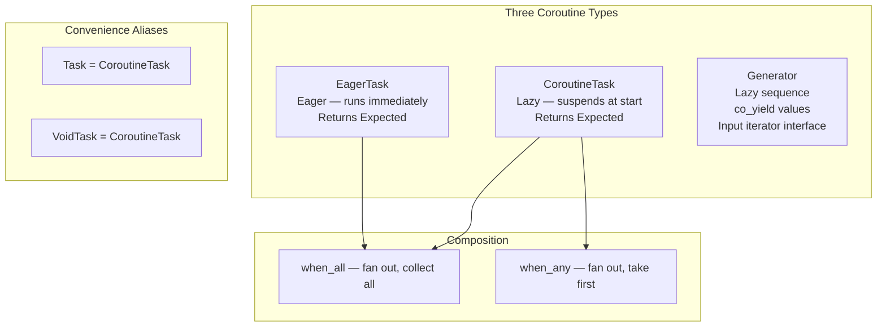

# Overview - CoroutineTask

*Fat-P Library — February 2026*

---

## Executive Summary

CoroutineTask provides lightweight C++20 coroutine types integrated with Fat-P's Expected error handling. Three main types address different use cases: `CoroutineTask<T, E>` is a lazy coroutine that suspends on creation and executes when awaited, returning `Expected<T, E>` for explicit error propagation without exceptions. `EagerTask<T, E>` starts executing immediately on creation and can be awaited later to collect the result. `Generator<T>` is a lazy sequence producer that yields values one at a time, compatible with range-based for loops. Composition utilities (`when_all`, `when_any`) enable fan-out/fan-in patterns. All types are header-only, zero-allocation on the hot path (compiler HALO optimization), and require no runtime library beyond the C++20 standard library and `Expected.h`.

---

## Overview Card

**Component:** CoroutineTask
**Problem solved:** Structured asynchronous and lazy computation with compile-time error handling—no callback chains, no manual state machines, no exception overhead
**When to use:** Async I/O composition; lazy computation pipelines; sequence generation; any workflow where callback-based async code has become unreadable
**When NOT to use:** Tight numerical loops (coroutine frame overhead matters); compilers without `<coroutine>` library support; code that must work without Expected.h
**Key guarantee:** `CoroutineTask` is lazy (does not execute until awaited); `Generator` produces values on demand; all error paths go through Expected, never through exceptions
**std equivalent:** `std::generator` (C++23) covers the Generator use case. No standard equivalent for `CoroutineTask` or `EagerTask`.
**Boost equivalent:** None (Boost.Coroutine2 is stackful, not C++20 coroutines)
**Other alternatives:** cppcoro (Lewis Baker), folly::coro, libunifex
**Read next:** User Manual - CoroutineTask

---

## Architecture



The key design decision is **Expected integration**. C++20 coroutines normally propagate errors via exceptions (`unhandled_exception()` in the promise type). CoroutineTask captures exceptions internally and converts them to `Expected<T, E>`, giving the caller explicit control over error handling without try-catch blocks.

---

## Feature Inventory

### CoroutineTask (Lazy)

```cpp
fat_p::CoroutineTask<int> compute(int x)
{
    if (x < 0)
        co_return fat_p::Unexpected<std::string>("negative input");
    co_return x * x;
}

auto task = compute(5);       // Nothing executes yet
auto result = task.await();   // Executes now, returns Expected<int, string>
if (result) std::cout << *result << "\n";  // 25
```

### EagerTask (Immediate)

```cpp
fat_p::EagerTask<int> fetch_data()
{
    // Starts executing immediately on construction
    co_return expensive_computation();
}

auto task = fetch_data();     // Computation begins now
// ... do other work ...
auto result = task.await();   // Collect result (may already be done)
```

### Generator (Lazy Sequence)

```cpp
fat_p::Generator<int> fibonacci()
{
    int a = 0, b = 1;
    while (true)
    {
        co_yield a;
        auto next = a + b;
        a = b;
        b = next;
    }
}

for (int n : fibonacci())
{
    if (n > 1000) break;
    std::cout << n << " ";
}
```

### Composition

```cpp
auto [a, b, c] = co_await fat_p::when_all(task1, task2, task3);
auto first = co_await fat_p::when_any(task1, task2, task3);
```

---

## Performance Characteristics

| Operation | Cost | Mechanism |
|-----------|------|-----------|
| Coroutine frame allocation | ~10–20 ns | Compiler-managed (HALO elision possible) |
| Resume/suspend | ~5–10 ns | Coroutine handle manipulation |
| Generator yield | ~2–5 ns | Suspend + store value |

Coroutine frames are typically heap-allocated, but compilers can elide the allocation when the coroutine's lifetime is bounded by the caller (Heap Allocation eLision Optimization — HALO). GCC and Clang perform this optimization at `-O2` and above.

---

## Final Assessment

**Permanence.** C++20 coroutines are a language feature, not a library that can be deprecated. `std::generator` (C++23) covers sequence generation but nothing else. No standard equivalent for task types with Expected integration is planned.

**Integration.** Expected-based error returns mean coroutine error handling is consistent with the rest of the Fat-P library. No exception overhead. No invisible error paths.

---

*CoroutineTask.h — Fat-P Library*
