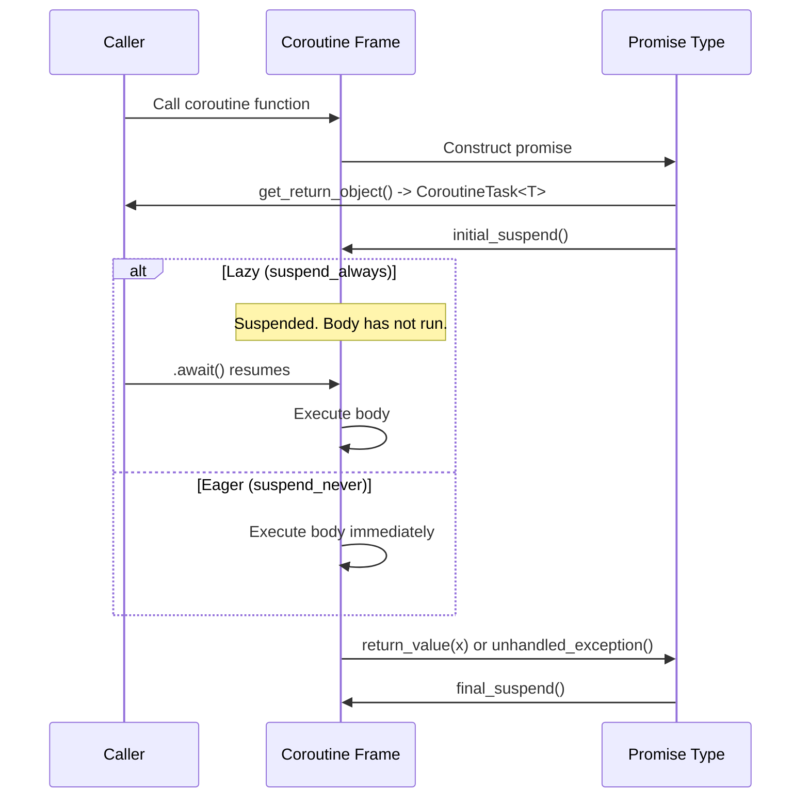

# User Manual - CoroutineTask

*February 2026*

---

**Scope:** Complete usage guide for Fat-P's C++20 coroutine types: `CoroutineTask<T, E>`, `EagerTask<T, E>`, `Generator<T>`, composition utilities, and convenience aliases. Includes the coroutine mechanics needed to understand suspension and resumption, the Expected integration design, and worked examples for common async patterns.

**Not covered:** C++20 coroutine specification in full (see cppreference); stackful coroutines (Boost.Coroutine2); async I/O executors (CoroutineTask provides the task type; executors like ThreadPool drive resumption).

**Prerequisites:** C++20 with `<coroutine>` library support; basic understanding of what `co_await`, `co_return`, and `co_yield` do; familiarity with `Expected<T, E>`.

---

## User Manual Card

**Component:** CoroutineTask
**Primary use case:** Structure async or lazy computation as sequential code with Expected-based error handling
**Integration pattern:** Write coroutine functions with `co_return`/`co_await` -> call `.await()` from non-coroutine code
**Key API:** `CoroutineTask<T,E>`, `EagerTask<T,E>`, `Generator<T>`, `when_all()`, `when_any()`, `Task<T>`, `VoidTask`
**std equivalent:** `std::generator` (C++23) for Generator; nothing for Task types
**Common mistakes:** Awaiting a CoroutineTask twice (UB); forgetting CoroutineTask is lazy; using Generator after coroutine finishes
**Performance notes:** Frame allocation is a single heap allocation (HALO may elide it entirely); resume/suspend manipulates coroutine handles; Generator yield is a suspend plus value store — the lightest coroutine operation. See `components/CoroutineTask/results/` for current platform-specific benchmark data.

---

## Table of Contents

1. Why Coroutines?
2. How C++20 Coroutines Work Under the Hood
3. CoroutineTask: Lazy Computation
4. EagerTask: Immediate Computation
5. Generator: Lazy Sequences
6. Error Handling: The Expected Integration
7. Composition: when_all and when_any
8. SyncAwaitable: Bridging Sync and Async
9. Convenience Aliases
10. Use Case: Async Data Pipeline
11. Use Case: Retry with Exponential Backoff
12. Use Case: Parallel Fan-Out / Fan-In
13. Use Case: Infinite Sequence Generation
14. Best Practices
15. Advanced Usage
16. Coroutine Frame Allocation and HALO
17. Performance Characteristics
18. Compiler Support
19. Thread Safety
20. Troubleshooting
21. Known Limitations
22. API Reference
23. FAQ

---

## Why Coroutines?

Before C++20, asynchronous code was expressed through callbacks, futures, or manual state machines. A three-step async pipeline---fetch data, transform it, store the result---required nested callbacks (unreadable), chained futures (verbose), or a hand-written state machine (error-prone). Each approach obscured the sequential logic under mechanical boilerplate.

Coroutines let you write the same pipeline as sequential code. The compiler transforms the function into a state machine. You write `co_await fetch()`, and the compiler generates the suspension point, the state save, and the resumption logic. The code reads like synchronous code but can suspend and resume.

Fat-P's CoroutineTask adds what the raw language feature does not: Expected-based error handling. Raw C++20 coroutines propagate errors via exceptions (`unhandled_exception()` in the promise type). CoroutineTask captures errors into `Expected<T, E>`, giving the caller an explicit value to check rather than an exception to catch.

---

## How C++20 Coroutines Work Under the Hood

A C++20 coroutine is any function that contains `co_await`, `co_return`, or `co_yield`. The compiler transforms it into a state machine with a **coroutine frame** (heap-allocated storage for local variables and suspension state) and a **promise object** (controls the coroutine's behavior at each suspension point).

When you call a coroutine function, the compiler:

1. Allocates a coroutine frame on the heap.
2. Copies/moves function parameters into the frame.
3. Constructs the promise object inside the frame.
4. Calls `promise.get_return_object()` to create the return value (e.g., `CoroutineTask<T>`).
5. Calls `promise.initial_suspend()`---if it returns `std::suspend_always`, the coroutine suspends before executing any body code (lazy). If `std::suspend_never`, the body starts immediately (eager).



CoroutineTask uses `suspend_always` for `initial_suspend()` (lazy). EagerTask uses `suspend_never` (eager). This single difference in the promise type controls when the body executes.

---

## CoroutineTask: Lazy Computation

`CoroutineTask<T, E>` is the primary task type. The coroutine body does not execute when the function is called. It executes when `.await()` is called.

```cpp
fat_p::CoroutineTask<int> square(int x)
{
    co_return x * x;
}

auto task = square(7);       // Nothing executes---coroutine is suspended
auto result = task.await();  // Body runs now, returns Expected<int, std::string>
// result.value() == 49
```

### Returning Errors

```cpp
fat_p::CoroutineTask<double> safe_divide(double a, double b)
{
    if (b == 0.0)
        co_return fat_p::Unexpected<std::string>("division by zero");
    co_return a / b;
}

auto result = safe_divide(10.0, 0.0).await();
// result.hasValue() == false
// result.error() == "division by zero"
```

### Chaining Tasks

Inside a coroutine, `co_await` another CoroutineTask to chain computations:

```cpp
fat_p::CoroutineTask<double> compute()
{
    auto a = co_await safe_divide(10.0, 3.0);
    if (!a) co_return fat_p::Unexpected(a.error());

    auto b = co_await safe_divide(*a, 2.0);
    co_return b;
}
```

Each `co_await` suspends the current coroutine, executes the awaited coroutine, and resumes with the result.

---

## EagerTask: Immediate Computation

`EagerTask<T, E>` starts executing immediately on construction:

```cpp
fat_p::EagerTask<int> fetch()
{
    co_return expensive_computation();  // Runs NOW
}

auto task = fetch();       // Computation begins immediately
do_other_work();           // Concurrent with computation (if on separate thread)
auto result = task.await();  // Collect result (may already be done)
```

Use EagerTask when you want computation to begin as soon as the task is created. This is analogous to `std::async(std::launch::async)` but with Expected error handling.

---

## Generator: Lazy Sequences

`Generator<T>` produces values lazily via `co_yield`. It implements the input iterator interface, enabling range-based for loops:

```cpp
fat_p::Generator<int> range(int start, int end)
{
    for (int i = start; i < end; ++i)
        co_yield i;
}

for (int n : range(0, 10))
    std::cout << n << " ";  // 0 1 2 3 4 5 6 7 8 9
```

### Infinite Generators

Generators can be infinite. The consumer controls termination:

```cpp
fat_p::Generator<uint64_t> fibonacci()
{
    uint64_t a = 0, b = 1;
    while (true)
    {
        co_yield a;
        auto next = a + b;
        a = b;
        b = next;
    }
}

for (uint64_t f : fibonacci())
{
    if (f > 1000) break;
    std::cout << f << " ";
}
```

### vs std::generator (C++23)

`std::generator` provides the same lazy sequence capability with standard library backing. Fat-P's Generator exists because C++23 library support is not yet universal. If your compiler supports `std::generator`, either works.

---

## Error Handling: The Expected Integration

The promise type inside CoroutineTask captures exceptions via `unhandled_exception()` and stores them as Expected error values:

- `co_return value` -> Expected holds the value
- `co_return Unexpected(error)` -> Expected holds the error
- Uncaught exception inside the coroutine -> caught by the promise, converted to error string

The caller never sees an exception. `.await()` returns `Expected<T, E>`. This design means error handling is explicit and consistent with the rest of the Fat-P library.

The alternative---letting exceptions propagate through coroutine suspension points---is fragile. An exception thrown during `co_await` can leave the coroutine frame in an inconsistent state on some compilers. Expected avoids this entirely.

---

## Composition: when_all and when_any

### when_all

Awaits multiple tasks and returns all results:

```cpp
fat_p::CoroutineTask<void> parallel_work()
{
    auto [a, b, c] = co_await fat_p::when_all(task1(), task2(), task3());
    // a, b, c are Expected values
    if (a && b && c)
        process(*a, *b, *c);
}
```

### when_any

Returns the first task to complete:

```cpp
auto first = co_await fat_p::when_any(
    fetch_from_primary(),
    fetch_from_backup());
```

---

## SyncAwaitable: Bridging Sync and Async

`SyncAwaitable<T>` wraps a synchronous value so it can be `co_await`ed:

```cpp
fat_p::CoroutineTask<int> mixed()
{
    auto sync_value = co_await fat_p::SyncAwaitable<int>(42);
    auto async_value = co_await some_async_task();
    co_return sync_value + async_value;
}
```

Useful when composing sync and async operations in the same coroutine.

---

## Convenience Aliases

```cpp
template <typename T>
using Task = CoroutineTask<T, std::string>;

using VoidTask = CoroutineTask<std::monostate, std::string>;
```

`Task<int>` = `CoroutineTask<int, std::string>`. `VoidTask` = side-effect coroutine with no meaningful return value.

---

## Use Case: Async Data Pipeline

A three-stage pipeline: fetch, transform, store. Each stage may fail.

```cpp
fat_p::Task<ProcessedData> pipeline(const std::string& source)
{
    auto raw = co_await fetch_data(source);
    if (!raw)
        co_return fat_p::Unexpected("fetch failed: " + raw.error());

    auto transformed = co_await transform(*raw);
    if (!transformed)
        co_return fat_p::Unexpected("transform failed: " + transformed.error());

    auto stored = co_await store(*transformed);
    if (!stored)
        co_return fat_p::Unexpected("store failed: " + stored.error());

    co_return *transformed;
}
```

Each stage is a separate coroutine. Errors propagate explicitly. No callbacks, no nested lambdas.

## Use Case: Retry with Exponential Backoff

```cpp
template <typename F>
fat_p::Task<typename std::invoke_result_t<F>::value_type>
retry(F&& operation, int max_attempts, std::chrono::milliseconds initial_delay)
{
    auto delay = initial_delay;
    for (int attempt = 0; attempt < max_attempts; ++attempt)
    {
        auto result = co_await operation();
        if (result)
            co_return *result;

        if (attempt + 1 < max_attempts)
        {
            std::this_thread::sleep_for(delay);
            delay *= 2;
        }
    }
    co_return fat_p::Unexpected<std::string>("all retries exhausted");
}
```

## Use Case: Parallel Fan-Out / Fan-In

Fetch data from multiple sources in parallel, combine results:

```cpp
fat_p::Task<CombinedResult> fan_out_fan_in()
{
    auto [users, products, orders] = co_await fat_p::when_all(
        fetch_users(),
        fetch_products(),
        fetch_orders());

    if (!users || !products || !orders)
        co_return fat_p::Unexpected<std::string>("partial failure");

    co_return combine(*users, *products, *orders);
}
```

## Use Case: Infinite Sequence Generation

Generate prime numbers lazily, consume only what is needed:

```cpp
fat_p::Generator<uint64_t> primes()
{
    std::vector<uint64_t> found;
    for (uint64_t candidate = 2; ; ++candidate)
    {
        bool is_prime = true;
        for (uint64_t p : found)
        {
            if (p * p > candidate) break;
            if (candidate % p == 0) { is_prime = false; break; }
        }
        if (is_prime)
        {
            found.push_back(candidate);
            co_yield candidate;
        }
    }
}

// Consume first 100 primes
int count = 0;
for (uint64_t p : primes())
{
    std::cout << p << " ";
    if (++count >= 100) break;
}
```

---

## Best Practices

### Prefer CoroutineTask (Lazy) Over EagerTask

Lazy evaluation gives the caller control over when execution begins. This makes resource usage predictable and debugging easier. Use EagerTask only when you need computation to overlap with other work.

### Check Expected Results at Every co_await

Each `co_await` returns an Expected. Check it before using the value. Unchecked errors silently propagate as undefined behavior if you dereference an error Expected.

### Keep Coroutines Short

Long coroutines accumulate local variables in the coroutine frame, increasing heap allocation size and reducing HALO optimization opportunities. Break complex operations into smaller coroutines that chain via `co_await`.

### Avoid Capturing Raw Pointers in Coroutines

Coroutines can outlive the scope that created them. If a coroutine captures a raw pointer to a stack variable, the pointer dangles when the scope exits and the coroutine resumes later. Use value captures or shared_ptr.

### Use Generator for Sequences, Not Tasks

Generators produce multiple values via `co_yield`. Tasks produce a single result via `co_return`. Do not use a Generator when you need a single async result, and do not use a Task when you need a sequence.

---

## Advanced Usage

### Integration with ThreadPool

Submit a coroutine task to a thread pool:

```cpp
fat_p::ThreadPool pool(4);
auto future = pool.submit([&]() {
    auto task = compute_pi(1'000'000);
    return task.await();
});
auto result = future.get();  // Expected<double, string>
```

The coroutine executes on a worker thread. The future delivers the Expected result.

### Custom Error Types

The default error type is `std::string`. You can use any type:

```cpp
enum class AppError { NotFound, Timeout, PermissionDenied };

fat_p::CoroutineTask<User, AppError> find_user(int id)
{
    if (id <= 0)
        co_return fat_p::Unexpected(AppError::NotFound);
    co_return lookup(id);
}
```

---

## Coroutine Frame Allocation and HALO

Each coroutine invocation allocates a coroutine frame on the heap. The frame holds local variables, the promise object, and suspension state.

The compiler can elide this allocation when the coroutine's lifetime is provably bounded by the caller (Heap Allocation eLision Optimization---HALO). GCC and Clang perform HALO at `-O2` and above. To maximize HALO:

- Keep coroutines short (fewer locals = smaller frame)
- Await coroutines immediately rather than storing them
- Avoid passing coroutine handles to containers or callbacks

If coroutine overhead matters in your hot path, verify with a profiler that the allocation is being elided.

---

## Performance Characteristics

| Operation | Cost | Notes |
|-----------|------|-------|
| Coroutine frame allocation | Single heap allocation | HALO may elide entirely at -O2 |
| Resume/suspend | Coroutine handle manipulation | No syscall, no lock |
| Generator yield | Suspend + store value | Lightest coroutine operation |
| when_all (N tasks) | O(N) * per-task cost | Sequential in current implementation |

---

## Compiler Support

| Compiler | Minimum | Notes |
|----------|---------|-------|
| GCC | 11+ | Full support |
| Clang | 14+ | Full support |
| MSVC | 19.28+ (VS 2019 16.8) | Full support |

Guarded by `FATP_HAS_COROUTINES` in `CppFeatureDetection.h`. If unavailable, the entire header is a no-op.

---

## Thread Safety

Coroutine types are NOT thread-safe. A single task must not be awaited from multiple threads. Generator iterators must not be advanced from multiple threads.

For concurrent execution, submit tasks to ThreadPool and await futures from a single thread.

---

## Troubleshooting

### Compiler error: "no member named 'coroutine_handle'"

Compiler or standard library lacks `<coroutine>`. Check `FATP_HAS_COROUTINES`. Requires GCC 11+, Clang 14+, MSVC 19.28+.

### Task never executes

CoroutineTask is lazy. You must call `.await()`. Storing the task without awaiting it means the body never runs.

### Double-await crash

Awaiting a task twice is UB. The coroutine handle is destroyed after first await. Store the result if needed.

### Generator yields unexpected values after completion

Advancing a Generator iterator past the end is UB. Use range-based for or check `begin() != end()`.

### Memory leak from unawaited tasks

A CoroutineTask that is never awaited and never destroyed leaks its coroutine frame. Ensure all tasks are either awaited or destroyed.

---

## Known Limitations

**No scheduler integration.** CoroutineTask does not schedule on threads. Use ThreadPool for async I/O.

**No cancellation tokens.** Cancellation is cooperative---the coroutine must check a flag.

**Single await.** Each task can be awaited exactly once.

**No symmetric transfer.** No tail-call optimization between coroutines.

**when_all is sequential.** The current implementation awaits tasks in order, not in parallel.

---

## API Reference

| Type / Function | Description |
|----------------|-------------|
| `CoroutineTask<T, E>` | Lazy coroutine returning `Expected<T, E>` |
| `EagerTask<T, E>` | Eager coroutine returning `Expected<T, E>` |
| `Generator<T>` | Lazy sequence via `co_yield` |
| `when_all(tasks...)` | Await all, return tuple of Expected |
| `when_any(tasks...)` | Await first to complete |
| `SyncAwaitable<T>` | Wrap sync value for `co_await` |
| `Task<T>` | Alias for `CoroutineTask<T, std::string>` |
| `VoidTask` | Alias for `CoroutineTask<std::monostate, std::string>` |

---

## FAQ

**Q: Can I use CoroutineTask with ThreadPool?**

Yes. Submit a lambda that calls `.await()`. The coroutine runs on the worker thread.

**Q: Why not std::future?**

`std::future` propagates errors via `exception_ptr`, requiring `rethrow_exception()`. CoroutineTask returns Expected, which can be inspected without throwing.

**Q: Is Generator compatible with std::ranges?**

Yes. Generator provides `begin()`/`end()` returning input iterators, satisfying `std::ranges::input_range`.

**Q: Can I co_await a std::future?**

Not directly. You would need a custom awaitable adapter. SyncAwaitable wraps synchronous values but not futures.

---

*CoroutineTask.h --- Fat-P Library*
