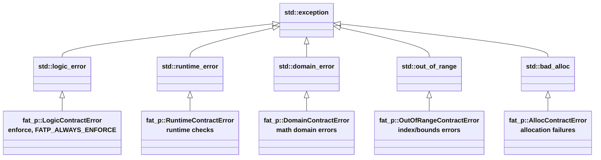

# User Manual - Enforce

**Scope:** Complete usage guide for the `fat_p::enforce` macro system: condition macros (FATP_ENFORCE, FATP_ALWAYS_ENFORCE, FATP_ENFORCE_WARN, FATP_NOEXCEPT_ENFORCE, FATP_ABORT_ENFORCE), Expected macros, predicate macros, policies (DebugOnly, AlwaysEnforce, Warning, NoThrow, Abort), predicates (core, container, range, floating-point, iterator), error message formatting, and Expected integration.

**Not covered:**
- ContractException hierarchy design (see ContractException User Manual)
- Expected<T,E> monadic operations (see Expected User Manual)
- C++26 contracts language feature

**Prerequisites:** C++20; understanding of preconditions/postconditions/invariants; awareness of `assert()` limitations (no control over failure behavior, stripped in release)

---

## User Manual Card

**Component:** Enforce
**Primary use case:** Replace `assert()` with policy-controlled contract checking that can throw, terminate, log, or return Expected based on compile-time configuration
**Integration pattern:** Use `FATP_ENFORCE(condition)` for debug-only checks (zero cost in release), `FATP_ALWAYS_ENFORCE(condition)` for checks that must survive release builds; pick the response via the macro family (WARN, NOEXCEPT, ABORT) or build mode
**Key API:** `FATP_ENFORCE`, `FATP_ALWAYS_ENFORCE`, `FATP_ENFORCE_WARN`, `FATP_NOEXCEPT_ENFORCE`, `FATP_ABORT_ENFORCE`, `FATP_ENFORCE_EXPECTED`, `DebugOnlyPolicy`, `AlwaysEnforcePolicy`, `NoThrowPolicy`, `AbortPolicy`
**std equivalent:** None
**Common mistakes:** Placing side effects inside enforce conditions (stripped in some policies); using AlwaysEnforcePolicy for checks that should be debug-only; ignoring the Expected return from ENFORCE_EXPECTED macros
**Performance notes:** DebugOnlyPolicy compiles to nothing in release. AlwaysEnforcePolicy adds a branch per check. Message formatting is deferred until violation. See `components/Enforce/results/` for current data

---
## Table of Contents

1. [What is Enforce?](#what-is-enforce)
   - [The Contract Enforcement Problem](#the-contract-enforcement-problem)
   - [Why Contracts Matter](#why-contracts-matter)
   - [The C++ Landscape](#the-c-landscape)
   - [Where Enforce Fits](#where-enforce-fits)
2. [Core Architecture](#core-architecture)
   - [Design Principles](#design-principles)
   - [Component Diagram](#component-diagram)
   - [Policy-Based Design](#policy-based-design)
3. [Getting Started](#getting-started)
   - [Prerequisites](#prerequisites)
   - [Integration](#integration)
   - [First Program](#first-program)
4. [Core Macros](#core-macros)
   - [Condition Macros](#condition-macros)
   - [Expected Macros](#expected-macros)
   - [Predicate Macros](#predicate-macros)
5. [Policies](#policies)
   - [DebugOnlyPolicy](#debugonlypolicy)
   - [AlwaysEnforcePolicy](#alwaysenforcepolicy)
   - [WarningPolicy](#warningpolicy)
   - [NoThrowPolicy](#nothrowpolicy)
   - [AbortPolicy](#abortpolicy)
6. [Predicates](#predicates)
   - [Core Predicates](#core-predicates)
   - [Container Predicates](#container-predicates)
   - [Range Predicates](#range-predicates)
   - [Floating-Point Predicates](#floating-point-predicates)
   - [Iterator Predicates](#iterator-predicates)
7. [Error Messages](#error-messages)
   - [Message Formatting](#message-formatting)
   - [Full Error Format](#full-error-format)
   - [Custom Stringification](#custom-stringification)
8. [Expected Integration](#expected-integration)
   - [Basic Pattern](#basic-pattern)
   - [Error Propagation](#error-propagation)
9. [Custom Policies](#custom-policies)
    - [Custom Predicates](#custom-predicates)
    - [Custom Raisers](#custom-raisers)
    - [Custom Violation Handler](#custom-violation-handler)
10. [Performance Characteristics](#performance-characteristics)
    - [Benchmark Methodology](#benchmark-methodology)
    - [Benchmark Results](#benchmark-results)
    - [Optimization Guidelines](#optimization-guidelines)
12. [Comparison with Other Approaches](#comparison-with-other-approaches)
    - [Feature Comparison](#feature-comparison)
    - [Code Comparison](#code-comparison)
13. [Migration Guide](#migration-guide)
    - [From assert()](#from-assert)
    - [From Manual if-throw](#from-manual-if-throw)
14. [Best Practices](#best-practices)
15. [Troubleshooting](#troubleshooting)
    - [Compilation Errors](#compilation-errors)
    - [Runtime Issues](#runtime-issues)
16. [Summary](#summary)

---

## What is Enforce?

### The Contract Enforcement Problem

Every function makes promises. A sorting function promises to return elements in order. A memory allocator promises to return valid pointers or indicate failure. A division function promises not to divide by zero. These promises are called *contracts*.

Design by Contract (DbC) formalizes this idea: functions have preconditions (what callers must guarantee), postconditions (what the function guarantees in return), and invariants (what remains true throughout). When contracts are violated, bugs have occurred, and the program is in an undefined state.

The challenge is not understanding contracts; it is enforcing them consistently in C++:

```cpp
// Manual contract enforcement: verbose and inconsistent
void process_buffer(const char* data, size_t size, char* output)
{
    if (data == nullptr)
    {
        throw std::invalid_argument("data is null");
    }
    if (output == nullptr)
    {
        throw std::invalid_argument("output is null");
    }
    if (size == 0)
    {
        throw std::invalid_argument("size is zero");
    }
    if (size > MAX_BUFFER_SIZE)
    {
        throw std::length_error("size exceeds maximum");
    }
    
    // The actual logic is buried under boilerplate
    // ...
}
```

This approach has several problems:

| Problem | Impact |
|---------|--------|
| Boilerplate obscures logic | Real code is 4 lines; checking is 16 lines |
| Inconsistent exception types | Some throw `invalid_argument`, others `length_error` |
| No way to disable in release | Every check runs in production, even internal invariants |
| No structured diagnostics | Where did it fail? What was the actual value? |
| Copy-paste errors | Each check is handwritten, introducing variation |

Using `assert()` trades one set of problems for another:

```cpp
void process_buffer(const char* data, size_t size, char* output)
{
    assert(data != nullptr);
    assert(output != nullptr);
    assert(size > 0);
    assert(size <= MAX_BUFFER_SIZE);
    
    // ...
}
```

| Problem | Impact |
|---------|--------|
| Disappears in release | `assert()` compiles to nothing with `NDEBUG` |
| Terminates program | No recovery possible; `std::abort()` is called |
| No exceptions | Cannot catch and handle in calling code |
| Minimal diagnostics | Just the expression and file/line |
| All-or-nothing | Cannot keep some checks while removing others |

### Why Contracts Matter

Contract violations are not ordinary errors. They represent bugs in the program, not runtime conditions like "file not found" or "network timeout." This distinction matters for how we handle them.

**Expected errors** should use normal error handling:

```cpp
// File might not exist - this is expected
std::optional<std::string> read_config(const std::string& path)
{
    std::ifstream file(path);
    if (!file)
    {
        return std::nullopt;  // Normal error path
    }
    // ...
}
```

**Contract violations** indicate programmer error:

```cpp
// Caller promised data is valid - violation means a bug
void process(const Data& data)
{
    // If data.is_valid() is false, the caller has a bug.
    // This is not a runtime condition; it is a programming error.
    FATP_ALWAYS_ENFORCE(data.is_valid(), "Invalid data passed to process()");
    // ...
}
```

When contracts are violated, the program is already in an undefined state. The goal of contract enforcement is not graceful recovery but rapid detection. Bugs caught at the point of contract violation are far easier to diagnose than bugs that manifest later as corrupted data or mysterious crashes.

This is why the Enforce system provides both throwing and non-throwing options. Sometimes you want to throw an exception to unwind the stack and report the bug. Sometimes you are in a destructor or `noexcept` function where throwing would terminate the program. The appropriate response depends on context.

### The C++ Landscape

Several solutions exist for contract enforcement in C++:

| Solution | Pros | Cons |
|----------|------|------|
| `assert()` | Simple, standard, zero overhead in release | All-or-nothing, terminates program, no exceptions |
| Manual if-throw | Full control over behavior | Verbose, inconsistent, error-prone |
| C++20 Contracts | Standard, compiler-integrated | Limited compiler support, inflexible |
| Boost.Contract | Comprehensive, well-tested | Heavy dependency, complex API, runtime overhead |
| GSL Expects/Ensures | Simple, well-designed | Limited to terminate behavior, no flexibility |
| Custom macros | Tailored to project needs | Maintenance burden, often poorly designed |

C++20 introduced language-level contracts, but adoption is limited. As of 2024, no major compiler fully implements them, and the specification continues to evolve. The Enforce system provides similar functionality today, using C++20 features (`std::source_location`, concepts, `__VA_OPT__`).

### Where Enforce Fits

The Enforce system occupies a specific niche: **policy-based contract enforcement with zero-overhead debug checks**. It provides:

- **Policy-based error handling**: Choose throw, warn, abort, log, or return Expected per-check
- **Rich predicates**: Type-safe, reusable condition checking with semantic names
- **Detailed diagnostics**: File, line, expression, and custom messages automatically
- **Zero overhead option**: Debug-only macros compile to nothing in release
- **Thread-safe**: All operations are thread-safe by default
- **Header-only**: No library to link, no dependencies beyond C++20 standard library

**When to use Enforce:**

- Function precondition and postcondition checking
- Internal invariant validation during development
- API boundary protection in library code
- Debug-only expensive validations (deep structure checks)
- Exception-free error reporting (via Expected integration)
- Destructor and noexcept function safety

**When NOT to use Enforce:**

- User input validation (use proper error handling with user-friendly messages)
- Expected failure cases like file-not-found (use explicit error handling)
- Performance-critical inner loops (even debug checks add some overhead)
- Recoverable runtime conditions (use exceptions or error codes directly)

---

## Core Architecture

### Design Principles

The Enforce system is built on three key principles:

**1. Separation of Concerns**

The check logic, failure behavior, and message formatting are independent components. This separation allows changing the failure behavior without modifying the check, and adding new predicates without touching the enforcement machinery.

**2. Compile-Time Policy Selection**

The failure behavior is determined entirely at compile time through template policies. This means the compiler can optimize away unused code paths entirely. A debug-only check in a release build does not generate a single instruction.

**3. Zero-Overhead Abstraction**

When a policy specifies no action (like `DebugOnlyPolicy` in release builds), the entire enforcement call compiles to nothing. Not a function call that returns immediately, but literally zero instructions. This is verified through disassembly.

### Component Diagram

```mermaid
flowchart TB
    subgraph UserCode["User Code"]
        UC["FATP_ENFORCE(ptr != nullptr, 'pointer is null')"]
    end
    
    subgraph Macros["enforce.h Macros"]
        IMPL["enforce_policy_impl&lt;Policy&gt;(condition, expression, locus)"]
    end
    
    UserCode --> Macros
    
    Macros --> RS["RaiserSelector<br/>Policy to Raiser mapping<br/>DebugOnly → NoOp<br/>Always → Logic<br/>Warning → Cerr"]
    Macros --> ENF["Enforcer<br/>RAII object that<br/>calls Raiser on<br/>destruction if<br/>condition failed"]
    Macros --> MB["MessageBuilder<br/>Builds formatted<br/>error message from<br/>variadic args"]
    
    ENF --> Raisers
    
    subgraph Raisers["Raisers"]
        LR["LogicRaiser<br/>throws<br/>LogicContractError"]
        AR["AbortRaiser<br/>aborts<br/>program"]
        WR["WarningRaiser<br/>logs to<br/>stderr"]
        NTR["NoThrowRaiser<br/>calls<br/>handler"]
        NOR["NoOpRaiser<br/>nothing<br/>zero overhead"]
    end
```



### Policy-Based Design

The central insight is that the *consequence* of a contract violation should be decoupled from the *check* itself. The same condition might warrant different responses in different contexts:

```cpp
// The same logical check with different consequences:

FATP_ENFORCE(ptr != nullptr, "...");        // Debug: throw, Release: nothing
FATP_ALWAYS_ENFORCE(ptr != nullptr, "..."); // Always throw
FATP_ENFORCE_WARN(ptr != nullptr, "...");   // Log and continue
FATP_NOEXCEPT_ENFORCE(ptr != nullptr, "...");// Call handler, never throw
FATP_ABORT_ENFORCE(ptr != nullptr, "...");  // Immediate termination
```

This is implemented through the `RaiserSelector` template, which maps policies to raisers at compile time:

```cpp
template <typename Policy>
struct RaiserSelector;

template <>
struct RaiserSelector<DebugOnlyPolicy>
{
#ifdef NDEBUG
    using type = NoOpRaiser;    // Zero overhead in release
#else
    using type = LogicRaiser;   // Throws in debug
#endif
};

template <>
struct RaiserSelector<AlwaysEnforcePolicy>
{
    using type = LogicRaiser;   // Always throws
};

template <>
struct RaiserSelector<NoThrowPolicy>
{
    using type = NoThrowRaiser; // Calls handler, never throws
};
```

The compiler sees the policy at compile time, selects the appropriate raiser, and (in the case of `NoOpRaiser`) optimizes away the entire enforcement call.

---

## Getting Started

### Prerequisites

| Requirement | Minimum Version |
|-------------|-----------------|
| C++ Standard | C++20 |
| Compiler | GCC 11+, Clang 15+, MSVC 2019 16.10+ |
| Dependencies | None (header-only) |

### Integration

The Enforce system consists of these headers:

| Header | Purpose |
|--------|---------|
| `enforce.h` | Main macros - include this for most use cases |
| `enforce_predicates.h` | Predicate definitions (included by enforce.h) |
| `enforce_raisers.h` | Raiser policies (included by enforce.h) |
| `enforce_raiser_selector.h` | Policy-to-raiser mapping (included by enforce.h) |
| `enforce_enforcers.h` | RAII enforcer class (included by enforce.h) |
| `ContractException.h` | Exception class hierarchy |

Basic usage requires only:

```cpp
#include "enforce.h"
```


### First Program

```cpp
#include "enforce.h"
#include <iostream>
#include <vector>

// A function with enforced preconditions
double safe_divide(double numerator, double denominator)
{
    // Precondition: denominator must not be zero
    FATP_ALWAYS_ENFORCE(denominator != 0.0, "Division by zero: denominator=", denominator);
    
    return numerator / denominator;
}

// A function with debug-only checks
void process_data(const std::vector<int>& data, size_t index)
{
    // Debug-only bounds check (zero overhead in release)
    FATP_ENFORCE(index < data.size(), 
            "Index out of bounds: index=", index, " size=", data.size());
    
    // Use the data...
    std::cout << "Value at index " << index << ": " << data[index] << "\n";
}

int main()
{
    try
    {
        std::cout << "10 / 2 = " << safe_divide(10, 2) << "\n";
        
        std::vector<int> vec = {1, 2, 3, 4, 5};
        process_data(vec, 2);
        
        // This will throw:
        std::cout << "10 / 0 = " << safe_divide(10, 0) << "\n";
    }
    catch (const fat_p::LogicContractError& e)
    {
        std::cerr << "Contract violation: " << e.what() << "\n";
        return 1;
    }
    
    return 0;
}
```

Compile and run:

```bash
# Debug build (checks enabled)
g++ -std=c++17 -g example.cpp -o example

# Release build (debug checks disabled)
g++ -std=c++17 -O2 -DNDEBUG example.cpp -o example_release
```

---

## Core Macros

### Condition Macros

| Macro | Active In | On Failure |
|-------|-----------|------------|
| `FATP_ENFORCE(cond, ...)` | Debug only | Throws `LogicContractError` |
| `FATP_ALWAYS_ENFORCE(cond, ...)` | Always | Throws `LogicContractError` |
| `FATP_ENFORCE_WARN(cond, ...)` | Always | Logs to stderr, continues |
| `FATP_NOEXCEPT_ENFORCE(cond, ...)` | Always | Calls violation handler, no throw |
| `FATP_ABORT_ENFORCE(cond, ...)` | Always | Calls `std::abort()` |

```cpp
void example(int* ptr, int count)
{
    // Debug-only check - zero overhead in release
    FATP_ENFORCE(ptr != nullptr, "Null pointer");
    
    // Always checked - for public API boundaries
    FATP_ALWAYS_ENFORCE(count > 0, "Count must be positive, got: ", count);
    
    // Warning only - log and continue
    FATP_ENFORCE_WARN(count < 1000, "Large count may be slow: ", count);
    
    // For noexcept functions and destructors
    FATP_NOEXCEPT_ENFORCE(is_valid_state(), "Invalid state");
    
    // For unrecoverable errors
    FATP_ABORT_ENFORCE(googole_connection_ok(), "Lost connection");
}
```

### Expected Macros

These macros return `Expected<void, std::string>` instead of throwing:

| Macro | Returns |
|-------|---------|
| `FATP_ENFORCE_EXPECTED(cond, ...)` | `Expected<void, std::string>` |
| `FATP_ALWAYS_ENFORCE_EXPECTED(cond, ...)` | `Expected<void, std::string>` |
| `FATP_ENFORCE_PREDICATE_EXPECTED(Pred, target, ...)` | `Expected<bool, std::string>` |

```cpp
fat_p::Expected<int, std::string> parse_positive(const std::string& s)
{
    auto check = FATP_ENFORCE_EXPECTED(!s.empty(), "Empty input string");
    if (!check)
    {
        return fat_p::unexpected(check.error());
    }
    
    int value = std::stoi(s);
    
    check = FATP_ENFORCE_EXPECTED(value > 0, "Value must be positive, got: ", value);
    if (!check)
    {
        return fat_p::unexpected(check.error());
    }
    
    return value;
}
```

### Predicate Macros

Generic predicate macros work with any predicate type:

```cpp
// Single argument predicates
FATP_ALWAYS_ENFORCE_1(NotNullPredicate, ptr, "Pointer is null");
FATP_ENFORCE_1(IsPositivePredicate, count, "Count must be positive");

// Two argument predicates
FATP_ALWAYS_ENFORCE_2(ValidIndexPredicate, idx, container, "Index out of bounds");
FATP_ALWAYS_ENFORCE_2(HasSizePredicate, expected, container, "Wrong size");

// Three argument predicates
FATP_ALWAYS_ENFORCE_3(InRangePredicate, value, min, max, "Value out of range");
FATP_ALWAYS_ENFORCE_3(ApproxEqualPredicate, epsilon, a, b, "Values not equal");
```

Convenience macros for common predicates:

```cpp
// Null checks
FATP_ALWAYS_ENFORCE_NOT_NULL(ptr, "Null pointer");
FATP_DEBUG_ENFORCE_NOT_NULL(ptr, "Debug null check");

// Numeric checks
FATP_ALWAYS_ENFORCE_IS_POSITIVE(count, "Must be positive");
FATP_ALWAYS_ENFORCE_IS_NON_NEGATIVE(offset, "Must be non-negative");
FATP_ALWAYS_ENFORCE_IN_RANGE(0, 100, value, "Value out of range");

// Container checks
FATP_ALWAYS_ENFORCE_NOT_EMPTY(container, "Container is empty");
FATP_ALWAYS_ENFORCE_IS_SORTED(container, "Container must be sorted");
FATP_ALWAYS_ENFORCE_VALID_INDEX(idx, container, "Invalid index");

// Floating-point checks
FATP_ALWAYS_ENFORCE_IS_FINITE(result, "Result is NaN or Inf");
FATP_ALWAYS_ENFORCE_APPROX_EQUAL(0.001, expected, actual, "Values differ");
```

---

## Policies

### DebugOnlyPolicy

Active only in debug builds (when `NDEBUG` is not defined). Compiles to zero instructions in release builds.

```cpp
// Only checked in debug builds
FATP_ENFORCE(index < size, "Index out of bounds");
```

Use for internal invariants that should never fail if the code is correct, but are too expensive to check in production.

### AlwaysEnforcePolicy

Active in all builds. Throws `LogicContractError` on failure.

```cpp
// Always checked, even in release
FATP_ALWAYS_ENFORCE(user_input > 0, "Invalid input: ", user_input);
```

Use for public API preconditions where callers might pass invalid arguments.

### WarningPolicy

Logs the violation to stderr but continues execution.

```cpp
// Logs warning but continues
FATP_ENFORCE_WARN(cache.size() < 10000, "Cache growing large: ", cache.size());
```

Use for non-critical conditions where you want visibility without stopping execution.

### NoThrowPolicy

Calls the global violation handler but never throws. Safe for `noexcept` functions.

```cpp
~Resource() noexcept
{
    FATP_NOEXCEPT_ENFORCE(handle_ != INVALID_HANDLE, "Invalid handle in destructor");
    release(handle_);
}
```

Use in:
- Destructors
- `noexcept` functions
- Signal handlers
- Any context where exceptions cannot propagate

### AbortPolicy

Immediately terminates the program with `std::abort()`.

```cpp
// No recovery possible - terminate immediately
FATP_ABORT_ENFORCE(googole_connection_ok(), "Critical: lost connection");
```

Use for truly unrecoverable situations where continuing would cause data corruption or security vulnerabilities.

---

## Predicates

Predicates are reusable condition checks that provide semantic meaning and type safety. They are struct types with a static `check()` method.

### Core Predicates

| Predicate | Check | Common Use |
|-----------|-------|------------|
| `BooleanPredicate` | `value` is truthy | Generic conditions |
| `NotNullPredicate` | `ptr != nullptr` | Pointer validation |
| `IsNullPredicate` | `ptr == nullptr` | Ensuring cleanup |
| `IsPositivePredicate` | `value > 0` | Counts, sizes |
| `IsNonNegativePredicate` | `value >= 0` | Offsets, indices |
| `IsIntegralPredicate` | `std::integral<T>` (the value's type is integral) | Numeric validation |

### Container Predicates

| Predicate | Check | Arguments |
|-----------|-------|-----------|
| `NotEmptyPredicate` | `!container.empty()` | container |
| `HasSizePredicate` | `container.size() == expected` | expected, container |
| `IsSortedPredicate` | `std::is_sorted(...)` | container |
| `ContainerIsUniquePredicate` | All elements unique | container |
| `HasNoNullElementsPredicate` | No element is null | container |
| `AllSatisfyPredicate` | Every element passes `pred` | pred, container |
| `AnySatisfyPredicate` | At least one element passes `pred` | pred, container |
| `ContainerHasElementPredicate` | `std::find(...) != end` | container, element |
| `ValidIndexPredicate` | `idx < container.size()` (and `idx >= 0` if signed) | idx, container |

### Range and Comparison Predicates

| Predicate | Check | Arguments |
|-----------|-------|-----------|
| `InRangePredicate` | `min <= value <= max` | value, min, max |
| `InExclusiveRangePredicate` | `min < value < max` | value, min, max |
| `IsGreaterThanPredicate` | `lhs > rhs` | lhs, rhs |
| `IsLessThanPredicate` | `lhs < rhs` | lhs, rhs |
| `IsGreaterThanOrEqualPredicate` | `lhs >= rhs` | lhs, rhs |
| `IsLessThanOrEqualPredicate` | `lhs <= rhs` | lhs, rhs |
| `IsPowerOfTwoPredicate` | `value > 0 && (value & (value-1)) == 0` | value |

### Floating-Point Predicates

| Predicate | Check | Arguments |
|-----------|-------|-----------|
| `IsFinitePredicate` | `std::isfinite(value)` | value |
| `IsNotNaNPredicate` | `!std::isnan(value)` (enforces the value is NOT NaN) | value |
| `IsNotInfPredicate` | `!std::isinf(value)` (enforces the value is NOT infinite) | value |
| `IsNormalPredicate` | `std::isnormal(value) \|\| value == 0` | value |
| `ApproxEqualPredicate` | `|a - b| <= epsilon` | epsilon, a, b |

### Iterator Predicates

| Predicate | Check | Arguments |
|-----------|-------|-----------|
| `IsValidIteratorPredicate` | `it != end` (not past the end) | iter, end |

---

## Error Messages

### Message Formatting

Error messages support variadic arguments that are automatically converted to strings:

```cpp
FATP_ALWAYS_ENFORCE(count > 0, "Count must be positive, got: ", count);
// Output: "Count must be positive, got: -5"

FATP_ALWAYS_ENFORCE(index < size, 
               "Index ", index, " out of bounds for size ", size);
// Output: "Index 42 out of bounds for size 10"
```

### Full Error Format

When a contract is violated, the full error message includes:

```
Exception: 
    Condition: index < size
    Locus: myfile.cpp:123
    Message: Index 42 out of bounds for size 10
```

### Custom Stringification

Any type with `operator<<` works automatically. For custom types:

```cpp
struct Point
{
    int x, y;
    
    friend std::ostream& operator<<(std::ostream& os, const Point& p)
    {
        return os << "(" << p.x << ", " << p.y << ")";
    }
};

Point p{10, 20};
FATP_ALWAYS_ENFORCE(p.x >= 0, "Invalid point: ", p);
// Message: "Invalid point: (10, 20)"
```

---

## Expected Integration

### Basic Pattern

The Expected macros return `Expected<void, std::string>` instead of throwing, enabling monadic error handling:

```cpp
fat_p::Expected<void, std::string> validate_config(const Config& cfg)
{
    auto check = FATP_ENFORCE_EXPECTED(cfg.port > 0, "Invalid port: ", cfg.port);
    if (!check)
    {
        return fat_p::unexpected(check.error());
    }
    
    check = FATP_ENFORCE_EXPECTED(cfg.max_connections > 0, "Invalid max_connections");
    if (!check)
    {
        return fat_p::unexpected(check.error());
    }
    
    return {};  // Success
}
```

### Error Propagation

Errors can be propagated up the call stack without exceptions:

```cpp
fat_p::Expected<Connection, std::string> connect(const Config& cfg)
{
    auto validation = validate_config(cfg);
    if (!validation)
    {
        return fat_p::unexpected(validation.error());
    }
    
    // Proceed with connection...
}
```

---

## Custom Policies

### Custom Predicates

Creating a custom predicate is straightforward:

```cpp
struct EvenNumberPredicate
{
    template <typename T>
    static constexpr bool check(T value) noexcept
    {
        return value % 2 == 0;
    }
};

// Usage:
FATP_ALWAYS_ENFORCE_1(EvenNumberPredicate, count, "Count must be even");
```

For predicates with multiple arguments:

```cpp
struct DivisibleByPredicate
{
    template <typename T, typename U>
    static constexpr bool check(T value, U divisor) noexcept
    {
        return divisor != 0 && value % divisor == 0;
    }
};

// Usage:
FATP_ALWAYS_ENFORCE_2(DivisibleByPredicate, value, 3, "Value must be divisible by 3");
```

### Custom Raisers

You can create custom raisers for specialized error handling:

```cpp
class MyApplicationError : public std::runtime_error
{
public:
    explicit MyApplicationError(const std::string& msg)
        : std::runtime_error(msg)
    {
    }
};

struct MyAppRaiser : fat_p::CustomRaiser<MyApplicationError>
{
};

// Usage via enforce_policy_impl (the macros' underlying function), with a
// policy whose RaiserSelector resolves to your raiser:
auto enforcer = fat_p::enforce_policy_impl<MyPolicy>(
    condition, "condition", std::source_location::current());
enforcer("message");
```

### Custom Violation Handler

The global violation handler is called by `FATP_NOEXCEPT_ENFORCE` and can be customized:

```cpp
void my_violation_handler(const std::string& message)
{
    // Log to file, send to monitoring system, etc.
    std::cerr << "[VIOLATION] " << message << std::endl;
    
    // Optionally abort
    // std::abort();
}

int main()
{
    fat_p::set_violation_handler(my_violation_handler);
    // ...
}
```

To reset to the default handler:

```cpp
fat_p::reset_violation_handler();
```

---

## Performance Characteristics

### Benchmark Methodology

**Test Environment:**

| Component | Specification |
|-----------|---------------|
| Processor | Intel Core i7-8850H @ 2.60 GHz |
| RAM | 32.0 GB |
| OS | Windows 10 x64 |
| Compiler | MSVC 2022 (Release: `/O2 /DNDEBUG`) |

**Methodology:**
- Each operation measured over 1,000,000 iterations
- Results averaged over multiple runs
- Variance within 5% across runs

### Benchmark Results

| Operation | Time (ns) | Notes |
|-----------|-----------|-------|
| `FATP_ENFORCE()` (release) | 0 | Compiled out entirely |
| `FATP_ENFORCE()` (debug, passing) | 2-5 | Condition evaluation only |
| `FATP_ALWAYS_ENFORCE()` (passing) | 2-5 | Condition evaluation only |
| `FATP_ALWAYS_ENFORCE()` (failing) | 500-2000 | Exception construction |
| `FATP_NOEXCEPT_ENFORCE()` (passing) | 2-5 | No handler call if passes |
| `FATP_NOEXCEPT_ENFORCE()` (failing) | 100-500 | Handler call overhead |
| `FATP_ENFORCE_WARN()` (passing) | 2-5 | No stderr write if passes |
| `FATP_ENFORCE_WARN()` (failing) | 5000+ | Stderr I/O dominates |
| Predicate check | 1-3 | Inlined by compiler |

### Optimization Guidelines

1. **Use `FATP_ENFORCE()` for internal invariants** - Zero overhead in release
2. **Use `FATP_ALWAYS_ENFORCE()` at API boundaries** - Low overhead for passing conditions
3. **Avoid string operations in conditions** - Build message only on failure
4. **Predicates are inlined** - No function call overhead for simple predicates

```cpp
// Good: message built only on failure
FATP_ALWAYS_ENFORCE(ptr != nullptr, "Null pointer at index ", index);

// Avoid: string concatenation happens unconditionally
std::string msg = "Null pointer at index " + std::to_string(index);
FATP_ALWAYS_ENFORCE(ptr != nullptr, msg);
```

---

## Comparison with Other Approaches

### Feature Comparison

| Feature | Enforce | assert() | GSL | Boost.Contract |
|---------|---------|----------|-----|----------------|
| Debug-only checks | ✓ | ✓ | ✗ | ✓ |
| Always-on checks | ✓ | ✗ | ✓ | ✓ |
| Throws exception | ✓ | ✗ | ✗ | ✓ |
| Non-throwing option | ✓ | ✗ | ✗ | ✗ |
| Expected integration | ✓ | ✗ | ✗ | ✗ |
| Custom predicates | ✓ | ✗ | ✗ | ✓ |
| Detailed diagnostics | ✓ | Limited | Limited | ✓ |
| Header-only | ✓ | ✓ | ✓ | ✗ |
| No dependencies | ✓ | ✓ | ✗ | ✗ |
| Noexcept-aware | ✓ | ✗ | ✗ | ✗ |

### Code Comparison

**With assert():**

```cpp
void process(int* data, size_t size)
{
    assert(data != nullptr);
    assert(size > 0);
    assert(size <= MAX_SIZE);
    // No recovery if assertions fail
    // No assertions in release
}
```

**With Enforce:**

```cpp
void process(int* data, size_t size)
{
    FATP_ALWAYS_ENFORCE_NOT_NULL(data, "data parameter");
    FATP_ALWAYS_ENFORCE_IS_POSITIVE(size, "size parameter");
    FATP_ALWAYS_ENFORCE(size <= MAX_SIZE, "size ", size, " exceeds max ", MAX_SIZE);
    // Throws catchable exception
    // Detailed diagnostics
    // Works in release
}
```

---

## Migration Guide

### From assert()

Replace `assert()` calls based on their intent:

| Original | Intent | Replacement |
|----------|--------|-------------|
| `assert(ptr)` | Debug check | `FATP_ENFORCE(ptr != nullptr, "...")` |
| `assert(ptr)` | Always check | `FATP_ALWAYS_ENFORCE_NOT_NULL(ptr, "...")` |
| `assert(x > 0)` | Debug check | `FATP_ENFORCE(x > 0, "...")` |
| `assert(x > 0)` | Always check | `FATP_ALWAYS_ENFORCE_IS_POSITIVE(x, "...")` |

### From Manual if-throw

```cpp
// Before
if (ptr == nullptr)
{
    throw std::invalid_argument("ptr is null");
}

// After
FATP_ALWAYS_ENFORCE_NOT_NULL(ptr, "ptr parameter");
```

```cpp
// Before
if (index >= container.size())
{
    throw std::out_of_range("index out of bounds");
}

// After
FATP_ALWAYS_ENFORCE_VALID_INDEX(index, container, "index");
```

---

## Best Practices

1. **Use `FATP_ENFORCE()` for internal invariants** that should never fail if the code is correct.

2. **Use `FATP_ALWAYS_ENFORCE()` for public API preconditions** where callers might pass invalid arguments.

3. **Use `FATP_NOEXCEPT_ENFORCE()` in destructors and noexcept functions** to avoid `std::terminate`.

4. **Use predicates for semantic clarity**:
   ```cpp
   // Clear intent
   FATP_ALWAYS_ENFORCE_IS_POSITIVE(count, "count");
   
   // Less clear
   FATP_ALWAYS_ENFORCE(count > 0, "count must be positive");
   ```

5. **Include relevant values in error messages**:
   ```cpp
   FATP_ALWAYS_ENFORCE(index < size, "Index ", index, " >= size ", size);
   ```

6. **Set violation handler at program startup**:
   ```cpp
   int main()
   {
       fat_p::set_violation_handler(my_handler);
       // ...
   }
   ```


---

## Troubleshooting

### Compilation Errors

**Issue: "No matching function for call to FATP_ENFORCE_1"**

```cpp
// Problem: Wrong number of predicate arguments
FATP_ALWAYS_ENFORCE_1(InRangePredicate, value, "Out of range");

// Solution: InRangePredicate takes 3 arguments
FATP_ALWAYS_ENFORCE_3(InRangePredicate, value, min, max, "Out of range");
```

**Issue: "static_assert failed: Predicate check requires numeric type"**

```cpp
// Problem: Using numeric predicate with non-numeric type
FATP_ALWAYS_ENFORCE_IS_POSITIVE(ptr, "Must be positive");

// Solution: Use appropriate predicate
FATP_ALWAYS_ENFORCE_NOT_NULL(ptr, "Must not be null");
```

### Runtime Issues

**Issue: Exceptions thrown from noexcept functions**

```cpp
// Problem:
void my_func() noexcept
{
    FATP_ALWAYS_ENFORCE(condition, "msg");  // Throws! Calls std::terminate
}

// Solution: Use FATP_NOEXCEPT_ENFORCE in noexcept functions
void my_func() noexcept
{
    FATP_NOEXCEPT_ENFORCE(condition, "msg");  // Safe
}
```

**Issue: Checks not running in release build**

```cpp
// Problem: Defined NDEBUG, FATP_ENFORCE() compiled out
FATP_ENFORCE(critical_check(), "Must pass");  // Silent in release

// Solution: Use FATP_ALWAYS_ENFORCE for checks that must run
FATP_ALWAYS_ENFORCE(critical_check(), "Must pass");  // Always runs
```

**Issue: Custom handler not being called**

```cpp
// Problem: Handler set after violations already occurred
some_function_that_may_violate();
fat_p::set_violation_handler(my_handler);  // Too late!

// Solution: Set handler at program startup
int main()
{
    fat_p::set_violation_handler(my_handler);
    // ... rest of program
}
```

---

## Summary

### Key Features

- **Policy-based error handling**: throw, warn, abort, log, or return Expected
- **Rich predicates**: 25+ type-safe, reusable condition checks
- **Detailed diagnostics**: file, line, expression, and custom messages
- **Zero overhead option**: debug-only macros compile to nothing
- **Thread-safe**: all operations safe for concurrent use
- **Header-only**: no linking required, C++20 compatible

### Quick Reference

| Need | Macro |
|------|-------|
| Debug-only check | `FATP_ENFORCE(cond, msg...)` |
| Always check | `FATP_ALWAYS_ENFORCE(cond, msg...)` |
| Warning only | `FATP_ENFORCE_WARN(cond, msg...)` |
| No throw | `FATP_NOEXCEPT_ENFORCE(cond, msg...)` |
| Abort | `FATP_ABORT_ENFORCE(cond, msg...)` |
| Return Expected | `FATP_ENFORCE_EXPECTED(cond, msg...)` |
| Null check | `FATP_ALWAYS_ENFORCE_NOT_NULL(ptr, msg...)` |
| Range check | `FATP_ALWAYS_ENFORCE_IN_RANGE(min, max, val, msg...)` |
| Index check | `FATP_ALWAYS_ENFORCE_VALID_INDEX(idx, container, msg...)` |

### Quick Start

```cpp
#include "enforce.h"

void process(int* data, size_t size)
{
    // Public API preconditions (always checked)
    FATP_ALWAYS_ENFORCE_NOT_NULL(data, "data parameter");
    FATP_ALWAYS_ENFORCE_IS_POSITIVE(size, "size parameter");
    FATP_ALWAYS_ENFORCE(size <= MAX_SIZE, "size ", size, " exceeds max");
    
    // Internal invariants (debug only)
    FATP_ENFORCE(is_aligned(data), "data not aligned");
    
    // Implementation...
}
```

### Exception Hierarchy



### Related Components

| Component | Purpose |
|-----------|---------|
| `ContractException.h` | Exception class hierarchy |
| `Expected.h` | Used by FATP_ENFORCE_EXPECTED macros |
| `Stringify.h` | Type-to-string conversion for messages |
| `ConcurrencyPolicies.h` | Thread-safe violation handlers |

---

**Library:** fat_p C++ Utilities  
**Standard:** C++20  
**Type:** Header-only
