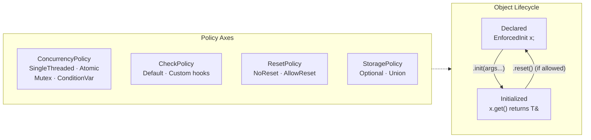

# Overview - EnforcedInit

*Fat-P Library — February 2026*

---

## Executive Summary

EnforcedInit is a policy-based wrapper that enforces two-phase construction: an object is declared first and initialized later, with compile-time and runtime guarantees that the value cannot be accessed before initialization. This solves the "use before init" class of bugs that arise in systems where objects must exist before the information needed to construct them is available—dependency injection containers, configuration-driven initialization, hardware bring-up sequences, and plugin architectures. Five policy axes control behavior: ConcurrencyPolicy (single-threaded, atomic, mutex, condition-variable), CheckPolicy (pre/post-init validation hooks), ResetPolicy (allow or forbid re-initialization), StoragePolicy (std::optional or raw union), and init returns `Expected<void, std::string>` for explicit error reporting. A condition-variable policy enables threads to block on `wait_for_init()` until another thread completes initialization—a pattern common in service startup sequences.

---

## Overview Card

**Component:** EnforcedInit
**Problem solved:** Preventing access to uninitialized values in two-phase construction patterns
**When to use:** Dependency injection; config-driven late init; hardware/driver bring-up; service locators; any pattern where "declare now, initialize later" is architecturally necessary
**When NOT to use:** Values that can be constructed immediately (just use a constructor); optional values that may never be initialized (use `std::optional`); simple lazy-init singletons (use `static` local)
**Key guarantee:** Accessing an uninitialized EnforcedInit throws; `init()` reports failures (including double-init) via `Expected`; all policies are zero-overhead when unused
**std equivalent:** None. `std::optional` provides the storage but not the access enforcement.
**Boost equivalent:** None
**Other alternatives:** `std::optional` (no access enforcement), `std::once_flag` + `std::call_once` (init-once only, no value wrapper)
**Read next:** User Manual - EnforcedInit

---

## The Problem Domain

### What Goes Wrong Without It

C++ has no language-level mechanism to prevent accessing an object before it is initialized. `std::optional` tracks whether a value is present, but accessing an empty optional via `operator*` is undefined behavior—no exception, no error, just silent corruption or a crash. Even `std::optional::value()` only throws after the fact; it cannot prevent the architectural pattern that leads to the bug.

The architectural pattern is two-phase construction: you must declare a variable at scope A (class member declaration, global, container slot) but you cannot initialize it until scope B (after config is loaded, after a dependency is injected, after hardware responds). Between A and B, the variable exists but holds no valid value. Any code that runs between A and B and touches the variable has a latent bug.

EnforcedInit makes the two phases explicit. The variable is declared as `EnforcedInit<T>`. Calling `.get()` or `operator*` before `.init()` is a detectable error—not UB. The ConcurrencyPolicy governs thread safety. The ResetPolicy controls whether re-initialization is permitted. The CheckPolicy provides hooks for domain-specific validation.

---

## Architecture



---

## Feature Inventory

### 1. Enforced Access Control

```cpp
fat_p::EnforcedInit<DatabaseConnection> db;
// db.get();  // ERROR: not initialized
// *db;       // ERROR: not initialized

auto result = db.init("host=localhost port=5432");
if (result) {
    db->execute("SELECT 1");  // OK: initialized
}
```

### 2. Condition-Variable Wait

With `ConditionVarPolicy`, one thread can block until another thread completes initialization:

```cpp
fat_p::EnforcedInit<Config, fat_p::ConditionVarPolicy> config;

// Thread 1: waits for config
config.wait_for_init(std::chrono::seconds(30));
auto& c = config.get();  // Safe: init completed or timeout

// Thread 2: initializes config
config.init(load_config_from_file());
// Thread 1 wakes up
```

### 3. Init from Factory

`lazy_init(factory)` invokes the factory immediately if the value is not yet initialized (and is a no-op if it is). For init deferred to first access, use the two-argument `get(factory)`:

```cpp
fat_p::EnforcedInit<ExpensiveResource> resource;
auto& r = resource.get([]() { return ExpensiveResource::create(); });
// Factory invoked on this first access; later get() calls reuse the value
```

### 4. Reset Support (Policy-Controlled)

```cpp
fat_p::EnforcedInit<T, SingleThreadedPolicy, DefaultCheckPolicy, AllowResetPolicy> value;
value.init(42);
value.reset();    // OK: AllowResetPolicy permits this
value.init(99);   // Re-initialized
```

With `NoResetPolicy` (default), calling `reset()` returns an error.

---

## Why Not std::optional?

| Aspect | std::optional | EnforcedInit |
|--------|--------------|--------------|
| **Access when empty** | UB (operator*) or throws (value()) | Always throws; init() reports errors via Expected |
| **Thread-safe init** | No | ConditionVarPolicy, AtomicPolicy |
| **Wait for init** | No | wait_for_init() with timeout |
| **Reset control** | Always resettable | Policy-controlled |
| **Pre/post-init hooks** | No | CheckPolicy |
| **init() returns error** | No (assignment can't fail) | Returns Expected<void, string> |

`std::optional` is a value wrapper. EnforcedInit is an initialization protocol enforcer.

---

## Final Assessment

**Permanence.** Two-phase construction is an architectural pattern, not a language limitation waiting to be fixed. No C++ standard proposal addresses enforced initialization with policy-based concurrency and validation.

**Zero overhead.** With `SingleThreadedPolicy` and `OptionalStoragePolicy`, the compiled code is identical to a raw `std::optional` check—the policy abstraction compiles away entirely.

---

*EnforcedInit.h — Fat-P Library*
