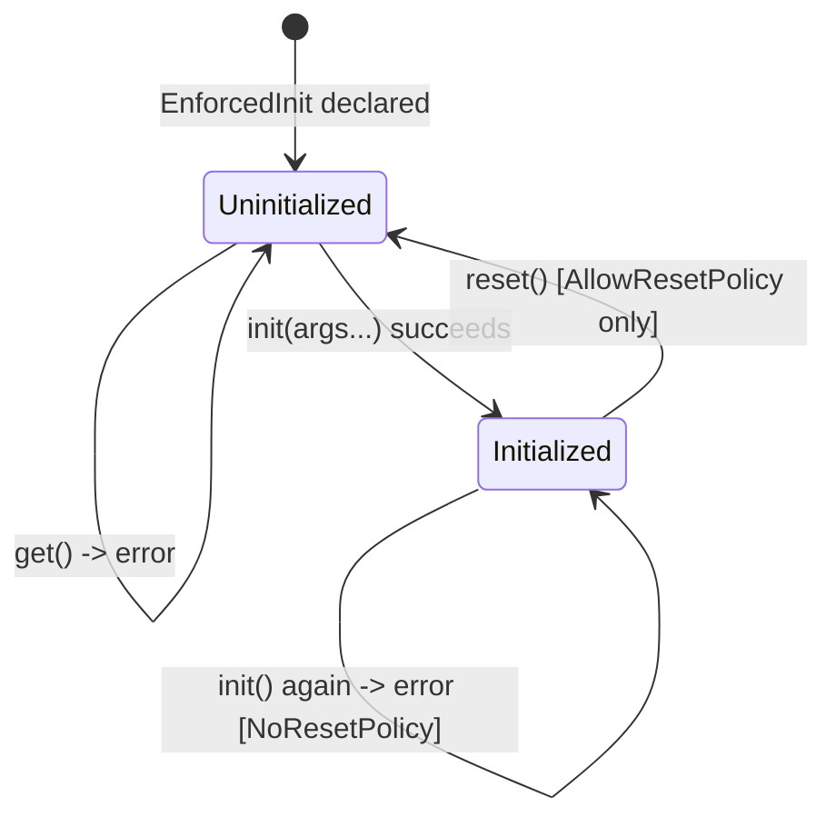
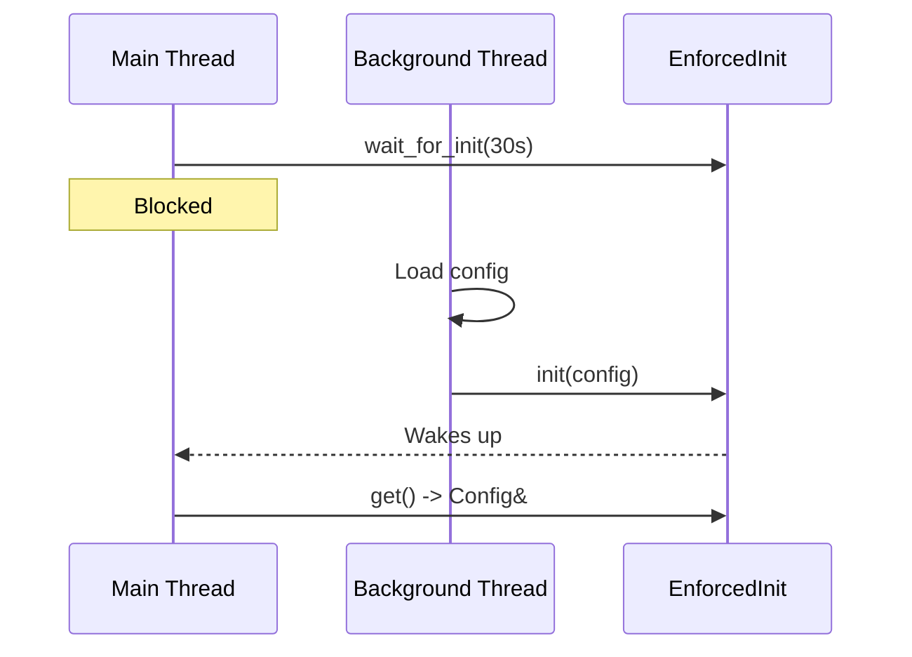

# User Manual - EnforcedInit

*February 2026*

---

**Scope:** Complete usage guide for `fat_p::EnforcedInit<T>`, including all five policy axes, the initialization lifecycle, lazy init, condition-variable wait patterns, copy/move semantics with policies, use case walkthroughs, and advanced policy composition.

**Not covered:** `std::optional` internals; general policy-based design patterns; ServiceLocator component.

**Prerequisites:** C++20; familiarity with `std::optional`; for concurrency sections, familiarity with mutexes and condition variables.

---

## User Manual Card

**Component:** EnforcedInit
**Primary use case:** Declare a variable now, initialize it later, with guarantees that access before init is caught
**Integration pattern:** Declare `EnforcedInit<T>` -> `.init(args...)` when ready -> `.get()` or `operator*`/`->`
**Key API:** `init()`, `reset()`, `lazy_init()`, `get()`, `operator*`/`->`, `is_initialized()`, `wait_for_init()`
**std equivalent:** None
**Common mistakes:** Forgetting to call `init()` before `get()`; using SingleThreadedPolicy in multithreaded code; calling `init()` twice without AllowResetPolicy
**Performance notes:** SingleThreaded: zero overhead beyond optional check; Atomic: one atomic load per access; ConditionVar: mutex lock per access

---

## Table of Contents

1. The Two-Phase Construction Problem
2. Why std::optional Is Not Enough
3. Getting Started
4. The Initialization Lifecycle
5. Concurrency Policies
6. Storage Policies
7. Check Policies and PolicyPack
8. Reset Policies
9. Lazy Initialization
10. Waiting for Initialization
11. Copy and Move Semantics
12. Thread Safety
13. Use Case: Dependency Injection Container
14. Use Case: Service Startup Sequence
15. Use Case: Hardware Driver Bring-Up
16. Use Case: Test Fixture Late Init
17. Best Practices
18. Advanced Usage
19. Performance Characteristics
20. Troubleshooting
21. Known Limitations
22. API Reference
23. FAQ

---

## The Two-Phase Construction Problem

In many systems, objects cannot be fully constructed at the point where they are declared. A database connection needs a connection string from a config file loaded after startup. A renderer needs a GPU device handle created after window initialization. A plugin needs a host interface pointer provided after dynamic loading.

The C++ language has no mechanism to prevent accessing an object before it is initialized. The gap between declaration and initialization is a breeding ground for bugs---and these bugs are among the hardest to diagnose because the symptoms (corrupt state, crashes, silent wrong answers) manifest far from the root cause (premature access).

### Three Broken Patterns

**Raw member variables.** A class declares `DatabaseConnection mDb;` but cannot construct it until `configure()` is called. The constructor must either default-construct a useless `DatabaseConnection` (wasteful and potentially invalid) or leave the member uninitialized (undefined behavior on access).

**std::unique_ptr<T>.** Declare `std::unique_ptr<DatabaseConnection> mDb;` initialized to `nullptr`. Access before init: `*mDb` dereferences null---undefined behavior. The compiler does not warn. The crash may happen in production.

**std::optional<T>.** Declare `std::optional<DatabaseConnection> mDb;` initialized to `std::nullopt`. Access before init: `*mDb` is undefined behavior. `mDb.value()` throws `std::bad_optional_access`, but only if you remember to use `value()` instead of `operator*`. And `value()` is a runtime check, not a design enforcement.

---

## Why std::optional Is Not Enough

| Aspect | std::optional | EnforcedInit |
|--------|--------------|--------------|
| Access when empty | UB (`operator*`) or throws (`value()`) | Returns error or throws (configurable) |
| Thread-safe init | No | ConditionVarPolicy, AtomicPolicy |
| Wait for init | No | `wait_for_init()` with timeout |
| Reset control | Always resettable | Policy-controlled |
| Pre/post-init hooks | No | CheckPolicy |
| `init()` returns error | No | Returns `Expected<void, string>` |
| Prevents architectural misuse | No | Yes---the type itself documents the contract |

`std::optional` is a value wrapper. EnforcedInit is an initialization protocol enforcer. The difference is intent: `std::optional` says "this value may or may not be present." EnforcedInit says "this value WILL be present, but not yet."

---

## Getting Started

```cpp
#include "EnforcedInit.h"

class DatabaseConnection
{
public:
    explicit DatabaseConnection(const std::string& connStr) { /* connect */ }
    void execute(const std::string& sql) { /* ... */ }
};

int main()
{
    fat_p::EnforcedInit<DatabaseConnection> db;

    // db.get();  // Would throw: not initialized

    auto result = db.init("host=localhost port=5432 dbname=mydb");
    if (!result)
    {
        std::cerr << "Init failed: " << result.error() << "\n";
        return 1;
    }

    db->execute("SELECT 1");  // OK: initialized
}
```

Defaults: `SingleThreadedPolicy`, `DefaultCheckPolicy`, `NoResetPolicy`, `OptionalStoragePolicy`.

---

## The Initialization Lifecycle



`init(args...)` constructs T in-place, forwarding arguments to T's constructor. Returns `Expected<void, std::string>`. If already initialized with NoResetPolicy, returns an error without modifying the value.

`get()` returns `T&` if initialized; throws if not. `operator*` and `operator->` are shorthand.

`is_initialized()` returns bool without side effects.

---

## Concurrency Policies

### SingleThreadedPolicy (Default)

No synchronization. Raw `std::optional` check. Zero overhead.

### AtomicPolicy

`std::atomic<bool>` flag. `init()` sets with release semantics; `get()` checks with acquire. Lower overhead than mutex. Does not support `wait_for_init()`.

### MutexPolicy

`std::mutex` on all access.

### ConditionVarPolicy

Mutex plus `std::condition_variable`. Enables `wait_for_init(timeout)`:

```cpp
fat_p::EnforcedInit<Config, fat_p::ConditionVarPolicy> config;

// Background thread
std::thread loader([&]() {
    auto cfg = load_config("app.toml");
    config.init(std::move(cfg));
});

// Main thread waits
if (config.wait_for_init(std::chrono::seconds(10)))
{
    auto& cfg = config.get();
    start_application(cfg);
}
else
    std::cerr << "Config load timed out\n";

loader.join();
```

---

## Storage Policies

**OptionalStoragePolicy (Default).** Uses `std::optional<T>`. Standard, well-understood.

**UnionStoragePolicy.** Raw `union` with manual lifetime management. Avoids optional's internal `has_value` flag overhead. In practice, the difference is negligible except for containers of millions of EnforcedInit instances.

---

## Check Policies and PolicyPack

**DefaultCheckPolicy.** No-op. Pre-init and post-init hooks are empty.

**Custom policies** define `pre_init_check<T>(args...)` and `post_init_check<T>(value)` static methods:

```cpp
struct RangeCheckPolicy
{
    template <typename T, typename... Args>
    static void pre_init_check(Args&&... args)
    {
        // Validate arguments before construction
    }

    template <typename T>
    static void post_init_check(const T& value)
    {
        // Validate constructed value
    }
};
```

**PolicyPack** combines multiple check policies:

```cpp
using MyChecks = fat_p::PolicyPack<RangeCheckPolicy, LoggingCheckPolicy>;

fat_p::EnforcedInit<Config, SingleThreadedPolicy, MyChecks> config;
// Both RangeCheckPolicy and LoggingCheckPolicy hooks run on init()
```

---

## Reset Policies

**NoResetPolicy (Default).** `reset()` returns an error. Once initialized, the value stays for the object's lifetime.

**AllowResetPolicy.** `reset()` destroys the value and returns to uninitialized state. Subsequent `init()` works.

```cpp
fat_p::EnforcedInit<T, SingleThreadedPolicy, DefaultCheckPolicy, AllowResetPolicy> value;
value.init(42);
value.reset();  // OK
value.init(99);  // Re-initialized
```

---

## Lazy Initialization

`lazy_init(factory)` registers a callable invoked on first `get()`:

```cpp
fat_p::EnforcedInit<ExpensiveResource> resource;
resource.lazy_init([]() { return ExpensiveResource::create(); });

auto& r = resource.get();   // Factory invoked here, once
auto& r2 = resource.get();  // Same instance, no factory call
```

The two-argument `get(factory)` combines lookup and lazy init:

```cpp
auto& r = resource.get([]() { return ExpensiveResource::create(); });
```

---

## Waiting for Initialization

With ConditionVarPolicy, `wait_for_init(timeout)` blocks until `init()` is called or timeout expires:



Returns `true` if init completed, `false` on timeout.

---

## Copy and Move Semantics

EnforcedInit is copyable if T is copyable, movable if T is movable. Policies are NOT copied or moved---the destination gets fresh default-constructed policies (fresh mutex, fresh condition variable).

The implementation uses `std::less<const void*>` for lock ordering between source and destination during copy-assignment, preventing deadlocks.

---

## Thread Safety

| Policy | init() | get() | wait_for_init() |
|--------|--------|-------|-----------------|
| SingleThreaded | Not safe | Not safe | N/A |
| Atomic | Safe | Safe | N/A |
| Mutex | Safe | Safe | N/A |
| ConditionVar | Safe | Safe | Safe |

For "one thread inits, many threads read," AtomicPolicy is sufficient and lowest-overhead.

---

## Use Case: Dependency Injection Container

```cpp
class Application
{
    fat_p::EnforcedInit<Logger> mLogger;
    fat_p::EnforcedInit<Database> mDatabase;
    fat_p::EnforcedInit<Cache> mCache;

public:
    void configure(const Config& cfg)
    {
        mLogger.init(cfg.log_level, cfg.log_path);
        mDatabase.init(cfg.db_connection_string);
        mCache.init(cfg.cache_size_mb);
    }

    void run()
    {
        mLogger->info("Starting application");
        auto data = mDatabase->query("SELECT ...");
        mCache->store("key", data);
    }
};
```

If `run()` is called before `configure()`, the first `get()` throws instead of producing UB.

## Use Case: Service Startup Sequence

Multiple services initialize concurrently. Each waits for its dependencies:

```cpp
fat_p::EnforcedInit<ConfigService, fat_p::ConditionVarPolicy> config;
fat_p::EnforcedInit<DatabaseService, fat_p::ConditionVarPolicy> database;
fat_p::EnforcedInit<CacheService, fat_p::ConditionVarPolicy> cache;

// Config loader thread
std::thread t1([&]() { config.init(load_config()); });

// Database thread---waits for config
std::thread t2([&]() {
    config.wait_for_init(std::chrono::seconds(30));
    database.init(connect(config.get().db_url));
});

// Cache thread---waits for database
std::thread t3([&]() {
    database.wait_for_init(std::chrono::seconds(30));
    cache.init(create_cache(database.get()));
});
```

## Use Case: Hardware Driver Bring-Up

```cpp
class GPURenderer
{
    fat_p::EnforcedInit<GPUDevice> mDevice;
    fat_p::EnforcedInit<SwapChain> mSwapChain;
    fat_p::EnforcedInit<Pipeline> mPipeline;

public:
    void init_device(int gpu_index)
    {
        mDevice.init(gpu_index);
    }

    void init_rendering(int width, int height)
    {
        // mDevice must be initialized first
        mSwapChain.init(mDevice.get(), width, height);
        mPipeline.init(mDevice.get(), default_shaders());
    }

    void render() { mPipeline->draw(mSwapChain.get()); }
};
```

If `render()` is called before `init_rendering()`, the error is immediate and clear.

## Use Case: Test Fixture Late Init

```cpp
class DatabaseTest : public ::testing::Test
{
    fat_p::EnforcedInit<TestDatabase, SingleThreadedPolicy,
                        DefaultCheckPolicy, AllowResetPolicy> mDb;

protected:
    void SetUp() override
    {
        mDb.init("sqlite::memory:");
        mDb->execute("CREATE TABLE test (id INTEGER)");
    }

    void TearDown() override
    {
        mDb.reset();  // Clean up between tests
    }
};
```

AllowResetPolicy enables clean teardown and re-initialization between tests.

---

## Best Practices

### Use the Narrowest Concurrency Policy

SingleThreaded for single-threaded code. Atomic for "one writer, many readers." ConditionVar only when threads need to block-wait. Over-synchronizing wastes CPU.

### Prefer NoResetPolicy

Re-initialization bugs are subtle. If an object should be initialized once, enforce it with NoResetPolicy. Use AllowReset only when the use case genuinely requires re-initialization (reconnection, test teardown).

### Check init() Return Values

`init()` returns `Expected<void, string>`. If T's constructor throws, the exception propagates. If the value is already initialized (NoResetPolicy), init returns an error. Always check.

### Document the Initialization Contract

EnforcedInit makes the contract enforceable, but it does not document it. Comment which method or phase must call `init()` and what arguments it expects.

### Avoid Deep Initialization Chains

If A requires B which requires C which requires D, the wait-for-init chain becomes fragile. Consider a startup coordinator that initializes in topological order.

---

## Advanced Usage

### Custom Check Policies for Domain Validation

```cpp
struct PortRangeCheck
{
    template <typename T, typename... Args>
    static void pre_init_check(int port, Args&&...)
    {
        if (port < 1 || port > 65535)
            throw std::invalid_argument("Port out of range");
    }

    template <typename T>
    static void post_init_check(const T&) {}
};

fat_p::EnforcedInit<NetworkService, SingleThreadedPolicy,
                    fat_p::PolicyPack<PortRangeCheck>> service;
service.init(80);      // OK
service.init(99999);   // Throws: "Port out of range"
```

### EnforcedInit in Containers

```cpp
std::vector<fat_p::EnforcedInit<Worker>> workers(8);
for (size_t i = 0; i < workers.size(); ++i)
    workers[i].init(i, config);

for (auto& w : workers)
    w->run();
```

Each worker is initialized individually. Accessing an uninitialized worker is caught.

---

## Performance Characteristics

| Policy | init() overhead | get() overhead | Memory overhead |
|--------|----------------|----------------|-----------------|
| SingleThreaded | ~0 (optional emplace) | ~1 ns (has_value check) | sizeof(optional<T>) |
| Atomic | ~5 ns (atomic store) | ~5 ns (atomic load) | + 1 byte atomic flag |
| Mutex | ~20-50 ns (lock/unlock) | ~20-50 ns (lock/unlock) | + sizeof(mutex) |
| ConditionVar | ~20-50 ns (lock + notify) | ~20-50 ns (lock) | + sizeof(mutex) + sizeof(condition_variable) |

---

## Troubleshooting

### "EnforcedInit: value not initialized"

`get()` called before `init()`. Trace the initialization order.

### "EnforcedInit: already initialized"

`init()` called twice with NoResetPolicy. Call `reset()` first (requires AllowResetPolicy) or restructure to init once.

### Deadlock with ConditionVarPolicy

The thread calling `init()` is blocked waiting for something that depends on the EnforcedInit value. Circular dependency. Restructure the init order.

### MSVC compile errors

EnforcedInit defines member functions outside the class body for MSVC template parsing compatibility. Requires MSVC 19.28+.

### wait_for_init returns false (timeout)

The init thread has not called `init()` within the timeout. Check that the init thread is running and not blocked on something else.

### Copy/move loses initialization state

Policies are default-constructed in the copy/move destination. The VALUE is copied/moved, but the mutex/condvar is fresh. This is correct---each instance has independent synchronization.

---

## Known Limitations

**No automatic init detection.** EnforcedInit catches access-before-init, not missing-init. If `init()` is never called and `get()` is never called, no error is reported.

**No dependency graph.** No tracking of dependencies between EnforcedInit instances. Ordering is manual.

**Per-instance policy overhead.** ConditionVarPolicy adds a mutex + condvar per instance. In large containers, this matters.

**No init timeout.** `init()` itself has no timeout. If T's constructor blocks indefinitely, `init()` blocks indefinitely. Use `wait_for_init()` on the consumer side.

---

## API Reference

| Method | Description |
|--------|-------------|
| `init(args...)` | Construct T in-place; returns `Expected<void, string>` |
| `init(initializer_list)` | Construct from initializer list |
| `reset()` | Destroy value (AllowResetPolicy); returns Expected |
| `lazy_init(factory)` | Register factory for first `get()` |
| `get()` / `get(factory)` | Return `T&`; throws if uninitialized |
| `operator*` / `operator->` | Shorthand for `get()` |
| `is_initialized()` | Returns bool |
| `wait_for_init(timeout)` | Block until init (ConditionVarPolicy) |

---

## FAQ

**Q: Why not std::optional with an assert?**

Asserts are stripped in Release. EnforcedInit checks in all builds. And `init()` returns Expected, making failure handleable.

**Q: Can I use EnforcedInit for singletons?**

You can, but `static` locals with `std::call_once` are simpler for classic singletons. EnforcedInit is better when singleton construction depends on runtime config not available at static-init time.

**Q: What if init() throws?**

If T's constructor throws, the exception propagates. The EnforcedInit remains uninitialized. Strong exception guarantee.

**Q: Is EnforcedInit constexpr?**

No. The optional/union storage and policy machinery prevent constexpr construction.

---

*EnforcedInit.h --- Fat-P Library*
