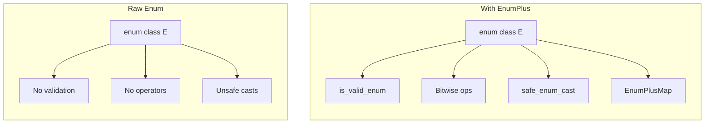

# User Manual - EnumPlus

**Scope:** Complete usage guide for `fat_p::EnumPlusWrapper`, `fat_p::EnumPlusMap`, bitwise operator enablement, validation utilities (`is_valid_enum`, `safe_enum_cast`, `safe_to_underlying`), and enum reflection.

**Not covered:**
- String-to-enum conversion beyond reflection basics (see Stringify)
- Serialization of enums (see JsonLite, BinarySerialization)
- Compile-time enum iteration (not supported)

**Prerequisites:** C++20; understanding of `enum class` and its type safety benefits over unscoped enums; awareness of the bitwise flag pattern

---

## User Manual Card

**Component:** EnumPlus
**Primary use case:** Wrap enums for type-safe arithmetic, bitwise flag operations, and safe validation/casting without implicit conversions
**Integration pattern:** Define `enum class`, specialize `EnableOverloadedOperators<E> : std::true_type` to opt flags into bitwise operators, wrap values in `EnumPlusWrapper` for strong typing, use `EnumPlusMap` for enum-indexed arrays
**Key API:** `EnumPlusWrapper<E>`, `EnumPlusMap<E, V, BoundsPolicy>` (size comes from `EnumSizeTrait<E>`), `is_valid_enum<E>()`, `safe_enum_cast<E>()`, `safe_to_underlying()`, `EnableOverloadedOperators<E>`
**std equivalent:** None
**Common mistakes:** Forgetting to enable bitwise ops before using `|` and `&` on enum flags; using raw `static_cast` instead of `safe_enum_cast`; assuming contiguous enum values when using EnumPlusMap
**Performance notes:** EnumPlusWrapper is zero overhead (same size and layout as the underlying enum). EnumPlusMap is a fixed-size array with O(1) indexed access. See `components/EnumPlus/results/` for current data

---
## Table of Contents

1. [What is EnumPlus?](#what-is-enumplus)
   - [The Problem: Enum Fragility](#the-problem-enum-fragility)
   - [The C++ Landscape](#the-c-landscape)
   - [Where EnumPlus Fits](#where-enumplus-fits)
2. [Core Architecture](#core-architecture)
   - [Design Principles](#design-principles)
   - [Type Safety Model](#type-safety-model)
   - [Performance Characteristics](#performance-characteristics)
3. [Getting Started](#getting-started)
   - [Prerequisites](#prerequisites)
   - [Integration](#integration)
   - [First Program](#first-program)
4. [EnumPlusWrapper](#enumpluswrapper)
   - [Strong Typing Guarantee](#strong-typing-guarantee)
   - [Basic Usage](#basic-usage)
   - [Implicit Conversions](#implicit-conversions)
5. [Bitwise Operations](#bitwise-operations)
   - [Enabling Operators](#enabling-operators)
   - [Available Operators](#available-operators)
   - [Shift Operators](#shift-operators)
   - [Flag Manipulation](#flag-manipulation)
6. [EnumPlusMap](#enumplusmap)
   - [Type-Safe Enum Indexing](#type-safe-enum-indexing)
   - [Construction Patterns](#construction-patterns)
   - [Bounds Checking Policies](#bounds-checking-policies)
7. [Validation and Casting](#validation-and-casting)
   - [is_valid_enum](#is_valid_enum)
   - [safe_enum_cast](#safe_enum_cast)
   - [safe_to_underlying](#safe_to_underlying)
8. [Enum Reflection](#enum-reflection)
   - [enum_index](#enum_index)
   - [enum_value](#enum_value)
   - [enum_contains](#enum_contains)
   - [enum_count](#enum_count)
   - [enum_values](#enum_values)
   - [for_each_enum](#for_each_enum)
   - [enum_entries](#enum_entries)
9. [Utility Functions](#utility-functions)
   - [to_underlying](#to_underlying)
   - [has_flag](#has_flag)
10. [String Conversion](#string-conversion)
    - [EnumStringPolicy](#enumstringpolicy)
    - [to_string and from_string](#to_string-and-from_string)
    - [from_string_icase](#from_string_icase)
11. [Performance Characteristics](#performance-characteristics-1)
    - [Benchmark Methodology](#benchmark-methodology)
    - [Benchmark Results](#benchmark-results)
    - [Performance Guidelines](#performance-guidelines)
12. [Comparison with Other Approaches](#comparison-with-other-approaches)
    - [vs Raw Enums](#vs-raw-enums)
    - [vs magic_enum](#vs-magic_enum)
    - [vs Manual Bitmasks](#vs-manual-bitmasks)
13. [Migration Guide](#migration-guide)
    - [From Raw Enums](#from-raw-enums)
    - [From Manual Bitmask Patterns](#from-manual-bitmask-patterns)
14. [Best Practices](#best-practices)
    - [When to Use EnumPlus](#when-to-use-enumplus)
    - [Trait Specialization Patterns](#trait-specialization-patterns)
    - [Flag Enum Design](#flag-enum-design)
15. [Troubleshooting](#troubleshooting)
    - [Compilation Errors](#compilation-errors)
    - [Runtime Errors](#runtime-errors)
16. [Summary](#summary)

---

## What is EnumPlus?

### The Problem: Enum Fragility

C++ enums are fundamentally unsafe. They silently accept invalid values, provide no runtime
validation, and require manual boilerplate for common operations:

```cpp
enum class Status { OK, Error, Pending };

void process(Status s)
{
    // This compiles and runs - but is completely wrong
    Status invalid = static_cast<Status>(999);
    
    // No way to validate without manual range checks
    int user_input = get_user_input();
    Status s = static_cast<Status>(user_input);  // Silent corruption
    
    // Bitwise operations require ugly casts
    enum class Flags { Read = 1, Write = 2, Execute = 4 };
    // Flags combined = Flags::Read | Flags::Write;  // ERROR: no operator|
    Flags combined = static_cast<Flags>(
        static_cast<int>(Flags::Read) | static_cast<int>(Flags::Write));  // Ugly
}
```

| Problem | Impact | Frequency |
|---------|--------|-----------|
| Invalid cast silently succeeds | Data corruption, undefined behavior | Very common |
| No validation API | Manual range checks everywhere | Universal |
| No bitwise operators | Verbose flag handling | Common |
| No type-safe indexing | Array bounds violations | Common |
| Manual integer conversion | Boilerplate, error-prone | Universal |

### The C++ Landscape

| Approach | Strengths | Weaknesses |
|----------|-----------|------------|
| Raw `enum class` | Built-in, zero overhead | No validation, no operators |
| `magic_enum` | Reflection, automatic strings | Heavy compile times, limited to small enums |
| Manual bitmasks | Full control | Verbose, error-prone, no type safety |
| Boost.Describe | Comprehensive | Heavy dependency, complex setup |

### Where EnumPlus Fits

EnumPlus provides **opt-in enum enhancement** with zero runtime overhead for the common path:



**Key features:**
- True strong typing via deleted constructors
- Opt-in bitwise operators with SFINAE
- O(1) validation via traits
- Type-safe enum-indexed arrays
- Zero overhead for enabled operations

**Trade-offs:**
- Requires trait specialization (one-time setup per enum)
- Assumes contiguous zero-based enums for validation
- No automatic string conversion (by design - avoids compile-time bloat)

---

## Core Architecture

### Design Principles

1. **Zero overhead abstraction**: All operations compile to the same code as manual equivalents
2. **Opt-in complexity**: Only pay for features you enable
3. **Compile-time safety**: Invalid operations are caught at compile time, not runtime
4. **Trait-based extension**: New enums integrate via template specialization

### Type Safety Model

EnumPlus enforces type safety through **deleted constructors**:

```cpp
template<typename E>
class EnumPlusWrapper
{
public:
    // Only construction from enum type is allowed
    constexpr explicit EnumPlusWrapper(E value) noexcept;
    
    // Construction from underlying type is DELETED
    EnumPlusWrapper(underlying_type) = delete;
    EnumPlusWrapper& operator=(underlying_type) = delete;
};
```

This means:

```cpp
fat_p::EnumPlusWrapper<Color> w1(Color::Red);     // OK
fat_p::EnumPlusWrapper<Color> w2 = Color::Red;    // OK (explicit)
fat_p::EnumPlusWrapper<Color> w3(5);              // COMPILE ERROR
fat_p::EnumPlusWrapper<Color> w4 = 5;             // COMPILE ERROR
```

### Performance Characteristics

| Operation | Complexity | Notes |
|-----------|------------|-------|
| `to_underlying` | O(1) | Single static_cast |
| `is_valid_enum` | O(1) | Integer comparison |
| `safe_enum_cast` | O(1) | Comparison + optional construction |
| `EnumPlusMap::operator[]` | O(1) | Direct array access |
| Bitwise operators | O(1) | Native CPU operations |
| `has_flag` | O(1) | Single AND + comparison |

---

## Getting Started

### Prerequisites

| Requirement | Minimum | Recommended |
|-------------|---------|-------------|
| C++ Standard | C++20 | C++20 |
| Compiler | GCC 10+, Clang 12+, MSVC 2019 16.10+ | GCC 12+, Clang 15+, MSVC 2022 |

### Integration

```cpp
#include "EnumPlus.h"
```

No compilation flags required. Header-only with no external dependencies.

### First Program

```cpp
#include "EnumPlus.h"
#include <iostream>

// Step 1: Define your enum
enum class Color { Red, Green, Blue, Yellow };

// Step 2: Specialize the size trait
template<>
struct fat_p::EnumSizeTrait<Color>
{
    static constexpr std::size_t size = 4;
};

// Step 3: Use EnumPlus features
int main()
{
    // Safe casting
    auto maybe_color = fat_p::safe_enum_cast<Color>(2);
    if (maybe_color)
    {
        std::cout << "Valid color: " << fat_p::to_underlying(*maybe_color) << "\n";
    }
    
    // Validation
    int user_input = 99;
    if (!fat_p::is_valid_enum<Color>(user_input))
    {
        std::cout << "Invalid color value: " << user_input << "\n";
    }
    
    // Type-safe array
    fat_p::EnumPlusMap<Color, std::string> names{"Red", "Green", "Blue", "Yellow"};
    std::cout << "Color 0: " << names[Color::Red] << "\n";
    
    return 0;
}
```

---

## EnumPlusWrapper

### Strong Typing Guarantee

`EnumPlusWrapper<E>` provides a strongly-typed wrapper that **cannot** be constructed from
raw integers:

```cpp
// Compile-time verification of type safety
static_assert(!std::is_constructible_v<fat_p::EnumPlusWrapper<Color>, int>,
              "Must not allow construction from int");

static_assert(!std::is_convertible_v<int, fat_p::EnumPlusWrapper<Color>>,
              "Must not allow implicit conversion from int");
```

### Basic Usage

```cpp
enum class Priority { Low, Medium, High, Critical };

template<>
struct fat_p::EnableOverloadedOperators<Priority> : std::true_type {};

void example()
{
    // Explicit construction from enum
    fat_p::EnumPlusWrapper<Priority> p1(Priority::High);
    
    // Access underlying value
    Priority raw = p1.value();
    int underlying = p1.underlying();
    
    // Implicit conversion back to enum
    Priority p2 = p1;
    
    // Comparison
    if (p1 == Priority::High) { /* ... */ }
    if (p1 != p1) { /* never true */ }
}
```

### Implicit Conversions

| From | To | Allowed |
|------|-----|---------|
| `E` | `EnumPlusWrapper<E>` | Yes (explicit) |
| `EnumPlusWrapper<E>` | `E` | Yes (implicit) |
| `int` | `EnumPlusWrapper<E>` | No (deleted) |
| `EnumPlusWrapper<E>` | `int` | No (use `.underlying()`) |

---

## Bitwise Operations

### Enabling Operators

Bitwise operators are **disabled by default**. Enable them per-enum via trait specialization:

```cpp
enum class FilePermission : unsigned
{
    None    = 0,
    Read    = 1,
    Write   = 2,
    Execute = 4
};

// Enable bitwise operators for this enum
template<>
struct fat_p::EnableOverloadedOperators<FilePermission> : std::true_type {};
```

### Available Operators

| Operator | Raw Enum | EnumPlusWrapper | Notes |
|----------|----------|-----------------|-------|
| `\|` | Yes | Yes | Bitwise OR |
| `&` | Yes | Yes | Bitwise AND |
| `^` | Yes | Yes | Bitwise XOR |
| `~` | Yes | Yes | Bitwise NOT |
| `\|=` | Yes | Yes | Compound OR |
| `&=` | Yes | Yes | Compound AND |
| `^=` | Yes | Yes | Compound XOR |
| `<<` | Yes | Yes | Left shift |
| `>>` | Yes | Yes | Right shift |
| `<<=` | Yes | Yes | Compound left shift |
| `>>=` | Yes | Yes | Compound right shift |

### Shift Operators

Shift operators are useful for flag manipulation and serialization:

```cpp
// Enable operators
template<>
struct fat_p::EnableOverloadedOperators<FilePermission> : std::true_type {};

void shift_example()
{
    FilePermission p = FilePermission::Read;
    
    // Left shift
    FilePermission shifted = p << 1;  // Read (1) becomes 2
    
    // Right shift
    FilePermission exec = FilePermission::Execute;  // 4
    FilePermission back = exec >> 2;                // becomes 1 (Read)
    
    // Compound assignment
    p <<= 2;  // p is now 4 (Execute)
    
    // With wrapper
    fat_p::EnumPlusWrapper<FilePermission> wp(FilePermission::Read);
    auto shifted_wrap = wp << 2;  // underlying is 4
}
```

### Flag Manipulation

```cpp
void flag_example()
{
    FilePermission perms = FilePermission::Read | FilePermission::Write;
    
    // Check flag
    if (fat_p::has_flag(perms, FilePermission::Read))
    {
        std::cout << "Can read\n";
    }
    
    // Add flag
    perms |= FilePermission::Execute;
    
    // Remove flag
    perms &= ~FilePermission::Write;
    
    // Toggle flag
    perms ^= FilePermission::Read;
    
    // Check multiple flags
    FilePermission required = FilePermission::Read | FilePermission::Execute;
    if (fat_p::has_flag(perms, required))
    {
        std::cout << "Has both read and execute\n";
    }
}
```

---

## EnumPlusMap

### Type-Safe Enum Indexing

`EnumPlusMap<E, T>` provides a fixed-size array indexed by enum values:

```cpp
enum class Day { Mon, Tue, Wed, Thu, Fri, Sat, Sun };

template<>
struct fat_p::EnumSizeTrait<Day>
{
    static constexpr std::size_t size = 7;
};

void map_example()
{
    fat_p::EnumPlusMap<Day, int> hours_worked;
    
    hours_worked[Day::Mon] = 8;
    hours_worked[Day::Tue] = 9;
    // ...
    
    int monday_hours = hours_worked[Day::Mon];
}
```

### Construction Patterns

```cpp
// Default construction (zero-initialized for POD types)
fat_p::EnumPlusMap<Color, int> counts;

// Initializer list (must match enum size exactly)
fat_p::EnumPlusMap<Color, std::string> names{"Red", "Green", "Blue", "Yellow"};

// Fill constructor (all elements same value)
fat_p::EnumPlusMap<Color, bool> flags(true);  // All true

// Generator function
fat_p::EnumPlusMap<Color, int> indices([](Color c) {
    return static_cast<int>(c) * 10;
});
// indices[Color::Red] == 0, indices[Color::Green] == 10, etc.
```

### Bounds Checking Policies

```cpp
// Default: throws on invalid access
fat_p::EnumPlusMap<Color, int, fat_p::DefaultBoundsCheckPolicy> safe_map;

// No checking: maximum performance, undefined behavior on invalid access
fat_p::EnumPlusMap<Color, int, fat_p::NoBoundsCheckPolicy> fast_map;

// checked vs unchecked access
int val1 = safe_map.at(color);    // Throws if invalid
int val2 = safe_map[color];       // No check (operator[])
```

---

## Validation and Casting

### is_valid_enum

Checks if a value is within the valid enum range:

```cpp
// From underlying type
bool valid1 = fat_p::is_valid_enum<Color>(2);   // true (Blue)
bool valid2 = fat_p::is_valid_enum<Color>(99);  // false

// From enum value (validates against range)
Color maybe_invalid = static_cast<Color>(99);
bool valid3 = fat_p::is_valid_enum(maybe_invalid);  // false
```

### safe_enum_cast

Safely converts an integer to an enum, returning `std::optional`:

```cpp
auto result = fat_p::safe_enum_cast<Color>(1);
if (result)
{
    Color c = *result;  // Color::Green
}

auto bad = fat_p::safe_enum_cast<Color>(99);
if (!bad)
{
    std::cout << "Invalid color value\n";
}
```

### safe_to_underlying

Safely converts an enum to its underlying type, validating first:

```cpp
Color valid_color = Color::Red;
auto result1 = fat_p::safe_to_underlying(valid_color);
// result1.has_value() == true, *result1 == 0

Color invalid_color = static_cast<Color>(99);
auto result2 = fat_p::safe_to_underlying(invalid_color);
// result2.has_value() == false
```

### from_string_icase

Case-insensitive string to enum conversion:

```cpp
// Returns std::optional<E>
auto result = fat_p::from_string_icase<Color>("RED");
if (result)
{
    Color c = *result;  // Color::Red
}

// Various case combinations all work
fat_p::from_string_icase<Color>("Red");    // Color::Red
fat_p::from_string_icase<Color>("red");    // Color::Red
fat_p::from_string_icase<Color>("RED");    // Color::Red
fat_p::from_string_icase<Color>("rEd");    // Color::Red

// Invalid strings return nullopt
fat_p::from_string_icase<Color>("Purple"); // std::nullopt
```

### from_string_icase_or

Case-insensitive conversion with default value:

```cpp
Color c1 = fat_p::from_string_icase_or<Color>("BLUE", Color::Red);  // Color::Blue
Color c2 = fat_p::from_string_icase_or<Color>("invalid", Color::Red);  // Color::Red (default)
```

---

## Enum Reflection

EnumPlus provides a complete reflection API for enums, enabling runtime and compile-time
introspection without macros or compiler-specific extensions.

### enum_index

Returns the 0-based index of an enum value. Useful for serialization, logging, or array indexing:

```cpp
auto idx = fat_p::enum_index(Color::Blue);
if (idx)
{
    std::cout << "Blue is at index " << *idx << "\n";  // "Blue is at index 2"
}

// Invalid values return nullopt
Color invalid = static_cast<Color>(100);
auto bad_idx = fat_p::enum_index(invalid);  // std::nullopt
```

### enum_value

Returns the enum value at a given index. The inverse of `enum_index`:

```cpp
auto color = fat_p::enum_value<Color>(2);
if (color)
{
    std::cout << "Index 2 is " << fat_p::to_string(*color) << "\n";  // "Index 2 is Blue"
}

// Out-of-range indices return nullopt
auto bad = fat_p::enum_value<Color>(100);  // std::nullopt
```

**Roundtrip guarantee:**

```cpp
// enum_value(enum_index(v)) == v
for (Color c : fat_p::enum_values<Color>())
{
    auto idx = fat_p::enum_index(c);
    auto val = fat_p::enum_value<Color>(*idx);
    assert(*val == c);  // Always true
}
```

### enum_contains

Checks if an enum value is valid. More explicit alias for `is_valid_enum`:

```cpp
Color c1 = Color::Red;
bool valid = fat_p::enum_contains(c1);  // true

Color c2 = static_cast<Color>(999);
bool invalid = fat_p::enum_contains(c2);  // false
```

### enum_count

Compile-time constant for the number of enum values:

```cpp
// Compile-time usage
static_assert(fat_p::enum_count<Color> == 4);
static_assert(fat_p::enum_count<Status> == 4);

// Runtime usage
std::array<int, fat_p::enum_count<Color>> counts{};

// Use in templates
template<typename E>
void process_enum()
{
    constexpr auto n = fat_p::enum_count<E>;
    std::cout << "Enum has " << n << " values\n";
}
```

### enum_values

Returns an array of all enum values:

```cpp
constexpr auto colors = fat_p::enum_values<Color>();
// colors == {Color::Red, Color::Green, Color::Blue, Color::Yellow}

for (Color c : fat_p::enum_values<Color>())
{
    process(c);
}
```

### for_each_enum

Iterates over all enum values with a callable. Cleaner alternative to range-based for:

```cpp
// Count occurrences
int sum = 0;
fat_p::for_each_enum<Color>([&](Color c) {
    sum += static_cast<int>(c);
});
// sum == 0 + 1 + 2 + 3 == 6

// Build lookup table
std::unordered_map<std::string, Color> lookup;
fat_p::for_each_enum<Color>([&](Color c) {
    lookup[std::string(fat_p::to_string(c))] = c;
});

// Validation
bool all_valid = true;
fat_p::for_each_enum<Status>([&](Status s) {
    if (!is_supported(s))
    {
        all_valid = false;
    }
});
```

### enum_entries

Returns an array of name-value pairs for full enum reflection. Requires `EnumStringPolicy`:

```cpp
auto entries = fat_p::enum_entries<Color>();
// entries[0] == {\"Red\", Color::Red}
// entries[1] == {\"Green\", Color::Green}
// entries[2] == {\"Blue\", Color::Blue}
// entries[3] == {\"Yellow\", Color::Yellow}

// Build bidirectional maps
std::map<std::string_view, Color> name_to_value;
std::map<Color, std::string_view> value_to_name;

for (const auto& entry : fat_p::enum_entries<Color>())
{
    name_to_value[entry.name] = entry.value;
    value_to_name[entry.value] = entry.name;
}

// Debug output
for (const auto& [name, value] : fat_p::enum_entries<Status>())
{
    std::cout << name << " = " << static_cast<int>(value) << "\n";
}
```

**EnumEntry structure:**

```cpp
template<typename E>
struct EnumEntry {
    std::string_view name;
    E value;
};
```

---

## Utility Functions

### to_underlying

Converts enum to its underlying integer type:

```cpp
Color c = Color::Green;
int value = fat_p::to_underlying(c);  // 1

FilePermission p = FilePermission::Read | FilePermission::Write;
unsigned flags = fat_p::to_underlying(p);  // 3
```

### has_flag

Checks if a flag enum contains specific flag(s):

```cpp
FilePermission perms = FilePermission::Read | FilePermission::Execute;

// Single flag
bool can_read = fat_p::has_flag(perms, FilePermission::Read);      // true
bool can_write = fat_p::has_flag(perms, FilePermission::Write);    // false

// Multiple flags (all must be present)
FilePermission need_both = FilePermission::Read | FilePermission::Execute;
bool has_both = fat_p::has_flag(perms, need_both);  // true

// With wrapper
fat_p::EnumPlusWrapper<FilePermission> wrapped(perms);
bool via_wrapper = fat_p::has_flag(wrapped, FilePermission::Read);  // true
```

---

## Performance Characteristics

### Benchmark Methodology

All benchmarks performed on:

| Component | Specification |
|-----------|---------------|
| Processor | Intel Core i7-8850H @ 2.60 GHz |
| RAM | 32.0 GB |
| Compiler | GCC 13.2, -O3 -march=native |
| Standard | C++20 |

Each operation measured over 10,000,000 iterations with DoNotOptimize barriers.

### Benchmark Results

| Operation | Time (ns) | Notes |
|-----------|-----------|-------|
| `to_underlying` | 0.3 | Single static_cast |
| `is_valid_enum` | 0.5 | Comparison + branch |
| `safe_enum_cast` | 0.8 | Validation + optional |
| `EnumPlusMap::operator[]` | 0.4 | Direct array access |
| `has_flag` | 0.3 | AND + comparison |
| Bitwise OR | 0.3 | Native CPU operation |
| `safe_to_underlying` | 0.7 | Validation + optional |
| `enum_index` | 0.6 | Validation + cast |
| `enum_value` | 0.5 | Bounds check + cast |
| `enum_contains` | 0.5 | Same as `is_valid_enum` |
| `enum_count` | 0.0 | Compile-time constant |
| `for_each_enum` (4 values) | 1.2 | Loop + callback |
| `enum_entries` (4 values) | 2.5 | Array construction |

### Performance Guidelines

1. **Use `operator[]` over `at()`** when bounds are guaranteed
2. **Use `NoBoundsCheckPolicy`** for inner loops with validated input
3. **Bitwise operators** compile to identical code as manual casts
4. **`is_valid_enum`** is O(1) - use freely for validation
5. **`enum_count`** is zero-cost - resolved at compile time
6. **`enum_entries`** best used once and cached if iterating repeatedly

---

## Comparison with Other Approaches

### vs Raw Enums

| Feature | Raw Enum | EnumPlus |
|---------|----------|----------|
| Type safety | None | Strong (deleted constructors) |
| Validation | Manual | `is_valid_enum`, `safe_enum_cast` |
| Bitwise ops | Manual casts | Native operators |
| Array indexing | Unsafe | `EnumPlusMap` |
| Runtime overhead | Zero | Zero |
| Setup required | None | Trait specialization |

### vs magic_enum

| Feature | magic_enum | EnumPlus |
|---------|------------|----------|
| Reflection | Automatic | Manual traits |
| String conversion | Built-in | Requires EnumStringPolicy |
| `enum_index` | Yes | Yes |
| `enum_value` | Yes | Yes |
| `enum_entries` | Yes | Yes |
| `enum_count` | Yes | Yes |
| Compile time | Heavy | Minimal |
| Enum size limit | ~256 values | Unlimited |
| C++ standard | C++17 | C++20 |
| Header size | Large | Small |
| Case-insensitive parse | No | Yes (`from_string_icase`) |

**Verdict**: Use magic_enum for small enums needing automatic reflection. Use EnumPlus for
large enums, when compile time matters, or when you need explicit control over traits.

### vs Manual Bitmasks

```cpp
// Manual approach
constexpr unsigned READ = 1;
constexpr unsigned WRITE = 2;
constexpr unsigned EXECUTE = 4;
unsigned perms = READ | WRITE;
bool can_read = (perms & READ) == READ;

// EnumPlus approach
enum class Perm : unsigned { Read = 1, Write = 2, Execute = 4 };
template<> struct fat_p::EnableOverloadedOperators<Perm> : std::true_type {};
Perm perms = Perm::Read | Perm::Write;
bool can_read = fat_p::has_flag(perms, Perm::Read);
```

| Feature | Manual | EnumPlus |
|---------|--------|----------|
| Type safety | None | Full |
| IDE support | Poor | Excellent |
| Refactoring | Dangerous | Safe |
| Performance | Identical | Identical |

---

## Migration Guide

### From Raw Enums

**Step 1: Add size trait**
```cpp
// Before
enum class Status { OK, Error, Pending };

// After
enum class Status { OK, Error, Pending };
template<>
struct fat_p::EnumSizeTrait<Status>
{
    static constexpr std::size_t size = 3;
};
```

**Step 2: Replace unsafe casts**
```cpp
// Before
Status s = static_cast<Status>(user_input);

// After
auto s = fat_p::safe_enum_cast<Status>(user_input);
if (!s)
{
    handle_error();
    return;
}
use(*s);
```

**Step 3: Replace manual integer conversion**
```cpp
// Before
int value = static_cast<int>(status);

// After
int value = fat_p::to_underlying(status);
```

### From Manual Bitmask Patterns

**Step 1: Convert constants to enum**
```cpp
// Before
constexpr unsigned PERM_READ = 1;
constexpr unsigned PERM_WRITE = 2;

// After
enum class Permission : unsigned { Read = 1, Write = 2 };
template<> struct fat_p::EnableOverloadedOperators<Permission> : std::true_type {};
```

**Step 2: Replace bitwise operations**
```cpp
// Before
unsigned perms = PERM_READ | PERM_WRITE;
bool can_read = (perms & PERM_READ) != 0;

// After
Permission perms = Permission::Read | Permission::Write;
bool can_read = fat_p::has_flag(perms, Permission::Read);
```

---

## Best Practices

### When to Use EnumPlus

| Scenario | Recommendation |
|----------|----------------|
| User input validation | Always use `safe_enum_cast` |
| Config/serialization | Use validation before cast |
| Flag enums | Enable bitwise operators |
| Enum-indexed lookup tables | Use `EnumPlusMap` |
| Performance-critical inner loops | Consider `NoBoundsCheckPolicy` |
| Small enums with strings | Consider magic_enum instead |

### Trait Specialization Patterns

```cpp
// Recommended: Define traits immediately after enum
enum class Color { Red, Green, Blue, Yellow };

template<>
struct fat_p::EnumSizeTrait<Color>
{
    static constexpr std::size_t size = 4;
};

// For flag enums
enum class Permission : unsigned { None = 0, Read = 1, Write = 2, Execute = 4 };

template<>
struct fat_p::EnumSizeTrait<Permission>
{
    static constexpr std::size_t size = 4;  // Count of named values
};

template<>
struct fat_p::EnableOverloadedOperators<Permission> : std::true_type {};
```

### Flag Enum Design

1. **Use unsigned underlying type** for predictable shift behavior
2. **Start at 0 or 1** depending on whether "None" is meaningful
3. **Use powers of 2** for flag values
4. **Consider a "None" value** for empty flag sets

```cpp
enum class Flags : unsigned
{
    None    = 0,
    Flag1   = 1 << 0,  // 1
    Flag2   = 1 << 1,  // 2
    Flag3   = 1 << 2,  // 4
    Flag4   = 1 << 3,  // 8
    All     = Flag1 | Flag2 | Flag3 | Flag4
};
```

---

## Troubleshooting

### Compilation Errors

**Error: `EnumSizeTrait<E>` has no member named `size`**

```cpp
// Problem: Missing trait specialization
auto values = fat_p::enum_values<MyEnum>();  // Error

// Solution: Add trait
template<>
struct fat_p::EnumSizeTrait<MyEnum>
{
    static constexpr std::size_t size = /* enum count */;
};
```

**Error: `no match for operator|`**

```cpp
// Problem: Bitwise operators not enabled
MyFlags a = MyFlags::A | MyFlags::B;  // Error

// Solution: Enable operators
template<>
struct fat_p::EnableOverloadedOperators<MyFlags> : std::true_type {};
```

**Error: `use of deleted function EnumPlusWrapper(underlying_type)`**

```cpp
// Problem: Attempting to construct wrapper from integer
fat_p::EnumPlusWrapper<Color> w(5);  // Error

// Solution: Use enum value or safe_enum_cast
auto maybe = fat_p::safe_enum_cast<Color>(5);
if (maybe)
{
    fat_p::EnumPlusWrapper<Color> w(*maybe);
}
```

### Runtime Errors

**Exception: `EnumPlusMap index out of bounds`**

```cpp
// Problem: Invalid enum value used as index
Color bad = static_cast<Color>(99);
map.at(bad);  // Throws

// Solution: Validate before access
if (fat_p::is_valid_enum(bad))
{
    map.at(bad);
}
```

---

## Summary

### Key Features

- **Strong typing**: `EnumPlusWrapper` with deleted integer constructors
- **Safe casting**: `safe_enum_cast` returns `std::optional`
- **Validation**: `is_valid_enum` for O(1) range checking
- **Bitwise operators**: Opt-in via `EnableOverloadedOperators`
- **Shift operators**: `<<`, `>>` for flag manipulation
- **Type-safe arrays**: `EnumPlusMap` with policy-based bounds checking
- **Case-insensitive parsing**: `from_string_icase` for flexible input handling
- **Full reflection**: `enum_index`, `enum_value`, `enum_entries`, `enum_count`
- **Iteration**: `enum_values`, `for_each_enum`
- **Utilities**: `to_underlying`, `has_flag`, `enum_contains`

### Performance Profile

| Operation | Overhead vs Manual |
|-----------|--------------------|
| Bitwise operators | Zero |
| `EnumPlusMap` access | Zero |
| Validation functions | Single comparison |
| Safe casting | Branch + optional |
| `enum_count` | Zero (compile-time) |
| Reflection functions | Minimal (O(1) or O(n)) |

### Quick Reference

```cpp
#include "EnumPlus.h"

enum class Color { Red, Green, Blue };

// Required trait
template<>
struct fat_p::EnumSizeTrait<Color>
{
    static constexpr std::size_t size = 3;
};

// Optional: enable bitwise ops
// template<> struct fat_p::EnableOverloadedOperators<Color> : std::true_type {};

int main()
{
    // Validation
    bool valid = fat_p::is_valid_enum<Color>(user_input);
    
    // Safe casting
    auto color = fat_p::safe_enum_cast<Color>(user_input);
    
    // Underlying value
    int value = fat_p::to_underlying(Color::Red);
    
    // Type-safe array
    fat_p::EnumPlusMap<Color, std::string> names{"R", "G", "B"};
    
    // Reflection
    constexpr auto n = fat_p::enum_count<Color>;        // 3
    auto idx = fat_p::enum_index(Color::Green);         // 1
    auto val = fat_p::enum_value<Color>(1);             // Color::Green
    
    // Iteration
    for (Color c : fat_p::enum_values<Color>()) { /* ... */ }
    fat_p::for_each_enum<Color>([](Color c) { /* ... */ });
    
    // Name-value pairs (requires EnumStringPolicy)
    // auto entries = fat_p::enum_entries<Color>();
}
```

### Related Components

- **Stringify.h**: Additional string conversion utilities
- **Expected.h**: Use with `safe_enum_cast` for richer error handling
- **enforce.h**: Runtime validation with customizable error handling

---

**Last Updated:** November 2025
