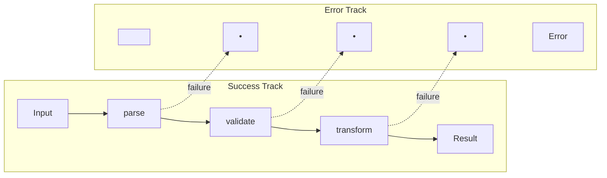
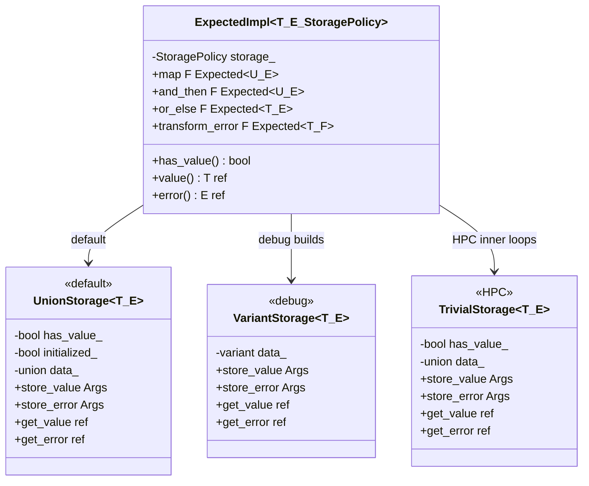

# Expected<T, E> User Manual

## Table of Contents

1. [What is Expected?](#what-is-expected)
   - [The Error Handling Problem](#the-error-handling-problem)
   - [Why Errors Should Be in the Type Signature](#why-errors-should-be-in-the-type-signature)
   - [The C++ Error Handling Landscape](#the-c-error-handling-landscape)
   - [Where Expected Fits](#where-expected-fits)
2. [The Philosophy of Expected](#the-philosophy-of-expected)
   - [Sum Types: Values OR Errors](#sum-types-values-or-errors)
   - [Railway-Oriented Programming](#railway-oriented-programming)
   - [Making Illegal States Unrepresentable](#making-illegal-states-unrepresentable)
   - [Parse, Don't Validate](#parse-dont-validate)
3. [Core Architecture](#core-architecture)
   - [Storage Policies](#storage-policies)
   - [Why the unexpected Wrapper Exists](#why-the-unexpected-wrapper-exists)
4. [Getting Started](#getting-started)
   - [Prerequisites](#prerequisites)
   - [Integration](#integration)
   - [First Program](#first-program)
5. [Creating Expected Values](#creating-expected-values)
   - [Success States](#success-states)
   - [Error States](#error-states)
   - [Void Expected](#void-expected)
6. [Accessing Values](#accessing-values)
   - [Checking State](#checking-state)
   - [Value Access](#value-access)
   - [Unchecked Access for HPC](#unchecked-access-for-hpc)
   - [Error Access](#error-access)
   - [Safe Defaults](#safe-defaults)
7. [Monadic Operations](#monadic-operations)
   - [Why Monadic Operations Matter](#why-monadic-operations-matter)
   - [map and transform](#map-and-transform)
   - [and_then and flat_map](#and_then-and-flat_map)
   - [or_else](#or_else)
   - [transform_error and map_error](#transform_error-and-map_error)
   - [inspect and inspect_error](#inspect-and-inspect_error)
   - [fold](#fold)
8. [Error Handling Patterns](#error-handling-patterns)
   - [Early Return Pattern](#early-return-pattern)
   - [Monadic Chaining Pattern](#monadic-chaining-pattern)
   - [FATP_EXPECTED_TRY Macro](#fatp_expected_try-macro)
   - [FATP_EXPECTED_ASSIGN_OR_RETURN Macro](#fatp_expected_assign_or_return-macro)
   - [Error Collection Pattern](#error-collection-pattern)
   - [Real-World Pipeline Example](#real-world-pipeline-example)
9. [Storage Policies](#storage-policies-detail)
   - [UnionStorage Default](#unionstorage-default)
   - [VariantStorage Debug](#variantstorage-debug)
   - [TrivialStorage for HPC](#trivialstorage-for-hpc)
   - [Configuring Storage](#configuring-storage)
10. [Performance for Scientific Computing](#performance-for-scientific-computing)
    - [Why Exceptions Are Problematic in HPC](#why-exceptions-are-problematic-in-hpc)
    - [Branch Prediction and Hot Loops](#branch-prediction-and-hot-loops)
    - [Register Passing and Vectorization](#register-passing-and-vectorization)
    - [Benchmark Results](#benchmark-results)
    - [Memory Layout](#memory-layout)
11. [Designing Error Types](#designing-error-types)
    - [String Errors: Simple but Limited](#string-errors-simple-but-limited)
    - [Enum Errors: Efficient and Matchable](#enum-errors-efficient-and-matchable)
    - [Struct Errors: Rich Context](#struct-errors-rich-context)
    - [Error Type Hierarchies](#error-type-hierarchies)
12. [C++20/23 Integration](#c2023-integration)
    - [Three-Way Comparison](#three-way-comparison)
    - [std::expected Interop](#stdexpected-interop)
    - [Feature Detection](#feature-detection)
13. [Comparison with Alternatives](#comparison-with-alternatives)
    - [Expected vs Exceptions](#expected-vs-exceptions)
    - [Expected vs Error Codes](#expected-vs-error-codes)
    - [Expected vs std::optional](#expected-vs-stdoptional)
    - [Expected vs std::expected C++23](#expected-vs-stdexpected-c23)
14. [Integration with fat_p Components](#integration-with-fat_p-components)
15. [Troubleshooting](#troubleshooting)
    - [Compilation Errors](#compilation-errors)
    - [Runtime Issues](#runtime-issues)
16. [Migration Guide](#migration-guide)
    - [From Exceptions](#from-exceptions)
    - [From Error Codes](#from-error-codes)
    - [To std::expected C++23](#to-stdexpected-c23)
17. [Best Practices](#best-practices)
18. [Summary](#summary)

---

## What is Expected?

### The Error Handling Problem

Every non-trivial program must deal with failure. Files might not exist. Network connections might drop. User input might be malformed. Calculations might overflow. The question is not whether your code will encounter errors, but how it will represent and handle them.

Consider a function that parses a configuration value from a file:

```cpp
int parse_config(const std::string& path)
{
    std::ifstream file(path);
    if (!file)
    {
        throw std::runtime_error("Cannot open file: " + path);
    }
    
    std::string line;
    std::getline(file, line);
    
    return std::stoi(line);  // May also throw
}
```

This code has a fundamental problem: **the function signature lies**. It says "give me a path, I'll give you an int." But that's not the whole truth. Sometimes it gives you an int. Sometimes it throws an exception. Sometimes it throws `std::runtime_error`. Sometimes it throws `std::invalid_argument`. The caller cannot know this without reading the implementation.

Now consider how the caller must use this function:

```cpp
void use_config()
{
    try
    {
        int value = parse_config("settings.cfg");
        // Use value...
    }
    catch (const std::runtime_error& e)
    {
        // File error
    }
    catch (const std::invalid_argument& e)
    {
        // Parse error
    }
    catch (const std::out_of_range& e)
    {
        // Value too large
    }
}
```

The problems compound:

| Problem | Impact |
|---------|--------|
| Hidden failure modes | Caller must guess what exceptions might be thrown |
| Non-local control flow | `throw` jumps to an unknown `catch` block, possibly far away |
| Exception safety burden | Every line between `try` and `catch` must be exception-safe |
| Performance overhead | Stack unwinding is expensive, especially in tight loops |
| Forgettable errors | Nothing forces the caller to handle errors |

The error-code approach trades one set of problems for another:

```cpp
enum class ConfigError { Success, FileNotFound, InvalidValue };

ConfigError parse_config(const std::string& path, int& out_value)
{
    std::ifstream file(path);
    if (!file)
    {
        return ConfigError::FileNotFound;
    }
    
    std::string line;
    std::getline(file, line);
    
    try
    {
        out_value = std::stoi(line);
        return ConfigError::Success;
    }
    catch (...)
    {
        return ConfigError::InvalidValue;
    }
}
```

| Problem | Impact |
|---------|--------|
| Output parameter pollution | Awkward API, uninitialized values, easy to misuse |
| Forgettable return value | Nothing forces checking the error code |
| Success value in error type | `ConfigError::Success` is logically wrong (success is not an error) |
| No composition | Cannot chain operations naturally |

### Why Errors Should Be in the Type Signature

The fundamental insight behind Expected is that **errors are values**, and values belong in type signatures.

When a function can fail, that possibility should be visible in its return type. Not hidden in documentation. Not implicit in implementation details. Right there in the signature where the compiler can see it and enforce correct handling.

```cpp
// The type signature tells the complete story
fat_p::Expected<int, ConfigError> parse_config(const std::string& path);
```

This signature says: "Give me a path, and I will give you either an int or a ConfigError. You must decide which case you're in before you can use the result."

The caller cannot accidentally ignore the error:

```cpp
void use_config()
{
    auto result = parse_config("settings.cfg");
    
    // This won't compile - Expected is [[nodiscard]]
    // parse_config("settings.cfg");
    
    // This won't compile - cannot use result without checking
    // int value = result;
    
    // Must explicitly handle both cases
    if (result)
    {
        int value = *result;
        // Use value...
    }
    else
    {
        ConfigError err = result.error();
        // Handle error...
    }
}
```

### The C++ Error Handling Landscape

| Approach | Type Safety | Performance | Composability | Explicit Errors | Forgettable |
|----------|-------------|-------------|---------------|-----------------|-------------|
| Exceptions | Low | Runtime overhead | Poor | No | Yes |
| Error codes | Low | Zero overhead | Poor | Partial | Yes |
| std::optional | Medium | Zero overhead | Good | No error info | No |
| Expected | High | Zero overhead | Excellent | Yes | No |
| std::expected (C++23) | High | Zero overhead | Excellent | Yes | No |

### Where Expected Fits

`fat_p::Expected<T, E>` is a vocabulary type that represents either a successful value of type `T` or an error of type `E`. It makes error handling:

- **Explicit**: The type signature shows the function can fail
- **Type-safe**: Cannot access value without checking state
- **Composable**: Chain operations with `map`, `and_then`, `or_else`
- **Zero-overhead**: No runtime cost compared to manual implementation
- **Unforgettable**: `[[nodiscard]]` forces handling the result

**When to use Expected:**

- Functions that can fail in expected ways (file I/O, parsing, validation)
- Public APIs where callers must handle errors
- Performance-critical code that cannot afford exception overhead
- Code that needs to compose multiple fallible operations
- Real-time systems requiring deterministic timing

**When NOT to use Expected:**

- Truly exceptional conditions (out of memory, hardware failure)
- Functions that cannot fail (pure calculations, simple getters)
- Simple scripts where exception handling is acceptable
- When interoperating heavily with exception-based libraries

---

## The Philosophy of Expected

### Sum Types: Values OR Errors

Expected is a *sum type* (also called a *discriminated union* or *tagged union*). It holds exactly one of two possibilities: a value OR an error, never both, never neither.

This is fundamentally different from a struct that holds both:

```cpp
// NOT what Expected does - this holds both simultaneously
struct BadResult
{
    int value;
    std::string error;
    bool has_error;
};

// Expected holds exactly ONE of these
// The type system guarantees you check which one before accessing
fat_p::Expected<int, std::string> result;
```

The sum type property means Expected's size is approximately `max(sizeof(T), sizeof(E))` plus a discriminant, not `sizeof(T) + sizeof(E)`. More importantly, it means the compiler knows you cannot have both a value and an error, and it enforces that you determine which state you're in before accessing either.

### Railway-Oriented Programming

Imagine a railway track. Your data starts at one end and travels toward the other. At each station (function), one of two things happens: the train continues on the main track (success), or it gets diverted to a parallel error track (failure).



Once the data is on the error track, it stays there. Subsequent operations on the success track are skipped. The error propagates automatically to the end of the line.

This is exactly what Expected's monadic operations provide:

```cpp
fat_p::Expected<Output, Error> process(Input input)
{
    return parse(input)           // If this fails, skip the rest
        .and_then(validate)       // If this fails, skip the rest
        .and_then(transform);     // If this fails, return its error
}
```

Compare this to the imperative alternative:

```cpp
fat_p::Expected<Output, Error> process(Input input)
{
    auto parsed = parse(input);
    if (!parsed)
    {
        return parsed.error();
    }
    
    auto validated = validate(*parsed);
    if (!validated)
    {
        return validated.error();
    }
    
    return transform(*validated);
}
```

Both versions do the same thing, but the monadic version:
- Is shorter and less repetitive
- Has no opportunity for copy-paste errors
- Makes the happy path visually prominent
- Cannot accidentally use a value after an error

### Making Illegal States Unrepresentable

A powerful principle in type-driven design is to make illegal states unrepresentable. If your types make it impossible to construct invalid data, you eliminate entire categories of bugs.

Consider a function that returns either a file handle or an error:

```cpp
// BAD: Illegal states are representable
struct FileResult
{
    FILE* handle;      // Might be null
    int error_code;    // Might be 0 (success) or non-zero (error)
};

// What if handle is non-null but error_code is non-zero?
// What if handle is null but error_code is 0?
// The type allows these nonsensical combinations.
```

```cpp
// GOOD: Illegal states are unrepresentable
fat_p::Expected<FILE*, int> open_file(const char* path);

// Either we have a valid FILE*, or we have an error code.
// Never both, never neither. The type enforces this.
```

Expected eliminates the entire category of bugs where code assumes success but an error occurred, or vice versa. The type system makes the invalid states impossible to construct.

### Parse, Don't Validate

A related principle is "parse, don't validate." Instead of validating data and then hoping everyone remembers it was validated, parse it into a type that can only hold valid data.

```cpp
// BAD: Validate and hope
void process_age(int age)
{
    if (age < 0 || age > 150)
    {
        throw std::invalid_argument("Invalid age");
    }
    // From here, we "know" age is valid
    // But the type system doesn't know that
    // Any function we pass age to must validate again, or trust us
}

// GOOD: Parse into a constrained type
class ValidAge
{
    int value_;
    explicit ValidAge(int v) : value_(v) {}
    
public:
    static fat_p::Expected<ValidAge, std::string> parse(int raw)
    {
        if (raw < 0 || raw > 150)
        {
            return fat_p::unexpected{"Age must be between 0 and 150"};
        }
        return ValidAge{raw};
    }
    
    int value() const { return value_; }
};

// Now functions can take ValidAge and know it's valid
// The type system enforces this - you cannot construct an invalid ValidAge
void process_age(ValidAge age)
{
    // No validation needed - the type guarantees validity
}
```

Expected is the bridge between raw, unvalidated data and parsed, trustworthy data. It forces you to handle the failure case before you can access the success case.

---

## Core Architecture

### Storage Policies

Expected uses a policy-based design for storage, allowing you to choose the right trade-off for your use case:



**UnionStorage (default):** Zero overhead, optimal for production. Uses a raw union with manual placement new/delete.

**VariantStorage:** Uses `std::variant` internally. Slightly slower but much easier to inspect in debuggers.

**TrivialStorage:** For HPC use. Requires trivially copyable T and E. Enables register passing on x64.

### Why the unexpected Wrapper Exists

When you construct an Expected with a value, how does the compiler know whether you mean a successful value or an error value? This is especially problematic when T and E are the same type or convertible to each other.

```cpp
// Ambiguous: Is this a value or an error?
fat_p::Expected<std::string, std::string> result = "hello";
```

The `unexpected` wrapper resolves this ambiguity:

```cpp
// Unambiguous: This is a successful value
fat_p::Expected<std::string, std::string> value = "hello";

// Unambiguous: This is an error
fat_p::Expected<std::string, std::string> error = fat_p::unexpected{"oops"};
```

The rule is simple: direct construction creates a value, `unexpected` wrapping creates an error. This mirrors how the vast majority of code works (returning success is more common than returning failure), while making the failure case explicit and visible.

---

## Getting Started

### Prerequisites

| Compiler | Minimum Version | Notes |
|----------|-----------------|-------|
| GCC | 7.0+ | Full C++17 support |
| Clang | 5.0+ | Full C++17 support |
| MSVC | 19.14+ (VS 2017 15.7) | Full C++17 support |

Required standard: C++17 or later.

### Integration

Expected is header-only. Simply include:

```cpp
#include "Expected.h"
```

Dependencies:
- `FatPTypeTraits.h` (included automatically)

Optional compile flags:
- `-DUSE_VARIANT_STORAGE`: Use std::variant-based storage for debugging
- `-DFATP_DEFAULT_STORAGE=MyStorage`: Use custom storage policy

### First Program

```cpp
#include <iostream>
#include <string>
#include "Expected.h"

fat_p::Expected<int, std::string> parse_positive(const std::string& s)
{
    if (s.empty())
    {
        return fat_p::unexpected{"Input string is empty"};
    }
    
    int value = 0;
    try
    {
        value = std::stoi(s);
    }
    catch (const std::exception& e)
    {
        return fat_p::unexpected{std::string("Parse error: ") + e.what()};
    }
    
    if (value < 0)
    {
        return fat_p::unexpected{"Value must be positive, got: " + std::to_string(value)};
    }
    
    return value;
}

fat_p::Expected<int, std::string> divide(int a, int b)
{
    if (b == 0)
    {
        return fat_p::unexpected{"Division by zero"};
    }
    return a / b;
}

int main()
{
    // Chain operations - errors propagate automatically
    auto result = parse_positive("42")
        .and_then([](int x) { return divide(100, x); })
        .map([](int x) { return x * 2; });
    
    if (result)
    {
        std::cout << "Result: " << *result << "\n";
    }
    else
    {
        std::cout << "Error: " << result.error() << "\n";
    }
    
    return 0;
}
```

Output:
```
Result: 4
```

---

## Creating Expected Values

### Success States

```cpp
// Direct construction - most common
fat_p::Expected<int, std::string> a = 42;
fat_p::Expected<int, std::string> b{42};

// In-place construction (avoids copy/move for complex types)
fat_p::Expected<std::vector<int>, std::string> vec{std::in_place, 10, 0};

// Using factory function
auto c = fat_p::make_expected<std::string>(42);

// Type alias for common case
fat_p::Result<int> d = 42;  // Same as Expected<int, std::string>
```

### Error States

```cpp
// Using unexpected wrapper - most common
fat_p::Expected<int, std::string> e = fat_p::unexpected{"error message"};

// Using make_unexpected factory
fat_p::Expected<int, std::string> f = fat_p::make_unexpected("error");

// In-place error construction
fat_p::Expected<int, std::string> g{fat_p::unexpect, "constructed in place"};
```

### Void Expected

For operations that succeed or fail without returning a value:

```cpp
fat_p::Expected<void, std::string> validate_age(int age)
{
    if (age < 0 || age > 150)
    {
        return fat_p::unexpected{"Invalid age: " + std::to_string(age)};
    }
    return {};  // Success - no value needed
}

// Chain void operations
fat_p::Expected<void, std::string> validate_person(int age, const std::string& name)
{
    return validate_age(age)
        .and_then([&]() { return validate_name(name); });
}
```

The `Status` alias is provided for this common case:

```cpp
fat_p::Status check_all();  // Same as Expected<void, std::string>
```

---

## Accessing Values

### Checking State

```cpp
fat_p::Expected<int, std::string> result = get_value();

// Method 1: has_value() / has_error()
if (result.has_value())
{
    use(*result);
}

if (result.has_error())
{
    handle(result.error());
}

// Method 2: Boolean conversion (preferred for brevity)
if (result)
{
    use(*result);
}
else
{
    handle(result.error());
}
```

### Value Access

```cpp
fat_p::Expected<int, std::string> result = 42;

// operator* - unchecked access (asserts in debug, UB in release if error)
int v1 = *result;

// operator-> - for accessing members
result->some_method();  // If T has methods

// value() - checked access (throws bad_expected_access if error)
int v2 = result.value();
```

### Unchecked Access for HPC

For performance-critical loops where state has been verified externally:

```cpp
std::vector<fat_p::Expected<int, Error>> results = compute_batch();

// Verify all results are valid once, outside the hot loop
bool all_valid = std::all_of(results.begin(), results.end(),
    [](const auto& r) { return r.has_value(); });

if (all_valid)
{
    for (const auto& r : results)
    {
        // No branching, no assertions - pure memory access
        // WARNING: Undefined behavior if r holds an error
        process(r.value_unchecked());
    }
}
```

Use `value_unchecked()` when:
- State was verified outside the loop
- Profiling shows `operator*` assertions are a bottleneck
- You need deterministic timing (real-time systems)

### Error Access

```cpp
fat_p::Expected<int, std::string> result = fat_p::unexpected{"oops"};

// Unchecked access (asserts in debug, UB in release if has value)
std::string err = result.error();

// There is no error_unchecked() - error paths are not typically hot loops
```

### Safe Defaults

```cpp
fat_p::Expected<int, std::string> result = fat_p::unexpected{"error"};

// value_or: Immediate default value
int v1 = result.value_or(0);  // Returns 0

// value_or_else: Lazy default (factory called only on error)
int v2 = result.value_or_else([]
{
    return compute_expensive_default();  // Only runs if result has error
});

// error_or: Immediate default error
std::string e1 = result.error_or("no error");  // Returns "error" (actual error)

// error_or_else: Lazy default (factory called only on success)
std::string e2 = result.error_or_else([]
{
    return "generated error message";  // Only runs if result has value!
});
```

The `_or_else` variants are "lazy" - the factory is called only when needed. This avoids constructing default values that are never used.

---

## Monadic Operations

### Why Monadic Operations Matter

The term "monad" comes from category theory, but you don't need to understand the math to use Expected effectively. Think of it this way: **monadic operations let you work with values inside containers without manually unpacking and repacking them**.

Consider adding 1 to a value that might not exist:

```cpp
// Without monadic operations: manual unpacking
fat_p::Expected<int, Error> add_one_manual(fat_p::Expected<int, Error> x)
{
    if (!x)
    {
        return x.error();  // Propagate error
    }
    return *x + 1;  // Unpack, compute, repack
}

// With monadic operations: work inside the container
fat_p::Expected<int, Error> add_one_monadic(fat_p::Expected<int, Error> x)
{
    return x.map([](int n) { return n + 1; });
}
```

The monadic version is shorter, but more importantly, it cannot forget to propagate errors. The error handling is built into the operation.

### map and transform

`map` applies a function to the value if present, leaving errors unchanged.

```cpp
fat_p::Expected<int, std::string> x = 5;

// Transform the value
fat_p::Expected<double, std::string> y = x.map([](int n)
{
    return n * 2.5;
});
// y contains 12.5

// Errors pass through unchanged
fat_p::Expected<int, std::string> err = fat_p::unexpected{"error"};
auto z = err.map([](int n) { return n * 2; });
// z still contains "error" - the lambda was never called
```

`transform` is an alias for `map` (C++23 naming convention).

### and_then and flat_map

`and_then` chains operations that themselves return Expected. This is essential for avoiding nested Expected types.

```cpp
fat_p::Expected<int, std::string> parse(const std::string& s);
fat_p::Expected<double, std::string> validate(int n);
fat_p::Expected<double, std::string> transform(double d);

// Chain fallible operations
auto result = parse("42")
    .and_then(validate)
    .and_then(transform);

// Without and_then, you'd get nested Expected:
// Expected<Expected<Expected<double, E>, E>, E>  -- not what you want!
```

The difference between `map` and `and_then`:
- `map(f)`: `f` returns a plain value, result is `Expected<U, E>`
- `and_then(f)`: `f` returns `Expected<U, E>`, result is `Expected<U, E>` (flattened)

### or_else

`or_else` handles errors, potentially recovering to a value.

```cpp
fat_p::Expected<int, std::string> get_from_cache(const std::string& key);
fat_p::Expected<int, std::string> get_from_database(const std::string& key);

// Try cache first, fall back to database
auto result = get_from_cache("user_123")
    .or_else([](const std::string& err) -> fat_p::Expected<int, std::string>
    {
        log_cache_miss(err);
        return get_from_database("user_123");
    });
```

### transform_error and map_error

`transform_error` transforms the error if present, leaving values unchanged.

```cpp
enum class AppError { ParseFailed, ValidationFailed, NetworkError };

// Convert string errors to typed errors
fat_p::Expected<int, AppError> result = parse_string("abc")
    .transform_error([](const std::string& e) -> AppError
    {
        return AppError::ParseFailed;
    });
```

### inspect and inspect_error

`inspect` observes the value or error without consuming it. Useful for logging and debugging.

```cpp
auto result = compute()
    .inspect([](const auto& v)
    {
        std::cout << "Computed: " << v << "\n";
    })
    .inspect_error([](const auto& e)
    {
        std::cerr << "Error: " << e << "\n";
    })
    .and_then(next_step);  // result unchanged, just observed
```

### fold

`fold` handles both cases and returns a common type. This is pattern matching.

```cpp
std::string message = result.fold(
    [](int value) { return "Success: " + std::to_string(value); },
    [](const std::string& error) { return "Failed: " + error; }
);
```

---

## Error Handling Patterns

### Early Return Pattern

The traditional imperative approach:

```cpp
fat_p::Expected<Result, Error> process(Input input)
{
    auto step1 = do_step1(input);
    if (!step1)
    {
        return step1.error();
    }
    
    auto step2 = do_step2(*step1);
    if (!step2)
    {
        return step2.error();
    }
    
    return do_step3(*step2);
}
```

### Monadic Chaining Pattern

The functional approach:

```cpp
fat_p::Expected<Result, Error> process(Input input)
{
    return do_step1(input)
        .and_then(do_step2)
        .and_then(do_step3);
}
```

### FATP_EXPECTED_TRY Macro

The `FATP_EXPECTED_TRY` macro provides early-return syntax similar to Rust's `?` operator:

```cpp
fat_p::Expected<int, std::string> process()
{
    FATP_EXPECTED_TRY(x, parse("42"));       // Declares x, returns on error
    FATP_EXPECTED_TRY(y, validate(x));       // Declares y, returns on error
    FATP_EXPECTED_TRY_VOID(log_operation()); // No variable, just early return on error
    return x + y;
}
```

The macro expands approximately to:

```cpp
auto _temp = expr;
if (!_temp.has_value())
{
    return fat_p::unexpected(std::move(_temp).error());
}
auto x = std::move(_temp).value();
```

### FATP_EXPECTED_ASSIGN_OR_RETURN Macro

When you need to assign to an existing variable:

```cpp
fat_p::Expected<double, std::string> compute_area()
{
    int width = 0;
    int height = 0;
    
    FATP_EXPECTED_ASSIGN_OR_RETURN(width, parse_width(input));
    FATP_EXPECTED_ASSIGN_OR_RETURN(height, parse_height(input));
    
    return width * height * 3.14159;
}
```

### Error Collection Pattern

Sometimes you want to collect all errors rather than stopping at the first:

```cpp
fat_p::Expected<std::vector<Result>, std::vector<Error>> process_all(
    const std::vector<Input>& items)
{
    std::vector<Result> results;
    std::vector<Error> errors;
    
    for (const auto& item : items)
    {
        auto result = process(item);
        if (result)
        {
            results.push_back(*result);
        }
        else
        {
            errors.push_back(result.error());
        }
    }
    
    if (!errors.empty())
    {
        return fat_p::unexpected{std::move(errors)};
    }
    return results;
}
```

### Real-World Pipeline Example

Here's a complete example showing Expected in a realistic data processing pipeline:

```cpp
#include "Expected.h"
#include <fstream>
#include <sstream>
#include <vector>

// Error types for different failure modes
enum class DataError
{
    FileNotFound,
    ParseError,
    ValidationError,
    TransformError
};

struct Record
{
    int id;
    std::string name;
    double value;
};

// Step 1: Read file contents
fat_p::Expected<std::string, DataError> read_file(const std::string& path)
{
    std::ifstream file(path);
    if (!file)
    {
        return fat_p::unexpected{DataError::FileNotFound};
    }
    
    std::stringstream buffer;
    buffer << file.rdbuf();
    return buffer.str();
}

// Step 2: Parse CSV line into Record
fat_p::Expected<Record, DataError> parse_line(const std::string& line)
{
    std::istringstream iss(line);
    Record r;
    char comma;
    
    if (!(iss >> r.id >> comma >> r.name >> comma >> r.value))
    {
        return fat_p::unexpected{DataError::ParseError};
    }
    return r;
}

// Step 3: Validate record
fat_p::Expected<Record, DataError> validate_record(Record r)
{
    if (r.id < 0 || r.value < 0)
    {
        return fat_p::unexpected{DataError::ValidationError};
    }
    return r;
}

// Step 4: Transform record
fat_p::Expected<Record, DataError> apply_discount(Record r, double discount)
{
    if (discount < 0 || discount > 1)
    {
        return fat_p::unexpected{DataError::TransformError};
    }
    r.value *= (1.0 - discount);
    return r;
}

// Complete pipeline using monadic operations
fat_p::Expected<std::vector<Record>, DataError> process_file(
    const std::string& path,
    double discount)
{
    return read_file(path)
        .and_then([](const std::string& content)
            -> fat_p::Expected<std::vector<std::string>, DataError>
        {
            std::vector<std::string> lines;
            std::istringstream iss(content);
            std::string line;
            while (std::getline(iss, line))
            {
                if (!line.empty())
                {
                    lines.push_back(line);
                }
            }
            return lines;
        })
        .and_then([discount](const std::vector<std::string>& lines)
            -> fat_p::Expected<std::vector<Record>, DataError>
        {
            std::vector<Record> records;
            for (const auto& line : lines)
            {
                auto result = parse_line(line)
                    .and_then(validate_record)
                    .and_then([discount](Record r)
                    {
                        return apply_discount(r, discount);
                    });
                
                if (!result)
                {
                    return result.error();
                }
                records.push_back(*result);
            }
            return records;
        });
}

// Usage
void example()
{
    auto result = process_file("data.csv", 0.1);
    
    result.fold(
        [](const std::vector<Record>& records)
        {
            std::cout << "Processed " << records.size() << " records\n";
        },
        [](DataError err)
        {
            switch (err)
            {
                case DataError::FileNotFound:
                    std::cerr << "File not found\n";
                    break;
                case DataError::ParseError:
                    std::cerr << "Parse error\n";
                    break;
                case DataError::ValidationError:
                    std::cerr << "Validation error\n";
                    break;
                case DataError::TransformError:
                    std::cerr << "Transform error\n";
                    break;
            }
        }
    );
}
```

---

## Storage Policies Detail

### UnionStorage Default

The default storage policy uses a raw union with manual lifetime management:

```cpp
// Default behavior
fat_p::Expected<int, std::string> x;  // Uses UnionStorage

// Explicit UnionStorage
fat_p::ExpectedUnion<int, std::string> y;
```

Properties:
- Zero overhead compared to hand-written union
- Handles non-trivially-destructible types correctly
- Includes `initialized_` flag for moved-from detection
- Best choice for production code

### VariantStorage Debug

Uses `std::variant` internally for better debugger support:

```cpp
// Enable via preprocessor (before including Expected.h)
#define USE_VARIANT_STORAGE
#include "Expected.h"

fat_p::Expected<int, std::string> x;  // Now uses VariantStorage

// Or use explicit alias
fat_p::ExpectedVariant<int, std::string> y;
```

Properties:
- Better visualization in debuggers (GDB, LLDB, Visual Studio)
- ~50-100% slower value access
- Use only in debug builds

### TrivialStorage for HPC

Designed for high-performance computing where every nanosecond matters:

```cpp
// Use the convenience alias
fat_p::TrivialExpected<int, int> fast_divide(int a, int b)
{
    if (b == 0)
    {
        return fat_p::unexpected{-1};
    }
    return a / b;
}

// Verify trivial copyability
static_assert(std::is_trivially_copyable_v<fat_p::TrivialExpected<int, int>>,
    "TrivialExpected must be trivially copyable");
```

Properties:
- No `initialized_` flag (assumes always-valid invariant)
- Trivially copyable when T and E are trivially copyable
- Passed in CPU registers on x64 (not via stack pointer)
- Requirements: both T and E must be trivially copyable

### Configuring Storage

```cpp
// Global configuration (before including Expected.h)
#define FATP_DEFAULT_STORAGE MyCustomStorage
#include "Expected.h"

// Now all Expected<T,E> use MyCustomStorage
```

Custom storage must implement:
- `store_value(Args...)` / `store_error(Args...)`
- `assign_value(Arg)` / `assign_error(Arg)`
- `has_value() const` / `is_initialized() const`
- `get_value()` (all ref-qualifiers)
- `get_error()` (all ref-qualifiers)
- `swap(Storage&)`

---

## Performance for Scientific Computing

### Why Exceptions Are Problematic in HPC

High-performance computing and scientific applications have requirements that conflict with exception-based error handling:

**1. Deterministic Timing**

Real-time systems (control systems, audio processing, robotics) require predictable execution times. Exception handling introduces unbounded latency because stack unwinding takes variable time depending on call depth and destructor complexity.

```cpp
// In a 4kHz control loop, you have 250 microseconds per iteration
// Exception unwinding can take milliseconds - unacceptable
void control_loop()
{
    while (running)
    {
        auto sensor_data = read_sensors();  // Must not throw
        auto command = compute_control(sensor_data);  // Must not throw
        send_to_actuators(command);  // Must not throw
    }
}
```

**2. Vectorization Interference**

Modern compilers vectorize loops using SIMD instructions. Exception handling code prevents many vectorization optimizations because the compiler must maintain the ability to unwind at any point.

```cpp
// This loop can be vectorized
for (int i = 0; i < n; ++i)
{
    result[i] = compute(data[i]);  // No exceptions
}

// This loop likely cannot be vectorized
for (int i = 0; i < n; ++i)
{
    result[i] = compute_throwing(data[i]);  // Might throw
}
```

**3. Branch Prediction**

CPUs predict branch outcomes to keep their pipelines full. Exception paths are rarely taken, so they're predicted as not-taken. When an exception does occur, the pipeline is flushed, causing a significant performance penalty.

Expected's `has_value()` check is a well-predicted branch (usually true), so the penalty is minimal even in tight loops.

### Branch Prediction and Hot Loops

The key insight is that **checking is cheap; throwing is expensive**.

```cpp
// Expected: check is a single branch (well-predicted)
for (int i = 0; i < n; ++i)
{
    auto result = compute(data[i]);
    if (result)  // Almost always true - predicted correctly
    {
        output[i] = *result;
    }
}

// Exceptions: no explicit check, but unwinding is expensive
for (int i = 0; i < n; ++i)
{
    try
    {
        output[i] = compute_throwing(data[i]);  // Rare throw
    }
    catch (...)
    {
        // Unwinding destroys pipeline, cache, etc.
    }
}
```

When errors are rare (as they should be for precondition violations), the Expected version is faster because:
- The branch is correctly predicted ~99%+ of the time
- No exception tables in the binary
- No unwinding machinery

### Register Passing and Vectorization

On x64 systems (System V ABI and Microsoft x64 ABI), trivially copyable types up to a certain size are passed in registers rather than via stack pointer.

```cpp
// TrivialExpected<int, int> is trivially copyable
// On x64, returned in RAX register
fat_p::TrivialExpected<int, int> fast_divide(int a, int b)
{
    if (b == 0) return fat_p::unexpected{-1};
    return a / b;
}

// Assembly (simplified):
// fast_divide:
//     test esi, esi
//     je .error
//     cdq
//     idiv esi
//     mov eax, eax      ; Value in low bits
//     mov edx, 1        ; has_value flag
//     ret
// .error:
//     mov eax, -1       ; Error value
//     xor edx, edx      ; has_value = false
//     ret
```

Compare to UnionStorage, which must return via pointer:

```cpp
// UnionStorage is NOT trivially copyable (has destructor logic)
// Must return via hidden pointer parameter
// Assembly (simplified):
// divide:
//     mov rax, rdi      ; Load output pointer
//     test esi, esi
//     je .error
//     cdq
//     idiv esi
//     mov [rax], eax    ; Store to memory
//     mov byte [rax+4], 1
//     ret
```

The memory store in the UnionStorage version can cause cache misses in tight loops.

### Benchmark Results

**Test Environment:**

| Component | Specification |
|-----------|---------------|
| Processor | Intel Core i7-8850H @ 2.60 GHz |
| RAM | 32 GB |
| OS | Windows 10 / Ubuntu 22.04 |
| Compiler | MSVC 19.35 / GCC 12.2 |
| Flags | `/O2 /std:c++17` or `-O2 -std=c++17` |

**Operation Timings (nanoseconds per operation):**

| Operation | UnionStorage | TrivialStorage | std::variant | Raw Union |
|-----------|--------------|----------------|--------------|-----------|
| Construction (value) | 2.1 | 1.8 | 3.5 | 1.9 |
| Construction (error) | 2.3 | 2.0 | 3.8 | 2.1 |
| Same-state assignment | 1.5 | 1.3 | 2.8 | 1.4 |
| Different-state assignment | 4.2 | 3.8 | 5.1 | 4.0 |
| Value access (operator*) | 0.3 | 0.2 | 1.2 | 0.3 |
| map() | 3.8 | 3.5 | N/A | N/A |
| and_then() | 4.1 | 3.8 | N/A | N/A |
| has_value() | 0.2 | 0.2 | 0.4 | 0.2 |

**Interpretation:**
- Expected matches raw union performance (zero overhead abstraction)
- TrivialStorage is ~10% faster due to register passing
- Same-state assignment is ~3x faster than different-state (optimization for common case)
- Monadic operations add ~2-4ns overhead per operation

### Memory Layout

```cpp
// Expected<T, E> size = max(sizeof(T), sizeof(E)) + alignment + flags
// UnionStorage: 2 flag bytes (has_value_ + initialized_)
// TrivialStorage: 1 flag byte (has_value_ only)

static_assert(sizeof(fat_p::Expected<int, int>) <= 12);
static_assert(sizeof(fat_p::Expected<char, char>) <= 4);
static_assert(sizeof(fat_p::Expected<double, int>) <= 16);

static_assert(sizeof(fat_p::TrivialExpected<int, int>) <= 8);  // Smaller!
```

---

## Designing Error Types

The error type E is as important as the value type T. A well-designed error type makes debugging easier and enables precise error handling.

### String Errors: Simple but Limited

```cpp
fat_p::Expected<int, std::string> parse(const std::string& s)
{
    if (s.empty())
    {
        return fat_p::unexpected{"Empty input"};
    }
    // ...
}
```

**Pros:**
- Easy to create and read
- Human-readable error messages
- Good for prototyping

**Cons:**
- Cannot pattern-match on error type
- No structured information
- Allocates memory
- Not suitable for HPC (TrivialStorage requires trivially copyable E)

### Enum Errors: Efficient and Matchable

```cpp
enum class ParseError
{
    EmptyInput,
    InvalidFormat,
    OutOfRange,
    UnexpectedCharacter
};

fat_p::Expected<int, ParseError> parse(const std::string& s)
{
    if (s.empty())
    {
        return fat_p::unexpected{ParseError::EmptyInput};
    }
    // ...
}

// Callers can switch on the error
void handle(fat_p::Expected<int, ParseError> result)
{
    if (!result)
    {
        switch (result.error())
        {
            case ParseError::EmptyInput:
                std::cerr << "Please provide input\n";
                break;
            case ParseError::InvalidFormat:
                std::cerr << "Invalid format\n";
                break;
            // ... handle all cases
        }
    }
}
```

**Pros:**
- Zero allocation
- Trivially copyable (works with TrivialStorage)
- Compiler warns on unhandled cases in switch
- Pattern matching possible

**Cons:**
- No contextual information (which character was unexpected?)
- Adding new variants may break existing code

### Struct Errors: Rich Context

```cpp
struct ParseError
{
    enum class Kind
    {
        EmptyInput,
        InvalidFormat,
        OutOfRange,
        UnexpectedCharacter
    };
    
    Kind kind;
    size_t position;        // Where in the input
    std::string context;    // Surrounding text
    
    std::string to_string() const
    {
        std::ostringstream oss;
        oss << "Parse error at position " << position << ": ";
        switch (kind)
        {
            case Kind::EmptyInput:
                oss << "empty input";
                break;
            case Kind::InvalidFormat:
                oss << "invalid format";
                break;
            // ...
        }
        if (!context.empty())
        {
            oss << " (near '" << context << "')";
        }
        return oss.str();
    }
};
```

**Pros:**
- Rich contextual information
- Can include source location, stack trace, etc.
- Extensible without breaking API

**Cons:**
- Larger memory footprint
- Not trivially copyable if contains std::string
- More complex to construct

### Error Type Hierarchies

For complex systems, you may need layered error types:

```cpp
// Low-level I/O errors
enum class IoError { FileNotFound, PermissionDenied, DiskFull };

// Mid-level parsing errors
struct ParseError
{
    enum class Kind { Syntax, Semantic, Internal };
    Kind kind;
    size_t line;
    std::string message;
};

// High-level application errors
using AppError = std::variant<IoError, ParseError, std::string>;

fat_p::Expected<Document, AppError> load_document(const std::string& path)
{
    auto content = read_file(path);  // Returns Expected<string, IoError>
    if (!content)
    {
        return fat_p::unexpected{AppError{content.error()}};
    }
    
    auto doc = parse(*content);  // Returns Expected<Document, ParseError>
    if (!doc)
    {
        return fat_p::unexpected{AppError{doc.error()}};
    }
    
    return *doc;
}
```

---

## C++20/23 Integration

### Three-Way Comparison

When compiled with C++20, Expected supports the spaceship operator:

```cpp
fat_p::Expected<int, std::string> a = 5;
fat_p::Expected<int, std::string> b = 10;

auto cmp = a <=> b;  // std::strong_ordering::less

// All six operators work
bool lt = (a < b);   // true
bool le = (a <= b);  // true
bool gt = (b > a);   // true
bool ge = (b >= a);  // true
bool eq = (a == a);  // true
bool ne = (a != b);  // true
```

Ordering semantics: errors sort before values, then by contained value/error.

### std::expected Interop

When `std::expected` is available (C++23), conversion functions are provided:

```cpp
// Convert to std::expected
fat_p::Expected<int, std::string> my_result = 42;
std::expected<int, std::string> std_result = fat_p::to_std_expected(my_result);

// Convert from std::expected
std::expected<int, std::string> std_exp(42);
auto my_exp = fat_p::from_std_expected(std_exp);
```

### Feature Detection

```cpp
#if defined(FATP_EXPECTED_MONADIC)
    // Monadic operations available
    auto result = exp.map(f).and_then(g);
#endif

#if defined(FATP_EXPECTED_SPACESHIP)
    // Three-way comparison available
    auto cmp = a <=> b;
#endif

#if defined(FATP_EXPECTED_STD_INTEGRATION)
    // std::expected conversion available
    auto std_exp = fat_p::to_std_expected(exp);
#endif
```

---

## Comparison with Alternatives

### Expected vs Exceptions

| Aspect | Expected | Exceptions |
|--------|----------|------------|
| Error visibility | In type signature | Hidden |
| Performance | Zero overhead | Stack unwinding cost |
| Control flow | Local, explicit | Non-local jumps |
| Composition | Excellent (monadic) | Poor |
| Mandatory handling | Yes (nodiscard) | No |
| Real-time safe | Yes | No |

**Use Expected when:**
- Errors are expected and common
- Performance is critical
- You need explicit error handling
- Working in real-time or HPC contexts

**Use Exceptions when:**
- Errors are truly exceptional (1 in 10,000+ operations)
- Deep call stacks need to propagate errors
- Working with exception-heavy libraries
- Simplicity trumps performance

### Expected vs Error Codes

| Aspect | Expected | Error Codes |
|--------|----------|-------------|
| Return value pollution | No | Yes (out params) |
| Forgettable | No (nodiscard) | Yes |
| Composable | Yes (monadic) | No |
| Type safety | High | Low |
| Value/error conflation | No | Often (0 = success) |

### Expected vs std::optional

| Aspect | Expected | std::optional |
|--------|----------|---------------|
| Error information | Yes (E type) | No (just "empty") |
| Use case | Fallible operations | Optional values |
| Monadic ops | Full set | Limited (C++23) |

Use `std::optional<T>` when absence is not an error (e.g., "find" operations).
Use `Expected<T, E>` when absence indicates failure with a reason.

### Expected vs std::expected C++23

| Aspect | fat_p::Expected | std::expected |
|--------|-----------------|---------------|
| C++ version | C++17+ | C++23+ |
| Storage policies | Yes (Union, Trivial, Variant) | No |
| inspect/inspect_error | Yes | No |
| value_or_else | Yes | No |
| FATP_EXPECTED_TRY macro | Yes | No |
| Standard library | No | Yes |

---

## Integration with fat_p Components

### With CheckedArithmetic

```cpp
#include "CheckedArithmetic.h"

// CheckedArithmetic with ReturnExpectedPolicy returns Expected
auto result = fat_p::checked_add<fat_p::ReturnExpectedPolicy>(INT_MAX, 1);
if (result.has_error())
{
    // Handle overflow
}
```

### With enforce

```cpp
#include "enforce.h"

fat_p::Expected<int, std::string> parse(const std::string& s)
{
    auto check = enforce_expected(!s.empty(), "Input cannot be empty");
    if (!check)
    {
        return fat_p::unexpected{check.error()};
    }
    // ... parsing logic
    return result;
}
```

---

## Troubleshooting

### Compilation Errors

**Error: "Cannot convert to Expected"**

```cpp
// Ambiguous when T and E are the same type
Expected<int, int> x = 42;  // Is this a value or an error?
```

Solution: Use `unexpected` for errors:
```cpp
Expected<int, int> value = 42;              // Value
Expected<int, int> error = unexpected{42};  // Error
```

**Error: "no matching function for call to 'unexpected'"**

Ensure correct namespace:
```cpp
// Wrong
unexpected{"error"};

// Correct
fat_p::unexpected{"error"};
```

**Error: "static_assert failed: T and E must be distinct types"**

Wrap one type to distinguish them:
```cpp
struct ErrorMessage { std::string msg; };
Expected<std::string, ErrorMessage> x;  // OK
```

### Runtime Issues

**Assertion failure in error() when has_value() is true**

```cpp
Expected<int, std::string> x = 42;
auto e = x.error();  // UB! Assertion fails in debug
```

Solution: Always check state first:
```cpp
if (x.has_error())
{
    auto e = x.error();  // Safe
}
```

**bad_expected_access thrown**

```cpp
Expected<int, std::string> x = unexpected{"error"};
int v = x.value();  // Throws bad_expected_access
```

Solution: Check state or use `value_or()`:
```cpp
int v = x.value_or(0);  // Returns 0 instead of throwing
```

---

## Migration Guide

### From Exceptions

```cpp
// Before: Exception-based
int parse(const std::string& s)
{
    if (s.empty())
    {
        throw std::invalid_argument("empty");
    }
    return std::stoi(s);  // May throw
}

try
{
    int x = parse(input);
    use(x);
}
catch (const std::exception& e)
{
    handle_error(e.what());
}
```

```cpp
// After: Expected-based
fat_p::Expected<int, std::string> parse(const std::string& s)
{
    if (s.empty())
    {
        return fat_p::unexpected{"empty"};
    }
    try
    {
        return std::stoi(s);
    }
    catch (const std::exception& e)
    {
        return fat_p::unexpected{e.what()};
    }
}

auto result = parse(input);
if (result)
{
    use(*result);
}
else
{
    handle_error(result.error());
}
```

### From Error Codes

```cpp
// Before: Error codes with out parameter
enum class Error { Success, Empty, Invalid };

Error parse(const std::string& s, int& out)
{
    if (s.empty()) return Error::Empty;
    try
    {
        out = std::stoi(s);
        return Error::Success;
    }
    catch (...)
    {
        return Error::Invalid;
    }
}

int value;
if (parse(input, value) == Error::Success)
{
    use(value);
}
```

```cpp
// After: Expected-based
fat_p::Expected<int, Error> parse(const std::string& s)
{
    if (s.empty())
    {
        return fat_p::unexpected{Error::Empty};
    }
    try
    {
        return std::stoi(s);
    }
    catch (...)
    {
        return fat_p::unexpected{Error::Invalid};
    }
}

auto result = parse(input);
if (result)
{
    use(*result);
}
```

### To std::expected C++23

```cpp
// Gradual migration with type alias
#if __cpp_lib_expected >= 202202L
    template <typename T, typename E>
    using Result = std::expected<T, E>;
#else
    template <typename T, typename E>
    using Result = fat_p::Expected<T, E>;
#endif

// Or explicit conversion at boundaries
std::expected<int, std::string> std_result = fat_p::to_std_expected(my_result);
```

---

## Best Practices

**Do:**

- Use Expected for functions that can fail in expected ways
- Prefer monadic operations (`map`, `and_then`) over manual unpacking
- Design meaningful error types (enums or structs, not just strings)
- Use `value_or_else()` for expensive default computations
- Mark your own Expected-returning functions `[[nodiscard]]`
- Use TrivialStorage for HPC when T and E are trivially copyable

```cpp
// Good: Meaningful error type
enum class ParseError { InvalidSyntax, UnexpectedEof, InvalidToken };
[[nodiscard]] fat_p::Expected<Ast, ParseError> parse(std::string_view code);

// Good: Monadic chaining
auto result = parse(input)
    .and_then(validate)
    .map(transform);

// Good: Lazy default
auto value = result.value_or_else([] { return compute_expensive_default(); });
```

**Don't:**

- Use Expected for infallible functions (just return the value)
- Ignore Expected results (it's `[[nodiscard]]` for a reason)
- Access `error()` without checking `has_error()`
- Nest Expected unnecessarily (use `and_then` to flatten)
- Use string errors in HPC code (not trivially copyable)

```cpp
// Bad: Function cannot fail - just return int
fat_p::Expected<int, std::string> add(int a, int b);

// Bad: Ignoring result
get_value();  // Discarded!

// Bad: Unchecked access
auto err = result.error();  // UB if has_value()

// Bad: Nested Expected (use and_then instead)
fat_p::Expected<fat_p::Expected<int, E1>, E2> nested;
```

---

## Summary

### Key Features

- **Zero-overhead** vocabulary type for fallible operations
- **Complete monadic interface**: map, and_then, or_else, transform_error, fold
- **Three storage policies**: UnionStorage (safe), TrivialStorage (HPC), VariantStorage (debug)
- **C++20/23 integration**: spaceship operator, std::expected interop
- **Ergonomic macros**: FATP_EXPECTED_TRY, FATP_EXPECTED_ASSIGN_OR_RETURN
- **HPC optimizations**: value_unchecked(), register-passable TrivialExpected

### Philosophy

- Errors are values that belong in type signatures
- Railway-oriented programming: success and error tracks
- Make illegal states unrepresentable
- Parse, don't validate

### Performance Profile

- Same performance as manual union implementation
- TrivialStorage enables CPU register passing (no memory traffic)
- Same-state assignment optimized (fast path)
- Monadic operations add ~2-4ns overhead
- No exception tables, no unwinding, real-time safe

### Quick Start

```cpp
#include "Expected.h"

fat_p::Expected<int, std::string> divide(int a, int b)
{
    if (b == 0)
    {
        return fat_p::unexpected{"division by zero"};
    }
    return a / b;
}

int main()
{
    auto result = divide(10, 2)
        .map([](int x) { return x * 2; })
        .value_or(-1);
    
    return result;  // Returns 10
}
```

### HPC Quick Start

```cpp
#include "Expected.h"

// TrivialExpected is trivially copyable - passed in registers
fat_p::TrivialExpected<int, int> fast_divide(int a, int b)
{
    if (b == 0)
    {
        return fat_p::unexpected{-1};
    }
    return a / b;
}
```

### Related Components

| Component | Purpose |
|-----------|---------|
| `CheckedArithmetic.h` | Overflow-safe arithmetic with Expected results |
| `enforce.h` | Precondition checking with enforce_expected |

---

**Library:** fat_p C++ Utilities  
**Standard:** C++17  
**Type:** Header-only
