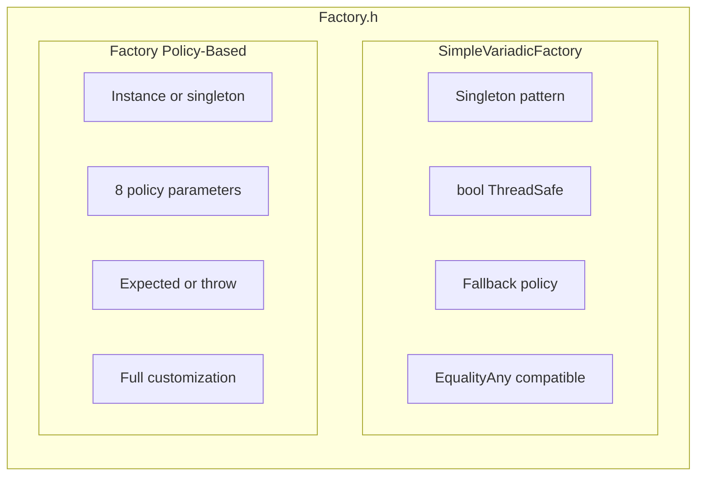
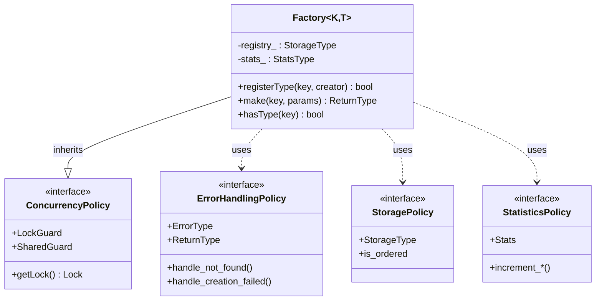
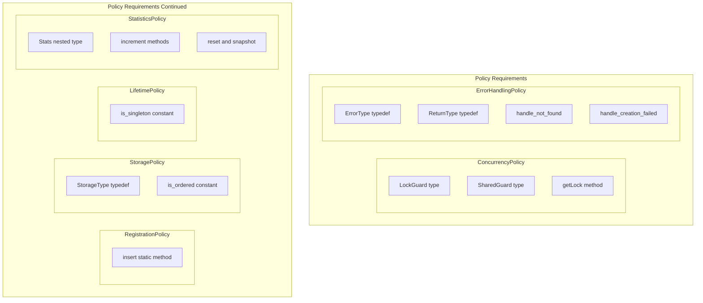
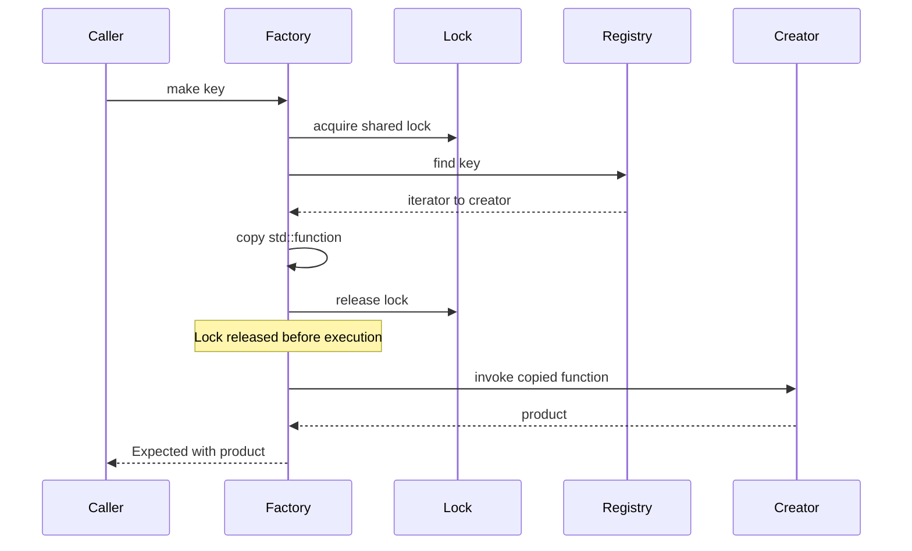
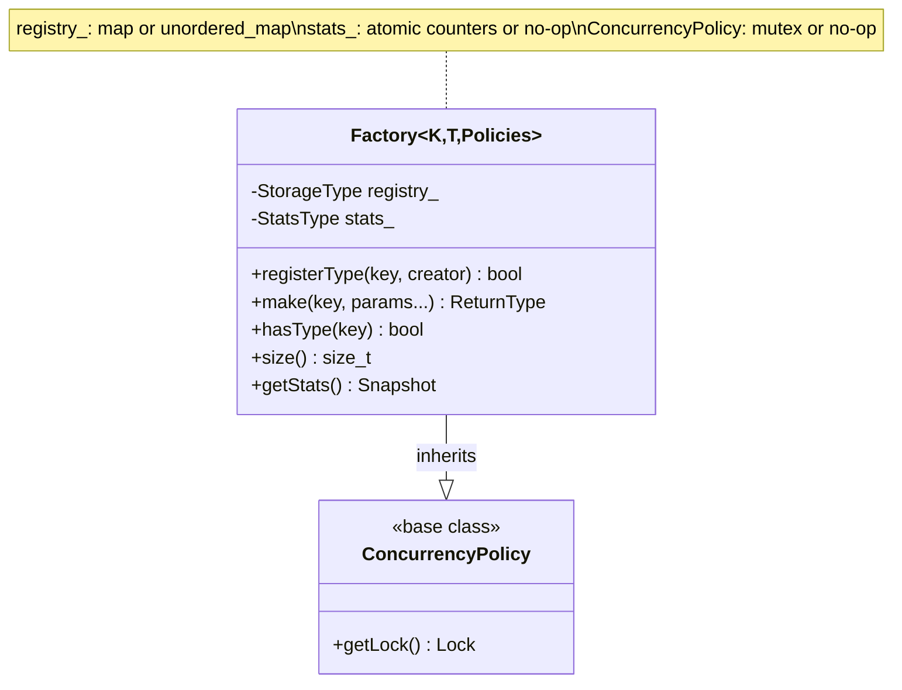

# User Manual - Factory

**Scope:** Complete usage guide for `fat_p::Factory`: type-safe factory registration by name, Expected-based creation, policy system (registration, thread safety, naming), singleton and transient creation, and integration patterns.

**Not covered:**
- Full dependency injection containers (Factory is a factory, not a DI framework)
- ServiceLocator pattern (see ServiceLocator User Manual)
- Abstract factory pattern beyond basic Factory usage

**Prerequisites:** C++20; understanding of why object creation should be decoupled from usage; familiarity with interface-based design (abstract base classes)

---

## User Manual Card

**Component:** Factory
**Primary use case:** Register concrete types by string name and create instances through a type-safe factory interface
**Integration pattern:** Register factories at startup with `factory.registerType<ConcreteType>("name")`; create instances with `factory.create("name")` returning `Expected<unique_ptr<Base>, Error>`
**Key API:** `Factory<Base>`, `.registerType<T>()`, `.create()`, `.createExpected()`, `.has()`, `.registeredNames()`
**std equivalent:** None
**Common mistakes:** Registering types after first use; forgetting that `create()` returns Expected (not a raw pointer); using Factory as a service locator (use ServiceLocator instead)
**Performance notes:** Registration is O(1) amortized (hash map insert). Creation involves one hash lookup + one virtual call. See `components/Factory/results/` for current data

---
## Table of Contents

1. [What is Factory?](#1-what-is-factory)
2. [Core Architecture](#2-core-architecture)
3. [Getting Started](#3-getting-started)
4. [Feature Guide](#4-feature-guide)
5. [Policy Reference](#5-policy-reference)
6. [Performance](#6-performance)
7. [Comparison with Alternatives](#7-comparison-with-alternatives)
8. [Migration Guide](#8-migration-guide)
9. [Best Practices](#9-best-practices)
10. [Troubleshooting](#10-troubleshooting)
11. [Summary](#11-summary)

---

## 1. What is Factory?

### The Problem

Object creation often requires decisions that shouldn't be hardcoded:

```cpp
// The problem: Creation logic scattered throughout codebase
Widget* createWidget(const std::string& type) {
    if (type == "button") {
        return new ButtonWidget();
    } else if (type == "slider") {
        return new SliderWidget();
    } else if (type == "checkbox") {
        return new CheckboxWidget();
    }
    // Every new widget type requires modifying this function
    // Every call site that creates widgets needs updating
    // Testing requires mocking the entire creation chain
    return nullptr;
}
```

This pattern has several issues:

| Problem | Consequence |
|---------|-------------|
| **Tight coupling** | Adding new types requires modifying existing code |
| **No extensibility** | Plugins or runtime registration impossible |
| **Testing friction** | Can't inject test doubles without #ifdef hacks |
| **Scattered logic** | Similar switch statements duplicated across codebase |
| **No error handling** | Caller gets nullptr with no context |

### The Solution

Factory decouples *what* gets created from *how* it's requested:

```cpp
#include "Factory.h"

using namespace fat_p;

int main() {
    SimpleFactory<std::string, Widget> factory;
    
    // Registration happens once, anywhere
    factory.registerType("button", []{ return ButtonWidget(); });
    factory.registerType("slider", []{ return SliderWidget(); });
    
    // Creation is decoupled from knowledge of concrete types
    auto widget = factory.make("button");
    if (widget.has_value()) {
        widget->render();
    }
}
```

Now:
- New types are added without touching existing code
- Registration can happen at runtime (plugins, configuration)
- Testing injects mock creators trivially
- Error handling is explicit via `Expected<T, E>`

### The C++ Factory Landscape

The Factory pattern is one of the Gang of Four patterns, but C++ implementations vary widely:

**Roll-your-own:** Most codebases have hand-written factory functions with the problems
described above. They work but don't scale.

**Boost.Factory:** Part of Boost.Functional, provides factory functors. Powerful but pulls
in Boost dependencies and has a steep learning curve.

**folly::Singleton:** Facebook's library includes factory-like singletons. Production-hardened
but requires the entire folly ecosystem.

**Policy-based designs (Alexandrescu):** "Modern C++ Design" introduced policy-based factories.
Elegant but pre-C++11 and requires adaptation for modern C++.

### Where Fat-P Factory Fits

Fat-P Factory provides:

| Feature | Benefit |
|---------|---------|
| **Header-only** | Drop in and use—no build system changes |
| **Policy-based** | Customize concurrency, storage, errors at compile time |
| **C++17** | Uses `std::optional`, `if constexpr`, structured bindings |
| **HPC-focused** | Statistics policies, transparent comparators, relaxed atomics |
| **Expected<T,E>** | Rich error information instead of exceptions or nullptr |

It's designed for projects that need more than a quick hack but don't want framework-level
complexity or external dependencies.

---

## 2. Core Architecture

### Design Philosophy

Factory follows the **policy-based design** pattern: behavior is controlled by template
parameters rather than runtime polymorphism. This enables:

- **Zero-cost abstractions:** Unused policies compile away entirely
- **Compile-time customization:** Invalid combinations caught at compile time
- **No virtual dispatch:** All policy methods inline

### The Two Implementations

Factory.h provides two distinct factory types for different use cases:



**Use SimpleVariadicFactory when:**
- Migrating from legacy Factory.hpp
- EqualityAny.h compatibility needed
- Simple use case with minimal configuration

**Use Factory when:**
- Starting fresh with full control
- Need custom error handling, storage, or concurrency
- Building HPC/performance-critical systems

### Policy Architecture

The main `Factory` template accepts 8 policy parameters:

```cpp
template <
    typename K,                    // Key type (required)
    typename T,                    // Product type (required)
    typename ConcurrencyPolicy,    // Thread safety strategy
    typename ErrorHandlingPolicy,  // How errors are reported
    typename RegistrationPolicy,   // Overwrite behavior
    typename StoragePolicy,        // Container type
    typename LifetimePolicy,       // Instance vs singleton
    typename StatisticsPolicy,     // Performance tracking
    typename... Params             // Creator function parameters
>
class Factory;
```

Each policy controls one aspect of factory behavior. They combine orthogonally—any
valid combination compiles and works:



Each policy is a small struct with specific requirements:



### The Snapshot Pattern (Critical for Re-entrancy)

A key architectural decision is the **snapshot pattern** for creator execution:



**Why this matters:**

Without the snapshot pattern, this code causes undefined behavior:

```cpp
factory.registerType("parent", [&factory]() {
    // Re-entering factory while holding lock = UB
    auto child = factory.make("child");
    return Widget(child->value_ + 1);
});

factory.make("parent");  // Deadlock or UB!
```

Per C++ standard [thread.sharedmutex.class]: "The behavior is undefined if the calling
thread already owns the mutex in any mode."

The snapshot pattern copies the `std::function` and releases the lock before execution,
allowing nested factory access safely. The cost is one `std::function` copy per call
(~5ns with SBO—Small Buffer Optimization, where small callables are stored inline
without heap allocation).

### Memory Layout

Factory has minimal footprint:



For `SingleThreadedPolicy` + `NoStatisticsPolicy`, the factory is essentially just the
container with no additional overhead.

---

## 3. Getting Started

### Prerequisites

- C++17 compiler (GCC 7+, Clang 5+, MSVC 2017+)
- Fat-P headers: `Factory.h`, `Expected.h`, `ConcurrencyPolicies.h`, `enforce.h`,
  `TypeTraits.h`, `Stringify.h`

### Integration

Factory is header-only. Add the headers to your include path:

```cpp
#include "Factory.h"
```

No linking required. No build system changes.

### First Program

Here's a complete, compilable example:

```cpp
// widget_factory.cpp
#include <iostream>
#include <string>
#include "Factory.h"

// Product types
struct Widget {
    int id;
    std::string name;
    
    void describe() const {
        std::cout << "Widget #" << id << ": " << name << "\n";
    }
};

int main() {
    // Create a factory for string-keyed Widgets
    fat_p::SimpleFactory<std::string, Widget> factory;
    
    // Register creators using lambdas
    factory.registerType("basic", [] {
        return Widget{1, "Basic Widget"};
    });
    
    factory.registerType("premium", [] {
        return Widget{2, "Premium Widget"};
    });
    
    // Create objects by key
    auto basic = factory.make("basic");
    if (basic.has_value()) {
        basic->describe();  // Output: Widget #1: Basic Widget
    }
    
    // Handle missing keys gracefully
    auto unknown = factory.make("unknown");
    if (!unknown.has_value()) {
        std::cout << "Error: " << unknown.error().full_message() << "\n";
        // Output: Error: Key not found: No creator registered (key: unknown)
    }
    
    // Check statistics
    auto stats = factory.getStats();
    std::cout << "Registrations: " << stats.registrations << "\n";
    std::cout << "Successful makes: " << stats.resolutions << "\n";
    std::cout << "Failed makes: " << stats.resolution_failures << "\n";
    
    return 0;
}
```

Compile and run:

```bash
g++ -std=c++17 -O2 widget_factory.cpp -o widget_factory
./widget_factory
```

### Type Aliases for Common Patterns

Factory.h provides pre-configured aliases:

```cpp
// Single-threaded, Expected<T,E> errors, std::map storage
fat_p::SimpleFactory<std::string, Widget> factory;

// Thread-safe with mutex
fat_p::ThreadSafeFactory<std::string, Widget> ts_factory;

// Fast lookup with unordered_map
fat_p::FastFactory<std::string, Widget> fast_factory;

// Optimized for string keys
fat_p::StringKeyFactory<Widget> str_factory;

// HPC: no statistics overhead, throws on error
fat_p::HPCFactory<std::string, Widget> hpc_factory;
```

---

## 4. Feature Guide

### 4.1 Registration

**What:** Associates keys with creator functions that produce objects on demand.

**Why:** Registration decouples type knowledge from creation sites. Without it, code uses
`if-else` chains that violate the Open-Closed Principle (code should be open for extension
but closed for modification). With registration, adding new types requires no changes to
existing code—just register the new creator.

**When:** Register types at program startup, plugin load, or configuration parsing. Use
batch registration for multiple types initialized together. Unregister when types become
invalid (plugin unload, configuration change).

#### Basic Registration

```cpp
fat_p::SimpleFactory<std::string, Widget> factory;

// Lambda (most common)
bool ok = factory.registerType("widget", [] {
    return Widget{42};
});
// ok == true (first registration succeeds)

// Returns false if key exists (PreventOverwritePolicy)
bool duplicate = factory.registerType("widget", [] {
    return Widget{99};
});
// duplicate == false
```

#### Lambda Captures

Capture configuration at registration time:

```cpp
std::string server = "prod-db.company.com";
int port = 5432;

factory.registerType("postgres", [server, port]() {
    return DatabaseConnection(server, port);
});

// Later: factory doesn't need to know about server/port
auto conn = factory.make("postgres");
```

#### Batch Registration

Register multiple types atomically:

```cpp
size_t count = factory.registerTypes({
    {"small",  []{ return Widget{1}; }},
    {"medium", []{ return Widget{2}; }},
    {"large",  []{ return Widget{3}; }}
});
// count == 3
```

#### Unregistration

Remove a registered type:

```cpp
bool removed = factory.unregisterType("widget");
// removed == true if existed

bool again = factory.unregisterType("widget");
// again == false (already removed)
```

### 4.2 Object Creation

**What:** Creates objects by key lookup, invoking the registered creator function.

**Why:** Separates the decision of *which* type to create from *how* to create it. Callers
request objects by logical name ("postgres-connection") without knowing implementation
details. Creators encapsulate construction logic, dependencies, and configuration.

**When:** Call `make()` whenever you need an object. The factory handles lookup, creation,
and error reporting. Use variadic parameters when creation requires runtime arguments
that can't be captured at registration time.

#### Basic Make

```cpp
auto result = factory.make("widget");

if (result.has_value()) {
    Widget& w = *result;
    w.doSomething();
} else {
    std::cerr << result.error().full_message() << "\n";
}
```

#### Variadic Parameters

Pass parameters to creators at make-time:

```cpp
// Factory with parameters
using ConfiguredFactory = fat_p::Factory<
    std::string,                    // Key
    Widget,                         // Product
    fat_p::SingleThreadedPolicy,
    fat_p::ExpectedErrorPolicy<Widget, std::string>,
    fat_p::PreventOverwritePolicy,
    fat_p::MapStoragePolicy<std::string, std::function<Widget(std::string, int)>>,
    fat_p::InstanceLifetimePolicy,
    fat_p::AtomicStatisticsPolicy,
    std::string, int                // Creator parameters
>;

ConfiguredFactory factory;

factory.registerType("configured", [](std::string name, int value) {
    return Widget{value, name};
});

// Pass parameters at creation time
auto w = factory.make("configured", "MyWidget", 42);
```

### 4.3 Querying the Registry

```cpp
// Check if type is registered
bool exists = factory.hasType("widget");

// Get count
size_t count = factory.size();

// Check if empty
bool empty = factory.empty();

// Get all registered keys
std::vector<std::string> keys = factory.getRegisteredKeys();
for (const auto& key : keys) {
    std::cout << "Registered: " << key << "\n";
}
```

### 4.4 Statistics

Factory tracks usage statistics for monitoring and debugging:

```cpp
auto stats = factory.getStats();

std::cout << "Registrations: " << stats.registrations << "\n";
std::cout << "Registration failures: " << stats.registration_failures << "\n";
std::cout << "Successful makes: " << stats.resolutions << "\n";
std::cout << "Failed makes: " << stats.resolution_failures << "\n";
std::cout << "Unregistrations: " << stats.unregistrations << "\n";
std::cout << "Total lookups: " << stats.lookups << "\n";

// Reset counters
factory.resetStats();

// Clear everything (registry + stats)
factory.clear();
```

### 4.5 Re-entrant Factory Access

Creators can safely access the factory:

```cpp
fat_p::SimpleFactory<std::string, int> factory;

factory.registerType("base", []() { return 10; });

factory.registerType("derived", [&factory]() {
    // Safe: lock is released before creator executes
    auto base = factory.make("base");
    return base.has_value() ? *base * 2 : 0;
});

auto result = factory.make("derived");
// result == 20
```

---

## 5. Policy Reference

### 5.1 Concurrency Policies

**What:** Controls thread-safety strategy for registry access.

**Why:** Different workloads have different concurrency needs. Single-threaded code pays
no synchronization overhead. Multi-threaded read-heavy code benefits from shared locks
that allow concurrent readers. Write-heavy code needs exclusive locks.

**When to choose each:**
- `SingleThreadedPolicy`: Maximum performance when no threads access the factory
- `MutexSynchronizationPolicy`: General-purpose thread safety for mixed read/write
- `SharedMutexPolicy`: Read-heavy workloads where multiple threads call `make()` concurrently

**Trade-offs:**

| Policy | Overhead | Concurrent Reads | Concurrent Writes |
|--------|----------|------------------|-------------------|
| `SingleThreadedPolicy` | Zero | N/A | N/A |
| `MutexSynchronizationPolicy` | Mutex acquisition | No | No |
| `SharedMutexPolicy` | Shared/exclusive lock | Yes | No |

| Policy | Lock Type | Use Case |
|--------|-----------|----------|
| `SingleThreadedPolicy` | No-op | Single-threaded apps, maximum performance |
| `MutexSynchronizationPolicy` | `std::mutex` | General thread safety |
| `SharedMutexPolicy` | `std::shared_mutex` | Read-heavy workloads |

**Example: Read-heavy concurrent access**

```cpp
using ReadHeavyFactory = fat_p::Factory<
    std::string, Widget,
    fat_p::SharedMutexPolicy,  // Multiple readers, single writer
    fat_p::ExpectedErrorPolicy<Widget, std::string>
>;

ReadHeavyFactory factory;
// Multiple threads can call make() concurrently
// Only registerType() requires exclusive access
```

### 5.2 Error Handling Policies

**What:** Controls how the factory reports failures (missing keys, creator exceptions).

**Why:** Different contexts need different error handling. Some code uses exceptions
pervasively and wants failures to throw. Other code prefers explicit error checking
with `Expected<T,E>`. Some wants silent fallbacks for optional features.

**When to choose each:**
- `ExpectedErrorPolicy`: When callers should explicitly handle errors; when you want
  rich error context (key, error code, message)
- `ThrowingErrorPolicy`: When missing keys are programming errors that should crash;
  when integrating with exception-based codebases
- `DefaultErrorPolicy`: When missing keys are expected and a default value suffices;
  for optional/fallback features

**Trade-offs:**

| Policy | Return Type | On Missing Key | On Creator Exception |
|--------|-------------|----------------|---------------------|
| `ExpectedErrorPolicy<T,K>` | `Expected<T, FactoryErrorInfo<K>>` | Returns error | Returns error |
| `ThrowingErrorPolicy<T,K>` | `T` | Throws `runtime_error` | Re-throws |
| `DefaultErrorPolicy<T,K>` | `T` | Returns `T{}` | Returns `T{}` |

**Example: Exception-based error handling**

```cpp
using ThrowingFactory = fat_p::Factory<
    std::string, Widget,
    fat_p::SingleThreadedPolicy,
    fat_p::ThrowingErrorPolicy<Widget, std::string>
>;

ThrowingFactory factory;
factory.registerType("widget", []{ return Widget{42}; });

try {
    Widget w = factory.make("nonexistent");  // Throws!
} catch (const std::runtime_error& e) {
    std::cerr << e.what() << "\n";
    // Output: Factory key not found
}
```

**Example: Silent fallback**

```cpp
using SilentFactory = fat_p::Factory<
    std::string, Widget,
    fat_p::SingleThreadedPolicy,
    fat_p::DefaultErrorPolicy<Widget, std::string>
>;

SilentFactory factory;
Widget w = factory.make("missing");  // Returns Widget{} (default constructed)
```

### 5.3 Registration Policies

**What:** Controls behavior when registering a key that already exists.

**Why:** Some applications need immutable registrations (security, plugin systems) while
others need hot-reloading or configuration updates. The policy makes this explicit at
compile time.

**When to choose each:**
- `PreventOverwritePolicy`: When duplicate registration is a bug; for plugin systems
  where each plugin owns its keys; for thread-safe scenarios where overwrites cause races
- `AllowOverwritePolicy`: For configuration systems that reload; for testing where you
  replace real implementations with mocks; for development hot-reload workflows

**Trade-offs:**

| Policy | On Duplicate Key | Return Value | Thread Safety |
|--------|------------------|--------------|---------------|
| `PreventOverwritePolicy` | Keeps original | `false` | Safe (no modification) |
| `AllowOverwritePolicy` | Replaces creator | `false` (indicates overwrite) | Needs external sync |

**Example: Allowing updates**

```cpp
using UpdatableFactory = fat_p::Factory<
    std::string, Widget,
    fat_p::SingleThreadedPolicy,
    fat_p::ExpectedErrorPolicy<Widget, std::string>,
    fat_p::AllowOverwritePolicy  // Permit overwrites
>;

UpdatableFactory factory;
factory.registerType("widget", []{ return Widget{1}; });
factory.registerType("widget", []{ return Widget{2}; });  // Overwrites

auto w = factory.make("widget");
// w->id == 2
```

### 5.4 Storage Policies

**What:** Controls the underlying container used to store key-creator mappings.

**Why:** Container choice affects lookup performance. `std::map` provides O(log n) lookup
with ordered iteration. `std::unordered_map` provides O(1) average lookup but unordered
iteration. For large registries, this difference is significant.

**When to choose each:**
- `MapStoragePolicy`: Small registries (<50 keys); when you need ordered key iteration;
  when keys aren't hashable
- `UnorderedMapStoragePolicy`: Large registries (>50 keys); performance-critical lookups;
  string keys (benefits from transparent hash)

**Trade-offs:**

| Policy | Container | Lookup | Ordered | Memory |
|--------|-----------|--------|---------|--------|
| `MapStoragePolicy<K,V>` | `std::map<K,V,std::less<>>` | O(log n) | Yes | Lower |
| `UnorderedMapStoragePolicy<K,V>` | `std::unordered_map` | O(1) avg | No | Higher |

**When to use each:**

- **MapStoragePolicy:** Need ordered iteration, moderate size (<100 keys)
- **UnorderedMapStoragePolicy:** Large registries, performance-critical lookup

```cpp
// Fast lookup for large registries
fat_p::FastFactory<std::string, Widget> factory;

for (int i = 0; i < 10000; ++i) {
    factory.registerType("widget" + std::to_string(i), [i]{ return Widget{i}; });
}

// O(1) lookup
auto w = factory.make("widget5000");
```

### 5.5 Lifetime Policies

**What:** Controls whether the factory is a normal instance or a global singleton.

**Why:** Some applications need a single global registry (plugin systems, service locators).
Others need multiple independent factories (per-context, per-test isolation). The policy
makes lifetime explicit without relying on external singleton patterns.

**When to choose each:**
- `InstanceLifetimePolicy`: Default for most use cases; when you need multiple factories;
  for testability (each test gets its own factory); for dependency injection
- `SingletonLifetimePolicy`: Global registries; plugin systems; service locators;
  when you need access without passing the factory around

**Trade-offs:**

| Policy | Behavior | Testability | Thread Init |
|--------|----------|-------------|-------------|
| `InstanceLifetimePolicy` | Normal instance, user manages lifetime | High | N/A |
| `SingletonLifetimePolicy` | Static instance via `Factory::instance()` | Lower | Thread-safe (C++11) |

**Example: Singleton factory**

```cpp
using GlobalFactory = fat_p::Factory<
    std::string, Widget,
    fat_p::SingleThreadedPolicy,
    fat_p::ExpectedErrorPolicy<Widget, std::string>,
    fat_p::PreventOverwritePolicy,
    fat_p::MapStoragePolicy<std::string, std::function<Widget()>>,
    fat_p::SingletonLifetimePolicy
>;

// Access from anywhere
auto& factory = GlobalFactory::instance();
factory.registerType("widget", []{ return Widget{42}; });

// Same instance
auto& same = GlobalFactory::instance();
assert(&factory == &same);
```

### 5.6 Statistics Policies

**What:** Controls whether the factory tracks usage statistics (registrations, lookups,
resolutions, failures).

**Why:** Statistics help debug and monitor production systems—you can see which types are
used most, detect registration failures, track error rates. But atomic increments on every
operation add overhead that HPC code can't afford.

**When to choose each:**
- `AtomicStatisticsPolicy`: Development; debugging; production monitoring; when you need
  visibility into factory usage patterns
- `NoStatisticsPolicy`: HPC hot paths; when every nanosecond matters; when you've already
  validated correctness and just need speed

**Trade-offs:**

| Policy | Overhead per op | Thread-safe | Use Case |
|--------|-----------------|-------------|----------|
| `AtomicStatisticsPolicy` | Atomic increment per operation | Yes | Development, monitoring |
| `NoStatisticsPolicy` | Zero | N/A | HPC, production hot paths |

**Example: Zero-overhead HPC factory**

```cpp
// No statistics tracking, throws on error
fat_p::HPCFactory<std::string, Widget> factory;

factory.registerType("widget", []{ return Widget{42}; });

// Maximum performance: no atomic increments
Widget w = factory.make("widget");
```

---

## 6. Performance

### 6.1 Benchmark Methodology

All benchmarks performed with:
- Release build (`-O2` or `/O2`)
- Warm-up iterations to stabilize CPU frequency
- Multiple runs averaged
- `DoNotOptimize()` to prevent dead code elimination

### 6.2 Test Environment

| Component | Specification |
|-----------|---------------|
| CPU | Intel Core i7-8850H @ 2.60 GHz |
| RAM | 32 GB |
| Compiler | g++ 11.4.0 |
| Flags | `-std=c++17 -O2` |

### 6.3 Core Operations

| Operation | Cost Driver |
|-----------|-------------|
| `make()` (basic) | Lock + map lookup + function copy (snapshot) + invocation |
| `make()` (lambda capture) | Above + captured state copy overhead |
| `registerType()` | Lock + map insertion + function construction |
| `hasType()` | Lock + lookup only, no creation |

### 6.4 Storage Policy Comparison

With large registries (hundreds+ of registered types), `UnorderedMapStoragePolicy` (amortized O(1) lookup) significantly outperforms `MapStoragePolicy` (O(log n) tree traversal).

**Recommendation:** Use `FastFactory` or `UnorderedMapStoragePolicy` for registries
with more than ~50 types.

### 6.5 Statistics Policy Overhead

`AtomicStatisticsPolicy` adds a `fetch_add(1, memory_order_relaxed)` on each operation. `NoStatisticsPolicy` eliminates this entirely.
For HPC hot paths, use `NoStatisticsPolicy`.

### 6.6 Factory vs Direct Construction

Factory overhead over direct construction includes lock acquisition (no-op for single-threaded), map lookup, `std::function` copy (snapshot pattern), and `std::function` invocation. This is inherent to the indirection that Factory provides.

See `components/Factory/results/` for current platform-specific benchmark data.

**This is acceptable when:**
- Object construction is non-trivial (database connections, file handles)
- Decoupling benefits outweigh nanoseconds
- Creation is not in a tight loop

**Consider alternatives when:**
- Creating millions of objects per second
- Objects are trivially constructible
- Zero overhead is required

---

## 7. Comparison with Alternatives

### 7.1 The Landscape

Before comparing features, understand where each approach comes from:

**Hand-rolled factories** are what most codebases have: `switch` statements or `if-else`
chains mapping strings to constructors. They work but don't scale and violate
Open-Closed Principle.

**Boost.Factory** (part of Boost.Functional) provides factory functors with
sophisticated binding capabilities. Powerful but requires Boost and has a learning curve.

**folly::Singleton** from Facebook's Folly library includes factory-like patterns
for managing singleton lifecycles. Battle-tested at Facebook scale but requires
the Folly ecosystem.

**entt::registry** from the EnTT entity-component system has factory-like capabilities
for creating game entities. Excellent for ECS but specialized for that domain.

### 7.2 Feature Comparison

| Feature | Fat-P Factory | Hand-rolled | Boost.Factory | folly |
|---------|---------------|-------------|---------------|-------|
| Header-only | Yes | Yes | No | No |
| No dependencies | Yes | Yes | No | No |
| Policy-based | Yes | No | Partial | No |
| Thread-safe option | Yes | Manual | Manual | Yes |
| Error handling options | 3 policies | Manual | Throws | Throws |
| Statistics tracking | Yes | Manual | No | No |
| Re-entrant safe | Yes | Usually not | Unknown | Yes |
| Expected support | Yes | No | No | No |

### 7.3 When to Choose What

**Choose Fat-P Factory when:**
- You want header-only with no external dependencies
- Policy-based customization appeals to you
- You need `Expected<T,E>` error handling
- HPC/scientific computing context

**Choose hand-rolled when:**
- Only 2-3 types to create
- Factory pattern is overkill
- No need for runtime registration

**Choose Boost.Factory when:**
- Already using Boost
- Need advanced binding/forwarding
- Complex constructor signatures

**Choose folly when:**
- Already using Folly ecosystem
- Need battle-tested production code
- Facebook-scale requirements

---

## 8. Migration Guide

### 8.1 From Switch Statements

**Before:**

```cpp
std::unique_ptr<Shape> createShape(const std::string& type) {
    if (type == "circle") {
        return std::make_unique<Circle>();
    } else if (type == "square") {
        return std::make_unique<Square>();
    } else if (type == "triangle") {
        return std::make_unique<Triangle>();
    }
    return nullptr;
}
```

**After:**

```cpp
// shapes.h
inline fat_p::SimpleFactory<std::string, std::unique_ptr<Shape>>& getShapeFactory() {
    static fat_p::SimpleFactory<std::string, std::unique_ptr<Shape>> factory;
    return factory;
}

// circle.cpp
namespace {
    bool registered = getShapeFactory().registerType("circle", [] {
        return std::make_unique<Circle>();
    });
}

// square.cpp
namespace {
    bool registered = getShapeFactory().registerType("square", [] {
        return std::make_unique<Square>();
    });
}

// usage.cpp
auto shape = getShapeFactory().make("circle");
if (shape.has_value() && *shape) {
    (*shape)->draw();
}
```

### 8.2 From Legacy Factory.hpp

If migrating from an older `Factory.hpp` with this signature:

```cpp
template<typename K, typename T, bool ThreadSafe, typename Fallback, typename... Params>
class Factory;
```

Use `SimpleVariadicFactory` (or its alias `LegacyVariadicFactory`):

```cpp
// Old code
using OldFactory = Factory<std::string, Widget, true, MyFallback, int, int>;
auto& factory = OldFactory::instance();
Widget w = factory.create("widget", 1, 2);

// New code (direct replacement)
using NewFactory = fat_p::SimpleVariadicFactory<
    std::string, Widget, true, MyFallback, int, int
>;
auto& factory = NewFactory::instance();
Widget w = factory.create("widget", 1, 2);  // Same API!
```

### 8.3 Incremental Adoption

You don't need to migrate everything at once:


**Phase 1:** Add Factory.h to your project

**Phase 2:** New code uses `SimpleFactory`

**Phase 3:** Gradually refactor switch statements as you touch them

**Phase 4:** Optimize with policies where profiling shows benefit

---

## 9. Best Practices

### 9.1 When to Use Factory

**Good fit:**
- Plugin systems with runtime type registration
- Configuration-driven object creation
- Test doubles and dependency injection
- Decoupling creation from usage

**Poor fit:**
- Trivial objects (prefer direct construction)
- Tight loops creating millions of objects
- Two or three hardcoded types (switch is fine)

### 9.2 Naming Conventions

```cpp
// Factory naming: [Domain]Factory
using WidgetFactory = fat_p::SimpleFactory<std::string, Widget>;
using ConnectionFactory = fat_p::ThreadSafeFactory<std::string, Connection>;

// Creator functions: describe what's created
factory.registerType("tcp_connection", [](){ ... });
factory.registerType("udp_connection", [](){ ... });

// Avoid generic names
factory.registerType("type1", ...);   // Bad: meaningless
factory.registerType("default", ...); // OK: has semantic meaning
```

### 9.3 Error Handling Patterns

**Pattern 1: Expected with early return**

```cpp
auto widget = factory.make("widget");
if (!widget) {
    log_error(widget.error().full_message());
    return;
}
widget->doWork();
```

**Pattern 2: Expected with value_or**

```cpp
Widget w = factory.make("widget").value_or(Widget{});
// Use default if missing
```

**Pattern 3: Throwing for fatal errors**

```cpp
using StrictFactory = fat_p::Factory<..., ThrowingErrorPolicy<...>>;
// Let exceptions propagate for programming errors
Widget w = factory.make("widget");  // Throws if missing
```

### 9.4 Thread Safety Guidelines

```cpp
// Rule 1: Use ThreadSafeFactory if ANY thread might register/unregister
fat_p::ThreadSafeFactory<std::string, Widget> factory;

// Rule 2: Use SharedMutexPolicy for read-heavy workloads
using ReadHeavyFactory = fat_p::Factory<..., SharedMutexPolicy, ...>;

// Rule 3: Register all types before concurrent access if possible
void init() {
    factory.registerType("a", ...);
    factory.registerType("b", ...);
    // Now safe to call make() from multiple threads
}
```

### 9.5 Performance Guidelines

```cpp
// Guideline 1: Use FastFactory for large registries
fat_p::FastFactory<std::string, Widget> factory;  // O(1) lookup

// Guideline 2: Use NoStatisticsPolicy in hot paths
fat_p::HPCFactory<std::string, Widget> hpc_factory;

// Guideline 3: Cache factory results if called repeatedly
auto creator_result = factory.make("expensive_widget");
if (creator_result) {
    Widget& widget = *creator_result;
    for (int i = 0; i < 1000000; ++i) {
        widget.process(i);  // Reuse, don't recreate
    }
}
```

---

## 10. Troubleshooting

### 10.1 Compilation Errors

**Error: `use of deleted function 'FactoryStats(const FactoryStats&)'`**

*Cause:* Attempting to copy a Factory (stats contain atomics)

*Solution:* Factories are non-copyable by design. Use references or pointers:
```cpp
auto& factory = getFactory();  // Reference
Factory* ptr = &factory;       // Pointer
```

---

**Error: `no matching function for call to 'make'` with string literal**

*Cause:* Key type is `std::string` but implicit conversion failing

*Solution:* This should work automatically. Check your key type:
```cpp
// If K is not std::string, explicit conversion needed
factory.make(std::string("key"));
```

### 10.2 Runtime Issues

**Issue: `make()` returns error for registered type**

*Possible causes:*
1. Type was unregistered after check
2. Creator threw an exception
3. Wrong key (case sensitivity, whitespace)

*Debug:*
```cpp
auto keys = factory.getRegisteredKeys();
for (const auto& k : keys) {
    std::cout << "[" << k << "]\n";  // Check exact key strings
}
```

---

**Issue: Statistics show unexpected counts**

*Cause:* `hasType()` increments lookups counter (by design)

*Solution:* This is intentional—statistics track all operations. Use
`NoStatisticsPolicy` if statistics aren't needed.

### 10.3 Performance Issues

**Issue: Factory is slower than expected**

*Diagnosis:*
```cpp
auto stats = factory.getStats();
std::cout << "Size: " << factory.size() << "\n";
std::cout << "Lookups: " << stats.lookups << "\n";
```

*Solutions:*
1. Switch to `FastFactory` (unordered_map) for large registries
2. Use `NoStatisticsPolicy` to eliminate atomic overhead
3. Cache results if calling `make()` repeatedly with same key

---

## 11. Summary

### Key Features

| Feature | Benefit |
|---------|---------|
| **Policy-based design** | Customize at compile time, zero runtime cost |
| **Expected<T,E> errors** | Rich error context, no exceptions needed |
| **Thread-safe options** | SharedMutex for read-heavy, Mutex for general |
| **Re-entrant safe** | Creators can access factory |
| **Statistics tracking** | Monitor usage, debug issues |
| **HPC optimizations** | NoStatisticsPolicy, transparent comparators |

### Performance Profile

| Scenario | Recommendation |
|----------|----------------|
| Single-threaded, small registry | `SimpleFactory` |
| Multi-threaded, any size | `ThreadSafeFactory` |
| Large registry (>50 keys) | `FastFactory` |
| Hot path, no stats needed | `HPCFactory` |
| Read-heavy concurrent | Custom with `SharedMutexPolicy` |

### Quick Start

```cpp
#include "Factory.h"

int main() {
    fat_p::SimpleFactory<std::string, Widget> factory;
    
    factory.registerType("widget", []{ return Widget{42}; });
    
    auto result = factory.make("widget");
    if (result) {
        result->work();
    }
}
```

### Related Components

| Component | Relationship |
|-----------|--------------|
| `Expected.h` | Return type for `ExpectedErrorPolicy` |
| `ConcurrencyPolicies.h` | Provides `SingleThreadedPolicy`, `MutexSynchronizationPolicy`, etc. |
| `Stringify.h` | Used for error message key formatting |
| `EqualityAny.h` | Uses `SimpleVariadicFactory` internally |

---

*Factory.h v1.0 — Fat-P Library*
