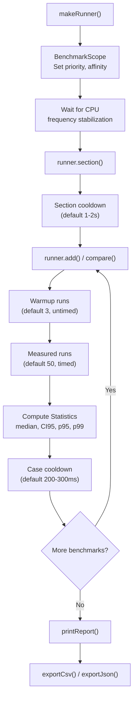

# User Manual - FatPBenchmarkRunner

*February 2026*

---

**Scope:** Complete usage guide for `fat_p::bench::BenchmarkRunner`, including the measurement pipeline, statistical analysis model, round-robin multi-library comparison, CPU frequency monitoring, environment variable configuration, output formatting, CSV/JSON export, and the `DoNotOptimize` / `BenchmarkScope` / `SpinBarrier` utilities.

**Not covered:** Google Benchmark, Catch2 benchmarks, or other third-party frameworks. Writing SIMD code (SimdDetection detects; this manual measures).

**Prerequisites:** C++20. Basic understanding of why benchmarking requires statistical rigor. Familiarity with compiling with optimization flags (`-O3`, `/O2`).

---

## User Manual Card

**Component:** FatPBenchmarkRunner
**Primary use case:** Measure and compare operation latency with statistical rigor
**Integration pattern:** `makeRunner("Name")` -> `runner.section()` -> `runner.add()` or `runner.compare()` -> `runner.run()` -> `runner.printReport()`
**Key API:** `BenchmarkRunner`, `BenchConfig`, `Statistics`, `IAdapter`, `DoNotOptimize()`, `BenchmarkScope`, `SpinBarrier`, `makeRunner()`, `makeTestRunner()`
**std equivalent:** None
**Common mistakes:** Benchmarking without `DoNotOptimize` (compiler eliminates measured code); running in Debug mode; not waiting for CPU stabilization; comparing libraries with different execution order (unfair cache effects)
**Performance notes:** Framework overhead is approximately 50 ns per measurement call; statistical analysis adds approximately 1 ms per benchmark

---

## Table of Contents

1. Why Microbenchmarking Is Hard
2. The Measurement Pipeline
3. Statistical Analysis: What the Numbers Mean
4. Getting Started: Single Benchmarks
5. Multi-Library Comparison: The Round-Robin Design
6. DoNotOptimize: Preventing Dead-Code Elimination
7. BenchmarkScope: Process Priority and Affinity
8. SpinBarrier: Concurrent Benchmark Synchronization
9. CPU Frequency Monitoring
10. BenchConfig: Environment Variable Configuration
11. Output Formatting and Export
12. Use Case: Benchmarking a Container Operation
13. Use Case: Comparing Fat-P vs std::unordered_map
14. Use Case: Scaling Benchmark (Varying N)
15. Use Case: Concurrent Benchmark
16. Best Practices
17. Advanced Usage
18. Troubleshooting
19. Known Limitations
20. API Reference
21. FAQ

---

## Why Microbenchmarking Is Hard

A naive benchmark looks like this:

```cpp
auto start = std::chrono::high_resolution_clock::now();
for (int i = 0; i < 1000000; ++i)
    container.insert(i);
auto end = std::chrono::high_resolution_clock::now();
auto ns = std::chrono::duration_cast<std::chrono::nanoseconds>(end - start).count();
std::cout << ns / 1000000.0 << " ns/op\n";
```

This produces wrong results for at least five reasons.

**Dead-code elimination.** If the compiler proves the loop has no observable side effects, it removes it entirely. The benchmark reports 0 ns/op for an operation that actually takes 50 ns.

**CPU frequency scaling.** Modern CPUs ramp frequency dynamically. The first few thousand iterations may run at 2.0 GHz while the CPU warms up; the rest at 4.5 GHz. The average mixes two different machines.

**Cache effects.** The first iteration loads data from DRAM (100 ns/access). Subsequent iterations hit L1 cache (1 ns/access). The average hides a 100x variance.

**OS scheduling.** If the OS preempts your process during timing, the measurement includes time spent running other processes. A single 10 ms context switch in a 1-second benchmark adds 1% error.

**Statistical naivety.** A single timing run is a single sample. Without multiple samples, you cannot compute confidence intervals, detect outliers, or distinguish signal from noise.

FatPBenchmarkRunner addresses each of these systematically.

---

## The Measurement Pipeline



Each step addresses a specific failure mode:

**BenchmarkScope** sets the process to high priority and pins it to a CPU core (Windows). This reduces OS scheduling interference.

**CPU stabilization** waits for the CPU frequency to reach a stable state. On cold boot, the CPU may be throttled; on a freshly loaded system, it may be boosted. The wait ensures measurements start from a consistent frequency.

**Warmup runs** prime the instruction cache, data cache, and branch predictor. They are not timed.

**Measured runs** are individually timed. Each run produces a single sample (nanoseconds per operation).

**Statistical analysis** computes median (robust to outliers), mean, standard deviation, 95% confidence interval, and p95/p99 percentiles from the sample set.

**Cooldown delays** between sections and benchmarks prevent thermal cross-contamination. A hot CPU from benchmark A may throttle benchmark B if B runs immediately after.

---

## Statistical Analysis: What the Numbers Mean

After measured runs, the runner computes:

**Median.** The middle value when samples are sorted. Unlike the mean, the median is not pulled by outliers (a single 10 ms context switch does not affect the median of 49 other sub-microsecond samples). This is the primary reported statistic.

**CI95 (95% confidence interval).** The range within which the true median falls with 95% confidence. Calculated via bootstrap resampling. A narrow CI95 means the measurement is precise; a wide CI95 means more runs are needed.

**p95, p99.** The 95th and 99th percentile. These characterize tail latency---the worst-case behavior that affects real systems.

**Mean and standard deviation.** Provided for completeness. The mean is useful when the distribution is symmetric; for skewed distributions (common in microbenchmarks), the median is more representative.

The output looks like:

```
  insert_1M          12.34 ns/op  [CI95: 12.12..12.56]  p95: 13.01  p99: 14.22
```

---

## Getting Started: Single Benchmarks

```cpp
#include "FatPBenchmarkRunner.h"

int main()
{
    using namespace fat_p::bench;

    auto runner = makeRunner("MyContainer");

    runner.section("CORE OPERATIONS")
          .contract("Insert is O(1) amortized");

    std::vector<int> vec;
    runner.add("push_back", [&]() {
        vec.push_back(42);
        DoNotOptimize(vec.data());
    });

    runner.add("reserve_then_push", [&]() {
        vec.reserve(vec.size() + 1);
        vec.push_back(42);
        DoNotOptimize(vec.data());
    });

    runner.run();
    runner.printReport();
    runner.exportIfConfigured();
}
```

`makeRunner()` handles BenchmarkScope, CPU stabilization, and header printing. `section()` creates a labeled group. `contract()` adds a semantic note to the output. `add()` registers a benchmark function. `run()` executes all benchmarks. `printReport()` prints statistics. `exportIfConfigured()` writes CSV/JSON if the corresponding environment variables are set.

---

## Multi-Library Comparison: The Round-Robin Design

Comparing two libraries requires fair measurement. If library A always runs first, it pays the cache-cold penalty while library B benefits from warm caches. The results are biased.

FatPBenchmarkRunner solves this with round-robin randomization. Within each measured run, all registered libraries execute once, in a randomly shuffled order. Over many runs, every library observes the same distribution of cache states, frequency states, and scheduling contexts.

### The IAdapter Interface

Each library implements `IAdapter`:

```cpp
struct FatPHashMapAdapter : fat_p::bench::IAdapter
{
    const char* name() const override { return "Fat-P FastHashMap"; }
    void setup(size_t N) override { map.reserve(N); }
    void teardown() override { map.clear(); }
    void clear() override { map.clear(); }

    fat_p::FastHashMap<int, int> map;
};

struct StdAdapter : fat_p::bench::IAdapter
{
    const char* name() const override { return "std::unordered_map"; }
    void setup(size_t N) override { map.reserve(N); }
    void teardown() override { map.clear(); }
    void clear() override { map.clear(); }

    std::unordered_map<int, int> map;
};
```

### Registering and Comparing

```cpp
auto runner = makeRunner("HashMap Comparison");

runner.addLibrary<FatPHashMapAdapter>();
runner.addLibrary<StdAdapter>();

runner.section("INSERT")
      .contract("Insert N random keys");

runner.compare("insert_10K", [](IAdapter* adapter, size_t N) {
    auto* map = dynamic_cast<FatPHashMapAdapter*>(adapter);
    if (map)
    {
        for (size_t i = 0; i < N; ++i)
            map->map.insert({static_cast<int>(i), static_cast<int>(i)});
    }
    // Similar for StdAdapter via dynamic_cast
}, 10000);

runner.run();
runner.printReport();
```

The output shows side-by-side comparison with speedup ratios:

```
  insert_10K
    Fat-P FastHashMap      45.23 ns/op  [CI95: 44.80..45.66]
    std::unordered_map     89.17 ns/op  [CI95: 88.42..89.92]
    Speedup: 1.97x
```

---

## DoNotOptimize: Preventing Dead-Code Elimination

`DoNotOptimize(value)` tells the compiler that `value` has an observable side effect, preventing it from eliminating the computation that produced it:

```cpp
// WITHOUT DoNotOptimize: compiler may eliminate the entire loop
for (int i = 0; i < N; ++i)
{
    auto result = container.find(i);  // Compiler sees: result unused, eliminate
}

// WITH DoNotOptimize: compiler must compute the result
for (int i = 0; i < N; ++i)
{
    auto result = container.find(i);
    DoNotOptimize(result);  // "I need this value"
}
```

Implementation: on GCC/Clang, `DoNotOptimize` uses an inline assembly statement that the compiler cannot analyze. On MSVC, it writes to a volatile global. The overhead is approximately 1 ns per call.

Also available: `preventOpt(int64_t)` for integer values, which writes to a volatile sink.

---

## BenchmarkScope: Process Priority and Affinity

On Windows, `BenchmarkScope` is a RAII object that sets the process to high priority and pins it to a non-zero CPU core:

```cpp
{
    fat_p::bench::BenchmarkScope scope(true /* verbose */);
    // Process is high priority, pinned to a core
    run_benchmarks();
}
// Destructor restores original priority and affinity
```

On non-Windows platforms, `BenchmarkScope` is a no-op. CPU affinity on Linux can be set externally with `taskset`.

`makeRunner()` creates a `BenchmarkScope` automatically unless `FATP_BENCH_NO_SCOPE` is set.

---

## SpinBarrier: Concurrent Benchmark Synchronization

`SpinBarrier` synchronizes threads at a rendezvous point, ensuring all threads start timed work simultaneously:

```cpp
fat_p::bench::SpinBarrier barrier(4);  // 4 threads

auto worker = [&](int id) {
    // Setup...
    barrier.wait();  // All threads start here
    // Timed work...
};
```

Uses atomic spin-wait with generation counting to prevent ABA issues across multiple `wait()` calls.

---

## CPU Frequency Monitoring

FatPBenchmarkRunner monitors CPU frequency to detect thermal throttling and frequency scaling:

**At startup:** `capture_cpu_frequency()` reads the base and current frequency via CPUID leaf 0x16 (Intel), registry (Windows), or `/proc/cpuinfo` (Linux). `print_cpu_detection_info()` reports this in the benchmark header.

**Between sections:** Optional frequency re-capture detects throttling. If the current frequency drops significantly below the base frequency, the benchmark output includes a warning.

**Per result:** Each `BenchResult` stores the `CpuFreqInfo` at the time of measurement, enabling post-hoc detection of results affected by throttling.

---

## BenchConfig: Environment Variable Configuration

All Fat-P benchmarks use the same environment variables:

| Variable | Default | Description |
|---|---|---|
| `FATP_BENCH_WARMUP_RUNS` | 3 | Warmup iterations (untimed) |
| `FATP_BENCH_BATCHES` | 50 (Linux), 15 (Windows) | Measured iterations |
| `FATP_BENCH_SEED` | 12345 | RNG seed for round-robin order |
| `FATP_BENCH_MIN_BATCH_MS` | 50 | Minimum batch duration |
| `FATP_BENCH_VERBOSE_STATS` | (unset) | Print extra statistics if set |
| `FATP_BENCH_OUTPUT_CSV` | (unset) | CSV output path |
| `FATP_BENCH_OUTPUT_JSON` | (unset) | JSON output path |
| `FATP_BENCH_NO_SCOPE` | (unset) | Disable priority/affinity |
| `FATP_BENCH_NO_STABILIZE` | (unset) | Skip CPU stabilization wait |
| `FATP_BENCH_NO_COOLDOWN` | (unset) | Skip cooldown delays |

```bash
# Run with CSV export and verbose stats
FATP_BENCH_OUTPUT_CSV=results.csv FATP_BENCH_VERBOSE_STATS=1 ./benchmark

# Quick run for CI (skip waits)
FATP_BENCH_NO_STABILIZE=1 FATP_BENCH_NO_COOLDOWN=1 ./benchmark
```

Configuration is loaded automatically by `BenchConfig::fromEnv()`, which `makeRunner()` calls.

---

## Output Formatting and Export

### Console Output

Compact format with aligned columns:

```
================================================================================
  CORE OPERATIONS
================================================================================

  Contract: Insert is O(1) amortized

  push_back           12.34 ns/op  [CI95: 12.12..12.56]  p95: 13.01
  reserve_then_push    8.91 ns/op  [CI95:  8.78.. 9.04]  p95:  9.22
```

### CSV Export

```csv
name,library,median_ns,mean_ns,stddev_ns,ci95_low,ci95_high,p95,p99,min,max,cpu_mhz
push_back,,12.34,12.45,0.89,12.12,12.56,13.01,14.22,11.98,15.67,4500.0
```

### JSON Export

Structured with metadata (config, CPU info, timestamp) and results array.

---

## Use Case: Benchmarking a Container Operation

```cpp
#include "FatPBenchmarkRunner.h"

int main()
{
    using namespace fat_p::bench;
    auto runner = makeRunner("CircularBuffer");

    fat_p::CircularBuffer<int> buf(1024);

    runner.section("PUSH/POP")
          .contract("push_back and pop_front are O(1)");

    runner.add("push_back", [&]() {
        buf.push_back(42);
        DoNotOptimize(buf.back());
    });

    runner.add("pop_front", [&]() {
        if (!buf.empty())
        {
            auto val = buf.front();
            buf.pop_front();
            DoNotOptimize(val);
        }
    });

    runner.run();
    runner.printReport();
    runner.exportIfConfigured();
}
```

Compile: `g++ -std=c++20 -O3 -DNDEBUG -march=native benchmark.cpp -o benchmark`

## Use Case: Comparing Fat-P vs std::unordered_map

See the Multi-Library Comparison section above for the full pattern. The key steps: implement `IAdapter` for each library, register with `addLibrary<>()`, and use `compare()` to define test cases. The runner handles fair round-robin execution.

## Use Case: Scaling Benchmark (Varying N)

```cpp
auto runner = makeRunner("SmallVector Scaling");

for (size_t N : {100, 1000, 10000, 100000})
{
    runner.section("N=" + std::to_string(N));

    runner.add("push_back_N", [&, N]() {
        fat_p::SmallVector<int, 16> vec;
        for (size_t i = 0; i < N; ++i)
            vec.push_back(static_cast<int>(i));
        DoNotOptimize(vec.data());
    });
}

runner.run();
runner.printReport();
```

Each size gets its own section with cooldown delays between them.

## Use Case: Concurrent Benchmark

```cpp
auto runner = makeRunner("LockFreeQueue Throughput");

runner.section("4-THREAD PRODUCER-CONSUMER");

runner.add("enqueue_dequeue", [&]() {
    fat_p::bench::SpinBarrier barrier(4);
    fat_p::LockFreeQueue<int> queue(1024);
    std::atomic<size_t> ops{0};

    auto producer = [&]() {
        barrier.wait();
        for (int i = 0; i < 10000; ++i)
        {
            queue.try_push(i);
            ops.fetch_add(1, std::memory_order_relaxed);
        }
    };

    auto consumer = [&]() {
        barrier.wait();
        int val;
        for (int i = 0; i < 10000; ++i)
        {
            queue.try_pop(val);
            DoNotOptimize(val);
        }
    };

    std::thread t1(producer), t2(producer), t3(consumer), t4(consumer);
    t1.join(); t2.join(); t3.join(); t4.join();
});

runner.run();
runner.printReport();
```

---

## Best Practices

### Always Compile with -O3 -DNDEBUG

Debug builds have assertions, bounds checks, and no inlining. They measure overhead, not performance. Always benchmark release builds.

### Always Use DoNotOptimize

If the benchmark result is not used, the compiler will eliminate the computation. Every benchmark body should call `DoNotOptimize` on the result or on a value derived from the result.

### Use makeRunner() for Production, makeTestRunner() for Tests

`makeRunner()` includes the full pipeline: BenchmarkScope, CPU stabilization (up to 30 seconds), cooldown delays. `makeTestRunner()` skips all of this for fast unit test execution.

### Report Median, Not Mean

The median is robust to outliers (context switches, page faults). The mean is pulled by a single extreme sample. Fat-P benchmarks use median as the primary statistic.

### Run Enough Batches for Tight CI95

If CI95 is wider than 5% of the median, increase `FATP_BENCH_BATCHES`. 50 batches is usually sufficient for sub-microsecond operations. For noisy operations (I/O, allocation), use 100-200.

### Use Sections for Logical Grouping

Sections provide cooldown delays between groups and produce readable output. Group related benchmarks: "INSERT", "LOOKUP", "DELETE", "SCALING".

---

## Advanced Usage

### addWithOps: Variable Operation Count

When the number of operations per batch varies:

```cpp
runner.addWithOps("variable_work", [&]() -> size_t {
    size_t ops = do_variable_amount_of_work();
    DoNotOptimize(ops);
    return ops;  // Runner divides total time by returned ops
});
```

### BenchConfig::forTesting()

For unit tests that verify benchmark infrastructure:

```cpp
auto runner = makeTestRunner("TestRunner");
runner.add("trivial", []() { volatile int x = 1; });
runner.run();
assert(runner.results().size() > 0);
```

### Fixed Delays via Command Line

Some CI environments cannot measure CPU frequency. Use `--fixed-delays` (parsed by `parse_fixed_delay_flag()`) to switch from frequency-based stabilization to fixed-duration delays.

### Custom Output

Access raw results for custom analysis:

```cpp
runner.run();
for (const auto& result : runner.results())
{
    std::cout << result.name << ": "
              << result.stats.median << " ns/op, "
              << "CI95=[" << result.stats.ci95Low << ".."
              << result.stats.ci95High << "]\n";
}
```

---

## Troubleshooting

### Benchmark reports 0 ns/op

The compiler eliminated the measured code. Add `DoNotOptimize()` to the benchmark body.

### Results vary wildly between runs

CPU frequency is unstable (thermal throttling, power management). Increase `FATP_BENCH_BATCHES`. Check that `BenchmarkScope` is active (not disabled by `FATP_BENCH_NO_SCOPE`). On Linux, set the CPU governor to `performance`: `sudo cpupower frequency-set -g performance`.

### CI95 is very wide

Not enough measured runs. Increase `FATP_BENCH_BATCHES` to 100 or 200. Or the operation under test has high variance (allocations, I/O) which is inherent.

### CPU stabilization takes 30 seconds

This is by design. The runner waits for the CPU to reach a stable frequency. Set `FATP_BENCH_NO_STABILIZE=1` to skip this in CI, but accept that results may be less consistent.

### Comparison shows identical performance for both libraries

Check that `DoNotOptimize` is applied to both libraries' results. Also verify that setup/teardown produce equivalent starting states.

### CSV output is empty

`FATP_BENCH_OUTPUT_CSV` must be set to a writable file path. Check permissions.

### "No benchmarks registered" warning

`run()` was called before any `add()` or `compare()` calls. Register benchmarks first.

---

## Known Limitations

**Windows-only BenchmarkScope.** Process priority and affinity setting is Windows-only. On Linux, use `taskset` and `nice` externally.

**No async I/O benchmarking.** The timer measures wall-clock time of synchronous operations. For async operations, you must manage the event loop yourself.

**No memory allocation tracking.** The runner measures time, not memory. Use Valgrind/Massif or custom allocators for memory profiling.

**No automatic regression detection.** The runner produces numbers; it does not compare against baselines. Regression detection requires external tooling on the exported CSV/JSON.

**Single-process only.** No support for distributed benchmarks or cross-machine comparison.

---

## API Reference

### BenchmarkRunner

| Method | Description |
|---|---|
| `BenchmarkRunner(name, config)` | Construct with name and config |
| `section(title)` | Start a section; returns `*this` for chaining |
| `contract(note)` | Add semantic contract note; returns `*this` |
| `add(name, func)` | Register single-library benchmark |
| `addWithOps(name, func)` | Register benchmark returning op count |
| `addLibrary<T>()` | Register library adapter for comparison |
| `compare(name, func, N)` | Register comparison benchmark |
| `run()` | Execute all benchmarks |
| `printHeader()` | Print runner header with CPU info |
| `printReport()` | Print all results |
| `exportCsv(path)` / `exportJson(path)` | Export results |
| `exportIfConfigured()` | Export if env vars set |
| `results()` | Access raw `BenchResult` vector |
| `comparisonResults()` | Access raw `ComparisonResult` vector |

### BenchConfig

| Method / Field | Description |
|---|---|
| `fromEnv()` | Load from `FATP_BENCH_*` environment variables |
| `forTesting()` | Minimal config for unit tests |
| `warmupRuns`, `measuredRuns` | Iteration counts |
| `seed` | RNG seed for round-robin order |
| `outputCsv`, `outputJson` | Export file paths |
| `noScope`, `noStabilize`, `noCooldown` | Feature toggles |

### Statistics

| Field | Description |
|---|---|
| `median` | Middle sample value |
| `mean`, `stddev` | Average and spread |
| `ci95Low`, `ci95High` | 95% confidence interval |
| `p95`, `p99` | Tail percentiles |
| `min`, `max` | Extreme values |
| `compute(samples)` | Static factory from raw samples |

### Utilities

| Function / Class | Description |
|---|---|
| `DoNotOptimize(value)` | Prevent dead-code elimination |
| `preventOpt(int64_t)` | Integer-specific optimization barrier |
| `BenchmarkScope` | RAII priority/affinity (Windows) |
| `SpinBarrier(count)` | Thread synchronization barrier |
| `makeRunner(name)` | Full production runner |
| `makeTestRunner(name)` | Lightweight test runner |

---

## FAQ

**Q: Can I use this for benchmarks outside Fat-P?**

Yes. FatPBenchmarkRunner depends only on PlatformDetection.h and standard library headers. Copy the header and its dependency to your project.

**Q: Why median instead of mean?**

Median is robust to outliers. A single context switch (10 ms) in 50 samples at 100 ns each would make the mean 200 us---200x the actual value. The median is unaffected.

**Q: How do I benchmark allocation-heavy code?**

Use `DoNotOptimize` on the allocated pointer. Consider pre-allocating in `setup()` and measuring only the operation of interest in the timed region.

**Q: Can I run benchmarks in CI?**

Yes. Set `FATP_BENCH_NO_STABILIZE=1` and `FATP_BENCH_NO_COOLDOWN=1` for faster execution. Export CSV for trend tracking. Accept that CI results have higher variance than dedicated benchmark machines.

**Q: What clock does the timer use?**

On Linux, `CLOCK_MONOTONIC_RAW` via a custom `MonotonicRawClock`. On other platforms, `std::chrono::steady_clock`. Both are monotonic (not affected by NTP adjustments).

---

*FatPBenchmarkRunner.h --- Fat-P Library*
