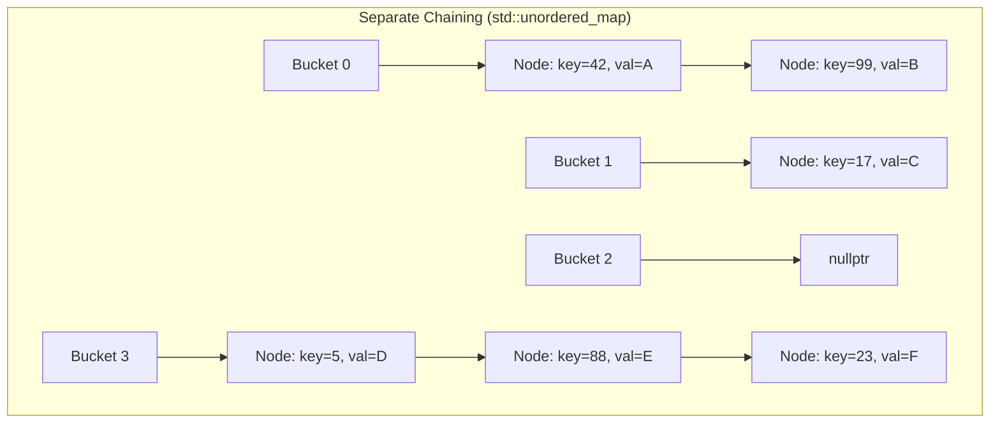
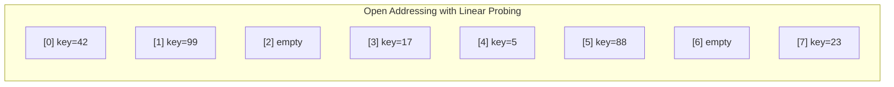
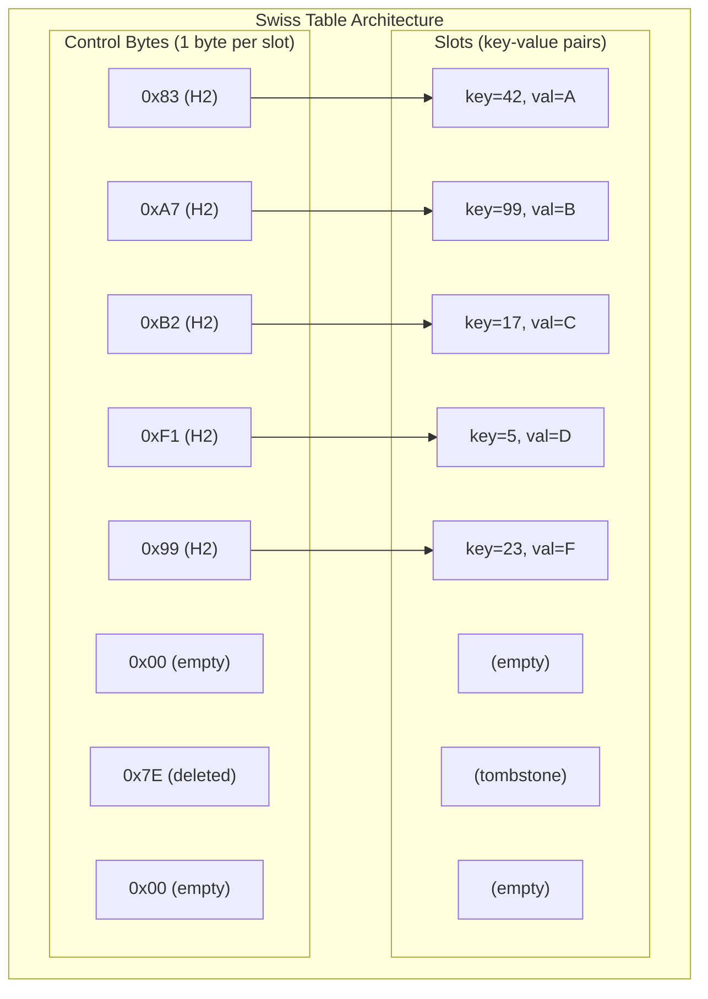

# FastHashMap User Manual

*Fat-P Library — December 2025*

---

## The Hash Table Story

### The Idea That Changed Computing

In 1953, Hans Peter Luhn at IBM filed an internal memorandum describing a technique for storing and retrieving records by their content rather than their position. Instead of searching sequentially through a list, you could compute a number from the record's key and jump directly to its location. He called this "hash coding."

The insight was profound: with the right function, you could transform the fundamental economics of search. Sequential search through n records takes O(n) time. Binary search through sorted records takes O(log n) time. Hash-based lookup takes O(1) time—constant, regardless of collection size. A hash table with a billion entries takes the same time to search as one with ten entries.

But Luhn's insight came with a catch. Two different keys might produce the same hash value—a "collision." The history of hash table design is largely the history of handling collisions elegantly.

### The Separate Chaining Era

The earliest practical hash tables used separate chaining: each bucket in the table points to a linked list of entries that hash to that bucket. When you insert, you compute the bucket and append to its list. When you search, you compute the bucket and walk its list.



Separate chaining is simple and robust. The load factor (entries divided by buckets) can exceed 1.0—you just get longer chains. Deletions are straightforward: unlink the node from its list. Iterators and pointers to elements remain valid across insertions.

This is exactly what `std::unordered_map` implements. The C++ standard mandates these stability guarantees, which in turn mandate separate chaining or something equivalent.

The cost is severe for performance-critical code:

- **Allocation overhead:** Each entry requires a separate heap allocation. Insert a million elements, call `malloc()` a million times.
- **Pointer chasing:** Finding an entry requires following pointers through the chain. Each pointer is a potential cache miss—a 100+ cycle stall while the CPU waits for memory.
- **Memory fragmentation:** Nodes are scattered across the heap. Even iterating through all entries jumps randomly through memory, defeating the CPU's prefetcher.

For decades, this was considered acceptable. Memory was slow anyway; a few extra indirections didn't matter much. But modern CPUs changed the calculus.

### The Memory Wall

In 1994, computer architects identified a troubling trend: CPU speeds were increasing at 60% per year, but memory speeds at only 7% per year. By 2020, a CPU could execute hundreds of instructions in the time it took to fetch a single cache line from main memory.

Modern CPUs hide this latency through caching. A typical 2024 processor has three cache levels:

| Cache | Size | Latency | Bandwidth |
|-------|------|---------|-----------|
| L1 | 32-48 KB | 4 cycles | 2+ TB/s |
| L2 | 1-2 MB | 12 cycles | 500+ GB/s |
| L3 | 32-96 MB | 40 cycles | 200+ GB/s |
| Main memory | 32+ GB | 200+ cycles | 50 GB/s |

The cache operates on 64-byte lines. When you read a single byte, the CPU fetches the entire 64-byte line containing it. If your next access is within that line, it's essentially free. If it's elsewhere in memory, you pay the full latency again.

Separate chaining is pathological for caches. Each node is a separate allocation, typically 24-48 bytes (key, value, next pointer, allocator overhead). A cache line might hold one or two nodes. Walking a chain of five nodes triggers five cache misses—1000+ cycles of staring at memory.

### The Open Addressing Revolution

Open addressing eliminates per-entry allocation by storing all entries directly in the bucket array. When a collision occurs, you probe for an alternative slot within the same array.

The simplest scheme is linear probing: if slot h(k) is occupied, try h(k)+1, then h(k)+2, and so on. This has a critical advantage—sequential memory access. The CPU's prefetcher detects the pattern and fetches upcoming cache lines before you need them.



But linear probing has its own pathology: clustering. Once a run of occupied slots forms, it tends to grow. New keys that hash anywhere into the run extend it further. Performance degrades as load factor increases.

Robin Hood hashing (1986) addressed clustering by stealing from the rich to give to the poor. Each entry tracks its "probe distance"—how far from its ideal slot it landed. When inserting, if you encounter an entry with a smaller probe distance than yours, you swap places and continue inserting the displaced entry. This bounds the variance in probe distances.

Cuckoo hashing (2001) used multiple hash functions, giving each key multiple possible homes. Insertions might displace existing entries, which get rehashed to their alternative locations. This provided worst-case O(1) lookup at the cost of complex insertion.

Each technique improved on the last. But the real breakthrough came from Google in 2017.

### The Swiss Table Insight

Google engineers Matt Kulukundis and Sam Benzaquen observed that modern CPUs have another underutilized capability: SIMD instructions. A single AVX2 instruction can compare 32 bytes simultaneously. What if you designed a hash table specifically to exploit this?

The Swiss Table design separates metadata from data. A "control byte" array stores one byte per slot, indicating whether the slot is empty, deleted, or occupied. Occupied slots store a 7-bit fingerprint derived from the hash. The actual keys and values live in a parallel slot array.



To search for a key:

1. Compute the full hash
2. Extract H1 (low bits) as the starting group position
3. Extract H2 (high 7 bits | 0x80) as the fingerprint
4. Load 16-32 control bytes into a SIMD register
5. Compare all of them against H2 in ONE instruction
6. For any matches, compare the actual key
7. If no matches and an empty slot exists, the key is absent

The SIMD comparison is the key innovation. On AVX2, `_mm256_cmpeq_epi8` compares 32 bytes in parallel, producing a bitmask of matches. Extracting the bitmask with `_mm256_movemask_epi8` gives a 32-bit integer where each bit indicates a potential match. The population count is typically 0 or 1—the H2 fingerprint filters out 99% of false positives.

This is what FastHashMap implements.

---

## Understanding the Memory Layout

### Why Flat Storage Wins

Consider what happens when you iterate through a `std::unordered_map` with a million entries:

```cpp
for (const auto& [key, value] : std_map) {
    sum += value;
}
```

Each iteration dereferences a pointer to reach the next node. Those nodes are scattered across the heap—wherever `malloc()` happened to put them. The CPU's prefetcher can't predict where you're going next. Every node access is a potential cache miss.

Now consider iterating through a Swiss Table:

```cpp
for (const auto& [key, value] : fast_map) {
    sum += value;
}
```

The slots are contiguous in memory. The CPU prefetches the next cache lines automatically. A million entries might span 50,000 cache lines, but they're accessed sequentially—the prefetcher stays ahead of you.

The numbers are dramatic. On a 2024 Intel Core Ultra 9:

| Operation | std::unordered_map | FastHashMap | Improvement |
|-----------|-------------------|-------------|-------------|
| Iteration | 8.5 ns/element | 2.1 ns/element | 4x |

That 4x comes entirely from memory access patterns. The computational work is identical.

### The Control Byte Encoding

Each control byte encodes slot state in a single byte:

| Byte Value | Meaning | Binary Pattern |
|------------|---------|----------------|
| 0x00 | Empty | 00000000 |
| 0x7E | Deleted (tombstone) | 01111110 |
| 0x7F | Sentinel | 01111111 |
| 0x80-0xFF | Occupied (H2 fingerprint) | 1xxxxxxx |

The high bit distinguishes occupied slots from metadata. This allows a simple test: if `(ctrl & 0x80) != 0`, the slot is occupied.

The H2 fingerprint uses the remaining 7 bits. With 128 possible values, the probability of two random keys having the same H2 is 1/128 ≈ 0.78%. This means ~99% of slots can be eliminated without comparing actual keys.

### Group Alignment

Swiss Tables organize slots into "groups" of 16 or 32, matching the SIMD register width. The control bytes for each group are contiguous and aligned for efficient SIMD loading:

```
Group 0: control[0..31]   → slots[0..31]
Group 1: control[32..63]  → slots[32..63]
Group 2: control[64..95]  → slots[64..95]
...
```

The alignment ensures that loading a group's control bytes touches exactly one cache line. Since cache lines are 64 bytes and AVX2 groups are 32 bytes, two groups fit per cache line.

---

## Getting Started

### Prerequisites

FastHashMap requires:

- C++20 compiler (GCC 12+, Clang 14+, MSVC 2022+)
- `FatPSimdDetection.h` header (included in Fat-P distribution)

No external dependencies. No build system integration. Just include and use.

### Your First FastHashMap

```cpp
#include "FastHashMap.h"
#include <string>
#include <iostream>

int main() {
    fat_p::FastHashMap<std::string, int> scores;
    
    // Insert using operator[]
    scores["Alice"] = 100;
    scores["Bob"] = 85;
    scores["Carol"] = 92;
    
    // Lookup returns pointer (nullptr if not found)
    if (int* score = scores.find("Bob")) {
        std::cout << "Bob's score: " << *score << "\n";
    }
    
    // Check existence without accessing value
    if (!scores.contains("Dave")) {
        std::cout << "Dave not found\n";
    }
    
    // Erase by key
    scores.erase("Alice");
    
    // Structured bindings in iteration
    for (auto [key, value] : scores) {
        std::cout << key << ": " << value << "\n";
    }
    
    return 0;
}
```

Notice that `find()` returns a pointer, not an iterator. This is deliberate—FastHashMap doesn't guarantee iterator stability anyway, and pointers are simpler to use. A null pointer means "not found."

### Configuration Aliases

FastHashMap provides type aliases for common configurations:

- `FastHashMap<K, V>` — Default: tombstone deletion, heap allocation
- `FastHashMapTS<K, V>` — Explicit tombstone deletion
- `FastHashMapBS<K, V>` — Backward-shift deletion (no tombstones)
- `FixedHashMap<K, V, N>` — Fixed N-byte buffer, no heap allocation

---

## The Deletion Problem

### Why You Can't Just Mark Slots Empty

Open-addressing hash tables have a fundamental problem with deletion. Consider this sequence:

```
Table size: 8 slots
Hash function: h(k) = k mod 8

Insert key=3: h(3)=3, slot 3 empty → store at slot 3
Insert key=11: h(11)=3, slot 3 occupied → probe → slot 4 empty → store at slot 4
Insert key=19: h(19)=3, slots 3,4 occupied → probe → slot 5 empty → store at slot 5
```

The three keys form a "probe chain" starting at slot 3. Now delete key=3 and mark slot 3 as empty:

```
Search for key=11: h(11)=3, slot 3 empty → conclude key=11 not found
```

But key=11 is at slot 4! The search terminated early because it saw an empty slot. The probe chain is broken.

This is why naive deletion breaks open-addressing tables. You need a way to indicate "this slot is empty but you should keep probing."

### Tombstone Deletion: The Classic Solution

The traditional solution is tombstones: a special marker meaning "deleted, keep probing." When you erase, you write the tombstone marker (0x7E in FastHashMap). Searches probe through tombstones but stop at truly empty slots.

```
After erasing key=3 with tombstone:
Slot 3: TOMBSTONE
Slot 4: key=11
Slot 5: key=19

Search for key=11: h(11)=3, slot 3 is tombstone → probe → slot 4 matches → found!
```

FastHashMap uses tombstone deletion by default. Erasing is O(1)—write one byte.

The tradeoff: tombstones accumulate. After many insert/erase cycles, the table fills with tombstones that slow down searches. FastHashMap monitors the tombstone count and triggers a rehash (which clears all tombstones) when the ratio gets too high.

### Backward-Shift Deletion: The Alternative

Backward-shift deletion eliminates tombstones entirely. When you erase an element, you shift subsequent elements backward to fill the gap:

```
Before erasing key=3:
Slot 3: key=3
Slot 4: key=11
Slot 5: key=19

After erasing key=3 with backward-shift:
Slot 3: key=11 (shifted from slot 4)
Slot 4: key=19 (shifted from slot 5)
Slot 5: empty
```

No tombstones means no tombstone accumulation. Probe chains stay short indefinitely.

The tradeoff: erase is O(n) in the worst case. A long probe chain requires shifting many elements. In practice, with a reasonable load factor, chains are short and shifts are cheap.

Choose backward-shift deletion for long-lived maps with rare erasure—configuration tables, lookup caches, symbol tables. Choose tombstone deletion for high-churn scenarios where elements come and go frequently.

```cpp
fat_p::FastHashMap<int, Data> churn_map;     // Tombstone (default)
fat_p::FastHashMapBS<int, Data> stable_map;  // Backward-shift
```

---

## The Allocator Choice

### Heap Allocation: The Default

By default, FastHashMap allocates its internal arrays from the heap using aligned allocation:

- POSIX: `posix_memalign()` for SIMD-friendly alignment
- Windows: `_aligned_malloc()`

The map is fully movable and swappable. You can return it from functions, store it in containers, transfer ownership freely.

### Fixed-Buffer Allocation: Zero Heap

For embedded systems, real-time applications, or hot paths where heap allocation is unacceptable, FastHashMap provides stack-allocated storage:

```cpp
// 8KB buffer embedded in the map object itself
fat_p::FixedHashMap<int, Vec3, 8192> particle_lookup;
```

No `malloc()` ever occurs. The control bytes and slots live in a buffer inside the map object. If you exceed capacity, `std::bad_alloc` is thrown.

**Critical constraint:** Fixed-buffer maps are non-movable. The internal pointers point into the buffer, which is part of the object. Moving the object would leave those pointers dangling.

```cpp
fat_p::FixedHashMap<int, int, 1024> a;
// auto b = std::move(a);  // COMPILE ERROR: deleted move constructor
// std::swap(a, b);        // COMPILE ERROR: deleted swap
```

This is not a bug—it's inherent to the design. If you need move semantics, use heap allocation.

---

## The Hash Function Problem

### std::hash Is Often Terrible

The C++ standard imposes minimal requirements on `std::hash`. It must produce the same output for equal inputs within a single program execution. That's it. There's no requirement for good distribution, avalanche properties, or quality of any kind.

On MSVC, `std::hash<int>` is the identity function:

```cpp
std::hash<int> h;
assert(h(1) == 1);
assert(h(2) == 2);
assert(h(1000000) == 1000000);
```

This is catastrophic for hash tables. Sequential keys map to sequential slots. You get one long probe chain instead of uniform distribution. Your O(1) hash table becomes O(n).

GCC and Clang do better, but not universally. `std::hash<std::string>` varies wildly across implementations and versions.

### The Built-In Mixer

FastHashMap applies a "finalizer" or "mixer" to all hash values by default. This is a secondary hash function designed to spread bits uniformly:

- 64-bit platforms: SplitMix64 (the finalizer from java.util.SplittableRandom)
- 32-bit platforms: MurmurHash3 finalizer

The mixer transforms any input distribution—even the identity function—into a near-uniform output distribution:

```
Input:  1, 2, 3, 4, 5
After mixing: 0xE220A8397B1DCDAF, 0x6E789E6AA1B965F4, 0x06C45D188009454F, ...
```

The cost is a few nanoseconds per operation. This is almost always worthwhile—the cost of one long probe chain exceeds thousands of mixer applications.

### Opting Out for High-Quality Hashes

If your hash function already has good avalanche properties, the mixer is redundant. wyhash, xxHash, and `absl::Hash` are examples of high-quality hash functions where double-mixing wastes cycles.

Define `is_avalanching` to tell FastHashMap your hash is already good:

```cpp
struct WyHasher {
    using is_avalanching = void;  // Skip the built-in mixer
    
    size_t operator()(uint64_t key) const noexcept {
        return wyhash64(key, 0);
    }
};

fat_p::FastHashMap<uint64_t, Data, WyHasher> map;
```

---

## Heterogeneous Lookup

### The Allocation You Didn't Notice

Consider a string-keyed map:

```cpp
std::unordered_map<std::string, int> config;
config["max_connections"] = 100;

// Later, looking up with a literal:
auto it = config.find("max_connections");
```

The `find()` call constructs a temporary `std::string` from the literal. That's a heap allocation. If the key doesn't exist, you allocated memory just to find out "not found."

In a tight loop looking up many keys, these temporary allocations dominate runtime.

### Transparent Functors

C++14 introduced transparent comparators for ordered containers. C++20 extended this to unordered containers. FastHashMap supports heterogeneous lookup through the same mechanism:

```cpp
struct TransparentHash {
    using is_transparent = void;  // Enable heterogeneous lookup
    
    size_t operator()(std::string_view s) const noexcept {
        return std::hash<std::string_view>{}(s);
    }
};

struct TransparentEqual {
    using is_transparent = void;
    
    bool operator()(std::string_view a, std::string_view b) const noexcept {
        return a == b;
    }
};

fat_p::FastHashMap<std::string, int, TransparentHash, TransparentEqual> config;

config["max_connections"] = 100;

// Lookup with string_view - NO allocation
std::string_view key = "max_connections";
int* value = config.find(key);

// Lookup with literal - NO allocation
int* value2 = config.find("max_connections");
```

The `is_transparent` tag enables overloads of `find()`, `count()`, and `contains()` that accept any type convertible to `std::string_view`. No temporary `std::string` is constructed.

---

## Freeze Mode

### The Read-Only Table Pattern

Many hash tables follow a pattern: populated during initialization, queried during execution, never modified. Configuration tables, localization strings, precomputed lookup tables, compiled shaders—built once, read forever.

For these tables, mutation is a bug. Accidentally writing `config[key] = value` instead of `config.at(key)` corrupts your read-only data.

### Enabling Freeze Mode

Call `freeze()` after populating the map:

```cpp
fat_p::FastHashMap<int, Config> config;

for (const auto& entry : load_config_file()) {
    config[entry.id] = entry.config;
}

config.freeze();  // No mutations allowed after this
```

Any mutation attempt—`insert()`, `emplace()`, `erase()`, `operator[]`, `clear()`—triggers an assertion in debug builds:

```cpp
config[99] = new_value;  // Debug: assertion failure
                         // Release: undefined behavior
```

Freeze mode is one-way. You cannot unfreeze a map. If you need to modify it, create a new map.

### What Freeze Mode Is Not

Freeze mode provides no thread synchronization. It's a debug-time check for accidental mutation, not a concurrency primitive.

However, a frozen map can be safely accessed from multiple threads without synchronization, because reads don't modify the data structure. This is true of any immutable data—no locks needed when no one is writing.

---

## The Insert Method Zoo

### Why Four Methods Exist

When you insert a key that already exists, what should happen?

Different use cases want different answers:

- **Configuration loading:** "Update the setting to its latest value." You want to overwrite.
- **Caching:** "Use the cached result if available." You don't want to overwrite—the existing value is correct.
- **Deduplication:** "Add if new, skip if duplicate." You don't want to overwrite, and you don't want to construct a value you won't use.
- **Lazy initialization:** "Compute the value only if the key is new." You want to defer construction.

FastHashMap provides four insert methods to address these patterns. Understanding when to use each prevents subtle bugs.

### insert(): Add If Missing

```cpp
Value* insert(const Key& key, const Value& value);
Value* insert(Key&& key, Value&& value);
```

`insert()` adds the key-value pair only if the key doesn't already exist. If the key exists, the call does nothing and returns `nullptr`.

```cpp
map.insert(1, "first");
Value* result = map.insert(1, "second");  // Returns nullptr
// map[1] is still "first"
```

This matches `std::unordered_map::insert()` semantics. Use it for deduplication or when you want to preserve the first value seen.

### insert_or_assign(): Upsert

```cpp
std::pair<Value*, bool> insert_or_assign(const Key& key, const Value& value);
std::pair<Value*, bool> insert_or_assign(Key&& key, Value&& value);
```

`insert_or_assign()` always stores the value, overwriting any existing value. It returns a pair: pointer to the value, and a boolean indicating whether insertion (true) or assignment (false) occurred.

```cpp
auto [ptr, was_new] = map.insert_or_assign(1, "first");
// *ptr == "first", was_new == true

auto [ptr2, was_new2] = map.insert_or_assign(1, "second");
// *ptr2 == "second", was_new2 == false
```

Use this for "upsert" patterns where you always want the latest value.

### emplace(): Construct In-Place With Overwrite

```cpp
template<typename... Args>
Value* emplace(const Key& key, Args&&... args);
```

`emplace()` constructs the value in-place from the provided arguments. If the key exists, **it overwrites the existing value**.

**Warning:** This differs from `std::unordered_map::emplace()`, which does NOT overwrite. This is the most common migration pitfall.

```cpp
map.emplace(1, "first");
map.emplace(1, "second");  // OVERWRITES!
// map[1] == "second"
```

Use `emplace()` when you want `insert_or_assign()` semantics but need in-place construction (e.g., for non-copyable types).

### try_emplace(): Construct If Missing

```cpp
template<typename... Args>
std::pair<Value*, bool> try_emplace(const Key& key, Args&&... args);
```

`try_emplace()` constructs the value in-place only if the key doesn't exist. If the key exists, the arguments are never evaluated.

```cpp
// expensive_computation() called only if key is new
auto [ptr, inserted] = map.try_emplace(1, expensive_computation());
```

Use this for lazy initialization or when value construction is expensive and you want to skip it for duplicates.

### Decision Table

| Scenario | Method | Overwrites? | Evaluates args if exists? |
|----------|--------|-------------|---------------------------|
| Keep first value | `insert()` | No | Yes |
| Always update | `insert_or_assign()` | Yes | Yes |
| Update with in-place construction | `emplace()` | Yes | Yes |
| Lazy initialization | `try_emplace()` | No | No |

---

## SIMD Backend Selection

### Compile-Time Detection

FastHashMap selects the SIMD backend at compile time based on compiler flags and target architecture:

| Backend | Slots per Group | Enabled By |
|---------|-----------------|------------|
| AVX2 | 32 | `-mavx2` (GCC/Clang), `/arch:AVX2` (MSVC) |
| SSE2 | 16 | Default on x86-64 |
| NEON | 16 | Default on ARM64 |
| Portable | 16 | Fallback when no SIMD available |

The portable fallback uses standard C++ and achieves the same algorithmic behavior, just without hardware acceleration.

### Checking Your Backend

```cpp
#include "FastHashMap.h"
#include <iostream>

int main() {
    std::cout << "SIMD backend: " << fat_p::FastHashMap<int,int>::simd_backend() << "\n";
    std::cout << "Group width: " << fat_p::FastHashMap<int,int>::group_width() << "\n";
}
```

### Forcing a Specific Backend

You generally don't need to force a backend—the compile-time detection handles it. But for testing or compatibility, you can disable detection:

```cpp
#define FATP_FORCE_PORTABLE 1  // Disable all SIMD
#include "FastHashMap.h"
```

---

## When to Use FastHashMap

### Ideal Use Cases

**Insert-heavy workloads.** Per-entry allocation in `std::unordered_map` creates heap contention. FastHashMap amortizes allocation across the entire table.

**Erase-heavy workloads.** O(1) tombstone marking beats heap deallocation plus linked-list surgery.

**Temporary, per-frame data structures.** Built, used, and destroyed in tight loops. Minimizing allocation overhead directly improves throughput.

**Fixed-buffer requirements.** Embedded systems, real-time constraints, or hot paths where heap latency is unacceptable.

**SIMD-capable platforms.** x86-64, ARM64, or any architecture with SSE2/NEON. FastHashMap exploits parallel comparison.

### When to Use Something Else

**You need pointer stability.** Storing `Value* ptr = map.find(key)` and expecting it to survive insertions? FastHashMap may rehash at any time, relocating all values. Use `StableHashMap` (node-based, pointer-stable) instead.

**You need iterator stability.** `std::unordered_map` guarantees iterators survive insertions (unless rehash occurs). FastHashMap makes no such guarantee.

**Miss detection dominates.** If most queries return "not found," `boost::unordered_flat_map` is faster due to different group layout optimizations that examine fewer candidates per miss.

**Maximum possible speed with no other constraints.** `absl::flat_hash_map` has more aggressive optimizations from years of Google-scale production tuning. If you can accept the Abseil dependency, it's faster.

**Values have expensive move semantics.** Rehashing moves every element. If `Value` is expensive to move, those costs accumulate.

---

## Migration from std::unordered_map

### Drop-In Operations

Most operations translate directly:

```cpp
map[key] = value;     // Insert or overwrite
map.size();           // Element count
map.empty();          // Whether size == 0
map.clear();          // Remove all elements
map.erase(key);       // Remove by key
map.count(key);       // Returns 0 or 1
map.contains(key);    // Returns bool
```

### Critical Differences

**find() returns a pointer, not an iterator:**

```cpp
// std::unordered_map
auto it = std_map.find(key);
if (it != std_map.end()) {
    use(it->second);
}

// FastHashMap
Value* ptr = fast_map.find(key);
if (ptr) {
    use(*ptr);
}
```

**emplace() OVERWRITES existing values:**

```cpp
// std::unordered_map: emplace ignores duplicates
std_map.emplace(1, "first");
std_map.emplace(1, "second");  // IGNORED
// std_map[1] == "first"

// FastHashMap: emplace OVERWRITES
fast_map.emplace(1, "first");
fast_map.emplace(1, "second");  // OVERWRITES!
// fast_map[1] == "second"
```

Use `try_emplace()` for `std::unordered_map::emplace()` semantics.

**Pointers to values may become dangling:**

```cpp
// std::unordered_map: pointers remain valid
int* ptr = &std_map[1];
std_map[2] = value;
*ptr = 42;  // Valid

// FastHashMap: pointers may dangle after mutation
int* ptr = fast_map.find(1);
fast_map[2] = value;  // May rehash
*ptr = 42;  // UNDEFINED BEHAVIOR
```

---

## Troubleshooting

### Compilation Errors

**"FastHashMap requires DefaultConstructible Key and Value"**

Your key or value type lacks a default constructor. FastHashMap requires default construction for internal slot management. Add a default constructor or use a different container.

**"FixedHashMap is not movable"**

You tried to move or swap a fixed-buffer map. The internal pointers point into the embedded buffer; moving the object would dangle them. Use `HeapAllocator` if you need move semantics.

### Runtime Errors

**Assertion: "mutation attempted on frozen map"**

You called a modifying method (`insert()`, `erase()`, `operator[]`, etc.) on a frozen map. Frozen maps are read-only. Create a new map if you need to modify.

**std::bad_alloc from FixedHashMap**

The fixed buffer is exhausted. Increase the buffer size template parameter or switch to heap allocation.

### Performance Issues

**Operations slow after many erases (tombstone policy)**

Tombstones are accumulating. Call `rehash(size())` to clear them, or switch to backward-shift deletion if your workload is erase-heavy.

**Unexpectedly long probe chains**

Your hash function may have poor distribution. Verify the built-in mixer is active (no `is_avalanching` tag). If using a custom hash, test its distribution.

---

---

## Use Case: Symbol Table for a Compiler

Fast string-to-ID mapping with heterogeneous lookup (avoid allocating `std::string` for lookups):

```cpp
fat_p::FastHashMap<std::string, uint32_t,
    fat_p::TransparentHash, fat_p::TransparentEqual> symbols;

uint32_t next_id = 0;
symbols.insert("main", next_id++);
symbols.insert("printf", next_id++);

// Lookup with string_view — no allocation
std::string_view token = "main";
auto* id = symbols.find(token);  // Heterogeneous lookup
```

## Use Case: Read-Heavy Cache with Freeze Mode

A configuration cache that is loaded once and then read millions of times:

```cpp
fat_p::FastHashMap<std::string, std::string> config;
config.insert("db.host", "localhost");
config.insert("db.port", "5432");
config.freeze();  // Enable read-only optimizations

// Millions of concurrent reads — no tombstone overhead, optimal probe sequences
auto* host = config.find("db.host");
```

## Use Case: Fixed-Buffer Allocation for Embedded

A hash map with zero heap allocation after construction:

```cpp
fat_p::FastHashMap<int, float, std::hash<int>, std::equal_to<int>,
    fat_p::FixedBufferAllocator<256>> sensor_map;

sensor_map.insert(SENSOR_TEMP, 22.5f);
sensor_map.insert(SENSOR_HUMIDITY, 65.0f);
// All storage within the fixed 256-slot buffer — no malloc
```

## Best Practices

**Use heterogeneous lookup for string keys.** `TransparentHash` + `TransparentEqual` allows `find(string_view)` without allocating a `std::string`. This is critical for parsers and compilers.

**Freeze read-only maps.** After loading, call `freeze()` to eliminate tombstone checks during probing and enable internal optimizations.

**Reserve capacity upfront.** Rehashing is expensive. If you know the approximate size, `reserve(n)` avoids intermediate rehashes.

**Prefer try_emplace over operator[].** `operator[]` default-constructs the value if missing, then overwrites. `try_emplace` constructs only if missing.

## Expanded Troubleshooting

### Performance degrades after many insert/erase cycles

Tombstones accumulate with the default TombstoneDeletion policy. Call `rehash(capacity())` to eliminate tombstones, or use BackwardShiftDeletion which avoids tombstones entirely.

### Hash collisions causing slow lookups

`std::hash<int>` on small sequential integers often produces poor distribution. FastHashMap's built-in mixer handles this, but if you opt out via `is_avalanching`, ensure your hash function has good avalanche properties.

---

## API Reference

### Construction

`FastHashMap()` creates an empty map.

`FastHashMap(size_t n)` creates a map with capacity for n elements.

`FastHashMap(size_t n, float max_load_factor)` creates a map with specified capacity and load factor threshold (default 0.875).

### Element Access

`Value* find(const Key& key)` — Returns pointer to value, or nullptr if not found.

`Value& at(const Key& key)` — Returns reference, throws `std::out_of_range` if not found.

`Value& operator[](const Key& key)` — Returns reference, inserting default value if not found.

`bool contains(const Key& key)` — Returns whether key exists.

`size_t count(const Key& key)` — Returns 0 or 1.

### Modifiers

`Value* insert(Key, Value)` — Inserts if key missing, returns pointer or nullptr.

`pair<Value*, bool> insert_or_assign(Key, Value)` — Upserts, returns pointer and insertion flag.

`Value* emplace(Key, Args...)` — Constructs in place, overwrites if exists.

`pair<Value*, bool> try_emplace(Key, Args...)` — Constructs if missing.

`bool erase(const Key&)` — Removes element, returns whether found.

`void clear()` — Removes all elements.

### Capacity

`bool empty()` — Returns whether size is zero.

`size_t size()` — Returns element count.

`size_t capacity()` — Returns slot count.

`float load_factor()` — Returns size / capacity.

`void reserve(size_t n)` — Ensures capacity for n elements.

`void rehash(size_t n)` — Sets capacity, clears tombstones.

### Freeze Mode

`FastHashMap& freeze()` — Enables read-only mode.

`bool is_frozen()` — Returns freeze state.

### Diagnostics

`static const char* simd_backend()` — Returns "AVX2", "SSE2", "NEON", or "Portable".

`static size_t group_width()` — Returns 16 or 32.

`static const char* deletion_policy_name()` — Returns "Tombstone" or "BackwardShift".

`static const char* allocator_name()` — Returns "Heap" or "Fixed".

---

## Further Reading

The ideas behind FastHashMap draw from decades of research:

- Luhn, H.P. "A Business Intelligence System" (1958) — The original hash coding concept
- Knuth, D.E. "The Art of Computer Programming, Vol. 3" — Definitive treatment of hashing
- Celis, P. et al. "Robin Hood Hashing" (1986) — Variance-reducing open addressing
- Pagh, R. & Rodler, F.F. "Cuckoo Hashing" (2001) — Worst-case O(1) lookup
- Kulukundis, M. "Designing a Fast, Efficient, Cache-friendly Hash Table" (CppCon 2017) — Swiss Table presentation
- Abseil documentation: https://abseil.io/docs/cpp/guides/container — Production Swiss Table implementation

---

*FastHashMap.h — Fat-P Library*
