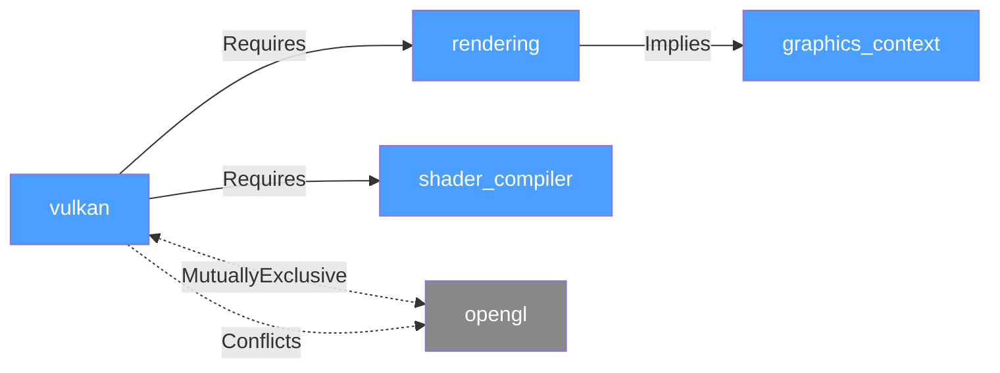
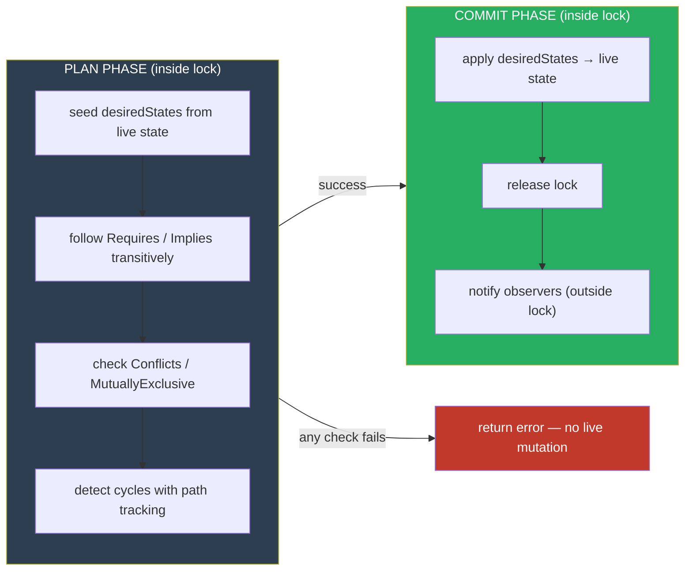

# Overview - FeatureManager

## Scope

This document orients a new reader: what FeatureManager is, what problem it solves, how its architecture works, and how it compares to alternatives. It also documents the key design decisions that shaped the `replace()` and `forceExclusive()` API.

## Not covered

- Step-by-step API usage and recipes (see User Manual - FeatureManager)
- Callback factory system internals
- Thread-safety implementation details
- JSON serialization format

## Prerequisites

- Familiarity with feature flags / feature toggles
- Basic understanding of directed graphs and topological sort
- C++20 familiarity (templates, `[[nodiscard]]`, `Expected`-style return types)

---

## Overview Card

**Component:** FeatureManager
**Problem solved:** Feature flags with dependency relationships require automated resolution, conflict detection, and cycle prevention that boolean maps cannot provide
**When to use:** Complex feature graphs with Requires/Implies/Conflicts relationships; systems where enabling one feature must atomically bring up its prerequisites; embedded, game, or plugin systems needing validated configuration without external services
**When NOT to use:** Simple boolean toggles with no relationships; remote/server-managed feature flags (LaunchDarkly, Unleash); very large feature sets (1000+) that warrant a graph database
**Key guarantee:** No feature can reach an enabled state without its full dependency closure satisfied; no conflicting pair can be simultaneously enabled; cycles are detected with full path reporting before any state change
**std equivalent:** None. No standard equivalent exists or is planned.
**Boost equivalent:** None. No Boost equivalent exists.
**Other alternatives:** gflags (static CLI flags, no relationships), LaunchDarkly / Unleash (server-based, no local validation), hand-rolled adjacency maps (no transactional semantics)
**Read next:** User Manual - FeatureManager

---

## Executive Summary

FeatureManager is a dependency-resolving feature flag system that models **Requires**, **Implies**, **Conflicts**, and **MutuallyExclusive** relationships between features, automatically resolving dependency closures and detecting invalid configurations at planning time. Unlike boolean flag maps that require callers to manage prerequisites manually, it uses a plan/commit model: the full state transition is computed and validated before any live mutation occurs, so either the entire operation succeeds atomically or nothing changes. This architectural choice — transactional planning over eager mutation — is what enables `replace()` and `forceExclusive()` to solve atomic MutuallyExclusive transitions that no sequence of individual enable/disable calls can express correctly.

---

## The Problem Domain

### What Goes Wrong Without It

The naive approach to feature management is a `std::map<std::string, bool>`. It works for isolated toggles. It breaks as soon as features have prerequisites. The following shows what manual dependency management looks like in a graphics system — and specifically, what gets missed:

```cpp
// THE TRAP: Manual dependency tracking
std::map<std::string, bool> features;

void enableRendering() {
    features["rendering"] = true;
    features["graphics_context"] = true;
    features["window_system"] = true;
    // Forgot shader_compiler → runtime crash at first draw call
}

void enableVulkan() {
    features["vulkan"] = true;
    features["rendering"] = true;   // Duplicated from enableRendering()
    features["graphics_context"] = true;
    // What if vulkan conflicts with opengl?
    // No automatic detection — invalid state is silently reachable.
}

// Caller enables both vulkan and opengl.
// System enters inconsistent state. No error. No diagnostic.
```

The failure mode is silent: the system reaches a state where two conflicting features are both marked enabled, or a required dependency was never set. The code compiles, runs, and produces wrong results — sometimes immediately, sometimes only under specific conditions.

| Issue | Impact |
|-------|--------|
| Manual dependency tracking | Prerequisites are duplicated across every enable function; one omission causes a runtime failure with no clear cause |
| No conflict detection | Invalid configurations are silently reachable; errors surface as incorrect behavior rather than constraint violations |
| No implication propagation | Enabling A requires N separate calls, all of which must be correct and consistently ordered |
| No cycle detection | Circular prerequisites cause stack overflow or infinite loops with no path information |
| No transactional semantics | Partial failures leave the system in an undefined intermediate state that is difficult to detect and reason about |

### The Standard's Limitation

C++ provides no feature flag facility. `std::map<string, bool>` offers storage but no relationship semantics. The gap is not narrowing: feature management is too application-specific for standardization, and the dependency resolution, validation callback, and observer semantics that operational systems need are permanently out of scope for the standard library.

---

## Architecture: Dependency Graph with Plan/Commit Resolution

### The Four Relationship Types

FeatureManager models feature interdependencies using four directed relationship types. The graph below shows a typical graphics configuration — note that **Requires** and **Implies** define the enable closure (what must come up), while **Conflicts** and **MutuallyExclusive** define the constraint surface (what must stay down):



**Requires** means the target must be enabled before the source can reach an enabled state. Enabling `vulkan` automatically triggers the full Requires closure: `rendering` and `shader_compiler` are planned first, and `rendering`'s Implies edge brings up `graphics_context` as well. **Implies** is semantically weaker than Requires — it expresses that enabling the source makes the target sensible to enable, not strictly necessary. **Conflicts** means the two features cannot be simultaneously enabled; the plan phase rejects any transition that would put both in the enabled state. **MutuallyExclusive** declares a group where at most one member may be enabled at a time.

The key enumeration:

```cpp
enum class FeatureRelationship {
    Requires,          // Enabling A plans B first (transitive closure)
    Implies,           // Enabling A also enables B
    Conflicts,         // A and B cannot be simultaneously enabled
    MutuallyExclusive  // Only one member of the declared group may be enabled
};
```

The SyncPolicy template parameter selects the concurrency model at compile time. `SingleThreadedPolicy` adds zero overhead. `MutexSynchronizationPolicy` and `SharedMutexPolicy` serialize plan/commit under a lock. All policies present the same public API:

```cpp
template <typename SyncPolicy = fat_p::SingleThreadedPolicy>
class FeatureManager { /* ... */ };
```

### The Plan/Commit Model

Every state-changing operation — `enable()`, `disable()`, `batchEnable()`, `batchDisable()`, `replace()`, `forceExclusive()` — follows a two-phase protocol. This model is the architectural core of FeatureManager; understanding it is the key to understanding the entire API.



The plan phase constructs a `TransactionPlan` seeded from live state into a `desiredStates` map, then applies recursive logic against `desiredStates` — not live state — to compute the full set of features that must change. If any check fails (conflict, cycle, missing dependency), the plan returns an error and live state is untouched. The commit phase runs only if the plan succeeds, applying every change atomically.

Because constraint evaluation runs against `desiredStates` rather than live state, the plan phase can represent a future state that does not yet exist. `replace()` exploits this directly.

### Design Rationale: Atomic Substitution (`replace` and `forceExclusive`)

The plan/commit model exposes a capability gap. If feature `A` is enabled and `A` is MutuallyExclusive with `B`, calling `enable("B")` fails — `A` is `true` in `desiredStates` at check time. The operation "disable `A` and enable `B` atomically, where `A` and `B` are mutually exclusive" is not expressible with sequential calls, for two reasons. First, two sequential calls are not atomic: an observer fires between `disable(A)` and `enable(B)`, and any thread polling `isEnabled()` between those calls sees neither feature active. Second, the Preempts workaround previously used in fatp-drone encodes a permanent graph structure, not a one-time runtime intent, and combining Preempts with MutuallyExclusive on the same pair is explicitly rejected by the contradiction guard.

Three implementation paths were evaluated before `replace()` and `forceExclusive()` were added.

**Option A — new plan-seeding overload on `batchEnable()`:** Add a parameter that pre-marks certain features as disabled before constraint evaluation. Rejected because it adds subtle semantics to a general method and conflates two distinct intent patterns (substitution vs. e-stop) into one call signature.

**Option B — modify `planEnableRecursive` to accept an explicit disable set:** Pass an optional set of features to treat as pre-disabled during constraint evaluation. Rejected for the same reason as Option A, and because `planEnableRecursive` is already the most complex private method in the class. Every caller would need to reason about the optional parameter.

**Option C — two focused public methods that manipulate `desiredStates` before delegating to existing private infrastructure (chosen):** `replace` and `forceExclusive` each construct a `TransactionPlan`, set up `desiredStates` to reflect their intent, and then delegate to the existing `planEnableRecursive` → `validateDesiredState` → `buildTransactionChanges` → observer notification path. No private methods change. No new `FeatureRelationship` values. The existing model was already correct for this use case — the missing piece was a public entry point that prepared `desiredStates` before the constraint check ran.

---

## Feature Inventory

### 1. Feature Definition and Registration

Before any relationship can be declared, features must be registered by name. The optional `check` parameter attaches a validation callback — a predicate that runs at enable time and can refuse activation based on runtime conditions such as hardware availability:

```cpp
FeatureManager<> fm;

fm.addFeature("rendering");
fm.addFeature("vulkan");
fm.addFeature("opengl");
fm.addFeature("shader_compiler");
fm.addFeature("graphics_context");

// With a validation callback (checks hardware at enable time)
fm.addFeature("vulkan", []() -> Expected<void, std::string> {
    if (!vulkan_driver_present())
        return unexpected("Vulkan driver not found");
    return {};
});
```

### 2. Relationship Declaration

Relationships define the structure of the dependency graph. All four types — Requires, Implies, Conflicts, MutuallyExclusive — are declared through the same `addRelationship` call or, for group membership, through `addMutuallyExclusiveGroup`:

```cpp
// vulkan needs rendering and shader_compiler enabled first
fm.addRelationship("vulkan", FeatureRelationship::Requires, "rendering");
fm.addRelationship("vulkan", FeatureRelationship::Requires, "shader_compiler");

// enabling rendering automatically brings up graphics_context
fm.addRelationship("rendering", FeatureRelationship::Implies, "graphics_context");

// these two cannot be simultaneously enabled
fm.addRelationship("vulkan", FeatureRelationship::Conflicts, "opengl");

// only one of these three may be active at a time
fm.addMutuallyExclusiveGroup({"vulkan", "opengl", "software"});
```

### 3. Validated Enable / Disable

`enable()` returns `Expected<void, std::string>`. The error string describes exactly what failed — which conflict was detected, which feature was missing, or the full path of any cycle. No state changes if the plan phase fails:

```cpp
auto result = fm.enable("vulkan");
if (!result) {
    log("Enable failed: ", result.error());
    // e.g. "Conflict: vulkan conflicts with opengl (currently enabled)"
    //      "Cycle detected: vulkan → rendering → vulkan"
    //      "Feature 'shader_compiler' not found"
}

// On success, the full enable closure is guaranteed:
//   rendering         → enabled (Requires)
//   shader_compiler   → enabled (Requires)
//   graphics_context  → enabled (Implies from rendering)
//   opengl            → blocked (Conflicts with vulkan)
```

### 4. Cycle Detection

Cycle detection runs during the plan phase, before any live state changes. When a Requires or Implies edge would close a loop, the plan records the full traversal path and returns it as the error string:

```cpp
fm.addRelationship("A", FeatureRelationship::Requires, "B");
fm.addRelationship("B", FeatureRelationship::Requires, "C");
fm.addRelationship("C", FeatureRelationship::Requires, "A");  // closes the loop

auto result = fm.enable("A");
// result.error() == "Cycle detected: A → B → C → A"
// Live state is unchanged.
```

### 5. Atomic Substitution: `replace()` and `forceExclusive()`

The problem of swapping one MutuallyExclusive feature for another without an intermediate inconsistent state is exactly what `replace()` solves. It marks `from`'s full reverse-dependency closure as disabled in the plan before resolving `to`, producing a single plan/commit operation with one observer notification:

```cpp
fm.enable("normal_mode");
// enabled: normal_mode, motor_mix, esc (Requires chain)

auto res = fm.replace("normal_mode", "safe_mode");
// After replace(): safe_mode and its Requires chain are up.
//   normal_mode, motor_mix, esc are down.
//   One atomic plan/commit. One observer notification.
```

`forceExclusive(feature)` is the e-stop primitive for situations where the current state is unknown. It zeros every entry in `desiredStates` before planning `feature`, so no Conflicts or MutuallyExclusive check can find a conflicting enabled feature:

```cpp
// Emergency: disable everything, activate safe_mode unconditionally.
fm.forceExclusive("safe_mode");
// All features disabled. safe_mode and its Requires chain enabled.
// Caller does not need to know what was previously active.
```

### 6. Validation

`validate()` runs a full consistency check on the current state — every enabled feature's prerequisite closure is satisfied, no conflict pair has both members enabled, no MutuallyExclusive group has multiple members active. It returns `Expected<void, std::string>` with the first violation found:

```cpp
auto valid = fm.validate();
if (!valid) {
    log("Validation failed: ", valid.error());
}
```

### 7. Observer Pattern

Observers receive notifications after every committed state change. The single-feature observer receives each change individually; the batch observer receives the full change set from a single operation, plus the name of the feature that was directly requested. Registration returns an `ObserverId` for later removal:

```cpp
ObserverId id = fm.addObserver([](const std::string& feature,
                                   bool enabled,
                                   bool success) {
    log("Feature ", feature, " → ", enabled ? "enabled" : "disabled");
});

fm.removeObserver(id);
```

### 8. Thread-Safety Policies

SyncPolicy selects the concurrency model at compile time. `SingleThreadedPolicy` adds zero overhead and is the correct choice for game main loops and single-threaded initialization. `MutexSynchronizationPolicy` serializes all plan/commit operations under an exclusive lock. `SharedMutexPolicy` allows concurrent reads and serializes only writes:

```cpp
FeatureManager<fat_p::SingleThreadedPolicy>      fm1; // zero overhead (default)
FeatureManager<fat_p::MutexSynchronizationPolicy> fm2; // exclusive lock on all operations
FeatureManager<fat_p::SharedMutexPolicy>          fm3; // shared reads, exclusive writes
```

### 9. Serialization

The full feature graph — features, relationships, group membership — serializes to and from JSON. Validation callbacks registered through the factory system serialize by key and restore automatically on load:

```cpp
// Export
auto jsonResult = fm.toJson();
if (jsonResult) { save_to_disk(*jsonResult); }

// Import (static factory method)
auto fmResult = FeatureManager<>::fromJson(config_json);
if (!fmResult) { log("Parse error: ", fmResult.error()); }
```

---

## Why Not Alternatives?

| If You Need… | Why Not `std::map<string,bool>` | Why Not a Hand-Rolled Graph | Why Not LaunchDarkly / Unleash | Fat-P Advantage |
|---|---|---|---|---|
| Automatic dependency resolution | ❌ No relationship semantics | Possible but each callsite must be manually correct | ❌ No local dependency model | ✅ Transitive Requires/Implies closure on every enable |
| Conflict detection before mutation | ❌ No | Requires manual constraint checks at each callsite | ❌ No | ✅ Plan phase rejects conflicts before any live change |
| Cycle detection with path reporting | ❌ N/A | Easy to omit; stack-overflow failure mode | ❌ N/A | ✅ Insertion-ordered path tracking during traversal |
| Atomic MutuallyExclusive transitions | ❌ No | Requires careful two-phase logic duplicated everywhere | ❌ No | ✅ `replace()` and `forceExclusive()` via plan/commit |
| Zero external services | ✅ | ✅ | ❌ Requires server, network, HTTP library | ✅ Single header, no dependencies |
| Serializable validation callbacks | ❌ N/A | ❌ Custom implementation required | ❌ N/A | ✅ Factory key system; callbacks restored on load |

**The sweet spot:** FeatureManager is the only option combining transactional dependency resolution, cycle detection, atomic substitution, and serializable validation logic without external infrastructure. For systems that need only simple boolean toggles with no relationships, `std::map<string, bool>` remains the correct tool.

---

## The "Forever Stuck" Reality

C++ will never standardize dependency-aware feature management. The domain is too application-specific, dependency semantics have no consensus, and configuration management is considered external to the language.

FeatureManager addresses this permanently. It is not a shim waiting for a language feature — there is no equivalent standard feature planned. For embedded systems, game engines, and plugin architectures, the dependency resolution and validation semantics belong at the library level.

---

## Performance Characteristics

| Operation | Complexity | Mechanism |
|-----------|-----------|-----------|
| `addFeature` | O(1) average | Hash map insertion |
| `addRelationship` | O(log r) | FlatSet insertion per feature node |
| `enable` (no deps) | O(1) average | Hash lookup + plan/commit |
| `enable` (with deps) | O(d × log n) | d = dependency depth; FlatSet traversal per node |
| `replace(from, to)` | O((d_from + d_to) × log n) | d_from = reverse-dep closure; d_to = enable closure |
| `forceExclusive(f)` | O(n + d × log n) | n = features to zero; d = enable closure depth of f |
| `validate` | O(n × d × log n) | Full graph traversal |
| Memory per feature | Platform/compiler-dependent | See `results/` for measurements |

### Where Fat-P Wins

Game engines where features have hardware prerequisites. Plugin systems where compatibility constraints must be enforced at load time. Safety-critical systems where `replace()` / `forceExclusive()` semantics are required for correct state machine transitions.

### Where Fat-P Loses

Simple boolean flag maps with no relationships — `std::map<string, bool>` has lower overhead and simpler code. Runtime flag changes pushed from a server — LaunchDarkly, Unleash, and similar platforms provide distribution, rollout percentages, and A/B assignment that FeatureManager does not address. Very large feature sets (1000+) where a graph database is more appropriate.

---

## Integration Points

```
FeatureManager.h
    ↓ uses
Expected.h              — Error propagation (plan phase returns Expected)
ConcurrencyPolicies.h   — SyncPolicy template parameter
JsonLite.h              — toJson() / fromJson() serialization
EnumPlus.h              — FeatureRelationship, FeatureGroupState enums
FlatSet.h               — Relationship storage per feature node
Factory.h               — Serializable validation callback registration
ValueGuard.h            — Scoped state rollback on plan failure
Stringify.h             — Error message construction
```

---

## Final Assessment

FeatureManager delivers on the Fat-P promise through three pillars:

1. **Permanence:** C++ will not standardize dependency-aware feature management. This is the solution, not a stopgap.
2. **Specialization:** Topological dependency resolution, insertion-ordered cycle path reporting, and transactional plan/commit semantics are built for systems where an invalid configuration is a real failure mode — not an inconvenience.
3. **Control:** Four relationship types model real-world feature graphs. Policy-based thread safety selects overhead at compile time. `replace()` and `forceExclusive()` expose the plan/commit model's full power without adding complexity to simpler call paths.

FeatureManager transforms feature flags from isolated booleans into a dependency-aware, validated, observable configuration layer. Enable one feature; get its entire dependency tree — with conflict detection, cycle prevention, and atomic transition semantics.

---

*FeatureManager.h — Fat-P Library*
