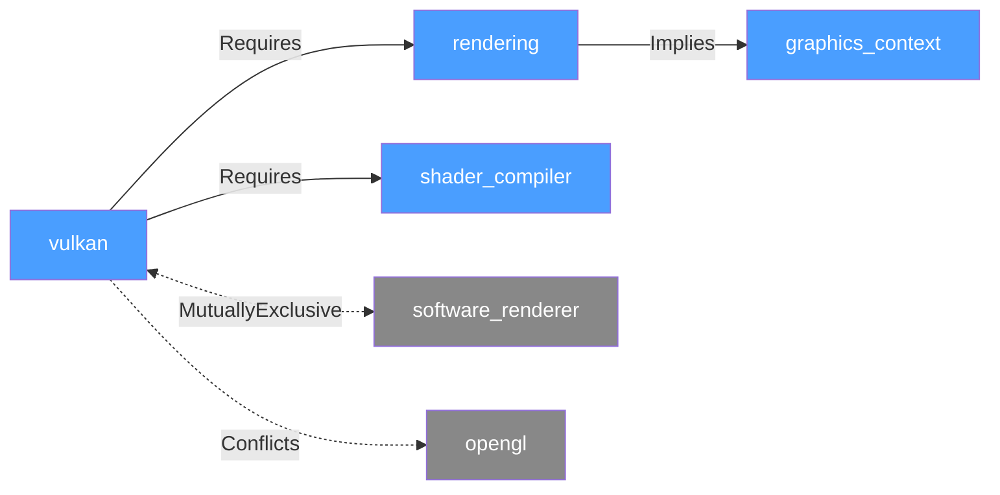
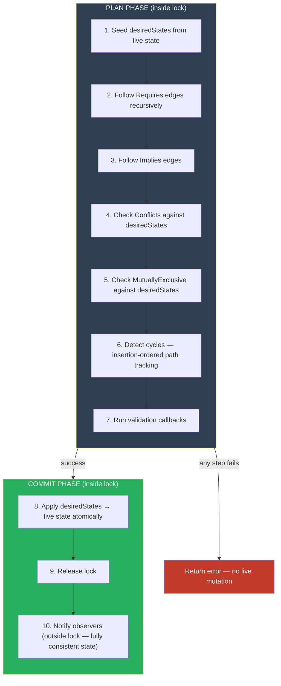
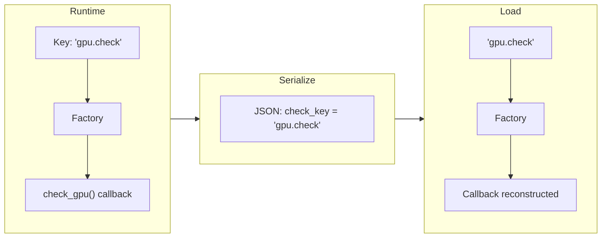
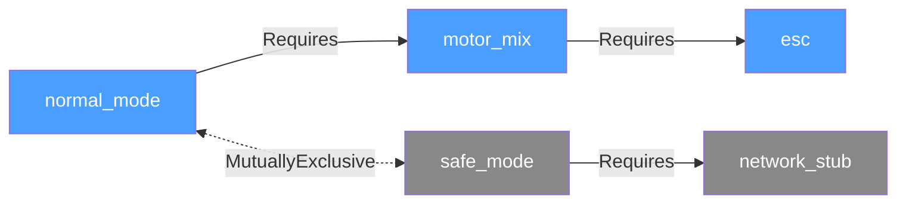
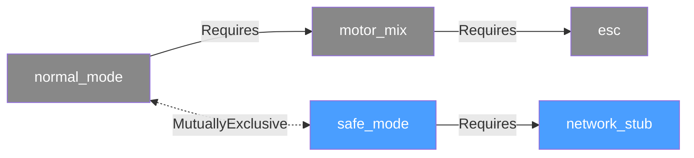

# User Manual - FeatureManager

**Scope:** Complete usage guide for `fat_p::FeatureManager`: feature registration, dependency and relationship management (requires, conflicts, implies), automatic resolution, callback factory system, observer notifications, JSON configuration, thread safety, and diagnostic APIs.

**Not covered:**
- A/B testing frameworks
- Feature flag distribution systems (LaunchDarkly, etc.)
- Remote configuration management
- Gradual rollout strategies

**Prerequisites:** C++20; understanding of feature flags and their use in software development; familiarity with dependency graphs

---

## User Manual Card

**Component:** FeatureManager
**Primary use case:** Manage feature flags with complex interdependencies, automatic conflict detection, and observer-based notification of state changes
**Integration pattern:** Create `FeatureManager`, register features with dependencies via `addFeature()`, enable/disable features (auto-resolution handles dependencies), observe changes via callbacks
**Key API:** `FeatureManager`, `.addFeature()`, `.addRelationship()`, `.enable()`, `.disable()`, `.isEnabled()`, `.addObserver()`, `.addBatchObserver()`, `.replace()`, `.forceExclusive()`, `fromJson()`, `toJson()`
**std equivalent:** None. No standard equivalent exists or is planned.
**Migration from std:** None. No standard equivalent exists.
**Common mistakes:** Creating dependency cycles (detected at plan time, returns error); enabling features without checking the `Expected` return value; calling `replace()` when `from` is not currently enabled; modifying features from observer callbacks (reentrancy)
**Performance notes:** Feature lookup is O(1) hash map access. Dependency resolution is O(d × log n) where d = dependency depth. See `components/FeatureManager/results/` for current data.

---
## Table of Contents

1. [Introduction](#introduction)
2. [The Problem Domain](#the-problem-domain)
3. [Why FeatureManager?](#why-featuremanager)
4. [Core Concepts](#core-concepts)
5. [Architecture Overview](#architecture-overview)
6. [Quick Start](#quick-start)
7. [Callback Factory System](#callback-factory-system)
8. [Detailed Examples](#detailed-examples)
9. [Thread Safety](#thread-safety)
10. [Performance Characteristics](#performance-characteristics)
11. [Best Practices](#best-practices)
12. [Troubleshooting](#troubleshooting)
13. [Comparison with Other Libraries](#comparison-with-other-libraries)
14. [API Reference](#api-reference)

---

## Introduction

### The Configuration Problem

Every non-trivial software system eventually faces the same question: which features are active right now, and what does activating one feature require of the others?

At small scale the answer is a `std::map<string, bool>`. Someone enables `"vulkan"`, and somewhere in initialization code, another developer remembers to also enable `"rendering"`, `"shader_compiler"`, and `"graphics_context"` — because Vulkan needs them. The code works. Then another developer adds a new code path, forgets one of those prerequisites, and a crash surfaces in production two weeks later with no clear cause.

The map knows what is enabled. It has no idea what enabling something *means*.

At medium scale the problem compounds. Features conflict: `"low_memory_mode"` and `"high_quality_textures"` cannot both be active. Features imply: enabling `"developer_mode"` should automatically bring up `"verbose_logging"`, `"debug_symbols"`, and `"stack_trace_capture"`. Features form exclusive groups: exactly one renderer — Vulkan, OpenGL, or software — may be active at a time. And now there is a new problem: how do you swap one exclusive feature for another without the system passing through a state where neither is active?

FeatureManager is the answer to all of these questions. It models feature dependencies as a directed graph with six relationship types — Requires, Implies, Conflicts, MutuallyExclusive, Preempts, Entails — and resolves every state change through a plan/commit protocol that either succeeds completely or changes nothing. The caller does not manage prerequisites manually. The caller does not check for conflicts manually. The system does it, and when something is wrong, it says exactly what went wrong and where.

**C++ Standard:** C++20
**Dependencies:** Expected.h, ConcurrencyPolicies.h, JsonLite.h, ValueGuard.h, Stringify.h, EnumPlus.h, FlatSet.h, Factory.h

## The Problem Domain

### Feature Flag Complexity in Real-World Systems

Feature flags (also called feature toggles) are an established technique for controlling functionality in software systems. As systems grow, the flags themselves acquire relationships to each other, and managing those relationships manually is where the problems begin.

#### Problem 1: Interdependencies

A feature often cannot function without others. `"RayTracing"` requires `"Graphics_High"`, which in turn requires `"GPU_Acceleration"`. When enable order is managed manually, any callsite that forgets a step puts the system in an invalid state — one that may not surface as an obvious crash, but as subtly wrong behavior under specific conditions.

#### Problem 2: Conflicts

Some features are mutually incompatible. `"LowMemoryMode"` and `"HighQualityTextures"` cannot both be active; `"BatteryOptimization"` and `"MaxPerformance"` contradict each other. Without automated detection, the constraint must be encoded in every callsite that could enable either feature — a maintenance burden that grows with the number of conflicting pairs.

#### Problem 3: Cascading Changes

Enabling `"DeveloperMode"` should automatically enable `"VerboseLogging"`, `"DebugSymbols"`, `"StackTraceCapture"`, and `"PerformanceCounters"`. Without automatic propagation, the system can reach inconsistent states where some of those diagnostic features are on and others are off — a partial debug mode that is harder to reason about than either fully on or fully off.

#### Problem 4: Circular Dependencies

```
Feature A requires Feature B
Feature B requires Feature C
Feature C requires Feature A  ← CYCLE
```

Circular prerequisites have no valid resolution order. Naive implementations that follow dependency edges without cycle detection produce stack overflows or infinite loops at initialization time. The diagnostic — if any — is a crash, not a description of the cycle.

#### Problem 5: Transactional Semantics

When enabling a batch of features, some may fail. Without transactional semantics, partial success leaves the system in an intermediate state: some features enabled, others not. That state may be inconsistent, and recovering from it requires manually inspecting and correcting each feature's status.

#### Problem 6: Serialization of Validation Logic

Validation callbacks — functions that check hardware availability, license state, or configuration preconditions at enable time — cannot be serialized as function pointers or lambdas. Saving the feature graph to JSON preserves registered features and relationships, but loses validation logic. On reload, features become enabled without their preconditions being checked.

---

## Why FeatureManager?

FeatureManager solves these problems with a principled, graph-based architecture:

### 1. **Automatic Dependency Resolution**
When you enable a feature, FeatureManager automatically:
- Enables all required dependencies (transitive closure)
- Enables all implied features
- Checks for conflicts before making changes
- Validates the resulting state atomically

**How:** Uses recursive graph traversal with visited-set tracking (O(d × log n) where d = dependency depth, capped at 100).

### 2. **Cycle Detection with Clear Diagnostics**
Instead of stack overflow or infinite loops, you get:
```
"Circular dependency detected: Graphics_High -> RayTracing -> DX12_Support -> Graphics_High"
```

**How:** Maintains insertion-ordered path tracking during traversal. When a node is revisited, the exact cycle path is preserved for debugging.

### 3. **Transactional Batch Operations**
```cpp
manager.batchEnable({"A", "B", "C"});
// Either ALL succeed (including implicit dependencies)
// Or ALL are rolled back (no partial state)
```

**How:** Uses ValueGuard for scoped state changes. Records all modifications, commits only on success, or rolls back completely on any failure.

### 4. **Type-Safe Group States**
Define custom enums for domain-specific states:
```cpp
enum class RenderingState { Software, Basic, Enhanced, Ultra };
manager.addGroup<RenderingState>("Rendering", features, custom_computer);
```

**How:** Template-based state computation with user-provided functors. Groups track which features are enabled and compute composite states in O(n) where n = group size.

### 5. **Observer Pattern with RAII Lifecycle Management**
- Priority-ordered callbacks for deterministic notification order
- ID-based removal for reliable unregistration
- RAII helpers (`ScopedObserver`, `ScopedBatchObserver`) for automatic cleanup
- Batch observers receive all changed features in one callback

**How:** Observers stored with unique IDs. Notifications include all features that changed (including implicit dependencies). Scoped wrappers automatically unregister on destruction.

### 6. **Full Callback Serialization**
```cpp
// Register callback with key
factory.registerType("gpu.check", []() { return check_gpu(); });

// Use in feature
manager.addFeature("GPUFeature", "gpu.check");

// Serialize - callback key is saved
std::string json = manager.toJson();

// Deserialize - callback automatically restored!
auto restored = FeatureManager<>::fromJson(json);
```

**How:** FeatureCheckFactory singleton maps string keys to callback creator functions. Serialization stores keys, deserialization reconstructs callbacks via factory lookup. See [Callback Factory System](#callback-factory-system) for details.

### 7. **Performance Optimizations**
- O(1) average feature lookup using FastHashMap with string keys
- Cache-friendly iteration with FlatSet for relationships
- Lock-free fast paths where possible (configurable concurrency policies)
- Optimized rollback (only modified features, not full snapshots)

---

## Core Concepts

### Features

A **feature** is a named capability that can be enabled or disabled. Each feature can have:
- An enabled/disabled state (bool)
- A validation callback (FeatureCheck, optional)
- A callback key for serialization (string, optional)
- Relationships with other features (stored in adjacency lists)
- Membership in groups (for composite state tracking)

### Relationships

Six types of relationships connect features:

1. **Requires** - A requires B: Enabling A automatically enables B first. Directional.
2. **Implies** - A implies B: Enabling A automatically enables B afterward. Directional.
3. **Conflicts** - A conflicts with B: Both cannot be enabled simultaneously. Bidirectional (automatically adds reverse edge).
4. **MutuallyExclusive** - Group-level: Only one feature in the set can be enabled. Bidirectional among all members.
5. **Preempts** - A preempts B: Enabling A forcibly disables B and B's reverse-dependency closure in the same transaction, and B stays inhibited (enable attempts fail with a diagnostic naming A) while A remains enabled. Directional.
6. **Entails** - A entails B: Enabling A enables B (like Implies); disabling A cascade-disables B *only if* no other currently desired-enabled feature also Entails B — ref-counted shared ownership. Directional.

**Implementation Note:** Relationships are stored per feature node as an array of `FlatSet<std::string>` indexed by relationship type (cache-friendly sorted vectors).

#### Preempts and Entails Semantics

The first four types are static constraints; Preempts and Entails are *state-change cascades*, and their edges carry declaration-time coherence guards:

- **Contradiction guard.** Preempts cannot coexist with Requires, Implies, or Entails on the same directed edge — enabling the source cannot demand the target both ON and OFF. Adding either direction of such a pair fails with a diagnostic.
- **Preempts cycle guard.** A Preempts cycle (A preempts B preempts … preempts A) is rejected when the closing edge is added.
- **Latched inhibit.** While a preempting feature is desired-enabled, `enable()` of any preempted target fails: `"Cannot enable 'B': preempted by enabled feature 'A'"`. The inhibit releases when the preemptor is disabled.
- **Ref-counted release.** Entails ownership is evaluated against *desired* state inside the transaction: disabling the last entailing owner takes the target down in the same atomic plan; disabling one of several owners leaves it up.

```cpp
// Authoritative shutdown: safe mode force-disables the drive chain and
// holds it down until safe mode is exited.
fm.addRelationship("safe_mode", FeatureRelationship::Preempts, "high_power");

// Shared ownership: telemetry stays up while ANY entailing mode is up,
// and goes down with the last one. No cleanup code at the call sites.
fm.addRelationship("scan_mode", FeatureRelationship::Entails, "telemetry");
fm.addRelationship("log_mode",  FeatureRelationship::Entails, "telemetry");
```

### Groups

Features can be organized into **groups** with custom state computation. Groups track which features are enabled and compute an overall state using a user-provided functor.

**Example:** A "GraphicsQuality" group might compute a state enum (Low/Medium/High/Ultra) based on which graphics features are active.

### Validation Callbacks

**FeatureCheck** callbacks run when enabling features to validate preconditions:

```cpp
using FeatureCheck = std::function<Expected<void, std::string>()>;
```

Returns `Expected<void, string>` - success (empty Expected) or error message.

### Callback Factory

The **FeatureCheckFactory** is a global singleton that maps string keys to callback creator functions. This enables serialization of validation logic by storing/retrieving keys instead of function pointers. See dedicated section below.

---

## Architecture Overview

FeatureManager models features as nodes in a directed graph. The node stores state (enabled/disabled), an optional validation callback, and the serialization key for that callback. The edges are relationship records of six types. All state transitions operate on this graph through a two-phase plan/commit protocol.

### Graph Structure

The dependency graph makes the enable/disable semantics visual. Consider a graphics system with a Vulkan and a software renderer in a MutuallyExclusive group:



Internally, each node is stored as a `FeatureNode` in a hash map keyed by name:

```cpp
// Internal node structure (simplified)
struct FeatureNode {
    bool enabled;
    FeatureCheck check;                                       // validation callback
    std::string check_key;                                    // serialization key
    FlatSet<std::string> relationships[num_relationship_types]; // edges per type
};
// Stored in: std::unordered_map<std::string, FeatureNode>
```

### The Plan/Commit Protocol

Every state-changing method — `enable()`, `disable()`, `batchEnable()`, `batchDisable()`, `replace()`, `forceExclusive()` — executes the same two-phase protocol. This is the most important concept in FeatureManager: understanding it makes every other behavior predictable.



The critical design decision is that constraint checking (steps 4–6) runs against `desiredStates` — not live state. This means the plan phase can reason about a future state that doesn't yet exist. `replace(from, to)` exploits this by marking `from` as disabled in `desiredStates` before running step 5, so the MutuallyExclusive check sees the correct end-state and the substitution succeeds atomically.

### Transactional Batch Operations

`batchEnable()` and `batchDisable()` extend the plan/commit protocol to multiple features: the plan phase resolves the full closure for all requested features before any live mutation occurs. On success, all changes commit together. On failure, `desiredStates` is discarded and live state is unchanged — there is no partial commit.

The rollback mechanism uses `ValueGuard` to track only modified features rather than snapshotting the entire graph, giving O(log m) rollback cost where m = the number of changed features.

### Thread Safety Model

The SyncPolicy template parameter selects the lock strategy at compile time. `SingleThreadedPolicy` compiles to zero overhead — no atomics, no lock operations. `MutexSynchronizationPolicy` acquires an exclusive lock for the full plan/commit phase. `SharedMutexPolicy` acquires a shared lock for read-only queries (`isEnabled`, `validate`) and an exclusive lock for writes.

Observers are called outside the lock, after the commit phase completes. The state they observe is fully consistent. Observers must not call back into FeatureManager — the lock is not held during notification, but re-entrant enable/disable from an observer creates a logical ordering problem that no lock strategy resolves cleanly.

---

## Quick Start

### Basic Setup

```cpp
#include "FeatureManager.h"

using namespace fat_p;

int main() {
    // Create manager (single-threaded by default)
    FeatureManager<> manager;
    
    // Add features
    manager.addFeature("BasicGraphics");
    manager.addFeature("AdvancedGraphics");
    
    // Add relationship
    manager.addRelationship("AdvancedGraphics", 
                            FeatureRelationship::Requires, 
                            "BasicGraphics");
    
    // Enable feature (auto-enables dependencies)
    auto result = manager.enable("AdvancedGraphics");
    if (result) {
        // Both BasicGraphics and AdvancedGraphics are now enabled
        std::cout << "Enabled successfully\n";
    } else {
        std::cerr << "Error: " << result.error() << "\n";
    }
    
    return 0;
}
```

### With Validation Callbacks

For features requiring validation (e.g., hardware checks), use the factory system for serializability:

```cpp
// 1. Register callback in factory (do this once at startup)
auto& factory = getFeatureCheckFactory();
factory.registerType("gpu.check", []() -> FeatureCheck {
    return []() -> Expected<void, std::string> {
        if (!has_gpu()) {
            return unexpected("No GPU available");
        }
        return {};
    };
});

// 2. Add feature with callback key
manager.addFeature("GPUFeature", "gpu.check");

// 3. Enable (runs validation)
auto result = manager.enable("GPUFeature");
if (!result) {
    std::cerr << "Failed: " << result.error() << "\n";
}
```

### Serialization

Save and restore complete feature graphs including callbacks:

```cpp
// Save
std::string json = manager.toJson();
std::ofstream out("features.json");
out << json;

// Load (callbacks restored from factory)
std::ifstream in("features.json");
std::string loaded((std::istreambuf_iterator<char>(in)),
                   std::istreambuf_iterator<char>());
auto restored = FeatureManager<>::fromJson(loaded);
if (restored) {
    FeatureManager<> manager = std::move(*restored);
    // Ready to use - callbacks are automatically reconnected
}
```

**For full details on serialization, see [Callback Factory System](#callback-factory-system) below.**

---

## Callback Factory System

The callback factory system is the mechanism that enables full serialization of feature graphs including validation logic. This section is the definitive reference for the factory system.

### The Serialization Problem

**Challenge:** Function pointers and lambda captures cannot be serialized to JSON.

```cpp
// This works at runtime:
manager.addFeature("GPU", []() { return check_gpu(); });

// But toJson() cannot save this lambda:
std::string json = manager.toJson();  // Lambda is lost!

// After fromJson(), the callback is gone:
auto restored = FeatureManager<>::fromJson(json);
// "GPU" feature exists but has no validation callback
```

### The Factory Solution

**Approach:** Register callbacks with string keys. Serialize keys instead of callbacks. Reconstruct callbacks via factory lookup.



### Global Factory

Access the singleton factory instance:

```cpp
auto& factory = fat_p::getFeatureCheckFactory();
```

**Type:** `FeatureCheckFactory` (alias for `SimpleFactory<std::string, FeatureCheck>`)

### Registration API

#### `registerType()`

Register a callback creator with a string key.

**Signature:**
```cpp
bool registerType(
    const std::string& key, 
    std::function<FeatureCheck()> creator
);
```

**Parameters:**
- `key`: Unique string identifier (e.g., "hardware.gpu")
- `creator`: Function that returns a `FeatureCheck` callback

**Returns:** `true` if registered, `false` if key already exists

**Example:**
```cpp
auto& factory = getFeatureCheckFactory();

bool success = factory.registerType("gpu.check", []() -> FeatureCheck {
    return []() -> Expected<void, std::string> {
        if (!has_gpu()) return unexpected("No GPU");
        return {};
    };
});

if (!success) {
    std::cerr << "Key 'gpu.check' already registered\n";
}
```

#### `unregisterType()`

Remove a registered callback.

**Signature:**
```cpp
bool unregisterType(const std::string& key);
```

**Returns:** `true` if key was found and removed

**Use Case:** Plugin unloading, dynamic module management

#### `make()`

Create a callback from a registered key.

**Signature:**
```cpp
Expected<FeatureCheck, std::string> make(const std::string& key);
```

**Returns:**
- `Expected<FeatureCheck>` with callback
- `unexpected(error)` if key not found

**Example:**
```cpp
auto result = factory.make("gpu.check");
if (result) {
    FeatureCheck callback = *result;
    auto validation = callback();  // Run check
}
```

#### `hasType()`

Check if a key is registered.

**Signature:**
```cpp
bool hasType(const std::string& key) const;
```

**Example:**
```cpp
if (!factory.hasType("gpu.check")) {
    factory.registerType("gpu.check", /* ... */);
}
```

#### `clear()`

Remove all registrations.

**Signature:**
```cpp
void clear();
```

**Warning:** Use cautiously - clears all registered callbacks including those from other modules.

### Registration Patterns

#### Pattern 1: Module-Based Registration

Each module independently registers its callbacks during initialization:

```cpp
// graphics_module.cpp
namespace graphics {
    void init() {
        auto& factory = getFeatureCheckFactory();
        
        factory.registerType("graphics.opengl", []() -> FeatureCheck {
            return []() { return check_opengl(); };
        });
        
        factory.registerType("graphics.vulkan", []() -> FeatureCheck {
            return []() { return check_vulkan(); };
        });
        
        factory.registerType("graphics.directx", []() -> FeatureCheck {
            return []() { return check_directx(); };
        });
    }
}

// audio_module.cpp
namespace audio {
    void init() {
        auto& factory = getFeatureCheckFactory();
        
        factory.registerType("audio.wasapi", []() -> FeatureCheck {
            return []() { return check_wasapi(); };
        });
        
        factory.registerType("audio.openal", []() -> FeatureCheck {
            return []() { return check_openal(); };
        });
    }
}

// main.cpp
int main() {
    // Initialize all modules BEFORE loading features
    graphics::init();
    audio::init();
    network::init();
    
    // Now load feature configuration
    auto manager = FeatureManager<>::fromJson(load_config());
    // All callbacks automatically restored via factory
}
```

**Benefits:**
- Modules don't need to know about each other
- Registration happens once at startup
- Clear ownership of callback keys per module

#### Pattern 2: RAII Registration

Automatic cleanup when objects are destroyed:

```cpp
class GraphicsPlugin {
public:
    GraphicsPlugin(const std::string& name) : name_(name) {
        registration_ = std::make_unique<FeatureCheckRegistration>(
            "plugin.graphics." + name_,
            [this]() -> FeatureCheck {
                return [this]() { return this->check_compatibility(); };
            }
        );
    }
    
    // Destructor automatically unregisters callback
    ~GraphicsPlugin() = default;
    
private:
    Expected<void, std::string> check_compatibility() {
        // Plugin-specific validation
        if (!is_compatible()) {
            return unexpected("Plugin incompatible");
        }
        return {};
    }
    
    std::string name_;
    std::unique_ptr<FeatureCheckRegistration> registration_;
};

// Usage:
{
    GraphicsPlugin opengl("opengl");
    GraphicsPlugin vulkan("vulkan");
    
    FeatureManager<> manager;
    manager.addFeature("OpenGL", "plugin.graphics.opengl");
    manager.addFeature("Vulkan", "plugin.graphics.vulkan");
    
    // Use features...
    
} // Plugins destroyed → callbacks automatically unregistered
```

**Benefits:**
- Exception-safe cleanup
- No manual unregister calls
- Ideal for dynamic plugin systems

#### Pattern 3: Member Function Callbacks

Capture class instances to call member functions:

```cpp
class HardwareMonitor {
public:
    void register_checks() {
        auto& factory = getFeatureCheckFactory();
        
        // Capture 'this' to call member functions
        factory.registerType("hardware.gpu", [this]() -> FeatureCheck {
            return [this]() { return this->check_gpu_available(); };
        });
        
        factory.registerType("hardware.memory", [this]() -> FeatureCheck {
            return [this]() { return this->check_memory_sufficient(); };
        });
    }
    
private:
    Expected<void, std::string> check_gpu_available() {
        if (!gpu_present_) {
            return unexpected("No GPU detected");
        }
        if (gpu_memory_mb_ < 1024) {
            return unexpected("GPU has insufficient memory");
        }
        return {};
    }
    
    Expected<void, std::string> check_memory_sufficient() {
        if (system_memory_mb_ < min_memory_mb_) {
            return unexpected("Insufficient system memory");
        }
        return {};
    }
    
    bool gpu_present_ = true;
    int gpu_memory_mb_ = 0;
    int system_memory_mb_ = 0;
    int min_memory_mb_ = 2048;
};

// Usage:
auto monitor = std::make_shared<HardwareMonitor>();
monitor->register_checks();

FeatureManager<> manager;
manager.addFeature("GPUAcceleration", "hardware.gpu");
manager.addFeature("HighQuality", "hardware.memory");
```

**Warning:** Ensure the captured object (`this`) outlives the factory registration. Use `shared_ptr` for safety:

```cpp
factory.registerType("key", [monitor]() -> FeatureCheck {
    return [monitor]() { return monitor->check(); };
});
```

#### Pattern 4: Conditional Validation

Capture configuration or state for dynamic validation:

```cpp
struct Configuration {
    int min_memory_mb = 2048;
    bool require_gpu = true;
    std::string required_os_version = "10.0";
};

Configuration config = load_configuration();

auto& factory = getFeatureCheckFactory();

factory.registerType("system.requirements", [config]() -> FeatureCheck {
    return [config]() -> Expected<void, std::string> {
        if (get_system_memory() < config.min_memory_mb) {
            return unexpected("Insufficient memory");
        }
        if (config.require_gpu && !has_gpu()) {
            return unexpected("GPU required but not found");
        }
        if (get_os_version() < config.required_os_version) {
            return unexpected("OS version too old");
        }
        return {};
    };
});
```

### Key Naming Conventions

Use **hierarchical dot notation** for organization:

```cpp
// ✅ GOOD - Clear hierarchy
"graphics.renderer.opengl"
"graphics.renderer.vulkan"
"graphics.renderer.directx12"
"audio.output.wasapi"
"audio.output.openal"
"audio.input.microphone"
"network.protocol.tcp"
"network.protocol.udp"
"system.cpu.avx2"
"system.cpu.sse4"

// ❌ BAD - Unclear, unmaintainable
"check1"
"check2"
"gpuvalidate"
"test"
"callback_func"
```

**Recommendation:** Use constants or enums:

```cpp
namespace CheckKeys {
    constexpr const char* GRAPHICS_OPENGL = "graphics.renderer.opengl";
    constexpr const char* AUDIO_WASAPI = "audio.output.wasapi";
}

factory.registerType(CheckKeys::GRAPHICS_OPENGL, /* ... */);
manager.addFeature("OpenGL", CheckKeys::GRAPHICS_OPENGL);
```

### Complete Serialization Workflow

```cpp
// ═══════════════════════════════════════
// STEP 1: Register callbacks at startup
// ═══════════════════════════════════════
void initialize_system() {
    auto& factory = getFeatureCheckFactory();
    
    factory.registerType("gpu.check", []() -> FeatureCheck {
        return []() { return has_gpu() ? Expected<void, std::string>{} 
                                       : unexpected("No GPU"); };
    });
    
    factory.registerType("memory.check", []() -> FeatureCheck {
        return []() { return get_memory() >= 2048 ? Expected<void, std::string>{} 
                                                  : unexpected("Low memory"); };
    });
}

// ═══════════════════════════════════════
// STEP 2: Create features using keys
// ═══════════════════════════════════════
void setup_features() {
    FeatureManager<> manager;
    
    manager.addFeature("GPUAcceleration", "gpu.check");
    manager.addFeature("HighQuality", "memory.check");
    manager.addRelationship("HighQuality", 
                            FeatureRelationship::Requires, 
                            "GPUAcceleration");
    
    manager.enable("HighQuality");
    
    // Save configuration
    std::string json = manager.toJson();
    save_to_file("features.json", json);
}

// ═══════════════════════════════════════
// STEP 3: Load configuration later
// ═══════════════════════════════════════
void load_features() {
    // CRITICAL: Initialize factory BEFORE loading
    initialize_system();
    
    // Load JSON
    std::string json = load_from_file("features.json");
    auto result = FeatureManager<>::fromJson(json);
    
    if (result) {
        FeatureManager<> manager = std::move(*result);
        // Callbacks automatically restored via factory!
        
        // Verify: validation still works
        auto enable_result = manager.enable("GPUAcceleration");
        if (!enable_result) {
            std::cerr << "Validation failed: " << enable_result.error() << "\n";
        }
    } else {
        std::cerr << "Load failed: " << result.error() << "\n";
    }
}
```

### Thread Safety

The default `FeatureCheckFactory` uses `SimpleFactory` which is **not** thread-safe.

**For multi-threaded use:**

```cpp
// Option 1: Change factory type in FeatureManager.h
using FeatureCheckFactory = ThreadSafeFactory<std::string, FeatureCheck>;

// Option 2: Guard registrations manually
std::mutex factory_mutex;
{
    std::lock_guard lock(factory_mutex);
    factory.registerType("key", /* ... */);
}
```

**Note:** Once registered, factory lookups during `fromJson()` are typically safe as long as no concurrent `registerType`/`unregisterType` calls occur.

### Best Practices

1. **Register Early:** Initialize factory before any `fromJson()` calls
2. **Use Namespaces:** Organize keys hierarchically (`module.subsystem.check`)
3. **Document Keys:** Create constants/enums for key strings
4. **Check Success:** Verify `registerType()` returns true
5. **RAII for Plugins:** Use `FeatureCheckRegistration` for automatic cleanup
6. **Avoid Duplication:** Check `hasType()` before re-registering
7. **Test Roundtrip:** Verify save→load preserves behavior
8. **Handle Missing:** Gracefully handle missing keys during load

### Common Pitfalls

#### Pitfall 1: Loading Before Registration

```cpp
// ❌ BAD
auto manager = FeatureManager<>::fromJson(json);  // Keys not found!
initialize_factory();  // Too late

// ✅ GOOD
initialize_factory();  // Register first
auto manager = FeatureManager<>::fromJson(json);
```

#### Pitfall 2: Lifetime Issues

```cpp
// ❌ BAD - 'this' becomes dangling
class Plugin {
    void init() {
        factory.registerType("key", [this]() -> FeatureCheck {
            return [this]() { return validate(); };
        });
    }
};
Plugin* plugin = new Plugin();
plugin->init();
delete plugin;  // Callback now has dangling 'this'!

// ✅ GOOD - Use shared_ptr
auto plugin = std::make_shared<Plugin>();
factory.registerType("key", [plugin]() -> FeatureCheck {
    return [plugin]() { return plugin->validate(); };
});
```

#### Pitfall 3: Duplicate Keys

```cpp
// ❌ BAD - Silent failure
factory.registerType("key", callback1);
factory.registerType("key", callback2);  // Returns false, callback1 remains

// ✅ GOOD - Check return value
if (!factory.registerType("key", callback)) {
    std::cerr << "Key already registered\n";
}
```

### Custom Group Serialization Limitations

Custom `StateEnum` types and `StateComputer` functors are **not serialized**. This is a fundamental C++ limitation—lambdas and `std::function` objects cannot be portably persisted.

After `fromJson()`, custom groups revert to the default `FeatureGroupState`. Calling `getGroupState<CustomEnum>("group")` on a deserialized manager returns "Type mismatch".

**Workaround:** Re-register custom groups after deserialization:

```cpp
auto restored = FeatureManager<>::fromJson(json);
if (restored) {
    // Group exists with default state type - replace with custom
    restored->addGroup<NetworkState>("Network", {"WiFi", "Bluetooth"}, 
                                       network_state_computer);
}
```

For advanced use cases requiring persistent custom groups, implement a `StateComputer` factory following the same pattern as `FeatureCheckFactory`:

```cpp
// Define factory type
using NetworkComputerFactory = SimpleFactory<std::string, StateComputer<NetworkState>>;

// Register at startup
network_factory.registerType("network.standard", []() {
    return [](const std::set<std::string>& features, 
              const std::function<bool(const std::string&)>& isEnabled) {
        // Custom state computation logic
        return NetworkState::Connected;
    };
});

// After deserializing, reconstruct with factory
auto computer = network_factory.make("network.standard");
if (computer) {
    restored->addGroup<NetworkState>("Network", {"WiFi", "Bluetooth"}, *computer);
}
```

**Note:** This factory approach keeps the core library lightweight while enabling persistence for users who need it.

---

## Detailed Examples

### Example 1: Game Graphics Settings with Serialization

```cpp
#include "FeatureManager.h"
#include <iostream>
#include <fstream>

// Simulated hardware checks
bool detect_gpu() { return true; }
int get_free_memory() { return 4096; }  // MB

void init_graphics_checks() {
    auto& factory = fat_p::getFeatureCheckFactory();

    factory.registerType("gpu.available", []() -> fat_p::feature::FeatureCheck {
        return []() -> fat_p::Expected<void, std::string> {
            if (!detect_gpu()) {
                return fat_p::unexpected("No GPU detected");
            }
            return {};
        };
    });

    factory.registerType("memory.sufficient", []() -> fat_p::feature::FeatureCheck {
        return []() -> fat_p::Expected<void, std::string> {
            if (get_free_memory() < 2048) {
                return fat_p::unexpected("Need at least 2GB RAM");
            }
            return {};
        };
    });
}

int main() {
    // Initialize factory first
    init_graphics_checks();
    
    // Create feature graph
    fat_p::feature::FeatureManager<> manager;
    
    manager.addFeature("BasicGraphics");
    manager.addFeature("GPU", "gpu.available");
    manager.addFeature("HighQuality", "memory.sufficient");
    
    manager.addRelationship("GPU", 
                            fat_p::feature::FeatureRelationship::Requires, 
                            "BasicGraphics");
    manager.addRelationship("HighQuality", 
                            fat_p::feature::FeatureRelationship::Requires, 
                            "GPU");
    
    // Try to enable high quality (validates GPU and memory)
    auto result = manager.enable("HighQuality");
    if (result) {
        std::cout << "High quality graphics enabled\n";
    } else {
        std::cout << "Falling back to basic graphics: " 
                  << result.error() << "\n";
        manager.enable("BasicGraphics");
    }
    
    // Save configuration
    std::string json = manager.toJson();
    std::ofstream out("game_settings.json");
    out << json;
    out.close();
    
    std::cout << "Settings saved\n";
    
    // ═══════════════════════════════════════
    // Later (maybe after restart)...
    // ═══════════════════════════════════════
    
    // Re-initialize factory (critical!)
    init_graphics_checks();
    
    // Load settings
    std::ifstream in("game_settings.json");
    std::string loaded((std::istreambuf_iterator<char>(in)),
                       std::istreambuf_iterator<char>());
    
    auto restored = fat_p::feature::FeatureManager<>::fromJson(loaded);
    if (restored) {
        std::cout << "Settings restored - callbacks work!\n";
        
        // Validation still works after load
        if (restored->isEnabled("HighQuality")) {
            std::cout << "High quality mode active\n";
        }
    }
    
    return 0;
}
```

### Example 2: Plugin System with RAII

```cpp
#include "FeatureManager.h"
#include <memory>

class GraphicsPlugin {
public:
    GraphicsPlugin(const std::string& name) 
        : name_(name) {
        
        // RAII registration - automatically unregisters on destruction
        registration_ = std::make_unique<fat_p::feature::FeatureCheckRegistration>(
            "plugin.graphics." + name_,
            [this]() -> fat_p::feature::FeatureCheck {
                return [this]() { return check_compatibility(); };
            }
        );
        
        std::cout << "Plugin '" << name_ << "' registered\n";
    }
    
    ~GraphicsPlugin() {
        std::cout << "Plugin '" << name_ << "' unregistered\n";
    }
    
private:
    fat_p::Expected<void, std::string> check_compatibility() {
        // Plugin-specific validation
        if (name_ == "vulkan" && !has_vulkan_support()) {
            return fat_p::unexpected("Vulkan not supported");
        }
        return {};
    }
    
    bool has_vulkan_support() { return true; }
    
    std::string name_;
    std::unique_ptr<fat_p::feature::FeatureCheckRegistration> registration_;
};

int main() {
    fat_p::feature::FeatureManager<> manager;
    
    {
        // Create plugins (automatically register callbacks)
        GraphicsPlugin opengl("opengl");
        GraphicsPlugin vulkan("vulkan");
        GraphicsPlugin directx("directx");
        
        // Add features using registered keys
        manager.addFeature("OpenGL", "plugin.graphics.opengl");
        manager.addFeature("Vulkan", "plugin.graphics.vulkan");
        manager.addFeature("DirectX", "plugin.graphics.directx");
        
        manager.enable("Vulkan");
        
        // Use features...
        
    } // Plugins destroyed → callbacks automatically unregistered
    
    // Attempting to add features with unregistered keys will fail
    auto result = manager.addFeature("NewPlugin", "plugin.graphics.opengl");
    if (!result) {
        std::cout << "Expected: " << result.error() << "\n";
    }
    
    return 0;
}
```

### Example 3: Multi-Module Application

```cpp
#include "FeatureManager.h"

// ═══════════════════════════════════════
// Network Module
// ═══════════════════════════════════════
namespace network {
    bool check_ipv4() { return true; }
    bool check_ipv6() { return false; }
    
    void init() {
        auto& factory = fat_p::getFeatureCheckFactory();
        
        factory.registerType("network.ipv4", []() -> fat_p::feature::FeatureCheck {
            return []() {
                return check_ipv4() ? fat_p::Expected<void, std::string>{} 
                                    : fat_p::unexpected("IPv4 not available");
            };
        });
        
        factory.registerType("network.ipv6", []() -> fat_p::feature::FeatureCheck {
            return []() {
                return check_ipv6() ? fat_p::Expected<void, std::string>{} 
                                    : fat_p::unexpected("IPv6 not available");
            };
        });
    }
}

// ═══════════════════════════════════════
// Graphics Module
// ═══════════════════════════════════════
namespace graphics {
    bool check_opengl() { return true; }
    bool check_vulkan() { return true; }
    
    void init() {
        auto& factory = fat_p::getFeatureCheckFactory();
        
        factory.registerType("graphics.opengl", []() -> fat_p::feature::FeatureCheck {
            return []() {
                return check_opengl() ? fat_p::Expected<void, std::string>{} 
                                      : fat_p::unexpected("OpenGL not supported");
            };
        });
        
        factory.registerType("graphics.vulkan", []() -> fat_p::feature::FeatureCheck {
            return []() {
                return check_vulkan() ? fat_p::Expected<void, std::string>{} 
                                      : fat_p::unexpected("Vulkan not supported");
            };
        });
    }
}

// ═══════════════════════════════════════
// Audio Module
// ═══════════════════════════════════════
namespace audio {
    bool check_wasapi() { return true; }
    
    void init() {
        auto& factory = fat_p::getFeatureCheckFactory();
        
        factory.registerType("audio.wasapi", []() -> fat_p::feature::FeatureCheck {
            return []() {
                return check_wasapi() ? fat_p::Expected<void, std::string>{} 
                                      : fat_p::unexpected("WASAPI not available");
            };
        });
    }
}

// ═══════════════════════════════════════
// Main Application
// ═══════════════════════════════════════
int main() {
    // Initialize all modules (each registers independently)
    network::init();
    graphics::init();
    audio::init();
    
    // Modules don't know about each other!
    
    // Create features from all modules
    fat_p::feature::FeatureManager<> manager;
    
    manager.addFeature("IPv4", "network.ipv4");
    manager.addFeature("IPv6", "network.ipv6");
    manager.addFeature("OpenGL", "graphics.opengl");
    manager.addFeature("Vulkan", "graphics.vulkan");
    manager.addFeature("WASAPI", "audio.wasapi");
    
    // Add cross-module dependencies
    manager.addRelationship("Vulkan", 
                            fat_p::feature::FeatureRelationship::Requires, 
                            "IPv4");
    
    // Enable features
    auto result = manager.enable("Vulkan");
    if (result) {
        std::cout << "Vulkan enabled (IPv4 auto-enabled)\n";
    }
    
    // Serialize entire graph
    std::string json = manager.toJson();
    save_to_file("app_config.json", json);
    
    return 0;
}
```

### Example 4: Custom Group States

```cpp
#include "FeatureManager.h"
#include <iostream>

enum class GraphicsQuality { Low, Medium, High, Ultra };
enum class NetworkMode { Offline, Local, Online };

int main() {
    fat_p::feature::FeatureManager<> manager;
    
    // Add graphics features
    manager.addFeature("BasicGraphics");
    manager.addFeature("Textures");
    manager.addFeature("Shadows");
    manager.addFeature("RayTracing");
    
    // Define graphics quality group
    manager.addGroup<GraphicsQuality>(
        "Graphics",
        {"BasicGraphics", "Textures", "Shadows", "RayTracing"},
        [](const std::set<std::string>& enabled) -> GraphicsQuality {
            if (enabled.count("RayTracing")) return GraphicsQuality::Ultra;
            if (enabled.count("Shadows")) return GraphicsQuality::High;
            if (enabled.count("Textures")) return GraphicsQuality::Medium;
            return GraphicsQuality::Low;
        }
    );
    
    // Add network features
    manager.addFeature("LocalMultiplayer");
    manager.addFeature("OnlineMultiplayer");
    
    // Define network mode group
    manager.addGroup<NetworkMode>(
        "Network",
        {"LocalMultiplayer", "OnlineMultiplayer"},
        [](const std::set<std::string>& enabled) -> NetworkMode {
            if (enabled.count("OnlineMultiplayer")) return NetworkMode::Online;
            if (enabled.count("LocalMultiplayer")) return NetworkMode::Local;
            return NetworkMode::Offline;
        }
    );
    
    // Change settings and query group states
    manager.enable("Shadows");
    
    auto gfx_state = manager.getGroupState<GraphicsQuality>("Graphics");
    if (gfx_state) {
        std::cout << "Graphics quality: ";
        switch (*gfx_state) {
            case GraphicsQuality::Ultra: std::cout << "Ultra\n"; break;
            case GraphicsQuality::High: std::cout << "High\n"; break;
            case GraphicsQuality::Medium: std::cout << "Medium\n"; break;
            case GraphicsQuality::Low: std::cout << "Low\n"; break;
        }
    }
    
    manager.enable("OnlineMultiplayer");
    
    auto net_state = manager.getGroupState<NetworkMode>("Network");
    if (net_state) {
        std::cout << "Network mode: ";
        switch (*net_state) {
            case NetworkMode::Online: std::cout << "Online\n"; break;
            case NetworkMode::Local: std::cout << "Local\n"; break;
            case NetworkMode::Offline: std::cout << "Offline\n"; break;
        }
    }
    
    return 0;
}
```

---

## Thread Safety

### Thread Safety Policies

FeatureManager supports three concurrency policies via template parameter:

```cpp
// 1. Single-threaded (default) - no synchronization overhead
FeatureManager<> manager;

// 2. Thread-safe with mutex - exclusive access
FeatureManager<MutexSynchronizationPolicy> ts_manager;

// 3. Shared mutex - concurrent reads, exclusive writes
FeatureManager<SharedMutexPolicy> concurrent_manager;
```

### Policy Details

**NoSynchronizationPolicy** (default):
- No locking
- Lowest overhead
- **Use:** Single-threaded applications

**MutexSynchronizationPolicy**:
- Uses `std::mutex`
- All operations exclusive
- **Use:** Multi-threaded with low contention

**SharedMutexPolicy**:
- Uses `std::shared_mutex` (C++20)
- Reads concurrent, writes exclusive
- **Use:** Many readers, few writers (e.g., query-heavy workloads)

### Factory Thread Safety

The global factory is **not** thread-safe by default. For multi-threaded registration:

**Option 1:** Change factory type globally in `FeatureManager.h`:
```cpp
using FeatureCheckFactory = ThreadSafeFactory<std::string, FeatureCheck>;
```

**Option 2:** Guard registration manually:
```cpp
std::mutex factory_mutex;

void register_callback(const std::string& key, auto creator) {
    std::lock_guard lock(factory_mutex);
    getFeatureCheckFactory().registerType(key, creator);
}
```

### Observer Thread Safety and Reentrancy

Observers are called **while holding the FeatureManager's internal lock**. This has two important implications:

**1. No Reentrancy:** Calling any FeatureManager method from within an observer will cause a **deadlock**:

```cpp
// ❌ This will DEADLOCK - observer tries to acquire lock that's already held
manager.addObserver([&manager](const std::string& name, bool state, bool success) {
    manager.enable("OtherFeature");  // DEADLOCK!
});

// ✅ Set a flag, process later
std::atomic<bool> needs_update{false};
std::string pending_feature;

manager.addObserver([&](const std::string& name, bool state, bool success) {
    if (name == "TriggerFeature" && state) {
        needs_update = true;
        pending_feature = "OtherFeature";
    }
});

// After enable() returns, lock is released - safe to call again
manager.enable("TriggerFeature");
if (needs_update) {
    manager.enable(pending_feature);  // Safe - outside observer
}
```

**Alternatives to Reentrancy:**
1. Use Implies/Requires relationships for automatic cascading
2. Queue operations for later processing
3. Use a separate thread/event loop
4. Redesign dependencies to avoid cascading enables

**2. Concurrent Policies Require Thread-Safe Observers:**

If using `MutexSynchronizationPolicy` or `SharedMutexPolicy`, multiple threads may trigger observers. Protect shared state accessed in observers:

```cpp
std::mutex log_mutex;

manager.addObserver([&log_mutex](const std::string& name, bool state, bool success) {
    std::lock_guard lock(log_mutex);
    log_file << name << " -> " << state << "\n";
});
```

---

## Performance Characteristics

| Operation | Complexity | Notes |
|-----------|------------|-------|
| `addFeature` | O(log n) | Map insertion with or without callback |
| `enable` | O(d × log n) | d = dependency depth (max 100) |
| `disable` | O(log n) | No dependency checking |
| `batchDisable` | O(n + k) | n = features (for validation), k = batch size |
| `isEnabled` | O(log n) | Simple map lookup |
| `validate` | O(n × d × log n) | Full graph validation |
| `batchEnable` | O(k × d × log n) | k = batch size, includes rollback tracking |
| `toJson` | O(n + r) | n = features, r = relationships |
| `fromJson` | O(n log n + r) | Plus O(n) factory lookups |
| `addRelationship` | O(log n) | Map insertion |
| `addObserver` | O(1) | Appends to vector |
| `removeObserver` | O(p) | p = number of observers (linear search) |
| `clearObservers` | O(p) | Clear both vectors |
| Factory `make` | O(log n) | Map lookup |

### Memory Usage

- **Per Feature:** ~200 bytes (node + relationships + strings)
- **Per Relationship:** ~48 bytes (set entry + string)
- **Per Observer:** ~144 bytes (function object + priority + ObserverId)
- **Per Batch Observer:** ~160 bytes (function object + priority + ObserverId)
- **Factory Entry:** ~80 bytes (key + creator function)

### Optimization Notes

1. **Hot Path:** `isEnabled()` is optimized for frequent checks
2. **Caching:** Relationship sets use `std::set` (sorted) for cache-friendly iteration
3. **Rollback:** Only tracks changed features, not full snapshots
4. **Depth Limit:** kMaxValidationDepth = 100 prevents stack overflow
5. **Lock-Free Paths:** NoSynchronizationPolicy eliminates all locking overhead

### Performance Characteristics

| Operation | Mechanism | Cost Driver |
|-----------|-----------|-------------|
| `isEnabled()` check | Single hash lookup + boolean read | O(1) — dominated by hash map access |
| Enable feature with dependencies | Dependency graph traversal + state updates | O(d) in dependency count — graph walk + per-dependency enable |
| Validate feature graph | Full graph traversal for cycle/conflict detection | O(V + E) in graph size |
| Serialize to JSON | Feature iteration + JSON string construction | O(n) in feature count — string allocation dominates |
| Deserialize from JSON | JSON parse + factory lookups per feature | O(n) in feature count — factory lookup per feature |

See `components/FeatureManager/results/` for current platform-specific benchmark data.

---

## Best Practices

### 1. Initialize Factory Early

**Always** register callbacks before loading configurations:

```cpp
// ✅ CORRECT ORDER
int main() {
    init_all_modules();      // Registers all callbacks
    load_feature_config();   // Loads from JSON - callbacks restored
}

// ❌ WRONG ORDER
int main() {
    load_feature_config();   // Callbacks not found!
    init_all_modules();      // Too late
}
```

### 2. Use Factory Keys for Persistence

For any feature that needs serialization, use factory-based registration:

```cpp
// ✅ Serializable
factory.registerType("gpu.check", /* ... */);
manager.addFeature("GPUFeature", "gpu.check");

// ❌ Not serializable
manager.addFeature("GPUFeature", []() { /* ... */ });
```

### 3. Organize Callback Keys Hierarchically

```cpp
// ✅ Clear organization
"graphics.renderer.opengl"
"graphics.renderer.vulkan"
"audio.output.wasapi"
"network.protocol.tcp"

// ❌ Unclear
"check1"
"gpu_validate"
```

### 4. Use RAII for Dynamic Features

For plugins or dynamically loaded modules:

```cpp
// ✅ Automatic cleanup
FeatureCheckRegistration reg("plugin.X", /* ... */);

// ❌ Manual cleanup required
factory.registerType("plugin.X", /* ... */);
// Must remember to unregister!
```

### 5. Handle Missing Callbacks Gracefully

When loading configurations, some callbacks might not be registered:

```cpp
auto result = FeatureManager<>::fromJson(json);
if (!result) {
    std::cerr << "Load warning: " << result.error() << "\n";
    // Some features might lack validation callbacks
    // Decide: fail completely or continue with warnings
}
```

### 6. Validate After Manual Changes

After using `disable()`, always validate:

```cpp
manager.disable("CoreFeature");

auto validation = manager.validate();
if (!validation) {
    std::cerr << "Graph inconsistent: " << validation.error() << "\n";
    // Decide: rollback or fix dependencies
}
```

### 7. Use Batch Operations for Atomicity

When enabling multiple related features:

```cpp
// ✅ Atomic
manager.batchEnable({"A", "B", "C"});

// ❌ Partial failure possible
manager.enable("A");
manager.enable("B");  // If this fails, "A" stays enabled
manager.enable("C");
```

### 8. Keep Validation Fast

Validation callbacks run frequently - keep them fast:

```cpp
// ✅ Fast check
factory.registerType("key", []() -> FeatureCheck {
    return []() {
        return has_flag() ? Expected<void>{} : unexpected("Missing flag");
    };
});

// ❌ Slow - blocks enable operations
factory.registerType("key", []() -> FeatureCheck {
    return []() {
        expensive_network_check();  // BAD!
        return {};
    };
});
```

### 9. Document Feature Dependencies

Use comments or external documentation:

```cpp
// GraphicsHigh requires:
// - GPU (hardware check)
// - BasicGraphics (base features)
// - DX12Support (API version)
manager.addFeature("GraphicsHigh");
manager.addRelationship("GraphicsHigh", Requires, "GPU");
manager.addRelationship("GraphicsHigh", Requires, "BasicGraphics");
manager.addRelationship("GraphicsHigh", Requires, "DX12Support");
```

### 10. Test Serialization Roundtrips

Always verify save/load preserves behavior:

```cpp
void test_roundtrip() {
    FeatureManager<> original;
    // Setup features...
    
    std::string json = original.toJson();
    auto restored = FeatureManager<>::fromJson(json);
    
    assert(restored.has_value());
    assert(original.isEnabled("A") == restored->isEnabled("A"));
    
    // Test validation still works
    auto result = restored->enable("ValidatedFeature");
    assert(result.has_value() || !result.error().empty());
}
```

---

## Troubleshooting

### Problem: Callbacks Not Restored After Deserialization

**Symptoms:** Features load correctly but validation doesn't run, or `addFeature` with key fails.

**Cause:** Callbacks not registered before loading JSON.

**Solution:**
```cpp
// Ensure factory initialization happens first
init_factory();           // Register all callbacks
auto manager = FeatureManager<>::fromJson(json);  // Then load
```

**Diagnostic:** Check error message - will say "Check key 'X' not found in factory".

---

### Problem: "Check key already registered" Error

**Symptoms:** `registerType()` returns false.

**Cause:** Key was registered twice (maybe by different modules).

**Solution:**
```cpp
// Check before registering
if (!factory.hasType("my.key")) {
    factory.registerType("my.key", /* ... */);
} else {
    std::cerr << "Key 'my.key' already registered\n";
}
```

**Alternative:** Use namespaced keys to avoid conflicts between modules.

---

### Problem: Feature Works Before Save But Not After Load

**Symptoms:** Direct callback works, but after save/load validation fails.

**Cause:** Used direct callback instead of factory key - callback not serialized.

**Solution:**
```cpp
// ❌ Direct callback - lost on save
manager.addFeature("Feature", []() { /* ... */ });

// ✅ Factory key - preserved
factory.registerType("feature.check", []() -> FeatureCheck {
    return []() { /* ... */ };
});
manager.addFeature("Feature", "feature.check");
```

---

### Problem: "Circular dependency detected"

**Symptoms:** `enable()` fails with cycle error message.

**Cause:** Dependency cycle in the graph (A → B → C → A).

**Solution:**
1. **Review error message** - shows exact cycle path
2. **Redesign relationships** - break the cycle
3. **Use Implies instead of Requires** if relationship is optional

**Example:**
```
Error: "Circular dependency detected: Graphics -> Renderer -> Context -> Graphics"

Fix: Graphics should not require Context; Context requires Graphics instead.
```

---

### Problem: Lifetime Issues with Member Functions

**Symptoms:** Crash or undefined behavior when factory callback executes.

**Cause:** Captured `this` pointer becomes invalid (object was destroyed).

**Solution:**
```cpp
// ❌ Dangling 'this'
factory.registerType("key", [this]() -> FeatureCheck {
    return [this]() { return this->check(); };  // 'this' may be invalid
});

// ✅ Use shared_ptr
auto self = std::make_shared<MyClass>();
factory.registerType("key", [self]() -> FeatureCheck {
    return [self]() { return self->check(); };  // 'self' kept alive
});
```

---

### Problem: Deadlock When Modifying Features in Observer

**Symptoms:** Application hangs/freezes when enabling or disabling features.

**Cause:** Observer callback called `enable()`, `disable()`, or another FeatureManager method, attempting to acquire a lock that's already held.

**Solution:**
```cpp
// ❌ Deadlock - lock already held during observer callback
manager.addObserver([&manager](auto...) {
    manager.enable("Other");  // DEADLOCK!
});

// ✅ Set flag, process after operation completes
std::atomic<bool> needs_enable{false};
manager.addObserver([&needs_enable](auto...) {
    needs_enable = true;
});

manager.enable("Trigger");  // Lock released after this returns

// Now safe to call again
if (needs_enable) {
    manager.enable("Other");  // OK - outside observer
}

// ✅ Better: Use Implies relationship for automatic cascading
manager.addRelationship("Trigger", FeatureRelationship::Implies, "Other");
manager.enable("Trigger");  // Both enabled atomically, no manual cascading
```

---

### Problem: Validation Callback Never Runs

**Symptoms:** Feature enables but validation logic doesn't execute.

**Cause:** Callback wasn't attached, or feature already enabled (validation only runs on state change).

**Solution:**
```cpp
// Verify callback is attached
if (!factory.hasType("my.check")) {
    std::cerr << "Callback 'my.check' not registered!\n";
}

// Force validation even if enabled
manager.disable("Feature");
auto result = manager.enable("Feature");  // Runs validation
```

---

### Problem: JSON Deserialization Fails

**Symptoms:** `fromJson()` returns error.

**Cause:** Invalid JSON syntax, missing callback keys, or incompatible format.

**Solution:**
```cpp
auto result = FeatureManager<>::fromJson(json);
if (!result) {
    std::cerr << "Parse error: " << result.error() << "\n";
    // Error indicates: syntax error, missing keys, or format issues
}

// Validate JSON externally first
// Ensure all callback keys are registered
```

---

### Problem: Performance Degradation with Many Features

**Symptoms:** `enable()` or `validate()` becomes slow with 1000+ features.

**Cause:** Deep dependency chains or expensive validation callbacks.

**Solution:**
1. **Profile:** Measure where time is spent
2. **Optimize Callbacks:** Ensure validations are fast (< 1ms)
3. **Limit Depth:** Keep dependency chains shallow (< 10 levels)
4. **Use Groups:** Aggregate features into groups to reduce graph size
5. **Consider Caching:** Cache validation results if checks are expensive

---

## Comparison with Other Libraries

Three other options are most commonly considered alongside FeatureManager. Understanding what each one is actually for — and where it stops — makes the choice clear.

**gflags** is Google's command-line flag parser. It is designed for static configuration at program launch: flags are boolean, integer, or string values set by command-line arguments and read-only after initialization. There is no concept of runtime relationships, dependency resolution, or conflict detection. If your use case is CLI tool configuration — logging verbosity, file paths, behavior switches — gflags is the right tool and FeatureManager is overkill. If your use case involves features that have prerequisites, conflict with each other, or need to change at runtime, gflags provides no mechanism for it.

**Hand-rolled feature flag patterns** (simple toggle classes, `std::map<string,bool>`, compile-time `#ifdef` macros) cover projects with a small number of independent toggles. They have no dependency model, no conflict detection, and no transactional semantics. The maintenance burden grows linearly with the number of relationships, because every constraint must be encoded at every callsite. At five or fewer features with no dependencies, this is often the correct choice. At twenty features with complex interdependencies, it becomes a source of subtle bugs.

**Unleash** (and similar platforms: LaunchDarkly, ConfigCat) is a feature toggle *platform* with server infrastructure, client SDKs, A/B testing, user segmentation, and gradual rollout. It requires server setup, network calls, and HTTP library dependencies. It is the right tool for distributed systems that need centralized control and remote deployment of flag changes across many services. It is not designed for local dependency resolution, offline operation, or embedded systems.

| | gflags | Hand-rolled | Unleash | FeatureManager |
|---|---|---|---|---|
| Runtime relationships | ❌ | Manual | ❌ | ✅ |
| Conflict detection | ❌ | Manual | ❌ | ✅ |
| Transactional semantics | ❌ | Manual | ❌ | ✅ |
| Zero infrastructure | ✅ | ✅ | ❌ | ✅ |
| Remote / server-based flags | ❌ | ❌ | ✅ | ❌ |
| Offline / embedded | ✅ | ✅ | ❌ | ✅ |

---

## Conclusion

FeatureManager is a dependency-aware, transactional feature flag system. Its core value — the plan/commit protocol that resolves the full dependency closure before making any live change — is what makes every other property possible: cycle detection with path reporting, atomic MutuallyExclusive transitions, and complete rollback on partial failure.

The callback factory system solves the serialization problem that has no general solution otherwise: validation logic is registered by key at startup and restored from JSON automatically, so the feature graph persists correctly across process restarts.

For systems where incorrect configurations have real consequences — games, plugin architectures, embedded systems, safety-critical control flow — FeatureManager provides the validation layer that boolean maps cannot.

---

## API Reference

### Feature Management

#### `addFeature()` - Direct Callback

Add a feature with a direct validation callback (not serializable).

**Signature:**
```cpp
Expected<void, std::string> addFeature(
    const std::string& name, 
    FeatureCheck check = nullptr
);
```

**Parameters:**
- `name`: Unique feature identifier
- `check`: Optional validation function

**Returns:**
- `Expected<void>` on success
- `unexpected(error_message)` if feature already exists

**Example:**
```cpp
// Simple feature
manager.addFeature("BasicFeature");

// With direct callback (NOT serializable)
manager.addFeature("GPUFeature", []() -> Expected<void, std::string> {
    if (!check_gpu_available()) {
        return unexpected("GPU not available");
    }
    return {};
});
```

**Warning:** Direct callbacks cannot be serialized. For persistence, use the factory-based version below.

---

#### `addFeature()` - Factory Key (Recommended)

Add a feature using a registered callback key (fully serializable).

**Signature:**
```cpp
Expected<void, std::string> addFeature(
    const std::string& name, 
    const std::string& check_key
);
```

**Parameters:**
- `name`: Unique feature identifier
- `check_key`: Key to look up callback in factory

**Returns:**
- `Expected<void>` on success
- `unexpected("Check key 'X' not found in factory")` if key not registered
- `unexpected("Feature already exists")` if feature exists

**Example:**
```cpp
// First, register the callback
auto& factory = getFeatureCheckFactory();
factory.registerType("hardware.gpu", []() -> FeatureCheck {
    return []() { return check_gpu(); };
});

// Then add feature with key
auto result = manager.addFeature("GPUFeature", "hardware.gpu");
if (!result) {
    std::cerr << result.error() << "\n";
}
```

**Benefits:**
- ✅ Full serialization support
- ✅ Callbacks automatically restored on load
- ✅ Module independence
- ✅ Type-safe validation

---

#### `addRelationship()`

Add a relationship between two features.

**Signature:**
```cpp
Expected<void, std::string> addRelationship(
    const std::string& from, 
    FeatureRelationship type, 
    const std::string& to
);
```

**Parameters:**
- `from`: Source feature name
- `type`: One of `Requires`, `Conflicts`, `Implies`, `MutuallyExclusive`
- `to`: Target feature name

**Returns:**
- `Expected<void>` on success
- `unexpected(error_message)` if features don't exist or relationship would create cycles

**Bidirectional Relationships:**
- `Conflicts` and `MutuallyExclusive` automatically add the reverse relationship
- `Requires` and `Implies` are directional only

**Example:**
```cpp
// A requires B (directional)
manager.addRelationship("FeatureA", FeatureRelationship::Requires, "FeatureB");

// A conflicts with B (bidirectional)
manager.addRelationship("FeatureA", FeatureRelationship::Conflicts, "FeatureB");
// Automatically adds: FeatureB conflicts with FeatureA
```

---

#### `enable()`

Enable a feature and all its dependencies.

**Signature:**
```cpp
Expected<void, std::string> enable(const std::string& name);
```

**Behavior:**
1. Checks for circular dependencies
2. Recursively enables all `Requires` dependencies
3. Recursively enables all `Implies` targets
4. Checks for conflicts with already-enabled features
5. Runs validation check if present
6. Notifies observers on success

**Returns:**
- `Expected<void>` on success
- `unexpected(error_message)` with detailed diagnostics including:
  - Cycle paths if circular dependency detected
  - Validation failure messages
  - Conflict descriptions

**Performance:** O(d × log n) where d = dependency depth (max 100), n = total features

**Example:**
```cpp
auto result = manager.enable("AdvancedFeature");
if (!result) {
    std::cerr << "Failed to enable: " << result.error() << "\n";
    // Error might be:
    // "Circular dependency detected: A -> B -> C -> A"
    // "Validation failed for 'GPU': No GPU available"
    // "Conflict: 'HighPerf' conflicts with already enabled 'PowerSave'"
}
```

---

#### `disable()`

Disable a feature.

**Signature:**
```cpp
Expected<void, std::string> disable(const std::string& name);
```

**Behavior:**
- Sets feature's enabled state to false
- Notifies observers
- Does **not** check if other features depend on this one

**Returns:**
- `Expected<void>` on success
- `unexpected("Feature not found")` if feature doesn't exist

**Note:** After disabling features, use `validate()` to check if the graph is still consistent.

**Example:**
```cpp
manager.disable("OptionalFeature");

// Ensure consistency
auto validation = manager.validate();
if (!validation) {
    std::cerr << "Warning: " << validation.error() << "\n";
}
```

---

#### `isEnabled()`

Check if a feature is enabled.

**Signature:**
```cpp
bool isEnabled(const std::string& name) const;
```

**Returns:** `true` if feature exists and is enabled, `false` otherwise

**Performance:** O(log n)

**Example:**
```cpp
if (manager.isEnabled("GPUAcceleration")) {
    use_gpu_path();
} else {
    use_cpu_path();
}
```

---

#### `validate()`

Validate the entire feature set for consistency.

**Signature:**
```cpp
Expected<void, std::string> validate();
```

**Checks:**
- All `Requires` relationships satisfied (if A requires B and A is enabled, B must be enabled)
- No conflicts between enabled features
- All `Implies` relationships satisfied (if A implies B and A is enabled, B must be enabled)
- All validation checks pass for enabled features
- No cycles in the dependency graph

**Returns:**
- `Expected<void>` if entire graph is consistent
- `unexpected(error_message)` with first inconsistency found

**Performance:** O(n × d × log n) where n = features, d = avg dependency depth

**Example:**
```cpp
// After manual modifications
manager.disable("CoreFeature");

auto result = manager.validate();
if (!result) {
    std::cerr << "Graph inconsistent: " << result.error() << "\n";
    // Might report: "'AdvancedFeature' requires 'CoreFeature' but it's disabled"
}
```

---

#### `batchEnable()`

Enable multiple features with transactional semantics.

**Signature:**
```cpp
Expected<void, std::string> batchEnable(
    const std::vector<std::string>& names
);
```

**Guarantees:**
1. **Atomicity:** All features (including dependencies) succeed or all fail
2. **Rollback:** Complete rollback on any failure
3. **Consistency:** Graph remains in valid state even if transaction fails

**Behavior:**
- Enables each feature in order
- Tracks all state changes (including implicit dependency enables)
- On failure, rolls back **all** changes, even dependencies enabled earlier
- Notifies observers only once per feature at end if successful

**Returns:**
- `Expected<void>` if all features and dependencies enabled
- `unexpected(error)` with detailed failure reason, graph unchanged

**Performance:** O(k × d × log n) where k = batch size

**Example:**
```cpp
std::vector<std::string> features = {"GPU", "HighQuality", "Shadows"};
auto result = manager.batchEnable(features);
if (!result) {
    std::cerr << "Batch failed: " << result.error() << "\n";
    // NO features are enabled, even if some succeeded initially
}
```

---

#### `batchDisable()`

Disable multiple features atomically with relationship validation.

**Signature:**
```cpp
Expected<void, std::string> batchDisable(
    const std::vector<std::string>& names
);
```

**Guarantees:**
1. **Atomicity:** All features disable successfully or none do
2. **Rollback:** Complete rollback on any validation failure
3. **Requires Validation:** Cannot disable a feature required by an enabled feature
4. **Implies Validation:** Cannot disable a feature implied by an enabled feature

**Behavior:**
- Validates all features exist first
- Tentatively disables all requested features
- Checks that no enabled feature requires any disabled feature
- Checks that no enabled feature implies any disabled feature
- On any failure, rolls back all changes
- Notifies observers for each feature that actually changed state

**Implies Relationship Semantics:**

If feature A implies feature B (meaning "when A is enabled, B must also be enabled"), then B cannot be disabled while A remains enabled. You must disable A first.

```cpp
manager.addRelationship("Premium", FeatureRelationship::Implies, "AllFeatures");
manager.enable("Premium");  // Both Premium and AllFeatures are now ON

// This FAILS - Premium implies AllFeatures
auto r1 = manager.batchDisable({"AllFeatures"});
// Error: "Cannot disable 'AllFeatures': implied by enabled feature 'Premium'. 
//         Disable 'Premium' first."

// This succeeds - disable the implier first
manager.disable("Premium");
auto r2 = manager.batchDisable({"AllFeatures"});  // OK
```

**Returns:**
- `Expected<void>` if all features successfully disabled
- `unexpected(error)` with detailed failure reason, graph unchanged

**Example:**
```cpp
// Scenario: Clean shutdown sequence
std::vector<std::string> to_disable = {"Networking", "Database", "Logging"};
auto result = manager.batchDisable(to_disable);
if (!result) {
    // Some feature depends on one we tried to disable
    std::cerr << "Cannot disable: " << result.error() << "\n";
}
```

---

#### `replace()`

Atomically disable one feature and enable another in a single plan/commit transaction.

**Signature:**
```cpp
[[nodiscard]] Expected<void, std::string>
replace(const std::string& from, const std::string& to);
```

**Why this exists:** `MutuallyExclusive` features cannot be swapped with two sequential calls. If `A` is enabled and `A` is `MutuallyExclusive` with `B`, calling `enable("B")` fails immediately — because `A` is still visible as enabled when the constraint check runs. Two sequential `batchDisable` + `batchEnable` calls are also not a solution: an observer fires between them, and any code polling `isEnabled()` between the calls sees neither mode active.

`replace()` solves this by marking `from` as disabled in the plan before `planEnableRecursive` runs its constraint check. The check sees the correct end-state.

**What it does:**
1. Validates both features exist.
2. Requires `from` to be currently enabled — returns an error if it is not (silent no-op would hide caller bugs).
3. Rejects `from == to` with an explicit error.
4. Seeds the transaction plan from live state.
5. `planDisableClosure(from)` — marks `from` and its reverse-dependency closure (features that Require or Imply `from`) as disabled in the plan. No live mutation yet.
6. `planEnableRecursive(to)` — `from` is now false in `desiredStates`, so the `MutuallyExclusive` check succeeds.
7. `validateDesiredState` — final consistency check.
8. Commit + notify: one observer notification, `requestedFeature = to`.

**Error conditions:**

| Condition | Behaviour |
|-----------|-----------|
| `from` not found | Returns error, no state change |
| `to` not found | Returns error, no state change |
| `from` is not currently enabled | Returns error — check `isEnabled(from)` before calling if conditional behaviour is needed |
| `from == to` | Returns error |
| `to`'s Requires closure has a Conflicts violation | Planning error, no state change |

**Returns:**
- `Expected<void>` on success
- `unexpected(error)` on failure, graph unchanged

**Example: MutuallyExclusive mode switch**
```cpp
FeatureManager<> fm;
(void)fm.addFeature("normal_mode");
(void)fm.addFeature("safe_mode");
(void)fm.addRelationship("normal_mode", FeatureRelationship::MutuallyExclusive, "safe_mode");

(void)fm.enable("normal_mode");

// Atomic: normal_mode goes off, safe_mode comes on, one observer notification.
auto res = fm.replace("normal_mode", "safe_mode");
if (!res)
{
    // normal_mode was not enabled, or another constraint was violated
    std::cerr << "Transition failed: " << res.error() << "\n";
}
```

**Example: Reverse-dependency closure**

`replace()` disables not just `from` but anything that Requires or Implies it — the same reverse-dependency closure that `planDisableClosure` always computes. Features `to` Requires are brought up automatically.

The graph for this example:



After `replace("normal_mode", "safe_mode")`, the active set inverts:



```cpp
// motor_mix --Requires--> esc
// normal_mode --Requires--> motor_mix
// normal_mode <MutuallyExclusive> safe_mode
// safe_mode --Requires--> network_stub

(void)fm.enable("normal_mode");
// enabled: normal_mode, motor_mix, esc

(void)fm.replace("normal_mode", "safe_mode");
// enabled: safe_mode, network_stub
// disabled: normal_mode, motor_mix, esc
//           (motor_mix and esc are in normal_mode's reverse-dep closure)
```

**Example: Observer receives both changes**
```cpp
(void)fm.addBatchObserver([](const std::string& requested,
                              const std::vector<FeatureChange>& changes,
                              bool) {
    // requested == "safe_mode"
    // changes contains disable records for normal_mode/motor_mix/esc
    // and enable records for safe_mode/network_stub — all in one callback.
});
(void)fm.replace("normal_mode", "safe_mode");
```

**Note: non-MutuallyExclusive pairs work too.** `replace()` does not require `from` and `to` to share a `MutuallyExclusive` relationship. For non-ME pairs it is equivalent to disabling `from` then enabling `to`, but in a single atomic operation.

---

#### `forceExclusive()`

Disable every feature not in `feature`'s Requires/Implies closure, atomically. E-stop semantics.

**Signature:**
```cpp
[[nodiscard]] Expected<void, std::string>
forceExclusive(const std::string& feature);
```

**Why this exists:** `replace()` requires the caller to know which feature is currently active. In an emergency — an e-stop, a watchdog trigger, a safety supervisor firing — the current state may be unknown or too complex to enumerate. `forceExclusive()` solves this by starting from a blank slate: all features are zeroed in `desiredStates` before planning `feature`. No `MutuallyExclusive` or `Conflicts` check can find a conflicting enabled feature because nothing is true yet.

**What it does:**
1. Validates `feature` exists.
2. Snapshots live state into `originalStates`.
3. Sets **all** entries in `desiredStates` to `false` and records all currently-enabled features in `disableOrder` (so `buildTransactionChanges` produces correct disable records for every feature that goes off).
4. `planEnableRecursive(feature)` — from a blank slate, so constraint checks cannot fail against another enabled feature.
5. `validateDesiredState` — final consistency check (can only fail if `feature`'s own Requires closure has an internal `Conflicts` edge, which would be a broken graph).
6. Commit + notify: one observer notification, `requestedFeature = feature`.

**No-op case:** If `feature` is already the only enabled feature, `buildTransactionChanges` produces an empty change vector and no observers fire.

**Error conditions:**

| Condition | Behaviour |
|-----------|-----------|
| `feature` not found | Returns error, no state change |
| `feature`'s Requires closure has an internal `Conflicts` edge | Planning error, no state change — broken graph |

**Returns:**
- `Expected<void>` on success
- `unexpected(error)` on failure, graph unchanged

**Example: E-stop activation**
```cpp
// System has many active features; their current state is unknown.
// Activate safe_mode unconditionally.
auto res = fm.forceExclusive("safe_mode");

// After this call:
//   safe_mode: enabled
//   network_stub: enabled  (Requires chain of safe_mode)
//   everything else: disabled
```

**Example: Recovery with replace**
```cpp
// E-stop
fm.forceExclusive("safe_mode");

// ... operator confirms system is ready ...

// Recovery: atomic transition back
fm.replace("safe_mode", "normal_mode");
```

**Example: Observer receives all disabled features**
```cpp
(void)fm.addBatchObserver([](const std::string& requested,
                              const std::vector<FeatureChange>& changes,
                              bool) {
    // requested == "safe_mode"
    // changes contains a disable record for every feature that was active
    // plus enable records for safe_mode and its Requires chain.
    // All in one callback.
});
fm.forceExclusive("safe_mode");
```

**Choosing between replace() and forceExclusive():**

| Question | Answer |
|----------|--------|
| Do I know which specific feature is currently active? | Use `replace()` |
| Is this a controlled transition between known modes? | Use `replace()` |
| Is this an emergency or e-stop where current state is unknown? | Use `forceExclusive()` |
| Do I want to clear an unbounded set of active features unconditionally? | Use `forceExclusive()` |

**Relationship to batchEnable / batchDisable:**

`replace` and `forceExclusive` are not wrappers around `batchEnable`/`batchDisable`. They are independent transactional methods that share the same private infrastructure and follow identical plan/commit/notify semantics. The structural difference is in how `desiredStates` is prepared:

| Method | desiredStates seeded from | Pre-plan manipulation |
|--------|--------------------------|----------------------|
| `batchEnable` | live state | none |
| `batchDisable` | live state | marks requested features `false` |
| `replace` | live state | `planDisableClosure(from)` before `planEnableRecursive(to)` |
| `forceExclusive` | live state (`originalStates` only) | zero all `desiredStates`, populate `disableOrder` |

**Interaction with Preempts edges:**

`replace()` and `forceExclusive()` do not interact with `Preempts` edges directly. They use `planDisableClosure` and `planEnableRecursive`, which handle `Preempts` exactly as `batchEnable` does. If the feature passed to `forceExclusive` has `Preempts` edges, the targets are disabled as part of `planEnableRecursive`'s Preempts cascade — which is redundant (they were already zeroed) but harmless.

If `Preempts` relationships were used to approximate e-stop behavior, those edges can be removed after migrating to `forceExclusive` + `replace`. The intent is now explicit at each callsite and the permanent graph structure no longer encodes a one-time runtime policy.

---

#### `addObserver()`

Add an observer to be notified of feature state changes. Returns an ID for later removal.

**Signature:**
```cpp
ObserverId addObserver(
    FeatureObserver callback,
    int priority = 0
);
```

**Type Aliases:**
```cpp
using ObserverId = std::uint64_t;
using FeatureObserver = std::function<void(const std::string& featureName,
                                            bool newState,
                                            bool success)>;
```

**Parameters:**
- `callback`: Function called with (featureName, newState, success)
  - `featureName`: Name of feature that changed
  - `newState`: true if enabled, false if disabled
  - `success`: true if operation succeeded, false if rolled back
- `priority`: Higher values = called first (default 0)

**Returns:** `ObserverId` that can be used with `removeObserver()`

**Implicit Dependency Notifications:**

Observers are notified for **all** features that change state, not just the explicitly requested one. When enabling a feature that has dependencies via Requires or Implies relationships, observers receive separate notifications for each implicitly enabled feature.

```cpp
manager.addFeature("Core");
manager.addFeature("Module");
manager.addRelationship("Module", FeatureRelationship::Requires, "Core");

std::vector<std::string> notifications;
manager.addObserver([&](const std::string& name, bool enabled, bool) {
    if (enabled) notifications.push_back(name);
});

manager.enable("Module");  // Implicitly enables Core first

// notifications now contains: {"Core", "Module"}
// Observer was called twice - once for each changed feature
```

**Observer Contract:**
- **DO NOT** call FeatureManager methods inside observers (will deadlock)
- **DO NOT** perform long-running operations (blocks other observers)
- Observers are called **after** transaction completes
- Order determined by priority (highest first), then insertion order

**Example:**
```cpp
// Store the ID for later removal
ObserverId logObserver = manager.addObserver(
    [](const std::string& name, bool state, bool success) {
        if (success) {
            std::cout << "Feature " << name << (state ? " enabled" : " disabled") << "\n";
        }
    }, 
    /* priority */ 10
);

// Higher priority observer called first
ObserverId auditObserver = manager.addObserver(
    [](const std::string& name, bool state, bool success) {
        log_to_file(name, state);
    }, 
    /* priority */ 20
);

// Later, remove specific observers
manager.removeObserver(logObserver);
```

**Thread Safety:** Observer callbacks must be thread-safe if using concurrent policies.

---

#### `addBatchObserver()`

Add a batch observer that receives all changed features in a single callback.

**Signature:**
```cpp
ObserverId addBatchObserver(
    BatchObserver callback,
    int priority = 0
);
```

**Type Alias:**
```cpp
using BatchObserver = std::function<void(
    const std::string& requestedFeature,
    const std::vector<std::string>& allChanged,
    bool enabled,
    bool success
)>;
```

**Parameters:**
- `callback`: Function receiving:
  - `requestedFeature`: The feature explicitly requested by the user
  - `allChanged`: All features that changed state (includes implicit dependencies)
  - `enabled`: true if this was an enable operation, false for disable
  - `success`: true if operation succeeded
- `priority`: Higher values = called first (default 0)

**Returns:** `ObserverId` for later removal

**Use Cases:**
- Asset loading systems that need to know all features that changed
- UI updates that should refresh once after all changes
- Logging/analytics that need the complete picture
- Debugging dependency resolution

**Example:**
```cpp
manager.addBatchObserver([](const std::string& requested,
                               const std::vector<std::string>& allChanged,
                               bool enabled,
                               bool success) {
    if (!success) return;
    
    std::cout << "User requested: " << requested << "\n";
    std::cout << "Features that changed: ";
    for (const auto& f : allChanged) {
        std::cout << f << " ";
    }
    std::cout << "\n";
    
    // Load assets for all newly enabled features
    if (enabled) {
        for (const auto& feature : allChanged) {
            load_feature_assets(feature);
        }
    }
});

manager.enable("AdvancedMode");
// Output:
// User requested: AdvancedMode
// Features that changed: BasicMode CoreModule AdvancedMode
```

---

#### `removeObserver()`

Remove an observer by its ID.

**Signature:**
```cpp
bool removeObserver(ObserverId id);
```

**Parameters:**
- `id`: The `ObserverId` returned by `addObserver()` or `addBatchObserver()`

**Returns:** `true` if an observer with that ID was found and removed, `false` otherwise

**Note:** Works for both regular observers and batch observers. The ID uniquely identifies the observer regardless of type.

**Example:**
```cpp
// Add and later remove
ObserverId id = manager.addObserver([](auto...) { /* ... */ });

// ... later ...
bool removed = manager.removeObserver(id);
if (removed) {
    std::cout << "Observer successfully removed\n";
}

// Removing again returns false
bool removed_again = manager.removeObserver(id);  // false
```

---

#### `clearObservers()`

Remove all observers (both regular and batch).

**Signature:**
```cpp
void clearObservers();
```

**Use Cases:**
- Resetting feature manager to clean state
- Test teardown
- Transitioning between application phases

**Example:**
```cpp
// Add several observers during initialization
manager.addObserver(logging_observer);
manager.addObserver(metrics_observer);
manager.addBatchObserver(ui_update_observer);

// Later, during shutdown or reset
manager.clearObservers();  // All observers removed
```

---

#### `ScopedObserver`

RAII helper for automatic observer registration/unregistration.

**Declaration:**
```cpp
class FeatureManager::ScopedObserver {
public:
    ScopedObserver(FeatureManager& manager, FeatureObserver callback, int priority = 0);
    ~ScopedObserver();  // Automatically calls removeObserver()
    
    // Move-only (not copyable)
    ScopedObserver(ScopedObserver&& other) noexcept;
    ScopedObserver& operator=(ScopedObserver&& other) noexcept;
    
    ObserverId id() const;      // Get the observer ID
    ObserverId release();       // Release ownership without unregistering
};
```

**Purpose:**

Ensures observers are automatically unregistered when the scope ends, preventing:
- Memory leaks from accumulated observers
- Dangling references if the observer captures `this` from a destroyed object
- Manual cleanup bookkeeping

**Example - Basic RAII:**
```cpp
{
    FeatureManager<>::ScopedObserver observer(manager,
        [](const std::string& name, bool enabled, bool) {
            std::cout << name << " changed to " << enabled << "\n";
        });
    
    manager.enable("Feature1");  // Observer is called
    manager.enable("Feature2");  // Observer is called
    
}  // Observer automatically removed here

manager.enable("Feature3");  // Observer is NOT called
```

**Example - Member Observer Pattern:**
```cpp
class FeatureController {
    FeatureManager<>& manager_;
    FeatureManager<>::ScopedObserver observer_;
    
public:
    FeatureController(FeatureManager<>& m)
        : manager_(m)
        , observer_(m, [this](auto name, auto enabled, auto) {
            this->on_feature_change(name, enabled);  // Safe - observer removed in dtor
          })
    {}
    
    ~FeatureController() = default;  // observer_ automatically cleaned up
    
private:
    void on_feature_change(const std::string& name, bool enabled) {
        // Handle change...
    }
};
```

**Example - Conditional Observation:**
```cpp
std::optional<FeatureManager<>::ScopedObserver> observer;

if (debug_mode) {
    observer.emplace(manager, [](auto...) { /* debug logging */ });
}

// ... observer active only if debug_mode was true ...

observer.reset();  // Explicitly remove early if needed
```

**Example - Transfer Ownership:**
```cpp
FeatureManager<>::ScopedObserver createObserver(FeatureManager<>& m) {
    return FeatureManager<>::ScopedObserver(m, [](auto...) { /* ... */ });
}

auto obs = createObserver(manager);  // Ownership transferred via move
```

---

#### `ScopedBatchObserver`

RAII helper for batch observers. Same semantics as `ScopedObserver`.

**Declaration:**
```cpp
class FeatureManager::ScopedBatchObserver {
public:
    ScopedBatchObserver(FeatureManager& manager, BatchObserver callback, int priority = 0);
    ~ScopedBatchObserver();
    
    ScopedBatchObserver(ScopedBatchObserver&& other) noexcept;
    ScopedBatchObserver& operator=(ScopedBatchObserver&& other) noexcept;
    
    ObserverId id() const;
    ObserverId release();
};
```

**Example:**
```cpp
{
    FeatureManager<>::ScopedBatchObserver batch_obs(manager,
        [](auto requested, auto allChanged, auto enabled, auto success) {
            if (success && enabled) {
                reload_ui_for_features(allChanged);
            }
        });
    
    manager.enable("AdvancedMode");  // Batch observer called once with all changes
    
}  // Batch observer automatically removed
```

---

#### `addGroup()`

Add a feature group with custom state computation.

**Signature:**
```cpp
template<typename StateType>
Expected<void, std::string> addGroup(
    const std::string& name,
    const std::vector<std::string>& featureNames,
    std::function<StateType(const std::set<std::string>&)> stateComputer
);
```

**Parameters:**
- `name`: Unique group identifier
- `featureNames`: Features belonging to this group
- `stateComputer`: Function that computes group state from set of enabled features

**Returns:**
- `Expected<void>` on success
- `unexpected(error)` if group exists or features don't exist

**Example:**
```cpp
enum class GraphicsQuality { Low, Medium, High, Ultra };

manager.addGroup<GraphicsQuality>(
    "Graphics",
    {"BasicGraphics", "Textures", "Shadows", "RayTracing"},
    [](const std::set<std::string>& enabled) -> GraphicsQuality {
        if (enabled.count("RayTracing")) return GraphicsQuality::Ultra;
        if (enabled.count("Shadows")) return GraphicsQuality::High;
        if (enabled.count("Textures")) return GraphicsQuality::Medium;
        return GraphicsQuality::Low;
    }
);

// Query group state
auto state = manager.getGroupState<GraphicsQuality>("Graphics");
```

---

#### `getGroupState()`

Get the current computed state of a group.

**Signature:**
```cpp
template<typename StateType>
Expected<StateType, std::string> getGroupState(
    const std::string& groupName
);
```

**Returns:**
- `Expected<StateType>` with computed state
- `unexpected(error)` if group doesn't exist or type mismatch

---

#### `toDot()`

Export graph to GraphViz DOT format for visualization.

**Signature:**
```cpp
std::string toDot() const;
```

**Returns:** String containing DOT graph description

**Example:**
```cpp
std::string dot = manager.toDot();
std::ofstream out("features.dot");
out << dot;
// Convert to image: dot -Tpng features.dot -o features.png
```

**Output Format:**
- Nodes: Features (green=enabled, red=disabled)
- Edges: Relationships (black=Requires, blue=Implies, red=Conflicts)

---

### Serialization

#### `toJson()`

Export state to JSON (includes callback keys).

**Signature:**
```cpp
std::string toJson() const;
```

**Returns:** JSON string representing entire feature graph

**Format:**
```json
{
  "features": {
    "GPUFeature": {
      "enabled": true,
      "check_key": "hardware.gpu",
      "relationships": {
        "Requires": ["BasicFeature"],
        "Conflicts": ["SoftwareRenderer"]
      }
    },
    "BasicFeature": {
      "enabled": true
    }
  }
}
```

**Example:**
```cpp
std::string json = manager.toJson();
save_to_file("config.json", json);
```

**Note:** Only callback **keys** are serialized, not the callbacks themselves. See [Callback Factory System](#callback-factory-system).

---

#### `fromJson()`

Import state from JSON (restores callbacks from factory).

**Signature:**
```cpp
static Expected<FeatureManager, std::string> fromJson(
    const std::string& jsonStr
);
```

**Returns:**
- `Expected<FeatureManager>` with restored state
- `unexpected(error)` if JSON invalid or callback keys not found

**Example:**
```cpp
std::string json = load_from_file("config.json");
auto result = FeatureManager<>::fromJson(json);
if (result) {
    FeatureManager<> manager = std::move(*result);
    // Callbacks automatically restored via factory lookups
} else {
    std::cerr << "Failed to load: " << result.error() << "\n";
}
```

**Prerequisites:** Callback factory must be initialized with all keys referenced in JSON **before** calling `fromJson`.

---

