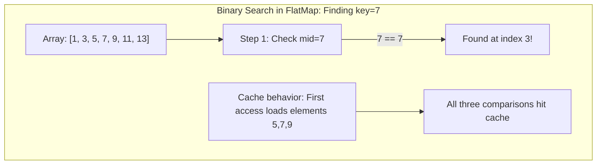
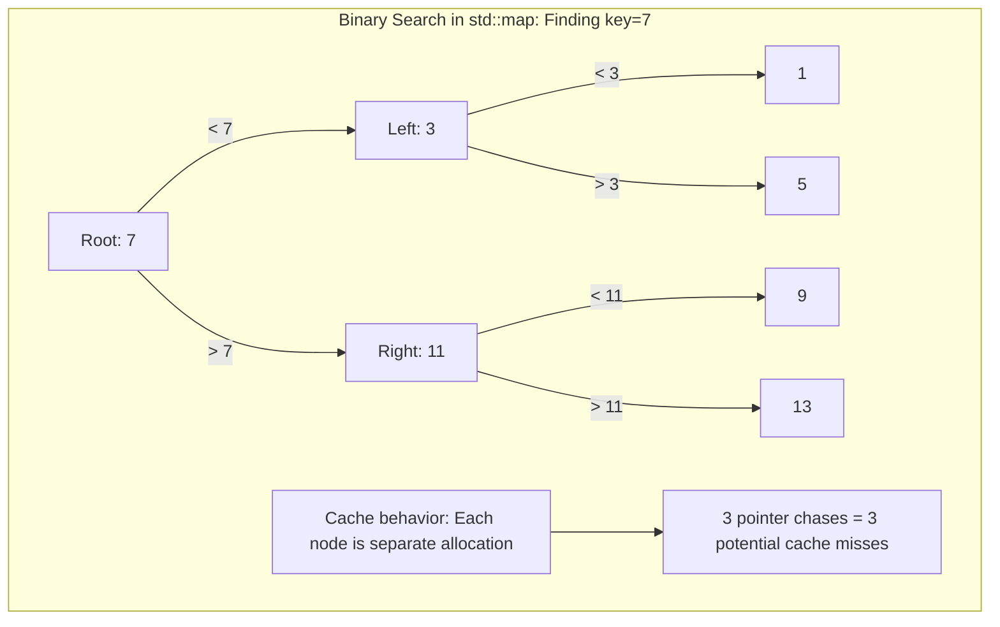
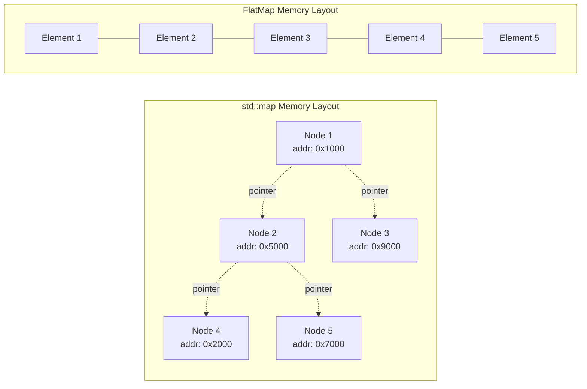

# FlatMap and FlatSet User Manual

**Library:** fat_p C++ Utilities  
**Standard:** C++20  
**Type:** Header-only

---


**Scope:** Complete usage guide for `fat_p::FlatMap<K, V>` and `fat_p::FlatSet<K>`: sorted contiguous containers, insertion, lookup, erasure, iteration, bulk operations, and comparison with std::map and hash maps.

**Not covered:**
- Hash-based maps (see FastHashMap, StableHashMap)
- Concurrent sorted containers
- Multi-map / multi-set variants

**Prerequisites:** C++20; understanding of sorted containers vs hash containers; awareness of cache locality benefits of contiguous storage

---

## User Manual Card

**Component:** FlatMap and FlatSet
**Primary use case:** Sorted associative containers with contiguous storage for cache-friendly iteration and small-to-medium collections
**Integration pattern:** Drop-in replacement for `std::map` / `std::set` where cache locality matters more than O(log N) insertion for large N
**Key API:** `FlatMap<K, V>`, `FlatSet<K>`, `.insert()`, `.find()`, `.erase()`, `.lower_bound()`, `.upper_bound()`, `.operator[]()`, `.contains()`
**std equivalent:** std::flat_map / std::flat_set (C++23)
**Common mistakes:** Using FlatMap for large collections with frequent insertions (O(N) insert due to shifting); holding iterators across mutations (invalidated); assuming FlatMap is a hash map (it's sorted)
**Performance notes:** Binary search lookup is O(log N). Contiguous storage enables cache-friendly iteration. Insertion is O(N) due to element shifting. See `components/FlatMapSet/results/` for current data

---
## Table of Contents

1. [The Sorted Container Story](#the-sorted-container-story)
   - [The Configuration Table That Crashed Production](#the-configuration-table-that-crashed-production)
   - [Why Trees Hurt More Than They Help](#why-trees-hurt-more-than-they-help)
   - [The Sorted Vector Solution](#the-sorted-vector-solution)
2. [Understanding Memory: Why Layout Matters](#understanding-memory-why-layout-matters)
   - [The Cache Line Effect](#the-cache-line-effect)
   - [Binary Search on Contiguous Data](#binary-search-on-contiguous-data)
   - [The Trade-Off: Insert Cost vs. Read Speed](#the-trade-off-insert-cost-vs-read-speed)
3. [Core Architecture](#core-architecture)
   - [Storage Design](#storage-design)
   - [The Sorted Invariant](#the-sorted-invariant)
   - [Iterator Design: Protecting Key Immutability](#iterator-design-protecting-key-immutability)
   - [Design Decisions](#design-decisions)
4. [Getting Started](#getting-started)
   - [Prerequisites](#prerequisites)
   - [Integration](#integration)
   - [First Program](#first-program)
5. [FlatMap: The Key-Value Container](#flatmap-the-key-value-container)
   - [Construction: Building Your Map](#flatmap-construction)
   - [Four Ways to Read: operator[], at(), find(), and contains()](#four-ways-to-read)
   - [The Insert Dilemma: Six Methods, Six Philosophies](#the-insert-dilemma)
   - [Lookup: Binary Search in Practice](#flatmap-lookup)
   - [Capacity Management](#flatmap-capacity)
6. [FlatSet: The Unique Collection](#flatset-the-unique-collection)
   - [Construction](#flatset-construction)
   - [Modifiers](#flatset-modifiers)
   - [Lookup](#flatset-lookup)
   - [Set Operations](#set-operations)
7. [Custom Comparators: Controlling Sort Order](#custom-comparators)
   - [Descending Order](#descending-order)
   - [Case-Insensitive Strings](#case-insensitive-strings)
   - [Comparator Requirements](#comparator-requirements)
8. [Performance Characteristics](#performance-characteristics)
   - [Complexity Analysis](#complexity-analysis)
   - [Benchmark Methodology](#benchmark-methodology)
   - [Benchmark Results](#benchmark-results)
   - [Memory Usage](#memory-usage)
   - [Interpreting the Results](#interpreting-the-results)
9. [Comparison with Other Approaches](#comparison-with-other-approaches)
   - [vs std::map and std::set](#vs-stdmap-and-stdset)
   - [vs C++23 std::flat_map](#vs-c23-stdflat_map)
   - [vs Boost.Container flat_map](#vs-boostcontainer-flat_map)
10. [Migration Guide](#migration-guide)
    - [From std::map](#from-stdmap)
    - [From std::set](#from-stdset)
    - [Incremental Adoption](#incremental-adoption)
11. [Best Practices](#best-practices)
    - [When to Use](#when-to-use)
    - [When Not to Use](#when-not-to-use)
    - [Performance Tips](#performance-tips)
12. [Troubleshooting](#troubleshooting)
    - [Compilation Errors](#compilation-errors)
    - [Runtime Errors](#runtime-errors)
    - [Performance Issues](#performance-issues)
13. [API Reference](#api-reference)
    - [FlatMap Types](#flatmap-types)
    - [FlatSet Types](#flatset-types)
    - [Common Methods](#common-methods)
14. [Summary](#summary)

---

## The Sorted Container Story

### The Configuration Table That Crashed Production

Your team loads 500 configuration entries at startup. The code has worked for years:

```cpp
std::map<std::string, ConfigValue> global_config;

void load_config(const std::string& path) {
    for (const auto& entry : parse_config_file(path)) {
        global_config[entry.key] = entry.value;
    }
}
```

Then your service scales up. Load testing reveals memory spikes to 4GB during startup, and occasionally the allocator fails entirely. You profile and discover the culprit: `std::map`'s per-node allocation created heap fragmentation so severe the allocator couldn't find contiguous blocks for other operations.

**500 configuration entries. 500 separate heap allocations. 500 tree nodes scattered across memory.**

The fix wasn't algorithmic—it was *architectural*. You needed a container that stores elements contiguously, not one that sprays nodes across the heap.

### Why Trees Hurt More Than They Help

`std::map` uses a red-black tree. Every element lives in its own heap-allocated node:

```cpp
// Conceptual std::map node structure
template <typename Key, typename Value>
struct MapNode {
    std::pair<const Key, Value> data;  // Your actual data
    MapNode* parent;                    // 8 bytes
    MapNode* left;                      // 8 bytes  
    MapNode* right;                     // 8 bytes
    bool color;                         // 1 byte (+ padding)
};
// Total: ~40 bytes of overhead per element for int→int mapping
```

For a configuration table with 500 string keys averaging 20 characters each:

| Storage | std::map | Contiguous Alternative |
|---------|----------|------------------------|
| Data | ~15 KB | ~15 KB |
| Tree pointers | ~12 KB | 0 |
| Allocator overhead | ~8 KB | ~24 bytes |
| **Total** | **~35 KB in 500 fragments** | **~15 KB in 1 block** |

The fragmentation isn't just wasteful—it's *hostile to modern CPUs*.

### The Sorted Vector Solution

What if you stored the same data in a sorted `std::vector` and used binary search?

```cpp
std::vector<std::pair<std::string, ConfigValue>> config;
// ... load and sort ...

auto it = std::lower_bound(config.begin(), config.end(), key,
    [](const auto& elem, const std::string& k) { 
        return elem.first < k; 
    });
if (it != config.end() && it->first == key) {
    return it->second;
}
```

This is the core insight behind FlatMap and FlatSet: **a sorted vector with binary search is often faster than a tree**.

- **Lookup:** O(log n) binary search, same as tree traversal
- **Memory:** Contiguous allocation, no per-node overhead
- **Iteration:** Sequential memory access, hardware prefetcher effective

The trade-off is O(n) insertion (elements must shift), but for read-heavy workloads—configuration, lookup tables, caches—the benefits dominate.

---

## Understanding Memory: Why Layout Matters

### The Cache Line Effect

Modern CPUs don't fetch individual bytes from memory. They fetch *cache lines*—typically 64 bytes at a time. When you access address `0x1000`, the CPU loads bytes `0x1000` through `0x103F` into L1 cache.

```
Memory Access Pattern:
┌─────────────────────────────────────────────────────────────────┐
│ Request byte at 0x1000                                          │
│ CPU fetches entire cache line: 0x1000-0x103F (64 bytes)        │
│ Next 63 bytes are "free" if you access them                    │
└─────────────────────────────────────────────────────────────────┘
```

**Implication for data structures:**

```cpp
// std::map iteration: every node is a separate allocation
for (const auto& [k, v] : std_map) {
    process(v);  
    // Each node is probably on a different cache line
    // CPU fetches 64 bytes, uses ~8-16 bytes, discards the rest
    // Next iteration: cache miss, fetch another 64 bytes
}

// FlatMap iteration: all elements in one allocation
for (const auto& [k, v] : flat_map) {
    process(v);  
    // Elements are adjacent in memory
    // CPU fetches 64 bytes, uses all of them for multiple elements
    // Prefetcher detects sequential pattern, loads ahead
}
```

For 1,000 elements of 8 bytes each:

| Container | Cache Lines Touched | Cache Efficiency |
|-----------|---------------------|------------------|
| `std::map` | ~1,000 (one per node) | ~12% (8 of 64 bytes used) |
| `FlatMap` | ~125 (sequential) | ~100% (all bytes used) |

This is why FlatMap iteration is dramatically faster—not because of algorithmic differences, but because of *memory layout*. Contiguous storage means the hardware prefetcher can stay ahead of the access pattern, and every fetched cache line is fully utilized.

### Binary Search on Contiguous Data

Binary search has O(log n) complexity regardless of memory layout. But the *constant factors* differ dramatically:





For a 1,000-element container, finding an element requires ~10 comparisons. In `FlatMap`, these touch ~3-4 cache lines (adjacent elements loaded together). In `std::map`, these touch ~10 cache lines (each tree node is separate).

### The Trade-Off: Insert Cost vs. Read Speed

FlatMap's sorted vector requires O(n) time to insert—every element after the insertion point must shift:

```cpp
// Inserting key=4 into [1, 3, 5, 7, 9]
// Before: [1, 3, 5, 7, 9, _]
// After:  [1, 3, 4, 5, 7, 9]
//                 ↑ shift right

// This is a memmove of (n - insertion_point) elements
```

`std::map` inserts in O(log n) time—just adjust some pointers.

**When does this trade-off favor FlatMap?**

| Workload Pattern | Flat Wins? | Why |
|------------------|------------|-----|
| Load once, read many | **Yes** | O(n) insert once, O(log n) reads many times |
| Build sorted, then read | **Yes** | Sorted insert is O(1) amortized |
| Interleaved read/write | *Maybe* | Depends on read:write ratio |
| Write-heavy | **No** | O(n) inserts dominate |

**Rule of thumb:** If you read more than you write, FlatMap wins.

---

## What is FlatMap/FlatSet?

### Understanding the Problem

Node-based containers like `std::map` and `std::set` use red-black trees internally. Each element is a separately allocated node containing the data plus pointers to parent, left child, and right child:

```cpp
// Simplified std::map node structure (conceptual)
template <typename Key, typename Value>
struct MapNode
{
    std::pair<const Key, Value> data;  // 8+ bytes for int,int
    MapNode* parent;                    // 8 bytes
    MapNode* left;                      // 8 bytes  
    MapNode* right;                     // 8 bytes
    bool color;                         // 1 byte (+ padding)
    // Total: ~40 bytes per node for a simple int,int pair
};
```

This design has consequences:

```cpp
std::map<int, int> cache;
for (int i = 0; i < 10000; ++i)
{
    cache[i] = i * 10;
}

// Problem 1: 10,000 separate heap allocations
// Problem 2: Nodes scattered across memory
// Problem 3: ~400KB memory for 80KB of actual data
// Problem 4: Cache misses on every tree traversal
```



### The C++ Landscape

| Container | Storage | Lookup | Insert | Iteration | Memory Overhead |
|-----------|---------|--------|--------|-----------|-----------------|
| `std::map` | Red-black tree | O(log n) | O(log n) | Poor cache | ~32 bytes/node |
| `std::unordered_map` | Hash table | O(1) avg | O(1) avg | Poor cache | ~8-16 bytes/bucket |
| `std::flat_map` (C++23) | Sorted vector | O(log n) | O(n) | Excellent cache | ~0 bytes |
| `boost::flat_map` | Sorted vector | O(log n) | O(n) | Excellent cache | ~0 bytes |
| `fat_p::FlatMap` | Sorted vector | O(log n) | O(n) | Excellent cache | ~0 bytes |

**Trade-off summary:**

- Node-based containers: O(N) amortized insertion, slow iteration, high memory
- Flat containers: O(N) insertion, cache-local iteration, low memory
- Hash containers: Fastest lookup, no ordering, variable memory

### Where FlatMap/FlatSet Fit

`fat_p::FlatMap` and `fat_p::FlatSet` are sorted, contiguous associative containers designed for the common "load once, query many" pattern.

**Key features:**

- Standard `std::map`/`std::set` compatible API
- Contiguous memory storage via `std::vector`
- O(log n) lookup via binary search
- Excellent cache locality for iteration
- Custom iterator protection for key immutability (FlatMap)
- Debug-mode bounds checking via `enforce`
- Zero external dependencies beyond the standard library

**Trade-offs:**

- O(n) insertion due to element shifting
- O(n) erasure due to element shifting
- Iterator invalidation on modification (same as `std::vector`)

**Best for:**

- Configuration data loaded at startup
- Lookup tables that rarely change
- Cache structures with infrequent updates
- Memory-constrained environments
- Performance-critical iteration

---

## Core Architecture

### Storage Design

Both containers use `std::vector` as their underlying storage:

```cpp
// FlatSet internal storage
template <typename T, typename Compare, typename Allocator>
class FlatSet
{
private:
    std::vector<T, Allocator> data_;
    Compare comp_;
};

// FlatMap internal storage
template <typename Key, typename T, typename Compare, typename Allocator>
class FlatMap
{
private:
    using InternalPair = std::pair<Key, T>;  // Non-const key for vector operations
    std::vector<InternalPair, InternalAllocator> data_;
    Compare comp_;
};
```

The sorted invariant is maintained by inserting elements at their correct position using binary search (`std::lower_bound`) followed by `vector::insert`.

### The Sorted Invariant: Why Order Is Non-Negotiable

Elements are always maintained in sorted order according to the comparator. This invariant is the foundation of O(log n) lookup:

```cpp
fat_p::FlatMap<int, std::string> map;
map.insert({3, "three"});  // data_ = [{3, "three"}]
map.insert({1, "one"});    // data_ = [{1, "one"}, {3, "three"}]
map.insert({2, "two"});    // data_ = [{1, "one"}, {2, "two"}, {3, "three"}]

// Insertion order: 3, 1, 2
// Storage order: 1, 2, 3 (sorted)
```

**The invariant guarantees:**
- Binary search works correctly
- `lower_bound()` and `upper_bound()` return valid ranges
- Iteration produces elements in sorted order

**The invariant requires:**
- Keys cannot be modified after insertion (would break sort order)
- Every insertion finds the correct position via binary search
- O(n) element shifting on insert/erase (the trade-off)

### Iterator Design: Protecting Key Immutability

FlatSet exposes const iterators only—elements cannot be modified through iterators since modification would break the sorted invariant. This matches `std::set` behavior.

FlatMap faces a more interesting challenge: values should be mutable, but keys must remain const. The solution uses custom iterator wrappers that return `std::pair<const Key&, T&>` on dereference:

```cpp
fat_p::FlatMap<int, std::string> map{{1, "one"}, {2, "two"}};

auto it = map.begin();
(*it).second = "ONE";  // OK: values are mutable
// (*it).first = 999;  // Would not compile: key is const
```

This matches `std::map` behavior where `value_type` is `std::pair<const Key, T>`.

> **Warning: The Proxy Iterator Trap (FlatMap only)**
> 
> Because FlatMap uses a proxy iterator to protect key immutability, the expression `&*it` returns the address of a **temporary object**, not the address of the element inside the vector. This is a subtle but critical difference from `std::map`.
> 
> ```cpp
> auto it = map.find(key);
> auto* bad_ptr = &(*it);       // WRONG: points to temporary, dangles immediately
> auto* good_ptr = &it->second; // OK: points to actual value in vector
> auto* also_good = &map.at(key).second;  // OK: direct access
> ```
>
> **Rule:** Never store `&*it` from a FlatMap iterator. Use `&it->second` or `&map.at(key)` instead.

### Design Decisions

**Why not use `std::pair<const Key, T>` internally?**

`std::vector` requires elements to be assignable for operations like `erase` and `insert`. A pair with a const first element cannot be assigned, so we use `std::pair<Key, T>` internally and protect key immutability through the iterator interface.

**Why custom iterators instead of documenting the limitation?**

API compatibility with `std::map` is a primary goal. Users expect that modifying keys through iterators is impossible, not just discouraged.

**Why include `enforce` checks?**

Debug-mode validation catches iterator misuse early:

```cpp
fat_p::FlatMap<int, int> map{{1, 10}};
map.erase(map.end());  // Debug: enforce triggers with "invalid iterator"
                       // Release: undefined behavior (same as std::map)
```

---

## Getting Started

### Prerequisites

| Requirement | Minimum |
|-------------|---------|
| C++ Standard | C++20 |
| Compiler | GCC 7+, Clang 5+, MSVC 2017+ |
| Dependencies | `enforce.h`, `FatPTypeTraits.h` |

### Integration

```cpp
#include "FlatMap.h"  // For fat_p::FlatMap
#include "FlatSet.h"  // For fat_p::FlatSet
```

No special compiler flags required beyond C++20 mode (`-std=c++20` or `/std:c++20`).

### First Program

```cpp
#include <iostream>
#include <string>
#include "FlatMap.h"
#include "FlatSet.h"

int main()
{
    // FlatMap example: configuration store
    fat_p::FlatMap<std::string, int> config;
    config["timeout_ms"] = 5000;
    config["max_retries"] = 3;
    config["buffer_size"] = 4096;
    
    std::cout << "Timeout: " << config.at("timeout_ms") << " ms\n";
    
    if (config.contains("max_retries"))
    {
        std::cout << "Max retries: " << config["max_retries"] << "\n";
    }
    
    // FlatSet example: allowed status codes
    fat_p::FlatSet<int> valid_codes{200, 201, 204, 301, 302, 304};
    
    int response_code = 200;
    if (valid_codes.contains(response_code))
    {
        std::cout << "Response " << response_code << " is valid\n";
    }
    
    // Iteration (sorted order)
    std::cout << "All valid codes: ";
    for (int code : valid_codes)
    {
        std::cout << code << " ";
    }
    std::cout << "\n";
    
    return 0;
}
```

Output:
```
Timeout: 5000 ms
Max retries: 3
Response 200 is valid
All valid codes: 200 201 204 301 302 304
```

---

## FlatMap: The Key-Value Container

### FlatMap Construction

```cpp
// Default construction
fat_p::FlatMap<int, std::string> map1;

// With custom comparator
fat_p::FlatMap<int, std::string, std::greater<int>> map2;

// From initializer list
fat_p::FlatMap<std::string, int> map3{
    {"alice", 30},
    {"bob", 25},
    {"charlie", 35}
};

// From iterator range
std::vector<std::pair<int, int>> data{{1, 10}, {2, 20}, {3, 30}};
fat_p::FlatMap<int, int> map4(data.begin(), data.end());

// With allocator
fat_p::FlatMap<int, int> map5(std::allocator<std::pair<const int, int>>{});
```

### Four Ways to Read: operator[], at(), find(), and contains()

FlatMap provides four methods for reading values. Each serves a different purpose:

| Method | Key Missing? | Returns | Use Case |
|--------|--------------|---------|----------|
| `operator[]` | Inserts default | Reference | "Get or create" |
| `at()` | Throws exception | Reference | "Must exist" |
| `find()` | Returns `end()` | Iterator | "Need the value if present" |
| `contains()` | Returns `false` | Bool | "Only need existence check" |

**Understanding the differences:**

```cpp
fat_p::FlatMap<std::string, int> ages{{"alice", 30}, {"bob", 25}};

// operator[]: GET-OR-CREATE
// If key missing, inserts default-constructed value (0 for int)
ages["charlie"] = 35;         // Inserts {"charlie", 35}
int age = ages["alice"];      // Returns 30
int missing = ages["dave"];   // INSERTS {"dave", 0} and returns 0!

// at(): MUST EXIST (safe for const maps)
try {
    int x = ages.at("eve");   // Throws std::out_of_range
} catch (const std::out_of_range& e) {
    std::cerr << "Key not found\n";
}

// find(): NEED THE VALUE IF PRESENT
auto it = ages.find("alice");
if (it != ages.end()) {
    std::cout << "Alice is " << it->second << " years old\n";
}

// contains(): ONLY CHECKING EXISTENCE
if (ages.contains("bob")) {
    std::cout << "Bob is in the map\n";
    // But we'd need another lookup to get Bob's age!
}
```

**The critical mistake with `operator[]`:**

```cpp
// WRONG: Silent insertion on read
if (config["max_retries"] > 0) {  // If key missing, inserts 0!
    retry();
}
// config now contains {"max_retries", 0} even if it wasn't there

// RIGHT: Check first
if (config.contains("max_retries") && config["max_retries"] > 0) {
    retry();
}

// BETTER: Use find() to avoid double lookup
if (auto it = config.find("max_retries"); it != config.end() && it->second > 0) {
    retry();
}
```

**When to use each method:**

- **`operator[]`**: Building up a map (counters, accumulators), or when you want defaults
- **`at()`**: You *know* the key exists, or you want an exception if it doesn't
- **`find()`**: Conditional access where you need the value
- **`contains()`**: Pure existence checks (membership tests, validation)

### The Insert Dilemma: Six Methods, Six Philosophies

FlatMap provides six ways to add elements. This seems redundant—why not just one? The answer involves a fundamental design question: **what happens when you insert a key that already exists?**

| Method | Key Exists? | Value Constructed? | Use Case |
|--------|-------------|-------------------|----------|
| `insert()` | Ignored | Only if needed | "Add if missing" |
| `insert_or_assign()` | Overwrites | Always | "Upsert" |
| `emplace()` | Ignored | Only if needed | "Add if missing" (in-place) |
| `try_emplace()` | Ignored | Only if needed | "Add if missing" (no value construction) |
| `operator[]` | Overwrites | Always | "Get or create" |
| Range `insert()` | Ignored | Only if needed | "Bulk add" |

**The philosophical divide:**

```cpp
fat_p::FlatMap<int, std::string> map;

// === INSERT FAMILY: "Don't touch existing values" ===

// insert(): Ignore duplicate keys
map.insert({1, "one"});
map.insert({1, "ONE"});       // Ignored! Value stays "one"

// emplace(): Same behavior, constructs in-place
map.emplace(2, "two");
map.emplace(2, "TWO");        // Ignored! Value stays "two"

// try_emplace(): Same behavior, but NEVER constructs value if key exists
map.try_emplace(3, expensive_computation());  // Computed
map.try_emplace(3, expensive_computation());  // NOT computed (key exists)

// === ASSIGN FAMILY: "Always update" ===

// insert_or_assign(): Update if exists
map.insert_or_assign(1, "ONE");  // Updates to "ONE"

// operator[]: Same effect (updates if exists)
map[1] = "one again";            // Updates to "one again"
```

**The try_emplace optimization:**

```cpp
// Scenario: Expensive value construction
fat_p::FlatMap<int, ExpensiveObject> cache;

// BAD: emplace() might construct ExpensiveObject even if key exists
cache.emplace(key, arg1, arg2, arg3);  // Constructor ALWAYS called

// GOOD: try_emplace() only constructs if key is missing
cache.try_emplace(key, arg1, arg2, arg3);  // Constructor called ONLY if needed
```

**Choosing the right method:**

| Situation | Method | Why |
|-----------|--------|-----|
| Configuration defaults | `insert()` | Don't overwrite user values |
| Caching computed values | `try_emplace()` | Avoid recomputing |
| Counter/accumulator | `operator[]` | Get-or-create semantics |
| "Last writer wins" update | `insert_or_assign()` | Always want latest |
| Bulk loading | Range `insert()` | O(n log n) vs O(n²) |

**Range insert: The performance win:**

```cpp
// BAD: O(n²) - each insert shifts elements
for (const auto& item : items) {
    map.insert(item);  // O(n) shift each time
}

// GOOD: O(n log n) - sorts then merges
map.insert(items.begin(), items.end());  // Single optimized operation
```

**Erase and merge operations:**

```cpp
fat_p::FlatMap<int, std::string> map{{1, "one"}, {2, "two"}, {3, "three"}};

// Erase by key - returns count removed (0 or 1)
size_t removed = map.erase(1);  // removed == 1

// Erase by iterator - returns iterator to next element
auto it = map.find(2);
if (it != map.end()) {
    auto next = map.erase(it);  // next points to {3, "three"}
}

// Merge: O(n + m) since both containers are sorted
fat_p::FlatMap<int, std::string> map1{{1, "one"}, {3, "three"}};
fat_p::FlatMap<int, std::string> map2{{2, "two"}, {3, "THREE"}, {4, "four"}};
map1.merge(map2);
// map1 = {{1, "one"}, {2, "two"}, {3, "three"}, {4, "four"}}
// Key 3 keeps ORIGINAL value "three" (merge doesn't overwrite)
// map2 is now empty
```

### FlatMap Lookup: Binary Search in Practice

All lookup operations use binary search internally—O(log n) comparisons on the sorted vector.

```cpp
fat_p::FlatMap<int, std::string> map{{1, "one"}, {3, "three"}, {5, "five"}};

// find(): Returns iterator (or end() if not found)
auto it = map.find(3);
if (it != map.end()) {
    std::cout << it->second;  // "three"
}

// contains(): Boolean existence check
if (map.contains(5)) {
    std::cout << "Found 5\n";
}

// count(): Returns 0 or 1 (for compatibility with multi-maps)
size_t n = map.count(7);  // 0
```

**Bound operations for range queries:**

```cpp
fat_p::FlatMap<int, std::string> map{{10, "ten"}, {20, "twenty"}, {30, "thirty"}};

// lower_bound: First element NOT LESS than key (>=)
auto lb = map.lower_bound(15);  // Points to {20, "twenty"}
auto lb2 = map.lower_bound(20); // Points to {20, "twenty"} (exact match)

// upper_bound: First element GREATER than key (>)
auto ub = map.upper_bound(20);  // Points to {30, "thirty"}

// equal_range: Pair of [lower_bound, upper_bound)
auto [first, last] = map.equal_range(20);
// first = {20, "twenty"}, last = {30, "thirty"}
// For unique keys, this is either empty range or single element
```

**Use case: Finding all keys in a range:**

```cpp
// Find all keys between 15 and 25 (inclusive)
auto start = map.lower_bound(15);  // >= 15
auto end = map.upper_bound(25);    // > 25

for (auto it = start; it != end; ++it) {
    std::cout << it->first << ": " << it->second << "\n";
}
// Output: 20: twenty
```

### Capacity Management: Avoiding Reallocation Costs

FlatMap uses `std::vector` internally, which means it inherits vector's growth behavior: when capacity is exhausted, it allocates a larger buffer and copies all elements. For large maps, this reallocation can be expensive.

**Why reserve matters:**

```cpp
// WITHOUT reserve: Multiple reallocations as vector grows
fat_p::FlatMap<int, int> map1;
for (int i = 0; i < 10000; ++i) {
    map1.insert({i, i * 10});  // Vector reallocates ~14 times
}

// WITH reserve: Single allocation
fat_p::FlatMap<int, int> map2;
map2.reserve(10000);           // Allocate once
for (int i = 0; i < 10000; ++i) {
    map2.insert({i, i * 10});  // No reallocations
}
```

**Capacity operations:**

```cpp
fat_p::FlatMap<int, int> map;

// Size: Number of elements currently stored
size_t count = map.size();     // 0

// Capacity: Number of elements that can be stored without reallocation
map.reserve(1000);
size_t cap = map.capacity();   // >= 1000

// Empty: Is size() == 0?
bool isEmpty = map.empty();    // true

// shrink_to_fit: Release unused capacity (advisory)
map.insert({{1, 10}, {2, 20}, {3, 30}});  // size=3, capacity>=1000
map.shrink_to_fit();                       // size=3, capacity~=3
```

**When to use each:**

| Situation | Action | Why |
|-----------|--------|-----|
| Know approximate final size | `reserve(n)` before inserting | Avoid O(log n) reallocations |
| Large map no longer growing | `shrink_to_fit()` | Return memory to system |
| Bulk load at startup | `reserve(n)`, then range `insert()` | Single allocation, single sort |

---

## FlatSet: The Unique Collection

FlatSet is the keys-only sibling of FlatMap. It stores unique elements in sorted order, providing the same cache-friendly iteration and O(log n) lookup without the overhead of associated values.

**Common use cases:**
- Membership testing: "Is this ID in the allowed set?"
- Deduplication: "What are the unique values?"
- Sorted output: "List all items in order"

### FlatSet Construction

```cpp
// Default construction
fat_p::FlatSet<int> set1;

// With custom comparator
fat_p::FlatSet<int, std::greater<int>> set2;

// From initializer list
fat_p::FlatSet<std::string> set3{"apple", "banana", "cherry"};

// From iterator range (duplicates removed automatically)
std::vector<int> data{3, 1, 4, 1, 5, 9, 2, 6, 5};
fat_p::FlatSet<int> set4(data.begin(), data.end());
// set4 contains: {1, 2, 3, 4, 5, 6, 9} — sorted, duplicates removed
```

### FlatSet Modifiers

```cpp
fat_p::FlatSet<int> set;

// insert: returns pair<iterator, bool>
auto [it1, inserted1] = set.insert(5);
// inserted1 == true

auto [it2, inserted2] = set.insert(5);
// inserted2 == false (duplicate ignored)

// Range insert: O(n + k log k) optimized
set.insert({1, 2, 3, 4});

// emplace: constructs in place
auto [it3, inserted3] = set.emplace(10);

// Erase by value: returns count removed (0 or 1)
size_t removed = set.erase(3);

// Erase by iterator
auto it = set.find(4);
if (it != set.end()) {
    set.erase(it);
}

// Clear all elements
set.clear();
```

### FlatSet Lookup

```cpp
fat_p::FlatSet<int> set{10, 20, 30, 40, 50};

// find
auto it = set.find(30);
if (it != set.end())
{
    std::cout << *it;  // 30
}

// contains
bool found = set.contains(25);  // false

// count
size_t n = set.count(40);  // 1

// lower_bound
auto lb = set.lower_bound(25);  // Points to 30

// upper_bound
auto ub = set.upper_bound(30);  // Points to 40

// equal_range
auto [first, last] = set.equal_range(30);
```

### Set Operations

Since FlatSet maintains sorted order, standard algorithms work efficiently:

```cpp
fat_p::FlatSet<int> a{1, 2, 3, 4, 5};
fat_p::FlatSet<int> b{4, 5, 6, 7, 8};

// Intersection
std::vector<int> intersection;
std::set_intersection(a.begin(), a.end(),
                      b.begin(), b.end(),
                      std::back_inserter(intersection));
// intersection = {4, 5}

// Union
std::vector<int> union_result;
std::set_union(a.begin(), a.end(),
               b.begin(), b.end(),
               std::back_inserter(union_result));
// union_result = {1, 2, 3, 4, 5, 6, 7, 8}

// Difference (a - b)
std::vector<int> difference;
std::set_difference(a.begin(), a.end(),
                    b.begin(), b.end(),
                    std::back_inserter(difference));
// difference = {1, 2, 3}

// Symmetric difference
std::vector<int> sym_diff;
std::set_symmetric_difference(a.begin(), a.end(),
                              b.begin(), b.end(),
                              std::back_inserter(sym_diff));
// sym_diff = {1, 2, 3, 6, 7, 8}
```

---

## Custom Comparators: Controlling Sort Order

The comparator determines how elements are sorted and compared. By default, FlatMap and FlatSet use `std::less<Key>`, which gives ascending order. Custom comparators enable different sorting strategies.

### Descending Order

The simplest customization: reverse the sort order.

```cpp
// Default: ascending order
fat_p::FlatSet<int> ascending{3, 1, 4, 1, 5};
// Contents: {1, 3, 4, 5}

// Custom: descending order
fat_p::FlatSet<int, std::greater<int>> descending{3, 1, 4, 1, 5};
// Contents: {5, 4, 3, 1}

for (int val : descending) {
    std::cout << val << " ";  // 5 4 3 1
}
```

### Case-Insensitive Strings

A practical example: configuration keys that should match regardless of case.

```cpp
struct CaseInsensitiveCompare
{
    bool operator()(const std::string& a, const std::string& b) const
    {
        return std::lexicographical_compare(
            a.begin(), a.end(),
            b.begin(), b.end(),
            [](char c1, char c2) {
                return std::tolower(static_cast<unsigned char>(c1)) <
                       std::tolower(static_cast<unsigned char>(c2));
            });
    }
};

fat_p::FlatMap<std::string, int, CaseInsensitiveCompare> config;
config["Timeout"] = 5000;
config["TIMEOUT"] = 3000;  // Same key as "Timeout"!

std::cout << config.size();      // 1
std::cout << config["timeout"];  // 3000 (case-insensitive lookup)
```

### Heterogeneous Lookup with Transparent Comparators

Using `std::less<>` (note the empty template parameter) enables lookups without constructing temporary keys:

```cpp
// Without transparent comparator: constructs temporary std::string
fat_p::FlatMap<std::string, int> map1;
map1.find("hello");  // Constructs std::string("hello")

// With transparent comparator: no temporary
fat_p::FlatMap<std::string, int, std::less<>> map2;
map2.find("hello");               // Compares directly with const char*
map2.find(std::string_view("hello"));  // Compares with string_view
```

This optimization matters when string keys are common and lookups are frequent—avoiding allocations in hot paths.

### Comparator Requirements

Comparators must define a *strict weak ordering*. Breaking these rules causes undefined behavior—typically, elements in wrong positions or infinite loops during lookup.

| Requirement | Meaning | Violation Example |
|-------------|---------|-------------------|
| **Irreflexive** | `comp(a, a)` is always `false` | `<=` instead of `<` |
| **Asymmetric** | If `comp(a, b)` then `!comp(b, a)` | Non-deterministic comparison |
| **Transitive** | If `comp(a,b)` and `comp(b,c)` then `comp(a,c)` | Floating-point NaN comparisons |
| **Transitivity of equivalence** | Equivalent elements form equivalence classes | Inconsistent tie-breaking |

**Safe pattern:**

```cpp
// GOOD: strict less-than
bool operator()(const T& a, const T& b) const {
    return a.field < b.field;  // < is strict weak ordering
}

// BAD: less-than-or-equal
bool operator()(const T& a, const T& b) const {
    return a.field <= b.field;  // <= violates irreflexivity!
}
```

---

## Performance Characteristics

### Complexity Analysis

| Operation | FlatMap/FlatSet | std::map/set | Notes |
|-----------|-----------------|--------------|-------|
| `find` | O(log n) | O(log n) | Binary search vs tree traversal |
| `insert` (single) | O(n) | O(log n) | Vector shift vs tree rebalance |
| `insert` (range, k elements) | O(n + k log k) | O(k log n) | Sort + merge optimization |
| `erase` | O(n) | O(log n) | Vector shift vs tree rebalance |
| `operator[]` | O(n) | O(log n) | May insert |
| Iteration (full) | O(n) | O(n) | Cache-friendly vs cache-hostile |
| Memory per element | sizeof(T) | sizeof(T) + ~32 bytes | No node overhead |

### Benchmark Methodology

Performance was measured on two platforms with automatic system information capture:

**Windows Test Environment:**

| Component | Specification |
|-----------|---------------|
| Processor | Intel Core i7-8850H @ 2.60 GHz (6C/12T) |
| RAM | 32.0 GB |
| OS | Windows 10 Pro (Build 26200) x64 |
| Compiler | MSVC 2022 |
| Timer | QueryPerformanceCounter (100 ns resolution) |

```
Compiler Flags: /std:c++20 /O2 /DNDEBUG /MD /EHsc /W3
Defines: NOMINMAX, WIN32_LEAN_AND_MEAN
```

**Linux Test Environment:**

| Component | Specification |
|-----------|---------------|
| Compiler | GCC 13.3.0 |
| OS | Ubuntu 24.04 LTS x86_64 |
| Timer | std::chrono::high_resolution_clock (1 ns resolution) |

```
Compiler Flags: -std=c++20 -O2 -DNDEBUG
```

All measurements represent the average time per operation over thousands of iterations with warmup runs excluded. Benchmarks use `DoNotOptimize` patterns to prevent compiler elimination of measured operations.

Windows benchmarks were captured in two conditions:
- **Unthrottled:** CPU at base frequency (~2600 MHz), cool laptop
- **Throttled:** CPU at 40-70% frequency (~1100-1800 MHz), sustained load with thermal management active (verified via HWINFO64)

> **Note on Thermal Throttling:** Laptop CPUs frequently operate under thermal constraints. The throttled benchmarks represent realistic sustained workload performance. The performance advantages of flat containers are **maintained or enhanced** under throttling because memory-bound operations become relatively more important when CPU clock speeds are reduced.

### Benchmark Results

Benchmarks compare FlatMap/FlatSet against `std::map`/`std::set` across insert, find, iteration, and erase operations. Testing covers multiple platforms (Windows MSVC, Linux GCC), thermal conditions (throttled and unthrottled), and data scales (1,000 and 100,000 elements) to stress both cache-resident and cache-exceeding workloads.

**What the benchmarks measure:**

- **Find:** Binary search on contiguous storage vs. tree traversal through pointer-chasing nodes. At small scale the two are comparable; at larger scale the cache-friendly layout of flat containers provides a measurable advantage because binary search touches fewer scattered cache lines.

- **Iteration:** Sequential memory access with hardware prefetching vs. pointer chasing through separately allocated nodes. This is where contiguous layout provides the largest advantage—the CPU prefetcher can stay ahead of a sequential scan but cannot predict pointer-chasing patterns.

- **Insert (sorted, pre-reserved):** Appending to a pre-sorted, pre-reserved vector avoids both element shifting and reallocation, reducing insert to an append operation. This is the best-case scenario for bulk loading.

- **Insert (random):** Amortized cost including vector growth and element shifting. The O(n) shift is a cache-friendly `memmove`, which modern CPUs handle efficiently.

- **Memory:** Flat containers store only the data with no per-node pointer overhead, resulting in substantially lower memory usage than node-based containers.

**Key architectural insights:**

- The flat container advantage increases as data size grows beyond L2 cache, because cache misses become relatively more expensive for scattered node-based storage.
- Under thermal throttling (reduced CPU frequency), memory latency becomes relatively more costly, which maintains or slightly enhances the advantage of cache-efficient layouts.
- Platform differences (MSVC vs GCC) affect absolute timings but the relative advantage of contiguous storage remains consistent.

See `components/FlatMapSet/results/` and `benchmark_results/` for current platform-specific benchmark data with exact timings, speedup ratios, and methodology details.

### Memory Usage

```
FlatMap<int, int> with 1000 elements:
  Data:     8,000 bytes (8 bytes x 1000 pairs)
  Overhead: ~24 bytes (vector: pointer + size + capacity)
  Total:    ~8,024 bytes

std::map<int, int> with 1000 elements:
  Data:     8,000 bytes
  Nodes:    ~32,000 bytes (32 bytes x 1000 nodes)
  Total:    ~40,000 bytes

Memory savings: ~80%
```

### Interpreting the Results

**Throttled vs Unthrottled:** The relative advantage of flat containers remains consistent regardless of CPU frequency. When thermal throttling reduces clock speed, memory latency becomes relatively more expensive, which benefits cache-efficient data structures.

**Platform differences:** Windows vs Linux differences are due to different compiler optimization strategies (MSVC vs GCC), timer resolution, and memory subsystem behavior. The architectural advantage of contiguous storage holds across platforms.

**Find performance:** At small scale, binary search on contiguous memory is comparable to tree traversal. At larger scale, flat containers show a clear advantage because binary search on contiguous data touches fewer scattered cache lines.

**Insert performance:** FlatMap shows efficient amortized insert times because vector shift operations are cache-friendly `memmove` calls that modern CPUs handle well, and geometric growth avoids per-element allocation.

**Iteration performance:** Sequential memory access enables CPU prefetching and full cache line utilization. The advantage grows with data size as the working set exceeds L2 cache.

**When flat containers lose:**
- Frequent insertions/deletions in the middle of large containers
- Containers with >100,000 elements and random modifications
- Workloads requiring iterator/pointer stability

---

## Comparison with Other Approaches

### vs std::map and std::set

| Aspect | FlatMap/FlatSet | std::map/set |
|--------|-----------------|--------------|
| Lookup | O(log n), cache-friendly | O(log n), cache-hostile |
| Insert | O(n) | O(log n) |
| Erase | O(n) | O(log n) |
| Iteration | Very fast | Slow |
| Memory | Minimal | ~32 bytes/node overhead |
| Iterator stability | Invalidates on modify | Stable |
| Thread safety | None | None |
| Pointer stability | No | Yes |

**Verdict:** Use FlatMap/FlatSet for read-heavy workloads with infrequent modifications. Use std::map/set when you need iterator/pointer stability or frequent random insertions.

### vs C++23 std::flat_map

| Aspect | fat_p::FlatMap | std::flat_map (C++23) |
|--------|----------------|----------------------|
| Standard | C++20 | C++23 |
| Implementation | Single header | Standard library |
| Key storage | Interleaved pairs | Separate key/value vectors (typically) |
| Customization | Compare, Allocator | Compare, KeyContainer, ValueContainer |
| Debug checks | Via enforce.h | Implementation-defined |

**Verdict:** Use `fat_p::FlatMap` for C++20 availability. Consider `std::flat_map` when targeting C++23 exclusively.

### vs Boost.Container flat_map

| Aspect | fat_p::FlatMap | boost::container::flat_map |
|--------|----------------|---------------------------|
| Dependencies | enforce.h, FatPTypeTraits.h | Boost.Container |
| Implementation | ~900 lines | ~2000+ lines |
| Features | Core API | Extended API (extract, merge) |
| Iterator | Custom (key protection) | Custom (key protection) |
| Allocator support | Basic | Full Boost.Container allocator model |

**Verdict:** Use `fat_p::FlatMap` for minimal dependencies. Use Boost if you need advanced features or already depend on Boost.


---

## Migration Guide

### From std::map

```cpp
// Before: std::map
#include <map>
std::map<std::string, int> config;
config["timeout"] = 5000;
auto it = config.find("timeout");

// After: FlatMap
#include "FlatMap.h"
fat_p::FlatMap<std::string, int> config;
config["timeout"] = 5000;
auto it = config.find("timeout");
```

Most code works unchanged. Watch for:

1. **Iterator invalidation:** FlatMap invalidates iterators on insert/erase
2. **Performance patterns:** Bulk insert then query works best
3. **Pointer stability:** Don't store pointers to elements

```cpp
// WRONG: Storing pointers
fat_p::FlatMap<int, Data> map;
map[1] = Data{};
Data* ptr = &map.at(1);
map[2] = Data{};  // ptr may be invalid!

// RIGHT: Store keys, look up when needed
int key = 1;
// ... later ...
Data& data = map.at(key);
```

### From std::set

```cpp
// Before: std::set
#include <set>
std::set<int> ids;
ids.insert(42);
if (ids.count(42) > 0) { /* found */ }

// After: FlatSet
#include "FlatSet.h"
fat_p::FlatSet<int> ids;
ids.insert(42);
if (ids.contains(42)) { /* found */ }  // Or use count()
```

### Incremental Adoption

For large codebases, adopt incrementally:

1. **Identify candidates:** Find maps/sets that are populated once and queried often
2. **Profile first:** Measure current performance to establish baseline
3. **Replace and benchmark:** Switch one container at a time
4. **Watch for invalidation bugs:** Code that stores iterators needs review

```cpp
// Type alias for easy switching
#ifdef USE_FLAT_CONTAINERS
    template <typename K, typename V>
    using ConfigMap = fat_p::FlatMap<K, V>;
#else
    template <typename K, typename V>
    using ConfigMap = std::map<K, V>;
#endif

ConfigMap<std::string, int> settings;
```

---

## Best Practices

### When to Use

- Configuration loaded at startup, queried throughout runtime
- Lookup tables (error codes, enum-to-string mappings)
- Caches with infrequent invalidation
- Small to medium collections (<10,000 elements)
- Memory-constrained environments
- Performance-critical iteration

```cpp
// Good use case: HTTP status code descriptions
fat_p::FlatMap<int, std::string_view> http_status{
    {200, "OK"},
    {201, "Created"},
    {400, "Bad Request"},
    {404, "Not Found"},
    {500, "Internal Server Error"}
};

// Good use case: Feature flags
fat_p::FlatSet<std::string> enabled_features{"dark_mode", "beta_ui", "analytics"};
```

### When Not to Use

- Frequent random insertions/deletions
- Very large collections (>100,000 elements) with modifications
- Code requiring iterator stability
- Code storing pointers to elements
- Real-time systems with strict latency requirements (O(n) insert may spike)

```cpp
// Bad use case: Live connection tracking (frequent add/remove)
// Use std::map or std::unordered_map instead
fat_p::FlatMap<ConnectionId, Connection> connections;  // Don't do this
connections[id] = conn;  // O(n) on every new connection!
```

### Performance Tips

1. **Reserve capacity when size is known:**
```cpp
fat_p::FlatMap<int, Data> map;
map.reserve(expected_count);
for (const auto& item : source)
{
    map.insert(item);
}
```

2. **Bulk insert instead of one-by-one:**
```cpp
// Slower: O(n^2) total
for (const auto& item : items)
{
    map.insert(item);
}

// Faster: O(n log n) total
map.insert(items.begin(), items.end());
```

3. **Use `try_emplace` to avoid redundant constructions:**
```cpp
// May construct value even if key exists
map.insert({key, ExpensiveObject{}});

// Only constructs if key doesn't exist
map.try_emplace(key, constructor_args...);
```

4. **Prefer `contains()` over `count()` or `find()` for existence checks:**
```cpp
// Clear intent
if (set.contains(value)) { /* ... */ }
```

5. **Use transparent comparators for string keys (heterogeneous lookup):**

By default, `FlatMap` uses `std::less<Key>`. For `std::string` keys, looking up with a string literal (e.g., `map.find("key")`) constructs a temporary `std::string`, incurring a heap allocation.

To avoid this allocation, use the transparent comparator `std::less<>`:

```cpp
// Default: allocates temporary std::string for each lookup
fat_p::FlatMap<std::string, int> map_default;
map_default.find("key");  // Creates temporary std::string

// Optimized: no allocation, compares const char* directly
fat_p::FlatMap<std::string, int, std::less<>> map_transparent;
map_transparent.find("key");  // No temporary allocation
```

This optimization is especially valuable in hot paths with frequent string lookups.

---

## Troubleshooting

### Compilation Errors

**Error: "no matching function for call to 'insert'"**

```cpp
fat_p::FlatMap<int, std::string> map;
map.insert(1, "one");  // Error!
map.insert({1, "one"});  // Correct: use braced pair
```

**Error: "cannot assign to return value"**

```cpp
auto it = map.begin();
(*it).first = 5;  // Error: key is const
(*it).second = "new value";  // OK: value is mutable
```

**Error: "no type named 'is_transparent'"**

Heterogeneous lookup is not supported. Use the exact key type:

```cpp
fat_p::FlatMap<std::string, int> map;
// map.find("literal");  // Works, but creates temporary std::string
std::string key = "literal";
map.find(key);  // Explicit
```

### Runtime Errors

**std::out_of_range from at()**

```cpp
try
{
    auto value = map.at(nonexistent_key);
}
catch (const std::out_of_range& e)
{
    // Handle missing key
}

// Or check first:
if (map.contains(key))
{
    auto value = map.at(key);
}

// Or use find:
auto it = map.find(key);
if (it != map.end())
{
    auto value = (*it).second;
}
```

**Debug assertion from enforce (invalid iterator)**

```cpp
fat_p::FlatMap<int, int> map{{1, 10}};
map.erase(map.end());  // Triggers enforce in debug mode
```

Always validate iterators before use:

```cpp
auto it = map.find(key);
if (it != map.end())
{
    map.erase(it);
}
```

### Performance Issues

**O(N) insertions in large container**

If inserting many elements into a large container:

```cpp
// Collect all items first
std::vector<std::pair<K, V>> items;
items.reserve(count);
for (/* source */)
{
    items.emplace_back(key, value);
}

// Single bulk insert
map.insert(items.begin(), items.end());
```

**Unexpected memory usage**

After erasing many elements, capacity remains high:

```cpp
map.shrink_to_fit();  // Release excess capacity
```

---

## API Reference

### FlatMap Types

```cpp
template <typename Key,
          typename T,
          typename Compare = std::less<Key>,
          typename Allocator = std::allocator<std::pair<const Key, T>>>
class FlatMap
{
public:
    using key_type = Key;
    using mapped_type = T;
    using value_type = std::pair<const Key, T>;
    using size_type = std::size_t;
    using difference_type = std::ptrdiff_t;
    using key_compare = Compare;
    using allocator_type = Allocator;
    using reference = value_type&;
    using const_reference = const value_type&;
    using iterator = /* implementation-defined, random access */;
    using const_iterator = /* implementation-defined, random access */;
    using reverse_iterator = std::reverse_iterator<iterator>;
    using const_reverse_iterator = std::reverse_iterator<const_iterator>;
};
```

### FlatSet Types

```cpp
template <typename T,
          typename Compare = std::less<T>,
          typename Allocator = std::allocator<T>>
class FlatSet
{
public:
    using key_type = T;
    using value_type = T;
    using size_type = std::size_t;
    using difference_type = std::ptrdiff_t;
    using key_compare = Compare;
    using value_compare = Compare;
    using allocator_type = Allocator;
    using reference = const value_type&;       // const - elements are immutable
    using const_reference = const value_type&;
    using pointer = typename std::allocator_traits<Allocator>::const_pointer;
    using const_pointer = typename std::allocator_traits<Allocator>::const_pointer;
    // Both iterator types are const - set elements must not be modified
    using iterator = typename std::vector<T, Allocator>::const_iterator;
    using const_iterator = typename std::vector<T, Allocator>::const_iterator;
    using reverse_iterator = typename std::vector<T, Allocator>::const_reverse_iterator;
    using const_reverse_iterator = typename std::vector<T, Allocator>::const_reverse_iterator;
};
```

### Common Methods

**Iterators:**

| Method | Description |
|--------|-------------|
| `begin()`, `end()` | Const iterators (elements are immutable) |
| `cbegin()`, `cend()` | Const iterators |
| `rbegin()`, `rend()` | Reverse iterators |
| `crbegin()`, `crend()` | Const reverse iterators |

**Capacity:**

| Method | Description |
|--------|-------------|
| `[[nodiscard]] empty()` | Returns `true` if container is empty |
| `[[nodiscard]] size()` | Returns number of elements |
| `[[nodiscard]] max_size()` | Returns maximum possible size |
| `[[nodiscard]] capacity()` | Returns current allocated capacity |
| `reserve(n)` | Reserves capacity for at least `n` elements |
| `shrink_to_fit()` | Reduces capacity to match size |

**Modifiers:**

| Method | Description |
|--------|-------------|
| `clear()` | Removes all elements |
| `insert(value)` | Inserts element, returns `pair<iterator, bool>` |
| `insert(hint, value)` | Inserts with hint (hint ignored) |
| `insert(first, last)` | Range insert (optimized) |
| `insert(initializer_list)` | Insert from initializer list |
| `emplace(args...)` | Constructs element in place |
| `emplace_hint(hint, args...)` | Emplace with hint (hint ignored) |
| `erase(iterator)` | Erases at iterator, returns next iterator |
| `erase(first, last)` | Erases range |
| `erase(key)` | Erases by key, returns count removed |
| `extract(iterator)` | Moves element out and erases it |
| `swap(other)` | Swaps contents |
| `merge(source)` | Merges elements from another container (O(n+m)) |

**FlatMap-specific Modifiers:**

| Method | Description |
|--------|-------------|
| `insert_or_assign(key, value)` | Inserts or updates existing |
| `try_emplace(key, args...)` | Emplace only if key doesn't exist |
| `operator[](key)` | Access or insert with default |
| `[[nodiscard]] at(key)` | Access with bounds checking |

**Lookup:**

| Method | Description |
|--------|-------------|
| `[[nodiscard]] find(key)` | Returns iterator to element or `end()` |
| `[[nodiscard]] count(key)` | Returns 0 or 1 |
| `[[nodiscard]] contains(key)` | Returns `true` if key exists |
| `lower_bound(key)` | First element not less than key |
| `upper_bound(key)` | First element greater than key |
| `equal_range(key)` | Pair of lower_bound and upper_bound |

> **Heterogeneous Lookup:** All lookup methods support heterogeneous lookup when the comparator has `is_transparent` (e.g., `std::less<>`). This allows lookups without constructing temporary key objects. See [Performance Tips](#performance-tips) for details.

**Observers:**

| Method | Description |
|--------|-------------|
| `key_comp()` | Returns key comparison function |
| `value_comp()` | Returns value comparison function |
| `get_allocator()` | Returns allocator |

**Non-member Functions:**

| Function | Description |
|----------|-------------|
| `operator==(a, b)` | Equality comparison |
| `operator!=(a, b)` | Inequality comparison |
| `swap(a, b)` | Swaps two containers |

---

## Summary

FlatMap and FlatSet provide **sorted, contiguous associative containers** backed by `std::vector`. They offer a standard-compatible API with excellent cache locality for read-heavy workloads.

**Key Features:**

- Standard `std::map`/`std::set` API compatibility
- O(log n) lookup via binary search
- Contiguous memory for cache-friendly iteration
- Custom iterators protecting key immutability (FlatMap)
- Optimized range insert: O(n + k log k) instead of O(nk)
- Debug-mode bounds checking via `enforce`
- `reserve()`/`capacity()`/`shrink_to_fit()` for capacity management
- Zero external dependencies beyond fat_p utilities

**Performance Profile:**

- Lookup: O(log n) binary search on contiguous storage, comparable to `std::map` tree traversal
- Iteration: Significantly faster than node-based containers due to sequential memory access and hardware prefetching
- Memory: Substantially less than node-based containers (no per-node pointer overhead)
- Insert: O(n) but cache-friendly `memmove`; amortized efficiently with `reserve()`

See `components/FlatMapSet/results/` for current platform-specific benchmark data.

**Best For:**

- Configuration data loaded at startup
- Lookup tables and caches
- Memory-constrained environments
- Read-heavy, write-rare workloads

**Quick Start:**

```cpp
#include "FlatMap.h"
#include "FlatSet.h"

int main()
{
    fat_p::FlatMap<std::string, int> config{
        {"timeout_ms", 5000},
        {"max_retries", 3}
    };
    
    if (config.contains("timeout_ms"))
    {
        int timeout = config.at("timeout_ms");
    }
    
    fat_p::FlatSet<int> valid_ids{100, 200, 300};
    
    for (int id : valid_ids)
    {
        // Process in sorted order
    }
    
    return 0;
}
```

**Related Components:**

- `enforce.h` - Debug-mode contract validation
- `FatPTypeTraits.h` - `is_flat_map_v<T>`, `is_flat_set_v<T>` type traits

**Thread Safety:**

FlatMap and FlatSet are **not thread-safe**. External synchronization is required for concurrent access.

---

**Last Updated:** November 2025
