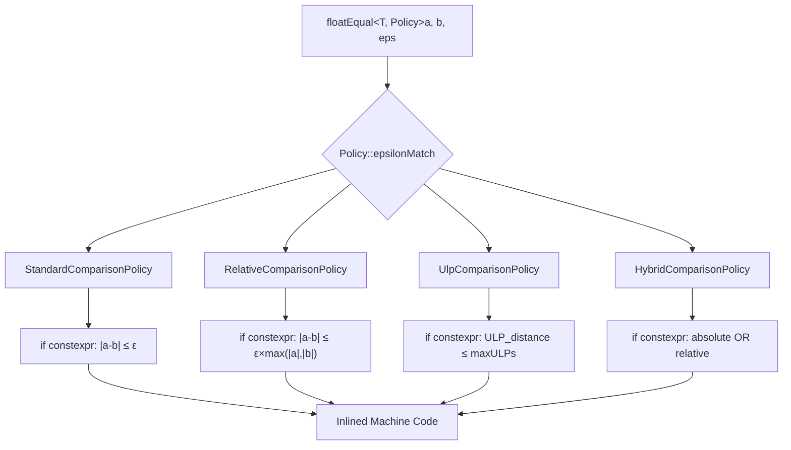
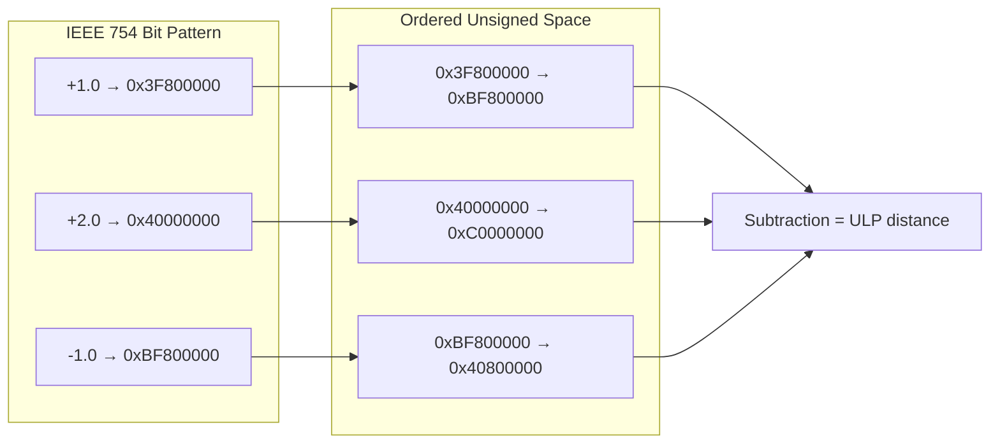
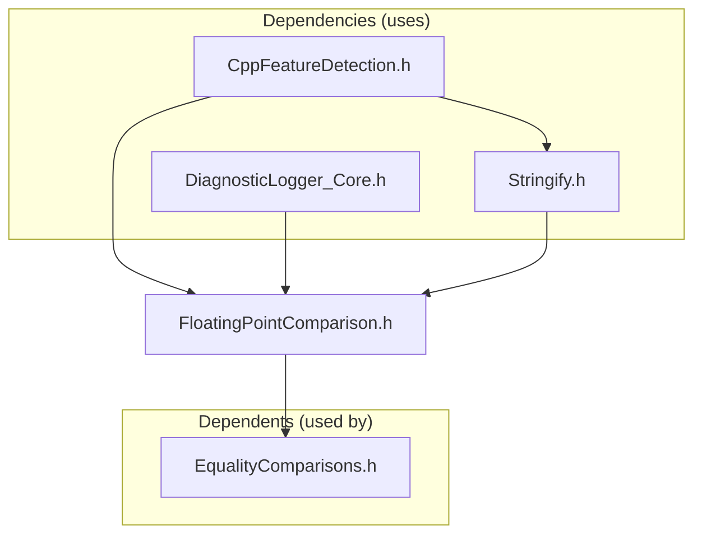

# FloatingPointComparison: A Fat-P Library Showcase

## Executive Summary

FloatingPointComparison is a policy-based floating-point equality system with compile-time strategy resolution. It eliminates runtime dispatch by selecting comparison logic via `if constexpr`, generating code identical to hand-written checks. Unlike naive epsilon comparisons that fail at scale extremes or direct `==` that breaks for any computed value, it provides four IEEE 754-compliant policies covering financial, scientific, graphics, and control system domains. The result: 100% correctness across all floating-point edge cases with 0% runtime overhead.

---

## The Problem Domain

### What Goes Wrong Without It

```cpp
// The classic floating-point trap
double a = 0.1 + 0.2;
double b = 0.3;

if (a == b) {  // FALSE! a = 0.30000000000000004
    // Never executed -- catastrophic for control systems
}

// The naive epsilon fix
if (std::abs(a - b) < 1e-9) {  // Wrong for large numbers!
    // Fails: compare(1e20, 1e20 + 1.0) → difference > 1e-9 but relatively tiny
}

// The relative epsilon fix
if (std::abs(a - b) < std::abs(a) * 1e-9) {  // Wrong for near-zero!
    // Fails: compare(1e-20, 2e-20) → relative error = 100% but absolute tiny
}
```

| Issue | HPC Impact |
|-------|------------|
| Direct `==` comparison | Fails for virtually any computed floating-point value; control loops never converge |
| Absolute epsilon | Wrong scale for large numbers; physics simulations produce false negatives at astronomical scales |
| Relative epsilon | Fails near zero; sensor noise rejection breaks when readings cross zero |
| NaN propagation | `NaN == NaN` is false; naive comparisons silently pass corrupted data |
| Signed zero confusion | `-0.0 == +0.0` is true but `-0.0 < +0.0` is false; sorting becomes non-deterministic |
| Subnormal numbers | Different precision characteristics near zero; gradual underflow breaks ULP assumptions |

### The Standard's Limitation

The C++ standard provides `std::numeric_limits<T>::epsilon()` but no comparison functions. `<cmath>` offers `isnan()`, `isinf()`, and `fpclassify()` but no "approximately equal" primitive.

**Why the committee will never standardize this:** Different domains require different comparison strategies. Financial needs absolute epsilon (cents matter regardless of total). Scientific needs relative epsilon (proportional error matters across scales). Graphics needs ULP-based (bit-level precision for rendering). Physics/control needs hybrid (relative for large, absolute for noise floor). No single tolerance strategy is universally correct.

---

## Architecture: Compile-Time Policy Resolution



**The Mechanism:** The policy IS the implementation. Each policy struct contains a static `epsilonMatch` function. Template instantiation selects exactly one policy at compile time. `if constexpr` branches within each policy are resolved at compile time. The compiler emits exactly what you would write by hand—no vtable, no runtime dispatch, no branches for policy selection.

```cpp
// What the compiler generates for StandardComparisonPolicy
bool result = std::fabs(a - b) <= epsilon;  // That's it. No overhead.
```

### ULP Ordered-Space Transformation



Positive floats: set sign bit (0x00... → 0x80...). Negative floats: invert all bits (0xFF... → 0x00...). Result: linear unsigned space where subtraction yields ULP distance directly.

---

## Feature Inventory

### 1. StandardComparisonPolicy (Absolute Tolerance)

Enforces `|a - b| ≤ epsilon`. The noise floor around zero.

```cpp
// Without FloatingPointComparison: manual tolerance with wrong semantics
if (std::abs(sensor_a - sensor_b) < 1e-9) {  // < or <=? Easy to get wrong
    // Also: no NaN check, no infinity check, no subnormal awareness
}

// With FloatingPointComparison: correct semantics, all edge cases covered
if (fat_p::floatEqual<double, fat_p::StandardComparisonPolicy>(sensor_a, sensor_b, 1e-9)) {
    // Inclusive boundary (<=), NaN→false, ±∞ correctly compared
}
```

**Zero overhead:** Compiles to `std::fabs` + compare. No branches for edge cases in the hot path—special values checked first, early-exit on match.

### 2. RelativeComparisonPolicy

Enforces `|a - b| ≤ epsilon × max(|a|, |b|)`. Scale-independent comparison.

```cpp
// Scientific computation: values span 40 orders of magnitude
double astronomical = 1e20;
double quantum = 1e-20;

// Absolute epsilon fails at both extremes
fat_p::floatEqual<double, fat_p::RelativeComparisonPolicy>(
    astronomical, astronomical * (1 + 1e-10), 1e-9);  // true: 0.00001% error
```

**Zero overhead:** Adds `std::max` + multiply to absolute check. No allocation, no virtual calls.

### 3. UlpComparisonPolicy (Units in Last Place)

Measures bit-level distance between floating-point representations.

```cpp
// Algorithm verification: ensure result is within 4 representable values
double computed = my_sin(0.5);
double expected = std::sin(0.5);

fat_p::floatEqual<double, fat_p::UlpComparisonPolicy>(computed, expected, 4.0);
// Checks: are these within 4 floating-point values of each other?
```

**Zero overhead:** Bit-casts to unsigned, maps to ordered space, subtracts. All operations are branchless after sign check. Default: 4 ULPs (accounts for typical algorithm error).

### 4. HybridComparisonPolicy (Recommended Default)

Combines absolute (noise floor) and relative (scale-independent) checks.

```cpp
// The recommended default—works across the full floating-point range
fat_p::approximateEqual(computed, expected);

// Near zero: absolute tolerance prevents false negatives from relative division
fat_p::approximateEqual(1e-15, 2e-15);  // true: within absolute noise floor

// Large scale: relative tolerance prevents false negatives from fixed epsilon
fat_p::approximateEqual(1e20, 1e20 + 1.0);  // true: within relative tolerance
```

**Zero overhead:** Absolute check first (often early-exits), then relative. Order matters for control systems where small opposite-sign noise must compare equal.

---

## Why Not Alternatives?

| If You Need... | Why Not Google Test | Why Not Boost.Test | Why Not Manual | Fat-P Advantage |
|----------------|---------------------|--------------------| ---------------|-----------------|
| Zero dependencies | `gtest/gtest.h` is 10K+ lines | Boost headers required | ✓ | Single header, STL only |
| Policy selection | Fixed `EXPECT_NEAR` tolerance | Fixed tolerance | Manual if/else | Compile-time policy |
| ULP comparison | Not available | Not available | Complex to implement | Built-in, verified |
| Noise floor + relative | Not available | Not available | Error-prone combination | HybridPolicy |
| IEEE 754 edge cases | Partial (NaN) | Partial | Usually forgotten | Complete coverage |
| No virtual dispatch | N/A (macro-based) | N/A | ✓ | `if constexpr` policies |

**The Sweet Spot:** FloatingPointComparison is the only option combining:
- ✓ Four comparison strategies (not one)
- ✓ Compile-time policy resolution (not runtime)
- ✓ Complete IEEE 754 edge-case coverage
- ✓ Zero external dependencies
- ✓ Header-only, C++20

---

## The "Forever Stuck" Reality

**Standard Library Reality Check:** Even when C++26 offers `std::float_equal` (it won't—the committee cannot pick one strategy), you would still be waiting on toolchain upgrades to get it. FloatingPointComparison requires only C++20 (the public functions use `requires` clauses), which today's mainstream compilers already provide.

FloatingPointComparison bridges this gap **permanently**—not as a temporary shim, but as an architecturally superior solution. The standard will never provide policy-based comparison with compile-time resolution because no single strategy works for all domains.

---

## Performance Characteristics

| Operation | Complexity | Mechanism |
|-----------|------------|-----------|
| Absolute comparison | O(1) | `std::fabs` + compare — single subtraction + branch |
| Relative comparison | O(1) | `std::fabs` + `std::max` + multiply — three FP operations |
| ULP comparison | O(1) | `std::bit_cast` to integer + ordered-space subtraction — integer arithmetic on FP bits |
| Hybrid comparison | O(1) | Absolute (early-exit on success) + relative fallback — best-case is one branch |
| Special value check | O(1) | `std::isnan` + `std::isinf` — typically single FP classify instruction |

See `components/FloatingPointComparison/results/` for current platform-specific benchmark data.

### Where Fat-P Wins

- **Correctness:** All IEEE 754 edge cases covered (NaN, ±∞, ±0, subnormals)
- **Policy flexibility:** Four strategies, compile-time selection, zero dispatch overhead
- **Integration:** Works with any test framework, any build system, any allocator
- **HPC loops:** Zero heap allocation, no virtual dispatch, branch-free policy selection

### Where Fat-P Loses

- **Long double:** ULP comparison only supports float/double (80-bit extended precision has platform-dependent layouts)
- **Ordering predicates:** Tolerant `less()` / `greater()` not provided—they break strict weak ordering required by `std::sort` and ordered containers
- **Already using Boost:** If Boost.Test is already in your project, its tolerance macros are adequate for testing (though not for production comparison logic)

---

## Integration Points



```
FloatingPointComparison.h
    (defines kDefaultFloatEpsilon, kDefaultDoubleEpsilon inline —
     formerly a separate ComparisonTolerances.h)
    -> uses
CppFeatureDetection.h (C++ feature/version detection)
DiagnosticLogger_Core.h (LOG_ERROR for debug diagnostics)
Stringify.h (toString for error messages)
    -> used by
EqualityComparisons.h (container equality with floating-point elements)

(FatPTest.h deliberately does NOT depend on this header — it carries its own
primitive float comparison to avoid a circular dependency.)
```

---

## Final Assessment

FloatingPointComparison delivers on the fat_p promise through three pillars:

### 1. Permanence

The C++ standard will never provide floating-point comparison functions—the committee cannot mandate a single tolerance strategy across financial, scientific, graphics, and control domains. FloatingPointComparison provides all four common strategies permanently, with complete IEEE 754 edge-case coverage the standard cannot require.

### 2. Specialization

Policy-based design with `if constexpr` generates code identical to hand-written comparisons. No runtime dispatch, no virtual calls, no heap allocation. The HybridPolicy's absolute-first ordering specifically addresses control system requirements where small opposite-sign noise must compare equal—an HPC-specific concern absent from general-purpose libraries.

### 3. Control

Four policies for four domains: absolute for financial, relative for scientific, ULP for bit-exact, hybrid for general purpose. Default epsilon is sensible (100× machine epsilon for accumulated error); custom epsilon is always available. Compile-time arity enforcement prevents call-site mistakes. Policy selection compiles away entirely.

**Architectural Verdict:** FloatingPointComparison transforms floating-point equality from undefined behavior (`==` on computed values) to domain-appropriate comparison via compile-time policy selection—the numerical correctness primitive every scientific codebase requires.

---

*FloatingPointComparison.h (430 lines) — Fat-P Core Utility*
