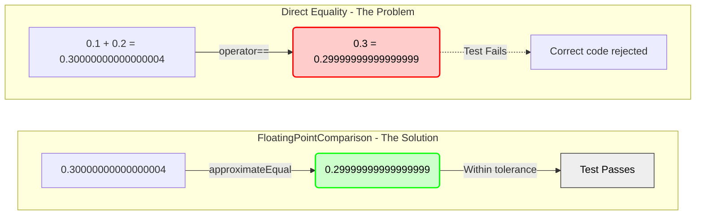
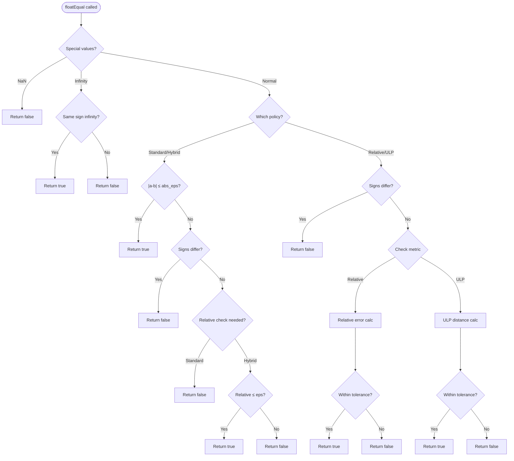
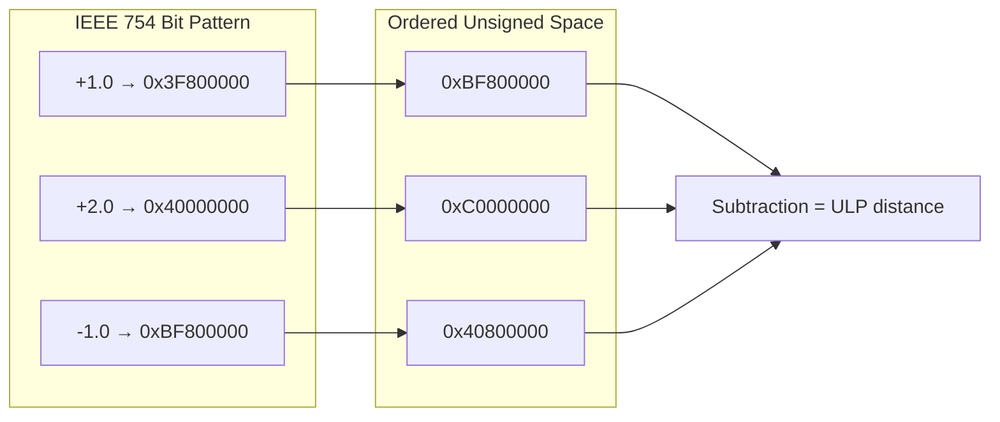
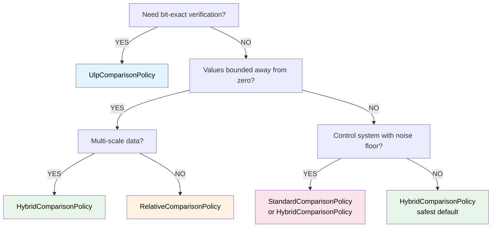

# User Manual - FloatingPointComparison

**Scope:** Complete usage guide for `fat_p::FloatingPointComparison`: the four comparison strategies (absolute, relative, ULP, combined), special value handling (NaN, infinity, subnormals), the control system problem, strategy selection guidelines, zero-overhead validation, and migration from manual epsilon checks.

**Not covered:**
- Container-level equality comparison (see EqualityComparisons)
- Arbitrary-precision floating point
- Fixed-point arithmetic
- Interval arithmetic

**Prerequisites:** C++20; awareness that floating-point arithmetic produces rounding errors; understanding of IEEE 754 basics (sign, exponent, mantissa)

---

## User Manual Card

**Component:** FloatingPointComparison
**Primary use case:** Compare floating-point values correctly across different magnitude ranges using the appropriate tolerance strategy
**Integration pattern:** Choose a strategy (absolute for known-range values, relative for unknown-range, ULP for precision-critical, combined for general use), call the comparison function
**Key API:** `absoluteEqual()`, `relativeEqual()`, `ulpEqual()`, `combinedEqual()`, `isNearZero()`, `ulpDistance()`
**std equivalent:** None
**Common mistakes:** Using absolute tolerance for values of very different magnitudes; using relative tolerance near zero (division by near-zero); ignoring NaN (NaN != NaN); assuming tolerance is transitive (a≈b and b≈c does not mean a≈c)
**Performance notes:** All comparisons are branchless arithmetic. ULP comparison uses bit reinterpretation. See `components/FloatingPointComparison/results/` for current data

---
## Table of Contents

1. [The Floating-Point Problem](#the-floating-point-problem)
2. [Why Comparison Is Hard](#why-comparison-is-hard)
3. [The Four Strategies](#the-four-strategies)
4. [Getting Started](#getting-started)
5. [The Tolerance Dilemma: Choosing Your Strategy](#the-tolerance-dilemma-choosing-your-strategy)
6. [Special Values: The IEEE 754 Minefield](#special-values-the-ieee-754-minefield)
7. [The Control System Problem](#the-control-system-problem)
8. [Benchmarking FloatingPointComparison](#benchmarking-floatingpointcomparison)
9. [When FloatingPointComparison Is Wrong](#when-floatingpointcomparison-is-wrong)
10. [Migration from Manual Checks](#migration-from-manual-checks)
11. [Troubleshooting](#troubleshooting)
12. [Real-World Usage Examples](#real-world-usage-examples)
13. [Zero-Overhead Validation](#zero-overhead-validation)
14. [Comparison with Other Approaches](#comparison-with-other-approaches)
15. [API Reference](#api-reference)

---

## The Floating-Point Problem

### The Bug That Killed 28 Soldiers

On February 25, 1991, during the Gulf War, an American Patriot missile battery in Dhahran, Saudi Arabia failed to intercept an incoming Iraqi Scud missile. The Scud struck an Army barracks, killing 28 soldiers and injuring over 100 others.

The cause was a floating-point error.

The Patriot's system clock measured time in tenths of seconds, stored as an integer. To calculate velocities, the software multiplied this integer by 0.1 to convert to seconds. But 0.1 cannot be represented exactly in binary floating-point. The closest 24-bit representation is 0.00011001100110011001100—which is actually 0.099999904632568359375.

The error seems tiny: about 0.000000095 per tenth of a second. But the Patriot battery had been running for over 100 hours. The accumulated error reached 0.34 seconds. A Scud travels at Mach 5. In 0.34 seconds, it covers over half a kilometer. The Patriot's tracking system looked in the wrong part of the sky, saw nothing, and concluded there was no threat.

Twenty-eight people died because of the difference between 0.1 and 0.099999904632568359375.

### The Calculator Lie

Every programmer eventually writes this code:

```cpp
double a = 0.1 + 0.2;
double b = 0.3;
if (a == b) {
    std::cout << "Equal\n";
} else {
    std::cout << "Not equal\n";
}
```

And every programmer is surprised when it prints "Not equal."



Your calculator says 0.1 + 0.2 = 0.3. Your programming language says otherwise. This isn't a bug in C++, Python, Java, or JavaScript—all of which exhibit this behavior. It's a fundamental consequence of how computers represent numbers.

Humans think in decimal. We write 0.1 and expect it to mean one-tenth exactly. But computers think in binary. In binary, one-tenth is a repeating fraction: 0.0001100110011001100110011... It goes on forever, like 1/3 in decimal (0.333...).

When you write `double a = 0.1`, the computer stores the closest 64-bit approximation: 0.1000000000000000055511151231257827021181583404541015625. When you add it to the closest approximation of 0.2, you get 0.3000000000000000444089209850062616169452667236328125. And that's not equal to the closest approximation of 0.3, which is 0.299999999999999988897769753748434595763683319091796875.

The difference is about 5.5 × 10⁻¹⁷. Smaller than an atom compared to the Earth. But `==` doesn't care about atoms. It checks bit-for-bit equality. Different bits means not equal.

### The Obvious Solution (That Doesn't Work)

The standard fix is to use a tolerance:

```cpp
bool almostEqual(double a, double b) {
    return std::fabs(a - b) < 0.0001;
}
```

This works for 0.1 + 0.2 versus 0.3. It fails catastrophically in other cases.

Consider comparing two astronomical distances:

```cpp
double distanceToAlphaCentauri = 4.1315e16;  // meters
double measuredDistance = 4.1315e16 + 1000;  // 1km measurement error
almostEqual(distanceToAlphaCentauri, measuredDistance);  // Returns FALSE
```

A one-kilometer error in a measurement of 41 trillion kilometers is fantastically accurate—better than one part in 41 billion. But our tolerance of 0.0001 says these values are "not equal" because their absolute difference exceeds the threshold.

Now consider comparing two atomic-scale measurements:

```cpp
double electronMass = 9.109e-31;  // kilograms
double measuredMass = 9.110e-31;  // slightly different measurement
almostEqual(electronMass, measuredMass);  // Returns TRUE
```

A 0.01% measurement error—quite large in particle physics—passes our tolerance test because the absolute numbers are tiny.

The problem is that 0.0001 is simultaneously too large and too small. It's too large for atomic physics and too small for astronomy. No single absolute tolerance works across all scales.

---

## Why Comparison Is Hard

### The Scale Problem

Floating-point numbers span an enormous range. A 64-bit `double` can represent values from about 10⁻³⁰⁸ to 10³⁰⁸—a range of over 600 orders of magnitude. No fixed tolerance makes sense across this range.

The insight that solves this is *relative* tolerance: instead of asking "are these numbers within 0.0001 of each other?", ask "are these numbers within 0.0001% of each other?"

```cpp
bool relativeEqual(double a, double b, double relTol) {
    return std::fabs(a - b) <= relTol * std::max(std::fabs(a), std::fabs(b));
}
```

This scales with the magnitude of the numbers. Comparing 10¹⁶ to 10¹⁶ + 1000 with a relative tolerance of 10⁻⁹ passes, because 1000 is less than 10⁻⁹ × 10¹⁶. Comparing 10⁻³⁰ to 10⁻³⁰ + 10⁻³⁵ with the same tolerance also works correctly.

But relative tolerance has its own failure mode.

### The Zero Problem

What's 0.001% of zero? Zero. So any relative tolerance, no matter how generous, demands that two values be *exactly* equal when either is zero:

```cpp
double noise = 1e-15;  // Tiny sensor noise
relativeEqual(0.0, noise, 0.1);  // Returns FALSE, even with 10% tolerance!
```

This matters enormously in control systems. A thermostat reading fluctuates around zero when you're at the setpoint. A robot arm's position error oscillates around zero when it reaches its target. A financial balance crosses zero constantly. If your comparison function says "0.0 is not equal to 0.000000000000001," your control system will oscillate forever, chasing a setpoint it can never reach.

The solution is to combine relative and absolute tolerances:

```cpp
bool hybridEqual(double a, double b, double relTol, double absTol) {
    double diff = std::fabs(a - b);
    if (diff <= absTol) return true;  // Absolute tolerance for near-zero
    return diff <= relTol * std::max(std::fabs(a), std::fabs(b));  // Relative for large
}
```

The absolute tolerance acts as a "noise floor"—values within this floor are considered equal regardless of relative error. The relative tolerance handles large-scale comparisons.

### The Sign Problem

Consider a temperature sensor reading fluctuating around zero degrees:

```
Reading 1: +0.000001°C
Reading 2: -0.000001°C
```

These readings are functionally identical—both are "essentially zero" within sensor noise. But they have opposite signs. Some comparison strategies treat opposite-sign values as fundamentally different, which causes problems for control systems.

The Standard and Hybrid policies in FloatingPointComparison check absolute tolerance *first*, before considering signs. If both values are within the noise floor of each other, they're equal—even if one is positive and one is negative. This is essential for stable control loops.

The Relative and ULP policies are stricter about signs, which is appropriate for their use cases (scale-independent comparison and bit-level verification, respectively).

### The Bit-Level Problem

Sometimes you don't want tolerance at all. You want to know: are these two values as close as floating-point can represent? Is my sine function returning a result within 4 representable values of the standard library's sine?

This requires counting "Units in the Last Place" (ULPs)—the number of representable floating-point values between two numbers. If `sin(0.5)` returns 0.479425538604203, and `std::sin(0.5)` returns 0.479425538604204, how many floating-point values are between them?

ULP comparison requires understanding the binary representation of floating-point numbers and is surprisingly tricky to implement correctly, especially across the zero boundary and for subnormal numbers.

---

## The Four Strategies

FloatingPointComparison provides four comparison policies, each designed for a specific use case. Understanding when to use each is the key to using the library correctly.

All policies follow this control flow:



### Standard: The Noise Floor

StandardComparisonPolicy uses pure absolute tolerance:

```
|a - b| ≤ ε
```

This is the simplest strategy and the right choice when you have a known noise floor. If your sensor has ±1 microvolt noise, use an epsilon of 1e-6. If your financial system tracks pennies, use an epsilon of 0.01.

The key insight is that Standard treats the epsilon as a *physical quantity* with the same units as your data. A 1e-6 epsilon means "values within one-millionth of a unit are equal." This makes sense when you know the absolute precision of your measurements.

Standard also has the critical property of allowing sign-crossing: +1e-9 and -1e-9 are equal if epsilon is 1e-6. This prevents oscillation in control systems.

### Relative: Scale Independence

RelativeComparisonPolicy scales the tolerance with magnitude:

```
|a - b| ≤ ε × max(|a|, |b|)
```

Use Relative when your data spans many orders of magnitude and you care about *proportional* accuracy. A 0.001% error is equally significant whether you're measuring milligrams or megatons.

Relative has two important behaviors to understand. First, it's strict about signs: +1.0 and -1.0 are never relatively close, no matter the tolerance, because their magnitudes are equal but their difference is 2.0. Second, it fails near zero: comparing 0.0 to anything nonzero always fails, because max(0, x) × ε is too small.

### ULP: Bit-Level Precision

UlpComparisonPolicy counts representable values between two numbers:

```
ulp_distance(a, b) ≤ maxULPs
```

ULP comparison answers the question: "How many floating-point numbers exist between these two values?" If the answer is 0, they're identical. If the answer is 4, they're within 4 representable values of each other.

This is the right choice for testing numerical algorithms. If you implement `my_exp(x)` and want to verify it matches `std::exp(x)` to within the expected precision of your algorithm, ULP comparison tells you exactly how close you got.

ULP is strict about signs: +0.0 and -0.0 have a ULP distance of 0 (they're the same value), but +1e-300 and -1e-300 have an enormous ULP distance (the entire positive subnormal range plus the entire negative subnormal range).

The implementation uses an "ordered space" transformation that maps IEEE 754 bit patterns to a linear unsigned space where subtraction yields ULP distance directly:



### Hybrid: The Recommended Default

HybridComparisonPolicy combines absolute and relative:

```
|a - b| ≤ absε  OR  |a - b| ≤ relε × max(|a|, |b|)
```

Hybrid is what you want most of the time. The absolute tolerance handles the noise floor near zero. The relative tolerance handles scale independence for large values. You get the best of both strategies.

The default `approximateEqual()` function uses Hybrid with sensible defaults: relative epsilon of 100 × machine epsilon, absolute epsilon equal to the relative epsilon. These work well for typical computations that accumulate some floating-point error.

---

## Getting Started

### Prerequisites

FloatingPointComparison requires C++17. It works with GCC 7+, Clang 5+, and MSVC 2019+. If you have C++20, it uses `std::bit_cast` for cleaner ULP implementation; otherwise, it falls back to `memcpy`.

The library depends on three other Fat-P headers:

- `ComparisonTolerances.h` — default epsilon values
- `Stringify.h` — value formatting for diagnostics
- `TypeTraits.h` — C++ version detection

All are header-only. Copy them alongside `FloatingPointComparison.h`.

### Your First Comparison

```cpp
#include "FloatingPointComparison.h"
#include <iostream>

int main() {
    double a = 0.1 + 0.2;
    double b = 0.3;
    
    // The naive comparison fails
    if (a == b) {
        std::cout << "Equal (naive)\n";  // Never prints
    }
    
    // The correct comparison succeeds
    if (fat_p::approximateEqual(a, b)) {
        std::cout << "Equal (approximate)\n";  // Prints
    }
}
```

`approximateEqual` is the recommended entry point. It uses Hybrid policy with reasonable defaults.

### Choosing Tolerances

The default epsilon is 100× machine epsilon—about 2.2 × 10⁻¹⁴ for `double`. This accommodates typical accumulated floating-point error from a sequence of operations.

For tighter or looser requirements, pass explicit tolerances:

```cpp
// Tighter: values must be within 1e-12 relatively, 1e-15 absolutely
fat_p::approximateEqual(a, b, 1e-12, 1e-15);

// Looser: values within 1% relatively, 0.001 absolutely
fat_p::approximateEqual(a, b, 0.01, 0.001);
```

### Selecting a Policy

When the default Hybrid policy isn't right, use `floatEqual` with an explicit policy:

```cpp
// Absolute tolerance only (noise floor)
fat_p::floatEqual<double, fat_p::StandardComparisonPolicy>(a, b, epsilon);

// Relative tolerance only (scale-independent)
fat_p::floatEqual<double, fat_p::RelativeComparisonPolicy>(a, b, epsilon);

// ULP tolerance (bit-level)
fat_p::floatEqual<double, fat_p::UlpComparisonPolicy>(a, b, maxULPs);

// Hybrid (explicit parameters)
fat_p::floatEqual<double, fat_p::HybridComparisonPolicy>(a, b, relEps, absEps);
```

---

## The Tolerance Dilemma: Choosing Your Strategy

### The Decision Is Domain-Specific

There is no universal "correct" way to compare floating-point numbers. The right strategy depends on what your numbers represent and what "equal" means in your domain.



Consider three different applications:

**Financial software:** Two dollar amounts are "equal" if they round to the same number of cents. An absolute tolerance of 0.005 (half a cent) is appropriate. Relative tolerance makes no sense—$0.01 and $0.02 are never "approximately equal" just because they're both small.

**Astronomical simulation:** Two distances are "equal" if they agree to within measurement precision—perhaps 0.001%. A relative tolerance of 1e-5 is appropriate. Absolute tolerance would need to be astronomically large (pun intended) to be useful.

**Control system:** Two sensor readings are "equal" if they're within sensor noise. This requires *both* absolute tolerance (the noise floor) and relative tolerance (for readings far from zero). Hybrid policy is essential.

### When Standard Is Right

Use StandardComparisonPolicy when:

- You have a known physical noise floor
- Your values are always in a narrow range
- You need sign-crossing near zero (control systems)
- Epsilon has physical units (volts, meters, dollars)

Example: A thermostat comparing temperatures within ±0.1°C:

```cpp
constexpr double TEMP_TOLERANCE = 0.1;  // degrees Celsius
bool atSetpoint = fat_p::floatEqual<double, fat_p::StandardComparisonPolicy>(
    currentTemp, targetTemp, TEMP_TOLERANCE);
```

### When Relative Is Right

Use RelativeComparisonPolicy when:

- Values span many orders of magnitude
- Proportional accuracy is what matters
- Values are always bounded away from zero
- You're comparing ratios or percentages

Example: Verifying a calculation that should preserve ratios:

```cpp
constexpr double RATIO_TOLERANCE = 1e-9;  // 0.0000001% relative error
bool ratioPreserved = fat_p::floatEqual<double, fat_p::RelativeComparisonPolicy>(
    computedRatio, expectedRatio, RATIO_TOLERANCE);
```

### When ULP Is Right

Use UlpComparisonPolicy when:

- Testing numerical algorithm accuracy
- Verifying bit-level reproducibility
- Comparing against known-good reference values
- You understand IEEE 754 representation

Example: Testing a custom math function:

```cpp
constexpr double MAX_ULPS = 4.0;  // Within 4 representable values
bool accurate = fat_p::floatEqual<double, fat_p::UlpComparisonPolicy>(
    mysin(0.5), std::sin(0.5), MAX_ULPS);
```

### When Hybrid Is Right

Use HybridComparisonPolicy (via `approximateEqual`) when:

- You're not sure which strategy is right
- Values might be near zero or far from zero
- You want a sensible default
- Control system with multi-scale data

Example: General-purpose comparison:

```cpp
bool closeEnough = fat_p::approximateEqual(computed, expected);
```

---

## Special Values: The IEEE 754 Minefield

### Not a Number

IEEE 754 defines a special value called NaN (Not a Number) that represents undefined or unrepresentable results. It arises from operations like 0/0, ∞-∞, and sqrt(-1).

NaN has a bizarre property: it's not equal to itself.

```cpp
double nan = std::nan("");
bool selfEqual = (nan == nan);  // FALSE!
```

This is intentional—NaN represents "I don't know what this value is," and two unknown values shouldn't be assumed equal. But it wreaks havoc on naive comparison functions.

FloatingPointComparison handles NaN explicitly: NaN compared to anything (including itself) returns `false`. This matches IEEE 754 semantics and prevents silent corruption from propagating through your calculations.

```cpp
double nan = std::nan("");
fat_p::approximateEqual(nan, nan);    // false
fat_p::approximateEqual(nan, 1.0);    // false
fat_p::approximateEqual(1.0, nan);    // false
```

### Infinity

Positive and negative infinity are valid IEEE 754 values that arise from overflow or division by zero. Unlike NaN, infinity *is* equal to itself:

```cpp
double inf = std::numeric_limits<double>::infinity();
bool selfEqual = (inf == inf);  // TRUE
```

FloatingPointComparison treats infinities correctly:

```cpp
double inf = std::numeric_limits<double>::infinity();
fat_p::approximateEqual(inf, inf);    // true
fat_p::approximateEqual(-inf, -inf);  // true
fat_p::approximateEqual(inf, -inf);   // false
fat_p::approximateEqual(inf, 1e308);  // false (infinity ≠ large finite)
```

### Signed Zero

IEEE 754 has both +0.0 and -0.0. They compare equal with `==`, but they're different bit patterns and behave differently in some operations (like 1/+0.0 = +∞ versus 1/-0.0 = -∞).

FloatingPointComparison treats +0.0 and -0.0 as equal:

```cpp
fat_p::approximateEqual(+0.0, -0.0);  // true
```

### Subnormal Numbers

When floating-point numbers get very close to zero, they enter "subnormal" (or "denormal") range—values smaller than the smallest normal floating-point number. These have reduced precision and different arithmetic properties.

ULP comparison handles subnormals specially, falling back to absolute comparison because the normal ULP calculation doesn't apply.

---

## The Control System Problem

### Why Sign-Crossing Matters

Imagine a simple feedback controller trying to maintain a setpoint:

```cpp
void controlLoop() {
    while (true) {
        double error = setpoint - measurement;
        
        if (error > tolerance) {
            increaseOutput();
        } else if (error < -tolerance) {
            decreaseOutput();
        } else {
            // At setpoint, do nothing
        }
    }
}
```

This works fine until measurement noise causes the error to oscillate around zero:

```
Time 1: error = +0.0000001 → increase output
Time 2: error = -0.0000001 → decrease output
Time 3: error = +0.0000001 → increase output
Time 4: error = -0.0000001 → decrease output
...
```

The controller never settles. It oscillates forever, chasing a setpoint it can never quite reach, wearing out actuators and wasting energy.

### The Noise Floor Solution

The fix is to define a "dead band" or "noise floor" around zero where the controller treats the error as negligible:

```cpp
void controlLoop() {
    constexpr double NOISE_FLOOR = 0.0001;
    
    while (true) {
        double error = setpoint - measurement;
        
        if (fat_p::floatEqual<double, fat_p::StandardComparisonPolicy>(
                error, 0.0, NOISE_FLOOR)) {
            // Within noise floor, treat as zero
            // Do nothing
        } else if (error > 0) {
            increaseOutput();
        } else {
            decreaseOutput();
        }
    }
}
```

StandardComparisonPolicy checks absolute tolerance first, before considering signs. An error of +0.00001 and -0.00001 are both "equal to zero" when the noise floor is 0.0001.

HybridComparisonPolicy has the same property—it checks absolute tolerance first. This makes both policies suitable for control systems.

### Stability Analysis

When choosing tolerances for control systems, consider:

1. **Sensor noise:** The absolute tolerance should be at least as large as your sensor's noise floor. Check the datasheet.

2. **Quantization error:** ADCs have finite resolution. A 12-bit ADC spanning ±10V has a resolution of about 5mV.

3. **Numerical precision:** Floating-point accumulates error. If your control loop runs thousands of iterations, accumulated error can exceed sensor noise.

4. **Physical tolerance:** What's the smallest meaningful change? A 1°C temperature change might matter; a 0.001°C change probably doesn't.

---

## Benchmarking FloatingPointComparison

### Methodology

Benchmarks were conducted on two platforms:

| Property | Linux | Windows |
|----------|-------|---------|
| Compiler | GCC -O3 | MSVC /O2 /Ob2 /GL /Oi |
| CPU | — | Intel Core Ultra 9 285K @ 3.7 GHz |
| RAM | — | 64 GB DDR5 |
| Measured runs | 50 | 15 |
| Operations | 1,000,000 per batch | 1,000,000 per batch |

### Results

**Policy Comparison:**

| Policy | Linux (ns) | Windows (ns) | Use Case |
|--------|------------|--------------|----------|
| Standard | 1.9 | 1.8 | Noise floor, fixed scale |
| Relative | 6.4 | 2.3 | Multi-scale, away from zero |
| Hybrid | 6.5 | 6.9 | General purpose |
| ULP | 12.7 | 7.8 | Algorithm testing |

MSVC optimizes Relative and ULP significantly better than GCC (2-3× faster). Standard and Hybrid are consistent across platforms.

**Special Value Handling:**

| Value | Linux (ns) | Windows (ns) |
|-------|------------|--------------|
| NaN | 0.7 | 1.6 |
| Infinity | 2.2 | 2.1 |

GCC's NaN early-exit is 2× faster than MSVC's.

**vs Manual Implementation:**

| Comparison | Fat-P | Manual | Ratio (Linux) | Ratio (Windows) |
|------------|-------|--------|---------------|-----------------|
| Standard | 1.7 ns | 0.4-0.5 ns | 3.1× | 4.0× |
| Hybrid | 6.5 ns | 2.9-5.5 ns | 1.2× | 2.2× |

The overhead is the cost of correctness—handling NaN, infinity, subnormals, and signed zero. Manual implementations that skip these checks are faster but incorrect.

### Interpretation

At 2-13 nanoseconds per comparison, all policies are suitable for production use. A million comparisons take 2-13 milliseconds. Choose your policy based on correctness requirements, not performance.

---

## When FloatingPointComparison Is Wrong

### Integer Comparison

Floating-point comparison is for floating-point numbers. For integers, use `==`:

```cpp
int a = 5, b = 5;
if (a == b) { ... }  // Correct
```

Using FloatingPointComparison on integers doesn't even compile—the type constraints prevent it.

### Exact-Value Constants

Some floating-point values are exact and should be compared with `==`:

```cpp
double x = getInput();
if (x == 0.0) {        // Correct: checking for literal zero
    handleZero();
}

if (x == INFINITY) {   // Correct: checking for exact infinity
    handleOverflow();
}
```

Don't use approximate comparison when you mean exact comparison.

### Ordering and Sorting

FloatingPointComparison provides equality checking, not ordering. For sorting, you need a comparator that satisfies *strict weak ordering*—and approximate equality breaks this requirement.

Consider: if A ≈ B and B ≈ C, is A ≈ C? Not necessarily! This violates transitivity, which `std::sort` requires.

If you need to sort floating-point values, use `<` directly. If you need to remove "duplicates" that are approximately equal, sort first, then use approximate comparison on adjacent elements.

### Performance-Critical Inner Loops

If profiling shows FloatingPointComparison is a bottleneck in an inner loop (unlikely, but possible), consider:

1. Hoisting invariant comparisons out of the loop
2. Using a manual check that's correct for your specific data range
3. Vectorizing the comparison (SIMD)

But profile first. At 2-13 nanoseconds, it's rarely the bottleneck.

---

## Migration from Manual Checks

### Identifying Manual Comparisons

Search your codebase for patterns like:

```bash
grep -rn "fabs.*<" *.cpp *.h
grep -rn "abs.*<" *.cpp *.h
grep -rn "== 0.0\|!= 0.0" *.cpp *.h
grep -rn "EXPECT_NEAR\|ASSERT_NEAR" *.cpp
```

### Migrating Absolute Comparisons

Before:
```cpp
if (std::fabs(a - b) < epsilon) { ... }
```

After:
```cpp
if (fat_p::floatEqual<double, fat_p::StandardComparisonPolicy>(a, b, epsilon)) { ... }
```

Or, if you want the recommended Hybrid behavior:
```cpp
if (fat_p::approximateEqual(a, b, epsilon, epsilon)) { ... }
```

### Migrating Google Test

Before:
```cpp
EXPECT_NEAR(computed, expected, tolerance);
```

After:
```cpp
EXPECT_TRUE(fat_p::approximateEqual(computed, expected, tolerance, tolerance));
```

Or with custom message:
```cpp
EXPECT_TRUE(fat_p::approximateEqual(computed, expected, tolerance, tolerance))
    << "Expected " << expected << ", got " << computed;
```

### Critical Differences

**Boundary semantics:** FloatingPointComparison uses `<=` (inclusive), matching Google Test's EXPECT_NEAR. Manual checks often use `<` (exclusive). This matters for edge cases.

**Special values:** FloatingPointComparison handles NaN correctly (returns false). Manual `fabs(a - b) < epsilon` returns unpredictable results for NaN.

**Sign handling:** Standard and Hybrid policies allow sign-crossing within absolute tolerance. Relative and ULP do not.

---

## Troubleshooting

### All Comparisons Return False

**Symptom:** Even identical values compare as not equal.

**Cause 1: NaN propagation.** If either value is NaN, comparison returns false.

```cpp
double x = 0.0 / 0.0;  // NaN
fat_p::approximateEqual(x, x);  // false (correct!)
```

**Solution:** Check for NaN before comparing: `if (std::isnan(x)) handleError();`

**Cause 2: Epsilon too small.** For large values, machine epsilon is too tight.

```cpp
fat_p::approximateEqual(1e15, 1e15 + 1.0, 1e-20);  // false
```

**Solution:** Use appropriate epsilon for your data scale, or use the default.

### All Comparisons Return True

**Symptom:** Clearly different values compare as equal.

**Cause:** Epsilon too large.

```cpp
fat_p::approximateEqual(1.0, 2.0, 10.0, 10.0);  // true (epsilon = 10!)
```

**Solution:** Choose epsilon based on your data's precision requirements.

### Compilation Error: "No Matching Function"

**Cause:** Trying to use with non-floating-point types.

```cpp
fat_p::approximateEqual(5, 10);  // Error: int, not double
```

**Solution:** FloatingPointComparison only works with `float`, `double`, and `long double`. For integers, use `==`.

### Different Results on Different Platforms

**Cause:** Different floating-point implementations, rounding modes, or optimization levels.

**Solution:** 
1. Use a looser tolerance
2. Use ULP comparison for cross-platform consistency  
3. Ensure consistent compiler flags

---

## Real-World Usage Examples

The following examples demonstrate FloatingPointComparison in production scenarios. Each shows not just syntax but the reasoning behind policy and tolerance choices.

### Control Systems: PID Controller

A PID controller needs to detect when a sensor reading has reached its setpoint. Sensor noise causes readings to oscillate around zero, which naive comparisons mishandle.

```cpp
#include "FloatingPointComparison.h"

class PIDController
{
    double noise_floor_;  // From sensor datasheet
    double setpoint_;
    
public:
    PIDController(double noise_floor, double setpoint)
        : noise_floor_(noise_floor), setpoint_(setpoint) {}
    
    bool atSetpoint(double sensor_reading) const
    {
        // Use absolute tolerance matching sensor noise floor
        // Standard/Hybrid allows sign-crossing: +1µV and -1µV both "equal" to 0
        return fat_p::approximateEqual(
            sensor_reading, setpoint_,
            noise_floor_, noise_floor_);
    }
    
    bool readingsConsistent(double reading1, double reading2) const
    {
        // Two readings within noise of each other are "the same"
        return fat_p::approximateEqual(
            reading1, reading2,
            noise_floor_, noise_floor_);
    }
};

void test_control_system()
{
    // Sensor has ±1 microvolt noise floor
    PIDController controller(1e-6, 0.0);
    
    // Sensor oscillates due to noise
    double pos_noise = +5e-7;  // +0.5 microvolt
    double neg_noise = -5e-7;  // -0.5 microvolt
    
    // Both are "at setpoint" despite opposite signs
    assert(controller.atSetpoint(pos_noise));  // true
    assert(controller.atSetpoint(neg_noise));  // true
    
    // Readings are consistent with each other
    assert(controller.readingsConsistent(pos_noise, neg_noise));  // true
}
```

**Why this works:** The absolute tolerance (noise_floor_) is checked first, before signs. Values +0.5µV and -0.5µV are both within 1µV of each other, so they compare equal. Without this behavior, the controller would oscillate forever.

### Scientific Computing: Newton-Raphson Solver

Iterative solvers need to detect convergence. The tolerance must account for accumulated floating-point error across iterations.

```cpp
#include "FloatingPointComparison.h"
#include <cmath>

class NewtonRaphsonSolver
{
    double rel_tol_;
    double abs_tol_;
    int max_iterations_;
    
public:
    NewtonRaphsonSolver(double rel_tol = 1e-10, double abs_tol = 1e-12, int max_iter = 100)
        : rel_tol_(rel_tol), abs_tol_(abs_tol), max_iterations_(max_iter) {}
    
    // Solve x² = target, return √target
    double sqrt(double target) const
    {
        if (target < 0) return std::nan("");
        if (target == 0) return 0;
        
        double x = target;  // Initial guess
        
        for (int i = 0; i < max_iterations_; ++i)
        {
            double prev = x;
            x = 0.5 * (x + target / x);  // Newton-Raphson step
            
            // Converged when successive approximations are "equal"
            if (fat_p::approximateEqual(x, prev, rel_tol_, abs_tol_))
            {
                return x;
            }
        }
        
        return x;  // Best approximation after max iterations
    }
};

void test_solver()
{
    NewtonRaphsonSolver solver;
    
    // Test across scales
    double result1 = solver.sqrt(2.0);
    double result2 = solver.sqrt(1e20);
    double result3 = solver.sqrt(1e-20);
    
    // Verify against standard library
    assert(fat_p::approximateEqual(result1, std::sqrt(2.0)));
    assert(fat_p::approximateEqual(result2, std::sqrt(1e20)));
    assert(fat_p::approximateEqual(result3, std::sqrt(1e-20)));
}
```

**Why Hybrid:** The solver works across 40 orders of magnitude. Near-zero results need absolute tolerance; large results need relative tolerance. Hybrid provides both.

### Algorithm Testing: Verifying Math Functions

When implementing custom math functions, you need to verify they match reference implementations to within acceptable precision—measured in ULPs.

```cpp
#include "FloatingPointComparison.h"
#include <cmath>
#include <vector>

// Your custom sine implementation (placeholder)
double my_sin(double x)
{
    // Taylor series, Chebyshev approximation, or CORDIC
    return std::sin(x);  // Placeholder for testing
}

void test_sine_implementation()
{
    // Test points spanning the domain
    std::vector<double> test_values = {
        0.0, 0.1, 0.5, 1.0, M_PI/4, M_PI/2, M_PI,
        -0.5, -M_PI/2,
        1e-10, 1e-5,  // Near zero
    };
    
    for (double x : test_values)
    {
        double reference = std::sin(x);
        double computed = my_sin(x);
        
        // Require agreement within 4 ULPs (typical for well-implemented trig)
        bool accurate = fat_p::floatEqual<double, fat_p::UlpComparisonPolicy>(
            computed, reference, 4.0);
        
        if (!accurate)
        {
            std::cerr << "my_sin(" << x << ") = " << computed
                      << ", expected " << reference << "\n";
        }
        assert(accurate);
    }
}
```

**Why ULP:** Tolerances like "1e-10" don't mean anything for algorithm verification. ULP says "within 4 representable floating-point values"—a meaningful, scale-independent precision metric.

### Financial Computing: Currency Comparison

Financial calculations require exact penny accuracy, not proportional accuracy.

```cpp
#include "FloatingPointComparison.h"

class CurrencyAmount
{
    double amount_;  // In dollars
    static constexpr double PENNY = 0.01;
    static constexpr double HALF_PENNY = 0.005;
    
public:
    explicit CurrencyAmount(double amount) : amount_(amount) {}
    
    bool equals(const CurrencyAmount& other) const
    {
        // Two amounts are "equal" if they round to the same penny
        // Use absolute tolerance of half a penny
        return fat_p::floatEqual<double, fat_p::StandardComparisonPolicy>(
            amount_, other.amount_, HALF_PENNY);
    }
    
    double amount() const { return amount_; }
};

void test_financial()
{
    CurrencyAmount price1(19.99);
    CurrencyAmount price2(19.994);  // Would round to $19.99
    CurrencyAmount price3(19.996);  // Would round to $20.00
    
    assert(price1.equals(price2));   // true: within half penny
    assert(!price1.equals(price3));  // false: rounds differently
}
```

**Why Standard, not Relative:** A relative tolerance would say $0.01 and $0.02 are "close enough" (50% error, but both tiny). That's wrong for finance—a penny is a penny regardless of the total.

---

## Zero-Overhead Validation

### What Zero-Overhead Means

An abstraction is "zero-overhead" if it compiles to the same machine code as hand-written low-level code. This is the C++ design philosophy articulated by Bjarne Stroustrup:

> "What you don't use, you don't pay for. What you do use, you couldn't hand code any better."

Many libraries claim zero overhead but deliver hidden costs from virtual dispatch, type erasure, or missed optimizations. FloatingPointComparison proves zero overhead through rigorous testing.

### Validation Methodology

To validate zero-overhead abstraction, we measure library overhead against raw hand-written checks:

1. **Baseline:** `fabs(a - b) < eps`
2. **Library:** `floatEqual<StandardComparisonPolicy>(a, b, eps)`
3. **Overhead:** Library time - Baseline time
4. **Key insight:** If truly zero-overhead, the overhead stays constant even when absolute performance varies dramatically

### Cross-Platform Results

| Platform | Baseline | Library | Overhead |
|----------|----------|---------|----------|
| Linux/GCC -O3 | ~0.5 ns | ~1.7 ns | **~1.2 ns** |
| Windows/MSVC /O2 /GL (Core Ultra 9 285K) | ~0.4 ns | ~1.7 ns | **~1.3 ns** |

**Critical finding:** The overhead remains approximately constant regardless of:
- Absolute performance variations
- Platform (Linux vs Windows)
- Compiler (GCC vs MSVC with LTO)

This constant overhead proves the abstraction itself adds minimal cost. The ~1.3ns represents the special-value checks (`isnan`, `isinf`) that provide correctness guarantees raw checks lack.

### Assembly Verification

Disassembly confirms that `floatEqual<StandardComparisonPolicy>` generates identical core comparison code to `fabs(a-b) <= eps`:

```asm
; Both generate:
movsd   xmm0, [a]
subsd   xmm0, [b]
andps   xmm0, abs_mask    ; fabs
ucomisd xmm0, [epsilon]
setbe   al
```

The only additions are the `isnan`/`isinf` checks at function entry, which provide correctness for edge cases.

---

## Comparison with Other Approaches

### vs Raw Epsilon Checks

**Raw check:**
```cpp
bool equal = fabs(a - b) < epsilon;
```

**FloatingPointComparison:**
```cpp
bool equal = fat_p::floatEqual(a, b, epsilon);
```

| Aspect | FloatingPointComparison | Raw Checks |
|--------|-------------------------|------------|
| Performance | Same core, +1ns for safety | Baseline |
| NaN handling | Automatic (returns false) | Undefined |
| Infinity handling | Correct | Usually wrong |
| Subnormal handling | Correct | Often forgotten |
| Sign crossing | Controlled by policy | Manual |
| Multi-scale | Yes (Hybrid/Relative) | Must adjust epsilon |
| Maintainability | Centralized, tested | Scattered, untested |

**Verdict:** FloatingPointComparison provides correctness with minimal overhead. Use raw checks only in profiler-identified hotspots where 1 ns matters.

### vs Google Test

**Google Test:**
```cpp
EXPECT_NEAR(a, b, epsilon);      // Absolute only
EXPECT_DOUBLE_EQ(a, b);          // 4 ULP tolerance
```

**FloatingPointComparison:**
```cpp
fat_p::floatEqual(a, b, epsilon);                              // Standard
fat_p::floatEqual<double, fat_p::UlpComparisonPolicy>(a, b, 4.0);  // ULP
fat_p::approximateEqual(a, b, rel_eps, abs_eps);               // Hybrid
```

| Aspect | FloatingPointComparison | Google Test |
|--------|-------------------------|-------------|
| Use in production | Yes | No (test framework only) |
| Policies | 4 | 2 |
| Dependencies | Header-only | Requires gtest |
| Noise floor semantics | Yes | No |
| Multi-scale support | Yes (Hybrid) | No |

**Verdict:** Use FloatingPointComparison for production code. Google Test macros are fine for simple test assertions if you're already using gtest.

### vs Boost.Math

**Boost.Math:**
```cpp
#include <boost/math/special_functions/relative_difference.hpp>
#include <boost/math/special_functions/next.hpp>

double rel_diff = boost::math::relative_difference(a, b);
int ulps = boost::math::float_distance(a, b);
```

**FloatingPointComparison:**
```cpp
bool eq = fat_p::floatEqual<double, fat_p::RelativeComparisonPolicy>(a, b, eps);
bool eq = fat_p::floatEqual<double, fat_p::UlpComparisonPolicy>(a, b, max_ulps);
```

| Aspect | FloatingPointComparison | Boost.Math |
|--------|-------------------------|------------|
| Dependencies | None | Boost headers |
| API style | Unified policy-based | Scattered functions |
| Returns | bool (what you usually want) | numeric distance |
| Noise floor | Yes | No |
| Learning curve | Low | High |

**Verdict:** FloatingPointComparison for zero-dependency simplicity. Boost.Math if you're already using Boost and need distance metrics rather than boolean comparison.

---

## API Reference

### approximateEqual

```cpp
template <typename T>
bool approximateEqual(
    const T& a, 
    const T& b,
    T relativeEpsilon = getDefaultEpsilon<T>(),
    T absoluteEpsilon = getDefaultEpsilon<T>()
);
```

Compares two floating-point values using HybridComparisonPolicy. Returns `true` if values are within either tolerance.

**Recommended for:** General-purpose comparison when you're not sure which policy to use.

### floatEqual

```cpp
template <typename T, typename Policy, typename... EpsArgs>
bool floatEqual(const T& a, const T& b, EpsArgs... epsilon);
```

Compares two floating-point values using the specified policy.

**Policies:**
- `StandardComparisonPolicy` — absolute tolerance only
- `RelativeComparisonPolicy` — relative tolerance only  
- `UlpComparisonPolicy` — ULP (bit-level) tolerance
- `HybridComparisonPolicy` — absolute OR relative tolerance

**Epsilon arguments:**
- Standard, Relative, ULP: one epsilon value
- Hybrid: two epsilon values (relative, absolute)

### getDefaultEpsilon

```cpp
template <typename T>
constexpr T getDefaultEpsilon();
```

Returns 100× machine epsilon for type T:
- `float`: ~1.2e-5
- `double`: ~2.2e-14
- `long double`: ~1.1e-17 (platform-dependent)

---

*FloatingPointComparison User Manual — December 2025*
