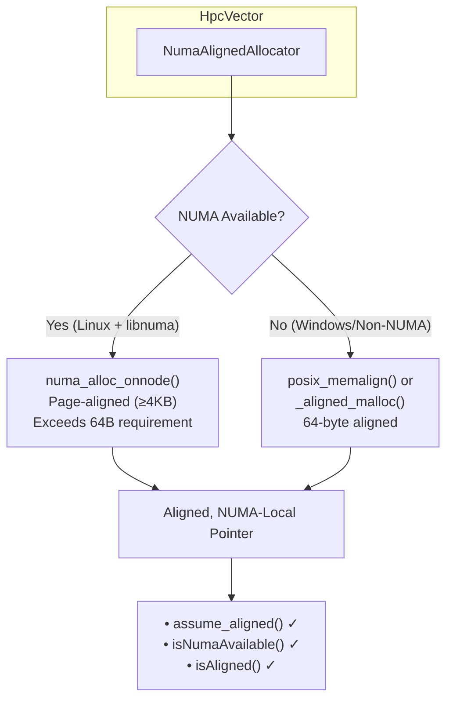

# HpcVector: A Fat-P Library Showcase

## Executive Summary

HpcVector is the **"holy grail" HPC container**—combining cache-line alignment, NUMA-local allocation, and SIMD optimization hints in a single `std::vector`-compatible type. Unlike using `AlignedVector` and `NumaAllocator` separately (which requires manual composition), HpcVector provides **unified allocation semantics**: one template, three NUMA policies, automatic alignment. The `assume_aligned()` method enables compiler auto-vectorization while `isNumaAvailable()` confirms locality guarantees, transforming memory-bound workloads into compute-bound operations with up to 2× throughput improvement on multi-socket systems.

---

## The Problem Domain

### What Goes Wrong Without It

```cpp
// Problem 1: Alignment without NUMA awareness
fat_p::AlignedVector<float, 64> data(1000000);  // Aligned, but allocated on node 0

#pragma omp parallel for
for (size_t i = 0; i < data.size(); ++i) {
    // Thread on node 1 reads from node 0: 2-3× latency penalty
    data[i] = compute(data[i]);
}

// Problem 2: NUMA without alignment guarantees
auto numa_vec = fat_p::memory::NumaLocalVector<float>(1000000);  
// NUMA-local, but is it 64-byte aligned? Is it SIMD-ready?
// Answer: Maybe—depends on page alignment coincidence

// Problem 3: Manual composition is error-prone
template<typename T>
using MyHpcVector = std::vector<T, 
    fat_p::memory::NumaAlignedAllocator<T, 64, fat_p::memory::NumaLocalPolicy>>;
// Works, but you repeat this everywhere. Easy to get wrong.
```

| Issue | HPC Impact |
|-------|------------|
| Alignment without NUMA | Thread 0 allocates; threads 1-N pay remote access penalty |
| NUMA without alignment | Page alignment (4KB) doesn't guarantee cache-line alignment (64B) |
| Manual allocator composition | Verbose, error-prone, no `assume_aligned()` method |
| No runtime NUMA verification | Can't confirm data is actually NUMA-local |
| Policy scattered across code | Different vectors may accidentally use different policies |

### The Architectural Gap

`AlignedVector` solves alignment. `NumaAllocator` solves locality. But HPC workloads need **both simultaneously**:

```
┌─────────────────────────────────────────────────────────────┐
│                    What HPC Code Needs                       │
├─────────────────────────────────────────────────────────────┤
│  ✓ 64-byte alignment for cache lines / AVX-512              │
│  ✓ NUMA-local allocation for memory bandwidth               │
│  ✓ assume_aligned() for compiler auto-vectorization         │
│  ✓ Policy selection (local vs interleaved vs preferred)     │
│  ✓ Runtime verification of placement                        │
│  ✓ Full std::vector interface                               │
└─────────────────────────────────────────────────────────────┘
```

HpcVector is the **pre-composed solution** that provides all six requirements.

---

## Architecture: Unified NUMA-Aligned Allocation

### The Mechanism: NumaAlignedAllocator Composition

```cpp
template<typename T, 
         std::size_t Alignment = 64,
         typename Policy = memory::NumaLocalPolicy>
class HpcVector {
    using allocator_type = memory::NumaAlignedAllocator<T, Alignment, Policy>;
    
    allocator_type allocator_;
    pointer data_;
    size_type size_;
    size_type capacity_;
    
public:
    // Compiler optimization hint—the key differentiator
    [[nodiscard]] T* assume_aligned() noexcept {
        return static_cast<T*>(__builtin_assume_aligned(data_, Alignment));
    }
    
    // Runtime verification
    [[nodiscard]] bool isNumaAvailable() const noexcept {
        return allocator_.numa_available();
    }
    
    [[nodiscard]] bool isAligned() const noexcept {
        return reinterpret_cast<std::uintptr_t>(data_) % Alignment == 0;
    }
};
```

**The allocation path:**



**Why NUMA allocations exceed alignment requirements:**

NUMA allocations are page-aligned (4KB minimum). Since 4096 > 64, NUMA-local memory automatically satisfies any cache-line alignment requirement. The alignment parameter matters only on non-NUMA systems where the fallback uses `posix_memalign` or `_aligned_malloc`.

---

## Feature Inventory

### 1. Three NUMA Policies

```cpp
// Policy 1: Local (default)—allocate on current thread's NUMA node
fat_p::HpcVector<float> local_data(1000000);
// Best for: Thread-local scratch buffers, per-thread working sets

// Policy 2: Preferred—allocate on a specific node
fat_p::HpcVector<double, 64, fat_p::memory::NumaPreferredPolicy> gpu_adjacent(
    1000000, 
    fat_p::memory::NumaPreferredPolicy{1}  // Node 1 (near GPU)
);
// Best for: Data that will be consumed by a device on a specific node

// Policy 3: Interleaved—round-robin across all nodes
fat_p::HpcInterleavedVector<float> shared_data(10000000);
// Best for: Large arrays accessed by all threads equally
```

**Policy selection guide:**

| Policy | Use When | Latency Profile |
|--------|----------|-----------------|
| `NumaLocalPolicy` | Data owned by one thread/core | Optimal for owner, penalty for others |
| `NumaPreferredPolicy` | Data consumed by specific device (GPU, NIC) | Optimal for target node |
| `NumaInterleavedPolicy` | All threads access all data equally | Average across all nodes |

### 2. Auto-Vectorization via assume_aligned()

```cpp
fat_p::HpcVector<float> data(1000000);

// Without assume_aligned(): compiler doesn't know alignment
for (size_t i = 0; i < data.size(); ++i) {
    data[i] *= 2.0f;  // May generate unaligned loads, peeling loops
}

// With assume_aligned(): compiler generates optimal SIMD
float* ptr = data.assume_aligned();
for (size_t i = 0; i < data.size(); ++i) {
    ptr[i] *= 2.0f;  // vmovaps + vmulps (AVX), no peeling
}
```

**What the compiler sees:**

Without hint: "Pointer alignment unknown—generate fallback paths."

With hint: "Pointer is 64-byte aligned—emit aligned loads, no peeling loop, direct vectorization."

### 3. Runtime NUMA Verification

```cpp
fat_p::HpcVector<float> data(1000000);

// Verify NUMA was actually available
if (data.isNumaAvailable()) {
    std::cout << "Data allocated with NUMA-local placement\n";
} else {
    std::cout << "NUMA unavailable—using aligned fallback\n";
}

// Verify alignment at runtime
assert(data.isAligned());
```

**Why this matters:** On non-NUMA systems or when libnuma is unavailable, HpcVector silently falls back to aligned allocation. The verification methods let you confirm placement for debugging and performance analysis.

### 4. Full std::vector Interface

```cpp
fat_p::HpcVector<int> vec;

// All standard operations work
vec.push_back(1);
vec.emplace_back(2);
vec.reserve(1000);
vec.resize(500);

int x = vec[0];
int y = vec.at(1);  // Bounds-checked

vec.insert(vec.begin(), 0);
vec.erase(vec.begin() + 5);

// Iterators for algorithms
std::sort(vec.begin(), vec.end());
auto sum = std::accumulate(vec.begin(), vec.end(), 0);

// Range-for
for (const auto& val : vec) {
    process(val);
}
```

### 5. Strong Exception Guarantee

```cpp
fat_p::HpcVector<Widget> widgets;
widgets.reserve(100);
widgets.push_back(Widget(1));

try {
    widgets.reserve(1000);  // May throw during reallocation
} catch (...) {
    // widgets is UNCHANGED
    assert(widgets.size() == 1);
    assert(widgets[0].id == 1);
}
```

**The mechanism:** Reallocation allocates the new buffer first, moves elements, then deallocates the old buffer. If any move throws, the new buffer is destroyed and the original remains untouched.

### 6. Convenience Type Aliases

```cpp
// HpcLocalVector: Local NUMA policy (default)
fat_p::HpcLocalVector<float> local(1000);

// HpcPreferredVector: Specific node
fat_p::HpcPreferredVector<double> preferred(1000);

// HpcInterleavedVector: Round-robin across nodes
fat_p::HpcInterleavedVector<int> interleaved(1000);
```

---

## Why Not Alternatives?

| If You Need... | Why Not AlignedVector | Why Not NumaAllocator Manually | Why Not std::vector | Fat-P Advantage |
|----------------|----------------------|-------------------------------|--------------------|--------------------|
| NUMA + alignment | No NUMA awareness | Verbose composition | Neither | Pre-composed solution |
| assume_aligned() | ✓ Has it | Must add manually | ✗ Missing | Built-in |
| NUMA verification | ✗ N/A | ✓ Available | ✗ N/A | `isNumaAvailable()`, `isAligned()` |
| Policy selection | ✗ N/A | ✓ Available | ✗ N/A | Template parameter |
| Single header | ✓ | Requires composition | ✓ | ✓ |

**The Sweet Spot:** HpcVector is `AlignedVector` + `NumaAllocator` pre-integrated with verification methods and policy selection—the "just works" container for HPC.

---

## The "Forever Stuck" Reality

**Standard Reality:** C++ will never standardize NUMA-aware containers. NUMA is too platform-specific for the standard committee.

**Platform Reality:** Even on non-NUMA systems, HpcVector provides value through:
- Guaranteed 64-byte alignment
- `assume_aligned()` for auto-vectorization
- Graceful fallback with verification

**Cluster Reality:** Production HPC clusters run stable OS versions for years. HpcVector adapts to available NUMA APIs at runtime—your code works on RHEL 7 servers and Mac laptops with the same source.

---

## Performance Characteristics

| Operation | Complexity | Mechanism |
|-----------|------------|-----------|
| `push_back` | Amortized O(1) | Geometric growth (2×) |
| `reserve` | O(n) | Single NUMA allocation |
| `operator[]` | O(1) | Direct pointer arithmetic |
| `assume_aligned()` | O(1) | Returns data pointer with compiler hint |
| `isNumaAvailable()` | O(1) | Queries cached allocator state |

### Where Fat-P Wins

**Multi-socket servers:** NUMA-local allocation reduces memory latency from ~150ns to ~60ns.

**SIMD-heavy code:** `assume_aligned()` enables `vmovaps` instead of `vmovups`, eliminating the microarchitectural penalty for cache-line-crossing loads.

**Combined effect:** Memory-bound HPC workloads benefit from both reduced memory latency (NUMA-local) and eliminated alignment penalties (SIMD). See `components/HpcVector/results/` for measured throughput improvements on specific platforms.

### Where Fat-P Loses (Honesty Builds Trust)

**Single-socket systems:** NUMA provides no benefit; use `AlignedVector` for simpler code.

**Small allocations:** NUMA overhead matters more for large arrays (> 1MB).

**Non-HPC workloads:** If you're not doing SIMD or multi-socket work, `std::vector` is simpler.

---

## Integration Points

```
HpcVector.h
    ↓ uses
NumaAlignedAllocator.h  (NUMA + alignment allocation)
    ↓ which uses
NumaAllocator.h         (NUMA topology, policies)
    ↓ used by
SimdVector.h            (SIMD loops over HpcVector data)
Tensor.h                (Tensor storage backend)
CheckedArithmetic.h     (Overflow-safe vector operations)
```

**Typical HPC pattern:**

```cpp
// Allocate NUMA-local, cache-aligned storage
fat_p::HpcVector<float> data(1000000);

// Get aligned pointer for SIMD
const float* ptr = data.assume_aligned();

// Process with SimdVector
for (size_t i = 0; i < data.size(); i += SimdVector<float>::width) {
    auto v = SimdVector<float>::load_aligned(ptr + i);
    // ... compute ...
    v.store_aligned(ptr + i);
}
```

---

## Final Assessment

HpcVector delivers on the fat_p promise through three pillars:

### 1. Permanence
NUMA-aware allocation will never be in the standard library. HpcVector provides this capability permanently with graceful fallback on non-NUMA systems.

### 2. Specialization
The combination of NUMA locality + cache-line alignment + `assume_aligned()` addresses the three pillars of HPC memory optimization. This isn't generic container code—it's purpose-built for numerical workloads.

### 3. Control
Three NUMA policies cover all placement strategies. Runtime verification confirms actual placement. Template parameters provide compile-time policy selection.

**Architectural Verdict:** HpcVector unifies `AlignedVector` and `NumaAllocator` into a **single, HPC-optimized container** that transforms memory-bound workloads into compute-bound operations through NUMA locality and SIMD-friendly alignment.

---

*HpcVector.h (657 lines) — Fat-P Library*
