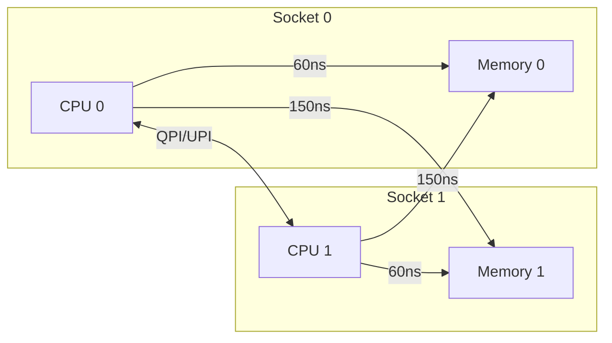
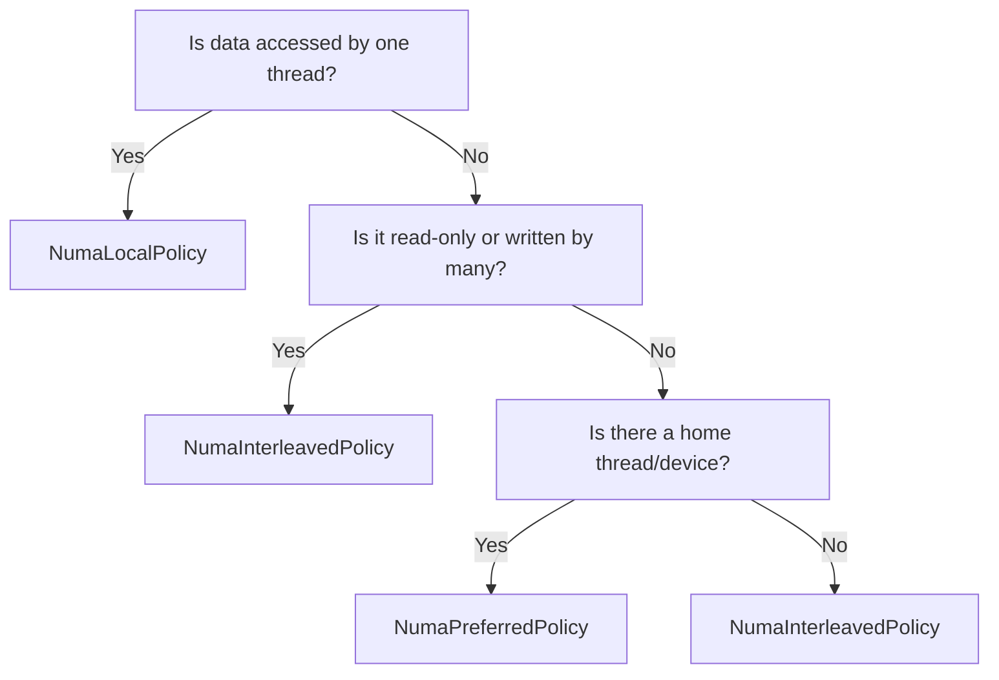

# User Manual - HpcVector

**Scope:** Complete usage guide for `fat_p::HpcVector`: NUMA-aware memory placement policies, SIMD integration, aligned storage, runtime verification, integration with Fat-P components (AlignedVector, NumaAllocator, SimdVector), and performance characteristics on multi-socket systems.

**Not covered:**
- NUMA allocator internals (see NumaAllocator User Manual)
- SIMD instruction selection (see SimdDetection, SimdVector)
- Distributed memory across nodes (MPI)
- GPU memory management

**Prerequisites:** C++20; understanding of NUMA architecture (local vs remote memory); awareness of SIMD alignment requirements

---

## User Manual Card

**Component:** HpcVector
**Primary use case:** Allocate and operate on large vectors with NUMA-aware placement and SIMD-ready alignment for multi-socket HPC systems
**Integration pattern:** Replace `std::vector<T>` with `HpcVector<T, Policy>` in NUMA-sensitive code; select a NUMA policy (local, interleave, bind); use SIMD operations directly on the aligned data
**Key API:** `HpcVector<T, Policy>`, `.data()`, `.size()`, `.push_back()`, NUMA policy types, `.isAligned()` / `.isNumaAvailable()` for runtime checks
**std equivalent:** None
**Common mistakes:** Using HpcVector on single-socket systems (no NUMA benefit, use AlignedVector instead); ignoring NUMA policy selection (default may not be optimal); forgetting that NUMA benefits only appear at large data sizes
**Performance notes:** NUMA-local allocation avoids cross-socket memory access. Alignment enables SIMD without penalty. Overhead over std::vector is allocation-time only. See `components/HpcVector/results/` for current data

---
## Table of Contents

1. [What is HpcVector and Why Does It Matter?](#what-is-hpcvector-and-why-does-it-matter)
2. [Core Concepts](#core-concepts)
3. [Getting Started](#getting-started)
4. [Basic Usage](#basic-usage)
5. [NUMA Policies](#numa-policies)
6. [SIMD Integration](#simd-integration)
7. [Runtime Verification](#runtime-verification)
8. [Complete Patterns](#complete-patterns)
9. [Integration with Fat-P Components](#integration-with-fat-p-components)
10. [Performance Characteristics](#performance-characteristics)
11. [Comparison with Alternatives](#comparison-with-alternatives)
12. [Troubleshooting](#troubleshooting)
13. [Known Limitations](#known-limitations)
14. [When NOT to Use HpcVector](#when-not-to-use-hpcvector)
15. [Summary](#summary)

---

## What is HpcVector and Why Does It Matter?

### The Multi-Socket Memory Problem

In 2003, AMD introduced the Opteron processor with an integrated memory controller. For the first time, each CPU socket had its own dedicated memory. This was great for bandwidth, but created a new problem: memory latency now depended on *which* CPU accessed *which* memory.

This is **NUMA: Non-Uniform Memory Access**. On a multi-socket system:

- **Local memory access:** ~60ns
- **Remote memory access:** significantly slower due to interconnect traversal
- **Bandwidth penalty:** Often 50% reduction for remote access

Every modern multi-socket server has NUMA, and ignoring it can cost you half your performance.

### The SIMD Alignment Problem

Modern CPUs process data in parallel using SIMD. AVX instructions load 256 bits (8 floats) at once, AVX-512 loads 512 bits (16 floats). But these loads work best when the data is *aligned* to the register width.

```cpp
// Unaligned load (vmovups): works, but may cross cache lines
__m256 v = _mm256_loadu_ps(ptr);  // 4-7 cycles

// Aligned load (vmovaps): requires 32-byte alignment
__m256 v = _mm256_load_ps(ptr);   // 3-4 cycles, guaranteed no cache split
```

**std::vector doesn't help:**
```cpp
std::vector<float> data(1000);
// data.data() is 8-byte aligned (or 16 if lucky)
// NOT 32-byte aligned for AVX
// NOT 64-byte aligned for cache lines
```

### The Ecosystem Gap

Before HpcVector, you had three choices:

1. **Use std::vector:** No NUMA, no alignment, poor HPC performance
2. **Use aligned_alloc manually:** Gets alignment, but no NUMA
3. **Use NUMA APIs directly:** Gets locality, but complex and error-prone

Each approach solves one problem but ignores the other.

### Where HpcVector Fits

HpcVector is the **"holy grail" HPC container**: it combines NUMA-local allocation with cache-line alignment in a single, easy-to-use `std::vector`-like interface:

```cpp
#include "HpcVector.h"

// Just works: NUMA-local, 64-byte aligned, SIMD-ready
fat_p::HpcVector<float> data(1000000);

// SIMD loop with aligned loads
const float* ptr = data.assume_aligned();
for (size_t i = 0; i < data.size(); i += 8) {
    __m256 v = _mm256_load_ps(ptr + i);  // Always safe!
}
```

**Key characteristics:**

| Feature | HpcVector | std::vector | AlignedVector |
|---------|-----------|-------------|---------------|
| Cache-line aligned | 64 bytes | ~16 bytes | Configurable |
| NUMA-local | Automatic | OS decides | No |
| SIMD assume_aligned() | Yes | No | Yes |
| STL compatible | Full | Full | Full |
| Policy-based NUMA | 3 policies | N/A | N/A |

---

## Core Concepts

### NUMA: Non-Uniform Memory Access

On a multi-socket system, each CPU socket has its own memory controller and DDR channels. Memory attached to "your" socket is *local*; memory attached to another socket is *remote*.



**The kernel's default policy** is "first-touch": memory is allocated on the NUMA node of the CPU that first writes to it. This works well when each thread initializes its own data, but fails when one thread initializes data that many threads read.

HpcVector's **NUMA policies** give you explicit control:

- **NumaLocalPolicy**: Allocate on the current thread's node (default)
- **NumaPreferredPolicy**: Allocate on a specific node (e.g., GPU-adjacent)
- **NumaInterleavedPolicy**: Spread across all nodes (for shared data)

### Cache-Line Alignment

Modern CPUs don't access memory byte-by-byte. They load entire **cache lines**—64 bytes on x86 and most ARM processors.

**Why alignment matters:**

1. **SIMD efficiency:** AVX loads 32 bytes; if your data starts mid-cache-line, you may need two cache lines for one load.
2. **False sharing prevention:** If two threads write to different variables in the same cache line, they "ping-pong" the line between caches.
3. **Prefetch optimization:** Hardware prefetchers work best with aligned, sequential access.

HpcVector ensures your data starts on a 64-byte boundary (configurable):

```cpp
fat_p::HpcVector<float, 64> data(1000);  // 64-byte aligned (default)
fat_p::HpcVector<float, 128> data(1000); // 128-byte aligned
```

### The Combined Effect

| Scenario | Latency | Notes |
|----------|---------|-------|
| Remote, unaligned | ~160ns | Worst case |
| Remote, aligned | ~150ns | Still slow: cross-socket |
| Local, unaligned | ~70ns | May cross cache lines |
| Local, aligned | ~60ns | Best case: HpcVector default |

**Performance impact:**
- NUMA locality: Eliminates cross-node memory access latency on multi-socket systems
- Cache alignment: Enables SIMD processing without unaligned-access penalties
- Combined: Significant throughput improvement for memory-bound HPC workloads

See `components/HpcVector/results/` for current platform-specific benchmark data.

---

## Getting Started

### Prerequisites

HpcVector requires:

- **C++17 or later**
- A compiler with C++17 support: GCC 7+, Clang 5+, MSVC 2017+
- **For NUMA support (optional):**
  - Linux: libnuma (`apt install libnuma-dev`)
  - Windows: Windows Vista+ (built-in NUMA APIs)

Without libnuma, HpcVector still works—it just uses aligned allocation without NUMA placement.

### Compilation

**Linux with NUMA support:**
```bash
sudo apt install libnuma-dev
g++ -std=c++17 -O3 -lnuma main.cpp -o main
```

**Linux without NUMA:**
```bash
g++ -std=c++17 -O3 main.cpp -o main
```

**Windows:**
```bash
cl /std:c++17 /O2 main.cpp
```

### First Program

```cpp
#include <iostream>
#include "HpcVector.h"

int main()
{
    using namespace fat_p;
    
    HpcVector<double> data(1000000);
    
    std::cout << "NUMA available: " << std::boolalpha << data.isNumaAvailable() << "\n";
    std::cout << "Alignment: " << HpcVector<double>::alignment << " bytes\n";
    std::cout << "Data aligned: " << data.isAligned() << "\n";
    
    // Initialize
    for (size_t i = 0; i < data.size(); ++i) {
        data[i] = static_cast<double>(i);
    }
    
    // Process with aligned pointer hint
    double sum = 0;
    const double* ptr = data.assume_aligned();
    for (size_t i = 0; i < data.size(); ++i) {
        sum += ptr[i];
    }
    
    std::cout << "Sum: " << sum << "\n";
    return 0;
}
```

---

## Basic Usage

### Construction

```cpp
using namespace fat_p;

// Default: empty vector
HpcVector<float> v1;

// Size only: default-initialized elements
HpcVector<float> v2(1000);

// Size + value
HpcVector<float> v3(1000, 3.14f);

// Initializer list
HpcVector<float> v4 = {1.0f, 2.0f, 3.0f, 4.0f};

// From iterators
std::vector<float> source = {1, 2, 3};
HpcVector<float> v5(source.begin(), source.end());

// Copy and move
HpcVector<float> v6 = v4;
HpcVector<float> v7 = std::move(v5);
```

**With explicit NUMA policy:**

```cpp
// Allocate on NUMA node 1
HpcVector<double, 64, memory::NumaPreferredPolicy> gpu_adjacent(
    1000000, 
    memory::NumaPreferredPolicy{1}
);

// Interleave across all nodes
HpcVector<double, 64, memory::NumaInterleavedPolicy> shared(1000000);
```

### Element Access

```cpp
HpcVector<float> data = {1, 2, 3, 4, 5};

float a = data[0];          // Unchecked access
float b = data.at(2);       // Bounds-checked (throws on out-of-range)
float first = data.front();
float last = data.back();
float* ptr = data.data();
float* aligned_ptr = data.assume_aligned();  // For SIMD
```

### Size and Capacity

```cpp
HpcVector<float> data;

data.empty();       // true
data.size();        // 0
data.capacity();    // 0

data.resize(100);
data.reserve(1000);
data.shrink_to_fit();
data.clear();
```

### Modifiers

```cpp
HpcVector<float> data;

data.push_back(1.0f);
data.emplace_back(2.0f);
data.pop_back();
data.resize(10);
data.resize(20, 42.0f);
data.swap(other);
data.clear();
```

### Iterators

```cpp
HpcVector<float> data = {1, 2, 3, 4, 5};

// Range-based for
for (float& x : data) {
    x *= 2;
}

// STL algorithms
std::sort(data.begin(), data.end());
auto it = std::find(data.begin(), data.end(), 3.0f);
float sum = std::accumulate(data.begin(), data.end(), 0.0f);
```

---

## NUMA Policies

### NumaLocalPolicy (Default)

Allocates memory on the NUMA node where the **allocating thread** is running.

```cpp
HpcVector<float> v1(1000);  // Uses NumaLocalPolicy by default
HpcVector<float, 64, memory::NumaLocalPolicy> v2(1000);  // Explicit
```

**Use when:** Each thread creates and uses its own data, or thread affinity is set.

### NumaPreferredPolicy

Allocates memory on a **specific NUMA node** you choose.

```cpp
HpcVector<double, 64, memory::NumaPreferredPolicy> data(
    1000000,
    memory::NumaPreferredPolicy{1}  // Node 1
);
```

**Use when:** Data should be near a specific device (GPU, NIC), or you know which threads will access the data.

### NumaInterleavedPolicy

Spreads memory across **all NUMA nodes** in round-robin fashion.

```cpp
HpcVector<double, 64, memory::NumaInterleavedPolicy> shared_data(10000000);
```

**Use when:** Multiple threads from different NUMA nodes access the same data, or you can't predict access patterns.

### Choosing the Right Policy



| Scenario | Policy |
|----------|--------|
| Per-thread work arrays | Local (default) |
| GPU staging buffers | Preferred(gpu_node) |
| Read-only lookup tables | Interleaved |
| Shared mutable state | Interleaved |

---

## SIMD Integration

### The assume_aligned() Method

`assume_aligned()` returns a pointer with a compiler hint about alignment:

```cpp
HpcVector<float> data(1000);

// Regular pointer (compiler doesn't know alignment)
float* ptr = data.data();

// Aligned pointer (compiler knows it's 64-byte aligned)
float* aligned_ptr = data.assume_aligned();
```

### With SimdVector

```cpp
#include "HpcVector.h"
#include "SimdVector.h"

void process(fat_p::HpcVector<float>& data)
{
    using SV = fat_p::SimdVector<float>;
    
    const float* in = data.assume_aligned();
    float* out = data.assume_aligned();
    
    for (size_t i = 0; i < data.size(); i += SV::width) {
        auto v = SV::load_aligned(in + i);
        v = v * SV(2.0f) + SV(1.0f);
        v.store_aligned(out + i);
    }
}
```

### With Raw Intrinsics

```cpp
#include <immintrin.h>

void scale_avx(fat_p::HpcVector<float>& data, float factor)
{
    __m256 scale = _mm256_set1_ps(factor);
    float* ptr = data.assume_aligned();
    
    for (size_t i = 0; i < data.size(); i += 8) {
        __m256 v = _mm256_load_ps(ptr + i);   // Aligned load
        v = _mm256_mul_ps(v, scale);
        _mm256_store_ps(ptr + i, v);
    }
}
```

---

## Runtime Verification

### Checking NUMA Availability

```cpp
HpcVector<float> data(1000);

if (data.isNumaAvailable()) {
    std::cout << "NUMA is active\n";
} else {
    std::cout << "NUMA not available, using aligned allocation\n";
}
```

### Checking Alignment

```cpp
if (data.isAligned()) {
    std::cout << "Data is " << HpcVector<float>::alignment << "-byte aligned\n";
}

constexpr size_t align = HpcVector<float>::alignment;  // 64
```

---

## Complete Patterns

### Parallel Processing with OpenMP

```cpp
#include <omp.h>
#include "HpcVector.h"
#include "SimdVector.h"

void parallel_simd_sum(const fat_p::HpcVector<float>& input,
                       fat_p::HpcVector<float>& output)
{
    using SV = fat_p::SimdVector<float>;
    
    const float* in = input.assume_aligned();
    float* out = output.assume_aligned();
    
    #pragma omp parallel for schedule(static)
    for (size_t i = 0; i < input.size(); i += SV::width) {
        auto v = SV::load_aligned(in + i);
        v = v * v;
        v.store_aligned(out + i);
    }
}
```

### GPU-Adjacent Allocation

```cpp
#include "HpcVector.h"
#include <cuda_runtime.h>

void gpu_workflow()
{
    int gpu_node = 1;  // Assume GPU is on NUMA node 1
    
    fat_p::HpcVector<float, 64, fat_p::memory::NumaPreferredPolicy> host_buffer(
        batch_size,
        fat_p::memory::NumaPreferredPolicy{gpu_node}
    );
    
    // Fill buffer
    for (size_t i = 0; i < host_buffer.size(); ++i) {
        host_buffer[i] = compute_input(i);
    }
    
    // Copy to GPU (minimal QPI/UPI traversal)
    float* d_buffer;
    cudaMalloc(&d_buffer, batch_size * sizeof(float));
    cudaMemcpy(d_buffer, host_buffer.data(), 
               batch_size * sizeof(float), cudaMemcpyHostToDevice);
}
```

---

## Integration with Fat-P Components

### With SimdVector

```cpp
float dot_product(const fat_p::HpcVector<float>& a,
                  const fat_p::HpcVector<float>& b)
{
    using SV = fat_p::SimdVector<float>;
    
    SV sum = SV::zero();
    const float* pa = a.assume_aligned();
    const float* pb = b.assume_aligned();
    
    for (size_t i = 0; i + SV::width <= a.size(); i += SV::width) {
        auto va = SV::load_aligned(pa + i);
        auto vb = SV::load_aligned(pb + i);
        sum = SV::fma(va, vb, sum);
    }
    
    return sum.horizontal_sum();
}
```

### With CheckedArithmetic

```cpp
#include "HpcVector.h"
#include "CheckedArithmeticFP.h"

void safe_scale(fat_p::HpcVector<float>& data, float factor)
{
    auto result = fat_p::checked_mul_vec_fp<fat_p::ReturnExpectedPolicy>(
        std::vector<float>(data.begin(), data.end()),
        std::vector<float>(data.size(), factor)
    );
    
    if (!result) {
        throw std::runtime_error("Overflow in scale operation");
    }
    
    std::copy(result->begin(), result->end(), data.begin());
}
```

---

## Performance Characteristics

### When HpcVector Shines

Best scenarios:
- Large arrays (> 1MB) on multi-socket systems
- Memory-bound workloads
- Parallel code with thread affinity
- SIMD-heavy processing

| Scenario | std::vector | HpcVector | Why HpcVector Wins |
|----------|-------------|-----------|-------------------|
| Sequential scan, local | Baseline | Faster | NUMA-local allocation eliminates cross-node latency |
| Parallel scan, scattered | Baseline | Significantly faster | Scattered std::vector hits remote DRAM; HpcVector is local |
| SIMD processing, aligned | Baseline | Faster | Guaranteed cache-line alignment avoids split loads |

See `components/HpcVector/results/` for current platform-specific benchmark data with exact throughput measurements.

### Allocation Overhead

| Operation | Time |
|-----------|------|
| malloc(1MB) | ~10 us |
| numa_alloc_local(1MB) | ~50 us |
| posix_memalign(1MB, 64) | ~15 us |

### Memory Access Latency

| Access Pattern | Latency |
|----------------|---------|
| L1 cache hit | ~1 ns |
| L2 cache hit | ~3 ns |
| L3 cache hit | ~10 ns |
| Local DRAM | ~60 ns |
| Remote DRAM | ~150 ns |

---

## Comparison with Alternatives

| Aspect | std::vector | AlignedVector | HpcVector |
|--------|-------------|---------------|-----------|
| Alignment | ~16 bytes | Configurable | 64 bytes |
| NUMA support | None | No | Yes |
| assume_aligned() | No | Yes | Yes |
| STL compatibility | Full | Full | Full |
| Complexity | Low | Low | Medium |

**Choose std::vector when:** Single-socket, small vectors, non-HPC workloads.

**Choose AlignedVector when:** Single-socket system, only need alignment.

**Choose HpcVector when:** Multi-socket system, memory-bound workloads, SIMD processing.

---

## Troubleshooting

### NUMA Not Available

**Symptom:** `isNumaAvailable()` returns false

**Causes:**
- Single-socket system (expected)
- libnuma not installed (Linux)
- Not linked with `-lnuma`
- Running in VM without NUMA passthrough

### Unexpected Memory Placement

**Symptom:** Memory not on expected NUMA node

**Cause:** Thread migration between allocation and use.

**Solution:** Pin threads before allocation:
```cpp
#pragma omp parallel
{
    HpcVector<float> local_data(1000);  // Now NUMA-local
    process(local_data);
}
```

### Performance Not Improved

**Causes:**
- Compute-bound workload (not memory-bound)
- Small allocations (< 1MB)
- Single-socket system
- Already using local memory

---

## Known Limitations

### Single-Socket Systems

On single-socket systems, `isNumaAvailable()` returns false and memory is allocated with aligned allocation only. You still get cache-line alignment.

### Small Allocations

NUMA allocation has higher overhead (~50 us vs ~10 us). For small, frequent allocations, consider object pools or reusing vectors.

### Container Limitations

HpcVector supports a full `insert()` overload family (single element, range, count, initializer list) but does not provide `erase()`. Element shifts are expensive at HPC data sizes, so prefer building vectors append-only where possible.

---

## When NOT to Use HpcVector

- **Single-socket system with small data:** Use `std::vector` or `AlignedVector`
- **Frequent small allocations:** Use object pools
- **Containers of pointers:** NUMA locality doesn't help if pointed-to objects are scattered
- **Non-HPC workloads:** Complexity isn't justified
- **Debugging/prototyping:** Start with `std::vector`, optimize later

---

---

## Use Case: Particle Simulation on Multi-Socket Server

A particle physics simulation on a dual-socket Xeon system. Each socket owns half the particles. NUMA-local allocation ensures each socket's cores access local memory:

```cpp
#include "HpcVector.h"

// Socket-local particle data
fat_p::HpcLocalVector<float> positions_x(N);   // NUMA-local to calling thread's socket
fat_p::HpcLocalVector<float> positions_y(N);
fat_p::HpcLocalVector<float> velocities_x(N);
fat_p::HpcLocalVector<float> velocities_y(N);

// SIMD update loop using assume_aligned()
void update(fat_p::HpcLocalVector<float>& pos,
            const fat_p::HpcLocalVector<float>& vel, float dt)
{
    const float* v = vel.assume_aligned();
    float* p = pos.assume_aligned();
    const size_t n = pos.size();

    for (size_t i = 0; i < n; i += 8)
    {
        __m256 vp = _mm256_load_ps(p + i);
        __m256 vv = _mm256_load_ps(v + i);
        __m256 vdt = _mm256_set1_ps(dt);
        vp = _mm256_fmadd_ps(vv, vdt, vp);
        _mm256_store_ps(p + i, vp);
    }
}
```

The `assume_aligned()` call tells the compiler the pointer is 64-byte aligned, enabling aligned SIMD loads/stores (`vmovaps` instead of `vmovups`). Aligned operations avoid the microarchitectural penalty for crossing cache-line boundaries during SIMD loads.

## Use Case: Shared Data with Interleaved NUMA Policy

When all threads read the same data and no single socket "owns" it, interleaved allocation distributes pages across NUMA nodes for balanced bandwidth:

```cpp
// Lookup table accessed by all threads
fat_p::HpcInterleavedVector<float> lookup_table(1 << 20);  // 1M entries, interleaved

// Each thread gets roughly equal bandwidth regardless of socket
void worker(const fat_p::HpcInterleavedVector<float>& lut, int thread_id)
{
    const float* ptr = lut.assume_aligned();
    // Process using the lookup table...
}
```

## Use Case: Signal Processing with Cache-Line Alignment

Audio signal processing where buffer alignment prevents false sharing between producer and consumer threads:

```cpp
fat_p::HpcVector<float, 64> input_buffer(4096);
fat_p::HpcVector<float, 64> output_buffer(4096);
// 64-byte alignment ensures no cache line is shared between buffers
// Producer writes to input_buffer, consumer reads from output_buffer
// No false sharing even when buffers are adjacent in memory
```

## Best Practices

**Pin threads before allocating.** NUMA-local allocation binds pages to the calling thread's NUMA node. Pin threads to cores before calling `HpcVector` constructors so the allocation lands on the intended node.

**Use assume_aligned() in every SIMD loop.** The compiler cannot infer alignment from the container alone. `assume_aligned()` provides the `__builtin_assume_aligned` hint that enables aligned instruction selection.

**Size allocations to cache-line multiples.** If the vector size is not a multiple of 64 bytes / sizeof(T), the last cache line may cause false sharing. Pad to the next multiple when sharing data between threads.

**Prefer HpcLocalVector for thread-private data.** Each thread's working buffer should be NUMA-local. Use `HpcInterleavedVector` only for shared read-only data.

**Profile with `numastat` and `perf stat`.** `numastat -p <pid>` shows per-node allocation. `perf stat -e numa-*` shows remote vs local memory accesses. Verify allocations are where you expect.

## Expanded Troubleshooting

### Performance is the same as std::vector on a single-socket machine

Expected. NUMA locality has no effect on single-socket systems. The benefit comes only from cache-line alignment and `assume_aligned()`, which eliminate cache-line-crossing penalties for SIMD workloads. See `components/HpcVector/results/` for measured improvement on specific platforms.

### SIGBUS or SIGSEGV on ARM when using assume_aligned()

ARM requires strict alignment for NEON loads. If the data is not actually aligned (e.g., from a view into a larger buffer), `assume_aligned()` produces undefined behavior. Verify alignment with `reinterpret_cast<uintptr_t>(data()) % Alignment == 0`.

### numa_alloc_local() returns nullptr

The system may be out of memory on the local NUMA node. HpcVector falls back to standard allocation but prints a warning. Check available memory with `numastat -m`.

### False sharing between adjacent HpcVectors

Two HpcVectors allocated consecutively may share a cache line at the boundary. Use `alignas(64)` on the HpcVector objects themselves, or pad with `[[maybe_unused]] char pad[64]` between them.

---

## Summary

HpcVector is the **recommended container for HPC workloads** in Fat-P:

**Key Features:**
- NUMA-local allocation
- Cache-line alignment (64 bytes default)
- `assume_aligned()` for compiler hints
- STL-compatible
- Policy-based NUMA placement

**Quick Start:**
```cpp
#include "HpcVector.h"

fat_p::HpcVector<float> data(1000000);

const float* ptr = data.assume_aligned();
for (size_t i = 0; i < data.size(); i += 8) {
    __m256 v = _mm256_load_ps(ptr + i);
    // ...
}
```

**Performance Impact:**
- NUMA locality: Eliminates cross-node memory latency on multi-socket systems
- Cache alignment: Enables penalty-free SIMD processing
- Combined: Significant throughput improvement for memory-bound HPC workloads

**Related Components:** `AlignedVector.h`, `SimdVector.h`, `NumaAllocator.h`, `CacheUtilities.h`

---

*HpcVector.h (658 lines) — Fat-P Library v1.2*
