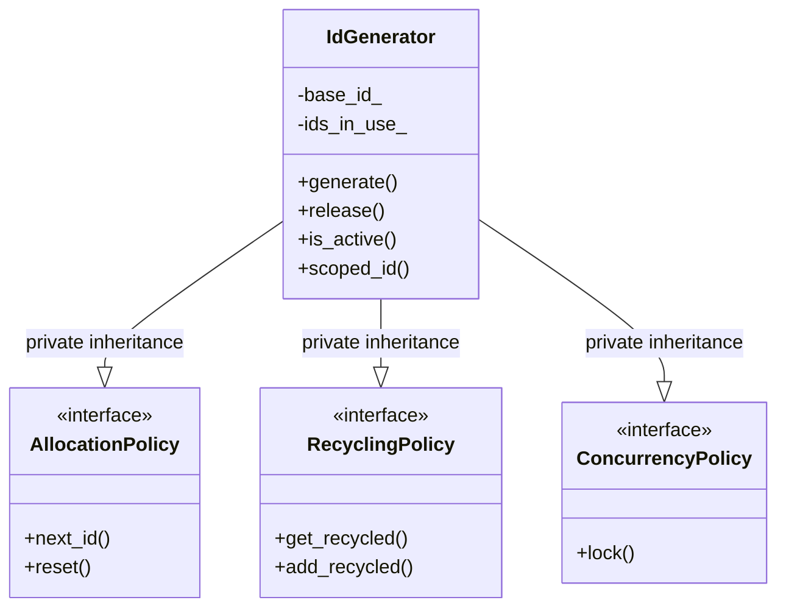
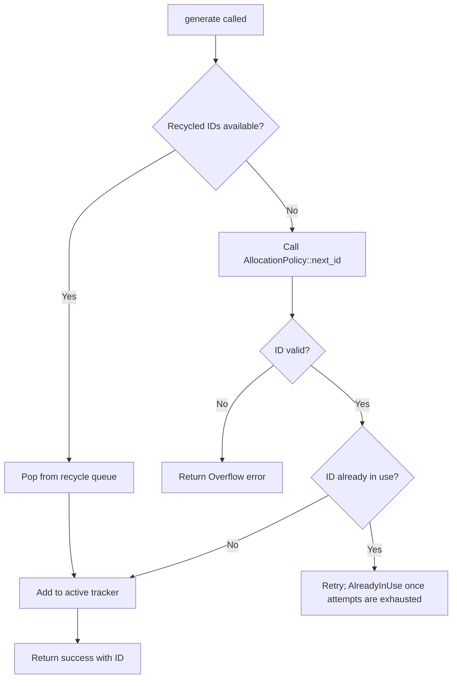

# User Manual - IdGenerator

**Scope:** Complete usage guide for `fat_p::IdGenerator`: policy-based ID generation (sequential, recycling, thread-safe), overflow handling, type-safe ID wrappers via StrongId integration, and performance characteristics.

**Not covered:**
- Distributed ID generation (UUIDs, Snowflake IDs)
- Database-assigned IDs
- Cryptographic random IDs

**Prerequisites:** C++20; understanding of unique identifier requirements in systems programming; awareness of thread safety concerns with shared counters

---

## User Manual Card

**Component:** IdGenerator
**Primary use case:** Generate unique identifiers with configurable policies for threading, overflow, and recycling
**Integration pattern:** Create `IdGenerator<IdType, Policies...>`, call `.generate()` to get IDs; use with `StrongId` for type-safe handles; configure the concurrency policy based on usage context
**Key API:** `IdGenerator<IdType, Policies...>`, `.generate()`, `.release(id)`, `.reset()`, `SequentialAllocationPolicy`, `ImmediateRecyclingPolicy`, `MutexSynchronizationPolicy`
**std equivalent:** None
**Common mistakes:** Using the default `SingleThreadedPolicy` in multi-threaded code (use `ThreadSafeIdGenerator`); ignoring overflow errors from `.generate()`; releasing IDs that are still in use (ABA problem)
**Performance notes:** Generation is a hash-set insert plus an allocation-policy counter update, after a check of the recycle pool (deque pop-front, or extract-min for `MinRecyclingPolicy`). Thread-safe generation adds one `std::mutex` lock/unlock per call — there is no atomic-counter fast path. No benchmark has been written for this component yet

---
## Table of Contents

1. [What is IdGenerator?](#what-is-idgenerator)
2. [Core Architecture](#core-architecture)
3. [Getting Started](#getting-started)
4. [Policy System](#policy-system)
5. [API Reference](#api-reference)
6. [Thread Safety](#thread-safety)
7. [Error Handling](#error-handling)
8. [Performance](#performance)
9. [Comparison with Alternatives](#comparison-with-alternatives)
10. [Migration Guide](#migration-guide)
11. [Best Practices](#best-practices)
12. [Troubleshooting](#troubleshooting)
13. [Summary](#summary)

---

## What is IdGenerator?

### The Problem

Unique identifier generation seems simple until you encounter real-world requirements: thread safety, ID reuse, type safety, overflow handling, and different allocation strategies. Consider this common but flawed approach:

```cpp
// The naive approach - many hidden problems
class ResourceManager
{
    uint64_t next_id_ = 0;  // What about overflow?
    
public:
    uint64_t allocate()
    {
        return next_id_++;  // Not thread-safe!
    }
    
    void release(uint64_t id)
    {
        // IDs are never reused - eventual exhaustion
        // No validation - what if id was never allocated?
    }
};

// Accidental ID mixing - compiles but causes bugs
uint64_t user_id = user_manager.allocate();
uint64_t session_id = session_manager.allocate();
session_manager.release(user_id);  // Oops! Wrong manager
```

This code has multiple issues that can cause production failures: no thread safety, no overflow protection, no ID recycling, no type safety, and no validation.

### The Solution

IdGenerator provides a policy-based solution that addresses all these concerns:

```cpp
#include "IdGenerator.h"
#include "StrongId.h"

// Type-safe IDs prevent mixing
using UserId = fat_p::StrongId<uint64_t, struct UserTag>;
using SessionId = fat_p::StrongId<uint64_t, struct SessionTag>;

// Thread-safe generators with automatic recycling
fat_p::ThreadSafeIdGenerator<UserId> user_gen(1000);
fat_p::ThreadSafeIdGenerator<SessionId> session_gen(5000);

void example()
{
    auto user_result = user_gen.generate();
    if (!user_result)
    {
        // Handle overflow or other errors
        return;
    }
    
    UserId user_id = *user_result;
    
    // Compile error: type mismatch prevents bugs
    // session_gen.release(user_id);  // Does not compile
    
    // Correct usage
    user_gen.release(user_id);  // ID recycled for reuse
}
```

### The C++ Landscape

Several approaches exist for ID generation in C++:

**Atomic counters** (`std::atomic<uint64_t>`) provide thread-safe sequential IDs but lack recycling, overflow detection, and type safety.

**UUIDs** (Boost.UUID, platform APIs) offer globally unique identifiers suitable for distributed systems, but consume 128 bits, have formatting overhead, and cannot be recycled.

**Database sequences** (auto-increment columns) are excellent for persistent storage but require database round-trips and are not suitable for in-memory object tracking.

**Custom implementations** often start simple but accumulate technical debt as requirements grow.

IdGenerator fills a specific niche: high-performance, type-safe, recyclable IDs for in-memory resource management in single-process applications. It is not intended for distributed systems (use UUIDs) or persistent storage (use database sequences).

---

## Core Architecture

### Design Philosophy

IdGenerator uses policy-based design to achieve zero-cost abstraction. You pay only for the features you use:



Private inheritance enables the Empty Base Optimization (EBO), meaning policy classes with no data members add zero bytes to the generator. Not every shipped policy qualifies: `NoRecyclingPolicy` is genuinely empty, but `SingleThreadedPolicy` holds a `mutable NoOpLock` member, so it is not an empty class and its base subobject still occupies storage.

### Internal State

The generator maintains two data structures:

1. **Active Tracker** (`ActiveIdTracker`): Uses `std::unordered_set` for O(1) average lookups and insertions. Maintains a cached maximum ID to support sequential allocation without O(N) searching.

2. **Recycled Queue** (policy-dependent): Released IDs available for reuse. The default policy uses `std::deque` for FIFO ordering.

### Generation Flow



### High-Performance Tracking

The `ActiveIdTracker` uses a specialized design for O(1) amortized performance:

1. **Storage**: `std::unordered_set` provides O(1) average insert, erase, and lookup.

2. **Lazy Max Tracking**: The tracker caches the maximum ID. Releasing that maximum invalidates the cache, and the next `generate()` that actually consults it pays a one-time O(N) `std::max_element` scan. `generate()` checks the recycle pool first and only asks for the maximum when the pool is empty, so with a recycling policy in place the scan is usually never reached.

3. **Result**: Sequential generation is O(1) amortized — a hash insert plus, at most, one lazy max recomputation per released maximum. Nothing here is an ordered container, so none of the O(log N) tree operations of a `std::set`-based implementation are paid.

**Trade-off**: When the recycle pool is empty, repeatedly releasing the maximum ID makes every `generate()` rescan the active set. See [Performance Characteristics](#performance-characteristics) for details.

---

## Getting Started

### Prerequisites

- C++20 or later. This is enforced, not advisory: `ConcurrencyPolicies.h` pulls in `CppFeatureDetection.h`, which emits `#error "Fat-P requires C++20 or later"`, and `IdGenerator.h` uses constrained templates (`requires`).
- Header files: `IdGenerator.h`, `Expected.h`, `StrongId.h`, `ConcurrencyPolicies.h`

### Integration

Copy the header files to your project's include path. No compilation or linking required.

### First Program

```cpp
#include <iostream>
#include "IdGenerator.h"

int main()
{
    // Create a generator starting at ID 1
    fat_p::SimpleIdGenerator<uint64_t> gen(1);
    
    // Generate IDs
    auto id1 = gen.generate();
    auto id2 = gen.generate();
    
    if (id1 && id2)
    {
        std::cout << "Generated: " << *id1 << ", " << *id2 << "\n";
        // Output: Generated: 1, 2
        
        // Release first ID
        gen.release(*id1);
        
        // Next generation reuses the recycled ID
        auto id3 = gen.generate();
        std::cout << "Recycled: " << *id3 << "\n";
        // Output: Recycled: 1
    }
    
    return 0;
}
```

### Type-Safe IDs

For production code, use `StrongId` to prevent accidental ID mixing:

```cpp
#include "IdGenerator.h"
#include "StrongId.h"

// Define domain-specific ID types
using UserId = fat_p::StrongId<uint64_t, struct UserTag>;
using OrderId = fat_p::StrongId<uint64_t, struct OrderTag>;

int main()
{
    fat_p::SimpleIdGenerator<UserId> user_gen(1000);
    fat_p::SimpleIdGenerator<OrderId> order_gen(1);
    
    auto user = user_gen.generate();
    auto order = order_gen.generate();
    
    if (user && order)
    {
        // Type safety in action:
        // order_gen.release(*user);  // Compile error!
        
        user_gen.release(*user);   // Correct
        order_gen.release(*order); // Correct
    }
    
    return 0;
}
```

---

## Policy System

IdGenerator's behavior is customized through four policy dimensions. Each policy has a default that suits common use cases, but you can substitute alternatives or write your own.

### Template Signature

```cpp
template <
    typename IdType_,
    typename AllocationPolicy = SequentialAllocationPolicy<underlying_type>,
    typename RecyclingPolicy = ImmediateRecyclingPolicy<underlying_type>,
    typename ErrorPolicy = ExpectedErrorPolicy<IdType_, IdError>,
    typename ConcurrencyPolicy = SingleThreadedPolicy
>
class IdGenerator;
```

### Allocation Policy

**What:** Controls how new IDs are generated when the recycle pool is empty.

**Why:** Different applications need different ID patterns. Sequential IDs are predictable and debuggable; random IDs resist enumeration attacks.

**When to customize:** Use `RandomAllocationPolicy` when IDs should not be sequentially guessable from one another, or when you need a seeded, reproducible non-sequential sequence. It draws from `std::mt19937_64`, which is **not** a cryptographic generator: its internal state is recoverable from a modest run of observed outputs, after which every subsequent ID is predictable. Do not rely on it where an adversary must not predict the next ID. Implement custom policies for special patterns (odd-only, range-restricted, etc.).

#### SequentialAllocationPolicy (Default)

Generates IDs in monotonically increasing order starting from a base value.

```cpp
fat_p::SimpleIdGenerator<uint64_t> gen(100);

auto id1 = gen.generate();  // 100
auto id2 = gen.generate();  // 101
auto id3 = gen.generate();  // 102

gen.release(*id2);          // Release 101

auto id4 = gen.generate();  // 101 (recycled)
auto id5 = gen.generate();  // 103 (continues sequence)
```

**Characteristics:**
- Deterministic and reproducible
- Easy to debug (IDs indicate creation order)
- Efficient (no random number generation)
- Maximum active ID tracked by `ActiveIdTracker` (an `std::unordered_set` with a lazily recomputed max cache)

#### BoundedSequentialAllocationPolicy

Generates IDs within a specified range, useful for domain-specific constraints.

```cpp
// A generator type built on the bounded policy. Note that the bound cannot
// be passed through this alias -- see "Reachability" below.
using BoundedGen = fat_p::IdGenerator<
    uint64_t,
    fat_p::BoundedSequentialAllocationPolicy<uint64_t>,
    fat_p::ImmediateRecyclingPolicy<uint64_t>>;

// Direct policy construction is the only way to set the bound today: IDs 100-199
fat_p::BoundedSequentialAllocationPolicy<uint64_t> policy(100, 199);

auto id1 = policy.next_id(100, true);  // 100
auto id2 = policy.next_id(100, false); // 101
// ... continues until 199, then returns std::nullopt
```

**Characteristics:**
- Enforces minimum and maximum ID bounds
- Returns `std::nullopt` (Overflow) when bound is exceeded
- Supports recycling within bounds
- Useful for array indexing, protocol compliance, resource pools

**Use cases:**
- Fixed-size entity pools (e.g., max 1000 players)
- Protocol fields with limited bit width
- Array-backed storage with fixed capacity

**Reachability:** Pass the bound through the generator's two-argument constructor:

```cpp
using Bounded = fat_p::IdGenerator<uint16_t,
                                   fat_p::BoundedSequentialAllocationPolicy<uint16_t>,
                                   fat_p::NoRecyclingPolicy<uint16_t>>;
Bounded gen(10, 14);   // issues 10, 11, 12, 13, 14, then Overflow
```

That constructor exists only for allocation policies that opt in by declaring
`using accepts_upper_bound = void;`. The opt-in is a declared alias rather than a
constructibility test, because `RandomAllocationPolicy` also accepts two arguments —
`(seed, ignored)` — and a constructibility test would silently build a seeded random
generator when a bounded one was requested.

The one-argument constructor still works and still leaves the policy at its default bound of
`std::numeric_limits<IdType>::max()`, which is to say unbounded.

#### RandomAllocationPolicy

Generates IDs using uniform random distribution.

```cpp
fat_p::RandomIdGenerator<uint64_t> gen;

auto id1 = gen.generate();  // e.g., 12849372648192
auto id2 = gen.generate();  // e.g., 9283746501928
```

**Characteristics:**
- Non-predictable (resistant to enumeration)
- Collisions possible but extremely rare with `uint64_t`
- No recycling by default (IDs are not reused)
- Slight overhead from random number generation
- Automatic retry on collision (up to 100 attempts)

**Seed Control:** For reproducible random sequences (useful for testing or simulations), use the seeded constructor:

```cpp
// Seeded IdGenerator for reproducible sequences
fat_p::RandomIdGenerator<uint64_t> gen(fat_p::seed_tag, 12345);

auto id1 = gen.generate();  // Deterministic based on seed
auto id2 = gen.generate();  // Same sequence every run with same seed

// Direct policy seeding (advanced usage)
RandomAllocationPolicy<uint64_t> policy(12345, 0);  // Seed = 12345
policy.reset_with_seed(99999);  // Reset with new seed
```

**Note:** For small integer types like `uint8_t`, collisions become likely. The implementation uses a compile-time optimized retry loop (up to 100 attempts) to handle collisions gracefully.

#### Custom Allocation Policy

Implement your own by providing the required interface:

```cpp
template <typename IdType = uint64_t>
class OddOnlyAllocationPolicy
{
public:
    explicit OddOnlyAllocationPolicy(IdType base_id = 1)
        : next_id_(base_id | 1)  // Ensure odd
    {
    }
    
    std::optional<IdType> next_id(IdType max_id, bool first_call = false) noexcept
    {
        IdType candidate = first_call ? next_id_ : ((max_id | 1) + 2);
        
        if (candidate < next_id_)
        {
            candidate = next_id_;
        }
        
        if (candidate == std::numeric_limits<IdType>::max())
        {
            return std::nullopt;
        }
        
        next_id_ = candidate + 2;
        return candidate;
    }
    
    void reset(IdType base_id = 1) noexcept
    {
        next_id_ = base_id | 1;
    }
    
private:
    IdType next_id_;
};
```

### Recycling Policy

**What:** Controls how released IDs are stored and made available for reuse.

**Why:** Without recycling, a long-running application will eventually exhaust the ID space. Recycling enables bounded memory usage.

**When to customize:** Use `NoRecyclingPolicy` when ID uniqueness across time matters (audit logs, versioning). Implement priority-based recycling to prefer certain IDs.

#### ImmediateRecyclingPolicy (Default)

Released IDs are immediately available for reuse in FIFO order.

```cpp
fat_p::SimpleIdGenerator<uint64_t> gen(1);

auto id1 = gen.generate();  // 1
auto id2 = gen.generate();  // 2
auto id3 = gen.generate();  // 3

gen.release(*id1);  // 1 added to recycle queue
gen.release(*id3);  // 3 added to recycle queue

auto id4 = gen.generate();  // 1 (first in queue)
auto id5 = gen.generate();  // 3 (second in queue)
auto id6 = gen.generate();  // 4 (fresh ID)
```

**Characteristics:**
- FIFO ordering (oldest released ID reused first)
- Unbounded recycle queue (memory grows with releases)
- Zero delay between release and availability

#### MinRecyclingPolicy

Released IDs are recycled in ascending order (smallest first). This promotes dense ID ranges, improving cache performance for ID-indexed data structures.

```cpp
using DenseGen = fat_p::IdGenerator<
    uint64_t,
    fat_p::SequentialAllocationPolicy<uint64_t>,
    fat_p::MinRecyclingPolicy<uint64_t>>;

DenseGen gen(1);

auto id1 = gen.generate();  // 1
auto id2 = gen.generate();  // 2
auto id3 = gen.generate();  // 3

gen.release(*id3);  // 3 added to recycle set
gen.release(*id1);  // 1 added to recycle set

auto id4 = gen.generate();  // 1 (smallest in set)
auto id5 = gen.generate();  // 3 (next smallest)
auto id6 = gen.generate();  // 4 (fresh ID)
```

**Characteristics:**
- Min-first ordering (smallest released ID reused first)
- O(log n) insert/remove (uses `std::set` internally)
- Promotes memory locality in ID-indexed containers

**Use cases:**
- HPC applications with ID-indexed vectors/arrays
- Entity-Component Systems (ECS) where dense IDs improve iteration
- Applications where memory fragmentation matters

> **Convenience Alias:** `DenseIdGenerator<T>` uses `MinRecyclingPolicy` by default.

#### NoRecyclingPolicy

Released IDs are never reused. The generator always produces fresh IDs.

```cpp
using NoRecycleGen = fat_p::IdGenerator<
    uint64_t,
    fat_p::SequentialAllocationPolicy<uint64_t>,
    fat_p::NoRecyclingPolicy<uint64_t>>;

NoRecycleGen gen(1);

auto id1 = gen.generate();  // 1
auto id2 = gen.generate();  // 2
gen.release(*id1);          // Discarded, not recycled
auto id3 = gen.generate();  // 3 (not 1)
```

**Use cases:**
- Audit trails where ID reuse could cause confusion
- Short-lived applications where exhaustion is impossible
- Debugging (IDs indicate creation order)

#### SparseRecyclingPolicy

The three policies above hold only the IDs released back to them; the allocation policy decides
what has never been issued. This one holds **both** — every ID in `[base, upper_bound]`, free or
not, stored as disjoint inclusive intervals. That is what makes an ID claimable *by value*.

```cpp
fat_p::SparseIdGenerator<uint32_t> gen(0, 1'000'000);

// Reserve a persisted ID directly. No walk, no fixed attempt ceiling, and the
// cost does not depend on how far 999'999 is from anything already issued.
auto ok = gen.claim(999'999);       // Expected<void, IdError>

auto id1 = gen.generate();          // 0 -- nothing below the claim was consumed
auto id2 = gen.generate();          // 1

gen.claim(999'999);                 // IdError::AlreadyInUse  (it is active)
gen.claim(1'000'001);               // IdError::InvalidClaim  (outside the domain)
```

**Use it when IDs arrive from outside** — loaded from a file, assigned by a peer, or recovered
from a previous run — and must be reserved without first consuming everything below them.

**Characteristics:**
- `claim()` is O(log I) in the number of free *intervals*, never O(gap)
- `generate()` returns the lowest free ID; `release()` merges adjacent intervals immediately
- Activation allocates one node (two for a claim that splits an interval); `release()`,
  batch rollback, and the ordinary `reset()` then allocate nothing
- `reset()` is conditionally `noexcept` here, because it rebuilds the domain

**Two things behave differently from the other policies:**

1. **`recycled_count()` means something else.** For the other policies it is "released and not
   yet reused", so zero means nothing is pending. Here it is the number of *free* IDs including
   never-issued ones, so **zero means the domain is exhausted**. Generic code that reads the
   count without knowing its policy will misread it.
2. **Exhaustion is the configured ceiling**, not the ID type's maximum. The allocation policy is
   not consulted on this path.

**Configure the domain to what your consumer can actually represent:**

```cpp
// A consumer that can only encode 16 bits of index, in a 32-bit ID type.
fat_p::SparseIdGenerator<uint32_t> gen(0, 0xFFFF);
```

Without a ceiling the generator would happily issue an ID the consumer cannot represent, and
generator exhaustion would never coincide with the consumer's real exhaustion.

For a `StrongId`-style type the reserved `invalid()` sentinel is excluded from the domain at
construction, so it is never issued, never counted as free, and `claim()` of it returns
`InvalidClaim`.

**`base_id` must not exceed the upper bound.** This is a precondition, asserted in debug
builds. A violation yields an *empty* domain — every `generate()` reports `Overflow` — rather
than undefined behaviour. Watch for the case where the bound is implicit: over a
`StrongId<uint8_t>`, `SparseIdGenerator<Id> gen(255)` normalizes the ceiling to 254, which is
below the base, and the generator is exhausted from birth.

> **Advanced:** `SparseRecyclingPolicy` has a second template parameter, `Compare`, defaulting
> to `std::less<IdType>`. Despite the shape, **it is not a general ordering seam** — the policy
> mixes map order with interval arithmetic and is correct only for orderings equivalent to
> ascending numeric order. It exists so the complexity contract can be instrumented with a
> counting comparator. Supplying `std::greater` compiles and is silently wrong.

> **Convenience Aliases:** `SparseIdGenerator<T>` and `ThreadSafeSparseIdGenerator<T>`. The
> policy pairs only with sequential allocation — a `static_assert` rejects random allocation,
> which has nothing to contribute when issuance comes from the free set.
>
> `claim()` exists **only** on a generator using this policy. `SimpleIdGenerator`,
> `ThreadSafeIdGenerator`, `DenseIdGenerator` and `RandomIdGenerator` are unchanged: no claim
> member, no ordering change, no new errors.

### Concurrency Policy

**What:** Controls thread safety and synchronization overhead.

**Why:** Thread safety has a cost. Single-threaded applications should not pay for synchronization they do not need.

**When to customize:** Use `SingleThreadedPolicy` (default) for single-threaded code. Use `MutexSynchronizationPolicy` when multiple threads access the same generator.

#### SingleThreadedPolicy (Default)

No synchronization. Zero overhead. Not safe for concurrent access.

```cpp
// Fast, but use only from one thread
fat_p::SimpleIdGenerator<uint64_t> gen(1);
```

#### MutexSynchronizationPolicy

Thread-safe using `std::mutex`. Safe for concurrent access from multiple threads.

```cpp
// Thread-safe, slightly slower
fat_p::ThreadSafeIdGenerator<uint64_t> gen(1);

// Safe to call from multiple threads
std::thread t1([&]() { auto id = gen.generate(); });
std::thread t2([&]() { auto id = gen.generate(); });
```

---

## API Reference

### Convenience Aliases

Pre-configured type aliases for common use cases:

| Alias | Allocation | Recycling | Concurrency | Use Case |
|-------|------------|-----------|-------------|----------|
| `SimpleIdGenerator<T>` | Sequential | FIFO | Single-threaded | Default, general purpose |
| `ThreadSafeIdGenerator<T>` | Sequential | FIFO | Mutex | Multi-threaded access |
| `DenseIdGenerator<T>` | Sequential | Min-First | Single-threaded | HPC, cache-friendly |
| `RandomIdGenerator<T>` | Random | None | Single-threaded | Unpredictable IDs |
| `SparseIdGenerator<T>` | Sequential | Sparse (full domain) | Single-threaded | Claiming persisted IDs |
| `ThreadSafeSparseIdGenerator<T>` | Sequential | Sparse (full domain) | Mutex | Claiming, multi-threaded |

```cpp
// Simple sequential generator
fat_p::SimpleIdGenerator<uint64_t> gen1(1);

// Thread-safe generator
fat_p::ThreadSafeIdGenerator<uint64_t> gen2(1);

// Dense ID generator (promotes ID locality)
fat_p::DenseIdGenerator<uint64_t> gen3(1);

// Random ID generator
fat_p::RandomIdGenerator<uint64_t> gen4;

// Claim-by-value generator over an explicit domain
fat_p::SparseIdGenerator<uint32_t> gen5(0, 1'000'000);
```

Only the last two offer `claim()`. The first four are unaffected by it in every respect.

### Construction

```cpp
explicit IdGenerator(underlying_type base_id = 0)
```

Creates a generator with the specified starting ID.

**Parameters:**
- `base_id`: The first ID to generate (default: 0). Under `RandomAllocationPolicy` there is no "first" ID, so `base_id` acts as the **minimum**: draws are uniform over `[base_id, max]`, and `reset()` rebuilds the distribution so the minimum survives it.

**Example:**
```cpp
fat_p::SimpleIdGenerator<uint64_t> gen1;       // Starts at 0
fat_p::SimpleIdGenerator<uint64_t> gen2(100);  // Starts at 100
fat_p::SimpleIdGenerator<uint64_t> gen3(1);    // Starts at 1
```

#### Seeded Construction (Random Generators)

```cpp
IdGenerator(seed_tag_t, uint64_t seed)
```

Creates a random generator with explicit seed for reproducible sequences.

**Parameters:**
- `seed_tag`: Disambiguation tag (`fat_p::seed_tag`)
- `seed`: The seed value for the random number generator

**Example:**
```cpp
// Reproducible random sequences for testing
fat_p::RandomIdGenerator<uint64_t> gen1(fat_p::seed_tag, 42);
fat_p::RandomIdGenerator<uint64_t> gen2(fat_p::seed_tag, 42);

auto id1 = gen1.generate();  // Same sequence
auto id2 = gen2.generate();  // as gen1
assert(*id1 == *id2);        // Identical!
```

**Notes:**
- Non-copyable (deleted copy constructor and assignment)
- Movability is inherited from the concurrency policy. `IdGenerator` writes `IdGenerator(IdGenerator&&) noexcept = default`, but a defaulted move is *deleted* when a base cannot be moved. All four shipped aliases are therefore immovable: `SimpleIdGenerator`, `DenseIdGenerator` and `RandomIdGenerator` use `SingleThreadedPolicy`, whose declared (deleted) copy constructor suppresses its implicit move operations, and `ThreadSafeIdGenerator` uses `MutexSynchronizationPolicy`, which deletes its move operations outright. `std::is_move_constructible_v` is `false` for all four
- An instantiation over `UniqueRWLockPolicy` or `MovableSingleThreadedPolicy` *is* movable, because those policies declare their move operations
- For a movable instantiation, moving the generator while `IdGuard` instances exist causes undefined behavior — each guard holds a raw pointer to the generator it came from. `SingleThreadedPolicy`'s immovability is deliberate: it makes the compiler enforce that precondition rather than leaving it to documentation

### generate()

```cpp
result_type generate()
```

Generates a new unique ID or reuses a recycled one.

**Returns:** `Expected<IdType, IdError>` containing:
- **Success:** The generated ID
- **Error:** `IdError::Overflow` if the ID space is exhausted
- **Error:** `IdError::AlreadyInUse` if collision retry is exhausted

**Collision Handling:** The retry count is selected at compile time from the allocation policy: `kMaxRetries` is `detail::may_collide_v<AllocationPolicy> ? 100 : 1`. The trait is specialized to `false` for `SequentialAllocationPolicy` and `BoundedSequentialAllocationPolicy`, so `SimpleIdGenerator`, `DenseIdGenerator` and `ThreadSafeIdGenerator` make exactly one attempt — those policies cannot hand back an ID that is already active, so there is nothing to retry. Only `RandomIdGenerator`, and any custom policy that does not specialize the trait, gets the 100-attempt loop; that is what makes random generation on small types such as `uint8_t` survive collisions.

**Example:**
```cpp
auto result = gen.generate();
if (result)
{
    uint64_t id = *result;
    // Use id...
}
else
{
    switch (result.error())
    {
        case fat_p::IdError::Overflow:
            // Handle exhaustion
            break;
        case fat_p::IdError::AlreadyInUse:
            // Handle collision (rare with large types)
            break;
        default:
            break;
    }
}
```

### release()

```cpp
Expected<void, IdError> release(IdType_ id) noexcept
```

Releases an ID, making it available for recycling.

**Parameters:**
- `id`: The ID to release (must be currently active)

**Returns:** `Expected<void, IdError>` indicating:
- **Success:** ID successfully released
- **Error:** `IdError::InvalidRelease` if the ID was not active

`Expected` is declared `[[nodiscard]]`, so discarding this return value is a compiler diagnostic (`-Wunused-result` on GCC/Clang, C4834 on MSVC), not a silent omission. Several short examples in this manual drop it to keep the point in view; under warnings-as-errors, either check it or write `(void)gen.release(id);` to state that the omission is deliberate.

**Example:**
```cpp
auto id = gen.generate();
if (id)
{
    // Use the ID...
    
    auto result = gen.release(*id);
    if (!result)
    {
        // Should not happen if id was from this generator
    }
}
```

### claim()

```cpp
Expected<void, IdError> claim(IdType_ id)   // SparseRecyclingPolicy only
```

Takes ownership of a specific ID by value. Available **only** on a generator whose recycling
policy owns the whole domain — `SparseIdGenerator` and `ThreadSafeSparseIdGenerator`. On any
other generator the member does not exist, so a misuse is a compile error rather than a runtime
one.

**Parameters:**
- `id`: The ID to reserve. Must be inside `[base_id, upper_bound]` and not already active.

**Returns:** `Expected<void, IdError>` indicating:
- **Success:** the ID is now active and will not be issued by `generate()`
- **Error:** `IdError::AlreadyInUse` — the ID is currently active
- **Error:** `IdError::InvalidClaim` — the ID is outside the configured domain

**Cost:** O(log I) in the number of free intervals. It does **not** depend on how far `id` is
from any ID already issued, which is the whole reason the policy exists.

**Exception safety:** every allocating step runs before every mutating step, so a failed
allocation leaves the generator exactly as it was found. A refused claim allocates nothing.

**Example:**
```cpp
fat_p::SparseIdGenerator<uint32_t> gen(0, 1'000'000);

// Reinstate IDs recovered from a previous run, in any order.
for (uint32_t persisted : loaded_ids)
{
    auto result = gen.claim(persisted);
    if (!result)
    {
        if (result.error() == fat_p::IdError::InvalidClaim)
        {
            // Out of domain: the record is corrupt or was written by a
            // generator with a different base or ceiling. Surface it.
        }
        else
        {
            // AlreadyInUse: a duplicate in the persisted data.
        }
    }
}

// Fresh IDs still come from the bottom of whatever is left.
auto next = gen.generate();
```

A refused claim is data to report, not a reason to abort: nothing has been mutated, and the
generator is fully usable afterwards.

### generate_batch()

```cpp
Expected<std::vector<id_type>, IdError> generate_batch(size_t count)
```

Generates multiple IDs in a single operation, acquiring the lock once for thread-safe variants.

**Parameters:**
- `count`: Number of IDs to generate (0 returns empty vector)

**Returns:** `Expected<std::vector<id_type>, IdError>` containing:
- **Success:** Vector of generated IDs
- **Error:** `IdError::Overflow` if ID space exhausted during batch
- **Error:** `IdError::AlreadyInUse` if collision retry exhausted

**Rollback Behavior:** If generation fails partway through, every ID committed so far is removed from the active set. Each ID's provenance is recorded when it is committed, not inferred from its value:
- IDs that came from the recycle pool are returned to the pool
- IDs the allocation policy produced are discarded, and the policy's counter is rewound by exactly that many — but only if the policy provides `revert(size_t)`. `SequentialAllocationPolicy` and `BoundedSequentialAllocationPolicy` do; a custom policy without it keeps the counter where the failed batch left it, leaving a permanent gap

Rollback also runs when an exception escapes mid-batch — a failed allocation, or a throwing `id_type` constructor. The caller never receives the partial vector, so the accumulated IDs are returned rather than left active and unreachable.

Recording provenance rather than guessing it is what makes this hold in the two cases a value comparison gets wrong: a pooled ID that sits above the current maximum, and a batch that starts with an empty active set. This density-preserving rollback keeps `MinRecyclingPolicy` and similar policies dense after a failed batch.

**Example:**
```cpp
// Generate 100 IDs efficiently with single lock acquisition
ThreadSafeIdGenerator<uint64_t> gen(1);

auto batch = gen.generate_batch(100);
if (batch)
{
    for (auto id : *batch)
    {
        // Use each ID...
    }
}
else if (batch.error() == IdError::Overflow)
{
    // ID space exhausted
}
```

**Performance Benefit:** For thread-safe generators, batch generation acquires the lock once instead of 100 times, reducing synchronization overhead significantly.

### release_batch()

```cpp
Expected<void, IdError> release_batch(const std::vector<id_type>& ids) noexcept
```

Releases multiple IDs in a single operation, acquiring the lock once for thread-safe variants.

**Parameters:**
- `ids`: Vector of IDs to release (all must be currently active)

**Returns:** `Expected<void, IdError>` indicating:
- **Success:** All IDs successfully released
- **Error:** `IdError::InvalidRelease` if any ID was not active (stops at first error)

**Error Behavior:** Processing stops at the first invalid ID. IDs before the error are released; IDs after are not processed.

**Example:**
```cpp
ThreadSafeIdGenerator<uint64_t> gen(1);

// Generate a batch
auto batch = gen.generate_batch(100);
if (batch)
{
    // ... use the IDs ...
    
    // Release them all in one call
    auto result = gen.release_batch(*batch);
    if (!result)
    {
        // Handle error (shouldn't happen if all IDs are valid)
    }
}
```

**Performance Benefit:** For thread-safe generators, batch release acquires the lock once instead of 100 times.

### scoped_id()

```cpp
Expected<IdGuard, IdError> scoped_id()
```

Generates an ID wrapped in an RAII guard that automatically releases on destruction.

**Returns:** `Expected<IdGuard, IdError>` containing:
- **Success:** An `IdGuard` owning the generated ID
- **Error:** Same errors as `generate()`

**Example:**
```cpp
{
    auto guard_result = gen.scoped_id();
    if (guard_result)
    {
        auto& guard = *guard_result;
        uint64_t id = guard.get();
        // Use id...
    }
    // ID automatically released when guard goes out of scope
}
```

**Debug Assertions:** In debug builds (`NDEBUG` not defined), `IdGuard` asserts in its destructor and move assignment operator that the release either succeeded or was refused because the generator's epoch has moved on. A guard left over from before a `reset()` is inert by design and does not trip the assertion; a double-release or a release of a never-active ID does.

**IdGuard Lifecycle:**

```mermaid
stateDiagram-v2
    [*] --> Generated: scoped_id()
    Generated --> Released: ~IdGuard() (scope exit)
    Generated --> Moved: std::move()
    Moved --> Released: ~IdGuard() (new owner)
    Generated --> OwnershipReleased: release_ownership()
    OwnershipReleased --> [*]: Manual management
    Released --> [*]: ID recycled
    
    note right of Generated: get() returns ID
    note right of Moved: Old guard empty
    note right of OwnershipReleased: Must manually release()
```

**State descriptions:**
- **Generated**: Guard owns an active ID; `get()` returns the ID value
- **Moved**: Guard has been moved-from; now empty (no ID owned)
- **Released**: ID automatically released to generator on destruction
- **OwnershipReleased**: User called `release_ownership()`; must manually release ID
- **Stale**: The generator was `reset()` after the guard was created; the guard's destructor releases nothing, so it cannot claw back an ID the generator has already reissued

### Query Methods

```cpp
bool is_active(IdType_ id) const noexcept
```
Returns `true` if the ID is currently active (allocated and not released).

```cpp
size_t active_count() const noexcept
```
Returns the number of currently active IDs.

```cpp
size_t recycled_count() const noexcept
```
Returns the number of IDs in the recycle queue.

```cpp
void reset() noexcept
```
Clears all state, returning the generator to its initial condition, and bumps an internal epoch counter. Any `IdGuard` created before the call carries the old epoch and becomes inert: its destructor goes through `release_if_current`, which refuses to release across a bump rather than releasing an ID the generator has already reissued to a different owner.

`release()` carries no such protection. Releasing an ID value obtained before a `reset()` succeeds if the generator has since reissued that value, and it evicts the current owner's ID.

---

## Thread Safety

### Single-Threaded (Default)

`SimpleIdGenerator` and `RandomIdGenerator` are not thread-safe. Accessing them from multiple threads without external synchronization causes data races.

```cpp
// UNSAFE: Data race!
fat_p::SimpleIdGenerator<uint64_t> gen(1);

std::thread t1([&]() { gen.generate(); });  // Race
std::thread t2([&]() { gen.generate(); });  // Race
```

### Thread-Safe

`ThreadSafeIdGenerator` uses mutex synchronization and is safe for concurrent access:

```cpp
// SAFE: Synchronized access
fat_p::ThreadSafeIdGenerator<uint64_t> gen(1);

std::thread t1([&]() { gen.generate(); });  // OK
std::thread t2([&]() { gen.generate(); });  // OK
```

### IdGuard Thread Safety

`IdGuard` itself is not thread-safe. Do not share a single guard between threads. However, you can safely create guards from a `ThreadSafeIdGenerator` in multiple threads:

```cpp
fat_p::ThreadSafeIdGenerator<uint64_t> gen(1);

// SAFE: Each thread has its own guard
std::thread t1([&]() {
    auto guard = gen.scoped_id();
    // guard is thread-local
});

std::thread t2([&]() {
    auto guard = gen.scoped_id();
    // guard is thread-local
});
```

### Performance Trade-offs

Thread safety costs a mutex acquisition on every operation, including `is_active()`, `active_count()` and `recycled_count()`: `MutexSynchronizationPolicy::lock_shared()` takes the same exclusive `std::mutex`, since that policy has no shared mode. Batch generation amortizes the cost across the whole batch. No benchmark exists for this component, so this manual does not quantify the gap.

**Guidelines for choosing:**

1. **Use single-threaded** (`SimpleIdGenerator`) when:
   - All ID operations occur on one thread
   - External synchronization is already in place
   - Maximum performance is required

2. **Use thread-safe** (`ThreadSafeIdGenerator`) when:
   - Multiple threads generate/release IDs concurrently
   - You need the simplicity of internal synchronization
   - Paying one mutex lock/unlock per operation is acceptable

3. **Use batch operations** to amortize synchronization:
   ```cpp
   // Single lock acquisition for 100 IDs
   auto ids = gen.generate_batch(100);
   ```

---

## Error Handling

IdGenerator uses `Expected<T, IdError>` for error handling, avoiding exceptions in normal operation.

### Understanding Expected<T, E>

`Expected<T, E>` is a discriminated union that holds either a success value of type `T` or an error value of type `E`. It provides a type-safe, exception-free alternative to traditional error handling:

```cpp
Expected<uint64_t, IdError> result = gen.generate();

if (result)                    // Check for success (operator bool)
{
    uint64_t id = *result;     // Access value (operator*)
    // or: uint64_t id = result.value();
}
else
{
    IdError err = result.error();  // Access error
}
```

**Key characteristics:**
- No exceptions thrown for predictable errors (overflow, collisions)
- Forced error checking at call site (can't ignore return value)
- Zero-overhead abstraction when optimized
- Requires C++20, the library minimum

For comprehensive documentation on `Expected`, including advanced usage patterns like `and_then()`, `or_else()`, and monadic operations, see the **Expected User Manual**.

### Error Types

```cpp
enum class IdError
{
    Overflow,        // ID space exhausted
    InvalidRelease,  // Attempted to release non-active ID
    AlreadyInUse,    // Generated ID already active (random collision), or
                     // claim() named an ID that is currently active
    InvalidClaim     // claim() named an ID outside the configured domain
                     // (SparseRecyclingPolicy only)
};
```

`AlreadyInUse` and `InvalidClaim` answer different questions, which matters when a `claim()`
comes from persisted data: `AlreadyInUse` means the ID is real but taken, `InvalidClaim` means
the ID could not have been issued by this generator at all — below `base`, above `upper_bound`,
or the ID type's reserved sentinel. The first is a conflict; the second is corrupt or
mis-scoped input.

### Handling Errors

```cpp
auto result = gen.generate();

if (!result)
{
    switch (result.error())
    {
        case fat_p::IdError::Overflow:
            std::cerr << "ID space exhausted\n";
            // Consider using a larger type or enabling recycling
            break;
            
        case fat_p::IdError::AlreadyInUse:
            std::cerr << "Random collision occurred\n";
            // Retry or use a larger type
            break;
            
        default:
            std::cerr << "Unexpected error\n";
            break;
    }
    return;
}

uint64_t id = *result;
```

### Exception-Based Error Handling

The library uses `Expected`-based error handling by design, avoiding exceptions for predictable errors. If exception-based error handling is preferred, wrap errors explicitly:

```cpp
try
{
    auto result = gen.generate();
    if (!result)
    {
        throw std::runtime_error("ID generation failed: " + 
            std::to_string(static_cast<int>(result.error())));
    }
}
catch (const std::exception& e)
{
    std::cerr << e.what() << "\n";
}
```

> **Design Note:** `IdGeneratorException` was removed in v1.1 to maintain the lightweight design principle. The `Expected` pattern provides equivalent functionality with better composability and no exception overhead. In v1.2, additional debug assertions were added to `IdGuard` for improved error detection during development. v1.3 added `BoundedSequentialAllocationPolicy`, seeded random construction via `seed_tag`, and increased retry limits. v1.4 improved overflow detection with explicit exhaustion tracking, added batch rollback counter reversion to prevent sequence gaps, and enhanced ASan detection of dangling IdGuard use.

---

## Performance

### Benchmark Status

No benchmark exists for this component. `components/IdGenerator/benchmarks/` is empty and `components/IdGenerator/results/` holds only a `.gitkeep`, so everything below is complexity and mechanism, not measurement. The questions a benchmark would settle — the cost of mutex acquisition on each platform, and the batch size at which amortizing the lock starts to pay — remain open.

### Mechanism

All core operations (generate, release, is_active) are O(1) amortized: a hash insert, erase or lookup, plus at most one lazy max recomputation per released maximum. `generate_batch()` and `release_batch()` acquire the concurrency policy's lock once for the whole batch rather than once per ID, so their advantage over a loop of single calls grows with batch size and with contention.

### Optimization Tips

1. **Prefer single-threaded** when possible. `SingleThreadedPolicy::lock()` returns an empty guard the optimizer removes; `MutexSynchronizationPolicy` locks and unlocks a `std::mutex` on every call, queries included. The size of that gap on your platform is unmeasured here.

2. **Pre-size workloads**: If you know the maximum concurrent IDs, you can pre-generate and release them to populate the recycle pool.

3. **Use appropriate ID types**: `uint32_t` is sufficient for most applications and may perform better due to cache effects.

4. **Avoid `is_active` in hot paths**: This operation searches the active set (O(1) average with hash set).

### Performance Characteristics

IdGenerator uses an `unordered_set` with lazy max tracking for O(1) average-case operations. Understanding the implementation helps predict performance in edge cases.

**Average Case (Typical HPC Workloads)**

| Operation | Complexity | Notes |
|-----------|------------|-------|
| `generate()` | O(1) | Hash insert |
| `release()` | O(1) | Hash erase |
| `is_active()` | O(1) | Hash lookup |

**Worst Case: Releasing the Maximum With an Empty Pool**

Releasing the maximum active ID invalidates the cached maximum, and the next `generate()` that has to consult it scans all active IDs. That scan is only reached when the recycle pool cannot answer the request first, because `generate()` checks the pool before it looks at the maximum. Reproducing it therefore takes a generator that does not recycle:

```cpp
// This pattern triggers O(N) scans
using NoRecycleGen = fat_p::IdGenerator<
    uint64_t,
    fat_p::SequentialAllocationPolicy<uint64_t>,
    fat_p::NoRecyclingPolicy<uint64_t>>;

NoRecycleGen gen(1);

// Generate 1000 IDs: 1, 2, 3, ..., 1000
std::vector<uint64_t> ids;
for (int i = 0; i < 1000; ++i) {
    ids.push_back(*gen.generate());
}

// Release the current maximum, then generate. The pool is always empty,
// so every generate() rescans the active set for the new maximum.
uint64_t current_max = ids.back();
for (int i = 0; i < 1000; ++i) {
    (void)gen.release(current_max);   // Releasing current max
    current_max = *gen.generate();    // O(N) scan to find new max
}
```

Run the same loop on `SimpleIdGenerator` and no scan happens at all: each release puts the ID in the FIFO pool, and the following `generate()` hands it straight back without touching the maximum.

**Why This Tradeoff?**

The lazy max approach optimizes for common patterns:

| Pattern | Performance | Frequency |
|---------|-------------|-----------|
| Random release | O(1) | Very common |
| Bulk allocate/release | O(1) | Common in HPC |
| Ascending release | O(1) | Common |
| Descending release, recycle pool empty | O(N) | Rare |

For the rare case where descending release is a bottleneck, alternatives include:
- Using a max-heap alongside the hash set (adds memory overhead)
- Accepting the O(N) cost as acceptable for the specific workload
- Restructuring the application to avoid the pattern

For typical HPC workloads (bulk allocation, random access, batch release), the current implementation provides optimal performance.

---

## Comparison with Alternatives

### Overview

| Feature | IdGenerator | Atomic Counter | Boost.UUID | Database Sequence |
|---------|-------------|----------------|------------|-------------------|
| Thread-safe | Optional | Yes | Yes | Yes |
| Recyclable | Yes | No | No | No |
| Type-safe | Yes (with StrongId) | No | Yes | No |
| Size (bits) | Configurable | Fixed | 128 | Typically 64 |
| Performance | O(1) amortized | Single atomic increment | Random generation | Network round-trip |
| Overflow handling | Yes | No | N/A | Database-dependent |
| Dependencies | None | None | Boost | Database client |

### When to Use What

**Use IdGenerator when:**
- You need recyclable IDs for long-running applications
- Type safety between ID domains matters
- Single-process, in-memory resource tracking
- Overflow detection is important

**Use atomic counters when:**
- Maximum simplicity is required
- IDs never need recycling
- You are certain exhaustion is impossible

**Use UUIDs when:**
- IDs must be globally unique across processes/machines
- You need to generate IDs without coordination
- 128-bit size is acceptable

**Use database sequences when:**
- IDs must persist across restarts
- Distributed coordination is required
- Database round-trip latency is acceptable

---

## Migration Guide

### From Atomic Counters

**Before:**
```cpp
class OldResourceManager
{
    std::atomic<uint64_t> next_id_{0};
    
public:
    uint64_t allocate() { return next_id_++; }
    void release(uint64_t) { /* no-op */ }
};
```

**After:**
```cpp
class NewResourceManager
{
    fat_p::ThreadSafeIdGenerator<uint64_t> gen_{0};
    
public:
    std::optional<uint64_t> allocate()
    {
        auto result = gen_.generate();
        return result ? std::optional(*result) : std::nullopt;
    }
    
    bool release(uint64_t id)
    {
        return gen_.release(id).has_value();  // Now recyclable!
    }
};
```

### Adding Type Safety

**Before:**
```cpp
uint64_t user_id = user_manager.allocate();
uint64_t order_id = order_manager.allocate();
order_manager.release(user_id);  // Bug: wrong manager!
```

**After:**
```cpp
using UserId = fat_p::StrongId<uint64_t, struct UserTag>;
using OrderId = fat_p::StrongId<uint64_t, struct OrderTag>;

fat_p::SimpleIdGenerator<UserId> user_gen(1);
fat_p::SimpleIdGenerator<OrderId> order_gen(1);

UserId user_id = *user_gen.generate();
OrderId order_id = *order_gen.generate();

// order_gen.release(user_id);  // Compile error!
```

### Incremental Adoption

You can adopt IdGenerator incrementally:

1. **Phase 1:** Replace raw counters with `SimpleIdGenerator<uint64_t>`
2. **Phase 2:** Add error handling for overflow detection
3. **Phase 3:** Introduce `StrongId` types for critical ID domains
4. **Phase 4:** Switch to thread-safe variants where needed

---

## Best Practices

### Do Use RAII Guards for Exception Safety

```cpp
void process_item()
{
    auto guard_result = gen.scoped_id();
    if (!guard_result)
    {
        return;
    }
    
    auto& guard = *guard_result;
    
    // If an exception is thrown here, the ID is still released
    potentially_throwing_operation(guard.get());
    
}  // Automatic release
```

### Do Check Return Values

```cpp
auto result = gen.generate();
if (!result)
{
    // Handle the error appropriately
    log_error("ID generation failed", result.error());
    return;
}
uint64_t id = *result;
```

### Do Use StrongId for Domain Separation

```cpp
using UserId = fat_p::StrongId<uint64_t, struct UserTag>;
using SessionId = fat_p::StrongId<uint64_t, struct SessionTag>;
using OrderId = fat_p::StrongId<uint64_t, struct OrderTag>;

// Compile-time protection against mixing
```

### Do Not Share Single-Threaded Generators Across Threads

```cpp
// WRONG
fat_p::SimpleIdGenerator<uint64_t> gen(1);
std::thread t1([&]() { gen.generate(); });  // Data race!

// RIGHT
fat_p::ThreadSafeIdGenerator<uint64_t> gen(1);
std::thread t1([&]() { gen.generate(); });  // Safe
```

### Do Not Release IDs Multiple Times

```cpp
auto id = gen.generate();
gen.release(*id);
gen.release(*id);  // Returns InvalidRelease error

// Use IdGuard to prevent this
```

### Do Not Ignore Overflow with Small Types

```cpp
// RISKY
fat_p::SimpleIdGenerator<uint8_t> gen(0);
for (int i = 0; i < 300; ++i)
{
    auto id = gen.generate();  // Will overflow!
}

// SAFE
fat_p::SimpleIdGenerator<uint64_t> gen(0);  // Essentially inexhaustible
```

### Avoid Releasing IDs in Descending Order

Releasing the maximum active ID repeatedly triggers O(N) max recalculation:

```cpp
// SLOW - each release invalidates the cached max
for (int i = highest; i >= lowest; --i)
{
    gen.release(ids[i]);  // O(N) scan on next generate()
}

// FAST - random or ascending order preserves cached max
for (int i = lowest; i <= highest; ++i)
{
    gen.release(ids[i]);  // O(1) - max unchanged
}

// FAST - batch release then regenerate
for (auto id : ids_to_release)
{
    gen.release(id);  // Releases in any order
}
// Max recomputed once on first generate() after batch
```

---

## Troubleshooting

### Compilation Errors

#### Missing Headers

**Symptom:**
```
fatal error: Expected.h: No such file or directory
```

**Solution:** Ensure all required headers are in your include path:
- `IdGenerator.h`
- `Expected.h`
- `StrongId.h`
- `ConcurrencyPolicies.h`

Note: These headers may have their own dependencies (e.g., `Expected.h` depends on other library headers). Ensure the complete fat_p library is available.

#### C++ Standard Version

**Symptom:**
```
error: "Fat-P requires C++20 or later"
```

**Solution:** Enable C++20 or later:
- GCC/Clang: `-std=c++20`
- MSVC: `/std:c++20`

The message comes from `CppFeatureDetection.h`, reached through `ConcurrencyPolicies.h`. `IdGenerator.h` also uses constrained templates (`requires`), so C++17 cannot compile it even with that check bypassed.

#### Unsigned Type Constraint

**Symptom:**
```
error: static assertion failed: ID type should be unsigned for proper max tracking
```

**Cause:** IdGenerator requires unsigned integral types for the underlying ID. This is enforced via `static_assert`.

**Rationale:**

| Issue | Problem with Signed Types |
|-------|--------------------------|
| Negative IDs | Semantically odd for resource handles |
| Max tracking | `max_element()` behavior with negatives is confusing |
| Overflow detection | Signed integer overflow is undefined behavior in C++ |

**Solutions:**

1. **Use unsigned types directly:**
```cpp
fat_p::SimpleIdGenerator<uint64_t> gen(1);  // OK
fat_p::SimpleIdGenerator<uint32_t> gen(1);  // OK
// fat_p::SimpleIdGenerator<int64_t> gen(1);  // Compile error
```

2. **Wrap signed types in StrongId with unsigned underlying:**
```cpp
// If your domain uses signed IDs externally, wrap internally
using InternalId = fat_p::StrongId<uint64_t, struct InternalTag>;
fat_p::SimpleIdGenerator<InternalId> gen(1);

// Convert at API boundaries
int64_t external_id = static_cast<int64_t>(gen.generate()->get());
```

3. **Use a custom tracker** if you truly need signed semantics (rare).

#### StrongId Type Mismatch

**Symptom:**
```
error: no matching function for call to 'release'
```

**Solution:** Ensure the ID type matches the generator's template parameter:
```cpp
using UserId = fat_p::StrongId<uint64_t, struct UserTag>;
fat_p::SimpleIdGenerator<UserId> gen(1);

auto id = gen.generate();
gen.release(*id);  // Correct: passing UserId
// gen.release(id->get());  // Wrong: passing uint64_t
```

### Runtime Errors

#### InvalidRelease Error

**Symptom:** `release()` returns `IdError::InvalidRelease`

**Causes:**
1. ID was already released (double-release)
2. ID was never generated by this generator
3. Generator was reset between generate and release — but only while the value has not been reissued. `release()` performs no epoch check, so once `reset()` has handed that value to a new owner, releasing the stale handle succeeds and evicts the new owner's ID instead of reporting an error. `IdGuard` is epoch-checked and has no such failure mode

**Solution:**
```cpp
// Use IdGuard to prevent double-release
auto guard = gen.scoped_id();
// ID released automatically, exactly once

// Or track ownership carefully
if (gen.is_active(id))
{
    gen.release(id);
}
```

#### Overflow Error

**Symptom:** `generate()` returns `IdError::Overflow`

**Causes:**
1. ID space exhausted (all values used)
2. Using small integer type with many allocations
3. The ID type reserves a "no ID" sentinel. `StrongId` exposes `invalid()`, whose underlying value is `std::numeric_limits<T>::max()`, and `detail::has_invalid_sentinel_v` detects that. A generator over such a type never issues that one value and reports `Overflow` instead, so `IdGenerator<StrongId<uint8_t, Tag>>` stops at 254 where `SimpleIdGenerator<uint8_t>` stops at 255

**Solutions:**
1. Use a larger type (`uint64_t` instead of `uint32_t`)
2. Enable recycling (use `ImmediateRecyclingPolicy`)
3. Release IDs when no longer needed

#### Data Race Symptoms

**Symptom:** Duplicate IDs, crashes, or assertion failures in multi-threaded code

**Solution:** Use `ThreadSafeIdGenerator`:
```cpp
// Replace this:
fat_p::SimpleIdGenerator<uint64_t> gen(1);

// With this:
fat_p::ThreadSafeIdGenerator<uint64_t> gen(1);
```

---

## Summary

### Key Features

- **Policy-based design** for maximum flexibility with zero-cost abstraction
- **Type safety** through StrongId integration prevents ID mixing bugs
- **Automatic recycling** enables long-running applications without exhaustion
- **Thread-safe variant** for concurrent access
- **Expected-based error handling** without exceptions in normal operation
- **RAII guards** for exception-safe ID management
- **Header-only** with zero external dependencies

### Performance Profile

| Use Case | Recommended Configuration | Cost Per Operation |
|----------|--------------------------|--------------------|
| Single-threaded, sequential | `SimpleIdGenerator` | Hash insert or erase; no synchronization |
| Multi-threaded | `ThreadSafeIdGenerator` | Hash insert or erase plus one mutex lock/unlock |
| Non-guessable ordering (not cryptographic) | `RandomIdGenerator` | Hash insert plus one `mt19937_64` draw, repeated on collision |

*No throughput figures are given: this component has no benchmark. See [Benchmark Status](#benchmark-status).*

### Quick Start Code

```cpp
#include "IdGenerator.h"
#include "StrongId.h"

using ResourceId = fat_p::StrongId<uint64_t, struct ResourceTag>;

int main()
{
    fat_p::SimpleIdGenerator<ResourceId> gen(1);
    
    // RAII-based usage
    {
        auto guard = gen.scoped_id();
        if (guard)
        {
            ResourceId id = guard->get();
            // Use id...
        }
    }  // Automatic release
    
    // Manual usage
    auto result = gen.generate();
    if (result)
    {
        ResourceId id = *result;
        // Use id...
        gen.release(id);
    }
    
    return 0;
}
```

### Related Components

- **StrongId**: Type-safe ID wrapper preventing mixing of different ID domains
- **Expected**: Error handling without exceptions
- **ConcurrencyPolicies**: Thread synchronization strategies

---

**End of IdGenerator User Manual**
