# Dubins trajectory optimization — generic objective under four time-constraint types

A consolidated reference: a Dubins vehicle optimizing a **general** objective, subject to
one of four ways the final time can be constrained — fixed, free, bounded, or
co-optimized. Detection probability is one worked instance among many (coverage, energy,
exposure, information gain, dwell time).

---

## 1. Scope

Minimize or maximize a general cost/reward functional for a Dubins (unit-speed,
bounded-turn) vehicle, subject to one of four **time-constraint types**. The objective is
left generic; example objectives include path length / time, integrated control effort
or energy, sensor detection probability, area coverage, accumulated exposure or risk,
information gain, and dwell over a region. Free final time is handled by time-scaling
$t=t_f\,\tau,\ \tau\in[0,1]$, making $t_f$ a decision variable where applicable.

---

## 2. Baseline — minimum-time Dubins OCP

States $z=(x,y,\theta)$, control $u$ (turn rate), unit speed $V=1$.

$$
\dot x=\cos\theta,\qquad \dot y=\sin\theta,\qquad \dot\theta=u,\qquad |u|\le u_{\max}=\tfrac{V}{R_{\min}}.
$$

Objective $\min t_f$ with fixed initial and terminal pose. Optimum is the classical Dubins
path: bang-bang $u\in\{-u_{\max},0,+u_{\max}\}$, CSC/CCC geometry. This is the special
instance **objective $=t_f$** — i.e. the T4 type (§5) with $J=t_f$ — and serves as the
concrete anchor for everything below.

---

## 3. Existing implementations (landscape)

Little public code is *specifically* "Dubins OCP + SNOPT," because SNOPT is commercial and
its source can't be redistributed. The realistic landscape:

**Directly the Dubins OCP**
- `deliastephens/dubins` — PyDrake `MathematicalProgram` Dubins trajectory optimization;
  Drake's backend swaps between IPOPT and SNOPT with a one-line change.
- Kaya, *Markov–Dubins path via optimal control theory* (Comp. Opt. Appl., 2017) — the
  min-time Dubins problem as an OCP discretized to an NLP; AMPL model drives IPOPT / SNOPT / Knitro.

**Frameworks that take the dynamics and a solver**
- PSOPT (C++) — pseudospectral + local collocation. Current release is **IPOPT-native via
  ADOL-C**; SNOPT support was removed and is now a legacy opt-in.
- GPOPS-II (MATLAB, commercial) — hp-adaptive Legendre–Gauss–Radau pseudospectral; SNOPT or IPOPT. Sparse finite-difference derivatives by default; automatic differentiation via ADiGator (`derivatives.supplier='adigator'`).
- Dymos / OpenMDAO (Python) — collocation on pyOptSparse → SNOPT / IPOPT.
- CasADi (Python / C++ / MATLAB) — symbolic graph + automatic differentiation (AD); IPOPT (and SNOPT) via `nlpsol`.
- Bocop (INRIA) — direct transcription, IPOPT with CppAD exact sparse derivatives.
- bioptim (pyomeca) — CasADi + Ipopt + ACADOS; collocation and multiple shooting.
- acados (C / Python / MATLAB) — real-time SQP / RTI, very fast warm-starts.

**Not OCP transcriptions:** repos like `arturwolek/VariableSpeedDubins` solve a ≤4-parameter
optimization over the analytic CSC/CCC family from Pontryagin structure — a different
object than a discretized OCP.

---

## 4. General OCP

State $z=(x,y,\theta,\,\zeta)\in\mathbb R^{3+m}$, where $(x,y,\theta)$ are the Dubins
kinematic states and $\zeta\in\mathbb R^m$ are **accumulation states** carrying whatever
the objective integrates.

**Dynamics**

$$
\dot x=V\cos\theta,\quad \dot y=V\sin\theta,\quad \dot\theta=u,\quad
\dot\zeta=\ell(z,u,t),\quad |u|\le u_{\max}.
$$

**Objective (Bolza), to minimize or maximize:**

$$
J=\varphi\big(z(t_f),t_f\big)+\int_0^{t_f}L(z,u,t)\,dt.
$$

Write everything as minimization without loss of generality ($\max J=\min(-J)$).

**Example instantiations** $(\zeta,\ \ell,\ \varphi,\ L)$:
- time-optimal: $J=t_f$.
- min control energy: $L=\lVert u\rVert^2$.
- detection: $\zeta=E$ (effort), $\ell=\lambda(x,y)\ge0$ (smooth footprint), $\varphi=\sum_j\pi_j e^{-E_j}$ (minimize non-detection).
- coverage / information gain: $\zeta$ accumulates a coverage/information rate, $\varphi=-\,\text{coverage}(\zeta_f)$.
- exposure / risk: $L=c(x,y)$ (a field), minimized.

The accumulation-state + terminal-aggregator pattern ($\dot\zeta=\ell$, $\varphi(\zeta_f)$)
is the common shape; detection is one realization of it.

**Constraints:** $g(z,u)\le0$ (obstacles, keep-out, sensor FOV); $\psi_0(z_0)=0$;
$\psi_f(z_f)\lessgtr0$; plus a time type (§5).

**Optimality structure.** Hamiltonian

$$
H=L+p_xV\cos\theta+p_yV\sin\theta+p_\theta u+p_\zeta\!\cdot\ell.
$$

For accumulation states appearing only in $\varphi$ (not in $L$), $\dot p_\zeta=0$, so each
accumulation costate is constant at the marginal value of accumulation. With a body-fixed
integrand ($\ell$ independent of $u$) the control enters linearly through $p_\theta$, so
steering stays bang-bang ($u^\star=u_{\max}\,\mathrm{sgn}(p_\theta)$, singular arcs at
$p_\theta=0$). The position costates are forced by the objective gradient,

$$
\dot p_x=-\partial L/\partial x-p_\zeta\!\cdot\partial\ell/\partial x,\quad
\dot p_y=-\partial L/\partial y-p_\zeta\!\cdot\partial\ell/\partial y,\quad
\dot p_\theta=p_xV\sin\theta-p_yV\cos\theta,
$$

so the time-optimal bang-bang steering is bent toward (or away from) regions of large
objective gradient. Pure Dubins is the zero-forcing case $\ell\equiv0,\ L\equiv0$.

**PSOPT (Bolza) mapping:** `dae()` = the $3+m$ ODEs plus path $g$; `endpoint_cost()` =
$\varphi$; `integrand_cost()` = $L$; `events()` = $\psi_0,\psi_f$; `linkages()` empty for
one vehicle, one phase per leg with shared accumulation states for cooperative multi-vehicle.

---

## 5. The four time-constraint types

Objective $J$ generic. The four ways $t_f$ enters — the only structural change between variants:

- **T1 fixed:** $t_f=T$ given. Fixed-horizon problem.
- **T2 free:** $t_f\in(0,\infty)$, set by transversality $H(t_f)=-\partial\varphi/\partial t_f$ (so $H(t_f)=0$ with no explicit terminal-time cost).
- **T3 bounded:** $t_f\le T_{\max}$ (or $[T_{\min},T_{\max}]$).
- **T4 co-optimized:** $t_f$ enters $J$ — pure time-optimal ($J=t_f$), or weighted ($J+w\,t_f$) / $\varepsilon$-constraint ($\min t_f$ s.t. $J\le J_{\text{floor}}$) for a time-vs-objective trade.

Pure minimum time (the §2 baseline) is T4 with $J=t_f$.

**Well-posedness** reduces to the sign of the optimum's time-marginal $dJ^\star/dt_f$: does
extending the horizon **help** (time-favorable) or **hurt** (time-adverse) the objective?
Maximizing a time-growing quantity, or minimizing a time-shrinking one, reads as
time-favorable.

| Time type | time-favorable $J$ | time-adverse $J$ |
|---|---|---|
| T1 fixed | well-posed | well-posed |
| T2 free | **degenerate** — loiter, $t_f\to\infty$; use T1/T3/T4 | well-posed only if $\psi_f$ pins motion; else $t_f\to0$ |
| T3 bounded | well-posed; bound active ($t_f=T_{\max}$) | well-posed; interior $t_f^\star<T_{\max}$ |
| T4 co-optimized | well-posed; Pareto front in $(t_f,J)$ | well-posed; time term often slack |

**Design rule (the diagonal):** a time-favorable objective is ill-posed under free time —
fix, bound, or co-optimize it; a time-adverse objective is fine under free time but
collapses to $t_f\to0$ without a terminal manifold.

---

## 6. PSOPT pipeline (generic)

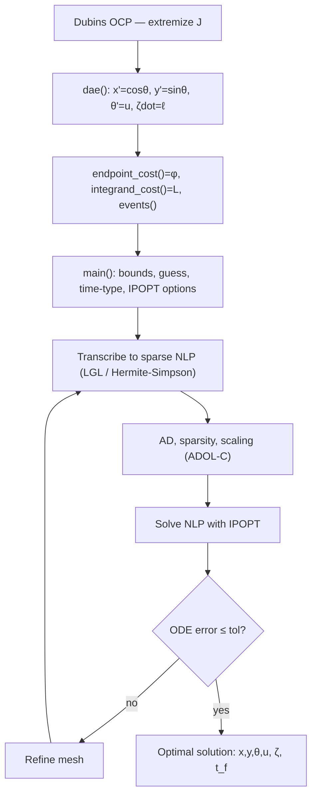

The time type sets only the $t_f$ bounds (T1 fixes it, T3 bounds it, T2 frees it) and
whether $t_f$ enters `endpoint_cost` (T4). Validate against a known closed form where one
exists, and check bang-bang structure.

---

## 7. Tool selection (tool × time type)

Fit matrix (● strong · ◐ workable · ○ poor):

| Tool (language) | License / cost | T1 fixed | T2 free | T3 bounded | T4 co-opt |
|---|---|---|---|---|---|
| CasADi (Py / C++ / MATLAB) | free, open (LGPL) | ● | ◐ | ● | ● |
| Pyomo.DAE (Python) | free, open (BSD) | ● | ● | ◐ | ◐ |
| JuMP + InfiniteOpt (Julia) | free, open (MIT/MPL) | ● | ● | ● | ● |
| GPOPS-II (MATLAB) | commercial; needs MATLAB | ● | ◐ | ● | ◐ |
| ICLOCS2 (MATLAB) | free, open; needs MATLAB | ● | ◐ | ● | ◐ |
| PSOPT (C++) | free, open | ● | ◐ | ● | ● |
| Drake (C++ / Python) | free, open (BSD) | ● | ◐ | ◐ | ◐ |
| acados (C / Python) | free, open (BSD/LGPL) | ● | ○ | ◐ | ● |
| Dymos / OpenMDAO (Python) | free, open (Apache) | ● | ◐ | ● | ◐ |

**Discriminators**
- T1 fixed — spectral accuracy on a fixed horizon → pseudospectral (GPOPS-II, ICLOCS2, PSOPT, InfiniteOpt, Dymos); onboard/real-time → acados.
- T2 free — time-adverse $J$: any tool with free-$t_f$ transversality (CasADi, PSOPT). Time-favorable $J$: needs staging/repair → JuMP and Pyomo cleanest; acados is the wrong tool.
- T3 bounded — same as T1 with $t_f$ a bounded variable; pseudospectral family again.
- T4 co-optimized — continuation / parametric sweep → CasADi (`P` as parameter), JuMP/InfiniteOpt, PSOPT (C++ driver), acados (online); pure min-time → closed-form Dubins or any tool.

JuMP+InfiniteOpt and CasADi comfortably span all four types from a single model — swap the
objective/constraint block and the $t_f$ handling.

**Licensing and cost.** Every tool above is free and open except GPOPS-II; the solver and
platform matter as much as the tool:
- Solvers: IPOPT is free (EPL) with the bundled MUMPS linear solver; its faster HSL solvers (MA57/86/97) need a license — free for academic, paid commercial. SNOPT and Knitro are commercial (SNOPT sold separately); WORHP is free for academics. acados' QP backends (HPIPM, qpOASES) are free.
- Platform: MATLAB is a paid product, so GPOPS-II, ICLOCS2, and ADiGator carry that cost even where the tool code itself is free.
- GPOPS-II is free only for University of Florida / State of Florida / K-12 classroom use; academic-research, not-for-profit, government, and commercial use require a license, and the C++ sibling CGPOPS runs $10.8k (single-user) to $108k (institution-wide).
- All-free route: any tool except GPOPS-II, on IPOPT; drop ICLOCS2 as well to avoid the MATLAB dependency, leaving the Python / Julia / C++ stack.

---

## 8. Flowcharts by time type and tool

Same model throughout; the objective block is generic ($\varphi$), the terminal block is
$\psi_f$ or a $J$-floor, and the $t_f$ handling is the type.

### T1 — fixed time

CasADi + IPOPT — single-pass, fixed grid.
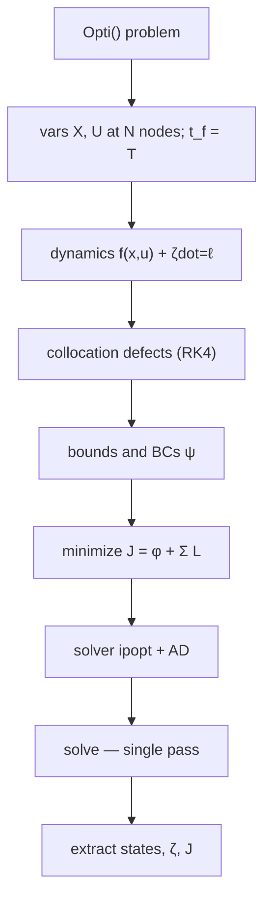

PSOPT + IPOPT — pseudospectral, fixed $t_f$, mesh-refine loop.
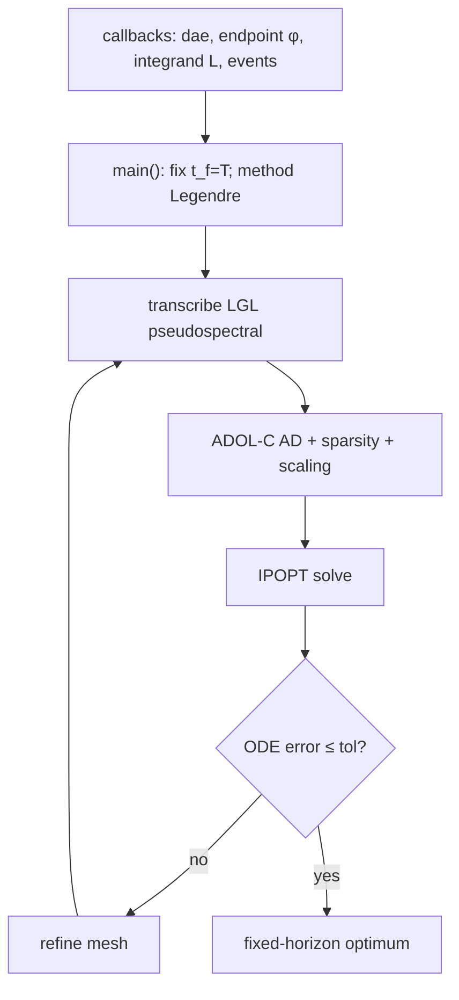

acados — fixed-horizon real-time MPC.
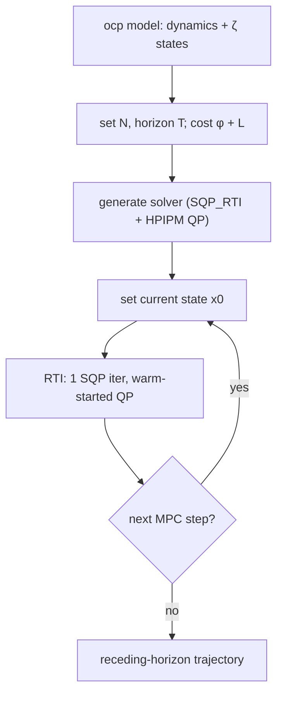

### T2 — free time

CasADi + IPOPT — free-$t_f$ single solve (time-adverse $J$, transversality).
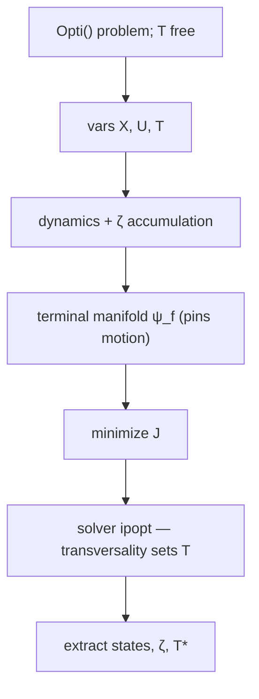

JuMP + Ipopt — two-stage lexicographic repair (time-favorable $J$).
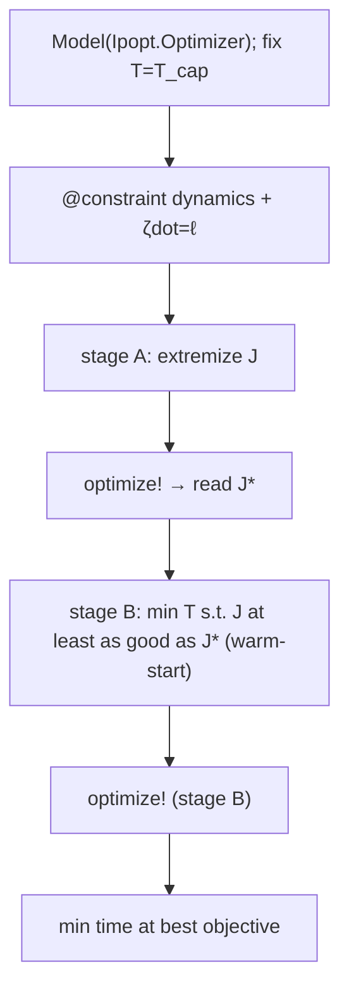

### T3 — bounded time

GPOPS-II + SNOPT (sparse finite differences — default) — hp-adaptive Radau, $t_f\le T_{\max}$.
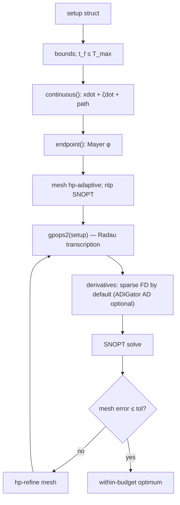

GPOPS-II + SNOPT (ADiGator AD) — same hp-adaptive Radau, exact derivatives via automatic differentiation.
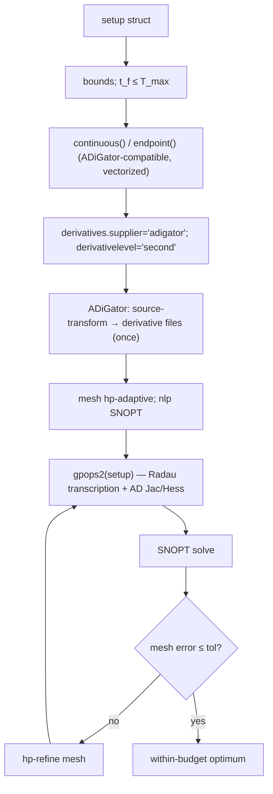

PSOPT + IPOPT — pseudospectral, $t_f$ bounded.
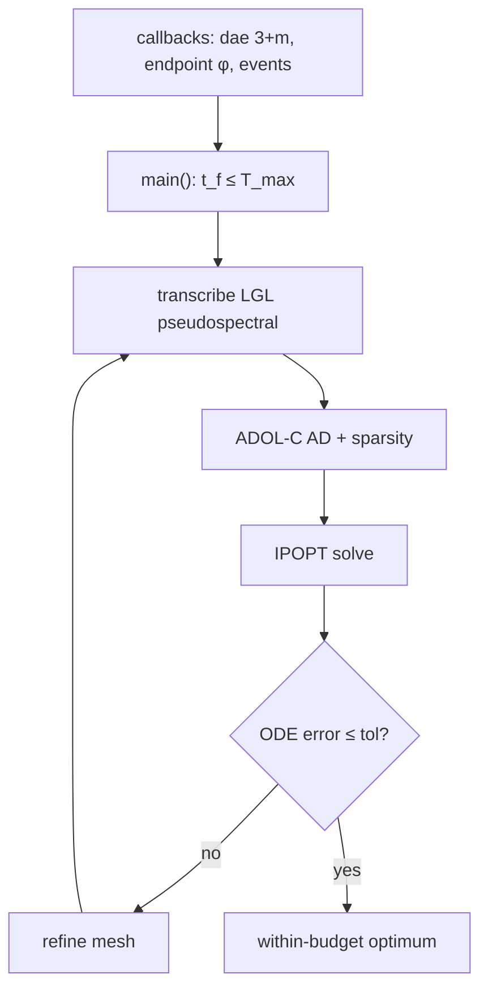

### T4 — co-optimized time

Closed-form Dubins (pure min-time, $J=t_f$, no solver).
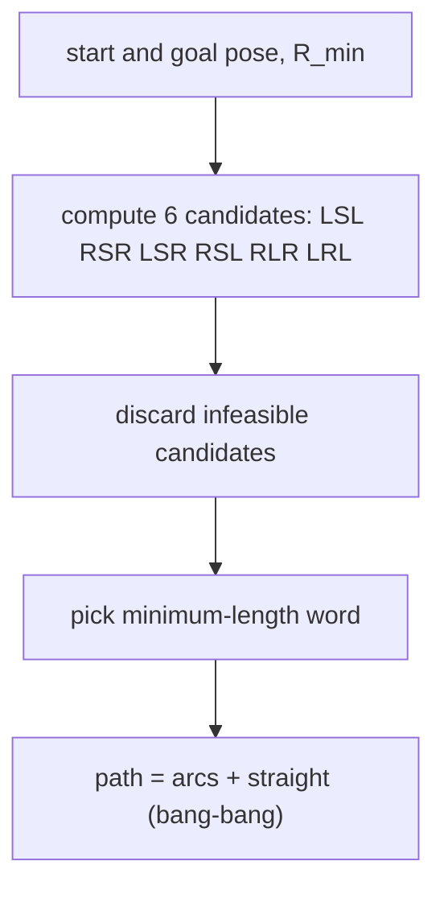

PSOPT + IPOPT — $\varepsilon$-constraint continuation (time-vs-$J$ trade).
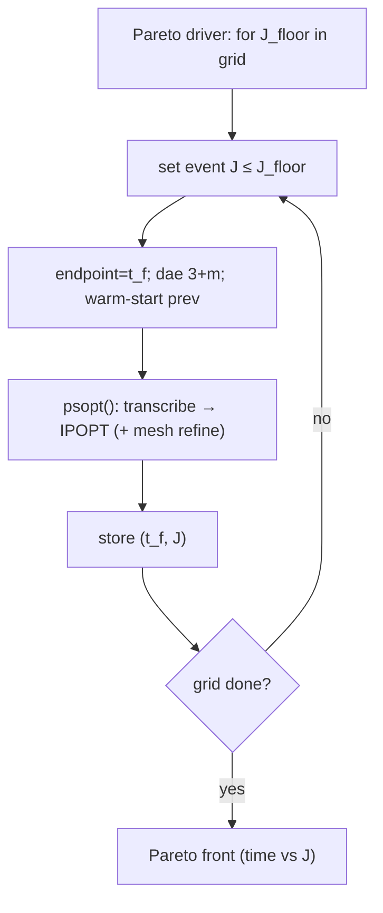

CasADi + IPOPT — parameter-based continuation, automatic warm-start.
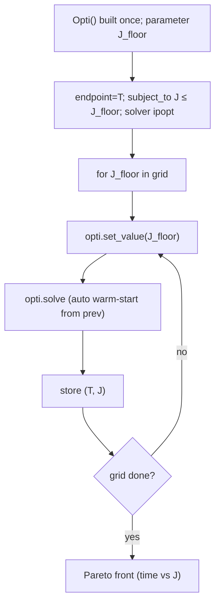

---

## 9. Representation axis — direct vs Koopman

Koopman is **not a tool**; it is a second axis (a dynamics representation) crossing the
tool choice.

**Exact bilinearization.** With observables $z=[x,\,y,\,\cos\theta,\,\sin\theta]^\top$ the
Dubins kinematics close exactly (no EDMD fitting):

$$
\dot z=Az+(Bz)\,u,\qquad Az=[\cos\theta,\ \sin\theta,\ 0,\ 0]^\top,\qquad Bz=[0,\ 0,\ -\sin\theta,\ \cos\theta]^\top.
$$

Position is linear in observables; the only remaining nonlinearity is the control
multiplying observables (control-bilinear). When closure fails for another system, EDMD
fits $A,B$ from data.

**Two caveats:**
1. It is a **kinematics** lift, not an objective lift. The accumulation states $\dot\zeta=\ell$
   and any nonlinear terminal $\varphi$ stay nonlinear, so the objective never linearizes.
2. The payoff is **time-type-dependent**. Fixed and bounded horizons (T1, T3) and MPC are
   where the bilinear lift pays (measured ~1.6× on fixed-horizon repeated solves). Free and
   co-optimized time (T2, T4) are where it backfires (measured ~4× slower): the time
   scaling $t=T\tau$ multiplies the dynamics by $T$ and re-introduces nonlinearity on every solve.

| Representation | T1 fixed | T2 free | T3 bounded | T4 co-opt |
|---|---|---|---|---|
| Direct nonlinear | ● | ● | ● | ● |
| Koopman-bilinear lift | ● | ○ | ● | ○ |

The Koopman ○ at T2/T4 is net-negative, not neutral. The lift earns its place only at
T1/T3 / fixed-horizon MPC.

**Offline lift construction (done once):**
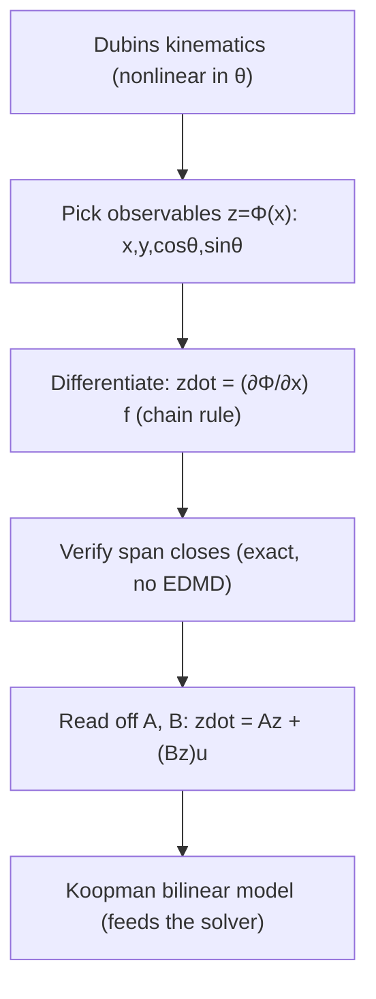

**Fixed/bounded horizon (T1/T3) — Koopman MPC, where it wins:**
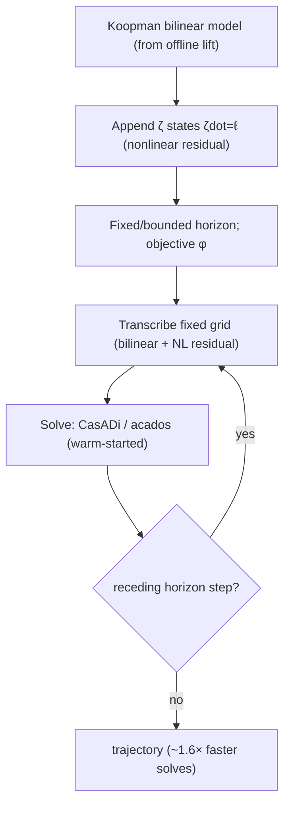

**Free/co-optimized time (T2/T4) — Koopman in the sweep, where it loses:**
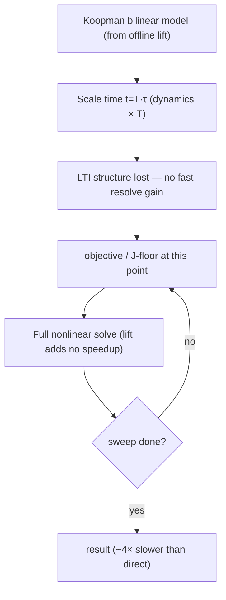

You build the lift once, amortize it across repeated fixed-horizon (T1/T3) MPC re-solves,
but do not carry it into a free or co-optimized time sweep. The representation axis adds a
decision *before* tool choice: pick direct-vs-lifted first, then the tool — and the lifted
branch is the right turn only at T1/T3 or genuinely fixed-horizon / onboard-MPC variants.

---

## 10. Decision guide

- One model, swap the objective/constraint block and the $t_f$ handling per type. Keep it in CasADi or JuMP+InfiniteOpt for a single codebase across all four time types.
- Time-favorable objective (grows with horizon) → never use free time (T2); fix (T1), bound (T3), or co-optimize (T4).
- Time-adverse objective (grows as cost with horizon) → free time (T2) is fine *if* a terminal manifold pins motion; otherwise it collapses to zero time.
- Spectral accuracy on a fixed/bounded horizon (T1/T3) → MATLAB pseudospectral (GPOPS-II / ICLOCS2) or PSOPT; onboard → acados.
- Time-vs-objective trade (T4) → PSOPT C++ continuation, or CasADi/JuMP parametric re-solve; acados if it must run online.
- Reach for the Koopman lift only at T1/T3 / MPC. Skip it for free and co-optimized time and for the objective itself.
- Always validate: where a closed form exists (pure min-time), check against it; confirm bang-bang control; mesh/ODE error below tolerance.

---

## References (tools and key sources)

- PSOPT — https://github.com/PSOPT/psopt
- CasADi — https://web.casadi.org
- Drake / `deliastephens/dubins` — PyDrake `MathematicalProgram`
- Kaya, *Markov–Dubins path via optimal control theory*, Computational Optimization and Applications, 2017
- GPOPS-II — hp-adaptive Gaussian quadrature collocation (commercial)
- ICLOCS2 — Imperial College London Optimal Control Software (free, MATLAB)
- Bocop — https://www.bocop.org
- bioptim — https://github.com/pyomeca/bioptim
- acados — real-time SQP / RTI
- Dymos / OpenMDAO — https://openmdao.org/dymos
- TUMFTM `global_racetrajectory_optimization` — min-lap-time OCP via Gauss–Legendre collocation + CasADi + IPOPT
