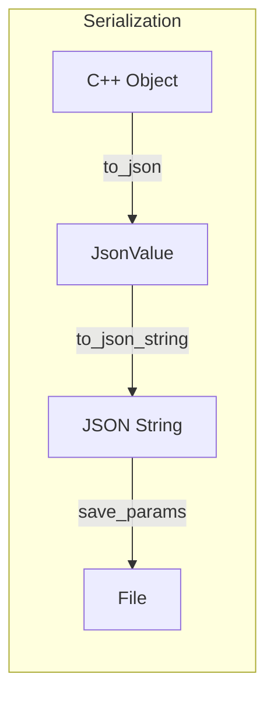
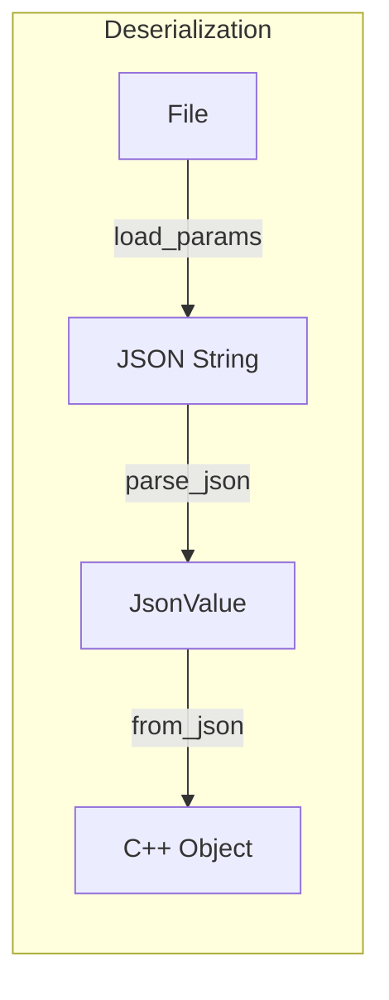
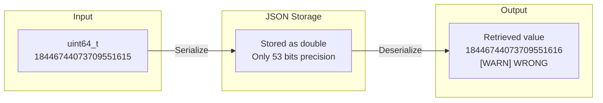
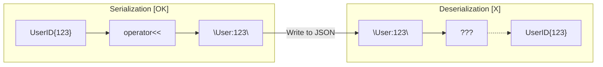

# User Manual - JsonLite

**Scope:** Complete usage guide for `fat_p::json::JsonValue`: the variant-based type system, serialization (C++ to JSON) and deserialization (JSON to C++), the macro system (DEFINE_TYPE_NON_INTRUSIVE, DEFINE_TYPE_OPTIONAL, DEFINE_TYPE_INTRUSIVE), stream parsing, numeric safety, container support, and JSON Pointer navigation.

**Not covered:**
- Expected-based JSON API (see FatPJsonLite User Manual)
- Binary serialization (see BinarySerialization)
- CBOR serialization (see Cbor User Manual)
- JSON Schema validation

**Prerequisites:** C++20; familiarity with JSON format; understanding of `std::variant`

---

## User Manual Card

**Component:** JsonLite
**Primary use case:** Parse, build, serialize, and deserialize JSON data with type-safe macros for struct mapping
**Integration pattern:** `#include "JsonLite.h"`, define structs with `FATP_JSON_DEFINE_TYPE_NON_INTRUSIVE` in the same namespace as the type, call `fat_p::save_params` / `fat_p::load_params` (ADL via `from_json_adl` — no using-namespace macro)
**Key API:** `JsonValue`, `to_json()`, `from_json<T>()`, `parseJson()`, `FATP_JSON_DEFINE_TYPE_NON_INTRUSIVE`, `FATP_JSON_DEFINE_TYPE_OPTIONAL`, `JsonPointer`
**std equivalent:** None
**Common mistakes:** Using throwing `from_json` without try/catch (use FatPJsonLite for Expected-based API); forgetting macro registration for nested types; assuming JSON numbers map to specific C++ types (JSON has one number type)
**Performance notes:** Single-pass parser. Variant storage uses the size of the largest JSON type. See `components/Json/results/` for current data

---
## Table of Contents

1. [What is JSON and Why JsonLite?](#what-is-json-and-why-jsonlite)
   - [Understanding JSON](#understanding-json)
   - [The C++ JSON Landscape](#the-c-json-landscape)
   - [Where JsonLite Fits](#where-jsonlite-fits)
2. [Core Architecture](#core-architecture)
   - [The Type System](#the-type-system)
   - [Why Variant-Based?](#why-variant-based)
   - [Design Decisions](#design-decisions)
3. [Getting Started](#getting-started)
   - [Prerequisites](#prerequisites)
   - [Integration](#integration)
   - [Compilation](#compilation)
   - [First Program](#first-program)
4. [The Macro System](#the-macro-system)
   - [FATP_JSON_DEFINE_TYPE_NON_INTRUSIVE](#fatp_json_define_type_non_intrusive)
   - [FATP_JSON_DEFINE_TYPE_OPTIONAL](#fatp_json_define_type_optional)
   - [FATP_JSON_DEFINE_TYPE_INTRUSIVE](#fatp_json_define_type_intrusive)
   - [Macro Limitations](#macro-limitations)
5. [Serialization: C++ to JSON](#serialization-c-to-json)
   - [Basic Types](#basic-types)
   - [Containers](#containers)
   - [Structs with Macros](#structs-with-macros)
   - [Converting to JSON String](#converting-to-json-string)
6. [Deserialization: JSON to C++](#deserialization-json-to-c)
   - [Two-Style API](#two-style-api)
   - [When to Use Which API](#when-to-use-which-api)
   - [Basic Types](#basic-types-1)
   - [Numeric Safety](#numeric-safety)
   - [Containers](#containers-1)
   - [Structs with Macros](#structs-with-macros-1)
   - [Direct Key Access](#direct-key-access)
7. [Parsing and Formatting](#parsing-and-formatting)
   - [Parsing JSON Strings](#parsing-json-strings)
   - [Formatting Policies](#formatting-policies)
8. [JSON Pointer (RFC 6901)](#json-pointer-rfc-6901)
   - [What is JSON Pointer?](#what-is-json-pointer)
   - [Basic Navigation](#basic-navigation)
   - [Type-Safe Queries](#type-safe-queries)
   - [Mutable Access](#mutable-access)
   - [Escape Sequences](#escape-sequences)
   - [Error Handling](#error-handling)
9. [File I/O](#file-io)
   - [High-Level Convenience Functions](#high-level-convenience-functions)
   - [Backup and Safe Saving](#backup-and-safe-saving)
   - [Low-Level File Operations](#low-level-file-operations)
   - [Error Handling](#error-handling-1)
10. [Policy System](#policy-system)
    - [StandardJsonPolicy](#standardjsonpolicy)
    - [PrettyJsonPolicy](#prettyjsonpolicy)
    - [CompatJsonPolicy](#compatjsonpolicy)
    - [ConfigJsonPolicy](#configjsonpolicy)
    - [Custom Policies](#custom-policies)
11. [Error Handling](#error-handling-2)
    - [Exception Types](#exception-types)
    - [Example Error Messages](#example-error-messages)
    - [Catching Errors](#catching-errors)
12. [Supported Types Reference](#supported-types-reference)
    - [Fundamental Types](#fundamental-types)
    - [Container Types](#container-types)
    - [Notes on Container Support](#notes-on-container-support)
13. [Advanced Patterns](#advanced-patterns)
    - [Nested Structures](#nested-structures)
    - [Heterogeneous Arrays](#heterogeneous-arrays)
    - [Custom Serialization](#custom-serialization)
    - [Polymorphism](#polymorphism)
14. [Comparison with Other Libraries](#comparison-with-other-libraries)
    - [JsonLite vs nlohmann/json](#jsonlite-vs-nlohmannjson)
    - [JsonLite vs RapidJSON](#jsonlite-vs-rapidjson)
    - [JsonLite vs simdjson](#jsonlite-vs-simdjson)
    - [JsonLite vs Boost.PropertyTree](#jsonlite-vs-boostpropertytree)
    - [JsonLite vs FatPJsonLite](#jsonlite-vs-fatpjsonlite)
15. [Use Case Guide](#use-case-guide)
    - [Configuration Files](#configuration-files)
    - [REST API Responses](#rest-api-responses)
    - [Game Save Files](#game-save-files)
    - [High-Frequency Trading / Real-Time](#high-frequency-trading--real-time)
    - [Large Data Processing](#large-data-processing)
    - [Embedded Systems](#embedded-systems)
    - [Cross-Platform Tools](#cross-platform-tools)
16. [Migration Guide](#migration-guide)
    - [From nlohmann/json to JsonLite](#from-nlohmannjson-to-jsonlite)
    - [From RapidJSON to JsonLite](#from-rapidjson-to-jsonlite)
    - [From Boost.PropertyTree to JsonLite](#from-boostpropertytree-to-jsonlite)
17. [Compiler Requirements](#compiler-requirements)
    - [Minimum Version](#minimum-version)
    - [Tested Compilers](#tested-compilers)
    - [Compilation Flags](#compilation-flags)
    - [Dependencies](#dependencies)
18. [Performance Characteristics](#performance-characteristics)
    - [Parsing Throughput](#parsing-throughput)
    - [Memory Usage](#memory-usage)
    - [Optimization Tips](#optimization-tips)
19. [Best Practices](#best-practices)
    - [Design Patterns](#design-patterns)
    - [Error Handling](#error-handling-3)
    - [Testing](#testing)
20. [Troubleshooting](#troubleshooting)
    - [Compilation Errors](#compilation-errors)
    - [Runtime Errors](#runtime-errors)
    - [Common Mistakes](#common-mistakes)
21. [Known Limitations](#known-limitations)
    - [Large Unsigned Integer Precision Loss](#large-unsigned-integer-precision-loss)
    - [Map Key Round-Trip Asymmetry](#map-key-round-trip-asymmetry)
    - [unordered_map Non-Deterministic Ordering](#unordered_map-non-deterministic-ordering)
    - [File Write Atomicity](#file-write-atomicity)
22. [Summary](#summary)

---

## What is JSON and Why JsonLite?

### The Problem JSON Solves

In 2001, Douglas Crockford faced a common problem: how do you send structured data between a web server and a browser? XML was the standard answer, but XML is verbose, complex, and painful to parse in JavaScript. Crockford noticed that JavaScript already had a built-in way to represent data--object literals--and that this syntax was simple enough to use as a data format.

He called it JSON: JavaScript Object Notation.

```json
{
    "name": "Alice",
    "age": 30,
    "active": true,
    "roles": ["admin", "developer"]
}
```

That's it. No schemas, no namespaces, no attributes vs. elements debate. Just data.

JSON won. Today it's everywhere: REST APIs, configuration files, NoSQL databases, logging systems, message queues. If two systems need to exchange structured data, they're probably using JSON.

### Why JSON Works

JSON succeeded because it hits a sweet spot:

**Human-readable**: Unlike binary formats, you can open a JSON file in a text editor and understand it. You can copy-paste it, edit it by hand, diff it in version control.

**Machine-friendly**: Unlike XML, JSON maps directly to data structures that every programming language has: objects/dictionaries/maps, arrays/lists, strings, numbers, booleans, null.

**Simple specification**: The entire JSON grammar fits on a business card. There's one way to represent each concept, not five competing standards.

### JSON's Six Types

A JSON document is built from just six types:

| Type | Example | C++ Equivalent |
|------|---------|----------------|
| **null** | `null` | `std::nullptr_t`, empty `std::optional` |
| **boolean** | `true`, `false` | `bool` |
| **number** | `42`, `3.14`, `-17` | `int64_t`, `double` |
| **string** | `"hello"` | `std::string` |
| **array** | `[1, 2, 3]` | `std::vector<T>` |
| **object** | `{"key": "value"}` | `std::map<std::string, T>` |

That's the entire data model. Objects and arrays can nest arbitrarily deep, giving you trees of any complexity--but the building blocks remain simple.

### The C++ JSON Challenge

C++ didn't get a standard JSON library. The language committee has discussed it, but as of C++23, you still need a third-party library. This means choosing from dozens of options, each with different trade-offs:

**nlohmann/json** is the most popular choice--intuitive API, great documentation, feels like using a scripting language. But it uses implicit conversions that can hide bugs, and it's a 25,000-line header.

**RapidJSON** is the speed champion--400-1000 MB/s parsing, custom allocators, SAX and DOM modes. But the API is verbose and C-style, requiring manual memory management in some cases.

**simdjson** is the research breakthrough--2-4 GB/s parsing using SIMD instructions, literally faster than `memcpy` on some systems. But it's read-only (can't modify or generate JSON) and requires specific CPU features.

**Boost.PropertyTree** comes with Boost and handles multiple formats (JSON, XML, INI). But it predates modern JSON libraries and doesn't provide true JSON semantics--arrays are awkward, and everything is stringly-typed.

### Where JsonLite Fits

JsonLite exists for a specific situation: **you need to load and save configuration files, and you can't (or don't want to) add external dependencies**.

This comes up more often than you'd think:
- Header-only libraries that shouldn't force dependencies on users
- Embedded systems where every dependency must be vetted
- Corporate environments with strict approval processes
- Scientific code where reproducibility matters
- Simple tools where pulling in nlohmann/json feels like overkill

### JSONC: Comments in Configuration Files

One feature deserves special attention: **JsonLite supports JSONC (JSON with Comments)**.

Standard JSON doesn't allow comments. Douglas Crockford excluded them deliberately, worried that people would use comments for parsing directives (like XML's `<?xml?>` declarations). But for configuration files, this is painful. You want to document why a timeout is set to 30 seconds, or warn that changing a setting requires a restart.

JSONC is JSON with `//` and `/* */` comments, popularized by VS Code's settings files. JsonLite parses JSONC natively:

```jsonc
{
    // Server configuration
    "port": 8080,           // Default HTTP port
    "host": "localhost",
    
    /* Database connection settings.
       Timeout is in seconds.
       WARNING: Values over 60 may cause issues with load balancers. */
    "database": {
        "host": "db.example.com",
        "timeout": 30
    }
}
```

```cpp
// Parse with ConfigJsonPolicy to enable comment support
JsonValue config = parse_json<ConfigJsonPolicy>(jsonc_string);
```

This matters because **configuration files should be self-documenting**. When someone opens `server_config.json` six months from now, they should understand what each setting does without consulting external documentation.

### JsonLite's Trade-offs

JsonLite makes deliberate trade-offs for configuration file use cases:

| Priority | JsonLite Choice | Trade-off |
|----------|-----------------|-----------|
| **Safety** | All numeric conversions check for overflow | Slower than unchecked libraries |
| **Simplicity** | Core JSON + JSON Pointer only | No streaming, no JSON Patch, no binary |
| **Clarity** | Explicit type conversions | More verbose than implicit APIs |
| **Modern C++** | Requires C++17, uses `std::variant` | Won't work with older compilers |
| **Zero dependencies** | Standard library only | No `{fmt}`, no SIMD, no compression |
| **Comments** | JSONC support via ConfigJsonPolicy | Comments stripped on save (not round-tripped) |

**JsonLite is not trying to be the best JSON library.** It's trying to be the right choice when you need safe, simple, dependency-free JSON for configuration files.

If you're parsing gigabytes of JSON, use simdjson. If you want the nicest API, use nlohmann/json. If you need maximum speed with mutation, use RapidJSON. But if you're loading `config.json` at startup and want comments, type safety, and zero dependencies, JsonLite is here for you.

---

## Core Architecture

### The Central Question: How Do You Represent "Any JSON Value"?

Here's the fundamental problem every JSON library must solve: a JSON value can be a string, a number, a boolean, null, an array of values, or an object containing values. In a statically-typed language like C++, how do you represent "a value that could be any of these things"?

Different libraries answer this differently, and the choice shapes everything about the API.

### Approach 1: The Inheritance Hierarchy (glog, older libraries)

Create a base class `JsonValue` with virtual methods, then derive `JsonString`, `JsonNumber`, `JsonArray`, etc.:

```cpp
class JsonValue {
public:
    virtual ~JsonValue() = default;
    virtual JsonType type() const = 0;
};

class JsonString : public JsonValue { /* ... */ };
class JsonNumber : public JsonValue { /* ... */ };
```

**Problems:**
- Every value requires heap allocation (even `true` or `42`)
- Virtual function calls on every access
- Easy to forget to check types before casting
- Memory fragmentation from many small allocations

### Approach 2: The Tagged Union (RapidJSON)

Store a type tag and a union of possible values:

```cpp
class JsonValue {
    enum Type { Null, Bool, Int, Double, String, Array, Object };
    Type type_;
    union {
        bool b;
        int64_t i;
        double d;
        // strings and containers need special handling...
    };
};
```

**Problems:**
- Manual memory management for strings/arrays/objects
- No compile-time enforcement--runtime checks everywhere
- Easy to access the wrong union member (undefined behavior)

### Approach 3: The std::variant (JsonLite, modern libraries)

C++17 introduced `std::variant`--a type-safe tagged union that the compiler manages for you:

```cpp
using JsonValue = std::variant<
    std::nullptr_t,  // null
    bool,            // boolean
    int64_t,         // integer
    double,          // floating-point
    std::string,     // string
    JsonArray,       // array (vector<JsonValue>)
    JsonObject       // object (map<string, JsonValue>)
>;
```

**Why this is better:**
- **Type-safe**: `std::get<int64_t>(value)` throws if value isn't an integer--no undefined behavior
- **Value semantics**: Copy a `JsonValue`, get a deep copy. No shared state surprises.
- **Small-value optimization**: `bool`, `int64_t`, `double`, and `nullptr_t` are stored inline--no heap allocation
- **Pattern matching**: `std::visit` lets you handle all cases exhaustively

**The trade-off:** More verbose access than implicit-conversion libraries:

```cpp
// nlohmann/json - implicit, convenient, potentially surprising
json j = {{"port", 8080}};
int port = j["port"];  // What if "port" is actually a string "8080"?

// JsonLite - explicit, verbose, predictable
JsonObject obj;
obj["port"] = to_json(8080);
int port = from_json<int>(obj.at("port"));  // Throws if not an integer
```

JsonLite chose explicitness. You always know exactly what type conversion is happening.

### The Number Problem

JSON has one number type. C++ has twelve: `int8_t`, `int16_t`, `int32_t`, `int64_t`, their unsigned variants, `float`, `double`, `int`, `long`, `long long`...

How do you store a JSON number so that round-tripping preserves the value?

**JsonLite's answer:** Store integers as `int64_t` and floating-point as `double`.

```cpp
// All of these become int64_t internally
to_json(42);           // int -> int64_t
to_json(42L);          // long -> int64_t  
to_json(42LL);         // long long -> int64_t
to_json(uint16_t(42)); // uint16_t -> int64_t

// All of these become double internally
to_json(3.14f);        // float -> double
to_json(3.14);         // double -> double
```

When you deserialize, JsonLite checks that the value actually fits:

```cpp
JsonValue big = to_json(INT64_MAX);
int8_t small = from_json<int8_t>(big);  // THROWS: value exceeds int8_t range

JsonValue pi = to_json(3.14159);
int truncated = from_json<int>(pi);     // THROWS: would lose fractional part
```

This catches bugs. Other libraries would silently give you garbage.

### Memory Layout

Understanding the memory layout helps you reason about performance:

```cpp
// JsonValue is approximately this size:
// - 8 bytes: variant index (which type is active)
// - 32 bytes: largest alternative (std::string with SSO, or container)
// Total: ~40 bytes on 64-bit systems

// Small values (null, bool, int64_t, double) are stored inline--no heap
JsonValue b = to_json(true);     // No allocation
JsonValue n = to_json(42);       // No allocation
JsonValue d = to_json(3.14);     // No allocation

// Strings use std::string's small-string optimization
JsonValue s = to_json("hello");  // Likely no allocation (SSO)
JsonValue l = to_json("a very long string that exceeds SSO"); // Heap allocation

// Arrays and objects always involve heap allocation
JsonArray arr;   // Heap for vector storage
JsonObject obj;  // Heap for map storage
```

For configuration files, this is fine. You're parsing once at startup, not in a tight loop.

### Design Decisions Explained

**Why `int64_t` for all integers?**

JSON doesn't distinguish `int` from `long` from `int64_t`. If you store `42` as `int` and the JSON came from a system that used `long`, you've lost information. Using `int64_t` everywhere means any integer that fits in 64 bits round-trips correctly.

**Why no implicit conversions?**

Consider this code with implicit conversions:
```cpp
json config = load("config.json");
int timeout = config["timeout"];  // What if timeout is "30" (a string)?
```

With implicit conversions, you might get 0, or an exception, or undefined behavior--depending on the library. With JsonLite, you write `from_json<int>(...)` and get a clear error: "expected integer but got string."

**Why exceptions?**

Configuration loading is a "parse once, use forever" operation. If the config is malformed, you want to know immediately with a clear error message, not check error codes at every access. For hot paths where exceptions are inappropriate, see FatPJsonLite.

**Why `std::map` instead of `std::unordered_map` for objects?**

JSON objects are conceptually unordered, but `std::map` gives you:
- Deterministic iteration order (alphabetical by key)
- Deterministic serialization output (same input -> same output)
- Easier debugging (keys in predictable order)

The performance difference is negligible for configuration-sized objects.

---

## Getting Started

### Prerequisites

- C++17 or later compiler
- Standard library with `<variant>`, `<optional>`, `<string_view>`

### Integration

JsonLite is a single-header library. Add `include/fat_p` to your include path and include the header:

```cpp
#include "JsonLite.h"
```

No link step. No using-namespace import macro is required.

Struct macros dispatch nested fields through `json_detail::from_json_adl` / `to_json_adl`
(the same pattern as XmlLite's `from_xml_adl`). Those helpers bring `fat_p::from_json` /
`fat_p::to_json` into scope and then apply ADL for user-defined nested types. Define
`FATP_JSON_DEFINE_TYPE_*` in the **same namespace as the struct** so the generated
`to_json` / `from_json` overloads are found for your types.

Qualify JsonLite types and free functions with `fat_p::` (for example `fat_p::JsonValue`,
`fat_p::save_params`, `fat_p::parse_json`). Optional `using fat_p::save_params;` declarations
in a `.cpp` file are fine; avoid `using namespace fat_p` in headers.

### Compilation

**Minimum flags:**
```bash
g++ -std=c++17 -I/path/to/headers main.cpp -o app
```

**Recommended flags:**
```bash
g++ -std=c++17 -O2 -Wall -Wextra -I/path/to/headers main.cpp -o app
```

**Debug with sanitizers:**
```bash
g++ -std=c++17 -g -fsanitize=address,undefined -I/path/to/headers main.cpp -o app
```

### First Program

```cpp
#include "JsonLite.h"
#include <iostream>

struct Config
{
    int port;
    std::string host;
    std::optional<int> timeout;
};
FATP_JSON_DEFINE_TYPE_NON_INTRUSIVE(Config, port, host, timeout)

int main()
{
    Config cfg{8080, "localhost", 30};
    
    fat_p::save_params("config.json", cfg);
    
    Config loaded = fat_p::load_params<Config>("config.json");
    
    std::cout << "Port: " << loaded.port << "\n";
    std::cout << "Host: " << loaded.host << "\n";
    if (loaded.timeout)
    {
        std::cout << "Timeout: " << *loaded.timeout << "\n";
    }
    
    return 0;
}
```

This program:
1. Defines a `Config` struct with three fields
2. Uses the macro to automatically generate serialization code
3. Saves the config to a JSON file
4. Loads it back and prints the values

---

## The Macro System

### Why Macros for Serialization?

Without macros, serializing a simple struct requires writing tedious boilerplate:

```cpp
struct Person
{
    std::string name;
    int age;
};

// Manual serialization - you must write this for every struct
inline void to_json(JsonValue& j, const Person& p)
{
    JsonObject obj;
    obj["name"] = to_json(p.name);
    obj["age"] = to_json(p.age);
    j = obj;
}

inline void from_json(const JsonValue& j, Person& p)
{
    const auto& obj = std::get<JsonObject>(j);
    p.name = from_json<std::string>(obj.at("name"));
    p.age = from_json<int>(obj.at("age"));
}
```

This is error-prone (field names repeated as strings), verbose, and must be updated whenever you add a field. For a struct with 10 fields, you're writing 20+ lines of nearly identical code.

**JsonLite's macros generate this code automatically:**

```cpp
struct Person
{
    std::string name;
    int age;
};

FATP_JSON_DEFINE_TYPE_NON_INTRUSIVE(Person, name, age)  // That's it!
```

The macro expands to the same `to_json()` and `from_json()` functions, but you only list each field once. Add a field? Add it to the macro. Remove a field? Remove it from the macro.

### The Three Macros

JsonLite provides three macros for different use cases:

| Macro | Placement | Missing Fields | Use When |
|-------|-----------|----------------|----------|
| `FATP_JSON_DEFINE_TYPE_NON_INTRUSIVE` | Outside class | Error | You don't control the type |
| `FATP_JSON_DEFINE_TYPE_OPTIONAL` | Outside class | Keep default | Fields have sensible defaults |
| `FATP_JSON_DEFINE_TYPE_INTRUSIVE` | Inside class | Error | You need private field access |

### FATP_JSON_DEFINE_TYPE_NON_INTRUSIVE

This macro defines serialization functions **outside** the class definition. Use this for types 
you don't control or when you want to keep serialization logic separate.

```cpp
struct Person
{
    std::string name;
    int age;
    std::optional<std::string> email;
};

FATP_JSON_DEFINE_TYPE_NON_INTRUSIVE(Person, name, age, email)
```

**Requirements:**
- All fields must be public (use INTRUSIVE for private fields)
- All fields must be listed in the macro
- Macro must be called in the same namespace as the type

> **Common Error:** If you get a compile error like "cannot access private member",
> your struct has private fields. Either make them public or use 
> `FATP_JSON_DEFINE_TYPE_INTRUSIVE` inside the class body instead.

**Behavior:**
- Missing optional fields are set to `std::nullopt`
- Missing required fields throw `std::runtime_error`
- Extra fields in JSON are ignored

### FATP_JSON_DEFINE_TYPE_OPTIONAL

This macro makes **all fields optional** with default values. If a field is missing from JSON, 
its current value is preserved (typically the default-initialized value).

```cpp
struct Config
{
    int port = 8080;
    std::string host = "localhost";
    int timeout = 30;
};

FATP_JSON_DEFINE_TYPE_OPTIONAL(Config, port, host, timeout)
```

**Use cases:**
- Configuration files where most fields have sensible defaults
- Partial updates where you want to preserve existing values
- Backward compatibility when adding new fields

**Example:**
```cpp
Config cfg{8080, "localhost", 30};
std::string json = R"({"port": 9000})";  // Only port specified
JsonValue val = parse_json(json);
from_json(val, cfg);  // port = 9000, host = "localhost", timeout = 30
```

### FATP_JSON_DEFINE_TYPE_INTRUSIVE

This macro defines serialization functions **inside** the class definition. Use this when you 
control the type and want to keep everything together.

```cpp
struct Point
{
    double x, y;
    
    FATP_JSON_DEFINE_TYPE_INTRUSIVE(Point, x, y)
};
```

**Requirements:**
- Macro must be called inside the class body
- Macro must have access to all fields (public or friend)
- All fields must be listed in the macro

**Advantages:**
- Serialization logic stays with the type
- Can access private fields
- Better encapsulation

### Macro Limitations

**What macros cannot handle:**
- Computed fields (e.g., area = width * height)
- Fields with custom serialization logic
- Polymorphic types (inheritance)
- Types requiring validation
- Circular references

For these cases, write custom `to_json()` and `from_json()` functions:

```cpp
struct Circle
{
    double radius;
    double area() const { return 3.14159 * radius * radius; }
};

inline void to_json(JsonValue& j, const Circle& c)
{
    JsonObject obj;
    obj["radius"] = c.radius;
    obj["area"] = c.area();  // Computed field
    j = obj;
}

inline void from_json(const JsonValue& j, Circle& c)
{
    const auto& obj = std::get<JsonObject>(j);
    c.radius = from_json<double>(obj.at("radius"));
    // area is computed, not loaded
}
```

---

## Serialization: C++ to JSON

### What is Serialization?

**Serialization** is the process of converting C++ objects into a format that can be stored or transmitted--in this case, JSON text. The reverse process (**deserialization**) reconstructs C++ objects from JSON text.





**Why serialize?**
- **Persistence**: Save application state to disk (configuration, user preferences, game saves)
- **Communication**: Send data between processes or over the network (REST APIs, IPC)
- **Interoperability**: Exchange data with systems written in other languages

JsonLite's `to_json()` function handles serialization. It converts C++ values into `JsonValue` objects, which can then be formatted as JSON strings.

### Basic Types

JsonLite supports automatic serialization of fundamental types:

```cpp
// Integers
JsonValue j1 = to_json(42);           // int64_t
JsonValue j2 = to_json(42u);          // uint32_t -> int64_t
JsonValue j3 = to_json(42L);          // long -> int64_t
JsonValue j4 = to_json(INT64_MAX);    // Maximum integer

// Floating-point
JsonValue j5 = to_json(3.14);         // double
JsonValue j6 = to_json(3.14f);        // float -> double

// Boolean
JsonValue j7 = to_json(true);         // bool
JsonValue j8 = to_json(false);

// String
JsonValue j9 = to_json(std::string("hello"));
JsonValue j10 = to_json("world");     // const char* -> std::string

// Null
JsonValue j11 = to_json(nullptr);     // std::nullptr_t
```

**Important**: All integer types are converted to `int64_t` internally. All floating-point types 
are converted to `double`. This ensures no precision loss during round-tripping.

### Containers

JsonLite supports STL containers with automatic serialization:

```cpp
// Vectors -> JSON array
std::vector<int> vec{1, 2, 3, 4, 5};
JsonValue j1 = to_json(vec);  // [1, 2, 3, 4, 5]

// Sets -> JSON array (unordered)
std::set<std::string> set{"apple", "banana", "cherry"};
JsonValue j2 = to_json(set);  // ["apple", "banana", "cherry"]

// Maps -> JSON object
std::map<std::string, int> map{{"a", 1}, {"b", 2}};
JsonValue j3 = to_json(map);  // {"a": 1, "b": 2}

// Nested containers
std::vector<std::vector<int>> matrix{{1, 2}, {3, 4}};
JsonValue j4 = to_json(matrix);  // [[1, 2], [3, 4]]

// Optional values
std::optional<int> some = 42;
std::optional<int> none = std::nullopt;
JsonValue j5 = to_json(some);  // 42
JsonValue j6 = to_json(none);  // null
```

**Supported container types:**
- `std::vector<T>`
- `std::deque<T>`
- `std::list<T>`
- `std::set<T>`
- `std::unordered_set<T>`
- `std::map<std::string, T>`
- `std::unordered_map<std::string, T>`
- `std::optional<T>`
- `std::pair<T, U>`
- `std::tuple<Ts...>`
- C-style arrays: `T[N]`

### Structs with Macros

For structs, use one of the three macros to generate serialization code:

```cpp
struct Address
{
    std::string street;
    std::string city;
    int zip;
};
FATP_JSON_DEFINE_TYPE_NON_INTRUSIVE(Address, street, city, zip)

Address addr{"123 Main St", "Springfield", 12345};
JsonValue j = to_json(addr);
// {"street": "123 Main St", "city": "Springfield", "zip": 12345}
```

### Converting to JSON String

Once you have a `JsonValue`, convert it to a string:

```cpp
JsonValue j = to_json(42);

// Compact format (default)
std::string compact = to_json_string(j);  // "42"

// Pretty format
std::string pretty = to_json_string<PrettyJsonPolicy>(j);
// 42
```

For objects:
```cpp
struct Config { int port; std::string host; };
FATP_JSON_DEFINE_TYPE_NON_INTRUSIVE(Config, port, host)

Config cfg{8080, "localhost"};
JsonValue j = to_json(cfg);

// Compact: {"port":8080,"host":"localhost"}
std::string compact = to_json_string(j);

// Pretty:
// {
//   "port": 8080,
//   "host": "localhost"
// }
std::string pretty = to_json_string<PrettyJsonPolicy>(j);
```

---

## Deserialization: JSON to C++

### What is Deserialization?

Deserialization is the reverse of serialization: reconstructing C++ objects from JSON text. This is what happens when you load a configuration file, receive an API response, or read saved game data.

The challenge is that JSON and C++ have different type systems:

| JSON | C++ Problem |
|------|-------------|
| `42` | Is this `int`, `long`, `int64_t`, `double`? |
| `3.14` | Is this `float` or `double`? |
| `"hello"` | `std::string`, `const char*`, `std::string_view`? |
| `[1, 2, 3]` | `std::vector`, `std::array`, `std::list`? |
| `null` | `std::optional`, `nullptr`, empty string? |

JsonLite solves this with **explicit type specification**--you tell it exactly what C++ type you want, and it either converts safely or throws an error. No silent data loss, no implicit conversions.

### Why Two API Styles?

JsonLite provides two ways to deserialize because different situations call for different code patterns:

**Value-returning API** (`from_json<T>()`):
```cpp
const int port = from_json<int>(json["port"]);
```
- Returns the converted value directly
- Enables `const` variables (immutability)
- Cleaner, more functional style
- Perfect for most use cases

**Reference-based API** (`from_json(json, variable)`):
```cpp
int port;
from_json(json["port"], port);
```
- Modifies an existing variable
- Useful when you can't use `const` (e.g., filling struct members in a loop)
- Matches patterns from other libraries (nlohmann/json)

**Which should you use?** Default to value-returning. It's cleaner and prevents accidentally using uninitialized variables. Use reference-based only when you have a specific reason.

### Basic Type Conversions

```cpp
JsonValue j_int = to_json(42);
JsonValue j_double = to_json(3.14);
JsonValue j_bool = to_json(true);
JsonValue j_str = to_json(std::string("hello"));

// Value-returning API (preferred)
const int x = from_json<int>(j_int);
const double y = from_json<double>(j_double);
const bool flag = from_json<bool>(j_bool);
const std::string s = from_json<std::string>(j_str);

// Reference-based API (when needed)
int x2;
from_json(j_int, x2);
```

### Numeric Safety: Why JsonLite is Strict

Many JSON libraries silently truncate or convert numbers. This causes subtle bugs:

```cpp
// Other libraries might do this silently:
double pi = 3.14159;
int truncated = static_cast<int>(pi);  // 3 - lost precision!

int64_t big = 9'000'000'000'000'000'000LL;
int32_t overflow = static_cast<int32_t>(big);  // Garbage value!
```

**JsonLite refuses unsafe conversions:**

```cpp
JsonValue j_double = to_json(3.7);

// This throws - fractional part would be lost
int x = from_json<int>(j_double);  // ERROR: "Cannot convert 3.7 to integer"

// This works - you asked for double, you get double
double y = from_json<double>(j_double);  // OK: 3.7

// Integer overflow detection
JsonValue j_big = to_json(INT64_MAX);
int8_t small = from_json<int8_t>(j_big);  // ERROR: "Value exceeds int8_t range"

// Negative to unsigned
JsonValue j_neg = to_json(-42);
unsigned int u = from_json<unsigned int>(j_neg);  // ERROR: "Cannot convert negative to unsigned"
```

**What gets checked:**
- Integer overflow (value too large for target type)
- Fractional loss (double -> int when fractional part exists)
- Sign loss (negative -> unsigned)
- Type mismatch (string -> int)

This strictness catches bugs at development time rather than causing silent data corruption in production.

// Integer overflow detection
JsonValue j_big = to_json(INT64_MAX);
int8_t small = from_json<int8_t>(j_big);  // ERROR! Overflow

// Negative to unsigned
JsonValue j_neg = to_json(-42);
unsigned int u = from_json<unsigned int>(j_neg);  // ERROR! Negative
```

**Overflow checking applies to:**
- All signed integer types: int8_t, int16_t, int32_t, int64_t, int, long, etc.
- All unsigned integer types: uint8_t, uint16_t, uint32_t, uint64_t, unsigned, etc.
- Floating-point to integer conversions (checks for fractional part)
- Negative to unsigned conversions

**No artificial margins**: JsonLite supports the full range of int64_t and double without 
reducing available values for safety margins.

### Container Conversions

JSON arrays map naturally to C++ sequence containers, and JSON objects map to associative containers. JsonLite handles the conversion automatically:

| JSON | C++ Options |
|------|-------------|
| `[1, 2, 3]` | `std::vector<int>`, `std::list<int>`, `std::set<int>` |
| `{"a": 1}` | `std::map<std::string, int>`, `std::unordered_map<...>` |
| `null` | `std::optional<T>` with `std::nullopt` |

```cpp
JsonValue j_vec = to_json(std::vector<int>{1, 2, 3});
JsonValue j_set = to_json(std::set<std::string>{"a", "b"});
JsonValue j_map = to_json(std::map<std::string, int>{{"x", 1}});

// Deserialize - specify the exact container type you want
const auto vec = from_json<std::vector<int>>(j_vec);
const auto set = from_json<std::set<std::string>>(j_set);
const auto map = from_json<std::map<std::string, int>>(j_map);
```

**Handling missing/null values with `std::optional`:**

A common problem: what if a JSON field might be missing or null? In C, you'd use a sentinel value (-1 for "no timeout") or a separate boolean. Modern C++ has `std::optional`:

```cpp
JsonValue j_some = to_json(42);
JsonValue j_null = to_json(nullptr);

const auto opt1 = from_json<std::optional<int>>(j_some);  // has_value() == true, *opt1 == 42
const auto opt2 = from_json<std::optional<int>>(j_null);  // has_value() == false
```

### Struct Deserialization

With macros, deserializing structs is automatic:

```cpp
struct Person
{
    std::string name;
    int age;
};
FATP_JSON_DEFINE_TYPE_NON_INTRUSIVE(Person, name, age)

std::string json = R"({"name": "Alice", "age": 30})";
JsonValue j = parse_json(json);

// Value-returning API
const Person p = from_json<Person>(j);

// Reference-based API
Person p2;
from_json(j, p2);
```

### Direct Key Access

For JSON objects, you can access values directly by key:

```cpp
JsonValue j = parse_json(R"({"name": "Bob", "age": 25})");
const auto& obj = std::get<JsonObject>(j);

// Type-safe extraction
const std::string name = from_json<std::string>(obj.at("name"));
const int age = from_json<int>(obj.at("age"));

// With optional
const auto email = obj.count("email") 
    ? from_json<std::string>(obj.at("email"))
    : std::string("no-email");
```

---

## Parsing and Formatting

### The Two Halves of JSON Processing

So far we've discussed **serialization** (C++ -> JsonValue) and **deserialization** (JsonValue -> C++). But there's another dimension: converting between `JsonValue` objects and actual JSON text strings.

```
              to_json()              to_json_string()
C++ Object  ------------>  JsonValue  ------------------>  JSON String
            serialization               formatting

              from_json()              parse_json()
C++ Object  ------------>  JsonValue  ------------------>  JSON String
            deserialization            parsing
```

**Parsing** converts JSON text (from files, network, user input) into `JsonValue` objects you can work with. **Formatting** converts `JsonValue` objects back into JSON text strings.

Why separate them? Because you might want different formatting for different purposes:
- Compact for network transmission (save bandwidth)
- Pretty-printed for config files (human readability)
- With comments for documentation (JSONC format)

### Parsing JSON Strings

The `parse_json()` function converts JSON text into a `JsonValue`:

```cpp
std::string json = R"({"name": "Alice", "age": 30})";

try
{
    JsonValue val = parse_json(json);
    // val now contains parsed JSON
}
catch (const std::runtime_error& e)
{
    std::cerr << "Parse error: " << e.what() << "\n";
}
```

**Why parsing can fail:**
- Syntax errors (missing quotes, commas, braces)
- Invalid escape sequences
- Invalid Unicode
- Unexpected end of input

**JsonLite provides detailed error messages** so you can find and fix problems:

```
JSON parse error at position 15: expected ':' but got ','
    "name": "Alice", "age": 30}
                   ^
```

The caret shows exactly where parsing failed, and the message explains what went wrong.

### Formatting Policies

JsonLite supports multiple formatting policies for JSON output.

#### StandardJsonPolicy (Default)

Produces compact JSON with minimal whitespace:

```cpp
JsonValue j = parse_json(R"({"name": "Alice", "age": 30})");
std::string output = to_json_string(j);
// {"name":"Alice","age":30}
```

**Use when:**
- Minimizing file size
- Network transmission
- Machine-to-machine communication

#### PrettyJsonPolicy

Produces human-readable JSON with indentation:

```cpp
JsonValue j = parse_json(R"({"name": "Alice", "age": 30})");
std::string output = to_json_string<PrettyJsonPolicy>(j);
// {
//   "name": "Alice",
//   "age": 30
// }
```

**Use when:**
- Configuration files edited by humans
- Debugging
- Documentation examples

#### CompatJsonPolicy

Allows non-standard JSON extensions for maximum compatibility:

```cpp
// Allows NaN and Infinity
double nan_val = std::numeric_limits<double>::quiet_NaN();
double inf_val = std::numeric_limits<double>::infinity();

JsonValue j_nan = to_json(nan_val);
JsonValue j_inf = to_json(inf_val);

// Standard policy would throw, compat policy outputs special values
std::string nan_str = to_json_string<CompatJsonPolicy>(j_nan);  // "NaN"
std::string inf_str = to_json_string<CompatJsonPolicy>(j_inf);  // "Infinity"

// Parsing also accepts these values
JsonValue parsed_nan = parse_json<CompatJsonPolicy>("NaN");
JsonValue parsed_inf = parse_json<CompatJsonPolicy>("Infinity");
```

**Use when:**
- Interfacing with systems that use NaN/Infinity
- Scientific computing with special float values
- Maximum interoperability

#### ConfigJsonPolicy

Supports JSONC (JSON with Comments) for configuration files:

```cpp
std::string jsonc = R"(
{
    // Server configuration
    "port": 8080,
    "host": "localhost",  // Default host
    
    /* Database settings
       for production */
    "database": {
        "url": "postgresql://localhost"
    }
}
)";

// Parse with comment support
JsonValue config = parse_json<ConfigJsonPolicy>(jsonc);

// Comments are stripped during parsing
std::string clean = to_json_string<PrettyJsonPolicy>(config);
// No comments in output
```

**Supported comment styles:**
- Line comments: `// comment`
- Block comments: `/* comment */`

**Use when:**
- Human-edited configuration files
- Need explanatory comments in JSON
- Working with existing JSONC files

**Important**: Comments are only supported during **parsing**. When saving with 
`ConfigJsonPolicy`, comments are not preserved.

---

## JSON Pointer (RFC 6901)

JSON Pointer is a syntax for identifying a specific value within a JSON document. JsonLite 
provides full RFC 6901 compliant implementation for navigating and extracting values from 
complex JSON structures.

### What is JSON Pointer?

A JSON Pointer is a string that identifies a specific value in a JSON document using a path-like 
syntax:

```cpp
JsonValue doc = parse_json(R"(
{
    "name": "Alice",
    "age": 30,
    "address": {
        "street": "123 Main St",
        "city": "Springfield"
    },
    "phones": ["555-1234", "555-5678"]
}
)");

// Empty string "" refers to the root document
// "/name" refers to the "name" field
// "/address/city" refers to "Springfield"
// "/phones/0" refers to "555-1234"
// "/phones/1" refers to "555-5678"
```

**Syntax rules:**
- Empty string `""` refers to the entire document
- Must start with `/` (except empty string)
- Each `/` separates path segments
- Array indices are zero-based: `/arr/0` refers to first element
- Object keys are literal strings: `/obj/key` refers to field "key"

### Basic Navigation

Use `query_json_pointer()` to navigate to a specific location:

```cpp
JsonValue doc = parse_json(R"(
{
    "database": {
        "host": "localhost",
        "port": 5432,
        "credentials": {
            "username": "admin",
            "password": "secret"
        }
    },
    "servers": ["web1", "web2", "web3"]
}
)");

// Navigate to nested values
const JsonValue& host = query_json_pointer(doc, "/database/host");
std::cout << from_json<std::string>(host) << "\n";  // "localhost"

const JsonValue& port = query_json_pointer(doc, "/database/port");
std::cout << from_json<int>(port) << "\n";  // 5432

// Navigate through nested objects
const JsonValue& username = query_json_pointer(doc, "/database/credentials/username");
std::cout << from_json<std::string>(username) << "\n";  // "admin"

// Navigate through arrays
const JsonValue& server2 = query_json_pointer(doc, "/servers/1");
std::cout << from_json<std::string>(server2) << "\n";  // "web2"

// Root document
const JsonValue& root = query_json_pointer(doc, "");
// root refers to the entire doc
```

**Error handling:**
```cpp
try
{
    const JsonValue& val = query_json_pointer(doc, "/nonexistent/path");
}
catch (const std::runtime_error& e)
{
    // Thrown if path doesn't exist
    std::cerr << "Navigation failed: " << e.what() << "\n";
}
```

### Type-Safe Queries

`query_json_as<T>()` combines navigation and type conversion in one call:

```cpp
JsonValue config = parse_json(R"(
{
    "server": {
        "port": 8080,
        "host": "localhost",
        "timeout": 30
    },
    "features": {
        "logging": true,
        "metrics": false
    }
}
)");

// Extract primitives with type safety
const int port = query_json_as<int>(config, "/server/port");
const std::string host = query_json_as<std::string>(config, "/server/host");
const bool logging = query_json_as<bool>(config, "/features/logging");

// Extract optionals - does NOT throw on missing keys!
const auto timeout = query_json_as<std::optional<int>>(config, "/server/timeout");
if (timeout)
{
    std::cout << "Timeout: " << *timeout << " seconds\n";
}

// Safe check for optional nested config
const auto metrics_port = query_json_as<std::optional<int>>(config, "/metrics/port");
// Returns std::nullopt if /metrics or /metrics/port doesn't exist - no exception!

// Extract containers
JsonValue arr_doc = parse_json(R"({"servers": ["web1", "web2", "web3"]})");
const auto servers = query_json_as<std::vector<std::string>>(arr_doc, "/servers");
for (const auto& s : servers)
{
    std::cout << "Server: " << s << "\n";
}

// Extract custom structs
struct DatabaseConfig
{
    std::string host;
    int port;
    int timeout;
};
FATP_JSON_DEFINE_TYPE_NON_INTRUSIVE(DatabaseConfig, host, port, timeout)

JsonValue db_doc = parse_json(R"(
{
    "database": {
        "host": "db.example.com",
        "port": 5432,
        "timeout": 30
    }
}
)");

const auto db_config = query_json_as<DatabaseConfig>(db_doc, "/database");
std::cout << "DB: " << db_config.host << ":" << db_config.port << "\n";
```

**Benefits:**
- Single-line extraction with type safety
- Automatic error checking for both navigation and conversion
- Supports all types that `from_json<T>()` supports
- Clean, readable code
- **`std::optional<T>` queries never throw on missing keys** - returns `std::nullopt` instead

> **Tip for Configuration Files:** When reading optional configuration values, always use
> `query_json_as<std::optional<T>>()`. This provides safe, exception-free access to fields
> that may or may not exist, making your code robust against config file variations.

### Mutable Access

Use the non-const overload to modify values:

```cpp
JsonValue config = parse_json(R"(
{
    "server": {
        "port": 8080,
        "host": "localhost"
    }
}
)");

// Get mutable reference and modify
JsonValue& port = query_json_pointer(config, "/server/port");
port = to_json(9000);  // Change port to 9000

JsonValue& host = query_json_pointer(config, "/server/host");
host = to_json(std::string("0.0.0.0"));  // Change host

// Save modified config
save_json_to_file("config.json", config);
```

**Use cases:**
- Runtime configuration updates
- Patching specific fields
- Dynamic value modifications

### Escape Sequences

JSON Pointer requires special escaping for keys containing `~` or `/`:

- `~0` represents `~`
- `~1` represents `/`

```cpp
JsonValue doc = parse_json(R"(
{
    "file~name": "test.txt",
    "path/to/resource": "value",
    "normal_key": "normal_value",
    "~special": "tilde",
    "a~b/c": "complex"
}
)");

// Escape tilde with ~0
const JsonValue& val1 = query_json_pointer(doc, "/file~0name");
std::cout << from_json<std::string>(val1) << "\n";  // "test.txt"

// Escape slash with ~1
const JsonValue& val2 = query_json_pointer(doc, "/path~1to~1resource");
std::cout << from_json<std::string>(val2) << "\n";  // "value"

// Normal keys don't need escaping
const JsonValue& val3 = query_json_pointer(doc, "/normal_key");
std::cout << from_json<std::string>(val3) << "\n";  // "normal_value"

// Multiple escapes
const JsonValue& val4 = query_json_pointer(doc, "/a~0b~1c");
std::cout << from_json<std::string>(val4) << "\n";  // "complex"
```

**Rules:**
- `~` must be escaped as `~0`
- `/` must be escaped as `~1`
- Escape sequences are only in the JSON Pointer, not in the actual keys
- The order matters: `~0` before `~1` when both appear

### Error Handling

JSON Pointer operations can fail for several reasons:

```cpp
JsonValue doc = parse_json(R"(
{
    "array": [1, 2, 3],
    "object": {"key": "value"}
}
)");

try
{
    // Invalid pointer format (doesn't start with /)
    const JsonValue& val = query_json_pointer(doc, "invalid");
}
catch (const std::runtime_error& e)
{
    // "JSON Pointer must start with '/' or be empty"
}

try
{
    // Key not found
    const JsonValue& val = query_json_pointer(doc, "/nonexistent");
}
catch (const std::runtime_error& e)
{
    // "Key 'nonexistent' not found in JSON object"
}

try
{
    // Array index out of bounds
    const JsonValue& val = query_json_pointer(doc, "/array/10");
}
catch (const std::runtime_error& e)
{
    // "Array index 10 out of bounds (size: 3)"
}

try
{
    // Type mismatch (trying to access object as array)
    const JsonValue& val = query_json_pointer(doc, "/object/0");
}
catch (const std::runtime_error& e)
{
    // "Expected array but got object"
}

try
{
    // Type conversion error
    const int val = query_json_as<int>(doc, "/object/key");
}
catch (const std::runtime_error& e)
{
    // "Type mismatch: expected integer but got string"
}
```

**Best practices:**
- Always wrap JSON Pointer operations in try-catch blocks
- Validate pointers before use in production code
- Use query_json_as<std::optional<T>> for optional fields
- Check array bounds before accessing by index

---

## File I/O

### Why File I/O Helpers?

The most common use of JSON in C++ applications is loading and saving configuration files. Without helpers, this requires several steps:

```cpp
// Manual approach - verbose and error-prone
std::ifstream file("config.json");
std::string content((std::istreambuf_iterator<char>(file)),
                     std::istreambuf_iterator<char>());
JsonValue json = parse_json(content);
Config cfg;
from_json(json, cfg);
```

And saving is equally tedious:

```cpp
JsonValue json = to_json(cfg);
std::string content = to_json_string<PrettyJsonPolicy>(json);
std::ofstream file("config.json");
file << content;
```

JsonLite's file I/O helpers reduce this to single-line operations while adding safety features like backup creation and informative error messages.

### High-Level Convenience Functions

JsonLite provides simple functions for loading and saving parameters:

**save_params<T, Policy>(filename, object)**

```cpp
struct Config
{
    int port;
    std::string host;
    bool debug;
};
FATP_JSON_DEFINE_TYPE_NON_INTRUSIVE(Config, port, host, debug)

Config cfg{8080, "localhost", false};

// Save with compact format (default)
save_params("config.json", cfg);

// Save with pretty format
save_params<PrettyJsonPolicy>("config.json", cfg);
```

**load_params<T, Policy>(filename)**

```cpp
Config cfg = load_params<Config>("config.json");
std::cout << "Port: " << cfg.port << "\n";
```

**Advantages:**
- Single-line save/load operations
- Automatic serialization with macros
- Error messages include filename
- Policy-based formatting control

### Backup and Safe Saving

#### save_params_with_backup()

Creates a backup before overwriting, protecting against data loss:

```cpp
struct UserPreferences
{
    std::string theme;
    int font_size;
    std::vector<std::string> recent_files;
};
FATP_JSON_DEFINE_TYPE_NON_INTRUSIVE(UserPreferences, theme, font_size, recent_files)

UserPreferences prefs{"dark", 12, {"file1.txt", "file2.txt"}};

// Creates prefs.json and prefs.json.bak (if prefs.json exists)
save_params_with_backup("prefs.json", prefs);

// Custom backup suffix
save_params_with_backup("prefs.json", prefs, ".backup");

// Timestamp-based backups
auto timestamp = std::to_string(std::time(nullptr));
save_params_with_backup("prefs.json", prefs, "." + timestamp);
```

**Behavior:**
1. If target file exists, copy it to `filename + backup_suffix`
2. Save new data to target file
3. If save fails, backup remains intact
4. If file doesn't exist, no backup is created (first save)

**Use cases:**
- Critical configuration files that shouldn't be lost
- User preferences and settings
- Game save files
- Any data that changes frequently

**Important**: This is not atomic. If the program crashes during save, the main file may be 
partially written, but the backup will be intact. For true atomic saves, use FatPJsonLite's 
`try_save_atomic()`.

### Low-Level File Operations

For more control, use the lower-level functions:

**save_json_to_file(filename, JsonValue)**

```cpp
JsonObject obj;
obj["name"] = to_json(std::string("Alice"));
obj["age"] = to_json(30);
JsonValue j = obj;

save_json_to_file("data.json", j);
```

**load_json_from_file(filename)**

```cpp
JsonValue j = load_json_from_file("data.json");
const auto& obj = std::get<JsonObject>(j);
std::string name = from_json<std::string>(obj.at("name"));
```

**With policies:**
```cpp
// Save with pretty printing
save_json_to_file<PrettyJsonPolicy>("data.json", j);

// Load with comment support
JsonValue config = load_json_from_file<ConfigJsonPolicy>("config.jsonc");
```

### Error Handling

All file operations throw `std::runtime_error` on failure:

```cpp
try
{
    Config cfg = load_params<Config>("config.json");
}
catch (const std::runtime_error& e)
{
    std::cerr << "Failed to load config: " << e.what() << "\n";
    // e.what() includes:
    // - "File error: Failed to open file 'config.json'"
    // - "JSON parse error at position 15..."
    // - "Type mismatch: expected integer..."
}
```

**Common errors:**
- File not found: "Failed to open file for reading"
- Permission denied: "Failed to open file for writing"
- Parse errors: "JSON parse error at position..."
- Type errors: "Type mismatch: expected ... but got ..."
- Missing fields: "Required field 'name' missing"

---

## Policy System

### Why a Policy System?

Different use cases need different JSON behavior:

| Use Case | Requirements |
|----------|--------------|
| REST APIs | Strict RFC 7159 compliance, compact output |
| Config files | Human readability, comments for documentation |
| Scientific data | NaN and Infinity support for floating-point edge cases |
| Debugging | Pretty-printed output for inspection |

You could handle this with runtime flags or global settings, but that creates problems:
- Runtime overhead checking flags on every operation
- Global state that's hard to reason about in multi-threaded code
- No compile-time validation of configuration

**JsonLite uses compile-time policies instead.** A policy is a template parameter that configures parsing and formatting behavior. The compiler inlines the policy's decisions, producing optimal code with no runtime overhead. Configuration errors become compile-time errors.

```cpp
// Policy is a template parameter - chosen at compile time
std::string compact = to_json_string<StandardJsonPolicy>(value);  // Minimal output
std::string pretty = to_json_string<PrettyJsonPolicy>(value);     // Indented output
std::string config = to_json_string<ConfigJsonPolicy>(value);     // Comments allowed
```

### Available Policies

| Policy | Output Style | NaN/Inf | Comments | Use For |
|--------|--------------|---------|----------|---------|
| `StandardJsonPolicy` | Compact | [X] Reject | [X] No | APIs, data exchange |
| `PrettyJsonPolicy` | Indented | [X] Reject | [X] No | Human-readable output |
| `CompatJsonPolicy` | Compact | [OK] Allow | [X] No | Scientific computing |
| `ConfigJsonPolicy` | Compact | [X] Reject | [OK] Parse | Configuration files |

### StandardJsonPolicy

The default policy for standard JSON compliance:

**Characteristics:**
- Compact output with minimal whitespace
- Strict JSON compliance (rejects NaN, Infinity)
- No comments allowed
- UTF-8 characters are escaped
- Locale-independent number formatting

```cpp
JsonValue j = parse_json(R"({"key": "value"})");
std::string output = to_json_string(j);  // Uses StandardJsonPolicy
// {"key":"value"}
```

**Use when:**
- Strict JSON compliance required
- Interfacing with other systems
- Minimizing file size

### PrettyJsonPolicy

Human-readable formatting with indentation:

**Characteristics:**
- Indented with 2 spaces per level
- Newlines after commas and braces
- Strict JSON compliance (like StandardJsonPolicy)
- No comments allowed

```cpp
JsonObject obj;
obj["name"] = to_json(std::string("Alice"));
obj["age"] = to_json(30);
obj["active"] = to_json(true);

std::string pretty = to_json_string<PrettyJsonPolicy>(JsonValue(obj));
// {
//   "name": "Alice",
//   "age": 30,
//   "active": true
// }
```

**Use when:**
- Configuration files edited by humans
- Debugging and development
- Documentation and examples

### CompatJsonPolicy

Maximum compatibility with non-standard JSON:

**Characteristics:**
- Allows `NaN`, `Infinity`, `-Infinity` as values
- Parses and generates these special values
- Useful for scientific computing
- Still rejects comments

```cpp
// Generate special values
double nan_val = std::numeric_limits<double>::quiet_NaN();
double inf_val = std::numeric_limits<double>::infinity();

JsonValue j_nan = to_json(nan_val);
JsonValue j_inf = to_json(inf_val);

std::string nan_str = to_json_string<CompatJsonPolicy>(j_nan);  // "NaN"
std::string inf_str = to_json_string<CompatJsonPolicy>(j_inf);  // "Infinity"

// Parse special values
JsonValue parsed_nan = parse_json<CompatJsonPolicy>("NaN");
double restored_nan = from_json<double>(parsed_nan);  // NaN

JsonValue parsed_inf = parse_json<CompatJsonPolicy>("Infinity");
double restored_inf = from_json<double>(parsed_inf);  // Infinity
```

**Use when:**
- Working with floating-point data that may contain NaN/Infinity
- Scientific computing and numerical analysis
- Interfacing with systems that use extended JSON

**Important**: NaN and Infinity are **not** standard JSON. Many JSON parsers will reject them.

### ConfigJsonPolicy

JSONC (JSON with Comments) support for configuration files:

**Characteristics:**
- Supports `//` line comments
- Supports `/* */` block comments
- Comments are stripped during parsing
- Output does not include comments (use PrettyJsonPolicy for output)

```cpp
std::string jsonc = R"(
{
    // Server configuration
    "port": 8080,
    "host": "localhost",  // Bind address
    
    /* Database settings
       for production environment */
    "database": {
        "url": "postgresql://localhost",
        "pool_size": 10  // Connection pool
    }
}
)";

// Parse with comment support
JsonValue config = parse_json<ConfigJsonPolicy>(jsonc);

// Extract values normally
const int port = query_json_as<int>(config, "/port");
std::cout << "Port: " << port << "\n";  // 8080

// Save without comments
save_json_to_file<PrettyJsonPolicy>("config_clean.json", config);
```

**Comment rules:**
- Line comments: `// comment` extends to end of line
- Block comments: `/* comment */` can span multiple lines
- Comments can appear anywhere whitespace is allowed
- Comments inside strings are not treated as comments
- Nested block comments are not supported

**Use when:**
- Human-edited configuration files
- Need to document JSON settings
- Working with existing JSONC files

**Limitations:**
- Comments are not preserved when loading and saving
- If you need to maintain comments, use a specialized JSONC library

### Custom Policies

You can create custom policies by defining a struct with the required static functions:

```cpp
struct MyCustomPolicy
{
    // Control compact vs pretty printing
    static constexpr bool is_compact() { return false; }
    static constexpr int indent_spaces() { return 4; }
    
    // Control special value handling
    static constexpr bool allow_nan_inf() { return false; }
    
    // Control comment handling
    static constexpr bool allow_comments() { return false; }
    
    // Control UTF-8 handling
    static constexpr bool escape_unicode() { return true; }
};

// Use custom policy
JsonValue j = to_json(config);
std::string output = to_json_string<MyCustomPolicy>(j);
```

**Policy interface:**
```cpp
struct Policy
{
    // Pretty printing (false = compact, true = formatted)
    static constexpr bool is_compact();
    static constexpr int indent_spaces();  // Only used if !is_compact()
    
    // Special value support
    static constexpr bool allow_nan_inf();  // NaN, Infinity
    
    // Comment support (parsing only)
    static constexpr bool allow_comments();  // JSONC comments
    
    // UTF-8 handling
    static constexpr bool escape_unicode();  // Escape non-ASCII
};
```

---

## Error Handling

### Why Exceptions?

JsonLite uses exceptions for error handling rather than error codes or `std::expected`. This is a deliberate choice:

**Advantages of exceptions for JSON:**
- **Rare errors**: Parse errors and type mismatches are exceptional--most JSON is valid
- **Natural propagation**: Errors bubble up to the appropriate handler
- **Clean API**: Functions return values, not error codes

**When exceptions might be wrong:**
- Hot paths where errors are common
- Embedded systems without exception support
- Code that must never throw

If you need exception-free JSON handling, see the FatPJsonLite variant which uses `Expected<T, E>` throughout.

### What Can Go Wrong?

JSON processing can fail at several stages:

| Stage | Error Type | Example |
|-------|------------|---------|
| Parsing | Syntax error | Missing comma, unclosed string |
| Type conversion | Type mismatch | `from_json<int>("hello")` |
| Value conversion | Range error | `from_json<int8_t>(999)` |
| Field access | Missing field | Required field not in JSON |
| File I/O | System error | File not found, permission denied |
| JSON Pointer | Navigation error | Path doesn't exist |

### Exception Type

JsonLite throws `std::runtime_error` for all error conditions. The exception message contains detailed diagnostic information:

```cpp
try
{
    JsonValue j = parse_json(invalid_json);
}
catch (const std::runtime_error& e)
{
    std::cerr << "Error: " << e.what() << "\n";
}
```

### What Error Messages Tell You

JsonLite error messages are designed to help you find and fix problems quickly:

**Parse errors** -- show position, context, and what was expected:
```
JSON parse error at position 15: expected ':' but got ','
Context: "name": "Alice", "age"
                        ^
```

**Type errors** -- show expected type, actual type, and field path:
```
Type mismatch: expected integer but got string at field 'port'
```

**Range errors** -- show the value and the valid range:
```
Numeric cast overflow: value 999999 exceeds maximum for int8_t (127)
```

**Missing field errors** -- show which field is missing:
```
Required field 'name' missing in JSON object
```

**File errors** -- show the operation and filename:
```
File error: Failed to open file 'config.json' for reading
```

**JSON Pointer errors** -- show the full pointer path and where it failed:
```
JSON Pointer error: Key 'database' not found in JSON object at pointer '/database/port'
```

### Catching Errors

**Basic parse_json error handling:**
```cpp
std::string user_input = get_user_json();  // Could be malformed

try
{
    JsonValue data = parse_json(user_input);
    // Process valid JSON...
    auto name = from_json<std::string>(data.at("name"));
}
catch (const std::runtime_error& e)
{
    // Catches both parse errors and type conversion errors
    std::cerr << "JSON error: " << e.what() << "\n";
    // e.what() includes position info for parse errors, e.g.:
    // "JSON parse error at line 3, column 15: Expected ':' after object key"
}
```

**Specific error handling:**
```cpp
try
{
    Config cfg = load_params<Config>("config.json");
}
catch (const std::runtime_error& e)
{
    std::string msg = e.what();
    
    if (msg.find("File error") != std::string::npos)
    {
        std::cerr << "Config file not found, using defaults\n";
        return Config{};  // Return default config
    }
    else if (msg.find("JSON parse error") != std::string::npos)
    {
        std::cerr << "Config file corrupted: " << msg << "\n";
        return Config{};
    }
    else
    {
        std::cerr << "Unexpected error: " << msg << "\n";
        throw;  // Re-throw if unknown
    }
}
```

**With validation:**
```cpp
Config load_validated_config()
{
    Config cfg = load_params<Config>("config.json");
    
    if (cfg.port < 1024 || cfg.port > 65535)
    {
        throw std::runtime_error("Port must be 1024-65535");
    }
    
    if (cfg.host.empty())
    {
        throw std::runtime_error("Host cannot be empty");
    }
    
    return cfg;
}
```

---

## Supported Types Reference

### Understanding Type Mappings

JSON has six types. C++ has hundreds. This section documents exactly how JsonLite bridges the gap.

**The fundamental challenge:** JSON was designed for JavaScript, which has only one number type (`double`). C++ has `int8_t`, `int16_t`, `int32_t`, `int64_t`, `uint8_t`... you get the idea. JsonLite must:
1. Accept all these types for serialization
2. Store them in JSON's limited type system
3. Restore them accurately during deserialization
4. Detect and report errors when conversion isn't safe

**JsonLite's strategy:**
- Store all integers as `int64_t` (covers most use cases)
- Store all floats as `double` (no precision loss for `float`)
- Check ranges and types on deserialization (catch errors early)

### Fundamental Types

| C++ Type | JSON Type | Notes |
|----------|-----------|-------|
| `bool` | boolean | `true` or `false` |
| `int8_t`, `int16_t`, `int32_t` | integer | Stored as `int64_t` |
| `int64_t`, `int`, `long` | integer | Native representation |
| `uint8_t`, `uint16_t`, `uint32_t` | integer | Converted to `int64_t` |
| `uint64_t`, `unsigned long long` | integer/number | Values <= INT64_MAX stored as `int64_t`; larger values become `double` |
| `float` | number | Converted to `double` |
| `double` | number | Native representation |
| `std::string` | string | UTF-8 encoded |
| `const char*` | string | Converted to `std::string` |
| `std::string_view` | string | Converted to `std::string` |
| `std::nullptr_t` | null | JSON null |

> **Warning:** Values of `uint64_t` greater than `INT64_MAX` (9,223,372,036,854,775,807)
> are stored as `double`, which may lose precision for very large integers. If you need
> exact representation of such values, consider storing them as strings.

### Container Types

| C++ Type | JSON Type | Notes |
|----------|-----------|-------|
| `std::vector<T>` | array | Most common, recommended |
| `std::deque<T>` | array | Random access |
| `std::list<T>` | array | Linked list |
| `std::array<T, N>` | array | Fixed size |
| `T[N]` | array | C-style arrays |
| `std::set<T>` | array | Ordered, no duplicates |
| `std::unordered_set<T>` | array | Unordered |
| `std::map<std::string, T>` | object | Ordered by key |
| `std::unordered_map<std::string, T>` | object | Hash-based |
| `std::optional<T>` | T or null | `nullopt` -> `null` |
| `std::pair<T, U>` | array | 2-element array |
| `std::tuple<Ts...>` | array | N-element array |

### Container Gotchas

**Map key types** have specific support levels:

| Key Type | Serialize | Deserialize | Round-Trip |
|----------|-----------|-------------|------------|
| `std::string` | [OK] | [OK] | [OK] |
| Arithmetic (`int`, `double`, etc.) | [OK] | [OK] | [OK] |
| `const char*` | [OK] | [X] | [X] |
| Custom type with `operator<<` | [OK] | [X] | [X] |

```cpp
std::map<std::string, int> ok;      // [OK] Full round-trip support
std::map<int, std::string> also_ok; // [OK] Arithmetic keys work
std::map<MyType, int> one_way;      // [WARN] Serializes via operator<<, can't deserialize
```

> **Warning:** Custom key types with `operator<<` serialize successfully but **cannot be 
> deserialized**--JsonLite has no way to parse the string back into your custom type.
> Additionally, `operator<<` uses the global locale, which may produce invalid JSON
> if a non-C locale is active (e.g., `3,14` instead of `3.14` for German locale).

**unordered_map produces non-deterministic key order:**

```cpp
std::unordered_map<std::string, int> m = {{"b", 2}, {"a", 1}};
// May output {"a":1,"b":2} or {"b":2,"a":1} depending on hash state
```

This breaks file diffing, reproducible builds, and string-based test assertions.
Use `std::map` when deterministic output order matters.

**Nested containers work** to any depth:

```cpp
std::vector<std::vector<int>> matrix;  // [OK] OK
std::map<std::string, std::vector<int>> data;  // [OK] OK
std::vector<std::map<std::string, double>> records;  // [OK] OK
```

**Use `std::optional` for nullable fields:**

```cpp
struct Config
{
    int port;                              // Required
    std::optional<std::string> cert_path;  // May be null or missing
};
```

---

## Advanced Patterns

### When Do You Need Advanced Patterns?

The macro system handles the common case: structs with public fields that map directly to JSON keys. But real-world code often has requirements that macros can't handle:

| Situation | Solution |
|-----------|----------|
| Nested structs (Address inside Person) | Macros work--define both types |
| Mixed-type arrays (`[1, "hello", true]`) | Use `JsonValue` directly |
| Computed fields (area = width x height) | Custom `to_json()` |
| Different JSON key than field name | Custom `to_json()` / `from_json()` |
| Polymorphism (Shape -> Circle, Rectangle) | Type tag + factory pattern |
| Validation during deserialization | Custom `from_json()` |

This section covers patterns for these advanced cases.

### Nested Structures

Complex nested types work automatically with macros--just define `to_json`/`from_json` for each type in dependency order (inner types first):

```cpp
struct Address
{
    std::string street;
    std::string city;
    int zip;
};
FATP_JSON_DEFINE_TYPE_NON_INTRUSIVE(Address, street, city, zip)

struct Person
{
    std::string name;
    int age;
    Address address;  // Nested struct
    std::vector<std::string> hobbies;
};
FATP_JSON_DEFINE_TYPE_NON_INTRUSIVE(Person, name, age, address, hobbies)

Person p{"Alice", 30, {"123 Main St", "Springfield", 12345}, {"reading", "cycling"}};
std::string json = to_json_string<PrettyJsonPolicy>(to_json(p));
// {
//   "name": "Alice",
//   "age": 30,
//   "address": {
//     "street": "123 Main St",
//     "city": "Springfield",
//     "zip": 12345
//   },
//   "hobbies": ["reading", "cycling"]
// }
```

### Heterogeneous Arrays

JSON arrays can contain mixed types using `JsonValue`:

```cpp
JsonArray mixed;
mixed.push_back(to_json(42));
mixed.push_back(to_json(std::string("hello")));
mixed.push_back(to_json(true));
mixed.push_back(to_json(nullptr));

JsonValue j = mixed;
std::string json = to_json_string(j);
// [42,"hello",true,null]
```

Access mixed arrays using `std::visit` or `std::get_if`:

```cpp
for (const auto& elem : mixed)
{
    std::visit([](auto&& arg) {
        using T = std::decay_t<decltype(arg)>;
        if constexpr (std::is_same_v<T, int64_t>)
        {
            std::cout << "Integer: " << arg << "\n";
        }
        else if constexpr (std::is_same_v<T, std::string>)
        {
            std::cout << "String: " << arg << "\n";
        }
        else if constexpr (std::is_same_v<T, bool>)
        {
            std::cout << "Bool: " << arg << "\n";
        }
    }, elem);
}
```

### Custom Serialization

For types that need custom logic, write your own `to_json` and `from_json`:

```cpp
#include <charconv>  // C++17

struct Date
{
    int year, month, day;
    
    std::string to_string() const
    {
        std::ostringstream oss;
        oss << year << "-" << std::setw(2) << std::setfill('0') << month
            << "-" << std::setw(2) << std::setfill('0') << day;
        return oss.str();
    }
    
    static Date from_string(const std::string& s)
    {
        // Parse "YYYY-MM-DD" using C++17 std::from_chars
        Date d{};
        const char* ptr = s.data();
        const char* end = s.data() + s.size();
        
        auto [p1, ec1] = std::from_chars(ptr, end, d.year);
        if (ec1 != std::errc{} || p1 >= end || *p1 != '-')
        {
            throw std::runtime_error("Invalid date format: " + s);
        }
        
        auto [p2, ec2] = std::from_chars(p1 + 1, end, d.month);
        if (ec2 != std::errc{} || p2 >= end || *p2 != '-')
        {
            throw std::runtime_error("Invalid date format: " + s);
        }
        
        auto [p3, ec3] = std::from_chars(p2 + 1, end, d.day);
        if (ec3 != std::errc{})
        {
            throw std::runtime_error("Invalid date format: " + s);
        }
        
        return d;
    }
};

// Custom serialization
inline void to_json(JsonValue& j, const Date& d)
{
    j = to_json(d.to_string());  // Serialize as string
}

inline void from_json(const JsonValue& j, Date& d)
{
    std::string s = from_json<std::string>(j);
    d = Date::from_string(s);
}

// Usage
Date d{2024, 1, 15};
JsonValue j = to_json(d);
std::string json = to_json_string(j);  // "2024-01-15"

JsonValue parsed = parse_json(R"("2024-01-15")");
Date restored = from_json<Date>(parsed);
```

### Polymorphism

JsonLite doesn't support automatic polymorphic serialization, but you can implement it manually:

```cpp
struct Shape
{
    virtual ~Shape() = default;
    virtual std::string type() const = 0;
    virtual void to_json_impl(JsonObject& obj) const = 0;
};

struct Circle : Shape
{
    double radius;
    
    std::string type() const override { return "circle"; }
    
    void to_json_impl(JsonObject& obj) const override
    {
        obj["radius"] = to_json(radius);
    }
};

struct Rectangle : Shape
{
    double width, height;
    
    std::string type() const override { return "rectangle"; }
    
    void to_json_impl(JsonObject& obj) const override
    {
        obj["width"] = to_json(width);
        obj["height"] = to_json(height);
    }
};

// Manual serialization with type tag
inline void to_json(JsonValue& j, const Shape& s)
{
    JsonObject obj;
    obj["type"] = to_json(s.type());
    s.to_json_impl(obj);
    j = obj;
}

// Usage
Circle c{5.0};
JsonValue j = to_json(c);
// {"type": "circle", "radius": 5.0}
```

For deserialization, use a factory pattern:

```cpp
std::unique_ptr<Shape> shape_from_json(const JsonValue& j)
{
    const auto& obj = std::get<JsonObject>(j);
    std::string type = from_json<std::string>(obj.at("type"));
    
    if (type == "circle")
    {
        auto c = std::make_unique<Circle>();
        c->radius = from_json<double>(obj.at("radius"));
        return c;
    }
    else if (type == "rectangle")
    {
        auto r = std::make_unique<Rectangle>();
        r->width = from_json<double>(obj.at("width"));
        r->height = from_json<double>(obj.at("height"));
        return r;
    }
    
    throw std::runtime_error("Unknown shape type: " + type);
}
```

---

## Comparison with Other Libraries

### The C++ JSON Ecosystem

Before comparing features, it helps to understand where each library comes from and what problems it was designed to solve:

**nlohmann/json** (often called "JSON for Modern C++") is the most popular C++ JSON library, with over 40,000 GitHub stars. Created by Niels Lohmann in 2013, it pioneered the "feels like STL" API style with implicit conversions that make JSON manipulation feel native to C++. It's header-only, well-documented, and the default choice for most C++ projects that don't have extreme performance requirements or strict dependency policies.

**RapidJSON** was developed by Milo Yip at TencentGame starting in 2011, designed for maximum parsing speed. It uses a SAX-style (event-driven) parser alongside DOM, supports custom memory allocators, and achieves 400-1000 MB/s parsing throughput. The API is more verbose than nlohmann/json, using pointer-based access patterns reminiscent of C. Choose it when parsing large files or when every microsecond counts.

**simdjson** is a research project from Daniel Lemire and Geoff Langdale (2019) that uses SIMD instructions (AVX2, SSE4) to parse JSON at 2-4 GB/s--faster than memcpy on some systems. It's read-only (cannot modify or generate JSON) and requires modern CPUs with SIMD support. Use it for high-throughput parsing of large, read-only datasets.

**Boost.PropertyTree** is part of the Boost C++ Libraries, providing a tree data structure that can read and write JSON, XML, and INI files. It predates modern JSON libraries and doesn't provide true JSON semantics (arrays are awkward, types are stringly-typed). Use it only if you're already deeply committed to Boost and need multi-format support.

**JsonLite** (this library) targets a specific niche: zero-dependency, header-only JSON for configuration files and parameter persistence. It prioritizes safety (overflow checking, explicit conversions) over speed, and clarity over convenience.

### JsonLite vs nlohmann/json

| Feature | JsonLite | nlohmann/json |
|---------|----------|---------------|
| **C++ Version** | C++17 | C++11 |
| **Dependencies** | None | None |
| **Type Safety** | Explicit | Implicit conversions |
| **Numeric Checking** | Overflow detection | No checking |
| **Parsing Speed** | Moderate | Moderate |
| **Memory Usage** | std containers | std containers |
| **JSON Pointer** | [OK] RFC 6901 | [OK] RFC 6901 + JSON Patch |
| **Struct Macros** | [OK] Intrusive/non-intrusive/optional | [OK] Intrusive/non-intrusive |
| **Error Messages** | Detailed with position | Good |
| **Special Values** | Policy-based (NaN/Inf) | Configurable |
| **Comments** | [OK] Via ConfigJsonPolicy | [X] |

**Choose nlohmann/json if:**
- Need C++11 compatibility
- Want implicit conversions (less typing, more "magic")
- Need JSON Patch or JSON Schema support
- Want the largest community and ecosystem

**Choose JsonLite if:**
- Want explicit type safety (no silent conversions)
- Need numeric overflow checking
- Using C++17+ and want modern idioms
- Prefer clarity over convenience

### JsonLite vs RapidJSON

| Feature | JsonLite | RapidJSON |
|---------|----------|-----------|
| **C++ Version** | C++17 | C++03/11 |
| **Parsing Speed** | ~150 MB/s | ~400-1000 MB/s |
| **API Style** | Modern (variant) | Classic (pointers) |
| **Memory** | std allocator | Custom allocators |
| **SAX Parser** | [X] | [OK] |
| **JSON Pointer** | [OK] | [OK] |
| **Safety** | High (overflow checks) | Lower (manual) |
| **Ease of Use** | High | Moderate |

**Choose RapidJSON if:**
- Speed is critical (>100MB files)
- Need custom allocators
- Need SAX parsing
- Performance > safety

**Choose JsonLite if:**
- Safety is critical
- Want modern C++ API
- Configuration files (<10MB)
- Simplicity matters

### JsonLite vs simdjson

| Feature | JsonLite | simdjson |
|---------|----------|----------|
| **Parsing Speed** | ~150 MB/s | ~2-4 GB/s |
| **API** | Read/Write | Read-only |
| **SIMD** | No | Yes (AVX2, SSE4) |
| **Modification** | [OK] Can modify | [X] Read-only |
| **Use Case** | General purpose | High-throughput parsing |

**Choose simdjson if:**
- Parsing multi-GB files
- Read-only workload
- Maximum speed critical

**Choose JsonLite if:**
- Need to modify JSON
- Need to generate JSON
- Configuration management

### JsonLite vs Boost.PropertyTree

| Feature | JsonLite | Boost.PropertyTree |
|---------|----------|-------------------|
| **Dependencies** | None | Boost |
| **JSON Semantics** | True JSON | Approximate |
| **Type Safety** | Strong | Weak |
| **Formats** | JSON only | JSON/XML/INI |
| **Array Support** | Native | Limited |

**Choose Boost.PropertyTree if:**
- Need XML or INI support
- Already using Boost
- Simple key-value configs

**Choose JsonLite if:**
- True JSON semantics needed
- Want zero dependencies
- Need proper array support

### JsonLite vs FatPJsonLite

| Feature | JsonLite | FatPJsonLite |
|---------|----------|--------------|
| **Error Handling** | Exceptions | Expected<T, E> |
| **Data Structures** | std::vector/map | SmallVector/FlatMap |
| **Dependencies** | Zero | fat_p components |
| **Performance** | Moderate | Higher (SmallVector/FlatMap reduce allocations, memory-mapped I/O) |
| **Memory** | Standard | Optimized (30-50% savings) |
| **Large Files** | Standard I/O | Memory-mapped I/O |
| **Binary Size** | Smaller | Larger (+20-30%) |
| **JSON Pointer** | [OK] Exception-based | [OK] Expected-based |

**Choose FatPJsonLite if:**
- Need exception-free code
- Performance is critical
- Large files (>10MB)
- Memory efficiency matters

**Choose JsonLite if:**
- Simplicity is paramount
- Exceptions are acceptable
- Minimal dependencies desired
- Binary size matters

---

## Use Case Guide

### Configuration Files

** Ideal for JsonLite**

Configuration files are JsonLite's primary use case:

```cpp
struct ServerConfig
{
    int port = 8080;
    std::string host = "localhost";
    int max_connections = 100;
    std::optional<std::string> cert_path;
    bool enable_logging = true;
};
FATP_JSON_DEFINE_TYPE_OPTIONAL(ServerConfig, port, host, max_connections, 
                               cert_path, enable_logging)

// Load config with fallback to defaults
ServerConfig load_config()
{
    try
    {
        return load_params<ServerConfig>("server.json");
    }
    catch (const std::runtime_error& e)
    {
        std::cerr << "Using default config: " << e.what() << "\n";
        return ServerConfig{};
    }
}

// Save with backup
void update_config(const ServerConfig& cfg)
{
    save_params_with_backup<PrettyJsonPolicy>("server.json", cfg);
}
```

**Benefits:**
- Automatic struct serialization with macros
- Optional fields with `std::optional`
- Backup on save prevents data loss
- Pretty printing for human editing
- Detailed error messages aid debugging

### REST API Responses

** Possible but not optimal**

JsonLite works for REST APIs but isn't optimized for it:

```cpp
struct UserResponse
{
    int id;
    std::string username;
    std::string email;
    std::vector<std::string> roles;
};
FATP_JSON_DEFINE_TYPE_NON_INTRUSIVE(UserResponse, id, username, email, roles)

std::string handle_get_user(int user_id)
{
    UserResponse user = get_user_from_db(user_id);
    return to_json_string(to_json(user));
}
```

**Limitations:**
- Moderate parsing speed (~150 MB/s)
- Exception-based error handling
- Not ideal for high-frequency APIs

**Better alternatives:**
- FatPJsonLite for exception-free code
- RapidJSON for maximum speed
- simdjson for read-heavy workloads

### Game Save Files

** Good fit for JsonLite**

Game save data benefits from JsonLite's safety and ease of use:

```cpp
struct PlayerData
{
    std::string name;
    int level;
    int health;
    int gold;
    std::vector<std::string> inventory;
    std::map<std::string, int> quest_progress;
};
FATP_JSON_DEFINE_TYPE_NON_INTRUSIVE(PlayerData, name, level, health, 
                                   gold, inventory, quest_progress)

void save_game(const PlayerData& player)
{
    save_params_with_backup<PrettyJsonPolicy>("save.json", player);
}

PlayerData load_game()
{
    try
    {
        return load_params<PlayerData>("save.json");
    }
    catch (const std::runtime_error& e)
    {
        std::cerr << "Failed to load save: " << e.what() << "\n";
        return PlayerData{};  // New game
    }
}
```

**Benefits:**
- Backup prevents losing player progress
- Human-readable for debugging
- Optional fields for backward compatibility
- Type safety prevents save corruption

### High-Frequency Trading / Real-Time

** Not suitable**

JsonLite is **not** designed for high-frequency or real-time systems:

**Issues:**
- Exception-based error handling (unpredictable timing)
- Moderate parsing speed
- Allocation patterns not optimized for latency
- No SIMD acceleration

**Better alternatives:**
- FatPJsonLite (exception-free, allocation-optimized via SmallVector/FlatMap)
- RapidJSON (custom allocators, SAX parsing)
- FlatBuffers or Protocol Buffers (binary formats)

### Large Data Processing

** Depends on file size**

- **<10 MB files**: JsonLite is fine
- **10-100 MB files**: Consider FatPJsonLite with memory-mapped I/O
- **>100 MB files**: Use simdjson or streaming parsers

### Embedded Systems

** Possible with caveats**

JsonLite can work on embedded systems:

**Requirements:**
- C++17 compiler support
- std::variant, std::optional available
- Sufficient memory for parsed JSON tree

**Concerns:**
- Exceptions require stack unwinding support
- No control over allocations
- Binary size ~30-50KB

**Better alternatives:**
- FatPJsonLite (exception-free)
- ArduinoJson (designed for embedded)
- Custom lightweight parsers

### Cross-Platform Tools

** Excellent fit**

JsonLite works across all major platforms:

- **Windows**: MSVC 2017+, MinGW
- **Linux**: GCC 7.3+, Clang 5.0+
- **macOS**: Xcode 10+
- **BSD**: Clang 5.0+

**Benefits:**
- Header-only (no build system needed)
- Zero external dependencies
- Standard C++17 only
- Same code on all platforms

---

## Migration Guide

### From nlohmann/json to JsonLite

**1. Change includes:**
```cpp
// Before
#include <nlohmann/json.hpp>
using json = nlohmann::json;

// After
#include "JsonLite.h"
// Qualify API with fat_p:: (no using-namespace macro)
```

**2. Update struct macros:**
```cpp
// Before
NLOHMANN_DEFINE_TYPE_NON_INTRUSIVE(Person, name, age)

// After
FATP_JSON_DEFINE_TYPE_NON_INTRUSIVE(Person, name, age)
```

**3. Change implicit conversions:**
```cpp
// Before
json j;
j["port"] = 8080;
int port = j["port"];  // Implicit conversion

// After
JsonObject obj;
obj["port"] = to_json(8080);
int port = from_json<int>(obj.at("port"));  // Explicit conversion
```

**4. Update file I/O:**
```cpp
// Before
std::ifstream f("config.json");
json j = json::parse(f);

// After
JsonValue j = load_json_from_file("config.json");
```

**5. Handle JSON Pointer:**
```cpp
// Before
int port = j["/database/port"_json_pointer];

// After
int port = query_json_as<int>(j, "/database/port");
```

### From RapidJSON to JsonLite

**1. Replace document/value:**
```cpp
// Before
rapidjson::Document doc;
doc.Parse(json_str.c_str());

// After
JsonValue doc = parse_json(json_str);
```

**2. Simplify value access:**
```cpp
// Before
const rapidjson::Value& port = doc["port"];
int port_val = port.GetInt();

// After
const auto& obj = std::get<JsonObject>(doc);
int port_val = from_json<int>(obj.at("port"));
```

**3. Update array iteration:**
```cpp
// Before
const rapidjson::Value& arr = doc["items"];
for (auto& v : arr.GetArray()) {
    int val = v.GetInt();
}

// After
const auto& obj = std::get<JsonObject>(doc);
const auto items = from_json<std::vector<int>>(obj.at("items"));
for (int val : items) {
    // use val
}
```

### From Boost.PropertyTree to JsonLite

**1. Replace ptree:**
```cpp
// Before
boost::property_tree::ptree pt;
boost::property_tree::read_json("config.json", pt);
int port = pt.get<int>("port");

// After
JsonValue j = load_json_from_file("config.json");
int port = query_json_as<int>(j, "/port");
```

**2. Handle arrays properly:**
```cpp
// Before (arrays are awkward in ptree)
for (auto& item : pt.get_child("items")) {
    int val = item.second.get_value<int>();
}

// After (arrays are first-class)
const auto items = query_json_as<std::vector<int>>(j, "/items");
for (int val : items) {
    // use val
}
```

---

## Compiler Requirements

### Minimum Version

JsonLite requires C++17 or later.

### Tested Compilers

| Compiler | Minimum Version | Full `from_chars` Support | Notes |
|----------|-----------------|---------------------------|-------|
| **GCC** | 7.3 | 11+ | Floating-point `from_chars` requires GCC 11+ |
| **Clang** | 5.0 | 14+ | Floating-point `from_chars` requires Clang 14+ |
| **MSVC** | 2017 (15.7) | 19.29+ (VS 2019 16.10) | Full floating-point support in later versions |
| **Apple Clang** | 10.0 | Xcode 14.3+ | Floating-point `from_chars` requires Xcode 14.3+ |

> **Note on Floating-Point Map Keys:** If you use `std::map<double, V>` or `std::map<float, V>` 
> as serialization targets, ensure your compiler meets the "Full `from_chars` Support" requirements.
> Older compilers will fail to compile the deserialization path for floating-point map keys.
> Integer-only maps work on all listed minimum versions.

### Compilation Flags

**Required:**
```bash
-std=c++17
```

**Recommended:**
```bash
-std=c++17 -O2 -Wall -Wextra
```

**For maximum performance:**
```bash
-std=c++17 -O3 -DNDEBUG -march=native
```

**Debug with sanitizers:**
```bash
-std=c++17 -g -O0 -fsanitize=address,undefined -fno-omit-frame-pointer
```

### Dependencies

JsonLite has **zero external dependencies**.

Required standard library headers:
- `<algorithm>`
- `<array>`
- `<charconv>`
- `<cmath>`
- `<cstddef>`
- `<cstdint>`
- `<deque>`
- `<fstream>`
- `<iomanip>`
- `<iterator>`
- `<limits>`
- `<list>`
- `<map>`
- `<optional>`
- `<set>`
- `<sstream>`
- `<stdexcept>`
- `<string>`
- `<string_view>`
- `<tuple>`
- `<type_traits>`
- `<unordered_map>`
- `<unordered_set>`
- `<utility>`
- `<variant>`
- `<vector>`

All headers are part of the C++17 standard library.

---

## Performance Characteristics

### Parsing Throughput

JsonLite is a standard-library-only parser without SIMD acceleration or custom allocators. Parsing cost scales with input size, dominated by string allocation and container construction.

This is sufficient for:
- Configuration files at application startup
- Occasional parameter updates
- Game save files
- Log file processing (<100MB)

This is insufficient for:
- High-frequency API responses (>1000 req/s)
- Real-time systems with tight latency requirements
- Large data processing (>100MB files)
- Streaming data ingestion

See `components/Json/results/` for current platform-specific benchmark data.

### Memory Usage

JsonLite uses standard containers:
- **Arrays**: std::vector with heap allocation
- **Objects**: std::map (red-black tree)
- **Values**: std::variant (inline for small types)

Memory overhead per JsonValue: ~32-64 bytes depending on type and platform.

For memory-critical applications, consider FatPJsonLite with SmallVector (inline storage for 8 
elements) and FlatMap (contiguous storage, better cache locality).

### Optimization Tips

1. **Use value-returning API**: No performance difference, but cleaner code
2. **Reserve vector capacity**: If you know array size, call `reserve()`
3. **Reuse JsonValue objects**: Avoids allocation churn for repeated operations
4. **Use compact policy**: Default StandardJsonPolicy produces minimal JSON
5. **Profile first**: Don't optimize without measurements

**Example - reserve capacity:**
```cpp
JsonArray arr;
arr.reserve(1000);  // Pre-allocate space
for (int i = 0; i < 1000; ++i)
{
    arr.push_back(to_json(i));
}
```

**Example - reuse objects:**
```cpp
JsonObject config;
// Reuse config object for multiple operations
config["port"] = to_json(8080);
save_json_to_file("config.json", config);

config["port"] = to_json(9000);  // Modify and save again
save_json_to_file("config.json", config);
```

---

## Best Practices

### Design Patterns

**1.  Use std::optional for optional fields:**

```cpp
struct Config
{
    int port;
    std::string host;
    std::optional<int> timeout;        // May be missing
    std::optional<std::string> cert;   // May be missing
};
FATP_JSON_DEFINE_TYPE_NON_INTRUSIVE(Config, port, host, timeout, cert)
```

**2.  Provide defaults with OPTIONAL macro:**

```cpp
struct Config
{
    int port = 8080;           // Default if missing
    std::string host = "localhost";
    int timeout = 30;
};
FATP_JSON_DEFINE_TYPE_OPTIONAL(Config, port, host, timeout)
```

**3.  Validate after loading:**

```cpp
Config cfg = load_params<Config>("config.json");

if (cfg.port < 1024 || cfg.port > 65535)
{
    throw std::runtime_error("Port must be 1024-65535");
}
if (cfg.timeout <= 0)
{
    throw std::runtime_error("Timeout must be positive");
}
```

**4.  Use backup for critical files:**

```cpp
// Always save with backup for config files
save_params_with_backup<PrettyJsonPolicy>("config.json", cfg);
```

**5.  Use pretty printing for human-edited files:**

```cpp
// Make config readable for manual editing
save_params<PrettyJsonPolicy>("config.json", cfg);
```

**6.  Use JSON Pointer for deep access:**

```cpp
// Instead of nested get() calls
const int port = query_json_as<int>(config, "/database/server/port");

// Rather than
const auto& obj = std::get<JsonObject>(config);
const auto& db = std::get<JsonObject>(obj.at("database"));
const auto& srv = std::get<JsonObject>(db.at("server"));
int port = from_json<int>(srv.at("port"));
```

**7.  Version control your configuration files:**

Since JsonLite supports comments via `ConfigJsonPolicy`, your config files can be self-documenting and should be checked into version control:

```jsonc
{
    // Server configuration - see docs/deployment.md for details
    "port": 8080,
    "host": "localhost",
    
    /* Database connection settings
       Timeout is in seconds */
    "database": {
        "host": "db.example.com",
        "timeout": 30
    }
}
```

Benefits of version-controlled configs:
- Track who changed what and when
- Roll back problematic changes
- Document configuration decisions in commit messages
- Review config changes alongside code changes

### Error Handling

**At application startup:**

```cpp
int main()
{
    try
    {
        Config cfg = load_params<Config>("config.json");
        // Continue with cfg...
    }
    catch (const std::runtime_error& e)
    {
        std::cerr << "Fatal: Failed to load config: " << e.what() << "\n";
        return 1;
    }
}
```

**With fallback to defaults:**

```cpp
Config load_config_or_default()
{
    try
    {
        return load_params<Config>("config.json");
    }
    catch (const std::runtime_error& e)
    {
        std::cerr << "Warning: Using default config: " << e.what() << "\n";
        return Config{};  // Return default-constructed config
    }
}
```

**With validation:**

```cpp
Config load_and_validate()
{
    Config cfg = load_params<Config>("config.json");
    
    if (cfg.port < 1024)
    {
        throw std::runtime_error("Port must be >= 1024");
    }
    
    if (cfg.host.empty())
    {
        throw std::runtime_error("Host cannot be empty");
    }
    
    return cfg;
}
```

### Testing

**Round-trip testing:**

```cpp
void test_round_trip()
{
    Config original{8080, "localhost", 30};
    
    std::string json = to_json_string(to_json(original));
    JsonValue parsed = parse_json(json);
    Config restored = from_json<Config>(parsed);
    
    assert(original.port == restored.port);
    assert(original.host == restored.host);
    assert(original.timeout == restored.timeout);
}
```

**Schema validation:**

```cpp
void validate_person(const Person& p)
{
    if (p.name.empty())
    {
        throw std::runtime_error("Name cannot be empty");
    }
    if (p.age < 0 || p.age > 150)
    {
        throw std::runtime_error("Age must be 0-150");
    }
}

Person load_person()
{
    Person p = load_params<Person>("person.json");
    validate_person(p);
    return p;
}
```

---

## Troubleshooting

### Compilation Errors

#### "to_json" or "from_json" not found

**Symptom:**
```
error: 'to_json' was not declared in this scope
error: no matching function for call to 'from_json'
```

**Cause:** The serialization functions are not in scope.

**Solution:** Qualify calls with the `fat_p::` prefix, or add targeted `using` declarations
in a `.cpp` file (not in headers):

```cpp
#include "JsonLite.h"

fat_p::save_params("config.json", cfg);
auto cfg = fat_p::load_params<Config>("config.json");
```

#### "JsonValue" or "JsonObject" not found

**Symptom:**
```
error: 'JsonValue' was not declared in this scope
```

**Cause:** Type names need namespace qualification or using declarations.

**Solution:** Qualify the types:

```cpp
fat_p::JsonValue j;
fat_p::JsonObject obj;
```

#### Macro placed in wrong namespace

**Symptom:** Serialization compiles but fails at runtime, or ADL doesn't find overloads.

**Cause:** The `FATP_JSON_DEFINE_TYPE_*` macro must be in the same namespace as the struct.

**Solution:**
```cpp
namespace my_app {
    struct Config { int port; };
    FATP_JSON_DEFINE_TYPE_NON_INTRUSIVE(Config, port)  // Same namespace!
}
```

#### "Required field missing" error

**Symptom:**
```
JSON Error: Required field missing - field: xyz
```

**Cause:** Using `FATP_JSON_DEFINE_TYPE_NON_INTRUSIVE` but JSON is missing a field.

**Solution:** Either add the missing field to JSON, or use `FATP_JSON_DEFINE_TYPE_OPTIONAL` 
if fields should be optional:

```cpp
struct Config {
    int port = 8080;  // Default value
};
FATP_JSON_DEFINE_TYPE_OPTIONAL(Config, port)  // Field can be missing
```

### Runtime Errors

#### "Numeric cast out of range"

**Symptom:**
```
JSON Error: Numeric cast out of range: value=1000 target_type=c max=127
```

**Cause:** JSON contains a number too large for the target C++ type.

**Solution:** Use a larger type, or validate input range:

```cpp
// Instead of int8_t (max 127), use int
struct Config {
    int value;  // Not int8_t
};
```

#### "Type mismatch: expected object, got array"

**Symptom:**
```
JSON Error: JSON type mismatch - expected: object got: array
```

**Cause:** JSON structure doesn't match C++ type expectations.

**Solution:** Verify JSON structure matches your struct:

```cpp
// This struct expects an object: {"port": 8080}
struct Config { int port; };

// NOT an array: [8080]
```

#### "Failed to open file"

**Symptom:**
```
JSON Error: Failed to open file for writing - filename: config.json
```

**Cause:** File permissions, path doesn't exist, or file is locked.

**Solution:** 
- Check directory exists
- Check write permissions
- Ensure file isn't open in another program

### Common Mistakes

#### Forgetting fat_p:: qualification in test files

When writing tests outside `namespace fat_p`, qualify JsonLite calls:

```cpp
namespace my_tests {
    void test_config() {
        Config cfg{8080};
        fat_p::save_params("test.json", cfg);
    }
}
```

#### Using using namespace fat_p in headers

**Don't do this:**
```cpp
// my_types.h - BAD!
#pragma once
#include "JsonLite.h"
using namespace fat_p;  // Pollutes every file that includes this header!
```

**Do this instead:**
```cpp
// my_types.h - GOOD
#pragma once
#include "JsonLite.h"

namespace my_app {
    struct Config { int port; };
    FATP_JSON_DEFINE_TYPE_NON_INTRUSIVE(Config, port)
}
```

```cpp
// my_code.cpp - GOOD
#include "my_types.h"

int main() {
    my_app::Config cfg{8080};
    fat_p::save_params("config.json", cfg);
}
```

#### Forgetting to handle optional fields

```cpp
// Problem: optional might be empty
auto timeout = cfg.timeout;  // std::optional<int>
int t = *timeout;  // CRASH if empty!

// Solution: check first
if (cfg.timeout) {
    int t = *cfg.timeout;
}
// Or use value_or
int t = cfg.timeout.value_or(30);
```

---

## Known Limitations

This section documents important limitations and edge cases discovered through comprehensive analysis.

### Large Unsigned Integer Precision Loss

**Problem:** JSON has no native 64-bit unsigned integer type. JsonLite stores integers internally as `int64_t`. When serializing `uint64_t` values larger than `INT64_MAX`, they are converted to `double`.

**This causes silent data corruption** for values exceeding 2^5^3 (9,007,199,254,740,992).



**Affected Range:**

| Range | Behavior |
|-------|----------|
| 0 to 9,007,199,254,740,992 | [OK] Exact round-trip |
| 9,007,199,254,740,993 to 18,446,744,073,709,551,615 | [WARN] Rounds to nearest representable value |

**Workarounds:**

```cpp
// Option 1: Store as string
obj["large_id"] = std::to_string(large_value);
uint64_t retrieved = std::stoull(obj["large_id"].get<std::string>());

// Option 2: Split into components
obj["id_high"] = static_cast<int64_t>(value >> 32);
obj["id_low"] = static_cast<int64_t>(value & 0xFFFFFFFF);
```

### Map Key Round-Trip Asymmetry

Custom key types with `operator<<` serialize successfully but **cannot be deserialized**--JsonLite has no mechanism to parse the string back into your custom type.



**Locale Warning:** Keys serialized via `operator<<` use the global locale. If your application sets a non-C locale (e.g., German `de_DE`), floating-point keys may render as `"3,14"` instead of `"3.14"`, producing invalid JSON.

**Recommendation:** Use `std::string` or integer keys for maps that must round-trip reliably.

### unordered_map Non-Deterministic Ordering

`std::unordered_map` iteration order depends on hash state, which varies between runs:

```cpp
std::unordered_map<std::string, int> m = {{"b", 2}, {"a", 1}, {"c", 3}};
// Run 1: {"a":1,"b":2,"c":3}
// Run 2: {"c":3,"a":1,"b":2}
// Run 3: {"b":2,"c":3,"a":1}
```

**Impact:**
- File diffs show spurious changes
- Unit tests fail on string comparison
- Non-reproducible builds/outputs
- Config file version control noise

**Solution:** Use `std::map` when deterministic output order matters, or compare parsed objects instead of JSON strings in tests.

### File Write Atomicity

`save_json_to_file()` and `save_params()` are **not atomic**:

1. File is opened (truncates existing content)
2. JSON is written incrementally  
3. File is closed

If the process crashes during step 2, the file may be partially written or empty.

**Recommendations:**

```cpp
// For critical data with backup:
save_params_with_backup(params, "config.json");

// For maximum safety (manual atomic write):
save_json_to_file("config.json.tmp", value);
std::rename("config.json.tmp", "config.json");  // Atomic on POSIX
```

### Limitations Summary Table

| Limitation | Impact | Workaround |
|------------|--------|------------|
| uint64 > 2^5^3 precision loss | Silent data corruption | Store as string |
| Custom map keys one-way | Can't deserialize | Use string/arithmetic keys |
| Locale affects operator<< | Invalid JSON possible | Use C locale or string keys |
| unordered_map non-deterministic | Diff/test failures | Use std::map |
| Non-atomic file writes | Partial file on crash | Use backup or atomic rename |

---

## Summary

JsonLite is a **safety-first, modern C++17 JSON library** designed for applications that 
prioritize correctness and simplicity over maximum performance.

**Key Characteristics:**
-  Zero external dependencies (standard library only)
-  Explicit type safety (no silent conversions)
-  Checked arithmetic (no overflow)
-  Detailed error messages with source positions
-  Macro-based struct serialization
-  Both reference-based and value-returning APIs
-  JSON Pointer (RFC 6901) support
-  JSONC comment support via policies
-  Backup on save for data protection

**Best For:**
-  Configuration file management
-  Parameter persistence
-  Game save files
-  Small to medium JSON (<10MB)
-  Applications where safety matters more than speed
-  Cross-platform tools and utilities

**Not Ideal For:**
-  High-frequency API responses (>1000 req/s)
-  Real-time systems with tight latency requirements
-  Very large JSON files (>100MB)
-  Need for JSON Patch or JSON Schema
-  C++11 compatibility required

**Choose JsonLite when:**
- You want explicit type safety
- You need zero external dependencies
- Configuration correctness is critical
- You're building on C++17 or later
- Simplicity and clarity matter
- Human-readable config files are important

**Choose alternatives when:**
- Maximum parsing speed required  RapidJSON or simdjson
- More features needed  nlohmann/json
- Exception-free code required  FatPJsonLite
- C++11 compatibility required  nlohmann/json or RapidJSON

JsonLite fills a specific niche in the C++ JSON ecosystem. It's not trying to be the fastest or 
most feature-complete library. It's designed to make configuration file handling safe, simple, 
and dependency-free for modern C++ applications, with the added power of JSON Pointer for 
navigating complex structures and backup saves for data protection.
