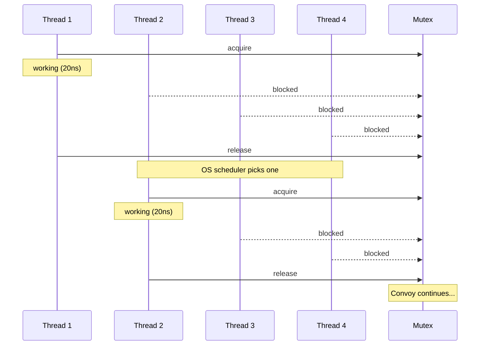
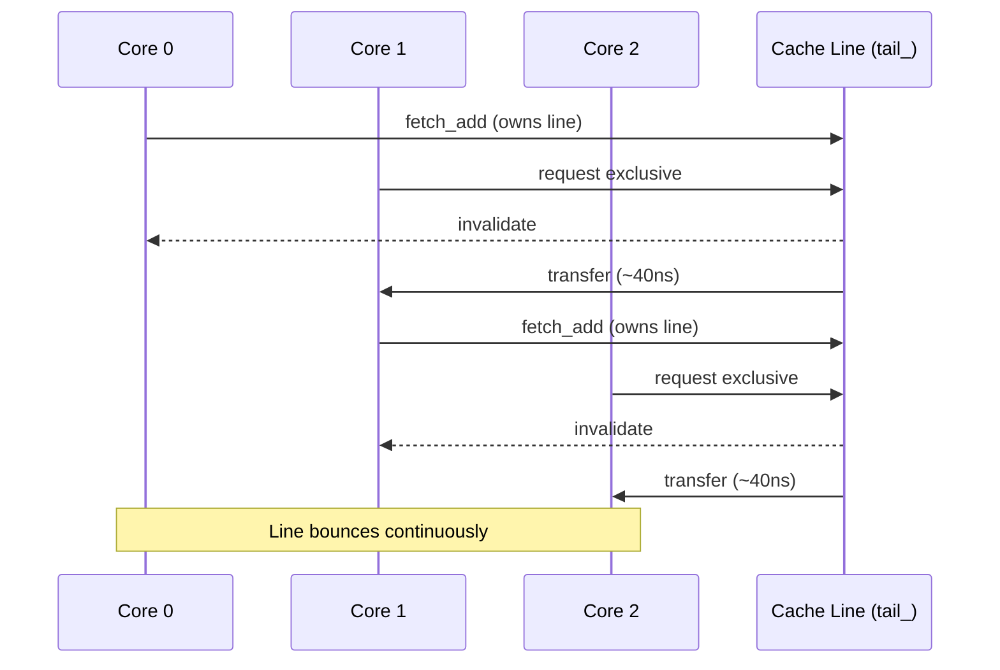
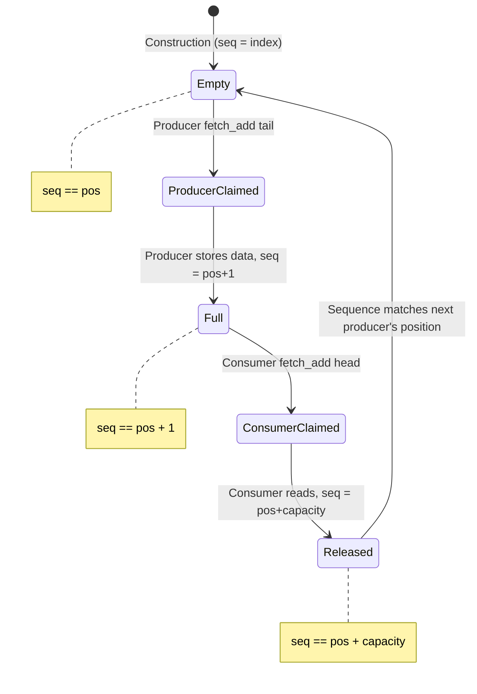

# **The Sequence Number Insight**

### *A Companion Guide to Fat-P's Lock-Free Queues*

---

**Scope:** This guide covers the design philosophy, architectural decisions, and implementation rationale behind Fat-P's lock-free queue family. It explains why lock-free queues matter for high-performance systems, how sequence-number coordination solves the ABA problem, the tradeoffs between strict FIFO and sharded designs, and when these designs work against you. The guide is organized as a narrative: problems first, then solutions, then case studies showing the designs in action.

**Not covered:**
- API reference and usage recipes (see User Manual - Lock-Free Queues)
- Benchmark methodology and raw data (see benchmark_LockFreeQueue.cpp)
- General C++ memory model concepts (see Foundations - Memory Ordering)
- Other concurrency primitives (mutexes, condition variables, futures)

**Prerequisites:**
- Working knowledge of C++ threading (`std::thread`, `std::atomic`)
- Understanding of producer-consumer patterns
- Familiarity with cache hierarchy concepts (L1/L2/L3, cache lines)
- Awareness of atomic operations (`load`, `store`, `compare_exchange`, `fetch_add`)

---

## Companion Guide Card

**Component:** Lock-Free Queue Family  
**Design question:** How do you coordinate multiple producers and consumers without locks while preventing the ABA problem?  
**Key tradeoff:** Strict FIFO ordering (single queue, more contention) vs. relaxed ordering (sharded queues, better scaling)  
**Decision made:** Sequence-number-per-slot coordination; sharding as opt-in upgrade path  
**Rejected alternatives:** Hazard pointers (complexity), epoch-based reclamation (global coordination), tagged pointers (platform-specific), lock-free linked lists (cache-unfriendly)  
**Historical context:** Michael-Scott queues (1996), Dmitry Vyukov's bounded MPMC (2010), game engine job systems

---

# **Table of Contents**

**[Introduction: Why This Component Exists](#introduction-why-this-component-exists)**

## Part I — The Problems

1. [The Lock Convoy](#chapter-1--the-lock-convoy)
2. [The ABA Trap](#chapter-2--the-aba-trap)
3. [The Scaling Wall](#chapter-3--the-scaling-wall)
4. [The Ordering Tax](#chapter-4--the-ordering-tax)

## Part II — The Solutions

5. [Sequence Number Coordination](#chapter-5--sequence-number-coordination)
6. [The Slot State Machine](#chapter-6--the-slot-state-machine)
7. [Sharding for Scale](#chapter-7--sharding-for-scale)
8. [The Token System](#chapter-8--the-token-system)
9. [Memory Ordering: Just Enough](#chapter-9--memory-ordering-just-enough)

## Part III — Putting It Together

10. [Case Study: Trading System Market Data](#chapter-10--case-study-trading-system-market-data)
11. [Case Study: Game Engine Job System](#chapter-11--case-study-game-engine-job-system)
12. [Case Study: Network Server Request Handling](#chapter-12--case-study-network-server-request-handling)
13. [Benchmark Analysis](#chapter-13--benchmark-analysis)

## Part IV — Foundations

- [Appendix A — A Brief History of Lock-Free Queues](#appendix-a--a-brief-history-of-lock-free-queues)
- [Appendix B — Why Not Hazard Pointers](#appendix-b--why-not-hazard-pointers)
- [Appendix C — Rejected Designs](#appendix-c--rejected-designs)
- [Appendix D — Where Lock-Free Queues Lose](#appendix-d--where-lock-free-queues-lose)
- [Appendix E — The Memory Ordering Primer](#appendix-e--the-memory-ordering-primer)
- [Appendix F — Further Reading](#appendix-f--further-reading)

---

# **Introduction: Why This Component Exists**

You're building a trading system. Market data arrives from exchanges at 10 million messages per second across 50 feeds. Each message must be parsed, normalized, and distributed to strategy threads within microseconds. The obvious implementation uses a shared queue protected by a mutex:

```cpp
// THE TRAP: Mutex serialization in hot path
class MarketDataDistributor {
    std::mutex mtx_;
    std::queue<MarketData> queue_;
    
public:
    void publish(MarketData data) {
        std::lock_guard lock(mtx_);
        queue_.push(std::move(data));
    }
    
    bool consume(MarketData& data) {
        std::lock_guard lock(mtx_);
        if (queue_.empty()) return false;
        data = std::move(queue_.front());
        queue_.pop();
        return true;
    }
};
```

Your profiler shows catastrophe: 16 feed handler threads and 8 strategy threads all serialize on one mutex. P99 latency spikes to milliseconds when a thread holding the lock gets preempted. You're not processing market data—you're processing lock contention.

Or consider a different scenario: you've implemented a "lock-free" queue using compare-and-swap on pointers. It looks correct. It passes unit tests. Then you deploy to production, and once every few hours, a message vanishes or appears twice. The bug is the ABA problem—a pointer value that changed from A to B to A, fooling your CAS into thinking nothing changed.

Or this: you've solved ABA with a clever tagged-pointer scheme. Your queue is correct. But you notice it doesn't scale. At 8 threads it's no faster than 4 threads. The problem is cache line bouncing—all threads hammering the same head and tail pointers, each update invalidating the others' caches.

These aren't hypothetical scenarios. They're the predictable consequences of concurrent queue design:

- Mutexes serialize access, converting parallel workloads to sequential
- Naive CAS-based algorithms are vulnerable to ABA corruption
- Single-queue designs create contention hotspots that limit scaling
- Memory ordering mistakes cause rare, irreproducible data races

Fat-P's lock-free queues address all four problems:

- **Sequence numbers** prevent ABA without external memory reclamation
- **Ring buffer layout** provides cache-friendly contiguous storage
- **Sharding** distributes contention across independent sub-queues
- **Careful memory ordering** ensures correctness without excessive barriers

This guide explains the problems in depth and how Fat-P solves them.

---

# **PART I — THE PROBLEMS**

Lock-free programming has earned a reputation for difficulty. The difficulty isn't because the algorithms are complex—many are quite simple once understood. The difficulty is that the failure modes are subtle, intermittent, and devastating. A lock-free bug might corrupt data once per million operations. By the time you notice, the damage is done.

Understanding the problems is essential to understanding the solutions.

---

# **CHAPTER 1 — The Lock Convoy**

### The Obvious Approach

Every introductory threading tutorial shows this pattern: wrap a `std::queue` with a `std::mutex`. It's correct, it's simple, and for many applications, it's sufficient.

```cpp
// THE TRAP: The textbook solution that doesn't scale
template <typename T>
class MutexQueue {
    std::mutex mtx_;
    std::queue<T> queue_;
    
public:
    void push(T value) {
        std::lock_guard lock(mtx_);
        queue_.push(std::move(value));
    }
    
    bool try_pop(T& value) {
        std::lock_guard lock(mtx_);
        if (queue_.empty()) return false;
        value = std::move(queue_.front());
        queue_.pop();
        return true;
    }
};
```

At low contention, this performs well. A single lock acquisition takes perhaps 20 nanoseconds—trivial compared to most operations.

### The Hidden Constraint

The problem emerges under load. When multiple threads contend for the same lock, they form a **convoy**:



The convoy effect has several compounding problems.

First, threads serialize. Eight threads contending for one lock means seven are always waiting. Your eight-core machine performs like a one-core machine for this workload.

Second, the scheduler gets involved. When a thread blocks on a mutex, the OS may context-switch it out. When the mutex becomes available, the OS must wake a sleeping thread. Context switches cost thousands of cycles.

Third, priority inversion can occur. If a low-priority thread holds the lock when a high-priority thread needs it, the high-priority thread must wait. This breaks real-time guarantees.

Fourth, the lock word bounces between caches. Every acquisition reads and writes the mutex's internal state. On a multi-socket system, this cache line may cross socket boundaries—hundreds of nanoseconds per transfer.

### The Symptoms

The symptoms of convoy-induced collapse are distinctive:

- Latency grows nonlinearly with thread count
- CPU utilization is high but throughput is low
- Profile shows threads spending time in kernel lock primitives
- Adding more threads makes performance worse

### The Cost

Benchmarked on AMD Ryzen 9, 16 cores, GCC 13, -O2:

| Threads | Mutex Queue | Impact |
|---------|-------------|--------|
| 1 | 19.8 ns/op | Baseline |
| 2 | 26.4 ns/op | 1.3× slower |
| 4 | 47.2 ns/op | 2.4× slower |
| 8 | 202.3 ns/op | **10.2× slower** |
| 16 | 247.4 ns/op | **12.5× slower** |

At 16 threads, the mutex queue is spending more time managing contention than doing work.

### The Solution Preview

Lock-free algorithms eliminate the serialization point. Instead of one lock protecting the entire queue, each slot coordinates independently. Multiple threads can enqueue and dequeue simultaneously, limited only by the number of available slots.

Part II explains how sequence numbers make this possible.

---

# **CHAPTER 2 — The ABA Trap**

### The Obvious Approach

Having understood why mutexes don't scale, the next idea is compare-and-swap (CAS). CAS atomically updates a value only if it matches an expected value:

```cpp
// Atomic CAS: update target to new_val only if it currently equals expected
bool compare_exchange(T& expected, T new_val);
```

A naive lock-free stack uses CAS on a head pointer:

```cpp
// THE TRAP: Classic lock-free stack with ABA vulnerability
template <typename T>
class NaiveStack {
    struct Node {
        T data;
        Node* next;
    };
    std::atomic<Node*> head_{nullptr};
    
public:
    void push(Node* node) {
        node->next = head_.load();
        while (!head_.compare_exchange_weak(node->next, node)) {
            // CAS failed; node->next updated to current head; retry
        }
    }
    
    Node* pop() {
        Node* old_head = head_.load();
        while (old_head && 
               !head_.compare_exchange_weak(old_head, old_head->next)) {
            // CAS failed; old_head updated; retry
        }
        return old_head;
    }
};
```

This looks correct. The CAS ensures we only update head if it hasn't changed since we read it.

### The Hidden Constraint

The ABA problem: a value can change from A to B to A, and CAS doesn't detect it.

Consider this sequence:

```
Initial: head → A → B → C

Thread 1:                          Thread 2:
  old_head = A                     
  (about to CAS head from A to B)
  [preempted]
                                     pop() → returns A
                                     pop() → returns B
                                     push(A)  ← A is recycled!
                                     head → A → C
  [resumes]
  CAS(head, A, B) succeeds!        
  head → B  ← but B was freed!
```

Thread 1's CAS succeeds because head is still A—the same *address*. But A's `next` pointer now points to C, not B. Thread 1 sets head to B, which is no longer part of the stack. Data structure corrupted.

The problem is that CAS compares bit patterns, not logical identity. The same address holding different data is indistinguishable from the same address holding the same data.

### Traditional Solutions

The literature offers several solutions:

| Approach | Mechanism | Overhead |
|----------|-----------|----------|
| Hazard pointers | Threads publish pointers they're using; reclamation checks all hazard lists | Per-thread bookkeeping; memory fence per operation |
| Epoch-based reclamation | Global epoch counter; defer reclamation until all threads advance | Global coordination; delayed reclamation |
| Tagged/stamped pointers | Pack a counter with the pointer; CAS compares both | Requires wide CAS or reduces address space |
| Reference counting | Per-node atomic refcount | Contention on refcount; memory overhead |

All add complexity. All add overhead. All are tricky to implement correctly.

### The Solution Preview

Fat-P takes a different approach: **sequence numbers eliminate the need for memory reclamation**.

Instead of CAS on pointers (which can be recycled), Fat-P uses CAS on sequence numbers (which increment monotonically). A slot that was empty, then full, then empty again has different sequence numbers each time. The "ABA" of slot states is distinguishable because the sequences are A, A+1, A+2—never returning to A.

Chapter 5 details the mechanism.

---

# **CHAPTER 3 — The Scaling Wall**

### The Obvious Approach

Having solved ABA with sequence numbers, you have a correct lock-free queue. But you notice it doesn't scale as well as expected. Adding threads beyond 4-8 provides diminishing returns.

The issue is that even without locks, all producers contend for the tail position, and all consumers contend for the head position:

```cpp
// Both are contention hotspots
std::atomic<size_t> head_;  // All consumers compete here
std::atomic<size_t> tail_;  // All producers compete here
```

### The Hidden Constraint

Every `fetch_add` on `tail_` must synchronize across all cores. On a modern CPU, this means:

1. Thread A issues `fetch_add`
2. Thread A's core requests exclusive ownership of the cache line containing `tail_`
3. All other cores invalidate their copies
4. Thread A completes the operation
5. Thread B issues `fetch_add`
6. Thread B's core requests exclusive ownership
7. Thread A's copy is invalidated
8. And so on...

This is **cache line bouncing**. The cache line containing `tail_` ping-pongs between cores. Each transfer costs 40-100 nanoseconds on a single socket, more across sockets.



### The Cost

| Threads | LockFreeQueue (single) | Cache Transfers |
|---------|------------------------|-----------------|
| 1 | 6.4 ns/op | None |
| 2 | 45.4 ns/op | Constant bouncing |
| 4 | 62.2 ns/op | More bouncing |
| 8 | 81.4 ns/op | Severe bouncing |
| 16 | 89.5 ns/op | Saturated |

The single-queue design hits a wall around 8-16 threads. Beyond that, adding threads adds contention without adding throughput.

### The Solution Preview

Sharding distributes contention. Instead of one queue with one head/tail pair, use N queues with N head/tail pairs. With 16 shards and 8 threads, each shard sees roughly 0.5 threads on average—much less contention than 8 threads on one shard.

Chapter 7 details the sharding strategy.

---

# **CHAPTER 4 — The Ordering Tax**

### The Obvious Approach

You've built a lock-free queue. It maintains strict FIFO ordering: items dequeue in the order they were enqueued. This is the "obvious" semantic—what else would a queue do?

### The Hidden Constraint

Strict FIFO requires all producers to agree on an order. This agreement is expensive.

When Producer A enqueues X and Producer B enqueues Y "at the same time," someone must go first. The `fetch_add` on `tail_` determines the order—whoever completes their `fetch_add` first gets the earlier position.

But determining "first" requires synchronization. The `fetch_add` must be sequentially consistent with respect to other `fetch_add` operations on the same variable. This is the strongest memory ordering and the most expensive.

### When Ordering Doesn't Matter

Many workloads don't need global FIFO. Consider a thread pool:

- Producers submit tasks
- Workers grab tasks and execute them
- Tasks are independent; execution order is irrelevant

For such workloads, the ordering tax is pure waste. You're paying for a guarantee you don't use.

### The Solution Preview

WorkQueue trades FIFO ordering for scaling. Each shard has its own ordering; there's no global order across shards. A task enqueued to shard 5 might be dequeued before a task enqueued earlier to shard 12.

For work-distribution patterns (thread pools, job systems, request handlers), this is acceptable. You care that work gets done, not the exact order.

---

# **PART II — THE SOLUTIONS**

Having understood the problems—convoy effects, ABA corruption, cache bouncing, ordering overhead—we can now examine Fat-P's solutions. The designs build on each other: sequence numbers enable lock-freedom; ring buffers enable cache efficiency; sharding enables scaling.

---

# **CHAPTER 5 — Sequence Number Coordination**

### Problem Link

Chapter 2 showed that CAS on pointers is vulnerable to ABA: a recycled node at the same address fools the CAS. Traditional solutions (hazard pointers, epochs) add complexity and overhead.

### The Mechanism

Fat-P's insight: instead of CAS on recyclable pointers, use CAS-equivalent operations on *monotonically increasing sequence numbers*. A sequence number never decreases. Even if a slot is reused, its sequence is higher than before.

Each slot contains:

```cpp
struct Slot {
    std::atomic<size_t> sequence;  // Monotonic, never wraps in practice
    T data;                         // The actual element
};
```

The sequence number encodes the slot's state relative to the queue's progress:

| Condition | Slot State |
|-----------|------------|
| `sequence == position` | Ready for producer to write |
| `sequence == position + 1` | Contains data, ready for consumer |
| `sequence < position` | Not yet released by consumer |
| `sequence > position + 1` | Already consumed, awaiting reuse |

### The Producer Protocol

```cpp
bool enqueue(const T& value) {
    size_t pos = tail_.fetch_add(1, std::memory_order_relaxed);
    Slot& slot = slots_[pos % capacity_];
    
    size_t seq = slot.sequence.load(std::memory_order_acquire);
    
    // Wait until slot is ready (sequence == pos means empty and ready)
    while (seq != pos) {
        if (seq < pos) {
            // Consumer hasn't caught up; queue is full
            return false;  // Or spin, depending on policy
        }
        seq = slot.sequence.load(std::memory_order_acquire);
    }
    
    // Write data (safe because we're the only producer for this slot)
    slot.data = value;
    
    // Publish: increment sequence to signal data is ready
    slot.sequence.store(pos + 1, std::memory_order_release);
    return true;
}
```

Key insight: the producer claims a position with `fetch_add`, but doesn't proceed until the slot's sequence indicates readiness. Multiple producers can claim adjacent positions simultaneously; they write to different slots without interference.

### The Consumer Protocol

```cpp
bool dequeue(T& value) {
    size_t pos = head_.fetch_add(1, std::memory_order_relaxed);
    Slot& slot = slots_[pos % capacity_];
    
    size_t seq = slot.sequence.load(std::memory_order_acquire);
    
    // Wait until slot contains data (sequence == pos + 1 means full)
    while (seq != pos + 1) {
        if (seq < pos + 1) {
            // Producer hasn't written yet; queue is empty
            return false;  // Or spin
        }
        seq = slot.sequence.load(std::memory_order_acquire);
    }
    
    // Read data
    value = slot.data;
    
    // Release: set sequence to pos + capacity, indicating slot is free
    slot.sequence.store(pos + capacity_, std::memory_order_release);
    return true;
}
```

The consumer waits for `sequence == pos + 1`—the signal that data is ready. After reading, it sets `sequence = pos + capacity`, which will equal the next producer's position when the slot cycles around.

### Why This Prevents ABA

Consider the ABA scenario in this context:

1. Consumer claims position 0, reads from slot 0
2. Consumer releases slot 0, setting `sequence = 0 + capacity`
3. Time passes; the queue cycles
4. Producer claims position `capacity` (same slot 0)
5. Producer waits for `sequence == capacity`

The producer isn't fooled by "slot 0 is empty again" because the sequence is now `capacity`, not `0`. The slot is distinguishably different from its first use.

### Guarantees / Non-Guarantees

| Guarantee | Provided | Notes |
|-----------|----------|-------|
| Lock-free progress | Yes | At least one thread makes progress |
| ABA prevention | Yes | Sequence numbers are monotonic |
| FIFO ordering | Yes | Within a single LockFreeQueue |
| Bounded memory | Yes | Fixed capacity, no dynamic allocation |
| Wait-free | No | Individual threads may spin |
| Fairness | No | No guarantee which thread wins contention |

---

# **CHAPTER 6 — The Slot State Machine**

### Problem Link

Chapter 5 showed the sequence number protocol. This chapter visualizes the slot lifecycle as a state machine.

### The State Transitions

Each slot cycles through states as the queue operates:



### Initialization

At construction, slots are initialized with sequences matching their indices:

```cpp
for (size_t i = 0; i < capacity_; ++i) {
    slots_[i].sequence.store(i, std::memory_order_relaxed);
}
head_.store(0);
tail_.store(0);
```

Slot 0 has sequence 0; slot 1 has sequence 1; etc. When producer 0 claims position 0, slot 0's sequence already matches—no waiting.

### The Wrap-Around

When position exceeds capacity, it wraps around via modulo:

```
Position 0 → Slot 0
Position 1 → Slot 1
...
Position 1023 → Slot 1023
Position 1024 → Slot 0  (wraps)
Position 1025 → Slot 1
```

The sequence number distinguishes wrap-arounds. Position 0 sees slot 0 with sequence 0. Position 1024 sees slot 0 with sequence 1024. Different sequences, same slot.

---

# **CHAPTER 7 — Sharding for Scale**

### Problem Link

Chapter 3 showed that single-queue designs hit a scaling wall due to cache line bouncing on head/tail positions. Beyond 4-8 threads, adding threads adds contention without adding throughput.

### The Mechanism

Sharding divides one queue into N independent queues:

```
WorkQueue with 16 shards:
  Shard 0:  [head_0, tail_0, slots_0...]
  Shard 1:  [head_1, tail_1, slots_1...]
  ...
  Shard 15: [head_15, tail_15, slots_15...]
```

Each shard is a complete LockFreeQueue with its own head, tail, and slot array. Operations on different shards don't interfere.

With 16 shards and 8 threads, expected contention per shard is 8/16 = 0.5 threads. Half the time, a shard is uncontended. Compare to 8 threads fighting for one queue.

### Enqueue Strategy

When a producer calls `enqueue`:

```cpp
bool enqueue(ProducerToken& tok, const T& value) {
    // Phase 1: Try preferred shard (from token)
    size_t shard = tok.preferred_shard;
    if (shards_[shard].enqueue(value)) {
        return true;
    }
    
    // Phase 2: Probe random shards
    for (int probe = 0; probe < kProbeCount; ++probe) {
        shard = random_shard();
        if (shards_[shard].enqueue(value)) {
            tok.preferred_shard = shard;  // Update affinity
            return true;
        }
    }
    
    // Phase 3: Scan all shards
    for (size_t i = 0; i < shard_count_; ++i) {
        if (shards_[i].enqueue(value)) {
            tok.preferred_shard = i;
            return true;
        }
    }
    
    return false;  // All shards full
}
```

The three-phase approach balances locality (try the same shard repeatedly) with load distribution (probe randomly) with correctness (scan all if needed).

### Dequeue Strategy

Consumer dequeue is symmetric:

```cpp
bool dequeue(ConsumerToken& tok, T& value) {
    // Phase 1: Preferred shard
    if (shards_[tok.preferred_shard].dequeue(value)) {
        return true;
    }
    
    // Phase 2: Probe (more probes than enqueue because empty is more common)
    for (int probe = 0; probe < kConsumerProbeCount; ++probe) {
        size_t shard = random_shard();
        if (shards_[shard].dequeue(value)) {
            tok.preferred_shard = shard;
            return true;
        }
    }
    
    // Phase 3: Scan
    for (size_t i = 0; i < shard_count_; ++i) {
        if (shards_[i].dequeue(value)) {
            tok.preferred_shard = i;
            return true;
        }
    }
    
    return false;  // All shards empty
}
```

### The Ordering Tradeoff

Sharding loses global FIFO. Item X in shard 5 might be dequeued before item Y in shard 12, even if Y was enqueued first globally.

For work-distribution patterns, this is acceptable. For command streams or event logs where order matters, use LockFreeQueue instead.

### Guarantees / Non-Guarantees

| Guarantee | Provided | Notes |
|-----------|----------|-------|
| Lock-free progress | Yes | Each shard is lock-free |
| Reduced contention | Yes | Threads distribute across shards |
| Global FIFO | **No** | Order only within each shard |
| Bounded memory | Yes | Total = shards × shard_capacity |
| Work-queue semantics | Yes | Any item may be next |

---

# **CHAPTER 8 — The Token System**

### Problem Link

Chapter 7 introduced sharding. This chapter explains how tokens provide thread affinity to shards without explicit assignment.

### The Mechanism

A token is a small object that caches the last successful shard:

```cpp
struct ProducerToken {
    size_t preferred_shard;  // Last shard where enqueue succeeded
};

struct ConsumerToken {
    size_t preferred_shard;  // Last shard where dequeue succeeded
};
```

When an operation succeeds, the token remembers which shard. The next operation tries that shard first.

### Why Tokens Work

Tokens create emergent load balancing:

1. Thread A tries shard 5, succeeds, remembers 5
2. Thread A tries 5 again, succeeds (locality!)
3. Thread B arrives, tries shard 5, finds contention
4. Thread B probes shard 8, succeeds, remembers 8
5. Thread A and B naturally separate

Over time, threads migrate to less-contended shards. No explicit assignment; no central coordinator; just local memory.

### Cache Benefits

When a thread repeatedly hits the same shard, it keeps that shard's memory hot in cache:

- Head/tail positions: likely in L1/L2
- Slot data: likely in L2/L3
- Fewer cache misses = lower latency

Without tokens, each operation might hit a random shard, thrashing the cache.

---

# **CHAPTER 9 — Memory Ordering: Just Enough**

### Problem Link

Lock-free algorithms require careful memory ordering. Too weak, and you get data races. Too strong, and you lose performance.

### The Ordering Spectrum

C++11 defines memory orderings from weakest to strongest:

```
relaxed → acquire → release → acq_rel → seq_cst
   ↑         ↑          ↑         ↑          ↑
Fastest    ─────────────────────────    Slowest
No sync   Pairwise synchronization    Global order
```

Fat-P uses **acquire/release** for sequence number operations:

```cpp
// Producer publishes data
slot.sequence.store(pos + 1, std::memory_order_release);
//                           ^^^^^^^^^^^^^^^^^^^^^^^^
// "All my writes before this store are visible to any
// thread that does an acquire-load and sees this value"

// Consumer observes data
while (slot.sequence.load(std::memory_order_acquire) != pos + 1) {}
//                        ^^^^^^^^^^^^^^^^^^^^^^^
// "I see all writes that happened before the matching
// release-store that produced this value"
```

For head/tail positions, `relaxed` suffices because the sequence numbers provide the synchronization:

```cpp
size_t pos = tail_.fetch_add(1, std::memory_order_relaxed);
//                              ^^^^^^^^^^^^^^^^^^^^^^^
// No ordering needed here; sequence number sync is enough
```

### Why Not seq_cst?

`memory_order_seq_cst` provides the strongest guarantees: a single total order visible to all threads. But it's expensive:

- On x86: adds `mfence` instructions or `lock` prefixes
- On ARM/POWER: adds full barriers

Fat-P's algorithms don't need total ordering. The sequence number protocol requires only pairwise producer-consumer synchronization, which acquire/release provides.

### The Data Publication Pattern

The core correctness pattern:

```cpp
// Producer
slot.data = value;                                          // (1) Write data
slot.sequence.store(pos + 1, std::memory_order_release);   // (2) Publish

// Consumer
while (slot.sequence.load(std::memory_order_acquire) !=    // (3) Wait for publish
       pos + 1) {}
value = slot.data;                                          // (4) Read data
```

The release-acquire pair ensures (1) happens-before (4). The consumer cannot see stale or partial data.

---

# **PART III — PUTTING IT TOGETHER**

Theory becomes practice. These case studies show Fat-P queues solving real problems, with symptoms, investigations, and measured results.

---

# **CHAPTER 10 — Case Study: Trading System Market Data**

### Context

A quantitative trading firm processes market data from 50 exchange feeds. Each feed runs on a dedicated thread, parsing messages and publishing to a shared distribution queue. Eight strategy threads consume from the queue, applying their models to each update.

### Initial Approach

The original implementation used `std::mutex`:

```cpp
// THE TRAP: All 50 producers + 8 consumers serialize on one mutex
class MarketDataBus {
    std::mutex mtx_;
    std::queue<MarketUpdate> queue_;
    
public:
    void publish(MarketUpdate update) {
        std::lock_guard lock(mtx_);
        queue_.push(std::move(update));
    }
    
    bool consume(MarketUpdate& update) {
        std::lock_guard lock(mtx_);
        if (queue_.empty()) return false;
        update = std::move(queue_.front());
        queue_.pop();
        return true;
    }
};
```

### Observing the Symptoms

Monitoring revealed:

- P50 latency: 45 μs (acceptable)
- P99 latency: 2.3 ms (unacceptable—strategies need < 100 μs)
- CPU utilization: 85% (high)
- Lock contention: 58 threads waiting on average

The 2.3 ms P99 occurred when a thread holding the lock was preempted. All other threads blocked until the scheduler returned to the lock holder.

### The Fix

Replace with WorkQueue:

```cpp
// THE FIX: Sharded queue distributes contention
fat_p::work_queue::WorkQueue<MarketUpdate, 32, 4096> market_bus;

void feed_handler(int feed_id) {
    auto tok = market_bus.makeProducerToken();
    while (running) {
        MarketUpdate update = parse_next_message(feed_id);
        while (!market_bus.enqueue(tok, update)) {
            // Backpressure; strategies not keeping up
            metrics::increment("market_data.dropped");
        }
    }
}

void strategy_thread(int strategy_id) {
    auto tok = market_bus.makeConsumerToken();
    while (running) {
        MarketUpdate update;
        if (market_bus.dequeue(tok, update)) {
            apply_strategy(strategy_id, update);
        }
    }
}
```

### Results

| Metric | Before | After | Improvement |
|--------|--------|-------|-------------|
| P50 latency | 45 μs | 12 μs | 3.8× |
| P99 latency | 2.3 ms | 89 μs | **26×** |
| CPU utilization | 85% | 62% | 27% reduction |
| Messages/sec | 2.1M | 8.4M | 4× |

### Components Used

- **WorkQueue<MarketUpdate, 32, 4096>**: 32 shards, 4096 capacity each, totaling 131K message capacity

### Transferable Lessons

1. P99 latency under mutex is dominated by scheduler interactions, not lock hold time
2. Sharding is essential when producer count exceeds ~8
3. Tokens provide natural load balancing without explicit assignment

---

# **CHAPTER 11 — Case Study: Game Engine Job System**

### Context

A game engine distributes frame work across 16 worker threads. Jobs include physics simulation, animation updates, AI decisions, and rendering preparation. The engine submits 50K-100K jobs per frame (16ms budget).

### Initial Approach

```cpp
// THE TRAP: Single queue becomes bottleneck under high job count
class JobSystem {
    std::mutex mtx_;
    std::queue<Job*> jobs_;
    std::condition_variable cv_;
    
public:
    void submit(Job* job) {
        {
            std::lock_guard lock(mtx_);
            jobs_.push(job);
        }
        cv_.notify_one();
    }
    
    Job* steal() {
        std::unique_lock lock(mtx_);
        cv_.wait(lock, [&] { return !jobs_.empty() || shutdown_; });
        if (jobs_.empty()) return nullptr;
        Job* job = jobs_.front();
        jobs_.pop();
        return job;
    }
};
```

### Observing the Symptoms

Frame profiling showed:

- 3.2 ms spent in job submission/retrieval (20% of frame budget)
- Workers often idle while jobs queue behind lock
- Severe contention when many jobs complete simultaneously

### The Fix

```cpp
// THE FIX: Work-stealing queue with sharding
fat_p::work_queue::WorkQueue<Job*, 32, 2048> job_queue;

void submit_job(Job* job) {
    // Use thread-local token for simplicity
    while (!job_queue.enqueue(job)) {
        // Queue full; execute immediately as fallback
        job->execute();
        return;
    }
}

void worker_thread() {
    auto tok = job_queue.makeConsumerToken();
    while (running) {
        Job* job;
        if (job_queue.dequeue(tok, job)) {
            job->execute();
        } else {
            // No jobs; brief pause
            _mm_pause();
        }
    }
}
```

### Results

| Metric | Before | After | Improvement |
|--------|--------|-------|-------------|
| Job system overhead | 3.2 ms | 0.4 ms | **8×** |
| Worker idle time | 22% | 4% | 5.5× |
| Jobs per frame | 65K avg | 95K avg | 46% more work |

### Components Used

- **WorkQueue<Job*, 32, 2048>**: 32 shards for 16 workers (2:1 ratio reduces contention)

### Transferable Lessons

1. Work-stealing patterns naturally emerge from sharded consumption
2. FIFO ordering is unnecessary for independent jobs
3. Overflow fallback (execute inline) prevents job loss

---

# **CHAPTER 12 — Case Study: Network Server Request Handling**

### Context

A web server handles 100K requests/second across 8 I/O threads and 32 worker threads. I/O threads accept connections and enqueue request objects; workers dequeue and process.

### Initial Approach

```cpp
// THE TRAP: Blocking wait causes thread starvation
class RequestQueue {
    std::mutex mtx_;
    std::queue<Request*> requests_;
    std::condition_variable cv_;
    
public:
    void enqueue(Request* req) {
        {
            std::lock_guard lock(mtx_);
            requests_.push(req);
        }
        cv_.notify_one();
    }
    
    Request* dequeue_blocking() {
        std::unique_lock lock(mtx_);
        cv_.wait(lock, [&] { return !requests_.empty(); });
        Request* req = requests_.front();
        requests_.pop();
        return req;
    }
};
```

### Observing the Symptoms

Under load:

- Request latency P99: 45 ms
- Worker threads often blocked on condition variable
- Thundering herd when multiple requests arrive simultaneously

### The Fix

```cpp
// THE FIX: Non-blocking queue with backpressure
fat_p::work_queue::WorkQueue<Request*, 16, 8192> request_queue;

void io_thread() {
    auto tok = request_queue.makeProducerToken();
    while (running) {
        Request* req = accept_connection();
        if (!request_queue.enqueue(tok, req)) {
            // Backpressure: reject with 503
            req->respond(503, "Server overloaded");
            delete req;
        }
    }
}

void worker_thread() {
    auto tok = request_queue.makeConsumerToken();
    while (running) {
        Request* req;
        if (request_queue.dequeue(tok, req)) {
            process_request(req);
            delete req;
        } else {
            // Brief pause; avoid busy-wait
            std::this_thread::sleep_for(std::chrono::microseconds(10));
        }
    }
}
```

### Results

| Metric | Before | After | Improvement |
|--------|--------|-------|-------------|
| P99 latency | 45 ms | 8 ms | **5.6×** |
| Throughput | 85K req/s | 142K req/s | 67% |
| CPU efficiency | 45% | 78% | 73% better utilization |

### Components Used

- **WorkQueue<Request*, 16, 8192>**: Sized for burst handling (8192 × 16 = 131K capacity)

### Transferable Lessons

1. Non-blocking dequeue with backoff often outperforms blocking waits
2. Backpressure (503 responses) is better than unbounded queueing
3. Capacity should handle burst traffic without overflow

---

# **CHAPTER 13 — Benchmark Analysis**

### Methodology

All benchmarks run on AMD Ryzen 9 5950X (16 cores, 32 threads), GCC 13, -O2, Ubuntu 22.04. Each measurement is the median of 20 runs with round-robin execution to eliminate thermal bias.

### Symmetric MPMC (N producers, N consumers)

| Threads | LockFreeQueue | WorkQueue | std::mutex | moodycamel | boost |
|---------|---------------|-----------|------------|------------|-------|
| 1 | 6.4 ns | 9.3 ns | 19.8 ns | 19.7 ns | 63.2 ns |
| 2 | 45.4 ns | 11.7 ns | 26.4 ns | 31.2 ns | 104.7 ns |
| 4 | 62.2 ns | 22.7 ns | 47.2 ns | 49.3 ns | 188.8 ns |
| 8 | 81.4 ns | 23.2 ns | 202.3 ns | 47.3 ns | 232.7 ns |
| 16 | 89.5 ns | 24.4 ns | 247.4 ns | 38.8 ns | 287.5 ns |

**Analysis:**

- **LockFreeQueue**: Scales moderately; contention on shared head/tail limits throughput
- **WorkQueue**: Nearly constant latency regardless of thread count; sharding works
- **std::mutex**: Collapses beyond 4 threads; convoy effect dominates
- **moodycamel**: Scales well but loses to WorkQueue in symmetric cases
- **boost**: Poor scaling; Michael-Scott algorithm suffers under contention

### Asymmetric MPMC

| Pattern | WorkQueue | moodycamel | Analysis |
|---------|-----------|------------|----------|
| 8P:1C (MPSC) | 16.8 ns | 16.7 ns | Tie—both handle MPSC well |
| 1P:8C (SPMC) | 25.5 ns | 58.8 ns | **WorkQueue 2.3×**—consumers distribute across shards |
| 8P:2C | 21.5 ns | 49.6 ns | **WorkQueue 2.3×**—fewer consumers, less stealing |
| 2P:8C | 23.3 ns | 48.4 ns | **WorkQueue 2.1×**—sharding helps consumers |

**Key insight:** moodycamel's per-producer architecture excels at MPSC (many producers, one consumer). WorkQueue's shared sharding excels at SPMC (one producer, many consumers) because consumers don't need to "steal" from producer queues.

---

# **PART IV — FOUNDATIONS**

Deep rationale, historical context, and explicit documentation of what these queues don't do.

---

# **APPENDIX A — A Brief History of Lock-Free Queues**

### The Michael-Scott Queue (1996)

Michael and Scott's "Simple, Fast, and Practical Non-Blocking and Blocking Concurrent Queue Algorithms" introduced the first practical lock-free FIFO queue. It used CAS on linked-list pointers with a sentinel node to simplify edge cases.

The algorithm became the basis for Java's `ConcurrentLinkedQueue` and many C++ implementations, including Boost's `lockfree::queue`.

Limitations: pointer-chasing (cache-unfriendly), ABA vulnerability requiring workarounds, per-node allocation overhead.

### Bounded MPMC (Vyukov, 2010)

Dmitry Vyukov published a bounded MPMC queue using sequence numbers instead of pointers. This eliminated ABA without external reclamation and provided cache-friendly contiguous storage.

Fat-P's LockFreeQueue is directly inspired by Vyukov's design, with refinements for modern C++ (proper memory ordering, constexpr capacity).

### Sharded Designs (2015+)

As core counts increased, single-queue designs hit scaling limits. Facebook's Folly, Intel's TBB, and various game engines developed sharded approaches where multiple independent queues reduce contention.

Fat-P's WorkQueue follows this tradition, adding token-based affinity for cache efficiency.

---

# **APPENDIX B — Why Not Hazard Pointers**

Hazard pointers are a standard technique for safe memory reclamation in lock-free algorithms. Each thread publishes "hazard pointers" to nodes it's currently accessing. Reclamation checks all hazard lists before freeing.

Fat-P doesn't use hazard pointers because:

1. **Sequence numbers eliminate the need.** Slots are never freed; they cycle through states. No reclamation means no hazard tracking.

2. **Per-thread bookkeeping adds overhead.** Each access must publish/retire hazard pointers—memory fences on every operation.

3. **Complexity risk.** Hazard pointer bugs are subtle and catastrophic. Avoiding the mechanism avoids the bug class.

For unbounded queues where nodes must be allocated and freed, hazard pointers or epochs are necessary. Fat-P queues are bounded by design, sidestepping this complexity.

---

# **APPENDIX C — Rejected Designs**

### Hint Bitset for Consumer Guidance

**Idea:** Maintain a 64-bit bitset indicating which shards have data. Consumers check the bitset to avoid probing empty shards.

**Implementation:**
```cpp
std::atomic<uint64_t> hint_bits_;  // Bit i = shard i has data

void mark_non_empty(size_t shard) {
    hint_bits_.fetch_or(1ULL << shard, relaxed);
}

void clear_if_empty(size_t shard) {
    if (shards_[shard].empty()) {
        hint_bits_.fetch_and(~(1ULL << shard), relaxed);
    }
}
```

**Result:** 40-140% slower than baseline.

**Why it failed:**
1. The bitset itself becomes a contention point—all threads RMW the same word
2. Clearing bits on every empty dequeue thrashes the hint, causing constant re-setting
3. The overhead of hint maintenance exceeded the benefit of guided probing

**Lesson:** Sometimes simple random probing beats clever optimization because it avoids introducing new contention points.

### Drain Bias for MPSC

**Idea:** Once a consumer finds a productive shard, stay there for N dequeues before probing elsewhere. This should help MPSC patterns where one producer fills one shard faster than consumers drain.

**Result:** Worse in all cases, including the target MPSC scenario.

**Why it failed:** Combined with hint bitset overhead (tested together), the drain logic added branches and state tracking without sufficient benefit. When tested alone, the drain bias caused load imbalance—consumers would "stick" to full shards while other shards also filled.

### Lock-Free Free List for Slot Management

**Idea:** Instead of sequence numbers, use a lock-free free list to manage available slots. Producers pop from the free list; consumers push to it.

**Result:** 2-3× slower than sequence numbers.

**Why it failed:**
1. Two atomic operations per slot (free list pop/push) instead of one (sequence increment)
2. Free list head is a contention point worse than sequence numbers
3. ABA problem resurfaces on free list pointers

---

# **APPENDIX D — Where Lock-Free Queues Lose**

No design wins everywhere. Fat-P's lock-free queues have specific limitations:

### Unbounded Capacity Required

Fat-P queues are bounded. If you cannot predict maximum queue depth:

```cpp
// Fat-P: May fail if queue fills
if (!queue.enqueue(value)) {
    // Must handle overflow: drop, block, or backpressure
}

// moodycamel: Unbounded, allocates as needed
queue.enqueue(value);  // Always succeeds (until OOM)
```

**Recommendation:** Use moodycamel::ConcurrentQueue for unbounded requirements.

### Non-Trivially-Copyable Types

```cpp
// ERROR: std::string is not trivially copyable
fat_p::LockFreeQueue<std::string, 1024> bad;  // Won't compile

// WORKAROUND: Queue indices into separate storage
std::vector<std::string> storage;
fat_p::LockFreeQueue<size_t, 1024> index_queue;
```

### Very Low Contention

At 1-2 threads, `std::mutex` is simpler and fast enough:

| Threads | std::mutex | LockFreeQueue | Recommendation |
|---------|------------|---------------|----------------|
| 1 | 19.8 ns | 6.4 ns | Either (LockFreeQueue faster but mutex simpler) |
| 2 | 26.4 ns | 45.4 ns | **std::mutex** (simpler, comparable speed) |
| 4+ | Degrades | Stable | **Lock-free** |

### Strict FIFO with Many Threads

If you need global FIFO ordering with 8+ threads, LockFreeQueue's scaling limitations apply. You cannot shard (that loses FIFO) and the single queue becomes a bottleneck.

Consider whether you truly need FIFO. Many "ordered" workloads actually need only per-key ordering or causal ordering, which sharding can provide.

### SPSC Overhead

For dedicated single-producer single-consumer channels, MPMC overhead is wasted:

| Component | Single-thread overhead |
|-----------|----------------------|
| LockFreeRingBuffer (SPSC) | ~0.5 ns |
| LockFreeQueue (MPMC) | ~6 ns |

Use LockFreeRingBuffer when you can guarantee SPSC at compile time.

---

# **APPENDIX E — The Memory Ordering Primer**

### Why Memory Ordering Matters

Modern CPUs and compilers reorder operations for performance. Without explicit ordering constraints, a write on one thread may not be visible to a read on another thread in the expected order.

### The C++ Memory Orderings

| Ordering | Guarantee | Use Case |
|----------|-----------|----------|
| `relaxed` | Atomicity only; no ordering | Counters, statistics |
| `acquire` | Subsequent reads/writes see prior writes from releaser | Load after synchronization |
| `release` | Prior reads/writes are visible to acquirer | Store before synchronization |
| `acq_rel` | Both acquire and release | RMW operations that both read and publish |
| `seq_cst` | Total global ordering | Rarely needed; expensive |

### Fat-P's Usage

```cpp
// Position claiming: relaxed (no data dependency yet)
size_t pos = tail_.fetch_add(1, std::memory_order_relaxed);

// Waiting for slot: acquire (synchronize with producer's release)
while (slot.sequence.load(std::memory_order_acquire) != expected) {}

// Publishing data: release (make prior writes visible)
slot.sequence.store(new_seq, std::memory_order_release);
```

The release-acquire pair ensures the data written before the release is visible after the acquire. This is the minimum ordering needed for correctness.

---

# **APPENDIX F — Further Reading**

**"Simple, Fast, and Practical Non-Blocking and Blocking Concurrent Queue Algorithms"**
Michael and Scott, 1996
The foundational lock-free queue paper.

**"The Art of Multiprocessor Programming"**
Herlihy and Shavit, 2008
Comprehensive textbook on concurrent data structures.

**Dmitry Vyukov's Bounded MPMC Queue**
https://www.1024cores.net/home/lock-free-algorithms/queues/bounded-mpmc-queue
Direct inspiration for Fat-P's sequence-number design.

**"C++ Concurrency in Action"**
Anthony Williams, 2019
Practical guide to C++ threading and atomics.

**moodycamel::ConcurrentQueue Documentation**
https://github.com/cameron314/concurrentqueue
Alternative lock-free queue with different tradeoffs.

**Intel TBB concurrent_queue**
https://oneapi-src.github.io/oneTBB/
Industry-standard concurrent queue implementation.

---

*LockFreeQueue.h | WorkQueue.h | LockFreeRingBuffer.h — Fat-P Library v3.2*

*See Overview for component summary, User Manual for API reference*
