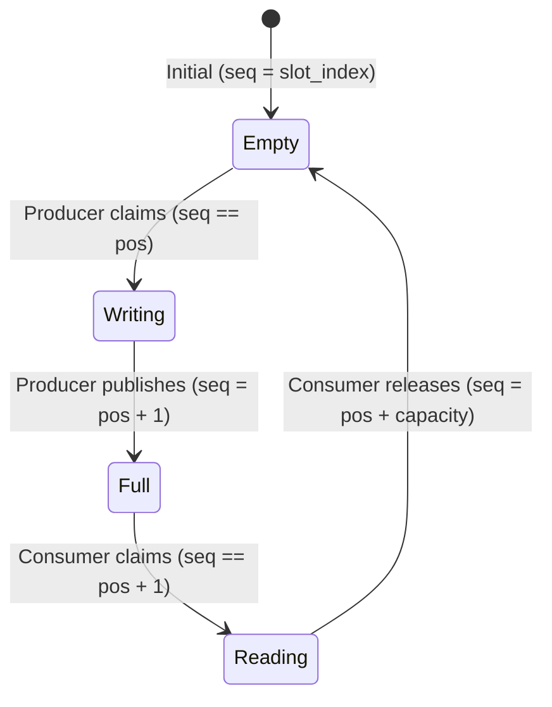

# Overview - Lock-Free Queues

*Fat-P Library — January 2026*

---

## Executive Summary

Fat-P provides a family of lock-free bounded queues optimized for different concurrency patterns. Unlike mutex-protected queues that serialize all access through a single lock, these queues use **sequence-number-per-slot coordination** to allow multiple producers and consumers to operate simultaneously without blocking each other. The result is predictable scaling under contention: where mutex-based queues degrade severely at high thread counts, Fat-P's WorkQueue maintains stable per-operation throughput regardless of thread count.

**LockFreeQueue** delivers strict FIFO ordering for general MPMC (Multiple-Producer Multiple-Consumer) use. **WorkQueue** sacrifices global ordering for 3-4× better scaling through sharding—distributing work across independent sub-queues. **LockFreeRingBuffer** offers specialized SPSC (Single-Producer Single-Consumer) implementation for dedicated pipelines.

The core insight: sequence numbers eliminate the ABA problem without external memory reclamation, hazard pointers, or epoch-based garbage collection. Each slot carries a monotonically increasing counter that distinguishes "same address, different logical state" from "same address, same state." This enables safe lock-free operation with trivially copyable types and zero dynamic allocation after construction.

---

## Overview Card

**Component:** Lock-Free Queue Family  
**Problem solved:** Heap mutex contention and convoy effects in high-throughput producer-consumer scenarios  
**When to use:** 4+ threads sharing a work queue; latency-sensitive systems where mutex jitter is unacceptable; bounded-memory requirements  
**When NOT to use:** 1-2 threads (mutex is simpler and fast enough); unbounded queue requirements; non-trivially-copyable types  
**Key guarantee:** Lock-free progress—at least one thread makes forward progress under contention  
**std equivalent:** None. No standard lock-free queue exists or is planned.  
**Boost equivalent:** `boost::lockfree::queue` (different algorithm, worse scaling)  
**Other alternatives:** moodycamel::ConcurrentQueue, folly::MPMCQueue, Intel TBB concurrent_queue  
**Read next:** User Manual - Lock-Free Queues, Companion Guide - Lock-Free Queues

---

## The Problem Domain

### What Goes Wrong Without It

Consider a trading system processing market data. Eight threads consume price updates from a shared queue. Each update must be processed within microseconds to maintain market-making spreads. The straightforward implementation uses a mutex:

```cpp
class MarketDataQueue {
    std::mutex mtx_;
    std::queue<PriceUpdate> queue_;
    
public:
    void push(PriceUpdate update) {
        std::lock_guard lock(mtx_);
        queue_.push(std::move(update));
    }
    
    bool pop(PriceUpdate& update) {
        std::lock_guard lock(mtx_);
        if (queue_.empty()) return false;
        update = std::move(queue_.front());
        queue_.pop();
        return true;
    }
};
```

At low load, this works acceptably. One thread acquires the lock, performs its operation, releases. Latency is predictable—perhaps 20-30 nanoseconds per operation.

But market opens arrive. Data rates spike from thousands to millions of updates per second. All eight consumer threads contend for the same mutex. The operating system's scheduler becomes involved, context-switching threads on and off the lock. What was 30 nanoseconds becomes 200 nanoseconds. Then 300. P99 latency spikes into milliseconds when a thread holding the lock gets preempted.

The problem compounds in a pattern called the **convoy effect**. Once multiple threads are waiting for a lock, they wake up one at a time. Each does minimal work before releasing the lock and potentially sleeping again. The queue becomes a serialization point—eight cores effectively reduced to one.

| Constraint | Why Mutex Queues Fail at Scale |
|------------|-------------------------------|
| Serialization | Only one thread operates at a time; parallelism is illusory |
| Cache line bouncing | The lock word ping-pongs between cores, invalidating caches |
| Priority inversion | A low-priority thread holding the lock blocks high-priority threads |
| Convoy effect | Threads queue behind the lock holder, waking sequentially |
| Preemption vulnerability | Thread holding lock can be preempted, blocking all others |

These aren't theoretical concerns. They're the predictable consequences of protecting shared state with mutual exclusion. The mutex doesn't just serialize access—it transforms what should be a parallel data structure into a sequential bottleneck.

### The Standard's Limitation

The C++ standard library provides no lock-free queue. `std::queue` is a container adapter with no thread-safety guarantees. Adding a mutex wrapper, as shown above, provides correctness but not scalability.

The Concurrency TS and various proposals have discussed lock-free data structures, but none have been standardized. The complexity of memory ordering, the platform-specific nature of atomic operations, and the difficulty of providing a one-size-fits-all API have kept lock-free queues out of the standard.

`boost::lockfree::queue` exists but uses a Michael-Scott queue variant with pointer-based nodes. Each node is separately allocated. Each enqueue and dequeue traverses pointers, incurring cache misses. Under contention, it scales poorly compared to Fat-P's sequence-number-per-slot design.

This gap is unlikely to close. Lock-free data structures require careful algorithm design for specific use cases. A general-purpose standard queue cannot optimize for the bounded-capacity, trivially-copyable, MPMC patterns that dominate high-performance computing.

---

## Architecture: Sequence-Number Coordination

Fat-P queues replace mutex-based serialization with per-slot coordination. Instead of a single lock protecting the entire queue, each slot in the underlying ring buffer carries its own sequence number that indicates its state.

### The Slot State Machine

Each slot transitions through states based on its sequence number relative to producer and consumer positions:



The sequence number serves three purposes simultaneously. First, it indicates slot state—whether the slot is empty, being written, full, or being read. Second, it prevents the ABA problem: because the sequence increments monotonically, a slot that was empty, then full, then empty again has a different sequence number than it started with. Third, the atomic operations on the sequence number provide the memory ordering guarantees that make the data visible across threads.

### The Core Algorithm

Producers and consumers follow symmetric protocols:

```cpp
// Producer protocol (simplified)
bool enqueue(const T& value) {
    size_t pos = tail_.fetch_add(1, relaxed);  // Claim position
    Slot& slot = slots_[pos % capacity];
    
    // Wait until slot is ready for writing
    while (slot.sequence.load(acquire) != pos) {
        // Slot not ready—another producer hasn't finished,
        // or consumers haven't caught up
        spin_wait();
    }
    
    slot.data = value;  // Write data
    slot.sequence.store(pos + 1, release);  // Publish
    return true;
}

// Consumer protocol (simplified)
bool dequeue(T& value) {
    size_t pos = head_.fetch_add(1, relaxed);  // Claim position
    Slot& slot = slots_[pos % capacity];
    
    // Wait until slot contains data
    while (slot.sequence.load(acquire) != pos + 1) {
        spin_wait();
    }
    
    value = slot.data;  // Read data
    slot.sequence.store(pos + capacity, release);  // Release for reuse
    return true;
}
```

The `fetch_add` operations claim positions without blocking—multiple producers can claim adjacent positions simultaneously. The sequence number checks ensure they write to their claimed slots in order, and consumers read only after producers have published.

### Why This Scales

In a mutex queue, all threads contend for one lock word. In a sequence-number queue, contention is distributed:

- Producers contend only for the tail position (one atomic)
- Consumers contend only for the head position (one atomic)
- Slot sequence numbers are independent—no cross-slot contention

When eight producers enqueue simultaneously, they each get a different slot. They write in parallel. They publish in parallel. The only serialization is the `fetch_add` on the tail pointer, which modern CPUs handle efficiently.

---

## Feature Inventory

### 1. LockFreeQueue: Strict FIFO MPMC

The foundational queue providing strict FIFO ordering across all producers and consumers:

```cpp
fat_p::LockFreeQueue<Order, 4096> order_queue;

// Any thread can enqueue
if (order_queue.enqueue(order)) {
    // Success—order is now visible to consumers
}

// Any thread can dequeue
Order received;
if (order_queue.dequeue(received)) {
    // Got the oldest enqueued order
}
```

FIFO ordering means that if Producer A enqueues X before Producer B enqueues Y, and a single consumer dequeues both, it will receive X before Y. This guarantee has a cost: all producers and consumers share the same head and tail positions, creating contention points.

### 2. WorkQueue: Sharded for Scale

WorkQueue sacrifices global FIFO ordering for dramatically better scaling. Internally, it maintains multiple independent LockFreeQueue shards:

```cpp
fat_p::work_queue::WorkQueue<Task, 16, 1024> task_queue;
// 16 shards, 1024 capacity each = 16,384 total capacity

auto producer_token = task_queue.makeProducerToken();
auto consumer_token = task_queue.makeConsumerToken();

// Tokens provide shard affinity—repeated operations
// from the same thread tend to hit the same shard
task_queue.enqueue(producer_token, task);
task_queue.dequeue(consumer_token, received_task);
```

With 16 shards and 8 threads, contention drops dramatically. Each shard sees roughly one thread on average, approaching the uncontended case. The tradeoff: a task enqueued to shard 5 might be dequeued before a task enqueued earlier to shard 12. For work distribution (thread pools, job systems), this relaxed ordering is acceptable.

### 3. Topology-Generic Code

> **Note:** An earlier draft described a `PolicyQueue` facade with SingleTopology/ShardedTopology policies; that was a design sketch and is not part of the library.

LockFreeQueue and WorkQueue share the same `enqueue`/`dequeue` interface, so generic code can simply template on the queue type:

```cpp
// Same API regardless of topology
template <typename Queue>
void process(Queue& q) {
    Task t;
    while (q.dequeue(t)) {
        handle(t);
    }
}
```

The specific choice is made at instantiation time based on requirements.

### 4. LockFreeRingBuffer: Dedicated SPSC

When exactly one producer feeds exactly one consumer, the full MPMC machinery is unnecessary. LockFreeRingBuffer provides a streamlined SPSC implementation:

```cpp
fat_p::LockFreeRingBuffer<Sample> audio_buffer(256);  // runtime capacity, rounded up to a power of 2

// Producer thread (audio capture)
void capture_thread() {
    while (running) {
        Sample s = read_from_hardware();
        while (!audio_buffer.push(s)) {
            // Buffer full—consumer not keeping up
        }
    }
}

// Consumer thread (audio processing)
void process_thread() {
    while (running) {
        Sample s;
        if (audio_buffer.pop(s)) {
            process_sample(s);
        }
    }
}
```

Without multi-producer or multi-consumer coordination, SPSC achieves sub-nanosecond overhead in the fast path.

---

## Why Not Alternatives?

### boost::lockfree::queue

| Aspect | boost::lockfree::queue | Fat-P Queues |
|--------|------------------------|--------------|
| **Algorithm** | Michael-Scott (pointer-based) | Sequence-number ring buffer |
| **Memory layout** | Linked nodes, scattered | Contiguous slots, cache-friendly |
| **Scaling at high thread counts** | Degrades significantly | Maintains stable throughput (WorkQueue) |
| **Dependencies** | Boost headers | None (STL only) |
| **Bounded capacity** | Optional | Required (by design) |

Boost's queue uses a classic lock-free linked list algorithm. Each node is separately allocated. Traversing the queue chases pointers, incurring cache misses. Under high contention, the head and tail pointers become bottlenecks. Fat-P's contiguous ring buffer keeps slots in adjacent cache lines, and sharding distributes contention.

### moodycamel::ConcurrentQueue

| Aspect | moodycamel | Fat-P WorkQueue |
|--------|------------|-----------------|
| **Architecture** | Per-producer sub-queues | Shared shards with affinity |
| **MPSC performance** | Excellent | Good |
| **SPMC performance** | Poor (stealing required) | Excellent |
| **Bounded mode** | Optional | Required |
| **API complexity** | Higher (bulk operations, tokens) | Simpler |

Moodycamel excels when many producers feed few consumers (MPSC). Each producer has its own queue; the consumer reads from all of them. But when few producers feed many consumers (SPMC), consumers must "steal" from producer queues, adding overhead. Fat-P's WorkQueue handles both patterns well because shards are shared, not producer-owned. In SPMC and symmetric patterns, WorkQueue significantly outperforms moodycamel.

See `components/LockFreeContainers/results/` and `components/WorkQueue/results/` for current benchmark data.

### std::mutex + std::queue

| Aspect | std::mutex wrapper | Fat-P Queues |
|--------|-------------------|--------------|
| **Correctness** | Trivially correct | Requires careful algorithm |
| **Simplicity** | Simple | More complex |
| **Low thread counts** | Adequate performance | Overhead of lock-free machinery not always justified |
| **High thread counts** | Degrades significantly under contention | Maintains stable throughput |
| **Preemption** | Vulnerable | Immune (lock-free) |

For low thread counts, mutex queues are simpler and fast enough. The crossover point is around 4 threads. Beyond that, lock-free queues provide meaningfully better performance and, crucially, bounded worst-case latency.

---

## The "Forever Stuck" Reality

The C++ standard will not provide a lock-free queue. The design space is too varied: bounded vs. unbounded, SPSC vs. MPMC, strict FIFO vs. relaxed ordering, blocking vs. non-blocking. Any standardized queue would either be too general (and thus slow) or too specific (and thus limited).

Scientific computing clusters running RHEL 7/8 with GCC 7.x for driver compatibility need high-performance queues today. They cannot wait for hypothetical future standards. They often cannot take Boost dependencies due to deployment constraints or the performance overhead of Boost's algorithm.

Trading systems, game engines, audio processing pipelines, and network servers all need queue implementations tuned to their specific patterns. A one-size-fits-all standard queue cannot serve these needs.

Fat-P's queues are not shims waiting for standardization. They fill gaps the standard deliberately leaves unfilled, with algorithms optimized for the bounded-capacity, trivially-copyable, contention-resistant patterns that dominate performance-critical code.

---

## Performance Characteristics

Benchmarks compare LockFreeQueue, WorkQueue, `std::mutex + std::queue`, moodycamel, and boost across symmetric MPMC patterns from 1 to 16 threads.

See `components/LockFreeContainers/results/` and `components/WorkQueue/results/` for current platform-specific benchmark data.

### Where Fat-P Wins

**High thread counts.** WorkQueue maintains stable per-operation throughput from 4 to 16 threads while mutex queues degrade significantly under contention.

**Consumer-heavy workloads (SPMC).** WorkQueue outperforms moodycamel in SPMC patterns because consumers distribute across shards rather than stealing from one producer queue.

**Predictable latency.** Lock-free progress guarantees bound worst-case latency. No thread can block others indefinitely.

**Bounded memory.** Capacity is fixed at construction. No dynamic allocation in the hot path. Suitable for real-time systems.

### Where Fat-P Loses

**Unbounded requirements.** Fat-P queues are bounded. If you cannot predict maximum queue depth and cannot tolerate failed enqueues, use moodycamel's unbounded mode.

**Non-trivially-copyable types.** Fat-P requires `std::is_trivially_copyable_v<T>`. For `std::string`, `std::vector`, or other non-trivial types, queue indices or pointers into separate storage.

**Very low contention.** At 1-2 threads, `std::mutex` is simpler, correct, and fast enough. The complexity of lock-free algorithms isn't justified.

**MPSC with many producers.** Moodycamel's per-producer architecture excels when many producers feed one consumer. Fat-P ties but doesn't win this case.

---

## Integration Points

```
LockFreeQueue.h
    → uses: FatPConfig.h (configuration macros)
    → uses: static_asserts (trivially-copyable T, power-of-two capacity)
    → used by: WorkQueue.h (as shard implementation)
    → used by: ThreadPool.h (task distribution)

WorkQueue.h
    → uses: LockFreeQueue.h (shard storage)
    → uses: FatPConfig.h

LockFreeRingBuffer.h
    → uses: FatPConfig.h
    → used by: Signal.h (slot notification)
    → used by: audio/network pipeline components
```

No external dependencies. All Fat-P queue headers require only the C++20 standard library.

---

## Final Assessment

The Lock-Free Queue family delivers on the Fat-P promise:

**Permanence.** The C++ standard will not provide lock-free queues. The design space is too varied, the tradeoffs too application-specific. This gap is permanent by design, not an oversight awaiting future standardization.

**Specialization.** Sequence-number coordination, sharded topology, SPSC optimization—these address the specific patterns of high-performance computing: bounded capacity, trivially-copyable types, predictable latency under contention. General-purpose queues cannot provide these guarantees.

**Control.** Choose LockFreeQueue for strict FIFO, WorkQueue for maximum throughput, LockFreeRingBuffer for dedicated SPSC. No runtime overhead for unused features.

For producer-consumer patterns at scale, Fat-P's lock-free queues transform contention-bound code into throughput-bound code—without external dependencies, without unbounded memory growth, without sacrificing progress guarantees.

---

*LockFreeQueue.h | WorkQueue.h | LockFreeRingBuffer.h — Fat-P Library v3.2*
