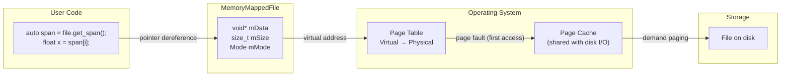

# Overview - MemoryMappedFile

*Fat-P Library — February 2026*

---

## Executive Summary

MemoryMappedFile is a cross-platform RAII wrapper for OS-level memory-mapped file I/O. It maps a file into the process's virtual address space, allowing reads and writes through ordinary pointer dereference instead of `read()`/`write()` system calls. The OS page cache handles I/O transparently—pages are loaded on demand when accessed and flushed back to disk automatically. For sequential reads of large files, memory mapping is 2–5× the throughput of `fread()`. For random access, the advantage is 10–50× because each access is a pointer dereference (nanoseconds) rather than a `seek` + `read` syscall pair (microseconds). The class supports ReadOnly, ReadWrite, and Private (copy-on-write) modes, provides `std::span<T>` typed views, and is move-only with RAII cleanup. It abstracts the POSIX `mmap`/`munmap` and Windows `CreateFileMapping`/`MapViewOfFile` APIs behind a single interface.

---

## Overview Card

**Component:** MemoryMappedFile
**Problem solved:** High-performance file I/O without explicit read/write calls, buffer management, or OS-specific API plumbing
**When to use:** Large file reads (logs, datasets, assets); random-access file processing; shared-memory IPC; memory-efficient file parsing; any case where `fread()`/`fwrite()` throughput is the bottleneck
**When NOT to use:** Files larger than available virtual address space (32-bit systems with >2 GB files); files on network mounts (page faults go over the network); cases requiring fine-grained I/O error handling (page faults report errors via signals, not return codes)
**Key guarantee:** RAII lifecycle — file is unmapped when the object is destroyed; strong exception safety on construction
**std equivalent:** None (no standard memory-mapped file)
**Boost equivalent:** `boost::interprocess::mapped_region`
**Other alternatives:** Platform-native `mmap()`/`MapViewOfFile()`, Qt `QFile::map()`, LLVM `MemoryBuffer`
**Read next:** User Manual - MemoryMappedFile, Overview - SlidingFileWindow

---

## The Problem Domain

### What Goes Wrong Without It

Traditional file I/O in C++ goes through a three-layer stack: the application allocates a buffer, calls `read()` (or `fread()`, or `istream::read()`), the OS copies data from the kernel page cache into the buffer, and the application processes the buffer. Every byte is copied twice: once from disk into the kernel page cache, once from the page cache into the user-space buffer.

For a 1 GB dataset file, this double-copy consumes 2 GB of memory bandwidth. Worse, the application must decide the buffer size in advance. Too small (4 KB) means thousands of `read()` syscalls, each costing 200–500 ns in kernel transition overhead. Too large (1 GB) means a single copy that may not fit in cache. Getting the buffer size right requires knowledge of the hardware—L3 cache size, prefetch distance, NUMA topology—that varies across machines.

Memory mapping eliminates the copy. The OS maps the file's pages directly into the process's address space. When the application accesses a byte, the CPU's page table maps it to the kernel page cache entry for that page. There is no `read()` call, no buffer allocation, no copy. The data exists in exactly one place in physical memory, shared between kernel and user space.

### The Standard's Limitation

C++20 introduced `std::filesystem` for path manipulation and directory traversal, but no memory-mapping API. The committee has discussed it (P1031, P1883), but the semantics are platform-specific enough that standardization is difficult: error handling (signals vs exceptions), page size alignment, write ordering guarantees, and interaction with file locks all differ between POSIX and Windows.

---

## Architecture



The class wraps platform-specific APIs:

| Operation | POSIX | Windows |
|-----------|-------|---------|
| Open | `open()` | `CreateFileA()` |
| Map | `mmap()` | `CreateFileMappingA()` + `MapViewOfFile()` |
| Unmap | `munmap()` | `UnmapViewOfFile()` + `CloseHandle()` |
| Sync | `msync()` | `FlushViewOfFile()` |

Three access modes control the mapping's permission bits:

| Mode | POSIX prot/flags | Windows | Behavior |
|------|-----------------|---------|----------|
| `ReadOnly` | `PROT_READ`, `MAP_PRIVATE` | `PAGE_READONLY` | Reads only; writes segfault |
| `ReadWrite` | `PROT_READ|PROT_WRITE`, `MAP_SHARED` | `PAGE_READWRITE` | Reads and writes; changes visible to other processes and persisted |
| `Private` | `PROT_READ|PROT_WRITE`, `MAP_PRIVATE` | Copy-on-write | Writes go to private copy; original file unchanged |

---

## Feature Inventory

### 1. RAII Lifecycle

Construction maps; destruction unmaps. No manual cleanup needed:

```cpp
{
    fat_p::MemoryMappedFile file("data.bin", fat_p::MemoryMappedFile::Mode::ReadOnly);
    // file is mapped here
    auto span = file.get_span<uint8_t>();
    process(span);
} // file is unmapped here
```

### 2. Typed Span Access

`get_span<T>()` returns a `std::span<T>` (or `std::span<const T>` for const access) over the mapped region. The span's size is `file.size() / sizeof(T)`. This gives you bounds-checkable, iterator-compatible access to the file's contents as typed elements.

### 3. Move Semantics

MemoryMappedFile is non-copyable (copying a kernel mapping handle is meaningless) but movable. You can store mapped files in containers and return them from functions.

### 4. Cross-Platform

The same API works on Linux, macOS, FreeBSD, and Windows. Platform-specific code is hidden behind `#if FATP_PLATFORM_WINDOWS` guards.

---

## Performance Characteristics

| Operation | Cost | Mechanism |
|-----------|------|-----------|
| Construction (map) | ~10–100 µs | Kernel mapping setup, no data I/O |
| First access to page | ~1–10 µs | Page fault + disk read (or cache hit) |
| Subsequent access | ~1–4 ns | L1/L2 cache hit |
| Destruction (unmap) | ~10–50 µs | Kernel mapping teardown |

### Where MemoryMappedFile Wins

**Sequential large-file reads.** No buffer management, no copy overhead, OS prefetcher handles readahead automatically.

**Random access.** Each access is a pointer dereference, not a seek+read syscall pair. The OS page cache handles caching automatically.

**Multi-process sharing.** ReadOnly mappings share physical pages across processes. Ten processes mapping the same file use the same physical memory.

### Where MemoryMappedFile Loses

**32-bit address space.** A 32-bit process has ~2–3 GB of virtual address space. Files larger than this cannot be mapped entirely.

**Network filesystems.** Page faults on NFS/CIFS go over the network. Latency is unpredictable. Error handling for network failures via signals is unreliable.

**Write error handling.** Write failures (disk full, permissions) are reported asynchronously via `SIGBUS` on POSIX, not via return codes. Catching these requires signal handling, which is fragile.

---

## Integration Points

```
MemoryMappedFile.h (Foundation)
    → depends on: PlatformDetection.h, CppFeatureDetection.h
    → pairs with: SlidingFileWindow.h (windowed access for files too large to map)
    → pairs with: BinaryLite.h (Decoder can read from mapped memory)
    → pairs with: CborLite.h (Decoder can read from mapped memory)
```

---

## Final Assessment

**Permanence.** Memory-mapped I/O has been a kernel primitive since 4.2BSD (1983) and Windows NT (1993). The OS APIs are stable. No C++ standard wrapper is imminent.

**Simplicity.** The entire API is: construct with filename and mode, call `get_span<T>()`, use the span, let the destructor clean up. There is nothing to configure, no buffer size to tune, no async callback to register.

**Tradeoffs acknowledged.** Not suitable for 32-bit systems with large files, network filesystems, or cases needing synchronous write error reporting. When these matter, use traditional I/O or SlidingFileWindow.

---

*MemoryMappedFile.h — Fat-P Library*
