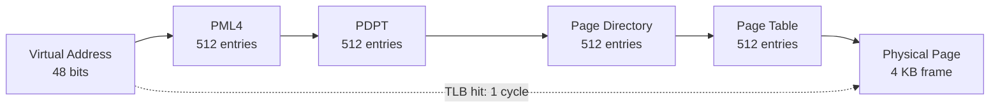
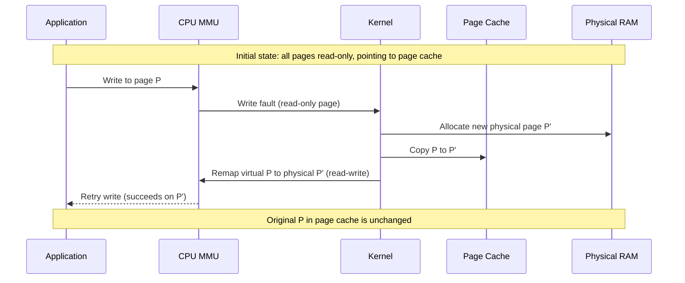
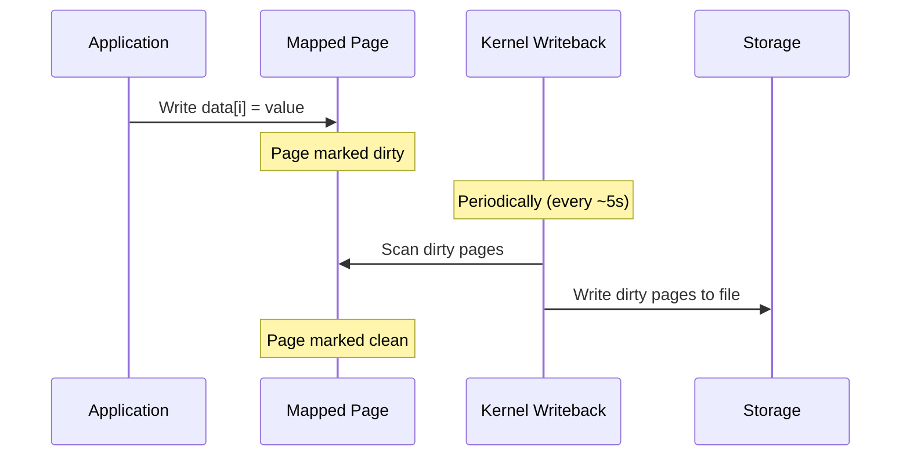

# User Manual - MemoryMappedFile

*February 2026*

---

**Scope:** Complete usage guide for `fat_p::MemoryMappedFile`, including the virtual memory mechanics that govern its performance, construction, typed span access, read-write mapping, copy-on-write internals, platform differences, integration with Fat-P serialization decoders, use case walkthroughs, best practices for HPC workloads, and migration from common alternatives.

**Not covered:**
- SlidingFileWindow (separate component for windowed access)
- Shared-memory IPC beyond file-backed mappings
- Partial mapping (no offset/length parameters)

**Prerequisites:**
- C++20 (`std::span`)
- Basic understanding of file I/O (`open`, `read`, `close`)
- No prior virtual memory knowledge required (this manual teaches it)

---

## User Manual Card

**Component:** MemoryMappedFile
**Primary use case:** Map a file into memory for zero-copy read/write access via pointer dereference
**Integration pattern:** Construct with filename + mode -> access via `get_span<T>()` -> destructor unmaps
**Key API:** constructor, `open()`, `close()`, `is_open()`, `data()`, `size()`, `get_span<T>()`
**std equivalent:** None
**Migration from std:** Replace `ifstream` read loops with `get_span<T>()` iteration
**Common mistakes:** Using ReadWrite when ReadOnly suffices (disables page sharing); forgetting write errors are signals, not exceptions; mapping files on NFS; ignoring TLB pressure with random access on large files
**Performance notes:** Eliminates kernel-to-userspace memcpy for sequential reads; eliminates syscall pair for random access. Performance depends on page cache residency and TLB coverage. See `components/MemoryMappedFile/results/` for current data

---

## Table of Contents

1. [The Memory Mapping Story](#the-memory-mapping-story)
2. [Understanding Virtual Memory](#understanding-virtual-memory)
3. [The Page Cache: Why Memory Mapping Is Fast](#the-page-cache)
4. [Getting Started](#getting-started)
5. [The Three Modes](#the-three-modes)
6. [Copy-on-Write: How Private Mode Actually Works](#copy-on-write)
7. [Typed Span Access](#typed-span-access)
8. [Using Mapped Memory with BinaryLite and CborLite](#using-mapped-memory-with-binarylite-and-cborlite)
9. [The Prefetcher: Why Sequential Access Is Fast](#the-prefetcher)
10. [TLB Pressure: Why Random Access Can Be Slow](#tlb-pressure)
11. [Dirty Pages and Write-Back](#dirty-pages-and-write-back)
12. [Thread Safety](#thread-safety)
13. [Platform Differences](#platform-differences)
14. [Use Case: Parsing a Multi-Gigabyte Log File](#use-case-log-file)
15. [Use Case: Read-Only Lookup Table Shared Across Processes](#use-case-lookup-table)
16. [Use Case: Zero-Copy Deserialization Pipeline](#use-case-deserialization)
17. [Use Case: Copy-on-Write Database Snapshot](#use-case-cow-snapshot)
18. [Best Practices](#best-practices)
19. [Advanced Usage](#advanced-usage)
20. [Performance Characteristics](#performance-characteristics)
21. [Migration from fread/fwrite](#migration-from-freadfwrite)
22. [Migration from Boost.Interprocess](#migration-from-boostinterprocess)
23. [Migration from Raw mmap/MapViewOfFile](#migration-from-raw-mmap)
24. [Troubleshooting](#troubleshooting)
25. [Known Limitations](#known-limitations)
26. [API Reference](#api-reference)
27. [FAQ](#faq)

---

## The Memory Mapping Story

Traditional file I/O in C++ is a three-step relay race. Your application allocates a buffer. The OS reads data from disk into its own kernel buffer (the page cache). Then the OS copies data from the kernel buffer into your application buffer. Every byte that reaches your code has been copied twice: once from disk to kernel, once from kernel to you.

This design made sense in the 1970s when PDP-11 processes had 64 KB of address space and could not possibly map entire files. It stopped making sense when virtual address spaces grew to gigabytes and then terabytes. A 64-bit process on Linux has 128 TB of virtual address space. A 10 GB file occupies 0.008% of it. There is no architectural reason to copy data through an intermediate kernel buffer when the CPU's memory management hardware can map the file's pages directly into the process's address space.

Memory mapping eliminates the intermediate copy. The OS sets up your process's page table so that a range of virtual addresses points directly at the page cache entries for the file. When your code dereferences a pointer in that range, the CPU translates the virtual address to the physical address of the cached page. No system call, no kernel transition, no copy. The data exists in exactly one place in physical memory. Your code reads it where it sits.

The idea dates to Multics (1969), which introduced single-level storage where files and memory were unified. BSD 4.2 (1983) brought `mmap()` to Unix. Windows NT (1993) added `CreateFileMapping()`/`MapViewOfFile()`. The system call names differ; the mechanism is identical.

---

## Understanding Virtual Memory

Every pointer dereference in a C++ program goes through the CPU's Memory Management Unit (MMU). The pointer's value is a virtual address---an index into the process's page table, not a physical location in DRAM. The MMU translates virtual to physical by walking the page table, a tree structure maintained by the OS kernel.

On x86-64, the page table has four levels. Each level narrows the address by 9 bits, indexing into a 512-entry table. The walk visits four memory locations before arriving at the physical page frame number. At 4 ns per memory access, a full walk costs approximately 16 ns. This happens on every memory access that misses the Translation Lookaside Buffer (TLB).



The TLB is a small, fast cache of recent virtual-to-physical translations. A typical L1 TLB holds 64 entries. A typical L2 TLB holds 1,536 entries. Each entry covers one page---typically 4 KB. With standard 4 KB pages, the L2 TLB covers 1,536 x 4 KB = 6 MB of virtual address space.

When your access pattern touches more than 6 MB of distinct pages in a short period, TLB misses start dominating. Instead of 1 cycle per access (TLB hit), you pay 16+ ns per access (page table walk). For a memory-mapped file with random access across gigabytes, the TLB is the bottleneck---not the disk, not the page cache, but the translation hardware.

This is why page size matters. With 4 KB pages, a 1 GB file requires 262,144 page table entries. With 2 MB huge pages, the same file requires 512 entries---well within the L2 TLB. The performance difference for random access can be 10x or more.

---

## The Page Cache: Why Memory Mapping Is Fast

The page cache is the OS's cache of file data in physical memory. When any process reads a file---via `read()`, `fread()`, or memory mapping---the data enters the page cache. When another process reads the same file, the data is already there.

The page cache typically occupies all available physical memory not in use by applications. On a 64 GB machine running a few services, the page cache might hold 50 GB of file data. Under memory pressure, the OS evicts least-recently-used pages.

**Buffered I/O (fread):** Application calls `fread()` -> kernel checks page cache -> if hit, copies data from page cache to user buffer. Two copies of the data exist: one in the page cache, one in the application's buffer.

**Memory mapping:** Application dereferences pointer -> MMU translates virtual address -> address points directly to page cache page. One copy of the data exists. No system call, no kernel transition.

For sequential reads of large files, memory mapping achieves significantly higher throughput than `fread()` because it eliminates the `memcpy` from kernel to user space. For random access, the advantage is larger still, because each `fread()` random access involves a system call pair (`seek` + `read`), while each mapped random access is a pointer dereference (if the page is cached and the TLB entry is valid).

---

## Getting Started

### Prerequisites and Integration

MemoryMappedFile requires C++20. It depends on `PlatformDetection.h` and `CppFeatureDetection.h` and the platform headers `<sys/mman.h>` (POSIX) or `<windows.h>` (Windows).

```cpp
#include "MemoryMappedFile.h"
```

### Your First Mapped File

```cpp
#include "MemoryMappedFile.h"
#include <iostream>

int main()
{
    fat_p::MemoryMappedFile file("data.bin", fat_p::MemoryMappedFile::Mode::ReadOnly);

    if (!file.is_open())
    {
        std::cerr << "Failed to map file\n";
        return 1;
    }

    std::cout << "Mapped " << file.size() << " bytes\n";

    auto bytes = file.get_span<const uint8_t>();
    for (size_t i = 0; i < std::min(bytes.size(), size_t(16)); ++i)
    {
        std::cout << std::hex << static_cast<int>(bytes[i]) << " ";
    }
    std::cout << "\n";
}
```

The constructor maps the file. `get_span<const uint8_t>()` returns a `std::span` over the mapped region. When `file` goes out of scope, the destructor unmaps.

### Two-Step Construction

When you cannot provide the filename at construction time:

```cpp
fat_p::MemoryMappedFile file;
if (file.open("data.bin", fat_p::MemoryMappedFile::Mode::ReadOnly))
{
    process(file.get_span<const float>());
}
```

`open()` returns `bool`; it does not throw. The throwing constructor is for cases where mapping failure is unrecoverable.

---

## The Three Modes

### ReadOnly

Maps the file with read-only permissions. Any write through the span causes a segmentation fault. This is the default. ReadOnly mappings share physical pages with other processes that map the same file---if ten processes map a 1 GB file ReadOnly, they all share the same 1 GB of physical memory. This is the mechanism behind shared libraries.

### ReadWrite

Maps the file with read-write permissions. Writes through the span modify the underlying file. The mapping is `MAP_SHARED` on POSIX---changes are visible to other processes mapping the same file and are eventually flushed to disk by the OS.

ReadWrite mode has two consequences that ReadOnly avoids. Modified pages enter the OS dirty page list, consuming kernel bookkeeping overhead and triggering background write-back I/O. And modified pages are no longer shared between processes, since each needs its own dirty-page tracking.

```cpp
fat_p::MemoryMappedFile file("output.bin", fat_p::MemoryMappedFile::Mode::ReadWrite);
auto data = file.get_span<char>();
data[0] = 'X';  // Modifies the file on disk
```

### Private (Copy-on-Write)

Maps the file with read-write permissions, but writes go to a private copy of the affected page. The original file is never modified.

```cpp
fat_p::MemoryMappedFile file("template.bin", fat_p::MemoryMappedFile::Mode::Private);
auto data = file.get_span<uint8_t>();
data[0] = 0xFF;  // Private copy; file on disk unchanged
```

---

## Copy-on-Write: How Private Mode Actually Works

When you create a Private mapping, the OS initially maps the file's pages with read-only permissions---even though you requested read-write. Every page points to the same physical page in the page cache that a ReadOnly mapping would use. No data is copied.

When your code writes to a page, the CPU generates a write fault (a page fault caused by a write to a read-only page). The OS catches this fault, allocates a new physical page, copies the original page's contents into it, maps the new page at the faulting address with read-write permissions, and retries the instruction. Your write succeeds on the private copy. The original page in the page cache is untouched.



The consequence: Private mode is cheap until you write. Reading is identical to ReadOnly---same physical pages, same performance. Each page you write costs one page allocation (4 KB) and one page copy (approximately 50-100 ns). If you write to every page in a 1 GB file, you eventually allocate 1 GB of private memory. But if you modify 1% of pages, you consume only 1% additional memory.

---

## Typed Span Access

`get_span<T>()` reinterprets the mapped region as a `std::span<T>`. The span length is `file.size() / sizeof(T)`. Trailing bytes that do not fill a complete `T` are inaccessible.

```cpp
fat_p::MemoryMappedFile file("samples.bin");
auto floats = file.get_span<const float>();  // span of file.size()/4 floats

double sum = 0.0;
for (float f : floats) sum += f;
```

The span does not own the data. Using it after the `MemoryMappedFile` is closed or destroyed is undefined behavior.

For SIMD types, mapped memory is inherently suitable: `mmap()` returns page-aligned addresses (4096-byte boundary), which exceeds the alignment requirements of `__m256` (32 bytes) and `__m512` (64 bytes).

---

## Using Mapped Memory with BinaryLite and CborLite

Both BinaryLite's Decoder and CborLite's Decoder accept a `const uint8_t*` and a size. Construct them directly on mapped memory:

```cpp
fat_p::MemoryMappedFile file("data.fatp_bin");
auto bytes = file.get_span<const uint8_t>();

fat_p::binary::Decoder dec(bytes.data(), bytes.size());
auto name = dec.readString();
auto value = dec.readDouble();
```

This is true zero-copy deserialization: the Decoder reads from the page cache without any buffer allocation. Integer and float reads are pure pointer arithmetic. String reads still allocate a `std::string`, but the source data is read from the page cache without an intermediate buffer.

---

## The Prefetcher: Why Sequential Access Is Fast

When you access mapped memory sequentially, the CPU's hardware prefetcher and the OS's readahead mechanism work together to hide page fault latency.

The CPU's L2 prefetcher detects sequential access patterns and loads cache lines ahead of your reads. This hides L2 miss latency (approximately 5 ns) but does not help with page faults, because the prefetcher operates within already-mapped pages.

The OS provides a second layer. When the kernel services a page fault, it checks whether recent faults have been sequential. If so, it reads ahead---loading the next 16-128 pages (64 KB-512 KB) from disk in a single I/O operation. This converts many individual page faults into one large sequential read.

On Linux, you can influence this with `madvise()` on the raw pointer:

```cpp
fat_p::MemoryMappedFile file("big.bin");
madvise(file.data(), file.size(), MADV_SEQUENTIAL);

auto span = file.get_span<const float>();
for (float f : span) { /* ... */ }
```

`MADV_SEQUENTIAL` enables aggressive readahead and frees pages behind the cursor. `MADV_RANDOM` disables readahead. The default (`MADV_NORMAL`) uses moderate readahead.

MemoryMappedFile does not call `madvise()` itself. It provides `data()` so you can call it when you know your access pattern.

---

## TLB Pressure: Why Random Access Can Be Slow

Random access to a large mapped file can be slower than expected because of TLB pressure. The L2 TLB covers approximately 6 MB with 4 KB pages. For a 10 GB file with uniform random access, the TLB hit probability is 6 MB / 10 GB = 0.06%. Virtually every access triggers a page table walk (approximately 16 ns).

The solution is huge pages. With 2 MB pages, the L2 TLB covers 1,536 x 2 MB = approximately 3 TB. Every access hits the TLB.

On Linux, transparent huge pages may help for anonymous mappings but not reliably for file-backed mappings. For deterministic huge-page behavior, pre-allocate huge pages:

```bash
echo 1024 > /proc/sys/vm/nr_hugepages  # Reserve 2 GB of huge pages
```

To diagnose TLB pressure, use: `perf stat -e dTLB-load-misses,dTLB-loads ./your_program`. If the miss rate exceeds 1%, TLB pressure is your bottleneck.

---

## Dirty Pages and Write-Back

When you write to a ReadWrite-mapped page, the OS marks it dirty. Dirty pages are written back to disk asynchronously by the kernel's writeback thread---default interval approximately 5 seconds on Linux.



This means data written through a mapped pointer may not reach disk for up to 5 seconds. If the process crashes during this window, modifications are lost. For durability guarantees, call `msync()` directly on `data()`:

```cpp
fat_p::MemoryMappedFile file("critical.bin", fat_p::MemoryMappedFile::Mode::ReadWrite);
auto data = file.get_span<uint8_t>();
data[0] = 0xFF;

msync(file.data(), file.size(), MS_SYNC);  // Force to disk
```

On Windows, the equivalent is `FlushViewOfFile()`.

---

## Thread Safety

**A single MemoryMappedFile instance should be used by one thread.** The `open()`, `close()`, and destructor methods are not synchronized.

**The mapped memory itself is safe to read concurrently.** Multiple threads can read through the same or independent spans without synchronization. ReadOnly pages are immutable.

**Concurrent writes to the same ReadWrite mapping require external synchronization.** Overlapping writes are data races from the C++ memory model's perspective.

**Multiple MemoryMappedFile instances mapping the same file is safe.** Each instance has its own file descriptor. ReadOnly mappings share physical pages automatically.

---

## Platform Differences

| Behavior | POSIX | Windows |
|----------|-------|---------|
| Maximum mappable size | ~128 TB (64-bit Linux) | System commit charge limit |
| Write error reporting | `SIGBUS` signal | Structured exception |
| File growth after mapping | `SIGBUS` beyond original size | Access violation |
| Sparse file support | Transparent | Requires NTFS |
| Page size | 4 KB default; 2 MB / 1 GB huge pages | 4 KB default; 2 MB large pages |
| Flush | `msync()` | `FlushViewOfFile()` |
| Prefetch hint | `madvise()` | `PrefetchVirtualMemory()` |

The most important difference is write error handling. On POSIX, a disk-full condition during write-back delivers `SIGBUS` asynchronously---no way to associate it with a specific write. On Windows, errors may surface as structured exceptions during `FlushViewOfFile()`. Neither maps cleanly to C++ exceptions. If you need reliable per-write error detection, use `write()` with return-code checking.

---

## Use Case: Parsing a Multi-Gigabyte Log File

A 20 GB log file needs scanning for error entries. Loading it into a `std::string` is impossible.

```cpp
fat_p::MemoryMappedFile file("server.log", fat_p::MemoryMappedFile::Mode::ReadOnly);
auto text = file.get_span<const char>();
madvise(file.data(), file.size(), MADV_SEQUENTIAL);

size_t error_count = 0;
for (size_t i = 0; i + 5 <= text.size(); ++i)
{
    if (text[i] == 'E' && std::memcmp(&text[i], "ERROR", 5) == 0)
        ++error_count;
}
```

Peak resident memory: a few megabytes of page cache window, not 20 GB. The `MADV_SEQUENTIAL` hint causes aggressive readahead and behind-eviction.

## Use Case: Read-Only Lookup Table Shared Across Processes

A 500 MB precomputed lookup table is used by 8 worker processes. Without mapping, each loads its own copy: 4 GB total.

```cpp
fat_p::MemoryMappedFile lut("lookup_table.bin", fat_p::MemoryMappedFile::Mode::ReadOnly);
auto table = lut.get_span<const double>();
double result = table[index];
```

Because all mappings are ReadOnly, the OS shares physical pages. Total physical memory: 500 MB, not 4 GB.

## Use Case: Zero-Copy Deserialization Pipeline

```cpp
fat_p::MemoryMappedFile input("sensors.fatp_bin");
auto bytes = input.get_span<const uint8_t>();

fat_p::binary::Decoder dec(bytes.data(), bytes.size());
while (!dec.eof())
{
    uint32_t sensor_id = dec.readUint32();
    double reading = dec.readDouble();
    uint64_t timestamp = dec.readUint64();
    process(sensor_id, reading, timestamp);
}
```

The Decoder reads directly from the page cache. No intermediate buffer, no heap allocation, no system call per record.

## Use Case: Copy-on-Write Database Snapshot

A key-value store takes an analytics snapshot without copying the entire data file:

```cpp
fat_p::MemoryMappedFile snapshot("data.kv", fat_p::MemoryMappedFile::Mode::Private);
auto records = snapshot.get_span<Record>();

for (auto& record : records)
    record.value = normalize(record.value);  // COW: only modified pages are copied
```

The snapshot initially shares all physical pages with other ReadOnly mappings. Only pages modified by analytics incur copy-on-write overhead. If analytics modifies 1% of pages, it consumes 1% additional memory.

---

## Best Practices

### Prefer ReadOnly Unless You Need Writes

ReadOnly mappings share physical pages across processes and with the page cache. ReadWrite creates private dirty copies. Default to ReadOnly.

### Use madvise for Known Access Patterns

`MADV_SEQUENTIAL` for scans (aggressive readahead, free behind). `MADV_RANDOM` for random access (disable wasted readahead). The default `MADV_NORMAL` uses moderate readahead.

### Consider Huge Pages for Large Random-Access Workloads

If `perf stat -e dTLB-load-misses` shows a high miss rate, TLB pressure is limiting random-access performance. Huge pages (2 MB) extend TLB coverage from approximately 6 MB to approximately 3 TB.

### Budget Resident Set Size, Not Virtual Size

Mapping a 100 GB file does not consume 100 GB of RAM. It consumes 100 GB of virtual address space (free on 64-bit) and physical memory only for pages actually accessed. Monitor RSS, not VSZ. On Linux, `/proc/<pid>/smaps` shows per-mapping RSS.

### Do Not Map Files on Network Filesystems

Page faults on NFS/CIFS go over the network. Latency is unpredictable. Write error handling via signals is unreliable. Copy the file locally first.

### Flush Explicitly When Durability Matters

Do not rely on the 5-second writeback timer for data you cannot afford to lose. Call `msync(data, size, MS_SYNC)` after critical writes.

---

## Advanced Usage

### Mapping Multiple Files

MemoryMappedFile instances are independent. Map an index file and a data file simultaneously:

```cpp
fat_p::MemoryMappedFile index_file("data.idx");
fat_p::MemoryMappedFile data_file("data.bin");

auto index = index_file.get_span<const uint64_t>();
auto data = data_file.get_span<const uint8_t>();

for (size_t i = 0; i < index.size(); ++i)
{
    const uint8_t* record = &data[index[i]];
    process(record);
}
```

### Re-Mapping a Growing File

MemoryMappedFile does not support extending a mapping. To see newly appended data:

```cpp
file.close();
file.open("data.bin", fat_p::MemoryMappedFile::Mode::ReadOnly);
// Mapping now covers the current file size
```

For workloads following a growing file, re-map periodically or use `inotify` to trigger re-maps.

### SIMD Operations on Mapped Data

Mapped memory is page-aligned (4096-byte boundary), exceeding the alignment requirements of all SIMD types:

```cpp
fat_p::MemoryMappedFile file("vectors.bin");
auto floats = file.get_span<const float>();

const __m256* avx_data = reinterpret_cast<const __m256*>(floats.data());
size_t avx_count = floats.size() / 8;

for (size_t i = 0; i < avx_count; ++i)
{
    __m256 vec = _mm256_load_ps(reinterpret_cast<const float*>(&avx_data[i]));
    // process vec
}
```

No special alignment handling needed.

---

## Performance Characteristics

Memory-mapped file performance depends on three factors: whether the page is in the OS page cache, whether the TLB has a valid translation, and whether the access is sequential (enabling OS readahead) or random.

- **Construction/destruction:** Kernel mapping setup and teardown. No data is read during construction.
- **First page access:** Triggers a page fault. Cost depends on whether the page is in the OS page cache (fast) or must be read from disk (SSD is much faster than HDD).
- **Subsequent access (TLB hit):** A direct pointer dereference at L1/L2 cache speed.
- **Subsequent access (TLB miss):** Requires a page table walk before the memory access.
- **msync:** Synchronous disk write for dirty pages.

### Where MemoryMappedFile Wins

**Sequential large-file reads.** No buffer management, no kernel-to-userspace copy. OS prefetcher handles readahead, providing significantly higher throughput than `fread()`.

**Random access within page cache.** A pointer dereference avoids the syscall pair (`fseek` + `fread`) required by stream I/O, providing dramatically faster random reads when pages are cached.

**Multi-process sharing.** ReadOnly mappings share physical pages. Ten processes, one copy.

See `components/MemoryMappedFile/results/` for current platform-specific benchmark data.

### Where MemoryMappedFile Loses

**Random access beyond page cache.** Every miss triggers disk I/O.

**Small files opened briefly.** Kernel setup/teardown overhead dominates for sub-millisecond accesses.

**Write error handling.** Errors are signals (POSIX) or structured exceptions (Windows), not return codes.

---

## Migration from fread/fwrite

**Before:**
```cpp
std::ifstream in("data.bin", std::ios::binary);
std::vector<float> buf(1'000'000);
in.read(reinterpret_cast<char*>(buf.data()), buf.size() * sizeof(float));
double sum = 0.0;
for (float f : buf) sum += f;
```

**After:**
```cpp
fat_p::MemoryMappedFile file("data.bin");
auto buf = file.get_span<const float>();
double sum = 0.0;
for (float f : buf) sum += f;
```

Eliminates the `vector` allocation and the `read()` copy. For a 4 GB file, this means no 4 GB heap allocation and no 4 GB copy.

---

## Migration from Boost.Interprocess

**Before:**
```cpp
namespace bi = boost::interprocess;
bi::file_mapping mapping("data.bin", bi::read_only);
bi::mapped_region region(mapping, bi::read_only);
const float* data = static_cast<const float*>(region.get_address());
size_t count = region.get_size() / sizeof(float);
```

**After:**
```cpp
fat_p::MemoryMappedFile file("data.bin");
auto data = file.get_span<const float>();
```

| Boost.Interprocess | Fat-P |
|---|---|
| Two objects (`file_mapping` + `mapped_region`) | Single `MemoryMappedFile` |
| `void*` via `get_address()` | `std::span<T>` via `get_span<T>()` |
| Offset/length parameters | Whole-file only |
| ~50 transitive Boost headers | Fat-P headers only |

---

## Migration from Raw mmap/MapViewOfFile

**Before (POSIX):**
```cpp
int fd = open("data.bin", O_RDONLY);
struct stat st;
fstat(fd, &st);
void* ptr = mmap(nullptr, st.st_size, PROT_READ, MAP_PRIVATE, fd, 0);
close(fd);
// ... use ptr ...
munmap(ptr, st.st_size);
```

**Before (Windows):**
```cpp
HANDLE hFile = CreateFileA("data.bin", GENERIC_READ, FILE_SHARE_READ,
                           nullptr, OPEN_EXISTING, 0, nullptr);
HANDLE hMap = CreateFileMappingA(hFile, nullptr, PAGE_READONLY, 0, 0, nullptr);
void* ptr = MapViewOfFile(hMap, FILE_MAP_READ, 0, 0, 0);
// ... use ptr ...
UnmapViewOfFile(ptr);
CloseHandle(hMap);
CloseHandle(hFile);
```

**After (both platforms):**
```cpp
fat_p::MemoryMappedFile file("data.bin");
auto span = file.get_span<const uint8_t>();
```

Fat-P eliminates platform `#ifdef` blocks, manual handle management, size calculation, and the possibility of leaking handles on error paths. RAII handles all cleanup.

---

## Troubleshooting

### Segmentation fault on write

The file was opened in ReadOnly mode. ReadOnly pages have hardware write-protection. Use `Mode::ReadWrite` to modify the file on disk, or `Mode::Private` to modify a private copy.

### SIGBUS after file was truncated

Another process truncated the file while it was mapped. The mapping's virtual addresses still exist, but the file no longer backs them. Ensure no concurrent truncation during mapping.

### SIGBUS on sparse file regions

Accessing a hole in a sparse file with `MAP_SHARED` can trigger SIGBUS if the filesystem cannot allocate a backing block. Use `MAP_PRIVATE` for sparse files, or pre-allocate with `fallocate()`.

### Slow sequential reads (similar to fread)

The file fits in the page cache and `fread()` is already hitting cache. Memory mapping's advantage is largest for I/O-bound workloads and large files that exceed buffer sizes.

### Slow random access (worse than expected)

TLB misses. Diagnose with `perf stat -e dTLB-load-misses,dTLB-loads`. If miss rate exceeds 1%, investigate huge pages or restructure access for locality.

### Excessive resident set size

The OS readahead mechanism is loading pages you have not explicitly accessed. Use `madvise(MADV_RANDOM)` to disable readahead. Use `madvise(addr, len, MADV_DONTNEED)` to release pages you are finished with.

### Mapping fails on large files (32-bit)

32-bit processes have approximately 2-3 GB of virtual address space. Use a 64-bit build, or use SlidingFileWindow for windowed access.

### File not found / permission denied

The constructor throws `std::runtime_error`. The `open()` method returns `false`. Verify the path and permissions with `std::filesystem::exists()`.

### Data not visible after another process writes

The mapping's size was fixed at construction time. New data appended after mapping is beyond the mapping's range. Close and re-open the mapping to see the updated file.

---

## Known Limitations

**No partial mapping.** The entire file is mapped. For files larger than virtual address space (32-bit), use SlidingFileWindow.

**No file growth.** You cannot extend a mapped file through the mapping. Unmap, resize, remap.

**No anonymous mappings.** Only file-backed mappings. For shared memory without a file, use `shm_open()` + `mmap()` directly.

**No `msync()` wrapper.** Call `msync()` / `FlushViewOfFile()` directly on `data()` when durability is needed.

**No `madvise()` wrapper.** Call `madvise()` / `PrefetchVirtualMemory()` directly on `data()` for prefetch hints.

**No offset/length parameters.** The entire file is always mapped. For partial mapping, use raw `mmap()`.

---

## API Reference

| Method | Description |
|--------|-------------|
| `MemoryMappedFile()` | Construct unmapped |
| `MemoryMappedFile(filename, mode)` | Construct and map; throws on failure |
| `~MemoryMappedFile()` | Unmap and release resources |
| `open(filename, mode)` | Map a file; returns `bool` |
| `close()` | Unmap and release resources |
| `is_open()` | Check if currently mapped |
| `data()` / `data() const` | Raw pointer to mapped memory |
| `size()` | File size in bytes |
| `get_span<T>()` / `get_span<T>() const` | Typed span view |
| Move constructor/assignment | Transfer ownership; source becomes unmapped |

---

## FAQ

**Q: Can I map a file being written by another process?**

ReadOnly mapping of a file being appended is safe on POSIX, but you only see data up to the size at mapping time. To see new data, close and re-open. On Windows, behavior depends on sharing flags.

**Q: Is mapping faster than mmap + memcpy into a local buffer?**

For sequential processing, working directly on the span is fastest. For repeated random access to a small subset, copying that subset into a local buffer may be faster due to reduced TLB pressure.

**Q: Should I prefer MemoryMappedFile or SlidingFileWindow?**

MemoryMappedFile: zero-copy, whole-file. SlidingFileWindow: bounded memory, element-level dirty tracking. Use MemoryMappedFile on 64-bit for files under approximately 100 GB. Use SlidingFileWindow when you need a guaranteed memory budget.

**Q: Does mapping a 100 GB file use 100 GB of RAM?**

No. Virtual address space is free on 64-bit. Physical memory is consumed only for pages actually accessed. If you access 1% of the file, RSS is approximately 1 GB.

**Q: Can I use memory-mapped files for IPC?**

Yes. Two processes can ReadWrite-map the same file as shared memory. You need external synchronization (file locks, named semaphores, or atomics in the shared region) to prevent data races.

**Q: What happens if the disk fills during ReadWrite mapping?**

On POSIX: `SIGBUS`, asynchronously. On Windows: structured exception during `FlushViewOfFile()`. If you need graceful disk-full handling, use explicit `write()` calls.

---

*MemoryMappedFile.h --- Fat-P Library*
