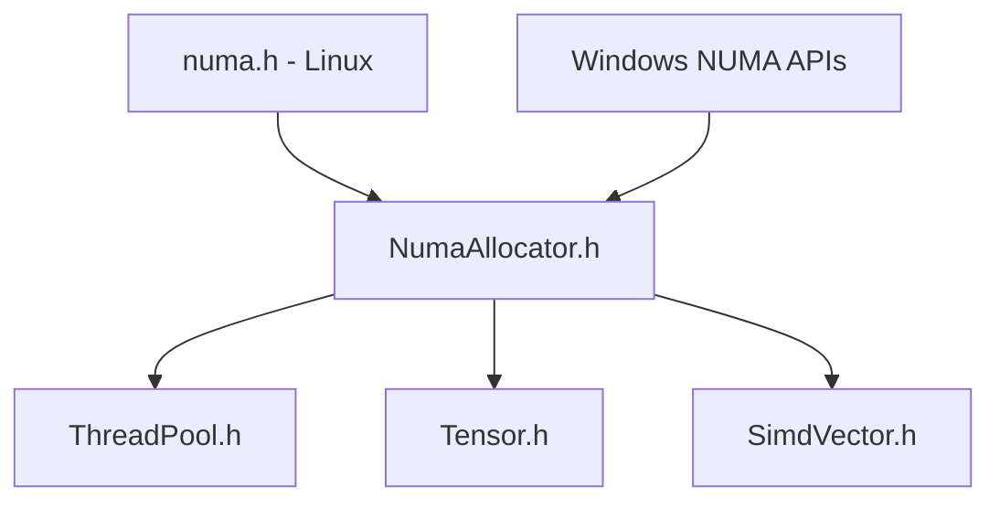

# NumaAllocator: A Fat-P Library Showcase

## Executive Summary

NumaAllocator is a **policy-based NUMA-aware memory allocator** that transforms memory-bound HPC workloads into compute-bound operations by ensuring data locality on many-core systems. Unlike manual `numa_alloc_*` calls (error-prone, platform-specific) or standard allocators (NUMA-oblivious), NumaAllocator provides **STL-compatible allocation** with compile-time policy selection for local, interleaved, or preferred-node placement. The `ThreadLocalNumaPool` arena eliminates per-allocation syscall overhead through pointer-bump allocation from pre-allocated contiguous blocks.

---

## The Problem Domain

### What Goes Wrong Without It

```cpp
// The NUMA-oblivious disaster on a 4-socket server
void process_data(const std::vector<double>& input)
{
    std::vector<double> results(input.size());  // Allocated on node 0
    
    #pragma omp parallel for
    for (size_t i = 0; i < input.size(); ++i)
    {
        // Thread on node 3 reads from node 0: 3x latency penalty
        // Thread on node 3 writes to node 0: 3x latency penalty
        results[i] = compute(input[i]);
    }
}

// The manual NUMA nightmare
void* ptr = numa_alloc_onnode(size, node);  // Linux only
if (!ptr) { /* handle error */ }
// ... use ptr ...
numa_free(ptr, size);  // Must remember exact size!
// What about Windows? What about containers? What about exceptions?
```

| Issue | HPC Impact |
|-------|------------|
| Remote memory access | 2-3x latency penalty crossing NUMA boundaries |
| First-touch allocation | Memory lands on allocating thread's node, not using thread's |
| Manual NUMA APIs | Platform-specific, size-tracking required, no RAII |
| No STL integration | Cannot use `std::vector` with NUMA placement |
| Syscall overhead | `numa_alloc_*` invokes kernel for every allocation |

### The Standard's Limitation

C++ allocators are NUMA-oblivious:
- `std::allocator` delegates to `malloc`/`operator new`—no placement control
- No standard API for NUMA topology discovery
- No portable thread-to-node binding
- Custom allocators require manual memory tracking

---

## Architecture: Policy-Based NUMA Allocation

### The Mechanism: Compile-Time Policy Resolution

```cpp
// Three allocation policies, zero runtime dispatch
struct NumaLocalPolicy {};       // Allocate on current thread's node
struct NumaInterleavedPolicy {}; // Round-robin across all nodes
struct NumaPreferredPolicy {     // Allocate on specified node
    int node = 0;
};

template<typename T, typename Policy = NumaLocalPolicy>
class NumaAllocator
{
    // Policy resolved at compile time via if constexpr
    // No virtual dispatch, no runtime branching
};
```

**Why policy-based:**

```cpp
// Runtime policy selection would require:
virtual void* allocate(size_t n) override;  // Virtual dispatch cost
if (policy == LOCAL) { ... }                // Branch on every allocation

// Compile-time policy selection:
if constexpr (std::is_same_v<Policy, NumaLocalPolicy>)
{
    // This branch compiled away for other policies
    return allocate_on_node(size, NumaInfo::current_node());
}
```

### Thread-Local Pool: Amortized Syscall Cost

```cpp
template<typename T>
class ThreadLocalNumaPool
{
    // One NUMA allocation per thread, reused for many objects
    static constexpr size_t default_pool_count = 1024;
    
    struct PoolNode
    {
        char* memory;           // Pre-allocated NUMA-local buffer
        size_t capacity_bytes;
        size_t used_bytes;
        int numa_node;
        bool numa_was_available;  // Captured at creation for safe destruction
    };
    
    static PoolNode& get_thread_pool()
    {
        thread_local PoolNode pool;  // One pool per thread
        return pool;
    }
};
```

**The performance mechanism:**

The key insight is syscall elimination. Direct NUMA allocation (`numa_alloc_onnode`) requires a kernel syscall per allocation. `ThreadLocalNumaPool` pre-allocates contiguous blocks from the target NUMA node and dispenses memory via pointer-bump—no syscall on the fast path. When the pool is exhausted, it falls back to direct allocation to refill.

See `components/NumaAllocator/results/` for current platform-specific allocation latency data.

---

## Feature Inventory

### 1. NUMA Topology Discovery

```cpp
using namespace fat_p::memory;

// Discover system topology without platform-specific code
bool numa_available = NumaInfo::is_available();
int node_count = NumaInfo::num_nodes();        // 1 on non-NUMA systems
int current = NumaInfo::current_node();        // Thread's current node
int cpus = NumaInfo::cpus_on_node(0);          // CPUs on node 0

// Query memory statistics
NumaMemoryStats stats = get_node_memory_stats(0);
if (stats.valid && stats.has_total)
{
    size_t free_gb = stats.free_bytes / (1024 * 1024 * 1024);
    std::cout << "Node 0 has " << free_gb << " GB free\n";
}
```

### 2. STL-Compatible NUMA Vectors

```cpp
// Local policy: data on current thread's NUMA node
NumaLocalVector<double> local_data(1000000);

// Interleaved policy: pages round-robin across all nodes (Linux only)
// Falls back to standard allocation on Windows
NumaInterleavedVector<double> shared_data(1000000);

// Preferred policy: data on specific node
auto node2_data = make_preferred_vector<double>(2, 1000000);
```

### 3. Thread-Local Arena for Hot Paths

```cpp
// Particle simulation: millions of temporary vectors per frame
void simulate_frame()
{
    for (int i = 0; i < 1000000; ++i)
    {
        // Without pool: 1M syscalls per frame
        // With pool: ~0 syscalls (pool pre-allocated)
        double* forces = ThreadLocalNumaPool<double>::allocate(3);
        compute_forces(particles[i], forces);
        apply_forces(particles[i], forces);
        ThreadLocalNumaPool<double>::deallocate(forces, 3);
    }
    
    // Bulk reset at frame end (optional, reclaims pool space)
    ThreadLocalNumaPool<double>::reset();
}
```

### 4. Cross-Thread Usage (With Constraints)

```cpp
// Producer-consumer pattern with NUMA awareness
// IMPORTANT: Producer must outlive consumer's use of pool memory
std::atomic<double*> shared_buffer{nullptr};
std::atomic<bool> consumer_done{false};

void producer_thread()
{
    // Allocate on producer's NUMA node
    double* data = ThreadLocalNumaPool<double>::allocate(1000);
    fill_data(data);
    shared_buffer.store(data);
    
    // CRITICAL: Wait for consumer before exiting
    while (!consumer_done.load())
    {
        std::this_thread::yield();
    }
}

void consumer_thread()
{
    double* data = shared_buffer.load();
    process_data(data);
    
    // Cross-thread deallocation is a no-op for pool allocations
    ThreadLocalNumaPool<double>::deallocate(data, 1000);
    consumer_done.store(true);
}
```

**Lifetime Constraints:**
- Pool pointers must not outlive the owning thread
- If the owner exits first: Windows gracefully handles via SEH; Linux/other may crash
- For producer-consumer where producer may exit first, use `NumaAllocator` directly

### 5. Thread-to-Node Binding

```cpp
// Pin worker threads to specific NUMA nodes
void worker(int worker_id, int numa_node)
{
    // Bind thread to execute only on CPUs of this NUMA node
    if (!bind_thread_to_node(numa_node))
    {
        std::cerr << "Warning: Could not bind to node " << numa_node << "\n";
    }
    
    // Allocations now likely to be local
    NumaLocalVector<double> local_buffer(1000000);
    
    // Verify placement (Linux only)
    int actual_node = get_memory_node(local_buffer.data());
    assert(actual_node == numa_node);
    
    process_local_data(local_buffer);
}
```

### 6. Over-Aligned Type Support

```cpp
// AVX-512 requires 64-byte alignment
struct alignas(64) SimdVector
{
    double data[8];
};

// NumaAllocator handles over-aligned types automatically
NumaLocalVector<SimdVector> simd_data(1000);
assert(reinterpret_cast<uintptr_t>(simd_data.data()) % 64 == 0);

// ThreadLocalNumaPool also supports over-aligned types
SimdVector* vectors = ThreadLocalNumaPool<SimdVector>::allocate(100);
assert(reinterpret_cast<uintptr_t>(vectors) % 64 == 0);
```

---

## Why Not Alternatives?

| If You Need... | Why Not libnuma | Why Not hwloc | Why Not jemalloc | Fat-P Advantage |
|----------------|-----------------|---------------|------------------|-----------------|
| Windows support | Linux only | Complex API | No NUMA control | Cross-platform |
| STL integration | C API only | C API only | Malloc replacement | `std::vector` compatible |
| Header-only | Requires `-lnuma` | Requires linking | Requires linking | Single header |
| Policy-based | Manual node selection | Manual binding | Automatic only | Compile-time policies |
| Thread-local pool | No pooling | No pooling | Has pooling | NUMA-aware pooling |
| Over-aligned types | Page-aligned only | No alignment control | Limited control | Full alignment support |

**The Sweet Spot:** NumaAllocator provides libnuma-level control with STL compatibility, cross-platform support, and zero-overhead policy selection.

---

## The "Forever Stuck" Reality

**Platform Reality:** NUMA-aware allocation requires platform-specific APIs:
- Linux: `libnuma` (optional dependency)
- Windows: `VirtualAllocExNuma` (built-in)
- Neither is portable, neither integrates with STL

**Cluster Reality:** HPC clusters run stable OS versions for driver compatibility:
- RHEL 7/8 with vendor-specific kernels for InfiniBand, GPU drivers
- No control over system libraries or kernel versions
- Applications must adapt to available NUMA APIs

NumaAllocator abstracts these differences permanently—detecting capabilities at runtime and falling back gracefully when NUMA is unavailable.

---

## Performance Characteristics

| Operation | Complexity | Mechanism |
|-----------|------------|-----------|
| `NumaInfo::is_available()` | O(1) amortized | Cached after first call |
| `NumaAllocator::allocate()` | O(1) | Direct syscall or malloc |
| `ThreadLocalNumaPool::allocate()` | O(1) | Pointer bump (pool hit) |
| `ThreadLocalNumaPool::reset()` | O(1) | Reset counter to zero |
| `bind_thread_to_node()` | O(CPUs) | Build CPU mask, syscall |

### Where Fat-P Wins

- **Many small allocations:** Pool amortizes syscall cost
- **Thread-local data:** Guarantees node locality without manual placement
- **Mixed NUMA/non-NUMA systems:** Graceful fallback, same API
- **Over-aligned types:** Automatic handling on all platforms

### Where Fat-P Loses (Honesty Builds Trust)

- **Single large allocation:** Direct `numa_alloc_onnode` matches performance
- **Complex NUMA topologies:** hwloc provides richer topology discovery
- **Bandwidth-bound streaming:** Page interleaving may help less than expected
- **Non-NUMA systems:** Zero benefit, small overhead from availability checks
- **Cross-thread pool lifetime:** `ThreadLocalNumaPool` requires careful lifetime management

---

## Integration Points



---

## Final Assessment

NumaAllocator delivers on the fat_p promise through three pillars:

### 1. Permanence
C++ will not standardize NUMA allocation—too platform-specific. NumaAllocator provides portable NUMA control permanently, with automatic fallback when unavailable.

### 2. Specialization
Policy-based allocation eliminates runtime dispatch. Thread-local pooling amortizes syscall overhead. Over-aligned type support enables SIMD without manual alignment. These HPC-specific optimizations transform memory-bound workloads.

### 3. Control
Three allocation policies (`Local`, `Interleaved`, `Preferred`) cover all NUMA placement strategies. `ThreadLocalNumaPool` trades memory for latency in hot paths. `bind_thread_to_node` provides explicit affinity control. Choose the right tool for each workload.

**Architectural Verdict:** NumaAllocator transforms NUMA-aware allocation from **platform-specific syscalls** to **STL-compatible, policy-based containers**, with thread-local pooling that amortizes syscall overhead for high-frequency allocations.

---

*NumaAllocator.h (1113 lines) — Fat-P Library*
