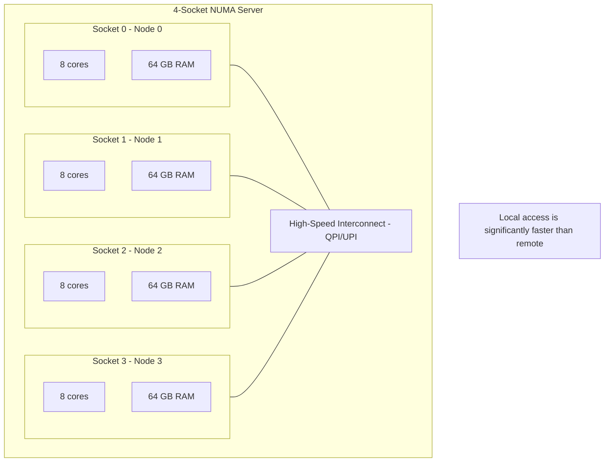
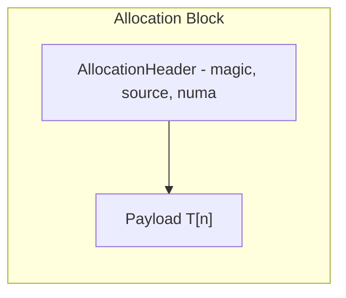
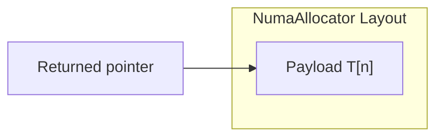
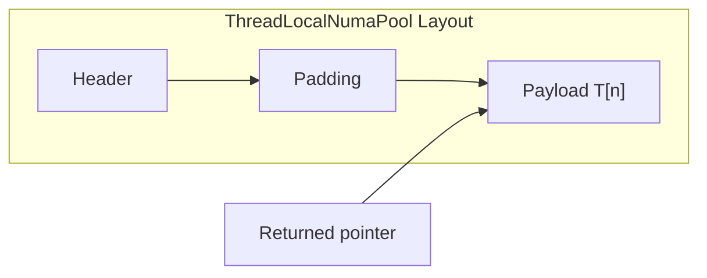
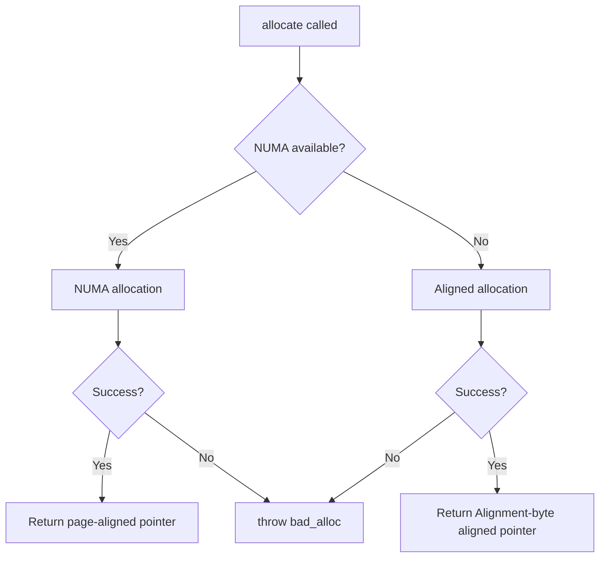

# User Manual - NumaAllocator

**Scope:** Complete usage guide for `fat_p::memory::NumaAllocator` and related utilities: NUMA topology discovery, allocation policies (local, interleave, bind), `NumaAlignedAllocator` for combined NUMA + alignment, thread-local memory pools, thread affinity binding, memory statistics, and over-aligned type support.

**Not covered:**
- HpcVector (higher-level NUMA-aware container; see HpcVector User Manual)
- Operating system NUMA page migration APIs
- NUMA-aware scheduling algorithms
- Hardware performance counters for NUMA analysis

**Prerequisites:** C++20; understanding of NUMA architecture (local vs remote memory access, nodes, topology); access to a multi-socket system (or willingness to test on single-socket with simulated NUMA)

---

## User Manual Card

**Component:** NumaAllocator
**Primary use case:** Allocate memory on specific NUMA nodes for optimal data locality in multi-socket HPC systems
**Integration pattern:** Query topology with `NumaTopology::discover()`, select a policy, construct `NumaAllocator<T, Policy>`, use as a standard allocator with containers
**Key API:** `NumaAllocator<T, Policy>`, `NumaAlignedAllocator<T, Align, Policy>`, `NumaTopology::discover()`, `bindThreadToNode()`, `LocalPolicy`, `InterleavePolicy`, `BindPolicy`
**std equivalent:** None
**Common mistakes:** Assuming NUMA allocation is always faster (it's only beneficial for large, long-lived allocations); forgetting to bind threads to nodes (thread migration defeats NUMA placement); using NUMA allocation for small, short-lived objects
**Performance notes:** NUMA-local allocation avoids cross-socket latency. Thread affinity binding prevents thread migration. Allocation overhead is slightly higher than standard malloc due to policy evaluation. See `components/NumaAllocator/results/` for current data

---
## Table of Contents

0. [Quick Start](#quick-start)
1. [What is NumaAllocator?](#what-is-numaallocator)
2. [Core Architecture](#core-architecture)
3. [Getting Started](#getting-started)
4. [NUMA Topology Discovery](#numa-topology-discovery)
5. [Allocation Policies](#allocation-policies)
6. [NumaAlignedAllocator: NUMA + Alignment](#numaalignedAllocator-numa--alignment)
7. [Thread-Local Memory Pool](#thread-local-memory-pool)
8. [Thread Affinity Binding](#thread-affinity-binding)
9. [Memory Statistics and Diagnostics](#memory-statistics-and-diagnostics)
10. [Over-Aligned Type Support](#over-aligned-type-support)
11. [Performance](#performance)
12. [Comparison with Alternatives](#comparison-with-alternatives)
13. [The "Forever Stuck" Reality](#the-forever-stuck-reality)
14. [Migration Guide](#migration-guide)
15. [Best Practices](#best-practices)
16. [Troubleshooting](#troubleshooting)
17. [Summary](#summary)
18. [Glossary](#glossary)

---

## Quick Start

**30 seconds to working code.**

```cpp
#include "NumaAllocator.h"
using namespace fat_p::memory;

// Drop-in NUMA-aware vector (allocates on current thread's NUMA node)
NumaLocalVector<double> data(1000000);
data.reserve(2000000);  // Always reserve to avoid repeated NUMA syscalls

// Ultra-fast arena for hot loops (avoids per-allocation NUMA syscall overhead)
double* ptr = ThreadLocalNumaPool<double>::allocate(100);
ptr[0] = 42.0;
ThreadLocalNumaPool<double>::deallocate(ptr, 100);  // No-op for pool allocs
ThreadLocalNumaPool<double>::reset();  // Reclaim pool memory when done
```

**Three things to remember:**

1. **Always call `reserve()`** on NUMA vectors before pushing — avoids expensive syscalls during growth
2. **Pool pointers must not outlive their thread** — the pool is freed when the owning thread exits
3. **Use `ThreadLocalNumaPool`** for millions of small allocations; use `NumaAllocator` for large, long-lived blocks

**When to use what:**

| Scenario | Use This |
|----------|----------|
| Large buffers with NUMA placement | `NumaLocalVector<T>` with `reserve()` |
| Millions of tiny allocations per frame | `ThreadLocalNumaPool<T>` |
| Cross-thread ownership transfer | `NumaAllocator<T>` directly |
| Single-node system | `std::vector` (no NUMA benefit) |

*For the full story, read on. For troubleshooting, jump to [Troubleshooting](#troubleshooting).*

---

## What is NumaAllocator?

### The Problem: Memory Locality on Many-Core Systems

Modern servers have multiple CPU sockets, each with its own local memory. This architecture is called NUMA—Non-Uniform Memory Access. When a thread accesses memory attached to a different socket, latency increases 2-3x:



*QPI (QuickPath Interconnect) and UPI (Ultra Path Interconnect) are Intel's high-speed interconnects between CPU sockets. AMD uses Infinity Fabric for the same purpose.*

Standard C++ allocators ignore this topology:

```cpp
// Thread on Socket 3 allocates memory
std::vector<double> data(1000000);  // Memory lands on Node 0 (first-touch)

// Thread on Socket 3 accesses its "own" data
for (double& x : data)
{
    x = compute(x);  // Every access crosses the interconnect: significantly slower
}
```

### The Solution: NUMA-Aware Allocation

NumaAllocator provides STL-compatible allocators that place memory on specific NUMA nodes:

```cpp
#include "NumaAllocator.h"
using namespace fat_p::memory;

// Memory allocated on the current thread's local NUMA node
NumaLocalVector<double> data(1000000);

// Now every access is local—no interconnect crossing
for (double& x : data)
{
    x = compute(x);  // Full memory bandwidth, minimum latency
}
```

### The C++ Landscape

| Approach | Pros | Cons |
|----------|------|------|
| `std::allocator` | Standard, portable | NUMA-oblivious |
| `libnuma` (Linux) | Full control | C API, Linux only, manual tracking |
| `hwloc` | Rich topology | Complex, requires linking |
| `jemalloc` | Fast, some NUMA | Malloc replacement, limited control |
| **NumaAllocator** | STL-compatible, cross-platform | Requires fat_p |

NumaAllocator fills the gap: STL-compatible allocation with explicit NUMA control, cross-platform support, and zero external dependencies (libnuma optional on Linux).

### Allocator Traits

NumaAllocator implements the standard C++ Allocator requirements with full propagation support:

| Trait | Value | Effect |
|-------|-------|--------|
| `propagate_on_container_copy_assignment` | `std::true_type` | Allocator propagates during container copy assignment |
| `propagate_on_container_move_assignment` | `std::true_type` | Allocator propagates during container move assignment |
| `propagate_on_container_swap` | `std::true_type` | Allocator propagates during container swap |
| `is_always_equal` | Policy-dependent | `true` for Local/Interleaved, `false` for Preferred |

For `NumaLocalPolicy` and `NumaInterleavedPolicy`, allocators are always considered equal (`is_always_equal = true`), enabling efficient container moves. For `NumaPreferredPolicy`, allocators are equal only if they target the same node—moving a vector between containers with different preferred nodes may trigger reallocation.

---

## Core Architecture

### Design Decisions

**1. Policy-Based Allocation**

Rather than runtime configuration, NumaAllocator uses compile-time policies:

```cpp
template<typename T, typename Policy = NumaLocalPolicy>
class NumaAllocator;
```

This enables the compiler to eliminate unused code paths:

```cpp
// Only NumaLocalPolicy code is compiled for this type
using LocalAlloc = NumaAllocator<double, NumaLocalPolicy>;

// Only NumaInterleavedPolicy code is compiled for this type
using InterleavedAlloc = NumaAllocator<double, NumaInterleavedPolicy>;
```

**2. Cached Availability State**

NUMA availability is checked once and cached:

```cpp
namespace detail
{
    struct NumaState
    {
        std::atomic<bool> available{false};
        std::atomic<bool> initialized{false};
        std::mutex init_mutex;
        
        // Double-checked locking for thread-safe initialization
        void initialize();
        bool is_available();
    };
}
```

This ensures consistent behavior throughout the application lifetime—if NUMA was available at allocation time, the same deallocation path is used.

**Lifecycle Note:** NUMA availability is detected once per process. If the system's NUMA configuration changes after initialization (BIOS settings, hotplug), this library continues using the cached availability flag for the remainder of the process lifetime.

**3. Thread-Local Pool with Source Tracking**

`ThreadLocalNumaPool` embeds a header before each allocation:



The header records:
- **Magic number:** Validation sentinel (`0xFADE'NUMA`)
- **Source:** Pool or Direct allocation
- **NUMA available:** State at allocation time

This enables safe deallocation—pool allocations are no-ops, direct allocations use the recorded NUMA state.

### Memory Layout

**NumaAllocator:** Direct allocation, no header overhead



**ThreadLocalNumaPool:** Header before payload



---

## Getting Started

### Prerequisites

- C++17 compiler (GCC 7+, Clang 5+, MSVC 2017+)
- Linux: `libnuma-dev` package (optional—falls back to `malloc` without it)
- Windows: No additional dependencies (uses built-in NUMA APIs)

### Installation

Copy `NumaAllocator.h` to your include path. No build step required.

### First Program

```cpp
#include <iostream>
#include "NumaAllocator.h"

int main()
{
    using namespace fat_p::memory;
    
    // Check NUMA availability
    std::cout << "NUMA available: " << (NumaInfo::is_available() ? "Yes" : "No") << "\n";
    std::cout << "NUMA nodes: " << NumaInfo::num_nodes() << "\n";
    std::cout << "Current node: " << NumaInfo::current_node() << "\n";
    
    // Create a NUMA-local vector
    NumaLocalVector<double> data(1000);
    
    // Use like any std::vector
    for (size_t i = 0; i < data.size(); ++i)
    {
        data[i] = static_cast<double>(i);
    }
    
    double sum = 0.0;
    for (double x : data)
    {
        sum += x;
    }
    
    std::cout << "Sum: " << sum << "\n";
    
    return 0;
}
```

### Building

**Linux with libnuma:**
```bash
g++ -std=c++17 -O2 -o program program.cpp -lnuma
```

**Linux without libnuma (fallback mode):**
```bash
g++ -std=c++17 -O2 -o program program.cpp
```

**Windows:**
```bash
cl /std:c++17 /O2 /EHsc program.cpp
```

---

## NUMA Topology Discovery

### NumaInfo Class

`NumaInfo` provides static methods for querying NUMA topology:

```cpp
namespace fat_p::memory
{
    class NumaInfo
    {
    public:
        // Is NUMA available on this system?
        static bool is_available() noexcept;
        
        // Number of NUMA nodes (1 on non-NUMA systems)
        static int num_nodes() noexcept;
        
        // Current thread's NUMA node
        static int current_node() noexcept;
        
        // Number of CPUs on a specific node
        static int cpus_on_node(int node) noexcept;
    };
}
```

### Usage Examples

```cpp
using namespace fat_p::memory;

void print_numa_topology()
{
    if (!NumaInfo::is_available())
    {
        std::cout << "NUMA not available (single-node system or no libnuma)\n";
        return;
    }
    
    int nodes = NumaInfo::num_nodes();
    std::cout << "NUMA nodes: " << nodes << "\n";
    
    for (int node = 0; node < nodes; ++node)
    {
        int cpus = NumaInfo::cpus_on_node(node);
        std::cout << "  Node " << node << ": " << cpus << " CPUs\n";
    }
    
    std::cout << "Current thread on node: " << NumaInfo::current_node() << "\n";
}
```

### Platform Behavior

| Platform | NUMA Detection | Fallback |
|----------|----------------|----------|
| Linux with libnuma | `numa_available() != -1` | Returns 1 node, node 0 |
| Linux without libnuma | `FATP_HAS_NUMA_SUPPORT == 0` | Returns 1 node, node 0 |
| Windows | `GetNumaHighestNodeNumber()` | Returns 1 node, node 0 |
| Other | Always fallback | Returns 1 node, node 0 |

---

## Allocation Policies

### NumaLocalPolicy

**What:** Allocates memory on the NUMA node where the calling thread is currently executing.

**Why:** Ensures data locality for thread-local data structures. Each thread's data lives on its own node.

**When:** Use for data owned and accessed primarily by a single thread.

```cpp
// Explicit policy specification
NumaAllocator<double, NumaLocalPolicy> alloc;
double* data = alloc.allocate(1000);
// ... use data ...
alloc.deallocate(data, 1000);

// Convenient type alias
NumaLocalVector<double> vec(1000);  // Same as std::vector with NumaLocalPolicy
```

### NumaInterleavedPolicy

**What:** On Linux with libnuma, pages are interleaved round-robin across all NUMA nodes at page granularity (typically 4 KB).

**Why:** Balances memory bandwidth when data is accessed equally by threads on all nodes. Prevents hotspots on any single node's memory controller.

**When:** Use for shared read-only data or data with uniform access patterns across threads.

```cpp
// Shared lookup table accessed by all threads
NumaInterleavedVector<double> lookup_table(10000000);
initialize_lookup(lookup_table);

// All threads access with roughly equal latency
#pragma omp parallel for
for (size_t i = 0; i < work_items; ++i)
{
    double value = lookup_table[compute_index(i)];
    process(value);
}
```

**Platform Note:** On Windows or Linux without libnuma, this policy falls back to standard allocation (`malloc` / `_aligned_malloc`). Placement then follows first-touch semantics rather than interleaving.

### NumaPreferredPolicy

**What:** Allocates memory on a specific NUMA node, regardless of which thread performs the allocation.

**Why:** Enables explicit placement when you know which node should own the data.

**When:** Use when data will be processed by threads on a known node, or when implementing manual data partitioning.

**Memory Binding:** On Linux, `numa_alloc_onnode()` immediately commits pages to the specified node. On Windows, `VirtualAllocExNuma` with `MEM_COMMIT` also commits immediately. This is in contrast to standard `mmap` or `malloc`, which follow first-touch semantics.

```cpp
// Allocate on node 2
NumaAllocator<double, NumaPreferredPolicy> alloc(NumaPreferredPolicy{2});
double* data = alloc.allocate(1000);

// Convenient factory function
auto vec = make_preferred_vector<double>(2, 1000);  // 1000 doubles on node 2
auto vec2 = make_preferred_vector<double>(2);       // Empty vector, will allocate on node 2
```

### Policy Comparison

| Policy | Placement | Use Case |
|--------|-----------|----------|
| `NumaLocalPolicy` | Current thread's node | Thread-private data |
| `NumaInterleavedPolicy` | Round-robin all nodes | Shared read-mostly data |
| `NumaPreferredPolicy{n}` | Specified node `n` | Explicit partitioning |

---

## NumaAlignedAllocator: NUMA + Alignment

### What is NumaAlignedAllocator?

`NumaAlignedAllocator` combines NUMA-aware allocation with **guaranteed memory alignment**. It's defined in `NumaAlignedAllocator.h` and builds on the policies and infrastructure from `NumaAllocator.h`.

**Why a separate allocator?** The standard `NumaAllocator` has a subtle problem for HPC workloads:

- When NUMA is available, allocations are page-aligned (4KB), which satisfies any SIMD requirement
- When NUMA is unavailable, fallback uses `malloc()`, which only guarantees `alignof(std::max_align_t)` (typically 16 bytes)
- This means the **same code** might get 4096-byte alignment on one system and 16-byte alignment on another

For SIMD code requiring 32-byte (AVX) or 64-byte (AVX-512/cache line) alignment, this inconsistency is dangerous.

### The Strict Mode Guarantee

`NumaAlignedAllocator` provides two guarantees that `NumaAllocator` does not:

**1. Explicit alignment parameter:**
```cpp
template<typename T,
         std::size_t Alignment = 64,    // Guaranteed alignment
         typename Policy = NumaLocalPolicy>
class NumaAlignedAllocator;
```

**2. Strict mode (no fallback mixing):**



**Why strict mode matters:** If NUMA allocation fails and we fell back to aligned allocation, `deallocate()` would call `numa_free()` on a pointer from `aligned_alloc()`—undefined behavior. Strict mode prevents this by throwing rather than mixing allocation sources.

### NumaAllocator vs NumaAlignedAllocator

| Aspect | NumaAllocator | NumaAlignedAllocator |
|--------|---------------|----------------------|
| Header | `NumaAllocator.h` | `NumaAlignedAllocator.h` |
| Alignment guarantee | Page-aligned if NUMA, else malloc | Always `Alignment` bytes |
| NUMA failure | Falls back to malloc | Throws `bad_alloc` |
| Deallocation safety | Tracks allocation source | Strict mode prevents mixing |
| Use case | General NUMA containers | HPC/SIMD workloads |
| Primary consumer | `NumaLocalVector`, etc. | `HpcVector` |

### Usage

```cpp
#include "NumaAlignedAllocator.h"
using namespace fat_p::memory;

// Direct allocator usage (64-byte aligned, NUMA-local)
NumaAlignedAllocator<double, 64, NumaLocalPolicy> alloc;
double* data = alloc.allocate(1000);
// data is guaranteed 64-byte aligned
alloc.deallocate(data, 1000);

// With std::vector
std::vector<float, NumaAlignedAllocator<float, 64>> vec(10000);
// vec.data() is guaranteed 64-byte aligned

// Preferred node with alignment
NumaAlignedAllocator<double, 64, NumaPreferredPolicy> alloc2(NumaPreferredPolicy{2});
```

### Convenience Type Aliases

```cpp
namespace fat_p::memory {
    // NUMA-local with alignment (default 64 bytes)
    template<typename T, std::size_t Alignment = 64>
    using NumaLocalAllocator = NumaAlignedAllocator<T, Alignment, NumaLocalPolicy>;

    // Specific NUMA node with alignment
    template<typename T, std::size_t Alignment = 64>
    using NumaPreferredAllocator = NumaAlignedAllocator<T, Alignment, NumaPreferredPolicy>;

    // Interleaved with alignment
    template<typename T, std::size_t Alignment = 64>
    using NumaInterleavedAllocator = NumaAlignedAllocator<T, Alignment, NumaInterleavedPolicy>;
}
```

### Alignment Constraints

```cpp
// Alignment must be power of 2
NumaAlignedAllocator<double, 48> bad1;  // Compile error!

// Alignment must be >= alignof(T)
NumaAlignedAllocator<double, 4> bad2;   // Compile error: alignof(double) is 8

// Alignment must be <= page size (4096)
NumaAlignedAllocator<double, 8192> bad3; // Compile error!

// Valid alignments: 8, 16, 32, 64, 128, 256, 512, 1024, 2048, 4096
NumaAlignedAllocator<double, 64> good;  // OK
```

### When to Use Which

| Scenario | Use |
|----------|-----|
| General NUMA-aware containers | `NumaAllocator` / `NumaLocalVector` |
| SIMD with AVX (32-byte) | `NumaAlignedAllocator<T, 32>` |
| SIMD with AVX-512 or cache-line (64-byte) | `NumaAlignedAllocator<T, 64>` |
| HPC containers (recommended) | `HpcVector` (uses NumaAlignedAllocator internally) |

### HpcVector: The Recommended Approach

For most HPC use cases, prefer `HpcVector` over direct `NumaAlignedAllocator` usage:

```cpp
#include "HpcVector.h"

// HpcVector uses NumaAlignedAllocator<T, 64, NumaLocalPolicy> internally
fat_p::HpcVector<double> data(1000000);

// Equivalent to:
// std::vector<double, NumaAlignedAllocator<double, 64, NumaLocalPolicy>> data(1000000);

// With different policy:
fat_p::HpcVector<double, 64, fat_p::memory::NumaInterleavedPolicy> shared(1000000);
```

`HpcVector` provides additional conveniences like `assume_aligned()` for compiler hints.

---

## Thread-Local Memory Pool

### What is ThreadLocalNumaPool?

`ThreadLocalNumaPool<T>` is a thread-local arena allocator that pre-allocates a NUMA-local buffer and serves allocations from it with simple pointer bumping. This eliminates syscall overhead for high-frequency allocations.

### Why Use It?

```cpp
// Without pool: syscall per allocation
for (int i = 0; i < 1000000; ++i)
{
    double* temp = numa_alloc_onnode(sizeof(double) * 3, node);  // ~500ns each
    compute(temp);
    numa_free(temp, sizeof(double) * 3);
}
// Total: ~500ms just for allocation

// With pool: pointer bump per allocation
for (int i = 0; i < 1000000; ++i)
{
    double* temp = ThreadLocalNumaPool<double>::allocate(3);  // ~10ns each
    compute(temp);
    ThreadLocalNumaPool<double>::deallocate(temp, 3);
}
// Total: ~10ms for allocation
```

### API Reference

```cpp
template<typename T>
class ThreadLocalNumaPool
{
public:
    // Allocate n elements (returns NUMA-local memory)
    static T* allocate(size_t n);
    
    // Deallocate (no-op for pool allocations, frees direct allocations)
    static void deallocate(T* ptr, size_t n);
    
    // Reset pool (invalidates all pool allocations!)
    static void reset();
    
    // Query pool state
    static int numa_node();      // Which NUMA node owns the pool
    static size_t capacity();    // Target element count (approximate)
    static size_t used();        // Approximate elements allocated
};
```

### Pool Behavior

**Small allocations (≤ 25% of pool byte capacity):** Served from pool if space available. For a pool targeting 1024 elements of type `T`, this means allocations up to approximately `256 × sizeof(T)` bytes.

**Large allocations (> 25% of pool byte capacity):** Direct NUMA allocation with header for safe deallocation.

**Pool exhaustion:** Falls back to direct allocation transparently.

### Lifetime Constraints (CRITICAL)

**Pool memory is owned by the thread that created it.** When the owning thread exits, the pool is destroyed and all memory freed. This has critical implications for cross-thread usage:

| Scenario | Safety | Notes |
|----------|--------|-------|
| Thread A allocates, A uses, A deallocates | ✅ Safe | Normal single-thread usage |
| Thread A allocates, passes to B, B uses while A alive | ✅ Safe | A must outlive B's usage |
| Thread A allocates, passes to B, A exits, B uses | ❌ **UB** | Use-after-free |
| Thread A allocates, passes to B, A exits, B deallocates | ❌ **UB** | Reading freed header |

**Safe Pattern:**
```cpp
std::atomic<double*> shared_ptr{nullptr};
std::atomic<bool> producer_done{false};

void producer()
{
    double* data = ThreadLocalNumaPool<double>::allocate(100);
    fill_data(data);
    shared_ptr.store(data);
    
    // Wait for consumer to finish before exiting
    while (!producer_done.load())
    {
        std::this_thread::sleep_for(std::chrono::milliseconds(1));
    }
}

void consumer()
{
    double* data = shared_ptr.load();
    use_data(data);
    producer_done.store(true);  // Signal producer can exit
}
```

**For cross-thread scenarios where the producer may exit before the consumer**, use `NumaAllocator` directly instead of `ThreadLocalNumaPool`.

### Deallocation Behavior

- **Pool allocations (same thread):** No-op—memory reclaimed on `reset()` or thread exit
- **Pool allocations (cross-thread, owner alive):** No-op—safe but does not reclaim
- **Pool allocations (cross-thread, owner exited):** See platform behavior below
- **Direct allocations:** Properly freed using stored header metadata

### Platform Behavior on Cross-Thread Deallocation After Owner Exit

| Platform | Behavior | Mechanism |
|----------|----------|-----------|
| **Windows** | Graceful no-op | SEH catches access violation |
| **Linux/Other** | Undefined (may crash) | No protection for unmapped pages |

On Windows, `ThreadLocalNumaPool` uses Structured Exception Handling (SEH) to catch access violations when attempting to read headers from unmapped memory. This prevents crashes but does not make the operation "correct"—the memory is still gone.

**Note on MSVC Exception Handling:** The `__try/__except` block is low-level SEH that operates independently of C++ exception settings (`/EHsc` vs `/EHa`). However, if you observe crashes in Release builds despite the SEH block, try compiling with `/EHa` to ensure the optimizer preserves exception handlers.

On Linux and other platforms, if the owning thread has exited and the OS has reclaimed the memory pages, attempting to deallocate will cause a segmentation fault (SIGSEGV). **This is documented undefined behavior.**

**Best Practice:** Always ensure the producing thread outlives all consumers, or use `NumaAllocator` directly for cross-thread scenarios.

### reset() Warning

```cpp
double* ptr1 = ThreadLocalNumaPool<double>::allocate(10);
double* ptr2 = ThreadLocalNumaPool<double>::allocate(10);

ThreadLocalNumaPool<double>::reset();  // Invalidates ptr1 AND ptr2

ptr1[0] = 1.0;  // UNDEFINED BEHAVIOR - ptr1 is now invalid
```

All pointers obtained before `reset()` become invalid, including those passed to other threads.

### Type Requirements

`ThreadLocalNumaPool` requires trivially destructible types:

```cpp
// OK: trivially destructible
ThreadLocalNumaPool<double>::allocate(100);
ThreadLocalNumaPool<int>::allocate(100);

struct POD { int x; double y; };
ThreadLocalNumaPool<POD>::allocate(100);

// Compile error: std::string has destructor
// ThreadLocalNumaPool<std::string>::allocate(100);
```

For non-trivial types, use `NumaAllocator` directly or manage destruction manually.

---

## Thread Affinity Binding

### bind_thread_to_node()

**What:** Restricts the calling thread to execute only on CPUs belonging to a specific NUMA node.

**Why:** Improves the likelihood that `NumaLocalPolicy` allocations and memory accesses stay on the intended node. Without binding, the OS scheduler may migrate threads between nodes.

**Caveats:** Binding requests affinity but cannot absolutely guarantee locality in all cases:
- The OS may override affinity under heavy load
- Memory touched before binding may reside on other nodes

```cpp
void worker(int node)
{
    // First: bind thread to node
    if (!bind_thread_to_node(node))
    {
        std::cerr << "Warning: Could not bind to node " << node << "\n";
    }
    
    // Then: allocate (will be local to bound node)
    NumaLocalVector<double> data(1000000);
    
    // Touch memory to ensure placement
    std::fill(data.begin(), data.end(), 0.0);
    
    // Verify placement (Linux only)
    int actual = get_memory_node(data.data());
    if (actual != node)
    {
        std::cerr << "Warning: Memory on node " << actual 
                  << ", expected " << node << "\n";
    }
    
    process(data);
}
```

### Platform Implementation

| Platform | Mechanism | Notes |
|----------|-----------|-------|
| Linux | `sched_setaffinity` | Sets CPU mask to all CPUs on node |
| Windows | `SetThreadGroupAffinity` | Uses processor group affinity |
| Other | Returns `false` | No binding support |

---

## Memory Statistics and Diagnostics

### NumaMemoryStats

Query per-node memory availability:

```cpp
NumaMemoryStats stats = get_node_memory_stats(0);
if (stats.valid)
{
    std::cout << "Node 0 free: " << stats.free_bytes / (1024*1024*1024) << " GB\n";
    if (stats.has_total)
    {
        std::cout << "Node 0 total: " << stats.total_bytes / (1024*1024*1024) << " GB\n";
    }
}
```

**Platform Note:** Windows only provides free memory per node (`has_total = false`). Linux provides both total and free.

### get_memory_node() (Linux only)

Verify where memory actually resides:

```cpp
NumaLocalVector<double> data(1000);
int node = get_memory_node(data.data());
if (node >= 0)
{
    std::cout << "Data resides on node " << node << "\n";
}
```

Returns `-1` on Windows or if NUMA is unavailable.

---

## Over-Aligned Type Support

NumaAllocator automatically handles over-aligned types (alignment > `alignof(std::max_align_t)`):

```cpp
// AVX-512 requires 64-byte alignment
struct alignas(64) SimdVector
{
    double data[8];
};

// NumaAllocator handles alignment automatically
NumaLocalVector<SimdVector> simd_data(1000);
assert(reinterpret_cast<uintptr_t>(simd_data.data()) % 64 == 0);

// ThreadLocalNumaPool also supports over-aligned types
SimdVector* vectors = ThreadLocalNumaPool<SimdVector>::allocate(100);
assert(reinterpret_cast<uintptr_t>(vectors) % 64 == 0);
```

**Implementation Note:** NUMA allocation functions (`numa_alloc_onnode`, `VirtualAllocExNuma`) return page-aligned memory (typically 4KB), which satisfies any practical alignment requirement. Fallback paths use platform-specific aligned allocation (`std::aligned_alloc`, `_aligned_malloc`).

---

## Performance

### Allocation Latency

The key performance insight is the difference between direct NUMA allocation (which requires a syscall per allocation) and pooled allocation (which amortizes the syscall across many allocations via pointer-bump allocation from pre-allocated blocks).

`ThreadLocalNumaPool` eliminates per-allocation syscall overhead by pre-allocating contiguous blocks from the target NUMA node and dispensing memory via pointer-bump. Cache hits (allocation from existing block) are dramatically faster than direct `numa_alloc_onnode` calls. Cache misses (new block needed) fall back to direct allocation cost.

### Memory Access Latency

Memory access latency depends on the NUMA topology. Local memory (attached to the same node as the executing CPU) provides the fastest access. Remote memory requires traversal of the inter-node interconnect, with latency increasing proportionally to the number of hops. Bandwidth also decreases for remote access. These are hardware architecture characteristics, not component benchmark claims—see your platform's NUMA topology documentation for specific numbers.

### Where NumaAllocator Wins

- **Thread-local data:** Significant memory access speedup from NUMA locality
- **High-frequency allocations:** Pooling amortizes syscall overhead across many allocations
- **Mixed NUMA/non-NUMA systems:** Graceful fallback, consistent API

### Where NumaAllocator Loses (Honesty Builds Trust)

- **Single large allocation:** Direct `numa_alloc_onnode` matches performance
- **Non-NUMA systems:** Small overhead for availability checks
- **Complex topologies:** hwloc provides richer topology discovery
- **Streaming workloads:** Interleaving benefits vary by access pattern

See `components/NumaAllocator/results/` and `benchmark_results/` for current platform-specific benchmark data.

---

## Comparison with Alternatives

### The C++ NUMA Ecosystem

**libnuma** is the standard Linux NUMA library, providing direct access to NUMA allocation and topology. It's the foundation that NumaAllocator builds upon for Linux support.

**hwloc** (Hardware Locality) is a comprehensive topology discovery library from Open MPI. It provides detailed information about caches, NUMA nodes, and processor groups—far more than just NUMA.

**jemalloc** is a high-performance malloc replacement used by Firefox and Facebook. It has some NUMA awareness but focuses on general allocation performance rather than explicit placement control.

### Feature Comparison

| If You Need... | Why Not libnuma | Why Not hwloc | Why Not jemalloc | Fat-P Advantage |
|----------------|-----------------|---------------|------------------|-----------------|
| Windows support | Linux only | Complex setup | Limited NUMA | Native Windows APIs |
| STL integration | C API only | C API only | Malloc replacement | `std::vector` compatible |
| Header-only | Requires `-lnuma` | Requires linking | Requires linking | Single header |
| Policy-based | Manual node selection | Manual binding | Automatic only | Compile-time policies |
| Thread-local pool | No pooling | No pooling | Has pooling | NUMA-aware pooling |
| Over-aligned types | Page-aligned only | No alignment control | Limited control | Full alignment support |

### Code Comparison

**libnuma (manual management):**
```cpp
void* ptr = numa_alloc_onnode(size * sizeof(double), node);
if (!ptr) handle_error();
double* data = static_cast<double*>(ptr);
// ... use data ...
numa_free(ptr, size * sizeof(double));  // Must track size!
```

**NumaAllocator (RAII):**
```cpp
auto vec = make_preferred_vector<double>(node, size);
// ... use vec ...
// Automatic cleanup
```

---

## The "Forever Stuck" Reality

### Compiler Lock-In

Scientific clusters and HPC environments prioritize stability over bleeding-edge features. It's common to find:

- RHEL 7/8 with GCC 7.x for InfiniBand driver compatibility
- CentOS with specific kernel versions for GPU drivers (CUDA, ROCm)
- Contractual requirements to maintain C++17 for years

Even when C++23 or later arrives with potential memory placement features, your production codebase may be locked to C++17 indefinitely.

### Platform Fragmentation

NUMA APIs remain fundamentally platform-specific with no standardization path:

| Platform | API | Characteristics |
|----------|-----|-----------------|
| Linux | `libnuma` | GPL-licensed, optional install |
| Windows | `VirtualAllocExNuma` | Built-in, different semantics |
| macOS | None | No NUMA support |
| FreeBSD | Limited | Partial support |

C++ standardization committees have shown no interest in portable NUMA APIs—the platform differences are too significant.

### NumaAllocator's Role

NumaAllocator bridges this gap **permanently**—not as a temporary shim waiting for standardization, but as an architectural solution that:

1. Abstracts platform differences behind a consistent API
2. Provides STL compatibility that raw NUMA APIs lack
3. Adds value (pooling, policies) beyond what standards would offer
4. Falls back gracefully when NUMA is unavailable

---

## Migration Guide

### From std::vector

```cpp
// Before
std::vector<double> data(1000000);

// After: Local policy for thread-owned data
NumaLocalVector<double> data(1000000);

// After: Interleaved for shared data
NumaInterleavedVector<double> data(1000000);

// After: Specific node
auto data = make_preferred_vector<double>(node, 1000000);
```

### From Manual libnuma

```cpp
// Before
void* ptr = numa_alloc_onnode(size * sizeof(double), node);
if (!ptr) handle_error();
double* data = static_cast<double*>(ptr);
// ... use data ...
numa_free(ptr, size * sizeof(double));  // Must track size!

// After
NumaAllocator<double, NumaPreferredPolicy> alloc(NumaPreferredPolicy{node});
double* data = alloc.allocate(size);
// ... use data ...
alloc.deallocate(data, size);  // Or use vector for RAII
```

### From std::allocator with Custom Pool

```cpp
// Before: Manual arena allocator
class ArenaAllocator {
    char* buffer;
    size_t offset;
public:
    void* allocate(size_t n) {
        void* p = buffer + offset;
        offset += n;
        return p;
    }
};

// After: NUMA-aware, thread-local, no manual management
double* data = ThreadLocalNumaPool<double>::allocate(100);
// ... use data ...
ThreadLocalNumaPool<double>::deallocate(data, 100);
// Or reset all at once:
ThreadLocalNumaPool<double>::reset();
```

### Incremental Adoption

1. **Phase 1:** Replace hot-path `std::vector` with `NumaLocalVector`
2. **Phase 2:** Add `bind_thread_to_node()` to worker threads
3. **Phase 3:** Use `ThreadLocalNumaPool` for high-frequency allocations
4. **Phase 4:** Profile and tune policy selection (Local vs. Interleaved)

---

## Best Practices

### Do

✅ **Always call `reserve()` on NUMA vectors before pushing:**
```cpp
NumaLocalVector<double> data;
data.reserve(expected_size);  // One NUMA syscall, not many
for (int i = 0; i < expected_size; ++i)
{
    data.push_back(compute(i));  // No reallocations
}
```
Without `reserve()`, each reallocation triggers a NUMA syscall, making `push_back` loops dramatically slower than `std::vector`.

✅ **Bind threads before allocating, then touch:**
```cpp
void worker(int node)
{
    bind_thread_to_node(node);                    // First: bind
    NumaLocalVector<double> data(1000);           // Then: allocate
    std::fill(data.begin(), data.end(), 0.0);     // Touch: ensures local placement
}
```

✅ **Use ThreadLocalNumaPool for temporary allocations:**
```cpp
for (int i = 0; i < iterations; ++i)
{
    double* temp = ThreadLocalNumaPool<double>::allocate(100);
    process(temp);
    ThreadLocalNumaPool<double>::deallocate(temp, 100);
}
```

✅ **Check NUMA availability for diagnostics:**
```cpp
if (NumaInfo::is_available())
{
    log("Running with NUMA optimization on {} nodes", NumaInfo::num_nodes());
}
else
{
    log("NUMA not available, using standard allocation");
}
```

✅ **Use Interleaved for shared read-only data:**
```cpp
// Initialized once, read by all threads
NumaInterleavedVector<double> lookup_table(SIZE);
initialize(lookup_table);
// All threads get roughly equal access latency
```

✅ **Use NumaAllocator (not pool) for cross-thread ownership transfer:**
```cpp
// Producer may exit before consumer
NumaLocalVector<double> data(1000);  // Not ThreadLocalNumaPool
fill_data(data);
queue.push(std::move(data));  // Safe: vector owns memory
```

### Don't

❌ **Don't use with node-based containers:**
```cpp
// Bad: std::list allocates many small nodes
std::list<int, NumaAllocator<int>> list;  // Huge overhead per node!

// Good: Use contiguous containers
NumaLocalVector<int> vec;
```

NUMA allocators provide no performance benefit for node-based containers (`std::list`, `std::map`, `std::set`, etc.) and may degrade performance due to per-allocation syscall overhead and loss of memory locality.

❌ **Don't let pool pointers outlive the owning thread:**
```cpp
// DANGEROUS: Producer might exit before consumer finishes
void producer()
{
    double* data = ThreadLocalNumaPool<double>::allocate(100);
    shared_queue.push(data);
}  // Thread exits, pool freed!

void consumer()
{
    double* data = shared_queue.pop();
    process(data);  // USE-AFTER-FREE if producer exited
}
```

❌ **Don't forget to reset ThreadLocalNumaPool in long-running loops:**
```cpp
// Bad: Pool grows unbounded
while (running)
{
    double* temp = ThreadLocalNumaPool<double>::allocate(100);
    process(temp);
    // No deallocation, no reset!
}

// Good: Periodic reset
while (running)
{
    double* temp = ThreadLocalNumaPool<double>::allocate(100);
    process(temp);
    ThreadLocalNumaPool<double>::deallocate(temp, 100);
    
    if (++iteration % 10000 == 0)
    {
        ThreadLocalNumaPool<double>::reset();
    }
}
```

❌ **Don't assume NUMA is always available:**
```cpp
// Bad: Assumes NUMA
auto data = make_preferred_vector<double>(3, 1000);  // Fails if < 4 nodes

// Good: Check bounds
int node = std::min(3, NumaInfo::num_nodes() - 1);
auto data = make_preferred_vector<double>(node, 1000);
```

---

## Troubleshooting

### Compilation Errors

**Error:** `numa.h: No such file or directory`

**Solution:** Install libnuma development package:
```bash
# Ubuntu/Debian
sudo apt install libnuma-dev

# RHEL/CentOS
sudo yum install numactl-devel
```

Or compile without libnuma (falls back to standard allocation).

---

**Error:** `undefined reference to 'numa_available'`

**Solution:** Link against libnuma:
```bash
g++ -o program program.cpp -lnuma
```

---

**Error:** `static_assert failed: ThreadLocalNumaPool is designed for trivially destructible types`

**Solution:** Use `NumaAllocator` for non-trivial types:
```cpp
// Instead of:
// std::string* s = ThreadLocalNumaPool<std::string>::allocate(1);

// Use:
NumaLocalVector<std::string> strings(100);
```

---

### Allocation Failure Behavior

- `NumaAllocator::allocate()` throws `std::bad_alloc` on failure
- `ThreadLocalNumaPool::allocate()` never throws on pool hits; pool misses fall back to direct `NumaAllocator` allocation which may throw
- Interleaved allocations fall back to standard allocation before throwing
- Fallback mode (when NUMA unavailable) preserves all allocator semantics (alignment, exception guarantees) but without NUMA placement

---

### Runtime Issues

**Issue:** Memory not on expected NUMA node

**Diagnosis:**
```cpp
NumaLocalVector<double> data(1000);
int node = get_memory_node(data.data());
std::cout << "Expected: " << NumaInfo::current_node() 
          << ", Actual: " << node << "\n";
```

**Causes:**
1. Thread migrated before allocation—use `bind_thread_to_node()` first
2. NUMA unavailable—check `NumaInfo::is_available()`
3. System memory pressure—OS may place memory on available node

---

**Issue:** ThreadLocalNumaPool memory growing unbounded

**Diagnosis:**
```cpp
// Note: used() is approximate, intended for monitoring, not precise accounting
std::cout << "Pool used (approx): " << ThreadLocalNumaPool<T>::used() << "\n";
```

**Solution:** Call `reset()` periodically or use `deallocate()` for direct allocations.

---

**Issue:** Crash (access violation) in cross-thread deallocation

**Symptoms:**
- Windows: Exit code `0xC0000005` (Access Violation)
- Linux: SIGSEGV (Segmentation Fault)

**Cause:** The owning thread exited before deallocation was called. When the owner exits, `PoolNode::~PoolNode()` frees the pool memory, and the OS unmaps the pages. Attempting to read the allocation header from unmapped memory causes a hardware fault.

**Platform Behavior:**
- Windows: The SEH protection in `deallocate()` catches the access violation and returns gracefully without crashing.
- Linux: No protection—the process will crash with SIGSEGV.

**Solution:** 
1. Ensure the producing thread outlives all consumers
2. Use `NumaAllocator` directly for cross-thread ownership transfer
3. Use synchronization to prevent the producer from exiting until consumers are done:

```cpp
std::atomic<bool> consumers_done{false};

void producer()
{
    double* data = ThreadLocalNumaPool<double>::allocate(100);
    // ... pass data to consumers ...
    
    // Wait for consumers before exiting
    while (!consumers_done.load())
    {
        std::this_thread::yield();
    }
}
```

---

**Issue:** Poor performance despite NUMA allocation

**Diagnosis:** Verify memory access patterns with `perf`:
```bash
perf stat -e node-load-misses,node-store-misses ./program
```

**Causes:**
1. Data shared between threads on different nodes—use Interleaved policy
2. False sharing on cache lines—align data to 64 bytes
3. Thread migration—bind threads to nodes

---

## Summary

### Key Features

| Feature | Description |
|---------|-------------|
| **Policy-Based Allocation** | `NumaLocalPolicy`, `NumaInterleavedPolicy`, `NumaPreferredPolicy` |
| **STL Compatibility** | `NumaLocalVector`, `NumaInterleavedVector`, `NumaPreferredVector` |
| **Thread-Local Pool** | `ThreadLocalNumaPool` for high-frequency allocations |
| **Cross-Platform** | Linux (libnuma), Windows (native APIs), graceful fallback |
| **Over-Aligned Support** | Automatic handling for SIMD types |
| **Thread Binding** | `bind_thread_to_node()` for affinity control |
| **Diagnostics** | `NumaMemoryStats`, `get_memory_node()` |

### Performance Profile

| Scenario | Benefit |
|----------|---------|
| Thread-local data | Significant memory access speedup from NUMA locality |
| High-frequency small allocations | Pooling amortizes syscall overhead via pointer-bump allocation |
| Shared read-only data | Balanced bandwidth (interleaved) |
| Non-NUMA systems | Minimal overhead for availability checks |

### Quick Start Code

```cpp
#include "NumaAllocator.h"
using namespace fat_p::memory;

int main()
{
    // Bind thread to node 0
    bind_thread_to_node(0);
    
    // NUMA-local vector
    NumaLocalVector<double> data(1000000);
    
    // High-frequency allocations
    for (int i = 0; i < 1000000; ++i)
    {
        double* temp = ThreadLocalNumaPool<double>::allocate(3);
        compute(temp);
        ThreadLocalNumaPool<double>::deallocate(temp, 3);
    }
    
    return 0;
}
```

### Related Components

| Component | Relationship |
|-----------|--------------|
| `NumaAlignedAllocator.h` | NUMA + alignment allocator (documented above) |
| `HpcVector.h` | Primary consumer—uses `NumaAlignedAllocator` internally |
| `AlignedVector.h` | Alignment-only alternative for single-socket systems |
| `ThreadPool.h` | Uses `bind_thread_to_node()` for worker affinity |
| `Tensor.h` | Uses `NumaAllocator` for tensor storage |
| `SimdVector.h` | Portable SIMD abstraction, pairs with aligned containers |
| `CacheUtilities.h` | Cache-aware utilities that complement NUMA locality |

---

## Glossary

**NUMA (Non-Uniform Memory Access):** A memory architecture where each CPU socket has its own local memory. Accessing local memory is faster than accessing memory attached to another socket.

**NUMA Node:** A group of CPUs and their directly-attached memory. On a 4-socket server, you typically have 4 NUMA nodes (nodes 0-3).

**Local Memory:** Memory attached to the same NUMA node as the executing CPU. Access latency is the lowest available on the system.

**Remote Memory:** Memory attached to a different NUMA node. Access latency is significantly higher due to interconnect traversal.

**First-Touch Allocation:** The default Linux policy where memory pages are physically placed on the NUMA node of the first thread to write to them—not the thread that called `malloc()`.

**Interleaved Allocation:** A policy that distributes memory pages round-robin across all NUMA nodes. Useful for shared read-only data accessed by threads on different nodes.

**Page Granularity:** NUMA placement operates at page boundaries (typically 4 KB). You cannot place different parts of the same page on different nodes.

**QPI/UPI (QuickPath Interconnect / Ultra Path Interconnect):** Intel's high-speed interconnects between CPU sockets. AMD uses Infinity Fabric for the same purpose.

**Memory-Bound Workload:** An application whose performance is limited by memory bandwidth or latency rather than CPU compute. These benefit most from NUMA optimization.

**Arena Allocator:** A memory allocation strategy that pre-allocates a large block and satisfies requests by bumping a pointer. Deallocation is typically a no-op; memory is reclaimed in bulk via reset.

**SEH (Structured Exception Handling):** A Windows mechanism for catching hardware exceptions like access violations. Used in `ThreadLocalNumaPool` to gracefully handle cross-thread deallocation edge cases.

---

*NumaAllocator.h, NumaAlignedAllocator.h — Fat-P Library*
