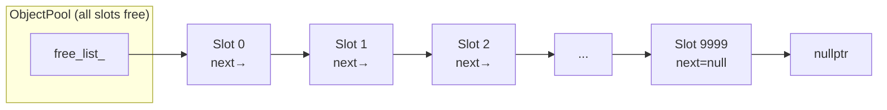
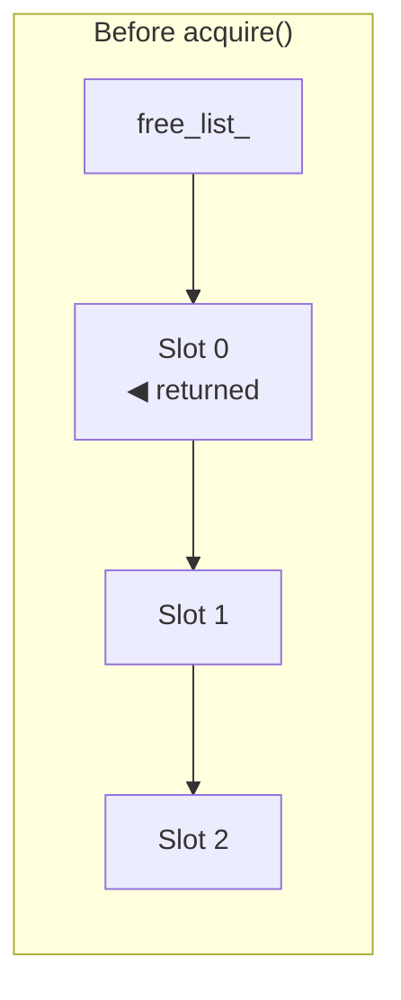
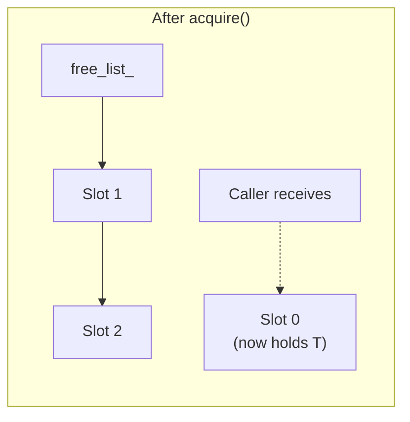
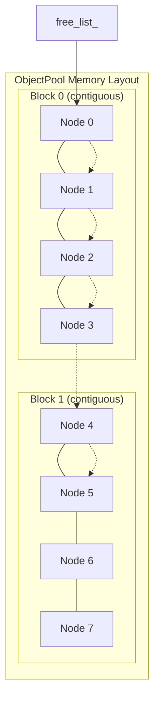
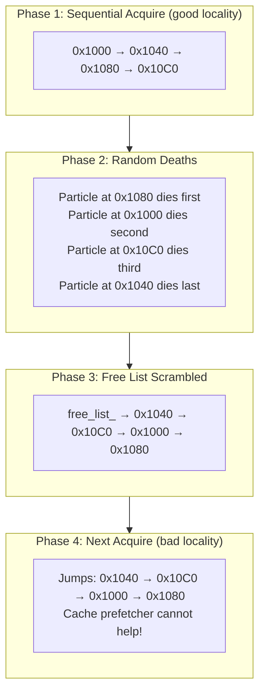

# User Manual - ObjectPool

*Updated January 2026*

---


**Scope:** Complete usage guide for `fat_p::ObjectPool<T>`: pre-allocated object recycling, acquire/release semantics, RAII handles, growth policies, thread safety policies, statistics, and integration patterns.

**Not covered:**
- General-purpose allocators (see AllocationStrategies)
- NUMA-aware allocation (see NumaAllocator)
- Memory-mapped allocation (see MemoryMappedFile)

**Prerequisites:** C++20; understanding of allocation overhead in hot paths; awareness of object reuse patterns

---

## User Manual Card

**Component:** ObjectPool
**Primary use case:** Pre-allocate and recycle objects to eliminate allocation overhead in hot paths
**Integration pattern:** Create `ObjectPool<T>(initialSize)`, acquire objects with `pool.acquire()` returning an RAII handle, objects automatically return to pool when handle is destroyed
**Key API:** `ObjectPool<T>`, `.acquire()`, `.release()`, `PoolHandle<T>`, `.capacity()`, `.available()`, `.stats()`
**std equivalent:** None
**Common mistakes:** Holding pool handles beyond pool lifetime; using ObjectPool for types with expensive construction (pool reuses memory, not initialized state); ignoring growth policy configuration
**Performance notes:** Acquire is O(1) from free list. No system allocator calls after initial allocation. See `components/ObjectPool/results/` for current data

---
## Table of Contents

1. [The Memory Pooling Story](#the-memory-pooling-story)
2. [Understanding Why Allocation Hurts](#understanding-why-allocation-hurts)
3. [The Free-List Insight](#the-free-list-insight)
4. [The Exception Safety Problem](#the-exception-safety-problem)
5. [Getting Started](#getting-started)
6. [The Acquire Contract: Three Methods, Three Philosophies](#the-acquire-contract-three-methods-three-philosophies)
7. [RAII and the PooledObject Wrapper](#raii-and-the-pooledobject-wrapper)
8. [The Block Allocator: Why Contiguous Memory Matters](#the-block-allocator-why-contiguous-memory-matters)
9. [The Locality Cliff: When Random Releases Hurt](#the-locality-cliff-when-random-releases-hurt)
10. [Thread Safety: Policies Without Virtual Dispatch](#thread-safety-policies-without-virtual-dispatch)
11. [Debug Mode: Catching Mistakes Early](#debug-mode-catching-mistakes-early)
12. [When to Use ObjectPool (and When Not To)](#when-to-use-objectpool-and-when-not-to)
13. [Migration from new/delete](#migration-from-newdelete)
14. [Migration from boost::object_pool](#migration-from-boostobject_pool)
15. [Troubleshooting](#troubleshooting)
16. [API Reference](#api-reference)
17. [Summary](#summary)

---

## The Memory Pooling Story

### The Oldest Optimization in Computing

Memory pooling predates C++. It predates C. The technique emerged in the earliest operating systems, when memory was measured in kilobytes and every byte mattered.

In 1961, the Compatible Time-Sharing System (CTSS) at MIT needed to manage memory for multiple users simultaneously. The naive approach—allocating and freeing memory on demand—led to fragmentation. After hours of operation, the system would have plenty of free memory in total, but no contiguous block large enough for a new process. The solution was pre-allocation: carve memory into fixed-size chunks at startup, hand them out on request, and recycle them when returned.

This pattern appeared again in the Unix kernel. When a process created a file descriptor, the kernel needed a small data structure to track it. Allocating from the general heap was slow and risked fragmentation. Instead, Unix maintained a pool of pre-allocated file descriptor structures. Creating a file descriptor meant taking one from the pool; closing it meant returning it. The pool never grew or shrank during operation.

Game developers rediscovered pooling in the 1990s. A particle system might create and destroy thousands of particles per frame. Each particle was a small structure—position, velocity, color, lifetime. Calling `malloc()` and `free()` thousands of times per frame was unacceptable. Instead, games pre-allocated a pool of particle structures and recycled them. A particle "died" by returning to the pool, not by calling `free()`. A particle "spawned" by taking from the pool, not by calling `malloc()`.

The Apache HTTP Server, released in 1995, formalized pooling in its APR (Apache Portable Runtime) library. APR pools provided hierarchical memory management: a request pool was created when a connection arrived and destroyed when the response completed. All allocations during request processing came from that pool. This eliminated both fragmentation and the need to track individual allocations—destroying the pool freed everything at once.

### Why C++ Made It Harder

C++ added a complication that C didn't have: constructors and destructors.

In C, a memory pool hands out raw bytes. The caller casts those bytes to the appropriate type and initializes the fields manually:

```c
/* C-style pooling */
Particle* p = pool_alloc(&particle_pool);
p->x = 0.0f;
p->y = 0.0f;
p->lifetime = 1.0f;
/* ... use particle ... */
pool_free(&particle_pool, p);
```

In C++, objects have constructors that must run when the object is created and destructors that must run when it's destroyed. A pool can't just hand out raw bytes—it must construct the object in those bytes. And when the object returns to the pool, it must be destroyed:

```cpp
// C++ pooling: must handle construction and destruction
Particle* p = pool.acquire();  // Must call constructor
// ... use particle ...
pool.release(p);               // Must call destructor
```

This seems straightforward until you consider what happens when a constructor throws an exception.

### The Constructor Problem

Imagine you're building a network server. Each connection needs a handler object. The handler's constructor opens a socket, validates the client certificate, and initializes cryptographic state. Any of these operations can fail:

```cpp
class ConnectionHandler {
public:
    ConnectionHandler(int socket_fd) {
        socket_ = setup_ssl(socket_fd);  // Can throw on invalid cert
        if (!validate_client(socket_)) {
            throw SecurityException("Client validation failed");
        }
        crypto_ = initialize_crypto();   // Can throw on key failure
    }
    // ...
};
```

Now consider a naive pool implementation:

```cpp
template <typename T>
class NaivePool {
    struct Node {
        alignas(T) char storage[sizeof(T)];
        Node* next;
    };
    Node* free_list_;
    
public:
    template <typename... Args>
    T* acquire(Args&&... args) {
        Node* node = free_list_;
        free_list_ = node->next;  // Remove from pool
        
        // Construct the object
        return new (node->storage) T(std::forward<Args>(args)...);
    }
};
```

What happens when `ConnectionHandler`'s constructor throws?

1. The pool removes the node from the free list
2. The constructor begins running in the node's storage
3. `validate_client()` throws `SecurityException`
4. The exception propagates out of `acquire()`
5. The node is gone—it's not in the free list, and no pointer was returned

The pool has leaked a node. It's not a memory leak in the traditional sense—the memory still exists in the pool's underlying storage. But the pool thinks it has one fewer available slot than it actually does. Over time, as more constructors throw, the pool's usable capacity shrinks. Eventually it reports exhaustion despite having capacity.

This is why `std::pmr::polymorphic_allocator` and `boost::pool` provide raw memory, not constructed objects. They avoid the problem by making it someone else's problem—yours.

ObjectPool takes a different approach: transactional semantics. If the constructor throws, the node is automatically returned to the free list before the exception propagates. The pool never enters an inconsistent state.

---

## Understanding Why Allocation Hurts

### The Memory Hierarchy Reality

To understand why pooling matters, you need to understand how modern computers actually access memory.

In 1980, a typical microprocessor ran at 5 MHz, and memory responded in about 4 clock cycles. Fetching data cost roughly the same as adding two numbers. Programmers didn't think much about memory access patterns because memory was fast relative to computation.

By 2024, processors run at 4,000 MHz—800 times faster. But memory hasn't kept pace. DDR5 RAM still takes about 80-100 nanoseconds to respond to a request. At 4 GHz, that's 320-400 clock cycles. The processor can execute hundreds of instructions in the time it takes to fetch one piece of data from main memory.

Computer architects addressed this imbalance with caching. Modern processors have three levels of cache:

| Cache Level | Typical Size | Access Time | Clock Cycles |
|-------------|-------------|-------------|--------------|
| L1 | 32-64 KB | 1 ns | 4 cycles |
| L2 | 256-512 KB | 3-4 ns | 12-16 cycles |
| L3 | 8-32 MB | 10-20 ns | 40-80 cycles |
| Main Memory | 16+ GB | 80-100 ns | 320-400 cycles |

When you access a memory location, the processor first checks L1 cache. If the data isn't there (an "L1 miss"), it checks L2. If not there, L3. Only if all caches miss does it fetch from main memory.

The critical insight is that caches don't fetch individual bytes—they fetch *cache lines*, typically 64 bytes at a time. When you read one byte, the hardware fetches the surrounding 64 bytes into cache. If your next access is to an adjacent byte, it's already there. This is why sequential access patterns are fast: you pay the memory latency once and get 64 bytes of "free" data.

### Why Heap Allocation Scatters Memory

The standard heap allocator (`malloc`, `new`) manages a large pool of memory, handing out chunks on demand and reclaiming them when freed. To do this efficiently, it maintains metadata: lists of free blocks, size information, alignment padding.

When you allocate memory, the allocator searches its free lists for a suitable block. The block it finds depends on what's been allocated and freed previously. In a long-running program, allocations interleave chaotically:

```cpp
// T=0: Allocate A, B, C
A* a = new A;  // Gets address 0x1000
B* b = new B;  // Gets address 0x1100
C* c = new C;  // Gets address 0x1200

// T=1: Free B
delete b;      // 0x1100 goes back to free list

// T=2: Allocate D (smaller than B)
D* d = new D;  // Gets address 0x1100 (reuses B's space)

// T=3: Allocate E
E* e = new E;  // Gets address 0x2000 (somewhere else)

// Memory layout: A at 0x1000, D at 0x1100, C at 0x1200, E at 0x2000
```

After many allocations and frees, related objects are scattered across memory. If you have a thousand `Handler` objects and you iterate over them, each access potentially misses the cache because the next handler is in a completely different memory region.

### The Mutex Problem

Modern heap allocators are thread-safe. When multiple threads allocate simultaneously, they must coordinate to avoid corrupting the allocator's internal state. This coordination typically involves mutexes or lock-free algorithms.

Either way, there's contention. When four threads all try to allocate at the same time, they serialize on the allocator's synchronization mechanism. What should be parallel execution becomes sequential:

```
Thread 1: acquire_lock() → allocate → release_lock()
Thread 2: [waiting...] → acquire_lock() → allocate → release_lock()
Thread 3: [waiting...] [waiting...] → acquire_lock() → allocate → release_lock()
Thread 4: [waiting...] [waiting...] [waiting...] → acquire_lock() → allocate → release_lock()
```

The allocator becomes a bottleneck. Your multi-threaded program effectively runs single-threaded during allocation-heavy phases.

This is why high-performance systems avoid the heap in hot paths. Not because `new` is slow—it isn't, for a single call. But because in aggregate, across threads, across millions of calls, the overhead dominates.

### The Numbers

Benchmarks on Windows, MSVC 2022, 3.7 GHz base clock (median of 15 measured runs):

| Operation | Time | Cycles | Notes |
|-----------|------|--------|-------|
| L1 cache hit | 1 ns | 4 | Ideal case |
| L2 cache hit | 4 ns | 16 | Good locality |
| L3 cache hit | 12 ns | 48 | Working set fits in L3 |
| Main memory | 80 ns | 320 | Cache miss |
| `new` (uncontended) | 20-23 ns | 80-92 | Single thread |
| `new` (4 threads) | 80-150 ns | 320-600 | Contention overhead |
| Pool acquire (uncontended) | **2.3 ns** | 9 | Pointer manipulation |
| Pool acquire (4 threads, mutex) | 40 ns | 160 | Small critical section |

A single heap allocation costs **8-10×** more than a pool acquisition. Under contention, the gap widens further.

---

## The Free-List Insight

### The Simplest Possible Pool

The core idea of pooling is embarrassingly simple: instead of asking the operating system for memory every time you need an object, pre-allocate a bunch of memory and manage it yourself.

Imagine you need to allocate `Particle` objects frequently. A particle is 64 bytes. You know you'll never need more than 10,000 particles at once. So at startup, you allocate 640KB of memory—enough for 10,000 particles—and divide it into 10,000 slots:

```
Pool memory: [Slot 0][Slot 1][Slot 2]...[Slot 9999]
             64 bytes each, contiguous in memory
```

When someone needs a particle, you give them one of these slots. When they're done, they return it. No interaction with the heap allocator. No mutex contention with other threads (unless you want thread safety). Just pointer manipulation.

But how do you track which slots are free?

### The Embedded Free List

The clever insight is that free slots aren't being used for anything—you can use their memory to store bookkeeping information. Specifically, each free slot stores a pointer to the next free slot:



Each slot's first 8 bytes (on a 64-bit system) store the "next" pointer. The pool maintains a `free_list_` pointer to the first free slot.

**Acquire operation (pop from front):**





To allocate, you pop from the front:

```cpp
Particle* acquire() {
    Node* node = free_list_;        // Take the first free slot
    free_list_ = node->next;        // Advance free_list_ to the next one
    return new (node) Particle();   // Construct a particle in the slot
}
```

To deallocate, you push to the front:

```cpp
void release(Particle* p) {
    p->~Particle();                 // Destroy the particle
    Node* node = reinterpret_cast<Node*>(p);
    node->next = free_list_;        // Link to current head
    free_list_ = node;              // This slot is now the head
}
```

Both operations are O(1)—just pointer manipulation. No searching, no merging, no splitting. The free list threads through the free slots themselves, so there's no external bookkeeping overhead.

### Why LIFO Matters (and When It Doesn't)

Notice that the free list is LIFO—Last In, First Out. The most recently freed slot is the first one handed out. This has implications for cache behavior.

When you release a particle and immediately acquire a new one, you get the same slot back. That slot is almost certainly in cache—you just touched it. The new particle's memory access is essentially free.

When you release particles in the reverse order you acquired them, you get perfect cache reuse. Each acquisition returns the most recently touched slot.

But what if you release in random order?

```cpp
// Acquire 1000 particles sequentially
for (int i = 0; i < 1000; ++i)
    particles[i] = pool.acquire();

// Release in random order
std::shuffle(indices.begin(), indices.end(), rng);
for (int i : indices)
    pool.release(particles[i]);
```

Now the free list is in random order. The next 1000 acquisitions return slots scattered across memory, defeating the cache. This is the "locality cliff"—we'll address it in Chapter 9.

### Memory Layout in ObjectPool

ObjectPool implements the free-list pattern with some refinements:

```cpp
template <typename T, typename SyncPolicy = SingleThreadedPolicy>
class ObjectPool {
    struct Node {
        alignas(T) std::byte storage[sizeof(T)];  // Object storage first
        Node* next = nullptr;                      // Free-list link
    };
    
    Node* free_list_ = nullptr;                    // Head of free list
    std::vector<std::unique_ptr<Node[]>> blocks_;  // Allocated blocks
    size_t block_size_;                            // Nodes per block
    size_t free_count_ = 0;                        // Cached count
    mutable SyncPolicy sync_;                      // Thread safety policy
};
```

The key design decisions:

**Storage at offset zero.** The `storage` member comes first, so `offsetof(Node, storage) == 0`. This means we can cast between `T*` and `Node*` without pointer arithmetic—a `T*` returned by `acquire()` is exactly the address of the `Node`.

**Block-based growth.** Rather than allocating nodes one at a time, ObjectPool allocates in blocks. When the free list is empty, it allocates an entire block of nodes and links them all into the free list. This amortizes allocation overhead and ensures nodes within a block are contiguous.

**Cached free count.** Instead of traversing the free list to count available slots (O(n)), ObjectPool maintains a counter. This makes `available()` O(1).

---

## The Exception Safety Problem

### When Constructors Attack

Consider this sequence of events:

```cpp
ObjectPool<Connection> pool(64);

// Inside acquire():
// 1. Node removed from free list
// 2. Constructor called...
// 3. Constructor throws!
// 4. Exception propagates out
// 5. Node is... where?

try {
    Connection* conn = pool.acquire("invalid-host", 443);
} catch (const NetworkException& e) {
    // pool.free_count_ says 63, but there are actually 64 free slots
    // One node is lost forever
}
```

The node was removed from the free list before construction. When the constructor threw, no code put it back. The node is orphaned—not in the free list, not returned to the caller.

This is a resource leak that accumulates silently. Each throwing constructor loses one slot. The pool reports less capacity than it has. Eventually, legitimate calls fail because the pool appears exhausted.

### The Transactional Solution

ObjectPool wraps construction in a try-catch that restores the node if construction fails:

```cpp
template <typename... Args>
T* acquire(Args&&... args) {
    auto lock = sync_.lock();  // Thread safety (if enabled)
    
    if (!free_list_)
        allocate_block();       // Grow if empty
    
    // Remove node from free list
    Node* node = free_list_;
    free_list_ = node->next;
    --free_count_;
    
    lock.unlock();  // Release lock before construction
    
    try {
        // Construct object in the node's storage
        return new (&node->storage) T(std::forward<Args>(args)...);
    }
    catch (...) {
        // ROLLBACK: Return node to free list
        auto restore_lock = sync_.lock();
        node->next = free_list_;
        free_list_ = node;
        ++free_count_;
        throw;  // Re-throw original exception
    }
}
```

This is transactional semantics: either the entire operation succeeds (node removed, object constructed, pointer returned) or the entire operation fails (node restored, exception propagated). The pool never observes an intermediate state.

### Why Unlock Before Construction?

Notice that we release the lock before calling the constructor and re-acquire it if we need to rollback. This might seem like unnecessary complexity. Why not hold the lock throughout?

Constructors can be slow. They might open files, establish network connections, or perform complex initialization. If we hold the pool's lock during construction, other threads are blocked from acquiring or releasing objects. A slow constructor becomes a bottleneck for the entire pool.

By releasing the lock before construction:

- Other threads can acquire different objects concurrently
- The critical section is tiny (just pointer manipulation)
- Construction runs without holding any locks

The cost is complexity: we must re-acquire the lock if construction fails. But this only happens on the exceptional path, which is rare.

### The RAII Guarantee

Manual acquire/release is error-prone, especially with exceptions:

```cpp
void handle_request(ObjectPool<Handler>& pool, const Request& req) {
    Handler* h = pool.acquire(req);
    
    h->process();  // What if this throws?
    
    pool.release(h);  // Never reached if process() throws!
}
```

If `process()` throws, the handler is never released. It's not returned to the pool. This is a leak.

The `PooledObject` wrapper provides RAII semantics:

```cpp
void handle_request(ObjectPool<Handler>& pool, const Request& req) {
    auto h = fat_p::make_pooled(pool, req);  // Acquire with RAII
    
    h->process();  // Can throw safely
    
    // ~PooledObject automatically calls pool.release()
}
```

`PooledObject` holds a pointer to the pool and a pointer to the object. Its destructor releases the object back to the pool. If `process()` throws, stack unwinding destroys the `PooledObject`, which releases the handler. No leak.

This mirrors `std::unique_ptr`'s relationship with `new`/`delete`, but for pools.

---

## Getting Started

### Your First ObjectPool

Now that you understand the mechanisms, here's how to use ObjectPool in practice:

```cpp
#include "ObjectPool.h"

struct Particle {
    float x, y, z;
    float vx, vy, vz;
    float lifetime;
    
    Particle(float px, float py, float pz)
        : x(px), y(py), z(pz), vx(0), vy(0), vz(0), lifetime(1.0f) {}
};

int main() {
    // Create a pool with 256 particles per block
    fat_p::ObjectPool<Particle> pool(256);
    
    // Acquire a particle (constructs in-place)
    Particle* p = pool.acquire(10.0f, 20.0f, 30.0f);
    
    // Use it
    p->vx = 1.0f;
    p->lifetime -= 0.016f;
    
    // Release it (destructs and returns to pool)
    pool.release(p);
    
    return 0;
}
```

The block size (256 in this example) determines how many objects are allocated together when the pool grows. Choose based on your expected usage:

| Scenario | Recommended Block Size |
|----------|----------------------|
| Few objects, small memory | 16-32 |
| Moderate usage | 64-256 |
| High-frequency usage, large pools | 512-4096 |
| Known maximum | `max_objects / 4` |

### Pre-Allocation for Real-Time Systems

If you can't tolerate allocation latency during operation—real-time audio, game loops, trading systems—pre-allocate everything at startup:

```cpp
fat_p::ObjectPool<AudioBuffer> pool(256);
pool.reserve_blocks(40);  // 40 × 256 = 10,240 buffers ready

// In the audio callback (must not allocate!)
void audio_callback(float* output) {
    AudioBuffer* buf = pool.try_acquire();  // Returns nullptr if exhausted
    if (!buf) {
        output_silence(output);
        return;
    }
    
    process_audio(buf, output);
    pool.release(buf);
}
```

`try_acquire()` never allocates. If the pool is empty, it returns `nullptr` instead of growing. This guarantees bounded memory and deterministic timing.

### RAII with PooledObject

For exception-safe code, use the RAII wrapper:

```cpp
void process_request(ObjectPool<Handler>& pool, const Request& req) {
    auto handler = fat_p::make_pooled(pool, req.type(), req.data());
    
    handler->validate();
    handler->execute();
    handler->log_completion();
    
    // Automatic release when handler goes out of scope
}
```

If any method throws, the handler is still released. No manual cleanup required.

---

## The Acquire Contract: Three Methods, Three Philosophies

ObjectPool provides three ways to acquire objects, each reflecting a different philosophy about construction.

### acquire(): Full Construction

```cpp
template <typename... Args>
[[nodiscard]] T* acquire(Args&&... args);
```

`acquire()` constructs a fully-initialized object, forwarding arguments to T's constructor. This is the safest and most intuitive method—you get back a valid object ready to use.

```cpp
ObjectPool<std::string> pool(64);
std::string* s = pool.acquire("Hello, World!");  // Constructs from const char*
std::string* t = pool.acquire(10, 'x');          // Constructs "xxxxxxxxxx"
```

**When to use:** Always, unless you have a specific reason not to.

**Guarantees:** The returned object is fully constructed. If construction fails, the exception propagates and the pool state is unchanged.

### try_acquire(): No Growth

```cpp
template <typename... Args>
[[nodiscard]] T* try_acquire(Args&&... args)
    noexcept(std::is_nothrow_constructible_v<T, Args...>);
```

`try_acquire()` works like `acquire()` but returns `nullptr` instead of growing when the pool is empty. This provides bounded memory usage—the pool never exceeds its pre-allocated capacity.

```cpp
ObjectPool<Event> pool(256);
pool.reserve_blocks(10);  // Capacity: 2560 events

// In a hot loop where allocation is forbidden
while (Event* e = pool.try_acquire(source, timestamp)) {
    enqueue(e);
}
// Loop exits when pool is exhausted
```

**When to use:** Real-time systems, hot loops, anywhere allocation is forbidden.

**Guarantees:** Never allocates heap memory. Either returns a valid object or nullptr.

### acquire_uninitialized(): Raw Memory

```cpp
T* acquire_uninitialized();  // Only for trivially destructible T
```

`acquire_uninitialized()` returns raw storage without calling any constructor. The memory contents are unspecified. You must initialize the object yourself before using it.

This exists for performance-critical code where construction overhead matters and you're going to overwrite every field anyway:

```cpp
struct ParticleData {  // Trivially destructible (no destructor)
    float x, y, z;
    float vx, vy, vz;
    uint32_t color;
    float lifetime;
};

ObjectPool<ParticleData> pool(1024);

// Skip construction—we're setting every field anyway
ParticleData* p = pool.acquire_uninitialized();
p->x = emitter.x + random_offset();
p->y = emitter.y + random_offset();
p->z = emitter.z;
p->vx = p->vy = p->vz = 0.0f;
p->color = 0xFFFFFFFF;
p->lifetime = 2.0f;
```

**Restriction:** Only available when `std::is_trivially_destructible_v<T>` is true. If T has a non-trivial destructor, the compiler will reject calls to `acquire_uninitialized()`. This prevents undefined behavior—releasing uninitialized memory with a non-trivial destructor would call the destructor on garbage.

**When to use:** POD types where you're setting every field immediately after acquisition.

### acquire_zeroed(): Zero-Initialized Memory

```cpp
T* acquire_zeroed();  // Only for trivially constructible T
```

`acquire_zeroed()` returns storage that has been zero-initialized with `memset`. For types where zero-initialization is meaningful, this is both correct and efficient:

```cpp
struct Counters {  // Trivially constructible
    uint64_t packets_sent;
    uint64_t packets_received;
    uint64_t bytes_sent;
    uint64_t bytes_received;
    uint64_t errors;
};

ObjectPool<Counters> pool(256);

Counters* c = pool.acquire_zeroed();
// All fields are zero—no manual initialization needed
```

**Restriction:** Only available when `std::is_trivially_constructible_v<T>` is true.

**When to use:** Types where all-zeros is the correct initial state.

### Specialized Acquire Benchmark

Benchmarks comparing the three acquisition methods (Windows, MSVC 2022, SmallTrivial 16B object):

| Method | N=1,000 | N=10,000 | N=100,000 |
|--------|---------|----------|-----------|
| `acquire(value)` | 3.20 ns | 1.61 ns | 1.77 ns |
| `acquire_uninitialized()` | 3.30 ns | **1.35 ns** | **1.26 ns** |
| `acquire_zeroed()` | 2.80 ns | 1.30 ns | 1.60 ns |

At scale (N=100,000), `acquire_uninitialized()` is **1.4× faster** than `acquire(value)`. The benefit comes from skipping constructor calls entirely—meaningful when you're going to overwrite every field immediately.

---

## RAII and the PooledObject Wrapper

### The Problem with Manual Release

Manual resource management is error-prone. Consider:

```cpp
void process(ObjectPool<Handler>& pool) {
    Handler* h = pool.acquire();
    
    if (!h->validate()) {
        pool.release(h);  // Don't forget this!
        return;
    }
    
    h->execute();  // Might throw
    
    pool.release(h);  // Never reached if execute() throws
}
```

Every return path must release. Every exception path must release. Miss one, and you have a leak.

### PooledObject: Automatic Lifetime Management

`PooledObject<T>` wraps a pooled object and releases it automatically when the wrapper is destroyed:

```cpp
template <typename T>
class PooledObject {
    ObjectPool<T>* pool_;
    T* obj_;
    
public:
    ~PooledObject() {
        if (obj_) pool_->release(obj_);
    }
    
    T* get() const { return obj_; }
    T& operator*() const { return *obj_; }
    T* operator->() const { return obj_; }
    
    // Move-only (like unique_ptr)
    PooledObject(PooledObject&& other) noexcept;
    PooledObject& operator=(PooledObject&& other) noexcept;
};
```

Use `make_pooled()` to create a `PooledObject`:

```cpp
void process(ObjectPool<Handler>& pool) {
    auto h = fat_p::make_pooled(pool);
    
    if (!h->validate())
        return;  // ~PooledObject releases automatically
    
    h->execute();  // If this throws, ~PooledObject releases automatically
    
    // ~PooledObject releases automatically
}
```

Every path releases. You can't forget because you don't have to remember.

### Transferring Ownership

Like `std::unique_ptr`, `PooledObject` supports move semantics:

```cpp
PooledObject<Task> create_task(ObjectPool<Task>& pool) {
    auto task = fat_p::make_pooled(pool);
    task->configure();
    return task;  // Ownership transfers to caller
}

void run_tasks(ObjectPool<Task>& pool) {
    auto task1 = create_task(pool);
    auto task2 = create_task(pool);
    
    task1->run();
    task2->run();
    
    // Both tasks released when function returns
}
```

### Releasing Early

Sometimes you need to release before the scope ends. Use `release()`:

```cpp
auto handler = fat_p::make_pooled(pool);
handler->process();

// Release explicitly
handler.release();

// handler is now empty—safe to let it go out of scope
```

Or transfer to a raw pointer with `release()`:

```cpp
T* raw = handler.release();  // PooledObject gives up ownership
// ... do something with raw ...
pool.release(raw);           // Manual release now required
```

---

## The Block Allocator: Why Contiguous Memory Matters

### Cache Lines and Spatial Locality

Modern CPUs don't fetch individual bytes from memory. They fetch cache lines—typically 64 bytes at a time. When you read address 0x1000, the hardware fetches bytes 0x1000 through 0x103F into cache.

If your next read is at 0x1020, it's already in cache. Free. Zero additional memory latency.

If your next read is at 0x5000, it's a cache miss. The CPU stalls for 60-100 nanoseconds while the data is fetched.

This is why data layout matters. Objects stored contiguously benefit from hardware prefetching. Objects scattered across the heap suffer cache misses on every access.

### How ObjectPool Allocates Blocks

When the pool needs more capacity, it allocates a block of nodes:



```cpp
void allocate_block() {
    auto block = std::make_unique<Node[]>(block_size_);
    
    // Link all nodes into the free list
    for (size_t i = 0; i < block_size_; ++i) {
        block[i].next = free_list_;
        free_list_ = &block[i];
    }
    
    free_count_ += block_size_;
    blocks_.push_back(std::move(block));
}
```

All nodes in a block are contiguous. If your block size is 256 and each node is 64 bytes, the block is 16KB of contiguous memory.

When you acquire objects sequentially from a fresh pool, you get sequential addresses:

```cpp
ObjectPool<Particle> pool(256);

Particle* p0 = pool.acquire();  // Address 0x1000
Particle* p1 = pool.acquire();  // Address 0x1040 (next cache line)
Particle* p2 = pool.acquire();  // Address 0x1080
Particle* p3 = pool.acquire();  // Address 0x10C0
```

Iterating over these particles is cache-friendly. The hardware prefetcher sees the sequential pattern and fetches ahead. Most accesses hit cache.

### Block Size Selection

The block size parameter controls the granularity of allocation:

```cpp
ObjectPool<T> pool(block_size);
```

**Small block sizes (16-64):**
- Less memory waste if pool is sparsely used
- More heap allocations as pool grows
- Less cache benefit (blocks don't span many cache lines)

**Large block sizes (512-4096):**
- Better cache locality within each block
- Fewer heap allocations
- More memory waste if peak usage is low

**Rule of thumb:** Set block size to approximately 25% of your expected peak usage. If you expect at most 1,000 objects, use block size 256. This balances locality against memory efficiency.

For real-time systems where memory must be bounded, pre-allocate everything:

```cpp
ObjectPool<T> pool(1024);       // 1024 objects per block
pool.reserve_blocks(10);        // Pre-allocate 10 blocks = 10,240 objects
// Total memory is now fixed; pool will never grow beyond this
```

---

## The Locality Cliff: When Random Releases Hurt

### LIFO and Temporal Locality

ObjectPool's free list is LIFO: the last object released is the first one acquired. This optimizes for temporal locality—recently released objects are likely still in cache.

Consider a loop that repeatedly acquires and releases:

```cpp
for (int i = 0; i < 1000000; ++i) {
    Particle* p = pool.acquire();
    update(p);
    pool.release(p);
}
```

Each iteration gets the same slot back (assuming single-threaded). That slot stays in cache. A million iterations, but effectively one memory location.

### When LIFO Fails

The problem arises when release order differs from acquire order:



```cpp
// Phase 1: Acquire 10,000 particles
std::vector<Particle*> particles;
for (int i = 0; i < 10000; ++i)
    particles.push_back(pool.acquire());

// Phase 2: Simulate—some particles die in random order
while (!particles.empty()) {
    // Remove random particles that have expired
    for (auto it = particles.begin(); it != particles.end(); ) {
        if ((*it)->lifetime <= 0) {
            pool.release(*it);
            it = particles.erase(it);
        } else {
            ++it;
        }
    }
    simulate_step(particles);
}

// Phase 3: Free list is now in random order
// Next acquisition phase will get scattered memory
```

After random releases, the free list is a random permutation of addresses. The next batch of acquisitions returns memory from random locations. Cache locality is destroyed.

### The Compaction Solution

ObjectPool provides `try_compact_free_list()` to restore address-order allocation:

```cpp
bool try_compact_free_list();
```

This method rebuilds the free list in address order. After compaction, the next acquisitions return sequential addresses, restoring cache locality.

**Constraints:**
- Only succeeds when the pool is completely empty (all objects released)
- Returns `false` if any objects are still acquired
- Complexity: O(capacity)

**When to use:**
- End of frame in game loops
- Between batches in data processing
- At idle points in servers
- Any natural boundary where you know the pool is empty

```cpp
void run_simulation() {
    ObjectPool<Particle> pool(1024);
    pool.reserve_blocks(100);
    
    for (int frame = 0; frame < 10000; ++frame) {
        // Acquire particles
        std::vector<Particle*> particles;
        for (int i = 0; i < 50000; ++i)
            particles.push_back(pool.acquire());
        
        // Simulate (particles die in random order)
        simulate_frame(particles, pool);
        
        // Release remaining particles
        for (Particle* p : particles)
            pool.release(p);
        
        // Compact at frame boundary
        pool.try_compact_free_list();
    }
}
```

### The Benchmark Impact

Without compaction, the locality degradation is measurable. Benchmarks on Windows, MSVC 2022, N=100,000 objects:

| Scenario | Time per Acquisition |
|----------|---------------------|
| Fresh pool, sequential acquire | 2.04 ns |
| After random release, no compact | 5.66 ns |
| After random release, with compact | **1.88 ns** |

Compaction recovers—and slightly improves—the original locality. The 3× slowdown from random release is eliminated by a single `try_compact_free_list()` call. The cost (O(N) traversal) is paid once at idle time, not on every acquire.

---

## Thread Safety: Policies Without Virtual Dispatch

### The Policy Pattern

ObjectPool uses a template parameter for thread safety:

```cpp
template <typename T, typename SyncPolicy = SingleThreadedPolicy>
class ObjectPool;
```

**SingleThreadedPolicy** (default): No synchronization. Zero overhead. Undefined behavior if accessed from multiple threads.

**MutexSynchronizationPolicy**: Protects operations with `std::mutex`. Safe for concurrent access.

```cpp
// Single-threaded (default)
fat_p::ObjectPool<Task> pool(256);

// Thread-safe
fat_p::ThreadSafeObjectPool<Task> pool(256);
// Equivalent to: fat_p::ObjectPool<Task, MutexSynchronizationPolicy>
```

### Why Not Always Use Mutex?

You might think: "I'll just use the thread-safe version everywhere. Better safe than sorry."

This is well-intentioned but costly:

1. **Mutex acquisition has overhead** even when uncontended. On Linux, an uncontended mutex lock/unlock costs 15-25 nanoseconds. When your acquire operation costs 3 nanoseconds, mutex overhead dominates.

2. **Mutexes prevent inlining.** The compiler cannot inline through a mutex acquisition. Optimization barriers accumulate.

3. **False safety.** A thread-safe pool doesn't make your usage thread-safe. If you acquire an object and access it from multiple threads without synchronization, you have a data race—even though the pool operations were synchronized.

Use `SingleThreadedPolicy` when:
- Only one thread accesses the pool
- Each thread has its own pool instance
- You're synchronizing at a higher level

Use `MutexSynchronizationPolicy` when:
- Multiple threads share one pool
- You can't easily partition by thread

### Per-Thread Pools

A common pattern for high-performance code is per-thread pools:

```cpp
thread_local fat_p::ObjectPool<Task> task_pool(256);

void worker_thread() {
    while (running) {
        auto task = fat_p::make_pooled(task_pool);
        task->execute();
    }
}
```

Each thread has its own pool. No synchronization needed. No contention. Maximum performance.

---

## Debug Mode: Catching Mistakes Early

### The Debug-Release Divide

ObjectPool behaves differently in debug and release builds:

| Feature | Debug (NDEBUG undefined) | Release (NDEBUG defined) |
|---------|-------------------------|--------------------------|
| Double-release detection | Assertion failure | Undefined behavior |
| Foreign pointer detection | Assertion failure | Undefined behavior |
| Leak detection | Assertion on pool destruction | Silent |
| Lifetime statistics | Tracked and available | Not tracked |
| Performance overhead | Moderate | Minimal |

This follows the C++ philosophy: you pay for checking only when you need it.

### What Debug Mode Catches

**Double release:** Releasing the same object twice corrupts the free list.

```cpp
Particle* p = pool.acquire();
pool.release(p);
pool.release(p);  // DEBUG: Assertion failure
                  // RELEASE: Corruption (p is in free list twice)
```

**Foreign pointer:** Releasing an object that didn't come from this pool.

```cpp
ObjectPool<Particle> pool1(64), pool2(64);
Particle* p = pool1.acquire();
pool2.release(p);  // DEBUG: Assertion failure
                   // RELEASE: Corruption
```

**Leaked objects:** Destroying a pool while objects are still acquired.

```cpp
{
    ObjectPool<Handler> pool(64);
    Handler* h = pool.acquire();
    // pool destroyed with h still acquired
    // DEBUG: Assertion failure
    // RELEASE: h's destructor never called (leak)
}
```

### Lifetime Statistics

In debug builds, `stats()` returns additional information:

```cpp
auto s = pool.stats();
std::cout << "Total acquires: " << s.lifetime_acquires << "\n";
std::cout << "Total releases: " << s.lifetime_releases << "\n";
std::cout << "Currently active: " << s.acquired << "\n";
```

These statistics help diagnose leaks and understand usage patterns.

---

## When to Use ObjectPool (and When Not To)

### Use ObjectPool When

**You allocate and deallocate the same type frequently.**

If your hot loop creates and destroys `Handler` objects thousands of times per second, pooling eliminates allocation overhead.

```cpp
// GOOD: Pool removes allocation from hot path
ObjectPool<Handler> pool(256);
while (running) {
    auto h = fat_p::make_pooled(pool, get_request());
    h->process();
}
```

**You need bounded memory growth.**

For real-time systems, embedded systems, or any context where memory growth is forbidden, pre-allocate a pool and use `try_acquire()`:

```cpp
ObjectPool<AudioBuffer> pool(128);
pool.reserve_blocks(8);  // Max 1024 buffers, ever

// In audio callback (must not allocate)
AudioBuffer* buf = pool.try_acquire();
if (!buf) return;  // Graceful degradation
```

**Exception safety matters and manual try-catch is error-prone.**

ObjectPool's transactional acquire and `PooledObject` RAII wrapper provide exception safety without manual cleanup code.

### Don't Use ObjectPool When

**Objects are created once and live forever.**

If you create an object at startup and destroy it at shutdown, pooling provides no benefit. Use `std::make_unique`.

```cpp
// BAD: Pool overhead with no recycling benefit
ObjectPool<GlobalConfig> pool(1);
GlobalConfig* config = pool.acquire();
// config lives for entire program lifetime
```

**You need polymorphic storage.**

ObjectPool is monomorphic—one T per pool. If you need to store different types, you need separate pools or a different approach.

```cpp
// BAD: Can't store both TCP and UDP in same pool
ObjectPool<Connection> pool(64);  // Which type? Pick one.

// GOOD: Separate pools for each type
ObjectPool<TcpConnection> tcp_pool(64);
ObjectPool<UdpConnection> udp_pool(64);
```

**Memory must shrink after usage spikes.**

Blocks are never deallocated. If your application has brief spikes of high usage followed by long periods of low usage, peak memory is retained indefinitely.

```cpp
// Peak: 100,000 objects
// Steady state: 100 objects
// Memory footprint: 100,000 objects forever
```

If this is unacceptable, destroy and recreate the pool at low-usage boundaries.

**Single allocation, single use.**

For one-off allocations, pool overhead (setup, block management) exceeds the benefit.

---

## Migration from new/delete

### The Mechanical Translation

Converting from `new`/`delete` to pooling follows a pattern:

**Before:**
```cpp
void process_batch(const std::vector<Task>& tasks) {
    for (const auto& t : tasks) {
        Handler* h = new Handler(t);
        try {
            h->execute();
            delete h;
        } catch (...) {
            delete h;
            throw;
        }
    }
}
```

**After (Step 1 - Direct replacement):**
```cpp
ObjectPool<Handler> pool(64);

void process_batch(const std::vector<Task>& tasks) {
    for (const auto& t : tasks) {
        Handler* h = pool.acquire(t);
        try {
            h->execute();
            pool.release(h);
        } catch (...) {
            pool.release(h);
            throw;
        }
    }
}
```

**After (Step 2 - RAII for cleaner code):**
```cpp
ObjectPool<Handler> pool(64);

void process_batch(const std::vector<Task>& tasks) {
    for (const auto& t : tasks) {
        auto h = fat_p::make_pooled(pool, t);
        h->execute();
        // Automatic release on scope exit
    }
}
```

### What Changes

| Aspect | new/delete | ObjectPool |
|--------|-----------|------------|
| Memory source | Global heap | Pre-allocated blocks |
| Thread safety | Always safe (with overhead) | Policy-based |
| Exception safety | Manual try-catch | Automatic with transactional acquire |
| Memory reclamation | Immediate on delete | Never (blocks retained) |
| Memory layout | Scattered | Contiguous within blocks |

### What Stays the Same

- Object construction and destruction semantics
- Exception behavior (throws propagate)
- Pointer validity (valid until released)

---

## Migration from boost::object_pool

### API Mapping

| boost::object_pool | fat_p::ObjectPool | Notes |
|-------------------|-------------------|-------|
| `pool.construct(args...)` | `pool.acquire(args...)` | Same semantics |
| `pool.destroy(p)` | `pool.release(p)` | Same semantics |
| `pool.malloc()` | `pool.acquire_uninitialized()` | Requires trivially destructible T |
| `pool.free(p)` | `pool.release(p)` | Must be valid pointer |
| (no equivalent) | `pool.try_acquire()` | Non-allocating acquire |
| (no equivalent) | `pool.try_compact_free_list()` | Locality recovery |
| (no equivalent) | `ThreadSafeObjectPool<T>` | Thread-safe variant |

### Key Differences

**Thread safety:** boost::object_pool is single-threaded only. fat_p provides both single-threaded and mutex-protected variants.

**Block allocation:** boost::object_pool allocates nodes one at a time (or in small groups with simple_segregated_storage). fat_p allocates in configurable blocks for better locality.

**Ordered free list:** boost::object_pool uses `ordered_free()` which maintains address-sorted free list (O(n) per release). fat_p uses LIFO (O(1) release) with optional compaction.

**Debug support:** fat_p provides debug-mode leak detection, double-release detection, and lifetime statistics.

---

## Troubleshooting

### Compilation Error: "acquire_uninitialized() not available"

**Symptom:** SFINAE error when calling `acquire_uninitialized()`.

**Cause:** Your type has a non-trivial destructor.

```cpp
struct Widget {
    std::string name;  // Has destructor!
    ~Widget() { /* non-trivial */ }
};

ObjectPool<Widget> pool(64);
pool.acquire_uninitialized();  // Error: requires trivially destructible T
```

**Why this restriction:** Releasing uninitialized storage would call the destructor on garbage data—undefined behavior.

**Solution:** Use `acquire()` for types with destructors.

### Runtime: Pool reports exhaustion but capacity remains

**Symptom:** `available()` returns 0 but `capacity()` suggests space exists.

**Cause:** Usually indicates leaked objects—acquired but never released.

**Diagnosis:** In debug builds, check `stats().acquired`. If non-zero, objects are still held.

**Solution:** Ensure every `acquire()` has a matching `release()`. Use `PooledObject` RAII wrapper.

### Performance: Acquire slows down over time

**Symptom:** Initial acquires are fast; later acquires are slower.

**Cause:** Random-order releases have scrambled the free list. Cache locality is lost.

**Solution:** Call `try_compact_free_list()` at natural idle points when the pool is empty.

### Crash: Access violation on release

**Symptom:** Crash or assertion failure when calling `release()`.

**Cause:** Usually one of:
1. Double release (same pointer released twice)
2. Foreign pointer (pointer from different pool or `new`)
3. Invalid pointer (already freed, stack, or garbage)

**Diagnosis:** Debug builds assert on cases 1 and 2. Enable debug mode to catch these.

**Solution:** Audit your release paths. Use `PooledObject` to automate release.

### Thread safety: Corruption with ThreadSafeObjectPool

**Symptom:** Crashes or corruption despite using thread-safe pool.

**Cause:** The pool operations are synchronized, but the objects themselves are not. If multiple threads access the same acquired object without synchronization, that's a data race.

**Solution:** Either:
- Ensure each object is accessed by only one thread
- Add your own synchronization around object access

---

## API Reference

### Construction

| Signature | Description |
|-----------|-------------|
| `ObjectPool(size_t block_size)` | Create pool with specified objects per block |
| `ObjectPool(ObjectPool&&)` | Deleted — moving a pool while objects are acquired would invalidate all outstanding pointers |
| `ObjectPool& operator=(ObjectPool&&)` | Deleted — pools are deliberately non-movable (copying is deleted too) |

### Acquisition

| Method | Returns | Allocates | Notes |
|--------|---------|-----------|-------|
| `acquire(Args...)` | `T*` | Yes, if empty | Full construction, never null |
| `try_acquire(Args...)` | `T*` or `nullptr` | No | Full construction, null if empty |
| `acquire_uninitialized()` | `T*` | Yes, if empty | Raw storage, trivially destructible only |
| `acquire_zeroed()` | `T*` | Yes, if empty | Zeroed storage, trivially constructible only |

### Release

| Method | Description |
|--------|-------------|
| `release(T* obj)` | Destroy object and return to pool |

### Capacity

| Method | Returns | Complexity |
|--------|---------|------------|
| `block_size()` | Objects per block | O(1) |
| `num_blocks()` | Number of allocated blocks | O(1) |
| `capacity()` | Total slots (blocks × block_size) | O(1) |
| `available()` | Free slots | O(1) |
| `reserve_blocks(n)` | (void) Pre-allocates n blocks | O(n × block_size) |

### Maintenance

| Method | Returns | Complexity |
|--------|---------|------------|
| `try_compact_free_list()` | `bool` | O(capacity) |
| `stats()` | `Stats` | O(1) |

### PooledObject

| Method | Description |
|--------|-------------|
| `make_pooled(pool, args...)` | Acquire with RAII wrapper |
| `get()` | Raw pointer |
| `operator*()` | Dereference |
| `operator->()` | Member access |
| `release()` | Release ownership, return raw pointer |

---

## Summary

ObjectPool provides managed object recycling with three guarantees the standard library doesn't offer:

**Transactional exception safety.** If a constructor throws, the pool state is automatically restored. No manual cleanup, no corruption, no leaked slots.

**RAII lifecycle management.** `PooledObject` ensures objects are released when scope exits, whether normally or via exception. Pair with `make_pooled()` for exception-safe code.

**Policy-based thread safety.** Choose single-threaded (zero overhead) or mutex-protected (thread-safe) at compile time. No virtual dispatch, no runtime flag checking.

Use ObjectPool for high-frequency allocate/deallocate patterns, real-time systems requiring bounded memory, and any code where exception safety matters but manual try-catch is error-prone.

Don't use ObjectPool for long-lived objects, polymorphic storage, or workloads where memory must shrink.

---

## Read Next

- **[Overview - ObjectPool](Overview_-_ObjectPool.md)** — Executive summary and positioning
- **[Companion Guide - ObjectPool](Companion_Guide_-_ObjectPool.md)** — Design rationale and case studies
- **Benchmark Results** — `benchmark_ObjectPool.cpp` for performance validation

---

*ObjectPool.h — Fat-P Library v3.2*
