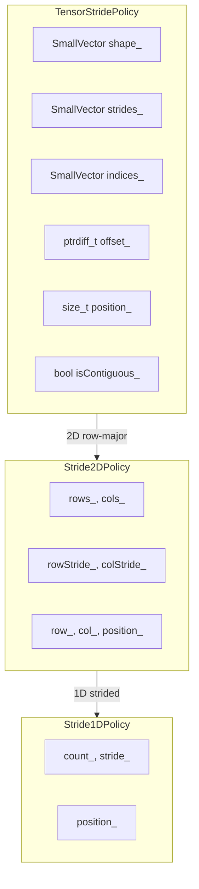
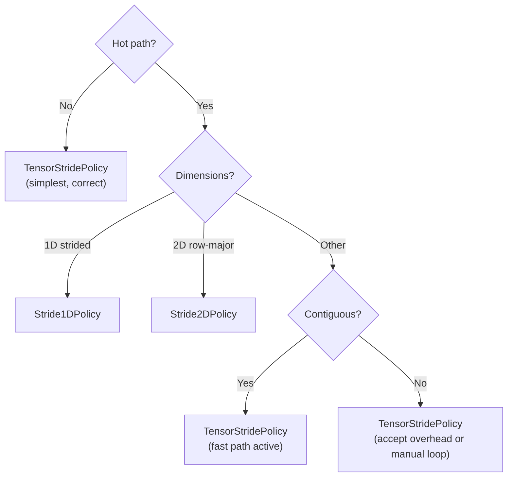

# Companion Guide - TensorStridePolicy

---

## Companion Guide Card

**Component:** TensorStridePolicy  
**Design question:** How do you iterate N-dimensional tensors with arbitrary memory layouts without runtime overhead for common cases?  
**Key tradeoff:** Generality vs performance; full N-D support has odometer overhead, but specialized 1D/2D policies match manual loops  
**Decision made:** Three-tier architecture: TensorStridePolicy (general), Stride2DPolicy (2D optimized), Stride1DPolicy (1D optimized)  
**Rejected alternatives:** Virtual dispatch for layout abstraction (overhead), single policy with runtime dimension count (always pays N-D cost), template dimension parameter (code bloat)  
**Historical context:** Inspired by NumPy's strided array model; adapted for C++ compile-time policy dispatch

---

## Scope

This document explains *why* TensorStridePolicy is designed the way it is. It covers the problems that motivated the design (index arithmetic complexity, layout abstraction, performance hierarchy), the architectural solutions (shape-stride separation, odometer algorithm, contiguous detection, three-tier design), and case studies demonstrating the design in practice.

## Not Covered

- API reference and usage patterns (see User Manual - TensorStridePolicy)
- High-level positioning and quick-start (see Overview - TensorStridePolicy)
- PolicyIterator design rationale (see Companion Guide - PolicyIterator)

## Prerequisites

- Familiarity with TensorStridePolicy usage (Overview and User Manual)
- Understanding of multi-dimensional array memory layouts
- Knowledge of PolicyIterator architecture

---

## Table of Contents

**[Introduction: Why This Component Exists](#introduction-why-this-component-exists)**

### Part I — The Problems

1. [The Index Arithmetic Nightmare](#chapter-1--the-index-arithmetic-nightmare)
2. [The Layout Assumption Trap](#chapter-2--the-layout-assumption-trap)
3. [The Generality-Performance Tradeoff](#chapter-3--the-generality-performance-tradeoff)
4. [The Memory Footprint Problem](#chapter-4--the-memory-footprint-problem)

### Part II — The Solutions

5. [Architecture Overview](#chapter-5--architecture-overview)
6. [Shape-Stride Separation](#chapter-6--shape-stride-separation)
7. [The Odometer Algorithm](#chapter-7--the-odometer-algorithm)
8. [Contiguous Detection](#chapter-8--contiguous-detection)
9. [The Three-Tier Design](#chapter-9--the-three-tier-design)

### Part III — Putting It Together

10. [Case Study: GPU Texture Processing](#chapter-10--case-study-gpu-texture-processing)
11. [Case Study: Sparse Tensor Slicing](#chapter-11--case-study-sparse-tensor-slicing)
12. [Choosing the Right Tier](#chapter-12--choosing-the-right-tier)

### Part IV — Foundations

- [Appendix A — Memory Layout Conventions](#appendix-a--memory-layout-conventions)
- [Appendix B — Performance Characteristics](#appendix-b--performance-characteristics)
- [Appendix C — Where TensorStridePolicy Loses](#appendix-c--where-tensorstridepolicy-loses)
- [Appendix D — Design Constraints and Rejected Alternatives](#appendix-d--design-constraints-and-rejected-alternatives)

---

# Introduction: Why This Component Exists

You're processing medical imaging data. A 3D CT scan is 512×512×256 voxels. The scanner software stores slices with padding for alignment. Your analysis code assumes contiguous storage. The results are wrong—you're reading padding bytes as voxel data.

Or this: you have a large matrix in row-major format. A legacy Fortran library expects column-major traversal. You allocate a transposed copy, wasting memory and time. Later you discover the library only reads the data—no copy was needed, just a different view.

Or this: you write generic tensor code with shape and strides. It works correctly for any layout. But your 2D image processing pipeline—the hot path—runs 3x slower than the hand-tuned version it replaced. The abstraction costs too much.

TensorStridePolicy exists to solve these problems:

- **Correct iteration** regardless of memory layout
- **Zero-copy views** for transposed and submatrix access  
- **Tiered performance** so common cases stay fast

---

# PART I — THE PROBLEMS

Multi-dimensional iteration seems simple until you encounter real-world memory layouts.

---

# CHAPTER 1 — The Index Arithmetic Nightmare

Every dimension adds complexity to index calculations:

```cpp
// 2D: manageable
offset = row * cols + col;

// 3D: getting complex
offset = slice * rows * cols + row * cols + col;

// 4D: error-prone
offset = batch * slices * rows * cols + slice * rows * cols + row * cols + col;

// 5D: unreadable
offset = /* good luck getting this right */;
```

The pattern is: `sum(index[d] * stride[d])` where stride[d] = product of dimensions after d. But writing this correctly every time is error-prone.

**Common bugs:**

```cpp
// Off-by-one in dimension order
offset = row * rows * cols + col;  // Wrong: should be row * cols

// Forgetting a dimension
offset = slice * rows * cols + row * cols;  // Missing + col

// Wrong accumulation
offset = batch * slices + slice * rows + row * cols + col;  // Strides wrong
```

These bugs compile. They run. They produce subtly wrong results that you might not notice until production.

| Symptom | Cause |
|---------|-------|
| Stripes in output images | Row stride wrong |
| Garbage in high indices | Dimension order swapped |
| Off-by-N errors | Forgot a term in offset calculation |
| Works on square matrices only | Assumed rows == cols |

---

# CHAPTER 2 — The Layout Assumption Trap

Code often assumes contiguous row-major storage:

```cpp
// THE TRAP: Assumes stride == width
void process_image(float* data, int width, int height) {
    for (int r = 0; r < height; ++r) {
        for (int c = 0; c < width; ++c) {
            data[r * width + c] = transform(data[r * width + c]);
        }
    }
}
```

This breaks when:

**GPU pitch alignment:**
```cpp
float* devPtr;
size_t pitch;  // pitch >= width * sizeof(float), aligned to 128 bytes
cudaMallocPitch(&devPtr, &pitch, width * sizeof(float), height);
// Actual row stride is pitch/sizeof(float), not width
```

**Submatrix views:**
```cpp
// Parent matrix is 1000×1000
// Submatrix is rows [100,200), cols [100,200)
// Row stride is 1000, not 100
float* sub = &parent[100][100];
// process_image(sub, 100, 100) is WRONG
```

**Column-major storage (Fortran):**
```cpp
// Fortran array A(M,N) has stride 1 between rows, M between columns
// C code assuming row-major gets completely wrong results
```

The fix is always the same: pass stride explicitly. But then every function signature grows, and callers must remember to provide the right stride.

---

# CHAPTER 3 — The Generality-Performance Tradeoff

You want a general solution. You write:

```cpp
class TensorIterator {
    vector<size_t> shape_;
    vector<ptrdiff_t> strides_;
    vector<size_t> indices_;
    size_t position_;
    
    void advance() {
        // Odometer: increment last index, carry if needed
        for (int d = shape_.size() - 1; d >= 0; --d) {
            if (++indices_[d] < shape_[d]) {
                break;
            }
            indices_[d] = 0;
        }
        ++position_;
    }
};
```

This handles any layout. But compared to a manual 2D loop:

```cpp
for (int r = 0; r < rows; ++r) {
    for (int c = 0; c < cols; ++c) {
        process(data[r * stride + c]);
    }
}
```

The general version is 2-3x slower. The odometer loop, the vector accesses, the indirect addressing—all add up.

**The dilemma:** You can have correctness and generality, or you can have performance. Choosing both seems impossible.

---

# CHAPTER 4 — The Memory Footprint Problem

A general tensor policy needs to store shape, strides, and current indices:

```cpp
template <typename T>
struct NaiveTensorPolicy {
    std::vector<size_t> shape_;      // 24 bytes + heap
    std::vector<ptrdiff_t> strides_; // 24 bytes + heap
    std::vector<size_t> indices_;    // 24 bytes + heap
    ptrdiff_t offset_;               // 8 bytes
    size_t position_;                // 8 bytes
    size_t total_;                   // 8 bytes
};
// Total: 96+ bytes, plus 3 heap allocations
```

For most tensors (≤8 dimensions), heap allocation is overkill. But fixed-size arrays waste space for low dimensions:

```cpp
template <typename T>
struct FixedTensorPolicy {
    size_t shape_[8];      // 64 bytes (wastes 48 for 2D)
    ptrdiff_t strides_[8]; // 64 bytes
    size_t indices_[8];    // 64 bytes
    // ...
};
// 200+ bytes even for 2D matrix
```

**The tradeoff:** Dynamic allocation is slow but flexible; fixed allocation is fast but wasteful.

---

# PART II — THE SOLUTIONS

TensorStridePolicy addresses each problem through careful design.

---

# CHAPTER 5 — Architecture Overview

TensorStridePolicy uses three architectural principles:

1. **Shape-stride separation:** Traversal order and memory layout are independent
2. **SmallVector storage:** Zero-allocation for ≤8 dimensions
3. **Three-tier design:** Specialized policies for common cases



---

# CHAPTER 6 — Shape-Stride Separation

### The Core Insight

**Shape** defines what positions to visit (traversal order).
**Strides** define where those positions live in memory (layout).

By separating them, you can:
- Traverse row-major data in column-major order
- Skip padding without copying
- View submatrices without allocation

### Implementation

```cpp
template <typename T, size_t MaxInlineDims = 8>
struct TensorStridePolicy {
    SmallVector<size_t, MaxInlineDims> mShape;
    SmallVector<ptrdiff_t, MaxInlineDims> mStrides;
    SmallVector<size_t, MaxInlineDims> mIndices;
    ptrdiff_t mOffset;
    // ...
};
```

The offset is computed incrementally:

```cpp
// Initial offset
mOffset = sum(mIndices[d] * mStrides[d]);

// On advance, update incrementally
// (cheaper than recomputing from scratch)
```

### Example: Transposed View

```cpp
// Row-major storage: 3×4 matrix
// Memory: [r0c0 r0c1 r0c2 r0c3 | r1c0 r1c1 r1c2 r1c3 | r2c0 r2c1 r2c2 r2c3]

// Row-major traversal
TensorStridePolicy<float> row_major({3, 4}, {4, 1});
// Visits: [0,0] [0,1] [0,2] [0,3] [1,0] ...
// Offsets: 0, 1, 2, 3, 4, 5, 6, 7, 8, 9, 10, 11

// Column-major traversal (same data, different view)
TensorStridePolicy<float> col_major({4, 3}, {1, 4});
// Visits: [0,0] [0,1] [0,2] [1,0] ...
// Offsets: 0, 4, 8, 1, 5, 9, 2, 6, 10, 3, 7, 11
```

No data copied. Just different shape and strides.

---

# CHAPTER 7 — The Odometer Algorithm

### How It Works

TensorStridePolicy tracks position as multi-dimensional indices. The `advance()` method works like an odometer:

```cpp
void advance() {
    ++mPosition;
    
    if (mIsContiguous) {
        // Fast path: just increment offset
        ++mOffset;
        return;
    }
    
    // Odometer: increment last dimension, carry if needed
    for (size_t d = mShape.size(); d-- > 0; ) {
        ++mIndices[d];
        mOffset += mStrides[d];
        
        if (mIndices[d] < mShape[d]) {
            return;  // No carry needed
        }
        
        // Carry: reset this dimension, continue to next
        mOffset -= mIndices[d] * mStrides[d];
        mIndices[d] = 0;
    }
}
```

### Complexity Analysis

**Best case (contiguous):** O(1) — just increment offset
**Average case:** O(1) amortized — carry propagation is rare
**Worst case:** O(dims) — when all dimensions roll over

The amortized analysis: dimension d rolls over every `product(shape[d+1..N-1])` advances. Total carries across full traversal is O(total), so amortized per-advance is O(1).

### The Contiguous Fast Path

For row-major contiguous data, the odometer is unnecessary. TensorStridePolicy detects this at construction:

```cpp
bool computeIsContiguous() const {
    ptrdiff_t expected = 1;
    for (size_t d = mShape.size(); d-- > 0; ) {
        if (mStrides[d] != expected) {
            return false;
        }
        expected *= static_cast<ptrdiff_t>(mShape[d]);
    }
    return true;
}
```

When contiguous, `advance()` skips the odometer entirely.

---

# CHAPTER 8 — Contiguous Detection

### Why It Matters

Contiguous iteration is a common case that deserves optimization:

| Layout | `advance()` Cost | Memory Access |
|--------|------------------|---------------|
| Contiguous | ++offset (1 op) | Sequential |
| Non-contiguous | Odometer (5-15 ops) | Strided |

### Automatic Detection

TensorStridePolicy checks contiguity at construction:

```cpp
TensorStridePolicy(std::initializer_list<size_t> shape,
                   std::initializer_list<ptrdiff_t> strides)
    : mShape(shape), mStrides(strides), /* ... */
{
    mIsContiguous = computeIsContiguous();
}
```

User code doesn't need to specify—the policy figures it out.

### Shape-Only Constructor

For the common row-major case, provide only shape:

```cpp
TensorStridePolicy(std::initializer_list<size_t> shape)
    : mShape(shape), /* ... */
{
    // Compute row-major strides
    ptrdiff_t stride = 1;
    for (size_t d = mShape.size(); d-- > 0; ) {
        mStrides[d] = stride;
        stride *= static_cast<ptrdiff_t>(mShape[d]);
    }
    mIsContiguous = true;  // By construction
}
```

---

# CHAPTER 9 — The Three-Tier Design

### The Insight

Most tensor iteration is 1D or 2D. Paying N-D overhead for these cases is wasteful.

TensorStridePolicy provides three policies:

| Tier | Policy | Traversal complexity | Dimensions |
|------|--------|----------------------|------------|
| 1 | TensorStridePolicy | Rank-generic | Any N |
| 2 | Stride2DPolicy | Fixed 2D | 2D row-major |
| 3 | Stride1DPolicy | Fixed 1D | 1D strided |

### Stride1DPolicy

Minimal state for 1D strided iteration:

```cpp
template <typename T>
struct Stride1DPolicy {
    size_t mCount;
    ptrdiff_t mStride;
    size_t mPosition;
    
    void advance(T*& ptr) {
        ptr += mStride;
        ++mPosition;
    }
};
// sizeof: ~24 bytes
```

Uses fixed 1D state and is amenable to inlining; verify target code generation for hot loops.

### Stride2DPolicy

Optimized for 2D with row/column tracking:

```cpp
template <typename T>
struct Stride2DPolicy {
    size_t mRows, mCols;
    ptrdiff_t mRowStride, mColStride;
    size_t mRow, mCol, mPosition;
    
    void advance(T*& ptr) {
        ++mCol;
        ptr += mColStride;
        
        if (mCol >= mCols) {
            mCol = 0;
            ++mRow;
            ptr += mRowStride - mCols * mColStride;
        }
        ++mPosition;
    }
};
// sizeof: ~56 bytes
```

One branch per advance (at end of row), but much simpler than full odometer.

### Why Not Template on Dimension?

We considered:

```cpp
template <typename T, size_t Dims>
struct TensorPolicy;
```

**Rejected because:**
- Code bloat: separate instantiation for 1D, 2D, 3D, 4D, ...
- No benefit: SmallVector already avoids heap for ≤8 dims
- Complexity: specializations for each dimension count

The three-tier design gives 95% of the performance benefit with much less complexity.

---

# PART III — PUTTING IT TOGETHER

---

# CHAPTER 10 — Case Study: GPU Texture Processing

### The Problem

CUDA textures allocated with `cudaMallocPitch` have row padding for memory coalescing. Naive iteration accesses padding bytes.

### Traditional Approach

```cpp
void process_texture_manual(float* data, size_t width, size_t height, size_t pitch) {
    size_t pitch_elements = pitch / sizeof(float);
    for (size_t r = 0; r < height; ++r) {
        for (size_t c = 0; c < width; ++c) {
            data[r * pitch_elements + c] = transform(data[r * pitch_elements + c]);
        }
    }
}
```

Must remember to use `pitch_elements`, not `width`. Easy to forget.

### TensorStridePolicy Approach

```cpp
void process_texture_tensor(float* data, size_t width, size_t height, size_t pitch) {
    size_t pitch_elements = pitch / sizeof(float);
    Stride2DPolicy<float> policy(height, width, pitch_elements, 1);
    
    using Iter = PolicyIterator<float, Stride2DPolicy<float>>;
    for (auto it = Iter::begin(data, data + height * pitch_elements, policy);
         it != Iter::end(data, data + height * pitch_elements, policy); ++it) {
        *it = transform(*it);
    }
}
```

The stride is encoded in the policy. Can't accidentally use the wrong value in the loop body.

### Performance

Both versions describe the same traversal. Generated code and row-boundary cost depend on the compiler, optimization flags, data layout, and workload; benchmark the target build.

---

# CHAPTER 11 — Case Study: Sparse Tensor Slicing

### The Problem

You have a 4D tensor (batch × channel × height × width) and need to process one channel of one batch.

### Traditional Approach

```cpp
void process_slice_manual(float* tensor, 
                          size_t batch, size_t channel,
                          size_t B, size_t C, size_t H, size_t W) {
    float* slice = tensor + batch * C * H * W + channel * H * W;
    for (size_t h = 0; h < H; ++h) {
        for (size_t w = 0; w < W; ++w) {
            process(slice[h * W + w]);
        }
    }
}
```

Works, but the slice pointer calculation is error-prone.

### TensorStridePolicy Approach

```cpp
void process_slice_tensor(float* tensor,
                          size_t batch, size_t channel,
                          size_t B, size_t C, size_t H, size_t W) {
    // Compute slice start
    ptrdiff_t batch_stride = C * H * W;
    ptrdiff_t channel_stride = H * W;
    float* slice = tensor + batch * batch_stride + channel * channel_stride;
    
    // 2D policy for H×W slice
    Stride2DPolicy<float> policy(H, W);
    
    using Iter = PolicyIterator<float, Stride2DPolicy<float>>;
    for (auto it = Iter::begin(slice, slice + H * W, policy);
         it != Iter::end(slice, slice + H * W, policy); ++it) {
        process(*it);
    }
}
```

The slice is contiguous, so Stride2DPolicy (or even Stride1DPolicy with count H*W) is appropriate.

---

# CHAPTER 12 — Choosing the Right Tier

### Decision Framework



### Rules of Thumb

1. **Start with TensorStridePolicy.** It's correct for all cases.
2. **Profile.** If iteration overhead appears, consider specialization.
3. **Use Stride2DPolicy for 2D.** Covers images, matrices, textures.
4. **Use Stride1DPolicy for columns/diagonals.** Any 1D strided access.
5. **Accept overhead or go manual for exotic layouts.** Non-contiguous N-D is inherently slower.

---

# PART IV — FOUNDATIONS

---

# Appendix A — Memory Layout Conventions

### Row-Major (C/C++)

Last index varies fastest in memory.

```
A[i][j] at offset i * cols + j
A[i][j][k] at offset i * rows * cols + j * cols + k
```

### Column-Major (Fortran)

First index varies fastest in memory.

```
A(i,j) at offset (j-1) * rows + (i-1)  // 1-based
A(i,j,k) at offset (k-1) * rows * cols + (j-1) * rows + (i-1)
```

### Strides Encode Layout

| Layout | Shape {R, C} | Strides |
|--------|--------------|---------|
| Row-major | {R, C} | {C, 1} |
| Column-major | {R, C} | {1, R} |
| Padded row-major | {R, C} | {pitch, 1} |

---

# Appendix B — Performance Characteristics

### Benchmark Guidance

Measure manual, Stride1D, Stride2D, and TensorStride traversal with the same
element type, shape, layout, compiler, and optimization flags. Record the
benchmark environment with the result; timings from one machine are not an API
guarantee.

### Overhead Sources

| Source | Potential impact | Mitigation |
|--------|------------------|------------|
| Odometer loop | Per-axis state updates | Contiguous detection |
| SmallVector access | Rank-dependent metadata access | Inline storage |
| Branch at row end | Layout-dependent branching | Fixed-rank specialization |
| Position tracking | Per-step bookkeeping | Necessary for end detection |

---

# Appendix C — Where TensorStridePolicy Loses

### Simple Contiguous Arrays

For contiguous data with no layout complexity, manual loops are clearer and faster:

```cpp
// Just use this
for (float* p = data; p < data + n; ++p) {
    process(*p);
}
```

### SIMD Vectorization

The odometer logic and indirect addressing inhibit auto-vectorization. For vectorized hot paths, use raw pointers or intrinsics.

### Very High Dimensions

TensorStridePolicy supports up to `MaxInlineDims` (default 8) without heap allocation. Beyond that, SmallVector allocates. For 10+ dimensions, consider flattening.

---

# Appendix D — Design Constraints and Rejected Alternatives

### Rejected: Virtual Layout Class

```cpp
class Layout {
    virtual ptrdiff_t offset(const vector<size_t>& indices) = 0;
};
```

**Why rejected:** Virtual dispatch in inner loop. 20%+ overhead.

### Rejected: Single Policy with Runtime Dimensions

```cpp
struct DynamicTensorPolicy {
    vector<size_t> shape;  // Always allocated
};
```

**Why rejected:** Heap allocation even for 2D. Overkill for common cases.

### Rejected: Template Dimension Parameter

```cpp
template <typename T, size_t Dims>
struct TensorPolicy;
```

**Why rejected:** Code bloat. Each dimension count is a separate instantiation.

### Accepted: Three-Tier Design

**Why accepted:**
- Covers 95% of use cases efficiently
- Clear mental model (1D/2D/N-D)
- Minimal code duplication
- Zero heap allocation for common cases

---

## Glossary

- **Shape:** Array of dimension sizes defining iteration bounds.
- **Stride:** Array of offsets defining memory spacing.
- **Odometer:** Algorithm that increments multi-dimensional indices with carry propagation.
- **Contiguous:** Memory layout where sequential iteration accesses sequential addresses.
- **Pitch:** Row stride for padded/aligned memory allocations.
- **Three-tier:** Design pattern providing specialized implementations for common cases.

---

*TensorStridePolicy.h: ~700 lines — See User Manual for API reference, PolicyIterator Companion Guide for iterator design*
