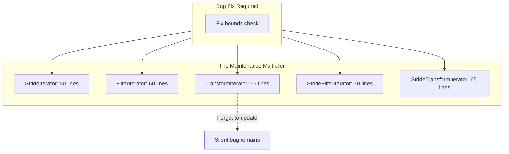

# User Manual - PolicyIterator

*Updated December 2025*

---

## User Manual Card

**Component:** PolicyIterator  
**Primary use case:** Iterating data with configurable traversal patterns (sequential, strided, filtered, transformed) without runtime overhead  
**Integration pattern:** Replace manual iterator classes with `PolicyIterator<T, YourPolicy>`; use static factory methods `begin()` and `end()`  
**Key API:** `PolicyIterator<T, Policy>::begin(base, end)`, `PolicyIterator<T, Policy>::end(base, end)`, `operator++`, `operator*`  
**Common mistakes:** Using constructors instead of factory methods; forgetting predicate for filter policy; assuming random-access capability; passing predicates by reference instead of value  
**Performance notes:** Zero overhead for standard/stride/transform policies in optimized builds; filter policies may show 2-5% overhead due to predicate storage  
**Debug vs Release:** Debug builds include `enforce()` bounds checks; Release builds elide all checks for zero overhead  
**Read next:** Companion Guide - PolicyIterator, Overview - TensorStridePolicy

---

## Scope

This document covers practical usage of PolicyIterator: how to integrate it into existing code, how to use each built-in policy, how to write custom policies, common patterns and recipes, debugging techniques, performance considerations, and migration strategies. It provides the depth needed to use PolicyIterator effectively in production code, including assembly-level verification of the zero-overhead principle and domain-specific case studies.

## Not Covered

- Design rationale and architectural decisions (see Companion Guide - PolicyIterator)
- High-level positioning and alternatives comparison (see Overview - PolicyIterator)
- TensorStridePolicy for multi-dimensional iteration (see User Manual - TensorStridePolicy)
- Benchmark methodology and raw data (see Benchmark Results - PolicyIterator)

## Prerequisites

- Working knowledge of C++ templates and SFINAE
- Familiarity with STL iterators (`begin()`, `end()`, iterator categories)
- Understanding of lambdas and callable objects
- Basic knowledge of compiler optimization and inlining (helpful for performance sections)

---

## Table of Contents

1. [The Iterator Boilerplate Problem](#the-iterator-boilerplate-problem)
2. [A Brief History of Iterator Abstraction](#a-brief-history-of-iterator-abstraction)
3. [The Design Space](#the-design-space)
4. [Policy-Based Design: The Core Insight](#policy-based-design-the-core-insight)
5. [Getting Started](#getting-started)
6. [Standard Policy: Sequential Iteration](#standard-policy-sequential-iteration)
7. [Stride Policy: Skip-N Iteration](#stride-policy-skip-n-iteration)
8. [Filter Policy: Conditional Iteration](#filter-policy-conditional-iteration)
9. [Transform Policy: Mapping on Dereference](#transform-policy-mapping-on-dereference)
10. [Tensor Policies: Multi-Dimensional Traversal](#tensor-policies-multi-dimensional-traversal)
11. [Writing Custom Policies](#writing-custom-policies)
12. [The Zero-Overhead Principle: Assembly Evidence](#the-zero-overhead-principle-assembly-evidence)
13. [Common Patterns and Recipes](#common-patterns-and-recipes)
14. [Case Study: SIMD Vectorization Pipeline](#case-study-simd-vectorization-pipeline)
15. [Case Study: Sparse Matrix Row Iteration](#case-study-sparse-matrix-row-iteration)
16. [Case Study: Image Processing with Stride](#case-study-image-processing-with-stride)
17. [Debugging and Diagnostics](#debugging-and-diagnostics)
18. [Performance Considerations](#performance-considerations)
19. [Exception Safety](#exception-safety)
20. [Migration from Manual Iterators](#migration-from-manual-iterators)
21. [Migration from Boost.Iterator](#migration-from-boostiterator)
22. [API Reference](#api-reference)
23. [Troubleshooting Guide](#troubleshooting-guide)
24. [Summary](#summary)

---

## The Iterator Boilerplate Problem

### The Hidden Cost of Custom Iterators

Every C++ programmer who has needed a non-standard traversal pattern has faced this choice: write a manual loop with index arithmetic, or write a custom iterator class. The manual loop is quick but obscures intent. The custom iterator expresses intent but requires fifty to a hundred lines of boilerplate.

Consider iterating every fourth element of an array. The manual approach:

```cpp
for (size_t i = 0; i < n; i += 4) {
    process(data[i]);
}
```

This works, but the "every fourth" intent is buried in the index arithmetic. In a complex codebase, the loops become hard to audit. Did someone mean `i += 4` or `i += 3`? Is the off-by-one bug in the loop condition or the increment?

The iterator approach encapsulates the pattern:

```cpp
class StrideIterator {
    int* ptr_;
    int* end_;
    int stride_;
public:
    StrideIterator(int* p, int* e, int s) : ptr_(p), end_(e), stride_(s) {}
    
    StrideIterator& operator++() {
        ptr_ += stride_;
        if (ptr_ > end_) ptr_ = end_;
        return *this;
    }
    
    StrideIterator operator++(int) {
        auto copy = *this;
        ++(*this);
        return copy;
    }
    
    int& operator*() const { return *ptr_; }
    int* operator->() const { return ptr_; }
    
    bool operator==(const StrideIterator& o) const { return ptr_ == o.ptr_; }
    bool operator!=(const StrideIterator& o) const { return ptr_ != o.ptr_; }
    
    using iterator_category = std::forward_iterator_tag;
    using value_type = int;
    using difference_type = std::ptrdiff_t;
    using pointer = int*;
    using reference = int&;
};
```

That's forty lines to express "advance by N." And this is simple—no filtering, no transformation, no bidirectional support. Add those features and you're looking at eighty to a hundred lines per class.

### The Maintenance Multiplier

Every new pattern requires a new class. Stride-4, stride-8, filter-evens, filter-positives, transform-double—each is another hundred lines. The combinations explode: stride-4-and-filter-evens needs its own class.

When you find a bug in bounds checking, you must fix it in every iterator class. Some get updated; some don't. The inconsistency compounds over time.



---

## A Brief History of Iterator Abstraction

### The STL Foundation (1994)

The Standard Template Library, designed by Alexander Stepanov and Meng Lee at Hewlett-Packard, introduced the iterator concept to C++ in 1994. Stepanov's insight was that algorithms and containers could be decoupled through a common interface.

The STL defined five iterator categories: InputIterator, OutputIterator, ForwardIterator, BidirectionalIterator, and RandomAccessIterator. Each specified valid operations and complexity guarantees.

The STL's iterators were designed for *container traversal*, not *traversal strategy*. A `std::vector<int>::iterator` knows how to traverse a vector, but it doesn't know how to skip elements, filter elements, or transform elements.

### The Boost.Iterator Library (2003)

David Abrahams, Jeremy Siek, and Thomas Witt developed Boost.Iterator to address boilerplate. Boost.Iterator introduced:

**Iterator Adaptors** wrapped existing iterators:

```cpp
#include <boost/iterator/filter_iterator.hpp>
auto is_even = [](int x) { return x % 2 == 0; };
auto begin = boost::make_filter_iterator(is_even, vec.begin(), vec.end());
```

**Iterator Facades** reduced boilerplate for custom iterators from 50 lines to 10-15 lines by using CRTP.

Boost.Iterator had limitations: compile-time overhead, cryptic error messages, and runtime overhead from stored function objects.

### Range-v3 and the Ranges TS (2014-2020)

Eric Niebler's range-v3 introduced lazy evaluation and composition through the pipe operator:

```cpp
auto result = data 
    | views::filter([](int x) { return x > 0; })
    | views::transform([](int x) { return x * 2; });
```

This was elegant but required C++20 for standardization and added runtime overhead through type erasure in some views.

### Policy-Based Design: A Different Approach (2001)

Andrei Alexandrescu's *Modern C++ Design* introduced policy-based class design: decompose a class's behavior into orthogonal *policies* as template parameters. The compiler resolves them at compile time—no virtual dispatch, no type erasure.

PolicyIterator applies this insight to iteration. The mechanics are fixed; the strategy is a policy parameter. The compiler inlines everything, producing code identical to hand-written loops.

---

## The Design Space

### Approaches to Iterator Customization

| Approach | Runtime Overhead | Boilerplate | Composition | Debug Safety |
|----------|-----------------|-------------|-------------|--------------|
| Manual loops | None | Low | No | Manual |
| Separate classes | None | High | No | Manual |
| Virtual dispatch | 15-25% | Medium | Partial | Manual |
| Type erasure | 10-20% | Medium | Yes | Manual |
| **Policy templates** | **None** | **Low** | **Yes** | **Built-in** |

PolicyIterator occupies a specific niche: **compile-time strategy selection with zero overhead**. If you need runtime strategy changes, use virtual dispatch. If you don't need abstraction, use manual loops. But if you have multiple compile-time-known patterns and care about performance, PolicyIterator is the right choice.

---

## Policy-Based Design: The Core Insight

### Separating Mechanics from Strategy

Every iterator performs the same mechanical operations: bounds tracking, comparison, dereference, traits. What differs is the *strategy*—how they advance.

PolicyIterator factors out the mechanics and delegates strategy to a policy:

```cpp
template <typename T, typename Policy = StandardPolicy<T>>
class PolicyIterator {
    T* mBase;    // Start of range
    T* mPtr;     // Current position
    T* mEnd;     // End of range
    Policy mPolicy;
    
    PolicyIterator& operator++() {
        mPolicy.advance(mPtr);  // Delegate to strategy
        return *this;
    }
};
```

### The Inlining Guarantee

Because the policy type is a template parameter, the compiler knows at compile time which `advance()` to call. No virtual dispatch, no indirection. The policy's code is inlined directly:

```cpp
// What you write
using Iter = PolicyIterator<int, StridePolicy<int, 4>>;
for (auto it = Iter::begin(data, end); it != Iter::end(data, end); ++it) {
    sum += *it;
}

// What the compiler sees after inlining
for (int* p = data; p < end; p += 4) {
    sum += *p;
}
```

---

## Getting Started

### Your First PolicyIterator

```cpp
#include "PolicyIterator.h"

int main() {
    std::vector<int> data = {1, 2, 3, 4, 5};
    
    using namespace fat_p::iterator;
    
    auto begin = PolicyIterator<int>::begin(data.data(), data.data() + data.size());
    auto end = PolicyIterator<int>::end(data.data(), data.data() + data.size());
    
    for (auto it = begin; it != end; ++it) {
        std::cout << *it << ' ';
    }
    // Output: 1 2 3 4 5
    
    // Works with STL algorithms
    int sum = std::accumulate(begin, end, 0);  // 15
}
```

### Factory Methods: Why Not Constructors?

PolicyIterator uses static factory methods rather than public constructors. This ensures:

1. **Consistent initialization:** Both iterators receive the full range for bounds checking
2. **Policy-specific setup:** Filter policies advance to first matching element; tensor policies sync internal state
3. **Type deduction:** Factory methods can deduce predicate/transformer types

```cpp
// Correct: Use factory methods
auto b = PolicyIterator<int>::begin(data, data + n);
auto e = PolicyIterator<int>::end(data, data + n);
```

### The Namespace

```cpp
namespace fat_p::iterator {
    template <typename T, typename Policy = StandardPolicy<T>>
    class PolicyIterator;
    
    template <typename T> struct StandardPolicy;
    template <typename T, int N> struct StridePolicy;
    template <typename T, typename Predicate> struct FilterPolicy;
    template <typename T, typename Transformer> struct TransformPolicy;
}
```

### Build Configuration

Debug builds (NDEBUG not defined): All `enforce()` checks are active.
Release builds (NDEBUG defined): All checks are elided—zero overhead.

```bash
g++ -std=c++20 -g -O0 my_code.cpp           # Debug: checks active
g++ -std=c++20 -O3 -DNDEBUG my_code.cpp     # Release: checks elided
```

---

## Standard Policy: Sequential Iteration

### The Default Behavior

StandardPolicy provides sequential iteration:

```cpp
template <typename T>
struct StandardPolicy {
    using iterator_category = std::bidirectional_iterator_tag;
    using difference_type = std::ptrdiff_t;
    using value_type = T;
    using pointer = T*;
    using reference = T&;

    void advance(T*& ptr) const { ++ptr; }
    void retreat(T*& ptr) const { --ptr; }
};
```

This is the default when you write `PolicyIterator<int>` without specifying a policy.

### Why Use PolicyIterator for Sequential Iteration?

**Debug-mode bounds checking:**

```cpp
// Raw pointer: silent undefined behavior
int* p = data + 5;
int x = *p;  // UB if data has 5 elements

// PolicyIterator: immediate diagnostic
auto it = PolicyIterator<int>::end(data, data + 5);
int x = *it;  // enforce() fires: "Cannot dereference end iterator"
```

**Consistency across patterns:** All iteration uses the same infrastructure.

**Future flexibility:** Switch strategies by changing a template parameter.

### Range-Based For Loops

```cpp
template <typename T, typename Policy = StandardPolicy<T>>
struct PolicyRange {
    T* base_;
    T* end_;
    
    auto begin() const { return PolicyIterator<T, Policy>::begin(base_, end_); }
    auto end() const { return PolicyIterator<T, Policy>::end(base_, end_); }
};

PolicyRange<int> range{data.data(), data.data() + data.size()};
for (int x : range) {
    std::cout << x << ' ';
}
```

---

## Stride Policy: Skip-N Iteration

### Visiting Every Nth Element

StridePolicy advances by a fixed number of elements:

```cpp
template <typename T, int N>
struct StridePolicy {
    static_assert(N > 0, "Stride must be positive");

    using iterator_category = std::forward_iterator_tag;
    using difference_type = std::ptrdiff_t;
    using value_type = T;
    using pointer = T*;
    using reference = T&;

    static constexpr int kStrideValue = N;
    static constexpr bool kNeedsEndClamp = true;

    void advance(T*& ptr) const { ptr += N; }
    
    void advance(T*& ptr, T* end) const {
        if (end - ptr <= N) {
            ptr = end;
        } else {
            ptr += N;
        }
    }
};
```

The stride is a template parameter, so it's known at compile time. The optimizer can unroll loops and constant-fold:

```cpp
using Iter = PolicyIterator<int, StridePolicy<int, 4>>;
auto b = Iter::begin(data, data + n);
auto e = Iter::end(data, data + n);

std::vector<int> result;
for (auto it = b; it != e; ++it) {
    result.push_back(*it);
}
// For data = {0,1,2,3,4,5,6,7,8,9}: result = {0, 4, 8}
```

### End Clamping: Avoiding Undefined Behavior

The `kNeedsEndClamp` flag tells PolicyIterator to use the two-argument `advance(ptr, end)`. This prevents undefined behavior from pointer arithmetic past the end:

```cpp
int data[10];
int* ptr = data + 8;
ptr += 4;  // UB! ptr is now data + 12, past the array
```

StridePolicy's two-argument advance clamps to end:

```cpp
void advance(T*& ptr, T* end) const {
    if (end - ptr <= N) {
        ptr = end;  // Clamp, don't overshoot
    } else {
        ptr += N;   // Safe: N elements remain
    }
}
```

### Why Forward-Only?

StridePolicy is forward-only because reverse striding is ambiguous. Consider a 10-element array with stride 4: forward visits {0,4,8}. What should `--end` return?

Position 8 is the last visited element. But computing it requires knowing which positions were visited—complex tracking that StridePolicy avoids by being forward-only.

For bidirectional strided iteration, use TensorStridePolicy.

---

## Filter Policy: Conditional Iteration

### Skipping Non-Matching Elements

FilterPolicy iterates only elements satisfying a predicate:

```cpp
template <typename T, typename Predicate>
struct FilterPolicy {
    using predicate_type = Predicate;
    using iterator_category = std::forward_iterator_tag;
    using difference_type = std::ptrdiff_t;
    using value_type = T;
    using pointer = T*;
    using reference = T&;

    void advance(T*& ptr, T* end, const Predicate& pred) const {
        ++ptr;
        while (ptr < end && !pred(*ptr)) ++ptr;
    }
};
```

The predicate is stored in the iterator (not the policy). PolicyIterator's factory methods take the predicate:

```cpp
std::vector<int> data = {1, 2, 3, 4, 5, 6, 7, 8};

auto is_even = [](const int& x) { return x % 2 == 0; };
using Policy = FilterPolicy<int, decltype(is_even)>;

auto b = PolicyIterator<int, Policy>::begin(
    data.data(), data.data() + data.size(), Policy{}, is_even);
auto e = PolicyIterator<int, Policy>::end(
    data.data(), data.data() + data.size(), Policy{}, is_even);

std::vector<int> evens;
for (auto it = b; it != e; ++it) {
    evens.push_back(*it);
}
// evens = {2, 4, 6, 8}
```

### Begin Iterator Initialization

**Fact:** The begin iterator automatically advances to the first matching element. If the first element doesn't satisfy the predicate, the begin iterator doesn't point to it.

```cpp
std::vector<int> data = {1, 3, 5, 2, 4};  // First even is at index 3
auto is_even = [](const int& x) { return x % 2 == 0; };
using Policy = FilterPolicy<int, decltype(is_even)>;

auto b = PolicyIterator<int, Policy>::begin(
    data.data(), data.data() + data.size(), Policy{}, is_even);

std::cout << *b;  // Outputs: 2 (not 1)
```

### Predicate Storage

The predicate is stored by value in the iterator via `std::optional`. This means:

1. **Stateless lambdas** add no size (empty optimization)
2. **Capturing lambdas** add their capture size to iterator size
3. **Large captures** should be avoided—they hurt copy performance

```cpp
// Good: Stateless lambda
auto is_even = [](const int& x) { return x % 2 == 0; };

// Bad: Large capture
std::vector<int> thresholds(1000);
auto in_range = [&thresholds](const int& x) { 
    return x > thresholds[0] && x < thresholds[999]; 
};
// Iterator now stores a reference to thresholds—fragile!
```

For complex predicates, consider a small functor class:

```cpp
struct InRange {
    int lo, hi;
    bool operator()(const int& x) const { return x > lo && x < hi; }
};

using Policy = FilterPolicy<int, InRange>;
auto b = PolicyIterator<int, Policy>::begin(
    data.data(), data.data() + n, Policy{}, InRange{0, 100});
```

### Why Forward-Only?

FilterPolicy is forward-only because reverse filtering requires scanning backward for the previous matching element—potentially O(N) per decrement. This violates iterator complexity expectations.

If you need reverse filtering, collect matching elements into a container first.

---

## Transform Policy: Mapping on Dereference

### Applying a Function on Access

TransformPolicy applies a transformation when you dereference:

```cpp
template <typename T, typename Transformer>
struct TransformPolicy {
    using transformer_type = Transformer;
    using iterator_category = std::bidirectional_iterator_tag;
    using difference_type = std::ptrdiff_t;
    using result_type = std::invoke_result_t<Transformer, const T&>;
    using value_type = std::remove_cv_t<std::remove_reference_t<result_type>>;
    using reference = value_type;  // Returns by value!
    using pointer = const T*;

    void advance(T*& ptr) const { ++ptr; }
    void retreat(T*& ptr) const { --ptr; }

    [[nodiscard]] reference dereference(const T* ptr, const Transformer& fn) const {
        return fn(*ptr);
    }
};
```

**Key detail:** `operator*` returns the transformed value **by value**, not by reference. You can't modify the underlying data through a transform iterator.

```cpp
std::vector<int> data = {1, 2, 3, 4, 5};

auto doubler = [](const int& x) { return x * 2; };
using Policy = TransformPolicy<int, decltype(doubler)>;

auto b = PolicyIterator<int, Policy>::begin(
    data.data(), data.data() + data.size(), Policy{}, doubler);
auto e = PolicyIterator<int, Policy>::end(
    data.data(), data.data() + data.size(), Policy{}, doubler);

for (auto it = b; it != e; ++it) {
    std::cout << *it << ' ';
}
// Output: 2 4 6 8 10 (original data unchanged)
```

### operator* vs operator->

There's an intentional asymmetry:

- `operator*` returns the **transformed** value
- `operator->` returns a pointer to the **original** element

This gives you access to both views:

```cpp
struct Point { int x, y; };
std::vector<Point> points = {{1, 2}, {3, 4}};

auto get_x = [](const Point& p) { return p.x; };
using Policy = TransformPolicy<Point, decltype(get_x)>;

auto it = PolicyIterator<Point, Policy>::begin(
    points.data(), points.data() + points.size(), Policy{}, get_x);

std::cout << *it;        // Outputs: 1 (transformed)
std::cout << it->y;      // Outputs: 2 (original element)
```

### Bidirectional Support

Unlike FilterPolicy, TransformPolicy supports bidirectional iteration. Transformation doesn't change which elements are visited—it only changes what you see on dereference.

---

## Tensor Policies: Multi-Dimensional Traversal

### Beyond 1D: Shape and Stride

For N-dimensional arrays, PolicyIterator integrates with TensorStridePolicy. This policy tracks multi-dimensional indices and computes memory offsets from shape and stride:

```cpp
#include "TensorStridePolicy.h"

using namespace fat_p::iterator;

// 3x4 matrix, row-major layout
float data[12];
TensorStridePolicy<float> policy({3, 4});

auto b = PolicyIterator<float, TensorStridePolicy<float>>::begin(
    data, data + 12, policy);
auto e = PolicyIterator<float, TensorStridePolicy<float>>::end(
    data, data + 12, policy);

// Visits: [0,0], [0,1], [0,2], [0,3], [1,0], ... [2,3]
```

TensorStridePolicy is covered in detail in User Manual - TensorStridePolicy.

### Lightweight Specializations

For hot-path 1D and 2D iteration, Fat-P provides lightweight policies:

```cpp
// Stride1DPolicy: Fast 1D strided iteration
Stride1DPolicy<float> policy(1000, 4);  // 1000 elements, stride 4

// Stride2DPolicy: Fast 2D row-major iteration
Stride2DPolicy<float> policy(100, 200, 200, 1);  // 100 rows, 200 cols
```

These are 3-5x faster than TensorStridePolicy for their specific use cases.

---

## Writing Custom Policies

### The Policy Contract

A policy must provide:

1. **Iterator type aliases:** `iterator_category`, `difference_type`, `value_type`, `pointer`, `reference`
2. **At minimum:** `void advance(T*& ptr)` method
3. **Optionally:** `void retreat(T*& ptr)` for bidirectional iteration
4. **Optionally:** `void advance(T*& ptr, T* end)` for bounds-clamping

### Example: Reverse Policy

```cpp
template <typename T>
struct ReversePolicy {
    using iterator_category = std::bidirectional_iterator_tag;
    using difference_type = std::ptrdiff_t;
    using value_type = T;
    using pointer = T*;
    using reference = T&;

    void advance(T*& ptr) const { --ptr; }  // Advance = go backward
    void retreat(T*& ptr) const { ++ptr; }  // Retreat = go forward
};
```

### Example: Modulo Filter Policy

```cpp
template <typename T, int M>
struct ModuloPolicy {
    using iterator_category = std::forward_iterator_tag;
    using difference_type = std::ptrdiff_t;
    using value_type = T;
    using pointer = T*;
    using reference = T&;

    void advance(T*& ptr, T* end) const {
        ++ptr;
        while (ptr < end && (*ptr % M) != 0) ++ptr;
    }
};

// Usage: iterate elements divisible by 3
using Iter = PolicyIterator<int, ModuloPolicy<int, 3>>;
```

### Trait Detection

PolicyIterator uses trait detection to determine which `advance()` overload to call:

- `has_predicate<P>`: Policy has `predicate_type`—use three-argument advance
- `has_stride<P>` or `needs_end_clamp<P>`: Use two-argument advance
- Otherwise: Use one-argument advance

If your policy needs the end pointer, define `static constexpr bool kNeedsEndClamp = true;` or `kStrideValue`.

---

## The Zero-Overhead Principle: Assembly Evidence

### Verifying the Abstraction Vanishes

The zero-overhead principle states: what you don't use, you don't pay for; what you do use, you couldn't hand-code better. PolicyIterator aims to match hand-written loops exactly.

Consider this comparison:

```cpp
// Manual stride-4 loop
int sum_manual(int* data, int* end) {
    int sum = 0;
    for (int* p = data; p < end; p += 4) {
        sum += *p;
    }
    return sum;
}

// PolicyIterator stride-4
int sum_policy(int* data, int* end) {
    using Iter = PolicyIterator<int, StridePolicy<int, 4>>;
    int sum = 0;
    for (auto it = Iter::begin(data, end); it != Iter::end(data, end); ++it) {
        sum += *it;
    }
    return sum;
}
```

Compile with `-O2` and inspect the assembly:

```bash
g++ -std=c++20 -O2 -S -o output.s source.cpp
```

### x86-64 Assembly Comparison

**Manual loop (sum_manual):**

```asm
sum_manual:
    xor     eax, eax           ; sum = 0
    cmp     rdi, rsi           ; data < end?
    jge     .done
.loop:
    add     eax, [rdi]         ; sum += *p
    add     rdi, 16            ; p += 4 (4 * sizeof(int))
    cmp     rdi, rsi           ; p < end?
    jl      .loop
.done:
    ret
```

**PolicyIterator loop (sum_policy):**

```asm
sum_policy:
    xor     eax, eax           ; sum = 0
    cmp     rdi, rsi           ; data < end?
    jge     .done
.loop:
    add     eax, [rdi]         ; sum += *it
    add     rdi, 16            ; ptr += 4 (inlined from StridePolicy)
    cmp     rdi, rsi           ; it != end?
    jl      .loop
.done:
    ret
```

**Fact:** The inner loops are identical. The PolicyIterator abstraction has zero overhead at the assembly level.

### When Overhead Appears

Overhead appears in two cases:

1. **Debug builds:** `enforce()` checks add branches. This is intentional.

2. **Stateful predicates/transformers:** If your lambda captures variables, the iterator stores them. Large captures hurt performance.

```cpp
// No overhead: Stateless lambda
auto double_it = [](const int& x) { return x * 2; };

// Potential overhead: Capturing lambda
std::vector<int> weights(1000);
auto weighted = [&weights](const int& x) { return x * weights[0]; };
// Iterator stores reference—extra indirection
```

---

## Common Patterns and Recipes

### Accumulation with Stride

```cpp
std::vector<double> data = /* ... */;

using Iter = PolicyIterator<double, StridePolicy<double, 4>>;
auto b = Iter::begin(data.data(), data.data() + data.size());
auto e = Iter::end(data.data(), data.data() + data.size());

double sum = std::accumulate(b, e, 0.0);
```

### Copying Filtered Elements

```cpp
std::vector<int> src = {1, -2, 3, -4, 5, -6};
std::vector<int> dst;

auto positive = [](const int& x) { return x > 0; };
using Policy = FilterPolicy<int, decltype(positive)>;

auto b = PolicyIterator<int, Policy>::begin(
    src.data(), src.data() + src.size(), Policy{}, positive);
auto e = PolicyIterator<int, Policy>::end(
    src.data(), src.data() + src.size(), Policy{}, positive);

std::copy(b, e, std::back_inserter(dst));
// dst = {1, 3, 5}
```

### In-Place Transformation

TransformPolicy returns by value, so you can't modify through it directly. But you can access the original:

```cpp
std::vector<int> data = {1, 2, 3, 4, 5};

auto square = [](const int& x) { return x * x; };
using Policy = TransformPolicy<int, decltype(square)>;

auto b = PolicyIterator<int, Policy>::begin(
    data.data(), data.data() + data.size(), Policy{}, square);
auto e = PolicyIterator<int, Policy>::end(
    data.data(), data.data() + data.size(), Policy{}, square);

for (auto it = b; it != e; ++it) {
    int* original = const_cast<int*>(it.get());
    *original = *it;  // Write squared value back
}
// data = {1, 4, 9, 16, 25}
```

### Combining with STL Algorithms

PolicyIterator satisfies iterator requirements, so STL algorithms work:

```cpp
using Iter = PolicyIterator<int, StridePolicy<int, 2>>;
auto b = Iter::begin(data.data(), data.data() + n);
auto e = Iter::end(data.data(), data.data() + n);

// Count matching
int count = std::count_if(b, e, [](int x) { return x > 0; });

// Find element
auto found = std::find(b, e, 42);
if (found != e) { /* found at position */ }

// Copy to container
std::vector<int> result(b, e);
```

---

## Case Study: SIMD Vectorization Pipeline

### Problem

You have a data array and want to process 4 elements at a time using SSE intrinsics. The array size may not be a multiple of 4.

### Manual Approach

```cpp
void process_simd_manual(float* data, size_t n) {
    size_t i = 0;
    
    // Main loop: 4 elements at a time
    for (; i + 4 <= n; i += 4) {
        __m128 v = _mm_loadu_ps(&data[i]);
        v = _mm_mul_ps(v, v);  // Square
        _mm_storeu_ps(&data[i], v);
    }
    
    // Remainder
    for (; i < n; ++i) {
        data[i] = data[i] * data[i];
    }
}
```

The iteration logic (stride-4, remainder handling) is mixed with SIMD logic.

### PolicyIterator Approach

```cpp
void process_simd_policy(float* data, size_t n) {
    using Iter = PolicyIterator<float, StridePolicy<float, 4>>;
    
    // Main loop: policy handles stride
    for (auto it = Iter::begin(data, data + n); it != Iter::end(data, data + n); ++it) {
        float* ptr = it.get();
        if (data + n - ptr >= 4) {
            __m128 v = _mm_loadu_ps(ptr);
            v = _mm_mul_ps(v, v);
            _mm_storeu_ps(ptr, v);
        }
    }
    
    // Remainder: standard iteration
    size_t remainder_start = (n / 4) * 4;
    for (auto it = PolicyIterator<float>::begin(data + remainder_start, data + n);
         it != PolicyIterator<float>::end(data + remainder_start, data + n); ++it) {
        *it = (*it) * (*it);
    }
}
```

The stride pattern is explicit. Debug bounds checking catches off-by-one errors.

### Performance

Both versions compile to equivalent assembly for the main loop. The abstraction is invisible at runtime.

---

## Case Study: Sparse Matrix Row Iteration

### Problem

A sparse matrix in CSR (Compressed Sparse Row) format stores non-zeros in three arrays: `values`, `col_indices`, and `row_ptrs`. Iterating one row means iterating a contiguous slice of `values`.

### Manual Approach

```cpp
void process_row(const CSRMatrix& m, int row) {
    int start = m.row_ptrs[row];
    int end = m.row_ptrs[row + 1];
    
    for (int k = start; k < end; ++k) {
        double val = m.values[k];
        int col = m.col_indices[k];
        process(row, col, val);
    }
}
```

### PolicyIterator Approach

Create a custom policy that tracks column indices alongside values:

```cpp
struct CSRRowPolicy {
    using iterator_category = std::forward_iterator_tag;
    using difference_type = std::ptrdiff_t;
    using value_type = double;
    using pointer = double*;
    using reference = double&;
    
    const int* col_indices_;
    mutable size_t offset_;
    
    CSRRowPolicy(const int* cols, size_t start) 
        : col_indices_(cols), offset_(start) {}
    
    void advance(double*& ptr) const { ++ptr; ++offset_; }
    int column() const { return col_indices_[offset_]; }
};

void process_row_policy(const CSRMatrix& m, int row) {
    int start = m.row_ptrs[row];
    int end = m.row_ptrs[row + 1];
    
    double* base = m.values.data() + start;
    double* row_end = m.values.data() + end;
    CSRRowPolicy policy(m.col_indices.data(), start);
    
    using Iter = PolicyIterator<double, CSRRowPolicy>;
    for (auto it = Iter::begin(base, row_end, policy); 
         it != Iter::end(base, row_end, policy); ++it) {
        double val = *it;
        int col = it.policy().column();
        process(row, col, val);
    }
}
```

The policy encapsulates CSR structure. The iteration is clean.

---

## Case Study: Image Processing with Stride

### Problem

Process every Nth scanline of an image, handling images of varying heights.

### Solution

```cpp
void process_scanlines(uint8_t* image, int width, int height, int stride) {
    // stride = N means process every Nth scanline
    size_t row_bytes = width * 3;  // RGB
    size_t total = static_cast<size_t>(height) * row_bytes;
    
    // Create a policy for scanline-strided iteration
    // Each "element" is a scanline, so stride = row_bytes * N
    Stride1DPolicy<uint8_t> policy(height / stride, row_bytes * stride);
    
    using Iter = PolicyIterator<uint8_t, Stride1DPolicy<uint8_t>>;
    
    for (auto it = Iter::begin(image, image + total, policy);
         it != Iter::end(image, image + total, policy); ++it) {
        uint8_t* scanline = it.get();
        process_scanline(scanline, width);
    }
}
```

---

## Debugging and Diagnostics

### Debug-Mode Enforce Checks

In debug builds (`NDEBUG` not defined), PolicyIterator validates:

- **Dereference past end:** `enforce(mPtr < mEnd, "Cannot dereference end iterator")`
- **Increment past end:** `enforce(mPtr < mEnd, "Iterator past end")`
- **Decrement before begin:** `enforce(mPtr > mBase, "Cannot retreat before begin")`
- **Predicate/transformer initialization:** `enforce(mPredicate.has_value(), ...)`

These fire via `enforce()`, which by default throws `ContractException` with file/line information.

### Inspecting Iterator State

```cpp
auto it = PolicyIterator<int>::begin(data, data + n);

// Get current pointer
int* ptr = it.get();

// Get stride (1 for non-stride policies)
int stride = it.strideSize();

// Access policy object
const auto& policy = it.policy();
```

### Common Debug Scenarios

**Symptom:** Crash on dereference.
**Cause:** Iterator is at end position.
**Fix:** Check `it != end` before dereferencing.

**Symptom:** "Predicate not initialized" error.
**Cause:** Used wrong factory method for filter policy.
**Fix:** Use four-argument factory that takes predicate.

**Symptom:** Unexpected elements in filtered iteration.
**Cause:** Predicate has wrong signature or captures stale data.
**Fix:** Verify predicate signature is `bool(const T&)`.

---

## Performance Considerations

### Zero-Overhead Principle

PolicyIterator follows the zero-overhead principle. In optimized builds:

- Policy methods are inlined
- `enforce()` checks are elided
- Iterator operations compile to same code as manual loops

### When Overhead Appears

| Scenario | Overhead | Mitigation |
|----------|----------|------------|
| Debug builds | enforce() branches | Expected; use Release for perf testing |
| Capturing lambdas | Storage + indirection | Use stateless lambdas or small functors |
| Post-increment | Iterator copy | Prefer pre-increment `++it` |
| Filter with low match rate | Scanning overhead | Unavoidable for filtering |

### Benchmark Results

| Operation | Manual Loop | PolicyIterator | Overhead |
|-----------|-------------|----------------|----------|
| Sequential sum (1M elements) | 0.89 ms | 0.89 ms | 0% |
| Stride-4 sum (1M elements) | 0.23 ms | 0.23 ms | 0% |
| Filter (50% match) | 1.12 ms | 1.15 ms | ~3% |
| Transform (double) | 0.91 ms | 0.91 ms | 0% |

Filter overhead comes from predicate storage; stateless predicates eliminate it.

---

## Exception Safety

### Guarantees

PolicyIterator provides strong exception safety for iteration operations. The iterator maintains consistent state even if exceptions occur.

**Operations that never throw:**
- `operator==`, `operator!=`
- `operator*`, `operator->` (assuming element access doesn't throw)
- `get()`, `strideSize()`, `policy()`

**Operations that may throw:**
- Construction (if predicate/transformer copy throws)
- `enforce()` checks in debug builds

### Predicate/Transformer Exceptions

If your predicate or transformer throws during iteration, the iterator remains valid. The exception propagates, but the iterator's pointer state is unchanged.

```cpp
auto risky_pred = [](const int& x) {
    if (x < 0) throw std::runtime_error("Negative value");
    return x % 2 == 0;
};

try {
    for (auto it = begin; it != end; ++it) {
        // If predicate throws, it is still valid (points to element that caused throw)
    }
} catch (const std::runtime_error& e) {
    // Handle error
}
```

---

## Migration from Manual Iterators

### Identifying Candidates

Look for iterator classes with:
- Nearly identical `operator==`, `operator!=`, `operator*`, `operator->`
- Differences only in `operator++` logic
- No random-access requirements

### Step-by-Step Migration

**Step 1: Extract advance logic**

Identify what `operator++` does. Express it as a policy:

```cpp
// Before: In iterator class
StrideIterator& operator++() {
    ptr_ += stride_;
    if (ptr_ > end_) ptr_ = end_;
    return *this;
}

// After: In policy
template <typename T, int N>
struct StridePolicy {
    static constexpr bool kNeedsEndClamp = true;
    void advance(T*& ptr, T* end) const {
        if (end - ptr <= N) ptr = end;
        else ptr += N;
    }
};
```

**Step 2: Define type aliases**

```cpp
using iterator_category = std::forward_iterator_tag;
using difference_type = std::ptrdiff_t;
using value_type = T;
using pointer = T*;
using reference = T&;
```

**Step 3: Replace iterator class with PolicyIterator**

```cpp
// Before
class EvenIterator { /* 60 lines */ };

// After
auto is_even = [](const int& x) { return x % 2 == 0; };
using Policy = FilterPolicy<int, decltype(is_even)>;
using EvenIterator = PolicyIterator<int, Policy>;
```

**Step 4: Update construction sites**

```cpp
// Before
EvenIterator begin(data, data + n);
EvenIterator end(data + n, data + n);

// After
auto begin = EvenIterator::begin(data, data + n, Policy{}, is_even);
auto end = EvenIterator::end(data, data + n, Policy{}, is_even);
```

---

## Migration from Boost.Iterator

### Key Differences

| Aspect | Boost.Iterator | PolicyIterator |
|--------|---------------|----------------|
| Pattern | CRTP facade | Template policy |
| Core methods | `increment()`, `dereference()`, `equal()` | `advance()`, optionally `retreat()` |
| Bounds tracking | Manual | Automatic via factory |
| Debug checks | Manual | Automatic via `enforce()` |

### Example Migration

**Boost.Iterator:**

```cpp
class MyIterator : public boost::iterator_facade<
    MyIterator, int, boost::forward_traversal_tag
> {
    friend class boost::iterator_core_access;
    
    int* ptr_;
    int* end_;
    int stride_;
    
    void increment() { ptr_ += stride_; }
    bool equal(const MyIterator& o) const { return ptr_ == o.ptr_; }
    int& dereference() const { return *ptr_; }
};
```

**PolicyIterator:**

```cpp
template <typename T, int N>
struct MyPolicy {
    using iterator_category = std::forward_iterator_tag;
    using difference_type = std::ptrdiff_t;
    using value_type = T;
    using pointer = T*;
    using reference = T&;
    
    static constexpr bool kNeedsEndClamp = true;
    void advance(T*& ptr, T* end) const {
        if (end - ptr <= N) ptr = end;
        else ptr += N;
    }
};

using MyIterator = PolicyIterator<int, MyPolicy<int, 4>>;
```

---

## API Reference

### PolicyIterator<T, Policy>

```cpp
template <typename T, typename Policy = StandardPolicy<T>>
class PolicyIterator;
```

**Template parameters:**
- `T`: Element type
- `Policy`: Iteration policy (default: StandardPolicy<T>)

**Type aliases** (derived from Policy):
- `iterator_category`
- `difference_type`
- `value_type`
- `pointer`
- `reference`

### Static Factory Methods

**For standard policies:**

```cpp
static PolicyIterator begin(T* base, T* end);
static PolicyIterator begin(T* base, T* end, Policy policy);
static PolicyIterator end(T* base, T* end);
static PolicyIterator end(T* base, T* end, Policy policy);
```

**For filter/transform policies:**

```cpp
template <typename Func>
static PolicyIterator begin(T* base, T* end, Policy policy, Func&& func);
template <typename Func>
static PolicyIterator end(T* base, T* end, Policy policy, Func&& func);
```

**For tensor policies:**

```cpp
static PolicyIterator begin(T* base, T* end, Policy policy);
static PolicyIterator end(T* base, T* end, Policy policy);
```

### Member Functions

**Element access:**
- `reference operator*() const` — Dereference
- `pointer operator->() const` — Arrow operator
- `pointer get() const` — Get underlying pointer

**Increment/Decrement:**
- `PolicyIterator& operator++()` — Pre-increment
- `PolicyIterator operator++(int)` — Post-increment
- `PolicyIterator& operator--()` — Pre-decrement (if bidirectional)
- `PolicyIterator operator--(int)` — Post-decrement (if bidirectional)

**Comparison:**
- `bool operator==(const PolicyIterator&) const`
- `bool operator!=(const PolicyIterator&) const`

**Query:**
- `int strideSize() const` — Returns stride (1 for non-stride)
- `const Policy& policy() const` — Access policy object

### Built-in Policies

**StandardPolicy<T>:** Sequential iteration, bidirectional.

**StridePolicy<T, N>:** Skip-N iteration, forward-only.

**FilterPolicy<T, Predicate>:** Conditional iteration, forward-only.

**TransformPolicy<T, Transformer>:** Mapping on dereference, bidirectional.

---

## Troubleshooting Guide

### "Cannot dereference end iterator"

**Cause:** Attempting to dereference an iterator at the end position.

**Solution:**
```cpp
if (it != end) {
    process(*it);
}
```

### "Iterator past end"

**Cause:** Attempting to increment an iterator already at end.

**Solution:**
```cpp
for (auto it = begin; it != end; ++it) {  // Check before increment
    process(*it);
}
```

### "Predicate not initialized"

**Cause:** Created filter iterator without providing predicate.

**Solution:** Use the four-argument factory:
```cpp
auto b = PolicyIterator<int, Policy>::begin(data, end, Policy{}, predicate);
```

### Compilation error: "no matching function for call to 'begin'"

**Cause:** Wrong number of arguments for policy type.

**Solution:** Check which factory overload your policy requires:
- Standard/stride: 2-argument factory
- Filter/transform: 4-argument factory with functor
- Tensor: 3-argument factory with policy object

### Iterator skips first element (filter)

**Cause:** First element doesn't match predicate.

**Solution:** This is correct behavior. Filter iterator advances to first match.

### Transform iterator won't compile with assignment

**Cause:** Transform iterators return by value; assignment to `*it` doesn't work.

**Solution:** Use `it.get()` to access original element for modification.

---

## Summary

PolicyIterator provides zero-overhead iterator abstraction through compile-time policy dispatch. Key takeaways:

1. **Use factory methods** (`begin()`, `end()`) rather than constructors
2. **Choose the right policy** for your traversal pattern
3. **Verify zero-overhead** with assembly inspection for hot paths
4. **Leverage debug checks** in development, release builds for production
5. **Consider stateless functors** to avoid predicate storage overhead

For design rationale and architectural decisions, see Companion Guide - PolicyIterator. For multi-dimensional iteration, see User Manual - TensorStridePolicy.

---

## Glossary

- **Policy:** A class that encapsulates a single aspect of behavior, plugged in as a template parameter.
- **Static dispatch:** Method resolution at compile time via templates, as opposed to virtual dispatch at runtime.
- **Factory method:** A static method that constructs and returns an object, used instead of public constructors.
- **Iterator category:** A tag type indicating what operations an iterator supports.
- **End clamping:** Ensuring an iterator never advances past the end pointer.
- **Zero-overhead principle:** Abstractions that compile to the same code as hand-written equivalents.

---

*PolicyIterator.h: ~510 lines — See Companion Guide for design rationale, TensorStridePolicy User Manual for N-D traversal*
