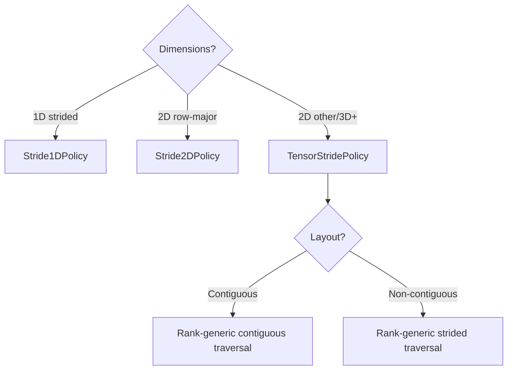

# User Manual - TensorStridePolicy

*Updated December 2025*

---

## User Manual Card

**Component:** TensorStridePolicy  
**Primary use case:** Iterating N-dimensional tensors with arbitrary memory layouts (padded, strided, transposed)  
**Integration pattern:** Construct policy with shape and strides; pass to `PolicyIterator<T, TensorStridePolicy<T>>::begin/end`  
**Key API:** `TensorStridePolicy(shape, strides)`, `currentOffset()`, `currentIndices()`, `isContiguous()`  
**Common mistakes:** Confusing shape (iteration order) with strides (memory layout); forgetting pitch != width for padded matrices; using TensorStridePolicy when Stride2DPolicy suffices  
**Performance notes:** ~2-3x overhead vs manual loops; use Stride1DPolicy/Stride2DPolicy for hot paths  
**Debug vs Release:** Debug builds include `enforce()` bounds checks; Release builds elide all checks  
**Read next:** Companion Guide - TensorStridePolicy, User Manual - PolicyIterator

---

## Scope

This document covers practical usage of TensorStridePolicy: how to configure shape and strides, how to handle common layouts (row-major, column-major, padded), how to use the lightweight Stride1DPolicy and Stride2DPolicy specializations, common patterns and recipes, and performance guidance. It assumes you want to *use* TensorStridePolicy, not understand its internal design.

## Not Covered

- Design rationale and architectural decisions (see Companion Guide - TensorStridePolicy)
- High-level positioning and alternatives comparison (see Overview - TensorStridePolicy)
- PolicyIterator base mechanics (see User Manual - PolicyIterator)

## Prerequisites

- Working knowledge of multi-dimensional arrays (shape, stride concepts)
- Familiarity with PolicyIterator usage (see User Manual - PolicyIterator)
- Understanding of row-major vs column-major memory layouts

---

## Table of Contents

1. [The N-Dimensional Traversal Problem](#the-n-dimensional-traversal-problem)
2. [A Brief History of Tensor Iteration](#a-brief-history-of-tensor-iteration)
3. [Shape and Stride: The Mental Model](#shape-and-stride-the-mental-model)
4. [Getting Started](#getting-started)
5. [Row-Major and Column-Major Layouts](#row-major-and-column-major-layouts)
6. [Padded and Pitched Layouts](#padded-and-pitched-layouts)
7. [Transposed Views Without Copying](#transposed-views-without-copying)
8. [Contiguous Detection and Optimization](#contiguous-detection-and-optimization)
9. [The Odometer Algorithm](#the-odometer-algorithm)
10. [Stride1DPolicy: Lightweight 1D Iteration](#stride1dpolicy-lightweight-1d-iteration)
11. [Stride2DPolicy: Fast 2D Row-Major Iteration](#stride2dpolicy-fast-2d-row-major-iteration)
12. [Common Patterns and Recipes](#common-patterns-and-recipes)
13. [Case Study: GPU Texture Iteration](#case-study-gpu-texture-iteration)
14. [Case Study: Submatrix Iteration](#case-study-submatrix-iteration)
15. [Case Study: 3D Volume Processing](#case-study-3d-volume-processing)
16. [Performance Guidance](#performance-guidance)
17. [Debugging and Diagnostics](#debugging-and-diagnostics)
18. [Migration from Manual Nested Loops](#migration-from-manual-nested-loops)
19. [API Reference](#api-reference)
20. [Troubleshooting Guide](#troubleshooting-guide)
21. [Summary](#summary)

---

## The N-Dimensional Traversal Problem

### When Simple Loops Break Down

Multi-dimensional arrays seem simple. A 3x4 matrix is just 12 elements in a row. Write a loop, increment a pointer, done.

```cpp
float matrix[3][4];
for (float* p = &matrix[0][0]; p < &matrix[0][0] + 12; ++p) {
    process(*p);
}
```

This works for simple cases. But scientific computing rarely stays simple.

### The Padding Problem

GPU APIs often require texture rows to be aligned to 128 or 256 bytes. A 100x100 float matrix might have rows padded to 128 floats:

```cpp
// THE TRAP: Naive code is WRONG for padded layout
float* data = cudaMallocPitch(...);  // pitch = 512 bytes = 128 floats
for (int r = 0; r < 100; ++r) {
    for (int c = 0; c < 100; ++c) {
        process(data[r * 100 + c]);  // BUG! Should be r * 128 + c
    }
}
```

The iteration logic assumes stride = width. When it's not, you get wrong results.

### The Transposition Problem

Your matrix is stored row-major, but an algorithm needs column-major traversal. You could:
1. Copy the entire matrix to a transposed buffer (expensive)
2. Write custom loop logic with swapped indices (error-prone)
3. Use an abstraction that handles the mapping (TensorStridePolicy)

### The Generalization Problem

As dimensions increase, nested loops proliferate:

```cpp
// 3D: manageable
for (int z = 0; z < nz; ++z)
    for (int y = 0; y < ny; ++y)
        for (int x = 0; x < nx; ++x)
            process(data[z*ny*nx + y*nx + x]);

// 4D: getting ugly
for (int w = 0; w < nw; ++w)
    for (int z = 0; z < nz; ++z)
        for (int y = 0; y < ny; ++y)
            for (int x = 0; x < nx; ++x)
                process(data[w*nz*ny*nx + z*ny*nx + y*nx + x]);

// 5D: error-prone
// The stride calculation in the innermost expression is complex
```

Index expressions become unreadable. Bugs hide in stride calculations.

---

## A Brief History of Tensor Iteration

### Fortran and Column-Major (1957)

Fortran, the first high-level programming language for scientific computing, stored arrays in column-major order: consecutive memory addresses hold elements from the same column, not the same row.

```fortran
! Fortran: A(i,j) stored at base + (j-1)*lda + (i-1)
DIMENSION A(M, N)
DO 10 J = 1, N
    DO 10 I = 1, M
        A(I,J) = ...  ! Efficient: consecutive memory access
10 CONTINUE
```

This made nested loops efficient when the inner loop varied the first index.

### C and Row-Major (1972)

C chose the opposite convention: row-major order. Consecutive memory addresses hold elements from the same row.

```c
/* C: a[i][j] stored at base + i*n + j */
for (int i = 0; i < m; ++i)
    for (int j = 0; j < n; ++j)
        a[i][j] = ...;  /* Efficient: consecutive memory access */
```

This decision—made decades ago—still causes confusion when interfacing C++ with Fortran libraries (BLAS, LAPACK).

### NumPy and Strided Arrays (2006)

NumPy introduced the concept of strided arrays to Python's scientific ecosystem. A NumPy array stores shape, strides, and a data pointer separately:

```python
import numpy as np
a = np.zeros((3, 4))  # shape = (3, 4), strides = (32, 8) bytes
b = a.T               # shape = (4, 3), strides = (8, 32) — no copy!
```

Transposition changes shape and strides without copying data. This insight—that iteration order and memory layout are independent—is central to TensorStridePolicy.

### TensorStridePolicy's Place

TensorStridePolicy brings NumPy's strided array concept to C++ with:
- A contiguous fast path alongside rank-generic strided traversal
- N-dimensional support without nested loops
- Integration with PolicyIterator for STL compatibility
- Debug-mode bounds checking

---

## Shape and Stride: The Mental Model

### Shape Defines What You Visit

Shape is an array of dimension sizes. A 3x4 matrix has shape `{3, 4}`. A 2x3x4 volume has shape `{2, 3, 4}`.

TensorStridePolicy iterates all positions within the shape, varying the **last dimension fastest** (odometer order):

```
Shape {3, 4} visits:
[0,0], [0,1], [0,2], [0,3],
[1,0], [1,1], [1,2], [1,3],
[2,0], [2,1], [2,2], [2,3]
```

This is row-major traversal order: complete each row before moving to the next.

### Strides Define Where Elements Live

Strides map multi-dimensional indices to memory offsets:

```
offset = sum(index[d] * stride[d])

For index [1, 2] with strides {4, 1}:
offset = 1*4 + 2*1 = 6
```

**Row-major strides** for shape `{R, C}` are `{C, 1}`:
- Moving to next row (increment first index) advances by C elements
- Moving to next column (increment second index) advances by 1 element

**Column-major strides** for shape `{R, C}` are `{1, R}`:
- Moving to next row advances by 1 element
- Moving to next column advances by R elements

### The Key Insight

**Shape controls traversal order. Strides control memory mapping. They're independent.**

You can:
- Traverse row-major storage in column-major order
- Skip rows by adjusting strides
- Access submatrices without copying
- Reverse iteration by using negative strides (with care)

---

## Getting Started

### Your First TensorStridePolicy

```cpp
#include "TensorStridePolicy.h"
#include "PolicyIterator.h"

using namespace fat_p::iterator;

int main() {
    // 3x4 matrix, row-major layout
    float data[12] = {0,1,2,3,4,5,6,7,8,9,10,11};
    
    TensorStridePolicy<float> policy({3, 4});  // Shape only = row-major strides
    
    using Iter = PolicyIterator<float, TensorStridePolicy<float>>;
    auto begin = Iter::begin(data, data + 12, policy);
    auto end = Iter::end(data, data + 12, policy);
    
    for (auto it = begin; it != end; ++it) {
        std::cout << *it << ' ';
    }
    // Output: 0 1 2 3 4 5 6 7 8 9 10 11
}
```

When you provide only shape, TensorStridePolicy computes row-major strides automatically.

### Explicit Strides

For non-standard layouts, provide strides explicitly:

```cpp
// 3x4 matrix with row pitch of 5 (one padding element per row)
float data[15] = {0,1,2,3,99, 4,5,6,7,99, 8,9,10,11,99};

TensorStridePolicy<float> policy({3, 4}, {5, 1});
// Row stride = 5, column stride = 1

// Iteration visits only non-padding elements:
// Offsets: 0,1,2,3, 5,6,7,8, 10,11,12,13
```

### The Factories

Use PolicyIterator's factory methods:

```cpp
using Iter = PolicyIterator<float, TensorStridePolicy<float>>;

// begin needs: base pointer, end pointer, policy
auto b = Iter::begin(data, data + total, policy);
auto e = Iter::end(data, data + total, policy);
```

The `total` should be the actual buffer size, not the logical element count. For padded matrices, this includes padding.

---

## Row-Major and Column-Major Layouts

### Row-Major: Last Dimension Contiguous

In row-major layout (C/C++ default), elements within a row are contiguous:

```
Matrix layout in memory:
[row0_col0, row0_col1, row0_col2, row1_col0, row1_col1, ...]

Visual:
      col0  col1  col2
row0:  0     1     2
row1:  3     4     5
row2:  6     7     8

Memory: 0 1 2 3 4 5 6 7 8 (consecutive)
```

Row-major strides for shape `{R, C}` are `{C, 1}`:

```cpp
TensorStridePolicy<float> policy({3, 4}, {4, 1});  // Explicit
TensorStridePolicy<float> policy({3, 4});           // Same (default)
```

### Column-Major: First Dimension Contiguous

In column-major layout (Fortran, MATLAB, Julia), elements within a column are contiguous:

```
Matrix layout in memory:
[col0_row0, col0_row1, col0_row2, col1_row0, col1_row1, ...]

Visual:
      col0  col1  col2
row0:  0     3     6
row1:  1     4     7
row2:  2     5     8

Memory: 0 1 2 3 4 5 6 7 8 (by column)
```

Column-major strides for shape `{R, C}` are `{1, R}`:

```cpp
TensorStridePolicy<float> policy({3, 4}, {1, 3});  // Column-major storage
```

### Interfacing with Fortran/BLAS

When calling Fortran libraries, remember:
- Fortran uses 1-based indexing (handle at call site)
- Fortran uses column-major storage (use appropriate strides)
- Fortran BLAS expects leading dimension parameter (LDA)

```cpp
// C++ matrix in row-major: shape {M, N}, strides {N, 1}
// To pass to Fortran: treat as column-major {N, M} with LDA = N
// Or: actually store column-major with strides {1, M}
```

---

## Padded and Pitched Layouts

### GPU Texture Pitch

GPUs optimize memory access when rows are aligned to specific byte boundaries. CUDA's `cudaMallocPitch` allocates with appropriate pitch:

```cpp
float* devPtr;
size_t pitch;
cudaMallocPitch(&devPtr, &pitch, width * sizeof(float), height);
// pitch is in bytes, may be larger than width * sizeof(float)
```

To iterate with TensorStridePolicy:

```cpp
size_t pitch_elements = pitch / sizeof(float);
TensorStridePolicy<float> policy({height, width}, {pitch_elements, 1});

// Total buffer size includes padding
size_t total = height * pitch_elements;

using Iter = PolicyIterator<float, TensorStridePolicy<float>>;
for (auto it = Iter::begin(data, data + total, policy);
     it != Iter::end(data, data + total, policy); ++it) {
    // Visits only logical elements, skips padding
}
```

### SIMD Alignment Padding

For AVX vectorization, you might pad rows to 32-byte alignment:

```cpp
// 1000x1000 matrix, rows padded to 1024 floats (4096 bytes)
constexpr size_t width = 1000;
constexpr size_t pitch = 1024;  // Padded width
constexpr size_t height = 1000;

float* data = static_cast<float*>(
    aligned_alloc(32, height * pitch * sizeof(float)));

TensorStridePolicy<float> policy({height, width}, {pitch, 1});
```

### When Pitch != Width

The common error is assuming pitch equals width:

```cpp
// WRONG: Assumes contiguous rows
for (int r = 0; r < height; ++r) {
    for (int c = 0; c < width; ++c) {
        data[r * width + c] = ...;  // BUG if pitch != width
    }
}

// CORRECT: Uses actual pitch
for (int r = 0; r < height; ++r) {
    for (int c = 0; c < width; ++c) {
        data[r * pitch + c] = ...;
    }
}

// BETTER: TensorStridePolicy handles it
TensorStridePolicy<float> policy({height, width}, {pitch, 1});
// Iteration is correct regardless of pitch value
```

---

## Transposed Views Without Copying

### The Problem

You have a row-major matrix. An algorithm expects column-major traversal. Copying the transpose wastes memory and time.

### The Solution: Permute Shape and Strides

To change traversal order without copying, swap dimensions in **both** shape and strides:

```cpp
// Row-major storage: 3 rows, 4 columns
// Memory: r0c0 r0c1 r0c2 r0c3 | r1c0 r1c1 r1c2 r1c3 | r2c0 r2c1 r2c2 r2c3
float data[12];

// Row-major traversal: shape {3,4}, strides {4,1}
TensorStridePolicy<float> row_major({3, 4}, {4, 1});
// Visits: [0,0]->[0,1]->[0,2]->[0,3]->[1,0]->...
// Memory order: 0,1,2,3,4,5,6,7,8,9,10,11 (sequential)

// Column-major traversal: shape {4,3}, strides {1,4}
TensorStridePolicy<float> col_major({4, 3}, {1, 4});
// Visits: [0,0]->[0,1]->[0,2]->[1,0]->[1,1]->...
// These correspond to original [0,0],[1,0],[2,0],[0,1],[1,1],...
// Memory order: 0,4,8,1,5,9,2,6,10,3,7,11 (strided)
```

**Key insight:** The "shape" in TensorStridePolicy defines traversal order, not storage. By permuting dimensions, you change how iteration proceeds without touching the data.

---

## Contiguous Detection and Optimization

### What "Contiguous" Means

A tensor is **contiguous** if visiting elements in odometer order accesses sequential memory locations. This happens when strides match row-major convention:

```
stride[d] = product of shape[d+1..N-1]
stride[N-1] = 1
```

For shape `{2, 3, 4}`:
- stride[2] = 1
- stride[1] = 4
- stride[0] = 12

Memory access: 0, 1, 2, 3, 4, 5, ..., 23 (sequential).

### Automatic Detection

TensorStridePolicy detects contiguous layouts at construction:

```cpp
TensorStridePolicy<float> policy1({3, 4}, {4, 1});
policy1.isContiguous();  // true

TensorStridePolicy<float> policy2({3, 4}, {5, 1});  // Padded
policy2.isContiguous();  // false
```

### Performance Implications

For contiguous layouts, `advance()` is O(1)—just increment the offset.

For non-contiguous layouts, `advance()` uses odometer logic—O(1) amortized but more expensive per call.

```cpp
// Contiguous: simple increment
void advance() {
    ++mOffset;
    ++mPosition;
}

// Non-contiguous: odometer update
void advance() {
    // Increment indices, handle rollover
    // Update offset incrementally
}
```

| Layout | advance() Cost | Best For |
|--------|----------------|----------|
| Contiguous | O(1), ++offset | Default choice |
| Non-contiguous | O(1) amortized | Padded, strided, transposed |

---

## The Odometer Algorithm

### How It Works

TensorStridePolicy tracks position as multi-dimensional indices. Advancing works like a car odometer:

1. Increment the last index
2. If it rolls over (≥ shape[last]), reset to 0 and increment the next-to-last
3. Repeat until no rollover

```
Shape {2, 3, 4} progression:
[0,0,0] → [0,0,1] → [0,0,2] → [0,0,3] →
[0,1,0] → [0,1,1] → [0,1,2] → [0,1,3] →
[0,2,0] → [0,2,1] → [0,2,2] → [0,2,3] →
[1,0,0] → [1,0,1] → ... → [1,2,3] → END
```

### Complexity

- **Per advance:** O(1) amortized
- **Worst case:** O(dims) when all dimensions roll over
- **Total traversal:** Exactly `product(shape)` advances

The carry propagation loop runs infrequently—only when the last dimension rolls over.

---

## Stride1DPolicy: Lightweight 1D Iteration

### When Generality Is Overkill

TensorStridePolicy handles any N-dimensional layout. But for 1D strided iteration—visiting every Nth element—the tensor machinery is unnecessary overhead.

Stride1DPolicy is a minimal alternative:

```cpp
template <typename T>
struct Stride1DPolicy {
    size_t mCount;        // Number of elements to visit
    ptrdiff_t mStride;    // Stride between elements
    size_t mPosition;     // Current position [0, mCount]
    
    void advance(T*& ptr) { ptr += mStride; ++mPosition; }
    void retreat(T*& ptr) { ptr -= mStride; --mPosition; }
};
```

No SmallVector. No odometer. Just a stride and a counter.

### Usage

```cpp
// Iterate every 4th element of a 1000-element array
Stride1DPolicy<float> policy(250, 4);  // 250 elements, stride 4

using Iter = PolicyIterator<float, Stride1DPolicy<float>>;
auto begin = Iter::begin(data, data + 1000, policy);
auto end = Iter::end(data, data + 1000, policy);

for (auto it = begin; it != end; ++it) {
    process(*it);  // Visits data[0], data[4], data[8], ...
}
```

### Performance

Stride1DPolicy expresses the same logical traversal as a manual stride loop:

```cpp
// Manual
for (float* p = data; p < data + 1000; p += 4) {
    process(*p);
}

// Stride1DPolicy
// Expresses the same traversal through the policy API
```

---

## Stride2DPolicy: Fast 2D Row-Major Iteration

### The Common Case Optimized

Most tensor iteration is 2D row-major. Stride2DPolicy handles this with fixed 2D state and end-clamped traversal.

```cpp
template <typename T>
struct Stride2DPolicy {
    size_t mRows, mCols;
    ptrdiff_t mRowStride, mColStride;
    size_t mRow, mCol;
    
    void advance(T*& ptr) {
        ++mCol;
        ptr += mColStride;
        
        if (mCol >= mCols) {
            mCol = 0;
            ++mRow;
            ptr += mRowStride - mCols * mColStride;
        }
    }
};
```

### Usage

```cpp
// 100x200 matrix, contiguous row-major
Stride2DPolicy<float> policy(100, 200);

// 100x200 matrix, pitch = 256 (padded rows)
Stride2DPolicy<float> policy(100, 200, 256, 1);

using Iter = PolicyIterator<float, Stride2DPolicy<float>>;
for (auto it = Iter::begin(data, data + 100*256, policy);
     it != Iter::end(data, data + 100*256, policy); ++it) {
    process(*it);
}
```

### Performance Comparison

| Implementation | Traversal model | Performance guidance |
|----------------|-----------------|----------------------|
| Manual nested loop | Fixed 2D | Baseline for the target workload |
| Stride2DPolicy | Fixed 2D with a real allocation end | Benchmark against the manual baseline |
| TensorStridePolicy | Rank-generic odometer | Prefer when generality is required; benchmark hot paths |

Stride2DPolicy is the specialized choice for fixed 2D iteration; measure it when the loop is performance-critical.

---

## Common Patterns and Recipes

### Full Matrix Iteration

```cpp
float matrix[rows][cols];
TensorStridePolicy<float> policy({rows, cols});

using Iter = PolicyIterator<float, TensorStridePolicy<float>>;
for (auto it = Iter::begin(&matrix[0][0], &matrix[0][0] + rows*cols, policy);
     it != Iter::end(&matrix[0][0], &matrix[0][0] + rows*cols, policy); ++it) {
    *it = 0.0f;
}
```

### Column Extraction

Iterate a single column of a row-major matrix:

```cpp
// Column k of an M×N matrix
float* col_start = &matrix[0][k];
Stride1DPolicy<float> policy(M, N);  // M elements, stride N

using Iter = PolicyIterator<float, Stride1DPolicy<float>>;
for (auto it = Iter::begin(col_start, col_start + M*N, policy);
     it != Iter::end(col_start, col_start + M*N, policy); ++it) {
    process(*it);  // matrix[0][k], matrix[1][k], matrix[2][k], ...
}
```

### Submatrix View

Iterate rows [r0, r1), columns [c0, c1) without copying:

```cpp
// Original: M×N matrix, row-major
// Submatrix: rows [r0, r1), columns [c0, c1)
size_t sub_rows = r1 - r0;
size_t sub_cols = c1 - c0;
float* sub_start = &matrix[r0][c0];

TensorStridePolicy<float> policy({sub_rows, sub_cols}, {N, 1});
// Uses original matrix's row stride (N), not submatrix width

size_t buffer_span = (sub_rows - 1) * N + sub_cols;
for (auto it = Iter::begin(sub_start, sub_start + buffer_span, policy); ...) {
    // Iterates submatrix
}
```

### 3D Volume Slicing

Iterate a 2D slice at fixed z:

```cpp
// 3D volume: D×H×W
float volume[D][H][W];

// Slice at z = 5
float* slice_start = &volume[5][0][0];
Stride2DPolicy<float> policy(H, W);  // 2D slice

for (auto it = Iter::begin(slice_start, slice_start + H*W, policy); ...) {
    // Iterates 2D slice
}
```

---

## Case Study: GPU Texture Iteration

### Problem

CUDA textures allocated with `cudaMallocPitch` have row padding. Naive iteration accesses padding bytes.

### Solution

```cpp
float* devPtr;
size_t pitch;
cudaMallocPitch(&devPtr, &pitch, width * sizeof(float), height);

// Copy to host for processing
std::vector<float> host(height * pitch / sizeof(float));
cudaMemcpy2D(host.data(), pitch, devPtr, pitch, 
             width * sizeof(float), height, cudaMemcpyDeviceToHost);

// Iterate logical elements only
size_t pitch_elements = pitch / sizeof(float);
TensorStridePolicy<float> policy({height, width}, {pitch_elements, 1});

using Iter = PolicyIterator<float, TensorStridePolicy<float>>;
for (auto it = Iter::begin(host.data(), host.data() + height * pitch_elements, policy);
     it != Iter::end(host.data(), host.data() + height * pitch_elements, policy); ++it) {
    *it = process(*it);  // Only logical elements
}
```

---

## Case Study: Submatrix Iteration

### Problem

You have a large matrix but need to process only a rectangular subregion.

### Traditional Approach

```cpp
for (int r = r0; r < r1; ++r) {
    for (int c = c0; c < c1; ++c) {
        process(matrix[r][c]);
    }
}
```

Error-prone when indices change. No abstraction.

### TensorStridePolicy Approach

```cpp
float* sub_base = &matrix[r0][c0];
size_t sub_rows = r1 - r0;
size_t sub_cols = c1 - c0;
size_t parent_cols = /* full matrix column count */;

TensorStridePolicy<float> policy({sub_rows, sub_cols}, {parent_cols, 1});

for (auto it = begin(sub_base, policy); it != end(sub_base, policy); ++it) {
    process(*it);
}
```

The strides encode the parent matrix structure. Changing the subregion means changing `sub_base` and shape—strides stay the same.

---

## Case Study: 3D Volume Processing

### Problem

Process a 3D medical image volume with arbitrary slice spacing.

### Solution

```cpp
// Volume: 512×512×256 voxels
// Physical spacing: 0.5mm × 0.5mm × 1.0mm (anisotropic)
float volume[256][512][512];

// Iterate all voxels
TensorStridePolicy<float> policy({256, 512, 512});

size_t total = 256 * 512 * 512;
for (auto it = Iter::begin(&volume[0][0][0], &volume[0][0][0] + total, policy);
     it != Iter::end(&volume[0][0][0], &volume[0][0][0] + total, policy); ++it) {
    
    auto indices = it.policy().currentIndices();
    size_t z = indices[0], y = indices[1], x = indices[2];
    
    // Physical coordinates
    float px = x * 0.5f;
    float py = y * 0.5f;
    float pz = z * 1.0f;
    
    process_voxel(*it, px, py, pz);
}
```

---

## Performance Guidance

### Choosing the Right Policy



### Performance Hierarchy

| Policy | Traversal complexity | Use Case |
|--------|----------------------|----------|
| Stride1DPolicy | Fixed 1D | 1D strided access |
| Stride2DPolicy | Fixed 2D | 2D row-major, pitched |
| TensorStridePolicy (contiguous) | Rank-generic | General N-D, row-major |
| TensorStridePolicy (strided) | Rank-generic | Padded, transposed, complex |

### Memory Layout Matters

Access pattern affects cache performance:

| Pattern | General cache behavior |
|---------|------------------------|
| Sequential (stride 1) | Usually the most cache-friendly |
| Small stride (2-4) | Uses only part of each cache line |
| Large stride (>16) | Often incurs more cache misses |
| Random | Usually the least cache-friendly |

When possible, arrange iteration to maximize sequential access.

---

## Debugging and Diagnostics

### Position Queries

```cpp
auto it = Iter::begin(data, end, policy);

// Current linear position
size_t pos = it.policy().position();  // 0, 1, 2, ...

// Total element count
size_t total = it.policy().total();

// Multi-dimensional indices
auto indices = it.policy().currentIndices();
// indices[0] = first dim index, etc.

// Memory offset from base
ptrdiff_t offset = it.policy().currentOffset();

// State checks
bool at_end = it.policy().atEnd();
bool contiguous = it.policy().isContiguous();
```

### Debug Checks

In debug builds, TensorStridePolicy validates:
- Shape must not be empty
- All dimensions must be > 0
- Shape and strides must have same length

PolicyIterator adds:
- Cannot dereference end iterator
- Cannot advance past end
- Cannot retreat before begin

---

## Migration from Manual Nested Loops

### Before

```cpp
for (int z = 0; z < nz; ++z) {
    for (int y = 0; y < ny; ++y) {
        for (int x = 0; x < nx; ++x) {
            process(data[z*ny*nx + y*nx + x]);
        }
    }
}
```

### After

```cpp
TensorStridePolicy<float> policy({nz, ny, nx});

using Iter = PolicyIterator<float, TensorStridePolicy<float>>;
for (auto it = Iter::begin(data, data + nz*ny*nx, policy);
     it != Iter::end(data, data + nz*ny*nx, policy); ++it) {
    process(*it);
}
```

### Benefits

- No manual index arithmetic
- Shape changes don't require loop restructuring
- Debug bounds checking
- Consistent with other iteration patterns

---

## API Reference

### TensorStridePolicy<T, MaxInlineDims>

```cpp
template <typename T, size_t MaxInlineDims = 8>
struct TensorStridePolicy;
```

**Constructors:**

```cpp
// Shape + explicit strides
TensorStridePolicy(std::initializer_list<size_t> shape,
                   std::initializer_list<ptrdiff_t> strides);

// Shape only (computes row-major strides)
explicit TensorStridePolicy(std::initializer_list<size_t> shape);
```

**Position methods:**

```cpp
ptrdiff_t currentOffset() const;           // Memory offset from base
SmallVector<size_t> currentIndices() const; // Multi-dimensional indices
bool isContiguous() const;                  // True if row-major contiguous
```

**State queries:**

```cpp
bool atEnd() const;
bool atBegin() const;
size_t position() const;     // Linear position [0, total)
size_t total() const;        // Total elements
size_t dims() const;         // Number of dimensions
size_t shape(size_t d) const;    // Size of dimension d
ptrdiff_t stride(size_t d) const; // Stride of dimension d
```

### Stride1DPolicy<T>

```cpp
explicit Stride1DPolicy(size_t count, ptrdiff_t stride = 1);
```

### Stride2DPolicy<T>

```cpp
// Full parameters
Stride2DPolicy(size_t rows, size_t cols,
               ptrdiff_t rowStride, ptrdiff_t colStride);

// Convenience: contiguous row-major
Stride2DPolicy(size_t rows, size_t cols);
```

---

## Troubleshooting Guide

### "Dimensions must be > 0"

**Cause:** Shape contains a zero dimension.
**Solution:** Ensure all shape values are positive.

### Wrong elements visited with padding

**Cause:** Using logical width as stride instead of pitch.
**Solution:** Use actual pitch for row stride: `{pitch, 1}` not `{width, 1}`.

### Iterator doesn't reach all elements

**Cause:** Buffer size doesn't match shape × strides.
**Solution:** Ensure `end - begin` equals `policy.total()` for contiguous, or spans the full strided range for non-contiguous.

### Performance worse than expected

**Cause:** Using TensorStridePolicy for simple 2D iteration.
**Solution:** Use Stride2DPolicy for 2D row-major data.

---

## Summary

TensorStridePolicy provides N-dimensional tensor iteration with:

1. **Shape/stride separation** for flexible layouts
2. **Automatic contiguous detection** for optimization
3. **Three-tier design** (Tensor/2D/1D) for performance
4. **Debug bounds checking** via `enforce()`

For hot paths, prefer Stride1DPolicy or Stride2DPolicy. For complex layouts and correctness-critical code, TensorStridePolicy handles any case.

---

## Glossary

- **Shape:** Array of dimension sizes defining what positions to visit.
- **Stride:** Array of offsets defining memory spacing between elements.
- **Row-major:** Layout where last dimension varies fastest in memory.
- **Column-major:** Layout where first dimension varies fastest in memory.
- **Pitch:** Row stride for padded/aligned allocations.
- **Odometer order:** Iteration where last dimension cycles fastest.
- **Contiguous:** Layout where sequential iteration accesses sequential memory.

---

*TensorStridePolicy.h: ~700 lines — See Companion Guide for design rationale*
