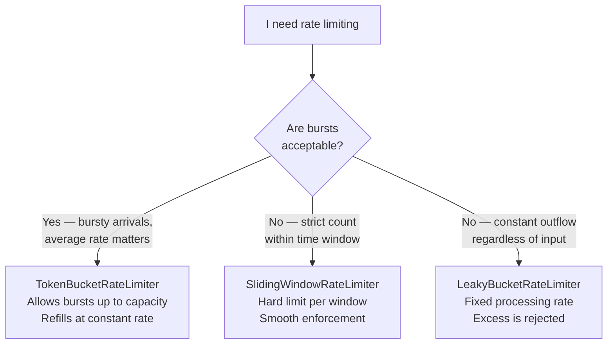

# Overview - RateLimiter

*Fat-P Library — February 2026*

---

## Executive Summary

RateLimiter provides three classic rate-limiting algorithms—token bucket, sliding window, and leaky bucket—for controlling the rate of operations in concurrent C++ systems. All three are mutex-protected and thread-safe. `TokenBucketRateLimiter` allows bursts up to a configured capacity and then throttles to a steady refill rate—the right choice when occasional bursts are acceptable. `SlidingWindowRateLimiter` enforces a hard count limit within a rolling time window—the right choice when smoothness matters more than burst tolerance. `LeakyBucketRateLimiter` processes requests at a constant rate regardless of arrival pattern—the right choice for constant-rate outflow. Non-blocking `try_acquire()` costs 10–20 ns on the fast path; blocking `acquire()` sleeps until a token is available or a timeout expires. Zero heap allocation in the hot path (token bucket and leaky bucket); O(window_size) memory for sliding window.

---

## Overview Card

**Component:** RateLimiter
**Problem solved:** Controlling the rate of operations (API calls, disk writes, network sends, task submissions) to prevent overload
**When to use:** API throttling; disk I/O rate control; network send pacing; producer rate limiting in producer-consumer pipelines; any case where "no more than N per second" is a requirement
**When NOT to use:** CPU scheduling (use ThreadPool priorities); network-level rate shaping (use OS traffic control); distributed rate limiting across multiple processes (requires external coordination)
**Key guarantee:** Thread-safe; `try_acquire()` never blocks; `acquire()` respects timeout
**std equivalent:** None
**Boost equivalent:** None (Boost.Asio has rate concepts but no standalone limiter)
**Other alternatives:** Google's `absl::rate_limiter` (internal), custom `std::chrono` + atomic implementations
**Read next:** User Manual - RateLimiter

---

## The Problem Domain

### The Three Algorithms

Rate limiting is a solved problem with multiple well-understood algorithms. The choice depends on the traffic pattern:



**Token bucket** is the most common algorithm. Imagine a bucket that holds tokens. Tokens are added at a constant rate (the refill rate). Each operation consumes one token. If the bucket is empty, the operation is rejected (or waits). The bucket's capacity determines the maximum burst size—if the bucket has been accumulating tokens during an idle period, a burst of that many operations can proceed immediately.

**Sliding window** maintains a list of recent timestamps. An operation is permitted if fewer than N operations occurred in the last W seconds. This gives a hard guarantee on the count within any window, at the cost of O(N) memory for the timestamp list.

**Leaky bucket** is the inverse of token bucket: requests enter the bucket, and the bucket "leaks" at a constant rate. If the bucket is full, new requests are rejected. This enforces a constant outflow rate regardless of how bursty the input is.

---

## Feature Inventory

### TokenBucketRateLimiter

```cpp
// 100 requests/sec, burst of 10
fat_p::TokenBucketRateLimiter limiter(100.0, 10.0);

if (limiter.try_acquire())      // Non-blocking
    process_request();

if (limiter.acquire(1, std::chrono::seconds(1)))  // Blocking with timeout
    process_request();
```

### SlidingWindowRateLimiter

```cpp
// 50 requests per 1-second window
fat_p::SlidingWindowRateLimiter limiter(50, std::chrono::seconds(1));

if (limiter.try_acquire())
    process_request();
```

### LeakyBucketRateLimiter

```cpp
// Process at 200/sec, queue up to 20
fat_p::LeakyBucketRateLimiter limiter(200.0, 20.0);

if (limiter.try_acquire())
    process_request();
```

---

## Performance Characteristics

| Operation | TokenBucket | SlidingWindow | LeakyBucket |
|-----------|-------------|---------------|-------------|
| `try_acquire()` fast path | 10–20 ns | 20–50 ns | 10–20 ns |
| `try_acquire()` contended | 50–200 ns | 100–500 ns | 50–200 ns |
| Memory | O(1) | O(window_count) | O(1) |
| Clock calls | 1 per acquire | 1 per acquire | 1 per acquire |

All three use `std::chrono::steady_clock` for monotonic time. All are mutex-protected for thread safety.

---

## Final Assessment

**Permanence.** Rate limiting is a fundamental systems concept. No C++ standard rate limiter is proposed or planned.

**Algorithm choice matters.** Token bucket for bursty tolerance, sliding window for strict counts, leaky bucket for constant outflow. The three cover the standard taxonomy. Pick the one that matches your constraint.

---

*RateLimiter.h — Fat-P Library*
