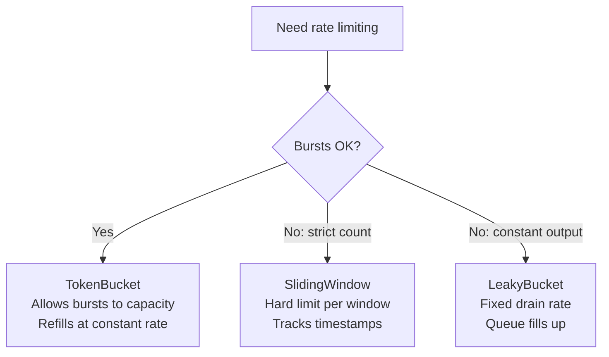

# User Manual - RateLimiter

*February 2026*

---

**Scope:** Complete usage guide for Fat-P's three rate-limiting algorithms: `TokenBucketRateLimiter`, `SlidingWindowRateLimiter`, and `LeakyBucketRateLimiter`. Includes algorithm internals, parameter tuning, blocking vs non-blocking acquisition, use case walkthroughs, advanced patterns, and performance analysis.

**Not covered:** Distributed rate limiting across processes; network-level traffic shaping; adaptive rate adjustment.

**Prerequisites:** C++20; understanding of `std::chrono`; basic understanding of why uncontrolled request rates cause overload.

---

## User Manual Card

**Component:** RateLimiter
**Primary use case:** Limit the rate of operations to prevent overload
**Integration pattern:** Construct with rate + capacity -> `try_acquire()` or `acquire()` before each operation
**Key API:** `try_acquire()`, `acquire()`, `available_tokens()`, `reset()`
**std equivalent:** None
**Common mistakes:** Capacity equal to rate (no burst); SlidingWindow with high limits (memory grows); forgetting `acquire()` blocks the thread
**Performance notes:** `try_acquire()` 10-20 ns uncontended; all algorithms use `steady_clock`

---

## Table of Contents

1. Rate Limiting Fundamentals
2. TokenBucketRateLimiter: Algorithm Internals
3. SlidingWindowRateLimiter: Algorithm Internals
4. LeakyBucketRateLimiter: Algorithm Internals
5. Choosing the Right Algorithm
6. Getting Started
7. Blocking vs Non-Blocking Acquisition
8. Multi-Token Acquisition
9. Thread Safety
10. Use Case: API Gateway Throttling
11. Use Case: Disk I/O Pacing
12. Use Case: Producer-Consumer Rate Matching
13. Use Case: Per-User Rate Limiting
14. Best Practices
15. Advanced Usage
16. Parameter Tuning
17. Performance Characteristics
18. Troubleshooting
19. Known Limitations
20. API Reference
21. FAQ

---

## Rate Limiting Fundamentals

Every rate limiter answers: "should this operation proceed right now?" The answer depends on recent operation history and the configured rate. The three algorithms differ in how they track history and define "allowed."



---

## TokenBucketRateLimiter: Algorithm Internals

The token bucket is the most common rate-limiting algorithm. Tokens accumulate at a constant rate up to a maximum capacity. Each operation consumes tokens. If insufficient tokens are available, the operation is denied.

### The Refill Calculation

Tokens are refilled lazily---not by a background thread, but on each `try_acquire()` call. The refill logic is:

```
elapsed = now - last_refill_time
new_tokens = elapsed_seconds * rate_per_second
tokens = min(capacity, tokens + new_tokens)
last_refill_time = now
```

This lazy approach means no background thread, no timer, and no wasted CPU when the limiter is idle. The cost is one clock read and one multiplication per `try_acquire()` call.

### Burst Behavior

If the limiter has been idle for T seconds, it accumulates `min(capacity, T * rate)` tokens. A burst of up to `capacity` operations can then proceed immediately. After the burst, subsequent operations are spaced at `1/rate` seconds.

This is the defining characteristic of token bucket: it allows bursts up to capacity while enforcing an average rate. If your downstream service can handle short bursts but not sustained overload, token bucket is the right choice.

### Construction

```cpp
fat_p::TokenBucketRateLimiter limiter(100.0, 10.0);
// 100 tokens/sec, burst capacity 10
// Starts with 10 tokens (full)
```

---

## SlidingWindowRateLimiter: Algorithm Internals

The sliding window maintains a list of timestamps for recent operations. On each `try_acquire()`:

1. Remove all timestamps older than `now - window_duration`.
2. If remaining count < `max_requests`, record current timestamp and return true.
3. Otherwise return false.

### Memory Implications

The timestamp list grows with the number of permitted operations in the current window. At 10,000 requests/second with a 1-second window, that is 10,000 timestamps (80 KB). At 1,000,000/sec, 8 MB. For very high rates, token bucket (O(1) memory) is more appropriate.

### Strictness

Sliding window provides a hard guarantee: no more than N operations in any W-second window. Token bucket allows the average rate to be maintained while short bursts exceed the per-second rate. If "never more than 50 requests in any 1-second window" is a hard constraint, sliding window enforces it.

```cpp
fat_p::SlidingWindowRateLimiter limiter(50, std::chrono::seconds(1));
```

---

## LeakyBucketRateLimiter: Algorithm Internals

The leaky bucket models a bucket with a hole. Requests enter the bucket; it drains at a constant rate. If the bucket is full, new requests are rejected.

The difference from token bucket: token bucket accumulates tokens during idle periods, allowing bursts. Leaky bucket drains at a constant rate regardless of input pattern. If 100 requests arrive simultaneously, token bucket lets them all through (if capacity permits). Leaky bucket processes them at the drain rate, rejecting excess.

```cpp
fat_p::LeakyBucketRateLimiter limiter(200.0, 20.0);
// 200/sec drain rate, queue capacity 20
```

---

## Choosing the Right Algorithm

| Requirement | Algorithm | Why |
|-------------|-----------|-----|
| Average 100/sec, bursts OK | Token bucket | Accumulates during idle |
| No more than 50 per 1-second window | Sliding window | Hard count per window |
| Exactly 200/sec output, smooth | Leaky bucket | Constant drain |
| Lowest memory | Token bucket or leaky bucket | O(1) |
| Simplest mental model | Token bucket | Most widely documented |

For most API throttling, token bucket is the default. It is the industry standard (AWS, Google Cloud, Stripe all use variants).

---

## Getting Started

```cpp
#include "RateLimiter.h"

fat_p::TokenBucketRateLimiter limiter(100.0, 10.0);

for (const auto& request : incoming_requests)
{
    if (limiter.try_acquire())
        process(request);
    else
        reject_with_429(request);
}
```

---

## Blocking vs Non-Blocking Acquisition

### try_acquire() -- Non-Blocking

Returns immediately with true (acquired) or false (rate limited):

```cpp
while (has_work())
{
    if (limiter.try_acquire())
        do_work();
    else
        std::this_thread::yield();
}
```

### acquire() -- Blocking with Timeout

Blocks until a token is available or timeout expires. Internally calls `try_acquire()` in a loop with short sleeps:

```cpp
if (limiter.acquire(1, std::chrono::seconds(5)))
    do_work();
else
    handle_timeout();
```

The sleep between retries is short (order of the token refill interval). `acquire()` ties up a thread while waiting. In high-concurrency systems, prefer `try_acquire()` with explicit retry logic.

---

## Multi-Token Acquisition

`try_acquire(count)` and `acquire(count, timeout)` acquire multiple tokens atomically:

```cpp
if (limiter.try_acquire(10))
{
    for (int i = 0; i < 10; ++i)
        send_request(i);
}
```

Either all tokens are acquired or none. No partial acquisition.

---

## Thread Safety

All three algorithms are fully thread-safe. Every public method acquires a `std::mutex`. Multiple threads can call `try_acquire()` concurrently.

The mutex is the contention point at extreme rates (millions/sec from dozens of threads). For such workloads, shard: create one limiter per thread group with a proportional rate share.

---

## Use Case: API Gateway Throttling

An API gateway limits each client to 100 requests/second with a burst of 20:

```cpp
std::unordered_map<ClientId, fat_p::TokenBucketRateLimiter> limiters;

void handle_request(const Request& req)
{
    auto& limiter = limiters.try_emplace(
        req.client_id, 100.0, 20.0).first->second;

    if (limiter.try_acquire())
        forward_to_backend(req);
    else
        respond_429(req);
}
```

Each client gets its own limiter. The per-client map uses `try_emplace` to lazily create limiters on first request.

## Use Case: Disk I/O Pacing

Limit write rate to avoid saturating an SSD's write bandwidth:

```cpp
// 50 MB/sec write rate, 10 MB burst
fat_p::TokenBucketRateLimiter io_limiter(50'000'000.0, 10'000'000.0);

void write_chunk(const std::vector<uint8_t>& data)
{
    io_limiter.acquire(data.size(), std::chrono::seconds(30));
    file.write(data.data(), data.size());
}
```

Each byte consumes one token. The limiter paces writes to 50 MB/sec average.

## Use Case: Producer-Consumer Rate Matching

A fast producer feeds a slow consumer. The rate limiter prevents the queue from growing without bound:

```cpp
fat_p::TokenBucketRateLimiter producer_limiter(1000.0, 100.0);  // Match consumer rate

void producer(WorkQueue& queue)
{
    while (has_data())
    {
        producer_limiter.acquire(1, std::chrono::seconds(10));
        queue.push(next_item());
    }
}
```

## Use Case: Per-User Rate Limiting

Different user tiers get different rates:

```cpp
struct UserLimits
{
    double rate;
    double burst;
};

std::unordered_map<UserId, fat_p::TokenBucketRateLimiter> user_limiters;

void handle(const Request& req)
{
    auto limits = get_tier_limits(req.user);
    auto& limiter = user_limiters.try_emplace(
        req.user_id, limits.rate, limits.burst).first->second;

    if (!limiter.try_acquire())
    {
        respond_429(req);
        return;
    }
    process(req);
}
```

---

## Best Practices

### Set Capacity to Expected Burst Size

Capacity should match the burst your downstream can absorb. Setting capacity = rate means 1 second of burst tolerance. Setting capacity = 0.1 * rate means 100 ms of burst tolerance. Start with 5-10% of the per-second rate.

### Prefer try_acquire() in Event Loops

`acquire()` blocks the calling thread. In event-driven or async architectures, use `try_acquire()` and handle rejection explicitly (retry queue, backpressure signal, 429 response).

### Use Token Bucket Unless You Have a Specific Reason Not To

Token bucket is the simplest, lowest-memory, and most widely understood algorithm. Switch to sliding window only for hard per-window count guarantees. Switch to leaky bucket only for constant-rate output requirements.

### Monitor Rejection Rate

A high rejection rate means either the rate is set too low or the traffic exceeds what the downstream can handle. Log rejections and use them to tune parameters.

### Shard for High Contention

If `try_acquire()` contention is measurable (>1% of calls take >100 ns), create per-thread or per-core limiters with proportional rates.

---

## Advanced Usage

### Hierarchical Rate Limiting

Global rate + per-user rate:

```cpp
fat_p::TokenBucketRateLimiter global_limiter(10000.0, 1000.0);
std::unordered_map<UserId, fat_p::TokenBucketRateLimiter> user_limiters;

bool allow(const Request& req)
{
    auto& user_limiter = user_limiters.try_emplace(
        req.user_id, 100.0, 20.0).first->second;

    // Both must allow
    return user_limiter.try_acquire() && global_limiter.try_acquire();
}
```

### Rate Limiting with ThreadPool

```cpp
fat_p::TokenBucketRateLimiter limiter(100.0, 10.0);
fat_p::ThreadPool pool(4);

for (const auto& task : tasks)
{
    limiter.acquire(1, std::chrono::seconds(10));
    pool.submit([&, task]() { process(task); });
}
```

### Burst Budgeting

Pre-drain tokens to prevent startup burst:

```cpp
fat_p::TokenBucketRateLimiter limiter(100.0, 50.0);
limiter.try_acquire(50);  // Drain the initial capacity
// Now the limiter starts "empty," preventing a startup burst
```

---

## Parameter Tuning

### Token Bucket

| Parameter | Increase effect | Decrease effect |
|-----------|----------------|-----------------|
| `rate_per_second` | Higher sustained throughput | Lower sustained throughput |
| `capacity` | Larger bursts | Smaller bursts, smoother |

### Sliding Window

| Parameter | Effect |
|-----------|--------|
| `max_requests` | Hard limit per window |
| `window_duration` | Longer = smoother; shorter = more responsive |

### Leaky Bucket

| Parameter | Effect |
|-----------|--------|
| `rate_per_second` | Constant outflow rate |
| `capacity` | Queue depth before rejection |

---

## Performance Characteristics

| Operation | TokenBucket | SlidingWindow | LeakyBucket |
|-----------|-------------|---------------|-------------|
| `try_acquire()` uncontended | 10-20 ns | 20-50 ns | 10-20 ns |
| `try_acquire()` contended | 50-200 ns | 100-500 ns | 50-200 ns |
| Memory | O(1) | O(window_count) | O(1) |
| Clock reads per acquire | 1 | 1 | 1 |

All use `std::chrono::steady_clock` (monotonic, no NTP jumps).

---

## Troubleshooting

### All requests rejected despite low rate

Capacity is too low. If capacity = 1 and rate = 100/sec, the bucket refills 1 token every 10 ms. A burst of 2 within 10 ms sees the second rejected. Increase capacity.

### acquire() blocks much longer than expected

Sleep granularity: OS scheduler minimum is 1-15 ms (Linux) or ~15 ms (Windows). If the refill interval is shorter than the sleep granularity, `acquire()` overshoots.

### SlidingWindowRateLimiter excessive memory

Timestamp list grows with permitted operations. At 100K+/sec, memory is significant. Switch to token bucket for O(1) memory.

### Rate is not exact

Token refill is lazy (computed on `try_acquire()`). If `try_acquire()` is called infrequently, tokens accumulate between calls. The average rate is correct over time, but instantaneous rate may vary.

### Clock skew between limiters

All limiters use `steady_clock`, which is monotonic. No NTP jump issues. But if comparing timestamps between limiters on different machines, steady_clock is per-machine.

---

## Known Limitations

**No distributed rate limiting.** Single-process only.

**No adaptive rate.** Rate is set at construction. No built-in health-based adjustment.

**Mutex contention at extreme rates.** Shard for millions/sec from dozens of threads.

**Sleep granularity.** `acquire()` uses `sleep_for()`, subject to OS scheduling.

**No rate change at runtime.** Destroy and recreate to change rate (resets tokens).

---

## API Reference

### TokenBucketRateLimiter

| Method | Description |
|--------|-------------|
| `TokenBucketRateLimiter(rate, capacity)` | Construct; starts at capacity |
| `try_acquire(count = 1)` | Non-blocking; returns bool |
| `acquire(count, timeout)` | Blocking; returns bool |
| `available_tokens()` | Current tokens (approximate) |
| `reset()` | Refill to capacity |

### SlidingWindowRateLimiter

| Method | Description |
|--------|-------------|
| `SlidingWindowRateLimiter(max, window)` | Construct |
| `try_acquire()` | Non-blocking |
| `acquire(timeout)` | Blocking |
| `current_count()` | Requests in window |
| `reset()` | Clear timestamps |

### LeakyBucketRateLimiter

| Method | Description |
|--------|-------------|
| `LeakyBucketRateLimiter(rate, capacity)` | Construct |
| `try_acquire(count = 1)` | Non-blocking |
| `acquire(count, timeout)` | Blocking |
| `current_level()` | Bucket fill |
| `reset()` | Empty bucket |

---

## FAQ

**Q: Which algorithm for API rate limiting?**

Token bucket. Industry standard. Handles bursty traffic naturally.

**Q: Can I change the rate at runtime?**

Not directly. Destroy and recreate. Consider maintaining two limiters for smooth transitions.

**Q: Sub-millisecond precision?**

`steady_clock` provides nanosecond resolution. Practical precision is ~1 us, limited by mutex overhead.

**Q: Token bucket vs leaky bucket?**

Token bucket allows bursts, leaky bucket enforces constant output. Most real-world traffic is bursty, so token bucket is the default.

---

*RateLimiter.h --- Fat-P Library*
