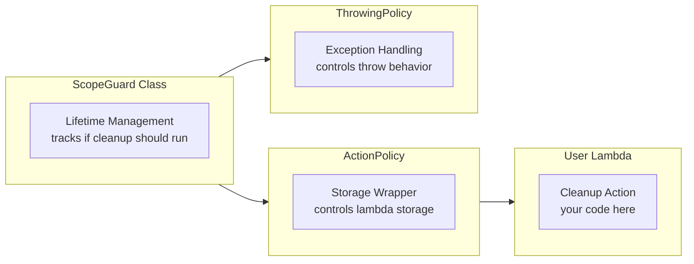
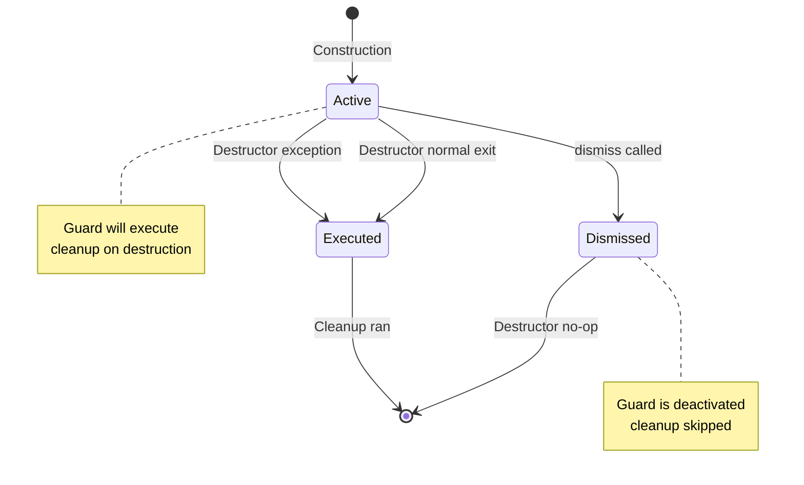

# User Manual - ScopeGuard

**Scope:** Complete usage guide for `fat_p::ScopeGuard`: core RAII guard, factory functions (`makeScopeGuard`, `makeScopeGuardOnFail`, `makeScopeGuardOnSuccess`), macros (`FATP_SCOPE_EXIT`, `FATP_SCOPE_FAIL`, `FATP_SCOPE_SUCCESS`), exception policies (Nothrow, Terminate, LogAndSwallow, Rethrow), transaction patterns, Expected integration, and nested guard behavior.

**Not covered:**
- ValueGuard (save-modify-restore pattern; see ValueGuard User Manual)
- General RAII wrapper design
- Expected monadic error handling (see Expected User Manual)

**Prerequisites:** C++20; understanding of RAII and destructor-based cleanup; awareness that cleanup actions may throw and this interacts with stack unwinding

---

## User Manual Card

**Component:** ScopeGuard
**Primary use case:** Execute cleanup or rollback actions automatically when a scope exits, with configurable exception handling policy
**Integration pattern:** Place `auto guard = makeScopeGuard([&]{ cleanup(); });` at the point of acquisition; use `FATP_SCOPE_FAIL` for rollback-on-exception patterns; call `guard.dismiss()` on successful commit
**Key API:** `ScopeGuard<F, Policy>`, `makeScopeGuard()`, `makeScopeGuardOnFail()`, `makeScopeGuardOnSuccess()`, `FATP_SCOPE_EXIT`, `FATP_SCOPE_FAIL`, `FATP_SCOPE_SUCCESS`, `.dismiss()`
**std equivalent:** std::experimental::scope_exit (TS (Library Fundamentals v3))
**Common mistakes:** Forgetting to dismiss guards on success in transaction patterns; putting throwing code in Nothrow-policy guards; capturing references to locals that go out of scope before the guard fires
**Performance notes:** Zero overhead for the guard itself (one bool + function pointer). Policy dispatch is compile-time. See `components/ScopeGuard/results/` for current data

---
## Table of Contents

1. [What is ScopeGuard?](#what-is-scopeguard)
   - [The Resource Management Problem](#the-resource-management-problem)
   - [The C++ Landscape](#the-c-landscape)
   - [Where ScopeGuard Fits](#where-scopeguard-fits)
2. [Core Architecture](#core-architecture)
   - [Design Principles](#design-principles)
   - [Policy-Based Exception Handling](#policy-based-exception-handling)
   - [Exception-Aware Guards](#exception-aware-guards)
3. [Getting Started](#getting-started)
   - [Prerequisites](#prerequisites)
   - [Integration](#integration)
   - [First Program](#first-program)
4. [Core API](#core-api)
   - [ScopeGuard Class](#scopeguard-class)
   - [Factory Functions](#factory-functions)
   - [Macros](#macros)
5. [Exception Policies](#exception-policies)
   - [ScopeGuardNothrowPolicy](#scopeguardnothrowpolicy)
   - [ScopeGuardTerminatePolicy](#scopeguardterminatepolicy)
   - [ScopeGuardLogAndSwallowPolicy](#scopeguardlogandswallowpolicy)
   - [ScopeGuardRethrowPolicy](#scopeguardrethrowpolicy)
6. [Exception-Aware Guards](#exception-aware-guards-1)
   - [FATP_SCOPE_FAIL](#fatp_scope_fail)
   - [FATP_SCOPE_SUCCESS](#fatp_scope_success)
   - [Transaction Pattern](#transaction-pattern)
7. [Advanced Usage](#advanced-usage)
   - [Custom Action Policies](#custom-action-policies)
   - [Integration with Expected](#integration-with-expected)
   - [Nested Guards](#nested-guards)
8. [Performance Characteristics](#performance-characteristics)
   - [Benchmark Methodology](#benchmark-methodology)
   - [Benchmark Results](#benchmark-results)
   - [Optimization Guidelines](#optimization-guidelines)
9. [Comparison with Other Libraries](#comparison-with-other-libraries)
   - [Feature Comparison](#feature-comparison)
   - [Code Comparison](#code-comparison)
10. [Migration Guide](#migration-guide)
    - [From Raw RAII](#from-raw-raii)
    - [From Boost.ScopeExit](#from-boostscopeexit)
11. [Best Practices](#best-practices)
12. [Troubleshooting](#troubleshooting)
    - [Compilation Errors](#compilation-errors)
    - [Runtime Issues](#runtime-issues)
13. [Summary](#summary)

---

## What is ScopeGuard?

### The Resource Management Problem

C++ RAII is powerful but writing custom RAII wrappers for every resource is tedious and error-prone:

```cpp
// The problem: manual cleanup is fragile
void process_file(const char* path)
{
    FILE* file = fopen(path, "r");
    if (!file) return;
    
    char* buffer = new char[1024];
    
    if (some_condition)
    {
        delete[] buffer;  // Must remember cleanup
        fclose(file);     // Must remember cleanup
        return;           // Early return
    }
    
    process(buffer, file);
    
    delete[] buffer;  // Duplicate cleanup
    fclose(file);     // Duplicate cleanup
}
// Problems:
// 1. Cleanup duplicated at every exit point
// 2. Easy to forget cleanup on early returns
// 3. Exception safety requires try/catch everywhere
// 4. Adding new resources means updating all exit paths
```

Writing a custom RAII wrapper helps but is verbose:

```cpp
// Custom RAII wrapper - verbose and repetitive
class FileHandle
{
    FILE* file_;
public:
    explicit FileHandle(const char* path, const char* mode) 
        : file_(fopen(path, mode)) {}
    ~FileHandle() { if (file_) fclose(file_); }
    FileHandle(const FileHandle&) = delete;
    FileHandle& operator=(const FileHandle&) = delete;
    operator FILE*() { return file_; }
    explicit operator bool() const { return file_ != nullptr; }
};
// 10+ lines for a simple file handle
// Must write similar wrappers for every resource type
```

### The C++ Landscape

| Solution | Pros | Cons |
|----------|------|------|
| Custom RAII classes | Type-safe, reusable | Verbose, one per resource type |
| Smart pointers with deleters | Standard, flexible | Awkward syntax for non-pointer resources |
| Boost.ScopeExit | Mature, portable | Heavy dependency, macro-based |
| Folly ScopeGuard | Production-proven | Facebook dependency |
| GSL finally | Minimal | Limited features |
| D-style scope(exit) | Clean syntax | Not standard C++ |

### Where ScopeGuard Fits

fat_p::ScopeGuard provides:

- Zero-overhead RAII cleanup with lambda syntax
- Policy-based exception handling (compile-time choice)
- Exception-aware guards (FATP_SCOPE_FAIL, FATP_SCOPE_SUCCESS)
- Concept-based guard detection (`fat_p::scope_guard_type` in FatPConcepts.h) for generic programming
- Header-only, no external dependencies

**When to use ScopeGuard:**

- Ad-hoc cleanup that doesn't warrant a full RAII class
- Transaction rollback patterns
- Resource cleanup in functions with multiple exit paths
- Temporary state changes that must be reverted

**When NOT to use ScopeGuard:**

- Resources with well-defined ownership (use smart pointers)
- Thread synchronization (use std::lock_guard, std::scoped_lock)
- Resources shared across scope boundaries (use shared_ptr)

---

## Core Architecture

### Design Principles





ScopeGuard separates concerns:

1. **Lifetime management**: The ScopeGuard class tracks whether cleanup should run
2. **Action storage**: ActionPolicy controls how the cleanup lambda is stored
3. **Exception handling**: ThrowingPolicy controls what happens if cleanup throws

### Policy-Based Exception Handling

The destructor behavior is controlled by the ThrowingPolicy template parameter:

```cpp
template <typename F, 
          typename ThrowingPolicy = ScopeGuardTerminatePolicy,
          template <typename> class ActionPolicy = DefaultActionPolicy>
class ScopeGuard;
```

Each policy provides a static `execute()` method called from the destructor:

```cpp
// Simplified policy executor pattern
template <typename F>
struct ScopeGuardPolicyExecutor<F, ScopeGuardTerminatePolicy>
{
    static void execute(F& action) noexcept
    {
        try { action(); }
        catch (...) { std::terminate(); }
    }
};
```

### Exception-Aware Guards

C++17 introduced `std::uncaught_exceptions()` which returns the count of exceptions currently being thrown. This enables guards that execute conditionally:

```cpp
// ScopeGuardOnFail executes only during stack unwinding
~ScopeGuardOnFail() noexcept
{
    if (m_active && std::uncaught_exceptions() > m_uncaught_at_construction)
    {
        m_action();  // Exception in flight - execute rollback
    }
}

// ScopeGuardOnSuccess executes only on normal exit
~ScopeGuardOnSuccess() noexcept
{
    if (m_active && std::uncaught_exceptions() == m_uncaught_at_construction)
    {
        m_action();  // No new exceptions - execute commit
    }
}
```

---

## Getting Started

### Prerequisites

| Requirement | Minimum | Recommended |
|-------------|---------|-------------|
| C++ Standard | C++20 | C++20 or later |
| Compiler (GCC) | 10.0 | 15.2+ |
| Compiler (Clang) | 10.0 | 21.1+ |
| Compiler (MSVC) | 19.29 (VS 2019 16.10) | 19.50+ (VS 2026 18.0+) |

**Note:** The library will fail to compile with C++17 or earlier: the headers use
C++20 `requires` clauses (e.g. on the in-place `ScopeGuard` constructor) in addition
to `std::uncaught_exceptions()` (C++17).

### Configuration Macros

| Macro | Default | Description |
|-------|---------|-------------|
| `FATP_USE_EXCEPTION` | 1 | Set to 0 for `-fno-exceptions` environments |
| `FATP_SCOPE_GUARD_LOG_ERRORS` | 1 | Set to 0 to disable stderr logging in policies |

### Integration

ScopeGuard is header-only. Include the header and you're ready:

```cpp
#include "ScopeGuard.h"
```

Required headers (automatically included):

- ScopeGuardPolicies.h (exception policies)

Optional bridge header for Expected integration:

```cpp
#include "ScopeGuardExpected.h"  // Requires Expected.h
```

### First Program

```cpp
#include "ScopeGuard.h"
#include <cstdio>
#include <iostream>

int main()
{
    FILE* file = fopen("test.txt", "w");
    if (!file)
    {
        std::cerr << "Failed to open file\n";
        return 1;
    }
    
    // Cleanup runs automatically when scope exits
    FATP_SCOPE_EXIT { fclose(file); };
    
    fprintf(file, "Hello, ScopeGuard!\n");
    
    // Early return? No problem - file still closed
    if (ferror(file))
    {
        return 1;  // FATP_SCOPE_EXIT runs here
    }
    
    return 0;  // FATP_SCOPE_EXIT runs here too
}
```

---

## Core API

### ScopeGuard Class

```cpp
template <typename F, 
          typename ThrowingPolicy = ScopeGuardTerminatePolicy,
          template <typename> class ActionPolicy = DefaultActionPolicy>
class ScopeGuard
{
public:
    // Construct with cleanup action
    explicit ScopeGuard(F&& action);
    
    // Move construction (source is dismissed)
    ScopeGuard(ScopeGuard&& other);
    
    // Move assignment (executes current action first)
    ScopeGuard& operator=(ScopeGuard&& other);
    
    // Destructor - executes action if not dismissed
    ~ScopeGuard();
    
    // Prevent cleanup execution
    void dismiss() noexcept;
    
    // Conditionally prevent cleanup
    void dismiss_if(bool condition) noexcept;
    
    // Check if cleanup will execute
    [[nodiscard]] bool is_active() const noexcept;
    
    // Deleted operations
    ScopeGuard(const ScopeGuard&) = delete;
    ScopeGuard& operator=(const ScopeGuard&) = delete;
};
```

### Factory Functions

```cpp
// Create guard with default policy (TerminatePolicy)
template <typename F>
[[nodiscard]] auto makeScopeGuard(F&& fn);

// Create guard with specific policy
template <typename Policy, typename F>
[[nodiscard]] auto makeScopeGuard(F&& fn);

// Create guard that executes only on exception
template <typename F>
[[nodiscard]] auto makeScopeGuardOnFail(F&& fn);

// Create guard that executes only on normal exit
template <typename F>
[[nodiscard]] auto makeScopeGuardOnSuccess(F&& fn);
```

**Usage:**

```cpp
// Default policy
auto guard1 = fat_p::makeScopeGuard([&] { cleanup(); });

// Explicit policy
auto guard2 = fat_p::makeScopeGuard<fat_p::ScopeGuardNothrowPolicy>(
    [&]() noexcept { safe_cleanup(); }
);

// Exception-aware
auto rollback = fat_p::makeScopeGuardOnFail([&] { undo_changes(); });
auto commit = fat_p::makeScopeGuardOnSuccess([&] { save_changes(); });
```

### Macros

| Macro | Description | Executes When |
|-------|-------------|---------------|
| `FATP_SCOPE_GUARD` | General cleanup | Always (any exit) |
| `FATP_SCOPE_EXIT` | Alias for FATP_SCOPE_GUARD | Always (any exit) |
| `FATP_SCOPE_FAIL` | Rollback on exception | Exception in flight |
| `FATP_SCOPE_SUCCESS` | Commit on success | Normal exit only |
| `FATP_SCOPE_GUARD_EX(Policy)` | Cleanup with explicit policy | Always |

**Usage:**

```cpp
void example()
{
    // Always executes
    FATP_SCOPE_EXIT { cleanup(); };
    
    // Only on exception
    FATP_SCOPE_FAIL { rollback(); };
    
    // Only on success
    FATP_SCOPE_SUCCESS { commit(); };
    
    // With explicit policy
    FATP_SCOPE_GUARD_EX(fat_p::ScopeGuardNothrowPolicy) { safe_cleanup(); };
    
    do_work();  // May throw
}
```

### Critical: Lambda Control Flow Warning

The macros create lambdas, which have different control flow semantics than regular blocks:

| Statement | In Regular Block | In FATP_SCOPE_EXIT Lambda |
|-----------|------------------|---------------------|
| `return;` | Returns from function | Returns from lambda only (cleanup continues!) |
| `return value;` | Returns value from function | Meaningless (lambda is void) |
| `break;` | Exits loop/switch | Compilation error |
| `continue;` | Next loop iteration | Compilation error |

**This is a common source of bugs when migrating from D's `scope(exit)` or similar constructs.**

**Wrong:**
```cpp
void process()
{
    FATP_SCOPE_EXIT {
        if (already_cleaned) return;  // BUG: Only exits lambda!
        do_cleanup();                  // This STILL executes!
    };
    // ...
}
```

**Correct:**
```cpp
void process()
{
    bool need_cleanup = true;
    FATP_SCOPE_EXIT {
        if (need_cleanup) do_cleanup();
    };
    
    // ...
    if (already_cleaned) need_cleanup = false;
}
```

**Alternative - use dismiss:**
```cpp
void process()
{
    auto guard = fat_p::makeScopeGuard([&] { do_cleanup(); });
    
    // ...
    if (already_cleaned) guard.dismiss();
}
```

---

## Exception Policies

### ScopeGuardNothrowPolicy

**Behavior:** Requires cleanup action to be `noexcept`. Compile-time enforcement.

**Use when:** You can guarantee cleanup never throws.

```cpp
// Compiles - action is noexcept
auto guard = fat_p::makeScopeGuard<fat_p::ScopeGuardNothrowPolicy>(
    []() noexcept { counter--; }
);

// Compile error - action might throw
auto bad = fat_p::makeScopeGuard<fat_p::ScopeGuardNothrowPolicy>(
    [] { might_throw(); }  // Error: not noexcept
);
```

**Advantages:** Zero runtime overhead, compile-time safety.

### ScopeGuardTerminatePolicy

**Behavior:** Catches exceptions and calls `std::terminate()`. This is the default.

**Use when:** Cleanup failure is unrecoverable.

```cpp
auto guard = fat_p::makeScopeGuard<fat_p::ScopeGuardTerminatePolicy>(
    [] { risky_cleanup(); }
);
// If risky_cleanup() throws -> std::terminate()
```

**Advantages:** Safe for destructors, makes failure visible.

### ScopeGuardLogAndSwallowPolicy

**Behavior:** Catches exceptions, logs to stderr, continues execution.

**Use when:** Cleanup failure should be logged but not fatal.

```cpp
auto guard = fat_p::makeScopeGuard<fat_p::ScopeGuardLogAndSwallowPolicy>(
    [] { optional_cleanup(); }
);
// If optional_cleanup() throws -> logs error, continues
```

**Configuration:**

```cpp
// Disable logging entirely (compile-time)
#define FATP_SCOPE_GUARD_LOG_ERRORS 0
#include "ScopeGuardPolicies.h"
```

### ScopeGuardRethrowPolicy

**Behavior:** Re-throws exceptions from cleanup. Makes destructor potentially throwing.

**Use when:** Testing exception behavior or in non-destructor contexts.

```cpp
// WARNING: Use with extreme caution
auto guard = fat_p::makeScopeGuard<fat_p::ScopeGuardRethrowPolicy>(
    [] { cleanup_that_reports_errors(); }
);
```

**Warning:** If used in a destructor during stack unwinding, re-throwing will call `std::terminate()`. Only use in controlled test environments.

---

## Exception-Aware Guards

### FATP_SCOPE_FAIL

Executes cleanup only when leaving scope due to an exception:

```cpp
void transfer(Account& from, Account& to, int amount)
{
    from.withdraw(amount);
    
    FATP_SCOPE_FAIL { from.deposit(amount); };  // Rollback on exception
    
    to.deposit(amount);  // May throw
    
    // If to.deposit() throws:
    //   - Stack unwinding begins
    //   - FATP_SCOPE_FAIL detects exception in flight
    //   - from.deposit(amount) executes (rollback)
    
    // If to.deposit() succeeds:
    //   - Normal exit
    //   - FATP_SCOPE_FAIL does NOT execute
}
```

### FATP_SCOPE_SUCCESS

Executes cleanup only when leaving scope normally (no exception):

```cpp
void save_document(Document& doc)
{
    auto backup = doc.create_backup();
    
    FATP_SCOPE_SUCCESS { backup.discard(); };  // Don't need backup if successful
    FATP_SCOPE_FAIL { backup.restore(); };     // Restore backup on failure
    
    doc.save();  // May throw
}
```

### Transaction Pattern

Combine FATP_SCOPE_FAIL and FATP_SCOPE_SUCCESS for complete transaction semantics:

```cpp
void database_transaction()
{
    db.begin_transaction();
    
    FATP_SCOPE_SUCCESS { db.commit(); };
    FATP_SCOPE_FAIL { db.rollback(); };
    
    db.execute("INSERT INTO users ...");
    db.execute("UPDATE accounts ...");
    
    // Automatic commit on success, rollback on any exception
}
```

---

## Advanced Usage

### Custom Action Policies

The ActionPolicy template parameter controls how the cleanup action is stored:

```cpp
template <typename F>
struct CountingActionPolicy
{
    F action;
    static inline int invoke_count = 0;
    
    template <typename... Args>
    explicit CountingActionPolicy(Args&&... args) 
        : action(std::forward<Args>(args)...) {}
    
    CountingActionPolicy(CountingActionPolicy&& other) noexcept
        : action(std::move(other.action)) {}
    
    void operator()()
    {
        ++invoke_count;
        action();
    }
};

// Usage
fat_p::ScopeGuard<std::function<void()>, 
                  fat_p::ScopeGuardTerminatePolicy,
                  CountingActionPolicy> guard(
    std::function<void()>([] { cleanup(); })
);
```

### Integration with Expected

Include the bridge header for Expected integration:

```cpp
#include "ScopeGuardExpected.h"

fat_p::Expected<Data, Error> load_data(const char* path)
{
    auto file = open_file(path);
    if (!file) return fat_p::make_unexpected(file.error());
    
    fat_p::Expected<void, Error> result;
    
    // Cleanup only on error
    auto guard = fat_p::make_rollback_guard(result, [&] {
        delete_temp_files();
    });
    
    result = parse_header(file);
    if (!result) return fat_p::make_unexpected(result.error());
    
    result = parse_body(file);
    if (!result) return fat_p::make_unexpected(result.error());
    
    return Data{};
}
```

### Nested Guards

Guards execute in reverse order of construction (LIFO):

```cpp
void acquire_multiple_resources()
{
    auto* r1 = acquire_resource_1();
    FATP_SCOPE_EXIT { release_resource_1(r1); };  // Executes third
    
    auto* r2 = acquire_resource_2();
    FATP_SCOPE_EXIT { release_resource_2(r2); };  // Executes second
    
    auto* r3 = acquire_resource_3();
    FATP_SCOPE_EXIT { release_resource_3(r3); };  // Executes first
    
    use_resources(r1, r2, r3);
    
}  // Order: r3, r2, r1 (reverse of acquisition)
```

---

## Performance Characteristics

### Benchmark Methodology

Benchmarks were run on two environments to validate consistency:

**Environment 1: Windows (Primary Development)**

| Component | Specification |
|-----------|---------------|
| Processor | Intel Core i7-8850H @ 2.60 GHz |
| RAM | 32.0 GB |
| OS | Windows 11 |
| Compiler | MSVC 2022, /O2 /std:c++20 |

**Environment 2: Linux (CI/Container)**

| Component | Specification |
|-----------|---------------|
| Processor | Virtual CPU @ 2.59 GHz |
| RAM | 4.0 GB |
| OS | Ubuntu 24.04 |
| Compiler | GCC 13.2, -O2 -std=c++20 |

**Methodology:**

- Each operation measured over 1,000,000 iterations (100,000 for policy tests)
- Results averaged across multiple runs
- Release build with optimizations enabled
- Benchmarks run after warmup period

### Benchmark Results

**Windows Environment (Intel i7-8850H @ 2.60 GHz, MSVC):**

| Operation | Time (ns) | Notes |
|-----------|-----------|-------|
| Manual cleanup (baseline) | 1.718 | Direct increment with DoNotOptimize |
| ScopeGuard creation + execution | 2.241 | ~0.5 ns overhead |
| ScopeGuard with dismiss | 0.970 | Less work (no cleanup execution) |
| NothrowPolicy | 1.746 | **Near-zero overhead** (~0.03 ns vs baseline) |
| TerminatePolicy | 2.272 | ~0.5 ns try/catch setup |
| LogAndSwallowPolicy | 2.278 | Same as TerminatePolicy |

**Linux Environment (Container, GCC 13.2 -O2):**

| Operation | Time (ns) | Notes |
|-----------|-----------|-------|
| Manual cleanup (baseline) | 2.230 | Direct increment with DoNotOptimize |
| ScopeGuard creation + execution | 2.236 | **~0 overhead** vs baseline |
| ScopeGuard with dismiss | 0.892 | Less work (no cleanup execution) |
| NothrowPolicy | 2.231 | Matches baseline |
| TerminatePolicy | 2.230 | Matches baseline |
| LogAndSwallowPolicy | 2.213 | Matches baseline |

### Key Findings

1. **NothrowPolicy achieves near-zero overhead** - On Windows, 1.746 ns vs 1.718 ns baseline
   (0.03 ns difference, ~1.6%). The compiler fully inlines the abstraction.

2. **Try/catch has small measurable cost** - On Windows, ~0.5 ns overhead for policies with
   exception handling (2.27 ns vs 1.72 ns). Still negligible in absolute terms.

3. **Dismiss optimization** - Dismissed guards (0.97 ns) are faster because cleanup doesn't
   execute. The compiler optimizes away the unused action.

4. **GCC vs MSVC** - GCC optimizes try/catch more aggressively (no measurable difference
   between policies), while MSVC shows the ~0.5 ns setup cost.

5. **Policy recommendation** - For hot paths with millions of iterations, prefer
   `ScopeGuardNothrowPolicy` to eliminate the ~0.5 ns try/catch overhead on MSVC.

### Optimization Guidelines

1. **Use NothrowPolicy for hot paths:**
   ```cpp
   // Lowest overhead - use in performance-critical code
   FATP_SCOPE_GUARD_EX(fat_p::ScopeGuardNothrowPolicy) noexcept { counter--; };
   ```

2. **Capture by reference for large objects:**
   ```cpp
   // Good - no copy
   FATP_SCOPE_EXIT { large_object.cleanup(); };
   
   // Bad - copies large_object into lambda
   FATP_SCOPE_EXIT { [large_object]{ large_object.cleanup(); }(); };
   ```

3. **Prefer FATP_SCOPE_EXIT over explicit factory:**
   ```cpp
   // Good - concise, same performance

   FATP_SCOPE_EXIT { cleanup(); };
   
   // Verbose - same result
   auto guard = fat_p::makeScopeGuard([&] { cleanup(); });
   ```

---

## Comparison with Other Libraries

### Feature Comparison

| Feature | fat_p::ScopeGuard | Boost.ScopeExit | Folly | GSL finally |
|---------|-------------------|-----------------|-------|-------------|
| Header-only | Yes | No | No | Yes |
| Minimum C++ standard | C++20 | C++03 | C++17 | C++14 |
| Exception policies | 4 policies | No | Limited | No |
| FATP_SCOPE_FAIL | Yes | No | Yes | No |
| FATP_SCOPE_SUCCESS | Yes | No | Yes | No |
| Guard-type concept detection | Yes (via FatPConcepts.h) | No | No | No |
| Custom action policy | Yes | No | No | No |
| Dismiss/release | Yes | No | Yes | No |
| External dependencies | None | Boost | Folly | GSL |

### Code Comparison

**Boost.ScopeExit:**
```cpp
#include <boost/scope_exit.hpp>

void example()
{
    FILE* file = fopen("test.txt", "r");
    BOOST_SCOPE_EXIT(&file) {
        if (file) fclose(file);
    } BOOST_SCOPE_EXIT_END
    
    // ... use file ...
}
```

**fat_p::ScopeGuard:**
```cpp
#include "ScopeGuard.h"

void example()
{
    FILE* file = fopen("test.txt", "r");
    FATP_SCOPE_EXIT { if (file) fclose(file); };
    
    // ... use file ...
}
```

---

## Migration Guide

### From Raw RAII

**Before:**
```cpp
void process()
{
    Resource* r = acquire();
    try
    {
        step1(r);
        step2(r);
        step3(r);
    }
    catch (...)
    {
        release(r);
        throw;
    }
    release(r);
}
```

**After:**
```cpp
void process()
{
    Resource* r = acquire();
    FATP_SCOPE_EXIT { release(r); };
    
    step1(r);
    step2(r);
    step3(r);
}
```

### From Boost.ScopeExit

| Boost.ScopeExit | fat_p::ScopeGuard |
|-----------------|-------------------|
| `BOOST_SCOPE_EXIT(&var) { ... } BOOST_SCOPE_EXIT_END` | `FATP_SCOPE_EXIT { ... };` |
| `BOOST_SCOPE_EXIT_ALL(&) { ... } BOOST_SCOPE_EXIT_END` | `FATP_SCOPE_EXIT { ... };` |
| N/A | `FATP_SCOPE_FAIL { ... };` |
| N/A | `FATP_SCOPE_SUCCESS { ... };` |

**Migration steps:**

1. Replace `#include <boost/scope_exit.hpp>` with `#include "ScopeGuard.h"`
2. Replace `BOOST_SCOPE_EXIT(...) { ... } BOOST_SCOPE_EXIT_END` with `FATP_SCOPE_EXIT { ... };`
3. Add `FATP_SCOPE_FAIL` for rollback logic that was manually implemented
4. Add `FATP_SCOPE_SUCCESS` for commit logic that was manually implemented

---

## Best Practices

**Do:**

```cpp
// Use FATP_SCOPE_EXIT for cleanup
FILE* f = fopen(path, "r");
FATP_SCOPE_EXIT { if (f) fclose(f); };

// Use FATP_SCOPE_FAIL for rollback
begin_transaction();
FATP_SCOPE_FAIL { rollback(); };

// Use dismiss() for ownership transfer
auto guard = fat_p::makeScopeGuard([&] { delete ptr; });
container.take_ownership(ptr);
guard.dismiss();

// Use noexcept for cleanup when possible
FATP_SCOPE_GUARD_EX(fat_p::ScopeGuardNothrowPolicy) { counter--; };
```

**Don't:**

```cpp
// Don't throw in cleanup without appropriate policy
FATP_SCOPE_EXIT { throw Error(); };  // Will terminate!

// Don't do I/O in guards (unless necessary)
FATP_SCOPE_EXIT { log_to_database(); };  // Slow, may fail

// Don't forget dismiss() when transferring ownership
auto guard = fat_p::makeScopeGuard([&] { delete ptr; });
return ptr;  // BUG: guard will delete ptr!

// Don't use FATP_SCOPE_SUCCESS/FAIL outside of exception-safe code
FATP_SCOPE_SUCCESS { /* this won't save you from logic errors */ };
```

---

## Troubleshooting

### Compilation Errors

**Error: "ScopeGuardNothrowPolicy requires action to be noexcept"**

```cpp
// Problem
auto guard = fat_p::makeScopeGuard<fat_p::ScopeGuardNothrowPolicy>(
    [] { might_throw(); }  // Not noexcept
);

// Solution 1: Make action noexcept
auto guard = fat_p::makeScopeGuard<fat_p::ScopeGuardNothrowPolicy>(
    []() noexcept { safe_action(); }
);

// Solution 2: Use different policy
auto guard = fat_p::makeScopeGuard<fat_p::ScopeGuardLogAndSwallowPolicy>(
    [] { might_throw(); }
);
```

**Error: "use of deleted function 'ScopeGuard(const ScopeGuard&)'"**

```cpp
// Problem
auto guard = fat_p::makeScopeGuard([] { cleanup(); });
auto copy = guard;  // Can't copy!

// Solution: Use std::move
auto moved = std::move(guard);
```

### Runtime Issues

**Issue: Cleanup runs twice**

```cpp
// Problem
auto guard = fat_p::makeScopeGuard([&] { delete ptr; });
auto moved = std::move(guard);
// Both guard and moved might try to delete?

// Actually safe: moved-from guard is dismissed automatically
// But be careful with manual patterns:
delete ptr;
// guard.dismiss();  // Forgot this!
```

**Issue: Cleanup doesn't run**

```cpp
// Problem
auto guard = fat_p::makeScopeGuard([&] { cleanup(); });
guard.dismiss();  // Accidentally dismissed
do_work();
// cleanup() never called!

// Solution: Only dismiss when intentional
if (ownership_transferred)
{
    guard.dismiss();
}
```

**Issue: 'return' in FATP_SCOPE_EXIT doesn't exit function**

```cpp
// Problem - 'return' only exits the lambda, not the function!
void process()
{
    FATP_SCOPE_EXIT {
        if (already_cleaned) return;  // BUG: Only exits lambda!
        do_cleanup();                  // This STILL executes!
    };
}

// Solution 1: Use conditional logic
FATP_SCOPE_EXIT {
    if (!already_cleaned) do_cleanup();
};

// Solution 2: Use dismiss()
auto guard = fat_p::makeScopeGuard([&] { do_cleanup(); });
if (already_cleaned) guard.dismiss();
```

**Issue: LogAndSwallowPolicy not logging errors**

```cpp
// Problem: No error output visible
FATP_SCOPE_GUARD_EX(fat_p::ScopeGuardLogAndSwallowPolicy) {
    throw std::runtime_error("error");
};

// Check 1: Verify FATP_SCOPE_GUARD_LOG_ERRORS is not set to 0
// In ScopeGuardPolicies.h or before include:
// #define FATP_SCOPE_GUARD_LOG_ERRORS 0  // Disables logging!

// Check 2: Verify stderr is not redirected
```

**Issue: Double exception causes std::terminate**

```cpp
// Problem: with_resource called terminate when both action and cleanup threw
// This is fixed in the current version by using NothrowPolicy internally.

// If using raw ScopeGuard during exception handling:
void risky()
{
    auto guard = fat_p::makeScopeGuard([] { throw "cleanup"; });
    throw "action";  // Now two exceptions -> terminate!
}

// Solution: Use LogAndSwallow or Nothrow policy in exception-prone code
auto guard = fat_p::makeScopeGuard<fat_p::ScopeGuardLogAndSwallowPolicy>(
    [] { might_throw_during_cleanup(); }
);
```

---

## Summary

**ScopeGuard** provides zero-overhead RAII cleanup with:

- Lambda-based cleanup syntax
- Four exception handling policies
- Exception-aware guards (FATP_SCOPE_FAIL, FATP_SCOPE_SUCCESS)
- Concept support for generic programming (`fat_p::scope_guard_type` in FatPConcepts.h)
- No external dependencies

**Quick Reference:**

```cpp
#include "ScopeGuard.h"

void example()
{
    // Always cleanup
    FATP_SCOPE_EXIT { cleanup(); };
    
    // Rollback on exception
    FATP_SCOPE_FAIL { undo(); };
    
    // Commit on success
    FATP_SCOPE_SUCCESS { save(); };
    
    // With explicit policy
    FATP_SCOPE_GUARD_EX(fat_p::ScopeGuardNothrowPolicy) { counter--; };
    
    // Factory function
    auto guard = fat_p::makeScopeGuard([&] { release(); });
    guard.dismiss();  // Cancel cleanup
    
    do_work();
}
```

**Related Components:**

- ScopeGuardPolicies.h - Exception handling policies
- ScopeGuardExpected.h - Integration with Expected error handling
- FatPConcepts.h - Guard-type detection via the `scope_guard_type` concept
