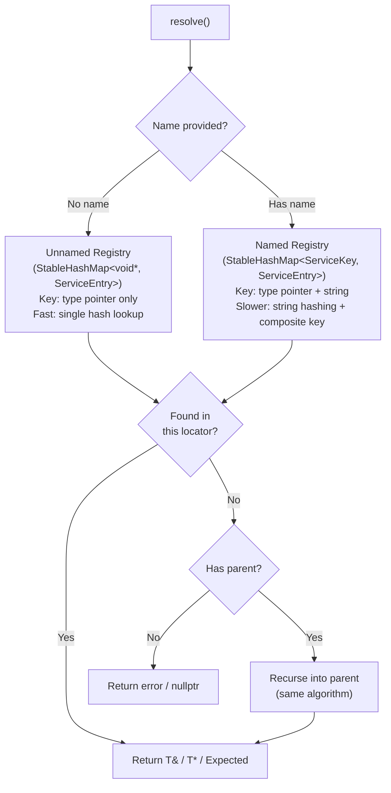
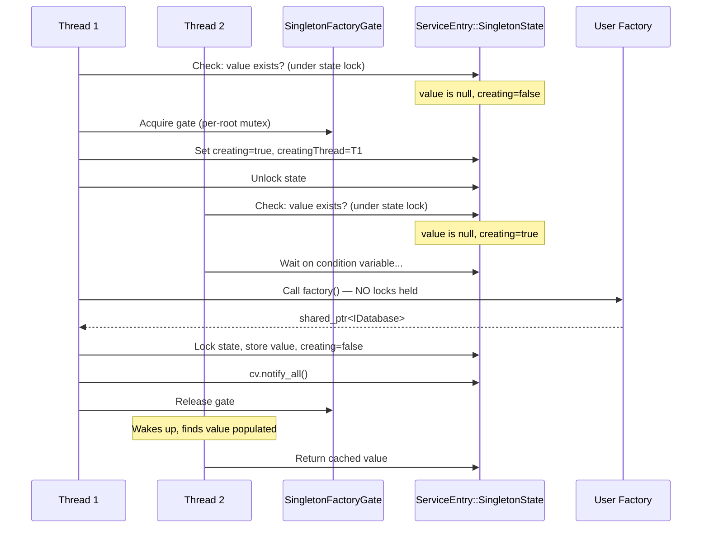
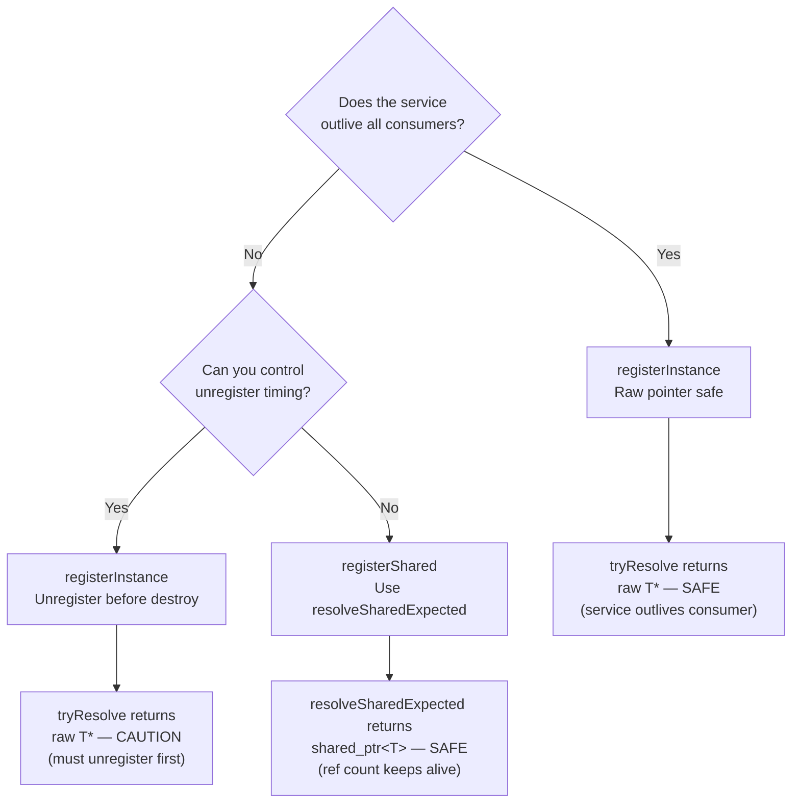

# User Manual - ServiceLocator

*February 2026*

---

**Scope:** Complete usage guide for `fat_p::service_locator::ServiceLocator`: the type erasure mechanism, two-level registry design, concurrency policies, registration policies, type key policies, registration (instance, shared, factory), resolution (pointer, reference, Expected, shared_ptr), singleton creation coordination, parent-child scoping, RAII registration handles, the MRU cache, lifetime safety analysis, error handling patterns, and integration patterns.

**Not covered:** Full dependency injection container design (ServiceLocator is a locator, not a DI container that auto-resolves dependency graphs). Writing a custom `TypeKeyPolicy` implementation from scratch. Custom `StatisticsPolicy` implementation.

**Prerequisites:** C++20; familiarity with `std::shared_ptr`, interface-based design (`ILogger`, `IDatabase`), and the concept of a composition root (the place in your application where services are wired together).

---

## User Manual Card

**Component:** `fat_p::service_locator::ServiceLocator`
**Primary use case:** Wire services at startup and resolve them by type (and optional name), with scoped overrides for tests
**Integration pattern:** Construct a locator in the composition root -> register instances/factories -> pass `ServiceLocator&` to subsystems -> create scopes for test overrides
**Key API:** `registerInstance`, `registerShared`, `registerFactory`, `tryResolve`, `resolveExpected`, `resolve`, `createExpected`, `makeScope`, `Registration`
**std equivalent:** None (the service locator pattern is not in the standard library)
**Common mistakes:** Resolving a transient as `T&` instead of `createExpected`; holding raw pointers across unregister; using `global()` assuming it is process-wide (it is per-instantiation); mutating the registry concurrently without `ThreadSafeServiceLocator`
**Performance notes:** Unnamed resolve is a single hash lookup; MRU cache eliminates repeated lookups for the same type; named resolve adds string hashing overhead. See `components/ServiceLocator/results/` for current data

---

## Table of Contents

1. The Service Locator Pattern
2. How Type Erasure Works Inside ServiceLocator
3. How the Two-Level Registry Works
4. Why StableHashMap: Reference Stability
5. The Type Key Policy: Address-Identity and Its Limits
6. Choosing a Locator Type
7. Concurrency Policy Deep Dive
8. Registration Policies: Prevent vs Allow Overwrite
9. Getting Started
10. Registration: Three Ownership Models
11. Resolution: Four Access Patterns
12. Factories and Lifetimes
13. How Singleton Creation Coordination Works
14. Parent-Child Scoping: How the Fallback Chain Works
15. RAII Registration Handles
16. Lifetime Safety: When Pointers Dangle
17. Error Handling Patterns
18. The MRU Cache
19. Use Case: Application Composition Root
20. Use Case: Test Overrides with Scopes
21. Use Case: Named Services for Multiple Implementations
22. Use Case: Transient Factory for Request-Scoped Objects
23. Use Case: Decorator Pattern via Scopes
24. Use Case: Configuration-Driven Registration
25. Best Practices
26. Migration from Raw Singletons
27. Migration from a Global Map of Interfaces
28. Advanced Usage
29. Performance Characteristics
30. Troubleshooting
31. Known Limitations
32. API Reference
33. FAQ

---

## The Service Locator Pattern

A service locator decouples service consumers from service creation. Instead of constructing an `ILogger` directly (which hardcodes the concrete type), the consumer asks the locator for an `ILogger` and receives whatever implementation was registered:

```cpp
// Without service locator: consumer knows the concrete type
FileLogger logger("/var/log/app.log");
app.run(logger);

// With service locator: consumer knows only the interface
locator.registerInstance<ILogger>(fileLogger);
ILogger& logger = locator.resolve<ILogger>();
app.run(logger);
```

This indirection enables test overrides (register a mock), configuration-driven selection (register based on config file), and lifetime management (register a factory that controls when instances are created and destroyed).

---

## How Type Erasure Works Inside ServiceLocator

ServiceLocator must store objects of arbitrary types in a single registry. It does this through type erasure: every registration is stored as a `ServiceEntry` containing type-erased storage:

```
ServiceEntry:
    kind:      Instance | Shared | Factory
    lifetime:  Singleton | Transient
    instance:  void*                              (raw pointer, for registerInstance)
    shared:    shared_ptr<void>                   (shared ownership, for registerShared)
    factory:   function<shared_ptr<void>()>       (deferred creation, for registerFactory)
```

When you call `registerInstance<ILogger>(logger)`, the locator stores `static_cast<void*>(&logger)`. When you call `tryResolve<ILogger>()`, the locator finds the entry by type key, retrieves the `void*`, and returns `static_cast<ILogger*>(entry.instance)`.

For `registerShared<ILogger>(ptr)`, the locator stores a `shared_ptr<void>` constructed from the `shared_ptr<ILogger>`. The `shared_ptr<void>` retains the correct deleter, so when the last reference is released, the `ILogger` destructor runs correctly despite the type erasure. On resolution, `static_pointer_cast<ILogger>(entry.shared)` recovers the typed pointer.

For factories, the locator stores a `std::function<shared_ptr<void>()>` that wraps the user's factory. On first resolve (singleton) or every resolve (transient), the function is called and the result is cast back to the concrete type.

This design means the locator itself has no knowledge of the service types. The type safety comes from the caller: if you `registerInstance<ILogger>(logger)` and then `tryResolve<IDatabase>()`, the type keys do not match and the resolution returns nullptr. You cannot accidentally resolve the wrong type.

### The Full Cast Chain

Following a registration through the system:

```
registerInstance<ILogger>(myFileLogger)
  1. TypeKeyPolicy::typeId<ILogger>()  -> void* key (address of static char)
  2. static_cast<void*>(&myFileLogger) -> void* instance
  3. Store ServiceEntry{kind=Instance, instance=void*} keyed by void* type key

tryResolve<ILogger>()
  1. TypeKeyPolicy::typeId<ILogger>()  -> void* key (same address)
  2. Lookup in UnnamedRegistry by void* key -> ServiceEntry&
  3. static_cast<ILogger*>(entry.instance) -> ILogger*
  4. Return pointer to caller
```

For shared registrations:

```
registerShared<ILogger>(shared_ptr<FileLogger>)
  1. Convert shared_ptr<FileLogger> -> shared_ptr<ILogger> (implicit upcast)
  2. Convert shared_ptr<ILogger> -> shared_ptr<void> (type erasure, preserves deleter)
  3. Store ServiceEntry{kind=Shared, shared=shared_ptr<void>}

resolveSharedExpected<ILogger>()
  1. Lookup -> ServiceEntry&
  2. static_pointer_cast<ILogger>(entry.shared) -> shared_ptr<ILogger>
  3. Return Expected<shared_ptr<ILogger>>
```

The `shared_ptr<void>` preserves the original deleter. When the last reference is released, the destructor for `FileLogger` runs correctly despite the `void` erasure. This is a standard C++ pattern and is guaranteed by the standard.

### Why This Is Safe

The type key is derived from the template parameter `T` in both `register*<T>()` and `resolve*<T>()`. As long as the caller uses the same `T` for both, the `static_cast` recovers the correct type. Mismatched types produce different keys, so the lookup fails before any cast happens. There is no way to "accidentally" cast to the wrong type through the public API.

---

## How the Two-Level Registry Works

ServiceLocator stores registrations in two separate hash maps for performance:



**Unnamed registry (Level 1).** Keyed by a `void*` type identifier only. No string allocation, no string hashing. This is the fast path. The hash function is a SplitMix64 finalizer on the pointer address, which produces well-distributed hashes with a single multiplication chain.

**Named registry (Level 2).** Keyed by a `ServiceKey` containing both the type identifier and a `std::string` name. The hash combines the type pointer hash with a string hash via `FNV-1a`. Lookup is slower due to string hashing and composite key construction.

The 7-9x gap between unnamed and named resolution is fundamental: string hashing touches every character, while the unnamed path hashes a single pointer. Use unnamed services for the common case; use named services only when you need multiple implementations of the same interface.

---

## Why StableHashMap: Reference Stability

Both registries use Fat-P's `StableHashMap` rather than `std::unordered_map`. The critical property is **reference stability**: pointers and references to entries remain valid across insert and rehash operations.

This matters because `tryResolve` returns a raw `T*` pointing into the registry. If the registry used `std::unordered_map`, a subsequent `registerInstance` call could trigger a rehash, invalidating all outstanding pointers. With `StableHashMap`, the entry's memory location never moves. Pointers returned by `tryResolve` remain valid as long as the registration exists (not just until the next insert).

This is also why singleton factories can safely store a `shared_ptr` back into the entry after creation: the entry pointer remains valid even if other registrations are added concurrently.

---

## The Type Key Policy: Address-Identity and Its Limits

The default `TypeKeyPolicy` generates a unique `void*` key per type:

```cpp
template <typename T>
static const void* typeId()
{
    static const char token = 0;
    return &token;
}
```

Each `typeId<T>()` returns the address of a unique `static const char`. Since each template instantiation gets its own static variable, each type gets a unique address. The hash function (SplitMix64 finalizer) converts this address into a well-distributed hash value.

**Why it works within a process.** Within a single executable, the linker deduplicates template instantiations. `typeId<ILogger>()` returns the same address everywhere in the program.

**Why it breaks across DSOs.** In a dynamically loaded plugin (`.so` / `.dll`), the linker may create a separate instantiation of `typeId<ILogger>()`. The main executable and the plugin then have different addresses for the same type, causing resolution failures. To fix this, provide a custom `TypeKeyPolicy` that uses `std::type_index` or a string-based identifier stable across DSO boundaries.

---

## Choosing a Locator Type

The `ServiceLocator` class template accepts three policy parameters:

```cpp
template <typename ConcurrencyPolicy,
          typename RegistrationPolicy,
          typename TypeKeyPolicy>
class ServiceLocator;
```

Four convenience aliases are provided:

| Alias | Concurrency | Registration | Typical use |
|---|---|---|---|
| `DefaultServiceLocator` | `SingleThreadedPolicy` | `PreventOverwrite` | Startup wiring, single-threaded programs, tests |
| `ThreadSafeServiceLocator` | `SharedMutexPolicy` | `PreventOverwrite` | Concurrent resolves from multiple threads |

`global()` is per-instantiation: `DefaultServiceLocator::global()` and `ThreadSafeServiceLocator::global()` are different static locals because they are different template instantiations. If you need a process-wide locator with concurrent access, standardize on `ThreadSafeServiceLocator::global()`.

---

## Concurrency Policy Deep Dive

### SingleThreadedPolicy (DefaultServiceLocator)

No locking. `lock_shared()` and `lock()` return no-op RAII objects. All operations are unsynchronized. This is correct when registration and resolution happen on the same thread, or when the caller provides external synchronization.

### SharedMutexPolicy (ThreadSafeServiceLocator)

Uses `std::shared_mutex`. Operations are classified:

| Operation | Lock type | Blocks on |
|---|---|---|
| `tryResolve`, `resolveExpected`, `resolve` | Shared (read) | Exclusive locks only |
| `tryResolveShared`, `resolveSharedExpected` | Shared (read) | Exclusive locks only |
| `isRegistered` | Shared (read) | Exclusive locks only |
| `createExpected` (transient) | Shared (read) | Exclusive locks only |
| `registerInstance`, `registerShared`, `registerFactory` | Exclusive (write) | All locks |
| `unregister`, `clear` | Exclusive (write) | All locks |
| Singleton factory materialization | Exclusive (write) | All locks |

Multiple threads can resolve concurrently (shared locks do not block each other). Registration blocks all resolution until complete. Singleton factory creation acquires an exclusive lock to store the result, but the factory itself runs with no lock held (to avoid deadlock if the factory resolves other services).

### What This Means in Practice

Consider a web server with 8 request-handling threads, all resolving `ILogger` concurrently:

```
Thread 1: tryResolve<ILogger>() -> shared lock -> hash lookup -> shared unlock
Thread 2: tryResolve<ILogger>() -> shared lock -> hash lookup -> shared unlock
Thread 3: tryResolve<ILogger>() -> shared lock -> hash lookup -> shared unlock
...all 8 threads proceed concurrently with no contention
```

Now a configuration reload thread wants to swap the logger (using `AllowOverwrite` policy):

```
Config thread: registerInstance<ILogger>(newLogger) -> exclusive lock
  -> all resolve() calls block until registration completes
  -> insert into StableHashMap
  -> exclusive unlock
  -> all blocked resolve() calls resume, now seeing newLogger
```

The exclusive lock during registration is brief. Under normal operation, registration happens at startup and resolution at runtime, so contention is zero.

### Interaction with Singleton Creation

When thread 1 resolves a singleton factory for the first time:

```
Thread 1: resolveExpected<IDatabase>()
  -> shared lock: look up entry, find Factory with no cached value
  -> shared unlock
  -> acquire SingletonFactoryGate (per-root, cross-locator serialization)
  -> exclusive lock: double-check, set creating=true
  -> exclusive unlock
  -> call factory() with NO locks held
  -> exclusive lock: store result in entry.shared
  -> exclusive unlock
  -> release SingletonFactoryGate
  -> return cached value
```

Thread 2 resolving `IDatabase` concurrently:

```
Thread 2: resolveExpected<IDatabase>()
  -> shared lock: look up entry, find creating=true
  -> wait on condition variable
  -> Thread 1 completes, notifies
  -> Thread 2 wakes, finds cached value
  -> return cached value
```

### The Singleton Factory Gate

Singleton creation has a subtle concurrency challenge. The factory may resolve other singletons (legitimate: `IDatabase` factory resolves `IConfig` to get connection string). But multiple threads may try to create the same singleton simultaneously.

The `SingletonFactoryGate` serializes singleton factory execution at the root locator level. When a thread needs to run a singleton factory:

1. It acquires the gate (a per-root mutex). Only one factory runs at a time across the entire locator hierarchy.
2. It re-checks whether the singleton was created while waiting.
3. If not, it runs the factory with no registry locks held.
4. It acquires the write lock, stores the result, and notifies waiting threads via condition variable.
5. It releases the gate.

The gate is re-entrant per thread: if factory A resolves `IConfig` which triggers factory B, both run on the same thread under the same gate acquisition. Circular dependencies (A -> B -> A) are detected by checking `creatingThread` and reported as `ServiceError::CircularDependency`.

---

## Registration Policies: Prevent vs Allow Overwrite

### ServicePreventOverwritePolicy (default)

Rejects duplicate registrations for the same type+name key. The second `registerInstance<ILogger>()` call returns `ServiceError::ServiceAlreadyExists`. This is the safe default: accidental double-registration is a bug.

### ServiceAllowOverwritePolicy

Silently replaces existing registrations. The previous entry is destroyed. Use this for configuration-driven systems where the "latest wins" semantic is correct, or for test setups that re-register mocks between test cases without explicit unregister.

To use:

```cpp
using OverwriteLocator = ServiceLocator<SingleThreadedPolicy, ServiceAllowOverwritePolicy>;
OverwriteLocator locator;
locator.registerInstance<ILogger>(logger1);  // OK
locator.registerInstance<ILogger>(logger2);  // Replaces logger1
```

---

## Getting Started

```cpp
#include "fat_p/ServiceLocator.h"

struct ILogger
{
    virtual ~ILogger() = default;
    virtual void log(std::string_view msg) = 0;
};

struct ConsoleLogger : ILogger
{
    void log(std::string_view msg) override
    {
        std::cout << msg << "\n";
    }
};

int main()
{
    using namespace fat_p::service_locator;
    DefaultServiceLocator locator;

    ConsoleLogger logger;
    auto result = locator.registerInstance<ILogger>(logger);
    // result is Expected<void, ServiceErrorInfo>

    ILogger& resolved = locator.resolve<ILogger>();
    resolved.log("Hello from ServiceLocator");
}
```

---

## Registration: Three Ownership Models

### registerInstance: Non-Owning (Caller Owns Lifetime)

```cpp
ConsoleLogger logger;  // Caller owns this object
locator.registerInstance<ILogger>(logger);
// locator stores a raw void* pointer; logger must outlive all resolves
```

The locator stores `static_cast<void*>(&logger)`. No reference counting, no destructor management. The caller is responsible for ensuring the object outlives all resolution calls. Use this for objects created on the stack in main(), or objects owned by a subsystem with a well-defined lifetime.

### registerShared: Shared Ownership

```cpp
auto logger = std::make_shared<ConsoleLogger>();
locator.registerShared<ILogger>(logger);
// locator holds a shared_ptr<void>; service lives as long as anyone holds a reference
```

The locator stores a `shared_ptr<void>` that shares ownership with the caller's `shared_ptr<ConsoleLogger>`. The reference count keeps the object alive. This enables `tryResolveShared<T>()` and `resolveSharedExpected<T>()`, which return `shared_ptr<T>` carrying lifetime safety.

### registerFactory: Deferred Creation

```cpp
locator.registerFactory<ILogger>(
    []() -> std::shared_ptr<ILogger> {
        return std::make_shared<FileLogger>("/var/log/app.log");
    },
    ServiceLifetime::Singleton
);
// Factory is not called until first resolve
```

The factory is stored as a `std::function<shared_ptr<void>()>` (type-erased). The lambda is wrapped in an adapter that converts `shared_ptr<ILogger>` to `shared_ptr<void>`. On first resolve (Singleton) or every resolve (Transient), the factory runs and the result is cast back.

---

## Resolution: Four Access Patterns

| Method | Returns | On missing | Use when |
|---|---|---|---|
| `tryResolve<T>(name)` | `T*` or `nullptr` | Returns nullptr | Service is optional; hot path |
| `resolveExpected<T>(name)` | `Expected<ref_wrapper<T>, ServiceErrorInfo>` | Returns error with details | You need error propagation |
| `resolve<T>(name)` | `T&` | Enforces (terminates) | Missing = programming error |
| `createExpected<T>(name)` | `Expected<shared_ptr<T>, ServiceErrorInfo>` | Returns error with details | Transient factories |

Additionally for shared ownership:

| Method | Returns | On missing |
|---|---|---|
| `tryResolveShared<T>(name)` | `shared_ptr<T>` or empty | Returns empty shared_ptr |
| `resolveSharedExpected<T>(name)` | `Expected<shared_ptr<T>, ServiceErrorInfo>` | Returns error |

**tryResolve** is the fastest path (no Expected construction, no enforce check). Use in performance-critical code where a missing service is a normal condition.

**resolveExpected** is the workhorse. The `ServiceErrorInfo` contains the error code, a human-readable message, and the service name. Propagate it up the call chain for structured error handling.

**resolve** terminates the program if the service is missing (via Fat-P's enforce mechanism). Use only for services that must always exist---core infrastructure like logging, configuration, or database connections.

**createExpected** calls the factory and returns a new `shared_ptr` each time. For singleton factories, the first call creates and caches; subsequent calls return the cached instance. For transient factories, every call creates a new instance.

---

## Factories and Lifetimes

### Singleton Factory

Created once on first resolve, cached for all subsequent resolves:

```cpp
locator.registerFactory<IDatabase>(
    []() -> std::shared_ptr<IDatabase> {
        return std::make_shared<PostgresDatabase>("host=localhost");
    },
    ServiceLifetime::Singleton
);

// First resolve: factory runs, connection created
IDatabase& db1 = locator.resolve<IDatabase>();

// Second resolve: returns same instance, factory not called
IDatabase& db2 = locator.resolve<IDatabase>();
assert(&db1 == &db2);  // Same object
```

The cached instance is stored as a `shared_ptr<void>` in the `ServiceEntry::SingletonState`. Subsequent resolves skip the factory entirely and return the cached pointer.

### Transient Factory

A new instance is created on every `createExpected` call:

```cpp
locator.registerFactory<IRequestHandler>(
    []() -> std::shared_ptr<IRequestHandler> {
        return std::make_shared<RequestHandler>();
    },
    ServiceLifetime::Transient
);

auto h1 = locator.createExpected<IRequestHandler>();
auto h2 = locator.createExpected<IRequestHandler>();
assert(h1.value().get() != h2.value().get());  // Different objects
```

Calling `resolve<T>()` or `resolveExpected<T>()` on a transient registration returns `ServiceError::TransientRequiresCreate`. This is because there is no single instance to return a reference to---each call creates a new one.

---

## How Singleton Creation Coordination Works

When multiple threads resolve a singleton factory concurrently, the locator must ensure the factory runs exactly once. The coordination involves three mechanisms:



**Step 1: Check under state lock.** Each singleton registration has a `SingletonState` with a mutex, a condition variable, a `creating` flag, and the cached `value`. The resolving thread locks the state and checks if the value exists.

**Step 2: Acquire the gate.** If the value does not exist, the thread acquires the root locator's `SingletonFactoryGate`. This serializes all singleton factory creation across the locator hierarchy, preventing deadlocks when factory A resolves service B which triggers factory B.

**Step 3: Double-check under gate.** Another thread may have created the singleton while we were waiting for the gate. Re-check before running the factory.

**Step 4: Run the factory with no locks held.** This is critical. The factory may resolve other services (including other singletons), which would deadlock if registry locks were held. The gate is held (preventing concurrent factory execution), but no registry locks are held.

**Step 5: Store and notify.** Re-acquire the state lock, store the result, clear the `creating` flag, and notify all waiting threads via the condition variable.

**Re-entrancy.** The gate is re-entrant per thread. If factory A resolves `IConfig`, which triggers factory B for `IConfig`, the locator detects the circular dependency by checking `creatingThread == std::this_thread::get_id()` and returns `ServiceError::CircularDependency`.

**Error recovery.** If the factory throws or returns nullptr, the `creating` flag is reset and the condition variable is notified, allowing waiting threads to retry or propagate the error.

---

## Parent-Child Scoping: How the Fallback Chain Works

`makeScope()` creates a child locator with a pointer to the parent. Resolution follows a chain:

```
child.resolve<ILogger>()
  -> search child's unnamed registry
  -> not found -> search child's named registry (if name provided)
  -> not found -> recurse into parent.resolve<ILogger>()
    -> search parent's unnamed registry
    -> found -> return parent's ILogger
```

Key behaviors:

**Child registrations shadow parent registrations.** If both child and parent have `ILogger`, the child's version wins. The parent's registration still exists and is returned by `root.resolve<ILogger>()`.

**The parent owns the memory.** A pointer returned from the parent's registry points into the parent's `StableHashMap`. It remains valid as long as the parent's registration exists, regardless of the child's lifetime.

**Scopes are RAII.** `makeScope()` returns a `ServiceScope` object. When the scope is destroyed, the child locator and all its registrations are destroyed. Any child-only registrations become inaccessible. Parent registrations are unaffected.

**Scopes can nest.** A child can call `makeScope()` to create a grandchild. Resolution traverses the full chain: grandchild -> child -> root.

```cpp
DefaultServiceLocator root;
ConsoleLogger prodLogger;
root.registerInstance<ILogger>(prodLogger);

auto childScope = root.makeScope();
MockLogger mockLogger;
childScope.locator().registerInstance<ILogger>(mockLogger);

auto grandchildScope = childScope.locator().makeScope();
// grandchild has no ILogger of its own
ILogger& resolved = grandchildScope.locator().resolve<ILogger>();
assert(&resolved == &mockLogger);  // Found in child (parent of grandchild)
```

---

## RAII Registration Handles

`Registration` is a move-only handle that unregisters a service when destroyed:

```cpp
DefaultServiceLocator locator;
ConsoleLogger logger;

{
    auto reg = DefaultServiceLocator::Registration::registerInstanceExpected<ILogger>(
        locator, logger);
    if (reg.has_value())
    {
        // ILogger is registered for this scope
        ILogger& resolved = locator.resolve<ILogger>();
    }
}
// reg destroyed -> ILogger automatically unregistered
```

Three factory methods: `registerInstanceExpected`, `registerSharedExpected`, `registerFactoryExpected`. Each returns `Expected<Registration, ServiceErrorInfo>`. The handle stores the type key and name, calling `unregister()` in its destructor.

Call `reset()` to unregister early. Check `operator bool()` to see if the handle is active.

---

## Lifetime Safety: When Pointers Dangle

The most dangerous mistake with ServiceLocator is holding a pointer or reference across a registration change. Here is a decision tree:



**Safe: registerInstance with guaranteed lifetime.** A `ConsoleLogger` on main's stack, registered at startup, resolved by subsystems. The stack object outlives all subsystems. Raw pointers from `tryResolve` are safe.

**Caution: registerInstance with dynamic lifetime.** A `FileLogger` owned by a configuration subsystem. If the configuration subsystem shuts down and destroys the logger while another subsystem holds a pointer from `tryResolve`, the pointer dangles. Either ensure shutdown order, or use `registerShared`.

**Safe: registerShared.** The `shared_ptr<void>` in the registry and the `shared_ptr<T>` returned by `resolveSharedExpected` share reference counts. The object lives as long as anyone holds a reference. No dangling is possible.

**Rule of thumb:** If you cannot guarantee lifetime ordering, use `registerShared` + `resolveSharedExpected`.

---

## Error Handling Patterns

`ServiceErrorInfo` contains three fields: `mCode` (enum), `mMessage` (human-readable string), `mName` (the service name, if any).

### Pattern 1: Propagate via Expected

```cpp
Expected<void, ServiceErrorInfo> initializeSubsystem(ServiceLocator& loc)
{
    auto dbResult = loc.resolveExpected<IDatabase>();
    if (!dbResult.has_value())
        return unexpected{dbResult.error()};

    auto logResult = loc.resolveExpected<ILogger>();
    if (!logResult.has_value())
        return unexpected{logResult.error()};

    // Both available; proceed
    return {};
}
```

### Pattern 2: Handle specific errors

```cpp
auto result = locator.resolveExpected<ILogger>("audit");
if (!result.has_value())
{
    switch (result.error().mCode)
    {
        case ServiceError::ServiceNotFound:
            // Fallback: use default logger
            return locator.resolveExpected<ILogger>();

        case ServiceError::TransientRequiresCreate:
            // Programmer error: fix the registration
            throw std::logic_error(result.error().fullMessage());

        default:
            return unexpected{result.error()};
    }
}
```

### Pattern 3: Fail-fast with resolve

```cpp
// Core infrastructure: missing = fatal
ILogger& logger = locator.resolve<ILogger>();
IDatabase& db = locator.resolve<IDatabase>();
// If either is missing, enforce terminates with a clear message
```

---

## The MRU Cache

The MRU(2) cache accelerates repeated unnamed resolves by caching the two most recently resolved type pointers. When the same type (or alternating between two types) is resolved repeatedly, the cache avoids the hash lookup entirely by returning the cached result from a simple pointer comparison. For three or more rotating types, the cache provides no benefit and falls through to the normal hash lookup.

See `components/ServiceLocator/results/` for current MRU cache hit/miss benchmark data.

The cache is invalidated on any registry mutation (register, unregister, clear). It applies only to unnamed resolves. Named resolves always go through the full named registry.

---

## Use Case: Application Composition Root

Wire all services at startup in one place:

```cpp
void configure(DefaultServiceLocator& locator)
{
    // Infrastructure — stack-allocated, lives for entire program
    static FileLogger fileLogger("/var/log/app.log");
    locator.registerInstance<ILogger>(fileLogger);

    // Database — lazy singleton, connected on first resolve
    locator.registerFactory<IDatabase>(
        []() -> std::shared_ptr<IDatabase> {
            return std::make_shared<PostgresDatabase>(loadConnString());
        },
        ServiceLifetime::Singleton);

    // Cache — stack-allocated
    static RedisCache cache("localhost:6379");
    locator.registerInstance<ICache>(cache);

    // Metrics — shared ownership (multiple subsystems hold references)
    auto metrics = std::make_shared<PrometheusMetrics>();
    locator.registerShared<IMetrics>(metrics);
}

int main()
{
    DefaultServiceLocator locator;
    configure(locator);

    Application app(locator);
    app.run();
}
```

## Use Case: Test Overrides with Scopes

```cpp
void test_order_processing()
{
    DefaultServiceLocator root;
    configure(root);  // Production wiring

    auto scope = root.makeScope();

    // Override database with mock
    MockDatabase mockDb;
    scope.locator().registerInstance<IDatabase>(mockDb);

    // Override logger with capturing logger
    CapturingLogger captureLog;
    scope.locator().registerInstance<ILogger>(captureLog);

    // Code under test sees mocks; root is untouched
    OrderProcessor processor(scope.locator());
    processor.processOrder(testOrder);

    assert(mockDb.lastInsertedOrder() == testOrder);
    assert(captureLog.contains("Order processed"));
}
// Scope destroyed; mocks gone; root clean for next test
```

## Use Case: Named Services for Multiple Implementations

```cpp
ConsoleLogger consoleLogger;
FileLogger fileLogger("/var/log/app.log");
SyslogLogger syslogLogger("app");

locator.registerInstance<ILogger>(consoleLogger, "console");
locator.registerInstance<ILogger>(fileLogger, "file");
locator.registerInstance<ILogger>(syslogLogger, "syslog");

// Resolve by name
ILogger& audit = locator.resolve<ILogger>("file");     // Audit goes to file
ILogger& debug = locator.resolve<ILogger>("console");   // Debug goes to console

// For hot paths, resolve once at startup
ILogger& hotPathLogger = locator.resolve<ILogger>("console");
```

## Use Case: Transient Factory for Request-Scoped Objects

```cpp
locator.registerFactory<IRequestContext>(
    []() -> std::shared_ptr<IRequestContext> {
        return std::make_shared<RequestContext>(generateRequestId());
    },
    ServiceLifetime::Transient);

void handleRequest()
{
    auto ctx = locator.createExpected<IRequestContext>();
    if (ctx.has_value())
    {
        ctx.value()->setRemoteAddr(request.addr);
        processWithContext(*ctx.value());
    }
    // ctx destroyed when shared_ptr goes out of scope
}
```

## Use Case: Decorator Pattern via Scopes

Wrap an existing service with a decorator in a child scope:

```cpp
DefaultServiceLocator root;
FileLogger fileLogger("/var/log/app.log");
root.registerInstance<ILogger>(fileLogger);

auto scope = root.makeScope();

// Resolve the original from the parent
ILogger& original = root.resolve<ILogger>();

// Create a decorator that wraps it
static TimestampLogger timestamped(original);
scope.locator().registerInstance<ILogger>(timestamped);

// Consumers in the scope see the decorated version
ILogger& logger = scope.locator().resolve<ILogger>();
// logger is TimestampLogger, which delegates to FileLogger
```

## Use Case: Configuration-Driven Registration

```cpp
void configureFromFile(DefaultServiceLocator& locator, const Config& cfg)
{
    if (cfg.logTarget == "file")
    {
        static FileLogger fl(cfg.logPath);
        locator.registerInstance<ILogger>(fl);
    }
    else if (cfg.logTarget == "syslog")
    {
        static SyslogLogger sl(cfg.appName);
        locator.registerInstance<ILogger>(sl);
    }
    else
    {
        static ConsoleLogger cl;
        locator.registerInstance<ILogger>(cl);
    }
}
```

---

## Best Practices

### Register in the Composition Root, Resolve Everywhere Else

All `registerInstance` / `registerShared` / `registerFactory` calls should happen at startup in one place. Subsystems should only call resolution methods. This makes the wiring visible, testable, and auditable.

### Prefer registerInstance for Long-Lived Services

If the service outlives the locator (static, stack in main, member of a longer-lived object), `registerInstance` avoids the shared_ptr overhead (16 bytes + atomic reference count). Use `registerShared` only when you need shared ownership semantics or lifetime safety through `resolveSharedExpected`.

### Prefer tryResolve for Optional Services

If a missing service is not an error (optional analytics plugin, optional cache), use `tryResolve` and check for nullptr. Reserve `resolve` for services that must exist.

### Resolve Once, Cache the Reference

```cpp
// Resolve once at startup or initialization
ILogger& logger = locator.resolve<ILogger>();
IDatabase& db = locator.resolve<IDatabase>();

// Use the cached references in hot paths
for (auto& item : items)
{
    logger.log(item.msg);   // No resolution overhead
    db.insert(item);        // No resolution overhead
}
```

### Use Scopes for Test Isolation

Every test should create a scope from the root locator and register overrides in the scope. Tests do not interfere with each other, and the root locator remains clean.

### Do Not Unregister While References Are Live

`tryResolve` returns a raw pointer. If you unregister the service while someone holds that pointer, the pointer dangles. Use `resolveSharedExpected` for lifetime safety, or ensure unregistration happens only at shutdown after all consumers have stopped.

### Use PreventOverwrite (Default) Unless You Have a Reason

Accidental double-registration is a common bug. The default policy catches it at registration time. Switch to `AllowOverwrite` only in configuration-driven systems where "latest wins" is the correct semantic.

### Avoid Circular Dependencies in Singleton Factories

If factory A resolves service B and factory B resolves service A, the locator detects the cycle and returns `CircularDependency`. Break cycles by restructuring initialization: register one as an instance (not a factory) so it does not need to resolve the other during creation.

---

## Migration from Raw Singletons

Replace:

```cpp
class Logger
{
public:
    static Logger& instance()
    {
        static Logger s;
        return s;
    }
};
// Usage: Logger::instance().log(msg);
```

With:

```cpp
Logger logger;
locator.registerInstance<ILogger>(logger);
// Usage: locator.resolve<ILogger>().log(msg);
```

Benefits: testable (override in scopes), swappable (register different implementation at startup), no hidden global state, dependency is explicit (consumers receive `ServiceLocator&`).

## Migration from a Global Map of Interfaces

Replace:

```cpp
std::unordered_map<std::type_index, void*> services;
services[typeid(ILogger)] = &logger;
auto* p = static_cast<ILogger*>(services.at(typeid(ILogger)));
```

With:

```cpp
locator.registerInstance<ILogger>(logger);
ILogger& p = locator.resolve<ILogger>();
```

Benefits: type safety (no `static_cast`), error reporting (`Expected` with diagnostic messages), lifetime management (shared_ptr option), scoping (child locators), named services, factory support.

---

## Advanced Usage

### Thread-Safe Locator with Concurrent Resolves

```cpp
ThreadSafeServiceLocator locator;
locator.registerInstance<ILogger>(logger);

// Safe: concurrent resolves
std::jthread t1([&]{ auto& l = locator.resolve<ILogger>(); l.log("from t1"); });
std::jthread t2([&]{ auto& l = locator.resolve<ILogger>(); l.log("from t2"); });

// Unsafe: do NOT register from t1 while t2 resolves on DefaultServiceLocator
// (no internal locking). Use ThreadSafeServiceLocator for this.
```

### Checking Registration Before Resolve

```cpp
if (locator.isRegistered<IAnalytics>())
{
    auto& analytics = locator.resolve<IAnalytics>();
    analytics.trackEvent("startup");
}
```

Note: `isRegistered` checks the current locator and all parents.

### Statistics

With `AtomicServiceLocatorStatisticsPolicy`:

```cpp
auto stats = locator.stats();
std::cout << "Resolves: " << stats.resolveCount
          << " Registers: " << stats.registerCount << "\n";
```

The default `NoServiceLocatorStatisticsPolicy` provides no-op counters (zero overhead).

### Custom Type Keys for DSO Boundaries

When services are registered by plugins loaded at runtime, use a type key policy based on `std::type_index`:

```cpp
struct TypeIndexKeyPolicy
{
    template <typename T>
    static const void* typeId()
    {
        static const std::type_index idx(typeid(T));
        return reinterpret_cast<const void*>(&idx);
    }
};

using PluginSafeLocator = ServiceLocator<SharedMutexPolicy,
    ServicePreventOverwritePolicy, TypeIndexKeyPolicy>;
```

### Lazy Initialization Chains

Services can depend on each other. Register factories that resolve their dependencies lazily:

```cpp
// Config is resolved first (no dependencies)
locator.registerFactory<IConfig>(
    []() -> std::shared_ptr<IConfig> {
        return std::make_shared<FileConfig>("/etc/app.conf");
    }, ServiceLifetime::Singleton);

// Database depends on Config (resolved lazily)
locator.registerFactory<IDatabase>(
    [&locator]() -> std::shared_ptr<IDatabase> {
        auto& config = locator.resolve<IConfig>();
        return std::make_shared<PostgresDatabase>(config.get("db.connstr"));
    }, ServiceLifetime::Singleton);

// Cache depends on Config
locator.registerFactory<ICache>(
    [&locator]() -> std::shared_ptr<ICache> {
        auto& config = locator.resolve<IConfig>();
        return std::make_shared<RedisCache>(config.get("cache.host"));
    }, ServiceLifetime::Singleton);

// First resolve of IDatabase triggers: IDatabase factory -> IConfig factory -> IConfig created -> IDatabase created
IDatabase& db = locator.resolve<IDatabase>();
```

The singleton factory gate ensures these chained resolutions are safe even under concurrent access. The gate is re-entrant per thread, so `IDatabase` factory resolving `IConfig` on the same thread works correctly.

### Multi-Stage Startup

For complex applications, register in stages:

```cpp
void stage1_infrastructure(DefaultServiceLocator& loc)
{
    static ConsoleLogger logger;
    loc.registerInstance<ILogger>(logger);
    loc.registerFactory<IConfig>(/* ... */);
}

void stage2_data(DefaultServiceLocator& loc)
{
    // These factories can resolve stage 1 services
    loc.registerFactory<IDatabase>(/* ... depends on IConfig ... */);
    loc.registerFactory<ICache>(/* ... depends on IConfig ... */);
}

void stage3_business(DefaultServiceLocator& loc)
{
    // These factories can resolve stage 1 and 2 services
    loc.registerFactory<IOrderService>(
        [&loc]() -> std::shared_ptr<IOrderService> {
            auto& db = loc.resolve<IDatabase>();
            auto& cache = loc.resolve<ICache>();
            auto& logger = loc.resolve<ILogger>();
            return std::make_shared<OrderService>(db, cache, logger);
        }, ServiceLifetime::Singleton);
}
```

### Introspection-Based Health Checks

Use `isRegistered` to verify all required services are wired:

```cpp
struct HealthCheck
{
    static bool verify(const DefaultServiceLocator& loc)
    {
        bool ok = true;
        if (!loc.isRegistered<ILogger>())
        {
            std::cerr << "MISSING: ILogger\n";
            ok = false;
        }
        if (!loc.isRegistered<IDatabase>())
        {
            std::cerr << "MISSING: IDatabase\n";
            ok = false;
        }
        if (!loc.isRegistered<ICache>())
        {
            std::cerr << "MISSING: ICache\n";
            ok = false;
        }
        return ok;
    }
};

// After composition root
if (!HealthCheck::verify(locator))
{
    std::cerr << "Startup failed: missing required services\n";
    return 1;
}
```

### Using Registration Handles for Plugin Lifecycles

When loading/unloading plugins dynamically:

```cpp
struct Plugin
{
    std::vector<DefaultServiceLocator::Registration> registrations;

    void load(DefaultServiceLocator& locator)
    {
        auto reg = DefaultServiceLocator::Registration::
            registerSharedExpected<IAnalytics>(locator, 
                std::make_shared<GoogleAnalytics>());
        if (reg.has_value())
            registrations.push_back(std::move(reg.value()));
    }

    void unload()
    {
        registrations.clear();  // All registrations removed
    }
};
```

---

## Performance Characteristics

Performance is dominated by the hash lookup mechanism. Unnamed operations use a single pointer hash (SplitMix64 finalizer), while named operations add string hashing (FNV-1a) and composite key construction.

| Operation | Unnamed | Named | Cost Driver |
|---|---|---|---|
| register* | Fast | Slower | Hash insert; named adds string copy |
| tryResolve / resolve | Fastest | Slower | Hash lookup; named adds string hashing |
| createExpected (transient) | Factory cost | Factory cost | New instance per call |
| createExpected (singleton, cached) | Fast | Slower | Shared_ptr copy |
| MRU cache hit | Fastest | N/A | Simple pointer comparison, unnamed only |
| makeScope | Moderate | N/A | Allocates child locator |

See `components/ServiceLocator/results/` for current platform-specific benchmark data.

---

## Troubleshooting

### ServiceError::ServiceNotFound

No registration exists for the requested type (and optional name) in this locator or any parent. Verify that registration happened before resolution. Verify the type matches exactly: if you registered `registerInstance<ILogger>(...)`, you must resolve `resolve<ILogger>()`, not `resolve<FileLogger>()`.

### ServiceError::TransientRequiresCreate

You called `resolve<T>()` or `resolveExpected<T>()` on a transient factory. Transients have no single instance to return a reference to. Use `createExpected<T>()` instead.

### ServiceError::ServiceAlreadyExists

Using `ServicePreventOverwritePolicy` (default) and registering the same type+name twice. Either unregister first, use a scope to shadow the registration, or switch to `ServiceAllowOverwritePolicy`.

### ServiceError::FactoryReturnedNull

The singleton or transient factory returned an empty `shared_ptr`. This is a bug in the factory. Check factory logic and error handling.

### ServiceError::FactoryThrew

The factory threw an exception. The exception message is captured in `ServiceErrorInfo::mMessage`. The singleton remains uninitialized; subsequent resolves will retry the factory.

### ServiceError::CircularDependency

A singleton factory resolved itself (A -> A) or formed a cycle (A -> B -> A). Break the cycle by registering one service as an instance instead of a factory, or by deferring one resolution to after construction.

### ServiceError::NullSharedInstance

`registerShared` was called with an empty `shared_ptr`. Always pass a valid pointer.

### Dangling pointer from tryResolve after unregister

`tryResolve` returns a raw `T*`. If the registration is removed (unregister, scope destruction, overwrite with AllowOverwrite), the pointer may dangle. Use `resolveSharedExpected` for lifetime-safe access.

### global() returns different instances for different aliases

`DefaultServiceLocator::global()` and `ThreadSafeServiceLocator::global()` are different static locals. They are different template instantiations and have separate registries. Standardize on one alias.

### Resolution succeeds in parent but fails in child

Child locators do not copy parent registrations. They fall through to the parent on miss. If you registered in the parent and the child does not override it, resolution in the child succeeds (it finds the parent's registration). If you think it should fail, check that you are resolving the correct type.

### Named resolve is significantly slower than unnamed

This is by design. Named resolution requires string hashing and composite key construction on every call. If you need to resolve a named service frequently, resolve once at startup and cache the reference.

### MRU cache not effective

The cache is invalidated on any registry mutation. If you register/unregister frequently, every mutation resets the cache. The cache is most effective after registration stabilizes.

---

## Known Limitations

**Type keys not stable across DSOs.** The default `TypeKeyPolicy` uses address identity. Dynamically loaded plugins may have different addresses for the same type. Use a `std::type_index`-based policy for DSO boundaries.

**No automatic dependency graph.** ServiceLocator does not track which services depend on which. Initialization order is the caller's responsibility.

**No async factory support.** Factories are synchronous. For async initialization, construct a future/promise externally and register the result after completion.

**Non-copyable, non-movable.** ServiceLocator cannot be copied or moved. Pass by reference.

**MRU cache unnamed only.** Named resolves never hit the cache.

**No cycle detection for non-factory dependencies.** Circular dependency detection only applies to singleton factories creating each other. If two services hold raw references to each other (registered via `registerInstance`), the locator cannot detect it.

---

## API Reference

### Registration

| Method | Description | Lock |
|---|---|---|
| `registerInstance<T>(instance, name)` | Non-owning raw pointer | Write |
| `registerShared<T>(shared_ptr, name)` | Shared ownership | Write |
| `registerFactory<T>(factory, lifetime, name)` | Deferred creation | Write |
| `unregister<T>(name)` | Remove registration | Write |
| `clear()` | Remove all registrations | Write |

### Resolution

| Method | Returns | On missing | Lock |
|---|---|---|---|
| `tryResolve<T>(name)` | `T*` | nullptr | Read |
| `resolveExpected<T>(name)` | `Expected<ref_wrapper<T>>` | Error | Read |
| `resolve<T>(name)` | `T&` | Enforce | Read |
| `createExpected<T>(name)` | `Expected<shared_ptr<T>>` | Error | Read (+ Write for singleton cache) |
| `tryResolveShared<T>(name)` | `shared_ptr<T>` | Empty | Read |
| `resolveSharedExpected<T>(name)` | `Expected<shared_ptr<T>>` | Error | Read |

### Scoping and Global

| Method | Description |
|---|---|
| `makeScope()` | RAII child locator (scope) |
| `makeChild()` | Child locator (explicit ownership) |
| `global()` | Per-instantiation static singleton |
| `isRegistered<T>(name)` | Check (current + parents) |
| `stats()` | Statistics (policy-dependent) |

### Registration Handle

| Method | Description |
|---|---|
| `Registration::registerInstanceExpected<T>(loc, inst, name)` | RAII register |
| `Registration::registerSharedExpected<T>(loc, ptr, name)` | RAII register |
| `Registration::registerFactoryExpected<T>(loc, fac, lt, name)` | RAII register |
| `reset()` | Unregister early |
| `operator bool()` | Is handle active? |

### Types

| Type | Description |
|---|---|
| `ServiceLifetime` | `Singleton` or `Transient` |
| `ServiceError` | Error code enum (9 values) |
| `ServiceErrorInfo` | Error code + message + name |
| `ServicePreventOverwritePolicy` | Rejects duplicates (default) |
| `ServiceAllowOverwritePolicy` | Replaces duplicates |
| `DefaultServiceLocator` | Single-threaded alias |
| `ThreadSafeServiceLocator` | Shared-mutex alias |

---

## FAQ

**Q: Is ServiceLocator a dependency injection container?**

No. A DI container automatically resolves dependency graphs (given A depends on B, constructing A automatically constructs B). ServiceLocator requires manual registration and does not construct dependency chains. It is simpler, faster, and more explicit.

**Q: Should I use the global() instance?**

Prefer explicit `ServiceLocator&` parameter passing. `global()` is provided for legacy integration and convenience. It introduces hidden coupling---the same reason we moved away from raw singletons.

**Q: Can I register the same type with and without a name?**

Yes. The unnamed registration (Level 1) and named registration (Level 2) are in separate hash maps. `resolve<ILogger>()` returns the unnamed registration; `resolve<ILogger>("file")` returns the named one. They coexist independently.

**Q: What happens if I register a derived type under a base interface?**

Register under the interface type that consumers resolve:

```cpp
FileLogger file;
locator.registerInstance<ILogger>(file);  // Register as ILogger
// resolve<ILogger>() works -> returns file as ILogger&
// resolve<FileLogger>() fails -> FileLogger is not registered
```

**Q: How does the hash function work for type keys?**

The type key is a `void*` (address of a per-type static variable). The hash function is a SplitMix64 finalizer: two multiply-xorshift rounds that convert the pointer address into a well-distributed 64-bit hash. This is the same mixer used in FatPHashMap benchmarks and produces excellent distribution with minimal collision.

**Q: Can I register abstract types?**

You register under the abstract interface type and provide a concrete instance. The locator does not construct anything---it just stores a pointer. So the "abstract" type is only used as the key; the value is always a concrete object passed by the caller.

**Q: What is the memory overhead per registration?**

Each `ServiceEntry` is approximately 80-120 bytes (void*, shared_ptr<void>, function<shared_ptr<void>()>, SingletonState pointer, enums). The `StableHashMap` adds approximately 8-16 bytes per entry for bookkeeping. Total: ~100-140 bytes per registration.

---

*ServiceLocator.h --- Fat-P Library*
