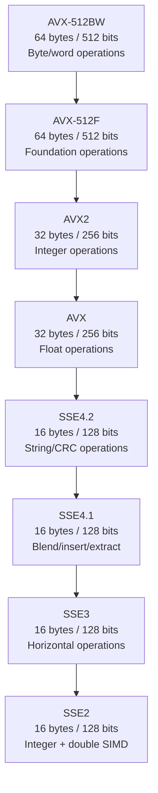

# User Manual - SimdDetection

*February 2026*

---

**Scope:** Complete usage guide for `fat_p::simd` namespace and the `FATP_SIMD_*` macro family. Covers the x86 SIMD ISA hierarchy, compile-time macro detection, runtime CPUID queries, the diagnostic API, runtime dispatch patterns, compiler flag guidance, and integration with Fat-P SIMD-accelerated components.

**Not covered:** Writing SIMD intrinsics (this manual detects capabilities; it does not teach vectorization). Autovectorization by the compiler. GPU compute (CUDA, OpenCL).

**Prerequisites:** C++20. Basic understanding of what SIMD means (processing multiple data elements in one instruction). No prior knowledge of CPUID or ISA levels required.

---

## User Manual Card

**Component:** SimdDetection
**Primary use case:** Detect which SIMD instructions are available at compile time and runtime
**Integration pattern:** Include header -> check `FATP_SIMD_*` macros at compile time -> call `cpu_has_*()` at runtime -> use `is_optimal()` for diagnostics
**Key API:** `FATP_SIMD_AVX2`, `FATP_HAS_SIMD`, `cpu_has_avx2()`, `compiled_backend()`, `cpu_capability()`, `is_optimal()`, `optimization_hint()`, `register_width_bytes()`
**std equivalent:** None (C++26 `std::simd` covers operations, not detection)
**Common mistakes:** Compiling with `-msse2` on an AVX2-capable machine (leaving performance on the table); using compile-time macros alone without runtime verification (binary crashes on older CPUs); forgetting MSVC needs explicit `/arch:AVX2`
**Performance notes:** Runtime detection is cached (one-time CPUID call); all query functions are effectively free after first call

---

## Table of Contents

1. The SIMD Detection Problem
2. The x86 SIMD Hierarchy
3. ARM SIMD: NEON
4. Compile-Time Detection: The FATP_SIMD_* Macros
5. Runtime Detection: CPUID Queries
6. Why Compile-Time and Runtime Can Disagree
7. The Diagnostic API
8. Getting Started
9. Use Case: Startup Verification
10. Use Case: Runtime Dispatch
11. Use Case: Benchmark Diagnostics
12. Use Case: Conditional Compilation in Fat-P Components
13. Best Practices
14. Compiler Flag Reference
15. Platform Differences
16. Advanced Usage
17. Troubleshooting
18. Known Limitations
19. API Reference
20. FAQ

---

## The SIMD Detection Problem

SIMD (Single Instruction, Multiple Data) instructions process multiple values in parallel. An AVX2 `_mm256_add_epi32` adds eight 32-bit integers in one instruction. Without SIMD, the same work requires eight separate `add` instructions. The throughput difference is 2x-8x depending on the operation and ISA level.

The problem is that SIMD instruction sets are not universal. A binary compiled with AVX-512 instructions will crash with an illegal instruction fault (SIGILL on POSIX, STATUS_ILLEGAL_INSTRUCTION on Windows) on a CPU that only supports AVX2. A binary compiled with only SSE2 will run everywhere but leave 4x-8x throughput on the table on modern hardware.

SimdDetection solves this by providing two parallel detection mechanisms. Compile-time macros tell you what instructions your binary contains. Runtime queries tell you what instructions the CPU supports. The diagnostic API compares them and reports mismatches.

---

## The x86 SIMD Hierarchy

x86 SIMD instruction sets form a strict hierarchy. Each level implies all levels below it:



**SSE2 (2001, Pentium 4).** 128-bit registers (`__m128i`, `__m128d`). Processes 4 floats, 2 doubles, or 4/8/16 integers per instruction. Available on every x86-64 CPU---it is part of the AMD64 specification. This is Fat-P's baseline for x86.

**SSE3, SSE4.1, SSE4.2 (2004-2008).** Add horizontal operations (SSE3), blend/insert/extract (SSE4.1), and string comparison/CRC32 (SSE4.2). Available on all Intel CPUs since Nehalem (2008) and all AMD CPUs since Bulldozer (2011).

**AVX (2011, Sandy Bridge).** Widens floating-point registers to 256 bits (`__m256`, `__m256d`). Processes 8 floats or 4 doubles per instruction. Integer operations remain 128-bit.

**AVX2 (2013, Haswell).** Extends 256-bit operations to integers (`__m256i`). Processes 8 int32 or 4 int64 per instruction. This is the sweet spot for most SIMD code: widely available (all Intel since 2013, all AMD since Excavator 2015) with 2x throughput over SSE2.

**AVX-512F (2016, Skylake-X).** 512-bit registers (`__m512`, `__m512i`, `__m512d`). Processes 16 floats, 8 doubles, or 16 int32 per instruction. Limited availability: server Xeons, Ice Lake+, AMD Zen 4+. Some desktop CPUs (Rocket Lake, Alder Lake P-cores) support it but may downclock when using it.

**AVX-512BW (2016).** Adds byte and word (8-bit, 16-bit) operations to AVX-512. Required by Fat-P's FastHashMap for SIMD probe sequences on byte-level match masks.

---

## ARM SIMD: NEON

ARM's SIMD story is simpler. NEON provides 128-bit registers (16 bytes) and is mandatory on all AArch64 (64-bit ARM) processors. There is no ISA hierarchy to navigate---if you are on AArch64, you have NEON.

On 32-bit ARM, NEON is optional. SimdDetection checks `__ARM_NEON` / `__ARM_NEON__` for 32-bit ARM detection.

SimdDetection defines `FATP_SIMD_NEON` for any ARM NEON support and `FATP_SIMD_NEON_AARCH64` when running on 64-bit ARM. Runtime detection is not needed on ARM---the compile-time macro is sufficient.

---

## Compile-Time Detection: The FATP_SIMD_* Macros

When you include `SimdDetection.h`, it defines a set of macros based on compiler-defined feature macros:

| Macro | Defined when | Register width |
|---|---|---|
| `FATP_SIMD_SSE2` | `__SSE2__` or MSVC x64 | 16 bytes |
| `FATP_SIMD_SSE3` | `__SSE3__` | 16 bytes |
| `FATP_SIMD_SSE4_1` | `__SSE4_1__` | 16 bytes |
| `FATP_SIMD_SSE4_2` | `__SSE4_2__` | 16 bytes |
| `FATP_SIMD_AVX` | `__AVX__` | 32 bytes |
| `FATP_SIMD_AVX2` | `__AVX2__` | 32 bytes |
| `FATP_SIMD_AVX512F` | `__AVX512F__` | 64 bytes |
| `FATP_SIMD_AVX512BW` | `__AVX512F__ && __AVX512BW__` | 64 bytes |
| `FATP_SIMD_NEON` | `__ARM_NEON` or AArch64 | 16 bytes |
| `FATP_SIMD_NEON_AARCH64` | AArch64 | 16 bytes |
| `FATP_HAS_SIMD` | Any of the above | varies |
| `FATP_SIMD_LEVEL` | Highest level | 128, 256, 512, or 0 |

The hierarchy is enforced: if `FATP_SIMD_AVX2` is defined, all lower x86 macros are also defined. This means you can write `#if defined(FATP_SIMD_SSE2)` and it will be true for SSE2, AVX, AVX2, and AVX-512 compilations.

SimdDetection also includes the appropriate intrinsics header (`emmintrin.h` for SSE2 through `immintrin.h` for AVX/AVX2/AVX-512). You do not need to include these yourself.

---

## Runtime Detection: CPUID Queries

Compile-time macros tell you what instructions the binary contains. They do not tell you what the CPU supports. A binary compiled with `-msse2` can run on an AVX-512 machine, but the compile-time macros will only show SSE2.

Runtime detection uses the CPUID instruction (x86) to query CPU feature flags:

```cpp
#include "SimdDetection.h"

if (fat_p::simd::cpu_has_avx2())
{
    // CPU supports AVX2 instructions
}
```

Available runtime queries:

| Function | Returns true when |
|---|---|
| `cpu_has_sse2()` | CPU supports SSE2 |
| `cpu_has_avx2()` | CPU supports AVX2 and OS saves AVX state |
| `cpu_has_avx512f()` | CPU supports AVX-512F and OS saves AVX-512 state |
| `cpu_has_avx512bw()` | CPU supports AVX-512BW (requires AVX-512F) |
| `cpu_has_neon()` | Platform has NEON (compile-time on ARM) |

Results are cached in a `static const` local variable on first call. Thread-safe via C++11 static initialization guarantees. After the first call, all queries are a single pointer dereference with no system calls.

On ARM, `cpu_has_neon()` returns the compile-time detection result. There is no CPUID equivalent on ARM.

---

## Why Compile-Time and Runtime Can Disagree

Three scenarios cause mismatches:

**Compiled low, running high.** You compiled with `-msse2` on a build server. The binary runs on a developer's AVX2 machine. Compile-time: SSE2. Runtime: AVX2. The binary works (SSE2 is a subset of AVX2) but runs at half the potential throughput. SimdDetection's `is_optimal()` returns false and `optimization_hint()` tells the user to recompile.

**Compiled high, running low.** You compiled with `-mavx2` on your workstation. The binary runs on a cloud VM with only SSE4.2. Compile-time: AVX2. Runtime: SSE4.2. The binary crashes with SIGILL on the first AVX2 instruction. SimdDetection cannot prevent this (the binary is already compiled), but a startup check with `is_optimal()` can detect it before the crash reaches user code.

**MSVC without explicit flags.** MSVC does not define `__AVX2__` unless you pass `/arch:AVX2`. GCC and Clang with `-march=native` auto-detect the build machine's capabilities. This means a MSVC build on an AVX2 machine defaults to SSE2 unless you explicitly add `/arch:AVX2`.

---

## The Diagnostic API

Four functions compare compile-time and runtime state:

```cpp
// What we compiled with
const char* backend = fat_p::simd::compiled_backend();
// "AVX2", "SSE2", "NEON-AArch64", "Scalar", etc.

// What the CPU supports
const char* cpu = fat_p::simd::cpu_capability();
// "AVX-512BW", "AVX2", "SSE2", etc.

// Are we using the best available?
bool optimal = fat_p::simd::is_optimal();

// If not, how to fix it
const char* hint = fat_p::simd::optimization_hint();
// "CPU supports AVX2. Recompile with /arch:AVX2 (MSVC) or -mavx2 (GCC/Clang)"
// nullptr if already optimal
```

And a combined status string:

```cpp
const char* s = fat_p::simd::status();
// "AVX2 (optimal)" or "SSE2 (CPU has AVX2)"
```

---

## Getting Started

```cpp
#include "SimdDetection.h"
#include <iostream>

int main()
{
    std::cout << "Compiled:  " << fat_p::simd::compiled_backend() << "\n";
    std::cout << "CPU:       " << fat_p::simd::cpu_capability() << "\n";
    std::cout << "Status:    " << fat_p::simd::status() << "\n";
    std::cout << "SIMD level:" << fat_p::simd::simd_level() << " bits\n";
    std::cout << "Register:  " << fat_p::simd::register_width_bytes() << " bytes\n";
    std::cout << "Floats:    " << fat_p::simd::floats_per_register() << " per register\n";

    if (!fat_p::simd::is_optimal())
    {
        std::cerr << "Warning: " << fat_p::simd::optimization_hint() << "\n";
    }
}
```

Output on an AVX2 machine compiled with `-msse2`:
```
Compiled:  SSE2
CPU:       AVX2
Status:    SSE2 (CPU has AVX2)
SIMD level:128 bits
Register:  16 bytes
Floats:    4 per register
Warning: CPU supports AVX2. Recompile with /arch:AVX2 (MSVC) or -mavx2 (GCC/Clang)
```

---

## Use Case: Startup Verification

Detect and report SIMD mismatches at application startup:

```cpp
void check_simd_environment()
{
    if (!fat_p::simd::is_optimal())
    {
        auto hint = fat_p::simd::optimization_hint();
        if (hint)
        {
            logger.warn("SIMD suboptimal: compiled={}, CPU={}. {}",
                fat_p::simd::compiled_backend(),
                fat_p::simd::cpu_capability(),
                hint);
        }
    }
}
```

For safety-critical deployments, assert at startup that the binary matches the CPU:

```cpp
void verify_simd_or_abort()
{
    if (!fat_p::simd::is_optimal())
    {
        std::cerr << "FATAL: Binary compiled for "
                  << fat_p::simd::compiled_backend()
                  << " but CPU supports "
                  << fat_p::simd::cpu_capability()
                  << ". Rebuild with correct flags.\n";
        std::abort();
    }
}
```

## Use Case: Runtime Dispatch

Select algorithm implementations based on CPU capabilities:

```cpp
void process_data(const float* data, size_t n)
{
#if defined(FATP_SIMD_AVX2)
    // Compiled with AVX2: use 256-bit path directly
    process_avx2(data, n);
#elif defined(FATP_SIMD_SSE2)
    // Compiled with SSE2: check if we can do better at runtime
    // (only useful if you have runtime-selected function pointers)
    process_sse2(data, n);
#else
    process_scalar(data, n);
#endif
}
```

For true runtime dispatch (multiple code paths in one binary), you need function pointers selected at initialization. SimdDetection provides the detection; the dispatch logic is application-specific:

```cpp
using ProcessFunc = void(*)(const float*, size_t);

ProcessFunc select_processor()
{
    if (fat_p::simd::cpu_has_avx2())
        return &process_avx2;  // Compiled in a separate TU with -mavx2
    if (fat_p::simd::cpu_has_sse2())
        return &process_sse2;
    return &process_scalar;
}

// Cache the selection
static const ProcessFunc g_process = select_processor();
```

## Use Case: Benchmark Diagnostics

Every Fat-P benchmark prints SIMD status in its header:

```cpp
auto runner = fat_p::bench::makeRunner("MyBenchmark");
// The header automatically includes:
//   SIMD: AVX2 (optimal)
// Or:
//   SIMD: SSE2 (CPU has AVX2) -- WARNING: suboptimal
```

For custom benchmark output:

```cpp
std::cout << "SIMD: " << fat_p::simd::status() << "\n";
std::cout << "Processing " << fat_p::simd::floats_per_register()
          << " floats per SIMD instruction\n";
```

## Use Case: Conditional Compilation in Fat-P Components

Fat-P components use SimdDetection macros to select intrinsics:

```cpp
// Inside CheckedArithmetic
#if defined(FATP_SIMD_AVX2)
    __m256i va = _mm256_loadu_si256(reinterpret_cast<const __m256i*>(a));
    __m256i vb = _mm256_loadu_si256(reinterpret_cast<const __m256i*>(b));
    __m256i vsum = _mm256_add_epi32(va, vb);
    // Check overflow via _mm256_cmpgt_epi32
#elif defined(FATP_SIMD_SSE2)
    __m128i va = _mm_loadu_si128(reinterpret_cast<const __m128i*>(a));
    __m128i vb = _mm_loadu_si128(reinterpret_cast<const __m128i*>(b));
    __m128i vsum = _mm_add_epi32(va, vb);
#else
    // Scalar fallback
    for (size_t i = 0; i < n; ++i) result[i] = a[i] + b[i];
#endif
```

---

## Best Practices

### Compile with -march=native for Development

On GCC and Clang, `-march=native` auto-detects the build machine's SIMD capabilities and defines the appropriate macros. This gives you the best performance on your development machine. For deployment, choose an explicit target (`-mavx2`, `-msse4.2`) matching your minimum supported hardware.

### Always Check is_optimal() at Startup

A one-line check catches the most common SIMD deployment mistake: compiling conservatively and deploying on capable hardware. The optimization hint tells the user exactly which flag to add.

### Use FATP_SIMD_LEVEL for Portable Thresholds

Instead of checking specific ISA names, check the SIMD level:

```cpp
#if FATP_SIMD_LEVEL >= 256
    // AVX or better: 32-byte registers
#elif FATP_SIMD_LEVEL >= 128
    // SSE2 or NEON: 16-byte registers
#else
    // Scalar
#endif
```

This works across x86 and ARM.

### Use register_width_bytes() for Loop Unrolling

```cpp
constexpr size_t kLanes = fat_p::simd::floats_per_register();
for (size_t i = 0; i + kLanes <= n; i += kLanes)
{
    // Process kLanes floats per iteration
}
// Handle remainder
```

### Do Not Mix Compile-Time and Runtime in the Same Decision

A compile-time `#if defined(FATP_SIMD_AVX2)` gates code that the compiler generates. A runtime `cpu_has_avx2()` checks hardware. Do not use runtime detection to branch into code that was not compiled: the AVX2 instructions do not exist in an SSE2 binary regardless of what the CPU supports. Runtime dispatch requires separate compilation units with different flags.

---

## Compiler Flag Reference

### GCC / Clang

| Flag | Effect | Macros defined |
|---|---|---|
| `-msse2` | Enable SSE2 | `__SSE2__` |
| `-msse4.2` | Enable through SSE4.2 | `__SSE4_2__`, `__SSE4_1__`, `__SSE3__`, `__SSE2__` |
| `-mavx2` | Enable through AVX2 | `__AVX2__`, `__AVX__`, and all SSE |
| `-mavx512bw` | Enable through AVX-512BW | `__AVX512BW__`, `__AVX512F__`, and all below |
| `-march=native` | Auto-detect build CPU | All supported by build machine |

### MSVC

| Flag | Effect | Macros defined |
|---|---|---|
| (default, x64) | SSE2 baseline | `_M_X64` (SSE2 implicit) |
| `/arch:AVX` | Enable AVX | `__AVX__` |
| `/arch:AVX2` | Enable AVX2 | `__AVX2__`, `__AVX__` |
| `/arch:AVX512` | Enable AVX-512 | `__AVX512F__`, `__AVX512BW__`, and below |

MSVC does not auto-detect the build CPU. You must explicitly pass `/arch:AVX2` to get AVX2 support. This is the most common source of SIMD mismatch on Windows builds.

---

## Platform Differences

| Aspect | x86/x64 | ARM |
|---|---|---|
| ISA hierarchy | SSE2 -> SSE3 -> ... -> AVX-512BW | NEON (single level) |
| Runtime detection | CPUID instruction | Not needed (compile-time) |
| Register widths | 128/256/512 bits | 128 bits |
| OS state save | Required for AVX+ (OSXSAVE check) | Transparent |
| Compile flags | Per-ISA (`-mavx2`, `/arch:AVX2`) | `-mfpu=neon` (32-bit only) |

### OSXSAVE: The OS Must Cooperate

On x86, the CPU supporting AVX is not sufficient. The OS must save and restore the extended register state on context switches. SimdDetection checks the OSXSAVE flag before reporting AVX/AVX2/AVX-512 support. If the OS does not support AVX state saving (old kernels, some VMs), `cpu_has_avx2()` returns false even if the CPU has AVX2.

---

## Advanced Usage

### Using SIMD Width Constants for Generic Code

```cpp
template <typename T>
constexpr size_t elements_per_register()
{
    return fat_p::simd::register_width_bytes() / sizeof(T);
}

// Compiles to 8 for float on AVX2, 4 on SSE2, 16 on AVX-512
constexpr size_t kFloatLanes = elements_per_register<float>();
```

### Combining with PlatformDetection

```cpp
#if FATP_SIMD_ARCH_X86_FAMILY && defined(FATP_SIMD_AVX2)
    // x86 with AVX2: use 256-bit intrinsics
#elif FATP_SIMD_ARCH_ARM_FAMILY && defined(FATP_SIMD_NEON)
    // ARM with NEON: use 128-bit intrinsics
#else
    // Scalar fallback
#endif
```

### Testing All Code Paths

To test the SSE2 fallback path on an AVX2 machine, compile with `-msse2` explicitly. To test the scalar path, compile with `-mno-sse2` (x86) or without NEON flags (32-bit ARM).

---

## Troubleshooting

### SIGILL (illegal instruction) at runtime

The binary was compiled with higher SIMD flags than the CPU supports. Check `compiled_backend()` vs `cpu_capability()`. Recompile with flags matching your deployment hardware.

### is_optimal() returns false despite correct flags

The OS may not support AVX state saving (OSXSAVE flag not set). This happens in some virtualized environments. SimdDetection correctly reports the CPU as not supporting AVX in this case because using AVX instructions would corrupt register state.

### MSVC build shows SSE2 on an AVX2 machine

MSVC defaults to SSE2 on x64. Add `/arch:AVX2` to your compiler flags. Unlike GCC/Clang, MSVC has no `-march=native` equivalent.

### cpu_has_avx512f() returns false on Alder Lake

Alder Lake has P-cores (AVX-512 capable) and E-cores (not AVX-512 capable). Intel disabled AVX-512 in BIOS by default to maintain uniform behavior across core types. Enable in BIOS if needed, but be aware of performance implications (P-core only execution, potential thermal throttling).

### FATP_SIMD_NEON not defined on ARM

On 32-bit ARM, NEON is optional. Compile with `-mfpu=neon` to enable it. On AArch64 (64-bit ARM), NEON is mandatory and `FATP_SIMD_NEON` is always defined.

### Register width is 0

No SIMD support is compiled in. Check your compiler flags. On x86-64, SSE2 is always available---if `register_width_bytes()` returns 0, something is wrong with your toolchain configuration.

---

## Known Limitations

**No runtime dispatch framework.** SimdDetection detects capabilities but does not provide a dispatch mechanism. Runtime dispatch requires separate compilation units and function pointers, which is application-specific.

**No SVE detection.** ARM SVE (Scalable Vector Extension) with variable-width registers is not detected. Fat-P does not currently use SVE.

**No AMX detection.** Intel AMX (Advanced Matrix Extensions) for matrix operations is not detected.

**CPUID only on x86.** ARM detection is compile-time only. Runtime NEON queries on 32-bit ARM (via `/proc/cpuinfo` or `getauxval`) are not implemented.

**No per-core detection.** On heterogeneous CPUs (big.LITTLE, Alder Lake), detection reports the features common to all cores.

---

## API Reference

### Compile-Time Macros

| Macro | Description |
|---|---|
| `FATP_SIMD_SSE2` through `FATP_SIMD_AVX512BW` | Individual ISA level gates |
| `FATP_SIMD_NEON`, `FATP_SIMD_NEON_AARCH64` | ARM NEON detection |
| `FATP_SIMD_ARCH_X86_FAMILY` | x86 or x64 architecture |
| `FATP_SIMD_ARCH_ARM_FAMILY` | ARM32 or ARM64 architecture |
| `FATP_HAS_SIMD` | Any SIMD available |
| `FATP_SIMD_LEVEL` | 128, 256, 512, or 0 |

### Runtime Detection (namespace `fat_p::simd`)

| Function | Description |
|---|---|
| `cpu_has_sse2()` | Runtime SSE2 check (x86) |
| `cpu_has_avx2()` | Runtime AVX2 check (x86, includes OSXSAVE) |
| `cpu_has_avx512f()` | Runtime AVX-512F check (x86) |
| `cpu_has_avx512bw()` | Runtime AVX-512BW check (x86) |
| `cpu_has_neon()` | NEON check (compile-time on ARM) |

### Compile-Time Queries

| Function | Description |
|---|---|
| `compiled_with_avx512f()` | constexpr: compiled with AVX-512F? |
| `compiled_with_avx512bw()` | constexpr: compiled with AVX-512BW? |
| `compiled_with_avx2()` | constexpr: compiled with AVX2? |
| `compiled_with_sse2()` | constexpr: compiled with SSE2? |
| `compiled_with_neon()` | constexpr: compiled with NEON? |
| `has_simd()` | constexpr: any SIMD compiled? |
| `simd_level()` | constexpr: 128, 256, 512, or 0 |

### Diagnostic API

| Function | Description |
|---|---|
| `compiled_backend()` | "AVX2", "SSE2", "NEON-AArch64", "Scalar" |
| `cpu_capability()` | Runtime CPU's best ISA level |
| `is_optimal()` | Compiled backend matches CPU best? |
| `optimization_hint()` | Human-readable fix, or nullptr if optimal |
| `status()` | Combined: "AVX2 (optimal)" or "SSE2 (CPU has AVX2)" |

### Width Constants

| Function | Description |
|---|---|
| `register_width_bytes()` | constexpr: 64, 32, 16, or 0 |
| `int32_per_register()` | constexpr: elements per SIMD register |
| `int64_per_register()` | constexpr: elements per SIMD register |
| `floats_per_register()` | constexpr: elements per SIMD register |
| `doubles_per_register()` | constexpr: elements per SIMD register |

---

## FAQ

**Q: Does SimdDetection auto-include intrinsics headers?**

Yes. Based on the detected level, it includes `emmintrin.h` (SSE2) through `immintrin.h` (AVX+) on x86, or `arm_neon.h` on ARM. You do not need to include these yourself.

**Q: Is the runtime detection thread-safe?**

Yes. `get_cpu_features()` uses a `static const` local, which C++11 guarantees is initialized exactly once, thread-safely.

**Q: What if I compile with -mavx512bw but the CPU only has AVX2?**

The binary will crash with SIGILL on the first AVX-512 instruction. Call `is_optimal()` at startup to detect this before it happens.

**Q: Does this work in constexpr contexts?**

The compile-time queries (`compiled_with_avx2()`, `simd_level()`, `register_width_bytes()`) are constexpr. The runtime queries and diagnostic API are not.

**Q: Can I use SimdDetection without any other Fat-P headers?**

It depends on PlatformDetection.h for `FATP_ARCH_*` macros. Beyond that, no other Fat-P dependencies.

---

*SimdDetection.h --- Fat-P Library*
