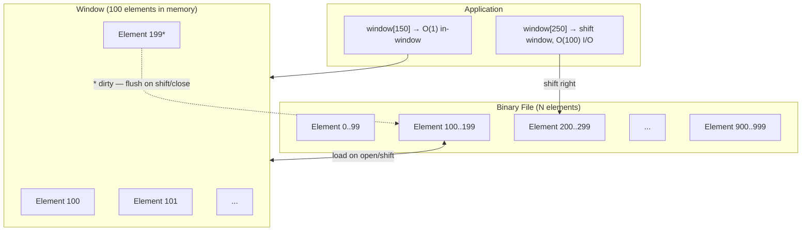

# Overview - SlidingFileWindow

*Fat-P Library — February 2026*

---

## Executive Summary

SlidingFileWindow provides deque-like random access to binary files that may be larger than available memory. It maintains a fixed-size window of elements loaded from disk, shifting the window forward or backward as the access pattern moves through the file. Elements are loaded on demand, written back when dirty, and flushed automatically when the window shifts or the file is closed. Three policy axes control behavior: SerializationPolicy (binary memcpy, stream-based, or custom Read/Write methods), ErrorPolicy (Expected-based or throwing), and ConcurrencyPolicy (single-threaded, mutex, or shared-mutex). In-window access is O(1); window shifts are O(shift_distance) with I/O; memory consumption is bounded by `sizeof(T) * window_size` regardless of file size.

---

## Overview Card

**Component:** SlidingFileWindow
**Problem solved:** Bounded-memory access to large binary files with element-level read-modify-write semantics
**When to use:** Processing files larger than RAM with a localized access pattern; time-series databases; log file processing; any case where MemoryMappedFile's map-the-whole-file approach exceeds memory constraints or where element-level dirty tracking is needed
**When NOT to use:** Files that fit comfortably in memory (use MemoryMappedFile for zero-copy); purely sequential reads (use buffered `ifstream`); random access spanning the entire file simultaneously (window shifts dominate)
**Key guarantee:** In-window access is O(1); dirty elements are flushed before eviction; RAII close flushes all dirty data
**std equivalent:** None
**Boost equivalent:** None
**Other alternatives:** Custom mmap + page management, database engines (LevelDB, LMDB)
**Read next:** User Manual - SlidingFileWindow, Overview - MemoryMappedFile

---

## Architecture

The three policy axes:

| Policy | Options | Default |
|--------|---------|---------|
| **Serialization** | `BinarySerializationPolicy` (memcpy), `StreamSerializationPolicy` (operator<</>>\), `CustomSerializationPolicy` (user Read/Write) | Binary |
| **Error** | `ExpectedFileErrorPolicy` (returns Expected), `ThrowingFileErrorPolicy` (throws) | Expected |
| **Concurrency** | `SingleThreadedPolicy`, `MutexSynchronizationPolicy`, `SharedMutexPolicy` | SingleThreaded |

---

## Why Not MemoryMappedFile?

MemoryMappedFile maps the entire file into virtual address space. For a 100 GB time-series file on a machine with 16 GB RAM, the OS will page aggressively, causing unpredictable latency from page faults and evictions. SlidingFileWindow bounds memory at exactly `window_size * sizeof(T)`, gives you control over which elements are resident, and tracks dirty elements for explicit write-back.

---

*SlidingFileWindow.h — Fat-P Library*
