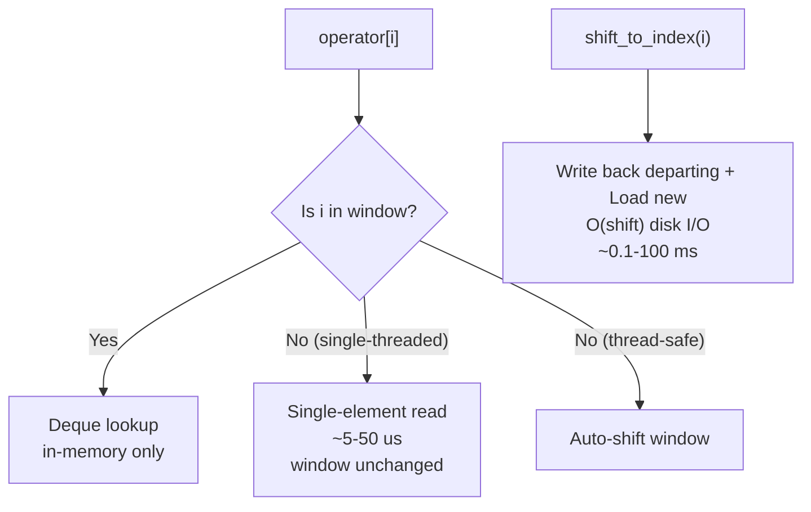
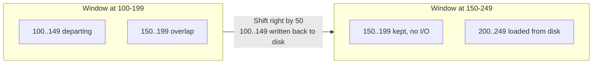

# User Manual - SlidingFileWindow

*February 2026*

---

**Scope:** Complete usage guide for `fat_p::SlidingFileWindow`, including the I/O cost model that governs performance, window shift mechanics, all three policy axes, modification and write-back behavior, out-of-window fallback, use case walkthroughs, best practices, and advanced patterns.

**Not covered:** MemoryMappedFile (separate component); database-style indexing; variable-length records.

**Prerequisites:** C++20; understanding of why large files do not fit in memory; familiarity with Fat-P's `Expected<T, E>`.

---

## User Manual Card

**Component:** SlidingFileWindow
**Primary use case:** Read and modify elements in a large binary file without loading the entire file
**Integration pattern:** Construct -> `open(filename, element_size, window_size)` -> access via `operator[]` -> window elements write back on shift/close
**Key API:** `open()`, `close()`, `operator[]`, `size()`, `shift_to_index()`, `begin_index()`, `end_index()`
**std equivalent:** None
**Common mistakes:** Expecting `operator[]` to shift the window in single-threaded mode (it uses a one-element direct I/O fallback; call `shift_to_index()` to move the window); BinarySerializationPolicy requires trivially-copyable types; relying on modifications being durable before a shift or `close()`
**Performance notes:** In-window: O(1); shift: O(shift_distance) I/O; direct fallback: O(1) + seek

---

## Table of Contents

1. The Windowing Story
2. Understanding the I/O Cost Model
3. Window Shift Mechanics
4. Getting Started
5. Serialization Policies
6. Error Policies
7. Concurrency Policies
8. Modification and Write-Back
9. Out-of-Window Access: The Direct I/O Fallback
10. Thread Safety
11. Use Case: Time-Series Processing
12. Use Case: Binary Search on a Sorted File
13. Use Case: Rolling Statistics Over a Sensor Log
14. Use Case: Log Rotation and Compaction
15. Best Practices
16. Advanced Usage
17. Choosing Window Size
18. Performance Characteristics
19. Troubleshooting
20. Known Limitations
21. API Reference
22. FAQ

---

## The Windowing Story

Imagine a file containing one billion sensor readings. Each reading is a 16-byte struct. The file is 16 GB. On a machine with 8 GB of RAM, you cannot load it all. You cannot memory-map it reliably either---on a 32-bit system the address space is too small, and even on 64-bit the OS will page aggressively, causing unpredictable latency.

SlidingFileWindow takes the decision away from the OS and gives it to you. You declare a fixed-size window---say, 100,000 elements, 1.6 MB---and the window loads those elements from the file. When you ask the window to cover element 500,000 (via `shift_to_index()`, or automatically on access in thread-safe mode), the window shifts: departing elements are written back to disk, fresh elements are loaded. Memory is bounded at exactly `sizeof(T) * window_size` regardless of file size.

The design rests on an observation about real workloads: most file processing has locality. A time-series analysis walks forward. A binary search converges. A statistics pass scans sequentially. In all these patterns, the working set fits in the window, and shifts are rare relative to accesses.

---

## Understanding the I/O Cost Model

Every SlidingFileWindow operation has a cost determined by where the element lives:



**In-window (nanoseconds).** Deque lookup. This should account for >99% of accesses.

**Window shift (milliseconds).** Triggered explicitly by `shift_to_index()`, or automatically on out-of-window access with a thread-safe ConcurrencyPolicy. Writes elements from the departing range back to disk, loads the arriving range. A shift of 10,000 16-byte elements = 160 KB sequential I/O, about 0.1 ms on SSD.

**Direct I/O fallback (microseconds).** In single-threaded mode, out-of-window `operator[]` never shifts the window: it does a single seek+read into a one-element buffer and returns that. Preserves the window's contents.

If your access pattern causes frequent shifts, the window is poorly sized or the pattern lacks locality.

---

## Window Shift Mechanics

When a shift occurs (via `shift_to_index()`, or automatically on out-of-window access in thread-safe mode):

1. Write elements in the departing range back to disk via the SerializationPolicy (unconditionally---there is no dirty tracking).
2. Preserve elements in the overlap between old and new positions (no re-read).
3. Load new elements from the arriving range.



The overlap is preserved without re-reading. For a single-element forward slide, only 1 element is evicted (written back) and 1 loaded---O(1) I/O.

---

## Getting Started

```cpp
#include "SlidingFileWindow.h"

struct SensorReading
{
    double value;
    uint64_t timestamp;
};

int main()
{
    fat_p::SlidingFileWindow<SensorReading,
        fat_p::BinarySerializationPolicy<SensorReading>> window;
    auto result = window.open("sensors.bin", sizeof(SensorReading), 10000);

    if (!result)
    {
        std::cerr << "Failed to open: " << static_cast<int>(result.error()) << "\n";
        return 1;
    }

    for (size_t i = 0; i < window.size(); ++i)
    {
        window.shift_to_index(i);  // Keep the window sliding over the scan
        auto elem = window[i];
        if (elem)
        {
            SensorReading& reading = *elem;
            if (reading.value > 100.0)
                reading.value = 100.0;  // Modified in memory; written back on shift/close
        }
    }
}
```

Defaults: `CustomSerializationPolicy` (the element type must provide `Read`/`Write` methods), `ExpectedFileErrorPolicy`, `SingleThreadedPolicy`. The example passes `BinarySerializationPolicy` explicitly because `SensorReading` is a plain trivially-copyable struct with no `Read`/`Write` methods---with the default policy it would not compile.

---

## Serialization Policies

### BinarySerializationPolicy

Raw bytes via `memcpy`. Fastest. Requires trivially-copyable types.

### StreamSerializationPolicy

`operator<<` / `operator>>`. Slower (text conversion). For human-readable formats.

### CustomSerializationPolicy (Default)

Requires `Read(std::istream&)` and `Write(std::ostream&) const`:

```cpp
struct DataPoint
{
    double value;
    uint64_t timestamp;

    void Read(std::istream& is)
    {
        is.read(reinterpret_cast<char*>(&value), sizeof(value));
        is.read(reinterpret_cast<char*>(&timestamp), sizeof(timestamp));
    }

    void Write(std::ostream& os) const
    {
        os.write(reinterpret_cast<const char*>(&value), sizeof(value));
        os.write(reinterpret_cast<const char*>(&timestamp), sizeof(timestamp));
    }
};

fat_p::SlidingFileWindow<DataPoint,
    fat_p::CustomSerializationPolicy<DataPoint>> window;
```

---

## Error Policies

**ExpectedFileErrorPolicy (Default):** Returns `Expected<T, FileError>`. No exceptions.

**ThrowingFileErrorPolicy:** Throws `FileWindowException`. For codebases that use exceptions.

---

## Concurrency Policies

**SingleThreadedPolicy (Default):** No synchronization. Zero overhead.

**MutexSynchronizationPolicy:** `std::mutex` on all operations.

**SharedMutexPolicy:** `std::shared_mutex` for concurrent reads, exclusive writes.

---

## Modification and Write-Back

When you modify an element through the reference returned by `operator[]`, only the in-memory copy changes. There is no per-element dirty tracking: the window writes elements back unconditionally---each element in the departing range when the window shifts, and every in-window element when the window is closed (explicitly via `close()` or by the destructor).

Modifications are not durable until the element is written back by a shift or by close. If the process crashes before then, those modifications are lost.

---

## Out-of-Window Access: The Direct I/O Fallback

In single-threaded mode (the default), any out-of-window access reads the element directly from disk without shifting---preserving the cached window contents. The element is held in a one-element buffer that is reused by the next out-of-window access. In thread-safe mode there is no fallback: out-of-window access auto-shifts the window instead.

This prevents a single random access from destroying the cache. If you are processing elements 100-199 and need to check element 999,999 once, the fallback returns it without evicting 100-199.

Note that a modification made through the fallback reference is written back only when the next out-of-window access replaces the buffer---not on `close()`. Do not rely on out-of-window writes; shift the window over an element before modifying it.

---

## Thread Safety

Determined by ConcurrencyPolicy. With `SingleThreadedPolicy`, nothing is thread-safe. With mutex policies, all public methods are synchronized.

Multiple instances on different files are always safe.

---

## Use Case: Time-Series Processing

A 50 GB file, 3 billion temperature readings. Compute a 1-hour moving average walking forward:

```cpp
fat_p::SlidingFileWindow<TempReading> window;
window.open("temps.bin", sizeof(TempReading), 100000);

double rolling_sum = 0.0;
size_t rolling_count = 0;
const size_t HOUR = 3600;

for (size_t i = 0; i < window.size(); ++i)
{
    window.shift_to_index(i);  // Slide the window forward with the scan
    auto elem = window[i];
    if (!elem) continue;
    rolling_sum += elem->temperature;
    ++rolling_count;

    if (rolling_count > HOUR)
    {
        auto old = window[i - HOUR];
        if (old) { rolling_sum -= old->temperature; --rolling_count; }
    }
}
```

The `shift_to_index(i)` call slides the window forward one element per access once the scan passes the initial window---O(1) I/O each, and free while `i` is still in-window. The oldest element in the rolling window is always within 3,600 elements of `i`, well inside the 100,000-element window, so both lookups stay in-window.

## Use Case: Binary Search on a Sorted File

Binary search touches O(log N) elements, widely spaced:

```cpp
fat_p::SlidingFileWindow<Record> window;
window.open("sorted.bin", sizeof(Record), 10000);

size_t lo = 0, hi = window.size() - 1;
while (lo <= hi)
{
    size_t mid = lo + (hi - lo) / 2;
    auto elem = window[mid];
    if (!elem) break;

    if (elem->key < target)      lo = mid + 1;
    else if (elem->key > target) hi = mid - 1;
    else break;
}
```

Probes outside the initial window use the direct I/O fallback (microseconds each); the window itself never shifts. Total: approximately 30 seeks for 1 billion elements.

## Use Case: Rolling Statistics Over a Sensor Log

Min/max/mean for every 10,000-element chunk:

```cpp
fat_p::SlidingFileWindow<SensorData> window;
window.open("sensors.bin", sizeof(SensorData), 50000);

const size_t CHUNK = 10000;
for (size_t start = 0; start < window.size(); start += CHUNK)
{
    double min_v = std::numeric_limits<double>::max();
    double max_v = std::numeric_limits<double>::lowest();
    double sum = 0.0;
    for (size_t j = 0; j < CHUNK && start + j < window.size(); ++j)
    {
        window.shift_to_index(start + j);
        auto e = window[start + j];
        if (!e) continue;
        min_v = std::min(min_v, e->value);
        max_v = std::max(max_v, e->value);
        sum += e->value;
    }
    report(start, min_v, max_v, sum / CHUNK);
}
```

Window is 5x the chunk size, so each chunk is processed entirely in-window.

## Use Case: Log Rotation and Compaction

Filter entries from an old log file into a compacted file:

```cpp
fat_p::SlidingFileWindow<LogEntry> source;
source.open("old.log", sizeof(LogEntry), 100000);
std::ofstream out("compacted.log", std::ios::binary);

for (size_t i = 0; i < source.size(); ++i)
{
    source.shift_to_index(i);
    auto elem = source[i];
    if (elem && should_keep(*elem))
        out.write(reinterpret_cast<const char*>(&(*elem)), sizeof(LogEntry));
}
```

Sequential scan. `shift_to_index` slides the window forward. Elements are still written back on shift and close, but the file contents are unchanged since nothing was modified.

---

## Best Practices

### Size the Window to Your Working Set

For sequential scans: `window_size >= 2 * max_lookback`. For rolling computations over W elements, the window needs at least 2W. For random bursts of B elements, the window should be >= B.

### Plan for Durability---There Is No Explicit Flush API

Modifications become durable only when elements are written back: on eviction during a window shift, or when the window is closed (`close()` or destructor). For data you cannot afford to lose, checkpoint by calling `close()` and reopening at regular intervals.

### Use BinarySerializationPolicy Unless You Cannot

It uses `memcpy`---the fastest possible serialization. Switch to Custom only for non-trivially-copyable types.

### Do Not Jump Randomly Across the Entire File

Every out-of-window access incurs a file seek. If your workload is random-access dominant with no locality, MemoryMappedFile is better.

### Profile Shift Frequency

If shift count is high relative to access count, the window is undersized. Increase it or restructure the access pattern for locality.

---

## Advanced Usage

### Pre-Warming the Window

```cpp
window.open("data.bin", sizeof(T), 100000);
window.shift_to_index(start_offset);  // Shift to cover start_offset
```

(In single-threaded mode, `window[start_offset]` would use the direct I/O fallback and leave the window where it is; `shift_to_index` is the call that moves it.)

### Periodic Checkpoint with Progress

There is no explicit flush API; `close()` is what writes the window back. To checkpoint, close and reopen:

```cpp
const size_t CHECKPOINT_INTERVAL = 100000;
const size_t total = window.size();
for (size_t i = 0; i < total; ++i)
{
    window.shift_to_index(i);
    auto elem = window[i];
    if (elem) process(*elem);
    if (i > 0 && i % CHECKPOINT_INTERVAL == 0)
    {
        window.close();  // Writes the window back to disk
        window.open("data.bin", sizeof(T), 100000, total - i);  // lag_offset repositions near i
        report_progress(i, total);
    }
}
```

### Two Windows: Read-Ahead and Write-Behind

Two windows on the same file can implement a streaming transform. Requires external synchronization to prevent concurrent modification of the same pages.

---

## Choosing Window Size

| Window size | Memory | Behavior |
|-------------|--------|----------|
| Too small (100) | Minimal | Frequent shifts; I/O dominates |
| Right-sized | Moderate | Rare shifts; in-window dominates |
| Too large (entire file) | Same as vector | No shifts |

**Rule of thumb:** Start with 10,000-100,000. Profile. If shift count is high, increase.

---

## Performance Characteristics

| Operation | Mechanism | Cost Driver |
|-----------|-----------|-------------|
| In-window `operator[]` | Deque index lookup | In-memory only — no I/O; dominated by deque indirection |
| Shift (per element) | Sequential I/O via SerializationPolicy | Disk throughput — sequential read/write of contiguous elements |
| Direct I/O fallback | Single seek + read | Disk latency — one random I/O operation |
| `open()` | File open + initial window load | Disk latency + sequential read of initial window |
| `close()` | Write back all in-window elements + file close | Write-back cost + OS file handle release |

See `components/SlidingFileWindow/results/` for current platform-specific benchmark data.

---

## Troubleshooting

### "File error on open"

File missing, wrong permissions, or file size not a multiple of element size.

### Frequent window shifts

Access pattern lacks locality. Increase window size or restructure for locality. Log `begin_index()` to diagnose oscillation.

### Data loss on crash

Modifications become durable only when elements are written back (on window shift or close). There is no explicit flush API and no WAL. Checkpoint by closing and reopening the window.

### Out-of-window modification not persisted

The direct I/O fallback holds the element in a one-element buffer. Modifications through the returned reference are written back only when the next out-of-window access replaces that buffer---not on `close()`. Shift the window over an element before modifying it.

### Compile error: trivially copyable

BinarySerializationPolicy requires trivially-copyable T. Use CustomSerializationPolicy for non-trivial types.

### Higher memory than expected

Deque overhead adds 10-20% beyond `sizeof(T) * window_size`. File stream buffers add a few KB.

---

## Known Limitations

**Fixed element size.** No variable-length records.

**No file growth.** File must be pre-sized.

**Sequential shift cost.** O(N) I/O for N-element shift.

**No element-level locking.** Concurrency policies lock the entire window.

**No WAL.** Crash recovery requires application-level checkpointing.

---

## API Reference

| Method | Description |
|--------|-------------|
| `open(filename, element_size, window_size = 5000, lag_offset = 0)` | Open and load initial window |
| `close()` | Write window back to disk and close |
| `operator[](index)` | Access element |
| `size()` | Total elements in file |
| `shift_to_index(index)` | Shift window to cover index |
| `begin_index()` / `end_index()` | Current window bounds |
| `window_size()` | Elements held in window |
| `is_open()` | Check if open |

---

## FAQ

**Q: Multiple windows on the same file?**

Safe for read-only. Concurrent writes require external synchronization.

**Q: SlidingFileWindow vs database?**

SlidingFileWindow: raw array access, no indexing, no transactions. Lighter and faster for sequential or localized patterns.

**Q: SlidingFileWindow vs MemoryMappedFile?**

MemoryMappedFile: zero-copy, OS-managed paging. SlidingFileWindow: bounded memory, deterministic write-back on shift/close, policy-based serialization. Use MemoryMappedFile when the file fits in address space and you do not need controlled write-back.

**Q: Append-only logging?**

Pre-allocate the file. Track the logical end yourself. Use the window to write entries sequentially.

---

*SlidingFileWindow.h --- Fat-P Library*
