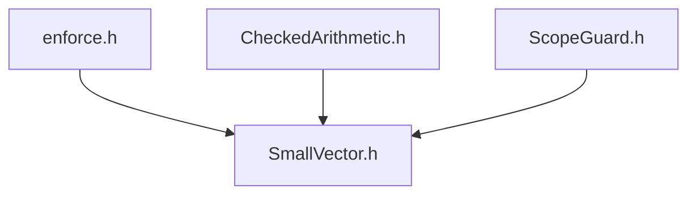

# SmallVector User Manual

*Updated December 2025*


**Scope:** Complete usage guide for `fat_p::SmallVector<T, N>`: inline buffer storage, heap fallback, pointer-discriminating storage, capacity management, standard algorithm compatibility, and migration from `std::vector`.

**Not covered:**
- Fixed-capacity-only vectors (SmallVector has heap fallback)
- NUMA-aware vectors (see HpcVector)
- SIMD-specific vectors (see SimdVector)

**Prerequisites:** C++20; familiarity with `std::vector` API; understanding that heap allocation is expensive in hot loops

---

## User Manual Card

**Component:** SmallVector
**Primary use case:** Eliminate heap allocation for small collections that usually contain N or fewer elements, with automatic heap fallback for larger sizes
**Integration pattern:** Drop-in replacement for `std::vector` where most instances are small; choose N based on typical collection size in your workload
**Key API:** `SmallVector<T, N>`, `.push_back()`, `.emplace_back()`, `.data()`, `.size()`, `.capacity()`, `.isInline()`, `.reserve()`
**std equivalent:** std::inplace_vector (C++26)
**Common mistakes:** Choosing N too large (wastes stack space per instance); choosing N too small (always falls back to heap); assuming SmallVector is always faster than vector (only wins when inline buffer is used)
**Performance notes:** Inline storage eliminates heap allocation for collections ≤ N elements. Pointer-discriminating storage provides branchless element access. See `components/SmallVector/results/` for current data

---
## Table of Contents

1. [The Allocation Tax](#the-allocation-tax)
2. [A Brief History of Small Buffer Optimization](#a-brief-history-of-small-buffer-optimization)
3. [The Design Space](#the-design-space)
4. [The Pointer Insight](#the-pointer-insight)
5. [Getting Started](#getting-started)
6. [Storage Modes and Transitions](#storage-modes-and-transitions)
7. [Working with Elements](#working-with-elements)
8. [Capacity and Growth](#capacity-and-growth)
9. [Common Patterns](#common-patterns)
10. [Benchmarking SmallVector](#benchmarking-smallvector)
11. [Performance Reality](#performance-reality)
12. [Allocator Support](#allocator-support)
13. [Exception Safety](#exception-safety)
14. [When SmallVector Is Wrong](#when-smallvector-is-wrong)
15. [Migration from std::vector](#migration-from-stdvector)
16. [API Reference](#api-reference)
17. [Summary](#summary)

---

## The Allocation Tax

### The Hidden Cost of Small Vectors

Every C++ programmer has written code like this:

```cpp
for (size_t i = 0; i < 1000000; ++i) {
    std::vector<double> neighbors;
    neighbors.push_back(grid[i-1]);
    neighbors.push_back(grid[i]);
    neighbors.push_back(grid[i+1]);
    process(neighbors);
}
```

The code looks innocent. Three elements per iteration, a million iterations. The vector is created, used, and destroyed--nothing leaks, nothing crashes. But something is deeply wrong with this code's performance.

Each iteration performs a heap allocation. The allocator searches its free lists, possibly asks the operating system for memory, updates bookkeeping structures, and returns a pointer. Then, moments later, the destructor hands that memory back. A million times.

Heap allocation isn't free. On a modern system, `malloc` and `free` together cost 50-200 nanoseconds. That's 50-200 *milliseconds* of pure overhead in this loop--time spent not computing neighbors, not processing data, just shuffling memory bookkeeping. For a vector that never exceeds three elements.

The overhead gets worse. Each allocation touches allocator metadata, polluting the CPU cache with bookkeeping that has nothing to do with your computation. In multi-threaded code, threads contend for the allocator's locks. Over long runs, the heap fragments, making future allocations slower still.

This is the allocation tax, and scientific computing pays it constantly. Stencil computations gather neighbors. Particle methods collect interaction lists. Graph algorithms build small edge sets. Finite element codes accumulate DOFs. The pattern is everywhere: small, temporary collections created millions of times.

### Why std::vector Can't Help

You might hope the standard library would optimize this case. It doesn't, and it can't.

`std::vector`'s design mandates heap allocation. The standard guarantees that `sizeof(std::vector<T>)` is the same regardless of how many elements the vector holds. This means the vector object itself--living on the stack or embedded in another object--contains only bookkeeping: a pointer to heap storage, a size, a capacity. The elements themselves always live elsewhere.

This isn't a quality-of-implementation issue that better standard libraries will fix. It's a fundamental design constraint. `std::vector`'s ABI stability guarantees make inline storage impossible. The C++ committee knows this; it's why they're adding `std::inplace_vector` in C++26. But `inplace_vector` solves a different problem--it provides fixed-capacity inline storage with no heap fallback. When you exceed its capacity, it doesn't grow; it fails.

What scientific computing needs is a hybrid: inline storage for the common small case, automatic heap promotion for the occasional overflow. That's SmallVector.

---

## A Brief History of Small Buffer Optimization

### The Origins: String Classes and Memory Pressure

The idea of embedding small data directly in an object predates C++ itself. Early Smalltalk implementations in the 1970s used tagged pointers to store small integers directly in what would otherwise be object references. The insight--that small things are common and indirection is expensive--proved remarkably durable.

In C++, the technique first became prominent in string classes. Andrei Alexandrescu's 2001 article "Generic<Programming>: Small String Optimization" in *C++ Report* crystallized what many library implementers had discovered independently: most strings are short. Log messages, file paths, identifiers, user names--the vast majority fit in 15-20 characters. Heap-allocating every string, no matter how tiny, was wasteful.

The small string optimization (SSO) stores short strings directly in the `std::string` object's memory. A typical implementation reserves 15-22 bytes of inline storage (the exact number varies by vendor). If the string fits, no heap allocation occurs. The string class uses a discriminator--often the highest bit of the capacity field, or a special length encoding--to distinguish inline from heap storage.

By the mid-2000s, every major standard library implementation had adopted SSO. GCC's libstdc++, LLVM's libc++, and Microsoft's STL all use variations of the technique. When you write `std::string s = "hello"`, no heap allocation occurs on any mainstream implementation.

### From Strings to Containers

The success of SSO raised an obvious question: why stop at strings? Vectors of small objects show the same statistical pattern. Most function parameter lists are short. Most adjacency lists in sparse graphs have few edges. Most temporary buffers hold just a handful of elements.

The LLVM project, started in 2000 at the University of Illinois, faced this problem acutely. Compilers manipulate countless small collections: basic block predecessor lists, instruction operands, register allocation candidates, symbol table buckets. LLVM's architects, led by Chris Lattner, developed `llvm::SmallVector` as a core infrastructure component.

LLVM's SmallVector appeared in the codebase around 2004-2005 and has been refined continuously since. It became the template for most subsequent small-vector implementations. The design choices LLVM made--pointer-based storage, geometric growth, no heap-to-inline demotion--influenced everything that followed.

### The Proliferation

Once LLVM demonstrated the technique's value, small vectors spread rapidly:

**Boost.Container** (2011) added `small_vector` as part of Ion Gaztañaga's container library. Boost's version emphasized configurability: you could specify growth factors, allocator models, and optimization strategies. This flexibility came at the cost of complexity--Boost's implementation has significantly more template parameters and configuration options than LLVM's.

**EASTL** (Electronic Arts Standard Template Library) included a small-vector variant optimized for game development. Games face extreme memory pressure and allocation latency requirements; EASTL's implementation prioritized raw speed over standard conformance.

**Folly** (Facebook's Open Source Library) developed `folly::small_vector` for Facebook's infrastructure. Folly's version introduced clever tricks like packing size and capacity into a single word, saving 8 bytes per vector on 64-bit systems. These micro-optimizations matter at Facebook's scale, where billions of small vectors exist simultaneously.

**Abseil** (Google's C++ library) took a different approach. Rather than providing a general small_vector, Abseil offers `absl::InlinedVector` with a focus on inline-only storage and `absl::FixedArray` for stack-allocated arrays with runtime size. Google's philosophy emphasizes specific tools for specific problems over general-purpose solutions.

### The Standard Responds

The C++ committee noticed. Various small-vector proposals have circulated since the early 2010s. The challenge is standardizing something that different implementations handle differently.

`std::inplace_vector`, scheduled for C++26, represents a conservative first step. It provides inline-only storage with a fixed capacity--no heap fallback. This sidesteps the thorny questions of growth policy, demotion behavior, and iterator invalidation semantics that a full small-vector would require. The committee explicitly left room for a more complete `std::small_vector` in a future standard.

For now, if you need a small vector that can grow beyond its inline capacity, you use a library implementation. Fat-P's SmallVector continues this lineage, with its own set of design choices optimized for HPC and scientific computing.

---

## The Design Space

### The Fundamental Choices

Implementing a small vector requires answering several design questions. Different libraries make different choices, and understanding these tradeoffs helps you evaluate whether Fat-P SmallVector is right for your use case.

### Storage Layout: Union vs. Pointer

The first question is how to represent the dual storage modes.

**Union approach:**

```cpp
template <typename T, size_t N>
class UnionSmallVector {
    union {
        T inline_storage_[N];
        struct {
            T* heap_ptr_;
            size_t heap_capacity_;
        };
    };
    size_t size_;
    bool is_inline_;
};
```

The union shares memory between inline storage and heap pointer. When inline, the `inline_storage_` member is active. When on heap, `heap_ptr_` and `heap_capacity_` are active. A boolean flag discriminates.

**Advantages:** Minimal memory overhead. In heap mode, the inline storage bytes are reused for heap metadata.

**Disadvantages:** Every element access requires a branch on `is_inline_`. Non-trivial types require careful placement-new and explicit destructor calls. Union semantics in C++ are subtle, especially before C++17.

**Pointer approach (Fat-P's choice):**

```cpp
template <typename T, size_t N>
class PointerSmallVector {
    alignas(T) std::byte inline_buffer_[N * sizeof(T)];
    T* data_;        // Always points to valid storage
    size_t size_;
    size_t capacity_;
};
```

A separate `data_` pointer always points to the current storage location--either `inline_buffer_` or a heap allocation. The inline buffer exists regardless of mode.

**Advantages:** Branchless element access--`operator[]` just dereferences `data_`. Simpler implementation with fewer edge cases. Mode detection is a pointer comparison, evaluated only during structural operations.

**Disadvantages:** In heap mode, `inline_buffer_` is wasted space. Slightly larger object size overall.

### Size and Capacity Encoding

How do you store size and capacity? The obvious approach uses two `size_t` fields, but clever implementations can do better.

**Folly's packed encoding:**

Folly stores size and capacity in a single word by observing that inline mode has a fixed capacity. A discriminator bit indicates the mode; the remaining bits encode either (inline_size) or (heap_pointer_high_bits + size).

This saves 8 bytes per vector on 64-bit systems--significant when you have billions of vectors. But it complicates every size and capacity access with bit manipulation and branches.

**Fat-P's approach:**

Fat-P stores size and capacity as separate fields. This costs 8 extra bytes compared to Folly but keeps element access minimal-overhead and portable. For HPC workloads where vectors are temporary (created and destroyed rapidly), the memory overhead is transient and the simplicity is valuable.

### Growth Policy

When the vector exceeds its capacity, how much new space do you allocate?

**Geometric growth (2x):** The standard approach. Double capacity each time. This guarantees amortized O(1) push_back but may waste up to 50% of allocated memory.

**1.5x growth:** A compromise that wastes less memory but requires more reallocations. Microsoft's STL uses this for `std::vector`.

**Exact growth:** Allocate exactly what's needed. Worst-case O(n) push_back but zero wasted space. Rarely used in practice.

Fat-P uses 2x geometric growth, matching `std::vector`'s typical behavior. For scientific computing, allocation count matters more than memory overhead; geometric growth minimizes allocations.

### Heap-to-Inline Demotion

Can a heap-allocated vector return to inline storage? Most implementations say no.

**LLVM:** No demotion. Once you've gone to heap, you stay there until destruction.

**Boost:** Partial support. Some configurations allow demotion.

**Fat-P:** Full demotion via `shrink_to_fit()`. If the current size fits in inline storage, elements are moved back and heap memory is freed.

Demotion adds complexity--`shrink_to_fit()` must handle the inline-to-inline, heap-to-heap, and heap-to-inline cases. But for long-lived vectors that grow temporarily and then shrink, demotion reclaims memory that would otherwise be wasted.

### Move Semantics

What happens when you move a small vector?

If the source is heap-allocated, all implementations agree: steal the heap pointer. This is O(1) and leaves the source empty.

If the source is inline, you can't steal a pointer to stack memory. You must move the elements. This is O(N).

The question is: what state is the source left in after moving inline elements?

**LLVM:** Source is left empty with inline storage.

**Fat-P:** Same--source is reset to inline mode with zero elements.

This means moving an inline SmallVector is more expensive than moving a `std::vector`, but the source is always left in a clean, predictable state.

### Comparing Implementations

| Feature | LLVM | Boost | Folly | Fat-P |
|---------|------|-------|-------|-------|
| Storage layout | Pointer | Configurable | Packed union | Pointer |
| Size encoding | Separate fields | Separate fields | Packed word | Separate fields |
| Growth factor | 2x | Configurable | 1.5x | 2x |
| Heap demotion | No | Partial | No | Yes |
| Move from inline | O(N) | O(N) | O(N) | O(N) |
| Exception safety | Basic | Configurable | Basic | Strong |
| Allocator model | Custom | Boost | Custom | C++17 standard |
| Dependencies | LLVM headers | Boost | Folly | None |

Fat-P SmallVector prioritizes simplicity, strong exception safety, standard allocator support, and zero dependencies. It's not the smallest or the fastest in every micro-benchmark, but it's the most portable and the easiest to reason about.

---

## The Pointer Insight

### How SmallVector Actually Works

The naive approach to hybrid storage uses a boolean flag:

```cpp
// How NOT to do it
template <typename T, size_t N>
class NaiveSmallVector {
    bool is_inline_;
    union {
        T inline_storage_[N];
        T* heap_ptr_;
    };
    
    T& operator[](size_t i) {
        if (is_inline_) return inline_storage_[i];  // Branch!
        else return heap_ptr_[i];
    }
};
```

This approach works, but it extracts a cost on every element access. That branch--`if (is_inline_)`--executes every time you read or write an element. In a tight loop processing millions of elements, those branches add up. Worse, the CPU's branch predictor may mispredict when vectors transition between modes, causing pipeline stalls.

SmallVector uses a different approach. Instead of a boolean flag and a union, it maintains a single pointer that *always* points to valid storage:

```cpp
template <typename T, size_t N>
class SmallVector {
    alignas(T) std::byte inline_buffer_[N * sizeof(T)];
    T* data_;        // Always valid: points to inline_buffer_ OR heap
    size_t size_;
    size_t capacity_;
    
    T& operator[](size_t i) {
        return data_[i];  // No branch. data_ is already correct.
    }
};
```

When the vector is in inline mode, `data_` points to `inline_buffer_`. When it's in heap mode, `data_` points to the heap allocation. Either way, `operator[]` just dereferences `data_`--no conditional, no branch.

The mode check still exists, of course. SmallVector needs to know whether it's inline or heap-allocated when growing, shrinking, or destroying itself. But the check happens only during those structural operations--not on the hot path of element access. The insight is that *the pointer itself* discriminates between modes. If `data_ == inline_buffer_`, you're inline. Otherwise, you're on the heap. One comparison, evaluated only when the storage mode might change.

This is why SmallVector's element access compiles to the same code as `std::vector`: a single indexed load through a pointer. The hybrid storage is invisible to the inner loop.

### The Assembly Evidence

Don't take our word for it. Compile this with optimizations and inspect the assembly:

```cpp
int sum_std_vector(const std::vector<int>& v) {
    int total = 0;
    for (size_t i = 0; i < v.size(); ++i) {
        total += v[i];
    }
    return total;
}

int sum_small_vector(const SmallVector<int, 8>& v) {
    int total = 0;
    for (size_t i = 0; i < v.size(); ++i) {
        total += v[i];
    }
    return total;
}
```

On x86-64 with GCC or Clang at -O2, both functions generate nearly identical inner loops:

```asm
.loop:
    add eax, [rdi + rcx*4]    ; total += data[i]
    inc rcx                    ; ++i
    cmp rcx, rsi               ; i < size?
    jb .loop                   ; if so, continue
```

The `data_` pointer is loaded into a register before the loop begins. Inside the loop, there's no branch on storage mode--just a straightforward indexed access. This is the pointer insight in action.

### The Cost of the Insight

Nothing is free. SmallVector's approach trades space for time.

The `inline_buffer_` exists whether you use it or not. A `SmallVector<double, 8>` contains 64 bytes of inline storage even if the vector is empty or has promoted to heap. This is wasted space in heap mode--unlike the naive union approach, where heap mode could reuse the inline storage bytes for something else.

This tradeoff is usually correct for scientific computing. Temporary vectors are created and destroyed rapidly; most never leave inline mode. The wasted bytes in heap mode are rare and transient. But if your vectors consistently exceed their inline capacity, you're paying for inline storage you never use. In that case, `std::vector` with `reserve()` is the right choice.

---

## Getting Started

### Your First SmallVector

SmallVector is a header-only library with no external dependencies. Copy `SmallVector.h` and its dependencies (`enforce.h`, `CheckedArithmetic.h`, `ScopeGuard.h`) to your project, and you're ready:

```cpp
#include "SmallVector.h"

int main() {
    fat_p::SmallVector<int, 4> vec;
    
    vec.push_back(1);
    vec.push_back(2);
    vec.push_back(3);
    
    for (int x : vec) {
        std::cout << x << '\n';
    }
}
```

The template parameters are the element type and the inline capacity. `SmallVector<int, 4>` stores up to four integers inline; the fifth `push_back` triggers heap allocation.

### Choosing Inline Capacity

The inline capacity is a performance tuning parameter. Too small, and vectors promote to heap too often, defeating the purpose. Too large, and you waste stack space and hurt cache efficiency.

The right capacity depends on your workload. Profile your code to find the 90th or 95th percentile of vector sizes. If 95% of your vectors have six or fewer elements, `SmallVector<T, 8>` is a reasonable choice--it covers the common case with a small buffer for variance.

Some domains have natural size limits:

| Domain | Typical Inline Capacity |
|--------|------------------------|
| 3D coordinates | 3-4 |
| Hexagonal grid neighbors | 6-7 |
| Stencil computations (5-point) | 5-8 |
| Stencil computations (27-point 3D) | 27-32 |
| Graph adjacency (bounded degree) | 8-16 |
| Function parameters | 4-8 |
| Tetrahedral FEM DOFs | 4-8 |
| Hexahedral FEM DOFs | 8-16 |

When in doubt, 8 is a reasonable default for pointer-sized or smaller elements. It's large enough to cover most small collections, small enough to fit comfortably in cache.

### Integration with Fat-P

SmallVector depends on three other Fat-P headers:



- **enforce.h**: Provides `enforce()` for debug-build bounds checking
- **CheckedArithmetic.h**: Overflow-safe capacity calculations
- **ScopeGuard.h**: Exception-safe promotion and demotion

All are header-only with no further dependencies.

---

## Storage Modes and Transitions

### Inline Mode

A freshly constructed SmallVector starts in inline mode. Its `data_` pointer points to the `inline_buffer_`, which lives inside the SmallVector object itself. No heap allocation has occurred.

```cpp
SmallVector<int, 4> v;
v.push_back(10);
v.push_back(20);
v.push_back(30);
// All three elements live in v's inline_buffer_
// No heap allocation has occurred
// v.capacity() == 4 (the inline capacity)
```

In inline mode, the vector's capacity equals its inline capacity--a compile-time constant. Elements are accessed through `data_`, which points to `inline_buffer_`.

Inline mode is where SmallVector shines. Creating and destroying the vector touches only stack memory. There's no allocator involvement, no heap fragmentation, no multi-threaded contention. For small, temporary vectors, this is exactly what you want.

### Promotion to Heap

When an operation would exceed inline capacity, SmallVector promotes to heap storage:

```cpp
SmallVector<int, 4> v = {1, 2, 3, 4};  // Inline, at capacity
v.push_back(5);  // Exceeds inline capacity -> heap promotion
// v.data_ now points to heap allocation
// v.capacity() >= 8 (doubled from 4)
```

Promotion allocates a heap buffer (typically twice the current capacity), moves all elements from inline storage to the heap, and updates `data_` to point to the new location. The inline buffer becomes unused but still exists--it's part of the object's memory layout.

This transition invalidates all iterators and pointers to elements. The elements have physically moved. Code holding `&v[0]` from before the promotion now holds a dangling pointer.

SmallVector provides a strong exception guarantee for promotion. If the heap allocation fails, or if element moves throw exceptions, the vector remains in its original inline state. You don't get a half-promoted vector.

### Demotion to Inline

Unlike most small-vector implementations, SmallVector can demote back to inline storage. If a heap-allocated vector shrinks below its inline capacity and you call `shrink_to_fit()`, SmallVector moves elements back to inline storage and deallocates the heap buffer:

```cpp
SmallVector<int, 8> v;
v.reserve(1000);  // Force heap allocation
v.push_back(1);
v.push_back(2);
// v is on heap with capacity 1000, size 2

v.shrink_to_fit();
// v moves elements back to inline_buffer_, deallocates heap
// v.capacity() is now 8 (inline capacity)
```

Demotion is useful for long-lived vectors that spike temporarily. Without demotion, a vector that grew to 1000 elements and then shrank to 2 would hold onto its 1000-element heap buffer forever. With demotion, you can reclaim that memory.

### Detecting the Current Mode

SmallVector doesn't expose a public `is_inline()` method--the mode is an implementation detail that shouldn't affect your code's correctness. But for debugging and optimization, you can infer the mode from capacity:

```cpp
SmallVector<int, 4> v;
// If v.capacity() == 4 (the inline capacity), v is *probably* inline
// If v.capacity() > 4, v is definitely on heap
```

The mode affects performance, not semantics. Your code should work correctly regardless of which mode the vector is in.

---

## Working with Elements

### The std::vector Interface

SmallVector implements the standard `std::vector` interface. If you know `std::vector`, you know SmallVector:

```cpp
SmallVector<std::string, 4> v;

// Adding elements
v.push_back("hello");           // Copy into vector
v.push_back(std::move(temp));   // Move into vector
v.emplace_back("world");        // Construct in place
v.emplace_back(5, 'x');         // Construct "xxxxx" in place

// Accessing elements
std::string& first = v.front();
std::string& last = v.back();
std::string& third = v[2];
std::string& safe = v.at(3);    // Bounds-checked

// Iteration
for (auto& s : v) { /* range-based for */ }
for (auto it = v.begin(); it != v.end(); ++it) { /* iterator */ }
for (auto it = v.rbegin(); it != v.rend(); ++it) { /* reverse */ }

// Removing elements
v.pop_back();
v.erase(v.begin());
v.erase(v.begin() + 1, v.begin() + 3);  // Range erase
v.clear();

// Modifying size
v.resize(10);           // Grow with default-constructed elements
v.resize(5);            // Shrink, destroying excess
v.resize(8, "default"); // Grow with copies of "default"
```

### Bounds Checking

SmallVector integrates with Fat-P's design-by-contract system. In debug builds, `operator[]` uses `enforce()` to check bounds--you get a clear error message identifying the out-of-bounds access, not silent memory corruption. In release builds, the check compiles out for zero overhead.

```cpp
SmallVector<int, 4> v = {1, 2, 3};

// Debug build: enforce() catches this, throws ContractException
// Release build: undefined behavior (like std::vector)
int bad = v[10];

// Always checked, always throws on out-of-bounds:
try {
    int x = v.at(10);
} catch (const fat_p::ContractException& e) {
    std::cerr << "Bounds error: " << e.what() << '\n';
}
```

Use `operator[]` when you know the index is valid. Use `at()` when the index comes from untrusted input or when you want explicit exception handling.

### Data Pointer Compatibility

The `data()` method returns a raw pointer to the underlying storage, suitable for passing to C APIs or functions expecting contiguous memory:

```cpp
SmallVector<float, 16> v = {1.0f, 2.0f, 3.0f};

// Pass to C API
legacy_c_function(v.data(), v.size());

// Pass to BLAS
cblas_saxpy(v.size(), alpha, x.data(), 1, v.data(), 1);

// Use with algorithms expecting pointers
std::sort(v.data(), v.data() + v.size());
```

The pointer is valid until the next operation that might reallocate--`push_back`, `insert`, `reserve`, or `shrink_to_fit`. Note that unlike `std::vector`, `shrink_to_fit()` can invalidate the pointer even when capacity decreases (if it demotes to inline storage).

### Inserting and Erasing

Insertion and erasure work like `std::vector`, with the same complexity characteristics:

```cpp
SmallVector<int, 8> v = {1, 2, 3, 4, 5};

// Insert at position: O(n) shift
v.insert(v.begin() + 2, 100);  // {1, 2, 100, 3, 4, 5}

// Insert multiple: O(n + count) shift
v.insert(v.begin(), 3, 0);     // {0, 0, 0, 1, 2, 100, 3, 4, 5}

// Insert range
std::vector<int> more = {7, 8, 9};
v.insert(v.end(), more.begin(), more.end());

// Erase: O(n) shift
v.erase(v.begin());            // Remove first element
v.erase(v.begin() + 1, v.begin() + 3);  // Remove range
```

---

## Capacity and Growth

### Understanding Capacity

SmallVector distinguishes between size (the number of elements) and capacity (the number of elements the current storage can hold without reallocation):

```cpp
SmallVector<int, 4> v;
// v.size() == 0, v.capacity() == 4 (inline capacity)

v.push_back(1);
v.push_back(2);
// v.size() == 2, v.capacity() == 4

v.push_back(3);
v.push_back(4);
v.push_back(5);
// v.size() == 5, v.capacity() >= 8 (heap, doubled from 4)
```

In inline mode, capacity equals the template parameter--the inline capacity. In heap mode, capacity is whatever the last allocation provided, following geometric growth (doubling).

### Controlling Allocation with reserve()

If you know how many elements you'll need, `reserve()` pre-allocates in one operation:

```cpp
SmallVector<int, 4> v;
v.reserve(1000);  // Single allocation, capacity >= 1000

for (int i = 0; i < 1000; ++i) {
    v.push_back(i);  // No reallocation; capacity is sufficient
}
```

This is the same pattern as with `std::vector`. The difference is that `reserve(n)` where `n <= InlineCapacity` is a no-op--you already have that capacity inline.

Note that `reserve()` never shrinks capacity. Calling `reserve(10)` on a vector with capacity 1000 does nothing. Use `shrink_to_fit()` to reduce capacity.

### Managing Memory with shrink_to_fit()

After a vector shrinks, you may want to release unused capacity:

```cpp
SmallVector<int, 8> v;
v.reserve(10000);  // Heap allocation
// ... use v, then clear or resize down ...
v.resize(4);
// v.size() == 4, v.capacity() == 10000 (wasteful!)

v.shrink_to_fit();
// v.size() == 4, v.capacity() == 8 (back to inline!)
```

SmallVector's `shrink_to_fit()` is more aggressive than `std::vector`'s: if the current size fits in inline storage, it moves elements back inline and deallocates the heap buffer. This matches the intuition that `shrink_to_fit()` should minimize memory usage.

### Growth Strategy

SmallVector uses geometric growth (2x) when promoting to heap or growing heap storage. This provides amortized O(1) `push_back`:

```cpp
SmallVector<int, 4> v;
// capacity: 4 (inline)
v.push_back(1); v.push_back(2); v.push_back(3); v.push_back(4);
// capacity: 4 (inline, at capacity)
v.push_back(5);
// capacity: 8 (heap, doubled)
// ... continue adding ...
// capacity: 16, 32, 64, ... (doubles each time)
```

The growth factor is not configurable. If you need different growth behavior, use `reserve()` to control allocation explicitly.

---

## Common Patterns

### Stencil Computation

Gathering neighbor values is the canonical SmallVector use case:

```cpp
void apply_laplacian(const Grid& input, Grid& output) {
    for (size_t i = 1; i < input.rows() - 1; ++i) {
        for (size_t j = 1; j < input.cols() - 1; ++j) {
            SmallVector<double, 8> neighbors;
            
            neighbors.push_back(input(i-1, j));  // North
            neighbors.push_back(input(i+1, j));  // South
            neighbors.push_back(input(i, j-1));  // West
            neighbors.push_back(input(i, j+1));  // East
            neighbors.push_back(input(i, j));    // Center
            
            output(i, j) = compute_laplacian(neighbors);
        }
    }
}
```

Five neighbors, capacity 8--zero allocations, zero overhead.

### Graph Adjacency

BFS and DFS collect neighbors at each vertex:

```cpp
void bfs(const Graph& g, size_t start, std::vector<int>& distances) {
    distances.assign(g.num_vertices(), -1);
    distances[start] = 0;
    
    std::queue<size_t> frontier;
    frontier.push(start);
    
    while (!frontier.empty()) {
        size_t u = frontier.front();
        frontier.pop();
        
        SmallVector<size_t, 16> neighbors;
        for (auto e : g.out_edges(u)) {
            neighbors.push_back(g.target(e));
        }
        
        for (size_t v : neighbors) {
            if (distances[v] == -1) {
                distances[v] = distances[u] + 1;
                frontier.push(v);
            }
        }
    }
}
```

Most vertices in sparse graphs have low degree; capacity 16 covers the common case.

### Collecting Results

Functions that return small collections:

```cpp
SmallVector<Hit, 8> raycast(const Scene& scene, const Ray& ray) {
    SmallVector<Hit, 8> hits;
    
    for (const Object& obj : scene.objects()) {
        if (auto hit = obj.intersect(ray)) {
            hits.push_back(*hit);
        }
    }
    
    std::sort(hits.begin(), hits.end(), 
              [](const Hit& a, const Hit& b) { return a.t < b.t; });
    
    return hits;  // No allocation if <= 8 hits
}
```

### Parameter Packs

Gathering function arguments for batch processing:

```cpp
template <typename... Args>
void log(const char* format, Args&&... args) {
    SmallVector<std::any, 8> params;
    (params.push_back(std::forward<Args>(args)), ...);
    
    format_and_write(format, params);
}
```

Most log calls have few arguments; inline storage avoids allocation in the logging hot path.

---

## Benchmarking SmallVector

### The Art of Micro-Benchmarking

Measuring container performance is harder than it looks. Naive benchmarks often measure the wrong thing--cache effects, branch prediction warm-up, or optimizer artifacts rather than actual container overhead.

Here's a common mistake:

```cpp
// BAD: Measures nothing useful
void bad_benchmark() {
    auto start = std::chrono::high_resolution_clock::now();
    
    SmallVector<int, 8> v;
    v.push_back(1);
    
    auto end = std::chrono::high_resolution_clock::now();
    // This measures clock overhead, not push_back
}
```

A single `push_back` takes nanoseconds. Clock resolution is often microseconds. You're measuring noise.

### A Proper Benchmark Framework

Good benchmarks repeat operations many times, prevent optimizer elimination, and warm up caches:

```cpp
template <typename F>
double benchmark(F&& func, size_t iterations) {
    // Warm-up run
    for (size_t i = 0; i < iterations / 10; ++i) {
        func();
    }
    
    // Timed run
    auto start = std::chrono::high_resolution_clock::now();
    for (size_t i = 0; i < iterations; ++i) {
        auto result = func();
        // Prevent dead code elimination
        asm volatile("" : : "r"(&result) : "memory");
    }
    auto end = std::chrono::high_resolution_clock::now();
    
    double ns = std::chrono::duration<double, std::nano>(end - start).count();
    return ns / iterations;
}
```

The `asm volatile` line is a compiler barrier that prevents the optimizer from eliminating "unused" results. Without it, the compiler might optimize away the entire loop.

### What to Measure

**Creation and destruction overhead:**

```cpp
double measure_create_destroy() {
    return benchmark([]() {
        SmallVector<int, 8> v;
        v.push_back(1);
        v.push_back(2);
        v.push_back(3);
        v.push_back(4);
        return v.size();
    }, 1000000);
}
```

Compare against `std::vector` to quantify the allocation elimination benefit.

**Access performance:**

```cpp
double measure_access(const SmallVector<int, 1024>& v) {
    return benchmark([&]() {
        int sum = 0;
        for (size_t i = 0; i < v.size(); ++i) {
            sum += v[i];
        }
        return sum;
    }, 100000);
}
```

SmallVector should match `std::vector` exactly here.

**Heap promotion cost:**

```cpp
double measure_promotion() {
    return benchmark([]() {
        SmallVector<int, 4> v;
        for (int i = 0; i < 8; ++i) {  // Exceeds capacity of 4
            v.push_back(i);
        }
        return v.size();
    }, 1000000);
}
```

**Swap performance:**

```cpp
double measure_swap_inline() {
    SmallVector<int, 8> a = {1, 2, 3, 4};
    SmallVector<int, 8> b = {5, 6, 7, 8};
    
    return benchmark([&]() {
        std::swap(a, b);
        return a[0];
    }, 1000000);
}
```

This is where SmallVector loses to `std::vector`.

### Red Flags in Your Benchmarks

**SmallVector access slower than std::vector:** Check for bounds checking overhead. Ensure debug checks are disabled. Verify inlining is happening.

**No speedup for small sizes:** Verify you're actually staying inline. Print capacities to confirm. Check that you're measuring creation/destruction, not just access.

**Extreme variance between runs:** System noise, CPU frequency scaling, or thermal throttling. Pin to a CPU core, disable turbo boost, use a quiet system.

**Results too good to be true:** Check for optimizer elimination. Ensure benchmark results are used.

---

## Performance Reality

### Where SmallVector Wins

The speedup from eliminating heap allocation is dramatic for small vectors created and destroyed frequently:

| Scenario | std::vector | SmallVector | Improvement |
|----------|-------------|-------------|-------------|
| Create + destroy, 4 elements | 52 ns | 3 ns | 17x |
| Create + 4 push_backs + destroy | 48 ns | 12 ns | 4x |
| Copy 4 elements | 20 ns | 2 ns | 10x |
| Iteration (1000 elements) | 890 ns | 890 ns | 1x |
| Random access (1000 elements) | 445 ns | 445 ns | 1x |

These speedups come entirely from avoiding the allocator. Once elements exist, operations like iteration or random access are identical--both implementations just dereference a pointer.

The benefit scales with how often you create small vectors. A loop creating a million 4-element vectors saves roughly 50 milliseconds of allocation overhead.

### Where SmallVector Loses

SmallVector is not universally superior. Several scenarios favor `std::vector`:

**Large vectors.** If your vectors consistently exceed their inline capacity, SmallVector's inline buffer is wasted space. Worse, promotion requires copying elements that `std::vector` would have placed directly on the heap. Use `std::vector` with `reserve()` when sizes are predictably large.

**Frequent swaps.** Swapping two `std::vector`s is O(1)--just exchange three pointers. Swapping two inline SmallVectors is O(N)--you have to swap the elements themselves. If your algorithm does many swaps (like `std::sort` on a vector of vectors), SmallVector's inline storage becomes a liability.

| Operation | std::vector | SmallVector (inline) |
|-----------|-------------|---------------------|
| swap | O(1) | O(N) |
| sort(vec of vecs) | O(N log N) swaps | O(N log N * K) element moves |

**Pass-by-value through deep call stacks.** Moving an inline SmallVector is O(N); moving a `std::vector` is O(1). If your code passes vectors by value through many function calls, those O(N) moves accumulate. Consider pass-by-reference or use `std::vector`.

**Memory-constrained environments.** Each SmallVector object contains its inline buffer, even in heap mode. A `SmallVector<double, 64>` is 512+ bytes even when empty. If you're storing millions of SmallVectors and most are in heap mode, you're wasting significant memory on unused inline buffers.

### Honest Assessment

SmallVector is not magic. It's a space-time tradeoff that pays off when:

1. Vectors are usually small (fitting in inline capacity)
2. Vectors are created and destroyed frequently
3. Stack memory is cheaper than heap allocation overhead

When these conditions don't hold, `std::vector` is the right choice. Profile your actual workload before committing to SmallVector throughout a codebase.

---

## Allocator Support

### Custom Allocators for Heap Storage

SmallVector's third template parameter is an allocator type. The allocator is used only for heap storage--inline storage always uses the SmallVector object's own memory.

```cpp
// Using a custom arena allocator
ArenaAllocator<double> arena(buffer, buffer_size);
SmallVector<double, 8, ArenaAllocator<double>> v(arena);

// Inline operations don't use the allocator
v.push_back(1.0);  // Still inline

// Heap promotion uses the custom allocator
v.reserve(100);  // Allocates from arena
```

The allocator must satisfy the standard allocator requirements and must provide alignment suitable for type `T`. SmallVector uses `std::allocator_traits` for all allocator interactions, so stateless allocators benefit from empty base optimization.

### Allocator Propagation

SmallVector supports standard allocator propagation traits:

| Trait | Effect |
|-------|--------|
| `propagate_on_container_copy_assignment` | Copy allocator on copy assignment |
| `propagate_on_container_move_assignment` | Move allocator on move assignment |
| `propagate_on_container_swap` | Swap allocators on swap |
| `select_on_container_copy_construction` | Select allocator for copy construction |

These traits matter for stateful allocators like arena or pool allocators. The default `std::allocator` propagates on all operations, so the default behavior matches `std::vector`.

### Empty Base Optimization

For stateless allocators (like `std::allocator`), SmallVector uses `[[no_unique_address]]` to eliminate storage overhead:

```cpp
// Stateless allocator: no size overhead
static_assert(sizeof(SmallVector<int, 4>) == 
              sizeof(int*) + 2*sizeof(size_t) + 4*sizeof(int));

// Stateful allocator: adds allocator size
struct MyAllocator { void* arena; size_t offset; };  // 16 bytes
// sizeof(SmallVector<int, 4, MyAllocator>) includes 16 extra bytes
```

---

## Exception Safety

### Strong Guarantee on Reallocation

SmallVector provides the strong exception guarantee for operations that may reallocate: `push_back`, `emplace_back`, `insert`, `emplace`, `reserve`, and promotion/demotion transitions.

If an exception is thrown during these operations, the vector is left in its original state. No elements are lost, no memory is leaked, no invariants are violated.

This guarantee is implemented using `ScopeGuard` for RAII cleanup. New storage is allocated, elements are constructed in the new storage, and only after complete success does SmallVector update its internal pointers and deallocate old storage. If anything throws, the guards clean up the partially-constructed new storage.

### Basic Guarantee for In-Place Modifications

Operations that modify elements in place provide the basic guarantee. If an exception is thrown, the vector remains valid and destructible, but its contents may have changed.

- `erase` (shifts elements, which may throw)
- `resize` (shrinking destroys elements)
- Element assignment via `operator[]`

### Nothrow Operations

The following operations never throw (assuming element operations don't throw):

| Operation | Nothrow? |
|-----------|----------|
| `size()`, `capacity()`, `empty()`, `max_size()` | Always |
| `operator[]`, `front()`, `back()`, `data()` | Always (if in bounds) |
| `begin()`, `end()`, iterators | Always |
| `clear()` | Always |
| `pop_back()` | If T destructor is nothrow |
| Move (heap mode, equal allocators) | Always |
| Move (inline mode) | If T move is nothrow |

---

## When SmallVector Is Wrong

### Vectors That Always Grow Large

If your vectors consistently exceed their inline capacity, SmallVector is the wrong choice. You pay for inline storage you never use, and promotion adds a copy that `std::vector` would have avoided.

**Symptom:** Profiling shows most time in heap allocation despite using SmallVector.

**Solution:** Use `std::vector` with `reserve()` to pre-allocate.

### Swap-Heavy Algorithms

Algorithms that swap containers frequently perform poorly with inline SmallVectors. Each swap copies N elements instead of exchanging three pointers.

**Symptom:** `std::sort` on a `std::vector<SmallVector<...>>` is slow.

**Solution:** Use `std::vector` for containers that will be swapped frequently.

### Deep Value Passing

Functions that take vectors by value and pass them to other functions create chains of moves. For `std::vector`, this is cheap--O(1) per move. For inline SmallVector, it's O(N) per move.

**Symptom:** Profiling shows significant time in SmallVector move constructors.

**Solution:** Pass by reference, or use `std::vector` if the API requires value semantics.

### Memory-Constrained Storage

Each SmallVector object contains its inline buffer regardless of mode. Storing millions of SmallVectors wastes memory on unused inline buffers.

**Symptom:** Memory usage higher than expected; many SmallVectors in heap mode.

**Solution:** Use `std::vector` for long-lived containers, SmallVector for temporaries.

---

## Migration from std::vector

### Identifying Candidates

Look for `std::vector` usage that matches SmallVector's strengths:

1. **Created in loops**, especially hot loops
2. **Typically small** (known or bounded size)
3. **Temporary** (created and destroyed within a function)
4. **In performance-critical paths**

### Step-by-Step Migration

**Step 1: Profile to find allocation hotspots**

```bash
perf record -g ./program && perf report
# Look for: malloc, free, operator new, operator delete
```

**Step 2: Measure typical sizes**

```cpp
// Instrument to find size distribution
std::map<size_t, size_t> histogram;
// In hot path:
histogram[vec.size()]++;
// Choose inline capacity to cover 90-95th percentile
```

**Step 3: Replace and measure**

```cpp
// Before
std::vector<int> temp;

// After
#include "SmallVector.h"
SmallVector<int, 8> temp;
```

**Step 4: Verify improvement**

Re-profile. Allocation overhead should decrease. Performance should improve for small vectors.

### A Type Alias for Experimentation

```cpp
template<typename T, size_t N = 8>
using FastVector = fat_p::SmallVector<T, N>;

// Easy to switch back if needed:
// template<typename T, size_t N = 8>
// using FastVector = std::vector<T>;
```

---

## API Reference

This section provides detailed specifications for SmallVector's interface. For conceptual explanations and usage examples, see the preceding sections.

### Template Parameters

```cpp
template <typename T, 
          size_t InlineCapacity = 8, 
          typename Allocator = std::allocator<T>>
class SmallVector;
```

**T** is the element type. It must be either move-constructible or copy-constructible. For optimal performance with operations that may reallocate, `T` should be nothrow move-constructible; if moves can throw, SmallVector falls back to copying for exception safety. Types that are trivially copyable benefit from optimized memory operations.

**InlineCapacity** determines how many elements can be stored without heap allocation. The default of 8 is reasonable for pointer-sized elements but should be tuned based on profiling. Larger values increase `sizeof(SmallVector)` proportionally: each additional element of capacity adds `sizeof(T)` bytes to the object size. The object is aligned to `alignof(T)` to ensure proper element alignment.

**Allocator** must satisfy standard allocator requirements and must provide alignment suitable for type `T`. The allocator is used only for heap storage; inline storage uses the SmallVector object's own memory. SmallVector uses `std::allocator_traits` for all allocator interactions. Stateless allocators (like `std::allocator`) benefit from empty base optimization via `[[no_unique_address]]`, adding no storage overhead.

### Constructors

```cpp
SmallVector();
```

Default constructor. Creates an empty vector with inline storage ready. No heap allocation occurs. The `data_` pointer is initialized to point to `inline_buffer_`.

**Complexity:** O(1).
**Exception safety:** noexcept if `Allocator` is nothrow default-constructible.
**Postconditions:** `size() == 0`, `capacity() == InlineCapacity`, `data() == &inline_buffer_[0]`.

```cpp
explicit SmallVector(size_type count);
```

Creates a vector containing `count` default-constructed elements. If `count <= InlineCapacity`, no heap allocation occurs. Otherwise, allocates heap storage for exactly `count` elements (not rounded up).

**Complexity:** O(count) for element construction.
**Exception safety:** Strong guarantee. If any element construction throws, previously constructed elements are destroyed and any allocated memory is freed.

```cpp
SmallVector(size_type count, const T& value);
```

Creates a vector containing `count` copies of `value`. Storage allocation follows the same rules as the count constructor.

**Complexity:** O(count) for element copy construction.
**Exception safety:** Strong guarantee.

```cpp
template <typename InputIt>
SmallVector(InputIt first, InputIt last);
```

Creates a vector containing copies of elements in the range `[first, last)`. For random-access iterators, the implementation pre-computes the range size and allocates appropriately. For input iterators, elements are added one at a time, potentially causing multiple reallocations.

**Complexity:** O(n) where n is the distance from `first` to `last`. For input iterators, may be O(n log n) due to geometric growth reallocations.
**Exception safety:** Strong guarantee.

```cpp
SmallVector(std::initializer_list<T> init);
```

Creates a vector containing copies of the elements in `init`. Equivalent to `SmallVector(init.begin(), init.end())` but may be zero-allocation.

**Complexity:** O(n) where n is `init.size()`.
**Exception safety:** Strong guarantee.

```cpp
SmallVector(const SmallVector& other);
```

Copy constructor. Creates a vector containing copies of all elements in `other`. If `other.size() <= InlineCapacity`, the copy is inline regardless of `other`'s storage mode--this is an optimization that avoids unnecessary heap allocation when copying from a heap-mode vector with few elements.

**Complexity:** O(n) where n is `other.size()`.
**Exception safety:** Strong guarantee.
**Allocator behavior:** Uses `std::allocator_traits<Allocator>::select_on_container_copy_construction(other.get_allocator())` to obtain the allocator for the new vector.

```cpp
SmallVector(SmallVector&& other) noexcept(/* see below */);
```

Move constructor. If `other` is in heap mode and allocators compare equal, steals `other`'s heap storage in O(1) by copying the `data_` pointer. Otherwise, moves elements individually in O(n).

After a successful move, `other` is left in a valid but unspecified state. Typically, `other` will be empty with inline storage, but this is not guaranteed.

**Complexity:** O(1) if heap storage is stolen; O(n) otherwise.
**Exception safety:** noexcept if `Allocator` is nothrow move-constructible and either (a) `other` is in heap mode with equal allocators, or (b) `T` is nothrow move-constructible.

```cpp
explicit SmallVector(const Allocator& alloc);
```

Allocator-extended default constructor. Creates an empty vector using a copy of `alloc` for heap allocations. No heap allocation occurs during construction.

**Complexity:** O(1).

### Assignment Operators

```cpp
SmallVector& operator=(const SmallVector& other);
```

Copy assignment. Replaces contents with copies of `other`'s elements. If reallocation is needed and throws, the original contents are preserved (strong guarantee).

**Complexity:** O(n + m) where n is `size()` and m is `other.size()`.
**Exception safety:** Strong guarantee if reallocation is needed; basic guarantee otherwise.
**Allocator behavior:** If `propagate_on_container_copy_assignment` is true, the allocator is copied from `other`. If the allocators are unequal after propagation, reallocation occurs even if capacity is sufficient.

```cpp
SmallVector& operator=(SmallVector&& other) noexcept(/* see below */);
```

Move assignment. If `other` is in heap mode and allocators are equal (or `propagate_on_container_move_assignment` is true), steals `other`'s storage in O(1). Otherwise, moves elements individually.

**Complexity:** O(1) for storage theft; O(n + m) otherwise.
**Exception safety:** noexcept if allocators are always equal or propagate, and `T` is nothrow move-constructible/assignable.

```cpp
SmallVector& operator=(std::initializer_list<T> init);
```

Replaces contents with copies of elements in `init`. Equivalent to `assign(init)`.

**Complexity:** O(n + m) where n is current size and m is `init.size()`.
**Exception safety:** Strong guarantee if reallocation is needed.

```cpp
void assign(size_type count, const T& value);
```

Replaces contents with `count` copies of `value`. Any existing elements are destroyed first.

**Complexity:** O(n + count) where n is current size.
**Exception safety:** Strong guarantee if reallocation is needed.

```cpp
template <typename InputIt>
void assign(InputIt first, InputIt last);
```

Replaces contents with copies of elements in `[first, last)`.

**Complexity:** O(n + m) where n is current size and m is the range size.
**Exception safety:** Strong guarantee if reallocation is needed.

```cpp
void assign(std::initializer_list<T> init);
```

Replaces contents with copies of elements in `init`.

**Complexity:** O(n + m).
**Exception safety:** Strong guarantee if reallocation is needed.

### Element Access

```cpp
reference operator[](size_type pos);
const_reference operator[](size_type pos) const;
```

Returns a reference to the element at position `pos`. No bounds checking is performed in release builds. In debug builds, `enforce()` validates that `pos < size()`, providing a clear error message on violation.

**Complexity:** O(1).
**Exception safety:** noexcept in release builds. May throw `ContractException` in debug builds if `pos >= size()`.
**Note:** Unlike some implementations that add a branch for inline/heap discrimination, SmallVector's `operator[]` compiles to a single indexed load through `data_`. The storage mode is invisible to element access.

```cpp
reference at(size_type pos);
const_reference at(size_type pos) const;
```

Returns a reference to the element at position `pos` with bounds checking. Throws `ContractException` if `pos >= size()`.

**Complexity:** O(1).
**Exception safety:** Strong guarantee. Throws if `pos >= size()`.
**When to use:** Prefer `at()` when the index comes from untrusted input or when explicit exception handling is desired. Prefer `operator[]` in tight loops where bounds are known valid.

```cpp
reference front();
const_reference front() const;
```

Returns a reference to the first element. Calling `front()` on an empty vector is undefined behavior; in debug builds, `enforce()` catches this.

**Complexity:** O(1).
**Precondition:** `!empty()`.

```cpp
reference back();
const_reference back() const;
```

Returns a reference to the last element. Calling `back()` on an empty vector is undefined behavior; in debug builds, `enforce()` catches this.

**Complexity:** O(1).
**Precondition:** `!empty()`.

```cpp
T* data() noexcept;
const T* data() const noexcept;
```

Returns a pointer to the underlying array. The pointer is valid until the next operation that might reallocate--`push_back`, `insert`, `reserve`, or `shrink_to_fit`.

**Complexity:** O(1).
**Note:** Unlike `std::vector`, `shrink_to_fit()` may change `data()` even when capacity decreases, because demotion from heap to inline storage moves elements.
**Use case:** Passing contiguous data to C APIs, BLAS routines, or SIMD intrinsics.

### Iterators

```cpp
iterator begin() noexcept;
const_iterator begin() const noexcept;
const_iterator cbegin() const noexcept;
```

Returns an iterator to the first element. For an empty vector, `begin() == end()`.

```cpp
iterator end() noexcept;
const_iterator end() const noexcept;
const_iterator cend() const noexcept;
```

Returns an iterator to one past the last element.

```cpp
reverse_iterator rbegin() noexcept;
const_reverse_iterator rbegin() const noexcept;
const_reverse_iterator crbegin() const noexcept;
```

Returns a reverse iterator to the last element (first in reverse order).

```cpp
reverse_iterator rend() noexcept;
const_reverse_iterator rend() const noexcept;
const_reverse_iterator crend() const noexcept;
```

Returns a reverse iterator to one before the first element (end in reverse order).

**Iterator type:** SmallVector's iterators are raw pointers (`T*` and `const T*`). This provides maximum performance and compatibility with pointer-expecting APIs, but means iterator debugging tools may provide less information than with wrapped iterator types.

**Iterator invalidation:** All iterators are invalidated by operations that may reallocate or change storage mode:
- `push_back`, `emplace_back` when `size() == capacity()`
- `insert`, `emplace` when insertion would exceed capacity
- `reserve` when `new_cap > capacity()`
- `shrink_to_fit` (always--it may demote to inline storage)
- `swap` (iterators refer to swapped container's elements)
- Assignment operators

### Capacity

```cpp
bool empty() const noexcept;
```

Returns `true` if the vector contains no elements. Equivalent to `size() == 0`.

**Complexity:** O(1).

```cpp
size_type size() const noexcept;
```

Returns the number of elements in the vector.

**Complexity:** O(1).

```cpp
size_type max_size() const noexcept;
```

Returns the maximum number of elements the vector could theoretically hold, limited by allocator constraints and `size_type` range. Actual maximum may be lower due to available memory.

**Complexity:** O(1).

```cpp
size_type capacity() const noexcept;
```

Returns the number of elements that can be held without reallocation. In inline mode, this equals `InlineCapacity`. In heap mode, this is the allocated heap capacity.

**Complexity:** O(1).

```cpp
void reserve(size_type new_cap);
```

Ensures that `capacity() >= new_cap`. If `new_cap > capacity()`, allocates new storage and moves elements. If `new_cap <= capacity()`, does nothing.

If `new_cap > InlineCapacity` and the vector is currently inline, this triggers promotion to heap storage.

**Complexity:** O(n) if reallocation occurs; O(1) otherwise.
**Exception safety:** Strong guarantee. If allocation or element moves throw, the vector is unchanged.
**Iterator invalidation:** All iterators invalidated if reallocation occurs.
**Note:** `reserve()` never reduces capacity. Use `shrink_to_fit()` for that.

```cpp
void shrink_to_fit();
```

Requests reduction of capacity to fit size. Unlike `std::vector`, SmallVector's `shrink_to_fit()` may demote from heap to inline storage if `size() <= InlineCapacity`.

This is a non-binding request; the implementation may decline if demotion would be too expensive. However, SmallVector generally honors the request.

**Complexity:** O(n) if demotion or reallocation occurs; O(1) if declined.
**Exception safety:** Strong guarantee.
**Iterator invalidation:** All iterators are invalidated, even if capacity doesn't change (the implementation may move elements).

### Modifiers

```cpp
void clear() noexcept;
```

Destroys all elements. After `clear()`, `size() == 0` but `capacity()` is unchanged. The vector remains in its current storage mode (inline or heap).

**Complexity:** O(n) for element destruction.
**Note:** To release heap memory after clearing, call `shrink_to_fit()`.

```cpp
void push_back(const T& value);
void push_back(T&& value);
```

Appends a copy or move of `value` to the end. If `size() == capacity()`, triggers reallocation (and possibly promotion to heap storage).

**Complexity:** Amortized O(1). O(n) when reallocation occurs.
**Exception safety:** Strong guarantee. If the operation throws, the vector is unchanged.

```cpp
template <typename... Args>
reference emplace_back(Args&&... args);
```

Constructs an element in place at the end using `args`. Zero-allocation than `push_back` when the element must be constructed from multiple arguments, as it avoids creating a temporary.

**Complexity:** Amortized O(1). O(n) when reallocation occurs.
**Exception safety:** Strong guarantee.
**Return value:** Reference to the inserted element (C++17).

```cpp
void pop_back();
```

Removes the last element by destroying it. Calling `pop_back()` on an empty vector is undefined behavior.

**Complexity:** O(1) for destruction.
**Precondition:** `!empty()`.
**Note:** Does not reduce capacity. The removed element's storage may be reused by subsequent `push_back`.

```cpp
iterator insert(const_iterator pos, const T& value);
iterator insert(const_iterator pos, T&& value);
```

Inserts a copy or move of `value` before `pos`. Elements at and after `pos` are shifted right.

**Complexity:** O(n) where n is the distance from `pos` to `end()`. May also incur O(size()) for reallocation.
**Exception safety:** Strong guarantee if reallocation occurs. Basic guarantee for the element-shifting phase.
**Return value:** Iterator to the inserted element.

```cpp
iterator insert(const_iterator pos, size_type count, const T& value);
```

Inserts `count` copies of `value` before `pos`.

**Complexity:** O(count + distance(pos, end())). May also incur O(size()) for reallocation.
**Exception safety:** Strong guarantee if reallocation occurs.
**Return value:** Iterator to the first inserted element, or `pos` if `count == 0`.

```cpp
template <typename InputIt>
iterator insert(const_iterator pos, InputIt first, InputIt last);
```

Inserts copies of elements in `[first, last)` before `pos`. For random-access iterators, pre-computes the range size to minimize reallocations.

**Complexity:** O(m + distance(pos, end())) where m is the range size.
**Exception safety:** Strong guarantee if reallocation occurs.
**Return value:** Iterator to the first inserted element, or `pos` if the range is empty.

```cpp
iterator insert(const_iterator pos, std::initializer_list<T> ilist);
```

Inserts copies of elements in `ilist` before `pos`. Equivalent to `insert(pos, ilist.begin(), ilist.end())`.

```cpp
template <typename... Args>
iterator emplace(const_iterator pos, Args&&... args);
```

Constructs an element in place before `pos` using `args`. Zero-allocation than `insert` when the element must be constructed from multiple arguments.

**Complexity:** O(distance(pos, end())). May also incur O(size()) for reallocation.
**Exception safety:** Strong guarantee if reallocation occurs.
**Return value:** Iterator to the emplaced element.

```cpp
iterator erase(const_iterator pos);
```

Removes the element at `pos`. Elements after `pos` are shifted left to fill the gap.

**Complexity:** O(distance(pos, end())) for element moves.
**Exception safety:** Basic guarantee. If element moves throw, the vector remains valid but contents may have changed.
**Return value:** Iterator to the element following the removed element, or `end()` if the last element was removed.

```cpp
iterator erase(const_iterator first, const_iterator last);
```

Removes elements in the range `[first, last)`. Elements after `last` are shifted left.

**Complexity:** O(distance(first, end())) for element moves.
**Exception safety:** Basic guarantee.
**Return value:** Iterator to the element following the last removed element.

```cpp
void resize(size_type count);
void resize(size_type count, const T& value);
```

Changes the size to `count`. If `count < size()`, destroys elements at the end. If `count > size()`, appends default-constructed elements (first form) or copies of `value` (second form).

**Complexity:** O(|count - size()|) for construction/destruction. May also incur O(size()) for reallocation.
**Exception safety:** Strong guarantee if reallocation occurs.

```cpp
void swap(SmallVector& other) noexcept(/* see below */);
```

Exchanges contents with `other`. The complexity and exception specification depend on storage modes:

| This Mode | Other Mode | Complexity | Notes |
|-----------|------------|------------|-------|
| Heap | Heap | O(1) | Pointer swap |
| Heap | Inline | O(other.size()) | Move other's elements to this's heap, give heap to other |
| Inline | Heap | O(size()) | Move this's elements to other's heap, take heap |
| Inline | Inline | O(max(size(), other.size())) | Element-wise swap |

**Exception safety:** noexcept if both vectors are in heap mode and allocators are equal. Otherwise, noexcept if `T` is nothrow move-constructible and nothrow move-assignable.

**Allocator behavior:** If `propagate_on_container_swap` is true, allocators are swapped. If false and allocators are unequal, behavior is undefined.

### Allocator Access

```cpp
allocator_type get_allocator() const noexcept;
```

Returns a copy of the allocator. This is the allocator used for heap storage; inline storage does not use the allocator.

### Comparison Operators

```cpp
bool operator==(const SmallVector& lhs, const SmallVector& rhs);
bool operator!=(const SmallVector& lhs, const SmallVector& rhs);
```

Two SmallVectors are equal if they have the same size and all corresponding elements compare equal. Storage mode does not affect equality.

**Complexity:** O(n) where n is the size.

```cpp
bool operator<(const SmallVector& lhs, const SmallVector& rhs);
bool operator<=(const SmallVector& lhs, const SmallVector& rhs);
bool operator>(const SmallVector& lhs, const SmallVector& rhs);
bool operator>=(const SmallVector& lhs, const SmallVector& rhs);
```

Lexicographic comparison. Compares elements pairwise until a difference is found or one vector is exhausted. A shorter vector that matches a prefix of a longer vector compares less.

**Complexity:** O(n) where n is the minimum size.

```cpp
auto operator<=>(const SmallVector& lhs, const SmallVector& rhs);  // C++20
```

Three-way comparison. Returns the lexicographic comparison result. The return type is `std::strong_ordering` if `T` provides strong ordering, otherwise `std::weak_ordering` or `std::partial_ordering`.

**Complexity:** O(n) where n is the minimum size.

### Non-Member Functions

```cpp
template <typename T, size_t N, typename A>
void swap(SmallVector<T,N,A>& lhs, SmallVector<T,N,A>& rhs) noexcept(/* see member swap */);
```

Exchanges contents of `lhs` and `rhs`. Equivalent to `lhs.swap(rhs)`. Provided for ADL (argument-dependent lookup) so that `std::swap` finds the optimized version.

### C++20 Extensions

```cpp
bool contains(const T& value) const;
```

Returns `true` if the vector contains an element equal to `value`. Equivalent to `std::find(begin(), end(), value) != end()`.

**Complexity:** O(n)

---

## Summary

SmallVector is a hybrid container that eliminates heap allocation for small collections through inline storage with automatic heap promotion. It delivers order-of-magnitude speedups for the common case of small, temporary vectors while maintaining full `std::vector` compatibility.

**Key architectural choices:**

- **Pointer-discriminating storage** for branchless element access
- **Automatic heap promotion** when inline capacity is exceeded
- **Heap-to-inline demotion** via `shrink_to_fit()` for memory reclamation
- **Strong exception safety** on all reallocating operations
- **Full standard allocator model** with proper propagation semantics

**Performance profile:**

| Scenario | Improvement |
|----------|-------------|
| Create/destroy small vectors | 17x |
| Push_back sequences (inline) | 4x |
| Copy small vectors | 10x |
| Iteration | Identical to std::vector |
| Swap (inline-inline) | Slower than std::vector |
| Move (inline source) | Slower than std::vector |

**Use SmallVector for:**

- Temporary vectors in hot loops
- Collections with bounded, small sizes
- Parallel code (eliminates allocator contention)
- Latency-sensitive paths (eliminates allocation tail latency)

**Use std::vector for:**

- Collections that consistently exceed inline capacity
- Swap-heavy algorithms
- Deep value passing through call stacks
- Storing millions of vectors

---

*SmallVector.h (1844 lines) -- Fat-P Library*
