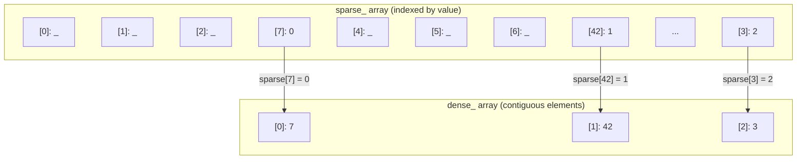
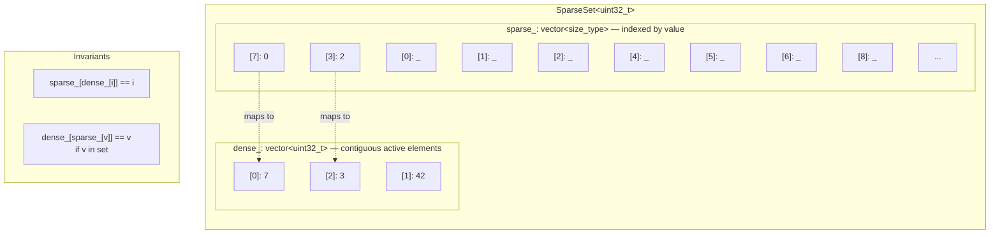
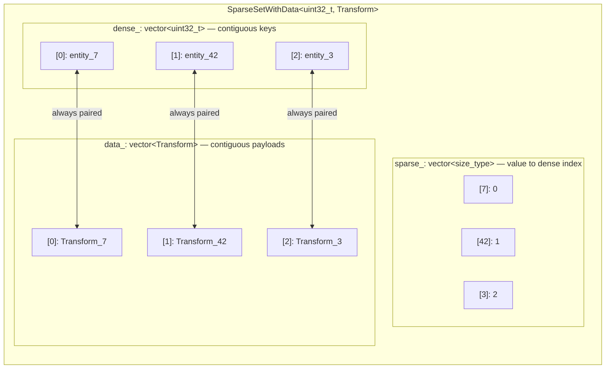

# User Manual - SparseSet

*Updated February 2026*

---

**Scope:** Complete usage guide for `fat_p::SparseSet` and `fat_p::SparseSetWithData`, including the dual-array architecture, O(1) operations, swap-with-back erasure, iterator invalidation, ECS integration patterns, memory management strategies, migration from `std::unordered_set`, and production troubleshooting.

**Not covered:**
- Generational handles / slot maps (use `fat_p::SlotMap` for ABA-safe handle reuse)
- Thread-safe concurrent sparse sets (SparseSet is not thread-safe for writes)
- Sorted iteration (SparseSet does not maintain sorted order; sort externally if needed)
- Sparse arrays for non-integer keys (use a hash map for string/struct keys)

**Prerequisites:**
- C++17 (if constexpr, structured bindings)
- Basic understanding of contiguous vs. node-based containers
- Familiarity with iterator invalidation rules in standard containers
- Understanding of cache locality and why sequential memory access matters for performance

---

## User Manual Card

**Component:** SparseSet / SparseSetWithData
**Primary use case:** O(1) insert, erase, lookup, and cache-friendly dense iteration over integer sets — the canonical ECS component storage
**Integration pattern:** One SparseSet per component type; entity IDs as keys; iterate the dense array for system updates
**Key API:** `insert()`, `erase()`, `contains()`, `find()`, `tryGet()`, `dense()`, `data()`
**std equivalent:** None
**Migration from std:** Replace `std::unordered_set<uint32_t>` with `SparseSet<uint32_t>`; replace `std::unordered_map<uint32_t, Data>` with `SparseSetWithData<uint32_t, Data>`
**Common mistakes:** Erasing during forward iteration (UB); using huge key spaces with few active elements (memory waste); relying on iteration order across erases (order is unstable)
**Performance notes:** 1 ns insert, 1 ns find, 1.3 ns erase at N=1,000 — 7-28x faster than std::unordered_set

---

## Table of Contents

1. [The Set Problem in Performance-Critical Code](#the-set-problem-in-performance-critical-code)
2. [The Dual-Array Insight](#the-dual-array-insight)
3. [Architecture: How SparseSet Works](#architecture-how-sparseset-works)
4. [Getting Started](#getting-started)
5. [Core Operations: The O(1) Story](#core-operations-the-o1-story)
6. [Swap-With-Back Erasure: Trading Order for Speed](#swap-with-back-erasure-trading-order-for-speed)
7. [Iteration: Why Dense Layout Wins](#iteration-why-dense-layout-wins)
8. [Iterator Invalidation: The Rules That Save You](#iterator-invalidation-the-rules-that-save-you)
9. [SparseSetWithData: Associating Payloads](#sparsesetwithdata-associating-payloads)
10. [Memory Management: The Sparse Array Tradeoff](#memory-management-the-sparse-array-tradeoff)
11. [Index Types: Sizing the Key Space](#index-types-sizing-the-key-space)
12. [ECS Integration: The Pattern SparseSet Was Built For](#ecs-integration-the-pattern-sparseset-was-built-for)
13. [Thread Safety](#thread-safety)
14. [Error Handling and Exception Safety](#error-handling-and-exception-safety)
15. [Debug vs Release Behavior](#debug-vs-release-behavior)
16. [Performance Characteristics](#performance-characteristics)
17. [When to Use SparseSet (and When Not To)](#when-to-use-sparseset-and-when-not-to)
18. [Migration from std::unordered_set](#migration-from-stdunordered_set)
19. [Alternatives](#alternatives)
20. [Troubleshooting](#troubleshooting)
21. [Known Limitations](#known-limitations)
22. [API Reference](#api-reference)
23. [FAQ](#faq)

---

## The Set Problem in Performance-Critical Code

### What a Game Engine Needs

Consider an entity-component system running a physics simulation. The engine has 10,000 entities. Each entity might have a Position, a Velocity, a Health, a Renderable tag, or any combination. Every frame, the physics system must iterate all entities that have *both* Position and Velocity, updating positions based on velocities. The rendering system must iterate all entities with both Position and Renderable. The damage system must iterate all entities with Health.

This is a set membership problem repeated thousands of times per second: "which entities have component X?" combined with "iterate all of them as fast as possible" and "add or remove components from individual entities in O(1)."

### Why std::unordered_set Is Wrong

The first impulse is `std::unordered_set<uint32_t>`. It provides O(1) average insert, erase, and lookup. But its internal structure defeats performance-critical iteration.

`std::unordered_set` is a hash table backed by a linked list of nodes. Each node is a separate heap allocation containing the element, a hash value, and a pointer to the next node in its bucket chain. Inserting 10,000 integers creates 10,000 individual heap allocations, scattered across memory.

When the physics system iterates all entities with Position, it walks this linked list. Each `++iterator` follows a pointer to a different heap allocation. These allocations are not contiguous — `malloc` places them wherever free space exists. The CPU prefetcher, which predicts sequential access patterns and fetches cache lines ahead of time, cannot help. Every element is a potential cache miss, costing 50-100 ns to fetch from L3 or main memory.

At 10,000 elements, iterating an `std::unordered_set` touches 10,000 scattered memory locations. Iterating a contiguous array touches approximately 160 cache lines (10,000 × 4 bytes / 64 bytes per line), all sequential, all prefetcher-friendly. The difference is 7-10x in measured iteration time.

The problem compounds in an ECS. The physics system iterates Position entities. Then the rendering system iterates Position entities again. Then the damage system iterates Health entities. Each iteration pays the cache-miss penalty independently. In a frame with 20 system iterations over 10 component types, the cumulative cost of scattered memory access can consume a significant fraction of the frame budget.

### What We Actually Need

The requirements for an ECS component storage are specific:

1. **O(1) insert** — adding a component to an entity must be constant-time.
2. **O(1) erase** — removing a component must be constant-time, with no tombstones or rehashing.
3. **O(1) lookup** — checking whether an entity has a component must be constant-time.
4. **Dense iteration** — iterating all entities with a given component must walk contiguous memory.
5. **Integer keys** — entity IDs are unsigned integers.

No standard container satisfies all five. `std::unordered_set` fails on dense iteration. `std::vector` (sorted) fails on O(1) insert and erase. `std::set` fails on everything except lookup (O(log N), not O(1)). A bitset provides O(1) insert/erase/lookup but iteration requires scanning every bit, including the zeros — with 10,000 active entities out of a 1,000,000 range, 99% of the scan is wasted.

The sparse set is the data structure that satisfies all five requirements simultaneously.

---

## The Dual-Array Insight

### The Core Idea

A sparse set uses two arrays working together: a *sparse* array indexed by value, and a *dense* array indexed by position. The sparse array maps values to their positions in the dense array. The dense array stores the actual values contiguously.

The key insight is that the sparse array provides O(1) lookup (direct index), while the dense array provides O(1) iteration (sequential memory). By maintaining both, you get the best of both worlds at the cost of extra memory for the sparse array.

Here's how it works with a concrete example. Suppose we insert values 7, 42, and 3:



Reading: `sparse[7] = 0`, `dense[0] = 7` ✓ — `sparse[42] = 1`, `dense[1] = 42` ✓ — `sparse[3] = 2`, `dense[2] = 3` ✓

**Insert(value):** Append `value` to the end of the dense array. Record its position in `sparse[value]`. Both operations are O(1).

**Contains(value):** Read `sparse[value]` to get the dense index `i`. Check whether `dense[i] == value`. Both operations are O(1) — two array lookups, no hashing, no comparison chains.

**Erase(value):** This is the clever part. Read `sparse[value]` to get the dense index `i`. Swap `dense[i]` with the last element in the dense array. Update the sparse entry for the swapped element. Decrement the size. All O(1). The dense array remains contiguous with no gaps, no tombstones, no rehashing.

**Iterate:** Walk `dense[0]` through `dense[size-1]`. Sequential memory. Prefetcher-optimal.

---

## Architecture: How SparseSet Works

### Memory Layout

SparseSet maintains two vectors internally:



The two invariants are the heart of the data structure. They ensure that the sparse-to-dense and dense-to-sparse mappings are consistent. Every operation preserves both invariants.

### SparseSetWithData: Adding a Parallel Data Array

`SparseSetWithData<T, Data>` extends the layout with a third array that stores payloads in parallel with the dense keys:



When an element is erased via swap-with-back, both the key and its associated data are swapped simultaneously. The parallel structure is maintained through every mutation.

This layout is what makes SparseSet ideal for ECS component storage. Iterating all Transforms walks `data_[0]` through `data_[size-1]` — contiguous memory, sequential access, prefetcher-optimal. The CPU can process Transforms at memory bandwidth speed rather than pointer-chasing speed.

---

## Getting Started

### Prerequisites and Integration

SparseSet requires C++17. It depends only on the standard library. Include a single header:

```cpp
#include <fat_p/SparseSet.h>
```

Compile with C++17 support:

```bash
# GCC
g++ -std=c++17 -O2 my_program.cpp

# Clang
clang++ -std=c++17 -O2 my_program.cpp

# MSVC
cl /std:c++17 /O2 my_program.cpp
```

### Your First SparseSet

The simplest usage: a set of entity IDs.

```cpp
#include <fat_p/SparseSet.h>
#include <iostream>

int main() {
    fat_p::SparseSet<uint32_t> active_entities;

    // Insert some entity IDs
    active_entities.insert(42);
    active_entities.insert(7);
    active_entities.insert(100);

    // O(1) membership check — no hashing, just two array lookups
    if (active_entities.contains(42)) {
        std::cout << "Entity 42 is active\n";
    }

    // Dense iteration — sequential memory, prefetcher-optimal
    for (uint32_t entity : active_entities) {
        std::cout << "Active: " << entity << "\n";
    }

    // O(1) erase — no tombstones, no rehashing
    active_entities.erase(7);

    std::cout << "After erase: " << active_entities.size() << " entities\n";
    return 0;
}
```

Two things to notice. First, `contains()` is a direct array lookup — it reads `sparse_[42]` to get a dense index, then verifies `dense_[index] == 42`. No hash function, no bucket traversal, no comparison chain. This is faster than any hash-based container for integer keys. Second, the range-for loop walks the dense array sequentially. The CPU prefetcher predicts the access pattern and fetches cache lines ahead of time. For 10,000 entities, this is 7x faster than iterating `std::unordered_set`.

### Your First SparseSetWithData

When you need to associate data with each key — the common case in ECS — use `SparseSetWithData`:

```cpp
#include <fat_p/SparseSet.h>

struct Transform {
    float x, y, z;
    float rx, ry, rz;
    float sx, sy, sz;
};

int main() {
    fat_p::SparseSetWithData<uint32_t, Transform> transforms;

    // Insert entity 42 with its Transform
    transforms.insert(42, Transform{1.0f, 2.0f, 3.0f, 0, 0, 0, 1, 1, 1});

    // Non-throwing access — returns nullptr if entity doesn't have this component
    if (auto* t = transforms.tryGet(42)) {
        t->x += 0.1f;  // Modify in place
    }

    // Dense iteration over all transforms — contiguous memory
    for (size_t i = 0; i < transforms.size(); ++i) {
        uint32_t entity = transforms.dense()[i];
        Transform& data = transforms.dataAt(i);
        // entity and data are at the same dense index — always paired
    }

    return 0;
}
```

The `tryGet()` method returns a pointer to the data, or `nullptr` if the key is not present. This is the right access method for hot paths — a pointer null-check is a single branch instruction, far cheaper than the exception-handling machinery that `get()` uses for missing keys.

---

## Core Operations: The O(1) Story

### insert(): Append to Dense, Record in Sparse

`insert(value)` adds a value to the set if it's not already present. The implementation is two steps: append the value to the end of the dense array, then write the dense index into `sparse_[value]`. Both are O(1) array writes.

If the value exceeds the current sparse array capacity, the sparse array is grown to accommodate it. This growth is the only allocation that occurs during insert. Once the sparse array is large enough, subsequent inserts within that range are allocation-free.

```cpp
fat_p::SparseSet<> s;
s.insert(5);     // true  — added; sparse grows to size 6
s.insert(5);     // false — already present, no-op
s.insert(1000);  // true  — sparse grows to size 1001
s.insert(3);     // true  — no growth needed (sparse already covers 0..1000)
```

The return value tells you whether insertion actually occurred. This is important for ECS code where you might try to add a component that already exists — the set silently ignores the duplicate rather than overwriting or asserting.

**Complexity:** O(1) amortized. O(max_value) when sparse array growth is required.

**Exception safety:** Strong guarantee. If allocation fails during sparse array growth, the set is unchanged.

### contains(): Two Array Lookups, No Hashing

`contains(value)` checks membership without modifying the set. The implementation reads `sparse_[value]` to get a candidate dense index, then verifies that `dense_[candidate] == value`. Both lookups are O(1) array accesses.

The verification step is essential. The sparse array may contain stale entries — indices that were valid before an erase but haven't been cleared (clearing them would cost O(max_value) on erase, destroying the O(1) guarantee). The `dense_[candidate] == value` check catches stale entries because the dense array is always authoritative.

```cpp
if (s.contains(42)) {
    // Two array lookups, zero hashing, zero comparison chains
}
```

**Complexity:** O(1). Always — no amortization, no worst case.

### erase(): The Swap-With-Back Trick

`erase(value)` removes a value from the set in O(1) time using the swap-with-back technique. This is the operation that makes sparse sets special, and it deserves a detailed explanation.

---

## Swap-With-Back Erasure: Trading Order for Speed

### Why Traditional Erase Is Expensive

Removing an element from the middle of a contiguous array is traditionally an O(N) operation. If the array is `[A, B, C, D, E]` and you erase C, the elements after C must shift left to fill the gap: `[A, B, D, E]`. With 10,000 elements, erasing from the middle shifts 5,000 elements on average.

Hash tables avoid the shift by using tombstones (marking slots as "deleted" without moving anything), but tombstones accumulate over time, degrading lookup performance and requiring periodic rehashing.

### The Swap-With-Back Solution

SparseSet uses neither shifts nor tombstones. Instead, when erasing an element, it swaps the element with the last element in the dense array, then decrements the size. The swap overwrites the erased element, and shrinking the size "removes" the last element (which is now a duplicate of the swapped element, sitting past the end of the logical array).

Here is the process step by step. Suppose the set contains `[10, 20, 30]` and we erase `10`:

```mermaid
flowchart LR
    subgraph Before["Before erase 10 — size = 3"]
        direction TB
        BD["dense_: [10, 20, 30]"]
        BS["sparse_: 10 to 0, 20 to 1, 30 to 2"]
    end

    subgraph Step1["Step 1-2: Find and identify"]
        direction TB
        S1["sparse_[10] = 0 — target index"]
        S2["last = dense_[2] = 30"]
    end

    subgraph Step2["Step 3-4: Overwrite and update"]
        direction TB
        S3["dense_[0] = 30 — overwrite erased slot"]
        S4["sparse_[30] = 0 — point to new position"]
    end

    subgraph After["After erase 10 — size = 2"]
        direction TB
        AD["dense_: [30, 20]"]
        AS["sparse_: 20 to 1, 30 to 0"]
        AV["Invariants hold: sparse_[dense_[i]] == i"]
    end

    Before --> Step1 --> Step2 --> After
```



Five array operations, all O(1). No shifting, no tombstones, no rehashing. The dense array remains contiguous. The only cost is that iteration order changes — 30 moved from position 2 to position 0.

### The Ordering Tradeoff

The consequence of swap-with-back is that **iteration order is unstable across erases**. The order of elements in the dense array after an erase depends on which element happened to be last. This is the fundamental tradeoff: O(1) erase in exchange for unstable ordering.

For ECS workloads, this tradeoff is almost always correct. The physics system doesn't care whether it processes entity 42 before entity 17. It cares that it processes all of them, and that iteration is cache-friendly. SparseSet delivers both.

If your application requires stable iteration order, you have two options: sort the dense array before iterating (O(N log N) per sort, but contiguous iteration afterward), or use a different container.

---

## Iteration: Why Dense Layout Wins

### The Cache Hierarchy Effect

Modern CPUs access main memory through a hierarchy of increasingly small, increasingly fast caches. A typical desktop CPU (circa 2025) has 64 KB of L1 data cache per core (1 ns access), 256 KB-1 MB of L2 (4 ns), 8-32 MB of shared L3 (10 ns), and main memory (50-100 ns).

When the CPU reads a memory address, it doesn't fetch just that byte — it fetches an entire cache line, typically 64 bytes. If the next read is on the same cache line, it costs nothing (already cached). If it's on the adjacent cache line, the hardware prefetcher has likely already fetched it. If it's at a random address, it's a cache miss — 50-100 ns of stall.

SparseSet's dense array stores all active elements in a contiguous `std::vector`. Iterating this array accesses memory sequentially: address 0, address 4, address 8, address 12 (for `uint32_t` elements). The prefetcher identifies this pattern instantly and fetches cache lines ahead of the actual reads. The CPU never stalls.

`std::unordered_set` stores elements in heap-allocated nodes linked by pointers. Each `++iterator` follows a pointer to a different heap address. These addresses are not sequential — `malloc` places them wherever free space exists. The prefetcher cannot predict the pattern. Every element is a potential cache miss.

The benchmark data quantifies the difference. At N=1,000:

| Operation | fat_p::SparseSet | std::unordered_set | Speedup |
|-----------|------------------|--------------------|---------|
| Iterate (per element) | 1.20 ns | 8.80 ns | **7x** |

At larger N, the gap widens further as the working set exceeds L1 and L2 cache sizes.

### Range-For Iteration

The idiomatic way to iterate a SparseSet is range-for, which walks the dense array:

```cpp
fat_p::SparseSet<uint32_t> active_entities;
// ... insert entities ...

for (uint32_t entity : active_entities) {
    update(entity);
}
```

For `SparseSetWithData`, iterate by dense index to access both keys and data:

```cpp
for (size_t i = 0; i < transforms.size(); ++i) {
    uint32_t entity = transforms.dense()[i];
    Transform& data = transforms.dataAt(i);
    // Process entity and its transform
}
```

Both patterns walk contiguous memory. The `dense()` and `data()` methods return `const` references to the underlying `std::vector` objects, allowing direct pointer arithmetic or SIMD processing.

---

## Iterator Invalidation: The Rules That Save You

### The Rules

Swap-with-back erasure changes which element occupies which position. This has precise consequences for iterators:

| Operation | Iterators to erased element | Other iterators | end() |
|-----------|---------------------------|-----------------|-------|
| `insert` | N/A | Valid if no reallocation | May change |
| `erase` | Invalidated | Last element's iterator invalidated (it was swapped) | Changes |
| `clear` | All invalidated | All invalidated | Changes |
| `reserve` | Valid | Valid | Valid |

The critical case is `erase`. When you erase element at dense index `i`, the last element is moved to index `i`. An iterator pointing to the last element now points past the end (the logical size decreased). An iterator pointing to index `i` now points to a *different* element than before.

### The Fatal Mistake: Erasing During Forward Iteration

This is undefined behavior and will corrupt your data or crash:

```cpp
// WRONG — undefined behavior
for (uint32_t id : entities) {
    if (should_remove(id)) {
        entities.erase(id);  // Invalidates iterators mid-loop!
    }
}
```

The range-for loop uses an iterator that advances past each element. When `erase` swaps the last element into the erased position and decrements size, the iterator's position and the container's end() are now inconsistent. The loop may skip the swapped-in element, process an element twice, or read past the end of the array.

### The Safe Patterns

**Collect-then-erase:** Gather elements to remove, then erase them in a second pass:

```cpp
std::vector<uint32_t> to_remove;
for (uint32_t id : entities) {
    if (should_remove(id)) {
        to_remove.push_back(id);
    }
}
for (uint32_t id : to_remove) {
    entities.erase(id);
}
```

**Back-to-front iteration:** Iterate from the end toward the beginning. Swap-with-back only affects indices ≥ the erased position, all of which have already been visited:

```cpp
for (size_t i = s.size(); i > 0; --i) {
    uint32_t val = s.at(i - 1);
    if (should_remove(val)) {
        s.erase(val);
        // The element swapped in came from index >= i-1
        // We've already visited it — no skip, no double-process
    }
}
```

The back-to-front pattern is more efficient (single pass, no allocation for the removal list) but harder to reason about. Use collect-then-erase unless profiling shows the allocation matters.

---

## SparseSetWithData: Associating Payloads

### When Keys Alone Aren't Enough

Plain `SparseSet<T>` answers "is this ID in the set?" Many applications also need "what data is associated with this ID?" — the Position of entity 42, the Health of entity 7, the Velocity of entity 100.

`SparseSetWithData<T, Data>` extends SparseSet with a parallel data array. Every dense index `i` holds both a key (`dense_[i]`) and its associated data (`data_[i]`). When an element is erased via swap-with-back, both the key and data are swapped together, maintaining the pairing.

### Insert and Emplace

Three ways to add data, each appropriate for different construction patterns:

```cpp
fat_p::SparseSetWithData<uint32_t, Transform> transforms;

// Copy insert — copies the Transform value
transforms.insert(entity_id, Transform{pos, rot, scale});

// Move insert — moves the Transform (avoids copy if expensive)
transforms.insert(entity_id, std::move(transform));

// In-place construction — constructs Transform directly in the data array
transforms.emplace(entity_id, pos, rot, scale);
```

All three return `true` if insertion occurred, `false` if the key already existed.

### Data Access: get() vs tryGet()

Two access methods with different failure semantics. The choice between them is a performance decision in hot paths:

`get(value)` returns a reference to the data. If the key is not present, it throws `std::out_of_range`. Exception handling involves stack unwinding machinery that the compiler cannot optimize away — even if the exception is never thrown, the compiler must generate the unwinding code and may inhibit certain optimizations.

`tryGet(value)` returns a pointer to the data, or `nullptr` if the key is not present. A pointer null-check is a single conditional branch — one of the cheapest operations a CPU can perform.

```cpp
// Hot path — use tryGet to avoid exception overhead
if (auto* t = transforms.tryGet(entity_id)) {
    t->x += velocity.dx * dt;
    t->y += velocity.dy * dt;
    t->z += velocity.dz * dt;
}

// Cold path or error handling — get + catch is acceptable
try {
    Transform& t = transforms.get(entity_id);
    validate(t);
} catch (const std::out_of_range& e) {
    log_error("Missing transform for entity {}", entity_id);
}
```

### Raw Dense Arrays

For bulk operations, SIMD processing, or passing data to external APIs that expect contiguous arrays, access the underlying storage directly:

```cpp
const std::vector<uint32_t>& keys = transforms.dense();
const std::vector<Transform>& values = transforms.data();
// keys[i] and values[i] are always paired

// Example: pass all positions to a rendering API
renderer.submit(values.data(), values.size());
```

---

## Memory Management: The Sparse Array Tradeoff

### The Fundamental Cost

The sparse array is sized to the **maximum value ever inserted**, not the number of active elements. Each slot is a `size_type` (typically 8 bytes on 64-bit platforms). If you insert value 1,000,000 into a SparseSet, the sparse array grows to at least 1,000,001 entries — approximately 8 MB — even if only one element is active.

This is the fundamental tradeoff of the sparse set: O(1) operations on integer keys in exchange for memory proportional to the key space, not the element count.

| Max value inserted | Sparse array size | Active elements | Memory per active element |
|-------------------|-------------------|-----------------|---------------------------|
| 1,000 | ~8 KB | 100 | ~80 bytes |
| 100,000 | ~800 KB | 500 | ~1.6 KB |
| 1,000,000 | ~8 MB | 1,000 | ~8 KB |
| 10,000,000 | ~80 MB | 1,000 | ~80 KB |

**Rule of thumb:** If `max_value / active_count > 1,000`, consider whether the memory cost is acceptable. If not, use a hash set instead.

### reserve(): Eliminating Allocation from the Hot Path

If you know the maximum value in advance, pre-allocate the sparse array to avoid growth during insertion:

```cpp
fat_p::SparseSet<uint32_t> s;
s.reserve(10000);  // Allocates sparse_[0..10000]

// All inserts with value <= 10000 are now allocation-free
for (uint32_t id : entity_ids) {
    s.insert(id);  // No allocation, no reallocation, deterministic cost
}
```

This matters in real-time systems where allocation latency is unacceptable. A game engine that reserves to the maximum expected entity count at startup guarantees that frame-time component insertions never trigger `malloc`.

### shrink_to_fit(): Reclaiming Memory

After a bulk-erase phase, the sparse array may be oversized for the remaining elements. `shrink_to_fit()` reduces both the sparse and dense arrays to their minimum required sizes:

```cpp
// After removing many entities
s.shrink_to_fit();  // Releases unused sparse + dense memory
```

Call this during loading screens, level transitions, or other natural pauses — not in a hot loop. The implementation may reallocate and copy both arrays.

### clear(): Fast Reset

`clear()` removes all elements in O(1) by resetting the dense array's size to zero. The sparse array is **not** deallocated or zeroed — its entries become stale but harmless, because the `contains()` verification check catches stale entries. This makes `clear()` much faster than `std::unordered_set::clear()`, which must visit every bucket and destroy every node.

---

## Index Types: Sizing the Key Space

The template parameter `T` controls the index type, which determines both the maximum representable value and the memory footprint of the sparse array:

```cpp
fat_p::SparseSet<uint8_t>  small;    // Max 255 values, tiny sparse array
fat_p::SparseSet<uint16_t> medium;   // Max 65,535 values
fat_p::SparseSet<uint32_t> standard; // Max ~4 billion values (default)
fat_p::SparseSet<uint64_t> large;    // Max ~18 quintillion (enormous sparse array)
```

Choose the smallest type that covers your value range. For ECS systems with fewer than 65,536 entities, `uint16_t` halves the sparse array memory compared to `uint32_t`. For systems that will never exceed 255 entities (rare but possible in embedded or test contexts), `uint8_t` minimizes overhead.

`uint32_t` is the safe default. It covers entity counts up to 4 billion with 4 bytes per sparse slot (8 bytes on 64-bit due to `size_type`).

Be cautious with `uint64_t`. Inserting value 1,000,000,000 into a `SparseSet<uint64_t>` would attempt to allocate a sparse array of 8 GB. The data structure is not designed for keys in this range — use a hash map instead.

---

## ECS Integration: The Pattern SparseSet Was Built For

### Why SparseSet Dominates ECS Storage

Entity-component systems face a specific access pattern: each "system" (physics, rendering, AI) iterates all entities that have a particular set of components and processes them. The iteration must be cache-friendly because systems run every frame, typically at 60+ FPS.

SparseSet matches this access pattern perfectly. Each component type gets its own `SparseSetWithData`, storing that component's data contiguously. Systems iterate the dense data array at memory bandwidth. Adding or removing components (inserting or erasing entity IDs) is O(1) and never disrupts the dense layout for more than one swap.

This is why most modern ECS implementations — EnTT, flecs, and many custom engines — use sparse sets as their primary component storage strategy.

### Component Storage

Each component type gets its own storage:

```cpp
struct Position { float x, y, z; };
struct Velocity { float dx, dy, dz; };
struct Health   { int current, max; };

fat_p::SparseSetWithData<uint32_t, Position> positions;
fat_p::SparseSetWithData<uint32_t, Velocity> velocities;
fat_p::SparseSetWithData<uint32_t, Health>   healths;
```

### System Iteration: Two-Component Join

The most common ECS pattern is iterating entities that have *both* of two components. The optimal strategy iterates the smaller set and probes the larger for each entity:

```cpp
// Physics system: update position for all entities with both Position and Velocity
// Iterate the smaller set, probe the larger — O(smaller.size()) total
for (size_t i = 0; i < velocities.size(); ++i) {
    uint32_t entity = velocities.dense()[i];
    if (auto* pos = positions.tryGet(entity)) {
        const auto& vel = velocities.dataAt(i);
        pos->x += vel.dx * dt;
        pos->y += vel.dy * dt;
        pos->z += vel.dz * dt;
    }
}
```

The inner `tryGet()` is O(1) — two array lookups. The total cost is O(min(positions.size(), velocities.size())), with each iteration accessing contiguous Velocity data and doing a random-access probe into the Position sparse array.

### Tag Components: Membership Without Data

Some components carry no data — they simply mark an entity as having a property. Use plain `SparseSet` (without data) for these:

```cpp
fat_p::SparseSet<uint32_t> is_player;
fat_p::SparseSet<uint32_t> is_visible;
fat_p::SparseSet<uint32_t> is_static;

// Tag an entity
is_player.insert(entity_id);

// Check tag — O(1)
if (is_player.contains(entity_id)) {
    // This entity is a player
}
```

### Entity Destruction

Destroying an entity means removing all its components. Each removal is O(1), so destroying an entity costs O(number of component types):

```cpp
void destroy_entity(uint32_t entity) {
    positions.erase(entity);   // O(1) swap-with-back
    velocities.erase(entity);  // O(1)
    healths.erase(entity);     // O(1)
    is_player.erase(entity);   // O(1)
    // Total: O(component_types), not O(entities)
}
```

---

## Thread Safety

### What Is Guaranteed

**Read-only operations are safe for concurrent access:** `contains`, `find`, `size`, `empty`, `begin`/`end`, `get`, `tryGet`. Multiple threads can call these simultaneously without synchronization.

### What Is NOT Guaranteed

**Write operations are NOT thread-safe:** `insert`, `erase`, `clear`, `reserve`, `shrink_to_fit`. Concurrent writes, or a write concurrent with any read, are data races — undefined behavior.

### External Synchronization for Mixed Access

When readers and writers operate on the same SparseSet, use a `std::shared_mutex`:

```cpp
std::shared_mutex mutex;

// Writer thread (exclusive access)
{
    std::unique_lock lock(mutex);
    entities.insert(new_entity);
}

// Reader threads (concurrent access)
{
    std::shared_lock lock(mutex);
    for (uint32_t e : entities) {
        process(e);  // Safe: no concurrent writes
    }
}
```

For high-contention ECS scenarios, consider double-buffering: write to a staging set during the update phase, then swap it with the live set under a brief exclusive lock between phases.

---

## Error Handling and Exception Safety

### Exception Guarantees

| Operation | Guarantee | Can throw? | When it throws |
|-----------|-----------|-----------|----------------|
| `insert` | Strong | Yes | `std::bad_alloc` on sparse growth; `std::length_error` on overflow |
| `erase` | Noexcept (if Data nothrow-movable) | No (SparseSet); potentially (SparseSetWithData with throwing move) | |
| `contains` | Noexcept | No | |
| `find` | Noexcept | No | |
| `get` | Strong | Yes | `std::out_of_range` if key not present |
| `tryGet` | Noexcept | No | |
| `at` | Strong | Yes | `std::out_of_range` if index invalid |
| `clear` | Noexcept | No | |
| `reserve` | Strong | Yes | `std::bad_alloc`; `std::length_error` |

The strong guarantee on `insert` means that if sparse array growth fails (allocation throws), the set is unchanged — no partial insertion, no corrupted invariants.

### Choosing Between get() and tryGet()

For hot paths where the key may or may not be present, prefer `tryGet()`. It returns `nullptr` for missing keys without touching the exception machinery. A branch on a pointer is essentially free compared to the stack-unwinding bookkeeping that `get()` requires.

For initialization code, configuration loading, or error handling where a missing key is genuinely exceptional, `get()` with try/catch is clearer and self-documenting.

---

## Debug vs Release Behavior

> **Critical: Debug vs Release** — SparseSet uses `assert()` for internal consistency checks that are removed under `NDEBUG` (Release builds).

In Debug builds, SparseSet validates:
- Bounds on sparse array accesses (`value < sparse_.size()`)
- Dense array index validity in `at()` and `dataAt()`
- The dual-array invariant (`sparse_[dense_[i]] == i`) during erase

In Release builds, these assertions are elided. An out-of-bounds access to the sparse array (inserting a value that would overflow the index type) manifests as undefined behavior rather than a clear assertion failure. Always test with Debug builds during development.

---

## Performance Characteristics

### Benchmark Data

At N=1,000 (Windows-x64, MSVC-1950, 24 threads @ 3686 MHz):

| Operation | fat_p::SparseSet | std::unordered_set | Speedup |
|-----------|------------------|--------------------|---------|
| Insert | 1.00 ns | 28.40 ns | **28x** |
| Find (hit) | 1.00 ns | 10.80 ns | **11x** |
| Erase | 1.30 ns | 23.80 ns | **18x** |
| Iterate (per element) | 1.20 ns | 8.80 ns | **7x** |
| Clear | 0.50 ns | 11.10 ns | **22x** |

### Why SparseSet Is Faster

Every SparseSet operation resolves to array indexing — two array lookups for `contains()`, one append for `insert()`, two swaps and a decrement for `erase()`. No hashing, no bucket traversal, no node allocation, no pointer chasing. The operations are so simple that the CPU can execute them in a handful of cycles, limited only by memory access latency.

`std::unordered_set` must compute a hash (CRC or multiplication-based, 3-10 ns), find the bucket (array index, fast), walk the bucket chain (pointer chasing, slow if multiple elements hash to the same bucket), compare keys (trivial for integers, but the function call overhead exists), and — for insert and erase — allocate or deallocate a heap node (20-50 ns per `malloc`/`free`).

### Where SparseSet Loses

**Huge, sparse key spaces.** If the maximum value is 10^9 and the active count is 100, the sparse array consumes ~8 GB while `std::unordered_set` uses ~3 KB. SparseSet is the wrong tool for this scenario.

**Non-integer keys.** SparseSet only works with unsigned integers. If your keys are strings, structs, or floating-point values, you need a hash-based container.

**Memory-constrained environments.** The sparse array allocates memory proportional to the maximum key, not the element count. In memory-tight embedded systems, this fixed overhead may be unacceptable.

---

## When to Use SparseSet (and When Not To)

### Use SparseSet When

You have **unsigned integer keys** in a reasonably dense range (max value within ~100-1000x of active count).

You need **O(1) insert, erase, and lookup** without amortization surprises from hash table rehashing.

You need **cache-friendly dense iteration** — the primary use case in ECS, particle systems, and entity tracking.

You can tolerate **unstable iteration order** across erases.

### Don't Use SparseSet When

| Scenario | Use instead |
|----------|-------------|
| Non-integer keys (strings, structs) | `absl::flat_hash_set`, `std::unordered_set` |
| max_value >> active_count (> 1000x) | `absl::flat_hash_set`, `std::unordered_set` |
| Stable iteration order required | `std::set` (sorted) or sort dense array |
| Thread-safe concurrent writes needed | `tbb::concurrent_hash_map`, or SparseSet + mutex |
| Key space includes negative integers | Map to unsigned, or use a hash set |
| Generational handle reuse needed | `fat_p::SlotMap` |

---

## Migration from std::unordered_set

### API Mapping

| `std::unordered_set<uint32_t>` | `fat_p::SparseSet<uint32_t>` | Notes |
|------|------|-------|
| `s.insert(v)` | `s.insert(v)` | Returns `bool` instead of `pair<iterator, bool>` |
| `s.erase(v)` | `s.erase(v)` | Same signature, same return type |
| `s.count(v)` | `s.contains(v)` | Returns `bool` directly |
| `s.find(v)` | `s.find(v)` | Same pattern, returns iterator |
| `s.size()` | `s.size()` | Identical |
| `s.empty()` | `s.empty()` | Identical |
| `s.clear()` | `s.clear()` | O(1) vs O(N) — SparseSet is faster |
| Range-for | Range-for | Same syntax, much faster iteration |

### Breaking Differences

**Return type of insert.** `std::unordered_set::insert` returns `pair<iterator, bool>`. `SparseSet::insert` returns `bool` only. If you need the iterator, call `find()` after insert.

**Key type restriction.** SparseSet requires unsigned integers. If your `unordered_set` uses string, float, or struct keys, SparseSet cannot replace it.

**Iteration order after erase.** `std::unordered_set` maintains a stable (though implementation-defined) bucket order across erases. SparseSet uses swap-with-back, so the dense array order changes on every erase. Code that depends on iteration order will break.

**Memory model.** `std::unordered_set` allocates per-element nodes — memory grows with element count. SparseSet allocates a sparse array proportional to the maximum value — memory grows with key range. For large key spaces with few active elements, `std::unordered_set` uses less memory.

**No rehashing.** `std::unordered_set` rehashes when the load factor exceeds a threshold, causing occasional O(N) insertions. SparseSet never rehashes. Sparse array growth is O(max_value) but occurs only when a new maximum value is inserted, and can be eliminated entirely with `reserve()`.

---

## Alternatives

- **`std::unordered_set<uint32_t>`** — Standard hash set. O(1) amortized operations but scattered memory layout. Better for huge key spaces with few active elements.
- **`std::set<uint32_t>`** — Sorted, O(log N) operations. Stable order. Poor cache behavior (tree nodes).
- **`absl::flat_hash_set`** — Google's open-addressing hash set. Cache-friendly iteration within buckets. Works with any hashable key type. No swap-with-back trick.
- **`boost::container::flat_set`** — Sorted vector-based set. Dense iteration but O(N) insert/erase (shifting).
- **`std::bitset` / `std::vector<bool>`** — O(1) operations for fixed-range sets, but iteration scans every bit including zeros.
- **EnTT `basic_sparse_set`** — The sparse set implementation in the popular ECS library. Similar design; tightly integrated with EnTT's entity model.

---

## Troubleshooting

### "My SparseSet uses too much memory"

**Symptom:** Process RSS is much larger than expected relative to element count.

**Cause:** The sparse array is sized to the maximum value ever inserted. If you inserted value 1,000,000, the sparse array is ~8 MB even if you later erased that element.

**Solutions:** Call `shrink_to_fit()` after erasing high-valued elements. If the key space is inherently sparse (max_value >> active_count by 1000x or more), switch to a hash set. Pre-reserve to the actual needed range rather than letting growth happen reactively.

### "Iteration order keeps changing"

**Symptom:** Elements appear in different orders across frames or after entity destruction.

**Cause:** This is by design. Swap-with-back erasure moves the last element into the erased position. The dense array order is a function of insertion and erasure history.

**Solution:** If you need sorted iteration, sort the dense array explicitly before iterating: `std::sort(s.begin(), s.end())`. This costs O(N log N) but produces cache-friendly sorted iteration. If you need *stable* order (no reordering ever), SparseSet is the wrong container.

### "I get std::length_error on insert"

**Symptom:** Exception when inserting a value near the maximum of the index type.

**Cause:** The value exceeds the representable range for `size_type`. With `uint32_t`, the maximum supported value is approximately 4 billion (minus one, to reserve a sentinel). With `uint16_t`, it's 65,534.

**Solution:** Use a wider index type, or ensure your key generation stays within bounds.

### "Concurrent reads and writes crash"

**Symptom:** Segfault, assertion failure, or garbage data under concurrent access.

**Cause:** SparseSet is not thread-safe for mixed read/write access. A concurrent write can reallocate the sparse or dense array while a reader is iterating.

**Solution:** Use a `std::shared_mutex` (readers use `shared_lock`, writers use `unique_lock`). See the [Thread Safety](#thread-safety) section.

### "SparseSetWithData erase corrupts data"

**Symptom:** After erasing an entity, another entity's data appears corrupted or swapped.

**Cause:** This is likely not corruption — it's swap-with-back. The last element's data was moved to the erased position. If you cached a dense index or pointer before the erase, it now points to different data.

**Solution:** Do not cache dense indices or data pointers across mutations. Always re-lookup via `tryGet()` or `find()` after any insert or erase.

---

## Known Limitations

**Unsigned integer keys only.** No support for strings, negative integers, floating-point keys, or user-defined types. The data structure fundamentally requires direct array indexing.

**Memory proportional to max value.** Inserting value N allocates a sparse array of size N+1. There is no way to avoid this — it's the mechanism that enables O(1) lookup.

**Unstable iteration order.** Swap-with-back erasure reorders the dense array. Code that depends on stable order will break after any erase.

**Not thread-safe for writes.** No internal synchronization. External locking required for concurrent access patterns.

**No automatic shrinking.** Erasing elements does not reduce the sparse array. Call `shrink_to_fit()` explicitly when appropriate.

| Limitation | Impact | Workaround |
|------------|--------|-----------|
| Integer keys only | Cannot use string/struct keys | Hash set for non-integer keys |
| Memory ∝ max value | High memory for sparse ranges | `reserve()` + `shrink_to_fit()`; hash set for very sparse ranges |
| Unstable order | Erase changes iteration order | Sort before iterating; or accept the tradeoff |
| No concurrent writes | Data races under concurrent mutation | `std::shared_mutex` wrapper |
| No auto-shrink | Sparse array retains high-water mark | Manual `shrink_to_fit()` |

---

## API Reference

### SparseSet\<T\>

| Method | Signature | Complexity | Throws |
|--------|-----------|-----------|--------|
| Constructor | `SparseSet(size_type maxValue = 0)` | O(maxValue) | `bad_alloc` |
| `insert` | `bool insert(T value)` | O(1) amortized | `bad_alloc`, `length_error` |
| `erase` | `bool erase(T value) noexcept` | O(1) | No |
| `contains` | `bool contains(T value) const noexcept` | O(1) | No |
| `find` | `iterator find(T value)` | O(1) | No |
| `at` | `T at(size_type index) const` | O(1) | `out_of_range` |
| `size` | `size_type size() const noexcept` | O(1) | No |
| `empty` | `bool empty() const noexcept` | O(1) | No |
| `clear` | `void clear() noexcept` | O(1) | No |
| `reserve` | `void reserve(size_type maxValue)` | O(maxValue) | `bad_alloc`, `length_error` |
| `shrink_to_fit` | `void shrink_to_fit()` | O(n) | No |
| `capacity` | `size_type capacity() const noexcept` | O(1) | No |
| `swap` | `void swap(SparseSet& other)` | O(1) | No |
| `begin`/`end` | Standard iterators | O(1) | No |

### SparseSetWithData\<T, Data\>

All of the above, plus:

| Method | Signature | Complexity | Throws |
|--------|-----------|-----------|--------|
| `insert` | `bool insert(T value, const Data& data)` | O(1) amortized | `bad_alloc`, `length_error` |
| `insert` | `bool insert(T value, Data&& data)` | O(1) amortized | `bad_alloc`, `length_error` |
| `emplace` | `bool emplace(T value, Args&&... args)` | O(1) amortized | `bad_alloc`, `length_error` |
| `get` | `Data& get(T value)` | O(1) | `out_of_range` |
| `tryGet` | `Data* tryGet(T value) noexcept` | O(1) | No |
| `dataAt` | `Data& dataAt(size_type index)` | O(1) | `out_of_range` |
| `dense` | `const vector<T>& dense() const noexcept` | O(1) | No |
| `data` | `const vector<Data>& data() const noexcept` | O(1) | No |

---

## FAQ

**Q: How does SparseSet compare to a bitset for membership tracking?**

A bitset provides O(1) insert/erase/lookup and minimal memory (1 bit per possible value). However, iterating a bitset requires scanning every bit — for 10,000 active entities out of a 1,000,000 range, 99% of the scan is wasted. SparseSet's dense array iterates only active elements. Use a bitset when the active-to-total ratio is high (> 50%) and you don't need associated data.

**Q: Can I use SparseSet with entity IDs from a SlotMap?**

Yes, but use only the index portion of the SlotMap handle, not the generation counter. The SparseSet treats the value as a direct array index — it must be a small unsigned integer, not a 64-bit handle with embedded generation bits. Strip the generation before inserting.

**Q: What happens if I insert the same value twice?**

The second insert returns `false` and does nothing. The set and its data (if using SparseSetWithData) are unchanged. No exception, no assertion.

**Q: Can I iterate a SparseSetWithData and get both keys and data?**

Yes. Use index-based iteration:

```cpp
for (size_t i = 0; i < transforms.size(); ++i) {
    uint32_t key = transforms.dense()[i];
    Transform& val = transforms.dataAt(i);
    // key and val are at the same dense index
}
```

Or access the underlying vectors directly:

```cpp
const auto& keys = transforms.dense();
const auto& vals = transforms.data();
for (size_t i = 0; i < keys.size(); ++i) {
    process(keys[i], vals[i]);
}
```

**Q: Is the dense array always tightly packed?**

Yes. After every insert and erase, the dense array contains exactly `size()` elements with no gaps. This is the invariant that swap-with-back maintains — it's what makes dense iteration work.

**Q: How do I iterate entities with three or more components?**

Iterate the smallest set and probe the others. For three components (A, B, C), iterate the smallest and call `tryGet()` on the other two:

```cpp
// Find the smallest set (cheapest to iterate)
// Then probe the others for each entity
for (size_t i = 0; i < set_a.size(); ++i) {
    uint32_t entity = set_a.dense()[i];
    auto* b = set_b.tryGet(entity);
    auto* c = set_c.tryGet(entity);
    if (b && c) {
        process(set_a.dataAt(i), *b, *c);
    }
}
```

Each `tryGet()` is O(1), so the total cost is O(smallest_set_size).

---

*SparseSet.h — Fat-P Library*
