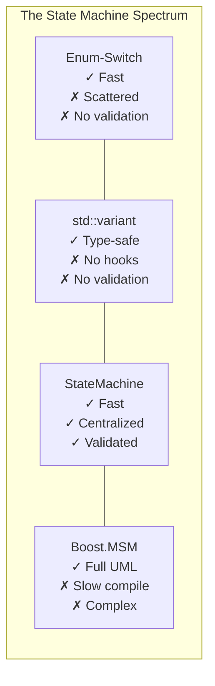
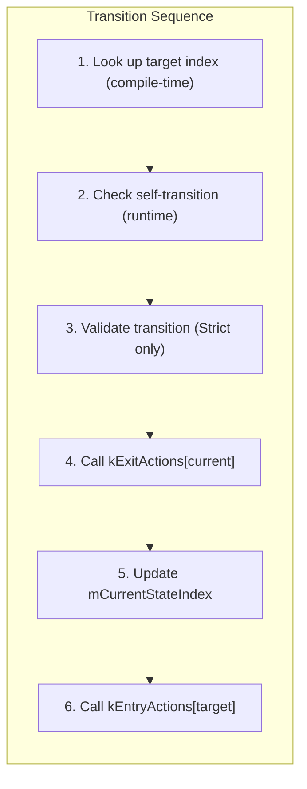

# Overview - StateMachine

*Fat-P Library — January 2026*

---

## Executive Summary

StateMachine is a compile-time validated finite state machine that eliminates the scattered-logic problem of enum-switch implementations while avoiding the runtime overhead of virtual dispatch and visitor patterns. The key mechanism is a function-pointer table indexed by state: the compiler generates constexpr arrays of function pointers at instantiation time, and transitions dispatch through these arrays with a single indirect call. Combined with a compile-time transition matrix for validation, this achieves O(1) transitions—approximately 4.8 nanoseconds on typical hardware—while catching invalid state graphs before the program runs.

The design addresses three persistent problems in state machine implementations: logic scattered across switch statements (solved by centralizing entry/exit hooks in state types), no transition validation (solved by declaring allowed transitions as data and validating at runtime), and duplicated action code (solved by automatic hook invocation on every transition). Policy-based customization lets you choose between strict validation and maximum flexibility, between exception-safe hooks and guaranteed-noexcept hooks, without runtime overhead for features you don't use.

---

## Overview Card

| Aspect | Details |
|--------|---------|
| **Component** | StateMachine |
| **Problem solved** | Type-safe state transitions with compile-time validation and zero-overhead dispatch |
| **When to use** | Protocol implementations, game entity states, workflow engines, UI navigation—any finite state machine where states are known at compile time |
| **When NOT to use** | Dynamic state sets, thread-safe state machines, states requiring polymorphic storage, trivial two-state machines |
| **Key guarantee** | All transitions are O(1); invalid states are compile errors; invalid transitions are caught before hooks execute |
| **std equivalent** | None—`std::variant` provides sum types but not state machine semantics |
| **Boost equivalent** | Boost.MSM (different design philosophy—full UML statecharts vs. simple FSM) |
| **Other alternatives** | [Boost::ext].SML, TinyFSM, manual enum-switch |
| **Read next** | User Manual - StateMachine |

---

## The Problem Domain

State machines are one of the oldest patterns in computing, yet C++ provides no standard abstraction for them. This forces developers to choose between implementations that each sacrifice something important.

The enum-switch approach is fast and obvious, but it scatters transition logic across every event handler. A state machine with four states and ten event handlers has forty switch cases distributed across the codebase. Adding a fifth state means touching all ten handlers. The state graph—the core abstraction—exists only implicitly, reconstructed by reading all the code. Worse, nothing validates transitions: `state_ = State::Complete` compiles regardless of current state, allowing bugs to corrupt protocol state silently.

The virtual dispatch approach centralizes behavior in state classes, but pays for it with heap allocation and vtable indirection. In performance-critical code—game loops, network packet processing, real-time systems—this overhead accumulates. A state machine that transitions millions of times per second cannot afford virtual calls.

The `std::variant` approach provides type safety but no state machine semantics. You can store any alternative at any time; nothing validates that the transition makes sense. There are no entry/exit hooks; you must manually call setup and teardown code on every transition. The visitor dispatch through `std::visit` costs approximately 4.8 nanoseconds—comparable to StateMachine—but without any of the state machine features.

The Boost.MSM approach provides full UML statechart semantics with hierarchical states, orthogonal regions, and history. It's powerful, but the compile times stretch to minutes for complex machines, error messages span pages of template instantiation traces, and the learning curve measures in weeks. For a simple four-state protocol handler, it's massive overkill.



StateMachine occupies the middle ground: more structured than enum-switch, simpler than Boost.MSM, more semantic than `std::variant`. It keeps the state graph visible in code, validates transitions at runtime (with StrictPolicy), and dispatches hooks with minimal overhead.

---

## Architecture

StateMachine's architecture combines three mechanisms to achieve its goals: a compile-time state registry, function-pointer dispatch tables, and an optional transition matrix.

### Compile-Time State Registry

States are types in a variadic parameter pack. When you write `StateMachine<..., A, B, C>`, the compiler assigns each type an index: A=0, B=1, C=2. This mapping is computed entirely at compile time. At runtime, the state machine stores only the current index—a single `std::size_t`.

The compiler also validates your state types at instantiation. Every state must be default-constructible (because hooks are invoked on temporaries). Every state must provide `on_entry(Context&)` and `on_exit(Context&)` methods with the correct signatures. These checks use C++20 concepts, producing clear error messages when states violate the contract.

### Function-Pointer Dispatch Tables

For each state, the compiler generates a wrapper function that default-constructs the state and calls its hook. These wrappers are collected into constexpr arrays:

```cpp
static constexpr std::array<ActionFn, N> kEntryActions = {
    &entryAction<State0>, &entryAction<State1>, &entryAction<State2>, ...
};
```

Dispatching a hook is a single indexed call: `kEntryActions[index](mContext)`. The arrays exist in read-only memory, initialized before `main()` runs. There's no heap allocation, no virtual table, no type erasure.



### Compile-Time Transition Matrix

When using StrictTransitionPolicy, the compiler converts your transition list into a boolean matrix. If you declare `std::pair<A, B>` as valid, then `matrix[0][1]` is true. Validating a transition is a single array lookup: `if (!matrix[from][to]) throw;`. The matrix is constexpr—computed at compile time with zero runtime initialization cost.

---

## Feature Inventory

### Policy-Based Transition Validation

StateMachine offers two transition policies. **AnyToAnyTransitionPolicy** allows any transition between states in the type list—maximum flexibility, no validation overhead. **StrictTransitionPolicy** validates every transition against a declared list, throwing `std::runtime_error` for invalid transitions before any hooks execute.

The choice is made at compile time through template parameters. There's no runtime flag, no virtual dispatch, no if-statement checking which policy is active. You get exactly the behavior you chose with no overhead for the alternative.

### Policy-Based Exception Handling

**ThrowingActionPolicy** allows hooks to throw exceptions, with defined semantics: if the exit hook throws, you're still in the original state; if the entry hook throws, you're in the new state but entry didn't complete. **NoExceptActionPolicy** requires hooks to be marked `noexcept` and state types to be nothrow default-constructible, verified at compile time. This enables the compiler to elide exception handling machinery.

### Automatic Entry/Exit Hooks

Every transition automatically calls the exit hook of the current state, then the entry hook of the new state. This eliminates the duplicated action code problem—setup and teardown logic is centralized in each state type, called consistently on every transition.

### Self-Transition Optimization

Transitioning to the current state is a no-op. No validation, no hooks, no side effects. This is intentional: a "stay connected" heartbeat shouldn't restart the connection timer, and a "continue patrol" signal shouldn't reset patrol progress.

### Debug-Mode Reentrancy Detection

Calling `transition()` from within a hook is almost always a bug. Debug builds detect this and fail fast with a clear error message. Release builds compile out the check for zero overhead.

### Compile-Time Introspection

Query the state machine's structure at compile time: `stateCount()`, `initialStateIndex()`, `contains_state<T>`, and (with StrictPolicy) `is_transition_allowed<From, To>` (self-transitions always return true). These enable static_asserts that verify assumptions and generic code that adapts to any state machine.

---

## Performance Characteristics

Benchmarks on Windows, MSVC 2022, 3.7 GHz base clock, 4-state machines, median of 15 runs:

| Implementation | Transition Cost | Notes |
|----------------|-----------------|-------|
| Manual enum-switch | 2.40 ns | Fastest possible, no abstraction |
| fat_p AnyToAny | 4.78 ns | No validation overhead |
| std::variant + visit | 4.82 ns | Similar dispatch, no state machine features |
| [Boost].SML | 5.06 ns | DSL-based, good compile-time checks |
| fat_p Strict | 5.70 ns | +0.92 ns for transition validation |
| TinyFSM | 5.97 ns | Minimal library |
| Boost.MSM | 8.39 ns | Full UML statechart overhead |

The Strict policy adds approximately 0.9 nanoseconds per transition—the cost of one array lookup and one branch. Self-transitions cost approximately 0.2 nanoseconds (index comparison and early return). State queries via `isInState<T>()` cost approximately 0.5 nanoseconds.

### Where StateMachine Wins

StateMachine provides type-safe transitions with compile-time validation of state types. Invalid states are compile errors. Invalid transitions (with StrictPolicy) throw before hooks execute, leaving the state machine unchanged.

Entry/exit hooks are centralized and automatic. You can't forget to call them—the state machine handles it.

The implementation has zero dependencies beyond the C++20 standard library. No Boost, no external headers, no configuration.

Error messages are clear. `static_assert` with descriptive text, not pages of template instantiation errors.

Performance is competitive. StateMachine matches `std::variant` dispatch speed while providing features `std::variant` lacks.

### Where StateMachine Loses

Manual enum-switch implementations are faster—about 2x for transitions. If you have two states with no hooks, don't use a library. Write a boolean.

StateMachine is not thread-safe. External synchronization is required. For lock-free state machines, look elsewhere.

States are stateless. Entry/exit hooks receive a default-constructed temporary. Persistent state lives in Context. If you need stateful states, use `std::variant` or a polymorphic approach.

There are no hierarchical states. StateMachine is a flat FSM. For UML statecharts with substates, orthogonal regions, or history, use Boost.MSM.

---

## The Permanence Question

The C++ standard will not provide a state machine abstraction. `std::variant` is the closest approximation, and it deliberately avoids state machine semantics—it's a sum type, not a behavioral abstraction. The standards committee has shown no interest in standardizing FSM libraries.

Boost.MSM exists but carries significant complexity and dependencies. Teams using older compilers, embedded systems with code size limits, or environments where Boost is prohibited cannot use it.

StateMachine fills a permanent gap: a minimal, zero-dependency state machine with compile-time validation and zero-overhead dispatch. It's not a stopgap waiting for standardization—it addresses a need the standard deliberately leaves unfilled.

---

## Integration Points

StateMachine has no external dependencies. It uses only C++20 standard library headers: `<concepts>`, `<array>`, `<tuple>`, `<type_traits>`, `<stdexcept>`, `<cstddef>`, and `<utility>`.

It pairs naturally with other FAT-P components. Use Expected.h to represent transition results in protocols that need rich error information rather than exceptions.

---

## Final Assessment

StateMachine delivers on three promises:

**Permanence.** The standard provides sum types, not state machines. This gap is architectural, not a pending feature. StateMachine addresses it permanently.

**Specialization.** Compile-time transition validation, policy-based exception handling, debug-mode reentrancy detection—these address real-world state machine requirements that generic sum types ignore.

**Control.** Choose your transition policy. Choose your exception policy. Choose your initial state. All at compile time, all with zero runtime overhead for the choices you make.

For type-safe state machines with compile-time validation and zero-overhead dispatch, StateMachine transforms runtime bugs into compile errors—without external dependencies.

---

*StateMachine.h — Fat-P Library*
