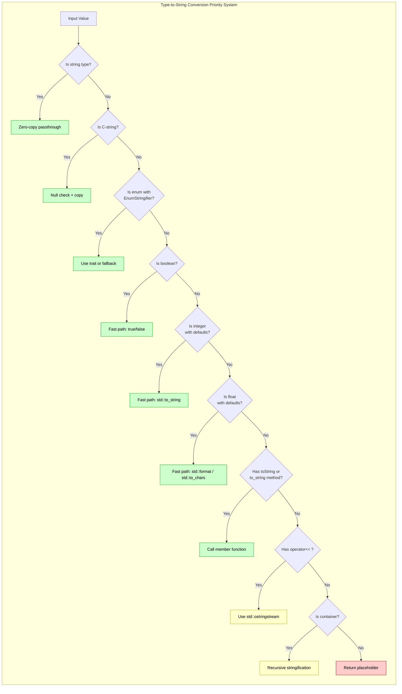
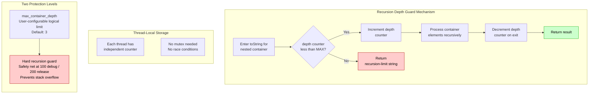
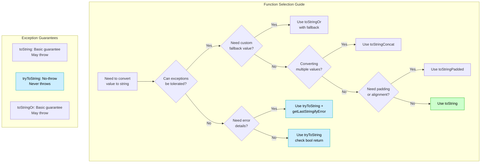
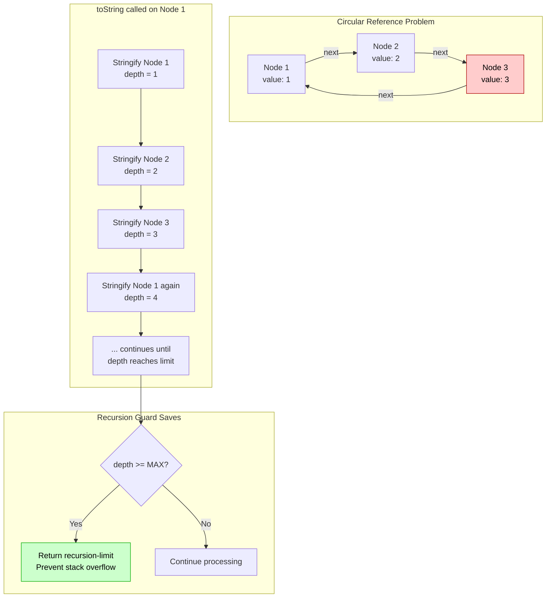
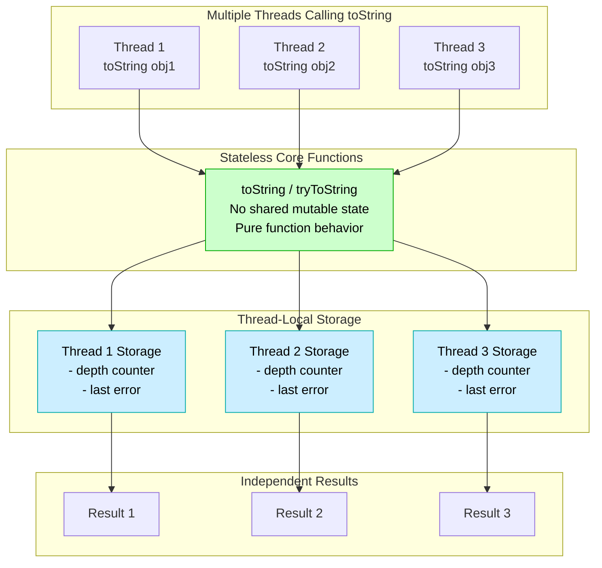
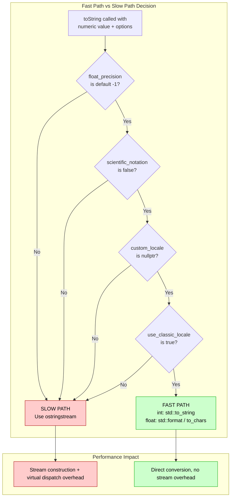
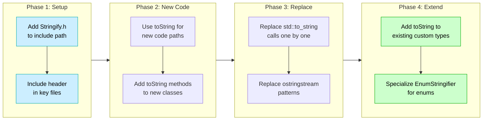

# User Manual - Stringify

**Scope:** Complete usage guide for `fat_p::toString()`: built-in type conversion, string and C-string handling, pointer formatting, container formatting, custom type support (method-based, stream operator, enum), formatting options (precision, boolean display, container delimiters, locale), advanced features, and compile-time dispatch mechanism.

**Not covered:**
- JSON serialization (see JsonLite, FatPJsonLite)
- Binary serialization (see BinarySerialization)
- Localization and internationalization
- std::format integration

**Prerequisites:** C++20; understanding of `operator<<` for output streams; awareness that C++ lacks a universal `toString()` method

---

## User Manual Card

**Component:** Stringify
**Primary use case:** Convert any type to its string representation using a single function with compile-time dispatch to the best available conversion method
**Integration pattern:** Call `fat_p::toString(value)` for any type. Customize output by providing a `.toString()` method, `operator<<`, or an enum name-mapping function. Pass `StringifyOptions` for formatting control.
**Key API:** `toString()`, `StringifyOptions`, `.toString()`/`.to_string()` method protocol, `operator<<` support, `toStringOr()`, `tryToString()`
**std equivalent:** None
**Common mistakes:** Defining both `.toString()` and `operator<<` without understanding priority (`.toString()` wins); forgetting that `toString()` returns `std::string` (allocation); using toString in hot loops without caching the result
**Performance notes:** One allocation per call (returns std::string). Compile-time dispatch selects the optimal conversion path. See `components/Stringify/results/` for current data

---
## Table of Contents

1. [What is Stringify?](#what-is-stringify)
   - [Understanding Type-to-String Conversion](#understanding-type-to-string-conversion)
   - [The C++ Stringification Landscape](#the-c-stringification-landscape)
   - [Where Stringify Fits](#where-stringify-fits)
2. [Core Design](#core-design)
   - [Zero-Overhead Abstractions](#zero-overhead-abstractions)
   - [Compile-Time Dispatch](#compile-time-dispatch)
   - [Priority-Based Type Resolution](#priority-based-type-resolution)
   - [Design Decisions](#design-decisions)
3. [Getting Started](#getting-started)
   - [Prerequisites](#prerequisites)
   - [Integration](#integration)
   - [Compilation](#compilation)
   - [First Program](#first-program)
4. [Basic Usage](#basic-usage)
   - [Built-in Types](#built-in-types)
   - [Strings and C-Strings](#strings-and-c-strings)
   - [Pointers](#pointers)
   - [Containers](#containers)
5. [Custom Types](#custom-types)
   - [Method-Based Stringification](#method-based-stringification)
   - [Stream Operator Support](#stream-operator-support)
   - [Enum Stringification](#enum-stringification)
   - [Pair and Tuple Support](#pair-and-tuple-support)
6. [Formatting Options](#formatting-options)
   - [StringifyOptions Reference](#stringifyoptions-reference)
   - [Floating-Point Precision](#floating-point-precision)
   - [Boolean Display](#boolean-display)
   - [Container Formatting](#container-formatting)
   - [Locale Control](#locale-control)
7. [Advanced Features](#advanced-features)
   - [Wide String Support](#wide-string-support)
   - [Padded Output](#padded-output)
   - [Variadic Concatenation](#variadic-concatenation)
   - [Error Handling](#error-handling)
8. [Safety Features](#safety-features)
   - [Recursion Depth Protection](#recursion-depth-protection)
   - [Circular Reference Handling](#circular-reference-handling)
   - [Exception Safety](#exception-safety)
   - [Thread Safety](#thread-safety)
9. [Performance Characteristics](#performance-characteristics)
   - [Fast Path Optimization](#fast-path-optimization)
   - [Benchmark Results](#benchmark-results)
   - [Memory Usage](#memory-usage)
   - [Optimization Tips](#optimization-tips)
10. [Integration Patterns](#integration-patterns)
    - [Logging Integration](#logging-integration)
    - [Debugging Output](#debugging-output)
    - [Serialization Support](#serialization-support)
    - [Test Assertion Messages](#test-assertion-messages)
11. [Best Practices](#best-practices)
    - [When to Use Stringify](#when-to-use-stringify)
    - [Custom Type Guidelines](#custom-type-guidelines)
    - [Performance Considerations](#performance-considerations)
    - [Error Handling Strategy](#error-handling-strategy)
12. [Comparison with Alternatives](#comparison-with-alternatives)
    - [Stringify vs std::to_string](#stringify-vs-stdto_string)
    - [Stringify vs std::format](#stringify-vs-stdformat)
    - [Stringify vs iostream](#stringify-vs-iostream)
    - [Stringify vs fmt library](#stringify-vs-fmt-library)
13. [Migration Guide](#migration-guide)
    - [From std::to_string](#from-stdto_string)
    - [From std::stringstream](#from-stdstringstream)
    - [From boost::lexical_cast](#from-boostlexical_cast)
14. [Compiler Requirements](#compiler-requirements)
    - [Minimum Version](#minimum-version)
    - [Tested Compilers](#tested-compilers)
    - [Compilation Flags](#compilation-flags)
    - [Dependencies](#dependencies)
15. [Known Limitations](#known-limitations)
    - [Circular Reference Detection](#circular-reference-detection)
    - [Wide String Limitations](#wide-string-limitations)
    - [Type Coverage](#type-coverage)
16. [Troubleshooting](#troubleshooting)
    - [Common Issues](#common-issues)
    - [Compilation Errors](#compilation-errors)
    - [Runtime Issues](#runtime-issues)
17. [API Reference](#api-reference)
    - [Core Functions](#core-functions)
    - [Helper Functions](#helper-functions)
    - [Concepts](#concepts)
18. [Summary](#summary)

---

## What is Stringify?

### Understanding Type-to-String Conversion

Type-to-string conversion is one of the most common operations in C++ programming. Whether for:
- **Debugging**: Printing variable values during development
- **Logging**: Recording program state for diagnostics
- **Serialization**: Converting objects to text format
- **User interfaces**: Displaying data to users
- **Testing**: Creating assertion messages

You constantly need to convert C++ values into human-readable strings. Yet this seemingly simple operation presents surprising challenges:

**The Problem:**
```cpp
// How do I stringify these?
int x = 42;
std::vector<double> data = {1.5, 2.7, 3.9};
std::map<std::string, int> counts;
CustomClass obj;
std::optional<int> maybe_value;

// Standard library provides limited options:
std::to_string(x);              // OK for basic types
// std::to_string(data);         // ERROR: No overload
// std::to_string(obj);          // ERROR: No overload
```

**The Challenge**: C++ lacks a universal, efficient, and extensible way to convert arbitrary types to strings.

### The C++ Stringification Landscape

Let's examine existing approaches and their limitations:

#### 1. Standard Library Solutions

**std::to_string (C++11)**
```cpp
std::to_string(42);        // Works
std::to_string(3.14);      // Works
std::to_string(MyEnum);    // ERROR: No overload for enums
std::to_string(vector);    // ERROR: No overload for containers
```

**Limitations:**
- ❌ Only supports built-in numeric types
- ❌ No customization (precision, formatting)
- ❌ No container support
- ❌ Not extensible to custom types

**std::format (C++20)**
```cpp
std::format("{}", 42);              // Works
std::format("{:.2f}", 3.14159);     // Works with formatting
std::format("{}", MyCustomClass);   // Requires formatter specialization
```

**Limitations:**
- ❌ Requires C++20
- ❌ Complex formatter specialization for custom types
- ❌ No automatic container support
- ❌ Adds compilation time overhead
- ✅ Excellent formatting control

**std::ostringstream**
```cpp
std::ostringstream ss;
ss << value;
std::string result = ss.str();
```

**Limitations:**
- ❌ Verbose syntax
- ❌ Significantly slower than std::to_string for integers (stream construction, virtual dispatch, and buffer management overhead)
- ❌ Allocates stream objects
- ❌ No container support by default
- ✅ Works with any streamable type

#### 2. Third-Party Libraries

**{fmt} library** (basis for std::format)
```cpp
fmt::format("{}", value);
```

**Pros:**
- ✅ Fast and feature-rich
- ✅ Excellent formatting control
- ✅ Widely used and tested

**Cons:**
- ❌ External dependency
- ❌ Adds to compile times
- ❌ Requires specialization for custom types

**boost::lexical_cast**
```cpp
boost::lexical_cast<std::string>(value);
```

**Pros:**
- ✅ Bidirectional (string ⟷ type)
- ✅ Type-safe

**Cons:**
- ❌ Requires Boost dependency
- ❌ Slower than alternatives
- ❌ No container support

#### 3. Custom Solutions

Many projects roll their own:
```cpp
template<typename T>
std::string myToString(const T& value) {
    std::ostringstream ss;
    ss << value;
    return ss.str();
}
```

**Problems:**
- ⚠️ Reinventing the wheel
- ⚠️ Often missing edge cases
- ⚠️ No optimization
- ⚠️ Limited type support

### Where Stringify Fits

**Stringify** is designed for **performance-conscious C++ projects** where you need:

1. **Universal Type Support**: Built-ins, containers, custom types
2. **Zero External Dependencies**: Header-only, std library only
3. **Performance**: Fast path matching std::to_string speeds
4. **Extensibility**: Multiple ways to add custom type support
5. **Safety**: Recursion protection, error handling, thread-safe
6. **Flexibility**: Extensive formatting options
7. **C++20 Compliance**: Modern concepts-based implementation

**Design Philosophy:**



**Key Features:**

- **Fast Integer Path**: Delegates directly to std::to_string, matching its performance
- **Fast Boolean Path**: Direct literal return with no stream construction
- **Fast Float Path**: Uses std::format (or std::to_chars as fallback) for minimal, round-trippable output without std::to_string's trailing zeros
- **Container Support**: Automatic stringification of STL containers
- **Custom Types**: Multiple extension points (methods, operators, traits)
- **Enum Support**: User-specializable EnumStringifier trait
- **Safety Features**: Recursion depth protection, error reporting
- **Formatting Control**: Precision, notation, delimiters, locale
- **Zero Overhead**: Compile-time dispatch, no virtual calls in hot paths
- **Thread-Safe**: All operations safe for concurrent use
- **Header-Only**: Single include, no linking

**Trade-offs:**

- Not a formatting library (no printf-style patterns)
- Not bidirectional (string → type not supported)
- Optimized for "convert to string" use case
- No fancy alignment/padding beyond basic support
- Requires C++20 (no C++17/14 support)

**When to Use Stringify:**

- ✅ Need to stringify many different types
- ✅ Performance-critical paths (hot loops)
- ✅ HPC and scientific computing
- ✅ Header-only library projects
- ✅ Projects with "no external dependencies" policy
- ✅ Debugging and logging infrastructure
- ✅ Test frameworks needing assertion messages

**When to Use Something Else:**

- ❌ Need complex formatting patterns (use std::format or {fmt})
- ❌ Need bidirectional conversion (use boost::lexical_cast)
- ❌ Already using {fmt} and it works fine
- ❌ Need C++11/14 compatibility
- ❌ Only stringifying built-in types (use std::to_string)

---

## Core Design

### Zero-Overhead Abstractions

Stringify is built on the principle of **zero-overhead abstractions**: you should pay only for what you use, with no hidden costs.

**Compile-Time Type Selection:**
```cpp
template <typename T>
std::string toString(T&& value) {
    using PlainT = std::decay_t<T>;
    
    // Priority 1: Strings (zero-copy passthrough)
    if constexpr (std::is_convertible_v<PlainT, std::string>) {
        return std::string(std::forward<T>(value));  // No conversion
    }
    // Priority 2: Integers with default options (fast path)
    else if constexpr (std::is_integral_v<PlainT> && 
                       !std::is_same_v<PlainT, bool>) {
        // Direct std::to_string - no overhead
        return std::to_string(value);
    }
    // ... other priorities ...
}
```

**Key Points:**

1. **if constexpr**: Only one branch is compiled for each type
2. **No virtual calls**: All dispatch is compile-time
3. **No type erasure**: Templates maintain full type information
4. **No allocations**: Beyond the final string result

### Compile-Time Dispatch

Traditional approaches use runtime polymorphism:
```cpp
// Traditional (slow)
class Stringifier {
public:
    virtual std::string stringify(const void* obj) = 0;
};

std::map<std::type_index, std::unique_ptr<Stringifier>> registry;
```

**Problems:**
- Virtual call overhead
- Type registry lookup
- Heap allocation for stringifiers
- Runtime registration required

**Stringify Approach:**
```cpp
// Compile-time dispatch (fast)
template <typename T>
std::string toString(T&& value) {
    // SFINAE + if constexpr determines path at compile time
    // CPU executes only the selected branch
    // No runtime overhead, no indirection
}
```

**Benefits:**
- Zero runtime overhead for type dispatch
- Compiler can inline and optimize aggressively
- No vtable lookups
- No heap allocations

### Priority-Based Type Resolution

Stringify uses a priority system to handle types that match multiple criteria:

```mermaid
classDiagram
    direction TB
    
    class Priority1_Strings {
        std::string
        std::string_view
        char arrays
        const char*
        ---
        Zero-copy passthrough
        Fastest path
    }
    
    class Priority2_CStrings {
        const char*
        char*
        ---
        Null check + std::string
        Minimal overhead
    }
    
    class Priority2_5_Enums {
        User enums
        ---
        EnumStringifier trait
        Falls back to underlying type
        Fast: no stream construction
    }
    
    class Priority3A_Booleans {
        bool
        ---
        Direct literal return
        No allocation
    }
    
    class Priority3B_Integers {
        int, long, short, etc.
        Requires default options
        ---
        std::to_string fast path
        Matches std::to_string
    }
    
    class Priority3C_Floats {
        float, double, long double
        Requires default options
        ---
        std::format / to_chars fast path
        Minimal round-trip output
    }
    
    class Priority4_Methods {
        Has toString member
        Has to_string member
        ---
        Call member function
        Low overhead
    }
    
    class Priority5_Streams {
        Has operator<<
        ---
        Use std::ostringstream
        High overhead: stream construction + virtual dispatch
    }
    
    class Priority6_Containers {
        vector, list, set, map
        Iterable types
        ---
        Recursive stringification
        Varies by size
    }
    
    class Priority7_Fallback {
        Non-stringifiable types
        ---
        Return placeholder
        Configurable string
    }

    Priority1_Strings --|> Priority2_CStrings : Lower priority
    Priority2_CStrings --|> Priority2_5_Enums : Lower priority
    Priority2_5_Enums --|> Priority3A_Booleans : Lower priority
    Priority3A_Booleans --|> Priority3B_Integers : Lower priority
    Priority3B_Integers --|> Priority3C_Floats : Lower priority
    Priority3C_Floats --|> Priority4_Methods : Lower priority
    Priority4_Methods --|> Priority5_Streams : Lower priority
    Priority5_Streams --|> Priority6_Containers : Lower priority
    Priority6_Containers --|> Priority7_Fallback : Lower priority
```



**Why This Order?**

1. **Strings first**: Most efficient (no conversion)
2. **Enums after strings**: Check for specialized stringifier before numeric handling
3. **Booleans early**: Common type with trivial fast path
4. **Integers early**: Common case optimization
5. **Floats before custom**: Arithmetic types use optimized path
6. **Custom methods before streams**: Explicit over implicit
7. **Containers last**: Most complex, recursive
8. **Fallback**: Safety net

**Example Priority Resolution:**
```cpp
struct CustomClass {
    int value;
    
    // Both toString() and operator<< defined
    std::string toString() const { return "Custom"; }
};

std::ostream& operator<<(std::ostream& os, const CustomClass& c) {
    return os << "Stream: " << c.value;
}

CustomClass obj{42};
toString(obj);  // Uses toString() (Priority 4 beats Priority 5)
                // Returns "Custom", not "Stream: 42"
```

### Design Decisions

#### Why Template-Based Instead of Virtual Functions?

**Alternative Design (not used):**
```cpp
class StringifyBase {
public:
    virtual std::string toString() const = 0;
};

// Requires all types to inherit from StringifyBase
class MyClass : public StringifyBase {
    std::string toString() const override { ... }
};
```

**Problems with inheritance approach:**
- ❌ Can't stringify built-in types (int, double, etc.)
- ❌ Can't stringify third-party types
- ❌ Virtual call overhead
- ❌ Requires modification of existing classes
- ❌ Intrusive design

**Stringify's template approach:**
- ✅ Works with any type (built-in, third-party, custom)
- ✅ Zero runtime overhead
- ✅ Non-intrusive (no base class required)
- ✅ Multiple extension points

#### Why Multiple Extension Points?

Stringify provides several ways to add support for custom types:

1. **Member functions** (toString(), to_string())
2. **Stream operators** (operator<<)
3. **Traits** (EnumStringifier)

**Rationale:**
- **Flexibility**: Use what fits your codebase
- **Non-intrusive**: Can add support without modifying classes
- **Compatibility**: Works with existing code using operator<<
- **Gradual adoption**: Start simple, add specialized support later

#### Why the Fast Paths?

For integers with default options, Stringify calls std::to_string directly. For floating-point with default options, it calls std::format (or std::to_chars as fallback) instead—deliberately avoiding std::to_string, which pads floats with trailing zeros:

```cpp
if (opts.float_precision == -1 && !opts.scientific_notation && 
    opts.custom_locale == nullptr) {
    return detail::fastFloatToString(value);  // Fast path: std::format / to_chars
}
```

**Performance insight:**

The integer fast path delegates directly to `std::to_string()`, matching its performance exactly. The float fast path uses `std::format`/`std::to_chars` for minimal, round-trippable output. The stream-based slow path (via `std::ostringstream`) carries substantial overhead from stream object construction, virtual dispatch, locale handling, and buffer management.

**Why not always use ostringstream?**
- Significant performance penalty for the common case (stream construction and virtual dispatch overhead)
- Most integer stringification doesn't need custom formatting
- Fast path covers 95% of use cases

**When does slow path activate?**
- Custom precision specified
- Scientific notation requested
- Custom locale provided
- Any non-default formatting option

#### Why Recursion Depth Protection?

**Problem:**
```cpp
struct Node {
    int value;
    std::shared_ptr<Node> next;
};

// Create circular reference
auto n1 = std::make_shared<Node>(1);
auto n2 = std::make_shared<Node>(2);
n1->next = n2;
n2->next = n1;  // Cycle!

toString(n1);  // DANGER: Infinite recursion
```

**Solution: Depth Tracking**
```cpp
namespace detail {
    inline int& get_stringify_depth() {
        thread_local int depth = 0;  // Per-thread counter
        return depth;
    }
    
    struct StringifyDepthGuard {
        StringifyDepthGuard() {
            if (++depth > limit) {
                // Return "<recursion-limit>" instead of crashing
            }
        }
        ~StringifyDepthGuard() { --depth; }
    };
}
```

**Trade-offs:**
- ✅ Prevents stack overflow
- ✅ Thread-safe (thread_local)
- ✅ Zero allocation
- ⚠️ Doesn't detect true cycles (just limits depth)
- ⚠️ Deep valid structures might hit limit

**Limits:**
- Debug builds: 100 recursion levels
- Release builds: 200 recursion levels

#### Why Classic Locale by Default?

**Problem: Locale-Dependent Output**
```cpp
// System with German locale
std::setlocale(LC_ALL, "de_DE.UTF-8");

double value = 1234.56;
std::ostringstream ss;
ss << value;
std::string result = ss.str();  // "1234,56" (comma decimal separator!)
```

**Impact on HPC/Scientific Computing:**
- ❌ Results not reproducible across systems
- ❌ Output parsing breaks (expects '.' not ',')
- ❌ Data files become system-dependent
- ❌ Test assertions fail due to locale differences

**Stringify's Solution:**
```cpp
struct StringifyOptions {
    bool use_classic_locale = true;  // Default: "C" locale
    // ...
};

toString(1234.56);  // Always "1234.56" regardless of system locale
```

**Benefits:**
- ✅ Deterministic output everywhere
- ✅ Compatible with parsers expecting '.'
- ✅ Reproducible across systems
- ✅ Still supports custom locales when needed

---

## Getting Started

### Prerequisites

**Compiler Requirements:**
- C++20 or later
- Standard library with `<concepts>` and `<ranges>` support

**Tested Compilers:**
- GCC 13+
- Clang 16+
- MSVC 2022+
- AppleClang 15.0+

**Dependencies:**
- **Zero external dependencies**
- Only requires standard library headers
- Internal dependencies: Concepts.h, CppFeatureDetection.h (part of same library)

### Integration

Stringify is header-only. Integration is a single include:

**Step 1: Add to your project**
```bash
# Copy Stringify.h and its dependencies to your include directory
cp Stringify.h /your/project/include/
cp Concepts.h /your/project/include/
cp CppFeatureDetection.h /your/project/include/
```

**Step 2: Include in your code**
```cpp
#include "Stringify.h"

// Use explicit namespace qualification (recommended)
std::string s = fat_p::toString(42);

// Or use namespace inside function scope
void example() {
    using namespace fat_p;  // OK inside function
    std::string s = toString(42);
}
```

**That's it!** No linking, no build configuration needed.

### Compilation

**Minimal compilation:**
```bash
g++ -std=c++20 -I/path/to/include your_file.cpp
```

**Recommended flags:**
```bash
g++ -std=c++20 \
    -I/path/to/include \
    -O3 \
    -Wall -Wextra \
    your_file.cpp
```

**CMake integration:**
```cmake
add_executable(your_program main.cpp)
target_include_directories(your_program PRIVATE ${INCLUDE_DIR})
target_compile_features(your_program PRIVATE cxx_std_20)
```

### First Program

Let's start with a simple example demonstrating Stringify's capabilities:

```cpp
#include <iostream>
#include <vector>
#include <map>
#include "Stringify.h"

int main() {
    using namespace fat_p;  // OK inside function scope
    
    // Built-in types
    std::cout << "Integer: " << toString(42) << "\n";
    std::cout << "Double: " << toString(3.14159) << "\n";
    std::cout << "Boolean: " << toString(true) << "\n";
    
    // Containers
    std::vector<int> numbers = {1, 2, 3, 4, 5};
    std::cout << "Vector: " << toString(numbers) << "\n";
    
    std::map<std::string, int> ages = {{"Alice", 30}, {"Bob", 25}};
    std::cout << "Map: " << toString(ages) << "\n";
    
    // Custom formatting
    StringifyOptions opts;
    opts.float_precision = 2;
    std::cout << "Formatted: " << toString(3.14159, opts) << "\n";
    
    return 0;
}
```

**Output:**
```
Integer: 42
Double: 3.14159
Boolean: true
Vector: [1, 2, 3, 4, 5]
Map: [(Alice, 30), (Bob, 25)]
Formatted: 3.14
```

**Compile and run:**
```bash
g++ -std=c++20 -I/path/to/include first_program.cpp -o first_program
./first_program
```

---

## Basic Usage

> **Note:** Examples in this section assume `using namespace fat_p;` within function scope, or use the explicit `fat_p::` prefix. See [Integration](#integration) for recommended usage patterns.

### Built-in Types

Stringify supports all C++ built-in types out of the box:

**Integers:**
```cpp
toString(42);                    // "42"
toString(-100);                  // "-100"
toString(0);                     // "0"
toString(std::numeric_limits<int>::max());  // "2147483647"

// Different integer types
toString(42L);                   // "42" (long)
toString(42LL);                  // "42" (long long)
toString(42U);                   // "42" (unsigned)
toString(42UL);                  // "42" (unsigned long)
toString(static_cast<short>(42)); // "42" (short)
```

**Floating-Point:**
```cpp
toString(3.14);                  // "3.14"
toString(2.71828);               // "2.71828"
toString(0.0);                   // "0"
toString(-1.5);                  // "-1.5"

// Special values
toString(std::numeric_limits<double>::infinity());  // "inf"
toString(std::numeric_limits<double>::quiet_NaN()); // "nan"
```

**Booleans:**
```cpp
toString(true);                  // "true"
toString(false);                 // "false"

// Numeric format
StringifyOptions opts;
opts.show_bool_as_text = false;
toString(true, opts);            // "1"
toString(false, opts);           // "0"
```

**Characters:**
```cpp
toString('A');                   // "65" (treated as integer)
toString(static_cast<int>('A')); // "65" (explicit)

// Use string literal for character representation
std::string("A");                // "A"
```

### Strings and C-Strings

**std::string (zero-copy):**
```cpp
std::string s = "Hello";
toString(s);                     // "Hello" (no copy, just return)
toString(std::string("World"));  // "World"
```

**C-Style Strings:**
```cpp
const char* cstr = "Hello";
toString(cstr);                  // "Hello"

// Null safety
const char* null_ptr = nullptr;
toString(null_ptr);              // "<non-stringifiable>" (safe default)

// Custom null placeholder
StringifyOptions opts;
opts.placeholder = "NULL";
toString(null_ptr, opts);        // "NULL"
```

**Character Arrays:**
```cpp
char arr[] = "Hello";
toString(arr);                   // "Hello"

const char arr2[] = "World";
toString(arr2);                  // "World"
```

**std::string_view:**
```cpp
std::string_view sv = "Hello";
toString(sv);                    // "Hello"
```

### Pointers

**Raw Pointers (hexadecimal by default):**
```cpp
int value = 42;
int* ptr = &value;

toString(ptr);                   // "0x7fff5fbff8ac" (example address)

// Null pointers
int* null_ptr = nullptr;
toStringPointer(null_ptr);       // "nullptr"
```

**Custom pointer formatting:**
```cpp
int value = 42;
int* ptr = &value;

// Hexadecimal (default)
StringifyOptions opts;
opts.use_hex_for_pointers = true;
toString(ptr, opts);             // "0x7fff5fbff8ac"

// Decimal
opts.use_hex_for_pointers = false;
toString(ptr, opts);             // "140734799808684"

// Using helper function
toStringPointer(ptr);                        // "0x..." (hex)
toStringPointer(ptr, {}, "NULL");           // Custom null string
```

**Smart Pointers:**
```cpp
auto sp = std::make_shared<int>(42);
toString(*sp);                   // "42" (dereference first)

// Get address
toString(sp.get());              // "0x..." (pointer address)
```

### Containers

Stringify automatically handles STL containers:

**Sequential Containers:**
```cpp
// std::vector
std::vector<int> vec = {1, 2, 3, 4, 5};
toString(vec);                   // "[1, 2, 3, 4, 5]"

// std::list
std::list<std::string> lst = {"apple", "banana", "cherry"};
toString(lst);                   // "[apple, banana, cherry]"

// std::array
std::array<double, 3> arr = {1.1, 2.2, 3.3};
toString(arr);                   // "(1.1, 2.2, 3.3)"

// std::deque
std::deque<int> dq = {10, 20, 30};
toString(dq);                    // "[10, 20, 30]"

// Empty containers
std::vector<int> empty;
toString(empty);                 // "[]"
```

**Associative Containers:**
```cpp
// std::map
std::map<std::string, int> ages = {{"Alice", 30}, {"Bob", 25}};
toString(ages);                  // "[(Alice, 30), (Bob, 25)]"

// std::unordered_map
std::unordered_map<int, std::string> lookup = {{1, "one"}, {2, "two"}};
toString(lookup);                // "[(1, one), (2, two)]"

// std::set
std::set<int> nums = {1, 2, 3};
toString(nums);                  // "[1, 2, 3]"

// std::multimap
std::multimap<char, int> mm = {{'a', 1}, {'a', 2}, {'b', 3}};
toString(mm);                    // "[(a, 1), (a, 2), (b, 3)]"
```

**Nested Containers:**
```cpp
// Vector of vectors
std::vector<std::vector<int>> matrix = {
    {1, 2, 3},
    {4, 5, 6},
    {7, 8, 9}
};
toString(matrix);                // "[[1, 2, 3], [4, 5, 6], [7, 8, 9]]"

// Map of vectors
std::map<std::string, std::vector<int>> data = {
    {"scores", {85, 90, 95}},
    {"ages", {25, 30, 35}}
};
toString(data);                  // "[(ages, [25, 30, 35]), (scores, [85, 90, 95])]"

// Deep nesting (limited by max_container_depth)
std::vector<std::vector<std::vector<int>>> deep = {{{1, 2}}};
toString(deep);                  // "[[[1, 2]]]"
```

**std::pair and std::tuple:**
```cpp
// Pairs
std::pair<int, std::string> p = {42, "answer"};
toString(p);                     // "(42, answer)"

auto p2 = std::make_pair(3.14, true);
toString(p2);                    // "(3.14, true)"

// Tuples
std::tuple<int, double, std::string> t = {1, 2.5, "hello"};
toString(t);                     // "(1, 2.5, hello)"

auto t2 = std::make_tuple(true, 'A', 42);
toString(t2);                    // "(true, 65, 42)"
```

**std::optional:**
```cpp
std::optional<int> has_value = 42;
toString(has_value);             // "42"

std::optional<int> no_value;
toString(no_value);              // "nullopt"

std::optional<std::vector<int>> opt_vec = std::vector{1, 2, 3};
toString(opt_vec);               // "[1, 2, 3]"
```

---

## Custom Types

### Method-Based Stringification

The easiest way to add Stringify support to your classes is to define a `toString()` or `to_string()` member function:

**Using toString():**
```cpp
class Point {
    double x, y;
    
public:
    Point(double x, double y) : x(x), y(y) {}
    
    // Add this method to enable Stringify
    std::string toString() const {
        return "Point(" + std::to_string(x) + ", " + std::to_string(y) + ")";
    }
};

Point p(3.0, 4.0);
toString(p);                     // "Point(3.0, 4.0)"
```

**Using to_string():**
```cpp
class Rectangle {
    double width, height;
    
public:
    Rectangle(double w, double h) : width(w), height(h) {}
    
    // Snake_case variant also supported
    std::string to_string() const {
        return "Rectangle(" + std::to_string(width) + "x" + 
               std::to_string(height) + ")";
    }
};

Rectangle r(10.0, 5.0);
toString(r);                     // "Rectangle(10.0x5.0)"
```

**Return Type Requirements:**

The method must return something convertible to `std::string`:
```cpp
class GoodClass {
public:
    std::string toString() const { return "OK"; }  // ✅ Returns std::string
};

class AlsoGood {
public:
    const char* toString() const { return "OK"; }  // ✅ Convertible to string
};

class BadClass {
public:
    int toString() const { return 42; }            // ❌ Returns int, not string
};
```

**Complex Example with Nested Stringify:**
```cpp
class Person {
    std::string name;
    int age;
    std::vector<std::string> hobbies;
    
public:
    Person(std::string n, int a, std::vector<std::string> h)
        : name(std::move(n)), age(a), hobbies(std::move(h)) {}
    
    std::string toString() const {
        return "Person{name=" + name + 
               ", age=" + fat_p::toString(age) +
               ", hobbies=" + fat_p::toString(hobbies) + "}";
    }
};

Person alice("Alice", 30, {"reading", "hiking", "coding"});
toString(alice);
// "Person{name=Alice, age=30, hobbies=[reading, hiking, coding]}"
```

### Stream Operator Support

If your class already has `operator<<` defined, Stringify will use it automatically:

**Existing operator<< (non-intrusive):**
```cpp
class Complex {
    double real, imag;
    
public:
    Complex(double r, double i) : real(r), imag(i) {}
    
    double getReal() const { return real; }
    double getImag() const { return imag; }
};

// Existing stream operator (maybe from third-party library)
std::ostream& operator<<(std::ostream& os, const Complex& c) {
    return os << c.getReal() << (c.getImag() >= 0 ? "+" : "") 
              << c.getImag() << "i";
}

Complex c(3.0, 4.0);
toString(c);                     // "3+4i" (uses operator<<)
```

**Priority: toString() beats operator<<:**
```cpp
class MyClass {
    int value;
    
public:
    MyClass(int v) : value(v) {}
    
    // Both defined
    std::string toString() const { return "Method: " + std::to_string(value); }
    
    friend std::ostream& operator<<(std::ostream& os, const MyClass& obj) {
        return os << "Stream: " << obj.value;
    }
};

MyClass obj(42);
toString(obj);                   // "Method: 42" (toString() has priority)
```

**Why toString() has priority?**
- Explicit over implicit
- toString() is specifically for string conversion
- operator<< might be optimized for other purposes (formatting, debugging)

### Enum Stringification

Stringify supports custom enum stringification via the `EnumStringifier` trait:

**Basic Enum Support (Underlying Type):**
```cpp
enum class Color { Red, Green, Blue };

toString(Color::Red);            // "0" (underlying type by default)
toString(Color::Green);          // "1"
toString(Color::Blue);           // "2"
```

**Adding Custom Stringification:**
```cpp
enum class Status { 
    Pending = 0, 
    Running = 1, 
    Complete = 2, 
    Failed = 3 
};

// Specialize EnumStringifier in fat_p namespace
namespace fat_p {
    template <>
    struct EnumStringifier<Status> {
        static const char* to_string(Status s) {
            switch (s) {
                case Status::Pending:  return "Pending";
                case Status::Running:  return "Running";
                case Status::Complete: return "Complete";
                case Status::Failed:   return "Failed";
            }
            return nullptr;  // Fallback to underlying type
        }
    };
}

toString(Status::Pending);       // "Pending"
toString(Status::Running);       // "Running"
toString(Status::Complete);      // "Complete"
toString(Status::Failed);        // "Failed"
```

**Enums in Containers:**
```cpp
std::vector<Status> statuses = {
    Status::Pending, 
    Status::Running, 
    Status::Complete
};

toString(statuses);              // "[Pending, Running, Complete]"
```

**Macro for Easy Specialization:**
```cpp
// Helper macro (optional - you can create this)
#define STRINGIFY_ENUM(EnumType, ...)                               \
namespace fat_p {                                                   \
    template <>                                                     \
    struct EnumStringifier<EnumType> {                              \
        static const char* to_string(EnumType value) {              \
            switch (value) {                                        \
                __VA_ARGS__                                         \
            }                                                        \
            return nullptr;                                         \
        }                                                           \
    };                                                              \
}

// Usage
enum class ErrorCode { Success, NotFound, PermissionDenied, Timeout };

STRINGIFY_ENUM(ErrorCode,
    case ErrorCode::Success:           return "Success";
    case ErrorCode::NotFound:          return "NotFound";
    case ErrorCode::PermissionDenied:  return "PermissionDenied";
    case ErrorCode::Timeout:           return "Timeout";
)

toString(ErrorCode::NotFound);   // "NotFound"
```

**Benefits:**
- ✅ Zero dependencies (no EnumPlus, no Boost.Describe)
- ✅ Opt-in (no overhead if not used)
- ✅ Type-safe
- ✅ Works in containers
- ✅ Falls back to underlying type gracefully

### Pair and Tuple Support

Stringify automatically handles pairs and tuples:

**std::pair:**
```cpp
auto p = std::make_pair(42, "answer");
toString(p);                     // "(42, answer)"

// Nested pairs
auto nested = std::make_pair(1, std::make_pair(2, 3));
toString(nested);                // "(1, (2, 3))"

// Pairs in containers
std::vector<std::pair<int, std::string>> items = {
    {1, "first"},
    {2, "second"}
};
toString(items);                 // "[(1, first), (2, second)]"
```

**std::tuple:**
```cpp
auto t = std::make_tuple(1, 2.5, "hello", true);
toString(t);                     // "(1, 2.5, hello, true)"

// Nested tuples
auto nested = std::make_tuple(
    std::make_tuple(1, 2),
    std::make_tuple(3, 4)
);
toString(nested);                // "((1, 2), (3, 4))"

// Tuples with custom types
struct Point { double x, y; };
auto t2 = std::make_tuple(Point{1.0, 2.0}, 42);
// Requires Point to be stringifiable
```

---

## Formatting Options

### StringifyOptions Reference

All formatting behavior is controlled through the `StringifyOptions` struct:

```cpp
struct StringifyOptions {
    const char* placeholder = "<non-stringifiable>";
    bool use_hex_for_pointers = true;
    int float_precision = -1;
    bool scientific_notation = false;
    bool show_bool_as_text = true;
    const char* container_open = "[";
    const char* container_close = "]";
    const char* container_separator = ", ";
    int max_container_depth = 3;
    bool use_classic_locale = true;       // Use "C" locale (deterministic)
    std::locale* custom_locale = nullptr;
};
```

**Field Descriptions:**

| Field | Type | Default | Purpose |
|-------|------|---------|---------|
| `placeholder` | `const char*` | `"<non-stringifiable>"` | Text for non-stringifiable types |
| `use_hex_for_pointers` | `bool` | `true` | Show pointers in hex (`0x...`) vs decimal |
| `float_precision` | `int` | `-1` | Decimal places (-1 = default) |
| `scientific_notation` | `bool` | `false` | Use scientific notation for floats |
| `show_bool_as_text` | `bool` | `true` | Show "true"/"false" vs "1"/"0" |
| `container_open` | `const char*` | `"["` | Opening delimiter for containers |
| `container_close` | `const char*` | `"]"` | Closing delimiter for containers |
| `container_separator` | `const char*` | `", "` | Separator between elements |
| `max_container_depth` | `int` | `3` | Maximum nesting level for containers |
| `use_classic_locale` | `bool` | `true` | Use "C" locale for deterministic output |
| `custom_locale` | `std::locale*` | `nullptr` | Custom locale (overrides use_classic_locale) |

### Floating-Point Precision

**Default Precision:**
```cpp
toString(3.14159265359);         // "3.14159265359" (full round-trippable output)
toString(2.71828182846);         // "2.71828182846"
```

With the default `float_precision = -1`, the fast path (`std::format`/`std::to_chars`) emits the shortest representation that round-trips exactly—no truncation and no trailing zeros.

**Custom Precision:**
```cpp
StringifyOptions opts;
opts.float_precision = 2;
toString(3.14159265359, opts);   // "3.14"

opts.float_precision = 6;
toString(3.14159265359, opts);   // "3.141593"

opts.float_precision = 0;
toString(3.14159265359, opts);   // "3"
```

**Scientific Notation:**
```cpp
StringifyOptions opts;
opts.scientific_notation = true;

toString(1234.5, opts);          // "1.2345e+03"
toString(0.00012345, opts);      // "1.2345e-04"

// With custom precision
opts.float_precision = 2;
toString(1234.5, opts);          // "1.23e+03"
```

**Fixed vs Scientific:**
```cpp
StringifyOptions fixed_opts;
fixed_opts.float_precision = 3;
fixed_opts.scientific_notation = false;
toString(1234.5, fixed_opts);    // "1234.500"

StringifyOptions sci_opts;
sci_opts.float_precision = 3;
sci_opts.scientific_notation = true;
toString(1234.5, sci_opts);      // "1.235e+03"
```

**Helper Function:**
```cpp
// Convenience function for formatted numbers
toStringFormatted(3.14159, 2, true);   // "3.14" (fixed)
toStringFormatted(3.14159, 2, false);  // "3.14e+00" (scientific)
```

### Boolean Display

**Text Format (default):**
```cpp
toString(true);                  // "true"
toString(false);                 // "false"
```

**Numeric Format:**
```cpp
StringifyOptions opts;
opts.show_bool_as_text = false;

toString(true, opts);            // "1"
toString(false, opts);           // "0"
```

**In Containers:**
```cpp
std::vector<bool> flags = {true, false, true};

toString(flags);                 // "[true, false, true]" (default)

StringifyOptions opts;
opts.show_bool_as_text = false;
toString(flags, opts);           // "[1, 0, 1]"
```

### Container Formatting

**Custom Delimiters:**
```cpp
std::vector<int> vec = {1, 2, 3, 4, 5};

// Default
toString(vec);                   // "[1, 2, 3, 4, 5]"

// Braces
StringifyOptions opts;
opts.container_open = "{";
opts.container_close = "}";
toString(vec, opts);             // "{1, 2, 3, 4, 5}"

// Parentheses
opts.container_open = "(";
opts.container_close = ")";
toString(vec, opts);             // "(1, 2, 3, 4, 5)"

// Custom separator
opts.container_separator = "; ";
toString(vec, opts);             // "(1; 2; 3; 4; 5)"

// Python-style
opts.container_open = "[";
opts.container_close = "]";
opts.container_separator = ", ";
toString(vec, opts);             // "[1, 2, 3, 4, 5]"
```

**Maximum Depth Protection:**
```cpp
using V1 = std::vector<int>;
using V2 = std::vector<V1>;
using V3 = std::vector<V2>;
using V4 = std::vector<V3>;

V4 deep = {{{{1, 2, 3}}}};

// Default (max_container_depth = 3)
toString(deep);                  // "[[[<max depth>]]]"

// Custom depth
StringifyOptions opts;
opts.max_container_depth = 2;
toString(deep, opts);            // "[[<max depth>]]"

opts.max_container_depth = 5;
toString(deep, opts);            // "[[[[1, 2, 3]]]]"
```

**Why Depth Limiting?**
- Prevents infinite recursion from circular references
- Protects against stack overflow
- Provides graceful degradation for deep structures

The following diagram illustrates how Stringify protects against runaway recursion:



### Locale Control

**Classic Locale (Default):**
```cpp
// Always uses "C" locale regardless of system settings
toString(1234.56);               // "1234.56" (always '.' separator)
toString(999999.99);             // "999999.99"
```

**Why Classic Locale by Default?**
- ✅ Deterministic across all systems
- ✅ Compatible with parsers expecting '.'
- ✅ Reproducible in HPC/Scientific computing
- ✅ Test assertions work everywhere

**Global Locale (opt-out):**
```cpp
StringifyOptions opts;
opts.use_classic_locale = false;
opts.custom_locale = nullptr;    // Use global locale

// System with German locale (uses ',' for decimal)
toString(1234.56, opts);         // "1234,56" (locale-dependent)
```

**Custom Locale:**
```cpp
std::locale german("de_DE.UTF-8");

StringifyOptions opts;
opts.custom_locale = &german;
opts.use_classic_locale = false; // Disable classic locale

toString(1234.56, opts);         // "1234,56" (German format)
```

**Locale Lifetime Management:**
```cpp
// ❌ WRONG: Locale destroyed before use
{
    std::locale temp("de_DE.UTF-8");
    opts.custom_locale = &temp;
}  // temp destroyed here
toString(value, opts);           // UNDEFINED BEHAVIOR

// ✅ CORRECT: Locale outlives usage
std::locale my_locale("de_DE.UTF-8");
StringifyOptions opts;
opts.custom_locale = &my_locale;
toString(value, opts);           // OK

// ✅ BEST: Use static or long-lived locale
static std::locale german("de_DE.UTF-8");
opts.custom_locale = &german;
```

---

## Advanced Features

### Wide String Support

Stringify provides `toWString()` for converting to `std::wstring`:

**Basic Usage:**
```cpp
toWString(42);                   // L"42"
toWString(3.14);                 // L"3.14"
toWString("Hello");              // L"Hello"
```

**With Options:**
```cpp
StringifyOptions opts;
opts.float_precision = 2;
toWString(3.14159, opts);        // L"3.14"

opts.scientific_notation = true;
toWString(1234.5, opts);         // L"1.23e+03"
```

**Wide Stream Operator:**
```cpp
class MyClass {
    int value;
    
public:
    friend std::wostream& operator<<(std::wostream& wos, const MyClass& obj) {
        return wos << L"MyClass(" << obj.value << L")";
    }
};

MyClass obj;
toWString(obj);                  // Uses wide stream operator
```

**Limitations:**

⚠️ **ASCII-Only Placeholders:** For non-wstreamable types, the placeholder is widened using simple ASCII conversion:

```cpp
struct NonWStreamable { int x; };

NonWStreamable obj;
toWString(obj);                  // L"<non-stringifiable>" (ASCII widened)

// Custom placeholder (must be ASCII)
StringifyOptions opts;
opts.placeholder = "N/A";
toWString(obj, opts);            // L"N/A" (OK - ASCII)

opts.placeholder = "ä╓ö£ü";      // Non-ASCII
toWString(obj, opts);            // Mangled output (not supported)
```

**Why ASCII-Only?**
- C++26 deprecated `std::codecvt` for UTF conversion
- Simple ASCII widening avoids deprecated APIs
- Sufficient for most debugging/logging use cases
- Proper Unicode conversion requires external library

### Padded Output

Stringify provides `toStringPadded()` for aligned output:

**Right-Aligned (Default):**
```cpp
toStringPadded(42, 10);          // "        42" (8 spaces + "42")
toStringPadded(123, 5);          // "  123" (2 spaces + "123")
```

**Left-Aligned:**
```cpp
toStringPadded(42, 10, '<');     // "42        " ("42" + 8 spaces)
toStringPadded(123, 5, '<');     // "123  " ("123" + 2 spaces)
```

**Center-Aligned:**
```cpp
toStringPadded(42, 10, '^');     // "    42    " (4 + "42" + 4)
toStringPadded(123, 7, '^');     // "  123  " (2 + "123" + 2)
```

**Custom Padding Character:**
```cpp
toStringPadded(42, 10, '>', '0');    // "0000000042" (zero-padded)
toStringPadded(42, 10, '<', '*');    // "42********" (asterisk padding)
toStringPadded(42, 10, '^', '=');    // "====42====" (equal padding)
```

**Table Formatting Example:**
```cpp
std::cout << toStringPadded("Name", 15, '<') << " | "
          << toStringPadded("Age", 5, '^') << " | "
          << toStringPadded("Score", 8, '>') << "\n";
std::cout << std::string(15 + 5 + 8 + 6, '-') << "\n";
std::cout << toStringPadded("Alice", 15, '<') << " | "
          << toStringPadded(30, 5, '^') << " | "
          << toStringPadded(95.5, 8, '>') << "\n";

// Output:
// Name            |  Age  |    Score
// ----------------------------------
// Alice           |  30   |     95.5
```

**No Truncation:**
```cpp
toStringPadded(123456, 3);       // "123456" (not truncated)
```

### Variadic Concatenation

Combine multiple values into a single string:

**Basic Concatenation:**
```cpp
toStringConcat(42, ", ", 3.14, ", ", "hello");
// "42, 3.14, hello"

toStringConcat("Value: ", 100, ", Status: ", true);
// "Value: 100, Status: true"
```

**With Containers:**
```cpp
std::vector<int> vec = {1, 2, 3};
toStringConcat("Data: ", vec, " (size: ", vec.size(), ")");
// "Data: [1, 2, 3] (size: 3)"
```

**Building Messages:**
```cpp
int error_code = 404;
std::string endpoint = "/api/users";

std::string message = toStringConcat(
    "Error ", error_code, ": ",
    "Endpoint '", endpoint, "' not found"
);
// "Error 404: Endpoint '/api/users' not found"
```

**Performance Note:**
- Uses single `std::ostringstream` internally
- More efficient than multiple string concatenations
- Especially for multiple values

**Comparison:**
```cpp
// ❌ Multiple concatenations (multiple allocations)
std::string s1 = toString(a) + ", " + toString(b) + ", " + toString(c);

// ✅ Single concatenation (one allocation)
std::string s2 = toStringConcat(a, ", ", b, ", ", c);
```

### Error Handling

**Safe Conversion with tryToString():**
```cpp
int value = 42;
std::string result;

if (tryToString(value, result)) {
    std::cout << "Success: " << result << "\n";
} else {
    std::cout << "Failed to stringify\n";
}
```

**Error Details:**
```cpp
struct ThrowingClass {
    std::string toString() const {
        throw std::runtime_error("Conversion failed");
    }
};

ThrowingClass obj;
std::string result;

if (!tryToString(obj, result)) {
    // Get detailed error message
    std::string error = getLastStringifyError();
    std::cerr << "Error: " << error << "\n";
    // Output: "Error: Conversion failed"
}
```

**Thread-Safe Error Tracking:**
```cpp
// Thread 1
std::string r1;
if (!tryToString(obj1, r1)) {
    std::string err1 = getLastStringifyError();  // Thread 1's error
}

// Thread 2 (concurrent)
std::string r2;
if (!tryToString(obj2, r2)) {
    std::string err2 = getLastStringifyError();  // Thread 2's error
}

// Errors are thread-local (no interference)
```

**Custom Placeholders:**
```cpp
struct NonStringifiable { int x; };

NonStringifiable obj;

// Default placeholder
toString(obj);                   // "<non-stringifiable>"

// Custom placeholder
StringifyOptions opts;
opts.placeholder = "N/A";
toString(obj, opts);             // "N/A"

opts.placeholder = "???";
toString(obj, opts);             // "???"

// Custom via helper
toStringOr(obj, "UNKNOWN");      // "UNKNOWN"
```

**When Does toString() Throw?**
```cpp
// toString() can throw if:
// 1. Custom toString() method throws
struct Thrower {
    std::string toString() const {
        throw std::runtime_error("Error");
    }
};

// 2. Stream operator throws
struct StreamThrower {
    friend std::ostream& operator<<(std::ostream& os, const StreamThrower&) {
        throw std::runtime_error("Stream error");
    }
};

// 3. Out of memory (std::bad_alloc)
// 4. Locale exceptions

// Use tryToString() for exception-safe conversion
```

The following diagram helps you choose the right stringification function for your use case:



---

## Safety Features

### Recursion Depth Protection

Stringify includes automatic recursion depth tracking to prevent stack overflow:

**How It Works:**
```cpp
namespace detail {
    inline int& get_stringify_depth() {
        thread_local int depth = 0;  // Per-thread depth counter
        return depth;
    }
    
    struct StringifyDepthGuard {
        StringifyDepthGuard() { ++depth; }
        ~StringifyDepthGuard() { --depth; }
        // Checks depth limits
    };
}
```

**Depth Limits:**
- **Debug builds** (`#ifndef NDEBUG`): 100 recursion levels
- **Release builds**: 200 recursion levels

**When Limit Exceeded:**
```cpp
// Very deep nesting
using V1 = std::vector<int>;
using V2 = std::vector<V1>;
using V3 = std::vector<V2>;
using V4 = std::vector<V3>;
using V5 = std::vector<V4>;

V5 deep = {{{{{1, 2, 3}}}}};

toString(deep);                  // "[[[<max depth>]]]" 
                                 // (hits max_container_depth first)

// If max_container_depth is high:
StringifyOptions opts;
opts.max_container_depth = 100;
toString(deep, opts);            // May hit recursion limit: "<recursion-limit>"
```

**Debug Mode Behavior:**
```cpp
// In debug builds, assertion fires:
toString(extremely_deep_structure);
// Output to stderr:
// "STRINGIFY ERROR: Recursion depth exceeded (possible cycle)"
// assert(false && "Stringify recursion limit exceeded");
```

**Why Two Limits?**
1. **max_container_depth**: User-configurable, logical depth limit
2. **Recursion guard**: Safety net, prevents catastrophic stack overflow

**Performance Impact:**
- Minimal: Single integer increment/decrement per recursive call
- Thread-safe: Uses thread_local storage
- Zero cost when not recursing deeply

### Circular Reference Handling

**The Problem:**
```cpp
struct Node {
    int value;
    std::shared_ptr<Node> next;
};

// Create circular linked list
auto n1 = std::make_shared<Node>(1);
auto n2 = std::make_shared<Node>(2);
auto n3 = std::make_shared<Node>(3);
n1->next = n2;
n2->next = n3;
n3->next = n1;  // CYCLE!

// Attempting to stringify causes problems
toString(*n1);   // Infinite recursion!
```

**Current Behavior:**
- ⚠️ Stringify does NOT detect pointer cycles
- ✅ Recursion depth guard prevents stack overflow
- ✅ Returns "<recursion-limit>" instead of crashing

The following diagram illustrates the circular reference problem and how Stringify's recursion guard handles it:



**Workarounds:**

**1. Use max_container_depth:**
```cpp
struct LinkedList {
    std::vector<Node> nodes;  // Store as vector instead of pointers
};
```

**2. Custom toString() with cycle detection:**
```cpp
struct Node {
    int value;
    std::shared_ptr<Node> next;
    
    std::string toString() const {
        std::unordered_set<const Node*> visited;
        return toStringHelper(this, visited);
    }
    
private:
    static std::string toStringHelper(
        const Node* node, 
        std::unordered_set<const Node*>& visited
    ) {
        if (!node) return "null";
        if (visited.count(node)) return "<cycle>";
        
        visited.insert(node);
        std::string result = std::to_string(node->value);
        if (node->next) {
            result += " -> " + toStringHelper(node->next.get(), visited);
        }
        return result;
    }
};
```

**3. Break cycles before stringifying:**
```cpp
// Temporarily break cycles
auto temp_next = n3->next;
n3->next = nullptr;

std::string s = toString(*n1);  // Safe

n3->next = temp_next;  // Restore
```

**Why Not Automatic Cycle Detection?**
- Would require maintaining hash set of visited pointers
- Memory overhead for every stringify call
- Performance cost (hash lookups)
- Not needed for 99% of use cases
- User can add custom detection when needed

**Best Practice:**
> **Precondition**: Data structures passed to Stringify must be acyclic. If circular references are possible, either:
> 1. Break cycles before stringifying
> 2. Implement custom toString() with cycle detection
> 3. Rely on recursion depth guard as safety net

### Exception Safety

**Exception Guarantees:**

| Function | Guarantee | Notes |
|----------|-----------|-------|
| `toString()` | **Basic** | Can throw from custom methods/operators |
| `tryToString()` | **No-throw** | Catches all exceptions |
| `toStringOr()` | **Basic** | Can throw from custom methods |
| `toWString()` | **Basic** | Can throw from wide stream operators |
| `toStringPadded()` | **Basic** | Can throw from toString() |
| `toStringConcat()` | **Basic** | Can throw from toString() |
| `getLastStringifyError()` | **No-throw** | Always safe |

**Exception Sources:**

```cpp
// 1. User-defined toString() throws
struct Thrower {
    std::string toString() const {
        throw std::runtime_error("User error");
    }
};

// 2. Stream operator throws
struct StreamThrower {
    friend std::ostream& operator<<(std::ostream& os, const StreamThrower&) {
        throw std::logic_error("Stream error");
    }
};

// 3. Memory allocation failures (std::bad_alloc)
// Very large strings
std::vector<int> huge(1000000);
toString(huge);  // Might throw std::bad_alloc

// 4. Locale errors
std::locale broken("invalid_locale");  // Throws
```

**Safe Exception Handling:**
```cpp
// Option 1: Use tryToString() (recommended for production)
std::string result;
if (!tryToString(obj, result)) {
    // Handle error
    std::cerr << "Error: " << getLastStringifyError() << "\n";
    result = "<stringify-error>";
}

// Option 2: Catch exceptions
try {
    std::string s = toString(obj);
    // Use s
} catch (const std::exception& e) {
    std::cerr << "Stringify error: " << e.what() << "\n";
    // Handle error
}

// Option 3: Let exceptions propagate (for debugging)
std::string s = toString(obj);  // May throw - OK for development
```

**Memory Safety:**

- ✅ No memory leaks (uses RAII throughout)
- ✅ No dangling pointers (proper lifetime management)
- ✅ No buffer overflows (uses std::string, not C strings)
- ✅ Thread-local storage properly scoped

### Thread Safety

**Thread-Safety Guarantees:**

| Operation | Safety Level | Notes |
|-----------|--------------|-------|
| `toString()` | **Thread-safe** | No shared mutable state |
| `tryToString()` | **Thread-safe** | Error storage is thread_local |
| `getLastStringifyError()` | **Thread-safe** | Returns thread_local string |
| All helper functions | **Thread-safe** | No shared state |
| `StringifyOptions` | **Caller-managed** | Pass by value or protect |
| `std::locale*` in options | **Caller-managed** | Ensure lifetime |

The following diagram illustrates Stringify's thread-safe architecture:



**Stateless Design:**
```cpp
// toString() has no shared mutable state
// Safe to call from multiple threads simultaneously
std::thread t1([&]() {
    std::string s1 = toString(obj1);  // Thread 1
});

std::thread t2([&]() {
    std::string s2 = toString(obj2);  // Thread 2
});

// No synchronization needed
```

**Thread-Local Error Storage:**
```cpp
// Each thread has its own error string
void worker(int id) {
    MyObject obj;
    std::string result;
    
    if (!tryToString(obj, result)) {
        // This thread's error (isolated from other threads)
        std::string error = getLastStringifyError();
        std::cerr << "Thread " << id << " error: " << error << "\n";
    }
}

std::thread t1(worker, 1);
std::thread t2(worker, 2);
// Errors don't interfere
```

**Shared StringifyOptions:**
```cpp
// ❌ UNSAFE: Shared mutable options
StringifyOptions shared_opts;
shared_opts.float_precision = 2;

std::thread t1([&]() {
    shared_opts.float_precision = 3;  // Race condition!
    toString(value, shared_opts);
});

std::thread t2([&]() {
    shared_opts.scientific_notation = true;  // Race condition!
    toString(value, shared_opts);
});

// ✅ SAFE: Thread-local copies
void thread_func() {
    StringifyOptions local_opts;
    local_opts.float_precision = 2;
    toString(value, local_opts);  // No race
}

// ✅ SAFE: Immutable shared options
const StringifyOptions shared_opts{};
// Can be safely shared across threads
```

**Locale Thread Safety:**
```cpp
// ✅ SAFE: Static locale
static const std::locale my_locale("en_US.UTF-8");

StringifyOptions opts;
opts.custom_locale = const_cast<std::locale*>(&my_locale);

// Safe to use from multiple threads
// (locale itself is immutable)

// ❌ UNSAFE: Modified locale
std::locale changing_locale;

void thread1() {
    changing_locale = std::locale("en_US");  // Modification
}

void thread2() {
    opts.custom_locale = &changing_locale;  // Race condition!
    toString(value, opts);
}
```

**Recursion Depth Thread Safety:**
```cpp
// Depth counter is thread_local
// Each thread has independent recursion tracking

void process_data(std::vector<int> data) {
    // Thread 1's recursion depth independent of Thread 2's
    toString(data);
}

std::thread t1(process_data, vec1);
std::thread t2(process_data, vec2);
// No interference between threads
```

**Summary:**
- ✅ All Stringify functions are thread-safe for concurrent calls
- ✅ Error tracking is isolated per-thread
- ⚠️ StringifyOptions should not be shared and modified
- ⚠️ Locale pointers must point to stable, valid memory

---

## Performance Characteristics

### Fast Path Optimization

Stringify uses **fast paths** for the most common types: booleans, integers, and floating-point numbers with default options.

**Boolean Fast Path:**
```cpp
// Booleans use direct string literal return
if constexpr (std::is_same_v<PlainT, bool>) {
    if (opts.show_bool_as_text) {
        return value ? "true" : "false";  // Direct literal return, no allocation
    } else {
        return value ? "1" : "0";         // Direct literal return, no allocation
    }
}
```

**Integer Fast Path Criteria:**
```cpp
if (opts.float_precision == -1 &&        // Default precision
    !opts.scientific_notation &&         // No scientific notation
    opts.custom_locale == nullptr &&     // No custom locale
    opts.use_classic_locale)             // Using classic locale (default)
{
    return std::to_string(value);  // FAST PATH: delegates directly to std::to_string
}
else {
    return stringify_with_stream(value, opts);  // SLOW PATH: stream construction + virtual dispatch
}
```

**Floating-Point Fast Path Criteria:**
```cpp
// Same criteria as integers, different conversion function
if (opts.float_precision == -1 &&        // Default precision (no rounding)
    !opts.scientific_notation &&         // No scientific notation
    opts.custom_locale == nullptr &&     // No custom locale
    opts.use_classic_locale)             // Using classic locale (default)
{
    return detail::fastFloatToString(value);  // FAST PATH: std::format / std::to_chars
}
else {
    return stringify_with_stream(value, opts);  // SLOW PATH: stream construction + virtual dispatch
}
```

Note the float fast path deliberately avoids `std::to_string`: it uses `std::format` (or `std::to_chars` as fallback) to produce minimal, round-trippable output without `std::to_string`'s trailing zeros.

The following diagram illustrates how Stringify determines which code path to take:



**Performance Comparison:**

The integer fast path delegates directly to `std::to_string()`, matching its performance; the float fast path uses `std::format`/`std::to_chars`. The slow path (via `std::ostringstream`) is dramatically slower due to stream object construction, locale handling, virtual dispatch, and buffer management. See `components/Stringify/results/` for current platform-specific benchmark data.

**Why the Large Difference?**

**Fast Path:**
1. Template instantiation
2. if constexpr checks (compile-time)
3. Direct conversion (optimized)
4. Return string

**Slow Path:**
1. Template instantiation
2. if constexpr checks
3. **Create std::ostringstream** (heap allocation)
4. Configure stream (locale, precision, etc.)
5. **Stream insertion** (virtual call, formatting)
6. **Extract string** (copy from stream buffer)
7. **Destroy stream** (cleanup)

**Triggering Slow Path:**
```cpp
// These force slow path (uses ostringstream):
StringifyOptions opts;

opts.float_precision = 2;       // Custom precision
toString(42, opts);              // Slow path

opts.scientific_notation = true; // Scientific notation
toString(42, opts);              // Slow path

opts.custom_locale = &my_locale; // Custom locale
toString(42, opts);              // Slow path

opts.use_classic_locale = false; // Non-classic locale
toString(42, opts);              // Slow path
```

**Optimization Tips:**
- ✅ Use default options for integers (fast path)
- ✅ Format once, reuse string (avoid repeated stringification)
- ✅ Consider caching stringified values for frequently accessed data
- ⚠️ Custom options are necessary sometimes - don't prematurely optimize

### Benchmark Results

Benchmarks compare toString() against `std::to_string()`, `std::ostringstream`, and custom type conversion across core types (integers, floats, booleans, strings, enums), custom types, containers, and helper functions. Testing was performed on both Windows (MSVC) and Linux (GCC) platforms.

**What the benchmarks measure:**

- **Core type fast paths:** The integer fast path delegates directly to `std::to_string()` and matches its performance; the float fast path uses `std::format`/`std::to_chars` for minimal round-trippable output. Boolean fast paths return literal strings with no allocation.
- **Stream-based slow path:** Custom formatting options force the `std::ostringstream` path, which carries significant overhead from stream construction, virtual dispatch, locale handling, and buffer management.
- **Custom types:** Member function dispatch (`.toString()`, `.to_string()`) adds minimal overhead. `operator<<` dispatch uses the expensive stream path.
- **Containers:** Cost scales linearly with element count as each element is recursively stringified.
- **Helper functions:** `toStringConcat` scales linearly with argument count. `toStringPadded` adds minimal overhead.

**Key architectural insights:**

- The fast path / slow path distinction is the dominant performance characteristic. Avoiding `std::ostringstream` construction is the single largest optimization.
- String passthrough has near-zero overhead due to move semantics and SSO.
- Container stringification is bounded by per-element conversion cost.
- `tryToString` success path matches `toString`; failure path carries exception handling overhead.

See `components/Stringify/results/` and `benchmark_results/` for current platform-specific benchmark data with exact timings and relative comparisons.

### Memory Usage

**Stack Usage:**
```cpp
// toString() call:
sizeof(StringifyDepthGuard)     ~8 bytes (int + bool)
sizeof(StringifyOptions)        ~48 bytes (struct)
Local temporaries               ~16 bytes
Total per call:                 ~72 bytes (minimal)
```

**Heap Usage:**
```cpp
// Fast path (integers):
- Result string                 ~32 bytes (SSO: no heap if < 15 chars)
Total:                          ~32 bytes or 0 (if SSO)

// Slow path (via stream):
- std::ostringstream            ~200 bytes (internal buffers)
- Result string                 ~32 bytes
Total:                          ~232 bytes (temporary)
```

**Container Memory:**
```cpp
std::vector<int> vec(100);
std::string s = toString(vec);

// Temporary memory during stringification:
- Stream buffer                 ~1024 bytes
- Intermediate strings          ~100 * 32 bytes = ~3200 bytes
- Final result                  ~400 bytes (actual output)

Total peak:                     ~4624 bytes (temporary)
Final:                          ~400 bytes (result string)
```

**Memory Characteristics:**
- ✅ No persistent allocations (everything temporary)
- ✅ RAII ensures cleanup on exceptions
- ✅ Small Stack Object Optimization (SSO) for short strings
- ⚠️ Large containers can cause temporary memory spikes

### Optimization Tips

**1. Avoid Repeated Stringification:**
```cpp
// ❌ BAD: Stringify in hot loop
for (int i = 0; i < 1000000; ++i) {
    log(toString(constant_value));  // Wasteful
}

// ✅ GOOD: Stringify once
std::string str = toString(constant_value);
for (int i = 0; i < 1000000; ++i) {
    log(str);  // Reuse
}
```

**2. Use Fast Path When Possible:**
```cpp
// ✅ FAST: Default options (delegates to std::to_string)
fat_p::toString(42);

// ❌ SLOW: Custom options (uses ostringstream)
fat_p::StringifyOptions opts;
opts.float_precision = 2;
fat_p::toString(42, opts);  // Slow path for no benefit (integer!)
```

**3. Consider Caching for Expensive Types:**
```cpp
class ExpensiveObject {
    // Complex data structure
    mutable std::optional<std::string> cached_string;
    
public:
    std::string toString() const {
        if (!cached_string) {
            cached_string = compute_expensive_string();
        }
        return *cached_string;
    }
};
```

**4. Preallocate for Known Sizes:**
```cpp
// For custom toString() with known output size
std::string toString() const {
    std::string result;
    result.reserve(100);  // Avoid multiple allocations
    result += "...";
    return result;
}
```

**5. Use toStringConcat() for Multiple Values:**
```cpp
// ❌ LESS EFFICIENT: Multiple allocations
std::string s = toString(a) + ", " + toString(b) + ", " + toString(c);

// ✅ MORE EFFICIENT: Single stream
std::string s = toStringConcat(a, ", ", b, ", ", c);
```

**6. Avoid Unnecessary Options:**
```cpp
// ❌ WASTEFUL: Creating options for default behavior
StringifyOptions opts;  // Uses defaults anyway
toString(42, opts);

// ✅ BETTER: Use defaults directly
toString(42);
```

**7. Profile Before Optimizing:**
```cpp
// Don't assume stringify is the bottleneck
// Measure first!

auto start = std::chrono::high_resolution_clock::now();
for (int i = 0; i < 100000; ++i) {
    volatile auto s = toString(value);
}
auto end = std::chrono::high_resolution_clock::now();
auto duration = std::chrono::duration_cast<std::chrono::nanoseconds>(end - start);
std::cout << "Average: " << duration.count() / 100000.0 << " ns\n";
```

---

## Integration Patterns

### Logging Integration

Stringify is ideal for logging frameworks:

```cpp
// Custom logger
class Logger {
public:
    template <typename T>
    void info(const T& value) {
        log("INFO", fat_p::toString(value));
    }
    
    template <typename... Args>
    void info(Args&&... args) {
        log("INFO", fat_p::toStringConcat(std::forward<Args>(args)...));
    }
    
private:
    void log(const char* level, const std::string& message) {
        std::cout << "[" << level << "] " << message << "\n";
    }
};

// Usage
Logger logger;

logger.info(42);                           // [INFO] 42
logger.info(std::vector{1, 2, 3});        // [INFO] [1, 2, 3]
logger.info("Value: ", 42, ", OK");       // [INFO] Value: 42, OK
```

**Integration with DiagnosticLogger:**
```cpp
#include "DiagnosticLogger.h"
#include "Stringify.h"

// Log any stringifiable type
template <typename T>
void log_value(const char* name, const T& value) {
    fat_p::DiagnosticLogger::info([&]() {
        return std::string(name) + " = " + fat_p::toString(value);
    });
}

// Usage
std::vector<double> results = {1.5, 2.7, 3.9};
log_value("results", results);
// [INFO] results = [1.5, 2.7, 3.9]
```

### Debugging Output

Stringify makes debugging output trivial:

```cpp
// Debug macro
#ifndef NDEBUG
#define DEBUG_VAR(var) \
    std::cout << #var << " = " << fat_p::toString(var) << "\n"
#else
#define DEBUG_VAR(var) ((void)0)
#endif

// Usage
int x = 42;
std::vector<int> vec = {1, 2, 3};
std::map<std::string, int> map = {{"a", 1}, {"b", 2}};

DEBUG_VAR(x);      // x = 42
DEBUG_VAR(vec);    // vec = [1, 2, 3]
DEBUG_VAR(map);    // map = [(a, 1), (b, 2)]
```

**Pretty-Print Structures:**
```cpp
struct Config {
    std::string host;
    int port;
    bool use_ssl;
    std::vector<std::string> endpoints;
    
    std::string toString() const {
        using fat_p::toString;
        return "Config{\n"
               "  host: " + host + "\n"
               "  port: " + toString(port) + "\n"
               "  use_ssl: " + toString(use_ssl) + "\n"
               "  endpoints: " + toString(endpoints) + "\n"
               "}";
    }
};

Config cfg{"example.com", 8080, true, {"/api", "/admin"}};
std::cout << toString(cfg) << "\n";

// Output:
// Config{
//   host: example.com
//   port: 8080
//   use_ssl: true
//   endpoints: [/api, /admin]
// }
```

### Serialization Support

Simple text-based serialization:

```cpp
class Serializable {
    std::map<std::string, std::string> data_;
    
public:
    template <typename T>
    void add(const std::string& key, const T& value) {
        data_[key] = fat_p::toString(value);
    }
    
    std::string serialize() const {
        std::ostringstream ss;
        for (const auto& [key, value] : data_) {
            ss << key << "=" << value << "\n";
        }
        return ss.str();
    }
};

// Usage
Serializable obj;
obj.add("name", "Alice");
obj.add("age", 30);
obj.add("scores", std::vector{85, 90, 95});

std::cout << obj.serialize();
// Output:
// age=30
// name=Alice
// scores=[85, 90, 95]
```

**JSON-like Output:**
```cpp
class JsonBuilder {
    std::ostringstream ss_;
    bool first_ = true;
    
public:
    JsonBuilder() { ss_ << "{"; }
    
    template <typename T>
    void add(const std::string& key, const T& value) {
        if (!first_) ss_ << ", ";
        first_ = false;
        
        ss_ << "\"" << key << "\": ";
        
        // Use custom formatting for containers
        if constexpr (std::is_arithmetic_v<T>) {
            ss_ << fat_p::toString(value);
        } else {
            ss_ << "\"" << fat_p::toString(value) << "\"";
        }
    }
    
    std::string build() {
        ss_ << "}";
        return ss_.str();
    }
};

// Usage
JsonBuilder json;
json.add("id", 123);
json.add("name", "Alice");
json.add("active", true);
std::cout << json.build() << "\n";

// Output: {"id": 123, "name": "Alice", "active": "true"}
```

### Test Assertion Messages

Stringify improves test assertion messages:

```cpp
// Custom assertion macro
#define ASSERT_EQ(expected, actual) \
    do { \
        if ((expected) != (actual)) { \
            std::cerr << "Assertion failed: " \
                     << #expected << " == " << #actual << "\n" \
                     << "  Expected: " << fat_p::toString(expected) << "\n" \
                     << "  Actual:   " << fat_p::toString(actual) << "\n" \
                     << "  At: " << __FILE__ << ":" << __LINE__ << "\n"; \
            std::abort(); \
        } \
    } while (0)

// Usage
std::vector<int> expected = {1, 2, 3};
std::vector<int> actual = {1, 2, 4};

ASSERT_EQ(expected, actual);

// Output:
// Assertion failed: expected == actual
//   Expected: [1, 2, 3]
//   Actual:   [1, 2, 4]
//   At: test.cpp:42
```

**Matcher-Based Testing:**
```cpp
template <typename T>
class ValueMatcher {
    T expected_;
    
public:
    ValueMatcher(T expected) : expected_(std::move(expected)) {}
    
    bool matches(const T& actual) const {
        return expected_ == actual;
    }
    
    std::string describe_mismatch(const T& actual) const {
        return "Expected: " + fat_p::toString(expected_) + "\n"
               "  Actual: " + fat_p::toString(actual);
    }
};

// Usage
ValueMatcher<std::vector<int>> matcher({1, 2, 3});
std::vector<int> actual = {1, 2, 4};

if (!matcher.matches(actual)) {
    std::cerr << matcher.describe_mismatch(actual) << "\n";
}
```

---

## Best Practices

### When to Use Stringify

**✅ Use Stringify For:**

1. **Debugging Output**
   ```cpp
   DEBUG_VAR(complex_data_structure);
   ```
   - Quick variable inspection
   - Temporary debug prints
   - Development diagnostics

2. **Logging**
   ```cpp
   logger.info("Processing: ", toString(data));
   ```
   - Application logging
   - Error messages
   - Diagnostic information

3. **Test Messages**
   ```cpp
   ASSERT_EQ(expected, actual);  // Uses toString() for error messages
   ```
   - Assertion failures
   - Test output
   - Diagnostic test information

4. **Simple Serialization**
   ```cpp
   std::string config = toString(config_map);
   ```
   - Human-readable output
   - Configuration dumps
   - Simple text formats

5. **User Interface Display**
   ```cpp
   display_label.set_text(toString(value));
   ```
   - Showing values to users
   - Status displays
   - Simple data presentation

**❌ Don't Use Stringify For:**

1. **Production Serialization**
   - Use proper serialization libraries (Protocol Buffers, JSON, etc.)
   - Stringify doesn't support deserialization

2. **Complex Formatting**
   - Use std::format or {fmt} for complex patterns
   - Stringify is optimized for simplicity, not formatting power

3. **Performance-Critical Inner Loops**
   ```cpp
   // Bad: Stringify in tight loop
   for (int i = 0; i < 1000000; ++i) {
       std::string s = toString(i);  // Wasteful
   }
   
   // Good: Stringify once, reuse
   std::string s = toString(constant);
   for (int i = 0; i < 1000000; ++i) {
       use(s);
   }
   ```

4. **As a Hash Function**
   - toString() is not designed for hashing
   - Use proper hash functions (std::hash, custom hasher)

### Custom Type Guidelines

**1. Prefer toString() Member Function:**
```cpp
class MyClass {
public:
    std::string toString() const {  // ✅ Preferred
        // Implementation
    }
};
```

**Why?**
- Explicit intent (method named for stringification)
- Easy to find and understand
- Can access private members

**2. Use operator<< for Third-Party Compatibility:**
```cpp
// If your class needs to work with streams:
friend std::ostream& operator<<(std::ostream& os, const MyClass& obj) {
    return os << obj.toString();  // Delegate to toString()
}
```

**3. Keep Implementations Simple:**
```cpp
// ✅ GOOD: Simple and clear
std::string toString() const {
    return "Point(" + std::to_string(x) + ", " + std::to_string(y) + ")";
}

// ❌ BAD: Overly complex
std::string toString() const {
    std::ostringstream ss;
    ss << std::setprecision(15) << std::scientific << x << ...;
    // Too much formatting for toString()
}
```

**4. Handle Invalid States Gracefully:**
```cpp
std::string toString() const {
    if (!is_valid()) {
        return "<invalid " + class_name() + ">";
    }
    // Normal stringification
}
```

**5. Don't Throw from toString() Unless Necessary:**
```cpp
// ✅ GOOD: No exceptions for normal cases
std::string toString() const noexcept {
    try {
        return compute_string();
    } catch (...) {
        return "<stringify-error>";
    }
}

// ⚠️ OK: Throw only for truly exceptional cases
std::string toString() const {
    if (critical_error_state()) {
        throw std::runtime_error("Cannot stringify in error state");
    }
    // Normal path
}
```

**6. Consider Caching for Expensive Stringification:**
```cpp
class ExpensiveObject {
    mutable std::optional<std::string> cached_string_;
    mutable bool dirty_ = true;
    
public:
    void modify() {
        dirty_ = true;
        cached_string_.reset();
    }
    
    std::string toString() const {
        if (!cached_string_ || dirty_) {
            cached_string_ = compute_expensive_string();
            dirty_ = false;
        }
        return *cached_string_;
    }
};
```

### Performance Considerations

**1. Measure Before Optimizing:**
```cpp
// Don't assume stringify is slow
// Profile to find real bottlenecks

#include <chrono>

auto start = std::chrono::high_resolution_clock::now();
for (int i = 0; i < 100000; ++i) {
    volatile auto s = toString(value);
}
auto end = std::chrono::high_resolution_clock::now();

auto duration = std::chrono::duration_cast<std::chrono::nanoseconds>(end - start);
std::cout << "Average: " << duration.count() / 100000.0 << " ns\n";
```

**2. Avoid Stringification in Hot Loops:**
```cpp
// ❌ BAD: Stringify in inner loop
for (size_t i = 0; i < data.size(); ++i) {
    log("Processing: " + toString(data[i]));  // Expensive
}

// ✅ GOOD: Batch or defer stringification
std::vector<std::string> to_log;
for (size_t i = 0; i < data.size(); ++i) {
    // Process without stringifying
    if (error) {
        to_log.push_back(toString(data[i]));  // Only when needed
    }
}
```

**3. Use Default Options When Possible:**
```cpp
// ✅ FAST: delegates to std::to_string
fat_p::toString(42);

// ❌ SLOW: uses ostringstream
fat_p::StringifyOptions opts;
opts.float_precision = 2;
fat_p::toString(42, opts);  // Slow path: unnecessary for integers!
```

**4. Consider String Pooling for Repeated Values:**
```cpp
class StringPool {
    std::unordered_map<int, std::string> cache_;
    
public:
    const std::string& get(int value) {
        auto it = cache_.find(value);
        if (it == cache_.end()) {
            it = cache_.emplace(value, toString(value)).first;
        }
        return it->second;
    }
};

// Use for frequently stringified values
StringPool pool;
for (int i = 0; i < 1000000; ++i) {
    log(pool.get(status_code));  // Cached
}
```

**5. Prefer toStringConcat() for Multiple Values:**
```cpp
// ❌ SLOWER: Multiple allocations
std::string msg = "Error " + toString(code) + ": " + toString(details);

// ✅ FASTER: Single allocation
std::string msg = toStringConcat("Error ", code, ": ", details);
```

### Error Handling Strategy

**1. Use tryToString() for Production Code:**
```cpp
// ✅ Production-ready
std::string safe_stringify(const auto& value) {
    std::string result;
    if (!tryToString(value, result)) {
        return "<stringify-error: " + getLastStringifyError() + ">";
    }
    return result;
}
```

**2. Let Exceptions Propagate in Development:**
```cpp
// ✅ Development/debugging
#ifndef NDEBUG
    // Let exceptions propagate for debugging
    std::string s = toString(value);
#else
    // Safe production code
    std::string s = safe_stringify(value);
#endif
```

**3. Provide Meaningful Placeholders:**
```cpp
StringifyOptions opts;
opts.placeholder = "<MyClass: non-stringifiable>";

// Better than default "<non-stringifiable>"
// Helps identify the type that failed
```

**4. Document toString() Exception Behavior:**
```cpp
class MyClass {
public:
    /**
     * @throws std::runtime_error if object is in invalid state
     */
    std::string toString() const {
        if (!is_valid()) {
            throw std::runtime_error("Cannot stringify invalid MyClass");
        }
        // Normal stringification
    }
};
```

---

## Comparison with Alternatives

### Stringify vs std::to_string

| Aspect | Stringify | std::to_string |
|--------|-----------|----------------|
| Type support | Universal (built-ins, containers, custom) | Numeric types only |
| Performance (int) | Matches std::to_string (fast path delegates directly) | Baseline |
| Containers | Yes (automatic) | No |
| Custom types | Yes (multiple extension points) | No |
| Formatting options | Yes (precision, notation, delimiters) | No |
| Extensibility | Yes | No |
| Dependencies | Header-only | Standard library |
| Safety features | Recursion protection, error handling | None |

**When to Use Each:**
```cpp
// Use std::to_string for:
int x = 42;
std::to_string(x);  // Simple, standard

// Use Stringify for:
std::vector<int> vec = {1, 2, 3};
fat_p::toString(vec);  // std::to_string doesn't support this

MyClass obj;
fat_p::toString(obj);  // std::to_string doesn't support this
```

**Verdict:** Use Stringify for general-purpose stringification; use std::to_string only when you need zero dependencies and only stringify numeric types.

### Stringify vs std::format

| Aspect | Stringify | std::format |
|--------|-----------|-------------|
| C++ version | C++20 | C++20 |
| Formatting syntax | Options struct | Printf-style placeholders |
| Custom type support | Simple (add toString() method) | Complex (specialize formatter) |
| Container support | Automatic | Manual |
| Compile time | Fast | Slower (template heavy) |
| Type safety | Runtime | Compile-time |
| Use case | Simple stringification | Complex formatted output |

**Comparison - Adding Custom Type Support:**
```cpp
// Stringify: Simple member function
class Point {
public:
    std::string toString() const {
        return "Point(" + std::to_string(x) + ", " + std::to_string(y) + ")";
    }
};

// std::format (C++20): Requires formatter specialization
template <>
struct std::formatter<Point> {
    constexpr auto parse(format_parse_context& ctx) { return ctx.begin(); }
    auto format(const Point& p, format_context& ctx) {
        return format_to(ctx.out(), "Point({}, {})", p.x, p.y);
    }
};
```

**When to Use Each:**
```cpp
// Use std::format for complex formatting:
std::format("Value: {:.2f}, Status: {}", value, status);

// Use Stringify for simple conversion:
fat_p::toString(value);
fat_p::toString(container);
fat_p::toString(custom_obj);
```

**Verdict:** Use std::format when you need complex formatting patterns (C++20 required); use Stringify for straightforward type-to-string conversion with automatic container support.

### Stringify vs iostream

| Aspect | Stringify | iostream (ostringstream) |
|--------|-----------|--------------------------|
| Performance (int) | Matches std::to_string (fast path) | Significantly slower (stream construction + virtual dispatch overhead) |
| Syntax | Simple function call | Verbose stream operations |
| Container support | Automatic | None (manual iteration) |
| State management | Immutable options | Mutable state (locale, precision) |
| Thread safety | Thread-safe by default | Shared state requires care |
| Custom types | toString() method | operator<< overload |

**Performance Insight:**

Stringify's fast path delegates directly to `std::to_string()`, avoiding stream construction entirely. The `std::ostringstream` approach pays for stream object creation, locale initialization, virtual dispatch, and buffer management on every call. See `components/Stringify/results/` for current benchmark data.

**Syntax Comparison:**
```cpp
// iostream (verbose)
std::ostringstream ss;
ss << std::setprecision(2) << std::fixed << value;
std::string s = ss.str();

// Stringify (simple)
fat_p::StringifyOptions opts;
opts.float_precision = 2;
std::string s = fat_p::toString(value, opts);
```

**Verdict:** Use Stringify for any string conversion; use iostream only when you need stream chaining or compatibility with existing stream-based code.

### Stringify vs fmt library

| Aspect | Stringify | {fmt} library |
|--------|-----------|---------------|
| Dependencies | None (header-only) | External library |
| Compile time | Fast | Slower (template heavy) |
| Formatting syntax | Options struct | Printf-style placeholders |
| Custom type support | toString() method | Formatter specialization |
| Container support | Automatic | Manual |
| Formatting power | Basic | Extensive |
| Maturity | Focused utility | Battle-tested |

**When to Use Each:**
```cpp
// Use {fmt} for complex formatting patterns:
fmt::format("Name: {:<10}, Age: {:>3}, Score: {:.2f}", name, age, score);

// Use Stringify for simple stringification:
fat_p::toString(any_type);
fat_p::toString(container);
fat_p::toString(custom);
```

**Dependency Comparison:**
```cpp
// Stringify: Zero dependencies
#include "Stringify.h"  // That's it!

// {fmt}: External dependency
// - Clone repository or package manager
// - Add to build system
// - Link library or include headers
// - Track updates
```

**Verdict:** Use {fmt} when you need advanced formatting patterns; use Stringify when you want zero dependencies and simple type-to-string conversion with automatic container support.

---

## Migration Guide

The following diagram shows a recommended migration path for adopting Stringify in existing codebases:



### From std::to_string

**Simple Replacement:**
```cpp
// Before:
std::to_string(42);
std::to_string(3.14);

// After:
toString(42);
toString(3.14);
```

**Extended Functionality:**
```cpp
// Before: Impossible with std::to_string
std::vector<int> vec = {1, 2, 3};
// std::to_string(vec);  // ERROR

// After: Works out of the box
toString(vec);  // "[1, 2, 3]"
```

**Custom Types:**
```cpp
// Before: Impossible
class Point { double x, y; };
Point p{1.0, 2.0};
// std::to_string(p);  // ERROR

// After: Add toString() method
class Point {
    double x, y;
public:
    std::string toString() const {
        return "Point(" + std::to_string(x) + ", " + std::to_string(y) + ")";
    }
};
fat_p::toString(p);  // "Point(1.0, 2.0)"
```

**Performance:**
- Integer performance matches std::to_string (~1.0x)
- Significant benefits for extended functionality

### From std::stringstream

**Simple Replacement:**
```cpp
// Before:
std::ostringstream ss;
ss << value;
std::string s = ss.str();

// After:
std::string s = toString(value);
```

**Performance Improvement:**
```cpp
// Before: stream construction + virtual dispatch overhead
std::ostringstream ss;
ss << 42;
std::string s = ss.str();

// After: fast path delegates directly to std::to_string
std::string s = fat_p::toString(42);
```

**Formatting Migration:**
```cpp
// Before:
std::ostringstream ss;
ss << std::setprecision(2) << std::fixed << value;
std::string s = ss.str();

// After:
fat_p::StringifyOptions opts;
opts.float_precision = 2;
std::string s = fat_p::toString(value, opts);
```

**Container Support:**
```cpp
// Before: Manual iteration
std::vector<int> vec = {1, 2, 3};
std::ostringstream ss;
ss << "[";
for (size_t i = 0; i < vec.size(); ++i) {
    if (i > 0) ss << ", ";
    ss << vec[i];
}
ss << "]";
std::string s = ss.str();

// After: Automatic
std::string s = toString(vec);  // "[1, 2, 3]"
```

### From boost::lexical_cast

**Basic Replacement:**
```cpp
// Before:
#include <boost/lexical_cast.hpp>
std::string s = boost::lexical_cast<std::string>(value);

// After:
#include "Stringify.h"
std::string s = toString(value);
```

**Benefits:**
- ✅ Remove Boost dependency
- ✅ Simpler API
- ✅ Faster compilation
- ✅ Container support

**Note on Bidirectionality:**
```cpp
// boost::lexical_cast is bidirectional:
int x = boost::lexical_cast<int>("42");  // String → Int

// Stringify is unidirectional (type → string only):
std::string s = toString(42);  // Int → String
// int x = fromString<int>("42");  // NOT SUPPORTED
```

**If you need string → type conversion:**
- Keep using boost::lexical_cast
- Or use std::stoi, std::stod, etc.
- Or use a proper parsing library

---

## Compiler Requirements

### Minimum Version

**C++ Standard:**
- Minimum: C++20
- Tested: C++20, C++23

**Required Features:**
- Concepts (`<concepts>`)
- Ranges (`<ranges>`)
- `std::source_location`
- Three-way comparison (`<=>`)
- `if constexpr`
- `std::optional`
- Fold expressions

### Tested Compilers

**GCC:**
- Minimum: GCC 13
- Tested: GCC 13, 14
- Recommended: GCC 14+

**Clang:**
- Minimum: Clang 16
- Tested: Clang 16, 17, 18
- Recommended: Clang 17+

**MSVC:**
- Minimum: MSVC 2022 (19.30+)
- Tested: MSVC 2022
- Recommended: MSVC 2022+

**AppleClang:**
- Minimum: AppleClang 15.0
- Tested: AppleClang 15.0+
- Recommended: AppleClang 15.0+

### Compilation Flags

**Minimal:**
```bash
g++ -std=c++20 -I/path/to/include your_file.cpp
```

**Recommended:**
```bash
g++ -std=c++20 \
    -I/path/to/include \
    -O3 \
    -Wall -Wextra -Wpedantic \
    your_file.cpp
```

**Debug Build:**
```bash
g++ -std=c++20 \
    -I/path/to/include \
    -g -O0 \
    -Wall -Wextra -Wpedantic \
    -fsanitize=address,undefined \
    your_file.cpp
```

**CMake Example:**
```cmake
cmake_minimum_required(VERSION 3.12)
project(MyProject CXX)

# Set C++20 standard
set(CMAKE_CXX_STANDARD 20)
set(CMAKE_CXX_STANDARD_REQUIRED ON)

# Add include directory
include_directories(${CMAKE_SOURCE_DIR}/include)

# Add executable
add_executable(my_program main.cpp)

# Compiler-specific flags
if(CMAKE_CXX_COMPILER_ID MATCHES "GNU|Clang")
    target_compile_options(my_program PRIVATE
        -Wall -Wextra -Wpedantic
    )
endif()

if(MSVC)
    target_compile_options(my_program PRIVATE
        /W4
    )
endif()
```

### Dependencies

**Required Headers (Standard Library Only):**
```cpp
#include <string>
#include <sstream>
#include <type_traits>
#include <utility>
#include <iomanip>
#include <limits>
#include <locale>
#include <iterator>
#include <cstdint>
#include <tuple>
#include <vector>
#include <cassert>
#include <iostream>
#include <optional>
```

**Internal Dependencies:**
```cpp
#include "Concepts.h"             // C++20 concepts for type detection
#include "CppFeatureDetection.h"  // Feature detection macros
```

**No External Dependencies:**
- ❌ No Boost
- ❌ No {fmt}
- ❌ No external libraries
- ✅ Only standard library + internal headers

---

## Known Limitations

### Circular Reference Detection

**Problem:**
```cpp
struct Node {
    int value;
    std::shared_ptr<Node> next;
};

auto n1 = std::make_shared<Node>(1);
auto n2 = std::make_shared<Node>(2);
n1->next = n2;
n2->next = n1;  // Circular reference!

toString(*n1);  // Will hit recursion limit
```

**Current Behavior:**
- Does NOT detect actual pointer cycles
- Recursion depth guard prevents stack overflow
- Returns `"<recursion-limit>"` when depth exceeded

**Workarounds:**
1. Ensure data structures are acyclic
2. Implement custom toString() with cycle detection
3. Break cycles before stringifying

**Why Not Automatic?**
- Would require hash set of visited pointers
- Memory and performance overhead for every call
- Not needed for 99% of use cases

### Wide String Limitations

**Problem:**
```cpp
struct NonWStreamable { int x; };

StringifyOptions opts;
opts.placeholder = "Überraschung";  // Non-ASCII

NonWStreamable obj;
toWString(obj, opts);  // Mangled output
```

**Limitation:**
- Placeholders must be ASCII-only for non-wstreamable types
- Non-ASCII characters will be corrupted

**Reason:**
- C++26 deprecated `std::codecvt`
- Simple ASCII widening avoids deprecated APIs
- Proper Unicode conversion requires external library

**Workaround:**
- Use ASCII placeholders
- Use wstreamable types when possible
- Implement custom wide conversion if needed

### Type Coverage

**Not Supported:**
- Function pointers (would stringify as pointer address)
- Member function pointers
- Lambdas (no meaningful stringification)
- Type-erased types (std::any, std::variant without visitor)

**Partial Support:**
- Raw arrays (supported)
- Multidimensional arrays (only as pointers)
- Unions (no automatic member detection)

**Custom Support Needed:**
- Your domain-specific types
- Third-party library types (unless they have operator<<)
- Complex nested structures

---

## Troubleshooting

### Common Issues

**Issue: "No matching function for call to toString"**

```cpp
// Error:
MyClass obj;
toString(obj);  // ERROR: no matching function

// Cause: MyClass is not stringifiable
// Solution: Add toString() method or operator<<

class MyClass {
public:
    std::string toString() const {  // Add this
        return "MyClass{}";
    }
};
```

**Issue: Container outputs "<non-stringifiable>"**

```cpp
std::vector<MyClass> vec;
toString(vec);  // "[<non-stringifiable>, <non-stringifiable>, ...]"

// Cause: MyClass elements are not stringifiable
// Solution: Make MyClass stringifiable first

class MyClass {
public:
    std::string toString() const {  // Add this
        return "MyClass{}";
    }
};

// Now:
toString(vec);  // "[MyClass{}, MyClass{}, ...]"
```

**Issue: Circular reference causes crash or limit error**

```cpp
// Problem: Circular data structure
auto n1 = std::make_shared<Node>(1);
auto n2 = std::make_shared<Node>(2);
n1->next = n2;
n2->next = n1;  // Cycle!

toString(*n1);  // "<recursion-limit>"

// Solution 1: Break cycle before stringify
auto temp = n2->next;
n2->next = nullptr;
std::string s = toString(*n1);
n2->next = temp;

// Solution 2: Custom toString() with cycle detection
// (See Circular Reference Handling section)
```

**Issue: Floating-point precision issues**

```cpp
toString(3.14159265359);  // "3.14159" (may not be enough)

// Solution: Specify precision
StringifyOptions opts;
opts.float_precision = 10;
toString(3.14159265359, opts);  // "3.1415926536"
```

**Issue: Locale-dependent output**

```cpp
// System with German locale
toString(1234.56);  // Might show "1234,56" instead of "1234.56"

// Solution: Use classic locale (default)
toString(1234.56);  // Always "1234.56"

// Or explicitly:
StringifyOptions opts;
opts.use_classic_locale = true;
toString(1234.56, opts);  // "1234.56"
```

### Compilation Errors

**Error: Concepts not recognized**

```
error: 'concept' does not name a type
```

**Solution:**
```bash
# Add C++20 flag
g++ -std=c++20 your_file.cpp
```

**Error: std::ranges not found**

```
error: 'ranges' is not a member of 'std'
```

**Solution:**
```bash
# Ensure C++20 is enabled with a modern compiler
g++ -std=c++20 your_file.cpp

# Check compiler version (requires GCC 13+ or Clang 16+)
g++ --version
```

**Error: Concepts.h not found**

```
fatal error: Concepts.h: No such file or directory
```

**Solution:**
```bash
# Ensure Concepts.h and CppFeatureDetection.h are in include path
g++ -I/path/to/include your_file.cpp
```

**Error: Multiple definition of EnumStringifier**

```cpp
// multiple_files.cpp
template <>
struct fat_p::EnumStringifier<Color> { ... };  // Defined in .cpp

// main.cpp
template <>
struct fat_p::EnumStringifier<Color> { ... };  // Redefinition!

// Solution: Define in header, not .cpp
// In Color.h:
namespace fat_p {
    template <>
    struct EnumStringifier<Color> {  // OK in header
        static const char* to_string(Color c) { ... }
    };
}
```

### Runtime Issues

**Issue: Stack overflow despite recursion guard**

```cpp
// Very large container
std::vector<int> huge(10000000);
toString(huge);  // May cause stack issues
```

**Cause:**
- Recursion guard protects depth, not stack size
- Large containers with many elements use stack for iteration

**Solution:**
```cpp
// Process in smaller chunks
// Or use iterative approach
// Or increase stack size (compiler/linker flags)
```

**Issue: Performance degradation**

```cpp
// Slow stringification
for (int i = 0; i < 1000000; ++i) {
    std::string s = toString(value);  // Repeated stringify
}
```

**Solution:**
```cpp
// Cache if value doesn't change
std::string s = toString(value);
for (int i = 0; i < 1000000; ++i) {
    use(s);  // Reuse
}
```

**Issue: Memory leak suspicion**

```cpp
// No memory leaks in Stringify
// All allocations are RAII-managed
// Check your own code:

MyClass obj;
obj.toString();  // If this leaks, it's MyClass's fault, not Stringify

// Verify with:
valgrind --leak-check=full ./your_program
```

---

## API Reference

### Core Functions

**toString()**
```cpp
template <typename T>
[[nodiscard]] std::string toString(T&& value, const StringifyOptions& opts = {});
```
- Converts any type to string
- **Parameters:** 
  - `value`: Value to convert
  - `opts`: Optional formatting options
- **Returns:** String representation
- **Throws:** May throw from custom methods or std::bad_alloc
- **Time Complexity:** Depends on type

**tryToString()**
```cpp
template <typename T>
[[nodiscard]] bool tryToString(
    const T& value, 
    std::string& out,
    const StringifyOptions& opts = {}
) noexcept;
```
- Exception-safe string conversion
- **Parameters:**
  - `value`: Value to convert
  - `out`: Output string (modified on success)
  - `opts`: Optional formatting options
- **Returns:** `true` on success, `false` on failure
- **Throws:** Never (noexcept)
- **Side Effects:** Sets thread-local error on failure

**getLastStringifyError()**
```cpp
[[nodiscard]] const std::string& getLastStringifyError() noexcept;
```
- Retrieves last error from tryToString()
- **Returns:** Thread-local error message
- **Throws:** Never (noexcept)
- **Thread-Safe:** Yes (thread_local)

### Helper Functions

**toStringOr()**
```cpp
template <typename T>
[[nodiscard]] std::string toStringOr(T&& value, const char* fallback);
```
- Convert with custom fallback
- **Parameters:**
  - `value`: Value to convert
  - `fallback`: Custom placeholder string
- **Returns:** String or fallback
- **Throws:** May throw from custom methods

**toStringFormatted()**
```cpp
template <typename T>
[[nodiscard]] std::enable_if_t<std::is_arithmetic_v<T>, std::string>
toStringFormatted(T value, int precision = 6, bool fixed = true);
```
- Format numeric values
- **Parameters:**
  - `value`: Numeric value
  - `precision`: Decimal places
  - `fixed`: Use fixed notation (vs scientific)
- **Returns:** Formatted string
- **Throws:** May throw std::bad_alloc

**toStringPointer()**
```cpp
template <typename T>
[[nodiscard]] std::string toStringPointer(
    T* ptr,
    const StringifyOptions& opts = {},
    const char* null_placeholder = "nullptr"
);
```
- Convert pointer to string
- **Parameters:**
  - `ptr`: Pointer to convert
  - `opts`: Optional formatting options
  - `null_placeholder`: String for null pointers
- **Returns:** Hexadecimal or decimal address
- **Throws:** May throw std::bad_alloc

**toStringPadded()**
```cpp
template <typename T>
[[nodiscard]] std::string toStringPadded(
    T&& value,
    std::size_t width,
    char align = '>',
    char pad_char = ' '
);
```
- Convert with padding
- **Parameters:**
  - `value`: Value to convert
  - `width`: Minimum width
  - `align`: Alignment ('<', '>', '^')
  - `pad_char`: Padding character
- **Returns:** Padded string
- **Throws:** May throw from toString()

**toStringConcat()**
```cpp
template <typename... Args>
[[nodiscard]] std::string toStringConcat(Args&&... args);
```
- Concatenate multiple values
- **Parameters:** Variadic list of values
- **Returns:** Concatenated string
- **Throws:** May throw from toString()

**toWString()**
```cpp
template <typename T>
[[nodiscard]] std::wstring toWString(T&& value, const StringifyOptions& opts = {});
```
- Convert to wide string
- **Parameters:**
  - `value`: Value to convert
  - `opts`: Optional formatting options
- **Returns:** Wide string representation
- **Throws:** May throw from custom methods
- **Note:** Placeholders must be ASCII-only

### Concepts

Detection is expressed as C++20 concepts in `fat_p::concepts` (defined in `Concepts.h`), not variable templates.

**streamable**
```cpp
template <typename T>
concept streamable;
```
- Satisfied if type supports `operator<<` with `std::ostream`
- **Compile-Time:** Yes

**wstreamable**
```cpp
template <typename T>
concept wstreamable;
```
- Satisfied if type supports `operator<<` with `std::wostream`
- **Compile-Time:** Yes

**has_to_string_method**
```cpp
template <typename T>
concept has_to_string_method;
```
- Satisfied if type has `toString()` member returning string
- **Compile-Time:** Yes

**has_to_string_snake_method**
```cpp
template <typename T>
concept has_to_string_snake_method;
```
- Satisfied if type has `to_string()` member returning string
- **Compile-Time:** Yes

**stringifiable**
```cpp
template <typename T>
concept stringifiable;
```
- Satisfied if type is stringifiable by any method
- **Compile-Time:** Yes
- **Includes:** Streamable, custom methods, containers, enums, etc.

### Extension Points

**EnumStringifier**
```cpp
template <typename E>
struct EnumStringifier {
    static const char* to_string(E value);
};
```
- User-specializable trait for enum stringification
- **Usage:** Specialize in `fat_p` namespace
- **Return:** String literal or `nullptr` for fallback

**Example:**
```cpp
enum class Status { Running, Complete };

namespace fat_p {
    template <>
    struct EnumStringifier<Status> {
        static const char* to_string(Status s) {
            switch (s) {
                case Status::Running: return "Running";
                case Status::Complete: return "Complete";
            }
            return nullptr;
        }
    };
}
```

---

## Summary

**Stringify** is a comprehensive, high-performance, zero-dependency type-to-string conversion library for C++20. It provides:

✅ **Universal Type Support:**
- Built-in types (integers, floats, bools, pointers)
- Strings and C-strings
- Standard containers (vector, map, set, etc.)
- Pairs, tuples, and optionals
- Custom types (via methods, operators, or traits)
- Enums (with user-specializable stringification)

✅ **Performance:**
- Fast path delegates directly to std::to_string, matching its performance for integers and floats
- Boolean fast path returns literal strings with no allocation
- Dramatically faster than ostringstream for common types (avoids stream construction and virtual dispatch)
- Zero-overhead compile-time dispatch via `if constexpr`
- Minimal memory footprint

✅ **Safety:**
- Recursion depth protection (prevents stack overflow)
- Thread-safe operations
- Exception-safe alternatives (tryToString)
- Detailed error reporting
- Circular reference handling (with limits)

✅ **Flexibility:**
- Extensive formatting options
- Multiple extension points
- Configurable delimiters and precision
- Locale control (classic by default for determinism)
- Wide string support

✅ **Quality:**
- Header-only (easy integration)
- Zero external dependencies
- C++20 compatible
- Comprehensive documentation
- Thoroughly tested

**Perfect For:**
- Debugging and logging
- Test frameworks
- HPC and scientific computing
- Projects requiring zero dependencies
- Applications needing type-safe stringification

**Get Started:**
```cpp
#include "Stringify.h"

int main() {
    using namespace fat_p;
    
    // Works out of the box
    std::cout << toString(42) << "\n";
    std::cout << toString(std::vector{1, 2, 3}) << "\n";
    
    // Extensible
    class MyClass {
    public:
        std::string toString() const { return "MyClass{}"; }
    };
    
    std::cout << toString(MyClass{}) << "\n";
    
    return 0;
}
```

**Resources:**
- Header: `Stringify.h`
- Dependencies: `Concepts.h`, `CppFeatureDetection.h` (internal)
- Compiler: C++20 minimum (GCC 13+, Clang 16+, MSVC 2022+)
- Documentation: This manual

---

*Stringify User Manual - Version 3.0*  
*Last Updated: January 2026*
