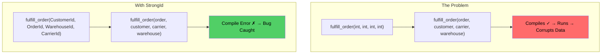
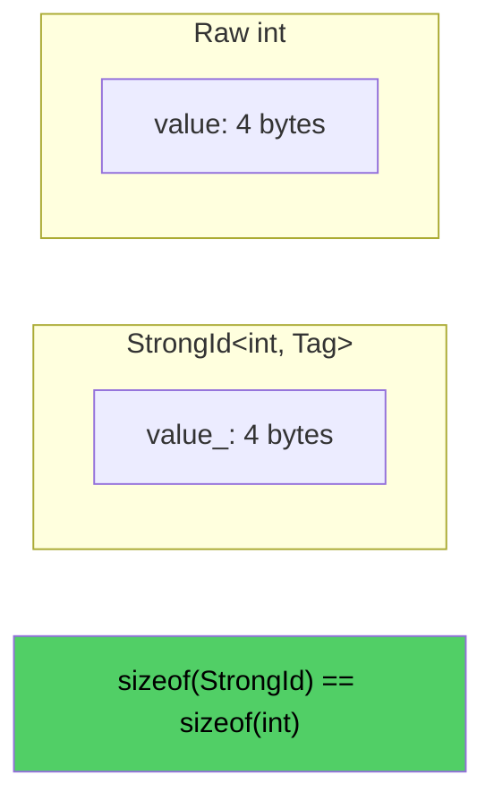

# Overview - StrongId

*Fat-P Library — January 2026*

---

## Executive Summary

StrongId is a zero-overhead type wrapper that prevents a pervasive class of bugs: mixing up integer IDs that represent different entities. When `UserId`, `OrderId`, and `ProductId` are all `int`, the compiler cannot catch `process(order_id, user_id)` called as `process(user_id, order_id)`. StrongId makes each ID type distinct at compile time while generating identical machine code to raw integers. The policy-based design adds optional validation (positive-only, non-zero, range constraints) and overflow-checked arithmetic without virtual dispatch or runtime type information.

---

## Overview Card

**Component:** StrongId  
**Problem solved:** Compile-time prevention of ID parameter mix-ups; optional value validation  
**When to use:** Any codebase with multiple integer ID types crossing API boundaries  
**When NOT to use:** Single ID type; need pre-C++20 compatibility; need dimensional analysis (units, quantities)  
**Key guarantee:** Zero overhead—`sizeof(StrongId<int, Tag>) == sizeof(int)`; identical assembly to raw int  
**std equivalent:** None. No standard equivalent exists or is planned.  
**Boost equivalent:** `BOOST_STRONG_TYPEDEF` (macro-based, fewer features)  
**Other alternatives:** fluent::NamedType, ts::strong_typedef (type_safe), strong::type (rollbear)  
**Read next:** User Manual - StrongId, Companion Guide - StrongId

---

## The Problem Domain

### What Goes Wrong Without It

Consider this function signature from a real e-commerce system:

```cpp
void fulfill_order(int customer_id, int order_id, int warehouse_id, int carrier_id);
```

This call compiles without warning:

```cpp
fulfill_order(order_id, customer_id, carrier_id, warehouse_id);  // ALL WRONG
```

The bug ships to production. Order #12345 is fulfilled for customer #67890 from warehouse #11111 via carrier #22222—except those numbers are scrambled. The order goes to the wrong customer, from the wrong warehouse, with the wrong carrier. The database is corrupted. Customer support spends hours untangling the mess.

This is not hypothetical. Studies of production bugs consistently find that parameter ordering errors are common, invisible to code review, expensive to fix, and entirely preventable—if the compiler knows the types are different.



### The Standard's Limitation

C++ provides `using` aliases, but they create synonyms, not distinct types. To the compiler, `using UserId = int` and `using OrderId = int` are both just `int`. The alias documents intent but provides no enforcement.

`enum class` creates distinct types but lacks arithmetic, hashing, and convenient construction. Using it for IDs requires 30-50 lines of boilerplate per type.

No standard component provides distinct types, full operator support, zero overhead, and validation policies together.

---

## Architecture: Policy-Based Zero-Overhead Wrapper

StrongId combines three mechanisms to solve this problem:

### Tag-Based Type Distinction

Each ID type uses a unique tag (typically an empty struct) to create a distinct type:

```cpp
struct UserIdTag {};
struct OrderIdTag {};

using UserId = fat_p::StrongId<int, UserIdTag>;
using OrderId = fat_p::StrongId<int, OrderIdTag>;
```

The tag exists only at compile time. It occupies no memory and generates no code. But it makes `UserId` and `OrderId` completely different types that cannot be mixed.

### Single-Member Layout

The wrapper contains exactly one data member—the underlying value. No vtable pointer, no RTTI, no metadata. The size equals `sizeof(T)`, and operations compile to identical assembly as raw integers.



### Policy-Based Behavior

Validation and arithmetic behavior are controlled by template policies resolved at compile time:

```cpp
// No validation (default) - zero overhead
using RawId = fat_p::StrongId<int, Tag>;

// Must be positive - throws on negative
using PositiveId = fat_p::StrongId<int, Tag, fat_p::strong_id::PositiveCheckPolicy>;

// Unchecked arithmetic - maximum performance
using FastId = fat_p::StrongId<int, Tag, fat_p::strong_id::NoCheckPolicy, fat_p::strong_id::UncheckedOpPolicy>;
```

No virtual dispatch. No runtime flags. The policy code is inlined directly into the generated class.

---

## Feature Inventory

### Compile-Time Type Safety

Different tag types create incompatible ID types. The compiler rejects code that confuses them:

```cpp
void process(UserId user, OrderId order);

process(user, order);   // OK
process(order, user);   // Compile error
```

### Complete Operator Set

All expected operations work naturally: comparison (`<`, `==`, etc.), arithmetic (`+`, `++`, `+=`), bitwise (`&`, `|`, `^`), and hashing for standard containers.

### Validation Policies

Built-in policies enforce domain constraints at construction: `PositiveCheckPolicy` (≥ 0), `StrictlyPositiveCheckPolicy` (> 0), `NonZeroCheckPolicy` (≠ 0), `RangeCheckPolicy<Min, Max>`.

### Overflow-Checked Arithmetic

`DefaultOpPolicy` detects overflow and throws `std::overflow_error`. For maximum performance, `UncheckedOpPolicy` provides raw arithmetic identical to native integers.

### Atomic Support

`AtomicStrongId` is a wrapper class holding a `std::atomic<StrongId<...>>` member and supports `load()`, `store()`, `exchange()`, and `compare_exchange_*()` on the typed ID.

`std::atomic` does **not** provide `fetch_add()`/`fetch_sub()` for user-defined types; `AtomicStrongId` fills this gap with `fetch_add()`/`fetch_sub()` implemented via compare-exchange loops that respect the OpPolicy overflow checks—making type-safe atomic ID generators direct.

### Expected Integration

The `create()` factory returns `Expected<StrongId, std::string>` for safe handling of potentially invalid values without exceptions.

---

## Why Not Alternatives?

### vs. BOOST_STRONG_TYPEDEF

| Aspect | BOOST_STRONG_TYPEDEF | FAT-P StrongId |
|--------|---------------------|----------------|
| Implementation | Macro-based | Template-based |
| Validation | None | Policy-based |
| Overflow checking | None | Policy-based |
| Expected integration | None | Built-in |
| Dependencies | Boost headers | None |

### vs. fluent::NamedType

| Aspect | fluent::NamedType | FAT-P StrongId |
|--------|------------------|----------------|
| Feature scope | Broader (skills, conversions) | Focused on IDs |
| Compile time | Slower | Faster |
| Validation | Manual | Built-in policies |

### vs. type_safe

| Aspect | ts::strong_typedef | FAT-P StrongId |
|--------|-------------------|----------------|
| Dimensional analysis | Yes | No |
| Dependencies | type_safe library | None |

**When to use FAT-P StrongId:** ID-focused type safety with validation, zero dependencies, minimal compile time impact.

---

## Performance Characteristics

Benchmarks on Windows, MSVC 2022, 3.7 GHz (median of 15 runs, 1M operations):

| Operation | StrongId (Unchecked) | Raw int | Ratio |
|-----------|---------------------|---------|-------|
| Construction | 0.09 ns | 0.09 ns | 1.00× |
| Comparison | 0.37 ns | 0.37 ns | 1.00× |
| Addition | 0.93 ns | 0.93 ns | 1.00× |
| Increment | 0.19 ns | 0.19 ns | 1.00× |
| Hash | 0.59 ns | 0.59 ns | 1.00× |

Every ratio is 1.00×. The wrapper compiles away completely.

Checked arithmetic (DefaultOpPolicy) adds overhead: 2.2× for addition, ~10× for increment. This is the cost of overflow detection—use `UncheckedOpPolicy` for hot paths where overflow is impossible.

---

## Integration Points

```
StrongId.h
    → uses: CheckedArithmetic.h (overflow detection)
    → uses: Expected.h (safe factory)
    → uses: FatPConcepts.h (is_strong_id trait)
    → uses: CppStandardDetection.h (C++20 spaceship operator)
```

---

## Final Assessment

StrongId delivers on the FAT-P promise:

**Permanence.** The C++ standard will never add a strong typedef—the language philosophy favors `using` aliases as synonyms. This gap is permanent.

**Specialization.** Policy-based validation, overflow checking, Expected integration, and atomic support address real-world ID handling requirements that raw integers and simple wrappers ignore.

**Control.** Choose your tradeoffs at compile time: checked vs. unchecked arithmetic, strict validation vs. permissive, thread-safe vs. single-threaded. No runtime overhead for features you don't use.

For any codebase passing integer IDs across API boundaries, StrongId transforms runtime debugging into compile-time errors—without changing the generated machine code.

---

*StrongId.h — Fat-P Library — January 2026*
