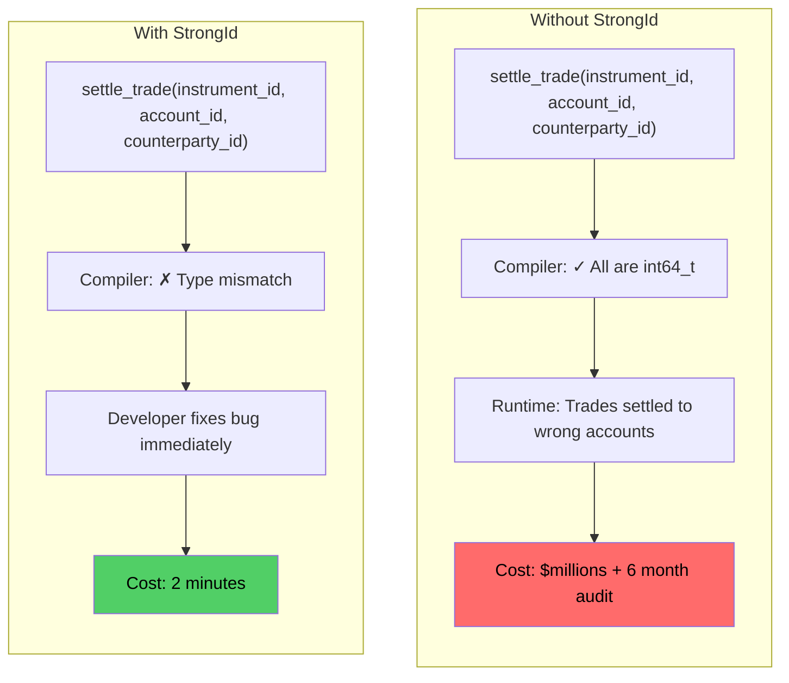
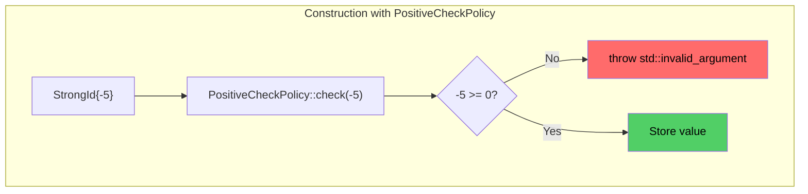

# User Manual - StrongId

*Updated January 2026*

---


**Scope:** Complete usage guide for `fat_p::StrongId<T, Tag>`: type-safe ID wrappers, phantom type tagging, comparison, hashing, serialization support, and integration with IdGenerator and SlotMap.

**Not covered:**
- ID generation policies (see IdGenerator User Manual)
- Handle-based containers (see SlotMap User Manual)
- Database-assigned IDs

**Prerequisites:** C++20; understanding of phantom types (using unused template parameters for type safety); awareness of the problem with using raw integers as IDs

---

## User Manual Card

**Component:** StrongId
**Primary use case:** Prevent accidental mixing of IDs from different domains (e.g., UserID vs OrderID) through compile-time type checking
**Integration pattern:** Define `using UserId = StrongId<uint64_t, struct UserTag>;`, use `UserId` in APIs instead of raw `uint64_t`; compiler rejects mixing UserIds with OrderIds
**Key API:** `StrongId<T, Tag, CheckPolicy, OpPolicy>`, `.value()`, comparison operators, `std::hash` specialization, `StrongId::invalid()`
**std equivalent:** None
**Common mistakes:** Using `.value()` to bypass type safety (defeats the purpose); forgetting to provide `std::hash` specialization for use in hash maps (it's automatic); defining two StrongId types with the same tag (they're the same type)
**Performance notes:** Zero overhead: same size and layout as the underlying integer type. All operations inline to the underlying type's operations

---
## Table of Contents

1. [The ID Safety Story](#the-id-safety-story)
2. [Getting Started](#getting-started)
3. [Creating Strong IDs](#creating-strong-ids)
4. [Validation Policies](#validation-policies)
5. [Arithmetic Policies](#arithmetic-policies)
6. [Operations Reference](#operations-reference)
7. [Hashing and Containers](#hashing-and-containers)
8. [Atomic Operations](#atomic-operations)
9. [Expected Integration](#expected-integration)
10. [Serialization Patterns](#serialization-patterns)
11. [Migration from Raw Integers](#migration-from-raw-integers)
12. [Migration from enum class](#migration-from-enum-class)
13. [Troubleshooting](#troubleshooting)
14. [API Reference](#api-reference)
15. [Summary](#summary)

---

## The ID Safety Story

### A Bug That Costs Millions

In 2018, a major financial institution discovered that their trade settlement system had been misrouting orders for three months. The bug was simple: a function that processed trades took `(account_id, instrument_id, counterparty_id)` as parameters. A developer, under deadline pressure, called it with `(instrument_id, account_id, counterparty_id)`. All three were `int64_t`. The compiler said nothing. Code review missed it. Unit tests passed because test values happened to be valid for any parameter.

The fix took 30 minutes. The audit took 6 months. The regulatory fine was substantial.

This is the bug that StrongId prevents. Not through runtime checks. Not through careful coding. Through the type system itself.



### The Compiler as Safety Net

With StrongId, the compiler catches the bug before the code ever runs:

```cpp
// Define distinct ID types
using AccountId = fat_p::StrongId<int64_t, AccountTag>;
using InstrumentId = fat_p::StrongId<int64_t, InstrumentTag>;
using CounterpartyId = fat_p::StrongId<int64_t, CounterpartyTag>;

void settle_trade(AccountId account, InstrumentId instrument, CounterpartyId counterparty);

// This call fails to compile:
settle_trade(instrument_id, account_id, counterparty_id);
// Error: cannot convert InstrumentId to AccountId
```

No tests required. No code review heroics. The type system enforces correctness.

---

## Getting Started

### Prerequisites

StrongId requires C++20 or later and a conforming compiler (GCC 12+, Clang 14+, MSVC 2022+).

### Integration

StrongId is header-only. Include `StrongId.h` and its dependencies:

```cpp
#include "fat_p/StrongId.h"
```

### First Program

The pattern for using StrongId has three steps: define tag types, create type aliases, and use the type-safe IDs in your code.

```cpp
#include "fat_p/StrongId.h"
#include <iostream>

// Step 1: Define tag types (empty structs)
struct UserIdTag {};
struct ProductIdTag {};

// Step 2: Create type aliases
using UserId = fat_p::StrongId<int, UserIdTag>;
using ProductId = fat_p::StrongId<int, ProductIdTag>;

// Step 3: Use type-safe IDs
void purchase(UserId buyer, ProductId item) {
    std::cout << "User " << buyer.get() 
              << " purchased product " << item.get() << "\n";
}

int main() {
    UserId alice{1001};
    ProductId widget{42};
    
    purchase(alice, widget);     // OK
    // purchase(widget, alice);  // Compile error!
    
    return 0;
}
```

The tag types exist only at compile time. They occupy no memory and generate no code. Their sole purpose is to make `UserId` and `ProductId` distinct types.

---

## Creating Strong IDs

### Basic Definition Pattern

Every StrongId needs three things: an underlying integral type, a unique tag type, and a convenient alias.

```cpp
// The tag type - must be unique per ID type
struct CustomerIdTag {};

// The StrongId alias
using CustomerId = fat_p::StrongId<int, CustomerIdTag>;

// Usage
CustomerId customer{12345};
```

### Multiple ID Types

For systems with many ID types, define a tag and alias for each. The tags can be simple empty structs or can be organized in namespaces:

```cpp
namespace tags {
    struct User {};
    struct Order {};
    struct Product {};
    struct Warehouse {};
}

using UserId = fat_p::StrongId<int, tags::User>;
using OrderId = fat_p::StrongId<int64_t, tags::Order>;  // Different underlying type
using ProductId = fat_p::StrongId<uint32_t, tags::Product>;
using WarehouseId = fat_p::StrongId<int, tags::Warehouse>;
```

Now these are all distinct types that cannot be mixed, even though they might have the same underlying representation.

### Construction

StrongId construction is explicit to prevent accidental conversions. This is intentional—it forces you to think about whether a value is actually the right type of ID.

```cpp
UserId user{42};           // Direct initialization - OK
UserId user(42);           // Also OK
UserId user = UserId{42};  // Explicit construction - OK

// These DON'T compile (by design):
// UserId user = 42;       // Error: no implicit conversion
// UserId user{3.14};      // Error: narrowing conversion
```

### Accessors

When you need the underlying value (for serialization, database queries, etc.), use `get()`:

```cpp
UserId user{42};

int raw = user.get();           // Recommended: explicit
int raw = user.value();         // Alternative name
int raw = static_cast<int>(user);  // Explicit cast also works
```

All three return 42. The explicit accessor makes it clear that you're deliberately extracting the raw value.

---

## Validation Policies

### The CheckPolicy Concept

The third template parameter controls construction-time validation:

```cpp
template <typename T, typename Tag, 
          typename CheckPolicy = fat_p::strong_id::NoCheckPolicy,  // <-- Validation policy
          template<typename> class OpPolicy = fat_p::strong_id::DefaultOpPolicy>
class StrongId;
```

When you construct a StrongId, the constructor calls `CheckPolicy::check(value)`. The policy either accepts the value silently or throws an exception.



### Built-in Policies

**NoCheckPolicy** (default): Accepts any value. Zero overhead—the check compiles to nothing.

**PositiveCheckPolicy**: Value must be ≥ 0. Zero is allowed.

```cpp
using PositiveId = fat_p::StrongId<int, Tag, fat_p::strong_id::PositiveCheckPolicy>;
PositiveId good{0};    // OK
PositiveId bad{-1};    // Throws std::invalid_argument
```

**StrictlyPositiveCheckPolicy**: Value must be > 0. Zero is rejected.

```cpp
using StrictId = fat_p::StrongId<int, Tag, fat_p::strong_id::StrictlyPositiveCheckPolicy>;
StrictId good{1};      // OK
StrictId zero{0};      // Throws: zero is not strictly positive
```

**NonZeroCheckPolicy**: Value must be ≠ 0. Negative values are allowed.

```cpp
using NonZeroId = fat_p::StrongId<int, Tag, fat_p::strong_id::NonZeroCheckPolicy>;
NonZeroId good{-1};    // OK (negative but non-zero)
NonZeroId bad{0};      // Throws
```

**RangeCheckPolicy<Min, Max>**: Value must be in [Min, Max].

```cpp
using MonthId = fat_p::StrongId<int, Tag, fat_p::strong_id::RangeCheckPolicy<1, 12>>;
MonthId jan{1};   // OK
MonthId dec{12};  // OK
MonthId bad{13};  // Throws
```

### Custom Policies

Create policies for domain-specific validation by defining a struct with a static `check` method:

```cpp
struct DatabaseIdPolicy {
    template <typename T>
    static constexpr void check(T value) {
        if (value <= 0) {
            throw std::invalid_argument("Database ID must be positive");
        }
        if (value > INT32_MAX) {
            throw std::invalid_argument("Database ID exceeds 32-bit range");
        }
    }
    
    static constexpr const char* error_message() {
        return "Database ID must be positive and fit in 32 bits";
    }
};

using DatabaseId = fat_p::StrongId<int64_t, DbIdTag, DatabaseIdPolicy>;
```

---

## Arithmetic Policies

### The OpPolicy Concept

The fourth template parameter controls arithmetic overflow behavior:

```cpp
template <typename T, typename Tag, 
          typename CheckPolicy = fat_p::strong_id::NoCheckPolicy,
          template<typename> class OpPolicy = fat_p::strong_id::DefaultOpPolicy>  // <-- Arithmetic policy
class StrongId;
```

### DefaultOpPolicy (Checked)

Detects overflow and throws `std::overflow_error`. This is the default because overflow in ID arithmetic usually indicates a bug:

```cpp
using CheckedId = fat_p::StrongId<int, Tag>;  // Uses DefaultOpPolicy

CheckedId id{INT_MAX};
++id;  // Throws std::overflow_error
```

### UncheckedOpPolicy (Fast)

Raw arithmetic with no overflow detection. Use this for hot paths where overflow is impossible by construction:

```cpp
using FastId = fat_p::StrongId<int, Tag, fat_p::strong_id::NoCheckPolicy, 
                                fat_p::strong_id::UncheckedOpPolicy>;

FastId id{INT_MAX};
++id;  // Wraps silently (same as raw int)
```

### Performance Tradeoff

Checked arithmetic has measurable overhead:

| Operation | Unchecked | Checked | Ratio |
|-----------|-----------|---------|-------|
| Addition | 0.93 ns | 2.07 ns | 2.2× |
| Increment | 0.19 ns | 1.86 ns | ~10× |

Choose based on your needs: `DefaultOpPolicy` for safety during development and at boundaries, `UncheckedOpPolicy` for hot paths where you've proven overflow is impossible.

---

## Operations Reference

### Comparison Operators

All comparison operators work between same-type StrongIds:

```cpp
UserId a{10}, b{20}, c{10};

a == c;   // true
a != b;   // true
a < b;    // true
a <= c;   // true
b > a;    // true
b >= a;   // true

// C++20: three-way comparison
auto result = a <=> b;  // std::strong_ordering::less
```

### Arithmetic Operators

Full arithmetic support for incrementing, offsetting, etc.:

```cpp
UserId id{10};

++id;       // id is now 11
id++;       // id is now 12
--id;       // id is now 11

id += 5;    // id is now 16
id -= 3;    // id is now 13
id *= 2;    // id is now 26
id /= 2;    // id is now 13

UserId sum = id + 10;   // sum is 23
UserId neg = -id;       // neg is -13
```

### Bitwise Operators

For flags, masks, and bit manipulation:

```cpp
using Flags = fat_p::StrongId<uint32_t, FlagsTag>;

Flags a{0b1100}, b{0b1010};

Flags c = a & b;   // 0b1000
Flags d = a | b;   // 0b1110
Flags e = a ^ b;   // 0b0110
Flags f = ~a;      // All bits flipped
```

---

## Hashing and Containers

StrongId provides `std::hash` specialization automatically, so you can use StrongIds in standard containers:

```cpp
#include <unordered_set>
#include <unordered_map>
#include <set>
#include <map>

// Hash-based containers
std::unordered_set<UserId> seen_users;
seen_users.insert(UserId{42});

std::unordered_map<UserId, std::string> names;
names[UserId{42}] = "Alice";

// Ordered containers (use comparison operators)
std::set<UserId> sorted_users;
std::map<UserId, std::string> ordered_names;
```

---


## Atomic Operations

### AtomicStrongId

`AtomicStrongId` is a standalone wrapper class holding a `std::atomic<StrongId<...>>` member. It preserves type safety for atomic *load/store/exchange* and *compare_exchange* operations, and—unlike raw `std::atomic<StrongId<...>>`—adds arithmetic RMW operations.

```cpp
using CounterId = fat_p::StrongId<int, CounterTag>;
using AtomicCounter = fat_p::AtomicStrongId<int, CounterTag>;

AtomicCounter counter{CounterId{0}};

// Thread-safe operations
CounterId current = counter.load();
counter.store(CounterId{100});

CounterId old = counter.exchange(CounterId{200});

// Compare-and-swap
CounterId expected{200};
bool success = counter.compare_exchange_strong(expected, CounterId{250});
```

### fetch_add and fetch_sub

`std::atomic` only provides `fetch_add()` / `fetch_sub()` for built-in arithmetic types, so `std::atomic<StrongId<...>>` would offer only load/store/exchange/compare_exchange. This is exactly why `AtomicStrongId` exists: it implements `fetch_add` and `fetch_sub` via compare-exchange loops, and the arithmetic goes through the StrongId `OpPolicy`, so overflow checks are respected.

Both operations accept either the underlying type `T` or a `StrongId` value, and return the value *before* the modification:

```cpp
CounterId prev = counter.fetch_add(1);              // add raw T
CounterId prev2 = counter.fetch_add(CounterId{5});  // add another StrongId

CounterId prev3 = counter.fetch_sub(1);
CounterId prev4 = counter.fetch_sub(CounterId{5});
```

This makes type-safe ID generators direct:

```cpp
struct EntityTag {};

class IdGenerator
{
public:
    using EntityId = fat_p::StrongId<int64_t, EntityTag>;

    EntityId generate()
    {
        return mNext.fetch_add(1);  // Returns the previous EntityId
    }

private:
    fat_p::AtomicStrongId<int64_t, EntityTag> mNext{EntityId{1}};
};
```

Because the RMW operations are CAS loops, they are lock-free whenever `std::atomic<StrongId<...>>` is lock-free (check `AtomicStrongId::is_always_lock_free` or `.is_lock_free()`).

---

## Expected Integration

### Safe Factory Method

Every StrongId with a validation policy provides `create()` for handling potentially invalid values without exceptions:

```cpp
using PositiveId = fat_p::StrongId<int, Tag, fat_p::strong_id::PositiveCheckPolicy>;

auto result = PositiveId::create(user_input);

if (result) {
    process(*result);
} else {
    std::cerr << "Invalid ID: " << result.error() << "\n";
}
```

### Chaining with map/and_then

```cpp
auto result = PositiveId::create(user_input)
    .map([](PositiveId id) {
        return id + 100;
    })
    .and_then([](PositiveId id) -> Expected<PositiveId, std::string> {
        if (id.get() > 1000) {
            return make_unexpected("ID too large");
        }
        return id;
    });
```

---

## Serialization Patterns

### JSON

```cpp
// Serialize
Json json;
json["user_id"] = user.get();

// Deserialize with validation
Expected<UserId, std::string> deserialize(const Json& j) {
    if (!j.contains("user_id") || !j["user_id"].is_number()) {
        return make_unexpected("Missing or invalid user_id");
    }
    return UserId::create(j["user_id"].get<int>());
}
```

### Database

```cpp
// Insert
db.execute("INSERT INTO users (id, name) VALUES (?, ?)", 
           user.get(), name);

// Query
auto row = db.query_one("SELECT id FROM users WHERE name = ?", name);
UserId user{row.get<int>("id")};
```

---

## Migration from Raw Integers

### Step 1: Define Types

```cpp
// Before
using UserId = int;

// After
struct UserIdTag {};
using UserId = fat_p::StrongId<int, UserIdTag>;
```

### Step 2: Fix Construction Sites

```cpp
// Before
UserId user = get_user_id();

// After  
UserId user{get_user_id()};
```

### Step 3: Fix Extraction Sites

```cpp
// Before
database.insert(user);

// After
database.insert(user.get());
```

### Step 4: Enjoy Compiler Errors

The compiler will now catch parameter swaps that previously compiled silently.

---

## Migration from enum class

### Before

```cpp
enum class UserId : int {};

// 50+ lines of manual operators per type
inline UserId operator+(UserId a, int b) { 
    return UserId{static_cast<int>(a) + b}; 
}
// ... many more
```

### After

```cpp
struct UserIdTag {};
using UserId = fat_p::StrongId<int, UserIdTag>;
// All operators provided automatically
```

---

## Troubleshooting

### "Cannot convert int to StrongId"

This is intentional. Use explicit construction:

```cpp
UserId user{42};  // Not: UserId user = 42;
```

### "Cannot compare different StrongId types"

This is intentional. If you truly need to compare values:

```cpp
if (user.get() == order.get()) { }  // Explicit and visible
```

### "std::overflow_error in arithmetic"

You're using DefaultOpPolicy (checked arithmetic) and hit overflow. Solutions:

1. Use larger underlying type (`int64_t` instead of `int`)
2. Use `UncheckedOpPolicy` if overflow is acceptable
3. Check before operation if overflow is possible

### "std::invalid_argument from validation policy"

Your value violates the policy constraint. Either validate before construction or use `create()` for Expected-based handling:

```cpp
auto result = PositiveId::create(maybe_negative_value);
if (!result) {
    // Handle invalid input
}
```

---

## API Reference

### Construction

| Signature | Description |
|-----------|-------------|
| `StrongId()` | Default constructor (value-initializes underlying type) |
| `explicit StrongId(T value)` | Construct from value (applies CheckPolicy) |
| `static create(T value)` | Safe factory returning `Expected<StrongId, std::string>` |

### Accessors

| Method | Returns | Description |
|--------|---------|-------------|
| `get()` | `T` | Underlying value |
| `value()` | `T` | Alias for `get()` |

### Sentinel and Validity

| Method | Returns | Description |
|--------|---------|-------------|
| `static invalid()` | `StrongId` | Sentinel ID (underlying `std::numeric_limits<T>::max()`) |
| `isValid()` | `bool` | True if this ID is not equal to `invalid()` |
| `static min()` | `StrongId` | ID holding the minimum underlying value |
| `static max()` | `StrongId` | ID holding the maximum underlying value |

### Comparison

`==`, `!=`, `<`, `<=`, `>`, `>=`, `<=>` (C++20)

### Arithmetic

`++`, `--` (prefix/postfix), `+`, `-`, `*`, `/`, `%`, `+=`, `-=`, `*=`, `/=`, `%=`, unary `+`, `-`

### Bitwise

`&`, `|`, `^`, `~`, `<<`, `>>`, `&=`, `|=`, `^=`, `<<=`, `>>=`

### AtomicStrongId

`load()`, `store()`, `exchange()`, `compare_exchange_weak/strong()`, `is_lock_free()`

| Method | Returns | Description |
|--------|---------|-------------|
| `fetch_add(T arg)` | `StrongId` | Atomically add `arg`; returns previous value (CAS loop, OpPolicy-checked) |
| `fetch_add(StrongId arg)` | `StrongId` | Atomically add another ID's value; returns previous value |
| `fetch_sub(T arg)` | `StrongId` | Atomically subtract `arg`; returns previous value (CAS loop, OpPolicy-checked) |
| `fetch_sub(StrongId arg)` | `StrongId` | Atomically subtract another ID's value; returns previous value |

---

## Summary

StrongId provides **compile-time type safety for integer IDs** with:

1. **Zero overhead** — Identical assembly to raw integers
2. **Full operator set** — Comparison, arithmetic, bitwise, hash
3. **Validation policies** — Enforce constraints at construction
4. **Overflow checking** — Detect arithmetic errors (optional)
5. **Atomic support** — Thread-safe counters and shared state
6. **Expected integration** — Safe factory with error handling

**Use StrongId when:** Multiple integer ID types cross API boundaries, parameter ordering bugs are a concern, domain invariants need enforcement.

**Don't use StrongId when:** pre-C++20 compatibility required, dimensional analysis needed (use type_safe), single ID type with no confusion risk.

---

*StrongId.h — Fat-P Library — January 2026*
