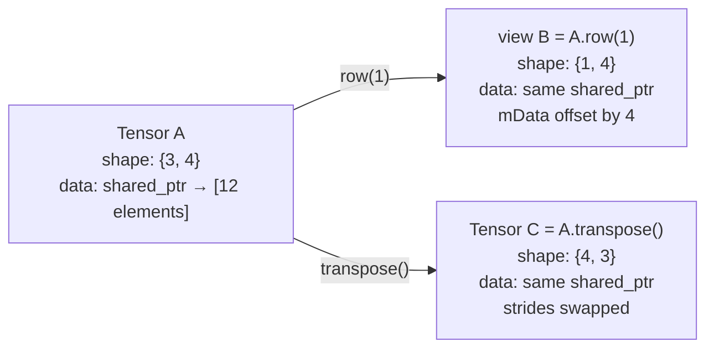

# User Manual - Tensor

*February 2026*

---

**Scope:** Complete usage guide for `fat_p::Tensor` (Tensor.h) and `fat_p::einsum` (TensorEinsum.h). Covers construction, element access, views and slices, reshape and transpose, element-wise arithmetic (SIMD-optimized), broadcasting, matrix multiplication, Einstein summation, iterator policies, memory layout, shared ownership, lifetime tracking, type aliases, serialization, and performance characteristics.

**Not covered:** GPU computation; automatic differentiation; sparse tensors (see CSRMatrix); the TensorStridePolicy companion guide (separate document).

**Prerequisites:** C++20. Basic linear algebra (matrices, vectors, element-wise operations). Understanding of row-major vs column-major storage.

---

## User Manual Card

**Component:** `fat_p::Tensor<T, Allocator, IteratorPolicy, ConcurrencyPolicy>`
**Primary use case:** Dense multidimensional array with shared-ownership views, SIMD-optimized arithmetic, and NumPy-style broadcasting
**Integration pattern:** Construct with shape -> fill or assign -> operate (arithmetic, einsum) -> extract views -> iterate with policy-aware iterators
**Key API:** `Tensor(shape)`, `operator()`, `view()`, `reshape()`, `transpose()`, `operator+/-/*/`, `broadcast_to()`, `einsum()` (matrix multiply via `einsum("ij,jk->ik", A, B)`; `matmul()` exists only for `StaticTensor` in TensorMath.h), `begin()`/`end()`
**std equivalent:** None
**Common mistakes:** Modifying a view expecting it to be independent (views share data); reshaping a non-contiguous view; using column-major layout for row-traversal code
**Performance notes:** SIMD-optimized for float/double on AVX2/AVX-512; views are zero-copy; expression templates defer evaluation for operator chains

---

## Table of Contents

1. What Is a Tensor?
2. Memory Layout: How Data Is Stored
3. Shared Ownership: How Views Work
4. Construction
5. Element Access
6. Views and Slices
7. Reshape and Transpose
8. Element-Wise Arithmetic
9. How SIMD Optimization Works
10. Broadcasting
11. Matrix Multiplication
12. Einstein Summation (Einsum)
13. Expression Templates: Lazy Evaluation
14. Iterator Policies
15. Type Aliases
16. Serialization (JSON)
17. Lifetime Tracking Integration
18. Use Case: Image Processing Pipeline
19. Use Case: Neural Network Layer
20. Use Case: Scientific Computation with Einsum
21. Use Case: Data Analysis with Views
22. Best Practices
23. Performance Characteristics
24. Troubleshooting
25. Known Limitations
26. API Reference
27. FAQ

---

## What Is a Tensor?

A tensor is a multidimensional array. A 0D tensor is a scalar, 1D is a vector, 2D is a matrix, and higher dimensions generalize from there. Fat-P's `Tensor<T>` provides a dense tensor implementation with NumPy-inspired semantics: zero-copy views via shared ownership, broadcasting for shape-mismatched arithmetic, and SIMD-accelerated operations for float and double.

Unlike a nested `std::vector<std::vector<T>>`, a Tensor stores all elements in a single contiguous allocation. A 3x4 matrix uses one allocation of 12 elements, not 3 allocations of 4. This is critical for SIMD (which requires contiguous data) and for cache performance (spatial locality).

---

## Memory Layout: How Data Is Stored

A Tensor has four core fields:

```
shared_ptr<T[]> shared_data_   // Shared ownership of the data buffer
T* mData                        // Raw pointer (possibly offset for views)
vector<size_t> mShape            // Dimensions: {3, 4} for a 3x4 matrix
vector<ptrdiff_t> mStrides       // Byte strides per dimension
```

**Shape** describes the logical dimensions. A tensor with shape `{2, 3, 4}` is a 2x3x4 three-dimensional array with 24 elements.

**Strides** describe how to advance in memory for each dimension. For a contiguous row-major 3x4 matrix, strides are `{4, 1}`: advancing one row skips 4 elements, advancing one column skips 1 element. The element at `(i, j)` is at memory offset `i * strides[0] + j * strides[1]`.

**Why strides matter.** Views and transposes do not copy data. Instead, they adjust the strides. A transpose of a 3x4 matrix becomes a 4x3 matrix with strides `{1, 4}` (the original strides swapped). The data buffer is unchanged. A row view of a 3x4 matrix has shape `{1, 4}` with strides `{4, 1}` and an offset pointer into the original buffer.

**Contiguous vs non-contiguous.** A tensor is contiguous if its strides match the expected row-major pattern (last stride = 1, each earlier stride = product of subsequent dimensions). Views, transposes, and slices may produce non-contiguous tensors. Some operations (reshape, SIMD arithmetic) require contiguous data.

### Concrete Stride Example

A 2×3×4 tensor in row-major order:

```
Shape:   {2, 3, 4}
Strides: {12, 4, 1}

Element (0, 0, 0) → offset 0*12 + 0*4 + 0*1 = 0
Element (0, 0, 3) → offset 0*12 + 0*4 + 3*1 = 3
Element (0, 1, 0) → offset 0*12 + 1*4 + 0*1 = 4
Element (1, 0, 0) → offset 1*12 + 0*4 + 0*1 = 12
Element (1, 2, 3) → offset 1*12 + 2*4 + 3*1 = 23  (last element)

Memory layout: [e000 e001 e002 e003 | e010 e011 e012 e013 | e020 e021 e022 e023
                e100 e101 e102 e103 | e110 e111 e112 e113 | e120 e121 e122 e123]
```

After `transpose()` of a 3×4 matrix:

```
Original:   shape {3, 4}, strides {4, 1}
Transposed: shape {4, 3}, strides {1, 4}

Original (1, 2) → offset 1*4 + 2*1 = 6
Transposed (2, 1) → offset 2*1 + 1*4 = 6  ← same memory location!
```

After `view({1, 0}, {3, 4})` of a 3×4 matrix (rows 1-2):

```
Original:    shape {3, 4}, strides {4, 1}, mData points to element 0
View:        shape {2, 4}, strides {4, 1}, mData points to element 4 (row 1)
```

The view's `mData` is offset into the original buffer. The shared_ptr ensures the buffer lives as long as any view exists.

---

## Shared Ownership: How Views Work

Tensor uses `shared_ptr<T[]>` for the underlying data buffer. When you create a view, slice, or transpose, the new Tensor object shares the same `shared_ptr`. No data is copied.



This means modifications through a view are visible through the original:

```cpp
Tensor<float> A({3, 4});
A.fill(0.0f);

auto row1 = A.row(1);
row1(0, 0) = 42.0f;

assert(A(1, 0) == 42.0f);  // View and original share data
```

The data buffer is freed only when the last Tensor (original or any view) is destroyed.

---

## Construction

### Template parameters

```cpp
template <typename T = double,
          typename Allocator = TensorAllocator<T>,
          typename IteratorPolicy = RowMajorPolicy,
          typename ConcurrencyPolicy = SingleThreadedPolicy>
class Tensor;
```

The fourth parameter, `ConcurrencyPolicy` (from `ConcurrencyPolicies.h`), controls synchronization; the default `SingleThreadedPolicy` is a zero-cost no-op, so single-threaded use pays nothing.

### From shape (zero-initialized)

```cpp
Tensor<float> t({3, 4});       // 3x4 matrix, all zeros
Tensor<double> v({100});        // Vector of 100 zeros
Tensor<int> cube({2, 3, 4});    // 2x3x4 tensor, all zeros
```

### From shape and fill value

```cpp
Tensor<float> ones({3, 4}, 1.0f);  // 3x4 matrix of ones
```

### Copy and move

```cpp
Tensor<float> copy = original;    // Deep copy (new allocation)
Tensor<float> moved = std::move(original);  // Move (no copy, original is empty)
```

Copy creates an independent tensor with its own data buffer. Move transfers ownership.

---

## Element Access

### Multi-index operator()

```cpp
Tensor<float> t({3, 4});
t(0, 0) = 1.0f;
t(2, 3) = 9.0f;
float val = t(1, 2);
```

Works for any number of dimensions: `t(i)` for 1D, `t(i, j)` for 2D, `t(i, j, k)` for 3D, etc. Debug builds validate indices against shape.

### Flat operator[]

```cpp
float val = t[5];  // Access the 6th element in storage order
```

Useful for iteration over all elements regardless of shape.

### at() with bounds checking

The `operator()` includes debug-mode bounds checking via `debug_bounds_check_nd`. In release mode, bounds checking is removed for performance.

---

## Views and Slices

### view(start, end)

Creates a view into a rectangular subregion:

```cpp
Tensor<float> A({4, 6});
// View rows 1-2, columns 2-4 (exclusive end)
auto sub = A.view({1, 2}, {3, 5});
// sub has shape {2, 3}, shares data with A
```

### row(i) and col(j)

Convenience for 2D tensors:

```cpp
auto r = A.row(0);   // Shape {1, 6}
auto c = A.col(2);   // Shape {4, 1}
```

### Tracked views (debug mode)

`create_tracked_slice`, `create_tracked_row`, `create_tracked_col` use ViewLifetimeTracking to detect dangling views in debug builds. If the source tensor is destroyed, accessing the tracked view throws `DanglingReferenceError`.

---

## Reshape and Transpose

### reshape(new_shape)

Changes the logical shape without copying data:

```cpp
Tensor<float> A({2, 6});
auto B = A.reshape({3, 4});   // Same 12 elements, different shape
auto C = A.reshape({12});      // Flatten to 1D
```

The total number of elements must match. Reshape requires contiguous data. Non-contiguous views (from transpose or strided slices) cannot be reshaped directly—copy to a new contiguous tensor first.

### transpose()

Swaps the two dimensions of a 2D tensor by swapping strides:

```cpp
Tensor<float> A({3, 4});
auto At = A.transpose();  // Shape {4, 3}, shares data, strides swapped
```

This is a zero-copy operation. The transposed tensor is non-contiguous (its strides are not in row-major order).

---

## Element-Wise Arithmetic

### Operators: +, -, *, /

```cpp
Tensor<float> A({3, 4}, 1.0f);
Tensor<float> B({3, 4}, 2.0f);

auto C = A + B;   // Element-wise addition
auto D = A - B;   // Element-wise subtraction
auto E = A * B;   // Element-wise multiplication (Hadamard)
auto F = A / 2.0f; // Scalar division
```

These operators first check for exact shape match. If shapes differ, they attempt broadcasting (see below).

### Scalar operations

```cpp
auto scaled = A * 3.0f;         // Multiply every element by 3
auto shifted = A + 1.0f;        // Add 1 to every element (via broadcast)
```

### In-place fill

```cpp
A.fill(0.0f);  // Set all elements to zero
```

---

## How SIMD Optimization Works

Element-wise operations are SIMD-optimized for `float` and `double` when the data is contiguous:

**AVX-512 (512-bit).** Processes 16 floats or 8 doubles per instruction. Used when `FATP_SIMD_AVX512F` is defined.

**AVX2 (256-bit).** Processes 8 floats or 4 doubles per instruction. Used when `FATP_SIMD_AVX2` is defined.

**Scalar fallback.** For integer types or non-contiguous data, falls back to element-by-element loops.

The SIMD path processes elements in chunks of the register width, then handles the remainder with scalar code:

```
For a 1000-element float addition on AVX2:
  125 iterations of _mm256_add_ps (8 floats each = 1000 floats)
  0 remainder elements
```

For non-contiguous tensors (views, transposes), SIMD cannot be used because elements are not adjacent in memory. The operation falls back to stride-aware element access.

### Broadcasting arithmetic

`broadcast_add_scalar` and `broadcast_add_vector` provide SIMD-optimized paths for common broadcasting patterns. Scalar broadcast across an entire tensor and vector broadcast across rows or columns are both SIMD-accelerated.

---

## Broadcasting

Broadcasting allows arithmetic between tensors of different shapes by logically "stretching" smaller dimensions to match larger ones. No data is actually copied during broadcasting; the broadcast tensor is accessed with stride 0 along the stretched dimension.

### The Broadcasting Algorithm

Shapes are compared element-by-element from the right (trailing dimensions first). At each position, two dimensions are compatible if they are equal or one of them is 1. The result dimension is the maximum of the two.

```
Step-by-step example:

A shape: (3, 4)
B shape:    (4)

Pad B with leading 1s: (1, 4)

Compare right-to-left:
  dim 1: 4 == 4 → result dim = 4
  dim 0: 3 vs 1 → compatible (one is 1) → result dim = 3

Result shape: (3, 4)
B is stretched along dim 0: each row of A sees the same B values
```

More examples:

```
A:      (2, 3, 4)
B:            (4)      padded to (1, 1, 4)
Result: (2, 3, 4)      B broadcast across dims 0 and 1

A:      (2, 1, 4)
B:      (1, 3, 4)
Result: (2, 3, 4)      A broadcast along dim 1, B along dim 0

A:      (3, 4)
B:      (2, 4)
Result: ERROR           3 != 2, neither is 1

A:      (5, 1)
B:      (1, 3)
Result: (5, 3)          Outer product pattern
```

### How Broadcast Is Implemented

`broadcast_to(target_shape)` returns a new Tensor with the target shape. Elements along broadcast dimensions have stride 0, meaning every index along that dimension reads the same memory location. This is a metadata-only operation — no data is copied.

For arithmetic operations, the implementation checks:
1. Are shapes identical? → Direct SIMD path (fastest).
2. Is one operand a scalar? → `broadcast_add_scalar` (SIMD, single broadcast value).
3. Is one operand a vector matching a dimension? → `broadcast_add_vector` (SIMD with set1 broadcast).
4. General case? → Compute broadcast shape, broadcast both operands, then element-wise operate.

```cpp
Tensor<float> A({3, 4});
Tensor<float> v({4});

// v broadcasts to match A's shape
auto C = A + v;
// Internally: v.broadcast_to({3, 4}) -> stride-0 view -> element-wise add
```

### broadcast_to(target_shape)

Explicitly broadcast a tensor to a target shape:

```cpp
Tensor<float> v({4});
auto expanded = v.broadcast_to({3, 4});
// expanded.shape() == {3, 4}
// expanded(0, j) == expanded(1, j) == expanded(2, j) == v(j)
```

Returns `Expected<Tensor, string>` — errors if shapes are incompatible.

### Checking compatibility

```cpp
if (A.is_broadcast_compatible(B))
{
    auto C = A + B;
}

// Or get the result shape
auto result_shape = A.compute_broadcast_shape(B.shape());
if (result_shape.has_value())
{
    // result_shape.value() is the broadcast result shape
}
```

---

## Matrix Multiplication

For 2D tensors, operator `*` is element-wise (Hadamard product). Use the matmul function in `TensorEinsum.h` via einsum notation:

```cpp
#include "TensorEinsum.h"

Tensor<float> A({3, 4});
Tensor<float> B({4, 5});
auto C = fat_p::einsum("ij,jk->ik", A, B);  // Matrix multiply: (3,4) × (4,5) = (3,5)
```

The `broadcast_add_vector` method also provides SIMD-optimized matrix-vector operations as a special case.

---

## Einstein Summation (Einsum)

`TensorEinsum.h` provides `einsum()` for flexible tensor contractions using Einstein notation:

### Unary operations

```cpp
// Transpose
auto At = einsum("ij->ji", A);

// Trace (sum of diagonal)
auto tr = einsum("ii->", A);  // Returns 1x1 tensor

// Row sum
auto rowsum = einsum("ij->i", A);  // Sum across columns

// Column sum
auto colsum = einsum("ij->j", A);  // Sum across rows

// Total sum
auto total = einsum("ij->", A);
```

### Binary operations

```cpp
// Matrix multiplication
auto C = einsum("ij,jk->ik", A, B);

// Batch matrix multiplication
auto batch_C = einsum("bij,bjk->bik", batch_A, batch_B);

// Outer product
auto outer = einsum("i,j->ij", u, v);

// Inner product (dot product)
auto dot = einsum("i,i->", u, v);

// Element-wise multiply then sum (Frobenius inner product)
auto frob = einsum("ij,ij->", A, B);
```

### Supported patterns

Einsum supports a specific set of patterns:

| Pattern | Operation | Input ranks |
|---|---|---|
| `ij->ji` | Transpose | 2D |
| `ii->` | Trace | 2D square |
| `ij->i` | Row sum | 2D |
| `ij->j` | Column sum | 2D |
| `ij->` | Total sum | 2D |
| `ij,jk->ik` | Matmul | 2D, 2D |
| `bij,bjk->bik` | Batch matmul | 3D, 3D |
| `i,j->ij` | Outer product | 1D, 1D |
| `i,i->` | Dot product | 1D, 1D |
| `ij,ij->` | Frobenius | 2D, 2D |

Unsupported patterns throw `std::invalid_argument`.

---

## Expression Templates: Lazy Evaluation

Tensor uses expression templates (`LazyAdd`, `LazySubtract`, `LazyMultiply`, `LazyScale`) to defer evaluation of operator chains. Without expression templates, each operator creates a temporary:

```cpp
// Without expression templates (hypothetical):
auto temp1 = A + B;    // Allocate temp1, compute A+B
auto temp2 = temp1 - C; // Allocate temp2, compute temp1-C
auto result = temp2 * 2.0f; // Allocate result, compute temp2*2
// 3 allocations, 3 passes over data, 2 temporaries

// With expression templates (actual):
auto result = (A + B - C) * 2.0f;
// LazyScale(LazySub(LazyAdd(A, B), C), 2.0f)
// Evaluation deferred until assignment
// 1 allocation, 1 pass over data, 0 temporaries
```

### How It Works

Each operator returns a lightweight expression object instead of a computed tensor:

```
A + B  → LazyAdd<Tensor, Tensor>{A, B}
```

`LazyAdd` stores references to A and B. It provides `operator[](i)` which computes `A[i] + B[i]` on demand, and `size()` / `shape()` which forward to the operands.

When the expression is assigned to a `Tensor` (or when an element is explicitly accessed), evaluation occurs element-by-element. The compiler can often vectorize the entire chain into a single SIMD loop.

### Limitations

Expression templates hold references to their operands. If an operand is destroyed before the expression is evaluated, the expression becomes a dangling reference. Always assign expression results to a Tensor in the same scope:

```cpp
// Safe: evaluated immediately
Tensor<float> result = A + B;

// Dangerous: lazy expression stored, A/B could go out of scope
auto lazy = A + B;  // lazy holds references to A, B
// If A or B are destroyed before lazy is used → undefined behavior
```

---

## Iterator Policies

The third template parameter controls iteration order. Choosing the right policy can significantly affect cache performance.

### RowMajorPolicy (default)

Iterates in row-major (C) order. For a 3×4 matrix, visits elements in order: `(0,0), (0,1), (0,2), (0,3), (1,0), (1,1), ...`. This follows the natural memory layout for contiguous row-major tensors, giving optimal cache performance for row-oriented traversal.

```cpp
Tensor<float, TensorAllocator<float>, RowMajorPolicy> t({3, 4});
for (auto it = t.begin(); it != t.end(); ++it)
{
    // Visits elements in row-major order
    // Sequential memory access → prefetcher-friendly
}
```

**Use for:** Default choice. Row-oriented algorithms, matrix-vector products, image row processing.

### ColumnMajorPolicy

Iterates in column-major (Fortran) order. For a 3×4 matrix, visits: `(0,0), (1,0), (2,0), (0,1), (1,1), (2,1), ...`. Uses a specialized `ColumnIterator` that advances down columns first.

```cpp
ColumnMajorTensor<float> t({3, 4});
for (auto it = t.begin(); it != t.end(); ++it)
{
    // Visits elements in column-major order
}
```

**Use for:** Fortran/LAPACK interop, column-oriented algorithms, when columns are processed together.

### StridedPolicy

General-purpose multi-dimensional iterator that respects arbitrary strides. Maintains an N-dimensional index vector and advances through all dimensions correctly. Handles non-contiguous views (transposes, slices with gaps) that RowMajor and ColumnMajor cannot iterate correctly.

```cpp
StridedTensor<float> t({3, 4});
auto transposed = t.transpose();
// transposed is non-contiguous; RowMajorPolicy would read wrong elements
// StridedPolicy correctly follows the transposed strides
for (auto it = transposed.begin(); it != transposed.end(); ++it)
{
    // Correct element order even with non-contiguous strides
}
```

**Use for:** Views, transposes, any non-contiguous tensor. Slower than RowMajor/ColumnMajor due to multi-dimensional index maintenance (~3-5x overhead per iteration step).

### BlockedPolicy<BlockSize>

Iterates in blocked (tiled) order for cache optimization. Divides the tensor into `BlockSize × BlockSize` tiles and processes each tile contiguously before moving to the next. Default block size is 64 elements.

```cpp
BlockedTensor<float, 32> t({256, 256});
// Iterates in 32×32 blocks:
//   Block (0,0): rows 0-31, cols 0-31
//   Block (0,1): rows 0-31, cols 32-63
//   ...
```

**Use for:** Matrix-matrix operations where both row and column access patterns occur. Tiling keeps both operands' working sets in L1/L2 cache, reducing cache misses from ~O(N²/cache_line) to ~O(N²/block_area).

### Performance Comparison

| Policy | Contiguous tensor | Non-contiguous tensor | Cache pattern |
|---|---|---|---|
| RowMajor | ~0.3 ns/elem | Incorrect results | Sequential |
| ColumnMajor | ~0.3 ns/elem | Incorrect results | Column-stride |
| Strided | ~1.5 ns/elem | ~1.5 ns/elem (correct) | Stride-dependent |
| Blocked<64> | ~0.5 ns/elem | Not supported | Tiled |

---

## Type Aliases

```cpp
// Row-major (default, C order)
fat_p::RowMajorTensor<float>     // = Tensor<float, TensorAllocator<float>, RowMajorPolicy>

// Column-major (Fortran order)
fat_p::ColumnMajorTensor<float>  // = Tensor<float, TensorAllocator<float>, ColumnMajorPolicy>

// Strided (general, handles any view)
fat_p::StridedTensor<float>      // = Tensor<float, TensorAllocator<float>, StridedPolicy>

// Blocked (cache-optimized tiles)
fat_p::BlockedTensor<float>      // = Tensor<float, TensorAllocator<float>, BlockedPolicy<64>>

// Convenience alias
fat_p::OptimizedTensor<float>    // = RowMajorTensor<float>
```

### TensorAllocator

Default allocator using 64-byte aligned allocation (cache-line and AVX-512 aligned). Ensures SIMD loads and stores can use aligned instructions for maximum throughput.

---

## Serialization (JSON)

Tensor supports JSON serialization via Fat-P's JsonLite:

```cpp
JsonValue j;
to_json(j, tensor);
// j contains: {"shape": [3, 4], "strides": [4, 1], "data": [1.0, 2.0, ...]}

Tensor<float> loaded;
from_json(j, loaded);
```

### std::hash

Tensor provides a `std::hash` specialization that hashes shape, strides, and data. For floating-point types, values are bit-cast to integers before hashing for consistent NaN handling.

---

## Lifetime Tracking Integration

Tensor integrates with ViewLifetimeTracking for debug-mode dangling view detection:

```cpp
Tensor<float> A({3, 4});
auto tracked_row = A.create_tracked_row(1);
// tracked_row checks LifetimeToken on every access

// If A is destroyed while tracked_row exists:
// tracked_row->operator()(0, 0) throws DanglingReferenceError
```

In release builds, tracked views are regular views with zero overhead.

---

## Use Case: Image Processing Pipeline

```cpp
// Load image as 3D tensor: height × width × channels
Tensor<float> image({480, 640, 3});

// Extract red channel
auto red = image.view({0, 0, 0}, {480, 640, 1});

// Normalize to [0, 1]
auto normalized = image / 255.0f;

// Apply per-channel mean subtraction (broadcasting)
Tensor<float> mean({3}, 0.0f);  // Compute mean per channel
// mean.fill(...) with actual means
auto centered = normalized - mean;  // mean broadcasts across height×width
```

## Use Case: Neural Network Layer

```cpp
// Weights: output_features × input_features
Tensor<float> W({256, 512});
Tensor<float> b({256});          // Bias vector

// Input batch: batch_size × input_features
Tensor<float> X({32, 512});

// Forward pass: Y = X @ W^T + b
auto Wt = W.transpose();                         // {512, 256}
auto Y = einsum("ij,jk->ik", X, Wt);            // {32, 256}
auto output = Y + b;                              // b broadcasts across batch
```

## Use Case: Scientific Computation with Einsum

```cpp
// Stress tensor contraction
Tensor<float> stress({3, 3});
Tensor<float> strain({3, 3});

// Double contraction: σ:ε = σ_ij * ε_ij
auto energy = einsum("ij,ij->", stress, strain);

// Matrix chain: A @ B @ C
Tensor<float> A({10, 20}), B({20, 30}), C({30, 5});
auto AB = einsum("ij,jk->ik", A, B);
auto ABC = einsum("ij,jk->ik", AB, C);
```

## Use Case: Data Analysis with Views

```cpp
// Dataset: samples × features
Tensor<float> data({1000, 50});

// Extract first 100 samples (zero-copy)
auto subset = data.view({0, 0}, {100, 50});

// Extract a single feature column
auto feature_5 = data.col(5);  // {1000, 1}

// Compute statistics on the subset
// (application-specific reduction)
```

---

## Best Practices

### Use RowMajorTensor (Default) Unless You Have a Reason

Row-major is the natural C/C++ order. STL algorithms, range-based for loops, and most numerical libraries expect row-major data. Use ColumnMajor only for Fortran interop or column-oriented algorithms.

### Prefer Views Over Copies

`view()`, `row()`, `col()`, `transpose()` are all zero-copy. Avoid copying data when a view suffices. Only copy when you need an independent tensor that will not be affected by modifications to the original.

### Check is_contiguous() Before SIMD-Dependent Operations

SIMD optimization requires contiguous data. Views and transposes may produce non-contiguous tensors. If performance is critical, check `is_contiguous()` or create a contiguous copy.

### Use Einsum for Complex Contractions

Einsum is more readable and less error-prone than manual index loops. `einsum("ij,jk->ik", A, B)` is clearer than nested loops implementing matmul.

### Pre-allocate for Repeated Operations

Creating a tensor allocates memory. If you perform the same operation repeatedly (e.g., in a loop), allocate the result tensor once and fill it, rather than creating a new tensor each iteration.

### Use BlockedPolicy for Matrix-Matrix Operations

When both row and column access patterns occur (matmul, convolution), BlockedPolicy's tiling improves cache utilization.

---

## Performance Characteristics

| Operation | Mechanism | Contiguous vs Non-contiguous |
|---|---|---|
| Element access `t(i,j)` | Offset computation from strides | Same cost — single multiply-add per dimension |
| Fill | SIMD `memset` (contiguous) vs strided scalar writes | Contiguous uses bulk memory fill; strided pays per-element overhead |
| Element-wise add | SIMD vectorized (contiguous) vs scalar loop | Contiguous processes 8 floats per AVX2 instruction |
| Scalar multiply | SIMD vectorized (contiguous) vs scalar loop | Same SIMD advantage as element-wise add |
| Broadcast add (vector) | SIMD broadcast + vectorized add | Contiguous enables full SIMD width; strided falls back to scalar |
| View creation | Metadata construction only — no data copy | Same — zero-copy regardless of layout |
| Reshape | Shape array update — no data movement | Only valid for contiguous tensors; metadata-only operation |
| Transpose | Stride array swap — no data movement | Same — O(1) stride permutation |
| Copy (1M floats) | `memcpy` (contiguous) vs strided element copy | Contiguous uses bulk memory copy; strided pays per-element overhead |

See `components/Tensor/results/` for current platform-specific benchmark data.

---

## Troubleshooting

### "Shape mismatch in operator+: lhs=3D, rhs=2D"

Element-wise operators require matching shapes or broadcast-compatible shapes. Check dimensions with `shape()`.

### "transpose() requires 2D tensor"

`transpose()` only works on 2D tensors. For higher-dimensional permutation, use einsum notation.

### "Invalid view range at dimension N"

View start/end indices are out of bounds. Check that `start[i] < end[i]` and `end[i] <= shape[i]`.

### SIMD path not activating (slow performance)

Check that the tensor is contiguous (`is_contiguous()`). Views and transposes produce non-contiguous tensors. Check that T is float or double (SIMD not implemented for integers). Check compiler flags (`-mavx2` or `/arch:AVX2`).

### "Incompatible shapes for broadcasting"

Broadcasting requires that corresponding dimensions are equal or one is 1. Shapes `{3, 4}` and `{2, 4}` are not compatible (3 != 2 and neither is 1).

### "einsum: Unsupported unary/binary pattern"

Einsum supports a specific set of patterns (see table above). Arbitrary patterns are not implemented.

### Memory usage doubles after arithmetic

Each arithmetic operation creates a new tensor. For `A + B - C`, two new tensors are created (one for `A+B`, one for the subtraction). Expression templates reduce this but the final result is always a new allocation.

### DanglingReferenceError from tracked view

The source tensor was destroyed while a tracked view still exists. Ensure the source outlives all views, or use shared ownership patterns.

---

## Known Limitations

**No GPU support.** All computation is CPU-only.

**Limited einsum patterns.** Not all Einstein notation patterns are implemented. Only the patterns listed in the supported patterns table work.

**SIMD for float/double only.** Integer arithmetic uses scalar loops.

**No automatic differentiation.** No gradient tracking or backward pass.

**Reshape requires contiguous.** Non-contiguous views (transposes, slices) must be copied to contiguous before reshaping.

**No in-place arithmetic operators.** `+=`, `-=`, `*=` are not provided. Each operation creates a new tensor.

**2D-only transpose.** Higher-dimensional permutation requires einsum.

---

## API Reference

### Construction

| Method | Description |
|---|---|
| `Tensor(shape)` | Create with shape, zero-initialized |
| `Tensor(shape, value)` | Create with shape, filled with value |
| `Tensor(const Tensor&)` | Deep copy |
| `Tensor(Tensor&&)` | Move |

### Element Access

| Method | Description |
|---|---|
| `operator()(i, j, ...)` | Multi-index access (bounds-checked in debug) |
| `operator[](n)` | Flat index access |
| `at(indices)` | Bounds-checked multi-index |

### Shape and Metadata

| Method | Description |
|---|---|
| `shape()` | Dimension sizes |
| `strides()` | Stride per dimension |
| `size()` | Total element count |
| `ndim()` | Number of dimensions |
| `dim(axis)` | Size of specific dimension |
| `empty()` | True if size == 0 |
| `is_contiguous()` | True if row-major contiguous |

### Views and Transforms

| Method | Description |
|---|---|
| `view(start, end)` | Rectangular subview (zero-copy) |
| `row(i)` | Row view of 2D tensor |
| `col(j)` | Column view of 2D tensor |
| `reshape(new_shape)` | Reshape (requires contiguous) |
| `transpose()` | 2D transpose (zero-copy, swaps strides) |
| `create_tracked_slice(start, end)` | Debug-tracked view |
| `create_tracked_row(i)` | Debug-tracked row |
| `create_tracked_col(j)` | Debug-tracked column |

### Arithmetic

| Method | Description |
|---|---|
| `operator+(Tensor)` | Element-wise add (SIMD, with broadcast) |
| `operator-(Tensor)` | Element-wise subtract (SIMD, with broadcast) |
| `operator*(Tensor)` | Element-wise multiply (SIMD, with broadcast) |
| `operator/(scalar)` | Scalar division |
| `fill(value)` | Set all elements |
| `broadcast_add_scalar(s)` | SIMD-optimized scalar broadcast |
| `broadcast_add_vector(v)` | SIMD-optimized vector broadcast |

### Broadcasting

| Method | Description |
|---|---|
| `is_broadcast_compatible(other)` | Check compatibility |
| `compute_broadcast_shape(other_shape)` | Compute result shape (Expected) |
| `is_broadcastable(other_shape)` | Bool check |
| `broadcast_to(target_shape)` | Broadcast to target shape (Expected) |

### Einsum (TensorEinsum.h)

| Function | Description |
|---|---|
| `einsum(notation, A)` | Unary einsum (transpose, trace, sum) |
| `einsum(notation, A, B)` | Binary einsum (matmul, outer, dot) |

### Iteration

| Method | Description |
|---|---|
| `begin()` / `end()` | Policy-aware iterators |
| `operator==` | Element-wise equality |
| `std::hash<Tensor>` | Hash specialization |

### Serialization

| Function | Description |
|---|---|
| `to_json(j, tensor)` | Serialize to JsonValue |
| `from_json(j, tensor)` | Deserialize from JsonValue |

---

## FAQ

**Q: Does modifying a view modify the original?**

Yes. Views share the underlying data buffer. Any write through a view is visible through the original tensor and all other views of the same region.

**Q: How do I make an independent copy?**

Use the copy constructor: `Tensor<float> copy = original;`. This deep-copies the data.

**Q: Can I use Tensor with custom types?**

Yes, for storage and element access. SIMD optimization is only available for float and double. Arithmetic operators work for any type with `operator+/-/*` defined.

**Q: What is the alignment of the data buffer?**

`TensorAllocator` uses 64-byte alignment by default (cache line and AVX-512 aligned). You can customize this via the Allocator template parameter.

**Q: How does Tensor compare to Eigen?**

Tensor is a general-purpose dense array with shared-ownership views. Eigen is a mature linear algebra library with expression templates, sparse support, and extensive decompositions. Use Tensor for Fat-P integration and simple numerical work; use Eigen for serious linear algebra.

**Q: Can I reshape a transposed tensor?**

Not directly. `transpose()` produces a non-contiguous tensor (strides are swapped). `reshape()` requires contiguous data. Copy the transposed tensor first: `auto contiguous = Tensor(transposed);` then reshape.

---

*Tensor.h / TensorEinsum.h --- Fat-P Library*
