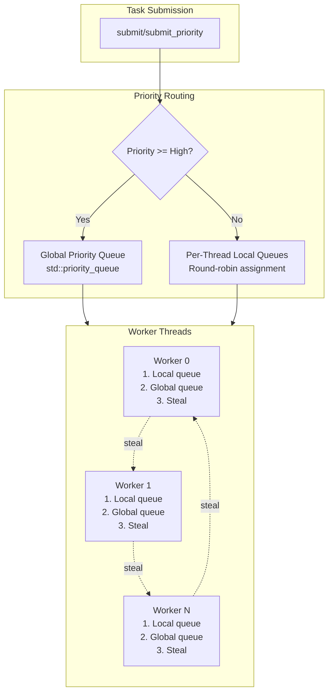

# Overview - ThreadPool

*Fat-P Library — February 2026*

---

## Executive Summary

ThreadPool is a work-stealing task executor that eliminates thread-creation overhead in parallel code. Unlike `std::async`, which may spawn a new OS thread per invocation, ThreadPool maintains a fixed set of workers with per-thread queues, a global priority queue for urgent work, and Fisher-Yates randomized victim selection for starvation-free load balancing. A two-phase idle strategy—configurable spin-wait followed by OS sleep—allows tuning the latency/CPU tradeoff per workload. Task submission is a lock-free enqueue to the submitting thread's local queue, avoiding OS thread scheduler interaction entirely.

---

## Overview Card

**Component:** ThreadPool  
**Problem solved:** Thread-creation overhead and load imbalance in task-parallel code  
**When to use:** Fine-grained parallelism (many short tasks); bursty workloads needing low submission latency; priority-sensitive scheduling  
**When NOT to use:** Long-running I/O-bound tasks (use Boost.Asio); fork-join parallelism with task dependencies (use Intel TBB task groups); single-producer/single-consumer pipelines (use WorkQueue)  
**Key guarantee:** All public methods are thread-safe; graceful shutdown completes pending tasks  
**std equivalent:** None. `std::execution` (C++26) provides scheduling abstractions but no concrete thread pool.  
**Boost equivalent:** `boost::asio::thread_pool` (tied to Asio executor model)  
**Other alternatives:** Intel TBB `task_arena`, folly `CPUThreadPoolExecutor`, hand-rolled `std::thread` loops  
**Read next:** User Manual - ThreadPool

---

## The Problem Domain

### What Goes Wrong Without It

Consider a physics simulation stepping 100,000 particles per frame at 60 FPS:

```cpp
void step_particles(std::span<Particle> particles, float dt) {
    std::vector<std::thread> threads;
    for (size_t i = 0; i < particles.size(); i += 256) {
        threads.emplace_back([&, i]() {
            size_t end = std::min(i + 256, particles.size());
            for (size_t j = i; j < end; ++j)
                integrate(particles[j], dt);
        });
    }
    for (auto& t : threads) t.join();
}
```

This creates ~390 threads per frame, 23,400 per second. Each thread creation costs 10,000–50,000 CPU cycles for stack allocation, kernel data structure setup, and scheduler updates. The program spends more time managing threads than integrating particles. At 60 FPS, the overhead alone consumes an entire core.

The `std::async` alternative is worse. On libstdc++ it spawns threads unconditionally; on MSVC it may serialize tasks onto a single thread. The behavior is implementation-defined, the future destructor blocks if not retrieved, and there is no priority control.

| Issue | Impact |
|-------|--------|
| Thread creation (10–50K cycles each) | Dominates compute for fine-grained tasks |
| No priority scheduling | Critical work waits behind batch work |
| No load balancing | Uneven chunks waste 20–40% of CPU capacity |
| `std::async` future destructor blocks | Deadlock risk in task DAGs |

### The Standard's Limitation

C++26 introduces `std::execution` with senders and receivers for asynchronous composition. This does not solve the thread pool problem. `std::execution` provides abstractions over execution contexts—you still need a concrete execution context to run senders. The standard does not mandate any specific context and provides no priority scheduling, no work-stealing guarantees, and no configurable idle strategies.

C++ will likely never standardize a thread pool. There is no consensus on priority semantics, queue bounds, or idle behavior. These are application-specific decisions.

---

## Architecture: Hybrid Priority Queue with Work Stealing



The core type is straightforward:

```cpp
class ThreadPool {
public:
    explicit ThreadPool(size_t num_threads = 0, size_t spin_us = 2000);
    
    template <typename F, typename... Args>
        requires std::invocable<F, Args...>
    [[nodiscard]] auto submit(F&& f, Args&&... args)
        -> std::future<std::invoke_result_t<F, Args...>>;
    
    template <typename F, typename... Args>
        requires std::invocable<F, Args...>
    [[nodiscard]] auto submit_priority(Priority priority, F&& f, Args&&... args)
        -> std::future<std::invoke_result_t<F, Args...>>;
    
    void submit_batch(const std::vector<std::function<void()>>& tasks);
    void wait_idle();
    void shutdown();
};
```

**The mechanism** is a two-tier queue system:

**High and Critical priority** tasks go to a global `std::priority_queue`, visible to all workers immediately. This ensures urgent work is never stuck behind a particular worker's local queue.

**Normal and Low priority** tasks go to per-thread local queues via round-robin assignment. Workers check their own queue first (LIFO pop for cache locality), then the global queue, then attempt to steal from other workers' queues (FIFO steal to avoid contention with the owner).

**Work stealing** uses Fisher-Yates shuffled victim selection. Each steal attempt shuffles the full list of worker indices, then checks each queue exactly once. This prevents starvation—no queue is systematically ignored—without the overhead of maintaining a work-stealing deque (the Chase-Lev design was rejected in favor of mutex-protected deques for simplicity and debuggability).

**The idle strategy** is two-phase. When a worker finds no work, it first spin-waits for a configurable duration (default 2000 μs), yielding between checks. If no work arrives during the spin window, it sleeps on a condition variable with a 10 ms timeout. The spin phase catches bursty workloads at sub-microsecond latency; the sleep phase conserves CPU during extended idle.

---

## Feature Inventory

### 1. Priority-Based Task Routing

Four priority levels control scheduling order:

```cpp
fat_p::ThreadPool pool(4);

// Critical: system health checks, watchdog timers
auto f1 = pool.submit_priority(fat_p::Priority::Critical, check_health);

// High: user-facing latency-sensitive work
auto f2 = pool.submit_priority(fat_p::Priority::High, render_frame);

// Normal: default for most tasks
auto f3 = pool.submit(compute_physics);

// Low: background maintenance, prefetching
auto f4 = pool.submit_priority(fat_p::Priority::Low, prefetch_data);
```

Priority is enforced by queue routing, not reordering. High/Critical tasks enter the global queue where all workers can see them. Normal/Low tasks enter local queues. Within the global queue, higher priority executes first; within equal priority, FIFO order is preserved via monotonic task IDs.

### 2. Starvation-Free Work Stealing

When a worker's local queue and the global queue are both empty, it steals from other workers. The Fisher-Yates shuffle ensures every queue is checked exactly once per steal attempt in random order:

```cpp
// Internal mechanism (simplified)
std::shuffle(victims.begin(), victims.end(), rng);
for (size_t idx : victims) {
    if (idx != my_idx && worker_queues[idx].steal(task))
        return true;
}
```

Stealing uses `try_to_lock`—if the victim's mutex is held by its owner, the thief skips to the next victim rather than blocking. This avoids deadlocks and reduces contention.

### 3. TOCTOU-Free Idle Detection

`wait_idle()` uses a dedicated condition variable and two atomic counters (pending and active) to avoid the classic time-of-check/time-of-use race in idle detection. The counter ordering invariant—active is incremented *before* pending is decremented—ensures no thread can observe both counters at zero while a task is in flight.

```cpp
pool.submit(expensive_computation);
pool.submit(another_computation);
pool.wait_idle();  // Returns only when both tasks complete
```

### 4. Lambda-Based Argument Forwarding

`std::bind` has a known reference-decay problem: it copies arguments even through `std::ref`, and interacts poorly with overloaded functions. ThreadPool uses lambda capture with `std::apply` instead:

```cpp
auto bound_task = [func = std::forward<F>(f),
                   args = std::make_tuple(std::forward<Args>(args)...)]()
                   mutable {
    return std::apply(std::move(func), std::move(args));
};
```

Reference semantics are preserved correctly when using `std::ref()`. No `std::bind` anywhere in the implementation.

### 5. Batch Submission

For workloads that submit hundreds of tasks at once, `submit_batch()` acquires the global mutex once and sends a single `notify_all` instead of one notification per task:

```cpp
std::vector<std::function<void()>> tasks;
for (size_t i = 0; i < 10000; ++i)
    tasks.push_back([i]() { process_chunk(i); });

pool.submit_batch(tasks);  // Single lock, single notify
```

This avoids the thundering herd problem where each individual notification wakes a worker that may immediately sleep again.

### 6. Cache-Line Aligned Queues

Per-thread queues are wrapped in `alignas(FATP_CACHE_LINE_SIZE)` to prevent false sharing. Without this, adjacent queues in memory could share a cache line, causing one worker's mutex operations to invalidate another worker's cache—serializing independent operations.

### 7. O(1) Diagnostics

All monitoring methods are lock-free atomic reads:

```cpp
pool.thread_count();     // Workers (immutable after construction)
pool.pending_tasks();    // Tasks in queues
pool.active_tasks();     // Tasks currently executing
pool.exception_count();  // Infrastructure exceptions caught
pool.is_shutdown();      // Whether shutdown() has been called
```

---

## Why Not Alternatives?

### std::async

| Aspect | std::async | fat_p::ThreadPool |
|--------|-----------|-------------------|
| **Thread management** | Implementation-defined (may create thread per call) | Fixed worker count, reused |
| **Priority** | None | Four levels with queue routing |
| **Load balancing** | None | Work stealing |
| **Batch submission** | No | `submit_batch()` with single notification |
| **Idle strategy** | N/A | Configurable spin/sleep |
| **Dependencies** | Standard library | None (STL only) |

**When to use std::async:** One-off background tasks where portability is paramount and performance doesn't matter.

**When to use ThreadPool:** Any workload submitting more than a handful of tasks.

### Intel TBB

| Aspect | Intel TBB | fat_p::ThreadPool |
|--------|----------|-------------------|
| **Task model** | Fork-join with continuations | Submit-and-forget with futures |
| **Priority** | task_group_context priorities | Per-task priority with queue routing |
| **Work stealing** | Lock-free Chase-Lev deques | Mutex-protected deques with Fisher-Yates |
| **Dependency graphs** | Native (flow graph) | Manual via futures |
| **Dependencies** | TBB library (~2MB) | None (header-only) |
| **License** | Apache 2.0 | Project license |

**When to use TBB:** Complex task DAGs with dependencies; fork-join parallelism; when you need the full parallel algorithms library.

**When to use ThreadPool:** Independent tasks with priority; zero-dependency requirement; simpler mental model.

### Boost.Asio thread_pool

| Aspect | Boost.Asio | fat_p::ThreadPool |
|--------|-----------|-------------------|
| **Model** | Executor/io_context | Direct submission |
| **Priority** | Strand ordering only | Per-task priority |
| **I/O integration** | Native async I/O | Compute tasks only |
| **Dependencies** | Boost headers | None |

**When to use Boost.Asio:** I/O-heavy workloads mixing network, disk, and timers.

**When to use ThreadPool:** CPU-bound compute with priority requirements.

### The Exclusionary Argument

| If You Need... | Why Not std::async | Why Not TBB | Why Not Boost | ThreadPool Advantage |
|----------------|--------------------|-------------|---------------|---------------------|
| Priority scheduling | Not supported | Limited | Strand-only | Four-level with queue routing |
| Zero dependencies | Standard but unreliable | 2MB library | Boost ecosystem | Header-only, STL-only |
| Work stealing | Not available | Available but heavy | Not available | Fisher-Yates, mutex-based |
| Configurable idle | Not available | Runtime scheduler | Not available | Spin/sleep tuning |

When you need **priority scheduling with zero dependencies and configurable idle behavior**, ThreadPool is the only option.

---

## The "Forever Stuck" Reality

The C++ standard committee has explicitly avoided standardizing a thread pool. `std::execution` (C++26) provides composable asynchronous abstractions—senders, receivers, schedulers—but delegates the execution context to implementations. The rationale is that scheduling policy is application-specific: a game engine needs priority and frame budgets; a database needs fairness and I/O integration; an HPC cluster needs NUMA-aware placement.

Scientific computing clusters run enterprise Linux distributions with validated toolchains:

| Environment | Typical Compiler | C++ Standard | Constraint |
|-------------|------------------|--------------|------------|
| RHEL 7 (extended support) | GCC 4.8 | C++11 | Legacy driver support |
| RHEL 8 (current LTS) | GCC 8.5 | C++17 | Validated toolchain |
| RHEL 9 (newest) | GCC 11 | C++20 | CUDA 12.x compatibility |
| CUDA 11.x systems | GCC 7-10 | C++17 | NVIDIA driver requirement |
| CUDA 12.x systems | GCC 7-12 | C++20 | NVIDIA driver requirement |

Even when C++26's `std::execution` becomes available in compilers, HPC codebases may be contractually locked to C++17/20 for driver compatibility, cluster policy, vendor support agreements, and scientific reproducibility requirements. ThreadPool is not a shim waiting for `std::execution` to mature. It fills a gap the standard deliberately leaves unfilled.

---

## Performance Characteristics

| Operation | Complexity | Mechanism |
|-----------|------------|-----------|
| `submit()` | O(1) amortized | Mutex acquire + heap/deque push |
| `submit_batch()` | O(N) single lock | One lock acquisition for N tasks |
| `pending_tasks()` | O(1) | Atomic load |
| `active_tasks()` | O(1) | Atomic load |
| `wait_idle()` | O(1) | CV wait with atomic predicate |
| Work stealing | O(T) worst case | Single pass through T threads |

### Benchmark Results (4-core Linux, GCC 11, -O3)

| Metric | Value |
|--------|-------|
| Task submission | ~2.5 us |
| Throughput | ~300K tasks/sec |
| Latency p50 (2 ms spin) | ~16 us |
| Latency p99 (2 ms spin) | ~32 us |

### Latency by Spin Configuration

| Spin Duration | p50 | p99 | CPU While Idle |
|---------------|-----|-----|----------------|
| 0 ms (no spin) | ~30 us | ~55 us | Near zero |
| 1 ms | ~19 us | ~40 us | Low |
| 2 ms (default) | ~16 us | ~32 us | Moderate |
| 5 ms | ~15 us | ~35 us | Higher |

### Where ThreadPool Wins

**Fine-grained parallelism.** Thousands of short tasks per second where thread creation overhead would dominate.

**Bursty workloads.** The spin-wait phase catches bursts at sub-microsecond latency without the cost of OS wake.

**Priority-sensitive work.** Critical tasks preempt normal work via the global queue without starving any worker.

### Where ThreadPool Loses

**I/O-bound workloads.** Workers block on I/O, consuming thread slots. Use Boost.Asio or an event loop.

**Task dependency graphs.** No native support for continuations or task DAGs. TBB's flow graph handles this natively.

**Thread count must change at runtime.** Worker count is fixed at construction. No dynamic resizing.

**Unbounded queue growth.** If producers outpace consumers, queues grow without limit. No back-pressure mechanism.

---

## Integration Points

```
ThreadPool.h
    → uses: FatPConfig.h (FATP_CACHE_LINE_SIZE)
    → used by: application-level task scheduling
    → pairs with: ObjectPool.h (task object recycling)
    → pairs with: WorkQueue.h (single-producer/single-consumer pipelines)
    → pairs with: Expected.h (error propagation from task futures)
```

**ThreadPool + ObjectPool:** Reduce allocation overhead for high-frequency submission.

```cpp
fat_p::ObjectPool<std::packaged_task<int()>> task_pool;
fat_p::ThreadPool executor(4);

auto task = task_pool.acquire([]() { return compute(); });
auto future = task->get_future();
executor.submit([t = task.get()]() { (*t)(); });
```

**ThreadPool + Expected:** Explicit error handling without exceptions.

```cpp
auto future = pool.submit([]() -> fat_p::Expected<Data, Error> {
    if (operation_fails())
        return fat_p::Unexpected<e>(Error::NetworkTimeout);
    return fetch_data();
});

auto result = future.get();  // No exception thrown
if (result) process(*result);
else handle_error(result.error());
```

**ThreadPool + Signal:** Fire-and-forget async dispatch.

```cpp
fat_p::Signal<Event> event_signal;
fat_p::ThreadPool pool(4);

event_signal.connect([&pool](Event e) {
    (void)pool.submit([e]() { handle_event(e); });
});
event_signal.emit(Event{});  // Handler runs async in pool
```

---

## Final Assessment

**Permanence.** No C++ standard thread pool is planned. `std::execution` explicitly delegates execution context to implementations. This gap is architectural, not an oversight.

**Specialization.** Priority-based queue routing, Fisher-Yates work stealing, two-phase idle strategy, cache-line aligned queues—these address HPC and real-time requirements that general-purpose executors ignore.

**Control.** Configurable spin duration. Priority per task. Batch submission to avoid thundering herd. O(1) diagnostics without locking. Fine-grained control without runtime overhead.

For task-parallel workloads with priority requirements and zero-dependency constraints, ThreadPool transforms thread-creation-bound code into queue-bound compute.

---

*ThreadPool.h — Fat-P Library*
