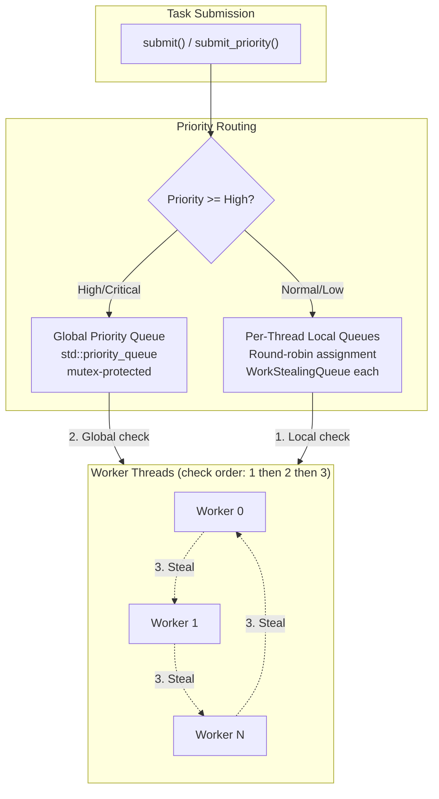
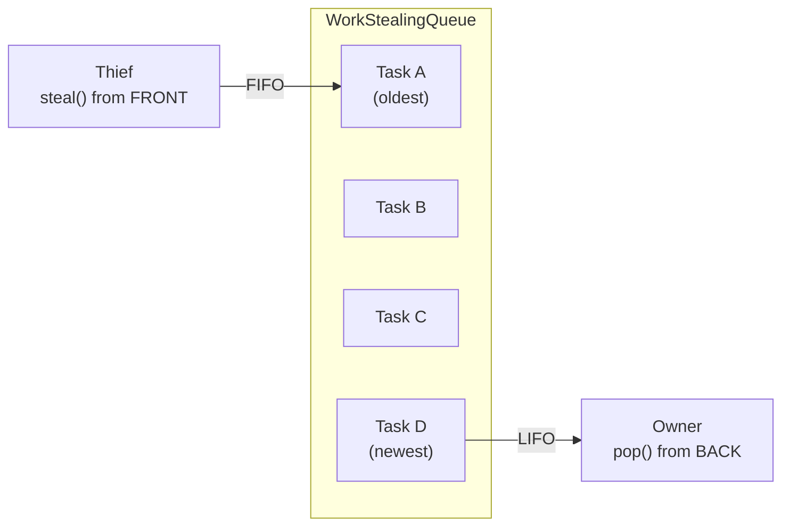
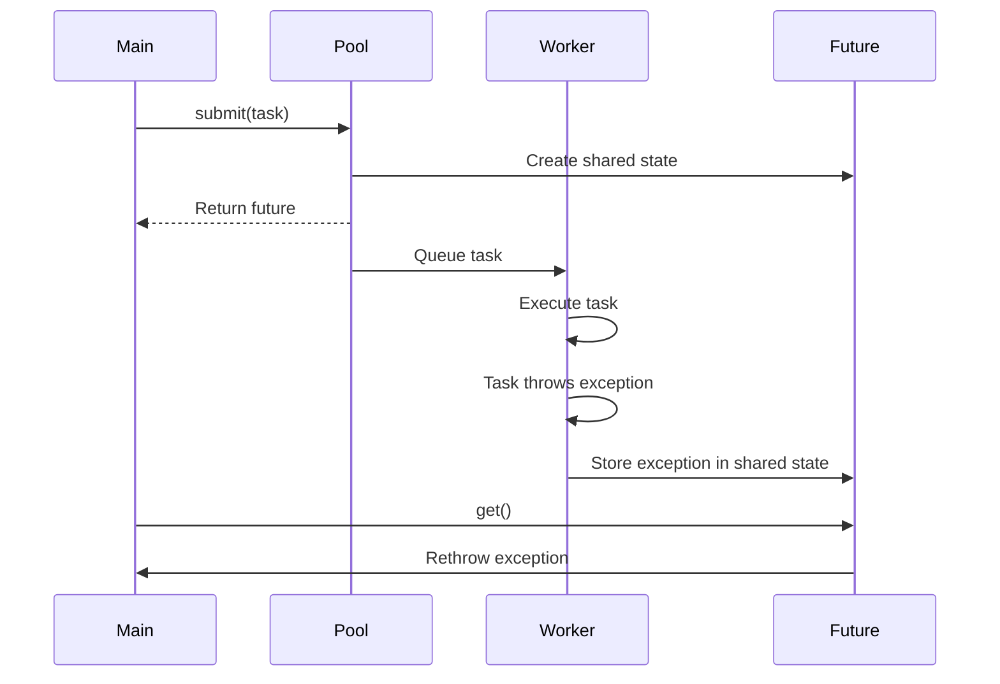

# User Manual - ThreadPool

*Updated February 2026*

---

**Scope:** Complete usage guide for `fat_p::ThreadPool`, including task submission, priority scheduling, synchronization, exception handling, spin configuration, work stealing internals, and migration from alternatives.

**Not covered:**
- Lock-free queue design alternatives (Chase-Lev deque theory; see design notes)
- NUMA-aware scheduling (not supported; see Known Limitations)
- `fat_p::WorkQueue` and `fat_p::LockFreeRingBuffer` (separate components for producer/consumer patterns)
- Coroutine integration (ThreadPool uses `std::future`, not coroutine awaitables)

**Prerequisites:**
- C++20 (concepts, `std::invocable`)
- Familiarity with `std::thread`, `std::mutex`, `std::future`
- Basic understanding of why thread creation is expensive

---

## User Manual Card

**Component:** ThreadPool
**Primary use case:** Execute many short tasks across a fixed set of worker threads
**Integration pattern:** Construct once at application startup, submit tasks throughout lifetime, destroy at shutdown
**Key API:** `submit()`, `submit_priority()`, `submit_batch()`, `wait_idle()`, `shutdown()`
**std equivalent:** None
**Migration from std:** Replace `std::async(std::launch::async, f, args...)` with `pool.submit(f, args...)`
**Common mistakes:** Submitting tasks after shutdown; ignoring returned futures (losing exceptions); choosing wrong spin duration; capturing local variables by reference in tasks
**Performance notes:** Amortizes thread creation cost across tasks; work stealing balances load automatically. See `components/ThreadPool/results/` for current data

---

## Table of Contents

1. [The Thread Pool Story](#the-thread-pool-story)
2. [Understanding Why Thread Creation Hurts](#understanding-why-thread-creation-hurts)
3. [The Work Stealing Insight](#the-work-stealing-insight)
4. [Architecture: How It Works](#architecture-how-it-works)
5. [Getting Started](#getting-started)
6. [Task Submission: Three Methods, Three Use Cases](#task-submission-three-methods-three-use-cases)
7. [The Priority System: Queue Routing Explained](#the-priority-system-queue-routing-explained)
8. [Work Stealing Deep Dive](#work-stealing-deep-dive)
9. [The Idle Strategy: Spin, Then Sleep](#the-idle-strategy-spin-then-sleep)
10. [Synchronization: The TOCTOU Problem and wait_idle()](#synchronization-the-toctou-problem-and-wait_idle)
11. [Exception Handling: Two Layers](#exception-handling-two-layers)
12. [False Sharing: Why Cache-Line Alignment Matters](#false-sharing-why-cache-line-alignment-matters)
13. [Thread Safety](#thread-safety)
14. [Diagnostics and Monitoring](#diagnostics-and-monitoring)
15. [Advanced Usage](#advanced-usage)
16. [Performance Characteristics](#performance-characteristics)
17. [When to Use ThreadPool (and When Not To)](#when-to-use-threadpool-and-when-not-to)
18. [Use Case Guide](#use-case-guide)
19. [Best Practices for HPC](#best-practices-for-hpc)
20. [Migration from std::async](#migration-from-stdasync)
21. [Migration from Intel TBB](#migration-from-intel-tbb)
22. [Migration from Hand-Rolled Pools](#migration-from-hand-rolled-pools)
23. [Alternatives](#alternatives)
24. [Troubleshooting](#troubleshooting)
25. [Known Limitations](#known-limitations)
26. [API Reference](#api-reference)
27. [FAQ](#faq)

---

## The Thread Pool Story

### The Oldest Parallelism Pattern

The thread pool pattern predates C++. It predates Java. It emerged from operating systems research in the early 1990s, when web servers first confronted the problem of handling hundreds of concurrent connections on machines with a handful of CPU cores.

The Apache HTTP Server's early architecture created a new process for each incoming connection. This worked when the server handled dozens of connections per second. It collapsed under hundreds. Process creation on early 1990s Unix cost 10-30 milliseconds--allocating address spaces, copying page tables, initializing file descriptor tables. A server handling 100 connections per second spent its entire CPU budget just creating processes.

The solution was the "prefork" model: create a pool of worker processes at startup, have them wait for connections, and recycle them when done. No more per-connection creation overhead. The same insight--pre-create workers, reuse them--applied to threads when threaded servers replaced forked ones in the late 1990s. Java's ExecutorService (2004), Python's ThreadPoolExecutor (2009), and Go's goroutine scheduler (2009) all formalized the same pattern.

### Why C++ Didn't Solve This

C++11 introduced `std::thread` and `std::async`. Neither provides a thread pool.

`std::thread` creates an OS thread per construction--exactly the problem thread pools exist to avoid. `std::async` with `std::launch::async` is implementation-defined. On libstdc++ (GCC), it creates a new thread per call. On MSVC, it uses an internal thread pool but provides no control over its size, priority, or behavior. On libc++ (Clang), behavior varies by platform. You cannot portably rely on `std::async` for pooled execution.

C++26 introduces `std::execution` with senders and receivers for asynchronous composition. This provides abstractions over execution contexts--schedulers, senders, receivers--but deliberately does not provide a concrete thread pool. The standard committee's position is that scheduling policy is application-specific: a game engine needs priority and frame budgets; a database needs fairness and I/O integration; an HPC cluster needs NUMA-aware placement. Standardizing one policy would be wrong for everyone else.

This means no standard thread pool is coming. The gap is architectural, not an oversight waiting for a future revision.

---

## Understanding Why Thread Creation Hurts

### The Cost of a Thread

To understand why pooling matters, you need to understand what happens when you create a thread.

On Linux, `pthread_create` performs the following steps:

1. **Allocate a stack.** Each thread gets its own stack, typically 1 MB (the default `ulimit -s` on most distributions). The kernel allocates virtual address space and sets up guard pages for stack overflow detection. With 1,000 threads, that's 1 GB of virtual address space consumed by stacks alone.

2. **Create kernel data structures.** The kernel allocates a `task_struct` (about 6 KB on Linux 5.x), initializes file descriptor tables, signal handling state, scheduling parameters, and CPU affinity masks.

3. **Update the scheduler.** The new thread is added to the run queue. The scheduler must rebalance across cores, which may involve inter-processor interrupts (IPIs) to inform other cores of the new runnable thread.

4. **Flush TLBs.** If the new thread runs on a different core (likely), the target core's Translation Lookaside Buffer must be invalidated because the address space now includes a new stack region.

Each of these steps involves kernel transitions, memory allocation, and cross-core communication. The total cost is 10,000-50,000 CPU cycles per thread creation. On a 4 GHz processor, that's 2.5-12.5 microseconds.

For comparison:

| Operation | Time | Cycles (4 GHz) |
|-----------|------|-----------------|
| L1 cache hit | 1 ns | 4 |
| L2 cache hit | 4 ns | 16 |
| Mutex lock (uncontended) | 15-25 ns | 60-100 |
| ThreadPool submit | heap allocation + mutex + notify | dominant cost: `shared_ptr<packaged_task>` allocation |
| Thread creation (Linux) | 2,500-12,500 ns | 10,000-50,000 |
| Thread creation (Windows) | 5,000-50,000 ns | 20,000-200,000 |

Thread creation costs orders of magnitude more than a pool submission because it requires kernel transitions, stack allocation, and TLB invalidation. See `components/ThreadPool/results/` for current platform-specific submission cost measurements.

### The Context Switch Problem

Even if thread creation were free, having too many threads destroys performance. The OS scheduler must divide CPU time among runnable threads. With 8 cores and 8 threads, each thread runs uninterrupted on its own core. With 8 cores and 8,000 threads, each thread gets approximately 1/1000th of a core's time.

Context switching between threads costs 1-10 microseconds, depending on hardware and what state must be saved. The cost comes from:

**Register save/restore.** The kernel saves all general-purpose registers, SIMD registers (YMM/ZMM--512 bytes on AVX-512), and floating-point state to the outgoing thread's kernel stack, then loads the incoming thread's registers.

**TLB flush.** If the incoming thread runs in a different process (or the kernel doesn't support TLB tagging like PCID), the TLB is flushed. Every subsequent memory access is a TLB miss until the working set is re-established.

**Cache pollution.** The incoming thread's working set evicts the outgoing thread's data from cache. When the outgoing thread resumes later, its data has been displaced. It must re-fetch from L2, L3, or main memory.

**Branch predictor pollution.** Modern CPUs maintain per-instruction branch prediction tables. A context switch introduces a different instruction stream, polluting predictions. The outgoing thread suffers mispredictions for hundreds of instructions after resuming.

With 8,000 threads on 8 cores, the scheduler gives each thread a time slice (typically 1-10 ms on Linux's CFS scheduler), then preempts it. At 1 ms per slice, each thread runs for 1 ms then waits 999 ms for its next turn. The system spends a measurable percentage of CPU time just performing context switches.

```
Thread 1: [run 1ms] [wait 999ms] [run 1ms] [wait 999ms] ...
Thread 2: [wait] [run 1ms] [wait 999ms] [run 1ms] ...
...
Thread 8000: [wait 999ms] [run 1ms] [wait 999ms] ...
```

A thread pool avoids all of this. With 8 threads on 8 cores, each thread runs uninterrupted, picking up tasks from a queue. No context switches between tasks. No kernel transitions. No cache pollution. The overhead per task is the cost of dequeuing from the queue: a mutex lock and a pointer dereference--roughly 100-200 nanoseconds.

### The Numbers in Practice

Consider a workload of 100,000 independent tasks, each taking 1 microsecond of compute:

| Strategy | Total Time | Overhead |
|----------|-----------|----------|
| Thread-per-task (100K threads) | System crash or ~30 seconds | Thread creation dominates |
| std::async (libstdc++) | Same as thread-per-task | Creates thread per call |
| ThreadPool (8 workers) | ~13 ms | Queue overhead negligible |

The thread pool converts a 30-second catastrophe into 13 milliseconds.

---

## The Work Stealing Insight

### The Load Imbalance Problem

A naive thread pool uses a single shared queue. Producers push tasks; workers pop them. This works but creates a bottleneck: every push and every pop contends on the same mutex. With 16 workers, up to 16 threads serialize on a single lock.

The first refinement is per-thread queues: each worker has its own queue, and producers distribute tasks round-robin. This eliminates contention--each worker touches only its own queue. But it creates a new problem: load imbalance.

Consider 100 tasks of varying cost distributed round-robin to 4 workers:

```
Worker 0: task 0 (5ms), task 4 (1ms), task 8 (5ms), task 12 (1ms)  -> 12ms total
Worker 1: task 1 (1ms), task 5 (1ms), task 9 (1ms), task 13 (1ms)  ->  4ms total
Worker 2: task 2 (1ms), task 6 (5ms), task 10 (1ms), task 14 (1ms) ->  8ms total
Worker 3: task 3 (1ms), task 7 (1ms), task 11 (5ms), task 15 (1ms) ->  8ms total
```

Worker 1 finishes in 4 ms and sits idle for 8 ms while Worker 0 grinds through its expensive tasks. Three cores are idle while one is overloaded. Effective utilization: ~50%.

### The Stealing Solution

Work stealing fixes this: when a worker's queue is empty, it steals a task from another worker's queue. Worker 1 finishes in 4 ms, then steals a task from Worker 0. Worker 3 finishes and steals from Worker 2. The work rebalances automatically.

The concept was formalized by Robert Blumofe and Charles Leiserson in their 1999 paper on Cilk, a parallel extension of C. The key insight was that stealing from the *opposite end* of a deque (double-ended queue) minimizes contention: the owner works on one end, thieves steal from the other.

ThreadPool implements this pattern with mutex-protected deques. The owner pushes and pops from the back (LIFO). Thieves steal from the front (FIFO). The section on [Work Stealing Deep Dive](#work-stealing-deep-dive) explains why these access patterns matter for cache behavior.

---

## Architecture: How It Works

### The Two-Tier Queue System

ThreadPool routes tasks to different queues based on priority:



Each worker follows a strict priority order when looking for work:

1. **Local queue** -- check its own WorkStealingQueue (LIFO pop from back)
2. **Global priority queue** -- check the shared queue (highest priority first)
3. **Steal** -- try to steal from other workers' queues (FIFO from front)

This ordering is deliberate. Local queue first because the data is likely still in cache (the same thread pushed it). Global queue second because those tasks are explicitly marked urgent. Stealing last because it involves touching another thread's data, which may cause cache misses.

### The Core Types

```cpp
// Priority levels
enum class Priority : int { Low = 0, Normal = 1, High = 2, Critical = 3 };

// Type-erased task with priority and FIFO ordering
class ThreadPoolTask {
    std::function<void()> mFunc;
    Priority mPriority;
    uint64_t mId;  // Monotonic, for FIFO within same priority
    static std::atomic<uint64_t> s_next_id;
public:
    bool operator<(const ThreadPoolTask& other) const noexcept;
};

// Per-thread deque with owner/thief access patterns
class WorkStealingQueue {
    std::deque<ThreadPoolTask> mTasks;
    mutable std::mutex mMutex;
public:
    void push(ThreadPoolTask task);      // Owner: push to back
    bool pop(ThreadPoolTask& task);      // Owner: pop from back (LIFO)
    bool steal(ThreadPoolTask& task);    // Thief: steal from front (FIFO)
};

// Cache-line aligned wrapper
struct alignas(FATP_CACHE_LINE_SIZE) AlignedQueue {
    WorkStealingQueue queue;
};
```

### Construction

```cpp
explicit ThreadPool(size_t num_threads = 0, size_t spin_us = 2000);
```

The constructor creates `num_threads` worker threads (defaulting to `std::thread::hardware_concurrency()`), allocates one AlignedQueue per worker, and starts the worker loop. If `hardware_concurrency()` returns 0 (possible on some embedded platforms), the pool falls back to 2 threads.

Each worker thread runs the `worker_thread()` loop, which continuously searches for work using the three-tier priority described above.

---

## Getting Started

### Prerequisites and Integration

ThreadPool requires C++20 for `std::invocable` concepts. It depends only on the standard library and `fat_p/FatPConfig.h` (for `FATP_CACHE_LINE_SIZE`).

```cpp
#include <fat_p/ThreadPool.h>
```

Compile with C++20 support and threading:

```bash
# GCC
g++ -std=c++20 -O2 -pthread my_program.cpp

# Clang
clang++ -std=c++20 -O2 -pthread my_program.cpp

# MSVC
cl /std:c++20 /O2 my_program.cpp
```

### Your First ThreadPool

```cpp
#include <fat_p/ThreadPool.h>
#include <iostream>
#include <numeric>
#include <vector>

int main() {
    fat_p::ThreadPool pool;  // One thread per core

    // Submit a computation and get a future
    auto future = pool.submit([]() {
        // This runs on a worker thread
        std::vector<int> v(1000);
        std::iota(v.begin(), v.end(), 1);
        return std::accumulate(v.begin(), v.end(), 0);
    });

    // Block until the result is ready
    std::cout << "Sum: " << future.get() << "\n";  // 500500

    return 0;
    // Pool destructor calls shutdown(), joins all workers
}
```

The pool creates one worker per hardware core. `submit()` returns a `std::future<int>` because the lambda returns `int`. The pool's destructor calls `shutdown()`, which waits for all pending tasks to complete before joining worker threads.

### Parallel Map: A Common Pattern

The most common thread pool usage is parallel map--applying a function to every element of a collection:

```cpp
fat_p::ThreadPool pool;

std::vector<Image> images = load_images("dataset/");
std::vector<std::future<Thumbnail>> futures;

for (const auto& img : images) {
    futures.push_back(pool.submit([&img]() {
        return generate_thumbnail(img, 256, 256);
    }));
}

std::vector<Thumbnail> thumbnails;
for (auto& f : futures) {
    thumbnails.push_back(f.get());
}
```

Each image is processed on a different worker thread. `future.get()` blocks until that specific thumbnail is ready. The total time is roughly `(N * per_image_cost) / num_workers` instead of `N * per_image_cost` for sequential processing.

---

## Task Submission: Three Methods, Three Use Cases

### submit(): The Default

`submit()` takes a callable and its arguments, wraps them in a `std::packaged_task`, and enqueues at Normal priority. It returns a `std::future` for the result:

```cpp
fat_p::ThreadPool pool(4);

// Lambda returning a value
auto f1 = pool.submit([]() { return compute_pi(1000); });

// Function pointer with arguments
auto f2 = pool.submit(compute_pi, 1000);

// Retrieve results (blocks until ready)
double pi = f1.get();
```

The `[[nodiscard]]` attribute on `submit()` produces a compiler warning if you discard the future. This matters because a discarded future means any exception the task throws vanishes silently--you'll never know the task failed.

### How submit() Works Internally

Understanding the submission path helps diagnose performance issues. Here's what happens when you call `submit(f, args...)`:

1. **Argument capture.** Arguments are captured into a `std::tuple` via `std::make_tuple(std::forward<Args>(args)...)`. This copies or moves each argument. The tuple and callable are bound into a lambda.

2. **Packaged task creation.** The lambda is wrapped in a `std::shared_ptr<std::packaged_task<R()>>`. The `shared_ptr` is necessary because both the worker thread and the caller need access--the worker to execute, the caller to get the future.

3. **Future extraction.** `task->get_future()` creates the `std::future<R>` that will eventually hold the result.

4. **Task wrapping.** The packaged task is wrapped in a `ThreadPoolTask` with a monotonic ID (for FIFO ordering within equal priority).

5. **Queue routing.** For Normal priority, the task goes to a per-thread local queue via round-robin: `worker_queues[next_queue++ % num_threads]`. For High/Critical, it goes to the global priority queue.

6. **Notification.** A single `notify_one()` on the global condition variable wakes one sleeping worker.

The dominant cost is step 2: heap-allocating the `shared_ptr<packaged_task>`. Submission cost is dominated by this allocation rather than the uncontended mutex lock. See `components/ThreadPool/results/` for current platform-specific measurements.

### submit_priority(): When Order Matters

`submit_priority()` takes a `Priority` enum before the callable:

```cpp
auto health = pool.submit_priority(fat_p::Priority::Critical, check_system_health);
auto frame = pool.submit_priority(fat_p::Priority::High, render_frame, scene);
auto data = pool.submit_priority(fat_p::Priority::Low, prefetch_next_level);
```

The four priority levels are:

| Level | Int Value | Queue | Use Case |
|-------|-----------|-------|----------|
| Critical | 3 | Global | Watchdog timers, health checks, shutdown signals |
| High | 2 | Global | User-facing latency-sensitive work |
| Normal | 1 | Local | Default for most tasks |
| Low | 0 | Local | Prefetching, log flushing, telemetry |

The queue routing is the key distinction. High/Critical tasks enter the global priority queue, visible to all workers immediately--any idle worker will pick them up. Normal/Low tasks enter per-thread local queues, processed by their assigned worker or stolen by idle workers. The [Priority System](#the-priority-system-queue-routing-explained) section explains the implications in detail.

### submit_batch(): When Volume Matters

When submitting hundreds of tasks individually, each `submit()` call sends a `notify_one()`, waking a worker. If the worker grabs the one available task and all others are still being submitted, it immediately goes back to sleep. Then the next `submit()` wakes it again. This "thundering herd" pattern wastes CPU on futile wake/sleep cycles.

`submit_batch()` avoids this by acquiring the global mutex once and sending a single `notify_all` after all tasks are enqueued:

```cpp
std::vector<std::function<void()>> tasks;
tasks.reserve(10000);

for (size_t i = 0; i < 10000; ++i) {
    tasks.push_back([i]() { process_chunk(i); });
}

pool.submit_batch(tasks);  // One lock acquisition, one notify_all
pool.wait_idle();
```

All batch tasks go to the global queue at Normal priority. `submit_batch()` does not return futures--use it for fire-and-forget workloads where individual results aren't needed.

### Argument Forwarding and Lifetime

`submit()` captures arguments by value into a `std::tuple`. This is intentional: tasks may execute long after the submission site's local variables are destroyed. Consider what happens with reference capture:

```cpp
void submit_work(fat_p::ThreadPool& pool) {
    std::vector<int> data = {1, 2, 3, 4, 5};

    pool.submit([&data]() {    // DANGER: captures reference to local
        return process(data);  // data is destroyed when submit_work() returns
    });                        // Task executes later: dangling reference, UB
}
```

The function returns, `data` is destroyed, and the task later accesses a dangling reference. This is undefined behavior--likely a crash, possibly silent corruption.

The safe patterns:

```cpp
// Capture by value (copy)
pool.submit([data]() { return process(data); });

// Move into the lambda
pool.submit([data = std::move(data)]() { return process(data); });

// Shared ownership
auto shared = std::make_shared<std::vector<int>>(std::move(data));
pool.submit([shared]() { return process(*shared); });
```

Do not use `std::ref()`, raw pointers, or reference captures unless you can guarantee the referenced object outlives the task.

---

## The Priority System: Queue Routing Explained

### How Priority Affects Scheduling

Priority controls *where* a task is enqueued, not the order within a single queue:

```
submit_priority(Critical, f) -> Global priority queue -> visible to all workers
submit_priority(High, f)     -> Global priority queue -> visible to all workers
submit(f)                    -> Local queue[N]        -> visible to worker N (+stealers)
submit_priority(Low, f)      -> Local queue[N]        -> visible to worker N (+stealers)
```

Within the global queue, `std::priority_queue` orders tasks by their `operator<`. The comparison works in two tiers:

1. **Priority value.** Higher Priority enum value goes first. Critical (3) > High (2) > Normal (1) > Low (0).
2. **Submission order.** Within the same priority, earlier submissions (lower mId) go first. This preserves FIFO order among equal-priority tasks.

```cpp
// ThreadPoolTask::operator< (simplified)
bool operator<(const ThreadPoolTask& other) const {
    if (mPriority != other.mPriority)
        return static_cast<int>(mPriority) < static_cast<int>(other.mPriority);
    return mId > other.mId;  // Larger ID = newer = lower priority
}
```

Because `std::priority_queue` is a max-heap, `operator<` returns `true` for the *lower*-priority element. The task with the highest priority and oldest ID floats to the top.

### Priority Is Not Preemption

A running task cannot be interrupted by a higher-priority task. If all 8 workers are executing Normal tasks and a Critical task arrives, the Critical task waits in the global queue until a worker finishes its current task and loops back to check for new work.

This means task granularity determines worst-case priority latency. If your Normal tasks take 10 ms each, a Critical task may wait up to 10 ms. If your Normal tasks take 100 us each, worst-case wait is 100 us.

For latency-sensitive workloads, keep individual tasks short--under 1 ms--so workers check the global queue frequently.

### The Visibility Advantage

The global queue exists to solve a visibility problem. Consider what happens without it:

A Critical task is submitted and assigned (via round-robin) to Worker 3's local queue. Worker 3 is busy executing a 5 ms compute task. Workers 0, 1, and 2 are idle. They could execute the Critical task immediately--but they don't know it exists. It's in Worker 3's local queue. They might eventually steal it, but stealing is the *last* thing a worker tries, after checking its own queue and the global queue.

With the global queue, Critical tasks bypass local queues entirely. All workers check the global queue before stealing. An idle worker picks up the Critical task immediately, regardless of which worker would have received it via round-robin.

### Priority Anti-Patterns

**Everything is Critical.** If most tasks use Critical, the global queue becomes the bottleneck and work stealing is bypassed entirely. Reserve Critical for genuine emergencies--watchdogs, health checks, shutdown signals. If more than 5% of tasks are Critical, your priority assignments need review.

**Priority inversion via futures.** A High-priority task that calls `future.get()` on a Low-priority task blocks a worker thread, effectively reducing the High task's priority to Low:

```cpp
// ANTI-PATTERN: Priority inversion
auto low = pool.submit_priority(fat_p::Priority::Low, slow_computation);
auto high = pool.submit_priority(fat_p::Priority::High, [&low]() {
    return low.get() * 2;  // Blocks High worker waiting for Low task
});
```

If the High task blocks, that worker is unavailable. Other High tasks must wait for the remaining workers. The solution is to give dependencies at least the same priority as their dependents, or restructure to avoid cross-priority dependencies.

**Priority as a substitute for backpressure.** If your system is overloaded, making tasks High priority does not make them run faster--it just changes which tasks are delayed. Priority scheduling helps when some tasks genuinely matter more, not when the system lacks capacity.

---

## Work Stealing Deep Dive

### The Deque Access Pattern

Each WorkStealingQueue is a `std::deque` protected by a `std::mutex`. The owner thread and thief threads access it from opposite ends:



**Owner pops from the back (LIFO).** The most recently pushed task is likely still in the owner's L1 cache--the thread just touched that memory to enqueue it. Popping it immediately maximizes cache reuse.

**Thieves steal from the front (FIFO).** The oldest tasks have been sitting in the queue longest. Their data is likely not in anyone's cache. The thief will pay a cache miss regardless, so stealing the oldest task doesn't worsen the situation. More importantly, stealing from the front avoids contending with the owner, who works on the back.

### Why Not Lock-Free?

The classic work-stealing queue is the Chase-Lev deque (2005), a lock-free data structure where the owner pushes and pops without any synchronization, and thieves use a single atomic compare-and-swap to steal. It's faster under extreme contention because the owner never waits.

ThreadPool uses mutex-protected deques instead. This was a deliberate decision:

**Correctness.** Lock-free algorithms are notoriously difficult to implement correctly. The Chase-Lev deque requires careful memory ordering (acquire/release on the array pointer, seq_cst on the bottom index), ABA prevention via epoch-based reclamation or hazard pointers, and a resizing strategy that doesn't lose tasks. Getting any of these wrong produces data races that are nearly impossible to reproduce and debug.

**Debuggability.** Mutex-based code can be stepped through in a debugger. Lock-free code cannot--the act of pausing one thread changes the interleaving, hiding bugs. ThreadSanitizer reliably catches mutex-based data races; its support for lock-free atomics is limited.

**Adequate performance.** The critical section in `push()` and `pop()` is tiny: one `std::deque` operation under a lock. On modern hardware, an uncontended mutex lock costs 15-25 ns. Since the owner is the only thread that pushes and pops (thieves only steal), the mutex is usually uncontended. Thieves use `try_to_lock`, so they never block--if the owner holds the lock, the thief moves to the next victim.

For most workloads (32 cores or fewer), the performance difference between mutex-based and lock-free stealing is not measurable. The mutex becomes a bottleneck only when dozens of thieves pile on a single victim simultaneously--a scenario that Fisher-Yates randomization makes unlikely.

### Fisher-Yates Victim Selection

When a worker needs to steal, it must decide which victim to try. The naive approach--always try Worker 0, then Worker 1, then Worker 2--creates a stampede problem. If Workers 1, 2, and 3 all become idle at the same time, they all try to steal from Worker 0 first, contending on Worker 0's mutex. Worker 0's queue is drained immediately while Workers 4-7 retain their tasks undisturbed.

ThreadPool shuffles the victim list before each steal attempt using the Fisher-Yates algorithm:

```cpp
// Simplified from try_steal()
thread_local std::vector<size_t> victims;  // [0, 1, 2, ..., N-1]
thread_local std::mt19937 rng(seed);

std::shuffle(victims.begin(), victims.end(), rng);  // Fisher-Yates O(N)

for (size_t idx : victims) {
    if (idx != my_idx && worker_queues[idx].steal(task))
        return true;
}
return false;
```

Fisher-Yates produces a random permutation in O(N) time. Each steal attempt checks every queue in a random order. This has two properties:

**Exhaustive.** Every queue is checked exactly once. No queue is skipped. If any queue has work, it will be found.

**Fair.** Over many steal attempts, each queue is the first victim roughly 1/N of the time. No queue is systematically raided while others are ignored.

The `thread_local` state means each worker has its own victim order. Two idle workers looking for work will likely try different victims first, spreading the contention.

### try_to_lock: Non-Blocking Steals

The `steal()` method uses `std::try_to_lock` instead of blocking:

```cpp
bool steal(ThreadPoolTask& task) {
    std::unique_lock<std::mutex> lock(mMutex, std::try_to_lock);
    if (!lock.owns_lock() || mTasks.empty())
        return false;
    task = std::move(mTasks.front());
    mTasks.pop_front();
    return true;
}
```

If the victim's mutex is held (the victim is pushing or popping), the thief doesn't block--it returns `false` and moves to the next victim in its shuffled list. This prevents deadlocks (no circular waits possible), reduces contention (failed steals are cheap), and keeps thieves responsive (they never stall on a busy victim).

---

## The Idle Strategy: Spin, Then Sleep

### The Fundamental Tradeoff

When a worker has no work--its local queue is empty, the global queue is empty, and no steal succeeded--it must wait. There are two options:

**Spin-wait (busy loop).** The thread stays on-core, repeatedly checking for new work. Responds to new work within nanoseconds. Burns CPU power even when idle.

**OS sleep (condition variable).** The thread gives up its core. Responding to new work requires an OS wake--a kernel transition that costs 10-50 us on Linux, more on Windows.

Neither extreme is ideal. Pure spinning wastes power and starves other processes. Pure sleeping adds latency: if a burst of tasks arrives after 5 ms of quiet, the first task waits 10-50 us for a worker to wake up.

### ThreadPool's Two-Phase Approach

ThreadPool combines both. When a worker finds no work:

**Phase 1: Spin.** For `spin_us` microseconds (default: 2000), the worker loops, checking `mPendingTasks` and the stop flag between `std::this_thread::yield()` calls. `yield()` hints the OS scheduler that this thread has nothing useful to do right now--on Linux, this is a `sched_yield()` system call that allows other threads on the same core to run but keeps this thread in the run queue.

```cpp
// Simplified from worker_thread()
auto spin_start = std::chrono::steady_clock::now();
while (now - spin_start < mSpinDuration) {
    if (mPendingTasks.load(std::memory_order_acquire) > 0 || mStop.load(...))
        break;  // Work available! Exit spin, go back to main loop
    std::this_thread::yield();
}
```

**Phase 2: Sleep.** If no work arrived during the spin window, the worker sleeps on a condition variable with a 10 ms timeout:

```cpp
std::unique_lock<std::mutex> lock(mGlobalMutex);
mGlobalCv.wait_for(lock, std::chrono::milliseconds(10), [this]() {
    return mStop.load(...) || mPendingTasks.load(...) > 0;
});
```

The 10 ms timeout acts as a watchdog: even if a `notify_one()` is lost (possible in edge cases with OS scheduling), the worker wakes up and checks again within 10 ms. This prevents indefinite stalls.

### Choosing Spin Duration

The spin duration is the second constructor parameter:

```cpp
fat_p::ThreadPool pool(num_threads, spin_us);
```

| Workload | Recommended spin_us | Rationale |
|----------|---------------------|-----------|
| Batch processing | 0 | No latency requirement; minimize CPU waste |
| Web server | 500-2000 | Moderate latency needs; requests arrive steadily |
| Game loop (60 FPS) | 2000-5000 | 16.7 ms frame budget; spin catches frame start |
| Real-time audio | 5000-10000 | Audio callback at 5 ms intervals; must respond immediately |
| Trading / HFT | 10000-50000 | Microsecond latency at any CPU cost |

**Rule of thumb:** Set `spin_us` to the expected inter-arrival time of task bursts. If bursts arrive every 5 ms, spin for 5000 us. If bursts arrive every 100 ms, don't spin at all--the CPU waste isn't worth it.

### Measuring the Impact

Submit a sentinel task and measure the time from submission to execution start:

```cpp
auto start = std::chrono::steady_clock::now();
auto f = pool.submit([start]() {
    auto latency = std::chrono::steady_clock::now() - start;
    return std::chrono::duration_cast<std::chrono::microseconds>(latency).count();
});
long us = f.get();
std::cout << "Submission-to-execution latency: " << us << " us\n";
```

Run this after a quiet period (workers have slept) to measure worst-case wake latency. Run it during steady-state work to measure typical queue latency. The difference between these two numbers is the price you pay for sleeping.

---

## Synchronization: The TOCTOU Problem and wait_idle()

### What wait_idle() Must Guarantee

`wait_idle()` blocks the calling thread until all submitted work is complete. "Complete" means: no tasks in any queue, and no tasks currently executing. The caller must be able to safely read results or modify shared state after `wait_idle()` returns.

This seems simple. It is not.

### The Race Condition

Consider a naive implementation using a single atomic counter:

```cpp
// BROKEN: Naive wait_idle
std::atomic<size_t> task_count{0};

void submit(task) {
    ++task_count;
    queue.push(task);
}

void worker_loop() {
    task = queue.pop();
    task.execute();
    --task_count;
}

void wait_idle() {
    while (task_count.load() > 0)
        std::this_thread::yield();
}
```

This has a TOCTOU (Time-Of-Check/Time-Of-Use) race. Here is the failure sequence:

```
Time    Worker Thread              wait_idle() Thread
----    ----------------           ------------------
T1      task = queue.pop()
T2      // task_count is still 1
T3                                 task_count.load() -> 1 (keep waiting)
T4      task.execute()
T5      --task_count
T6                                 task_count.load() -> 0 (return!)
```

That works. But now consider a different ordering:

```
Time    Worker Thread              wait_idle() Thread
----    ----------------           ------------------
T1      task = queue.pop()
T2      --task_count               // Decremented BEFORE execute!
T3                                 task_count.load() -> 0 (return!)
T4      task.execute()             // STILL RUNNING! wait_idle() lied!
```

If the worker decrements before executing, `wait_idle()` returns while work is still in progress. The subtler version: what about the gap between queue.pop() and task.execute()?

```
Time    Worker Thread              wait_idle() Thread
----    ----------------           ------------------
T1      task = queue.pop()
        // task_count decremented by pop
T2                                 task_count.load() -> 0 (return!)
T3      task.execute()             // STILL RUNNING!
```

With a single counter, there is always a window between "task removed from queue" and "task execution complete" where the counter could read zero while work is in flight.

### ThreadPool's Two-Counter Solution

ThreadPool uses two counters with a strict ordering invariant:

```cpp
std::atomic<size_t> mPendingTasks{0};  // Tasks in queues
std::atomic<size_t> mActiveTasks{0};   // Tasks currently executing
```

The invariant: **increment active _before_ decrementing pending.**

```cpp
// In worker_thread(), after popping a task:
mActiveTasks.fetch_add(1, std::memory_order_release);   // Step 1: mark active
mPendingTasks.fetch_sub(1, std::memory_order_release);  // Step 2: mark dequeued

try {
    task.execute();
} catch (...) {
    mExceptionCount.fetch_add(1, std::memory_order_relaxed);
}

mActiveTasks.fetch_sub(1, std::memory_order_release);   // Step 3: mark complete
```

And `wait_idle()`:

```cpp
void wait_idle() {
    std::unique_lock<std::mutex> lock(mIdle_mutex);
    mIdle_cv.wait(lock, [this]() {
        return mPendingTasks.load(std::memory_order_acquire) == 0 &&
               mActiveTasks.load(std::memory_order_acquire) == 0;
    });
}
```

Why this works: at every point in time, a task is accounted for by *at least one* counter. When a task is in a queue, `mPendingTasks` includes it. When a worker picks it up, `mActiveTasks` is incremented *before* `mPendingTasks` is decremented. There is no moment where the task is in neither counter.

If `wait_idle()` observes `pending == 0 && active == 0`, all tasks have completed. The `memory_order_release` on the worker's stores and `memory_order_acquire` on `wait_idle()`'s loads ensure the ordering is visible across threads.

### The Dedicated Condition Variable

`wait_idle()` uses its own condition variable (`mIdle_cv`), separate from the global notification CV (`mGlobalCv`). This prevents a subtle deadlock: if `wait_idle()` shared `mGlobalCv`, it would hold `mGlobalMutex` while waiting. Workers need `mGlobalMutex` to check the global priority queue. Deadlock.

The dedicated CV also allows targeted notification: workers check the idle condition after completing a task and only notify `mIdle_cv` if both counters are zero:

```cpp
if (mPendingTasks.load(std::memory_order_acquire) == 0 &&
    mActiveTasks.load(std::memory_order_acquire) == 0)
{
    std::scoped_lock lock(mIdle_mutex);
    mIdle_cv.notify_all();
}
```

The lock-then-notify pattern ensures the standard CV protocol: either the waiter sees the idle state in its predicate (no wait needed) or it is waiting and receives the notification.

### Synchronization Patterns

**Pattern 1: Submit batch, collect results**

```cpp
std::vector<std::future<Result>> futures;
for (const auto& item : items) {
    futures.push_back(pool.submit(process, item));
}
std::vector<Result> results;
for (auto& f : futures) {
    results.push_back(f.get());
}
```

**Pattern 2: Fire-and-forget with barrier**

```cpp
for (const auto& item : items) {
    (void)pool.submit([&item]() { process(item); });
}
pool.wait_idle();  // Barrier: all tasks complete
```

**Pattern 3: Continuation chain**

```cpp
template<typename T, typename F>
auto then(std::future<T>&& fut, fat_p::ThreadPool& pool, F&& cont) {
    return pool.submit([fut = std::move(fut),
                        cont = std::forward<F>(cont)]() mutable {
        T value = fut.get();
        return cont(std::move(value));
    });
}

auto stage1 = pool.submit(fetch_data);
auto stage2 = then(std::move(stage1), pool, parse);
auto stage3 = then(std::move(stage2), pool, transform);
Result result = stage3.get();
```

**Pattern 4: Fan-out / fan-in**

```cpp
template<typename T>
std::future<std::vector<T>> fan_out(
    fat_p::ThreadPool& pool,
    const std::vector<std::function<T()>>& tasks)
{
    return pool.submit([&pool, tasks]() {
        std::vector<std::future<T>> futures;
        for (const auto& task : tasks) {
            futures.push_back(pool.submit(task));
        }
        std::vector<T> results;
        for (auto& f : futures) {
            results.push_back(f.get());
        }
        return results;
    });
}
```

### shutdown() Semantics

`shutdown()` initiates a graceful stop:

1. Sets the stop flag (`mStop = true`)
2. Wakes all sleeping workers via `notify_all()`
3. Workers finish their current task, drain remaining queued tasks, then exit
4. Joins all worker threads (blocks until all have exited)

`shutdown()` is idempotent--calling it multiple times is safe. The pool destructor calls `shutdown()` automatically. After shutdown completes, no tasks are executing and no workers are running.

### Rejection During Shutdown

ThreadPool does not reject tasks submitted after `shutdown()` begins. Tasks submitted during the drain phase may or may not execute, depending on timing. If you need strict rejection semantics, wrap the pool:

```cpp
class RejectingPool {
    fat_p::ThreadPool pool_;
    std::mutex mutex_;
    bool shutting_down_ = false;

public:
    template<typename F, typename... Args>
    auto try_submit(F&& f, Args&&... args)
        -> std::optional<std::future<std::invoke_result_t<F, Args...>>>
    {
        std::lock_guard<std::mutex> lock(mutex_);
        if (shutting_down_) return std::nullopt;
        return pool_.submit(std::forward<F>(f), std::forward<Args>(args)...);
    }

    void shutdown() {
        std::lock_guard<std::mutex> lock(mutex_);
        shutting_down_ = true;
        pool_.shutdown();
    }
};
```

---

## Exception Handling: Two Layers

### Layer 1: User Exceptions (Captured in Futures)

When a task throws, the exception is captured by `std::packaged_task` and stored in the associated future. The worker thread is unaffected--it catches the exception at the packaged_task boundary and continues processing the next task.

```cpp
auto f = pool.submit([]() -> int {
    if (some_condition)
        throw std::runtime_error("computation failed");
    return 42;
});

try {
    int result = f.get();  // Rethrows the runtime_error
} catch (const std::runtime_error& e) {
    std::cerr << "Task failed: " << e.what() << "\n";
}
```

No worker thread ever dies from a user exception. The exception is transparently transferred from the worker thread to the calling thread via the future's shared state. This works even if the calling thread and worker thread are on different cores--the future handles the synchronization.

### Layer 2: Infrastructure Exceptions (Counted)

If an exception occurs outside the packaged_task wrapper--in the queue machinery, task dispatch, or the lambda that invokes the packaged task--the worker catches it in a bare `catch (...)`:

```cpp
try {
    task.execute();
} catch (...) {
    mExceptionCount.fetch_add(1, std::memory_order_relaxed);
}
```

These are infrastructure bugs, not user errors. The worker continues running. The exception count is available via `exception_count()` for monitoring:

```cpp
if (pool.exception_count() > 0) {
    log_error("ThreadPool infrastructure exceptions: {}", pool.exception_count());
}
```

In practice, infrastructure exceptions should never occur. A non-zero count indicates a bug in ThreadPool itself or memory corruption.

### Discarded Futures and Lost Exceptions

If you discard a future (ignore the `[[nodiscard]]` return from `submit()`), any exception thrown by the task is silently lost. The packaged_task captures it, but nobody calls `future.get()` to retrieve it. The task failed, and you'll never know.

```cpp
pool.submit(might_throw);  // WARNING: [[nodiscard]] ignored
// If might_throw() threw, the exception is gone forever
```

If you genuinely don't need the result but want to detect failures, store the future and check it later:

```cpp
std::vector<std::future<void>> fire_and_forget;

for (auto& item : work) {
    fire_and_forget.push_back(pool.submit([&item]() { process(item); }));
}

// Check all futures for exceptions
for (auto& f : fire_and_forget) {
    try { f.get(); }
    catch (const std::exception& e) {
        log_error("Task failed: {}", e.what());
    }
}
```

### The packaged_task Mechanism

Understanding how exceptions travel from worker to caller:



The `std::packaged_task` wrapping the user's callable owns a shared state object (the same one backing the `std::future`). When the packaged task's `operator()` catches an exception, it stores the `std::exception_ptr` in the shared state via `promise.set_exception()`. When the caller later calls `future.get()`, the stored exception pointer is rethrown via `std::rethrow_exception()`.

This mechanism is entirely standard--ThreadPool adds no custom exception handling for user code. The worker thread never sees the exception; `packaged_task` catches and stores it before the exception would propagate to the worker loop.

---

## False Sharing: Why Cache-Line Alignment Matters

### What False Sharing Is

Modern CPUs maintain cache coherency across cores using protocols like MESI (Modified, Exclusive, Shared, Invalid). When one core writes to a memory location, all other cores that have that cache line in their L1 cache must invalidate their copy. The next time they read any byte on that cache line, they must fetch the updated version from the writing core's cache (or main memory).

A cache line is typically 64 bytes. If two unrelated variables happen to sit on the same cache line, and two different cores write to them independently, each write invalidates the other core's cache line--even though they are writing to different variables. This is false sharing: the cores aren't actually sharing data, but the hardware doesn't know that. It only tracks at cache-line granularity.

### How It Affects ThreadPool

Without alignment, per-thread queues are stored in a `std::vector<WorkStealingQueue>`. A WorkStealingQueue contains a `std::deque` and a `std::mutex`. The total size depends on the implementation but is typically 80-120 bytes. Two queues might look like this in memory:

```
Address:  0x1000              0x1050              0x1080
          [Queue 0 ........] [Queue 0 cont.] [Queue 1 ..]
          |-- 64-byte cache line --|-- 64-byte cache line --|
                                     ^^^^ SHARED ^^^^
```

Queue 0's tail and Queue 1's head share a cache line. When Worker 0 pushes to Queue 0 (modifying the deque's internal pointers), it invalidates the cache line that contains part of Queue 1. When Worker 1 pushes to Queue 1, it invalidates the cache line that contains part of Queue 0. Both workers are slowed by cache invalidation, even though they never access each other's data.

### The Alignment Solution

ThreadPool wraps each queue in a cache-line-aligned struct:

```cpp
struct alignas(FATP_CACHE_LINE_SIZE) AlignedQueue {
    WorkStealingQueue queue;
};
```

With `FATP_CACHE_LINE_SIZE` set to 64 (or 128 on some ARM processors), each AlignedQueue starts on a cache line boundary. Padding is inserted between queues so they never share a cache line:

```
Address:  0x1000                     0x1080
          [Queue 0 ........ padding] [Queue 1 ........ padding]
          |-- cache line(s) -------| |-- cache line(s) -------|
```

Worker 0's operations on Queue 0 never invalidate Worker 1's cache. Independent operations remain independent at the hardware level.

The cost is memory: each queue consumes at least 64 bytes (one cache line) regardless of its actual size. With 16 workers, that's 1 KB of queue storage--negligible.

---

## Thread Safety

### Guarantees

Every public method on ThreadPool is thread-safe:

| Operation | Thread-Safe | Notes |
|-----------|-------------|-------|
| `submit()` | Yes | Multiple threads can submit concurrently |
| `submit_priority()` | Yes | Same as submit() |
| `submit_batch()` | Yes | Same as submit() |
| `wait_idle()` | Yes | Multiple threads can wait concurrently |
| `shutdown()` | Yes | Idempotent, callable from any thread |
| All diagnostic methods | Yes | Atomic reads |

What is NOT guaranteed: execution order across threads, which worker executes which task, or timing of completion relative to submission.

### Concurrent Submission

Multiple producer threads can submit tasks simultaneously without external synchronization:

```cpp
fat_p::ThreadPool pool(4);
std::atomic<int> counter{0};

std::vector<std::thread> producers;
for (int p = 0; p < 10; ++p) {
    producers.emplace_back([&pool, &counter]() {
        for (int i = 0; i < 1000; ++i) {
            pool.submit([&counter]() {
                counter.fetch_add(1, std::memory_order_relaxed);
            });
        }
    });
}

for (auto& t : producers) t.join();
pool.wait_idle();
assert(counter.load() == 10000);  // No tasks lost
```

### Memory Ordering

ThreadPool uses careful memory ordering on its atomic counters:

| Variable | Write Order | Read Order | Rationale |
|----------|-------------|------------|-----------|
| `mPendingTasks` | release | acquire | Synchronizes with wait_idle() |
| `mActiveTasks` | release | acquire | Synchronizes with wait_idle() |
| `mStop` | release | acquire | Shutdown visibility across cores |
| `mExceptionCount` | relaxed | relaxed | Diagnostic only, no ordering needed |

Why not `memory_order_seq_cst` everywhere? Sequential consistency is the safest but most expensive ordering. For `mPendingTasks`, the condition variable provides the necessary synchronization barrier. For `mExceptionCount`, eventual consistency is sufficient--the counter is informational, not used for control flow decisions. The release/acquire pairs on `mActiveTasks` are the critical ordering: they ensure all effects of task execution are visible to the thread calling `wait_idle()` after it observes zero active tasks.

### Lock Ordering and Deadlock Prevention

ThreadPool uses three categories of locks:

1. `mGlobalMutex` -- protects the global priority queue
2. `WorkStealingQueue::mMutex` (one per worker) -- protects per-thread deques
3. `mIdle_mutex` -- protects the idle condition variable

Deadlock requires a cycle: Thread A holds lock X waiting for lock Y, while Thread B holds lock Y waiting for lock X. ThreadPool prevents cycles through two rules:

**Rule 1: Workers hold at most one queue mutex at a time.** A worker checks its own queue (lock own mutex, release), then the global queue (lock global mutex, release), then tries stealing (lock one victim mutex via `try_to_lock`, release). No two mutexes are held simultaneously.

**Rule 2: `try_to_lock` for stealing.** If a victim's mutex is held, the thief moves on immediately. No blocking means no circular wait.

```cpp
// This sequence is safe -- each lock is released before the next is acquired:
void worker_thread(size_t idx) {
    while (true) {
        // Check local (lock own WSQ, release)
        { std::lock_guard lock(worker_queues_[idx].mutex); /* pop */ }

        // Check global (lock global, release)
        { std::lock_guard lock(global_mutex_); /* pop */ }

        // Try stealing (lock ONE victim, release)
        for (size_t victim : shuffled_victims) {
            std::unique_lock lock(worker_queues_[victim].mutex, std::try_to_lock);
            if (lock.owns_lock()) { /* steal, break */ }
        }
    }
}
```

---

## Diagnostics and Monitoring

All diagnostic methods are lock-free atomic reads, safe to call from any thread at any time:

```cpp
fat_p::ThreadPool pool(8);

// Static configuration (immutable after construction)
size_t workers = pool.thread_count();     // 8

// Dynamic state (atomic reads, O(1))
size_t queued  = pool.pending_tasks();    // Tasks in queues
size_t running = pool.active_tasks();     // Tasks executing
size_t errors  = pool.exception_count();  // Infrastructure exceptions
bool stopping  = pool.is_shutdown();      // Shutdown initiated?
```

### Production Monitoring

Sample these counters periodically and alert on anomalies:

```cpp
void monitor_pool(const fat_p::ThreadPool& pool, MetricsSystem& metrics) {
    size_t pending = pool.pending_tasks();
    size_t active = pool.active_tasks();

    metrics.gauge("threadpool.pending", pending);
    metrics.gauge("threadpool.active", active);
    metrics.gauge("threadpool.utilization",
                  static_cast<double>(active) / pool.thread_count());

    if (pending > 10000)
        log_warning("ThreadPool backlog: {} pending tasks", pending);

    if (pool.exception_count() > 0)
        log_error("ThreadPool infrastructure exceptions: {}",
                  pool.exception_count());
}
```

**Backlog alerts** (pending > threshold) indicate either too few workers or tasks arriving faster than they can be processed. Consider increasing thread count, making tasks smaller, or using back-pressure in the producer.

**Low utilization** (active much less than thread_count for extended periods) suggests over-provisioning. Reduce thread count to free cores for other work.

**Exception count > 0** is always a bug. Investigate immediately.

---

## Advanced Usage

### Multiple Thread Pools

Different workloads benefit from different pool configurations:

```cpp
// Latency-sensitive UI work
fat_p::ThreadPool ui_pool(2, 5000);    // 2 threads, 5ms spin

// CPU-bound batch processing
fat_p::ThreadPool compute_pool(
    std::thread::hardware_concurrency(), 2000);

// I/O-bound tasks (more threads than cores to overlap blocking)
fat_p::ThreadPool io_pool(16, 0);      // Many threads, no spin

// Background maintenance
fat_p::ThreadPool background_pool(2, 0);  // Few threads, no spin
```

| Pool Type | Thread Count | Spin | Use For |
|-----------|-------------|------|---------|
| CPU-bound | hardware_concurrency | 2-5 ms | Computation |
| I/O-bound | 2-4x cores | 0 | Network, disk |
| UI/interactive | 1-2 | 5-10 ms | User-facing |
| Background | cores - 2 | 0 | Cleanup, logging |

Keep total threads across all pools near the core count. Over-provisioning causes context switch overhead that negates the benefit of pooling.

### Pool Hierarchies

For complex applications, organize pools with a central accessor:

```cpp
class ApplicationPools {
public:
    static ApplicationPools& instance() {
        static ApplicationPools pools;
        return pools;
    }

    fat_p::ThreadPool& critical()   { return critical_; }
    fat_p::ThreadPool& compute()    { return compute_; }
    fat_p::ThreadPool& io()         { return io_; }
    fat_p::ThreadPool& background() { return background_; }

    void shutdown_all() {
        background_.shutdown();
        io_.shutdown();
        compute_.shutdown();
        critical_.shutdown();
    }

private:
    ApplicationPools()
        : critical_(2, 10000)
        , compute_(std::thread::hardware_concurrency(), 2000)
        , io_(16, 0)
        , background_(2, 0)
    {}

    fat_p::ThreadPool critical_;
    fat_p::ThreadPool compute_;
    fat_p::ThreadPool io_;
    fat_p::ThreadPool background_;
};
```

Shutdown in reverse priority order: background first (least important), critical last (must finish).

### Integration with ObjectPool

For high-frequency task submission where `shared_ptr<packaged_task>` allocation is measurable, combine ThreadPool with ObjectPool to reduce heap pressure:

```cpp
#include <fat_p/ThreadPool.h>
#include <fat_p/ObjectPool.h>

fat_p::ObjectPool<std::packaged_task<int()>> task_pool(256);
fat_p::ThreadPool executor(4);

auto task_ptr = task_pool.acquire([data]() { return process(data); });
auto future = task_ptr->get_future();

executor.submit([t = task_ptr]() { (*t)(); });

int result = future.get();
// task_ptr returned to pool when wrapper goes out of scope
```

This pattern matters when submitting millions of small tasks per second. For typical workloads (thousands of tasks per second), the standard `submit()` allocation is not a bottleneck.

### Integration with Expected

Use `fat_p::Expected` for explicit error handling without exceptions:

```cpp
#include <fat_p/ThreadPool.h>
#include <fat_p/Expected.h>

using Result = fat_p::Expected<Data, std::string>;

auto future = pool.submit([]() -> Result {
    auto data = fetch_data();
    if (!data.valid())
        return fat_p::Unexpected<std::string>("Fetch failed");
    return data;
});

Result result = future.get();  // No exception thrown
if (result.has_value())
    process(result.value());
else
    handle_error(result.error());
```

### Integration with Signal

Use ThreadPool for asynchronous signal/slot dispatch:

```cpp
#include <fat_p/ThreadPool.h>
#include <fat_p/Signal.h>

fat_p::Signal<Event> event_signal;
fat_p::ThreadPool pool(4);

event_signal.connect([&pool](Event e) {
    (void)pool.submit([e]() { handle_event(e); });
});

event_signal.emit(Event{});  // Handler runs async in pool
```

---

## Performance Characteristics

### Benchmark Methodology

All benchmarks use: 4-core Intel i7 (8 threads with HT), Linux 5.x, GCC 11 with `-O3 -march=native`, median of 10 runs, 1000 warm-up iterations discarded. Results vary significantly by hardware--always benchmark your actual workload.

### Submission Overhead

Time to submit a task (not including execution):

```cpp
void benchmark_submission() {
    fat_p::ThreadPool pool(1);
    std::atomic<bool> block{true};

    // Block the worker so submissions queue without executing
    pool.submit([&]() { while (block) std::this_thread::yield(); });

    auto start = std::chrono::high_resolution_clock::now();
    for (int i = 0; i < 100000; ++i) {
        (void)pool.submit([]() {});
    }
    auto end = std::chrono::high_resolution_clock::now();

    auto elapsed = std::chrono::duration<double, std::nano>(end - start);
    std::cout << "Submission: " << (elapsed.count() / 100000) << " ns/task\n";

    block = false;
    pool.wait_idle();
}
```

| Operation | Cost Driver | Notes |
|-----------|------------|-------|
| `submit()` with lambda | `shared_ptr<packaged_task>` heap allocation | Dominant cost is allocation, not synchronization |
| `submit_batch()` per task | Amortized lock and notification | Still allocates per-task `std::function` |
| Raw mutex lock/unlock | Uncontended synchronization | Baseline for comparison |

The dominant cost is the `std::shared_ptr<std::packaged_task>` allocation in `submit()`. `submit_batch()` amortizes the lock and notification cost but still allocates per-task `std::function` objects.

### Throughput

Scaling is sublinear due to mutex contention on the global queue, work stealing overhead, cache coherency traffic, and Amdahl's Law (serial portions in queue management).

### Comparison Benchmarks

**vs std::async:** ThreadPool dramatically outperforms `std::async` (which creates a new thread per task on most implementations) because thread creation is extremely expensive compared to task submission to an existing pool. The memory difference is similarly dramatic—pre-allocated workers vs. per-task thread stacks.

**vs Intel TBB:** TBB achieves higher throughput due to lock-free Chase-Lev work stealing. The throughput gap is the price of mutex-based correctness in Fat-P's implementation. For most applications, the throughput difference is not the bottleneck, and ThreadPool's zero-dependency, simpler API is the practical advantage.

See `components/ThreadPool/results/` and `benchmark_results/` for current platform-specific data.

---

## When to Use ThreadPool (and When Not To)

### Use ThreadPool When

**You have many independent tasks.** Physics steps, tile rendering, data transformation batches. Tasks don't depend on each other and can execute in any order. This is ThreadPool's sweet spot.

**You need priority scheduling.** System health checks must preempt background work. User-facing render must preempt prefetching. No other zero-dependency thread pool provides four-level priority with queue routing.

**Task duration is short to moderate.** Microseconds to low milliseconds. Work stealing keeps cores busy when task costs vary.

**You need zero dependencies.** Deployment constraints prohibit TBB or Boost. The build system restricts external libraries.

### Don't Use ThreadPool When

**Tasks block on I/O.** A worker blocked on a network read wastes a thread slot--that core sits idle. Use Boost.Asio, io_uring, or epoll-based event loops for I/O-heavy workloads. If you must mix I/O and compute, dedicate a separate pool for compute and use async I/O for the rest.

**Tasks form dependency graphs.** If task B depends on task A's result, you need continuations or a task graph. TBB's flow graph or taskflow handles this natively. With ThreadPool, you would chain futures manually, which works for simple chains but becomes unwieldy for complex DAGs.

**You need task cancellation.** ThreadPool has no cancellation mechanism. Once a task is submitted, it will execute. For cooperative cancellation, pass a shared `std::atomic<bool>` flag that tasks check periodically.

**You need bounded queue depth.** ThreadPool queues grow without limit. If producers consistently outpace consumers, memory grows unboundedly. No back-pressure mechanism exists.

**Single-producer/single-consumer pipeline.** Use `fat_p::WorkQueue` or `fat_p::LockFreeRingBuffer` for dedicated channel patterns. ThreadPool is over-engineered for this use case.

---

## Use Case Guide

### Scientific Computing: Parallel Matrix Multiplication

```cpp
void parallel_matmul(const Matrix& A, const Matrix& B, Matrix& C,
                     fat_p::ThreadPool& pool) {
    const size_t N = A.rows();
    const size_t BLOCK = 64;  // Tile size for cache locality

    std::vector<std::future<void>> futures;

    for (size_t i = 0; i < N; i += BLOCK) {
        for (size_t j = 0; j < N; j += BLOCK) {
            futures.push_back(pool.submit([&, i, j]() {
                // Each task computes one tile of C
                for (size_t ii = i; ii < std::min(i + BLOCK, N); ++ii) {
                    for (size_t jj = j; jj < std::min(j + BLOCK, N); ++jj) {
                        double sum = 0.0;
                        for (size_t k = 0; k < N; ++k)
                            sum += A(ii, k) * B(k, jj);
                        C(ii, jj) = sum;
                    }
                }
            }));
        }
    }

    for (auto& f : futures) f.get();
}
```

The tile decomposition serves dual purposes: it creates independent tasks for the pool and it improves cache behavior within each task. The tile size (64) is chosen so that the working set of each tile fits in L1 cache.

### Game Development: Frame Work Distribution

```cpp
class GameEngine {
    fat_p::ThreadPool pool_;

public:
    GameEngine() : pool_(std::thread::hardware_concurrency() - 1, 5000) {
        // Reserve one core for the main thread
        // 5ms spin for frame-start responsiveness
    }

    void update_frame(float dt) {
        // Phase 1: Independent systems in parallel
        auto physics = pool_.submit_priority(
            fat_p::Priority::High, [this, dt]() { physics_.step(dt); });
        auto ai = pool_.submit(
            [this, dt]() { ai_.update(dt); });
        auto audio = pool_.submit_priority(
            fat_p::Priority::High, [this]() { audio_.mix(); });
        auto particles = pool_.submit(
            [this, dt]() { particles_.simulate(dt); });

        // Main thread does rendering prep while workers compute
        renderer_.prepare_frame();

        // Sync: wait for all systems
        physics.get();
        ai.get();
        audio.get();
        particles.get();

        // Phase 2: Render (uses results from phase 1)
        renderer_.draw();
    }
};
```

Physics and audio are High priority because they have hard latency requirements. AI and particles are Normal--dropping a frame of AI updates is less noticeable than dropping audio. The main thread does rendering prep concurrently, maximizing core utilization.

### Data Pipeline: Staged Processing

```cpp
void process_log_files(const std::vector<std::string>& paths) {
    fat_p::ThreadPool pool;

    // Stage 1: Parse all files in parallel
    std::vector<std::future<ParsedLog>> parse_futures;
    for (const auto& path : paths) {
        parse_futures.push_back(pool.submit(parse_log_file, path));
    }

    // Stage 2: As each parse completes, submit analysis
    std::vector<std::future<Report>> report_futures;
    for (auto& f : parse_futures) {
        ParsedLog log = f.get();  // Block until this file is parsed
        report_futures.push_back(pool.submit(analyze_log, std::move(log)));
    }

    // Stage 3: Collect results
    for (auto& f : report_futures) {
        Report r = f.get();
        write_report(r);
    }
}
```

This creates a two-stage pipeline where parsing and analysis overlap: while later files are still parsing, earlier files are already being analyzed. Work stealing ensures cores stay busy even if some files are much larger than others.

### Server Applications: Request Handling with Backpressure

```cpp
class RequestHandler {
public:
    RequestHandler()
        : pool_(std::thread::hardware_concurrency())
        , max_pending_(1000)
    {}

    std::optional<std::future<Response>> handle(Request req) {
        if (pool_.pending_tasks() >= max_pending_)
            return std::nullopt;  // 503 Service Unavailable

        return pool_.submit_priority(
            categorize_priority(req),
            [req = std::move(req)]() { return process_request(req); }
        );
    }

private:
    fat_p::Priority categorize_priority(const Request& req) {
        if (req.is_health_check()) return fat_p::Priority::Critical;
        if (req.is_user_facing()) return fat_p::Priority::High;
        if (req.is_batch())       return fat_p::Priority::Low;
        return fat_p::Priority::Normal;
    }

    fat_p::ThreadPool pool_;
    size_t max_pending_;
};
```

This demonstrates priority scheduling in a server context: health checks are Critical (load balancers probe these), user-facing requests are High, batch operations are Low. The `pending_tasks()` check provides manual backpressure--reject new requests when overloaded rather than growing the queue indefinitely.

### Real-Time Systems: Deadline-Aware Scheduling

```cpp
class RealTimeScheduler {
    fat_p::ThreadPool pool_;

public:
    RealTimeScheduler() : pool_(4, 10000) {}  // Long spin for low latency

    template<typename F>
    bool submit_with_deadline(
        F&& task,
        std::chrono::steady_clock::time_point deadline)
    {
        if (std::chrono::steady_clock::now() >= deadline)
            return false;  // Already past deadline

        auto future = pool_.submit_priority(
            fat_p::Priority::High, std::forward<F>(task));

        auto status = future.wait_until(deadline);
        return status == std::future_status::ready;
    }
};
```

The long spin duration (10 ms) keeps workers on-core so deadline-sensitive tasks start within microseconds. `wait_until` provides a timeout-based check without polling.

---

## Best Practices for HPC

### Task Granularity

Tasks must be large enough to amortize submission overhead:

```cpp
// BAD: Too fine-grained (submission overhead ~2.5us dominates 10ns of work)
for (size_t i = 0; i < N; ++i) {
    pool.submit([&, i]() { result[i] = data[i] * 2; });
}

// GOOD: Coarse-grained chunks
constexpr size_t CHUNK = 10000;
for (size_t start = 0; start < N; start += CHUNK) {
    pool.submit([&, start]() {
        size_t end = std::min(start + CHUNK, N);
        for (size_t i = start; i < end; ++i)
            result[i] = data[i] * 2;
    });
}
```

**Rule of thumb:** Tasks should take at least 10-100 microseconds of compute. If your per-element work is under 1 microsecond, batch 1,000-10,000 elements per task.

### Avoiding Contention

Minimize shared state between tasks:

```cpp
// BAD: All tasks contend on a single atomic
std::atomic<uint64_t> global_sum{0};
for (size_t chunk = 0; chunk < num_chunks; ++chunk) {
    pool.submit([&, chunk]() {
        uint64_t local = compute_chunk(chunk);
        global_sum.fetch_add(local);  // Contention!
    });
}

// GOOD: Per-task results, sequential reduction
std::vector<std::future<uint64_t>> futures;
for (size_t chunk = 0; chunk < num_chunks; ++chunk) {
    futures.push_back(pool.submit([chunk]() {
        return compute_chunk(chunk);  // No shared state
    }));
}
uint64_t total = 0;
for (auto& f : futures)
    total += f.get();  // Sequential reduction, no contention
```

### Cache-Aware Chunking

Structure work so each task's working set fits in L2 cache:

```cpp
constexpr size_t L2_SIZE = 256 * 1024;  // Typical L2: 256 KB
constexpr size_t CHUNK_BYTES = L2_SIZE / 2;  // Leave headroom
constexpr size_t CHUNK_ELEMENTS = CHUNK_BYTES / sizeof(double);

for (size_t start = 0; start < N; start += CHUNK_ELEMENTS) {
    pool.submit([&, start]() {
        size_t end = std::min(start + CHUNK_ELEMENTS, N);
        for (size_t i = start; i < end; ++i)
            output[i] = expensive_function(input[i]);
    });
}
```

### NUMA Considerations

ThreadPool does not provide NUMA affinity. On multi-socket systems, a task may execute on a core distant from its data, causing remote memory access penalties (2-3x latency vs local).

Mitigations:

```cpp
// Use per-NUMA-node pools with OS-level affinity
fat_p::ThreadPool node0_pool(cores_per_node);
fat_p::ThreadPool node1_pool(cores_per_node);

// Pin threads after construction (Linux)
// pthread_setaffinity_np(thread.native_handle(), ...)

// Allocate data on the same node as the pool that will process it
// Use libnuma or platform-specific APIs
```

### Avoiding False Sharing in Output Arrays

When tasks write to adjacent elements of a shared array, false sharing can occur between tasks:

```cpp
// BAD: Adjacent result elements share cache lines
std::vector<int> results(num_tasks);
for (size_t i = 0; i < num_tasks; ++i) {
    pool.submit([&results, i]() {
        results[i] = compute(i);  // May false-share with results[i+/-1]
    });
}

// GOOD: Use futures (each has independent storage)
std::vector<std::future<int>> futures;
for (size_t i = 0; i < num_tasks; ++i) {
    futures.push_back(pool.submit([i]() { return compute(i); }));
}

// ALTERNATIVE: Pad results to cache line boundaries
struct alignas(64) PaddedResult { int value; };
std::vector<PaddedResult> results(num_tasks);
```

---

## Migration from std::async

### API Mapping

| std::async | fat_p::ThreadPool | Notes |
|-----------|-------------------|-------|
| `std::async(std::launch::async, f, args...)` | `pool.submit(f, args...)` | ThreadPool guarantees pooled execution |
| `future.get()` | `future.get()` | Identical semantics |
| `future.wait()` | `future.wait()` | Identical semantics |
| (no equivalent) | `pool.submit_priority(pri, f, args...)` | Priority scheduling |
| (no equivalent) | `pool.submit_batch(tasks)` | Batch submission |
| (no equivalent) | `pool.wait_idle()` | Wait for all tasks |

### Key Differences

**Thread management.** `std::async` may or may not pool threads (implementation-defined). ThreadPool always uses a fixed pool. This eliminates per-task thread creation overhead and makes performance predictable.

**Future destructor behavior.** An `std::async` future's destructor blocks if the future was created with `std::launch::async` and hasn't been waited on. This is a notorious footgun--a `std::future` going out of scope silently blocks the calling thread. ThreadPool futures don't have this behavior. The task runs regardless of whether you check the future.

**Argument forwarding.** `std::async` uses `std::decay` and may invoke `std::bind`-like machinery, which strips references and has unintuitive behavior with reference wrappers. ThreadPool uses lambda capture with `std::make_tuple` and `std::apply`, preserving move semantics cleanly.

### Migration Example

Before:
```cpp
std::vector<std::future<Result>> futures;
for (const auto& input : inputs) {
    futures.push_back(std::async(std::launch::async, process, input));
}
for (auto& f : futures) {
    results.push_back(f.get());
}
```

After:
```cpp
fat_p::ThreadPool pool;  // Create once at startup, reuse
std::vector<std::future<Result>> futures;
for (const auto& input : inputs) {
    futures.push_back(pool.submit(process, input));
}
for (auto& f : futures) {
    results.push_back(f.get());
}
```

The migration is mechanical: replace `std::async(std::launch::async, ...)` with `pool.submit(...)`. Create the pool once and reuse it across the application lifetime--do not create a pool per batch.

---

## Migration from Intel TBB

### API Mapping

| Intel TBB | fat_p::ThreadPool | Notes |
|-----------|-------------------|-------|
| `tbb::task_arena` | `ThreadPool(num_threads)` | Fixed thread count |
| `arena.execute([&]{ ... })` | `pool.submit([&]{ ... })` | Returns future |
| `tbb::parallel_for(range, body)` | Manual loop + submit | No parallel algorithms |
| `tbb::task_group tg; tg.run(f)` | `pool.submit(f)` | Future replaces task_group |
| `tg.wait()` | `pool.wait_idle()` | Waits for all tasks |

### What You Lose

**Parallel algorithms.** `tbb::parallel_for`, `parallel_reduce`, `parallel_sort`. ThreadPool is a task executor, not an algorithm library. You decompose the work manually.

**Task dependencies.** TBB's flow graph and continuation-based task groups express dependency DAGs natively. ThreadPool tasks are independent; dependencies require manual future chaining.

**Dynamic thread count.** TBB's scheduler adjusts worker count based on load and oversubscription. ThreadPool's count is fixed at construction.

**Lock-free work stealing.** TBB uses Chase-Lev deques. ThreadPool uses mutex-protected deques. Under extreme contention (>32 cores, all workers stealing simultaneously), TBB may be faster.

### What You Gain

**Zero dependencies.** No TBB library (~2 MB) to link, no CMake find_package, no deployment constraints.

**Priority scheduling.** TBB has limited priority support (task_group_context priority). ThreadPool has four explicit levels with queue routing.

**Simpler mental model.** Submit task, get future. No arenas, observers, task_group_context, or scheduler callbacks.

---

## Migration from Hand-Rolled Pools

### The Common Pattern

Most hand-rolled pools share a structure:

```cpp
class OldPool {
    std::queue<std::function<void()>> tasks_;
    std::mutex mutex_;
    std::condition_variable cv_;
    std::vector<std::thread> workers_;
    bool stop_ = false;
    // ... hundreds of lines of synchronization code ...
};
```

Replace with:

```cpp
fat_p::ThreadPool pool(num_threads);

// Replace tasks_.push(task) with:
auto future = pool.submit(task);

// Replace custom wait mechanism with:
pool.wait_idle();

// Replace custom shutdown with:
pool.shutdown();  // Or automatic on destruction
```

### What Hand-Rolled Pools Typically Get Wrong

Common bugs in hand-rolled implementations that ThreadPool avoids:

1. **Missing notification.** Task submitted but condition variable not signaled--task sits in queue forever.
2. **Lost wake-up.** Notification sent before the worker enters `wait()`--worker sleeps through available work.
3. **Shutdown race.** Tasks submitted during shutdown cause undefined behavior or deadlock.
4. **Memory ordering bugs.** Relaxed atomics used where acquire/release is needed.
5. **Exception leaks.** Exceptions escape task execution and kill the worker thread.
6. **No priority support.** All tasks treated equally.
7. **No work stealing.** Unbalanced load wastes cores.

### Incremental Migration Strategy

1. **Coexistence.** Add ThreadPool alongside the existing pool. New code uses ThreadPool; old code continues unchanged.

2. **Migrate low-risk paths.** Background tasks, logging, cleanup--paths where a bug causes inconvenience, not data loss.

3. **Migrate critical paths with feature flags.**

```cpp
#ifdef USE_NEW_POOL
    new_pool.submit_priority(fat_p::Priority::High, critical_task);
#else
    old_pool.submit(critical_task);
#endif
```

4. **Remove old implementation.** Once all paths are migrated and tested, delete the old pool.

---

## Alternatives

- **std::async** (C++11) -- Standard but implementation-defined. May not pool.
- **Intel TBB** -- Full task parallelism framework with parallel algorithms, flow graph, lock-free stealing. Heavy dependency (~2 MB).
- **Boost.Asio thread_pool** -- Tied to Asio executor model. Ideal for mixed I/O + compute.
- **folly::CPUThreadPoolExecutor** -- Facebook's implementation. Requires Folly dependency.
- **BS::thread_pool** -- Header-only community library. No priority, no work stealing.
- **taskflow** -- Task graph library with dependency support. Better for DAG workloads.
- **std::execution** (C++26) -- Scheduling abstractions without a concrete pool.

---

## Troubleshooting

### Compilation Error: "constraints not satisfied" on submit()

**Symptom:** Template error mentioning `std::invocable`.

**Cause:** The callable doesn't match the argument types. Common with member functions:

```cpp
struct Worker { void process(int x); };
Worker w;
pool.submit(&Worker::process, 42);  // ERROR: process needs an object
```

**Solution:** Capture the object in a lambda:

```cpp
pool.submit([&w]() { w.process(42); });
```

### Runtime: Tasks never execute

**Symptom:** Futures never become ready. `pending_tasks()` grows but `active_tasks()` stays zero.

**Cause:** Most likely you're submitting after `shutdown()`. Check `pool.is_shutdown()`.

**Less likely:** `hardware_concurrency()` returned 0 and the pool fell back to 2 threads. Check `pool.thread_count()`.

### Runtime: wait_idle() never returns

**Symptom:** `wait_idle()` blocks indefinitely.

**Cause:** A task is submitting more tasks. `wait_idle()` waits for *all* pending and active tasks, including newly submitted ones. If tasks continuously create more tasks, the pool never reaches idle.

**Solution:** Separate submission and waiting phases. Do not submit from within tasks if you plan to call `wait_idle()`.

**Also possible:** Calling `wait_idle()` from within a task. The task itself is active, so `mActiveTasks` is never zero. Deadlock.

### Performance: High latency on bursty workloads

**Symptom:** First task after an idle period takes milliseconds instead of microseconds.

**Cause:** Workers have entered Phase 2 (sleeping on condition variable). Waking from OS sleep costs 10-50 us.

**Solution:** Increase `spin_us` so workers stay on-core during idle gaps. Or accept the latency if bursts are rare.

### Performance: High CPU usage during idle periods

**Symptom:** CPU usage stays elevated when no tasks are submitted.

**Cause:** `spin_us` is too high. Workers are spin-waiting, burning CPU while yielding.

**Solution:** Decrease `spin_us` or set to 0 for batch workloads where idle CPU matters.

### Crash: Use-after-free in task

**Symptom:** Worker thread crashes or sanitizer reports use-after-free.

**Cause:** Task captures a reference to a local variable that's been destroyed:

```cpp
void submit_work(fat_p::ThreadPool& pool) {
    std::vector<int> data = {1, 2, 3};
    pool.submit([&data]() {    // DANGLING: data destroyed on return
        return process(data);
    });
}
```

**Solution:** Capture by value, move, or use `std::shared_ptr`. See [Argument Forwarding and Lifetime](#argument-forwarding-and-lifetime).

### Compilation Error: return type not constructible

**Symptom:** `static assertion failed: result type must be constructible from invoke result`

**Cause:** The callable's return type is neither copyable nor movable.

**Solution:** Ensure the return type is at least move-constructible:

```cpp
// WRONG: Non-movable type
struct BadType {
    BadType(const BadType&) = delete;
    BadType(BadType&&) = delete;
};
auto f = pool.submit([]() { return BadType{}; });  // Error

// CORRECT: Movable type
struct GoodType {
    GoodType(GoodType&&) = default;
};
auto f = pool.submit([]() { return GoodType{}; });  // OK
```

### Runtime: Tasks execute sequentially

**Symptom:** Work completes no faster than single-threaded despite multiple workers.

**Cause 1:** Tasks too short. If each task's useful work is shorter than the submission overhead (heap allocation + queue insertion + notification), overhead dominates. Batch elements into chunks of 1,000-10,000.

**Cause 2:** Tasks block on a shared resource. If every task acquires the same mutex, execution is effectively serial regardless of worker count. Add timing instrumentation to identify the bottleneck.

**Cause 3:** Pool has only one thread. Check `pool.thread_count()`.

### Debugging Techniques

**Thread-aware logging:**

```cpp
#define LOG_TASK(msg) \
    std::cout << "[" << std::this_thread::get_id() << "] " << msg << "\n"

pool.submit([i]() {
    LOG_TASK("Task " << i << " started");
    // ... task code ...
    LOG_TASK("Task " << i << " finished");
});
```

**ThreadSanitizer:** Compile with `-fsanitize=thread` (GCC/Clang). TSan detects data races in mutex-based code reliably. Run your test suite under TSan before deploying.

```bash
g++ -std=c++20 -fsanitize=thread -g -o app app.cpp -pthread
./app
```

**AddressSanitizer:** Compile with `-fsanitize=address` to detect use-after-free, buffer overflows, and other memory errors that often manifest as intermittent crashes in threaded code.

**Minimal reproduction:** Start with a single-threaded pool (`ThreadPool(1)`) and one task. Verify correctness. Gradually increase threads and task count until the bug appears. The step that triggers the failure reveals whether it's a concurrency bug (appears at >1 thread) or a logic bug (appears at 1 thread).

---

## Known Limitations

**Fixed thread count.** Worker count is set at construction and cannot change. No dynamic resizing based on load. If you need fewer threads, destroy and recreate the pool (draining all pending work). Dynamic scaling was deferred because it adds significant complexity (thread creation/destruction overhead, work redistribution, potential for create/destroy thrashing) with limited benefit for most workloads.

**No task cancellation.** Once submitted, a task will execute. For cooperative cancellation, pass a shared `std::atomic<bool>` flag that tasks check periodically:

```cpp
std::atomic<bool> cancelled{false};

auto future = pool.submit([&cancelled]() {
    for (int i = 0; i < 1000000 && !cancelled; ++i)
        process_iteration(i);
});

// To cancel:
cancelled = true;
```

**Unbounded queue growth.** If producers outpace consumers, queues grow without limit. Implement manual backpressure:

```cpp
void submit_with_backpressure(fat_p::ThreadPool& pool,
                              std::function<void()> task) {
    while (pool.pending_tasks() >= 1000)
        std::this_thread::sleep_for(std::chrono::milliseconds(10));
    pool.submit(std::move(task));
}
```

ThreadPool does not choose a default bounded-queue policy because every option has tradeoffs: blocking on full queue risks deadlock; dropping tasks loses data; returning errors pushes complexity to callers.

**No task dependencies.** Tasks are independent. For DAG-style parallelism, chain futures manually or use a task graph library like taskflow.

**Priority is not preemption.** A running task cannot be interrupted by a higher-priority task. Worst-case priority latency equals the longest task duration.

**Priority inversion possible.** A High-priority task that calls `future.get()` on a Low-priority task blocks a worker, effectively reducing its priority. Avoid cross-priority future dependencies, or give dependencies at least the priority of their dependents.

**Mutex-based work stealing.** The WorkStealingQueue uses `std::mutex`, not lock-free algorithms. Under extreme contention (dozens of simultaneous stealers), this may bottleneck. For most workloads (32 cores or fewer), contention is not measurable.

**No NUMA awareness.** Tasks are distributed round-robin without regard for NUMA topology. For NUMA-sensitive workloads, use per-socket pools with thread affinity.

### Limitations Summary

| Limitation | Impact | Workaround | Future? |
|------------|--------|------------|---------|
| Fixed thread count | Cannot adapt to load | Multiple pools | Maybe |
| No cancellation | Wasted work | Cooperative `atomic<bool>` | Planned |
| Unbounded queues | Memory growth | Manual backpressure | Maybe |
| Priority inversion | Blocked high-pri tasks | Match dependency priorities | No |
| No task dependencies | Manual sequencing | Future chaining | No |
| No NUMA affinity | Suboptimal on multi-socket | Per-node pools | No |

---

## API Reference

### Construction

| Signature | Description |
|-----------|-------------|
| `ThreadPool(size_t num_threads = 0, size_t spin_us = 2000)` | Create pool. 0 = hardware_concurrency() (minimum 2). |

### Task Submission

| Method | Returns | Priority | Notes |
|--------|---------|----------|-------|
| `submit(f, args...)` | `std::future<R>` | Normal | Default submission; [[nodiscard]] |
| `submit_priority(pri, f, args...)` | `std::future<R>` | Specified | Priority-routed; [[nodiscard]] |
| `submit_batch(tasks)` | void | Normal (all) | Single lock, single notify_all |

### Synchronization

| Method | Description |
|--------|-------------|
| `wait_idle()` | Block until pending == 0 and active == 0 |
| `shutdown()` | Graceful stop; join workers; idempotent |

### Diagnostics

| Method | Returns | Complexity |
|--------|---------|------------|
| `thread_count()` | Worker count (immutable) | O(1) |
| `pending_tasks()` | Tasks in queues | O(1), atomic |
| `active_tasks()` | Tasks executing | O(1), atomic |
| `exception_count()` | Infrastructure exceptions | O(1), atomic |
| `is_shutdown()` | Whether shutdown was called | O(1), atomic |

### Priority Enum

| Value | Int | Queue | Use Case |
|-------|-----|-------|----------|
| `Priority::Low` | 0 | Local | Background, prefetch |
| `Priority::Normal` | 1 | Local | Default |
| `Priority::High` | 2 | Global | User-facing |
| `Priority::Critical` | 3 | Global | System integrity |

---

## FAQ

**Q: How many threads should I use?**

Start with the default (one per hardware core). For compute-bound workloads, this is optimal. For mixed compute/I/O, use fewer threads to leave cores available for I/O threads. For game engines, reserve one core for the main thread: `ThreadPool(hardware_concurrency() - 1)`.

**Q: Can I have multiple ThreadPools?**

Yes. Each pool is independent with its own workers and queues. A common pattern is one pool for compute (high spin), one for background work (zero spin). Total threads across all pools should not greatly exceed core count.

**Q: What happens if I submit after shutdown?**

The task is enqueued but may or may not execute, depending on whether workers have already drained their queues and exited. Check `is_shutdown()` before submitting if you need rejection semantics.

**Q: Is submit() thread-safe?**

Yes. Multiple threads can call `submit()`, `submit_priority()`, and `submit_batch()` concurrently. Internal mutexes handle synchronization.

**Q: Why not lock-free work stealing?**

Lock-free Chase-Lev deques eliminate mutex overhead for the queue owner but are significantly harder to implement correctly and debug. The mutex-based design favors correctness and debuggability over maximum throughput. See [Why Not Lock-Free?](#why-not-lock-free) for the full rationale.

**Q: Can tasks submit more tasks to the same pool?**

Yes. A task can call `pool.submit()` from within its execution. However, calling `wait_idle()` from within a task will deadlock--the task itself counts as active, so the idle condition is never met.

**Q: What is the maximum number of pending tasks?**

There is no hard limit. Queues grow without bound. Monitor `pending_tasks()` and implement application-level back-pressure if queue depth becomes a concern.

**Q: Does ThreadPool support thread affinity or pinning?**

No. Worker threads are scheduled by the OS. For NUMA-sensitive workloads, create separate pools and pin them to specific cores using OS-level thread affinity APIs (pthread_setaffinity_np on Linux, SetThreadAffinityMask on Windows) after construction.

---

*ThreadPool.h -- Fat-P Library*
