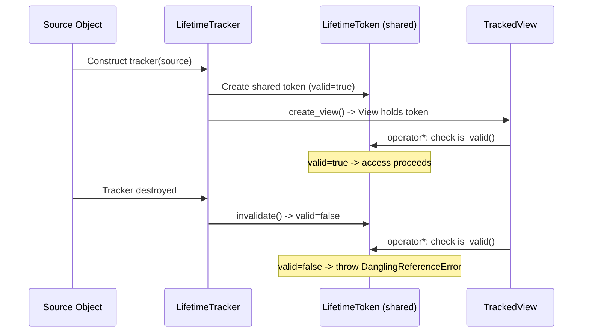

# User Manual - ViewLifetimeTracking

*February 2026*

---

**Scope:** Complete usage guide for the debug-mode lifetime tracking system: `LifetimeTracker<T>`, `TrackedView`, `LifetimeToken`, `ViewGuard`, convenience macros, and `check_weak_ptr()`.

**Not covered:** AddressSanitizer (ASan) or Valgrind (complementary tools that detect different classes of memory errors). Ownership semantics of `std::shared_ptr`/`std::unique_ptr`.

**Prerequisites:** C++20; understanding of why non-owning references (spans, views, raw pointers) can dangle.

---

## User Manual Card

**Component:** ViewLifetimeTracking
**Primary use case:** Detect dangling views in debug builds before they cause undefined behavior
**Integration pattern:** Wrap source with `LifetimeTracker<T>` -> create views via `create_view()` -> views auto-check on access
**Key API:** `LifetimeTracker<T>`, `TrackedView`, `ViewGuard`, `FATP_TRACKED_VIEW()`, `FATP_VIEW_GUARD()`, `check_weak_ptr()`
**std equivalent:** None
**Common mistakes:** Using TrackedView in release builds expecting overhead (it is a no-op); forgetting that LifetimeTracker is move-only; creating views after tracker is destroyed
**Performance notes:** Debug: one shared_ptr check per view access (~5-20 ns). Release: zero overhead (compiled away).

---

## Table of Contents

1. The Dangling View Problem
2. How It Works
3. Getting Started
4. TrackedView: Checked Access
5. ViewGuard: Scope-Based Checking
6. Convenience Macros
7. check_weak_ptr: std::weak_ptr Safety
8. Debug vs Release Behavior
9. Use Case: Tensor View Safety
10. Use Case: String Pool References
11. Best Practices
12. Troubleshooting
13. Known Limitations
14. API Reference
15. FAQ

---

## The Dangling View Problem

Non-owning views are performance-critical: a Tensor view avoids copying gigabytes of data; a string_view avoids copying strings. But views create a temporal coupling: the view is valid only as long as the source lives. If the source is destroyed while a view exists, the view becomes a dangling reference. Accessing it is undefined behavior---typically reading garbage, crashing, or silently corrupting data.

The compiler cannot detect this in general (lifetimes are a runtime property). AddressSanitizer can detect it sometimes, but only when the freed memory is actually accessed and the shadow memory has been poisoned. ViewLifetimeTracking provides deterministic, immediate detection: the view checks a validity flag on every access.

---

## How It Works



The `LifetimeToken` is a `shared_ptr`-managed object with an atomic `bool`. The tracker holds a `shared_ptr<LifetimeToken>`; views hold copies. When the tracker is destroyed, it sets the token to invalid. Views check the token on every access.

---

## Getting Started

```cpp
#include "ViewLifetimeTracking.h"

struct Data { int values[1000]; };

void example()
{
    Data source;
    fat_p::LifetimeTracker<Data> tracker(source, "source");
    auto view = tracker.create_view();

    view->values[0] = 42;  // OK: source is alive

    // If source were destroyed here, next access would throw
}
```

---

## TrackedView: Checked Access

`TrackedView` wraps a pointer to T and a shared token. On every `operator*` and `operator->`, it calls `check_valid()`, which throws `DanglingReferenceError` if the token has been invalidated:

```cpp
auto view = tracker.create_view();

// Safe access (source alive)
int x = view->values[0];

// Simulating source destruction
// tracker goes out of scope...
// Now: view->values[0] throws DanglingReferenceError
```

`is_valid()` checks without throwing, useful for conditional access:

```cpp
if (view.is_valid())
    process(*view);
else
    handle_stale_view();
```

---

## ViewGuard: Scope-Based Checking

`ViewGuard` checks validity at construction and optionally at destruction, providing a scope-based safety check:

```cpp
{
    fat_p::ViewGuard guard(view);  // Checks validity now
    // Use view freely within this scope
    process(*view);
}  // Guard destructor optionally checks again
```

In release builds, `ViewGuard` is a no-op.

---

## Convenience Macros

```cpp
// Create a tracker for an object (debug only)
auto tracker = FATP_TRACKED_VIEW(my_tensor);
// Expands to: fat_p::LifetimeTracker<decltype(my_tensor)>(my_tensor, "my_tensor")
// In release: expands to (my_tensor) -- no tracker created

// Assert view validity (debug only)
FATP_VIEW_GUARD(view);
// Expands to: fat_p::ViewGuard guard(view)
// In release: expands to ((void)0)
```

---

## check_weak_ptr: std::weak_ptr Safety

For code that uses `std::weak_ptr`, `check_weak_ptr()` provides a safe dereference with a clear error message:

```cpp
std::weak_ptr<Resource> wp = shared_resource;

// Instead of: auto sp = wp.lock(); if (!sp) { ??? }
auto& ref = fat_p::check_weak_ptr(wp, "shared_resource");
// Throws DanglingReferenceError if expired
```

---

## Debug vs Release Behavior

| Feature | Debug (no NDEBUG) | Release (NDEBUG defined) |
|---|---|---|
| LifetimeTracker | Creates shared token, validates | Stores raw pointer only |
| TrackedView | Checks token on every access | Raw pointer dereference |
| ViewGuard | Checks at construction/destruction | No-op |
| FATP_TRACKED_VIEW | Creates tracker | Passes object through |
| FATP_VIEW_GUARD | Creates guard | No-op |
| Overhead | ~5-20 ns per access (shared_ptr check) | Zero |

The entire tracking system is compiled away in release. No `shared_ptr`, no atomic operations, no branches.

---

## Use Case: Tensor View Safety

A Tensor view references a slice of a larger Tensor. If the source Tensor is resized or destroyed, the view dangles:

```cpp
fat_p::Tensor<float> tensor({1000, 1000});
fat_p::LifetimeTracker<fat_p::Tensor<float>> tracker(tensor, "tensor");
auto view = tracker.create_view();

// Later: tensor is resized (invalidates old memory)
tensor.resize({2000, 2000});
// tracker is destroyed by resize -> token invalidated

view->data();  // THROWS DanglingReferenceError in debug
```

## Use Case: String Pool References

A StringPool returns handles that reference interned strings. If the pool is cleared, handles dangle:

```cpp
fat_p::StringPool pool;
auto handle = pool.intern("hello");

fat_p::LifetimeTracker tracker(pool, "pool");
auto view = tracker.create_view();

pool.clear();  // All interned strings freed
// view access now throws
```

---

## Best Practices

### Use FATP_TRACKED_VIEW for Quick Integration

The macro handles the type deduction and names the tracker after the variable for clear error messages.

### Check is_valid() in Long-Lived Views

If a view persists across function boundaries or is stored in a container, check `is_valid()` before access rather than relying on exception handling.

### Do Not Use in Performance-Critical Loops in Debug

The shared_ptr check adds ~5-20 ns per access. In tight loops (millions of iterations), this can dominate debug-mode runtime. Move the `check_valid()` call outside the loop.

---

## Troubleshooting

### DanglingReferenceError thrown unexpectedly

The source object was destroyed or the tracker was moved. Check object lifetimes. The error message includes the object name passed to `LifetimeTracker`.

### No detection in release builds

By design. ViewLifetimeTracking is debug-only. Use AddressSanitizer (`-fsanitize=address`) for release-mode detection of use-after-free.

### Compile error: "LifetimeTracker is not copyable"

LifetimeTracker is move-only to prevent accidental token duplication. Use `std::move()` when transferring ownership.

---

## Known Limitations

**Debug-only.** Zero detection in release builds. Complementary to ASan, not a replacement.

**Shared_ptr overhead.** Each tracker creates a shared_ptr. In containers with millions of tracked objects, this is significant (16-24 bytes + atomic reference count per tracker).

**Not thread-safe by default.** The LifetimeToken uses a plain bool. For concurrent access, external synchronization is needed.

**No automatic integration.** Tracking must be manually added to source objects. Fat-P's Tensor uses it internally; other components do not.

---

## API Reference

| Type / Function | Description |
|---|---|
| `LifetimeToken` | Shared validity flag (valid/invalid) |
| `LifetimeTracker<T>` | RAII wrapper; invalidates token on destruction |
| `TrackedView` (nested in LifetimeTracker) | Checked pointer with `operator*`/`->` |
| `ViewGuard<ViewT>` | Scope-based validity assertion |
| `DanglingReferenceError` | Exception thrown on invalid access |
| `check_weak_ptr(wp, name)` | Safe weak_ptr dereference |
| `FATP_TRACKED_VIEW(obj)` | Macro: create tracker (debug) / passthrough (release) |
| `FATP_VIEW_GUARD(view)` | Macro: create guard (debug) / no-op (release) |

---

## FAQ

**Q: Does this replace AddressSanitizer?**

No. ASan detects a broader class of memory errors (buffer overflows, stack-use-after-return). ViewLifetimeTracking detects specifically dangling views, deterministically, without the 2-3x slowdown of ASan.

**Q: Can I use this with std::span?**

Not directly---std::span does not integrate with LifetimeTracker. You would need to wrap the span access with a separate TrackedView.

**Q: Is the LifetimeToken atomic?**

The `is_valid()` check reads a plain bool. This is safe for single-threaded use and for the common pattern of one thread destroying while another reads (the destroy happens-before the read in well-ordered code). For truly concurrent invalidation and checking, external synchronization is needed.

---

*ViewLifetimeTracking.h --- Fat-P Library*
