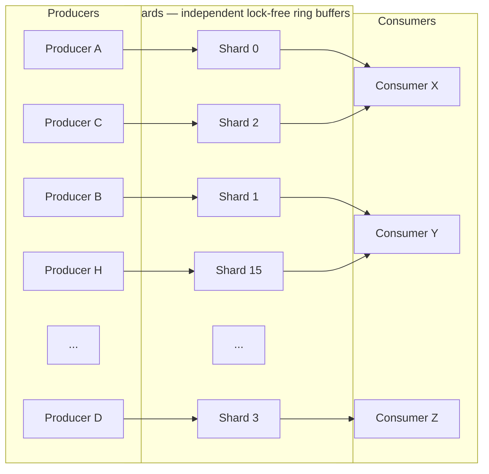
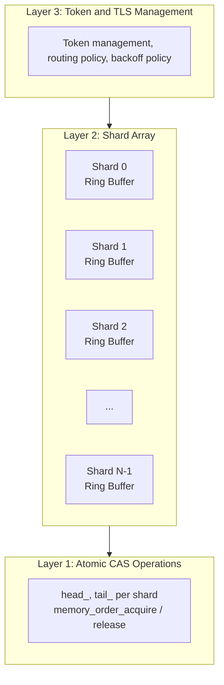
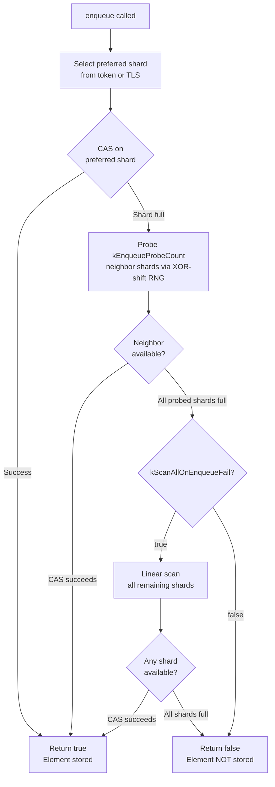
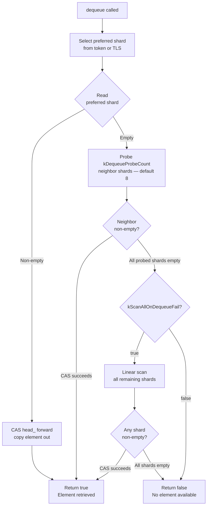

# User Manual - WorkQueue

*Updated February 2026*

---

**Scope:** Complete usage guide for `fat_p::work_queue::WorkQueue`, including the sharding architecture, shard selection and routing, token-based affinity, backoff strategies, backpressure handling, capacity tuning, memory ordering guarantees, migration from alternatives, and production troubleshooting.

**Not covered:**
- Lock-free ring buffer internals (CAS retry loop implementation; see Design Note - WorkQueue Shard)
- Single-producer/single-consumer patterns (use `fat_p::LockFreeRingBuffer`)
- Strict FIFO ordering (use `fat_p::LockFreeQueue`)
- Unbounded queue designs (WorkQueue is bounded by design)
- NUMA-aware producer/consumer placement

**Prerequisites:**
- C++20 (concepts, constexpr, `if constexpr`, fold expressions)
- Familiarity with `std::atomic`, `memory_order_acquire`, `memory_order_release`
- Basic understanding of why mutex contention destroys throughput in MPMC queues
- Understanding of `std::is_trivially_copyable` (what types qualify and why)

---

## User Manual Card

**Component:** WorkQueue
**Primary use case:** High-throughput multi-producer/multi-consumer message passing with bounded capacity
**Integration pattern:** Construct at startup with a fixed shard/capacity configuration; producers and consumers use tokens for affinity; check return values for backpressure
**Key API:** `enqueue()`, `dequeue()`, `tryDequeue()`, `makeProducerToken()`, `makeConsumerToken()`
**std equivalent:** None
**Migration from std:** Replace `std::queue<T>` + `std::mutex` + `std::condition_variable` with `WorkQueue<T>`; replace `push()`/`pop()` with `enqueue()`/`dequeue()`
**Common mistakes:** Ignoring `enqueue()` return value (silent data loss); sharing tokens across threads (data race); choosing ShardCount=1 (pointless overhead); queueing non-trivially-copyable types (static_assert)
**Performance notes:** Sharding maintains stable per-operation throughput under high producer contention where single-queue designs degrade; see `components/WorkQueue/results/` for current data

---

## Table of Contents

1. [The Concurrent Queue Problem](#the-concurrent-queue-problem)
2. [Why Sharding Solves It](#why-sharding-solves-it)
3. [Architecture: How WorkQueue Works](#architecture-how-workqueue-works)
4. [Getting Started](#getting-started)
5. [The Enqueue Path: What Happens Inside](#the-enqueue-path-what-happens-inside)
6. [The Dequeue Path: Probing and Scanning](#the-dequeue-path-probing-and-scanning)
7. [Tokens and Affinity: The Cache Locality Strategy](#tokens-and-affinity-the-cache-locality-strategy)
8. [tryDequeue: Spinning for Bursty Workloads](#trydequeue-spinning-for-bursty-workloads)
9. [The Routing System: Controlling Shard Selection](#the-routing-system-controlling-shard-selection)
10. [The Backoff System: Tuning Spin Behavior](#the-backoff-system-tuning-spin-behavior)
11. [Capacity, Sizing, and Backpressure](#capacity-sizing-and-backpressure)
12. [Why Trivially Copyable? The Ring Buffer Constraint](#why-trivially-copyable-the-ring-buffer-constraint)
13. [Ordering Guarantees (and Non-Guarantees)](#ordering-guarantees-and-non-guarantees)
14. [Thread Safety and Memory Ordering](#thread-safety-and-memory-ordering)
15. [Debug vs Release Behavior](#debug-vs-release-behavior)
16. [Usage Patterns](#usage-patterns)
17. [Performance Characteristics](#performance-characteristics)
18. [When to Use WorkQueue (and When Not To)](#when-to-use-workqueue-and-when-not-to)
19. [Migration from std::queue + mutex](#migration-from-stdqueue--mutex)
20. [Migration from boost::lockfree::queue](#migration-from-boostlockfreequeue)
21. [Alternatives](#alternatives)
22. [Troubleshooting](#troubleshooting)
23. [Known Limitations](#known-limitations)
24. [API Reference](#api-reference)
25. [FAQ](#faq)

---

## The Concurrent Queue Problem

### The Simplest Wrong Answer

The first concurrent queue most C++ programmers write looks like this:

```cpp
// The textbook approach — correct but slow
template <typename T>
class NaiveQueue {
    std::queue<T> q_;
    std::mutex mu_;
    std::condition_variable cv_;
public:
    void push(const T& val) {
        std::lock_guard lock(mu_);
        q_.push(val);
        cv_.notify_one();
    }
    bool pop(T& val) {
        std::lock_guard lock(mu_);
        if (q_.empty()) return false;
        val = std::move(q_.front());
        q_.pop();
        return true;
    }
};
```

This works correctly. Every push and pop acquires the same mutex. No data race is possible. For a logging system processing 100 messages per second, this is fine.

The problem emerges at scale. A game engine dispatching 500,000 task IDs per second across 8 producer threads and 4 consumer threads has 12 threads all serializing on one mutex. Each lock acquisition costs 15-25 ns when uncontended, but under contention — multiple threads trying to acquire simultaneously — the cost rises to 50-200 ns. Worse, the OS scheduler may deschedule a thread that's spinning on a contended mutex, adding 1-10 microseconds of context-switch latency. At 500K operations per second across 12 threads, the mutex becomes the bottleneck, not the actual work.

The fundamental issue is *serialization*. A single mutex forces all operations into a total order: producer A, then consumer B, then producer C. Even if producer A is enqueuing to a completely different logical "channel" than consumer B is dequeuing from, they still wait for each other. The queue has become a funnel through which all parallelism must squeeze.

### The Lock-Free Single Queue: Better, Still Bottlenecked

The next step is a lock-free queue. Replace the mutex with atomic compare-and-swap (CAS) operations. Producers and consumers can operate concurrently without blocking each other. This eliminates the context-switch problem — a failed CAS retries immediately, no OS intervention needed.

But a single lock-free queue still has a contention problem. Every CAS targets the same atomic variable — the head or tail pointer. When 8 producers all attempt to advance the tail simultaneously, 7 of them fail their CAS and must retry. Under heavy load, the retry rate grows with thread count. At 16 producers, each enqueue may require 3-5 CAS attempts on average, each one invalidating the cache lines holding the tail pointer across all cores. The cache-coherency traffic — cores bouncing the tail pointer back and forth via the MESI protocol — becomes the bottleneck.

This is the problem WorkQueue exists to solve.

---

## Why Sharding Solves It

### Dividing the Contention Surface

The insight behind WorkQueue is that contention is a per-resource problem, not a per-queue problem. If 8 producers fight over one tail pointer, give them 8 tail pointers.

WorkQueue splits a single logical queue into N independent lock-free ring buffers called *shards*. Each shard has its own head pointer, tail pointer, and element storage. A producer enqueuing an element picks one shard and performs a CAS on that shard's tail pointer. A consumer dequeuing picks a shard and performs a CAS on that shard's head pointer.

With 16 shards and 8 producers, the probability that two producers target the same shard on the same enqueue is 1/16. With 32 shards it drops to 1/32. Most of the time, each producer operates on its own shard's atomic, and the CAS succeeds on the first attempt. The producers don't even know other producers exist.



Each producer has a preferred shard via token or TLS. Each consumer probes its preferred shard first, then neighbors.

The tradeoff is ordering. A single queue guarantees global FIFO: the first element enqueued is the first dequeued. With shards, you get per-shard FIFO, but no ordering between shards. Producer A's element on Shard 0 and Producer B's element on Shard 1 could be dequeued in either order. For task dispatching, event processing, and log aggregation — workloads where "every element is processed exactly once" matters more than "elements are processed in submission order" — this tradeoff is correct.

### The Numbers

Benchmarks compare WorkQueue against `std::mutex + std::queue`, `fat_p::LockFreeQueue` (single MPMC queue), and `moodycamel::ConcurrentQueue` across contention patterns.

At high producer contention (8P:1C), the single lock-free queue is actually *worse* than the mutex queue — the CAS retry storm under 8-way contention costs more than mutex scheduling. WorkQueue, by distributing contention across shards, cuts latency significantly compared to the single lock-free queue.

At balanced MPMC (8P:2C), the advantage widens further. WorkQueue outperforms all alternatives at this contention level because sharding distributes both producer-side and consumer-side contention.

See `components/WorkQueue/results/` and `benchmark_results/` for current platform-specific data.

---

## Architecture: How WorkQueue Works

### The Three-Layer Design

WorkQueue is built from three layers, each solving a specific problem:



**Layer 1: Ring buffers.** Each shard is a fixed-size, lock-free, single-producer-multiple-consumer ring buffer. It stores elements in a contiguous array. The `head_` and `tail_` atomic indices track where the next dequeue and enqueue will occur. Power-of-2 capacity enables bitwise masking instead of modulo division.

**Layer 2: Shard routing.** The WorkQueue template holds an array of N shards. When a producer calls `enqueue()`, the routing policy selects which shard to target. When a consumer calls `dequeue()`, the routing policy determines which shard to probe first, which neighbors to check, and whether to fall back to a full scan.

**Layer 3: Token and TLS management.** Tokens and thread-local storage provide stable shard affinity so that a thread repeatedly hits the same shard, keeping that shard's cache lines hot.

### The Ring Buffer Internals

Each shard stores elements in a pre-allocated array of `ShardCapacity` slots. Two atomic indices track the logical head and tail positions:

```cpp
// Simplified shard structure (pseudocode)
struct Shard {
    alignas(64) std::atomic<size_t> head_{0};  // Consumer reads from here
    alignas(64) std::atomic<size_t> tail_{0};  // Producer writes here
    T slots_[ShardCapacity];                    // Pre-allocated element storage
};
```

The `alignas(64)` on `head_` and `tail_` is critical. Without it, both atomics could share a cache line, and every producer write to `tail_` would invalidate the consumer's cache line holding `head_` (and vice versa). This is false sharing — the same problem ThreadPool solves with `AlignedQueue`. By placing each atomic on its own cache line, producer and consumer operations are independent at the hardware level.

Enqueue writes an element to `slots_[tail_ % capacity]` and advances `tail_`. Dequeue reads from `slots_[head_ % capacity]` and advances `head_`. The modulo operation uses bitwise AND (`tail_ & (capacity - 1)`) because capacity is required to be a power of 2, making the mask operation a single cycle instead of the 20-40 cycles a division would cost.

The ring is full when `tail_ - head_ == capacity` and empty when `tail_ == head_`. These comparisons use the unwrapped indices (which may exceed capacity) — the modulo is only applied when indexing into the array.

### Why the Element Type Must Be Trivially Copyable

The ring buffer writes elements via direct memory copy into pre-allocated slots. There is no constructor call, no destructor call, no move assignment. The slot at `tail_ % capacity` is overwritten byte-by-byte. When a consumer reads the element, it copies bytes out.

If the element type has a non-trivial destructor, the old value in the slot would need to be destroyed before overwriting — but there's no synchronization to determine whether the slot currently holds a live object, a consumed object, or an uninitialized slot. If the type has a non-trivial copy constructor, the byte-level copy would bypass it, potentially leaving the object in an invalid state.

The `std::is_trivially_copyable_v<T>` requirement guarantees that byte-level copy is equivalent to proper copy construction. Integers, floats, POD structs, and trivial aggregates all qualify. `std::string`, `std::vector`, `std::shared_ptr`, and any type with virtual functions do not.

To queue non-trivially-copyable types, queue an index or pointer instead:

```cpp
// Non-trivial types: queue a handle, not the object
std::vector<std::unique_ptr<Task>> task_storage;

WorkQueue<uint32_t> task_queue;  // Queue indices, not Tasks

// Producer
uint32_t idx = register_task(std::move(my_task));
task_queue.enqueue(idx);

// Consumer
uint32_t idx;
if (task_queue.dequeue(idx)) {
    auto& task = task_storage[idx];
    task->execute();
}
```

---

## Getting Started

### Prerequisites and Integration

WorkQueue requires C++20. It depends only on the standard library and `<atomic>`. Include a single header:

```cpp
#include <fat_p/WorkQueue.h>
```

Compile with C++20 support:

```bash
# GCC
g++ -std=c++20 -O2 -pthread my_program.cpp

# Clang
clang++ -std=c++20 -O2 -pthread my_program.cpp

# MSVC
cl /std:c++20 /O2 my_program.cpp
```

### Your First WorkQueue

The simplest usage: one producer, one consumer, default configuration.

```cpp
#include <fat_p/WorkQueue.h>
#include <iostream>
#include <thread>

int main() {
    // Default: 16 shards × 1024 slots = 16,384 total capacity
    fat_p::work_queue::WorkQueue<int> q;

    std::thread producer([&q]() {
        for (int i = 0; i < 1000; ++i) {
            while (!q.enqueue(i)) {
                // Queue full — spin until space is available
                std::this_thread::yield();
            }
        }
    });

    std::thread consumer([&q]() {
        int received = 0;
        int value;
        while (received < 1000) {
            if (q.dequeue(value)) {
                ++received;
            } else {
                std::this_thread::yield();
            }
        }
    });

    producer.join();
    consumer.join();
    std::cout << "All 1000 elements transferred\n";
    return 0;
}
```

Two things to notice. First, `enqueue()` returns `bool` — it can fail if the queue is full. The producer must handle this. Ignoring the return value means silent data loss. The `[[nodiscard]]` attribute on `enqueue()` causes a compiler warning if you forget to check it. Second, `dequeue()` also returns `bool`. It does not block. If the queue is empty, it returns `false` and the consumer must decide what to do — yield, sleep, check another queue, or exit.

### Parallel Map: The Common Pattern

The most frequent use of WorkQueue is distributing work items from N producers to M consumers:

```cpp
fat_p::work_queue::WorkQueue<uint32_t, 8, 4096> work_queue;
std::atomic<bool> done{false};

// 4 producer threads submit task IDs
std::vector<std::thread> producers;
for (int p = 0; p < 4; ++p) {
    producers.emplace_back([&, p]() {
        auto tok = work_queue.makeProducerToken();
        for (uint32_t i = p * 10000; i < (p + 1) * 10000; ++i) {
            while (!work_queue.enqueue(tok, i))
                std::this_thread::yield();
        }
    });
}

// 2 consumer threads process task IDs
std::vector<std::thread> consumers;
for (int c = 0; c < 2; ++c) {
    consumers.emplace_back([&]() {
        auto tok = work_queue.makeConsumerToken();
        uint32_t id;
        while (!done.load(std::memory_order_acquire) || !work_queue.empty()) {
            if (work_queue.dequeue(tok, id)) {
                process_task(id);
            } else {
                std::this_thread::yield();
            }
        }
    });
}

for (auto& t : producers) t.join();
done.store(true, std::memory_order_release);
for (auto& t : consumers) t.join();
```

Each producer creates its own `ProducerToken`, giving it a preferred shard. Each consumer creates a `ConsumerToken`. The tokens keep each thread hitting the same shard repeatedly, which keeps that shard's cache lines hot. The alternative — tokenless calls — works identically but uses thread-local storage instead of explicit tokens, adding a TLS lookup on each call.

---

## The Enqueue Path: What Happens Inside

### Step by Step

Understanding the enqueue path helps diagnose backpressure issues and reason about performance. Here is what happens when you call `q.enqueue(tok, value)`:



1. **Shard selection.** The token's cached shard index selects the target shard. For tokenless calls, a thread-local shard index (initialized by hashing the thread ID) is used instead.

2. **CAS attempt on preferred shard.** The enqueue reads the shard's `tail_` and `head_` atomically. If `tail_ - head_ < capacity` (the shard is not full), it writes the value into `slots_[tail_ & (capacity - 1)]` and performs a CAS to advance `tail_` by 1. If the CAS succeeds, the enqueue is complete. If it fails (another producer advanced tail_ first), it retries.

3. **Probe neighbors.** If the preferred shard is full, the routing policy selects up to `kEnqueueProbeCount` alternative shards. The default policy uses a fast XOR-shift RNG to pick random neighbors, avoiding the stampede problem where all producers with a full preferred shard pile onto the same next-choice shard.

4. **Full scan (fallback).** If all probed shards are full and `kScanAllOnEnqueueFail` is `true`, every shard is checked linearly. This is the last resort — expensive but guarantees that an enqueue only fails if *all* shards are genuinely at capacity.

5. **Return false.** If every shard is full after the complete probe-and-scan sequence, `enqueue()` returns `false`. The element was not stored. The caller must handle this — retry, drop, block, or report backpressure.

### Why [[nodiscard]] Matters

The `[[nodiscard]]` attribute on `enqueue()` exists because a `false` return means data was lost. In production code, silent data loss is almost always worse than a crash — you don't even know something went wrong:

```cpp
// WRONG — if the queue is full, task_id vanishes without a trace
q.enqueue(task_id);

// CORRECT — handle backpressure explicitly
if (!q.enqueue(task_id)) {
    handle_backpressure(task_id);  // Retry, log, drop, or block
}
```

The compiler will warn on the first form. Do not suppress this warning.

---

## The Dequeue Path: Probing and Scanning

### Step by Step

The dequeue path mirrors enqueue but with its own probe parameters:



1. **Preferred shard.** Try the consumer's preferred shard. Read `head_` and `tail_`. If `head_ < tail_` (shard is non-empty), copy the element from `slots_[head_ & (capacity - 1)]` and CAS `head_` forward.

2. **Probe neighbors.** If the preferred shard is empty, probe `kDequeueProbeCount` neighbors (default: 8). The default routing policy uses the same XOR-shift RNG as the enqueue path, but with a different probe count — consumers check more neighbors because missing an element (returning false when elements exist elsewhere) is more disruptive than a producer trying one extra shard.

3. **Full scan.** If all probes miss and `kScanAllOnDequeueFail` is true, scan every shard linearly. This guarantees that `dequeue()` only returns `false` if the entire queue is genuinely empty.

4. **Return false.** If no shard had an element, return `false`. The caller decides what to do.

### dequeue vs tryDequeue

`dequeue()` makes a single attempt through the probe-scan sequence and returns. It never spins, never blocks, never sleeps. It is the right choice when the consumer has other work to do if the queue is empty — check another queue, poll a socket, update a frame counter.

`tryDequeue()` wraps `dequeue()` in a retry loop with backoff pauses between attempts:

```cpp
// tryDequeue: spin for up to maxAttempts, pausing between each
[[nodiscard]] bool tryDequeue(T& value, size_t maxAttempts = 100) noexcept;
```

Each failed attempt calls the backoff policy's `pause()` function before retrying. The default policy uses `_mm_pause()` on x86 — a hardware hint that reduces pipeline contention during spin-wait — or `std::this_thread::yield()` on other architectures.

Use `tryDequeue()` when producers are bursty and elements arrive in waves. The consumer spins briefly during the gap between bursts rather than returning to the caller's event loop and re-entering the dequeue path from scratch. For steady-state workloads where elements are always available, `dequeue()` is sufficient and avoids the overhead of the backoff machinery.

---

## Tokens and Affinity: The Cache Locality Strategy

### The Problem Tokens Solve

Without tokens, every `enqueue()` or `dequeue()` call must determine which shard to target. The tokenless path uses thread-local storage: on the first call, it hashes the calling thread's ID to select a shard index, stores that index in a `thread_local` variable, and reuses it on subsequent calls.

This works, but TLS access is not free. On most platforms, reading a `thread_local` variable requires a function call to `__tls_get_addr()` (Linux) or a segment register read (Windows). The cost is 2-10 ns — negligible for infrequent calls, measurable when enqueuing millions of elements per second.

Tokens are a simple optimization: a lightweight value type (two integers — the shard index and an RNG state) that the thread creates once and passes to every `enqueue` or `dequeue` call. The shard index is accessed directly from the token, bypassing TLS entirely.

```cpp
// Created once per thread, reused across all operations
auto ptok = q.makeProducerToken();

for (int i = 0; i < 100000; ++i) {
    q.enqueue(ptok, i);  // Direct shard access — no TLS lookup
}
```

### When Tokens Earn Their Keep

The decision between tokenless and token-based calls is a profiling question, not a design question. Use tokenless calls by default for convenience. Switch to tokens if profiling shows that TLS overhead accounts for measurable time in your enqueue/dequeue hot path.

Tokens also matter in contexts where TLS is unavailable or unreliable — signal handlers on some platforms, fibers/coroutines that migrate between OS threads, or environments where `thread_local` initialization is not supported.

### Token Lifetime and Safety

Tokens are value types containing two integers. They have no reference to the queue, no heap allocation, no destructor with side effects. You can copy them, move them, or let them go out of scope without consequence.

The one hard rule: **do not share a token between threads.** The token's internal RNG state is not atomic. Two threads using the same token simultaneously produce a data race on that state. Each thread must have its own token:

```cpp
// Per-thread pattern — the right way
void worker(WorkQueue<int>& q) {
    auto ctok = q.makeConsumerToken();  // One per thread
    int value;
    while (running) {
        if (q.dequeue(ctok, value)) {
            process(value);
        }
    }
}
```

---

## tryDequeue: Spinning for Bursty Workloads

### The Burst Gap Problem

Many producer-consumer systems have bursty arrival patterns. A game engine might dispatch 1,000 task IDs in a 100-microsecond burst, then go quiet for 15 milliseconds until the next frame. A network server receives a batch of packets, processes them, then waits for the next batch.

During the gap between bursts, a consumer calling `dequeue()` returns `false` immediately. The consumer returns to its event loop, does whatever else it needs to do, and tries again later. If the "whatever else" is just checking a flag and calling `dequeue()` again, the consumer is effectively spinning — but with the overhead of re-entering the dequeue path (token lookup, shard selection, probe sequence) on every iteration.

`tryDequeue()` is a purpose-built spin loop that stays inside the dequeue machinery:

```cpp
void consumer_loop(WorkQueue<Task>& q) {
    auto tok = q.makeConsumerToken();
    Task task;
    while (running) {
        if (q.tryDequeue(tok, task, 200)) {
            // Got an element — process it
            execute(task);
        } else {
            // 200 attempts with backoff pauses all failed
            // Queue has been empty for ~200 × pause_duration
            // Sleep to save CPU
            std::this_thread::sleep_for(std::chrono::microseconds(100));
        }
    }
}
```

The `maxAttempts` parameter controls how long the consumer spins before giving up. Each attempt calls `dequeue()` (with the full probe-scan sequence) and, if it fails, calls the backoff policy's `pause()` function. With the default backoff (`_mm_pause()` on x86), each attempt takes approximately 5-15 ns. At 200 attempts, the consumer spins for 1-3 microseconds before returning `false` — long enough to catch most inter-burst gaps, short enough to avoid wasting CPU during genuine idle periods.

### Choosing maxAttempts

The right value depends on your burst arrival pattern. Set `maxAttempts` so the spin duration covers the typical gap between bursts:

| Workload | Typical gap | Recommended maxAttempts |
|----------|-------------|------------------------|
| Game engine (60 FPS) | 10-100 us between dispatches | 500-1000 |
| Network server | 50-500 us between packet batches | 200-500 |
| Audio pipeline | 1-5 ms between callbacks | 50-100 (then sleep) |
| Batch processing | Seconds between batches | 0 (use `dequeue()` directly) |

---

## The Routing System: Controlling Shard Selection

### How Routing Works

The routing policy controls what happens when a thread's preferred shard is full (for enqueue) or empty (for dequeue). The default policy uses a two-phase strategy: first probe a small number of random neighbors, then optionally scan all shards.

The randomness is important. If every thread with a full preferred shard tried Shard 0 next, then Shard 1, then Shard 2, all the overflow traffic would stampede onto the same shards. The XOR-shift RNG ensures each thread's probe sequence is different, distributing overflow evenly.

### DefaultRoutingPolicy

The default routing policy exposes six compile-time constants that control probe behavior:

```cpp
struct DefaultRoutingPolicy {
    static constexpr size_t kEnqueueProbeCount = 4;    // Random shards to try on enqueue overflow
    static constexpr size_t kDequeueProbeCount = 8;    // Random shards to try on dequeue miss
    static constexpr size_t kEnqueueScanCount = 0;     // 0 = scan all shards
    static constexpr size_t kDequeueScanCount = 0;     // 0 = scan all shards
    static constexpr bool kScanAllOnEnqueueFail = true; // Fall back to full scan?
    static constexpr bool kScanAllOnDequeueFail = true; // Fall back to full scan?
};
```

The dequeue probe count (8) is intentionally higher than the enqueue probe count (4). A false negative on dequeue — returning "empty" when elements exist in other shards — can stall a consumer loop unnecessarily. A false negative on enqueue — returning "full" when other shards have space — is less costly because the producer can retry immediately. The asymmetry reflects this difference in failure cost.

### Writing a Custom Routing Policy

If your workload has specific contention patterns, you can replace the routing policy entirely. A custom policy must provide the same static constants and two static methods — `enqueue_probe()` and `dequeue_probe()` — that select the next shard to try:

```cpp
struct AggressiveRouting {
    static constexpr size_t kEnqueueProbeCount = 8;
    static constexpr size_t kDequeueProbeCount = 16;
    static constexpr size_t kEnqueueScanCount = 0;
    static constexpr size_t kDequeueScanCount = 0;
    static constexpr bool kScanAllOnEnqueueFail = true;
    static constexpr bool kScanAllOnDequeueFail = true;

    static size_t enqueue_probe(size_t current, size_t attempt,
                                size_t shardCount, uint32_t& rng) {
        rng ^= rng << 13; rng ^= rng >> 17; rng ^= rng << 5;
        return (current + rng) % shardCount;
    }

    static size_t dequeue_probe(size_t current, size_t attempt,
                                size_t shardCount, uint32_t& rng) {
        return enqueue_probe(current, attempt, shardCount, rng);
    }

    static size_t enqueue_scan_start(size_t current, size_t, uint32_t&) {
        return current;
    }

    static size_t dequeue_scan_start(size_t current, size_t, uint32_t&) {
        return current;
    }
};
```

The built-in `StrideRoutingPolicy<Stride>` provides a deterministic alternative that probes with a fixed stride:

```cpp
using StridedQueue = WorkQueue<int, 16, 1024, fat_p::work_queue::StrideRoutingPolicy<3>>;
// Probes: preferred, preferred+3, preferred+6, preferred+9, ...
```

Stride routing is predictable and debuggable but creates patterns that may align badly with certain thread counts. Use it when you need reproducible behavior for testing.

---

## The Backoff System: Tuning Spin Behavior

### How Backoff Works

The backoff policy controls what happens between retry attempts in `tryDequeue()`. Each failed dequeue attempt calls the policy's `pause()` method before trying again. The default uses hardware-level spin hints.

### DefaultBackoffPolicy

On x86 and x64, the default calls `_mm_pause()` — a single instruction that tells the processor "this is a spin loop." The processor responds by adding a brief pipeline stall (typically 10-40 cycles), which reduces the power consumption and memory-bus traffic of the spin. Without `_mm_pause()`, a tight spin loop issues load instructions as fast as the core can execute them, flooding the memory bus with reads.

On non-x86 architectures, the default falls back to `std::this_thread::yield()`, which invokes `sched_yield()` on Linux or `SwitchToThread()` on Windows.

### Choosing a Backoff Policy

The choice is a latency-versus-CPU tradeoff:

| Policy | Mechanism | Latency | CPU cost | Use when |
|--------|-----------|---------|----------|----------|
| Pure spin (no pause) | Empty loop body | Lowest | Highest | Dedicated cores, real-time constraints |
| DefaultBackoffPolicy | `_mm_pause()` / yield | Low | Medium | General-purpose, most workloads |
| Yield | `std::this_thread::yield()` | Medium | Low | Shared cores, oversubscribed systems |
| Sleep | `std::this_thread::sleep_for(1us)` | High | Lowest | Background processing, power-sensitive |

Implement a custom backoff by defining a struct with a static `pause()` method:

```cpp
struct SleepBackoff {
    static void pause() noexcept {
        std::this_thread::sleep_for(std::chrono::microseconds(1));
    }
};

using BackgroundQueue = WorkQueue<int, 16, 1024,
    fat_p::work_queue::DefaultRoutingPolicy,
    SleepBackoff>;
```

---

## Capacity, Sizing, and Backpressure

### How Capacity Is Determined

Total capacity is `ShardCount × ShardCapacity`, both compile-time template parameters:

```cpp
template <
    typename T,
    size_t ShardCount = 16,
    size_t ShardCapacity = 1024,
    typename RoutingPolicy = DefaultRoutingPolicy,
    typename BackoffPolicy = DefaultBackoffPolicy>
class WorkQueue;
```

Each shard pre-allocates `ShardCapacity × sizeof(T)` bytes at construction. With the defaults (16 shards × 1024 slots × 8 bytes for a `uint64_t`), the queue consumes approximately 131 KB of memory from the moment it's constructed, regardless of how many elements are in flight.

### Choosing ShardCount

The shard count controls the contention-memory tradeoff:

- **Too few shards** means more contention. With 2 shards and 16 producer threads, each CAS attempt has a 50% chance of colliding with another producer.
- **Too many shards** means more memory and longer scan times when the queue is nearly empty. A consumer looking for an element must check many empty shards before finding one with data.

The rule of thumb: **ShardCount ≥ max concurrent threads**. With 8 producer threads and 4 consumer threads, ShardCount of 16 or 32 works well. The default of 16 is reasonable for most server and game engine workloads.

### Choosing ShardCapacity

ShardCapacity controls how much burst traffic each shard can absorb before overflowing to neighbors. Size it to your expected burst size:

- If producers emit 500-element bursts, set ShardCapacity ≥ 512 (the next power of 2).
- If traffic is steady with no bursts, 256 or even 128 may suffice.
- ShardCapacity must be a power of 2 (for the bitwise masking optimization).

### Common Configurations

```cpp
// High-throughput server (many threads, large buffer)
using ServerQueue = WorkQueue<Event, 32, 8192>;
// Total: 32 × 8192 = 262,144 elements. Handles massive burst absorption.

// Embedded / low-memory (few threads, small buffer)
using EmbeddedQueue = WorkQueue<uint16_t, 4, 256>;
// Total: 4 × 256 = 1,024 elements. Minimal footprint.

// Game engine task system
using TaskQueue = WorkQueue<TaskId, 8, 2048>;
// Total: 8 × 2048 = 16,384 elements. Balanced for frame-budget workloads.
```

### Handling a Full Queue

When `enqueue()` returns `false`, the queue is at capacity. The right response depends on your application:

**Retry with backoff** — appropriate when elements must not be lost and producers can afford to wait:

```cpp
while (!q.enqueue(value)) {
    std::this_thread::yield();
}
```

**Drop and count** — appropriate for telemetry, logging, or metrics where occasional loss is acceptable:

```cpp
if (!q.enqueue(value)) {
    dropped_count.fetch_add(1, std::memory_order_relaxed);
}
```

**Block with sleep** — appropriate for batch pipelines where throughput matters more than latency:

```cpp
void enqueue_blocking(WorkQueue<int>& q, int value) {
    while (!q.enqueue(value)) {
        std::this_thread::sleep_for(std::chrono::microseconds(10));
    }
}
```

---

## Ordering Guarantees (and Non-Guarantees)

WorkQueue provides **work-queue semantics**, not FIFO semantics. The distinction matters:

Elements enqueued on the **same shard** by the same producer are delivered in FIFO order. If producer A enqueues elements 1, 2, 3 to Shard 0, a consumer dequeuing from Shard 0 will see 1, then 2, then 3.

Elements on **different shards** have no ordering relationship. If producer A puts element 1 on Shard 0 and producer B puts element 2 on Shard 1, a consumer might see 2 before 1.

Every successfully enqueued element is delivered **exactly once**. No duplication, no loss (unless the caller ignored a `false` return from `enqueue()`).

If your application requires global FIFO ordering — element 1 must always be dequeued before element 2, regardless of which producer enqueued them — use `fat_p::LockFreeQueue` instead. It uses a single queue with global ordering but has higher contention under heavy multi-producer load.

---

## Thread Safety and Memory Ordering

### What Is Guaranteed

All public methods on WorkQueue — `enqueue()`, `dequeue()`, `tryDequeue()`, `size()`, `empty()` — are safe to call from any number of threads concurrently. No external synchronization is required.

The underlying ring buffer uses `memory_order_acquire` on loads and `memory_order_release` on stores of the `head_` and `tail_` indices. This guarantees that when a consumer reads an element, it sees the value the producer wrote — not stale data from before the enqueue. The acquire/release pair establishes a happens-before relationship: all writes performed by the producer before advancing `tail_` are visible to the consumer after it reads the new `tail_` via `head_` advancement.

### What Is NOT Guaranteed

**Tokens are not thread-safe.** Each thread must have its own token. Sharing a token between threads is a data race on the token's internal RNG state.

**`size()` and `empty()` are approximate.** They iterate all shards and sum their sizes without holding any locks. By the time the result is returned, concurrent producers and consumers may have changed it. Do not use `size()` or `empty()` for synchronization decisions — they are diagnostic tools, not synchronization primitives.

---

## Debug vs Release Behavior

> **Critical: Debug vs Release** — WorkQueue's `static_assert` on `std::is_trivially_copyable_v<T>` fires in both Debug and Release builds. However, bounds checking on shard indices and capacity overflow is implemented via `assert()`, which is removed under `NDEBUG` (Release mode).

In Debug builds (`NDEBUG` not defined), WorkQueue validates:
- Shard index bounds in routing calculations
- Capacity overflow when `ShardCount × ShardCapacity` approaches `SIZE_MAX`
- Token shard index validity

In Release builds, these checks are elided for performance. If you encounter unexplained corruption in Release that doesn't reproduce in Debug, rebuild with assertions enabled (`-UNDEBUG`) to check for out-of-bounds access.

---

## Usage Patterns

### Task Dispatch System

A task dispatch system routes work items from multiple subsystems to a pool of worker threads. The key insight is that task ordering doesn't matter — every task will be processed exactly once, and the system doesn't care which worker picks it up first:

```cpp
struct TaskId { uint32_t value; };

WorkQueue<TaskId, 16, 4096> task_queue;

// N producer threads submit tasks
void producer(WorkQueue<TaskId, 16, 4096>& q) {
    auto tok = q.makeProducerToken();
    while (running) {
        TaskId task = generate_next_task();
        if (!q.enqueue(tok, task)) {
            // Backpressure: workers can't keep up
            backpressure_signal.store(true, std::memory_order_release);
        }
    }
}

// M consumer threads execute tasks
void consumer(WorkQueue<TaskId, 16, 4096>& q, TaskStore& store) {
    auto tok = q.makeConsumerToken();
    TaskId id;
    while (running) {
        if (q.dequeue(tok, id)) {
            store.execute(id);
        } else {
            std::this_thread::yield();
        }
    }
}
```

### Log Aggregation Pipeline

Logging is a natural fit for WorkQueue because log entry ordering is typically unimportant (timestamps provide ordering) and dropping entries under extreme pressure is acceptable. The bounded capacity acts as natural backpressure — if the writer thread falls behind, producers drop entries rather than consuming unbounded memory:

```cpp
struct LogEntry {
    uint32_t level;
    uint32_t source_id;
    uint64_t timestamp;
};

WorkQueue<LogEntry, 32, 8192> log_queue;

// Many subsystems produce logs
void log(uint32_t level, uint32_t source) {
    LogEntry entry{level, source, now()};
    if (!log_queue.enqueue(entry)) {
        // Drop under pressure — acceptable for logs
    }
}

// Single writer thread drains to disk
void log_writer() {
    auto tok = log_queue.makeConsumerToken();
    LogEntry entry;
    while (running) {
        if (log_queue.tryDequeue(tok, entry, 500)) {
            write_to_file(entry);
        } else {
            flush_file();
            std::this_thread::sleep_for(std::chrono::milliseconds(10));
        }
    }
}
```

### Event Bus

An event bus fans out events from many subsystems to a central handler. WorkQueue's bounded capacity prevents a runaway subsystem from consuming all available memory:

```cpp
struct Event {
    uint32_t type;
    uint32_t payload;
};

WorkQueue<Event, 8, 2048> event_bus;

// Multiple subsystems post events
event_bus.enqueue(Event{EVENT_COLLISION, entity_pair});
event_bus.enqueue(Event{EVENT_SPAWN, entity_id});

// Event handler drains and dispatches
Event evt;
while (event_bus.dequeue(evt)) {
    dispatch(evt);
}
```

---

## Performance Characteristics

### Benchmark Data

Benchmarks compare WorkQueue against `fat_p::LockFreeQueue`, `moodycamel::ConcurrentQueue`, and `std::mutex + std::queue` across contention patterns from 1P:1C through 8P:2C.

See `components/WorkQueue/results/` and `benchmark_results/` for current platform-specific data.

### Where WorkQueue Wins

WorkQueue dominates at high producer contention (4P+). The sharding strategy eliminates the CAS retry storm that cripples single-queue designs under multi-producer load. At balanced MPMC (8P:2C), WorkQueue outperforms all tested alternatives.

### Where WorkQueue Loses

At low contention (1P:1C), the overhead of shard routing makes `LockFreeQueue` slightly faster. The single-element CAS on a single queue is hard to beat when there's no contention to distribute. If your workload is genuinely single-producer/single-consumer, use `fat_p::LockFreeRingBuffer` instead (purpose-built SPSC ring buffer).

At very high consumer contention (1P:8C), WorkQueue is adequate but not dominant. When many consumers probe the same shards looking for a single producer's elements, the CAS retries on `head_` create contention that sharding was designed to eliminate on the producer side. For workloads with many more consumers than producers, consider multiple queues with round-robin assignment.

---

## When to Use WorkQueue (and When Not To)

### Use WorkQueue When

You have **multiple producers and multiple consumers** and need high throughput. WorkQueue's sharding strategy pays off when contention is the bottleneck.

You need **bounded capacity with explicit backpressure**. WorkQueue never allocates after construction. If the queue is full, producers are told immediately — no silent growth, no OOM surprise.

You can tolerate **relaxed ordering**. If per-element FIFO across all producers is not required, WorkQueue is the right choice.

### Don't Use WorkQueue When

| Scenario | Use instead |
|----------|-------------|
| Strict global FIFO ordering required | `fat_p::LockFreeQueue` |
| Single-producer, single-consumer only | `fat_p::LockFreeRingBuffer` (purpose-built SPSC) |
| Non-trivially-copyable elements | Wrap in index/pointer and queue the handle |
| Unbounded capacity needed | `std::queue` + `std::mutex`, or a growing allocator-backed queue |
| 1-2 producers only | `fat_p::LockFreeQueue` (simpler, same or better speed at low contention) |
| Need blocking dequeue (condition variable wait) | Wrap WorkQueue with a condition variable or use a blocking queue design |

---

## Migration from std::queue + mutex

### API Mapping

| `std::queue<T>` + `std::mutex` | `fat_p::work_queue::WorkQueue<T>` | Notes |
|------|------|-------|
| `lock(); q.push(v); unlock();` | `q.enqueue(v)` | Returns `bool`; check it |
| `lock(); v = q.front(); q.pop(); unlock();` | `q.dequeue(v)` | Combined front+pop; returns `bool` |
| `lock(); q.empty(); unlock();` | `q.empty()` | Approximate under concurrency |
| `lock(); q.size(); unlock();` | `q.size()` | Approximate under concurrency |
| `cv.wait(lock, [&]{ return !q.empty(); })` | `q.tryDequeue(v, maxAttempts)` | Spin-based, not CV-based |

### Key Differences

**No blocking wait.** `std::queue` + condition_variable provides blocking `wait()`: the consumer sleeps until an element arrives. WorkQueue has no condition variable. Consumers must spin (`tryDequeue`), poll (`dequeue` in a loop), or add their own condition variable wrapper.

**Bounded capacity.** `std::queue` grows without limit. WorkQueue has fixed capacity. You must handle `enqueue` failures.

**Relaxed ordering.** `std::queue` + mutex provides global FIFO. WorkQueue provides per-shard FIFO only.

**No external locking.** With `std::queue`, you manage the mutex yourself and can easily forget to lock or lock in the wrong order. WorkQueue's operations are internally synchronized.

### Migration Example

Before:

```cpp
std::queue<TaskId> task_queue;
std::mutex queue_mutex;
std::condition_variable queue_cv;

// Producer
{
    std::lock_guard lock(queue_mutex);
    task_queue.push(task_id);
}
queue_cv.notify_one();

// Consumer
std::unique_lock lock(queue_mutex);
queue_cv.wait(lock, [&] { return !task_queue.empty() || stop; });
if (!task_queue.empty()) {
    TaskId id = task_queue.front();
    task_queue.pop();
    lock.unlock();
    execute(id);
}
```

After:

```cpp
fat_p::work_queue::WorkQueue<TaskId, 16, 4096> task_queue;

// Producer
if (!task_queue.enqueue(task_id)) {
    handle_backpressure(task_id);
}

// Consumer
TaskId id;
if (task_queue.tryDequeue(id, 200)) {
    execute(id);
} else {
    std::this_thread::sleep_for(std::chrono::microseconds(100));
}
```

The mutex, condition variable, and manual locking are gone. The tradeoffs are explicit: bounded capacity (must handle full queue) and spin-based waiting (must manage sleep/yield for idle periods).

---

## Migration from boost::lockfree::queue

### API Mapping

| `boost::lockfree::queue<T>` | `fat_p::work_queue::WorkQueue<T>` | Notes |
|------|------|-------|
| `q.push(v)` | `q.enqueue(v)` | Both return `bool` |
| `q.pop(v)` | `q.dequeue(v)` | Both return `bool` |
| `q.empty()` | `q.empty()` | Both approximate |
| `boost::lockfree::queue<T>(capacity)` | `WorkQueue<T, shards, capacity_per_shard>` | WorkQueue capacity is `shards × per_shard` |

### Key Differences

**Sharding vs single queue.** `boost::lockfree::queue` is a single lock-free queue. Under multi-producer contention, WorkQueue's sharding strategy is significantly faster. Under single-producer workloads, Boost's simpler design may have slightly less overhead.

**Bounded vs unbounded.** `boost::lockfree::queue` can be configured as fixed-size or dynamically growing. WorkQueue is always fixed-size.

**Trivially copyable requirement.** Both require trivially copyable or trivially destructible types. The constraint is fundamentally the same.

**Ordering.** `boost::lockfree::queue` provides global FIFO. WorkQueue provides per-shard FIFO only.

**Dependencies.** `boost::lockfree::queue` requires Boost headers. WorkQueue is self-contained.

---

## Alternatives

- **`fat_p::LockFreeQueue`** — Single lock-free queue with global FIFO. Better for ≤ 2 producers.
- **`fat_p::LockFreeRingBuffer`** — SPSC ring buffer, optimal for single-producer/single-consumer.
- **`boost::lockfree::queue`** — Boost's lock-free MPMC queue. Global FIFO but higher contention under multi-producer load.
- **`moodycamel::ConcurrentQueue`** — High-performance MPMC queue with implicit producer tokens. Competitive throughput; header-only; MIT licensed.
- **`folly::MPMCQueue`** — Facebook's bounded MPMC queue. Fixed-size, blocking wait support. Requires Folly dependency.
- **`Intel TBB concurrent_queue`** — TBB's concurrent queue. Unbounded, supports blocking pop. Requires TBB library.
- **`std::queue<T>` + `std::mutex`** — Simplest correct implementation. Adequate for low-throughput workloads.

---

## Troubleshooting

### "enqueue keeps returning false"

**Symptom:** Producer calls consistently return `false`.

**Cause:** The queue is at capacity — all shards are full. This means consumers are not draining elements as fast as producers submit them.

**Diagnosis:** Check current usage:

```cpp
std::cout << "Capacity: " << q.capacity()
          << " Size: " << q.size() << "\n";
```

**Solutions:** Increase `ShardCapacity` (if the burst size exceeds per-shard capacity), increase `ShardCount` (if too many producers overflow to the same shards), add backpressure handling in the producer, or investigate why consumers are slow.

### "dequeue returns false but I know there are elements"

**Symptom:** Consumer sees empty despite active producers.

**Cause:** Under high contention, a single `dequeue()` call may miss elements. The consumer's preferred shard is empty, the probed neighbors are empty, and the full scan encounters CAS failures (another consumer stole the element between the emptiness check and the CAS). The element existed but was consumed by another thread during the scan.

**Solution:** Use `tryDequeue()` with multiple attempts. A single `dequeue()` is best-effort; `tryDequeue(v, 200)` retries 200 times with backoff, dramatically reducing the false-negative rate.

### "static_assert: T must be trivially copyable"

**Symptom:** Compilation error on `WorkQueue<std::string>` or similar.

**Cause:** The ring buffer copies elements via raw memory operations. Types with non-trivial constructors, destructors, or copy operators cannot be safely moved this way.

**Solution:** Queue an index or pointer instead of the object:

```cpp
WorkQueue<uint32_t> q;  // Queue indices
std::vector<MyComplexType> storage;

uint32_t idx = storage.size();
storage.push_back(std::move(my_object));
q.enqueue(idx);
```

### "Throughput is worse than a single LockFreeQueue"

**Symptom:** WorkQueue is slower in benchmarks.

**Cause:** Low thread count. With 1-2 threads, sharding adds overhead (shard selection, probe sequence) without reducing contention. The shard routing machinery costs more than the contention it eliminates.

**Solution:** WorkQueue's advantage appears at ≥ 4 producers. For 1-2 producers, use `fat_p::LockFreeQueue` (single queue, lower overhead). For single-producer/single-consumer, use `fat_p::LockFreeRingBuffer`.

### "Memory usage seems high"

**Symptom:** Process RSS is higher than expected at startup.

**Cause:** Each shard pre-allocates `ShardCapacity × sizeof(T)` bytes plus metadata. With 16 shards × 1024 × 8 bytes (uint64_t), that's approximately 131 KB allocated at construction, regardless of element count.

**Solution:** Reduce `ShardCount` or `ShardCapacity` if memory is tight. For embedded systems, `WorkQueue<uint16_t, 4, 256>` uses approximately 2 KB.

---

## Known Limitations

**Bounded capacity, no growth.** Total capacity is fixed at compile time. If producers exceed capacity, elements are rejected. There is no dynamic expansion. This is by design — unbounded growth in a concurrent queue hides backpressure problems and can lead to OOM in production.

**No blocking dequeue.** WorkQueue does not provide a condition-variable-based blocking wait. Consumers must spin (`tryDequeue`) or sleep in application code. Adding a condition variable would defeat the lock-free design — the `notify_one()` call introduces kernel transitions that dominate the lock-free operation cost.

**Relaxed cross-shard ordering.** No global FIFO guarantee. If your application requires strict ordering, WorkQueue is the wrong tool.

**Memory proportional to capacity, not usage.** All `ShardCount × ShardCapacity` slots are allocated at construction. A queue sized for 262,144 elements consumes that memory even when empty. Choose capacity based on worst-case burst size, not average load.

**No priority support.** All elements are equal. For priority-based dispatch, use `fat_p::ThreadPool` or layer priority on top with multiple WorkQueues (one per priority level).

| Limitation | Impact | Workaround |
|------------|--------|-----------|
| Fixed capacity | Rejected enqueues under overload | Size for burst; handle `false` returns |
| No blocking dequeue | CPU spent spinning during idle | `tryDequeue` + sleep fallback |
| Relaxed ordering | Cross-producer elements may reorder | Use `LockFreeQueue` for strict FIFO |
| Pre-allocated memory | Memory used even when empty | Size conservatively; reduce ShardCount |
| No priority | All elements equal | Multiple queues per priority level |

---

## API Reference

### WorkQueue\<T, ShardCount, ShardCapacity, RoutingPolicy, BackoffPolicy\>

| Method | Signature | Complexity | Notes |
|--------|-----------|-----------|-------|
| Constructor | `WorkQueue() noexcept` | O(ShardCount) | Pre-allocates all shard storage |
| `makeProducerToken` | `ProducerToken makeProducerToken() const noexcept` | O(1) | Thread-hash-based shard assignment |
| `makeConsumerToken` | `ConsumerToken makeConsumerToken() const noexcept` | O(1) | Thread-hash-based shard assignment |
| `enqueue` | `bool enqueue(const T&) noexcept` | O(1) expected | Uses TLS; [[nodiscard]] |
| `enqueue` | `bool enqueue(T&&) noexcept` | O(1) expected | Uses TLS; [[nodiscard]] |
| `enqueue` | `bool enqueue(ProducerToken&, const T&) noexcept` | O(1) expected | Explicit token; [[nodiscard]] |
| `enqueue` | `bool enqueue(ProducerToken&, T&&) noexcept` | O(1) expected | Explicit token; [[nodiscard]] |
| `dequeue` | `bool dequeue(T&) noexcept` | O(1) expected | Uses TLS; [[nodiscard]] |
| `dequeue` | `bool dequeue(ConsumerToken&, T&) noexcept` | O(1) expected | Explicit token; [[nodiscard]] |
| `tryDequeue` | `bool tryDequeue(T&, size_t maxAttempts) noexcept` | O(maxAttempts) | Spins with backoff; [[nodiscard]] |
| `tryDequeue` | `bool tryDequeue(ConsumerToken&, T&, size_t) noexcept` | O(maxAttempts) | Spins with backoff; [[nodiscard]] |
| `empty` | `bool empty() const noexcept` | O(ShardCount) | Approximate |
| `size` | `size_t size() const noexcept` | O(ShardCount) | Approximate |
| `shard_count` | `static constexpr size_t shard_count() noexcept` | O(1) | Compile-time |
| `shard_capacity` | `static constexpr size_t shard_capacity() noexcept` | O(1) | Compile-time |
| `capacity` | `static constexpr size_t capacity() noexcept` | O(1) | ShardCount × ShardCapacity |

### Type Constraints

- `T` must satisfy `std::is_trivially_copyable_v<T>`
- `ShardCount` must be > 0
- `ShardCapacity` must be > 0 and a power of 2
- `ShardCount × ShardCapacity` must not overflow `size_t`

---

## FAQ

**Q: How many shards should I use?**

Start with the default (16). If profiling shows contention (high CAS retry rates), increase ShardCount. If profiling shows scan overhead (consumers checking many empty shards), decrease ShardCount. The sweet spot is usually ShardCount ≥ max concurrent threads.

**Q: Can I resize the queue at runtime?**

No. Capacity is fixed at compile time. If you need different capacities for different phases of your application, create multiple WorkQueue instances with different template parameters.

**Q: What happens if a consumer and producer access the same shard simultaneously?**

They succeed independently. The producer CAS-advances `tail_` while the consumer CAS-advances `head_`. These are different atomics on different cache lines. No interference occurs unless the shard is nearly full or empty (where `tail_ - head_` approaches `capacity` or `0`).

**Q: Is WorkQueue wait-free?**

No. It is lock-free but not wait-free. Individual CAS operations can fail and retry under contention. A thread making progress is never blocked by another thread, but an individual thread may retry its CAS multiple times before succeeding. In practice, the retry count is small (1-3 retries) except under extreme contention.

**Q: Can I use WorkQueue in a single-threaded program?**

Technically yes, but there's no benefit. The sharding and atomic operations add overhead that a `std::queue` doesn't have. Use `std::queue<T>` for single-threaded code.

**Q: What is the memory overhead per shard beyond the element storage?**

Each shard contains two cache-line-aligned atomics (`head_` and `tail_`) plus the element array. The alignment padding adds at most 128 bytes per shard. For 16 shards, the metadata overhead is approximately 2 KB.

---

*WorkQueue.h — Fat-P Library*
