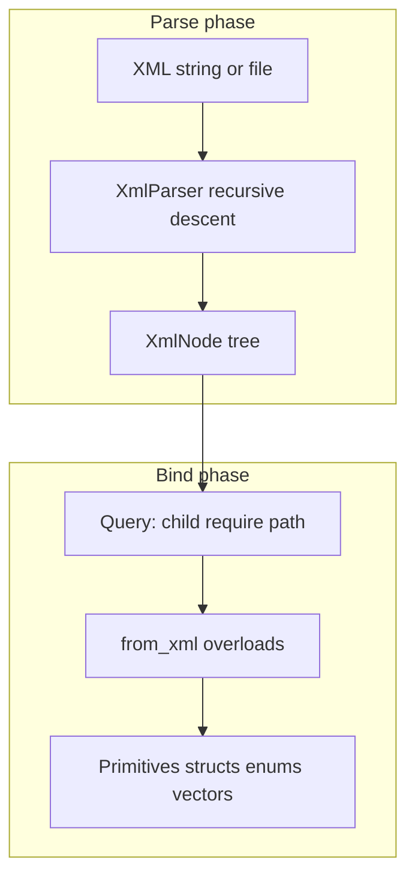
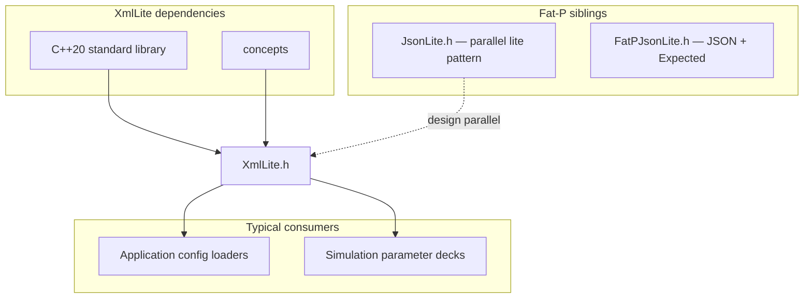

# Overview - XmlLite

## Executive Summary

XmlLite is a **zero-dependency, header-only XML library** for C++20 configuration and parameter files. It parses XML into an in-memory `XmlNode` tree and deserializes typed C++ values through `from_xml` overloads and `FATP_XML_DEFINE_TYPE` macros, mirroring the JsonLite design philosophy. Unlike general-purpose XML stacks that accept namespaces, DTDs, and ambiguous mixed content, XmlLite enforces a **config-shaped subset** of XML at parse time so invalid or enterprise-heavy input fails immediately. Enum support, struct mapping, and strict lexer rules live in the same self-contained header — no EnumPlus, no companion `FatPXml.h`.

---

## Overview Card

**Component:** XmlLite  
**Problem solved:** Load hierarchical configuration from XML into typed C++ structs without external libraries or hand-written field extraction.  
**When to use:** Application config files, simulation parameters, legacy XML configs with plain element nesting, vendored single-header deployments.  
**When NOT to use:** Document markup, SOAP/WSDL, XPath queries, namespace-aware schemas, multi-megabyte streaming parse, or round-trip XML authoring (parse-only today).  
**Key guarantee:** Parse-time rejection of namespaces, trailing garbage, and ambiguous structure; scalar `from_xml` requires leaf elements.  
**std equivalent:** None (no standard XML DOM or config binding)  
**Boost equivalent:** Boost.PropertyTree (different API; tree + path access, not macro struct binding)  
**Other alternatives:** pugixml, tinyxml2, RapidXML (full or partial XML; manual traversal)  
**Read next:** `User Manual - XmlLite.md`, `Design Note - XmlLite Enum Support.md`

---

## The Problem Domain

### What Goes Wrong Without Typed Config Parsing

Scientific and engineering applications still ship XML configuration: solver decks, instrument descriptors, mesh metadata. Without a typed binding layer, every loader reimplements the same fragile traversal. A missing element becomes a null pointer dereference; a mistyped enum string becomes a silent default; a permissive parser accepts two root elements and leaves the caller guessing which subtree is authoritative.

The manual approach looks deceptively straightforward until the config grows:

```cpp
const fat_p::XmlNode* target = root.child("target");
if (!target) throw std::runtime_error("missing target");
std::string scheme = target->text;
if (scheme == "cheb") dub_scheme = "cgl";
else if (scheme == "uniform") dub_scheme = "uni";
// repeat for every field, every struct, every enum
```

Each new field adds another branch. Each enum adds another string compare. Refactoring a tag name requires grep through loader code, not a single macro line. Worse, **stringly-typed enums** defer typos to runtime: `<scheme>chebb</scheme>` does not fail at compile time and may not fail until a downstream numerical solver diverges.

| Issue | HPC / config-loader impact |
|-------|------------------------------|
| No struct mapping | Boilerplate scales with every config type; review burden grows linearly |
| Permissive parsers | Invalid XML accepted; failures surface deep in numerics, not at load time |
| Heavy XML stacks | DTD, XPath, namespace machinery compiled in for files that need elements and text |
| String manual enums | Typos and drift between XML tokens and C++ enumerators |
| Mixed-content loss | Full XML preserves text/element interleaving; config loaders rarely need it but pay for it |

### The Standard's Limitation

C++ has **no standard library XML support**. There is no `std::xml`, no standard DOM, and no reflection-driven struct binding (C++26 reflection may help serialization later, but does not solve parsing today). Every project chooses a third-party parser or hand-rolls traversal.

That gap is permanent in practice: even when individual libraries are excellent, they remain **dependencies** with approval processes, version pins, and ABI packaging concerns. Enterprise and embedded environments often need a **single vendored header** that parses and binds config without pulling Boost, libxml2, or Expat. XmlLite targets that permanent gap — not as a polyfill waiting for a standard, but as a deliberate config reader with compile-time struct wiring via macros.

---

## Architecture: Parse-Then-Bind with ADL Struct Macros

XmlLite separates **parsing** (building `XmlNode`) from **binding** (`from_xml` overloads). The parser is a single-pass recursive-descent lexer over `std::string_view` input. The binder uses overload resolution and ADL so user-defined types participate without virtual interfaces.

```cpp
struct XmlNode {
    std::string tag;
    std::string text;
    std::map<std::string, std::string> attributes;
    std::vector<XmlNode> children;
    // child(), require(), path(), attr(), ...
};

auto root = fat_p::parse_xml(xml_string);
SensorConfig cfg = fat_p::from_xml<SensorConfig>(root.require("sensor"));
```

**The mechanism:** `FATP_XML_DEFINE_TYPE` expands to a `from_xml(const XmlNode&, T&)` that dispatches each field by type. Scalar and nested struct members use `require_unique_child` + `from_xml_adl`; `std::vector` members deserialize a unique wrapper element via two-arg `from_xml(wrapper, vec)` — every child becomes an element, or leaf wrappers parse space-separated arithmetic text. Field names map to wrapper tag names (`#field` stringification). Duplicate required siblings throw at bind time; the parser itself allows repeated tags for vector collection APIs. Scalar `from_xml` calls `enforce_leaf_text_node` so a `<gain>` element cannot contain nested elements and still deserialize as `double`.

Enum binding uses a local `xml_string_enum` concept and `FATP_XML_ENUM_STRING_POLICY` at file scope — XML-local machinery that keeps the header self-contained (verified by CI header self-containment tests).



---

## Feature Inventory

### 1. Strict config-shaped parsing

The parser rejects input that full XML processors accept but config files should not use: prefixed names, `xmlns`, multiple roots, unclosed tags, duplicate attributes, raw `<` in attributes, malformed prolog, and non-whitespace garbage after the root element. UTF-8 BOM and trailing comments/whitespace after the root are allowed.

This is not pedantry for its own sake. Config pipelines run once at startup; failing fast with `FATP_XML_ENFORCE` and `std::runtime_error` context beats propagating a silently truncated tree into hours-long simulations.

### 2. XmlNode query API

Navigation uses `child`, `require`, `all`, `has`, dotted `path`, and `hasPath`. Attributes expose through `attr` as `std::optional<std::string>`. The query layer throws on missing required structure, which matches the exception-based error model used throughout binding.

### 3. Macro-based struct deserialization

`FATP_XML_DEFINE_TYPE` and `FATP_XML_DEFINE_TYPE_OPTIONAL` generate struct `from_xml` without repeating tag names. Required macros enforce exactly one child per scalar/nested field and one wrapper per `std::vector` field; optional macros skip absent children. Nested structs work when their `from_xml` is visible to ADL.

`std::vector` members need no extra macro — wrapper tag equals the field name. Ad-hoc list binding uses `from_xml(wrapper, vector)`, `from_xml(parent, tag, vector)`, or `xml_all`.

### 4. Enum class support (integer and string)

Integer enums deserialize from underlying numeric text with range checks. String enums use `FATP_XML_ENUM_STRING_POLICY` to map element text to enumerators by token spelling. Policies with string enums reject numeric fallback — strict token validation is opt-in via the macro.

### 5. Self-contained header

`XmlLite.h` includes only standard headers and `<concepts>`. No EnumPlus, no JsonLite, no Fat-P Foundation. CI compiles `test_XmlLite_HeaderSelfContained.cpp` with `-Werror` on GCC to guard this contract.

---

## Why Not Alternatives?

### Why Not std::?

**No standard equivalent exists.** C++ provides no XML parser, no configuration DOM, and no struct reflection for automatic field binding. XmlLite fills a gap the committee has not addressed and is unlikely to address as a single vendored header.

### Why Not Boost.PropertyTree?

| Aspect | Boost.PropertyTree | XmlLite |
|--------|-------------------|---------|
| **Dependencies** | Boost | Std only |
| **API model** | Path strings (`pt.get<int>("a.b")`) | Typed `from_xml` + struct macros |
| **Enum binding** | Manual | `FATP_XML_ENUM_STRING_POLICY` |
| **Parse strictness** | Permissive reader | Config subset; namespaces rejected |
| **Header count** | Multiple Boost headers | Single header |

**When to use Boost.PropertyTree:** You already depend on Boost, want path-string access, or need INI/JSON/INFO adapters in the same API.

**When to use XmlLite:** You want zero dependencies, compile-time struct wiring, and strict config XML rejection without Boost approval overhead.

### Why Not pugixml / tinyxml2?

| Aspect | pugixml / tinyxml2 | XmlLite |
|--------|-------------------|---------|
| **XML coverage** | Broad XML feature sets | Config subset |
| **Binding** | Manual traversal | `from_xml` + macros |
| **Linkage** | Separate compilation typical | Header-only |
| **Dependencies** | External project | None |

**When to use pugixml:** Large documents, XPath, full XML compliance, mature ecosystem.

**When to use XmlLite:** Small config files, typed struct load, vendored single header, strict rejection of namespace-heavy input.

### Exclusionary criteria

| If You Need... | Why Not Alternative | XmlLite Advantage |
|----------------|---------------------|-------------------|
| Zero dependencies | pugixml/tinyxml2 are external packages | Single std-only header |
| Typed struct macros (incl. vectors) | PropertyTree uses string paths | `FATP_XML_DEFINE_TYPE` |
| Namespace-free config | Full parsers accept xmlns | Rejected at parse time |
| Self-contained enums without EnumPlus | FatPJson pattern suggested split header | `FATP_XML_ENUM_STRING_POLICY` in XmlLite |
| XML serialization | XmlLite is parse-only today | Use JsonLite or manual writer |

---

## The "Forever Stuck" Reality

Scientific computing clusters often run enterprise Linux with GCC versions pinned for driver, MPI, or CUDA compatibility. Configuration formats change slowly: XML decks written a decade ago still launch production jobs. Even when JSON replaces XML for new projects, **legacy XML configs persist**.

A parser tied to Boost or libxml2 version cycles creates friction in environments where dependency approval is slow. A header that compiles on C++20 with strict `-Werror` on GCC, Clang, and MSVC — and passes header self-containment checks — remains valuable independent of compiler upgrades. XmlLite is written for that permanence: config loading as a solved problem in one file, not a temporary shim until JSON migration completes.

---

## Performance Characteristics

XmlLite optimizes for **correctness, strictness, and integration simplicity**, not throughput records. The parse builds a `std::string`-backed tree in one pass; binding walks known structure. For typical config sizes (kilobytes to low megabytes), parse-plus-bind cost is negligible relative to simulation setup.

| Operation | Complexity | Mechanism |
|-----------|------------|-----------|
| Parse | O(n) input size | Single-pass recursive descent |
| `child` / `require` | O(children) per call | Linear scan of sibling vector |
| `from_xml` scalar | O(1) per leaf | `std::from_chars` on trimmed text |
| `xml_all` | O(children) | Filter matching tags, bind each |

See `components/Xml/benchmarks/` and `benchmark_results/` when benchmark data is published. Overviews describe mechanisms; measured timings belong in benchmark results files.

### Where XmlLite Wins

**Startup config load:** Parse once, bind to structs, throw on invalid input.

**Vendored deployments:** Copy one header; no package manager entry.

**Strict config validation:** Namespaces, duplicate attributes, and trailing garbage fail at parse time.

**Typed enums in structs:** String policies colocated with XML binding without EnumPlus.

### Where XmlLite Loses

**Large documents:** Whole-file read into memory; no streaming SAX.

**Full XML compliance:** Namespaces, CDATA, arbitrary processing instructions not supported.

**XPath / XSLT / schema validation:** Not in scope.

**Round-trip authoring:** No `to_xml` API today.

**High-throughput XML services:** Use pugixml or simdxml-class parsers.

---

## Integration Points



XmlLite does not depend on JsonLite. Projects may use both for different file formats. Enum string policies in XmlLite are XML-local; EnumPlus policies for JSON remain separate unless you unify tokens manually.

---

## Final Assessment

XmlLite delivers on the Fat-P promise through three pillars:

### 1. Permanence

C++ will not standardize a config XML binding layer. Legacy XML configs persist in HPC and instrumentation long after greenfield projects choose JSON. XmlLite provides permanent, dependency-free parse-and-bind — not a placeholder until libxml2 ships in std, but the intended solution for config-shaped XML in Fat-P and vendored copies.

### 2. Specialization

The parser enforces a config subset: no namespaces, no trailing garbage, leaf-only scalar binding, duplicate attribute rejection. Struct macros map field names to element tags without string paths. Enum policies validate tokens at bind time. These choices target configuration loaders, not document authoring or web-service XML.

### 3. Control

`FATP_XML_DEFINE_TYPE` vs `_OPTIONAL` chooses required vs defaultable fields. Integer vs string enum policies choose strict token validation vs numeric underlying values. `child` vs `require` vs `hasPath` chooses non-throwing probes vs fail-fast navigation. Exception messages include `source_location` context via `FATP_XML_ENFORCE`.

**Architectural Verdict:** XmlLite transforms config XML from **manual traversal and string compares** into **typed struct binding** with strict parse rules and a self-contained header — the XML counterpart to JsonLite's lite philosophy.

---

## Key Takeaway Card

| Principle | One-Line Summary |
|-----------|------------------|
| **Permanence** | Std-only header solves legacy XML config without waiting for a standard |
| **Specialization** | Config subset enforcement, not general XML |
| **Control** | Required vs optional macros; integer vs string enum policies |
| **Lite** | Enums and structs in one file; no EnumPlus required |

---

*XmlLite.h — Fat-P Library*