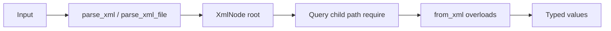

# User Manual - XmlLite

**Scope:** Parse config XML, navigate `XmlNode`, deserialize primitives, structs, enums, optionals, and vectors with `from_xml`, and generate struct deserializers with `FATP_XML_DEFINE_TYPE` / `_OPTIONAL`.

**Not covered:**
- XML serialization or round-trip writing (`to_xml` does not exist today)
- Full XML (namespaces, DTD, CDATA, XPath, schema validation)
- Expected-based non-throwing API (XmlLite throws via `FATP_XML_ENFORCE`; see FatPJsonLite for JSON with `Expected`)
- JSON configuration (see `User Manual - JsonLite.md`)

**Prerequisites:** C++20; familiarity with `enum class`; comfort with exception-based error handling for config load failures

---

## User Manual Card

**Component:** XmlLite  
**Primary use case:** Load application configuration from XML into typed C++ structs at startup  
**Integration pattern:** `#include "XmlLite.h"`, `parse_xml_file`, `FATP_XML_DEFINE_TYPE`, optional `FATP_XML_ENUM_STRING_POLICY`  
**Key API:** `parse_xml()`, `parse_xml_file()`, `from_xml()`, `xml_all()`, `FATP_XML_DEFINE_TYPE`, `FATP_XML_DEFINE_TYPE_OPTIONAL`, `FATP_XML_ENUM_STRING_POLICY`  
**std equivalent:** None  
**Common mistakes:** Enum policy inside a namespace; vector fields in struct macros; scalar `from_xml` on elements with children; assuming integer enums validate enumerator names  
**Performance notes:** Single-pass parse into memory-backed tree; suitable for config-sized files. See `components/Xml/benchmarks/` when data exists.

---

## Table of Contents

1. [The Config XML Story](#the-config-xml-story)
2. [How XmlLite Works](#how-xml-lite-works)
3. [Getting Started](#getting-started)
4. [Parsing: String and File](#parsing-string-and-file)
5. [The Navigation Dilemma: Probe vs Require](#the-navigation-dilemma-probe-vs-require)
6. [Scalar Binding: The Leaf Rule](#scalar-binding-the-leaf-rule)
7. [Struct Macros: One Element Per Field](#struct-macros-one-element-per-field)
8. [Optional Fields: Defaults vs Absence](#optional-fields-defaults-vs-absence)
9. [Repeated Elements: Why Macros Stop Short](#repeated-elements-why-macros-stop-short)
10. [Enum Binding: Integer vs String Policy](#enum-binding-integer-vs-string-policy)
11. [Error Handling Model](#error-handling-model)
12. [Parser Strictness](#parser-strictness)
13. [Performance Rules of Thumb](#performance-rules-of-thumb)
14. [When to Use XmlLite (and When Not To)](#when-to-use-xmllite-and-when-not-to)
15. [Migration Guide](#migration-guide)
16. [Troubleshooting](#troubleshooting)
17. [API Reference](#api-reference)
18. [FAQ](#faq)
19. [Summary](#summary)

---

## The Config XML Story

### XML That Refuses to Die

JSON won the API and greenfield-config wars, but scientific software still boots from XML. Instrument definitions, mesh generators, solver decks, and legacy HPC workflows store parameters in nested elements because XML was the interchange format when those codes were written. Replacing every deck with JSON is a multi-year migration; **reading XML correctly today** remains operational reality.

Full XML processors were built for documents: mixed content, namespaces, external entities, XPath, schemas. Configuration files rarely need that machinery. They need a predictable tree, typed fields, and loud failure when someone hand-edits a tag wrong at 11 PM before a batch submission.

### The Loader Anti-Pattern

Without a binding layer, loaders accumulate defensive code:

```cpp
const auto* sensor = root.child("sensor");
if (!sensor) { /* error */ }
const auto* model = sensor->child("model");
if (!model) { /* error */ }
std::string modelText = model->text;
// still not typed; still no enum validation
```

Every struct duplicates this pattern. Every new field adds another null check. Enum-like strings scatter across `if (s == "...")` chains that the compiler cannot verify. XmlLite exists to collapse that repetition into `from_xml` overloads and macros while keeping the header dependency-free.

### Where XmlLite Fits

XmlLite is the XML sibling of JsonLite: one public header, exception-based enforcement, macro struct mapping. It deliberately does **not** chase full XML compliance. It chases **config correctness**: typed binding, strict parse rules, and CI-verified self-containment so you can vendor a single file into a restricted environment.

---

## How XmlLite Works

### Two Phases: Parse, Then Bind

Parsing constructs an `XmlNode` tree. Binding walks that tree and fills C++ types. Keeping these phases separate means you can parse once, inspect with the query API, and bind multiple structs from different subtrees.



The parser is recursive descent over `std::string_view`. Nodes store `tag`, `text`, `attributes`, and `children` using standard containers. No custom allocators, no DOM interface virtuals.

### How Struct Macros Bind Fields

`FATP_XML_DEFINE_TYPE(SensorConfig, model, gain)` generates:

```cpp
inline void from_xml(const fat_p::XmlNode& node, SensorConfig& value)
{
    // for each field: require_unique_child(node, "model"), from_xml(child, value.model), ...
}
```

`require_unique_child` scans direct children, rejects duplicates, and throws if a required tag is missing. `from_xml_adl` dispatches to the correct overload for each field type, including user-defined nested structs via ADL.

### How String Enums Differ From EnumPlus

XmlLite defines `FATP_XML_ENUM_STRING_POLICY` locally. It specializes `fat_p::xml_detail::XmlEnumStringPolicy<E>` with a `from_string(std::string_view)` that compares tokens to `#enumerator` spellings. This keeps the header self-contained. Json/FatP stacks may use EnumPlus policies separately; XmlLite does not require them.

---

## Getting Started

### Prerequisites and Integration

XmlLite requires C++20. Add `include/fat_p` to your include path and include the header:

```cpp
#include "XmlLite.h"
```

No link step. No code generation. Define structs and macros in the same translation unit that loads config (or a dedicated `config_types.cpp`).

### Your First Complete Program

The example below parses inline XML, binds a struct, and reads a repeated list through `xml_all`:

```cpp
#include "XmlLite.h"
#include <iostream>

struct Target {
    double centerX;
    double centerY;
    double sigma;
};
FATP_XML_DEFINE_TYPE(Target, centerX, centerY, sigma)

int main()
{
    const char* xml = R"(
        <config>
            <targets>
                <target><centerX>0</centerX><centerY>0</centerY><sigma>1.5</sigma></target>
            </targets>
        </config>
    )";

    auto root = fat_p::parse_xml(xml);
    auto targets = fat_p::xml_all<Target>(root, "targets", "target");
    std::cout << "sigma=" << targets[0].sigma << '\n';
}
```

Each field in `Target` maps to a child element with the **same name** as the member. `FATP_XML_DEFINE_TYPE` makes all listed fields required.

---

## Parsing: String and File

### Parsing from memory

`parse_xml` accepts `std::string_view`. The view must outlive parsing only for the duration of the call; the tree copies data into `std::string` members.

```cpp
std::string_view xml = load_into_string_view_somehow();
fat_p::XmlNode root = fat_p::parse_xml(xml);
```

### Parsing from disk

`parse_xml_file` reads the entire file in binary mode, checks stream health, then calls `parse_xml`:

```cpp
auto root = fat_p::parse_xml_file("simulation.xml");
```

If the file cannot be opened or a read error occurs before EOF, `FATP_XML_ENFORCE` throws with the filename in the message.

### Prolog, BOM, and comments

UTF-8 BOM at the beginning is skipped. A single `<?xml version="1.0" ...?>` declaration is accepted when it includes a quoted `version="1.0"` or `version='1.0'`, with optional `encoding="UTF-8"` and `standalone="yes"` or `standalone="no"` only. Unknown declaration attributes, missing version, unquoted values, and unsupported version/encoding values throw. `<?xml-stylesheet ...?>` and other processing instructions are rejected. Comments and whitespace may trail the root element; other non-whitespace trailing content is rejected.

---

## The Navigation Dilemma: Probe vs Require

### Why Two Access Styles Exist

Config loaders mix **optional sections** with **hard requirements**. Requiring a missing optional subtree throws; probing with `child` returns `nullptr` and pushes null checks into every caller. XmlLite offers both styles so you choose explicit failure vs branching.

`require` throws immediately with `missing required element:` when a direct child tag is absent. Use it when the subtree is mandatory for continued loading.

`child` returns `nullptr` when absent. Use it when you will branch or when an optional macro already handles absence at the struct level.

`hasPath` and `path` implement dotted navigation (`options.advanced.timeout`). `hasPath` returns `false` for empty paths or missing segments; `path` throws on empty segments or missing nodes.

### Example: optional branch vs required core

```cpp
auto root = fat_p::parse_xml_file("deck.xml");
auto& run = root.require("simulation");  // mandatory section

if (root.hasPath("diagnostics.verbose")) {
    const auto& diag = root.path("diagnostics");
    bool verbose = fat_p::from_xml<bool>(diag.require("verbose"));
}
```

For struct-level optionals, prefer `FATP_XML_DEFINE_TYPE_OPTIONAL` instead of manual probing when the whole struct is optional by absence of children.

---

## Scalar Binding: The Leaf Rule

### Why Scalars Reject Child Elements

Configuration values are usually **either** text **or** nested structure, not both interleaved like HTML. Allowing `<gain><value>1</value></gain>` to deserialize as `double` would hide structural mistakes. XmlLite enforces **leaf-only** scalar binding: `enforce_leaf_text_node` requires `children.empty()` before reading `trimmedText()`.

If you need nested structure, define a struct with its own `from_xml` and bind the parent element to that struct type.

### Supported scalar types

`from_xml` provides overloads for `std::string`, `int`, `std::int64_t`, `std::size_t`, `double`, `bool`, and enums. `double` uses `std::from_chars` and rejects non-finite values. `bool` accepts `true`/`false`/`1`/`0`.

Value-returning form requires default-constructible `T`:

```cpp
double sigma = fat_p::from_xml<double>(node.require("sigma"));
```

---

## Struct Macros: One Element Per Field

### Required fields

`FATP_XML_DEFINE_TYPE` maps each field name to exactly one child element with that tag. Duplicates throw `duplicate element:`; missing children throw `missing required element:`.

```cpp
struct SensorConfig {
    std::string model;
    double gain;
};
FATP_XML_DEFINE_TYPE(SensorConfig, model, gain)
```

```xml
<sensor>
    <model>Alpha</model>
    <gain>1.25</gain>
</sensor>
```

```cpp
SensorConfig cfg = fat_p::from_xml<SensorConfig>(root.require("sensor"));
```

Nested structs work when their generated or hand-written `from_xml` is found by ADL from the macro expansion site.

### The duplicate sibling distinction

Struct fields reject duplicate child tags because duplicates indicate a schema mistake for scalar/nested fields. **Vectors** (later section) intentionally allow repeated siblings — same XML pattern, different API entry point.

---

## Optional Fields: Defaults vs Absence

### Macro-level optionals

`FATP_XML_DEFINE_TYPE_OPTIONAL` skips missing children and leaves default-constructed members:

```cpp
struct Options {
    double tolerance = 1e-6;
    int maxIter = 100;
};
FATP_XML_DEFINE_TYPE_OPTIONAL(Options, tolerance, maxIter)
```

If `<maxIter>` is absent, `maxIter` stays `100`. If `<maxIter>` appears twice, binding still throws.

### `std::optional` members

A `std::optional<T>` member controls the C++ storage type, not whether the child element may be absent. With `FATP_XML_DEFINE_TYPE`, each listed field still requires exactly one child element — missing `<dt>` throws even when the member type is `std::optional<double>`.

Use `FATP_XML_DEFINE_TYPE_OPTIONAL` or `from_xml(parent, tag, optional<T>&)` when the child tag may be absent. Use `std::optional<T>` as the member type when you need optional *value* semantics inside a present element (uncommon for config XML).

For optional **child tags** without wrapping the whole struct:

```cpp
std::optional<double> threshold;
fat_p::from_xml(parent, "threshold", threshold);
```

Duplicate sibling tags throw for this overload, matching struct macro duplicate detection.

---

## Repeated Elements: Why Macros Stop Short

### The vector API

Repeated siblings share a tag name. Collect them with `from_xml(parent, childTag, vector)`:

```xml
<items>
    <item><id>1</id></item>
    <item><id>2</id></item>
</items>
```

```cpp
std::vector<Item> items;
fat_p::from_xml(parent.require("items"), "item", items);
```

`xml_all` requires a unique wrapper element, then collects repeated item children:

```cpp
auto items = fat_p::xml_all<Item>(root, "items", "item");
```

Duplicate wrapper siblings throw, matching struct field duplicate detection.

### Why macros do not cover vectors

`FATP_XML_DEFINE_TYPE` expands one `require_unique_child` per field. Vectors need zero-or-many matches, not zero-or-one. A future `FATP_XML_DEFINE_TYPE_VECTOR` could exist; today the explicit API keeps macro semantics plain and duplicate detection strict for scalar fields.

### Macro argument limits

`FATP_XML_DEFINE_TYPE`, `FATP_XML_DEFINE_TYPE_OPTIONAL`, and `FATP_XML_ENUM_STRING_POLICY` each accept up to **50** fields or enumerator tokens. For larger schemas, write a custom `from_xml` overload.

---

## Enum Binding: Integer vs String Policy

### Integer enums: numeric path, loose validation

Without a string policy, enum binding reads the underlying integer:

```cpp
enum class Mode : int { Off = 0, On = 1 };
```

```xml
<mode>1</mode>
```

Values outside the underlying type range throw. **Enumerator membership is not validated** — `99` may deserialize if it fits in the underlying type. Use string policies when XML tokens must be a closed set.

### String policies: strict tokens

Define `FATP_XML_ENUM_STRING_POLICY` at **global file scope** after the enum:

```cpp
enum class Mode { Off, On };
FATP_XML_ENUM_STRING_POLICY(Mode, Off, On)
```

```xml
<mode>On</mode>
```

Tokens must match enumerator spelling exactly. After a policy is defined, numeric text like `<mode>1</mode>` throws.

For enums in user namespaces:

```cpp
namespace app { enum class Mode { Off, On }; }
FATP_XML_ENUM_STRING_POLICY(app::Mode, Off, On)
```

**Placement rule:** Do not invoke the macro inside a namespace block. It opens `namespace fat_p { namespace xml_detail { ... } }` relative to the call site; inside user namespaces the specialization lands in the wrong place (GCC/MSVC errors).

`FATP_ENUM_STRING_POLICY` aliases to `FATP_XML_ENUM_STRING_POLICY` when EnumPlus has not already defined it.

### Enums inside structs

```cpp
struct Config { Mode mode; };
FATP_XML_DEFINE_TYPE(Config, mode)
```

No macro changes required once `from_xml` for `Mode` exists.

---

## Error Handling Model

XmlLite is **exception-based**. `FATP_XML_ENFORCE(condition, ...)` throws `std::runtime_error` with:

- Source file, line, and function from `std::source_location`
- Stringized condition
- Additional message fragments (element names, values)

There is no `Expected<T,E>` variant in XmlLite. Config load failures are typically fatal at startup; throwing matches that model. For non-throwing JSON, use FatPJsonLite.

### Debug vs Release

Behavior does not change under `NDEBUG` for XmlLite enforcement. Failed parses and failed binds throw in both build modes. Sanitizer builds in CI (ASan, UBSan, TSan) exercise the same paths.

### Typical failure categories

**Parse failures:** malformed tags, namespace prefixes, unclosed elements, trailing garbage.

**Structure failures:** `missing required element`, `duplicate element`.

**Binding failures:** invalid numeric text, non-finite double, empty enum element, invalid enum token, scalar on non-leaf element.

Catch `std::exception` at the config load boundary and log `what()`; messages are intended for human diagnosis.

---

## Parser Strictness

XmlLite rejects patterns that full XML allows but config pipelines should treat as errors:

- Prefixed names and `xmlns` attributes (namespaces not supported)
- Multiple root elements
- Non-comment trailing content after root close
- Unclosed non-self-closing elements
- Duplicate attributes on one element
- Raw `<` inside attribute values
- Invalid name start characters
- Malformed, invalid, or repeated XML declarations (strict `version="1.0"` validation)

Mixed content (text interleaved with child elements) is not preserved in order; text chunks trim and join with spaces in the parent `text` field. Design configs as element trees with leaf text values, not inline markup.

---

## Performance Rules of Thumb

- **Parse once per file load.** Reuse the `XmlNode` tree for multiple bindings.
- **Prefer struct macros** over per-field `require` + `from_xml` when the schema is fixed.
- **Use `hasPath`** before `path` when failure is an expected branch, not a fatal error.
- **Avoid binding huge repeated lists** through deep nested structs; bind vectors in one `from_xml(parent, tag, vec)` pass.
- **Config size discipline:** whole-file read is appropriate for kilobyte-to-low-megabyte decks; multi-hundred-megabyte XML needs a streaming parser (pugixml, etc.).
- **Measured timings:** consult `components/Xml/benchmarks/` when available; do not rely on stale μs figures in prose.

---

## When to Use XmlLite (and When Not To)

### Use XmlLite when

- Loading startup configuration from plain nested XML
- You need a single vendored header with no Boost/libxml2 dependency
- You want struct macros and typed enums in the same layer as parsing
- Invalid config must fail loudly before numerical work begins
- CI must prove header self-containment (Fat-P `xml-lite.yml` pattern)

### Do not use XmlLite when

- You require namespaces, CDATA, or full XML 1.x compliance
- You need XPath, XSLT, or schema validation
- Documents are huge and must stream (SAX/pull parsing)
- You need round-trip XML writing
- Throughput-dominated XML services parse millions of messages per second

---

## Migration Guide

### Alternatives

- **Boost.PropertyTree** — Path-based access; Boost dependency; permissive readers
- **pugixml** — Broad-feature DOM with mature traversal APIs; manual C++ binding
- **tinyxml2** — Lightweight DOM; manual traversal
- **RapidXML** — In-situ parse; destructive to input buffer
- **JsonLite / FatPJsonLite** — JSON instead of XML; preferred for new greenfield configs
- **Manual string parsing** — No dependency; highest bug risk

### Migration from manual traversal

**Before:**

```cpp
const auto* n = root.child("sensor");
if (!n) throw ...;
double gain = std::stod(n->child("gain")->text);
```

**After:**

```cpp
struct Sensor { double gain; };
FATP_XML_DEFINE_TYPE(Sensor, gain)
Sensor s = fat_p::from_xml<Sensor>(root.require("sensor"));
```

Semantic difference: XmlLite throws with consistent `FATP_XML_ENFORCE` messages and validates leaf structure during bind.

### Migration from Boost.PropertyTree

| Operation | Boost.PropertyTree | XmlLite |
|-----------|-------------------|---------|
| Load file | `read_xml(path, pt)` | `parse_xml_file(path)` |
| Nested access | `pt.get<double>("sensor.gain")` | `from_xml<Sensor>(root.require("sensor"))` |
| Optional key | `get_optional` | `hasPath` / `FATP_XML_DEFINE_TYPE_OPTIONAL` |
| Enum | Manual string compare | `FATP_XML_ENUM_STRING_POLICY` |
| Namespaces | Supported in XML | Rejected at parse |

**What you lose:** path-string uniformity across INI/JSON/XML in PropertyTree.

**What you gain:** typed struct binding, strict config parse rules, no Boost linkage.

### Migration from pugixml

| Operation | pugixml | XmlLite |
|-----------|---------|---------|
| Parse | `doc.load_file` | `parse_xml_file` |
| Navigate | `node.child("x")` | `node.require("x")` |
| Typed bind | Manual | `from_xml` + macros |
| XPath | Yes | No |

Migrate by replacing traversal blocks with struct macros field-by-field. Keep pugixml if you still need XPath on the same files.

### Migration from stringly-typed enums

Replace compare chains with policies:

```cpp
enum class Scheme { cheb, uniform, linear };
FATP_XML_ENUM_STRING_POLICY(Scheme, cheb, uniform, linear)
```

```cpp
Scheme s = fat_p::from_xml<Scheme>(node.require("scheme"));
```

Invalid tokens throw at load time with element tag and value in the message.

---

## Troubleshooting

### Compilation Errors

**`FATP_XML_ENUM_STRING_POLICY` inside namespace / MSVC C2888**

Move the macro to global file scope. It must specialize `fat_p::xml_detail::XmlEnumStringPolicy` in the correct namespace.

**GCC `-Werror=dangling-reference` on struct macros**

Upgrade to a revision where `require_unique_child` takes `std::string_view` and macros use explicit `const XmlNode&` (Fat-P `c6b7d2b5` and later).

**`from_xml` not found for user type**

Provide `void from_xml(const fat_p::XmlNode&, T&)` in the same namespace as `T` or ensure ADL can find it from the macro expansion context.

### Runtime Errors

**`element has child elements during scalar conversion`**

You called scalar `from_xml` on a node with nested elements. Bind a struct type or descend to the leaf child first.

**`duplicate element: field inside: parent`**

`FATP_XML_DEFINE_TYPE` found two siblings with the same field tag. Remove the duplicate or switch to vector collection API.

**`invalid enum in element`**

String policy rejected the token. Check spelling and policy enumerator list.

**`missing required element`**

Required macro field or `require()` target absent. Verify XML schema against struct definition.

### Performance Issues

**Slow load on very large XML**

XmlLite reads the entire file and builds a fully materialized tree. Use a streaming parser or split configuration.

**Repeated `path()` walks**

Cache `XmlNode` references or bind once into structs instead of re-walking dotted paths in hot loops (config load should not be hot anyway).

---

## API Reference

### Parse

| API | Description |
|-----|-------------|
| `parse_xml(std::string_view)` | Parse XML string to `XmlNode` root |
| `parse_xml_file(const std::string&)` | Read file, parse to `XmlNode` |

### XmlNode query

| Method | Throws? | Returns |
|--------|---------|---------|
| `child(tag)` | No | `const XmlNode*` or null |
| `require(tag)` | Yes | `const XmlNode&` |
| `all(tag)` | No | `vector<const XmlNode*>` |
| `has(tag)` | No | `bool` |
| `path(dotted)` | Yes | `const XmlNode&` |
| `hasPath(dotted)` | No | `bool` |
| `trimmedText()` | No | `string_view` |
| `attr(name)` | No | `optional<string>` |

### Bind

| API | Description |
|-----|-------------|
| `from_xml(node, T&)` | Populate `T` from node (overload set) |
| `from_xml<T>(node)` | Value-returning bind |
| `from_xml(parent, tag, optional<T>&)` | Optional child by tag; rejects duplicate siblings |
| `from_xml(parent, tag, vector<T>&)` | Repeated children |
| `xml_all<T>(parent, wrapper, item)` | Require unique wrapper, collect items |

### Macros

| Macro | Purpose |
|-------|---------|
| `FATP_XML_DEFINE_TYPE(T, fields...)` | Required child per field (up to 50 fields) |
| `FATP_XML_DEFINE_TYPE_OPTIONAL(T, fields...)` | Optional children per field (up to 50 fields) |
| `FATP_XML_ENUM_STRING_POLICY(E, enumerators...)` | String token map for enum (file scope; up to 50 tokens) |

### Enforcement

| Macro | Behavior |
|-------|----------|
| `FATP_XML_ENFORCE(cond, ...)` | Throw `runtime_error` with location if `!cond` |

---

## FAQ

**Does XmlLite support XML serialization?**  
No. Parse and bind only. For JSON output, use JsonLite.

**Can I use attributes instead of child elements for scalars?**  
Read attributes via `node.attr("name")` manually. Struct macros map child elements only.

**Why are namespaces rejected?**  
Config decks in this stack use local tag names. Namespace support adds complexity and silent mismatch risk without benefit for internal configs.

**Can I share enum string policies with EnumPlus / JSON?**  
XmlLite policies are XML-local. Tokens can match by convention, but macros are separate unless you standardize spellings manually.

**Does `FATP_XML_DEFINE_TYPE` support `std::vector` fields?**  
No. Use `from_xml(parent, tag, vec)` or `xml_all`.

**Integer enum accepted value not in enumerator list — is that a bug?**  
No. Integer path validates underlying range only. Use string policy for closed token sets.

**Is XmlLite thread-safe?**  
Parsed trees are immutable if you do not modify them. `XmlNode` is not synchronized; parse on one thread, then share read-only.

**What compilers are tested?**  
MSVC C++20/23, GCC-13/14, Clang-16/17 per `xml-lite.yml`, plus strict warnings and sanitizers.

---

## Summary

XmlLite loads config-shaped XML into typed C++ with one self-contained header:

1. **Parse** with `parse_xml` / `parse_xml_file`
2. **Navigate** with `child`, `require`, `path`, `hasPath`
3. **Bind scalars** under the leaf rule
4. **Bind structs** with `FATP_XML_DEFINE_TYPE` / `_OPTIONAL`
5. **Bind lists** with `from_xml` / `xml_all`
6. **Bind enums** with integer underlying type or `FATP_XML_ENUM_STRING_POLICY`

For architectural history (rejected FatPXml split), see `Design Note - XmlLite Enum Support.md`. For positioning vs alternatives, see `Overview - XmlLite.md`.